::: {.cell .hidden layout-align="center"}

```{.r .cell-code .hidden}
#| label: setup
#| include: false
DOCNAME <- "pars-tuberalis-analysis"
NOW <- Sys.time()

# Time chunks during knitting
knitr::knit_hooks$set(timeit = function(before) {
  if (before) {
    print(paste("Start:", Sys.time()))
    NOW <<- Sys.time()
  } else {
    print(paste("Stop:", Sys.time()))
    print(Sys.time() - NOW)
  }
})

knitr::knit_hooks$set(debug = function(before, options, envir) {
  if (!before) {
    message(
      paste(names(envir), as.list(envir),
        sep = " = ", collapse = "\n"
      )
    )
  }
})

knitr::opts_chunk$set(
  cache          = FALSE,
  dev            = c("png", "pdf"),
  timeit         = TRUE
)

# Sys.setenv(RETICULATE_PYTHON = "/home/etretiakov/micromamba/envs/r-reticulate/bin/python")
# reticulate::use_condaenv("/home/etretiakov/micromamba/envs/r-reticulate/bin/python")
#
Sys.setenv(RETICULATE_PYTHON = "/opt/conda/bin/python")
reticulate::use_condaenv("/opt/conda/bin/python")
```
:::


## Load data and setup parameters


::: {.cell layout-align="center"}

```{.r .cell-code .hidden}
#| label: libraries
#| cache: false
# Load tidyverse infrastructure packages
suppressPackageStartupMessages({
  library(future)
  library(here)
  library(tidyverse)
  library(magrittr)
  library(stringr)
  library(skimr)
  library(RColorBrewer)
  library(viridis)
})


# Load packages for scRNA-seq analysis and visualisation
suppressPackageStartupMessages({
  library(ggplot2)
  library(cowplot)
  library(patchwork)
  library(ggstatsplot)
  library(Seurat)
  library(SeuratWrappers)
  library(scCustomize)
})
```
:::


### Set paths


::: {.cell layout-align="center"}

```{.r .cell-code .hidden}
#| label: paths
src_dir <- here("code")
data_dir <- here("data")
output_dir <- here("output")
plots_dir <- here(output_dir, "figures/")
tables_dir <- here(output_dir, "tables/")
```
:::


### Load helper functions and gene-sets


::: {.cell layout-align="center"}

```{.r .cell-code .hidden}
#| label: source
#| cache: false
source(here(src_dir, "genes.R"))
source(here(src_dir, "functions.R"))
```
:::


### Set fixed variables


::: {.cell layout-align="center"}

```{.r .cell-code .hidden}
#| label: params-computation
#| cache: false
# set seed
reseed <- 42
set.seed(seed = reseed)

# Parameters for parallel execution
n_cores <- parallelly::availableCores() / 2 - 1
plan("multisession", workers = n_cores)
options(
  future.globals.maxSize = 100000 * 1024^2,
  future.rng.onMisuse = "ignore"
)
plan()
```

::: {.cell-output .cell-output-stdout}

```
multisession:
- args: function (..., workers = c(cgroups2.cpu.max = 11), envir = parent.frame())
- tweaked: TRUE
- call: plan("multisession", workers = n_cores)
```


:::

```{.r .cell-code .hidden}
#| label: params-computation
#| cache: false
# ggplot2 theme
theme_set(ggmin::theme_powerpoint())
```
:::

::: {.cell layout-align="center"}

```{.r .cell-code .hidden}
#| label: params
bioproject <- "PRJNA547712"
project <- "kim2020_Hypoth-dev"
cb_fpr <- 0.001
low_cutoff_gene <- 500
high_cutoff_gene <- NULL
high_cutoff_gene <- 5000
low_cutoff_umis <- NULL
low_cutoff_umis <- -Inf
high_cutoff_umis <- 25000
high_cutoff_pc_mt <- 15
high_cutoff_pc_ribo <- 20
high_cutoff_pc_hb <- 0.1
high_cutoff_doublet_score <- 0.33
high_cutoff_complexity <- 0.85
connectivity_model <- "min_tree"
k <- 10
metric <- "euclidean"
signature <- 100
```
:::


## Load data from Kim DW et al 2020 (bioproject PRJNA547712)


::: {.cell layout-align="center"}

```{.r .cell-code .hidden}
#| label: convert-to-seurat
srt <- schard::h5ad2seurat(here(
  data_dir,
  "kim2020_combined.h5ad"
), use.raw = TRUE)

X_umap <- srt@meta.data |>
  select(X, Y, Z) |>
  as.matrix()
colnames(X_umap) <- c("UMAP_1", "UMAP_2", "UMAP_3")
rownames(X_umap) <- colnames(srt)
srt[["umap"]] <- CreateDimReducObject(embeddings = X_umap, key = "umap_", assay = DefaultAssay(srt))
srt$Age %<>% forcats::fct(levels = c(
  "E10", "E11", "E12", "E13", "E14",
  "E15", "E16", "E17", "E18", "P0",
  "P2", "P4", "P8", "P10", "P14", "P23", "P45"
))

Idents(srt) <- "Age"
srt <- Store_Palette_Seurat(seurat_object = srt, palette = rev(brewer.pal(n = 11, name = "Spectral")), palette_name = "expr_Colour_Pal")
```

::: {.cell-output .cell-output-stderr .hidden}

```
Seurat Object now contains the following items in @misc slot:
ℹ 'expr_Colour_Pal'
```


:::
:::

::: {.cell layout-align="center"}

```{.r .cell-code .hidden}
#| label: load-seurat
print(srt)
```

::: {.cell-output .cell-output-stdout}

```
An object of class Seurat 
27998 features across 128006 samples within 1 assay 
Active assay: RNA (27998 features, 0 variable features)
 2 layers present: counts, data
 1 dimensional reduction calculated: umap
```


:::

```{.r .cell-code .hidden}
#| label: load-seurat
nature2020 <- readRDS("/data/1_heteroAstrocytes/PRJNA548917/old/oldCCA_nae_srt.rds")
nature2020 <- UpdateSeuratObject(nature2020)
```

::: {.cell-output .cell-output-stderr .hidden}

```
Validating object structure
```


:::

::: {.cell-output .cell-output-stderr .hidden}

```
Updating object slots
```


:::

::: {.cell-output .cell-output-stderr .hidden}

```
Ensuring keys are in the proper structure
```


:::

::: {.cell-output .cell-output-stderr .hidden}

```
Updating matrix keys for DimReduc 'pca'
```


:::

::: {.cell-output .cell-output-stderr .hidden}

```
Updating matrix keys for DimReduc 'tsne'
```


:::

::: {.cell-output .cell-output-stderr .hidden}

```
Updating matrix keys for DimReduc 'umap'
```


:::

::: {.cell-output .cell-output-stderr .hidden}

```
Warning: Assay RNA changing from Assay to Assay
```


:::

::: {.cell-output .cell-output-stderr .hidden}

```
Warning: DimReduc pca changing from DimReduc to DimReduc
```


:::

::: {.cell-output .cell-output-stderr .hidden}

```
Warning: DimReduc tsne changing from DimReduc to DimReduc
```


:::

::: {.cell-output .cell-output-stderr .hidden}

```
Warning: DimReduc umap changing from DimReduc to DimReduc
```


:::

::: {.cell-output .cell-output-stderr .hidden}

```
Ensuring keys are in the proper structure
```


:::

::: {.cell-output .cell-output-stderr .hidden}

```
Ensuring feature names don't have underscores or pipes
```


:::

::: {.cell-output .cell-output-stderr .hidden}

```
Updating slots in RNA
```


:::

::: {.cell-output .cell-output-stderr .hidden}

```
Updating slots in pca
```


:::

::: {.cell-output .cell-output-stderr .hidden}

```
Updating slots in tsne
```


:::

::: {.cell-output .cell-output-stderr .hidden}

```
Setting tsne DimReduc to global
```


:::

::: {.cell-output .cell-output-stderr .hidden}

```
Updating slots in umap
```


:::

::: {.cell-output .cell-output-stderr .hidden}

```
Setting umap DimReduc to global
```


:::

::: {.cell-output .cell-output-stderr .hidden}

```
Validating object structure for Assay 'RNA'
```


:::

::: {.cell-output .cell-output-stderr .hidden}

```
Validating object structure for DimReduc 'pca'
```


:::

::: {.cell-output .cell-output-stderr .hidden}

```
Validating object structure for DimReduc 'tsne'
```


:::

::: {.cell-output .cell-output-stderr .hidden}

```
Validating object structure for DimReduc 'umap'
```


:::

::: {.cell-output .cell-output-stderr .hidden}

```
Object representation is consistent with the most current Seurat version
```


:::

```{.r .cell-code .hidden}
#| label: load-seurat
nature2020$Age <-
  Cells(nature2020) |>
  str_split(pattern = ":", simplify = T) %>%
  .[, 1] %>%
  str_split_fixed(pattern = "_", n = 3) %>%
  .[, 3]
nature2020$Age %<>% forcats::fct(levels = c(
  "E10", "E11", "E12", "E13", "E14",
  "E15", "E16", "E17", "E18", "P0",
  "P2", "3P2", "P4", "P8", "1P10",
  "P10", "P14", "P23", "P45"
))
nature2020$Age %<>% fct_collapse(
  P2 = c("P2", "3P2"),
  P10 = c("1P10", "P10")
)
print(nature2020)
```

::: {.cell-output .cell-output-stdout}

```
An object of class Seurat 
24340 features across 51199 samples within 1 assay 
Active assay: RNA (24340 features, 3500 variable features)
 3 layers present: counts, data, scale.data
 3 dimensional reductions calculated: pca, tsne, umap
```


:::

```{.r .cell-code .hidden}
#| label: load-seurat
glimpse(nature2020@meta.data)
```

::: {.cell-output .cell-output-stdout}

```
Rows: 51,199
Columns: 20
$ nGene            <int> 1652, 782, 447, 1706, 1106, 894, 727, 734, 669, 617, …
$ nUMI             <dbl> 2787, 1090, 544, 2709, 1817, 1220, 995, 1036, 920, 86…
$ orig.ident       <fct> Hypothalamus, Hypothalamus, Hypothalamus, Hypothalamu…
$ res.0.2          <chr> "23", "23", "23", "23", "23", "23", "23", "23", "23",…
$ res.0.4          <chr> "34", "34", "34", "34", "34", "34", "34", "34", "34",…
$ res.0.8          <chr> "42", "42", "42", "42", "42", "42", "42", "42", "42",…
$ res.1.2          <chr> "47", "47", "47", "47", "47", "47", "47", "47", "47",…
$ res.2            <chr> "54", "54", "54", "54", "54", "54", "54", "54", "54",…
$ tree.ident       <int> 1, 1, 1, 1, 1, 1, 1, 1, 1, 1, 1, 1, 1, 1, 1, 1, 1, 1,…
$ pro_Inter        <chr> "41", "41", "41", "41", "41", "41", "41", "41", "41",…
$ pro_Enter        <chr> "41", "41", "41", "41", "41", "41", "41", "41", "41",…
$ tree_final       <fct> 19, 19, 19, 19, 19, 19, 19, 19, 19, 19, 19, 19, 19, 1…
$ subtree          <fct> 41, 41, 41, 41, 41, 41, 41, 41, 41, 41, 41, 41, 41, 4…
$ prim_walktrap    <fct> 38, 38, 38, 38, 38, 38, 38, 38, 38, 38, 38, 38, 38, 3…
$ umi_per_gene     <dbl> 1.687046, 1.393862, 1.217002, 1.587925, 1.642857, 1.3…
$ log_umi_per_gene <dbl> 0.22712693, 0.14421974, 0.08529138, 0.20082998, 0.215…
$ nCount_RNA       <dbl> 2787, 1090, 544, 2709, 1817, 1220, 995, 1036, 920, 86…
$ nFeature_RNA     <int> 1652, 782, 447, 1706, 1106, 894, 727, 734, 669, 617, …
$ wtree            <fct> 38, 38, 38, 38, 38, 38, 38, 38, 38, 38, 38, 38, 38, 3…
$ Age              <fct> P23, P2, P2, P2, P2, P2, P2, P2, P2, P2, P2, P2, P2, …
```


:::

```{.r .cell-code .hidden}
#| label: load-seurat
table(Idents(nature2020))
```

::: {.cell-output .cell-output-stdout}

```

    1     2     3     4     5     6     7     8     9    10    11    12    13 
 2344  8146   395   402  3234   712   552   374   259   952 13727  1615   765 
   14    15    16    17    18    19    20    21    22    23    24    25    26 
  832  1244   792   590   808  2486  1683   628  1039  1750   292   394   547 
   27    28    29    30    31    32    33    34    35    36    37    38    39 
  391   407   507    93    81   402   143   701   222   353   324    73    78 
   40    41    42    43    44    45 
  328   190    73    37   179    55 
```


:::

```{.r .cell-code .hidden}
#| label: load-seurat
pt_subset_nature2020 <- subset(nature2020, idents = c("38", "42", "45"))
print(pt_subset_nature2020)
```

::: {.cell-output .cell-output-stdout}

```
An object of class Seurat 
24340 features across 201 samples within 1 assay 
Active assay: RNA (24340 features, 3500 variable features)
 3 layers present: counts, data, scale.data
 3 dimensional reductions calculated: pca, tsne, umap
```


:::
:::

::: {.cell layout-align="center"}

```{.r .cell-code .hidden}
#| label: plot-feature-romanov2020
#| fig-width: 24
#| fig-height: 36
FeaturePlot(
  nature2020,
  features = c(
    "Tshb", "Cck", "Pitx1",
    "Eya1", "Eya2", "Eya3", "Eya4",
    "Sox2", "Hlf", "Tshr",
    "Cckar", "Cckbr", "Gpr173",
    "Foxl2", "Lhx3", "Lhx4", "Pit1", "Gata2"
  ),
  label = F,
  blend = F,
  order = TRUE,
  pt.size = 1.2,
  raster.dpi = c(1024, 1024),
  alpha = 0.5,
  split.by = "Age"
)
```

::: {.cell-output .cell-output-stderr .hidden}

```
Warning: The following requested variables were not found: Pit1
```


:::

::: {.cell-output .cell-output-stderr .hidden}

```
Warning: All cells have the same value (0) of "Foxl2"
```


:::

::: {.cell-output .cell-output-stderr .hidden}

```
Warning: All cells have the same value (0) of "Lhx3"
```


:::

::: {.cell-output .cell-output-stderr .hidden}

```
Warning: All cells have the same value (0) of "Foxl2"
All cells have the same value (0) of "Foxl2"
All cells have the same value (0) of "Foxl2"
All cells have the same value (0) of "Foxl2"
```


:::

::: {.cell-output-display}
{fig-align='center' width=2880}
:::
:::

::: {.cell layout-align="center"}

```{.r .cell-code .hidden}
#| label: plot-feature-pt-romanov2020
#| fig-width: 24
#| fig-height: 36
FeaturePlot(
  pt_subset_nature2020,
  features = c(
    "Tshb", "Cck", "Pitx1",
    "Eya1", "Eya2", "Eya3", "Eya4",
    "Sox2", "Hlf", "Tshr",
    "Cckar", "Cckbr", "Gpr173",
    "Foxl2", "Lhx3", "Lhx4", "Pit1", "Gata2"
  ),
  label = T,
  blend = F,
  order = TRUE,
  pt.size = 1.2,
  raster.dpi = c(1024, 1024),
  alpha = 0.5,
  split.by = "Age"
)
```

::: {.cell-output .cell-output-stderr .hidden}

```
Warning: The following requested variables were not found: Pit1
```


:::

::: {.cell-output .cell-output-stderr .hidden}

```
Warning: All cells have the same value (0) of "Tshb"
```


:::

::: {.cell-output .cell-output-stderr .hidden}

```
Warning: All cells have the same value (0) of "Cck"
```


:::

::: {.cell-output .cell-output-stderr .hidden}

```
Warning: All cells have the same value (0) of "Pitx1"
```


:::

::: {.cell-output .cell-output-stderr .hidden}

```
Warning: All cells have the same value (0) of "Eya1"
```


:::

::: {.cell-output .cell-output-stderr .hidden}

```
Warning: All cells have the same value (0) of "Eya3"
```


:::

::: {.cell-output .cell-output-stderr .hidden}

```
Warning: All cells have the same value (0) of "Hlf"
```


:::

::: {.cell-output .cell-output-stderr .hidden}

```
Warning: All cells have the same value (0) of "Tshr"
```


:::

::: {.cell-output .cell-output-stderr .hidden}

```
Warning: All cells have the same value (0) of "Cckar"
```


:::

::: {.cell-output .cell-output-stderr .hidden}

```
Warning: All cells have the same value (0) of "Cckbr"
```


:::

::: {.cell-output .cell-output-stderr .hidden}

```
Warning: All cells have the same value (0) of "Gpr173"
```


:::

::: {.cell-output .cell-output-stderr .hidden}

```
Warning: All cells have the same value (0) of "Foxl2"
```


:::

::: {.cell-output .cell-output-stderr .hidden}

```
Warning: All cells have the same value (0) of "Lhx3"
```


:::

::: {.cell-output .cell-output-stderr .hidden}

```
Warning: All cells have the same value (0) of "Lhx4"
```


:::

::: {.cell-output .cell-output-stderr .hidden}

```
Warning: All cells have the same value (0) of "Gata2"
```


:::

::: {.cell-output .cell-output-stderr .hidden}

```
Warning: All cells have the same value (0) of "Tshb"
```


:::

::: {.cell-output .cell-output-stderr .hidden}

```
Warning: All cells have the same value (0) of "Cck"
```


:::

::: {.cell-output .cell-output-stderr .hidden}

```
Warning: All cells have the same value (0) of "Pitx1"
```


:::

::: {.cell-output .cell-output-stderr .hidden}

```
Warning: All cells have the same value (0) of "Eya1"
```


:::

::: {.cell-output .cell-output-stderr .hidden}

```
Warning: All cells have the same value (0) of "Eya2"
```


:::

::: {.cell-output .cell-output-stderr .hidden}

```
Warning: All cells have the same value (0) of "Eya3"
```


:::

::: {.cell-output .cell-output-stderr .hidden}

```
Warning: All cells have the same value (0) of "Eya4"
```


:::

::: {.cell-output .cell-output-stderr .hidden}

```
Warning: All cells have the same value (0) of "Sox2"
```


:::

::: {.cell-output .cell-output-stderr .hidden}

```
Warning: All cells have the same value (0) of "Tshr"
```


:::

::: {.cell-output .cell-output-stderr .hidden}

```
Warning: All cells have the same value (0) of "Cckar"
```


:::

::: {.cell-output .cell-output-stderr .hidden}

```
Warning: All cells have the same value (0) of "Cckbr"
```


:::

::: {.cell-output .cell-output-stderr .hidden}

```
Warning: All cells have the same value (0) of "Gpr173"
```


:::

::: {.cell-output .cell-output-stderr .hidden}

```
Warning: All cells have the same value (0) of "Foxl2"
```


:::

::: {.cell-output .cell-output-stderr .hidden}

```
Warning: All cells have the same value (0) of "Lhx3"
```


:::

::: {.cell-output .cell-output-stderr .hidden}

```
Warning: All cells have the same value (0) of "Lhx4"
```


:::

::: {.cell-output .cell-output-stderr .hidden}

```
Warning: All cells have the same value (0) of "Gata2"
```


:::

::: {.cell-output .cell-output-stderr .hidden}

```
Warning: All cells have the same value (0) of "Cckar"
```


:::

::: {.cell-output .cell-output-stderr .hidden}

```
Warning: All cells have the same value (0) of "Cckbr"
```


:::

::: {.cell-output .cell-output-stderr .hidden}

```
Warning: All cells have the same value (0) of "Foxl2"
```


:::

::: {.cell-output .cell-output-stderr .hidden}

```
Warning: All cells have the same value (0) of "Eya2"
```


:::

::: {.cell-output .cell-output-stderr .hidden}

```
Warning: All cells have the same value (0) of "Eya3"
```


:::

::: {.cell-output .cell-output-stderr .hidden}

```
Warning: All cells have the same value (0) of "Foxl2"
```


:::

::: {.cell-output .cell-output-stderr .hidden}

```
Warning: All cells have the same value (0) of "Lhx4"
```


:::

::: {.cell-output .cell-output-stderr .hidden}

```
Warning: All cells have the same value (0) of "Cckar"
```


:::

::: {.cell-output .cell-output-stderr .hidden}

```
Warning: All cells have the same value (0) of "Cckbr"
```


:::

::: {.cell-output .cell-output-stderr .hidden}

```
Warning: All cells have the same value (0) of "Foxl2"
```


:::

::: {.cell-output .cell-output-stderr .hidden}

```
Warning: All cells have the same value (0) of "Lhx4"
```


:::

::: {.cell-output-display}
{fig-align='center' width=2880}
:::
:::

::: {.cell layout-align="center"}

```{.r .cell-code .hidden}
#| label: norm-scale-matrix
srt <- NormalizeData(srt)
srt <- FindVariableFeatures(srt, selection.method = "vst", nfeatures = 3000)
# all.genes <- rownames(srt)
# srt <- ScaleData(srt, features = all.genes)
srt <- ScaleData(srt)
```

::: {.cell-output .cell-output-stderr .hidden}

```
Centering and scaling data matrix
```


:::
:::

::: {.cell layout-align="center"}

```{.r .cell-code .hidden}
#| label: transfer-annotations
hypoth.anchors <- FindTransferAnchors(
  reference = nature2020, query = srt, dims = 1:30,
  reference.reduction = "pca"
)
```

::: {.cell-output .cell-output-stderr .hidden}

```
Projecting cell embeddings
```


:::

::: {.cell-output .cell-output-stderr .hidden}

```
Finding neighborhoods
```


:::

::: {.cell-output .cell-output-stderr .hidden}

```
Finding anchors
```


:::

::: {.cell-output .cell-output-stderr .hidden}

```
	Found 5001 anchors
```


:::

```{.r .cell-code .hidden}
#| label: transfer-annotations
predictions <- TransferData(anchorset = hypoth.anchors, refdata = nature2020$wtree, dims = 1:30)
```

::: {.cell-output .cell-output-stderr .hidden}

```
Finding integration vectors
```


:::

::: {.cell-output .cell-output-stderr .hidden}

```
Finding integration vector weights
```


:::

::: {.cell-output .cell-output-stderr .hidden}

```
Predicting cell labels
```


:::

```{.r .cell-code .hidden}
#| label: transfer-annotations
srt <- AddMetaData(srt, metadata = predictions)
table(srt$predicted.id)
```

::: {.cell-output .cell-output-stdout}

```

     1     10     11     12     13     15     16     17     19      2     20 
  3700      1   2198    225    545     58    218     19 100308   9886    924 
    22     23     26     27     28     29      3     38      4      5      6 
   163     11    115     24     76    481    951     49    156   2895   4756 
     7      8      9 
   199     47      1 
```


:::
:::

::: {.cell layout-align="center"}

```{.r .cell-code .hidden}
#| label: transfer-umap
nature2020 <- RunUMAP(nature2020, dims = 1:30, reduction = "pca", return.model = TRUE)
```

::: {.cell-output .cell-output-stderr .hidden}

```
Warning: The default method for RunUMAP has changed from calling Python UMAP via reticulate to the R-native UWOT using the cosine metric
To use Python UMAP via reticulate, set umap.method to 'umap-learn' and metric to 'correlation'
This message will be shown once per session
```


:::

::: {.cell-output .cell-output-stderr .hidden}

```
UMAP will return its model
```


:::

::: {.cell-output .cell-output-stderr .hidden}

```
17:01:58 UMAP embedding parameters a = 0.9922 b = 1.112
```


:::

::: {.cell-output .cell-output-stderr .hidden}

```
17:01:58 Read 51199 rows and found 30 numeric columns
```


:::

::: {.cell-output .cell-output-stderr .hidden}

```
17:01:58 Using Annoy for neighbor search, n_neighbors = 30
```


:::

::: {.cell-output .cell-output-stderr .hidden}

```
17:01:58 Building Annoy index with metric = cosine, n_trees = 50
```


:::

::: {.cell-output .cell-output-stderr .hidden}

```
0%   10   20   30   40   50   60   70   80   90   100%
```


:::

::: {.cell-output .cell-output-stderr .hidden}

```
[----|----|----|----|----|----|----|----|----|----|
```


:::

::: {.cell-output .cell-output-stderr .hidden}

```
**************************************************|
17:02:07 Writing NN index file to temp file /tmp/RtmptROoo0/file25cdc17b3c97b
17:02:07 Searching Annoy index using 11 threads, search_k = 3000
17:02:09 Annoy recall = 100%
17:02:11 Commencing smooth kNN distance calibration using 11 threads with target n_neighbors = 30
17:02:12 Initializing from normalized Laplacian + noise (using RSpectra)
17:02:13 Commencing optimization for 200 epochs, with 2530018 positive edges
17:02:36 Optimization finished
```


:::

```{.r .cell-code .hidden}
#| label: transfer-umap
srt <- IntegrateEmbeddings(
  anchorset = hypoth.anchors, reference = nature2020, query = srt,
  new.reduction.name = "ref.pca"
)
```

::: {.cell-output .cell-output-stderr .hidden}

```
Requested to reuse weights matrix, but no weights found. Computing new weights.
```


:::

::: {.cell-output .cell-output-stderr .hidden}

```
Warning: Layer counts isn't present in the assay object; returning NULL
```


:::

::: {.cell-output .cell-output-stderr .hidden}

```
Warning: Layer counts isn't present in the assay object; returning NULL
```


:::

::: {.cell-output .cell-output-stderr .hidden}

```

Integrating dataset 2 with reference dataset
Finding integration vectors
Finding integration vector weights
Integrating data
```


:::

```{.r .cell-code .hidden}
#| label: transfer-umap
srt <- ProjectUMAP(
  query = srt, query.reduction = "ref.pca", reference = nature2020,
  reference.reduction = "pca", reduction.model = "umap"
)
```

::: {.cell-output .cell-output-stderr .hidden}

```
Computing nearest neighbors
Running UMAP projection
17:05:37 Read 128006 rows
17:05:37 Processing block 1 of 1
17:05:37 Commencing smooth kNN distance calibration using 11 threads with target n_neighbors = 30
17:05:37 Initializing by weighted average of neighbor coordinates using 11 threads
17:05:38 Commencing optimization for 67 epochs, with 3840180 positive edges
17:06:07 Finished
```


:::
:::

::: {.cell layout-align="center"}

```{.r .cell-code .hidden}
#| label: plot-reference-umap-transfered
p1 <- DimPlot(nature2020,
  reduction = "umap", group.by = "wtree", label = TRUE, label.size = 3,
  repel = TRUE
) + NoLegend() + ggtitle("Reference annotations")
p2 <- DimPlot(srt,
  reduction = "ref.umap", group.by = "predicted.id", label = TRUE,
  label.size = 3, repel = TRUE
) + NoLegend() + ggtitle("Query transferred labels")
```

::: {.cell-output .cell-output-stderr .hidden}

```
Rasterizing points since number of points exceeds 100,000.
To disable this behavior set `raster=FALSE`
```


:::

```{.r .cell-code .hidden}
#| label: plot-reference-umap-transfered
p1 + p2
```

::: {.cell-output-display}
{fig-align='center' width=1680}
:::
:::

::: {.cell layout-align="center"}

```{.r .cell-code .hidden}
#| label: plot-feature-romanov2020-integrated
#| fig-width: 24
#| fig-height: 36
FeaturePlot(
  nature2020,
  features = c(
    "Tshb", "Cck", "Pitx1",
    "Eya1", "Eya2", "Eya3", "Eya4",
    "Sox2", "Hlf", "Tshr",
    "Cckar", "Cckbr", "Gpr173",
    "Foxl2", "Lhx3", "Lhx4", "Pit1", "Gata2"
  ),
  label = F,
  blend = F,
  order = TRUE,
  pt.size = 1.2,
  raster.dpi = c(1024, 1024),
  alpha = 0.5,
  split.by = "Age"
)
```

::: {.cell-output .cell-output-stderr .hidden}

```
Warning: The following requested variables were not found: Pit1
```


:::

::: {.cell-output .cell-output-stderr .hidden}

```
Warning: All cells have the same value (0) of "Foxl2"
```


:::

::: {.cell-output .cell-output-stderr .hidden}

```
Warning: All cells have the same value (0) of "Lhx3"
```


:::

::: {.cell-output .cell-output-stderr .hidden}

```
Warning: All cells have the same value (0) of "Foxl2"
All cells have the same value (0) of "Foxl2"
All cells have the same value (0) of "Foxl2"
All cells have the same value (0) of "Foxl2"
```


:::

::: {.cell-output-display}
{fig-align='center' width=2880}
:::
:::


# Calculate and plot chi2 test of independence between Sox2 and Tshr expression in hypothalamus across different developmental stages


::: {.cell layout-align="center"}

```{.r .cell-code .hidden}
#| label: get-goi-sox2-tshr
sbs_mtx <- GetAssayData(object = srt, layer = "counts", assay = "RNA")[c("Sox2", "Tshr"), ] %>%
  as.data.frame() %>%
  t() %>%
  as.data.frame() %>%
  select(Sox2, Tshr) %>%
  dplyr::bind_cols(srt@meta.data) %>%
  select(Age, Sox2, Tshr) %>%
  mutate(
    Sox2_pos = Sox2 > 0,
    Tshr_pos = Tshr > 0
  )

sbs_mtx %>% skimr::skim()
```

::: {.cell-output-display}

Table: Data summary

|                         |           |
|:------------------------|:----------|
|Name                     |Piped data |
|Number of rows           |128006     |
|Number of columns        |5          |
|_______________________  |           |
|Column type frequency:   |           |
|factor                   |1          |
|logical                  |2          |
|numeric                  |2          |
|________________________ |           |
|Group variables          |None       |


**Variable type: factor**

|skim_variable | n_missing| complete_rate|ordered | n_unique|top_counts                                    |
|:-------------|---------:|-------------:|:-------|--------:|:---------------------------------------------|
|Age           |         0|             1|FALSE   |       12|P45: 17025, E16: 16781, E14: 16543, P8: 13677 |


**Variable type: logical**

|skim_variable | n_missing| complete_rate| mean|count                   |
|:-------------|---------:|-------------:|----:|:-----------------------|
|Sox2_pos      |         0|             1| 0.14|FAL: 110343, TRU: 17663 |
|Tshr_pos      |         0|             1| 0.00|FAL: 127714, TRU: 292   |


**Variable type: numeric**

|skim_variable | n_missing| complete_rate| mean|   sd| p0| p25| p50| p75| p100|hist  |
|:-------------|---------:|-------------:|----:|----:|--:|---:|---:|---:|----:|:-----|
|Sox2          |         0|             1| 0.27| 1.21|  0|   0|   0|   0|   82|▇▁▁▁▁ |
|Tshr          |         0|             1| 0.00| 0.06|  0|   0|   0|   0|    5|▇▁▁▁▁ |


:::
:::

::: {.cell layout-align="center"}

```{.r .cell-code .hidden}
#| label: sox2-tshr-stats
#| fig-width: 8
#| fig-height: 24
write_csv(sbs_mtx, here(tables_dir, "Sox2-Tshr-expression-status-between-Ages-on-evaluation-datasets.csv"))


# plot
grouped_ggpiestats(
  # arguments relevant for `ggpiestats()`
  data = sbs_mtx,
  x = Tshr_pos,
  y = Sox2_pos,
  grouping.var = Age,
  perc.k = 1,
  package = "ggsci",
  palette = "category10_d3",
  # arguments relevant for `combine_plots()`
  title.text = "Sox2 specification of Tshr-positive hypothalamic development",
  caption.text = "Asterisks denote results from proportion tests; \n***: p < 0.001, ns: non-significant",
  plotgrid.args = list(nrow = 8)
)
```

::: {.cell-output-display}
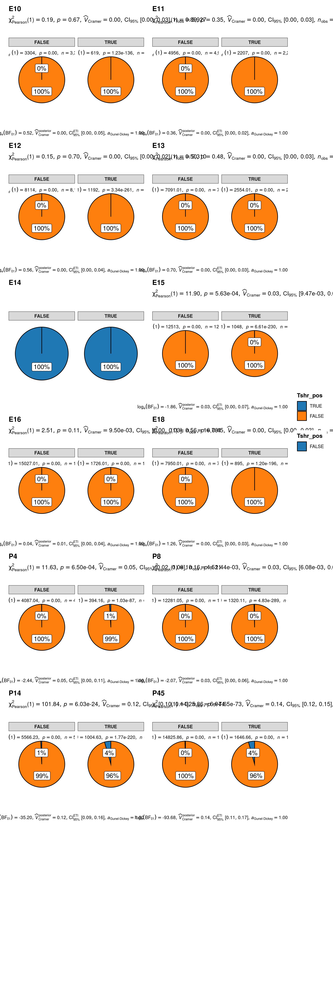{fig-align='center' width=960}
:::
:::


## Calculate and plot hexagonal cells representation in hypothalamus across different developmental stages with meta information


::: {.cell layout-align="center"}

```{.r .cell-code .hidden}
srt
```

::: {.cell-output .cell-output-stdout}

```
An object of class Seurat 
27998 features across 128006 samples within 1 assay 
Active assay: RNA (27998 features, 3000 variable features)
 3 layers present: counts, data, scale.data
 3 dimensional reductions calculated: umap, ref.pca, ref.umap
```


:::
:::

::: {.cell layout-align="center"}

```{.r .cell-code .hidden}
library(hexbin)
# Extract UMAP coordinates
umap_coords <- Embeddings(srt, reduction = "ref.umap")

# Create hexbin object
hb <- hexbin(umap_coords[, 1], umap_coords[, 2], xbins = 64)

# Create a data frame for plotting
hex_data <- data.frame(
  x = hcell2xy(hb)$x,
  y = hcell2xy(hb)$y,
  count = hb@count
)

# Create the plot
ggplot(hex_data, aes(x = x, y = y, fill = count)) +
  geom_hex(stat = "identity") +
  scale_fill_gradientn(colors = ggsci::pal_material("amber")(9)) +
  theme_minimal() +
  labs(x = "UMAP_1", y = "UMAP_2", fill = "Cell\nCount") +
  coord_fixed()
```

::: {.cell-output-display}
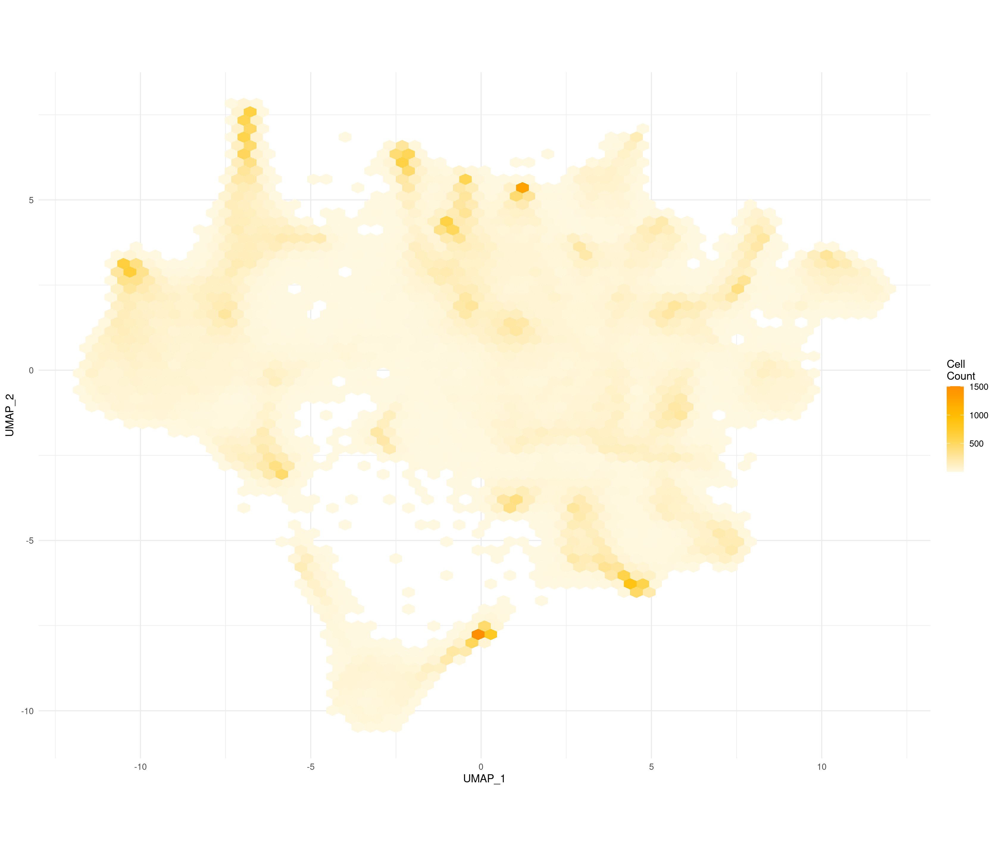{fig-align='center' width=1680}
:::
:::

::: {.cell layout-align="center"}

```{.r .cell-code .hidden}
#| label: plot-feature-kim2020
#| fig-width: 32
#| fig-height: 36
FeaturePlot(
  srt,
  features = c(
    "Tshb", "Cck", "Pitx1",
    "Eya1", "Eya2", "Eya3", "Eya4",
    "Sox2", "Hlf", "Tshr",
    "Cckar", "Cckbr", "Gpr173",
    "Foxl2", "Lhx3", "Lhx4", "Pit1", "Gata2"
  ),
  reduction = "ref.umap",
  label = F,
  blend = F,
  order = TRUE,
  pt.size = 1.2,
  raster.dpi = c(1024, 1024),
  alpha = 0.5,
  split.by = "Age"
)
```

::: {.cell-output .cell-output-stderr .hidden}

```
Warning: The following requested variables were not found: Pit1
```


:::

::: {.cell-output .cell-output-stderr .hidden}

```
Warning: All cells have the same value (0) of "Tshb"
```


:::

::: {.cell-output .cell-output-stderr .hidden}

```
Warning: All cells have the same value (0) of "Cck"
```


:::

::: {.cell-output .cell-output-stderr .hidden}

```
Warning: All cells have the same value (0) of "Cckar"
```


:::

::: {.cell-output .cell-output-stderr .hidden}

```
Warning: All cells have the same value (0) of "Cckbr"
```


:::

::: {.cell-output .cell-output-stderr .hidden}

```
Warning: All cells have the same value (0) of "Foxl2"
```


:::

::: {.cell-output .cell-output-stderr .hidden}

```
Warning: All cells have the same value (0) of "Tshb"
```


:::

::: {.cell-output .cell-output-stderr .hidden}

```
Warning: All cells have the same value (0) of "Cckbr"
```


:::

::: {.cell-output .cell-output-stderr .hidden}

```
Warning: All cells have the same value (0) of "Foxl2"
```


:::

::: {.cell-output .cell-output-stderr .hidden}

```
Warning: All cells have the same value (0) of "Pitx1"
```


:::

::: {.cell-output .cell-output-stderr .hidden}

```
Warning: All cells have the same value (0) of "Foxl2"
```


:::

::: {.cell-output .cell-output-stderr .hidden}

```
Warning: All cells have the same value (0) of "Lhx4"
```


:::

::: {.cell-output .cell-output-stderr .hidden}

```
Warning: All cells have the same value (0) of "Cckbr"
```


:::

::: {.cell-output .cell-output-stderr .hidden}

```
Warning: All cells have the same value (0) of "Foxl2"
```


:::

::: {.cell-output .cell-output-stderr .hidden}

```
Warning: All cells have the same value (0) of "Lhx3"
```


:::

::: {.cell-output .cell-output-stderr .hidden}

```
Warning: All cells have the same value (0) of "Lhx4"
```


:::

::: {.cell-output .cell-output-stderr .hidden}

```
Warning: All cells have the same value (0) of "Tshr"
```


:::

::: {.cell-output .cell-output-stderr .hidden}

```
Warning: All cells have the same value (0) of "Foxl2"
```


:::

::: {.cell-output .cell-output-stderr .hidden}

```
Warning: All cells have the same value (0) of "Lhx3"
```


:::

::: {.cell-output .cell-output-stderr .hidden}

```
Warning: All cells have the same value (0) of "Tshb"
```


:::

::: {.cell-output .cell-output-stderr .hidden}

```
Warning: All cells have the same value (0) of "Pitx1"
```


:::

::: {.cell-output .cell-output-stderr .hidden}

```
Warning: All cells have the same value (0) of "Foxl2"
```


:::

::: {.cell-output .cell-output-stderr .hidden}

```
Warning: All cells have the same value (0) of "Lhx3"
```


:::

::: {.cell-output .cell-output-stderr .hidden}

```
Warning: All cells have the same value (0) of "Pitx1"
```


:::

::: {.cell-output .cell-output-stderr .hidden}

```
Warning: All cells have the same value (0) of "Foxl2"
```


:::

::: {.cell-output .cell-output-stderr .hidden}

```
Warning: All cells have the same value (0) of "Lhx3"
```


:::

::: {.cell-output .cell-output-stderr .hidden}

```
Warning: All cells have the same value (0) of "Pitx1"
```


:::

::: {.cell-output .cell-output-stderr .hidden}

```
Warning: All cells have the same value (0) of "Foxl2"
```


:::

::: {.cell-output .cell-output-stderr .hidden}

```
Warning: All cells have the same value (0) of "Lhx3"
```


:::

::: {.cell-output .cell-output-stderr .hidden}

```
Warning: All cells have the same value (0) of "Lhx4"
```


:::

::: {.cell-output .cell-output-stderr .hidden}

```
Warning: All cells have the same value (0) of "Foxl2"
```


:::

::: {.cell-output .cell-output-stderr .hidden}

```
Warning: All cells have the same value (0) of "Lhx4"
```


:::

::: {.cell-output .cell-output-stderr .hidden}

```
Warning: All cells have the same value (0) of "Foxl2"
```


:::

::: {.cell-output .cell-output-stderr .hidden}

```
Warning: All cells have the same value (0) of "Lhx4"
```


:::

::: {.cell-output .cell-output-stderr .hidden}

```
Warning: All cells have the same value (0) of "Foxl2"
```


:::

::: {.cell-output .cell-output-stderr .hidden}

```
Warning: All cells have the same value (0) of "Lhx4"
```


:::

::: {.cell-output-display}
{fig-align='center' width=3840}
:::
:::

::: {.cell layout-align="center"}

```{.r .cell-code .hidden}
#| label: plot-prediction-scores-kim2020
#| fig-width: 21
#| fig-height: 5
Idents(srt) <- "predicted.id"
FeaturePlot(
  srt,
  features = c(
    "prediction.score.38",
    "prediction.score.42",
    "prediction.score.45"
  ),
  reduction = "ref.umap",
  label = T,
  repel = T,
  blend = F,
  order = TRUE,
  pt.size = 4,
  raster.dpi = c(1024, 1024),
  alpha = 0.8,
  max.cutoff = "q90",
  ncol = 3
)
```

::: {.cell-output .cell-output-stderr .hidden}

```
Rasterizing points since number of points exceeds 100,000.
To disable this behavior set `raster=FALSE`
Rasterizing points since number of points exceeds 100,000.
To disable this behavior set `raster=FALSE`
```


:::

::: {.cell-output .cell-output-stderr .hidden}

```
Warning: All cells have the same value (0) of "prediction.score.42"
```


:::

::: {.cell-output .cell-output-stderr .hidden}

```
Rasterizing points since number of points exceeds 100,000.
To disable this behavior set `raster=FALSE`
```


:::

::: {.cell-output-display}
{fig-align='center' width=2520}
:::
:::

::: {.cell layout-align="center"}

```{.r .cell-code .hidden}
#| label: plot-prediction-scores-split-kim2020
#| fig-width: 32
#| fig-height: 6.353
FeaturePlot(
  srt,
  features = c(
    "prediction.score.38",
    "prediction.score.42",
    "prediction.score.45"
  ),
  reduction = "ref.umap",
  label = F,
  blend = F,
  order = TRUE,
  pt.size = 1.2,
  raster.dpi = c(1024, 1024),
  alpha = 0.8,
  max.cutoff = "q90",
  split.by = "Age"
)
```

::: {.cell-output .cell-output-stderr .hidden}

```
Warning: All cells have the same value (0) of "prediction.score.42"
All cells have the same value (0) of "prediction.score.42"
All cells have the same value (0) of "prediction.score.42"
All cells have the same value (0) of "prediction.score.42"
All cells have the same value (0) of "prediction.score.42"
All cells have the same value (0) of "prediction.score.42"
All cells have the same value (0) of "prediction.score.42"
All cells have the same value (0) of "prediction.score.42"
All cells have the same value (0) of "prediction.score.42"
All cells have the same value (0) of "prediction.score.42"
All cells have the same value (0) of "prediction.score.42"
All cells have the same value (0) of "prediction.score.42"
```


:::

::: {.cell-output-display}
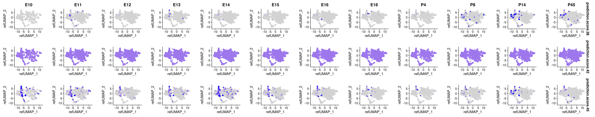{fig-align='center' width=3840}
:::
:::

::: {.cell layout-align="center"}

```{.r .cell-code .hidden}
#| label: plot-prediction-id-kim2020
#| fig-width: 7
#| fig-height: 5
DimPlot(
  srt,
  group.by = c("predicted.id"),
  reduction = "ref.umap",
  label = T,
  repel = T,
  pt.size = 4,
  raster.dpi = c(1024, 1024),
  alpha = 0.5
)
```

::: {.cell-output .cell-output-stderr .hidden}

```
Rasterizing points since number of points exceeds 100,000.
To disable this behavior set `raster=FALSE`
```


:::

::: {.cell-output-display}
{fig-align='center' width=840}
:::
:::

::: {.cell layout-align="center"}

```{.r .cell-code .hidden}
#| label: plot-prediction-split-kim2020
#| fig-width: 32
#| fig-height: 2.12
DimPlot(
  srt,
  group.by = c("predicted.id"),
  reduction = "ref.umap",
  label = T,
  repel = T,
  pt.size = 1.2,
  raster.dpi = c(1024, 1024),
  alpha = 0.5,
  split.by = "Age"
) + NoLegend()
```

::: {.cell-output .cell-output-stderr .hidden}

```
Rasterizing points since number of points exceeds 100,000.
To disable this behavior set `raster=FALSE`
```


:::

::: {.cell-output-display}
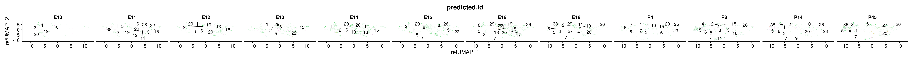{fig-align='center' width=3840}
:::
:::


## Quantify and plot hexagon representation of feature interactions with Spearman’s correlation

### Tshb and Eya3 correlation in hypothalamus across different developmental stages


::: {.cell layout-align="center"}

```{.r .cell-code .hidden}
#| label: plot-feature-Tshb-Eya3-e10
#| fig-width: 12
#| fig-height: 6
FeaturePlot(srt |> subset(Age == "E10"),
  features = c("Tshb", "Eya3"),
  reduction = "ref.umap", blend = F, blend.threshold = 0.3, order = TRUE, pt.size = 2, raster.dpi = c(1024, 1024), alpha = 0.5
)
```

::: {.cell-output .cell-output-stderr .hidden}

```
Warning: All cells have the same value (0) of "Tshb"
```


:::

::: {.cell-output-display}
{fig-align='center' width=1440}
:::
:::

::: {.cell layout-align="center"}

```{.r .cell-code .hidden}
#| label: plot-feature-Tshb-Eya3-e11
#| fig-width: 12
#| fig-height: 6
FeaturePlot(srt |> subset(Age == "E11"),
  features = c("Tshb", "Eya3"),
  reduction = "ref.umap", blend = F, blend.threshold = 0.3, order = TRUE, pt.size = 2, raster.dpi = c(1024, 1024), alpha = 0.5
)
```

::: {.cell-output .cell-output-stderr .hidden}

```
Warning: All cells have the same value (0) of "Tshb"
```


:::

::: {.cell-output-display}
{fig-align='center' width=1440}
:::
:::

::: {.cell layout-align="center"}

```{.r .cell-code .hidden}
#| label: plot-feature-Tshb-Eya3-e12
#| fig-width: 24
#| fig-height: 6
FeaturePlot(srt |> subset(Age == "E12"),
  features = c("Tshb", "Eya3"),
  reduction = "ref.umap",
  blend = TRUE,
  blend.threshold = 0.4,
  max.cutoff = "q95",
  pt.size = 1.5,
  cols = c("grey98", "red", "blue"),
  order = T,
  alpha = 0.35,
  raster.dpi = c(1024, 1024)
)
```

::: {.cell-output-display}
{fig-align='center' width=2880}
:::
:::

::: {.cell layout-align="center"}

```{.r .cell-code .hidden}
#| label: plot-feature-Tshb-Eya3-e13
#| fig-width: 24
#| fig-height: 6
FeaturePlot(srt |> subset(Age == "E13"),
  features = c("Tshb", "Eya3"),
  reduction = "ref.umap",
  blend = TRUE,
  blend.threshold = 0.4,
  max.cutoff = "q95",
  pt.size = 1.5,
  cols = c("grey98", "red", "blue"),
  order = T,
  alpha = 0.35,
  raster.dpi = c(1024, 1024)
)
```

::: {.cell-output-display}
{fig-align='center' width=2880}
:::
:::

::: {.cell layout-align="center"}

```{.r .cell-code .hidden}
#| label: plot-feature-Tshb-Eya3-e14
#| fig-width: 24
#| fig-height: 6
FeaturePlot(
  srt |> subset(Age == "E14"),
  features = c("Tshb", "Eya3"),
  reduction = "ref.umap",
  blend = TRUE,
  blend.threshold = 0.4,
  max.cutoff = "q95",
  pt.size = 1.5,
  cols = c("grey98", "red", "blue"),
  order = T,
  alpha = 0.35,
  raster.dpi = c(1024, 1024)
)
```

::: {.cell-output-display}
{fig-align='center' width=2880}
:::
:::

::: {.cell layout-align="center"}

```{.r .cell-code .hidden}
#| label: plot-feature-Tshb-Eya3-e15
#| fig-width: 12
#| fig-height: 6
FeaturePlot(srt |> subset(Age == "E15"),
  features = c("Tshb", "Eya3"),
  reduction = "ref.umap", blend = F, blend.threshold = 0.3, order = TRUE, pt.size = 2, raster.dpi = c(1024, 1024), alpha = 0.5
)
```

::: {.cell-output .cell-output-stderr .hidden}

```
Warning: All cells have the same value (0) of "Tshb"
```


:::

::: {.cell-output-display}
{fig-align='center' width=1440}
:::
:::

::: {.cell layout-align="center"}

```{.r .cell-code .hidden}
#| label: plot-feature-Tshb-Eya3-e16
#| fig-width: 24
#| fig-height: 6
FeaturePlot(srt |> subset(Age == "E16"),
  features = c("Tshb", "Eya3"),
  reduction = "ref.umap",
  blend = TRUE,
  blend.threshold = 0.4,
  max.cutoff = "q95",
  pt.size = 1.5,
  cols = c("grey98", "red", "blue"),
  order = T,
  alpha = 0.35,
  raster.dpi = c(1024, 1024)
)
```

::: {.cell-output-display}
{fig-align='center' width=2880}
:::
:::

::: {.cell layout-align="center"}

```{.r .cell-code .hidden}
#| label: plot-feature-Tshb-Eya3-e18
#| fig-width: 24
#| fig-height: 6
FeaturePlot(srt |> subset(Age == "E18"),
  features = c("Tshb", "Eya3"),
  reduction = "ref.umap",
  blend = TRUE,
  blend.threshold = 0.4,
  max.cutoff = "q95",
  pt.size = 1.5,
  cols = c("grey98", "red", "blue"),
  order = T,
  alpha = 0.35,
  raster.dpi = c(1024, 1024)
)
```

::: {.cell-output-display}
{fig-align='center' width=2880}
:::
:::

::: {.cell layout-align="center"}

```{.r .cell-code .hidden}
#| label: plot-feature-Tshb-Eya3-p8
#| fig-width: 24
#| fig-height: 6
FeaturePlot(srt |> subset(Age == "P8"),
  features = c("Tshb", "Eya3"),
  reduction = "ref.umap",
  blend = TRUE,
  blend.threshold = 0.4,
  max.cutoff = "q95",
  pt.size = 1.5,
  cols = c("grey98", "red", "blue"),
  order = T,
  alpha = 0.35,
  raster.dpi = c(1024, 1024)
)
```

::: {.cell-output-display}
{fig-align='center' width=2880}
:::
:::

::: {.cell layout-align="center"}

```{.r .cell-code .hidden}
#| label: plot-feature-Tshb-Eya3-p45
#| fig-width: 24
#| fig-height: 6
FeaturePlot(srt |> subset(Age == "P45"),
  features = c("Tshb", "Eya3"),
  reduction = "ref.umap",
  blend = TRUE,
  blend.threshold = 0.4,
  max.cutoff = "q95",
  pt.size = 1.5,
  cols = c("grey98", "red", "blue"),
  order = T,
  alpha = 0.35,
  raster.dpi = c(1024, 1024)
)
```

::: {.cell-output-display}
{fig-align='center' width=2880}
:::
:::


### Tshb and Pitx1 correlation in hypothalamus across different developmental stages


::: {.cell layout-align="center"}

```{.r .cell-code .hidden}
#| label: plot-feature-Tshb-Pitx1-e10
#| fig-width: 12
#| fig-height: 6
FeaturePlot(srt |> subset(Age == "E10"),
  features = c("Tshb", "Pitx1"),
  reduction = "ref.umap", blend = F, blend.threshold = 0.3, order = TRUE, pt.size = 2, raster.dpi = c(1024, 1024), alpha = 0.5
)
```

::: {.cell-output .cell-output-stderr .hidden}

```
Warning: All cells have the same value (0) of "Tshb"
```


:::

::: {.cell-output-display}
{fig-align='center' width=1440}
:::
:::

::: {.cell layout-align="center"}

```{.r .cell-code .hidden}
#| label: plot-feature-Tshb-Pitx1-e11
#| fig-width: 12
#| fig-height: 6
FeaturePlot(srt |> subset(Age == "E11"),
  features = c("Tshb", "Pitx1"),
  reduction = "ref.umap", blend = F, blend.threshold = 0.3, order = TRUE, pt.size = 2, raster.dpi = c(1024, 1024), alpha = 0.5
)
```

::: {.cell-output .cell-output-stderr .hidden}

```
Warning: All cells have the same value (0) of "Tshb"
```


:::

::: {.cell-output-display}
{fig-align='center' width=1440}
:::
:::

::: {.cell layout-align="center"}

```{.r .cell-code .hidden}
#| label: plot-feature-Tshb-Pitx1-e12
#| fig-width: 12
#| fig-height: 6
FeaturePlot(srt |> subset(Age == "E12"),
  features = c("Tshb", "Pitx1"),
  reduction = "ref.umap", blend = F, blend.threshold = 0.3, order = TRUE, pt.size = 2, raster.dpi = c(1024, 1024), alpha = 0.5
)
```

::: {.cell-output .cell-output-stderr .hidden}

```
Warning: All cells have the same value (0) of "Pitx1"
```


:::

::: {.cell-output-display}
{fig-align='center' width=1440}
:::
:::

::: {.cell layout-align="center"}

```{.r .cell-code .hidden}
#| label: plot-feature-Tshb-Pitx1-e13
#| fig-width: 24
#| fig-height: 6
FeaturePlot(srt |> subset(Age == "E13"),
  features = c("Tshb", "Pitx1"),
  reduction = "ref.umap",
  blend = TRUE,
  blend.threshold = 0.4,
  max.cutoff = "q95",
  pt.size = 1.5,
  cols = c("grey98", "red", "blue"),
  order = T,
  alpha = 0.35,
  raster.dpi = c(1024, 1024)
)
```

::: {.cell-output-display}
{fig-align='center' width=2880}
:::
:::

::: {.cell layout-align="center"}

```{.r .cell-code .hidden}
#| label: plot-feature-Tshb-Pitx1-e14
#| fig-width: 24
#| fig-height: 6
FeaturePlot(srt |> subset(Age == "E14"),
  features = c("Tshb", "Pitx1"),
  reduction = "ref.umap",
  blend = TRUE,
  blend.threshold = 0.4,
  max.cutoff = "q95",
  pt.size = 1.5,
  cols = c("grey98", "red", "blue"),
  order = T,
  alpha = 0.35,
  raster.dpi = c(1024, 1024)
)
```

::: {.cell-output-display}
{fig-align='center' width=2880}
:::
:::

::: {.cell layout-align="center"}

```{.r .cell-code .hidden}
#| label: plot-feature-Tshb-Pitx1-e15
#| fig-width: 12
#| fig-height: 6
FeaturePlot(srt |> subset(Age == "E15"),
  features = c("Tshb", "Pitx1"),
  reduction = "ref.umap", blend = F, blend.threshold = 0.3, order = TRUE, pt.size = 2, raster.dpi = c(1024, 1024), alpha = 0.5
)
```

::: {.cell-output .cell-output-stderr .hidden}

```
Warning: All cells have the same value (0) of "Tshb"
```


:::

::: {.cell-output .cell-output-stderr .hidden}

```
Warning: All cells have the same value (0) of "Pitx1"
```


:::

::: {.cell-output-display}
{fig-align='center' width=1440}
:::
:::

::: {.cell layout-align="center"}

```{.r .cell-code .hidden}
#| label: plot-feature-Tshb-Pitx1-e16
#| fig-width: 12
#| fig-height: 6
FeaturePlot(srt |> subset(Age == "E16"),
  features = c("Tshb", "Pitx1"),
  reduction = "ref.umap", blend = F, blend.threshold = 0.3, order = TRUE, pt.size = 2, raster.dpi = c(1024, 1024), alpha = 0.5
)
```

::: {.cell-output .cell-output-stderr .hidden}

```
Warning: All cells have the same value (0) of "Pitx1"
```


:::

::: {.cell-output-display}
{fig-align='center' width=1440}
:::
:::

::: {.cell layout-align="center"}

```{.r .cell-code .hidden}
#| label: plot-feature-Tshb-Pitx1-e18
#| fig-width: 12
#| fig-height: 6
FeaturePlot(srt |> subset(Age == "E18"),
  features = c("Tshb", "Pitx1"),
  reduction = "ref.umap", blend = F, blend.threshold = 0.3, order = TRUE, pt.size = 2, raster.dpi = c(1024, 1024), alpha = 0.5
)
```

::: {.cell-output .cell-output-stderr .hidden}

```
Warning: All cells have the same value (0) of "Pitx1"
```


:::

::: {.cell-output-display}
{fig-align='center' width=1440}
:::
:::

::: {.cell layout-align="center"}

```{.r .cell-code .hidden}
#| label: plot-feature-Tshb-Pitx1-p8
#| fig-width: 24
#| fig-height: 6
FeaturePlot(srt |> subset(Age == "P8"),
  features = c("Tshb", "Pitx1"),
  reduction = "ref.umap",
  blend = TRUE,
  blend.threshold = 0.4,
  max.cutoff = "q95",
  pt.size = 1.5,
  cols = c("grey98", "red", "blue"),
  order = T,
  alpha = 0.35,
  raster.dpi = c(1024, 1024)
)
```

::: {.cell-output-display}
{fig-align='center' width=2880}
:::
:::

::: {.cell layout-align="center"}

```{.r .cell-code .hidden}
#| label: plot-feature-Tshb-Pitx1-p45
#| fig-width: 24
#| fig-height: 6
FeaturePlot(srt |> subset(Age == "P45"),
  features = c("Tshb", "Pitx1"),
  reduction = "ref.umap",
  blend = TRUE,
  blend.threshold = 0.4,
  max.cutoff = "q95",
  pt.size = 1.5,
  cols = c("grey98", "red", "blue"),
  order = T,
  alpha = 0.35,
  raster.dpi = c(1024, 1024)
)
```

::: {.cell-output-display}
{fig-align='center' width=2880}
:::
:::


### Cck and Eya3 correlation in hypothalamus across different developmental stages


::: {.cell layout-align="center"}

```{.r .cell-code .hidden}
#| label: plot-feature-Cck-Eya3-e10
#| fig-width: 24
#| fig-height: 6
# FeaturePlot(srt |> subset(Age == "E10"), features = c("Cck", "Eya3"),
#   reduction = "ref.umap", blend = TRUE, blend.threshold = 0.3, order = TRUE, pt.size = 2, raster.dpi = c(1024, 1024), alpha = 0.5)
#
# Error in `FeaturePlot()`:
# ! The following features have no value: Cck
```
:::

::: {.cell layout-align="center"}

```{.r .cell-code .hidden}
#| label: plot-feature-Cck-Eya3-e11
#| fig-width: 24
#| fig-height: 6
FeaturePlot(srt |> subset(Age == "E11"),
  features = c("Cck", "Eya3"),
  reduction = "ref.umap",
  blend = TRUE,
  blend.threshold = 0.4,
  max.cutoff = "q95",
  pt.size = 1.5,
  cols = c("grey98", "red", "blue"),
  order = T,
  alpha = 0.35,
  raster.dpi = c(1024, 1024)
)
```

::: {.cell-output-display}
{fig-align='center' width=2880}
:::
:::

::: {.cell layout-align="center"}

```{.r .cell-code .hidden}
#| label: plot-feature-Cck-Eya3-e12
#| fig-width: 24
#| fig-height: 6
FeaturePlot(srt |> subset(Age == "E12"),
  features = c("Cck", "Eya3"),
  reduction = "ref.umap",
  blend = TRUE,
  blend.threshold = 0.4,
  max.cutoff = "q95",
  pt.size = 1.5,
  cols = c("grey98", "red", "blue"),
  order = T,
  alpha = 0.35,
  raster.dpi = c(1024, 1024)
)
```

::: {.cell-output-display}
{fig-align='center' width=2880}
:::
:::

::: {.cell layout-align="center"}

```{.r .cell-code .hidden}
#| label: plot-feature-Cck-Eya3-e13
#| fig-width: 24
#| fig-height: 6
FeaturePlot(srt |> subset(Age == "E13"),
  features = c("Cck", "Eya3"),
  reduction = "ref.umap",
  blend = TRUE,
  blend.threshold = 0.4,
  max.cutoff = "q95",
  pt.size = 1.5,
  cols = c("grey98", "red", "blue"),
  order = T,
  alpha = 0.35,
  raster.dpi = c(1024, 1024)
)
```

::: {.cell-output-display}
{fig-align='center' width=2880}
:::
:::

::: {.cell layout-align="center"}

```{.r .cell-code .hidden}
#| label: plot-feature-Cck-Eya3-e14
#| fig-width: 24
#| fig-height: 6
FeaturePlot(srt |> subset(Age == "E14"),
  features = c("Cck", "Eya3"),
  reduction = "ref.umap",
  blend = TRUE,
  blend.threshold = 0.4,
  max.cutoff = "q95",
  pt.size = 1.5,
  cols = c("grey98", "red", "blue"),
  order = T,
  alpha = 0.35,
  raster.dpi = c(1024, 1024)
)
```

::: {.cell-output-display}
{fig-align='center' width=2880}
:::
:::

::: {.cell layout-align="center"}

```{.r .cell-code .hidden}
#| label: plot-feature-Cck-Eya3-e15
#| fig-width: 24
#| fig-height: 6
FeaturePlot(srt |> subset(Age == "E15"),
  features = c("Cck", "Eya3"),
  reduction = "ref.umap",
  blend = TRUE,
  blend.threshold = 0.4,
  max.cutoff = "q95",
  pt.size = 1.5,
  cols = c("grey98", "red", "blue"),
  order = T,
  alpha = 0.35,
  raster.dpi = c(1024, 1024)
)
```

::: {.cell-output-display}
{fig-align='center' width=2880}
:::
:::

::: {.cell layout-align="center"}

```{.r .cell-code .hidden}
#| label: plot-feature-Cck-Eya3-e16
#| fig-width: 24
#| fig-height: 6
FeaturePlot(srt |> subset(Age == "E16"),
  features = c("Cck", "Eya3"),
  reduction = "ref.umap",
  blend = TRUE,
  blend.threshold = 0.4,
  max.cutoff = "q95",
  pt.size = 1.5,
  cols = c("grey98", "red", "blue"),
  order = T,
  alpha = 0.35,
  raster.dpi = c(1024, 1024)
)
```

::: {.cell-output-display}
{fig-align='center' width=2880}
:::
:::

::: {.cell layout-align="center"}

```{.r .cell-code .hidden}
#| label: plot-feature-Cck-Eya3-e18
#| fig-width: 24
#| fig-height: 6
FeaturePlot(srt |> subset(Age == "E18"),
  features = c("Cck", "Eya3"),
  reduction = "ref.umap",
  blend = TRUE,
  blend.threshold = 0.4,
  max.cutoff = "q95",
  pt.size = 1.5,
  cols = c("grey98", "red", "blue"),
  order = T,
  alpha = 0.35,
  raster.dpi = c(1024, 1024)
)
```

::: {.cell-output-display}
{fig-align='center' width=2880}
:::
:::

::: {.cell layout-align="center"}

```{.r .cell-code .hidden}
#| label: plot-feature-Cck-Eya3-p8
#| fig-width: 24
#| fig-height: 6
FeaturePlot(srt |> subset(Age == "P8"),
  features = c("Cck", "Eya3"),
  reduction = "ref.umap",
  blend = TRUE,
  blend.threshold = 0.4,
  max.cutoff = "q95",
  pt.size = 1.5,
  cols = c("grey98", "red", "blue"),
  order = T,
  alpha = 0.35,
  raster.dpi = c(1024, 1024)
)
```

::: {.cell-output-display}
{fig-align='center' width=2880}
:::
:::

::: {.cell layout-align="center"}

```{.r .cell-code .hidden}
#| label: plot-feature-Cck-Eya3-p45
#| fig-width: 24
#| fig-height: 6
FeaturePlot(srt |> subset(Age == "P45"),
  features = c("Cck", "Eya3"),
  reduction = "ref.umap",
  blend = TRUE,
  blend.threshold = 0.4,
  max.cutoff = "q95",
  pt.size = 1.5,
  cols = c("grey98", "red", "blue"),
  order = T,
  alpha = 0.35,
  raster.dpi = c(1024, 1024)
)
```

::: {.cell-output-display}
{fig-align='center' width=2880}
:::
:::


### Pitx1 and Cck


::: {.cell layout-align="center"}

```{.r .cell-code .hidden}
#| label: plot-feature-Cck-Pitx1-e10
#| fig-width: 12
#| fig-height: 6
FeaturePlot(srt |> subset(Age == "E10"),
  features = c("Cck", "Pitx1"),
  reduction = "ref.umap", blend = F, blend.threshold = 0.3, order = TRUE, pt.size = 2, raster.dpi = c(1024, 1024), alpha = 0.5
)
```

::: {.cell-output .cell-output-stderr .hidden}

```
Warning: All cells have the same value (0) of "Cck"
```


:::

::: {.cell-output-display}
{fig-align='center' width=1440}
:::
:::

::: {.cell layout-align="center"}

```{.r .cell-code .hidden}
#| label: plot-feature-Cck-Pitx1-e11
#| fig-width: 12
#| fig-height: 6
FeaturePlot(srt |> subset(Age == "E11"),
  features = c("Cck", "Pitx1"),
  reduction = "ref.umap", blend = F, blend.threshold = 0.3, order = TRUE, pt.size = 2, raster.dpi = c(1024, 1024), alpha = 0.5
)
```

::: {.cell-output-display}
{fig-align='center' width=1440}
:::
:::

::: {.cell layout-align="center"}

```{.r .cell-code .hidden}
#| label: plot-feature-Cck-Pitx1-e12
#| fig-width: 12
#| fig-height: 6
FeaturePlot(srt |> subset(Age == "E12"),
  features = c("Cck", "Pitx1"),
  reduction = "ref.umap", blend = F, blend.threshold = 0.3, order = TRUE, pt.size = 2, raster.dpi = c(1024, 1024), alpha = 0.5
)
```

::: {.cell-output .cell-output-stderr .hidden}

```
Warning: All cells have the same value (0) of "Pitx1"
```


:::

::: {.cell-output-display}
{fig-align='center' width=1440}
:::
:::

::: {.cell layout-align="center"}

```{.r .cell-code .hidden}
#| label: plot-feature-Cck-Pitx1-e13
#| fig-width: 24
#| fig-height: 6
FeaturePlot(srt |> subset(Age == "E13"),
  features = c("Cck", "Pitx1"),
  reduction = "ref.umap",
  blend = TRUE,
  blend.threshold = 0.4,
  max.cutoff = "q95",
  pt.size = 1.5,
  cols = c("grey98", "red", "blue"),
  order = T,
  alpha = 0.35,
  raster.dpi = c(1024, 1024)
)
```

::: {.cell-output-display}
{fig-align='center' width=2880}
:::
:::

::: {.cell layout-align="center"}

```{.r .cell-code .hidden}
#| label: plot-feature-Cck-Pitx1-e14
#| fig-width: 24
#| fig-height: 6
FeaturePlot(srt |> subset(Age == "E14"),
  features = c("Cck", "Pitx1"),
  reduction = "ref.umap",
  blend = TRUE,
  blend.threshold = 0.4,
  max.cutoff = "q95",
  pt.size = 1.5,
  cols = c("grey98", "red", "blue"),
  order = T,
  alpha = 0.35,
  raster.dpi = c(1024, 1024)
)
```

::: {.cell-output-display}
{fig-align='center' width=2880}
:::
:::

::: {.cell layout-align="center"}

```{.r .cell-code .hidden}
#| label: plot-feature-Cck-Pitx1-e15
#| fig-width: 24
#| fig-height: 6
# FeaturePlot(srt |> subset(Age == "E15"), features = c("Cck", "Pitx1"),
#   reduction = "ref.umap", blend = TRUE, blend.threshold = 0.3, order = TRUE, pt.size = 2, raster.dpi = c(1024, 1024), alpha = 0.5)
#
# Error in `FeaturePlot()`:
# ! The following features have no value: Pitx1
```
:::

::: {.cell layout-align="center"}

```{.r .cell-code .hidden}
#| label: plot-feature-Cck-Pitx1-e16
#| fig-width: 24
#| fig-height: 6
# FeaturePlot(srt |> subset(Age == "E16"), features = c("Cck", "Pitx1"),
#   reduction = "ref.umap", blend = TRUE, blend.threshold = 0.3, order = TRUE, pt.size = 2, raster.dpi = c(1024, 1024), alpha = 0.5)
#
# Error in `FeaturePlot()`:
# ! The following features have no value: Pitx1
```
:::

::: {.cell layout-align="center"}

```{.r .cell-code .hidden}
#| label: plot-feature-Cck-Pitx1-e18
#| fig-width: 24
#| fig-height: 6
# FeaturePlot(srt |> subset(Age == "E18"), features = c("Cck", "Pitx1"),
#   reduction = "ref.umap", blend = TRUE, blend.threshold = 0.3, order = TRUE, pt.size = 2, raster.dpi = c(1024, 1024), alpha = 0.5)
#
# Error in `FeaturePlot()`:
# ! The following features have no value: Pitx1
```
:::

::: {.cell layout-align="center"}

```{.r .cell-code .hidden}
#| label: plot-feature-Cck-Pitx1-p8
#| fig-width: 24
#| fig-height: 6
FeaturePlot(srt |> subset(Age == "P8"),
  features = c("Cck", "Pitx1"),
  reduction = "ref.umap",
  blend = TRUE,
  blend.threshold = 0.4,
  max.cutoff = "q95",
  pt.size = 1.5,
  cols = c("grey98", "red", "blue"),
  order = T,
  alpha = 0.35,
  raster.dpi = c(1024, 1024)
)
```

::: {.cell-output-display}
{fig-align='center' width=2880}
:::
:::

::: {.cell layout-align="center"}

```{.r .cell-code .hidden}
#| label: plot-feature-Cck-Pitx1-p45
#| fig-width: 24
#| fig-height: 6
FeaturePlot(srt |> subset(Age == "P45"),
  features = c("Cck", "Pitx1"),
  reduction = "ref.umap",
  blend = TRUE,
  blend.threshold = 0.4,
  max.cutoff = "q95",
  pt.size = 1.5,
  cols = c("grey98", "red", "blue"),
  order = T,
  alpha = 0.35,
  raster.dpi = c(1024, 1024)
)
```

::: {.cell-output-display}
{fig-align='center' width=2880}
:::
:::


### Tsh


::: {.cell layout-align="center"}

```{.r .cell-code .hidden}
#| label: plot-feature-sox2-Tshb-e10
#| fig-width: 24
#| fig-height: 6
# FeaturePlot(srt |> subset(Age == "E10"), features = c("Sox2", "Tshb"),
#   reduction = "ref.umap", blend = TRUE, blend.threshold = 0.3, order = TRUE, pt.size = 2, raster.dpi = c(1024, 1024), alpha = 0.5)
#
# Error in `FeaturePlot()`:
# ! The following features have no value: Tshb
```
:::

::: {.cell layout-align="center"}

```{.r .cell-code .hidden}
#| label: plot-feature-sox2-Tshb-e11
#| fig-width: 24
#| fig-height: 6
# FeaturePlot(srt |> subset(Age == "E11"), features = c("Sox2", "Tshb"),
#   reduction = "ref.umap", blend = TRUE, blend.threshold = 0.3, order = TRUE, pt.size = 2, raster.dpi = c(1024, 1024), alpha = 0.5)
#
# Error in `FeaturePlot()`:
# ! The following features have no value: Tshb
```
:::

::: {.cell layout-align="center"}

```{.r .cell-code .hidden}
#| label: plot-feature-sox2-Tshb-e12
#| fig-width: 24
#| fig-height: 6
FeaturePlot(srt |> subset(Age == "E12"),
  features = c("Sox2", "Tshb"),
  reduction = "ref.umap",
  blend = TRUE,
  blend.threshold = 0.4,
  max.cutoff = "q95",
  pt.size = 1.5,
  cols = c("grey98", "red", "blue"),
  order = T,
  alpha = 0.35,
  raster.dpi = c(1024, 1024)
)
```

::: {.cell-output-display}
{fig-align='center' width=2880}
:::
:::

::: {.cell layout-align="center"}

```{.r .cell-code .hidden}
#| label: plot-feature-sox2-Tshb-e13
#| fig-width: 24
#| fig-height: 6
FeaturePlot(srt |> subset(Age == "E13"),
  features = c("Sox2", "Tshb"),
  reduction = "ref.umap",
  blend = TRUE,
  blend.threshold = 0.4,
  max.cutoff = "q95",
  pt.size = 1.5,
  cols = c("grey98", "red", "blue"),
  order = T,
  alpha = 0.35,
  raster.dpi = c(1024, 1024)
)
```

::: {.cell-output-display}
{fig-align='center' width=2880}
:::
:::

::: {.cell layout-align="center"}

```{.r .cell-code .hidden}
#| label: plot-feature-sox2-Tshb-e14
#| fig-width: 12
#| fig-height: 6
FeaturePlot(srt |> subset(Age == "E14"),
  features = c("Sox2", "Tshb"),
  reduction = "ref.umap", blend = F, label = TRUE, order = TRUE, pt.size = 2, raster.dpi = c(1024, 1024), alpha = 0.5
)
```

::: {.cell-output-display}
{fig-align='center' width=1440}
:::
:::

::: {.cell layout-align="center"}

```{.r .cell-code .hidden}
#| label: plot-feature-sox2-Tshb-e15
#| fig-width: 24
#| fig-height: 6
# FeaturePlot(srt |> subset(Age == "E15"), features = c("Sox2", "Tshb"),
#   reduction = "ref.umap", blend = TRUE, blend.threshold = 0.3, order = TRUE, pt.size = 2, raster.dpi = c(1024, 1024), alpha = 0.5)
#
# Error in `FeaturePlot()`:
# ! The following features have no value: Tshb
```
:::

::: {.cell layout-align="center"}

```{.r .cell-code .hidden}
#| label: plot-feature-sox2-Tshb-e16
#| fig-width: 24
#| fig-height: 6
FeaturePlot(srt |> subset(Age == "E16"),
  features = c("Sox2", "Tshb"),
  reduction = "ref.umap",
  blend = TRUE,
  blend.threshold = 0.4,
  max.cutoff = "q95",
  pt.size = 1.5,
  cols = c("grey98", "red", "blue"),
  order = T,
  alpha = 0.35,
  raster.dpi = c(1024, 1024)
)
```

::: {.cell-output-display}
{fig-align='center' width=2880}
:::
:::

::: {.cell layout-align="center"}

```{.r .cell-code .hidden}
#| label: plot-feature-sox2-Tshb-e18
#| fig-width: 24
#| fig-height: 6
FeaturePlot(srt |> subset(Age == "E18"),
  features = c("Sox2", "Tshb"),
  reduction = "ref.umap",
  blend = TRUE,
  blend.threshold = 0.4,
  max.cutoff = "q95",
  pt.size = 1.5,
  cols = c("grey98", "red", "blue"),
  order = T,
  alpha = 0.35,
  raster.dpi = c(1024, 1024)
)
```

::: {.cell-output-display}
{fig-align='center' width=2880}
:::
:::

::: {.cell layout-align="center"}

```{.r .cell-code .hidden}
#| label: plot-feature-sox2-Tshb-p8
#| fig-width: 24
#| fig-height: 6
FeaturePlot(srt |> subset(Age == "P8"),
  features = c("Sox2", "Tshb"),
  reduction = "ref.umap",
  blend = TRUE,
  blend.threshold = 0.4,
  max.cutoff = "q95",
  pt.size = 1.5,
  cols = c("grey98", "red", "blue"),
  order = T,
  alpha = 0.35,
  raster.dpi = c(1024, 1024)
)
```

::: {.cell-output-display}
{fig-align='center' width=2880}
:::
:::

::: {.cell layout-align="center"}

```{.r .cell-code .hidden}
#| label: plot-feature-sox2-Tshb-p45
#| fig-width: 24
#| fig-height: 6
FeaturePlot(srt |> subset(Age == "P45"),
  features = c("Sox2", "Tshb"),
  reduction = "ref.umap",
  blend = TRUE,
  blend.threshold = 0.4,
  max.cutoff = "q95",
  pt.size = 1.5,
  cols = c("grey98", "red", "blue"),
  order = T,
  alpha = 0.35,
  raster.dpi = c(1024, 1024)
)
```

::: {.cell-output-display}
{fig-align='center' width=2880}
:::
:::


### Tsh


::: {.cell layout-align="center"}

```{.r .cell-code .hidden}
#| label: plot-feature-sox2-Cck-e10
#| fig-width: 24
#| fig-height: 6
# FeaturePlot(srt |> subset(Age == "E10"), features = c("Sox2", "Cck"),
#   reduction = "ref.umap", blend = TRUE, blend.threshold = 0.3, order = TRUE, pt.size = 2, raster.dpi = c(1024, 1024), alpha = 0.5)
#
# Error in `FeaturePlot()`:
# ! The following features have no value: Cck
```
:::

::: {.cell layout-align="center"}

```{.r .cell-code .hidden}
#| label: plot-feature-sox2-Cck-e11
#| fig-width: 24
#| fig-height: 6
FeaturePlot(srt |> subset(Age == "E11"),
  features = c("Sox2", "Cck"),
  reduction = "ref.umap",
  blend = TRUE,
  blend.threshold = 0.4,
  max.cutoff = "q95",
  pt.size = 1.5,
  cols = c("grey98", "red", "blue"),
  order = T,
  alpha = 0.35,
  raster.dpi = c(1024, 1024)
)
```

::: {.cell-output-display}
{fig-align='center' width=2880}
:::
:::

::: {.cell layout-align="center"}

```{.r .cell-code .hidden}
#| label: plot-feature-sox2-Cck-e12
#| fig-width: 24
#| fig-height: 6
FeaturePlot(srt |> subset(Age == "E12"),
  features = c("Sox2", "Cck"),
  reduction = "ref.umap",
  blend = TRUE,
  blend.threshold = 0.4,
  max.cutoff = "q95",
  pt.size = 1.5,
  cols = c("grey98", "red", "blue"),
  order = T,
  alpha = 0.35,
  raster.dpi = c(1024, 1024)
)
```

::: {.cell-output-display}
{fig-align='center' width=2880}
:::
:::

::: {.cell layout-align="center"}

```{.r .cell-code .hidden}
#| label: plot-feature-sox2-Cck-e13
#| fig-width: 24
#| fig-height: 6
FeaturePlot(srt |> subset(Age == "E13"),
  features = c("Sox2", "Cck"),
  reduction = "ref.umap",
  blend = TRUE,
  blend.threshold = 0.4,
  max.cutoff = "q95",
  pt.size = 1.5,
  cols = c("grey98", "red", "blue"),
  order = T,
  alpha = 0.35,
  raster.dpi = c(1024, 1024)
)
```

::: {.cell-output-display}
{fig-align='center' width=2880}
:::
:::

::: {.cell layout-align="center"}

```{.r .cell-code .hidden}
#| label: plot-feature-sox2-Cck-e14
#| fig-width: 12
#| fig-height: 6
FeaturePlot(srt |> subset(Age == "E14"),
  features = c("Sox2", "Cck"),
  reduction = "ref.umap", blend = F, label = TRUE, order = TRUE, pt.size = 2, raster.dpi = c(1024, 1024), alpha = 0.5
)
```

::: {.cell-output-display}
{fig-align='center' width=1440}
:::
:::

::: {.cell layout-align="center"}

```{.r .cell-code .hidden}
#| label: plot-feature-sox2-Cck-e15
#| fig-width: 24
#| fig-height: 6
FeaturePlot(srt |> subset(Age == "E15"),
  features = c("Sox2", "Cck"),
  reduction = "ref.umap",
  blend = TRUE,
  blend.threshold = 0.4,
  max.cutoff = "q95",
  pt.size = 1.5,
  cols = c("grey98", "red", "blue"),
  order = T,
  alpha = 0.35,
  raster.dpi = c(1024, 1024)
)
```

::: {.cell-output-display}
{fig-align='center' width=2880}
:::
:::

::: {.cell layout-align="center"}

```{.r .cell-code .hidden}
#| label: plot-feature-sox2-Cck-e16
#| fig-width: 24
#| fig-height: 6
FeaturePlot(srt |> subset(Age == "E16"),
  features = c("Sox2", "Cck"),
  reduction = "ref.umap",
  blend = TRUE,
  blend.threshold = 0.4,
  max.cutoff = "q95",
  pt.size = 1.5,
  cols = c("grey98", "red", "blue"),
  order = T,
  alpha = 0.35,
  raster.dpi = c(1024, 1024)
)
```

::: {.cell-output-display}
{fig-align='center' width=2880}
:::
:::

::: {.cell layout-align="center"}

```{.r .cell-code .hidden}
#| label: plot-feature-sox2-Cck-e18
#| fig-width: 24
#| fig-height: 6
FeaturePlot(srt |> subset(Age == "E18"),
  features = c("Sox2", "Cck"),
  reduction = "ref.umap",
  blend = TRUE,
  blend.threshold = 0.4,
  max.cutoff = "q95",
  pt.size = 1.5,
  cols = c("grey98", "red", "blue"),
  order = T,
  alpha = 0.35,
  raster.dpi = c(1024, 1024)
)
```

::: {.cell-output-display}
{fig-align='center' width=2880}
:::
:::

::: {.cell layout-align="center"}

```{.r .cell-code .hidden}
#| label: plot-feature-sox2-Cck-p8
#| fig-width: 24
#| fig-height: 6
FeaturePlot(srt |> subset(Age == "P8"),
  features = c("Sox2", "Cck"),
  reduction = "ref.umap",
  blend = TRUE,
  blend.threshold = 0.4,
  max.cutoff = "q95",
  pt.size = 1.5,
  cols = c("grey98", "red", "blue"),
  order = T,
  alpha = 0.35,
  raster.dpi = c(1024, 1024)
)
```

::: {.cell-output-display}
{fig-align='center' width=2880}
:::
:::

::: {.cell layout-align="center"}

```{.r .cell-code .hidden}
#| label: plot-feature-sox2-Cck-p45
#| fig-width: 24
#| fig-height: 6
FeaturePlot(srt |> subset(Age == "P45"),
  features = c("Sox2", "Cck"),
  reduction = "ref.umap",
  blend = TRUE,
  blend.threshold = 0.4,
  max.cutoff = "q95",
  pt.size = 1.5,
  cols = c("grey98", "red", "blue"),
  order = T,
  alpha = 0.35,
  raster.dpi = c(1024, 1024)
)
```

::: {.cell-output-display}
{fig-align='center' width=2880}
:::
:::


### Pitx1


::: {.cell layout-align="center"}

```{.r .cell-code .hidden}
#| label: plot-feature-sox2-Pitx1-e10
#| fig-width: 24
#| fig-height: 6
FeaturePlot(srt |> subset(Age == "E10"),
  features = c("Sox2", "Pitx1"),
  reduction = "ref.umap",
  blend = TRUE,
  blend.threshold = 0.4,
  max.cutoff = "q95",
  pt.size = 1.5,
  cols = c("grey98", "red", "blue"),
  order = T,
  alpha = 0.35,
  raster.dpi = c(1024, 1024)
)
```

::: {.cell-output-display}
{fig-align='center' width=2880}
:::
:::

::: {.cell layout-align="center"}

```{.r .cell-code .hidden}
#| label: plot-feature-sox2-Pitx1-e11
#| fig-width: 24
#| fig-height: 6
FeaturePlot(srt |> subset(Age == "E11"),
  features = c("Sox2", "Pitx1"),
  reduction = "ref.umap",
  blend = TRUE,
  blend.threshold = 0.4,
  max.cutoff = "q95",
  pt.size = 1.5,
  cols = c("grey98", "red", "blue"),
  order = T,
  alpha = 0.35,
  raster.dpi = c(1024, 1024)
)
```

::: {.cell-output-display}
{fig-align='center' width=2880}
:::
:::

::: {.cell layout-align="center"}

```{.r .cell-code .hidden}
#| label: plot-feature-sox2-Pitx1-e12
#| fig-width: 24
#| fig-height: 6
# FeaturePlot(srt |> subset(Age == "E12"), features = c("Sox2", "Pitx1"),
#   reduction = "ref.umap", blend = TRUE, blend.threshold = 0.3, order = TRUE, pt.size = 2, raster.dpi = c(1024, 1024), alpha = 0.5)
#
# Error in `FeaturePlot()`:
# ! The following features have no value: Pitx1
```
:::

::: {.cell layout-align="center"}

```{.r .cell-code .hidden}
#| label: plot-feature-sox2-Pitx1-e13
#| fig-width: 24
#| fig-height: 6
FeaturePlot(srt |> subset(Age == "E13"),
  features = c("Sox2", "Pitx1"),
  reduction = "ref.umap",
  blend = TRUE,
  blend.threshold = 0.4,
  max.cutoff = "q95",
  pt.size = 1.5,
  cols = c("grey98", "red", "blue"),
  order = T,
  alpha = 0.35,
  raster.dpi = c(1024, 1024)
)
```

::: {.cell-output-display}
{fig-align='center' width=2880}
:::
:::

::: {.cell layout-align="center"}

```{.r .cell-code .hidden}
#| label: plot-feature-sox2-Pitx1-e14
#| fig-width: 12
#| fig-height: 6
FeaturePlot(srt |> subset(Age == "E14"),
  features = c("Sox2", "Pitx1"),
  reduction = "ref.umap", blend = F, label = TRUE, order = TRUE, pt.size = 2, raster.dpi = c(1024, 1024), alpha = 0.5
)
```

::: {.cell-output-display}
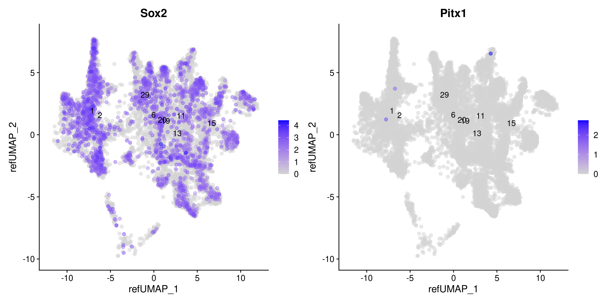{fig-align='center' width=1440}
:::
:::

::: {.cell layout-align="center"}

```{.r .cell-code .hidden}
#| label: plot-feature-sox2-Pitx1-e15
#| fig-width: 24
#| fig-height: 6
# FeaturePlot(srt |> subset(Age == "E15"), features = c("Sox2", "Pitx1"),
#   reduction = "ref.umap", blend = TRUE, blend.threshold = 0.3, order = TRUE, pt.size = 2, raster.dpi = c(1024, 1024), alpha = 0.5)
#
# Error in `FeaturePlot()`:
# ! The following features have no value: Pitx1
```
:::

::: {.cell layout-align="center"}

```{.r .cell-code .hidden}
#| label: plot-feature-sox2-Pitx1-e16
#| fig-width: 24
#| fig-height: 6
# FeaturePlot(srt |> subset(Age == "E16"), features = c("Sox2", "Pitx1"),
#   reduction = "ref.umap", blend = TRUE, blend.threshold = 0.3, order = TRUE, pt.size = 2, raster.dpi = c(1024, 1024), alpha = 0.5)
#
# Error in `FeaturePlot()`:
# ! The following features have no value: Pitx1
```
:::

::: {.cell layout-align="center"}

```{.r .cell-code .hidden}
#| label: plot-feature-sox2-Pitx1-e18
#| fig-width: 24
#| fig-height: 6
# FeaturePlot(srt |> subset(Age == "E18"), features = c("Sox2", "Pitx1"),
#   reduction = "ref.umap", blend = TRUE, blend.threshold = 0.3, order = TRUE, pt.size = 2, raster.dpi = c(1024, 1024), alpha = 0.5)
#
# Error in `FeaturePlot()`:
# ! The following features have no value: Pitx1
```
:::

::: {.cell layout-align="center"}

```{.r .cell-code .hidden}
#| label: plot-feature-sox2-Pitx1-p8
#| fig-width: 24
#| fig-height: 6
FeaturePlot(srt |> subset(Age == "P8"),
  features = c("Sox2", "Pitx1"),
  reduction = "ref.umap",
  blend = TRUE,
  blend.threshold = 0.4,
  max.cutoff = "q95",
  pt.size = 1.5,
  cols = c("grey98", "red", "blue"),
  order = T,
  alpha = 0.35,
  raster.dpi = c(1024, 1024)
)
```

::: {.cell-output-display}
{fig-align='center' width=2880}
:::
:::

::: {.cell layout-align="center"}

```{.r .cell-code .hidden}
#| label: plot-feature-sox2-Pitx1-p45
#| fig-width: 24
#| fig-height: 6
FeaturePlot(srt |> subset(Age == "P45"),
  features = c("Sox2", "Pitx1"),
  reduction = "ref.umap",
  blend = TRUE,
  blend.threshold = 0.4,
  max.cutoff = "q95",
  pt.size = 1.5,
  cols = c("grey98", "red", "blue"),
  order = T,
  alpha = 0.35,
  raster.dpi = c(1024, 1024)
)
```

::: {.cell-output-display}
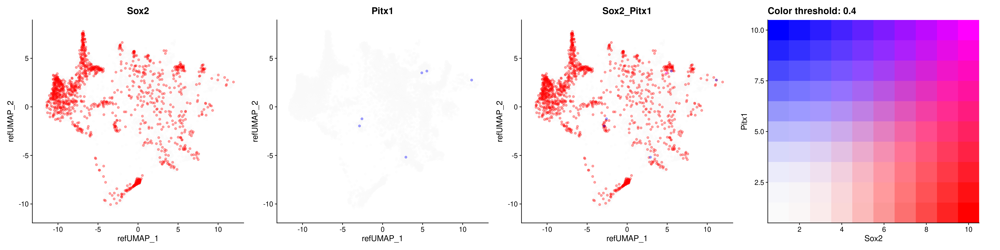{fig-align='center' width=2880}
:::
:::


### Hlf


::: {.cell layout-align="center"}

```{.r .cell-code .hidden}
#| label: plot-feature-Eya3-Hlf-e10
#| fig-width: 24
#| fig-height: 6
FeaturePlot(srt |> subset(Age == "E10"),
  features = c("Eya3", "Hlf"),
  reduction = "ref.umap",
  blend = TRUE,
  blend.threshold = 0.4,
  max.cutoff = "q95",
  pt.size = 1.5,
  cols = c("grey98", "red", "blue"),
  order = T,
  alpha = 0.35,
  raster.dpi = c(1024, 1024)
)
```

::: {.cell-output-display}
{fig-align='center' width=2880}
:::
:::

::: {.cell layout-align="center"}

```{.r .cell-code .hidden}
#| label: plot-feature-Eya3-Hlf-e11
#| fig-width: 24
#| fig-height: 6
FeaturePlot(srt |> subset(Age == "E11"),
  features = c("Eya3", "Hlf"),
  reduction = "ref.umap",
  blend = TRUE,
  blend.threshold = 0.4,
  max.cutoff = "q95",
  pt.size = 1.5,
  cols = c("grey98", "red", "blue"),
  order = T,
  alpha = 0.35,
  raster.dpi = c(1024, 1024)
)
```

::: {.cell-output-display}
{fig-align='center' width=2880}
:::
:::

::: {.cell layout-align="center"}

```{.r .cell-code .hidden}
#| label: plot-feature-Eya3-Hlf-e12
#| fig-width: 24
#| fig-height: 6
FeaturePlot(srt |> subset(Age == "E12"),
  features = c("Eya3", "Hlf"),
  reduction = "ref.umap",
  blend = TRUE,
  blend.threshold = 0.4,
  max.cutoff = "q95",
  pt.size = 1.5,
  cols = c("grey98", "red", "blue"),
  order = T,
  alpha = 0.35,
  raster.dpi = c(1024, 1024)
)
```

::: {.cell-output-display}
{fig-align='center' width=2880}
:::
:::

::: {.cell layout-align="center"}

```{.r .cell-code .hidden}
#| label: plot-feature-Eya3-Hlf-e13
#| fig-width: 24
#| fig-height: 6
FeaturePlot(srt |> subset(Age == "E13"),
  features = c("Eya3", "Hlf"),
  reduction = "ref.umap",
  blend = TRUE,
  blend.threshold = 0.4,
  max.cutoff = "q95",
  pt.size = 1.5,
  cols = c("grey98", "red", "blue"),
  order = T,
  alpha = 0.35,
  raster.dpi = c(1024, 1024)
)
```

::: {.cell-output-display}
{fig-align='center' width=2880}
:::
:::

::: {.cell layout-align="center"}

```{.r .cell-code .hidden}
#| label: plot-feature-Eya3-Hlf-e14
#| fig-width: 24
#| fig-height: 6
FeaturePlot(srt |> subset(Age == "E14"),
  features = c("Eya3", "Hlf"),
  reduction = "ref.umap",
  blend = TRUE,
  blend.threshold = 0.4,
  max.cutoff = "q95",
  pt.size = 1.5,
  cols = c("grey98", "red", "blue"),
  order = T,
  alpha = 0.35,
  raster.dpi = c(1024, 1024)
)
```

::: {.cell-output-display}
{fig-align='center' width=2880}
:::
:::

::: {.cell layout-align="center"}

```{.r .cell-code .hidden}
#| label: plot-feature-Eya3-Hlf-e15
#| fig-width: 24
#| fig-height: 6
FeaturePlot(srt |> subset(Age == "E15"),
  features = c("Eya3", "Hlf"),
  reduction = "ref.umap",
  blend = TRUE,
  blend.threshold = 0.4,
  max.cutoff = "q95",
  pt.size = 1.5,
  cols = c("grey98", "red", "blue"),
  order = T,
  alpha = 0.35,
  raster.dpi = c(1024, 1024)
)
```

::: {.cell-output-display}
{fig-align='center' width=2880}
:::
:::

::: {.cell layout-align="center"}

```{.r .cell-code .hidden}
#| label: plot-feature-Eya3-Hlf-e16
#| fig-width: 24
#| fig-height: 6
FeaturePlot(srt |> subset(Age == "E16"),
  features = c("Eya3", "Hlf"),
  reduction = "ref.umap",
  blend = TRUE,
  blend.threshold = 0.4,
  max.cutoff = "q95",
  pt.size = 1.5,
  cols = c("grey98", "red", "blue"),
  order = T,
  alpha = 0.35,
  raster.dpi = c(1024, 1024)
)
```

::: {.cell-output-display}
{fig-align='center' width=2880}
:::
:::

::: {.cell layout-align="center"}

```{.r .cell-code .hidden}
#| label: plot-feature-Eya3-Hlf-e18
#| fig-width: 24
#| fig-height: 6
FeaturePlot(srt |> subset(Age == "E18"),
  features = c("Eya3", "Hlf"),
  reduction = "ref.umap",
  blend = TRUE,
  blend.threshold = 0.4,
  max.cutoff = "q95",
  pt.size = 1.5,
  cols = c("grey98", "red", "blue"),
  order = T,
  alpha = 0.35,
  raster.dpi = c(1024, 1024)
)
```

::: {.cell-output-display}
{fig-align='center' width=2880}
:::
:::

::: {.cell layout-align="center"}

```{.r .cell-code .hidden}
#| label: plot-feature-Eya3-Hlf-p8
#| fig-width: 24
#| fig-height: 6
FeaturePlot(srt |> subset(Age == "P8"),
  features = c("Eya3", "Hlf"),
  reduction = "ref.umap",
  blend = TRUE,
  blend.threshold = 0.4,
  max.cutoff = "q95",
  pt.size = 1.5,
  cols = c("grey98", "red", "blue"),
  order = T,
  alpha = 0.35,
  raster.dpi = c(1024, 1024)
)
```

::: {.cell-output-display}
{fig-align='center' width=2880}
:::
:::

::: {.cell layout-align="center"}

```{.r .cell-code .hidden}
#| label: plot-feature-Eya3-Hlf-p45
#| fig-width: 24
#| fig-height: 6
FeaturePlot(srt |> subset(Age == "P45"),
  features = c("Eya3", "Hlf"),
  reduction = "ref.umap",
  blend = TRUE,
  blend.threshold = 0.4,
  max.cutoff = "q95",
  pt.size = 1.5,
  cols = c("grey98", "red", "blue"),
  order = T,
  alpha = 0.35,
  raster.dpi = c(1024, 1024)
)
```

::: {.cell-output-display}
{fig-align='center' width=2880}
:::
:::


### Igfbp5


::: {.cell layout-align="center"}

```{.r .cell-code .hidden}
#| label: plot-feature-Eya3-Igfbp5-e10
#| fig-width: 24
#| fig-height: 6
FeaturePlot(srt |> subset(Age == "E10"),
  features = c("Eya3", "Igfbp5"),
  reduction = "ref.umap",
  blend = TRUE,
  blend.threshold = 0.4,
  max.cutoff = "q95",
  pt.size = 1.5,
  cols = c("grey98", "red", "blue"),
  order = T,
  alpha = 0.35,
  raster.dpi = c(1024, 1024)
)
```

::: {.cell-output-display}
{fig-align='center' width=2880}
:::
:::

::: {.cell layout-align="center"}

```{.r .cell-code .hidden}
#| label: plot-feature-Eya3-Igfbp5-e11
#| fig-width: 24
#| fig-height: 6
FeaturePlot(srt |> subset(Age == "E11"),
  features = c("Eya3", "Igfbp5"),
  reduction = "ref.umap",
  blend = TRUE,
  blend.threshold = 0.4,
  max.cutoff = "q95",
  pt.size = 1.5,
  cols = c("grey98", "red", "blue"),
  order = T,
  alpha = 0.35,
  raster.dpi = c(1024, 1024)
)
```

::: {.cell-output-display}
{fig-align='center' width=2880}
:::
:::

::: {.cell layout-align="center"}

```{.r .cell-code .hidden}
#| label: plot-feature-Eya3-Igfbp5-e12
#| fig-width: 24
#| fig-height: 6
FeaturePlot(srt |> subset(Age == "E12"),
  features = c("Eya3", "Igfbp5"),
  reduction = "ref.umap",
  blend = TRUE,
  blend.threshold = 0.4,
  max.cutoff = "q95",
  pt.size = 1.5,
  cols = c("grey98", "red", "blue"),
  order = T,
  alpha = 0.35,
  raster.dpi = c(1024, 1024)
)
```

::: {.cell-output-display}
{fig-align='center' width=2880}
:::
:::

::: {.cell layout-align="center"}

```{.r .cell-code .hidden}
#| label: plot-feature-Eya3-Igfbp5-e13
#| fig-width: 24
#| fig-height: 6
FeaturePlot(srt |> subset(Age == "E13"),
  features = c("Eya3", "Igfbp5"),
  reduction = "ref.umap",
  blend = TRUE,
  blend.threshold = 0.4,
  max.cutoff = "q95",
  pt.size = 1.5,
  cols = c("grey98", "red", "blue"),
  order = T,
  alpha = 0.35,
  raster.dpi = c(1024, 1024)
)
```

::: {.cell-output-display}
{fig-align='center' width=2880}
:::
:::

::: {.cell layout-align="center"}

```{.r .cell-code .hidden}
#| label: plot-feature-Eya3-Igfbp5-e14
#| fig-width: 24
#| fig-height: 6
FeaturePlot(srt |> subset(Age == "E14"),
  features = c("Eya3", "Igfbp5"),
  reduction = "ref.umap",
  blend = TRUE,
  blend.threshold = 0.4,
  max.cutoff = "q95",
  pt.size = 1.5,
  cols = c("grey98", "red", "blue"),
  order = T,
  alpha = 0.35,
  raster.dpi = c(1024, 1024)
)
```

::: {.cell-output-display}
{fig-align='center' width=2880}
:::
:::

::: {.cell layout-align="center"}

```{.r .cell-code .hidden}
#| label: plot-feature-Eya3-Igfbp5-e15
#| fig-width: 24
#| fig-height: 6
FeaturePlot(srt |> subset(Age == "E15"),
  features = c("Eya3", "Igfbp5"),
  reduction = "ref.umap",
  blend = TRUE,
  blend.threshold = 0.4,
  max.cutoff = "q95",
  pt.size = 1.5,
  cols = c("grey98", "red", "blue"),
  order = T,
  alpha = 0.35,
  raster.dpi = c(1024, 1024)
)
```

::: {.cell-output-display}
{fig-align='center' width=2880}
:::
:::

::: {.cell layout-align="center"}

```{.r .cell-code .hidden}
#| label: plot-feature-Eya3-Igfbp5-e16
#| fig-width: 24
#| fig-height: 6
FeaturePlot(srt |> subset(Age == "E16"),
  features = c("Eya3", "Igfbp5"),
  reduction = "ref.umap",
  blend = TRUE,
  blend.threshold = 0.4,
  max.cutoff = "q95",
  pt.size = 1.5,
  cols = c("grey98", "red", "blue"),
  order = T,
  alpha = 0.35,
  raster.dpi = c(1024, 1024)
)
```

::: {.cell-output-display}
{fig-align='center' width=2880}
:::
:::

::: {.cell layout-align="center"}

```{.r .cell-code .hidden}
#| label: plot-feature-Eya3-Igfbp5-e18
#| fig-width: 24
#| fig-height: 6
FeaturePlot(srt |> subset(Age == "E18"),
  features = c("Eya3", "Igfbp5"),
  reduction = "ref.umap",
  blend = TRUE,
  blend.threshold = 0.4,
  max.cutoff = "q95",
  pt.size = 1.5,
  cols = c("grey98", "red", "blue"),
  order = T,
  alpha = 0.35,
  raster.dpi = c(1024, 1024)
)
```

::: {.cell-output-display}
{fig-align='center' width=2880}
:::
:::

::: {.cell layout-align="center"}

```{.r .cell-code .hidden}
#| label: plot-feature-Eya3-Igfbp5-p8
#| fig-width: 24
#| fig-height: 6
FeaturePlot(srt |> subset(Age == "P8"),
  features = c("Eya3", "Igfbp5"),
  reduction = "ref.umap",
  blend = TRUE,
  blend.threshold = 0.4,
  max.cutoff = "q95",
  pt.size = 1.5,
  cols = c("grey98", "red", "blue"),
  order = T,
  alpha = 0.35,
  raster.dpi = c(1024, 1024)
)
```

::: {.cell-output-display}
{fig-align='center' width=2880}
:::
:::

::: {.cell layout-align="center"}

```{.r .cell-code .hidden}
#| label: plot-feature-Eya3-Igfbp5-p45
#| fig-width: 24
#| fig-height: 6
FeaturePlot(srt |> subset(Age == "P45"),
  features = c("Eya3", "Igfbp5"),
  reduction = "ref.umap",
  blend = TRUE,
  blend.threshold = 0.4,
  max.cutoff = "q95",
  pt.size = 1.5,
  cols = c("grey98", "red", "blue"),
  order = T,
  alpha = 0.35,
  raster.dpi = c(1024, 1024)
)
```

::: {.cell-output-display}
{fig-align='center' width=2880}
:::
:::


### Sox2 and Tshr correlation in hypothalamus across different developmental stages


::: {.cell layout-align="center"}

```{.r .cell-code .hidden}
#| label: plot-feature-sox2-tshr-e10
#| fig-width: 24
#| fig-height: 6
FeaturePlot(srt |> subset(Age == "E10"),
  features = c("Sox2", "Tshr"),
  reduction = "ref.umap",
  blend = TRUE,
  blend.threshold = 0.4,
  max.cutoff = "q95",
  pt.size = 1.5,
  cols = c("grey98", "red", "blue"),
  order = T,
  alpha = 0.35,
  raster.dpi = c(1024, 1024)
)
```

::: {.cell-output-display}
{fig-align='center' width=2880}
:::
:::

::: {.cell layout-align="center"}

```{.r .cell-code .hidden}
#| label: plot-feature-sox2-tshr-e11
#| fig-width: 24
#| fig-height: 6
FeaturePlot(srt |> subset(Age == "E11"),
  features = c("Sox2", "Tshr"),
  reduction = "ref.umap",
  blend = TRUE,
  blend.threshold = 0.4,
  max.cutoff = "q95",
  pt.size = 1.5,
  cols = c("grey98", "red", "blue"),
  order = T,
  alpha = 0.35,
  raster.dpi = c(1024, 1024)
)
```

::: {.cell-output-display}
{fig-align='center' width=2880}
:::
:::

::: {.cell layout-align="center"}

```{.r .cell-code .hidden}
#| label: plot-feature-sox2-tshr-e12
#| fig-width: 24
#| fig-height: 6
FeaturePlot(srt |> subset(Age == "E12"),
  features = c("Sox2", "Tshr"),
  reduction = "ref.umap",
  blend = TRUE,
  blend.threshold = 0.4,
  max.cutoff = "q95",
  pt.size = 1.5,
  cols = c("grey98", "red", "blue"),
  order = T,
  alpha = 0.35,
  raster.dpi = c(1024, 1024)
)
```

::: {.cell-output-display}
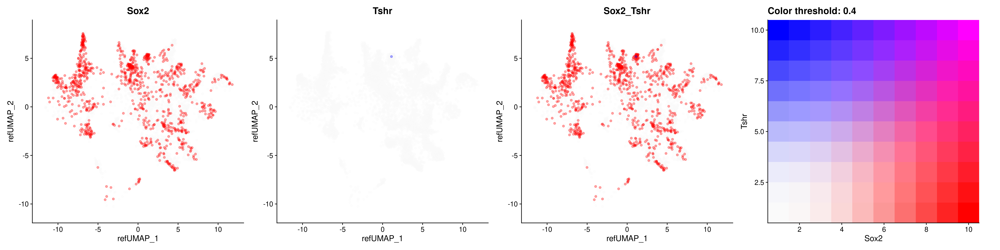{fig-align='center' width=2880}
:::
:::

::: {.cell layout-align="center"}

```{.r .cell-code .hidden}
#| label: plot-feature-sox2-tshr-e13
#| fig-width: 24
#| fig-height: 6
FeaturePlot(srt |> subset(Age == "E13"),
  features = c("Sox2", "Tshr"),
  reduction = "ref.umap",
  blend = TRUE,
  blend.threshold = 0.4,
  max.cutoff = "q95",
  pt.size = 1.5,
  cols = c("grey98", "red", "blue"),
  order = T,
  alpha = 0.35,
  raster.dpi = c(1024, 1024)
)
```

::: {.cell-output-display}
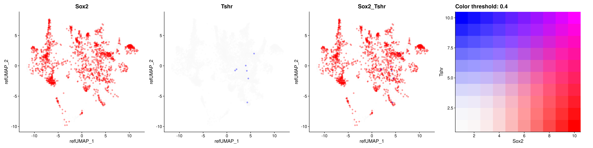{fig-align='center' width=2880}
:::
:::

::: {.cell layout-align="center"}

```{.r .cell-code .hidden}
#| label: plot-feature-sox2-tshr-e14
#| fig-width: 12
#| fig-height: 6
FeaturePlot(srt |> subset(Age == "E14"),
  features = c("Sox2", "Tshr"),
  reduction = "ref.umap", blend = F, label = TRUE, order = TRUE, pt.size = 2, raster.dpi = c(1024, 1024), alpha = 0.5
)
```

::: {.cell-output .cell-output-stderr .hidden}

```
Warning: All cells have the same value (0) of "Tshr"
```


:::

::: {.cell-output-display}
{fig-align='center' width=1440}
:::
:::

::: {.cell layout-align="center"}

```{.r .cell-code .hidden}
#| label: plot-feature-sox2-tshr-e15
#| fig-width: 24
#| fig-height: 6
FeaturePlot(srt |> subset(Age == "E15"),
  features = c("Sox2", "Tshr"),
  reduction = "ref.umap",
  blend = TRUE,
  blend.threshold = 0.4,
  max.cutoff = "q95",
  pt.size = 1.5,
  cols = c("grey98", "red", "blue"),
  order = T,
  alpha = 0.35,
  raster.dpi = c(1024, 1024)
)
```

::: {.cell-output-display}
{fig-align='center' width=2880}
:::
:::

::: {.cell layout-align="center"}

```{.r .cell-code .hidden}
#| label: plot-feature-sox2-tshr-e16
#| fig-width: 24
#| fig-height: 6
FeaturePlot(srt |> subset(Age == "E16"),
  features = c("Sox2", "Tshr"),
  reduction = "ref.umap",
  blend = TRUE,
  blend.threshold = 0.4,
  max.cutoff = "q95",
  pt.size = 1.5,
  cols = c("grey98", "red", "blue"),
  order = T,
  alpha = 0.35,
  raster.dpi = c(1024, 1024)
)
```

::: {.cell-output-display}
{fig-align='center' width=2880}
:::
:::

::: {.cell layout-align="center"}

```{.r .cell-code .hidden}
#| label: plot-feature-sox2-tshr-e18
#| fig-width: 24
#| fig-height: 6
FeaturePlot(srt |> subset(Age == "E18"),
  features = c("Sox2", "Tshr"),
  reduction = "ref.umap",
  blend = TRUE,
  blend.threshold = 0.4,
  max.cutoff = "q95",
  pt.size = 1.5,
  cols = c("grey98", "red", "blue"),
  order = T,
  alpha = 0.35,
  raster.dpi = c(1024, 1024)
)
```

::: {.cell-output-display}
{fig-align='center' width=2880}
:::
:::

::: {.cell layout-align="center"}

```{.r .cell-code .hidden}
#| label: plot-feature-sox2-tshr-p8
#| fig-width: 24
#| fig-height: 6
FeaturePlot(srt |> subset(Age == "P8"),
  features = c("Sox2", "Tshr"),
  reduction = "ref.umap",
  blend = TRUE,
  blend.threshold = 0.4,
  max.cutoff = "q95",
  pt.size = 1.5,
  cols = c("grey98", "red", "blue"),
  order = T,
  alpha = 0.35,
  raster.dpi = c(1024, 1024)
)
```

::: {.cell-output-display}
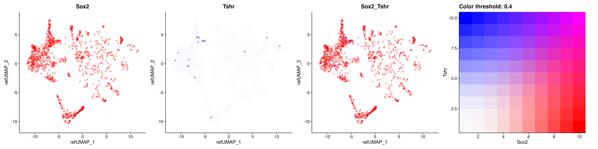{fig-align='center' width=2880}
:::
:::

::: {.cell layout-align="center"}

```{.r .cell-code .hidden}
#| label: plot-feature-sox2-tshr-p45
#| fig-width: 24
#| fig-height: 6
FeaturePlot(srt |> subset(Age == "P45"),
  features = c("Sox2", "Tshr"),
  reduction = "ref.umap",
  blend = TRUE,
  blend.threshold = 0.4,
  max.cutoff = "q95",
  pt.size = 1.5,
  cols = c("grey98", "red", "blue"),
  order = T,
  alpha = 0.35,
  raster.dpi = c(1024, 1024)
)
```

::: {.cell-output-display}
{fig-align='center' width=2880}
:::
:::


### Sox2 and Gpr173 correlation in hypothalamus across different developmental stages


::: {.cell layout-align="center"}

```{.r .cell-code .hidden}
#| label: plot-feature-sox2-Gpr173-e10
#| fig-width: 24
#| fig-height: 6
FeaturePlot(srt |> subset(Age == "E10"),
  features = c("Sox2", "Gpr173"),
  reduction = "ref.umap",
  blend = TRUE,
  blend.threshold = 0.4,
  max.cutoff = "q95",
  pt.size = 1.5,
  cols = c("grey98", "red", "blue"),
  order = T,
  alpha = 0.35,
  raster.dpi = c(1024, 1024)
)
```

::: {.cell-output-display}
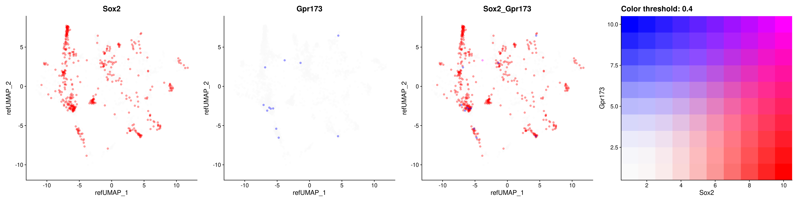{fig-align='center' width=2880}
:::
:::

::: {.cell layout-align="center"}

```{.r .cell-code .hidden}
#| label: plot-feature-sox2-Gpr173-e11
#| fig-width: 24
#| fig-height: 6
FeaturePlot(srt |> subset(Age == "E11"),
  features = c("Sox2", "Gpr173"),
  reduction = "ref.umap",
  blend = TRUE,
  blend.threshold = 0.4,
  max.cutoff = "q95",
  pt.size = 1.5,
  cols = c("grey98", "red", "blue"),
  order = T,
  alpha = 0.35,
  raster.dpi = c(1024, 1024)
)
```

::: {.cell-output-display}
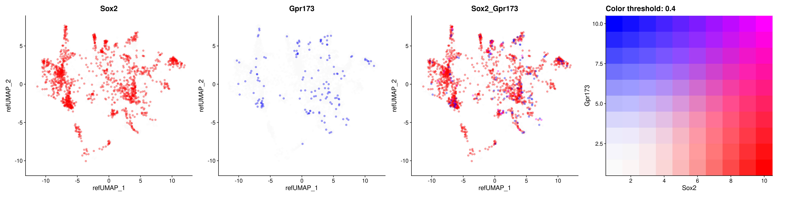{fig-align='center' width=2880}
:::
:::

::: {.cell layout-align="center"}

```{.r .cell-code .hidden}
#| label: plot-feature-sox2-Gpr173-e12
#| fig-width: 24
#| fig-height: 6
FeaturePlot(srt |> subset(Age == "E12"),
  features = c("Sox2", "Gpr173"),
  reduction = "ref.umap",
  blend = TRUE,
  blend.threshold = 0.4,
  max.cutoff = "q95",
  pt.size = 1.5,
  cols = c("grey98", "red", "blue"),
  order = T,
  alpha = 0.35,
  raster.dpi = c(1024, 1024)
)
```

::: {.cell-output-display}
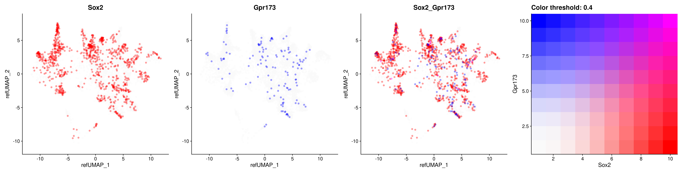{fig-align='center' width=2880}
:::
:::

::: {.cell layout-align="center"}

```{.r .cell-code .hidden}
#| label: plot-feature-sox2-Gpr173-e13
#| fig-width: 24
#| fig-height: 6
FeaturePlot(srt |> subset(Age == "E13"),
  features = c("Sox2", "Gpr173"),
  reduction = "ref.umap",
  blend = TRUE,
  blend.threshold = 0.4,
  max.cutoff = "q95",
  pt.size = 1.5,
  cols = c("grey98", "red", "blue"),
  order = T,
  alpha = 0.35,
  raster.dpi = c(1024, 1024)
)
```

::: {.cell-output-display}
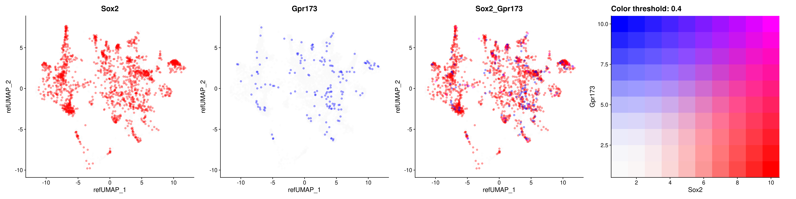{fig-align='center' width=2880}
:::
:::

::: {.cell layout-align="center"}

```{.r .cell-code .hidden}
#| label: plot-feature-sox2-Gpr173-e14
#| fig-width: 24
#| fig-height: 6
FeaturePlot(srt |> subset(Age == "E14"),
  features = c("Sox2", "Gpr173"),
  reduction = "ref.umap",
  blend = TRUE,
  blend.threshold = 0.4,
  max.cutoff = "q95",
  pt.size = 1.5,
  cols = c("grey98", "red", "blue"),
  order = T,
  alpha = 0.35,
  raster.dpi = c(1024, 1024)
)
```

::: {.cell-output-display}
{fig-align='center' width=2880}
:::
:::

::: {.cell layout-align="center"}

```{.r .cell-code .hidden}
#| label: plot-feature-sox2-Gpr173-e15
#| fig-width: 24
#| fig-height: 6
FeaturePlot(srt |> subset(Age == "E15"),
  features = c("Sox2", "Gpr173"),
  reduction = "ref.umap",
  blend = TRUE,
  blend.threshold = 0.4,
  max.cutoff = "q95",
  pt.size = 1.5,
  cols = c("grey98", "red", "blue"),
  order = T,
  alpha = 0.35,
  raster.dpi = c(1024, 1024)
)
```

::: {.cell-output-display}
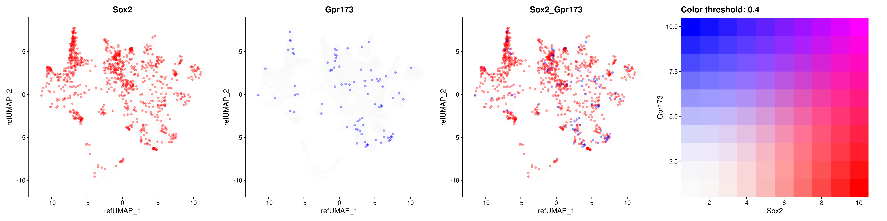{fig-align='center' width=2880}
:::
:::

::: {.cell layout-align="center"}

```{.r .cell-code .hidden}
#| label: plot-feature-sox2-Gpr173-e16
#| fig-width: 24
#| fig-height: 6
FeaturePlot(srt |> subset(Age == "E16"),
  features = c("Sox2", "Gpr173"),
  reduction = "ref.umap",
  blend = TRUE,
  blend.threshold = 0.4,
  max.cutoff = "q95",
  pt.size = 1.5,
  cols = c("grey98", "red", "blue"),
  order = T,
  alpha = 0.35,
  raster.dpi = c(1024, 1024)
)
```

::: {.cell-output-display}
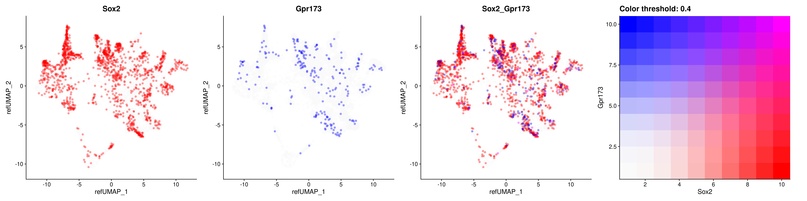{fig-align='center' width=2880}
:::
:::

::: {.cell layout-align="center"}

```{.r .cell-code .hidden}
#| label: plot-feature-sox2-Gpr173-e18
#| fig-width: 24
#| fig-height: 6
FeaturePlot(srt |> subset(Age == "E18"),
  features = c("Sox2", "Gpr173"),
  reduction = "ref.umap",
  blend = TRUE,
  blend.threshold = 0.4,
  max.cutoff = "q95",
  pt.size = 1.5,
  cols = c("grey98", "red", "blue"),
  order = T,
  alpha = 0.35,
  raster.dpi = c(1024, 1024)
)
```

::: {.cell-output-display}
{fig-align='center' width=2880}
:::
:::

::: {.cell layout-align="center"}

```{.r .cell-code .hidden}
#| label: plot-feature-sox2-Gpr173-p8
#| fig-width: 24
#| fig-height: 6
FeaturePlot(srt |> subset(Age == "P8"),
  features = c("Sox2", "Gpr173"),
  reduction = "ref.umap",
  blend = TRUE,
  blend.threshold = 0.4,
  max.cutoff = "q95",
  pt.size = 1.5,
  cols = c("grey98", "red", "blue"),
  order = T,
  alpha = 0.35,
  raster.dpi = c(1024, 1024)
)
```

::: {.cell-output-display}
{fig-align='center' width=2880}
:::
:::

::: {.cell layout-align="center"}

```{.r .cell-code .hidden}
#| label: plot-feature-sox2-Gpr173-p45
#| fig-width: 24
#| fig-height: 6
FeaturePlot(srt |> subset(Age == "P45"),
  features = c("Sox2", "Gpr173"),
  reduction = "ref.umap",
  blend = TRUE,
  blend.threshold = 0.4,
  max.cutoff = "q95",
  pt.size = 1.5,
  cols = c("grey98", "red", "blue"),
  order = T,
  alpha = 0.35,
  raster.dpi = c(1024, 1024)
)
```

::: {.cell-output-display}
{fig-align='center' width=2880}
:::
:::


### Sox2 and Cckbr correlation in hypothalamus across different developmental stages


::: {.cell layout-align="center"}

```{.r .cell-code .hidden}
#| label: plot-feature-sox2-Cckbr-e10
#| fig-width: 12
#| fig-height: 6
FeaturePlot(srt |> subset(Age == "E10"),
  features = c("Sox2", "Cckbr"),
  reduction = "ref.umap", blend = F, label = TRUE, order = TRUE, pt.size = 2, raster.dpi = c(1024, 1024), alpha = 0.5
)
```

::: {.cell-output .cell-output-stderr .hidden}

```
Warning: All cells have the same value (0) of "Cckbr"
```


:::

::: {.cell-output-display}
{fig-align='center' width=1440}
:::
:::

::: {.cell layout-align="center"}

```{.r .cell-code .hidden}
#| label: plot-feature-sox2-Cckbr-e11
#| fig-width: 12
#| fig-height: 6
FeaturePlot(srt |> subset(Age == "E11"),
  features = c("Sox2", "Cckbr"),
  reduction = "ref.umap", blend = F, label = TRUE, order = TRUE, pt.size = 2, raster.dpi = c(1024, 1024), alpha = 0.5
)
```

::: {.cell-output .cell-output-stderr .hidden}

```
Warning: All cells have the same value (0) of "Cckbr"
```


:::

::: {.cell-output-display}
{fig-align='center' width=1440}
:::
:::

::: {.cell layout-align="center"}

```{.r .cell-code .hidden}
#| label: plot-feature-sox2-Cckbr-e12
#| fig-width: 24
#| fig-height: 6
FeaturePlot(srt |> subset(Age == "E12"),
  features = c("Sox2", "Cckbr"),
  reduction = "ref.umap",
  blend = TRUE,
  blend.threshold = 0.4,
  max.cutoff = "q95",
  pt.size = 1.5,
  cols = c("grey98", "red", "blue"),
  order = T,
  alpha = 0.35,
  raster.dpi = c(1024, 1024)
)
```

::: {.cell-output-display}
{fig-align='center' width=2880}
:::
:::

::: {.cell layout-align="center"}

```{.r .cell-code .hidden}
#| label: plot-feature-sox2-Cckbr-e13
#| fig-width: 12
#| fig-height: 6
FeaturePlot(srt |> subset(Age == "E13"),
  features = c("Sox2", "Cckbr"),
  reduction = "ref.umap", blend = F, label = TRUE, order = TRUE, pt.size = 2, raster.dpi = c(1024, 1024), alpha = 0.5
)
```

::: {.cell-output .cell-output-stderr .hidden}

```
Warning: All cells have the same value (0) of "Cckbr"
```


:::

::: {.cell-output-display}
{fig-align='center' width=1440}
:::
:::

::: {.cell layout-align="center"}

```{.r .cell-code .hidden}
#| label: plot-feature-sox2-Cckbr-e14
#| fig-width: 24
#| fig-height: 6
FeaturePlot(srt |> subset(Age == "E14"),
  features = c("Sox2", "Cckbr"),
  reduction = "ref.umap",
  blend = TRUE,
  blend.threshold = 0.4,
  max.cutoff = "q95",
  pt.size = 1.5,
  cols = c("grey98", "red", "blue"),
  order = T,
  alpha = 0.35,
  raster.dpi = c(1024, 1024)
)
```

::: {.cell-output-display}
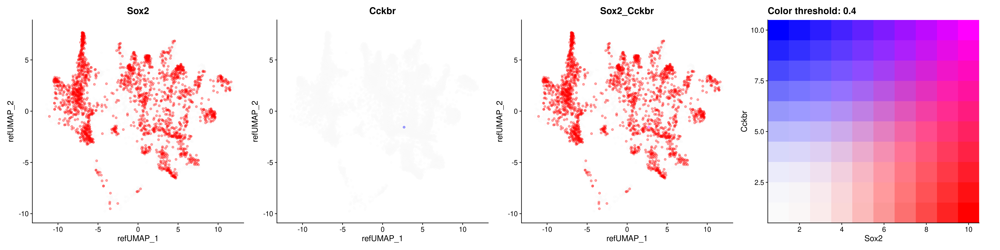{fig-align='center' width=2880}
:::
:::

::: {.cell layout-align="center"}

```{.r .cell-code .hidden}
#| label: plot-feature-sox2-Cckbr-e15
#| fig-width: 24
#| fig-height: 6
FeaturePlot(srt |> subset(Age == "E15"),
  features = c("Sox2", "Cckbr"),
  reduction = "ref.umap",
  blend = TRUE,
  blend.threshold = 0.4,
  max.cutoff = "q95",
  pt.size = 1.5,
  cols = c("grey98", "red", "blue"),
  order = T,
  alpha = 0.35,
  raster.dpi = c(1024, 1024)
)
```

::: {.cell-output-display}
{fig-align='center' width=2880}
:::
:::

::: {.cell layout-align="center"}

```{.r .cell-code .hidden}
#| label: plot-feature-sox2-Cckbr-e16
#| fig-width: 24
#| fig-height: 6
FeaturePlot(srt |> subset(Age == "E16"),
  features = c("Sox2", "Cckbr"),
  reduction = "ref.umap",
  blend = TRUE,
  blend.threshold = 0.4,
  max.cutoff = "q95",
  pt.size = 1.5,
  cols = c("grey98", "red", "blue"),
  order = T,
  alpha = 0.35,
  raster.dpi = c(1024, 1024)
)
```

::: {.cell-output-display}
{fig-align='center' width=2880}
:::
:::

::: {.cell layout-align="center"}

```{.r .cell-code .hidden}
#| label: plot-feature-sox2-Cckbr-e18
#| fig-width: 24
#| fig-height: 6
FeaturePlot(srt |> subset(Age == "E18"),
  features = c("Sox2", "Cckbr"),
  reduction = "ref.umap",
  blend = TRUE,
  blend.threshold = 0.4,
  max.cutoff = "q95",
  pt.size = 1.5,
  cols = c("grey98", "red", "blue"),
  order = T,
  alpha = 0.35,
  raster.dpi = c(1024, 1024)
)
```

::: {.cell-output-display}
{fig-align='center' width=2880}
:::
:::

::: {.cell layout-align="center"}

```{.r .cell-code .hidden}
#| label: plot-feature-sox2-Cckbr-p8
#| fig-width: 24
#| fig-height: 6
FeaturePlot(srt |> subset(Age == "P8"),
  features = c("Sox2", "Cckbr"),
  reduction = "ref.umap",
  blend = TRUE,
  blend.threshold = 0.4,
  max.cutoff = "q95",
  pt.size = 1.5,
  cols = c("grey98", "red", "blue"),
  order = T,
  alpha = 0.35,
  raster.dpi = c(1024, 1024)
)
```

::: {.cell-output-display}
{fig-align='center' width=2880}
:::
:::

::: {.cell layout-align="center"}

```{.r .cell-code .hidden}
#| label: plot-feature-sox2-Cckbr-p45
#| fig-width: 24
#| fig-height: 6
FeaturePlot(srt |> subset(Age == "P45"),
  features = c("Sox2", "Cckbr"),
  reduction = "ref.umap",
  blend = TRUE,
  blend.threshold = 0.4,
  max.cutoff = "q95",
  pt.size = 1.5,
  cols = c("grey98", "red", "blue"),
  order = T,
  alpha = 0.35,
  raster.dpi = c(1024, 1024)
)
```

::: {.cell-output-display}
{fig-align='center' width=2880}
:::
:::


### Tshr and Gpr173 correlation in hypothalamus across different developmental stages


::: {.cell layout-align="center"}

```{.r .cell-code .hidden}
#| label: plot-feature-Tshr-Gpr173-e10
#| fig-width: 24
#| fig-height: 6
FeaturePlot(srt |> subset(Age == "E10"),
  features = c("Tshr", "Gpr173"),
  reduction = "ref.umap",
  blend = TRUE,
  blend.threshold = 0.4,
  max.cutoff = "q95",
  pt.size = 1.5,
  cols = c("grey98", "red", "blue"),
  order = T,
  alpha = 0.35,
  raster.dpi = c(1024, 1024)
)
```

::: {.cell-output-display}
{fig-align='center' width=2880}
:::
:::

::: {.cell layout-align="center"}

```{.r .cell-code .hidden}
#| label: plot-feature-Tshr-Gpr173-e11
#| fig-width: 24
#| fig-height: 6
FeaturePlot(srt |> subset(Age == "E11"),
  features = c("Tshr", "Gpr173"),
  reduction = "ref.umap",
  blend = TRUE,
  blend.threshold = 0.4,
  max.cutoff = "q95",
  pt.size = 1.5,
  cols = c("grey98", "red", "blue"),
  order = T,
  alpha = 0.35,
  raster.dpi = c(1024, 1024)
)
```

::: {.cell-output-display}
{fig-align='center' width=2880}
:::
:::

::: {.cell layout-align="center"}

```{.r .cell-code .hidden}
#| label: plot-feature-Tshr-Gpr173-e12
#| fig-width: 24
#| fig-height: 6
FeaturePlot(srt |> subset(Age == "E12"),
  features = c("Tshr", "Gpr173"),
  reduction = "ref.umap",
  blend = TRUE,
  blend.threshold = 0.4,
  max.cutoff = "q95",
  pt.size = 1.5,
  cols = c("grey98", "red", "blue"),
  order = T,
  alpha = 0.35,
  raster.dpi = c(1024, 1024)
)
```

::: {.cell-output-display}
{fig-align='center' width=2880}
:::
:::

::: {.cell layout-align="center"}

```{.r .cell-code .hidden}
#| label: plot-feature-Tshr-Gpr173-e13
#| fig-width: 24
#| fig-height: 6
FeaturePlot(srt |> subset(Age == "E13"),
  features = c("Tshr", "Gpr173"),
  reduction = "ref.umap",
  blend = TRUE,
  blend.threshold = 0.4,
  max.cutoff = "q95",
  pt.size = 1.5,
  cols = c("grey98", "red", "blue"),
  order = T,
  alpha = 0.35,
  raster.dpi = c(1024, 1024)
)
```

::: {.cell-output-display}
{fig-align='center' width=2880}
:::
:::

::: {.cell layout-align="center"}

```{.r .cell-code .hidden}
#| label: plot-feature-Tshr-Gpr173-e14
#| fig-width: 12
#| fig-height: 6
FeaturePlot(srt |> subset(Age == "E14"),
  features = c("Tshr", "Gpr173"),
  reduction = "ref.umap", blend = F, label = TRUE, order = TRUE, pt.size = 2, raster.dpi = c(1024, 1024), alpha = 0.5
)
```

::: {.cell-output .cell-output-stderr .hidden}

```
Warning: All cells have the same value (0) of "Tshr"
```


:::

::: {.cell-output-display}
{fig-align='center' width=1440}
:::
:::

::: {.cell layout-align="center"}

```{.r .cell-code .hidden}
#| label: plot-feature-Tshr-Gpr173-e15
#| fig-width: 24
#| fig-height: 6
FeaturePlot(srt |> subset(Age == "E15"),
  features = c("Tshr", "Gpr173"),
  reduction = "ref.umap",
  blend = TRUE,
  blend.threshold = 0.4,
  max.cutoff = "q95",
  pt.size = 1.5,
  cols = c("grey98", "red", "blue"),
  order = T,
  alpha = 0.35,
  raster.dpi = c(1024, 1024)
)
```

::: {.cell-output-display}
{fig-align='center' width=2880}
:::
:::

::: {.cell layout-align="center"}

```{.r .cell-code .hidden}
#| label: plot-feature-Tshr-Gpr173-e16
#| fig-width: 24
#| fig-height: 6
FeaturePlot(srt |> subset(Age == "E16"),
  features = c("Tshr", "Gpr173"),
  reduction = "ref.umap",
  blend = TRUE,
  blend.threshold = 0.4,
  max.cutoff = "q95",
  pt.size = 1.5,
  cols = c("grey98", "red", "blue"),
  order = T,
  alpha = 0.35,
  raster.dpi = c(1024, 1024)
)
```

::: {.cell-output-display}
{fig-align='center' width=2880}
:::
:::

::: {.cell layout-align="center"}

```{.r .cell-code .hidden}
#| label: plot-feature-Tshr-Gpr173-e18
#| fig-width: 24
#| fig-height: 6
FeaturePlot(srt |> subset(Age == "E18"),
  features = c("Tshr", "Gpr173"),
  reduction = "ref.umap",
  blend = TRUE,
  blend.threshold = 0.4,
  max.cutoff = "q95",
  pt.size = 1.5,
  cols = c("grey98", "red", "blue"),
  order = T,
  alpha = 0.35,
  raster.dpi = c(1024, 1024)
)
```

::: {.cell-output-display}
{fig-align='center' width=2880}
:::
:::

::: {.cell layout-align="center"}

```{.r .cell-code .hidden}
#| label: plot-feature-Tshr-Gpr173-p8
#| fig-width: 24
#| fig-height: 6
FeaturePlot(srt |> subset(Age == "P8"),
  features = c("Tshr", "Gpr173"),
  reduction = "ref.umap",
  blend = TRUE,
  blend.threshold = 0.4,
  max.cutoff = "q95",
  pt.size = 1.5,
  cols = c("grey98", "red", "blue"),
  order = T,
  alpha = 0.35,
  raster.dpi = c(1024, 1024)
)
```

::: {.cell-output-display}
{fig-align='center' width=2880}
:::
:::

::: {.cell layout-align="center"}

```{.r .cell-code .hidden}
#| label: plot-feature-Tshr-Gpr173-p45
#| fig-width: 24
#| fig-height: 6
FeaturePlot(srt |> subset(Age == "P45"),
  features = c("Tshr", "Gpr173"),
  reduction = "ref.umap",
  blend = TRUE,
  blend.threshold = 0.4,
  max.cutoff = "q95",
  pt.size = 1.5,
  cols = c("grey98", "red", "blue"),
  order = T,
  alpha = 0.35,
  raster.dpi = c(1024, 1024)
)
```

::: {.cell-output-display}
{fig-align='center' width=2880}
:::
:::


### Tshr and Cckbr correlation in hypothalamus across different developmental stages


::: {.cell layout-align="center"}

```{.r .cell-code .hidden}
#| label: plot-feature-Tshr-Cckbr-e10
#| fig-width: 12
#| fig-height: 6
FeaturePlot(srt |> subset(Age == "E10"),
  features = c("Tshr", "Cckbr"),
  reduction = "ref.umap", blend = F, label = TRUE, order = TRUE, pt.size = 2, raster.dpi = c(1024, 1024), alpha = 0.5
)
```

::: {.cell-output .cell-output-stderr .hidden}

```
Warning: All cells have the same value (0) of "Cckbr"
```


:::

::: {.cell-output-display}
{fig-align='center' width=1440}
:::
:::

::: {.cell layout-align="center"}

```{.r .cell-code .hidden}
#| label: plot-feature-Tshr-Cckbr-e11
#| fig-width: 12
#| fig-height: 6
FeaturePlot(srt |> subset(Age == "E11"),
  features = c("Tshr", "Cckbr"),
  reduction = "ref.umap", blend = F, label = TRUE, order = TRUE, pt.size = 2, raster.dpi = c(1024, 1024), alpha = 0.5
)
```

::: {.cell-output .cell-output-stderr .hidden}

```
Warning: All cells have the same value (0) of "Cckbr"
```


:::

::: {.cell-output-display}
{fig-align='center' width=1440}
:::
:::

::: {.cell layout-align="center"}

```{.r .cell-code .hidden}
#| label: plot-feature-Tshr-Cckbr-e12
#| fig-width: 24
#| fig-height: 6
FeaturePlot(srt |> subset(Age == "E12"),
  features = c("Tshr", "Cckbr"),
  reduction = "ref.umap",
  blend = TRUE,
  blend.threshold = 0.4,
  max.cutoff = "q95",
  pt.size = 1.5,
  cols = c("grey98", "red", "blue"),
  order = T,
  alpha = 0.35,
  raster.dpi = c(1024, 1024)
)
```

::: {.cell-output-display}
{fig-align='center' width=2880}
:::
:::

::: {.cell layout-align="center"}

```{.r .cell-code .hidden}
#| label: plot-feature-Tshr-Cckbr-e13
#| fig-width: 12
#| fig-height: 6
FeaturePlot(srt |> subset(Age == "E13"),
  features = c("Tshr", "Cckbr"),
  reduction = "ref.umap", blend = F, label = TRUE, order = TRUE, pt.size = 2, raster.dpi = c(1024, 1024), alpha = 0.5
)
```

::: {.cell-output .cell-output-stderr .hidden}

```
Warning: All cells have the same value (0) of "Cckbr"
```


:::

::: {.cell-output-display}
{fig-align='center' width=1440}
:::
:::

::: {.cell layout-align="center"}

```{.r .cell-code .hidden}
#| label: plot-feature-Tshr-Cckbr-e14
#| fig-width: 12
#| fig-height: 6
FeaturePlot(srt |> subset(Age == "E14"),
  features = c("Tshr", "Cckbr"),
  reduction = "ref.umap", blend = F, label = TRUE, order = TRUE, pt.size = 2, raster.dpi = c(1024, 1024), alpha = 0.5
)
```

::: {.cell-output .cell-output-stderr .hidden}

```
Warning: All cells have the same value (0) of "Tshr"
```


:::

::: {.cell-output-display}
{fig-align='center' width=1440}
:::
:::

::: {.cell layout-align="center"}

```{.r .cell-code .hidden}
#| label: plot-feature-Tshr-Cckbr-e15
#| fig-width: 24
#| fig-height: 6
FeaturePlot(srt |> subset(Age == "E15"),
  features = c("Tshr", "Cckbr"),
  reduction = "ref.umap",
  blend = TRUE,
  blend.threshold = 0.4,
  max.cutoff = "q95",
  pt.size = 1.5,
  cols = c("grey98", "red", "blue"),
  order = T,
  alpha = 0.35,
  raster.dpi = c(1024, 1024)
)
```

::: {.cell-output-display}
{fig-align='center' width=2880}
:::
:::

::: {.cell layout-align="center"}

```{.r .cell-code .hidden}
#| label: plot-feature-Tshr-Cckbr-e16
#| fig-width: 24
#| fig-height: 6
FeaturePlot(srt |> subset(Age == "E16"),
  features = c("Tshr", "Cckbr"),
  reduction = "ref.umap",
  blend = TRUE,
  blend.threshold = 0.4,
  max.cutoff = "q95",
  pt.size = 1.5,
  cols = c("grey98", "red", "blue"),
  order = T,
  alpha = 0.35,
  raster.dpi = c(1024, 1024)
)
```

::: {.cell-output-display}
{fig-align='center' width=2880}
:::
:::

::: {.cell layout-align="center"}

```{.r .cell-code .hidden}
#| label: plot-feature-Tshr-Cckbr-e18
#| fig-width: 24
#| fig-height: 6
FeaturePlot(srt |> subset(Age == "E18"),
  features = c("Tshr", "Cckbr"),
  reduction = "ref.umap",
  blend = TRUE,
  blend.threshold = 0.4,
  max.cutoff = "q95",
  pt.size = 1.5,
  cols = c("grey98", "red", "blue"),
  order = T,
  alpha = 0.35,
  raster.dpi = c(1024, 1024)
)
```

::: {.cell-output-display}
{fig-align='center' width=2880}
:::
:::

::: {.cell layout-align="center"}

```{.r .cell-code .hidden}
#| label: plot-feature-Tshr-Cckbr-p8
#| fig-width: 24
#| fig-height: 6
FeaturePlot(srt |> subset(Age == "P8"),
  features = c("Tshr", "Cckbr"),
  reduction = "ref.umap",
  blend = TRUE,
  blend.threshold = 0.4,
  max.cutoff = "q95",
  pt.size = 1.5,
  cols = c("grey98", "red", "blue"),
  order = T,
  alpha = 0.35,
  raster.dpi = c(1024, 1024)
)
```

::: {.cell-output-display}
{fig-align='center' width=2880}
:::
:::

::: {.cell layout-align="center"}

```{.r .cell-code .hidden}
#| label: plot-feature-Tshr-Cckbr-p45
#| fig-width: 24
#| fig-height: 6
FeaturePlot(srt |> subset(Age == "P45"),
  features = c("Tshr", "Cckbr"),
  reduction = "ref.umap",
  blend = TRUE,
  blend.threshold = 0.4,
  max.cutoff = "q95",
  pt.size = 1.5,
  cols = c("grey98", "red", "blue"),
  order = T,
  alpha = 0.35,
  raster.dpi = c(1024, 1024)
)
```

::: {.cell-output-display}
{fig-align='center' width=2880}
:::
:::


### Gpr173 and Cckbr correlation in hypothalamus across different developmental stages


::: {.cell layout-align="center"}

```{.r .cell-code .hidden}
#| label: plot-feature-Cckbr-Gpr173-e10
#| fig-width: 12
#| fig-height: 6
FeaturePlot(srt |> subset(Age == "E10"),
  features = c("Cckbr", "Gpr173"),
  reduction = "ref.umap", blend = F, label = TRUE, order = TRUE, pt.size = 2, raster.dpi = c(1024, 1024), alpha = 0.5
)
```

::: {.cell-output .cell-output-stderr .hidden}

```
Warning: All cells have the same value (0) of "Cckbr"
```


:::

::: {.cell-output-display}
{fig-align='center' width=1440}
:::
:::

::: {.cell layout-align="center"}

```{.r .cell-code .hidden}
#| label: plot-feature-Cckbr-Gpr173-e11
#| fig-width: 12
#| fig-height: 6
FeaturePlot(srt |> subset(Age == "E11"),
  features = c("Cckbr", "Gpr173"),
  reduction = "ref.umap", blend = F, label = TRUE, order = TRUE, pt.size = 2, raster.dpi = c(1024, 1024), alpha = 0.5
)
```

::: {.cell-output .cell-output-stderr .hidden}

```
Warning: All cells have the same value (0) of "Cckbr"
```


:::

::: {.cell-output-display}
{fig-align='center' width=1440}
:::
:::

::: {.cell layout-align="center"}

```{.r .cell-code .hidden}
#| label: plot-feature-Cckbr-Gpr173-e12
#| fig-width: 24
#| fig-height: 6
FeaturePlot(srt |> subset(Age == "E12"),
  features = c("Cckbr", "Gpr173"),
  reduction = "ref.umap",
  blend = TRUE,
  blend.threshold = 0.4,
  max.cutoff = "q95",
  pt.size = 1.5,
  cols = c("grey98", "red", "blue"),
  order = T,
  alpha = 0.35,
  raster.dpi = c(1024, 1024)
)
```

::: {.cell-output-display}
{fig-align='center' width=2880}
:::
:::

::: {.cell layout-align="center"}

```{.r .cell-code .hidden}
#| label: plot-feature-Cckbr-Gpr173-e13
#| fig-width: 12
#| fig-height: 6
FeaturePlot(srt |> subset(Age == "E13"),
  features = c("Cckbr", "Gpr173"),
  reduction = "ref.umap", blend = F, label = TRUE, order = TRUE, pt.size = 2, raster.dpi = c(1024, 1024), alpha = 0.5
)
```

::: {.cell-output .cell-output-stderr .hidden}

```
Warning: All cells have the same value (0) of "Cckbr"
```


:::

::: {.cell-output-display}
{fig-align='center' width=1440}
:::
:::

::: {.cell layout-align="center"}

```{.r .cell-code .hidden}
#| label: plot-feature-Cckbr-Gpr173-e14
#| fig-width: 24
#| fig-height: 6
FeaturePlot(srt |> subset(Age == "E14"),
  features = c("Cckbr", "Gpr173"),
  reduction = "ref.umap",
  blend = TRUE,
  blend.threshold = 0.4,
  max.cutoff = "q95",
  pt.size = 1.5,
  cols = c("grey98", "red", "blue"),
  order = T,
  alpha = 0.35,
  raster.dpi = c(1024, 1024)
)
```

::: {.cell-output-display}
{fig-align='center' width=2880}
:::
:::

::: {.cell layout-align="center"}

```{.r .cell-code .hidden}
#| label: plot-feature-Cckbr-Gpr173-e15
#| fig-width: 24
#| fig-height: 6
FeaturePlot(srt |> subset(Age == "E15"),
  features = c("Cckbr", "Gpr173"),
  reduction = "ref.umap",
  blend = TRUE,
  blend.threshold = 0.4,
  max.cutoff = "q95",
  pt.size = 1.5,
  cols = c("grey98", "red", "blue"),
  order = T,
  alpha = 0.35,
  raster.dpi = c(1024, 1024)
)
```

::: {.cell-output-display}
{fig-align='center' width=2880}
:::
:::

::: {.cell layout-align="center"}

```{.r .cell-code .hidden}
#| label: plot-feature-Cckbr-Gpr173-e16
#| fig-width: 24
#| fig-height: 6
FeaturePlot(srt |> subset(Age == "E16"),
  features = c("Cckbr", "Gpr173"),
  reduction = "ref.umap",
  blend = TRUE,
  blend.threshold = 0.4,
  max.cutoff = "q95",
  pt.size = 1.5,
  cols = c("grey98", "red", "blue"),
  order = T,
  alpha = 0.35,
  raster.dpi = c(1024, 1024)
)
```

::: {.cell-output-display}
{fig-align='center' width=2880}
:::
:::

::: {.cell layout-align="center"}

```{.r .cell-code .hidden}
#| label: plot-feature-Cckbr-Gpr173-e18
#| fig-width: 24
#| fig-height: 6
FeaturePlot(srt |> subset(Age == "E18"),
  features = c("Cckbr", "Gpr173"),
  reduction = "ref.umap",
  blend = TRUE,
  blend.threshold = 0.4,
  max.cutoff = "q95",
  pt.size = 1.5,
  cols = c("grey98", "red", "blue"),
  order = T,
  alpha = 0.35,
  raster.dpi = c(1024, 1024)
)
```

::: {.cell-output-display}
{fig-align='center' width=2880}
:::
:::

::: {.cell layout-align="center"}

```{.r .cell-code .hidden}
#| label: plot-feature-Cckbr-Gpr173-p8
#| fig-width: 24
#| fig-height: 6
FeaturePlot(srt |> subset(Age == "P8"),
  features = c("Cckbr", "Gpr173"),
  reduction = "ref.umap",
  blend = TRUE,
  blend.threshold = 0.4,
  max.cutoff = "q95",
  pt.size = 1.5,
  cols = c("grey98", "red", "blue"),
  order = T,
  alpha = 0.35,
  raster.dpi = c(1024, 1024)
)
```

::: {.cell-output-display}
{fig-align='center' width=2880}
:::
:::

::: {.cell layout-align="center"}

```{.r .cell-code .hidden}
#| label: plot-feature-Cckbr-Gpr173-p45
#| fig-width: 24
#| fig-height: 6
FeaturePlot(srt |> subset(Age == "P45"),
  features = c("Cckbr", "Gpr173"),
  reduction = "ref.umap",
  blend = TRUE,
  blend.threshold = 0.4,
  max.cutoff = "q95",
  pt.size = 1.5,
  cols = c("grey98", "red", "blue"),
  order = T,
  alpha = 0.35,
  raster.dpi = c(1024, 1024)
)
```

::: {.cell-output-display}
{fig-align='center' width=2880}
:::
:::


## Barplot of Sox2 and Tshr expression in hypothalamus across different developmental stages


::: {.cell layout-align="center"}

```{.r .cell-code .hidden}
#| label: plot-sox2-tshr-bargraph
#| fig-width: 7
#| fig-height: 6
# Create a new variable that combines Sox2_pos and Tshr_pos
df <- sbs_mtx %>%
  mutate(Age = factor(Age, levels = c("E10", "E11", "E12", "E13", "E14", "E15", "E16", "E18", "P4", "P8", "P14", "P45"), ordered = TRUE), VarComb = case_when(
    Sox2_pos & Tshr_pos ~ "Sox2+/Tshr+",
    Sox2_pos & !Tshr_pos ~ "Sox2+/Tshr-",
    !Sox2_pos & Tshr_pos ~ "Sox2-/Tshr+",
    !Sox2_pos & !Tshr_pos ~ "Sox2-/Tshr-"
  ))

# Calculate counts and proportions for each category
df_counts <- df %>%
  group_by(Age, VarComb) %>%
  summarise(n = n()) %>%
  mutate(prop = n / sum(n))
```

::: {.cell-output .cell-output-stderr .hidden}

```
`summarise()` has grouped output by 'Age'. You can override using the `.groups`
argument.
```


:::

```{.r .cell-code .hidden}
#| label: plot-sox2-tshr-bargraph
#| fig-width: 7
#| fig-height: 6
# Calculate the total counts for each category
df_total_counts <- df %>%
  group_by(Age) %>%
  summarise(total_n = n())

# Create a vector of Age names ordered by prop for Sox2+/Tshr+ cases for each Age
ordered_Ages <- df_counts %>%
  filter(VarComb == "Sox2+/Tshr-") %>%
  arrange(desc(prop)) %>%
  pull(Age)

# Reorder the factor levels of Age
df_counts$Age <- factor(df_counts$Age, levels = ordered_Ages)
df_total_counts$Age <- factor(df_total_counts$Age, levels = ordered_Ages)

# Reorder the factor levels of combinations
df_counts$VarComb <- factor(df_counts$VarComb, levels = rev(c("Sox2+/Tshr-", "Sox2+/Tshr+", "Sox2-/Tshr+", "Sox2-/Tshr-")))

# Create a stacked bar plot
ggplot(df_counts, aes(x = Age, y = n, fill = VarComb)) +
  geom_bar(stat = "identity", color = "black") +
  scale_fill_manual(values = c("Sox2+/Tshr+" = "purple", "Sox2+/Tshr-" = "red3", "Sox2-/Tshr+" = "royalblue", "Sox2-/Tshr-" = "grey50")) +
  labs(x = "Hypothalamic subAge", y = "Number of cells", fill = "Expression") +
  theme_minimal() +
  scale_x_discrete(labels = c("E10", "E11", "E12", "E13", "E14", "E15", "E16", "E18", "P4", "P8", "P14", "P45"))
```

::: {.cell-output-display}
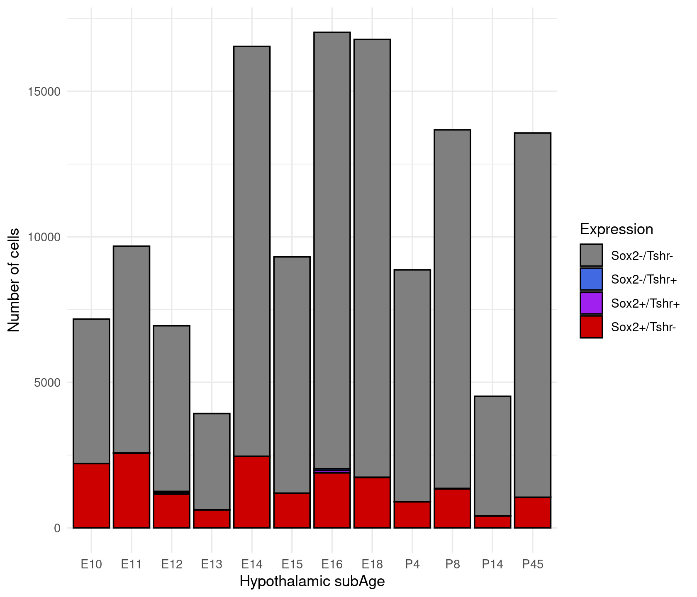{fig-align='center' width=840}
:::

```{.r .cell-code .hidden}
#| label: plot-sox2-tshr-bargraph
#| fig-width: 7
#| fig-height: 6
ggplot(df_counts, aes(x = Age, y = prop, fill = VarComb)) +
  geom_bar(stat = "identity", color = "black", position = "fill") +
  scale_fill_manual(values = c("Sox2+/Tshr-" = "red3", "Sox2+/Tshr+" = "purple", "Sox2-/Tshr+" = "royalblue", "Sox2-/Tshr-" = "grey50")) +
  labs(x = "Hypothalamic subAge", y = "Proportion of cells", fill = "Expression") +
  theme_minimal() +
  scale_x_discrete(labels = c("E10", "E11", "E12", "E13", "E14", "E15", "E16", "E18", "P4", "P8", "P14", "P45"))
```

::: {.cell-output-display}
{fig-align='center' width=840}
:::

```{.r .cell-code .hidden}
#| label: plot-sox2-tshr-bargraph
#| fig-width: 7
#| fig-height: 6
ggplot(df_counts |> filter(!VarComb %in% c("Sox2-/Tshr-", "Sox2+/Tshr-")), aes(x = Age, y = n, fill = VarComb)) +
  geom_bar(stat = "identity", color = "black") +
  scale_fill_manual(values = c("Sox2+/Tshr+" = "purple", "Sox2+/Tshr-" = "red3", "Sox2-/Tshr+" = "royalblue", "Sox2-/Tshr-" = "grey50")) +
  labs(x = "Hypothalamic subAge", y = "Number of cells", fill = "Expression") +
  theme_minimal() +
  scale_x_discrete(labels = c("E10", "E11", "E12", "E13", "E14", "E15", "E16", "E18", "P4", "P8", "P14", "P45"))
```

::: {.cell-output-display}
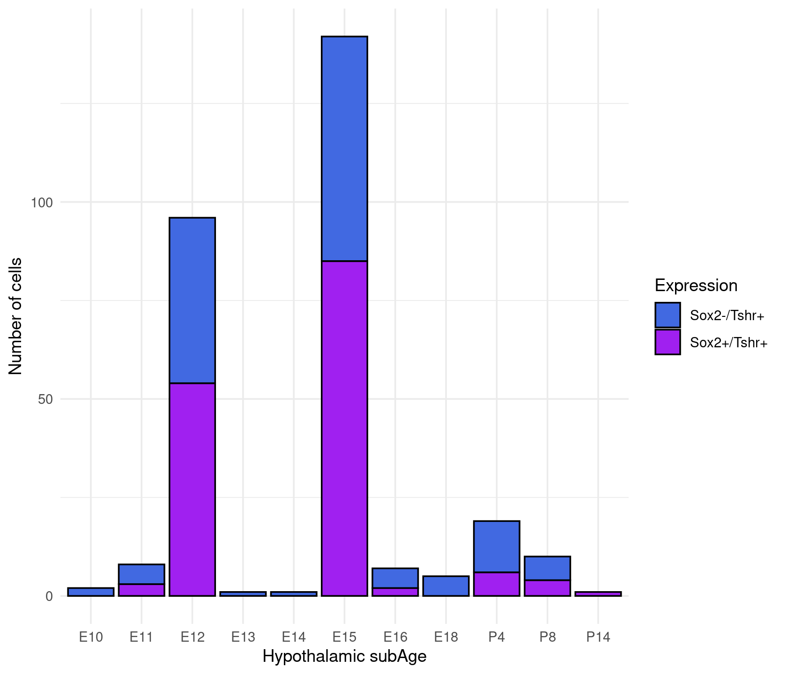{fig-align='center' width=840}
:::

```{.r .cell-code .hidden}
#| label: plot-sox2-tshr-bargraph
#| fig-width: 7
#| fig-height: 6
ggplot(df_counts |> filter(!VarComb %in% c("Sox2-/Tshr-", "Sox2+/Tshr-")), aes(x = Age, y = prop, fill = VarComb)) +
  geom_bar(stat = "identity", color = "black", position = "fill") +
  scale_fill_manual(values = c("Sox2+/Tshr-" = "red3", "Sox2+/Tshr+" = "purple", "Sox2-/Tshr+" = "royalblue", "Sox2-/Tshr-" = "grey50")) +
  labs(x = "Hypothalamic subAge", y = "Proportion of cells", fill = "Expression") +
  theme_minimal() +
  scale_x_discrete(labels = c("E10", "E11", "E12", "E13", "E14", "E15", "E16", "E18", "P4", "P8", "P14", "P45"))
```

::: {.cell-output-display}
{fig-align='center' width=840}
:::
:::


# Calculate and plot chi2 test of independence between Sox2 and Cckbr expression in hypothalamus across different developmental stages


::: {.cell layout-align="center"}

```{.r .cell-code .hidden}
#| label: get-goi-sox2-Cckbr
sbs_mtx <- GetAssayData(object = srt, layer = "counts", assay = "RNA")[c("Sox2", "Cckbr"), ] %>%
  as.data.frame() %>%
  t() %>%
  as.data.frame() %>%
  select(Sox2, Cckbr) %>%
  dplyr::bind_cols(srt@meta.data) %>%
  select(Age, Sox2, Cckbr) %>%
  mutate(
    Sox2_pos = Sox2 > 0,
    Cckbr_pos = Cckbr > 0
  )

sbs_mtx %>% skimr::skim()
```

::: {.cell-output-display}

Table: Data summary

|                         |           |
|:------------------------|:----------|
|Name                     |Piped data |
|Number of rows           |128006     |
|Number of columns        |5          |
|_______________________  |           |
|Column type frequency:   |           |
|factor                   |1          |
|logical                  |2          |
|numeric                  |2          |
|________________________ |           |
|Group variables          |None       |


**Variable type: factor**

|skim_variable | n_missing| complete_rate|ordered | n_unique|top_counts                                    |
|:-------------|---------:|-------------:|:-------|--------:|:---------------------------------------------|
|Age           |         0|             1|FALSE   |       12|P45: 17025, E16: 16781, E14: 16543, P8: 13677 |


**Variable type: logical**

|skim_variable | n_missing| complete_rate| mean|count                   |
|:-------------|---------:|-------------:|----:|:-----------------------|
|Sox2_pos      |         0|             1| 0.14|FAL: 110343, TRU: 17663 |
|Cckbr_pos     |         0|             1| 0.00|FAL: 127679, TRU: 327   |


**Variable type: numeric**

|skim_variable | n_missing| complete_rate| mean|   sd| p0| p25| p50| p75| p100|hist  |
|:-------------|---------:|-------------:|----:|----:|--:|---:|---:|---:|----:|:-----|
|Sox2          |         0|             1| 0.27| 1.21|  0|   0|   0|   0|   82|▇▁▁▁▁ |
|Cckbr         |         0|             1| 0.00| 0.06|  0|   0|   0|   0|    7|▇▁▁▁▁ |


:::
:::

::: {.cell layout-align="center"}

```{.r .cell-code .hidden}
#| label: sox2-Cckbr-stats
#| fig-width: 8
#| fig-height: 24
write_csv(sbs_mtx, here(tables_dir, "Sox2-Cckbr-expression-status-between-Ages-on-evaluation-datasets.csv"))


# plot
grouped_ggpiestats(
  # arguments relevant for `ggpiestats()`
  data = sbs_mtx,
  x = Cckbr_pos,
  y = Sox2_pos,
  grouping.var = Age,
  perc.k = 1,
  package = "ggsci",
  palette = "category10_d3",
  # arguments relevant for `combine_plots()`
  title.text = "Sox2 specification of Cckbr-positive hypothalamic development",
  caption.text = "Asterisks denote results from proportion tests; \n***: p < 0.001, ns: non-significant",
  plotgrid.args = list(nrow = 8)
)
```

::: {.cell-output-display}
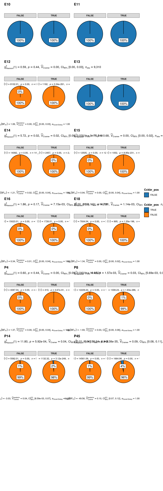{fig-align='center' width=960}
:::
:::


## Barplot of Sox2 and Cckbr expression in hypothalamus across different developmental stages


::: {.cell layout-align="center"}

```{.r .cell-code .hidden}
#| label: plot-sox2-Cckbr-bargraph
#| fig-width: 7
#| fig-height: 6
# Create a new variable that combines Sox2_pos and Cckbr_pos
df <- sbs_mtx %>%
  mutate(Age = factor(Age, levels = c("E10", "E11", "E12", "E13", "E14", "E15", "E16", "E18", "P4", "P8", "P14", "P45"), ordered = TRUE), VarComb = case_when(
    Sox2_pos & Cckbr_pos ~ "Sox2+/Cckbr+",
    Sox2_pos & !Cckbr_pos ~ "Sox2+/Cckbr-",
    !Sox2_pos & Cckbr_pos ~ "Sox2-/Cckbr+",
    !Sox2_pos & !Cckbr_pos ~ "Sox2-/Cckbr-"
  ))

# Calculate counts and proportions for each category
df_counts <- df %>%
  group_by(Age, VarComb) %>%
  summarise(n = n()) %>%
  mutate(prop = n / sum(n))
```

::: {.cell-output .cell-output-stderr .hidden}

```
`summarise()` has grouped output by 'Age'. You can override using the `.groups`
argument.
```


:::

```{.r .cell-code .hidden}
#| label: plot-sox2-Cckbr-bargraph
#| fig-width: 7
#| fig-height: 6
# Calculate the total counts for each category
df_total_counts <- df %>%
  group_by(Age) %>%
  summarise(total_n = n())

# Create a vector of Age names ordered by prop for Sox2+/Cckbr+ cases for each Age
ordered_Ages <- df_counts %>%
  filter(VarComb == "Sox2+/Cckbr-") %>%
  arrange(desc(prop)) %>%
  pull(Age)

# Reorder the factor levels of Age
df_counts$Age <- factor(df_counts$Age, levels = ordered_Ages)
df_total_counts$Age <- factor(df_total_counts$Age, levels = ordered_Ages)

# Reorder the factor levels of combinations
df_counts$VarComb <- factor(df_counts$VarComb, levels = rev(c("Sox2+/Cckbr-", "Sox2+/Cckbr+", "Sox2-/Cckbr+", "Sox2-/Cckbr-")))

# Create a stacked bar plot
ggplot(df_counts, aes(x = Age, y = n, fill = VarComb)) +
  geom_bar(stat = "identity", color = "black") +
  scale_fill_manual(values = c("Sox2+/Cckbr+" = "yellow", "Sox2+/Cckbr-" = "red3", "Sox2-/Cckbr+" = "green", "Sox2-/Cckbr-" = "grey50")) +
  labs(x = "Hypothalamic subAge", y = "Number of cells", fill = "Expression") +
  theme_minimal() +
  scale_x_discrete(labels = c("E10", "E11", "E12", "E13", "E14", "E15", "E16", "E18", "P4", "P8", "P14", "P45"))
```

::: {.cell-output-display}
{fig-align='center' width=840}
:::

```{.r .cell-code .hidden}
#| label: plot-sox2-Cckbr-bargraph
#| fig-width: 7
#| fig-height: 6
ggplot(df_counts, aes(x = Age, y = prop, fill = VarComb)) +
  geom_bar(stat = "identity", color = "black", position = "fill") +
  scale_fill_manual(values = c("Sox2+/Cckbr-" = "red3", "Sox2+/Cckbr+" = "yellow", "Sox2-/Cckbr+" = "green", "Sox2-/Cckbr-" = "grey50")) +
  labs(x = "Hypothalamic subAge", y = "Proportion of cells", fill = "Expression") +
  theme_minimal() +
  scale_x_discrete(labels = c("E10", "E11", "E12", "E13", "E14", "E15", "E16", "E18", "P4", "P8", "P14", "P45"))
```

::: {.cell-output-display}
{fig-align='center' width=840}
:::

```{.r .cell-code .hidden}
#| label: plot-sox2-Cckbr-bargraph
#| fig-width: 7
#| fig-height: 6
ggplot(df_counts |> filter(!VarComb %in% c("Sox2-/Cckbr-", "Sox2+/Cckbr-")), aes(x = Age, y = n, fill = VarComb)) +
  geom_bar(stat = "identity", color = "black") +
  scale_fill_manual(values = c("Sox2+/Cckbr+" = "yellow", "Sox2+/Cckbr-" = "red3", "Sox2-/Cckbr+" = "green", "Sox2-/Cckbr-" = "grey50")) +
  labs(x = "Hypothalamic subAge", y = "Number of cells", fill = "Expression") +
  theme_minimal() +
  scale_x_discrete(labels = c("E10", "E11", "E12", "E13", "E14", "E15", "E16", "E18", "P4", "P8", "P14", "P45"))
```

::: {.cell-output-display}
{fig-align='center' width=840}
:::

```{.r .cell-code .hidden}
#| label: plot-sox2-Cckbr-bargraph
#| fig-width: 7
#| fig-height: 6
ggplot(df_counts |> filter(!VarComb %in% c("Sox2-/Cckbr-", "Sox2+/Cckbr-")), aes(x = Age, y = prop, fill = VarComb)) +
  geom_bar(stat = "identity", color = "black", position = "fill") +
  scale_fill_manual(values = c("Sox2+/Cckbr-" = "red3", "Sox2+/Cckbr+" = "yellow", "Sox2-/Cckbr+" = "green", "Sox2-/Cckbr-" = "grey50")) +
  labs(x = "Hypothalamic subAge", y = "Proportion of cells", fill = "Expression") +
  theme_minimal() +
  scale_x_discrete(labels = c("E10", "E11", "E12", "E13", "E14", "E15", "E16", "E18", "P4", "P8", "P14", "P45"))
```

::: {.cell-output-display}
{fig-align='center' width=840}
:::
:::


# Calculate and plot chi2 test of independence between Cckbr and Tshr expression in hypothalamus across different developmental stages


::: {.cell layout-align="center"}

```{.r .cell-code .hidden}
#| label: get-goi-Cckbr-tshr
sbs_mtx <- GetAssayData(object = srt, layer = "counts", assay = "RNA")[c("Cckbr", "Tshr"), ] %>%
  as.data.frame() %>%
  t() %>%
  as.data.frame() %>%
  select(Cckbr, Tshr) %>%
  dplyr::bind_cols(srt@meta.data) %>%
  select(Age, Cckbr, Tshr) %>%
  mutate(
    Cckbr_pos = Cckbr > 0,
    Tshr_pos = Tshr > 0
  )

sbs_mtx %>% skimr::skim()
```

::: {.cell-output-display}

Table: Data summary

|                         |           |
|:------------------------|:----------|
|Name                     |Piped data |
|Number of rows           |128006     |
|Number of columns        |5          |
|_______________________  |           |
|Column type frequency:   |           |
|factor                   |1          |
|logical                  |2          |
|numeric                  |2          |
|________________________ |           |
|Group variables          |None       |


**Variable type: factor**

|skim_variable | n_missing| complete_rate|ordered | n_unique|top_counts                                    |
|:-------------|---------:|-------------:|:-------|--------:|:---------------------------------------------|
|Age           |         0|             1|FALSE   |       12|P45: 17025, E16: 16781, E14: 16543, P8: 13677 |


**Variable type: logical**

|skim_variable | n_missing| complete_rate| mean|count                 |
|:-------------|---------:|-------------:|----:|:---------------------|
|Cckbr_pos     |         0|             1|    0|FAL: 127679, TRU: 327 |
|Tshr_pos      |         0|             1|    0|FAL: 127714, TRU: 292 |


**Variable type: numeric**

|skim_variable | n_missing| complete_rate| mean|   sd| p0| p25| p50| p75| p100|hist  |
|:-------------|---------:|-------------:|----:|----:|--:|---:|---:|---:|----:|:-----|
|Cckbr         |         0|             1|    0| 0.06|  0|   0|   0|   0|    7|▇▁▁▁▁ |
|Tshr          |         0|             1|    0| 0.06|  0|   0|   0|   0|    5|▇▁▁▁▁ |


:::
:::

::: {.cell layout-align="center"}

```{.r .cell-code .hidden}
#| label: Cckbr-tshr-stats
#| fig-width: 8
#| fig-height: 24
write_csv(sbs_mtx, here(tables_dir, "Cckbr-Tshr-expression-status-between-Ages-on-evaluation-datasets.csv"))


# plot
grouped_ggpiestats(
  # arguments relevant for `ggpiestats()`
  data = sbs_mtx,
  x = Cckbr_pos,
  y = Tshr_pos,
  grouping.var = Age,
  perc.k = 1,
  package = "ggsci",
  palette = "category10_d3",
  # arguments relevant for `combine_plots()`
  title.text = "Cckbr specification of Tshr-positive hypothalamic development",
  caption.text = "Asterisks denote results from proportion tests; \n***: p < 0.001, ns: non-significant",
  plotgrid.args = list(nrow = 8)
)
```

::: {.cell-output-display}
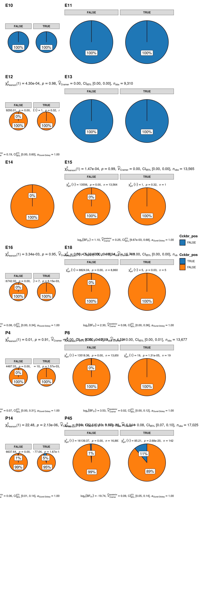{fig-align='center' width=960}
:::
:::


## Barplot of Cckbr and Tshr expression in hypothalamus across different developmental stages


::: {.cell layout-align="center"}

```{.r .cell-code .hidden}
#| label: plot-Cckbr-tshr-bargraph
#| fig-width: 7
#| fig-height: 6
# Create a new variable that combines Cckbr_pos and Tshr_pos
df <- sbs_mtx %>%
  mutate(Age = factor(Age, levels = c("E10", "E11", "E12", "E13", "E14", "E15", "E16", "E18", "P4", "P8", "P14", "P45"), ordered = TRUE), VarComb = case_when(
    Cckbr_pos & Tshr_pos ~ "Cckbr+/Tshr+",
    Cckbr_pos & !Tshr_pos ~ "Cckbr+/Tshr-",
    !Cckbr_pos & Tshr_pos ~ "Cckbr-/Tshr+",
    !Cckbr_pos & !Tshr_pos ~ "Cckbr-/Tshr-"
  ))

# Calculate counts and proportions for each category
df_counts <- df %>%
  group_by(Age, VarComb) %>%
  summarise(n = n()) %>%
  mutate(prop = n / sum(n))
```

::: {.cell-output .cell-output-stderr .hidden}

```
`summarise()` has grouped output by 'Age'. You can override using the `.groups`
argument.
```


:::

```{.r .cell-code .hidden}
#| label: plot-Cckbr-tshr-bargraph
#| fig-width: 7
#| fig-height: 6
# Calculate the total counts for each category
df_total_counts <- df %>%
  group_by(Age) %>%
  summarise(total_n = n())

# Create a vector of Age names ordered by prop for Cckbr+/Tshr+ cases for each Age
ordered_Ages <- df_counts %>%
  filter(VarComb == "Cckbr+/Tshr-") %>%
  arrange(desc(prop)) %>%
  pull(Age)

# Reorder the factor levels of Age
df_counts$Age <- factor(df_counts$Age, levels = ordered_Ages)
df_total_counts$Age <- factor(df_total_counts$Age, levels = ordered_Ages)

# Reorder the factor levels of combinations
df_counts$VarComb <- factor(df_counts$VarComb, levels = rev(c("Cckbr+/Tshr-", "Cckbr+/Tshr+", "Cckbr-/Tshr+", "Cckbr-/Tshr-")))

# Create a stacked bar plot
ggplot(df_counts, aes(x = Age, y = n, fill = VarComb)) +
  geom_bar(stat = "identity", color = "black") +
  scale_fill_manual(values = c("Cckbr+/Tshr+" = "cyan", "Cckbr+/Tshr-" = "green", "Cckbr-/Tshr+" = "royalblue", "Cckbr-/Tshr-" = "grey50")) +
  labs(x = "Hypothalamic subAge", y = "Number of cells", fill = "Expression") +
  theme_minimal() +
  scale_x_discrete(labels = c("E10", "E11", "E12", "E13", "E14", "E15", "E16", "E18", "P4", "P8", "P14", "P45"))
```

::: {.cell-output-display}
{fig-align='center' width=840}
:::

```{.r .cell-code .hidden}
#| label: plot-Cckbr-tshr-bargraph
#| fig-width: 7
#| fig-height: 6
ggplot(df_counts, aes(x = Age, y = prop, fill = VarComb)) +
  geom_bar(stat = "identity", color = "black", position = "fill") +
  scale_fill_manual(values = c("Cckbr+/Tshr-" = "green", "Cckbr+/Tshr+" = "cyan", "Cckbr-/Tshr+" = "royalblue", "Cckbr-/Tshr-" = "grey50")) +
  labs(x = "Hypothalamic subAge", y = "Proportion of cells", fill = "Expression") +
  theme_minimal() +
  scale_x_discrete(labels = c("E10", "E11", "E12", "E13", "E14", "E15", "E16", "E18", "P4", "P8", "P14", "P45"))
```

::: {.cell-output-display}
{fig-align='center' width=840}
:::

```{.r .cell-code .hidden}
#| label: plot-Cckbr-tshr-bargraph
#| fig-width: 7
#| fig-height: 6
ggplot(df_counts |> filter(!VarComb %in% c("Cckbr-/Tshr-", "Cckbr+/Tshr-")), aes(x = Age, y = n, fill = VarComb)) +
  geom_bar(stat = "identity", color = "black") +
  scale_fill_manual(values = c("Cckbr+/Tshr+" = "cyan", "Cckbr+/Tshr-" = "green", "Cckbr-/Tshr+" = "royalblue", "Cckbr-/Tshr-" = "grey50")) +
  labs(x = "Hypothalamic subAge", y = "Number of cells", fill = "Expression") +
  theme_minimal() +
  scale_x_discrete(labels = c("E10", "E11", "E12", "E13", "E14", "E15", "E16", "E18", "P4", "P8", "P14", "P45"))
```

::: {.cell-output-display}
{fig-align='center' width=840}
:::

```{.r .cell-code .hidden}
#| label: plot-Cckbr-tshr-bargraph
#| fig-width: 7
#| fig-height: 6
ggplot(df_counts |> filter(!VarComb %in% c("Cckbr-/Tshr-", "Cckbr+/Tshr-")), aes(x = Age, y = prop, fill = VarComb)) +
  geom_bar(stat = "identity", color = "black", position = "fill") +
  scale_fill_manual(values = c("Cckbr+/Tshr-" = "green", "Cckbr+/Tshr+" = "cyan", "Cckbr-/Tshr+" = "royalblue", "Cckbr-/Tshr-" = "grey50")) +
  labs(x = "Hypothalamic subAge", y = "Proportion of cells", fill = "Expression") +
  theme_minimal() +
  scale_x_discrete(labels = c("E10", "E11", "E12", "E13", "E14", "E15", "E16", "E18", "P4", "P8", "P14", "P45"))
```

::: {.cell-output-display}
{fig-align='center' width=840}
:::
:::


# Calculate and plot chi2 test of independence between Sox2 and Gpr173 expression in hypothalamus across different developmental stages


::: {.cell layout-align="center"}

```{.r .cell-code .hidden}
#| label: get-goi-sox2-Gpr173
sbs_mtx <- GetAssayData(object = srt, layer = "counts", assay = "RNA")[c("Sox2", "Gpr173"), ] %>%
  as.data.frame() %>%
  t() %>%
  as.data.frame() %>%
  select(Sox2, Gpr173) %>%
  dplyr::bind_cols(srt@meta.data) %>%
  select(Age, Sox2, Gpr173) %>%
  mutate(
    Sox2_pos = Sox2 > 0,
    Gpr173_pos = Gpr173 > 0
  )

sbs_mtx %>% skimr::skim()
```

::: {.cell-output-display}

Table: Data summary

|                         |           |
|:------------------------|:----------|
|Name                     |Piped data |
|Number of rows           |128006     |
|Number of columns        |5          |
|_______________________  |           |
|Column type frequency:   |           |
|factor                   |1          |
|logical                  |2          |
|numeric                  |2          |
|________________________ |           |
|Group variables          |None       |


**Variable type: factor**

|skim_variable | n_missing| complete_rate|ordered | n_unique|top_counts                                    |
|:-------------|---------:|-------------:|:-------|--------:|:---------------------------------------------|
|Age           |         0|             1|FALSE   |       12|P45: 17025, E16: 16781, E14: 16543, P8: 13677 |


**Variable type: logical**

|skim_variable | n_missing| complete_rate| mean|count                   |
|:-------------|---------:|-------------:|----:|:-----------------------|
|Sox2_pos      |         0|             1| 0.14|FAL: 110343, TRU: 17663 |
|Gpr173_pos    |         0|             1| 0.02|FAL: 125963, TRU: 2043  |


**Variable type: numeric**

|skim_variable | n_missing| complete_rate| mean|   sd| p0| p25| p50| p75| p100|hist  |
|:-------------|---------:|-------------:|----:|----:|--:|---:|---:|---:|----:|:-----|
|Sox2          |         0|             1| 0.27| 1.21|  0|   0|   0|   0|   82|▇▁▁▁▁ |
|Gpr173        |         0|             1| 0.02| 0.13|  0|   0|   0|   0|    4|▇▁▁▁▁ |


:::
:::

::: {.cell layout-align="center"}

```{.r .cell-code .hidden}
#| label: sox2-Gpr173-stats
#| fig-width: 8
#| fig-height: 24
write_csv(sbs_mtx, here(tables_dir, "Sox2-Gpr173-expression-status-between-Ages-on-evaluation-datasets.csv"))


# plot
grouped_ggpiestats(
  # arguments relevant for `ggpiestats()`
  data = sbs_mtx,
  x = Gpr173_pos,
  y = Sox2_pos,
  grouping.var = Age,
  perc.k = 1,
  package = "ggsci",
  palette = "category10_d3",
  # arguments relevant for `combine_plots()`
  title.text = "Sox2 specification of Gpr173-positive hypothalamic development",
  caption.text = "Asterisks denote results from proportion tests; \n***: p < 0.001, ns: non-significant",
  plotgrid.args = list(nrow = 8)
)
```

::: {.cell-output-display}
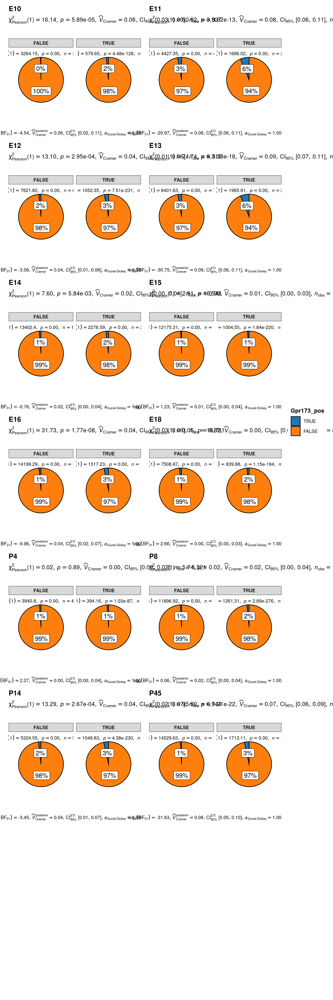{fig-align='center' width=960}
:::
:::


## Barplot of Sox2 and Gpr173 expression in hypothalamus across different developmental stages


::: {.cell layout-align="center"}

```{.r .cell-code .hidden}
#| label: plot-sox2-Gpr173-bargraph
#| fig-width: 7
#| fig-height: 6
# Create a new variable that combines Sox2_pos and Gpr173_pos
df <- sbs_mtx %>%
  mutate(Age = factor(Age, levels = c("E10", "E11", "E12", "E13", "E14", "E15", "E16", "E18", "P4", "P8", "P14", "P45"), ordered = TRUE), VarComb = case_when(
    Sox2_pos & Gpr173_pos ~ "Sox2+/Gpr173+",
    Sox2_pos & !Gpr173_pos ~ "Sox2+/Gpr173-",
    !Sox2_pos & Gpr173_pos ~ "Sox2-/Gpr173+",
    !Sox2_pos & !Gpr173_pos ~ "Sox2-/Gpr173-"
  ))

# Calculate counts and proportions for each category
df_counts <- df %>%
  group_by(Age, VarComb) %>%
  summarise(n = n()) %>%
  mutate(prop = n / sum(n))
```

::: {.cell-output .cell-output-stderr .hidden}

```
`summarise()` has grouped output by 'Age'. You can override using the `.groups`
argument.
```


:::

```{.r .cell-code .hidden}
#| label: plot-sox2-Gpr173-bargraph
#| fig-width: 7
#| fig-height: 6
# Calculate the total counts for each category
df_total_counts <- df %>%
  group_by(Age) %>%
  summarise(total_n = n())

# Create a vector of Age names ordered by prop for Sox2+/Gpr173+ cases for each Age
ordered_Ages <- df_counts %>%
  filter(VarComb == "Sox2+/Gpr173-") %>%
  arrange(desc(prop)) %>%
  pull(Age)

# Reorder the factor levels of Age
df_counts$Age <- factor(df_counts$Age, levels = ordered_Ages)
df_total_counts$Age <- factor(df_total_counts$Age, levels = ordered_Ages)

# Reorder the factor levels of combinations
df_counts$VarComb <- factor(df_counts$VarComb, levels = rev(c("Sox2+/Gpr173-", "Sox2+/Gpr173+", "Sox2-/Gpr173+", "Sox2-/Gpr173-")))

# Create a stacked bar plot
ggplot(df_counts, aes(x = Age, y = n, fill = VarComb)) +
  geom_bar(stat = "identity", color = "black") +
  scale_fill_manual(values = c("Sox2+/Gpr173+" = "deeppink", "Sox2+/Gpr173-" = "red3", "Sox2-/Gpr173+" = "orchid", "Sox2-/Gpr173-" = "grey50")) +
  labs(x = "Hypothalamic subAge", y = "Number of cells", fill = "Expression") +
  theme_minimal() +
  scale_x_discrete(labels = c("E10", "E11", "E12", "E13", "E14", "E15", "E16", "E18", "P4", "P8", "P14", "P45"))
```

::: {.cell-output-display}
{fig-align='center' width=840}
:::

```{.r .cell-code .hidden}
#| label: plot-sox2-Gpr173-bargraph
#| fig-width: 7
#| fig-height: 6
ggplot(df_counts, aes(x = Age, y = prop, fill = VarComb)) +
  geom_bar(stat = "identity", color = "black", position = "fill") +
  scale_fill_manual(values = c("Sox2+/Gpr173-" = "red3", "Sox2+/Gpr173+" = "deeppink", "Sox2-/Gpr173+" = "orchid", "Sox2-/Gpr173-" = "grey50")) +
  labs(x = "Hypothalamic subAge", y = "Proportion of cells", fill = "Expression") +
  theme_minimal() +
  scale_x_discrete(labels = c("E10", "E11", "E12", "E13", "E14", "E15", "E16", "E18", "P4", "P8", "P14", "P45"))
```

::: {.cell-output-display}
{fig-align='center' width=840}
:::

```{.r .cell-code .hidden}
#| label: plot-sox2-Gpr173-bargraph
#| fig-width: 7
#| fig-height: 6
ggplot(df_counts |> filter(!VarComb %in% c("Sox2-/Gpr173-", "Sox2+/Gpr173-")), aes(x = Age, y = n, fill = VarComb)) +
  geom_bar(stat = "identity", color = "black") +
  scale_fill_manual(values = c("Sox2+/Gpr173+" = "deeppink", "Sox2+/Gpr173-" = "red3", "Sox2-/Gpr173+" = "orchid", "Sox2-/Gpr173-" = "grey50")) +
  labs(x = "Hypothalamic subAge", y = "Number of cells", fill = "Expression") +
  theme_minimal() +
  scale_x_discrete(labels = c("E10", "E11", "E12", "E13", "E14", "E15", "E16", "E18", "P4", "P8", "P14", "P45"))
```

::: {.cell-output-display}
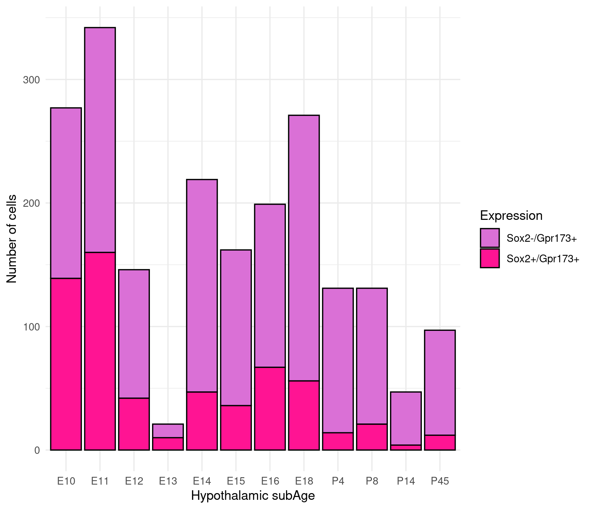{fig-align='center' width=840}
:::

```{.r .cell-code .hidden}
#| label: plot-sox2-Gpr173-bargraph
#| fig-width: 7
#| fig-height: 6
ggplot(df_counts |> filter(!VarComb %in% c("Sox2-/Gpr173-", "Sox2+/Gpr173-")), aes(x = Age, y = prop, fill = VarComb)) +
  geom_bar(stat = "identity", color = "black", position = "fill") +
  scale_fill_manual(values = c("Sox2+/Gpr173-" = "red3", "Sox2+/Gpr173+" = "deeppink", "Sox2-/Gpr173+" = "orchid", "Sox2-/Gpr173-" = "grey50")) +
  labs(x = "Hypothalamic subAge", y = "Proportion of cells", fill = "Expression") +
  theme_minimal() +
  scale_x_discrete(labels = c("E10", "E11", "E12", "E13", "E14", "E15", "E16", "E18", "P4", "P8", "P14", "P45"))
```

::: {.cell-output-display}
{fig-align='center' width=840}
:::
:::


# Calculate and plot chi2 test of independence between Gpr173 and Tshr expression in hypothalamus across different developmental stages


::: {.cell layout-align="center"}

```{.r .cell-code .hidden}
#| label: get-goi-Gpr173-tshr
sbs_mtx <- GetAssayData(object = srt, layer = "counts", assay = "RNA")[c("Gpr173", "Tshr"), ] %>%
  as.data.frame() %>%
  t() %>%
  as.data.frame() %>%
  select(Gpr173, Tshr) %>%
  dplyr::bind_cols(srt@meta.data) %>%
  select(Age, Gpr173, Tshr) %>%
  mutate(
    Gpr173_pos = Gpr173 > 0,
    Tshr_pos = Tshr > 0
  )

sbs_mtx %>% skimr::skim()
```

::: {.cell-output-display}

Table: Data summary

|                         |           |
|:------------------------|:----------|
|Name                     |Piped data |
|Number of rows           |128006     |
|Number of columns        |5          |
|_______________________  |           |
|Column type frequency:   |           |
|factor                   |1          |
|logical                  |2          |
|numeric                  |2          |
|________________________ |           |
|Group variables          |None       |


**Variable type: factor**

|skim_variable | n_missing| complete_rate|ordered | n_unique|top_counts                                    |
|:-------------|---------:|-------------:|:-------|--------:|:---------------------------------------------|
|Age           |         0|             1|FALSE   |       12|P45: 17025, E16: 16781, E14: 16543, P8: 13677 |


**Variable type: logical**

|skim_variable | n_missing| complete_rate| mean|count                  |
|:-------------|---------:|-------------:|----:|:----------------------|
|Gpr173_pos    |         0|             1| 0.02|FAL: 125963, TRU: 2043 |
|Tshr_pos      |         0|             1| 0.00|FAL: 127714, TRU: 292  |


**Variable type: numeric**

|skim_variable | n_missing| complete_rate| mean|   sd| p0| p25| p50| p75| p100|hist  |
|:-------------|---------:|-------------:|----:|----:|--:|---:|---:|---:|----:|:-----|
|Gpr173        |         0|             1| 0.02| 0.13|  0|   0|   0|   0|    4|▇▁▁▁▁ |
|Tshr          |         0|             1| 0.00| 0.06|  0|   0|   0|   0|    5|▇▁▁▁▁ |


:::
:::

::: {.cell layout-align="center"}

```{.r .cell-code .hidden}
#| label: Gpr173-tshr-stats
#| fig-width: 8
#| fig-height: 24
write_csv(sbs_mtx, here(tables_dir, "Gpr173-Tshr-expression-status-between-Ages-on-evaluation-datasets.csv"))


# plot
grouped_ggpiestats(
  # arguments relevant for `ggpiestats()`
  data = sbs_mtx,
  x = Gpr173_pos,
  y = Tshr_pos,
  grouping.var = Age,
  perc.k = 1,
  package = "ggsci",
  palette = "category10_d3",
  # arguments relevant for `combine_plots()`
  title.text = "Gpr173 specification of Tshr-positive hypothalamic development",
  caption.text = "Asterisks denote results from proportion tests; \n***: p < 0.001, ns: non-significant",
  plotgrid.args = list(nrow = 8)
)
```

::: {.cell-output-display}
{fig-align='center' width=960}
:::
:::


## Barplot of Gpr173 and Tshr expression in hypothalamus across different developmental stages


::: {.cell layout-align="center"}

```{.r .cell-code .hidden}
#| label: plot-Gpr173-tshr-bargraph
#| fig-width: 7
#| fig-height: 6
# Create a new variable that combines Gpr173_pos and Tshr_pos
df <- sbs_mtx %>%
  mutate(Age = factor(Age, levels = c("E10", "E11", "E12", "E13", "E14", "E15", "E16", "E18", "P4", "P8", "P14", "P45"), ordered = TRUE), VarComb = case_when(
    Gpr173_pos & Tshr_pos ~ "Gpr173+/Tshr+",
    Gpr173_pos & !Tshr_pos ~ "Gpr173+/Tshr-",
    !Gpr173_pos & Tshr_pos ~ "Gpr173-/Tshr+",
    !Gpr173_pos & !Tshr_pos ~ "Gpr173-/Tshr-"
  ))

# Calculate counts and proportions for each category
df_counts <- df %>%
  group_by(Age, VarComb) %>%
  summarise(n = n()) %>%
  mutate(prop = n / sum(n))
```

::: {.cell-output .cell-output-stderr .hidden}

```
`summarise()` has grouped output by 'Age'. You can override using the `.groups`
argument.
```


:::

```{.r .cell-code .hidden}
#| label: plot-Gpr173-tshr-bargraph
#| fig-width: 7
#| fig-height: 6
# Calculate the total counts for each category
df_total_counts <- df %>%
  group_by(Age) %>%
  summarise(total_n = n())

# Create a vector of Age names ordered by prop for Gpr173+/Tshr+ cases for each Age
ordered_Ages <- df_counts %>%
  filter(VarComb == "Gpr173+/Tshr-") %>%
  arrange(desc(prop)) %>%
  pull(Age)

# Reorder the factor levels of Age
df_counts$Age <- factor(df_counts$Age, levels = ordered_Ages)
df_total_counts$Age <- factor(df_total_counts$Age, levels = ordered_Ages)

# Reorder the factor levels of combinations
df_counts$VarComb <- factor(df_counts$VarComb, levels = rev(c("Gpr173+/Tshr-", "Gpr173+/Tshr+", "Gpr173-/Tshr+", "Gpr173-/Tshr-")))

# Create a stacked bar plot
ggplot(df_counts, aes(x = Age, y = n, fill = VarComb)) +
  geom_bar(stat = "identity", color = "black") +
  scale_fill_manual(values = c("Gpr173+/Tshr+" = "magenta4", "Gpr173+/Tshr-" = "orchid", "Gpr173-/Tshr+" = "royalblue", "Gpr173-/Tshr-" = "grey50")) +
  labs(x = "Hypothalamic subAge", y = "Number of cells", fill = "Expression") +
  theme_minimal() +
  scale_x_discrete(labels = c("E10", "E11", "E12", "E13", "E14", "E15", "E16", "E18", "P4", "P8", "P14", "P45"))
```

::: {.cell-output-display}
{fig-align='center' width=840}
:::

```{.r .cell-code .hidden}
#| label: plot-Gpr173-tshr-bargraph
#| fig-width: 7
#| fig-height: 6
ggplot(df_counts, aes(x = Age, y = prop, fill = VarComb)) +
  geom_bar(stat = "identity", color = "black", position = "fill") +
  scale_fill_manual(values = c("Gpr173+/Tshr-" = "orchid", "Gpr173+/Tshr+" = "magenta4", "Gpr173-/Tshr+" = "royalblue", "Gpr173-/Tshr-" = "grey50")) +
  labs(x = "Hypothalamic subAge", y = "Proportion of cells", fill = "Expression") +
  theme_minimal() +
  scale_x_discrete(labels = c("E10", "E11", "E12", "E13", "E14", "E15", "E16", "E18", "P4", "P8", "P14", "P45"))
```

::: {.cell-output-display}
{fig-align='center' width=840}
:::

```{.r .cell-code .hidden}
#| label: plot-Gpr173-tshr-bargraph
#| fig-width: 7
#| fig-height: 6
ggplot(df_counts |> filter(!VarComb %in% c("Gpr173-/Tshr-", "Gpr173+/Tshr-")), aes(x = Age, y = n, fill = VarComb)) +
  geom_bar(stat = "identity", color = "black") +
  scale_fill_manual(values = c("Gpr173+/Tshr+" = "magenta4", "Gpr173+/Tshr-" = "orchid", "Gpr173-/Tshr+" = "royalblue", "Gpr173-/Tshr-" = "grey50")) +
  labs(x = "Hypothalamic subAge", y = "Number of cells", fill = "Expression") +
  theme_minimal() +
  scale_x_discrete(labels = c("E10", "E11", "E12", "E13", "E14", "E15", "E16", "E18", "P4", "P8", "P14", "P45"))
```

::: {.cell-output-display}
{fig-align='center' width=840}
:::

```{.r .cell-code .hidden}
#| label: plot-Gpr173-tshr-bargraph
#| fig-width: 7
#| fig-height: 6
ggplot(df_counts |> filter(!VarComb %in% c("Gpr173-/Tshr-", "Gpr173+/Tshr-")), aes(x = Age, y = prop, fill = VarComb)) +
  geom_bar(stat = "identity", color = "black", position = "fill") +
  scale_fill_manual(values = c("Gpr173+/Tshr-" = "orchid", "Gpr173+/Tshr+" = "magenta4", "Gpr173-/Tshr+" = "royalblue", "Gpr173-/Tshr-" = "grey50")) +
  labs(x = "Hypothalamic subAge", y = "Proportion of cells", fill = "Expression") +
  theme_minimal() +
  scale_x_discrete(labels = c("E10", "E11", "E12", "E13", "E14", "E15", "E16", "E18", "P4", "P8", "P14", "P45"))
```

::: {.cell-output-display}
{fig-align='center' width=840}
:::
:::


# Dotplots


::: {.cell layout-align="center"}

```{.r .cell-code .hidden}
#| label: plt-dotplot-dendrogram-genes-npr
#| fig-width: 6
#| fig-height: 6
goi <- c("Tshb", "Cck", "Pitx1", "Eya3", "Sox2", "Hlf", "Igfbp5", "Tshr", "Cckar", "Cckbr", "Gpr173")
Idents(srt) <- "Age"

DotPlot_scCustom(seurat_object = srt, colors_use = viridis(n = 30, alpha = .75, direction = -1, option = "E"), features = goi[goi %in% rownames(srt)], flip_axes = T, x_lab_rotate = TRUE, dot.scale = 15)
```

::: {.cell-output-display}
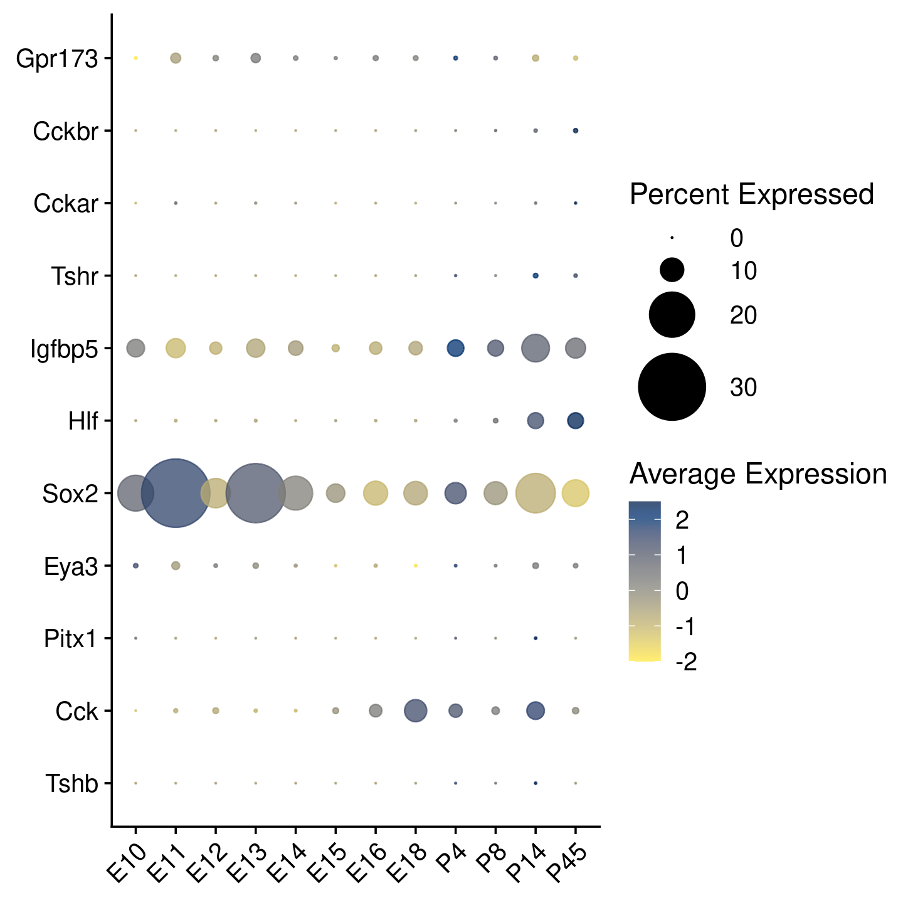{fig-align='center' width=720}
:::

```{.r .cell-code .hidden}
#| label: plt-dotplot-dendrogram-genes-npr
#| fig-width: 6
#| fig-height: 6
DotPlot(srt, features = goi[goi %in% rownames(srt)], dot.scale = 15)
```

::: {.cell-output-display}
{fig-align='center' width=720}
:::
:::

::: {.cell layout-align="center"}

```{.r .cell-code .hidden}
sessioninfo::session_info()
```

::: {.cell-output .cell-output-stdout}

```
─ Session info ───────────────────────────────────────────────────────────────
 setting  value
 version  R version 4.4.2 (2024-10-31)
 os       Ubuntu 22.04.5 LTS
 system   x86_64, linux-gnu
 ui       X11
 language en_US:en
 collate  en_US.UTF-8
 ctype    en_US.UTF-8
 tz       Etc/UTC
 date     2024-12-21
 pandoc   3.1.11.1 @ /home/etretiakov/micromamba/bin/ (via rmarkdown)

─ Packages ───────────────────────────────────────────────────────────────────
 package          * version     date (UTC) lib source
 abind              1.4-8       2024-09-12 [2] RSPM
 base64enc          0.1-3       2015-07-28 [2] RSPM (R 4.4.0)
 BayesFactor        0.9.12-4.7  2024-01-24 [2] RSPM
 bayestestR         0.15.0      2024-10-17 [2] RSPM (R 4.4.0)
 beeswarm           0.4.0       2021-06-01 [2] RSPM (R 4.4.0)
 BiocManager        1.30.25     2024-08-28 [2] RSPM (R 4.4.0)
 bit                4.5.0       2024-09-20 [2] RSPM
 bit64              4.5.2       2024-09-22 [2] RSPM
 circlize           0.4.16      2024-12-04 [2] Github (jokergoo/circlize@9b21578)
 cli                3.6.3       2024-06-21 [2] RSPM (R 4.4.0)
 cluster            2.1.6       2023-12-01 [2] CRAN (R 4.4.2)
 coda               0.19-4.1    2024-01-31 [2] RSPM
 codetools          0.2-20      2024-03-31 [2] CRAN (R 4.4.2)
 colorspace         2.1-1       2024-07-26 [2] RSPM (R 4.4.0)
 correlation        0.8.6       2024-10-26 [2] RSPM (R 4.4.0)
 cowplot          * 1.1.3       2024-01-22 [2] RSPM
 crayon             1.5.3       2024-06-20 [2] RSPM (R 4.4.0)
 data.table         1.16.2      2024-10-10 [2] RSPM
 datawizard         0.13.0.17   2024-12-04 [2] Github (easystats/datawizard@25f8ec4)
 deldir             2.0-4       2024-02-28 [2] RSPM (R 4.4.0)
 digest             0.6.37      2024-08-19 [2] RSPM (R 4.4.0)
 dotCall64          1.2         2024-10-04 [2] RSPM
 dplyr            * 1.1.4       2023-11-17 [2] RSPM (R 4.4.0)
 effectsize         0.8.9       2024-07-03 [2] RSPM (R 4.4.0)
 emmeans            1.10.5      2024-10-14 [2] RSPM
 estimability       1.5.1       2024-05-12 [2] RSPM (R 4.4.0)
 evaluate           1.0.1       2024-10-10 [2] RSPM (R 4.4.0)
 fansi              1.0.6       2023-12-08 [2] RSPM (R 4.4.0)
 farver             2.1.2       2024-05-13 [2] RSPM (R 4.4.0)
 fastDummies        1.7.4       2024-08-16 [2] RSPM
 fastmap            1.2.0       2024-05-15 [2] RSPM (R 4.4.0)
 fitdistrplus       1.2-1       2024-07-12 [2] RSPM (R 4.4.0)
 forcats          * 1.0.0       2023-01-29 [2] RSPM
 future           * 1.34.0      2024-07-29 [2] RSPM
 future.apply       1.11.3      2024-10-27 [2] RSPM
 generics           0.1.3       2022-07-05 [2] RSPM (R 4.4.0)
 ggbeeswarm         0.7.2       2024-12-04 [2] Github (eclarke/ggbeeswarm@14ef76c)
 ggmin              0.0.0.9000  2024-12-04 [2] Github (sjessa/ggmin@8ada274)
 ggplot2          * 3.5.1       2024-04-23 [2] RSPM (R 4.4.0)
 ggprism            1.0.5       2024-12-04 [2] Github (csdaw/ggprism@b6e6c0e)
 ggrastr            1.0.2       2024-12-04 [2] Github (VPetukhov/ggrastr@50ca3e0)
 ggrepel            0.9.6.9999  2024-12-04 [2] Github (slowkow/ggrepel@e72a66d)
 ggridges           0.5.6       2024-01-23 [2] RSPM
 ggsci              3.2.0       2024-12-04 [2] Github (nanxstats/ggsci@b5bf1fd)
 ggstatsplot      * 0.12.5.9000 2024-12-04 [2] Github (IndrajeetPatil/ggstatsplot@d312b9f)
 GlobalOptions      0.1.2       2020-06-10 [2] RSPM (R 4.4.0)
 globals            0.16.3      2024-03-08 [2] RSPM
 glue               1.8.0       2024-09-30 [2] RSPM (R 4.4.0)
 goftest            1.2-3       2021-10-07 [2] RSPM
 gridExtra          2.3         2017-09-09 [2] RSPM
 gtable             0.3.6       2024-10-25 [2] RSPM (R 4.4.0)
 here             * 1.0.1       2020-12-13 [2] RSPM
 hexbin           * 1.28.5      2024-11-13 [2] RSPM (R 4.4.0)
 hms                1.1.3       2023-03-21 [2] RSPM
 htmltools          0.5.8.1     2024-04-04 [2] RSPM (R 4.4.0)
 htmlwidgets        1.6.4       2023-12-06 [2] RSPM (R 4.4.0)
 httpuv             1.6.15      2024-03-26 [2] RSPM (R 4.4.0)
 httr               1.4.7       2023-08-15 [2] RSPM (R 4.4.0)
 ica                1.0-3       2022-07-08 [2] RSPM
 igraph             2.1.1       2024-10-19 [2] RSPM (R 4.4.0)
 insight            1.0.0.2     2024-12-04 [2] Github (easystats/insight@8e78b12)
 irlba              2.3.5.1     2022-10-03 [2] RSPM
 janitor            2.2.0.9000  2024-12-04 [2] Github (sfirke/janitor@6ee7919)
 jsonlite           1.8.9       2024-09-20 [2] RSPM (R 4.4.0)
 KernSmooth         2.23-24     2024-05-17 [2] CRAN (R 4.4.2)
 knitr              1.49        2024-11-08 [2] RSPM
 labeling           0.4.3       2023-08-29 [2] RSPM (R 4.4.0)
 later              1.4.1       2024-11-27 [2] RSPM (R 4.4.0)
 lattice            0.22-6      2024-03-20 [2] CRAN (R 4.4.2)
 lazyeval           0.2.2       2019-03-15 [2] RSPM (R 4.4.0)
 leiden             0.4.3.1     2023-11-17 [2] RSPM
 lifecycle          1.0.4       2023-11-07 [2] RSPM (R 4.4.0)
 listenv            0.9.1       2024-01-29 [2] RSPM
 lmtest             0.9-40      2022-03-21 [2] RSPM (R 4.4.0)
 lubridate        * 1.9.3       2023-09-27 [2] RSPM
 magrittr         * 2.0.3       2022-03-30 [2] RSPM (R 4.4.0)
 MASS               7.3-61      2024-06-13 [2] CRAN (R 4.4.2)
 Matrix             1.7-1       2024-10-18 [2] CRAN (R 4.4.2)
 MatrixModels       0.5-3       2023-11-06 [2] RSPM
 matrixStats        1.4.1       2024-09-08 [2] RSPM (R 4.4.0)
 mime               0.12        2021-09-28 [2] RSPM (R 4.4.0)
 miniUI             0.1.1.1     2018-05-18 [2] RSPM
 multcomp           1.4-26      2024-07-18 [2] RSPM
 munsell            0.5.1       2024-04-01 [2] RSPM (R 4.4.0)
 mvtnorm            1.3-2       2024-11-04 [2] RSPM
 nlme               3.1-166     2024-08-14 [2] CRAN (R 4.4.2)
 paletteer          1.6.0       2024-01-21 [2] RSPM
 parallelly         1.39.0      2024-11-07 [2] RSPM
 parameters         0.24.0.3    2024-12-04 [2] Github (easystats/parameters@eff54e5)
 patchwork        * 1.3.0.9000  2024-12-04 [2] Github (thomasp85/patchwork@2695a9f)
 pbapply            1.7-2       2023-06-27 [2] RSPM
 pillar             1.9.0       2023-03-22 [2] RSPM (R 4.4.0)
 pkgconfig          2.0.3       2019-09-22 [2] RSPM (R 4.4.0)
 plotly             4.10.4      2024-01-13 [2] RSPM
 plyr               1.8.9       2023-10-02 [2] RSPM
 png                0.1-8       2022-11-29 [2] RSPM
 polyclip           1.10-7      2024-07-23 [2] RSPM (R 4.4.0)
 prismatic          1.1.2       2024-04-10 [2] RSPM
 progressr          0.15.1      2024-11-22 [2] RSPM
 promises           1.3.2       2024-11-28 [2] RSPM (R 4.4.0)
 purrr            * 1.0.2       2023-08-10 [2] RSPM (R 4.4.0)
 R.methodsS3        1.8.2       2022-06-13 [2] RSPM (R 4.4.0)
 R.oo               1.27.0      2024-11-01 [2] RSPM (R 4.4.0)
 R.utils            2.12.3      2023-11-18 [2] RSPM (R 4.4.0)
 R6                 2.5.1       2021-08-19 [2] RSPM (R 4.4.0)
 RANN               2.6.2       2024-08-25 [2] RSPM (R 4.4.0)
 RColorBrewer     * 1.1-3       2022-04-03 [2] RSPM
 Rcpp               1.0.13-1    2024-11-02 [2] RSPM (R 4.4.0)
 RcppAnnoy          0.0.22      2024-01-23 [2] RSPM
 RcppHNSW           0.6.0       2024-02-04 [2] RSPM
 readr            * 2.1.5       2024-01-10 [2] RSPM
 rematch2           2.1.2       2020-05-01 [2] RSPM
 remotes            2.5.0       2024-03-17 [2] RSPM
 repr               1.1.7       2024-03-22 [2] RSPM
 reshape2           1.4.4       2020-04-09 [2] RSPM
 reticulate         1.40.0.9000 2024-12-04 [2] Github (rstudio/reticulate@61f0fa4)
 rhdf5              2.50.0      2024-10-29 [2] RSPM (R 4.4.2)
 rhdf5filters       1.18.0      2024-10-29 [2] RSPM (R 4.4.2)
 Rhdf5lib           1.28.0      2024-10-29 [2] RSPM (R 4.4.2)
 rlang              1.1.4       2024-06-04 [2] RSPM (R 4.4.0)
 rmarkdown          2.29        2024-11-04 [2] RSPM
 ROCR               1.0-11      2020-05-02 [2] RSPM (R 4.4.0)
 rprojroot          2.0.4       2023-11-05 [2] RSPM (R 4.4.0)
 RSpectra           0.16-2      2024-07-18 [2] RSPM
 rstudioapi         0.17.1      2024-10-22 [2] RSPM
 rsvd               1.0.5       2021-04-16 [2] RSPM (R 4.4.0)
 Rtsne              0.17        2023-12-07 [2] RSPM (R 4.4.0)
 sandwich           3.1-1       2024-09-15 [2] RSPM
 scales             1.3.0       2023-11-28 [2] RSPM (R 4.4.0)
 scattermore        1.2         2023-06-12 [2] RSPM
 scCustomize      * 2.1.2       2024-12-04 [2] Github (samuel-marsh/scCustomize@fc7a282)
 schard             0.0.1       2024-12-04 [2] Github (cellgeni/schard@c22b46d)
 sctransform        0.4.1       2023-10-19 [2] RSPM
 sessioninfo        1.2.2       2021-12-06 [2] RSPM
 Seurat           * 5.1.0       2024-12-04 [2] Github (satijalab/seurat@1549dcb)
 SeuratObject     * 5.0.99.9001 2024-12-04 [2] Github (satijalab/seurat-object@42e53ba)
 SeuratWrappers   * 0.4.0       2024-12-04 [2] Github (satijalab/seurat-wrappers@a1eb0d8)
 shape              1.4.6.1     2024-02-23 [2] RSPM
 shiny              1.9.1       2024-08-01 [2] RSPM (R 4.4.0)
 skimr            * 2.1.5       2024-12-04 [2] Github (ropensci/skimr@d5126aa)
 snakecase          0.11.1      2023-08-27 [2] RSPM (R 4.4.0)
 sp               * 2.1-4       2024-04-30 [2] RSPM
 spam               2.11-0      2024-10-03 [2] RSPM
 spatstat.data      3.1-4       2024-11-15 [2] RSPM (R 4.4.0)
 spatstat.explore   3.3-3       2024-10-22 [2] RSPM
 spatstat.geom      3.3-4       2024-11-18 [2] RSPM (R 4.4.0)
 spatstat.random    3.3-2       2024-09-18 [2] RSPM (R 4.4.0)
 spatstat.sparse    3.1-0       2024-06-21 [2] RSPM
 spatstat.univar    3.1-1       2024-11-05 [2] RSPM (R 4.4.0)
 spatstat.utils     3.1-1       2024-11-03 [2] RSPM (R 4.4.0)
 statsExpressions   1.6.1       2024-10-31 [2] RSPM
 stringi            1.8.4       2024-05-06 [2] RSPM (R 4.4.0)
 stringr          * 1.5.1       2023-11-14 [2] RSPM (R 4.4.0)
 survival           3.7-0       2024-06-05 [2] CRAN (R 4.4.2)
 tensor             1.5         2012-05-05 [2] RSPM
 TH.data            1.1-2       2023-04-17 [2] RSPM (R 4.4.0)
 tibble           * 3.2.1       2023-03-20 [2] RSPM (R 4.4.0)
 tidyr            * 1.3.1       2024-01-24 [2] RSPM (R 4.4.0)
 tidyselect         1.2.1       2024-03-11 [2] RSPM (R 4.4.0)
 tidyverse        * 2.0.0.9000  2024-12-04 [2] Github (tidyverse/tidyverse@c06a3c9)
 timechange         0.3.0       2024-01-18 [2] RSPM
 tzdb               0.4.0       2023-05-12 [2] RSPM
 utf8               1.2.4       2023-10-22 [2] RSPM (R 4.4.0)
 uwot               0.2.2       2024-04-21 [2] RSPM (R 4.4.0)
 vctrs              0.6.5       2023-12-01 [2] RSPM (R 4.4.0)
 vipor              0.4.7       2023-12-18 [2] RSPM (R 4.4.0)
 viridis          * 0.6.5       2024-01-29 [2] RSPM
 viridisLite      * 0.4.2       2023-05-02 [2] RSPM (R 4.4.0)
 vroom              1.6.5       2023-12-05 [2] RSPM
 withr              3.0.2       2024-10-28 [2] RSPM (R 4.4.0)
 xfun               0.49        2024-10-31 [2] RSPM (R 4.4.0)
 xtable             1.8-4       2019-04-21 [2] RSPM (R 4.4.0)
 yaml               2.3.10      2024-07-26 [2] RSPM
 zeallot            0.1.0       2018-01-28 [2] RSPM
 zoo                1.8-12      2023-04-13 [2] RSPM (R 4.4.0)

 [1] /home/etretiakov/R/x86_64-pc-linux-gnu-library/4.4
 [2] /opt/R/4.4.2/lib/R/library

──────────────────────────────────────────────────────────────────────────────
```


:::
:::
