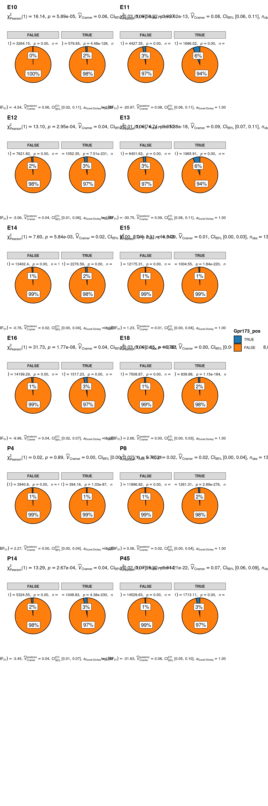

::: {.cell .hidden layout-align="center"}

```{.r .cell-code .hidden}
#| label: setup
#| include: false
DOCNAME <- "pars-tuberalis-analysis"
NOW <- Sys.time()

# Time chunks during knitting
knitr::knit_hooks$set(timeit = function(before) {
  if (before) {
    print(paste("Start:", Sys.time()))
    NOW <<- Sys.time()
  } else {
    print(paste("Stop:", Sys.time()))
    print(Sys.time() - NOW)
  }
})

knitr::knit_hooks$set(debug = function(before, options, envir) {
  if (!before) {
    message(
      paste(names(envir), as.list(envir),
        sep = " = ", collapse = "\n"
      )
    )
  }
})

knitr::opts_chunk$set(
  cache          = FALSE,
  dev            = c("png", "pdf"),
  timeit         = TRUE
)
```
:::


## Load data and setup parameters


::: {.cell layout-align="center"}

```{.r .cell-code .hidden}
#| label: libraries
#| cache: false
# Load tidyverse infrastructure packages
suppressPackageStartupMessages({
  library(future)
  library(here)
  library(tidyverse)
  library(magrittr)
  library(stringr)
  library(skimr)
  library(RColorBrewer)
  library(viridis)
})


# Load packages for scRNA-seq analysis and visualisation
suppressPackageStartupMessages({
  library(ggplot2)
  library(cowplot)
  library(patchwork)
  library(ggstatsplot)
  library(Seurat)
  library(SeuratWrappers)
  library(scCustomize)
})
```
:::


### Set paths


::: {.cell layout-align="center"}

```{.r .cell-code .hidden}
#| label: paths
src_dir <- here("code")
data_dir <- here("data")
output_dir <- here("output")
plots_dir <- here(output_dir, "figures/")
tables_dir <- here(output_dir, "tables/")
```
:::


### Load helper functions and gene-sets


::: {.cell layout-align="center"}

```{.r .cell-code .hidden}
#| label: source
#| cache: false
source(here(src_dir, "genes.R"))
source(here(src_dir, "functions.R"))
```
:::


### Set fixed variables


::: {.cell layout-align="center"}

```{.r .cell-code .hidden}
#| label: params-computation
#| cache: false
# set seed
reseed <- 42
set.seed(seed = reseed)

# Parameters for parallel execution
n_cores <- parallelly::availableCores() / 2 - 1
plan("multisession", workers = n_cores)
options(
  future.globals.maxSize = 100000 * 1024^2,
  future.rng.onMisuse = "ignore"
)
plan()
```

::: {.cell-output .cell-output-stdout}

```
multisession:
- args: function (..., workers = c(cgroups2.cpu.max = 6), envir = parent.frame())
- tweaked: TRUE
- call: plan("multisession", workers = n_cores)
```


:::

```{.r .cell-code .hidden}
#| label: params-computation
#| cache: false
# ggplot2 theme
theme_set(theme_minimal(base_size = 12))
```
:::

::: {.cell layout-align="center"}

```{.r .cell-code .hidden}
#| label: params
bioproject <- "PRJNA547712"
project <- "kim2020_Hypoth-dev"
cb_fpr <- 0.001
low_cutoff_gene <- 500
high_cutoff_gene <- NULL
high_cutoff_gene <- 5000
low_cutoff_umis <- NULL
low_cutoff_umis <- -Inf
high_cutoff_umis <- 25000
high_cutoff_pc_mt <- 15
high_cutoff_pc_ribo <- 20
high_cutoff_pc_hb <- 0.1
high_cutoff_doublet_score <- 0.33
high_cutoff_complexity <- 0.85
connectivity_model <- "min_tree"
k <- 10
metric <- "euclidean"
signature <- 100
```
:::


## Load data from Kim DW et al 2020 (bioproject PRJNA547712)


::: {.cell layout-align="center"}

```{.r .cell-code .hidden}
#| label: convert-to-seurat
srt.kim <- schard::h5ad2seurat(here(
  data_dir,
  "kim2020_combined.h5ad"
), use.raw = TRUE)

X_umap <- srt.kim@meta.data |>
  select(X, Y, Z) |>
  as.matrix()
colnames(X_umap) <- c("UMAP_1", "UMAP_2", "UMAP_3")
rownames(X_umap) <- colnames(srt.kim)
srt.kim[["umap"]] <- CreateDimReducObject(embeddings = X_umap, key = "umap_", assay = DefaultAssay(srt.kim))
srt.kim$Age %<>% forcats::fct(levels = c(
  "E10", "E11", "E12", "E13", "E14",
  "E15", "E16", "E17", "E18", "P0",
  "P2", "P4", "P8", "P10", "P14", "P23", "P45"
))

Idents(srt.kim) <- "Age"
srt.kim <- Store_Palette_Seurat(seurat_object = srt.kim, palette = rev(brewer.pal(n = 11, name = "Spectral")), palette_name = "expr_Colour_Pal")
```

::: {.cell-output .cell-output-stderr .hidden}

```
Seurat Object now contains the following items in @misc slot:
ℹ 'expr_Colour_Pal'
```


:::
:::

::: {.cell layout-align="center"}

```{.r .cell-code .hidden}
#| label: load-seurat
print(srt.kim)
```

::: {.cell-output .cell-output-stdout}

```
An object of class Seurat 
27998 features across 128006 samples within 1 assay 
Active assay: RNA (27998 features, 0 variable features)
 2 layers present: counts, data
 1 dimensional reduction calculated: umap
```


:::

```{.r .cell-code .hidden}
#| label: load-seurat
srt.romanov.pub <- readRDS("/data/1_heteroAstrocytes/PRJNA548917/old/oldCCA_nae_srt.rds") # Load the Seurat object deposited to GEO by Romanov et al. (2020)
srt.romanov.pub <- UpdateSeuratObject(srt.romanov.pub)
```

::: {.cell-output .cell-output-stderr .hidden}

```
Validating object structure
```


:::

::: {.cell-output .cell-output-stderr .hidden}

```
Updating object slots
```


:::

::: {.cell-output .cell-output-stderr .hidden}

```
Ensuring keys are in the proper structure
```


:::

::: {.cell-output .cell-output-stderr .hidden}

```
Updating matrix keys for DimReduc 'pca'
```


:::

::: {.cell-output .cell-output-stderr .hidden}

```
Updating matrix keys for DimReduc 'tsne'
```


:::

::: {.cell-output .cell-output-stderr .hidden}

```
Updating matrix keys for DimReduc 'umap'
```


:::

::: {.cell-output .cell-output-stderr .hidden}

```
Warning: Assay RNA changing from Assay to Assay
```


:::

::: {.cell-output .cell-output-stderr .hidden}

```
Warning: DimReduc pca changing from DimReduc to DimReduc
```


:::

::: {.cell-output .cell-output-stderr .hidden}

```
Warning: DimReduc tsne changing from DimReduc to DimReduc
```


:::

::: {.cell-output .cell-output-stderr .hidden}

```
Warning: DimReduc umap changing from DimReduc to DimReduc
```


:::

::: {.cell-output .cell-output-stderr .hidden}

```
Ensuring keys are in the proper structure
```


:::

::: {.cell-output .cell-output-stderr .hidden}

```
Ensuring feature names don't have underscores or pipes
```


:::

::: {.cell-output .cell-output-stderr .hidden}

```
Updating slots in RNA
```


:::

::: {.cell-output .cell-output-stderr .hidden}

```
Updating slots in pca
```


:::

::: {.cell-output .cell-output-stderr .hidden}

```
Updating slots in tsne
```


:::

::: {.cell-output .cell-output-stderr .hidden}

```
Setting tsne DimReduc to global
```


:::

::: {.cell-output .cell-output-stderr .hidden}

```
Updating slots in umap
```


:::

::: {.cell-output .cell-output-stderr .hidden}

```
Setting umap DimReduc to global
```


:::

::: {.cell-output .cell-output-stderr .hidden}

```
Validating object structure for Assay 'RNA'
```


:::

::: {.cell-output .cell-output-stderr .hidden}

```
Validating object structure for DimReduc 'pca'
```


:::

::: {.cell-output .cell-output-stderr .hidden}

```
Validating object structure for DimReduc 'tsne'
```


:::

::: {.cell-output .cell-output-stderr .hidden}

```
Validating object structure for DimReduc 'umap'
```


:::

::: {.cell-output .cell-output-stderr .hidden}

```
Object representation is consistent with the most current Seurat version
```


:::

```{.r .cell-code .hidden}
#| label: load-seurat
srt.romanov.pub$Age <-
  Cells(srt.romanov.pub) |>
  str_split(pattern = ":", simplify = T) %>%
  .[, 1] %>%
  str_split_fixed(pattern = "_", n = 3) %>%
  .[, 3]
srt.romanov.pub$Age %<>% forcats::fct(levels = c(
  "E10", "E11", "E12", "E13", "E14",
  "E15", "E16", "E17", "E18", "P0",
  "P2", "3P2", "P4", "P8", "1P10",
  "P10", "P14", "P23", "P45"
))
srt.romanov.pub$Age %<>% fct_collapse(
  P2 = c("P2", "3P2"),
  P10 = c("1P10", "P10")
)
srt.romanov.pub <- Store_Palette_Seurat(
  seurat_object = srt.romanov.pub,
  palette = read_lines(here(data_dir, "colours_wtree.tsv")), palette_name = "wtree_Colour_Pal"
)
```

::: {.cell-output .cell-output-stderr .hidden}

```
Seurat Object now contains the following items in @misc slot:
ℹ 'vst.out' and 'wtree_Colour_Pal'
```


:::

```{.r .cell-code .hidden}
#| label: load-seurat
names(srt.romanov.pub@misc$wtree_Colour_Pal) <- 1:45
print(srt.romanov.pub)
```

::: {.cell-output .cell-output-stdout}

```
An object of class Seurat 
24340 features across 51199 samples within 1 assay 
Active assay: RNA (24340 features, 3500 variable features)
 3 layers present: counts, data, scale.data
 3 dimensional reductions calculated: pca, tsne, umap
```


:::

```{.r .cell-code .hidden}
#| label: load-seurat
glimpse(srt.romanov.pub@meta.data)
```

::: {.cell-output .cell-output-stdout}

```
Rows: 51,199
Columns: 20
$ nGene            <int> 1652, 782, 447, 1706, 1106, 894, 727, 734, 669, 617, …
$ nUMI             <dbl> 2787, 1090, 544, 2709, 1817, 1220, 995, 1036, 920, 86…
$ orig.ident       <fct> Hypothalamus, Hypothalamus, Hypothalamus, Hypothalamu…
$ res.0.2          <chr> "23", "23", "23", "23", "23", "23", "23", "23", "23",…
$ res.0.4          <chr> "34", "34", "34", "34", "34", "34", "34", "34", "34",…
$ res.0.8          <chr> "42", "42", "42", "42", "42", "42", "42", "42", "42",…
$ res.1.2          <chr> "47", "47", "47", "47", "47", "47", "47", "47", "47",…
$ res.2            <chr> "54", "54", "54", "54", "54", "54", "54", "54", "54",…
$ tree.ident       <int> 1, 1, 1, 1, 1, 1, 1, 1, 1, 1, 1, 1, 1, 1, 1, 1, 1, 1,…
$ pro_Inter        <chr> "41", "41", "41", "41", "41", "41", "41", "41", "41",…
$ pro_Enter        <chr> "41", "41", "41", "41", "41", "41", "41", "41", "41",…
$ tree_final       <fct> 19, 19, 19, 19, 19, 19, 19, 19, 19, 19, 19, 19, 19, 1…
$ subtree          <fct> 41, 41, 41, 41, 41, 41, 41, 41, 41, 41, 41, 41, 41, 4…
$ prim_walktrap    <fct> 38, 38, 38, 38, 38, 38, 38, 38, 38, 38, 38, 38, 38, 3…
$ umi_per_gene     <dbl> 1.687046, 1.393862, 1.217002, 1.587925, 1.642857, 1.3…
$ log_umi_per_gene <dbl> 0.22712693, 0.14421974, 0.08529138, 0.20082998, 0.215…
$ nCount_RNA       <dbl> 2787, 1090, 544, 2709, 1817, 1220, 995, 1036, 920, 86…
$ nFeature_RNA     <int> 1652, 782, 447, 1706, 1106, 894, 727, 734, 669, 617, …
$ wtree            <fct> 38, 38, 38, 38, 38, 38, 38, 38, 38, 38, 38, 38, 38, 3…
$ Age              <fct> P23, P2, P2, P2, P2, P2, P2, P2, P2, P2, P2, P2, P2, …
```


:::

```{.r .cell-code .hidden}
#| label: load-seurat
table(Idents(srt.romanov.pub))
```

::: {.cell-output .cell-output-stdout}

```

    1     2     3     4     5     6     7     8     9    10    11    12    13 
 2344  8146   395   402  3234   712   552   374   259   952 13727  1615   765 
   14    15    16    17    18    19    20    21    22    23    24    25    26 
  832  1244   792   590   808  2486  1683   628  1039  1750   292   394   547 
   27    28    29    30    31    32    33    34    35    36    37    38    39 
  391   407   507    93    81   402   143   701   222   353   324    73    78 
   40    41    42    43    44    45 
  328   190    73    37   179    55 
```


:::

```{.r .cell-code .hidden}
#| label: load-seurat
srt.romanov.pt <- subset(srt.romanov.pub, idents = c("38", "42", "45"))
print(srt.romanov.pt)
```

::: {.cell-output .cell-output-stdout}

```
An object of class Seurat 
24340 features across 201 samples within 1 assay 
Active assay: RNA (24340 features, 3500 variable features)
 3 layers present: counts, data, scale.data
 3 dimensional reductions calculated: pca, tsne, umap
```


:::
:::

::: {#cell-fig-feature-romanov2020 .cell layout-align="center"}

```{.r .cell-code .hidden}
#| label: fig-feature-romanov2020
#| fig-cap: "Feature plot of selected genes in hypothalamus across different developmental stages in the Romanov et al. (2020) dataset (original UMAP embedding). Cells are colored by expression level.  Note the distinct localization patterns of each gene."
#| fig-width: 24
#| fig-height: 36
FeaturePlot(
  srt.romanov.pub,
  features = c(
    "Tshb", "Cck", "Pitx1",
    "Eya1", "Eya2", "Eya3", "Eya4",
    "Sox2", "Hlf", "Tshr",
    "Cckar", "Cckbr", "Gpr173",
    "Foxl2", "Lhx3", "Lhx4", "Pit1", "Gata2"
  ),
  label = F,
  blend = F,
  order = TRUE,
  pt.size = 1.2,
  raster.dpi = c(512, 512),
  alpha = 0.5,
  split.by = "Age"
)
```

::: {.cell-output .cell-output-stderr .hidden}

```
Warning: The following requested variables were not found: Pit1
```


:::

::: {.cell-output .cell-output-stderr .hidden}

```
Warning: All cells have the same value (0) of "Foxl2"
```


:::

::: {.cell-output .cell-output-stderr .hidden}

```
Warning: All cells have the same value (0) of "Lhx3"
```


:::

::: {.cell-output .cell-output-stderr .hidden}

```
Warning: All cells have the same value (0) of "Foxl2"
All cells have the same value (0) of "Foxl2"
All cells have the same value (0) of "Foxl2"
All cells have the same value (0) of "Foxl2"
```


:::

::: {.cell-output-display}
{#fig-feature-romanov2020 fig-align='center' width=2880}
:::
:::

::: {#cell-fig-feature-pt-romanov2020 .cell layout-align="center"}

```{.r .cell-code .hidden}
#| label: fig-feature-pt-romanov2020
#| fig.cap: "Feature plot of selected genes in hypothalamus across different developmental stages in the subset of the pars tuberalis clusters from the Romanov et al. (2020) dataset (original UMAP embedding). Cells are colored by a gene expression level.  Note the distinct localization patterns of each gene."
#| fig-width: 24
#| fig-height: 36
FeaturePlot(
  srt.romanov.pt,
  features = c(
    "Tshb", "Cck", "Pitx1",
    "Eya1", "Eya2", "Eya3", "Eya4",
    "Sox2", "Hlf", "Tshr",
    "Cckar", "Cckbr", "Gpr173",
    "Foxl2", "Lhx3", "Lhx4", "Pit1", "Gata2"
  ),
  label = T,
  blend = F,
  order = TRUE,
  pt.size = 1.2,
  raster.dpi = c(512, 512),
  alpha = 0.5,
  split.by = "Age"
)
```

::: {.cell-output .cell-output-stderr .hidden}

```
Warning: The following requested variables were not found: Pit1
```


:::

::: {.cell-output .cell-output-stderr .hidden}

```
Warning: All cells have the same value (0) of "Tshb"
```


:::

::: {.cell-output .cell-output-stderr .hidden}

```
Warning: All cells have the same value (0) of "Cck"
```


:::

::: {.cell-output .cell-output-stderr .hidden}

```
Warning: All cells have the same value (0) of "Pitx1"
```


:::

::: {.cell-output .cell-output-stderr .hidden}

```
Warning: All cells have the same value (0) of "Eya1"
```


:::

::: {.cell-output .cell-output-stderr .hidden}

```
Warning: All cells have the same value (0) of "Eya3"
```


:::

::: {.cell-output .cell-output-stderr .hidden}

```
Warning: All cells have the same value (0) of "Hlf"
```


:::

::: {.cell-output .cell-output-stderr .hidden}

```
Warning: All cells have the same value (0) of "Tshr"
```


:::

::: {.cell-output .cell-output-stderr .hidden}

```
Warning: All cells have the same value (0) of "Cckar"
```


:::

::: {.cell-output .cell-output-stderr .hidden}

```
Warning: All cells have the same value (0) of "Cckbr"
```


:::

::: {.cell-output .cell-output-stderr .hidden}

```
Warning: All cells have the same value (0) of "Gpr173"
```


:::

::: {.cell-output .cell-output-stderr .hidden}

```
Warning: All cells have the same value (0) of "Foxl2"
```


:::

::: {.cell-output .cell-output-stderr .hidden}

```
Warning: All cells have the same value (0) of "Lhx3"
```


:::

::: {.cell-output .cell-output-stderr .hidden}

```
Warning: All cells have the same value (0) of "Lhx4"
```


:::

::: {.cell-output .cell-output-stderr .hidden}

```
Warning: All cells have the same value (0) of "Gata2"
```


:::

::: {.cell-output .cell-output-stderr .hidden}

```
Warning: All cells have the same value (0) of "Tshb"
```


:::

::: {.cell-output .cell-output-stderr .hidden}

```
Warning: All cells have the same value (0) of "Cck"
```


:::

::: {.cell-output .cell-output-stderr .hidden}

```
Warning: All cells have the same value (0) of "Pitx1"
```


:::

::: {.cell-output .cell-output-stderr .hidden}

```
Warning: All cells have the same value (0) of "Eya1"
```


:::

::: {.cell-output .cell-output-stderr .hidden}

```
Warning: All cells have the same value (0) of "Eya2"
```


:::

::: {.cell-output .cell-output-stderr .hidden}

```
Warning: All cells have the same value (0) of "Eya3"
```


:::

::: {.cell-output .cell-output-stderr .hidden}

```
Warning: All cells have the same value (0) of "Eya4"
```


:::

::: {.cell-output .cell-output-stderr .hidden}

```
Warning: All cells have the same value (0) of "Sox2"
```


:::

::: {.cell-output .cell-output-stderr .hidden}

```
Warning: All cells have the same value (0) of "Tshr"
```


:::

::: {.cell-output .cell-output-stderr .hidden}

```
Warning: All cells have the same value (0) of "Cckar"
```


:::

::: {.cell-output .cell-output-stderr .hidden}

```
Warning: All cells have the same value (0) of "Cckbr"
```


:::

::: {.cell-output .cell-output-stderr .hidden}

```
Warning: All cells have the same value (0) of "Gpr173"
```


:::

::: {.cell-output .cell-output-stderr .hidden}

```
Warning: All cells have the same value (0) of "Foxl2"
```


:::

::: {.cell-output .cell-output-stderr .hidden}

```
Warning: All cells have the same value (0) of "Lhx3"
```


:::

::: {.cell-output .cell-output-stderr .hidden}

```
Warning: All cells have the same value (0) of "Lhx4"
```


:::

::: {.cell-output .cell-output-stderr .hidden}

```
Warning: All cells have the same value (0) of "Gata2"
```


:::

::: {.cell-output .cell-output-stderr .hidden}

```
Warning: All cells have the same value (0) of "Cckar"
```


:::

::: {.cell-output .cell-output-stderr .hidden}

```
Warning: All cells have the same value (0) of "Cckbr"
```


:::

::: {.cell-output .cell-output-stderr .hidden}

```
Warning: All cells have the same value (0) of "Foxl2"
```


:::

::: {.cell-output .cell-output-stderr .hidden}

```
Warning: All cells have the same value (0) of "Eya2"
```


:::

::: {.cell-output .cell-output-stderr .hidden}

```
Warning: All cells have the same value (0) of "Eya3"
```


:::

::: {.cell-output .cell-output-stderr .hidden}

```
Warning: All cells have the same value (0) of "Foxl2"
```


:::

::: {.cell-output .cell-output-stderr .hidden}

```
Warning: All cells have the same value (0) of "Lhx4"
```


:::

::: {.cell-output .cell-output-stderr .hidden}

```
Warning: All cells have the same value (0) of "Cckar"
```


:::

::: {.cell-output .cell-output-stderr .hidden}

```
Warning: All cells have the same value (0) of "Cckbr"
```


:::

::: {.cell-output .cell-output-stderr .hidden}

```
Warning: All cells have the same value (0) of "Foxl2"
```


:::

::: {.cell-output .cell-output-stderr .hidden}

```
Warning: All cells have the same value (0) of "Lhx4"
```


:::

::: {.cell-output-display}
{#fig-feature-pt-romanov2020 fig-align='center' width=2880}
:::
:::

::: {.cell layout-align="center"}

```{.r .cell-code .hidden}
#| label: norm-scale-matrix
# Using gene name patterns
srt.kim <- Add_Mito_Ribo(object = srt.kim, species = "Mouse", ensembl_ids = FALSE)
```

::: {.cell-output .cell-output-stderr .hidden}

```
Adding Percent Mitochondrial genes for Mouse using gene symbol pattern: "^mt-".
Adding Percent Ribosomal genes for Mouse using gene symbol pattern: "^Rp[sl]".
Adding Percent Mito+Ribo by adding Mito & Ribo percentages.
```


:::

```{.r .cell-code .hidden}
#| label: norm-scale-matrix
srt.kim$umi_per_gene <- 
  (srt.kim$nCount_RNA/srt.kim$nFeature_RNA)
srt.kim$log_umi_per_gene <- 
  log10(srt.kim$umi_per_gene)
srt.kim <- NormalizeData(srt.kim)
srt.kim <- FindVariableFeatures(srt.kim, selection.method = "vst", nfeatures = 5000)
all.genes <- rownames(srt.kim)
srt.kim <- ScaleData(srt.kim, features = all.genes, vars.to.regress = c("log_umi_per_gene", "percent_mito_ribo"))
```

::: {.cell-output .cell-output-stderr .hidden}

```
Regressing out log_umi_per_gene, percent_mito_ribo
Centering and scaling data matrix
```


:::

```{.r .cell-code .hidden}
#| label: norm-scale-matrix
# srt.kim <- ScaleData(srt.kim)
```
:::

::: {.cell layout-align="center"}

```{.r .cell-code .hidden}
#| label: transfer-annotations
hypoth.anchors <- FindTransferAnchors(
  reference = srt.romanov.pub,
  query = srt.kim,
  dims = 1:30,
  npcs = 30,
  reference.reduction = "pca",
  reduction = "rpca",
  k.anchor = 15,
  k.filter = 30,
  k.score = 50,
  max.features = 500,
  nn.method = "annoy",
  n.trees = 200
)
```

::: {.cell-output .cell-output-stderr .hidden}

```
Performing PCA on the provided query using 3500 features as input.
```


:::

::: {.cell-output .cell-output-stderr .hidden}

```
Centering and scaling data matrix
```


:::

::: {.cell-output .cell-output-stderr .hidden}

```
Projecting new data onto SVD
Projecting new data onto SVD
```


:::

::: {.cell-output .cell-output-stderr .hidden}

```
Projecting cell embeddings
```


:::

::: {.cell-output .cell-output-stderr .hidden}

```
Finding neighborhoods
```


:::

::: {.cell-output .cell-output-stderr .hidden}

```
Finding anchors
```


:::

::: {.cell-output .cell-output-stderr .hidden}

```
	Found 6393 anchors
```


:::

::: {.cell-output .cell-output-stderr .hidden}

```
Filtering anchors
```


:::

::: {.cell-output .cell-output-stderr .hidden}

```
	Retained 397 anchors
```


:::

```{.r .cell-code .hidden}
#| label: transfer-annotations
predictions <- TransferData(anchorset = hypoth.anchors, refdata = srt.romanov.pub$wtree, dims = 1:30) # TODO: check if I can randomly subset the reference data to handle the imbalance of clusters
```

::: {.cell-output .cell-output-stderr .hidden}

```
Finding integration vectors
```


:::

::: {.cell-output .cell-output-stderr .hidden}

```
Finding integration vector weights
```


:::

::: {.cell-output .cell-output-stderr .hidden}

```
Predicting cell labels
```


:::

```{.r .cell-code .hidden}
#| label: transfer-annotations
srt.kim <- AddMetaData(srt.kim, metadata = predictions)
table(srt.kim$predicted.id)
```

::: {.cell-output .cell-output-stdout}

```

    1    12    13    15    19     2    20    21    22    23    26    27    29 
 1504  2751  7692  5423 76464  1508  2952  6239   264   141    20  3053  1733 
    3    32    38     4    44    45     5     6     7     8 
 1580     3   264   124    38 10653  1897  3291   161   251 
```


:::
:::

::: {.cell layout-align="center"}

```{.r .cell-code .hidden}
#| label: transfer-umap
srt.romanov.pub <- RunUMAP(srt.romanov.pub, dims = 1:30, reduction = "pca", return.model = TRUE)
```

::: {.cell-output .cell-output-stderr .hidden}

```
Warning: The default method for RunUMAP has changed from calling Python UMAP via reticulate to the R-native UWOT using the cosine metric
To use Python UMAP via reticulate, set umap.method to 'umap-learn' and metric to 'correlation'
This message will be shown once per session
```


:::

::: {.cell-output .cell-output-stderr .hidden}

```
UMAP will return its model
```


:::

::: {.cell-output .cell-output-stderr .hidden}

```
13:48:04 UMAP embedding parameters a = 0.9922 b = 1.112
```


:::

::: {.cell-output .cell-output-stderr .hidden}

```
13:48:04 Read 51199 rows and found 30 numeric columns
```


:::

::: {.cell-output .cell-output-stderr .hidden}

```
13:48:04 Using Annoy for neighbor search, n_neighbors = 30
```


:::

::: {.cell-output .cell-output-stderr .hidden}

```
13:48:04 Building Annoy index with metric = cosine, n_trees = 50
```


:::

::: {.cell-output .cell-output-stderr .hidden}

```
0%   10   20   30   40   50   60   70   80   90   100%
```


:::

::: {.cell-output .cell-output-stderr .hidden}

```
[----|----|----|----|----|----|----|----|----|----|
```


:::

::: {.cell-output .cell-output-stderr .hidden}

```
**************************************************|
13:48:13 Writing NN index file to temp file /tmp/Rtmpnldpux/file967965d970bb
13:48:13 Searching Annoy index using 6 threads, search_k = 3000
13:48:18 Annoy recall = 100%
13:48:19 Commencing smooth kNN distance calibration using 6 threads with target n_neighbors = 30
13:48:21 Initializing from normalized Laplacian + noise (using RSpectra)
13:48:22 Commencing optimization for 200 epochs, with 2530018 positive edges
13:48:45 Optimization finished
```


:::

```{.r .cell-code .hidden}
#| label: transfer-umap
srt.kim <- IntegrateEmbeddings(
  anchorset = hypoth.anchors, reference = srt.romanov.pub, query = srt.kim,
  new.reduction.name = "ref.pca"
)
```

::: {.cell-output .cell-output-stderr .hidden}

```
Requested to reuse weights matrix, but no weights found. Computing new weights.
```


:::

::: {.cell-output .cell-output-stderr .hidden}

```
Warning: Layer counts isn't present in the assay object; returning NULL
```


:::

::: {.cell-output .cell-output-stderr .hidden}

```
Warning: Layer counts isn't present in the assay object; returning NULL
```


:::

::: {.cell-output .cell-output-stderr .hidden}

```

Integrating dataset 2 with reference dataset
Finding integration vectors
Finding integration vector weights
Integrating data
```


:::

```{.r .cell-code .hidden}
#| label: transfer-umap
srt.kim <- ProjectUMAP(
  query = srt.kim, query.reduction = "ref.pca", reference = srt.romanov.pub,
  reference.reduction = "pca", reduction.model = "umap"
)
```

::: {.cell-output .cell-output-stderr .hidden}

```
Computing nearest neighbors
Running UMAP projection
13:52:34 Read 128006 rows
13:52:34 Processing block 1 of 1
13:52:34 Commencing smooth kNN distance calibration using 6 threads with target n_neighbors = 30
13:52:34 Initializing by weighted average of neighbor coordinates using 6 threads
13:52:35 Commencing optimization for 67 epochs, with 3840180 positive edges
13:53:02 Finished
```


:::
:::

::: {#cell-fig-reference-umap-transfered .cell layout-align="center"}

```{.r .cell-code .hidden}
#| label: fig-reference-umap-transfered
#| fig-cap: "UMAP plot of the Romanov et al. (2020) dataset with reference annotations and transferred labels on the the Kim DW et al. (2020) dataset. Cells are colored by published *wtree* clusters' labels identified as pars tuberalis. Note the successful embedding of query dataset according to the reference dataset and slight change of the reference embedding model in the process."
Idents(srt.romanov.pub) <- "wtree"
p1 <- Cluster_Highlight_Plot(
  seurat_object = srt.romanov.pub,
  reduction = "umap",
  label = TRUE,
  label.size = 3,
  repel = TRUE,
  cluster_name = c("38", "42", "45"),
  highlight_color = srt.romanov.pub@misc$wtree_Colour_Pal[c("38", "42", "45")]
) +
  NoLegend() +
  ggtitle("Reference annotations")

Idents(srt.kim) <- "predicted.id"
p2 <- Cluster_Highlight_Plot(
  seurat_object = srt.kim,
  reduction = "ref.umap",
  label = TRUE,
  label.size = 3,
  repel = TRUE,
  cluster_name = c("38", "42", "45"),
  highlight_color = srt.romanov.pub@misc$wtree_Colour_Pal[c("38", "42", "45")]
) +
  NoLegend() +
  ggtitle("Query transferred labels")
```

::: {.cell-output .cell-output-stderr .hidden}

```
Warning: The following `cluster_name` were omitted as they were not found the
active.ident slot: 42
```


:::

```{.r .cell-code .hidden}
#| label: fig-reference-umap-transfered
#| fig-cap: "UMAP plot of the Romanov et al. (2020) dataset with reference annotations and transferred labels on the the Kim DW et al. (2020) dataset. Cells are colored by published *wtree* clusters' labels identified as pars tuberalis. Note the successful embedding of query dataset according to the reference dataset and slight change of the reference embedding model in the process."
p1 + p2
```

::: {.cell-output-display}
{#fig-reference-umap-transfered fig-align='center' width=1680}
:::
:::

::: {#cell-fig-feature-romanov2020-integrated .cell layout-align="center"}

```{.r .cell-code .hidden}
#| label: fig-feature-romanov2020-integrated
#| fig.cap: "Feature plot of selected genes in hypothalamus across different developmental stages in the Romanov et al. (2020) dataset (new integrated UMAP embedding). Cells are colored by expression level.  Note the distinct localization patterns of each gene."
#| fig-width: 24
#| fig-height: 36
FeaturePlot(
  srt.romanov.pub,
  features = c(
    "Tshb", "Cck", "Pitx1",
    "Eya1", "Eya2", "Eya3", "Eya4",
    "Sox2", "Hlf", "Tshr",
    "Cckar", "Cckbr", "Gpr173",
    "Foxl2", "Lhx3", "Lhx4", "Pit1", "Gata2"
  ),
  label = F,
  blend = F,
  order = TRUE,
  pt.size = 1.2,
  raster.dpi = c(512, 512),
  alpha = 0.5,
  split.by = "Age"
)
```

::: {.cell-output .cell-output-stderr .hidden}

```
Warning: The following requested variables were not found: Pit1
```


:::

::: {.cell-output .cell-output-stderr .hidden}

```
Warning: All cells have the same value (0) of "Foxl2"
```


:::

::: {.cell-output .cell-output-stderr .hidden}

```
Warning: All cells have the same value (0) of "Lhx3"
```


:::

::: {.cell-output .cell-output-stderr .hidden}

```
Warning: All cells have the same value (0) of "Foxl2"
All cells have the same value (0) of "Foxl2"
All cells have the same value (0) of "Foxl2"
All cells have the same value (0) of "Foxl2"
```


:::

::: {.cell-output-display}
{#fig-feature-romanov2020-integrated fig-align='center' width=2880}
:::
:::


# Calculate and plot chi2 test of independence between Sox2 and Tshr expression in hypothalamus across different developmental stages


::: {.cell layout-align="center"}

```{.r .cell-code .hidden}
#| label: get-goi-sox2-tshr
sbs_mtx <- GetAssayData(object = srt.kim, layer = "counts", assay = "RNA")[c("Sox2", "Tshr"), ] %>%
  as.data.frame() %>%
  t() %>%
  as.data.frame() %>%
  select(Sox2, Tshr) %>%
  dplyr::bind_cols(srt.kim@meta.data) %>%
  select(Age, Sox2, Tshr) %>%
  mutate(
    Sox2_pos = Sox2 > 0,
    Tshr_pos = Tshr > 0
  )

sbs_mtx %>% skimr::skim()
```

::: {.cell-output-display}

Table: Data summary

|                         |           |
|:------------------------|:----------|
|Name                     |Piped data |
|Number of rows           |128006     |
|Number of columns        |5          |
|_______________________  |           |
|Column type frequency:   |           |
|factor                   |1          |
|logical                  |2          |
|numeric                  |2          |
|________________________ |           |
|Group variables          |None       |


**Variable type: factor**

|skim_variable | n_missing| complete_rate|ordered | n_unique|top_counts                                    |
|:-------------|---------:|-------------:|:-------|--------:|:---------------------------------------------|
|Age           |         0|             1|FALSE   |       12|P45: 17025, E16: 16781, E14: 16543, P8: 13677 |


**Variable type: logical**

|skim_variable | n_missing| complete_rate| mean|count                   |
|:-------------|---------:|-------------:|----:|:-----------------------|
|Sox2_pos      |         0|             1| 0.14|FAL: 110343, TRU: 17663 |
|Tshr_pos      |         0|             1| 0.00|FAL: 127714, TRU: 292   |


**Variable type: numeric**

|skim_variable | n_missing| complete_rate| mean|   sd| p0| p25| p50| p75| p100|hist  |
|:-------------|---------:|-------------:|----:|----:|--:|---:|---:|---:|----:|:-----|
|Sox2          |         0|             1| 0.27| 1.21|  0|   0|   0|   0|   82|▇▁▁▁▁ |
|Tshr          |         0|             1| 0.00| 0.06|  0|   0|   0|   0|    5|▇▁▁▁▁ |


:::
:::

::: {#cell-fig-sox2-tshr-stats .cell layout-align="center"}

```{.r .cell-code .hidden}
#| label: fig-sox2-tshr-stats
#| fig-cap: "Proportion of Sox2 and Tshr expression in hypothalamus across different developmental stages. Cells are colored by Sox2 and Tshr expression status. Note the distinct Sox2 and Tshr expression patterns across different developmental stages."
#| fig-width: 8
#| fig-height: 24
write_csv(sbs_mtx, here(tables_dir, "Sox2-Tshr-expression-status-between-Ages-on-evaluation-datasets.csv"))


# plot
grouped_ggpiestats(
  data = sbs_mtx,
  x = Tshr_pos,
  y = Sox2_pos,
  grouping.var = Age,
  perc.k = 1,
  package = "ggsci",
  palette = "category10_d3",
  title.text = "Sox2 specification of Tshr-positive hypothalamic development",
  caption.text = "Asterisks denote results from proportion tests; \n***: p < 0.001, ns: non-significant",
  plotgrid.args = list(nrow = 8)
)
```

::: {.cell-output-display}
{#fig-sox2-tshr-stats fig-align='center' width=960}
:::
:::


## Calculate and plot hexagonal cells representation in hypothalamus across different developmental stages with meta information


::: {.cell layout-align="center"}

```{.r .cell-code .hidden}
srt.kim
```

::: {.cell-output .cell-output-stdout}

```
An object of class Seurat 
27998 features across 128006 samples within 1 assay 
Active assay: RNA (27998 features, 5000 variable features)
 3 layers present: counts, data, scale.data
 3 dimensional reductions calculated: umap, ref.pca, ref.umap
```


:::
:::

::: {#cell-fig-hexbin-umap-kim2020 .cell layout-align="center"}

```{.r .cell-code .hidden}
#| label: fig-hexbin-umap-kim2020
#| fig-cap: "Hexagonal binning plot of the Kim DW et al. (2020) dataset in the hypothalamus of all developmental stages. Cells are colored by cell count."
library(hexbin)
# Extract UMAP coordinates
umap_coords <- Embeddings(srt.kim, reduction = "ref.umap")

# Create hexbin object
hb <- hexbin(umap_coords[, 1], umap_coords[, 2], xbins = 64)

# Create a data frame for plotting
hex_data <- data.frame(
  x = hcell2xy(hb)$x,
  y = hcell2xy(hb)$y,
  count = hb@count
)

# Create the plot
ggplot(hex_data, aes(x = x, y = y, fill = count)) +
  geom_hex(stat = "identity") +
  scale_fill_gradientn(colors = ggsci::pal_material("amber")(9)) +
  labs(x = "UMAP_1", y = "UMAP_2", fill = "Cell\nCount") +
  coord_fixed()
```

::: {.cell-output-display}
{#fig-hexbin-umap-kim2020 fig-align='center' width=1680}
:::
:::

::: {#cell-fig-feature-kim2020 .cell layout-align="center"}

```{.r .cell-code .hidden}
#| label: fig-feature-kim2020
#| fig-cap: "Feature plot of selected genes in hypothalamus across different developmental stages in the Kim DW et al. (2020) dataset (integrated UMAP embedding). Cells are colored by expression level.  Note the distinct localization patterns of each gene."
#| fig-width: 32
#| fig-height: 36
FeaturePlot(
  srt.kim,
  features = c(
    "Tshb", "Cck", "Pitx1",
    "Eya1", "Eya2", "Eya3", "Eya4",
    "Sox2", "Hlf", "Tshr",
    "Cckar", "Cckbr", "Gpr173",
    "Foxl2", "Lhx3", "Lhx4", "Pit1", "Gata2"
  ),
  reduction = "ref.umap",
  label = F,
  blend = F,
  order = TRUE,
  pt.size = 1.2,
  raster.dpi = c(512, 512),
  alpha = 0.5,
  split.by = "Age"
)
```

::: {.cell-output .cell-output-stderr .hidden}

```
Warning: The following requested variables were not found: Pit1
```


:::

::: {.cell-output .cell-output-stderr .hidden}

```
Warning: All cells have the same value (0) of "Tshb"
```


:::

::: {.cell-output .cell-output-stderr .hidden}

```
Warning: All cells have the same value (0) of "Cck"
```


:::

::: {.cell-output .cell-output-stderr .hidden}

```
Warning: All cells have the same value (0) of "Cckar"
```


:::

::: {.cell-output .cell-output-stderr .hidden}

```
Warning: All cells have the same value (0) of "Cckbr"
```


:::

::: {.cell-output .cell-output-stderr .hidden}

```
Warning: All cells have the same value (0) of "Foxl2"
```


:::

::: {.cell-output .cell-output-stderr .hidden}

```
Warning: All cells have the same value (0) of "Tshb"
```


:::

::: {.cell-output .cell-output-stderr .hidden}

```
Warning: All cells have the same value (0) of "Cckbr"
```


:::

::: {.cell-output .cell-output-stderr .hidden}

```
Warning: All cells have the same value (0) of "Foxl2"
```


:::

::: {.cell-output .cell-output-stderr .hidden}

```
Warning: All cells have the same value (0) of "Pitx1"
```


:::

::: {.cell-output .cell-output-stderr .hidden}

```
Warning: All cells have the same value (0) of "Foxl2"
```


:::

::: {.cell-output .cell-output-stderr .hidden}

```
Warning: All cells have the same value (0) of "Lhx4"
```


:::

::: {.cell-output .cell-output-stderr .hidden}

```
Warning: All cells have the same value (0) of "Cckbr"
```


:::

::: {.cell-output .cell-output-stderr .hidden}

```
Warning: All cells have the same value (0) of "Foxl2"
```


:::

::: {.cell-output .cell-output-stderr .hidden}

```
Warning: All cells have the same value (0) of "Lhx3"
```


:::

::: {.cell-output .cell-output-stderr .hidden}

```
Warning: All cells have the same value (0) of "Lhx4"
```


:::

::: {.cell-output .cell-output-stderr .hidden}

```
Warning: All cells have the same value (0) of "Tshr"
```


:::

::: {.cell-output .cell-output-stderr .hidden}

```
Warning: All cells have the same value (0) of "Foxl2"
```


:::

::: {.cell-output .cell-output-stderr .hidden}

```
Warning: All cells have the same value (0) of "Lhx3"
```


:::

::: {.cell-output .cell-output-stderr .hidden}

```
Warning: All cells have the same value (0) of "Tshb"
```


:::

::: {.cell-output .cell-output-stderr .hidden}

```
Warning: All cells have the same value (0) of "Pitx1"
```


:::

::: {.cell-output .cell-output-stderr .hidden}

```
Warning: All cells have the same value (0) of "Foxl2"
```


:::

::: {.cell-output .cell-output-stderr .hidden}

```
Warning: All cells have the same value (0) of "Lhx3"
```


:::

::: {.cell-output .cell-output-stderr .hidden}

```
Warning: All cells have the same value (0) of "Pitx1"
```


:::

::: {.cell-output .cell-output-stderr .hidden}

```
Warning: All cells have the same value (0) of "Foxl2"
```


:::

::: {.cell-output .cell-output-stderr .hidden}

```
Warning: All cells have the same value (0) of "Lhx3"
```


:::

::: {.cell-output .cell-output-stderr .hidden}

```
Warning: All cells have the same value (0) of "Pitx1"
```


:::

::: {.cell-output .cell-output-stderr .hidden}

```
Warning: All cells have the same value (0) of "Foxl2"
```


:::

::: {.cell-output .cell-output-stderr .hidden}

```
Warning: All cells have the same value (0) of "Lhx3"
```


:::

::: {.cell-output .cell-output-stderr .hidden}

```
Warning: All cells have the same value (0) of "Lhx4"
```


:::

::: {.cell-output .cell-output-stderr .hidden}

```
Warning: All cells have the same value (0) of "Foxl2"
```


:::

::: {.cell-output .cell-output-stderr .hidden}

```
Warning: All cells have the same value (0) of "Lhx4"
```


:::

::: {.cell-output .cell-output-stderr .hidden}

```
Warning: All cells have the same value (0) of "Foxl2"
```


:::

::: {.cell-output .cell-output-stderr .hidden}

```
Warning: All cells have the same value (0) of "Lhx4"
```


:::

::: {.cell-output .cell-output-stderr .hidden}

```
Warning: All cells have the same value (0) of "Foxl2"
```


:::

::: {.cell-output .cell-output-stderr .hidden}

```
Warning: All cells have the same value (0) of "Lhx4"
```


:::

::: {.cell-output-display}
{#fig-feature-kim2020 fig-align='center' width=3840}
:::
:::

::: {#cell-fig-prediction-scores-kim2020 .cell layout-align="center"}

```{.r .cell-code .hidden}
#| label: fig-prediction-scores-kim2020
#| fig-cap: "Feature plot of prediction scores in hypothalamus of all developmental stages in the Kim DW et al. (2020) dataset (integrated UMAP embedding). Cells are colored by prediction score of pars tuberalis identified clusters. Note the distinct localization patterns of prediction score."
#| fig-width: 21
#| fig-height: 5
Idents(srt.kim) <- "predicted.id"
FeaturePlot(
  srt.kim,
  features = c(
    "prediction.score.38",
    "prediction.score.42",
    "prediction.score.45"
  ),
  reduction = "ref.umap",
  label = T,
  repel = T,
  blend = F,
  order = TRUE,
  pt.size = 4,
  raster.dpi = c(512, 512),
  alpha = 0.8,
  max.cutoff = "q90",
  ncol = 3
)
```

::: {.cell-output .cell-output-stderr .hidden}

```
Rasterizing points since number of points exceeds 100,000.
To disable this behavior set `raster=FALSE`
Rasterizing points since number of points exceeds 100,000.
To disable this behavior set `raster=FALSE`
Rasterizing points since number of points exceeds 100,000.
To disable this behavior set `raster=FALSE`
```


:::

::: {.cell-output-display}
{#fig-prediction-scores-kim2020 fig-align='center' width=2520}
:::
:::

::: {#cell-fig-prediction-scores-split-kim2020 .cell layout-align="center"}

```{.r .cell-code .hidden}
#| label: fig-prediction-scores-split-kim2020
#| fig-cap: "Feature plot of prediction scores in hypothalamus across different developmental stages in the Kim DW et al. (2020) dataset (integrated UMAP embedding). Cells are colored by prediction score of pars tuberalis identified clusters. Note the distinct localization patterns of prediction score."
#| fig-width: 32
#| fig-height: 6.353
FeaturePlot(
  srt.kim,
  features = c(
    "prediction.score.38",
    "prediction.score.42",
    "prediction.score.45"
  ),
  reduction = "ref.umap",
  label = F,
  blend = F,
  order = TRUE,
  pt.size = 1.2,
  raster.dpi = c(512, 512),
  alpha = 0.8,
  max.cutoff = "q90",
  split.by = "Age"
)
```

::: {.cell-output-display}
{#fig-prediction-scores-split-kim2020 fig-align='center' width=3840}
:::
:::

::: {#cell-fig-prediction-id-kim2020 .cell layout-align="center"}

```{.r .cell-code .hidden}
#| label: fig-prediction-id-kim2020
#| fig-cap: "Feature plot of predicted clusters in hypothalamus of all developmental stages in the Kim DW et al. (2020) dataset (integrated UMAP embedding). Cells are colored by predicted clusters. Note the distinct localization patterns of clusters 38 and 45."
#| fig-width: 7
#| fig-height: 5
DimPlot(
  srt.kim,
  group.by = c("predicted.id"),
  reduction = "ref.umap",
  label = T,
  repel = T,
  pt.size = 4,
  raster.dpi = c(300, 300),
  alpha = 0.5
)
```

::: {.cell-output .cell-output-stderr .hidden}

```
Rasterizing points since number of points exceeds 100,000.
To disable this behavior set `raster=FALSE`
```


:::

::: {.cell-output-display}
{#fig-prediction-id-kim2020 fig-align='center' width=840}
:::
:::

::: {#cell-fig-prediction-split-kim2020 .cell layout-align="center"}

```{.r .cell-code .hidden}
#| label: fig-prediction-split-kim2020
#| fig-cap: "Feature plot of projected Pars Tuberalis clusters in hypothalamus across different developmental stages in the Kim DW et al. (2020) dataset (integrated UMAP embedding). Cells are colored by original colour code of wtree clusters. Note the distinct localization patterns of clusters 38 and 45."
#| fig-width: 14
#| fig-height: 5
p38kim <- Cluster_Highlight_Plot(
  seurat_object = srt.kim,
  reduction = "ref.umap",
  label = TRUE,
  label.size = 1.2,
  repel = TRUE,
  # split.by = "Age",
  cluster_name = "38",
  highlight_color = srt.romanov.pub@misc$wtree_Colour_Pal["38"]
) + NoLegend()

# Not found
# p42kim <- Cluster_Highlight_Plot(
#   seurat_object = srt.kim,
#   reduction = "ref.umap",
#   label = TRUE,
#   label.size = 1.2,
#   repel = TRUE,
#   # split.by = "Age",
#   cluster_name = "42",
#   highlight_color = srt.romanov.pub@misc$wtree_Colour_Pal["42"]
# ) + NoLegend()

p45kim <- Cluster_Highlight_Plot(
  seurat_object = srt.kim,
  reduction = "ref.umap",
  label = TRUE,
  label.size = 1.2,
  repel = TRUE,
  # split.by = "Age",
  cluster_name = "45",
  highlight_color = srt.romanov.pub@misc$wtree_Colour_Pal["45"]
) + NoLegend()

# (p38kim | p42kim | p45kim)
p38kim | p45kim
```

::: {.cell-output-display}
{#fig-prediction-split-kim2020 fig-align='center' width=1680}
:::
:::


## Quantify and plot representation of gene interactions with feature expression Spearman’s correlation

### Kim DW et al. 2020 dataset


::: {#cell-fig-violin-gene-interactions-kim2020 .cell layout-align="center"}

```{.r .cell-code .hidden}
#| label: fig-violin-gene-interactions-kim2020
#| fig-cap: Gene expression of projected Pars Tuberalis clusters in hypothalamus across different developmental stages in the Kim DW et al. (2020) dataset.
#| fig-width: 12
#| fig-height: 12
cells_to_check <- WhichCells(srt.kim, idents = c("38", "42", "45") %>% .[. %in% levels(srt.kim)])
genes_to_check <- c(
  "Tshb",
  "Cck",
  "Pitx1",
  "Eya1",
  "Eya2",
  "Eya3",
  "Eya4",
  "Sox2",
  "Hlf",
  "Tshr",
  "Cckar",
  "Cckbr",
  "Gpr173",
  "Foxl2",
  "Lhx3",
  "Lhx4",
  "Pit1",
  "Gata2"
) %>%
  .[. %in% (srt.kim@assays$RNA@counts[, cells_to_check] |> rowSums() %>% .[. > 3] %>% names())]


# 1. Complete gene pairs - Ensure all combinations are present
gene_pairs <- combn(
  genes_to_check, 2
) |>
  as_tibble() |>
  array_tree(margin = 2)
```

::: {.cell-output .cell-output-stderr .hidden}

```
Warning: The `x` argument of `as_tibble.matrix()` must have unique column names if
`.name_repair` is omitted as of tibble 2.0.0.
ℹ Using compatibility `.name_repair`.
```


:::

```{.r .cell-code .hidden}
#| label: fig-violin-gene-interactions-kim2020
#| fig-cap: Gene expression of projected Pars Tuberalis clusters in hypothalamus across different developmental stages in the Kim DW et al. (2020) dataset.
#| fig-width: 12
#| fig-height: 12
ages <- c("E10", "E11", "E12", "E13", "E14", "E15", "E16", "E18", "P8", "P45")


# Violin plots of individual gene expression split by cluster
Idents(srt.kim) <- "Age" # Reset identity back to Age

Stacked_VlnPlot(subset(srt.kim, cells = cells_to_check), features = genes_to_check, split.by = "predicted.id", colors_use = srt.romanov.pub@misc$wtree_Colour_Pal[c("38", "42", "45")])
```

::: {.cell-output .cell-output-stderr .hidden}

```
The default behaviour of split.by has changed.
Separate violin plots are now plotted side-by-side.
To restore the old behaviour of a single split violin,
set split.plot = TRUE.
      
This message will be shown once per session.
```


:::

::: {.cell-output .cell-output-stderr .hidden}

```
Warning: Groups with fewer than two datapoints have been dropped.
ℹ Set `drop = FALSE` to consider such groups for position adjustment purposes.
```


:::

::: {.cell-output .cell-output-stderr .hidden}

```
Warning: Groups with fewer than two datapoints have been dropped.
ℹ Set `drop = FALSE` to consider such groups for position adjustment purposes.
Groups with fewer than two datapoints have been dropped.
ℹ Set `drop = FALSE` to consider such groups for position adjustment purposes.
Groups with fewer than two datapoints have been dropped.
ℹ Set `drop = FALSE` to consider such groups for position adjustment purposes.
Groups with fewer than two datapoints have been dropped.
ℹ Set `drop = FALSE` to consider such groups for position adjustment purposes.
Groups with fewer than two datapoints have been dropped.
ℹ Set `drop = FALSE` to consider such groups for position adjustment purposes.
Groups with fewer than two datapoints have been dropped.
ℹ Set `drop = FALSE` to consider such groups for position adjustment purposes.
Groups with fewer than two datapoints have been dropped.
ℹ Set `drop = FALSE` to consider such groups for position adjustment purposes.
Groups with fewer than two datapoints have been dropped.
ℹ Set `drop = FALSE` to consider such groups for position adjustment purposes.
Groups with fewer than two datapoints have been dropped.
ℹ Set `drop = FALSE` to consider such groups for position adjustment purposes.
Groups with fewer than two datapoints have been dropped.
ℹ Set `drop = FALSE` to consider such groups for position adjustment purposes.
Groups with fewer than two datapoints have been dropped.
ℹ Set `drop = FALSE` to consider such groups for position adjustment purposes.
Groups with fewer than two datapoints have been dropped.
ℹ Set `drop = FALSE` to consider such groups for position adjustment purposes.
Groups with fewer than two datapoints have been dropped.
ℹ Set `drop = FALSE` to consider such groups for position adjustment purposes.
Groups with fewer than two datapoints have been dropped.
ℹ Set `drop = FALSE` to consider such groups for position adjustment purposes.
Groups with fewer than two datapoints have been dropped.
ℹ Set `drop = FALSE` to consider such groups for position adjustment purposes.
Groups with fewer than two datapoints have been dropped.
ℹ Set `drop = FALSE` to consider such groups for position adjustment purposes.
Groups with fewer than two datapoints have been dropped.
ℹ Set `drop = FALSE` to consider such groups for position adjustment purposes.
Groups with fewer than two datapoints have been dropped.
ℹ Set `drop = FALSE` to consider such groups for position adjustment purposes.
Groups with fewer than two datapoints have been dropped.
ℹ Set `drop = FALSE` to consider such groups for position adjustment purposes.
Groups with fewer than two datapoints have been dropped.
ℹ Set `drop = FALSE` to consider such groups for position adjustment purposes.
Groups with fewer than two datapoints have been dropped.
ℹ Set `drop = FALSE` to consider such groups for position adjustment purposes.
Groups with fewer than two datapoints have been dropped.
ℹ Set `drop = FALSE` to consider such groups for position adjustment purposes.
Groups with fewer than two datapoints have been dropped.
ℹ Set `drop = FALSE` to consider such groups for position adjustment purposes.
Groups with fewer than two datapoints have been dropped.
ℹ Set `drop = FALSE` to consider such groups for position adjustment purposes.
Groups with fewer than two datapoints have been dropped.
ℹ Set `drop = FALSE` to consider such groups for position adjustment purposes.
Groups with fewer than two datapoints have been dropped.
ℹ Set `drop = FALSE` to consider such groups for position adjustment purposes.
Groups with fewer than two datapoints have been dropped.
ℹ Set `drop = FALSE` to consider such groups for position adjustment purposes.
Groups with fewer than two datapoints have been dropped.
ℹ Set `drop = FALSE` to consider such groups for position adjustment purposes.
Groups with fewer than two datapoints have been dropped.
ℹ Set `drop = FALSE` to consider such groups for position adjustment purposes.
Groups with fewer than two datapoints have been dropped.
ℹ Set `drop = FALSE` to consider such groups for position adjustment purposes.
Groups with fewer than two datapoints have been dropped.
ℹ Set `drop = FALSE` to consider such groups for position adjustment purposes.
Groups with fewer than two datapoints have been dropped.
ℹ Set `drop = FALSE` to consider such groups for position adjustment purposes.
Groups with fewer than two datapoints have been dropped.
ℹ Set `drop = FALSE` to consider such groups for position adjustment purposes.
Groups with fewer than two datapoints have been dropped.
ℹ Set `drop = FALSE` to consider such groups for position adjustment purposes.
Groups with fewer than two datapoints have been dropped.
ℹ Set `drop = FALSE` to consider such groups for position adjustment purposes.
Groups with fewer than two datapoints have been dropped.
ℹ Set `drop = FALSE` to consider such groups for position adjustment purposes.
Groups with fewer than two datapoints have been dropped.
ℹ Set `drop = FALSE` to consider such groups for position adjustment purposes.
Groups with fewer than two datapoints have been dropped.
ℹ Set `drop = FALSE` to consider such groups for position adjustment purposes.
Groups with fewer than two datapoints have been dropped.
ℹ Set `drop = FALSE` to consider such groups for position adjustment purposes.
Groups with fewer than two datapoints have been dropped.
ℹ Set `drop = FALSE` to consider such groups for position adjustment purposes.
Groups with fewer than two datapoints have been dropped.
ℹ Set `drop = FALSE` to consider such groups for position adjustment purposes.
Groups with fewer than two datapoints have been dropped.
ℹ Set `drop = FALSE` to consider such groups for position adjustment purposes.
Groups with fewer than two datapoints have been dropped.
ℹ Set `drop = FALSE` to consider such groups for position adjustment purposes.
Groups with fewer than two datapoints have been dropped.
ℹ Set `drop = FALSE` to consider such groups for position adjustment purposes.
Groups with fewer than two datapoints have been dropped.
ℹ Set `drop = FALSE` to consider such groups for position adjustment purposes.
Groups with fewer than two datapoints have been dropped.
ℹ Set `drop = FALSE` to consider such groups for position adjustment purposes.
Groups with fewer than two datapoints have been dropped.
ℹ Set `drop = FALSE` to consider such groups for position adjustment purposes.
Groups with fewer than two datapoints have been dropped.
ℹ Set `drop = FALSE` to consider such groups for position adjustment purposes.
Groups with fewer than two datapoints have been dropped.
ℹ Set `drop = FALSE` to consider such groups for position adjustment purposes.
Groups with fewer than two datapoints have been dropped.
ℹ Set `drop = FALSE` to consider such groups for position adjustment purposes.
Groups with fewer than two datapoints have been dropped.
ℹ Set `drop = FALSE` to consider such groups for position adjustment purposes.
Groups with fewer than two datapoints have been dropped.
ℹ Set `drop = FALSE` to consider such groups for position adjustment purposes.
Groups with fewer than two datapoints have been dropped.
ℹ Set `drop = FALSE` to consider such groups for position adjustment purposes.
Groups with fewer than two datapoints have been dropped.
ℹ Set `drop = FALSE` to consider such groups for position adjustment purposes.
Groups with fewer than two datapoints have been dropped.
ℹ Set `drop = FALSE` to consider such groups for position adjustment purposes.
Groups with fewer than two datapoints have been dropped.
ℹ Set `drop = FALSE` to consider such groups for position adjustment purposes.
Groups with fewer than two datapoints have been dropped.
ℹ Set `drop = FALSE` to consider such groups for position adjustment purposes.
Groups with fewer than two datapoints have been dropped.
ℹ Set `drop = FALSE` to consider such groups for position adjustment purposes.
Groups with fewer than two datapoints have been dropped.
ℹ Set `drop = FALSE` to consider such groups for position adjustment purposes.
Groups with fewer than two datapoints have been dropped.
ℹ Set `drop = FALSE` to consider such groups for position adjustment purposes.
Groups with fewer than two datapoints have been dropped.
ℹ Set `drop = FALSE` to consider such groups for position adjustment purposes.
Groups with fewer than two datapoints have been dropped.
ℹ Set `drop = FALSE` to consider such groups for position adjustment purposes.
Groups with fewer than two datapoints have been dropped.
ℹ Set `drop = FALSE` to consider such groups for position adjustment purposes.
```


:::

::: {.cell-output-display}
{#fig-violin-gene-interactions-kim2020 fig-align='center' width=1440}
:::
:::

::: {.cell .hidden layout-align="center"}

```{.r .cell-code .hidden}
#| label: setup-gene-correlation-analysis
#| include: false

# Helper functions
calculate_correlations <- function(seurat_obj, gene_pairs, group_var, cells) {
  map_dfr(gene_pairs, function(genes) {
    data <- seurat_obj |> 
      subset(cells = cells) |> 
      GetAssayData(layer = "data") |> 
      t() |> 
      as.data.frame() |> 
      select(all_of(genes))
    
    groups <- seurat_obj[[group_var]][cells, , drop = FALSE]
    
    # Calculate correlations for each group
    map_dfr(unique(groups[[1]]), function(group) {
      group_cells <- groups[[1]] == group
      group_data <- data[group_cells, ]
      
      # Spearman correlation test
      test_result <- pspearman::spearman.test(
        group_data[[genes[1]]], 
        group_data[[genes[2]]]
      ) |> 
        broom::tidy()
      
      tibble(
        group = group,
        gene1 = genes[1],
        gene2 = genes[2],
        correlation = test_result$estimate,
        p.value = test_result$p.value,
        n = sum(group_cells)
      )
    })
  })
}

generate_correlation_plots <- function(seurat_obj, genes, group_var, cells, age = NULL) {
  plot_data <- seurat_obj |> 
    subset(cells = cells) |> 
    GetAssayData(layer = "data") |> 
    t() |> 
    as.data.frame() |> 
    mutate(group = seurat_obj[[group_var]][cells, 1])
  
  if (!is.null(age)) {
    title <- paste("Gene correlation at", age)
  } else {
    title <- "Gene correlation"
  }
  
  grouped_ggscatterstats(
    data = plot_data,
    x = genes[1],
    y = genes[2],
    grouping.var = group,
    type = "nonparametric",
    xlab = genes[1],
    ylab = genes[2],
    title = title
  )
}
```
:::

::: {.cell layout-align="center"}

```{.python .cell-code .hidden}
#| label: generate-kim2020-correlation-plots
#| output: false
#| echo: false

import nbformat
from nbformat.v4 import new_notebook, new_markdown_cell, new_code_cell
import pandas as pd 

# Access R variables in Python using py$
gene_pairs = r.gene_pairs 
ages = r.ages 

# Convert gene_pairs to a Pandas DataFrame
gene_pairs = pd.DataFrame(gene_pairs).T

def generate_plot_chunk(genes, age):
    chunk_text = f'''#| label: fig-kim2020-correlation-{genes[0]}-{genes[1]}-{age}
#| fig-cap: "Correlation between {genes[0]} and {genes[1]} expression at {age} in Kim et al. 2020 dataset"
#| fig-width: 12
#| fig-height: 8

generate_correlation_plots(
  srt.kim |> subset(Age == "{age}"),
  c("{genes[0]}", "{genes[1]}"),
  "predicted.id",
  cells_to_check,
  age = "{age}"
)'''
    return chunk_text

# Generate chunks for each gene pair and age combination
cells = [new_markdown_cell("#### Gene Correlation Plots\n")]

for _, row in gene_pairs.iterrows():
    for age in ages:
        cells.append(new_code_cell(
            generate_plot_chunk([row[0], row[1]], age)
        ))

# Create notebook
nb = new_notebook(cells=cells)
nbformat.write(nb, 'gene_correlation_plots_kim2020.qmd')
```
:::


{
 "cells": [
  {
   "cell_type": "markdown",
   "id": "5e689343",
   "metadata": {},
   "source": [
    "#### Gene Correlation Plots\n"
   ]
  },
  {
   "cell_type": "code",
   "execution_count": null,
   "id": "1b0652d9",
   "metadata": {},
   "outputs": [],
   "source": [
    "#| label: fig-kim2020-correlation-Tshb-Cck-E10\n",
    "#| fig-cap: \"Correlation between Tshb and Cck expression at E10 in Kim et al. 2020 dataset\"\n",
    "#| fig-width: 12\n",
    "#| fig-height: 8\n",
    "\n",
    "generate_correlation_plots(\n",
    "  srt.kim |> subset(Age == \"E10\"),\n",
    "  c(\"Tshb\", \"Cck\"),\n",
    "  \"predicted.id\",\n",
    "  cells_to_check,\n",
    "  age = \"E10\"\n",
    ")"
   ]
  },
  {
   "cell_type": "code",
   "execution_count": null,
   "id": "1f5ca3cf",
   "metadata": {},
   "outputs": [],
   "source": [
    "#| label: fig-kim2020-correlation-Tshb-Cck-E11\n",
    "#| fig-cap: \"Correlation between Tshb and Cck expression at E11 in Kim et al. 2020 dataset\"\n",
    "#| fig-width: 12\n",
    "#| fig-height: 8\n",
    "\n",
    "generate_correlation_plots(\n",
    "  srt.kim |> subset(Age == \"E11\"),\n",
    "  c(\"Tshb\", \"Cck\"),\n",
    "  \"predicted.id\",\n",
    "  cells_to_check,\n",
    "  age = \"E11\"\n",
    ")"
   ]
  },
  {
   "cell_type": "code",
   "execution_count": null,
   "id": "52dea720",
   "metadata": {},
   "outputs": [],
   "source": [
    "#| label: fig-kim2020-correlation-Tshb-Cck-E12\n",
    "#| fig-cap: \"Correlation between Tshb and Cck expression at E12 in Kim et al. 2020 dataset\"\n",
    "#| fig-width: 12\n",
    "#| fig-height: 8\n",
    "\n",
    "generate_correlation_plots(\n",
    "  srt.kim |> subset(Age == \"E12\"),\n",
    "  c(\"Tshb\", \"Cck\"),\n",
    "  \"predicted.id\",\n",
    "  cells_to_check,\n",
    "  age = \"E12\"\n",
    ")"
   ]
  },
  {
   "cell_type": "code",
   "execution_count": null,
   "id": "af2c83f6",
   "metadata": {},
   "outputs": [],
   "source": [
    "#| label: fig-kim2020-correlation-Tshb-Cck-E13\n",
    "#| fig-cap: \"Correlation between Tshb and Cck expression at E13 in Kim et al. 2020 dataset\"\n",
    "#| fig-width: 12\n",
    "#| fig-height: 8\n",
    "\n",
    "generate_correlation_plots(\n",
    "  srt.kim |> subset(Age == \"E13\"),\n",
    "  c(\"Tshb\", \"Cck\"),\n",
    "  \"predicted.id\",\n",
    "  cells_to_check,\n",
    "  age = \"E13\"\n",
    ")"
   ]
  },
  {
   "cell_type": "code",
   "execution_count": null,
   "id": "81320eed",
   "metadata": {},
   "outputs": [],
   "source": [
    "#| label: fig-kim2020-correlation-Tshb-Cck-E14\n",
    "#| fig-cap: \"Correlation between Tshb and Cck expression at E14 in Kim et al. 2020 dataset\"\n",
    "#| fig-width: 12\n",
    "#| fig-height: 8\n",
    "\n",
    "generate_correlation_plots(\n",
    "  srt.kim |> subset(Age == \"E14\"),\n",
    "  c(\"Tshb\", \"Cck\"),\n",
    "  \"predicted.id\",\n",
    "  cells_to_check,\n",
    "  age = \"E14\"\n",
    ")"
   ]
  },
  {
   "cell_type": "code",
   "execution_count": null,
   "id": "8a66a60d",
   "metadata": {},
   "outputs": [],
   "source": [
    "#| label: fig-kim2020-correlation-Tshb-Cck-E15\n",
    "#| fig-cap: \"Correlation between Tshb and Cck expression at E15 in Kim et al. 2020 dataset\"\n",
    "#| fig-width: 12\n",
    "#| fig-height: 8\n",
    "\n",
    "generate_correlation_plots(\n",
    "  srt.kim |> subset(Age == \"E15\"),\n",
    "  c(\"Tshb\", \"Cck\"),\n",
    "  \"predicted.id\",\n",
    "  cells_to_check,\n",
    "  age = \"E15\"\n",
    ")"
   ]
  },
  {
   "cell_type": "code",
   "execution_count": null,
   "id": "c223bdbb",
   "metadata": {},
   "outputs": [],
   "source": [
    "#| label: fig-kim2020-correlation-Tshb-Cck-E16\n",
    "#| fig-cap: \"Correlation between Tshb and Cck expression at E16 in Kim et al. 2020 dataset\"\n",
    "#| fig-width: 12\n",
    "#| fig-height: 8\n",
    "\n",
    "generate_correlation_plots(\n",
    "  srt.kim |> subset(Age == \"E16\"),\n",
    "  c(\"Tshb\", \"Cck\"),\n",
    "  \"predicted.id\",\n",
    "  cells_to_check,\n",
    "  age = \"E16\"\n",
    ")"
   ]
  },
  {
   "cell_type": "code",
   "execution_count": null,
   "id": "bc9d2c7a",
   "metadata": {},
   "outputs": [],
   "source": [
    "#| label: fig-kim2020-correlation-Tshb-Cck-E18\n",
    "#| fig-cap: \"Correlation between Tshb and Cck expression at E18 in Kim et al. 2020 dataset\"\n",
    "#| fig-width: 12\n",
    "#| fig-height: 8\n",
    "\n",
    "generate_correlation_plots(\n",
    "  srt.kim |> subset(Age == \"E18\"),\n",
    "  c(\"Tshb\", \"Cck\"),\n",
    "  \"predicted.id\",\n",
    "  cells_to_check,\n",
    "  age = \"E18\"\n",
    ")"
   ]
  },
  {
   "cell_type": "code",
   "execution_count": null,
   "id": "0d70ff97",
   "metadata": {},
   "outputs": [],
   "source": [
    "#| label: fig-kim2020-correlation-Tshb-Cck-P8\n",
    "#| fig-cap: \"Correlation between Tshb and Cck expression at P8 in Kim et al. 2020 dataset\"\n",
    "#| fig-width: 12\n",
    "#| fig-height: 8\n",
    "\n",
    "generate_correlation_plots(\n",
    "  srt.kim |> subset(Age == \"P8\"),\n",
    "  c(\"Tshb\", \"Cck\"),\n",
    "  \"predicted.id\",\n",
    "  cells_to_check,\n",
    "  age = \"P8\"\n",
    ")"
   ]
  },
  {
   "cell_type": "code",
   "execution_count": null,
   "id": "9bc2cad9",
   "metadata": {},
   "outputs": [],
   "source": [
    "#| label: fig-kim2020-correlation-Tshb-Cck-P45\n",
    "#| fig-cap: \"Correlation between Tshb and Cck expression at P45 in Kim et al. 2020 dataset\"\n",
    "#| fig-width: 12\n",
    "#| fig-height: 8\n",
    "\n",
    "generate_correlation_plots(\n",
    "  srt.kim |> subset(Age == \"P45\"),\n",
    "  c(\"Tshb\", \"Cck\"),\n",
    "  \"predicted.id\",\n",
    "  cells_to_check,\n",
    "  age = \"P45\"\n",
    ")"
   ]
  },
  {
   "cell_type": "code",
   "execution_count": null,
   "id": "fff76b1e",
   "metadata": {},
   "outputs": [],
   "source": [
    "#| label: fig-kim2020-correlation-Tshb-Pitx1-E10\n",
    "#| fig-cap: \"Correlation between Tshb and Pitx1 expression at E10 in Kim et al. 2020 dataset\"\n",
    "#| fig-width: 12\n",
    "#| fig-height: 8\n",
    "\n",
    "generate_correlation_plots(\n",
    "  srt.kim |> subset(Age == \"E10\"),\n",
    "  c(\"Tshb\", \"Pitx1\"),\n",
    "  \"predicted.id\",\n",
    "  cells_to_check,\n",
    "  age = \"E10\"\n",
    ")"
   ]
  },
  {
   "cell_type": "code",
   "execution_count": null,
   "id": "c050933d",
   "metadata": {},
   "outputs": [],
   "source": [
    "#| label: fig-kim2020-correlation-Tshb-Pitx1-E11\n",
    "#| fig-cap: \"Correlation between Tshb and Pitx1 expression at E11 in Kim et al. 2020 dataset\"\n",
    "#| fig-width: 12\n",
    "#| fig-height: 8\n",
    "\n",
    "generate_correlation_plots(\n",
    "  srt.kim |> subset(Age == \"E11\"),\n",
    "  c(\"Tshb\", \"Pitx1\"),\n",
    "  \"predicted.id\",\n",
    "  cells_to_check,\n",
    "  age = \"E11\"\n",
    ")"
   ]
  },
  {
   "cell_type": "code",
   "execution_count": null,
   "id": "209c9445",
   "metadata": {},
   "outputs": [],
   "source": [
    "#| label: fig-kim2020-correlation-Tshb-Pitx1-E12\n",
    "#| fig-cap: \"Correlation between Tshb and Pitx1 expression at E12 in Kim et al. 2020 dataset\"\n",
    "#| fig-width: 12\n",
    "#| fig-height: 8\n",
    "\n",
    "generate_correlation_plots(\n",
    "  srt.kim |> subset(Age == \"E12\"),\n",
    "  c(\"Tshb\", \"Pitx1\"),\n",
    "  \"predicted.id\",\n",
    "  cells_to_check,\n",
    "  age = \"E12\"\n",
    ")"
   ]
  },
  {
   "cell_type": "code",
   "execution_count": null,
   "id": "660a5d48",
   "metadata": {},
   "outputs": [],
   "source": [
    "#| label: fig-kim2020-correlation-Tshb-Pitx1-E13\n",
    "#| fig-cap: \"Correlation between Tshb and Pitx1 expression at E13 in Kim et al. 2020 dataset\"\n",
    "#| fig-width: 12\n",
    "#| fig-height: 8\n",
    "\n",
    "generate_correlation_plots(\n",
    "  srt.kim |> subset(Age == \"E13\"),\n",
    "  c(\"Tshb\", \"Pitx1\"),\n",
    "  \"predicted.id\",\n",
    "  cells_to_check,\n",
    "  age = \"E13\"\n",
    ")"
   ]
  },
  {
   "cell_type": "code",
   "execution_count": null,
   "id": "c24dcfda",
   "metadata": {},
   "outputs": [],
   "source": [
    "#| label: fig-kim2020-correlation-Tshb-Pitx1-E14\n",
    "#| fig-cap: \"Correlation between Tshb and Pitx1 expression at E14 in Kim et al. 2020 dataset\"\n",
    "#| fig-width: 12\n",
    "#| fig-height: 8\n",
    "\n",
    "generate_correlation_plots(\n",
    "  srt.kim |> subset(Age == \"E14\"),\n",
    "  c(\"Tshb\", \"Pitx1\"),\n",
    "  \"predicted.id\",\n",
    "  cells_to_check,\n",
    "  age = \"E14\"\n",
    ")"
   ]
  },
  {
   "cell_type": "code",
   "execution_count": null,
   "id": "9b27ed94",
   "metadata": {},
   "outputs": [],
   "source": [
    "#| label: fig-kim2020-correlation-Tshb-Pitx1-E15\n",
    "#| fig-cap: \"Correlation between Tshb and Pitx1 expression at E15 in Kim et al. 2020 dataset\"\n",
    "#| fig-width: 12\n",
    "#| fig-height: 8\n",
    "\n",
    "generate_correlation_plots(\n",
    "  srt.kim |> subset(Age == \"E15\"),\n",
    "  c(\"Tshb\", \"Pitx1\"),\n",
    "  \"predicted.id\",\n",
    "  cells_to_check,\n",
    "  age = \"E15\"\n",
    ")"
   ]
  },
  {
   "cell_type": "code",
   "execution_count": null,
   "id": "a9c40c87",
   "metadata": {},
   "outputs": [],
   "source": [
    "#| label: fig-kim2020-correlation-Tshb-Pitx1-E16\n",
    "#| fig-cap: \"Correlation between Tshb and Pitx1 expression at E16 in Kim et al. 2020 dataset\"\n",
    "#| fig-width: 12\n",
    "#| fig-height: 8\n",
    "\n",
    "generate_correlation_plots(\n",
    "  srt.kim |> subset(Age == \"E16\"),\n",
    "  c(\"Tshb\", \"Pitx1\"),\n",
    "  \"predicted.id\",\n",
    "  cells_to_check,\n",
    "  age = \"E16\"\n",
    ")"
   ]
  },
  {
   "cell_type": "code",
   "execution_count": null,
   "id": "2ec59f07",
   "metadata": {},
   "outputs": [],
   "source": [
    "#| label: fig-kim2020-correlation-Tshb-Pitx1-E18\n",
    "#| fig-cap: \"Correlation between Tshb and Pitx1 expression at E18 in Kim et al. 2020 dataset\"\n",
    "#| fig-width: 12\n",
    "#| fig-height: 8\n",
    "\n",
    "generate_correlation_plots(\n",
    "  srt.kim |> subset(Age == \"E18\"),\n",
    "  c(\"Tshb\", \"Pitx1\"),\n",
    "  \"predicted.id\",\n",
    "  cells_to_check,\n",
    "  age = \"E18\"\n",
    ")"
   ]
  },
  {
   "cell_type": "code",
   "execution_count": null,
   "id": "7a9a6abb",
   "metadata": {},
   "outputs": [],
   "source": [
    "#| label: fig-kim2020-correlation-Tshb-Pitx1-P8\n",
    "#| fig-cap: \"Correlation between Tshb and Pitx1 expression at P8 in Kim et al. 2020 dataset\"\n",
    "#| fig-width: 12\n",
    "#| fig-height: 8\n",
    "\n",
    "generate_correlation_plots(\n",
    "  srt.kim |> subset(Age == \"P8\"),\n",
    "  c(\"Tshb\", \"Pitx1\"),\n",
    "  \"predicted.id\",\n",
    "  cells_to_check,\n",
    "  age = \"P8\"\n",
    ")"
   ]
  },
  {
   "cell_type": "code",
   "execution_count": null,
   "id": "eecbaf74",
   "metadata": {},
   "outputs": [],
   "source": [
    "#| label: fig-kim2020-correlation-Tshb-Pitx1-P45\n",
    "#| fig-cap: \"Correlation between Tshb and Pitx1 expression at P45 in Kim et al. 2020 dataset\"\n",
    "#| fig-width: 12\n",
    "#| fig-height: 8\n",
    "\n",
    "generate_correlation_plots(\n",
    "  srt.kim |> subset(Age == \"P45\"),\n",
    "  c(\"Tshb\", \"Pitx1\"),\n",
    "  \"predicted.id\",\n",
    "  cells_to_check,\n",
    "  age = \"P45\"\n",
    ")"
   ]
  },
  {
   "cell_type": "code",
   "execution_count": null,
   "id": "41a5e0ef",
   "metadata": {},
   "outputs": [],
   "source": [
    "#| label: fig-kim2020-correlation-Tshb-Eya1-E10\n",
    "#| fig-cap: \"Correlation between Tshb and Eya1 expression at E10 in Kim et al. 2020 dataset\"\n",
    "#| fig-width: 12\n",
    "#| fig-height: 8\n",
    "\n",
    "generate_correlation_plots(\n",
    "  srt.kim |> subset(Age == \"E10\"),\n",
    "  c(\"Tshb\", \"Eya1\"),\n",
    "  \"predicted.id\",\n",
    "  cells_to_check,\n",
    "  age = \"E10\"\n",
    ")"
   ]
  },
  {
   "cell_type": "code",
   "execution_count": null,
   "id": "9a91cb9d",
   "metadata": {},
   "outputs": [],
   "source": [
    "#| label: fig-kim2020-correlation-Tshb-Eya1-E11\n",
    "#| fig-cap: \"Correlation between Tshb and Eya1 expression at E11 in Kim et al. 2020 dataset\"\n",
    "#| fig-width: 12\n",
    "#| fig-height: 8\n",
    "\n",
    "generate_correlation_plots(\n",
    "  srt.kim |> subset(Age == \"E11\"),\n",
    "  c(\"Tshb\", \"Eya1\"),\n",
    "  \"predicted.id\",\n",
    "  cells_to_check,\n",
    "  age = \"E11\"\n",
    ")"
   ]
  },
  {
   "cell_type": "code",
   "execution_count": null,
   "id": "c81d2d1a",
   "metadata": {},
   "outputs": [],
   "source": [
    "#| label: fig-kim2020-correlation-Tshb-Eya1-E12\n",
    "#| fig-cap: \"Correlation between Tshb and Eya1 expression at E12 in Kim et al. 2020 dataset\"\n",
    "#| fig-width: 12\n",
    "#| fig-height: 8\n",
    "\n",
    "generate_correlation_plots(\n",
    "  srt.kim |> subset(Age == \"E12\"),\n",
    "  c(\"Tshb\", \"Eya1\"),\n",
    "  \"predicted.id\",\n",
    "  cells_to_check,\n",
    "  age = \"E12\"\n",
    ")"
   ]
  },
  {
   "cell_type": "code",
   "execution_count": null,
   "id": "368aae49",
   "metadata": {},
   "outputs": [],
   "source": [
    "#| label: fig-kim2020-correlation-Tshb-Eya1-E13\n",
    "#| fig-cap: \"Correlation between Tshb and Eya1 expression at E13 in Kim et al. 2020 dataset\"\n",
    "#| fig-width: 12\n",
    "#| fig-height: 8\n",
    "\n",
    "generate_correlation_plots(\n",
    "  srt.kim |> subset(Age == \"E13\"),\n",
    "  c(\"Tshb\", \"Eya1\"),\n",
    "  \"predicted.id\",\n",
    "  cells_to_check,\n",
    "  age = \"E13\"\n",
    ")"
   ]
  },
  {
   "cell_type": "code",
   "execution_count": null,
   "id": "482300e4",
   "metadata": {},
   "outputs": [],
   "source": [
    "#| label: fig-kim2020-correlation-Tshb-Eya1-E14\n",
    "#| fig-cap: \"Correlation between Tshb and Eya1 expression at E14 in Kim et al. 2020 dataset\"\n",
    "#| fig-width: 12\n",
    "#| fig-height: 8\n",
    "\n",
    "generate_correlation_plots(\n",
    "  srt.kim |> subset(Age == \"E14\"),\n",
    "  c(\"Tshb\", \"Eya1\"),\n",
    "  \"predicted.id\",\n",
    "  cells_to_check,\n",
    "  age = \"E14\"\n",
    ")"
   ]
  },
  {
   "cell_type": "code",
   "execution_count": null,
   "id": "73bc68e7",
   "metadata": {},
   "outputs": [],
   "source": [
    "#| label: fig-kim2020-correlation-Tshb-Eya1-E15\n",
    "#| fig-cap: \"Correlation between Tshb and Eya1 expression at E15 in Kim et al. 2020 dataset\"\n",
    "#| fig-width: 12\n",
    "#| fig-height: 8\n",
    "\n",
    "generate_correlation_plots(\n",
    "  srt.kim |> subset(Age == \"E15\"),\n",
    "  c(\"Tshb\", \"Eya1\"),\n",
    "  \"predicted.id\",\n",
    "  cells_to_check,\n",
    "  age = \"E15\"\n",
    ")"
   ]
  },
  {
   "cell_type": "code",
   "execution_count": null,
   "id": "dfbb3e74",
   "metadata": {},
   "outputs": [],
   "source": [
    "#| label: fig-kim2020-correlation-Tshb-Eya1-E16\n",
    "#| fig-cap: \"Correlation between Tshb and Eya1 expression at E16 in Kim et al. 2020 dataset\"\n",
    "#| fig-width: 12\n",
    "#| fig-height: 8\n",
    "\n",
    "generate_correlation_plots(\n",
    "  srt.kim |> subset(Age == \"E16\"),\n",
    "  c(\"Tshb\", \"Eya1\"),\n",
    "  \"predicted.id\",\n",
    "  cells_to_check,\n",
    "  age = \"E16\"\n",
    ")"
   ]
  },
  {
   "cell_type": "code",
   "execution_count": null,
   "id": "d4faca06",
   "metadata": {},
   "outputs": [],
   "source": [
    "#| label: fig-kim2020-correlation-Tshb-Eya1-E18\n",
    "#| fig-cap: \"Correlation between Tshb and Eya1 expression at E18 in Kim et al. 2020 dataset\"\n",
    "#| fig-width: 12\n",
    "#| fig-height: 8\n",
    "\n",
    "generate_correlation_plots(\n",
    "  srt.kim |> subset(Age == \"E18\"),\n",
    "  c(\"Tshb\", \"Eya1\"),\n",
    "  \"predicted.id\",\n",
    "  cells_to_check,\n",
    "  age = \"E18\"\n",
    ")"
   ]
  },
  {
   "cell_type": "code",
   "execution_count": null,
   "id": "e071ad69",
   "metadata": {},
   "outputs": [],
   "source": [
    "#| label: fig-kim2020-correlation-Tshb-Eya1-P8\n",
    "#| fig-cap: \"Correlation between Tshb and Eya1 expression at P8 in Kim et al. 2020 dataset\"\n",
    "#| fig-width: 12\n",
    "#| fig-height: 8\n",
    "\n",
    "generate_correlation_plots(\n",
    "  srt.kim |> subset(Age == \"P8\"),\n",
    "  c(\"Tshb\", \"Eya1\"),\n",
    "  \"predicted.id\",\n",
    "  cells_to_check,\n",
    "  age = \"P8\"\n",
    ")"
   ]
  },
  {
   "cell_type": "code",
   "execution_count": null,
   "id": "988a25d7",
   "metadata": {},
   "outputs": [],
   "source": [
    "#| label: fig-kim2020-correlation-Tshb-Eya1-P45\n",
    "#| fig-cap: \"Correlation between Tshb and Eya1 expression at P45 in Kim et al. 2020 dataset\"\n",
    "#| fig-width: 12\n",
    "#| fig-height: 8\n",
    "\n",
    "generate_correlation_plots(\n",
    "  srt.kim |> subset(Age == \"P45\"),\n",
    "  c(\"Tshb\", \"Eya1\"),\n",
    "  \"predicted.id\",\n",
    "  cells_to_check,\n",
    "  age = \"P45\"\n",
    ")"
   ]
  },
  {
   "cell_type": "code",
   "execution_count": null,
   "id": "48bb65ce",
   "metadata": {},
   "outputs": [],
   "source": [
    "#| label: fig-kim2020-correlation-Tshb-Eya2-E10\n",
    "#| fig-cap: \"Correlation between Tshb and Eya2 expression at E10 in Kim et al. 2020 dataset\"\n",
    "#| fig-width: 12\n",
    "#| fig-height: 8\n",
    "\n",
    "generate_correlation_plots(\n",
    "  srt.kim |> subset(Age == \"E10\"),\n",
    "  c(\"Tshb\", \"Eya2\"),\n",
    "  \"predicted.id\",\n",
    "  cells_to_check,\n",
    "  age = \"E10\"\n",
    ")"
   ]
  },
  {
   "cell_type": "code",
   "execution_count": null,
   "id": "15151246",
   "metadata": {},
   "outputs": [],
   "source": [
    "#| label: fig-kim2020-correlation-Tshb-Eya2-E11\n",
    "#| fig-cap: \"Correlation between Tshb and Eya2 expression at E11 in Kim et al. 2020 dataset\"\n",
    "#| fig-width: 12\n",
    "#| fig-height: 8\n",
    "\n",
    "generate_correlation_plots(\n",
    "  srt.kim |> subset(Age == \"E11\"),\n",
    "  c(\"Tshb\", \"Eya2\"),\n",
    "  \"predicted.id\",\n",
    "  cells_to_check,\n",
    "  age = \"E11\"\n",
    ")"
   ]
  },
  {
   "cell_type": "code",
   "execution_count": null,
   "id": "852e0d70",
   "metadata": {},
   "outputs": [],
   "source": [
    "#| label: fig-kim2020-correlation-Tshb-Eya2-E12\n",
    "#| fig-cap: \"Correlation between Tshb and Eya2 expression at E12 in Kim et al. 2020 dataset\"\n",
    "#| fig-width: 12\n",
    "#| fig-height: 8\n",
    "\n",
    "generate_correlation_plots(\n",
    "  srt.kim |> subset(Age == \"E12\"),\n",
    "  c(\"Tshb\", \"Eya2\"),\n",
    "  \"predicted.id\",\n",
    "  cells_to_check,\n",
    "  age = \"E12\"\n",
    ")"
   ]
  },
  {
   "cell_type": "code",
   "execution_count": null,
   "id": "c6d01489",
   "metadata": {},
   "outputs": [],
   "source": [
    "#| label: fig-kim2020-correlation-Tshb-Eya2-E13\n",
    "#| fig-cap: \"Correlation between Tshb and Eya2 expression at E13 in Kim et al. 2020 dataset\"\n",
    "#| fig-width: 12\n",
    "#| fig-height: 8\n",
    "\n",
    "generate_correlation_plots(\n",
    "  srt.kim |> subset(Age == \"E13\"),\n",
    "  c(\"Tshb\", \"Eya2\"),\n",
    "  \"predicted.id\",\n",
    "  cells_to_check,\n",
    "  age = \"E13\"\n",
    ")"
   ]
  },
  {
   "cell_type": "code",
   "execution_count": null,
   "id": "648e842c",
   "metadata": {},
   "outputs": [],
   "source": [
    "#| label: fig-kim2020-correlation-Tshb-Eya2-E14\n",
    "#| fig-cap: \"Correlation between Tshb and Eya2 expression at E14 in Kim et al. 2020 dataset\"\n",
    "#| fig-width: 12\n",
    "#| fig-height: 8\n",
    "\n",
    "generate_correlation_plots(\n",
    "  srt.kim |> subset(Age == \"E14\"),\n",
    "  c(\"Tshb\", \"Eya2\"),\n",
    "  \"predicted.id\",\n",
    "  cells_to_check,\n",
    "  age = \"E14\"\n",
    ")"
   ]
  },
  {
   "cell_type": "code",
   "execution_count": null,
   "id": "3677d861",
   "metadata": {},
   "outputs": [],
   "source": [
    "#| label: fig-kim2020-correlation-Tshb-Eya2-E15\n",
    "#| fig-cap: \"Correlation between Tshb and Eya2 expression at E15 in Kim et al. 2020 dataset\"\n",
    "#| fig-width: 12\n",
    "#| fig-height: 8\n",
    "\n",
    "generate_correlation_plots(\n",
    "  srt.kim |> subset(Age == \"E15\"),\n",
    "  c(\"Tshb\", \"Eya2\"),\n",
    "  \"predicted.id\",\n",
    "  cells_to_check,\n",
    "  age = \"E15\"\n",
    ")"
   ]
  },
  {
   "cell_type": "code",
   "execution_count": null,
   "id": "1c747673",
   "metadata": {},
   "outputs": [],
   "source": [
    "#| label: fig-kim2020-correlation-Tshb-Eya2-E16\n",
    "#| fig-cap: \"Correlation between Tshb and Eya2 expression at E16 in Kim et al. 2020 dataset\"\n",
    "#| fig-width: 12\n",
    "#| fig-height: 8\n",
    "\n",
    "generate_correlation_plots(\n",
    "  srt.kim |> subset(Age == \"E16\"),\n",
    "  c(\"Tshb\", \"Eya2\"),\n",
    "  \"predicted.id\",\n",
    "  cells_to_check,\n",
    "  age = \"E16\"\n",
    ")"
   ]
  },
  {
   "cell_type": "code",
   "execution_count": null,
   "id": "1ea8bf99",
   "metadata": {},
   "outputs": [],
   "source": [
    "#| label: fig-kim2020-correlation-Tshb-Eya2-E18\n",
    "#| fig-cap: \"Correlation between Tshb and Eya2 expression at E18 in Kim et al. 2020 dataset\"\n",
    "#| fig-width: 12\n",
    "#| fig-height: 8\n",
    "\n",
    "generate_correlation_plots(\n",
    "  srt.kim |> subset(Age == \"E18\"),\n",
    "  c(\"Tshb\", \"Eya2\"),\n",
    "  \"predicted.id\",\n",
    "  cells_to_check,\n",
    "  age = \"E18\"\n",
    ")"
   ]
  },
  {
   "cell_type": "code",
   "execution_count": null,
   "id": "806cb36e",
   "metadata": {},
   "outputs": [],
   "source": [
    "#| label: fig-kim2020-correlation-Tshb-Eya2-P8\n",
    "#| fig-cap: \"Correlation between Tshb and Eya2 expression at P8 in Kim et al. 2020 dataset\"\n",
    "#| fig-width: 12\n",
    "#| fig-height: 8\n",
    "\n",
    "generate_correlation_plots(\n",
    "  srt.kim |> subset(Age == \"P8\"),\n",
    "  c(\"Tshb\", \"Eya2\"),\n",
    "  \"predicted.id\",\n",
    "  cells_to_check,\n",
    "  age = \"P8\"\n",
    ")"
   ]
  },
  {
   "cell_type": "code",
   "execution_count": null,
   "id": "53aad14f",
   "metadata": {},
   "outputs": [],
   "source": [
    "#| label: fig-kim2020-correlation-Tshb-Eya2-P45\n",
    "#| fig-cap: \"Correlation between Tshb and Eya2 expression at P45 in Kim et al. 2020 dataset\"\n",
    "#| fig-width: 12\n",
    "#| fig-height: 8\n",
    "\n",
    "generate_correlation_plots(\n",
    "  srt.kim |> subset(Age == \"P45\"),\n",
    "  c(\"Tshb\", \"Eya2\"),\n",
    "  \"predicted.id\",\n",
    "  cells_to_check,\n",
    "  age = \"P45\"\n",
    ")"
   ]
  },
  {
   "cell_type": "code",
   "execution_count": null,
   "id": "1432cafe",
   "metadata": {},
   "outputs": [],
   "source": [
    "#| label: fig-kim2020-correlation-Tshb-Eya3-E10\n",
    "#| fig-cap: \"Correlation between Tshb and Eya3 expression at E10 in Kim et al. 2020 dataset\"\n",
    "#| fig-width: 12\n",
    "#| fig-height: 8\n",
    "\n",
    "generate_correlation_plots(\n",
    "  srt.kim |> subset(Age == \"E10\"),\n",
    "  c(\"Tshb\", \"Eya3\"),\n",
    "  \"predicted.id\",\n",
    "  cells_to_check,\n",
    "  age = \"E10\"\n",
    ")"
   ]
  },
  {
   "cell_type": "code",
   "execution_count": null,
   "id": "92273d75",
   "metadata": {},
   "outputs": [],
   "source": [
    "#| label: fig-kim2020-correlation-Tshb-Eya3-E11\n",
    "#| fig-cap: \"Correlation between Tshb and Eya3 expression at E11 in Kim et al. 2020 dataset\"\n",
    "#| fig-width: 12\n",
    "#| fig-height: 8\n",
    "\n",
    "generate_correlation_plots(\n",
    "  srt.kim |> subset(Age == \"E11\"),\n",
    "  c(\"Tshb\", \"Eya3\"),\n",
    "  \"predicted.id\",\n",
    "  cells_to_check,\n",
    "  age = \"E11\"\n",
    ")"
   ]
  },
  {
   "cell_type": "code",
   "execution_count": null,
   "id": "456f96d9",
   "metadata": {},
   "outputs": [],
   "source": [
    "#| label: fig-kim2020-correlation-Tshb-Eya3-E12\n",
    "#| fig-cap: \"Correlation between Tshb and Eya3 expression at E12 in Kim et al. 2020 dataset\"\n",
    "#| fig-width: 12\n",
    "#| fig-height: 8\n",
    "\n",
    "generate_correlation_plots(\n",
    "  srt.kim |> subset(Age == \"E12\"),\n",
    "  c(\"Tshb\", \"Eya3\"),\n",
    "  \"predicted.id\",\n",
    "  cells_to_check,\n",
    "  age = \"E12\"\n",
    ")"
   ]
  },
  {
   "cell_type": "code",
   "execution_count": null,
   "id": "bebe5396",
   "metadata": {},
   "outputs": [],
   "source": [
    "#| label: fig-kim2020-correlation-Tshb-Eya3-E13\n",
    "#| fig-cap: \"Correlation between Tshb and Eya3 expression at E13 in Kim et al. 2020 dataset\"\n",
    "#| fig-width: 12\n",
    "#| fig-height: 8\n",
    "\n",
    "generate_correlation_plots(\n",
    "  srt.kim |> subset(Age == \"E13\"),\n",
    "  c(\"Tshb\", \"Eya3\"),\n",
    "  \"predicted.id\",\n",
    "  cells_to_check,\n",
    "  age = \"E13\"\n",
    ")"
   ]
  },
  {
   "cell_type": "code",
   "execution_count": null,
   "id": "8cb45f8c",
   "metadata": {},
   "outputs": [],
   "source": [
    "#| label: fig-kim2020-correlation-Tshb-Eya3-E14\n",
    "#| fig-cap: \"Correlation between Tshb and Eya3 expression at E14 in Kim et al. 2020 dataset\"\n",
    "#| fig-width: 12\n",
    "#| fig-height: 8\n",
    "\n",
    "generate_correlation_plots(\n",
    "  srt.kim |> subset(Age == \"E14\"),\n",
    "  c(\"Tshb\", \"Eya3\"),\n",
    "  \"predicted.id\",\n",
    "  cells_to_check,\n",
    "  age = \"E14\"\n",
    ")"
   ]
  },
  {
   "cell_type": "code",
   "execution_count": null,
   "id": "dc74515f",
   "metadata": {},
   "outputs": [],
   "source": [
    "#| label: fig-kim2020-correlation-Tshb-Eya3-E15\n",
    "#| fig-cap: \"Correlation between Tshb and Eya3 expression at E15 in Kim et al. 2020 dataset\"\n",
    "#| fig-width: 12\n",
    "#| fig-height: 8\n",
    "\n",
    "generate_correlation_plots(\n",
    "  srt.kim |> subset(Age == \"E15\"),\n",
    "  c(\"Tshb\", \"Eya3\"),\n",
    "  \"predicted.id\",\n",
    "  cells_to_check,\n",
    "  age = \"E15\"\n",
    ")"
   ]
  },
  {
   "cell_type": "code",
   "execution_count": null,
   "id": "ffc216f8",
   "metadata": {},
   "outputs": [],
   "source": [
    "#| label: fig-kim2020-correlation-Tshb-Eya3-E16\n",
    "#| fig-cap: \"Correlation between Tshb and Eya3 expression at E16 in Kim et al. 2020 dataset\"\n",
    "#| fig-width: 12\n",
    "#| fig-height: 8\n",
    "\n",
    "generate_correlation_plots(\n",
    "  srt.kim |> subset(Age == \"E16\"),\n",
    "  c(\"Tshb\", \"Eya3\"),\n",
    "  \"predicted.id\",\n",
    "  cells_to_check,\n",
    "  age = \"E16\"\n",
    ")"
   ]
  },
  {
   "cell_type": "code",
   "execution_count": null,
   "id": "7a28825a",
   "metadata": {},
   "outputs": [],
   "source": [
    "#| label: fig-kim2020-correlation-Tshb-Eya3-E18\n",
    "#| fig-cap: \"Correlation between Tshb and Eya3 expression at E18 in Kim et al. 2020 dataset\"\n",
    "#| fig-width: 12\n",
    "#| fig-height: 8\n",
    "\n",
    "generate_correlation_plots(\n",
    "  srt.kim |> subset(Age == \"E18\"),\n",
    "  c(\"Tshb\", \"Eya3\"),\n",
    "  \"predicted.id\",\n",
    "  cells_to_check,\n",
    "  age = \"E18\"\n",
    ")"
   ]
  },
  {
   "cell_type": "code",
   "execution_count": null,
   "id": "4020b3fb",
   "metadata": {},
   "outputs": [],
   "source": [
    "#| label: fig-kim2020-correlation-Tshb-Eya3-P8\n",
    "#| fig-cap: \"Correlation between Tshb and Eya3 expression at P8 in Kim et al. 2020 dataset\"\n",
    "#| fig-width: 12\n",
    "#| fig-height: 8\n",
    "\n",
    "generate_correlation_plots(\n",
    "  srt.kim |> subset(Age == \"P8\"),\n",
    "  c(\"Tshb\", \"Eya3\"),\n",
    "  \"predicted.id\",\n",
    "  cells_to_check,\n",
    "  age = \"P8\"\n",
    ")"
   ]
  },
  {
   "cell_type": "code",
   "execution_count": null,
   "id": "1fbe29f4",
   "metadata": {},
   "outputs": [],
   "source": [
    "#| label: fig-kim2020-correlation-Tshb-Eya3-P45\n",
    "#| fig-cap: \"Correlation between Tshb and Eya3 expression at P45 in Kim et al. 2020 dataset\"\n",
    "#| fig-width: 12\n",
    "#| fig-height: 8\n",
    "\n",
    "generate_correlation_plots(\n",
    "  srt.kim |> subset(Age == \"P45\"),\n",
    "  c(\"Tshb\", \"Eya3\"),\n",
    "  \"predicted.id\",\n",
    "  cells_to_check,\n",
    "  age = \"P45\"\n",
    ")"
   ]
  },
  {
   "cell_type": "code",
   "execution_count": null,
   "id": "2276c9f1",
   "metadata": {},
   "outputs": [],
   "source": [
    "#| label: fig-kim2020-correlation-Tshb-Eya4-E10\n",
    "#| fig-cap: \"Correlation between Tshb and Eya4 expression at E10 in Kim et al. 2020 dataset\"\n",
    "#| fig-width: 12\n",
    "#| fig-height: 8\n",
    "\n",
    "generate_correlation_plots(\n",
    "  srt.kim |> subset(Age == \"E10\"),\n",
    "  c(\"Tshb\", \"Eya4\"),\n",
    "  \"predicted.id\",\n",
    "  cells_to_check,\n",
    "  age = \"E10\"\n",
    ")"
   ]
  },
  {
   "cell_type": "code",
   "execution_count": null,
   "id": "03818621",
   "metadata": {},
   "outputs": [],
   "source": [
    "#| label: fig-kim2020-correlation-Tshb-Eya4-E11\n",
    "#| fig-cap: \"Correlation between Tshb and Eya4 expression at E11 in Kim et al. 2020 dataset\"\n",
    "#| fig-width: 12\n",
    "#| fig-height: 8\n",
    "\n",
    "generate_correlation_plots(\n",
    "  srt.kim |> subset(Age == \"E11\"),\n",
    "  c(\"Tshb\", \"Eya4\"),\n",
    "  \"predicted.id\",\n",
    "  cells_to_check,\n",
    "  age = \"E11\"\n",
    ")"
   ]
  },
  {
   "cell_type": "code",
   "execution_count": null,
   "id": "440b1551",
   "metadata": {},
   "outputs": [],
   "source": [
    "#| label: fig-kim2020-correlation-Tshb-Eya4-E12\n",
    "#| fig-cap: \"Correlation between Tshb and Eya4 expression at E12 in Kim et al. 2020 dataset\"\n",
    "#| fig-width: 12\n",
    "#| fig-height: 8\n",
    "\n",
    "generate_correlation_plots(\n",
    "  srt.kim |> subset(Age == \"E12\"),\n",
    "  c(\"Tshb\", \"Eya4\"),\n",
    "  \"predicted.id\",\n",
    "  cells_to_check,\n",
    "  age = \"E12\"\n",
    ")"
   ]
  },
  {
   "cell_type": "code",
   "execution_count": null,
   "id": "4557689d",
   "metadata": {},
   "outputs": [],
   "source": [
    "#| label: fig-kim2020-correlation-Tshb-Eya4-E13\n",
    "#| fig-cap: \"Correlation between Tshb and Eya4 expression at E13 in Kim et al. 2020 dataset\"\n",
    "#| fig-width: 12\n",
    "#| fig-height: 8\n",
    "\n",
    "generate_correlation_plots(\n",
    "  srt.kim |> subset(Age == \"E13\"),\n",
    "  c(\"Tshb\", \"Eya4\"),\n",
    "  \"predicted.id\",\n",
    "  cells_to_check,\n",
    "  age = \"E13\"\n",
    ")"
   ]
  },
  {
   "cell_type": "code",
   "execution_count": null,
   "id": "18ff3182",
   "metadata": {},
   "outputs": [],
   "source": [
    "#| label: fig-kim2020-correlation-Tshb-Eya4-E14\n",
    "#| fig-cap: \"Correlation between Tshb and Eya4 expression at E14 in Kim et al. 2020 dataset\"\n",
    "#| fig-width: 12\n",
    "#| fig-height: 8\n",
    "\n",
    "generate_correlation_plots(\n",
    "  srt.kim |> subset(Age == \"E14\"),\n",
    "  c(\"Tshb\", \"Eya4\"),\n",
    "  \"predicted.id\",\n",
    "  cells_to_check,\n",
    "  age = \"E14\"\n",
    ")"
   ]
  },
  {
   "cell_type": "code",
   "execution_count": null,
   "id": "faa805b7",
   "metadata": {},
   "outputs": [],
   "source": [
    "#| label: fig-kim2020-correlation-Tshb-Eya4-E15\n",
    "#| fig-cap: \"Correlation between Tshb and Eya4 expression at E15 in Kim et al. 2020 dataset\"\n",
    "#| fig-width: 12\n",
    "#| fig-height: 8\n",
    "\n",
    "generate_correlation_plots(\n",
    "  srt.kim |> subset(Age == \"E15\"),\n",
    "  c(\"Tshb\", \"Eya4\"),\n",
    "  \"predicted.id\",\n",
    "  cells_to_check,\n",
    "  age = \"E15\"\n",
    ")"
   ]
  },
  {
   "cell_type": "code",
   "execution_count": null,
   "id": "da809257",
   "metadata": {},
   "outputs": [],
   "source": [
    "#| label: fig-kim2020-correlation-Tshb-Eya4-E16\n",
    "#| fig-cap: \"Correlation between Tshb and Eya4 expression at E16 in Kim et al. 2020 dataset\"\n",
    "#| fig-width: 12\n",
    "#| fig-height: 8\n",
    "\n",
    "generate_correlation_plots(\n",
    "  srt.kim |> subset(Age == \"E16\"),\n",
    "  c(\"Tshb\", \"Eya4\"),\n",
    "  \"predicted.id\",\n",
    "  cells_to_check,\n",
    "  age = \"E16\"\n",
    ")"
   ]
  },
  {
   "cell_type": "code",
   "execution_count": null,
   "id": "6028bb3b",
   "metadata": {},
   "outputs": [],
   "source": [
    "#| label: fig-kim2020-correlation-Tshb-Eya4-E18\n",
    "#| fig-cap: \"Correlation between Tshb and Eya4 expression at E18 in Kim et al. 2020 dataset\"\n",
    "#| fig-width: 12\n",
    "#| fig-height: 8\n",
    "\n",
    "generate_correlation_plots(\n",
    "  srt.kim |> subset(Age == \"E18\"),\n",
    "  c(\"Tshb\", \"Eya4\"),\n",
    "  \"predicted.id\",\n",
    "  cells_to_check,\n",
    "  age = \"E18\"\n",
    ")"
   ]
  },
  {
   "cell_type": "code",
   "execution_count": null,
   "id": "0e451d1c",
   "metadata": {},
   "outputs": [],
   "source": [
    "#| label: fig-kim2020-correlation-Tshb-Eya4-P8\n",
    "#| fig-cap: \"Correlation between Tshb and Eya4 expression at P8 in Kim et al. 2020 dataset\"\n",
    "#| fig-width: 12\n",
    "#| fig-height: 8\n",
    "\n",
    "generate_correlation_plots(\n",
    "  srt.kim |> subset(Age == \"P8\"),\n",
    "  c(\"Tshb\", \"Eya4\"),\n",
    "  \"predicted.id\",\n",
    "  cells_to_check,\n",
    "  age = \"P8\"\n",
    ")"
   ]
  },
  {
   "cell_type": "code",
   "execution_count": null,
   "id": "7bc7af40",
   "metadata": {},
   "outputs": [],
   "source": [
    "#| label: fig-kim2020-correlation-Tshb-Eya4-P45\n",
    "#| fig-cap: \"Correlation between Tshb and Eya4 expression at P45 in Kim et al. 2020 dataset\"\n",
    "#| fig-width: 12\n",
    "#| fig-height: 8\n",
    "\n",
    "generate_correlation_plots(\n",
    "  srt.kim |> subset(Age == \"P45\"),\n",
    "  c(\"Tshb\", \"Eya4\"),\n",
    "  \"predicted.id\",\n",
    "  cells_to_check,\n",
    "  age = \"P45\"\n",
    ")"
   ]
  },
  {
   "cell_type": "code",
   "execution_count": null,
   "id": "0fa13d1a",
   "metadata": {},
   "outputs": [],
   "source": [
    "#| label: fig-kim2020-correlation-Tshb-Sox2-E10\n",
    "#| fig-cap: \"Correlation between Tshb and Sox2 expression at E10 in Kim et al. 2020 dataset\"\n",
    "#| fig-width: 12\n",
    "#| fig-height: 8\n",
    "\n",
    "generate_correlation_plots(\n",
    "  srt.kim |> subset(Age == \"E10\"),\n",
    "  c(\"Tshb\", \"Sox2\"),\n",
    "  \"predicted.id\",\n",
    "  cells_to_check,\n",
    "  age = \"E10\"\n",
    ")"
   ]
  },
  {
   "cell_type": "code",
   "execution_count": null,
   "id": "f96986e2",
   "metadata": {},
   "outputs": [],
   "source": [
    "#| label: fig-kim2020-correlation-Tshb-Sox2-E11\n",
    "#| fig-cap: \"Correlation between Tshb and Sox2 expression at E11 in Kim et al. 2020 dataset\"\n",
    "#| fig-width: 12\n",
    "#| fig-height: 8\n",
    "\n",
    "generate_correlation_plots(\n",
    "  srt.kim |> subset(Age == \"E11\"),\n",
    "  c(\"Tshb\", \"Sox2\"),\n",
    "  \"predicted.id\",\n",
    "  cells_to_check,\n",
    "  age = \"E11\"\n",
    ")"
   ]
  },
  {
   "cell_type": "code",
   "execution_count": null,
   "id": "20f4000d",
   "metadata": {},
   "outputs": [],
   "source": [
    "#| label: fig-kim2020-correlation-Tshb-Sox2-E12\n",
    "#| fig-cap: \"Correlation between Tshb and Sox2 expression at E12 in Kim et al. 2020 dataset\"\n",
    "#| fig-width: 12\n",
    "#| fig-height: 8\n",
    "\n",
    "generate_correlation_plots(\n",
    "  srt.kim |> subset(Age == \"E12\"),\n",
    "  c(\"Tshb\", \"Sox2\"),\n",
    "  \"predicted.id\",\n",
    "  cells_to_check,\n",
    "  age = \"E12\"\n",
    ")"
   ]
  },
  {
   "cell_type": "code",
   "execution_count": null,
   "id": "2e1b34ce",
   "metadata": {},
   "outputs": [],
   "source": [
    "#| label: fig-kim2020-correlation-Tshb-Sox2-E13\n",
    "#| fig-cap: \"Correlation between Tshb and Sox2 expression at E13 in Kim et al. 2020 dataset\"\n",
    "#| fig-width: 12\n",
    "#| fig-height: 8\n",
    "\n",
    "generate_correlation_plots(\n",
    "  srt.kim |> subset(Age == \"E13\"),\n",
    "  c(\"Tshb\", \"Sox2\"),\n",
    "  \"predicted.id\",\n",
    "  cells_to_check,\n",
    "  age = \"E13\"\n",
    ")"
   ]
  },
  {
   "cell_type": "code",
   "execution_count": null,
   "id": "fa9cc813",
   "metadata": {},
   "outputs": [],
   "source": [
    "#| label: fig-kim2020-correlation-Tshb-Sox2-E14\n",
    "#| fig-cap: \"Correlation between Tshb and Sox2 expression at E14 in Kim et al. 2020 dataset\"\n",
    "#| fig-width: 12\n",
    "#| fig-height: 8\n",
    "\n",
    "generate_correlation_plots(\n",
    "  srt.kim |> subset(Age == \"E14\"),\n",
    "  c(\"Tshb\", \"Sox2\"),\n",
    "  \"predicted.id\",\n",
    "  cells_to_check,\n",
    "  age = \"E14\"\n",
    ")"
   ]
  },
  {
   "cell_type": "code",
   "execution_count": null,
   "id": "63f49698",
   "metadata": {},
   "outputs": [],
   "source": [
    "#| label: fig-kim2020-correlation-Tshb-Sox2-E15\n",
    "#| fig-cap: \"Correlation between Tshb and Sox2 expression at E15 in Kim et al. 2020 dataset\"\n",
    "#| fig-width: 12\n",
    "#| fig-height: 8\n",
    "\n",
    "generate_correlation_plots(\n",
    "  srt.kim |> subset(Age == \"E15\"),\n",
    "  c(\"Tshb\", \"Sox2\"),\n",
    "  \"predicted.id\",\n",
    "  cells_to_check,\n",
    "  age = \"E15\"\n",
    ")"
   ]
  },
  {
   "cell_type": "code",
   "execution_count": null,
   "id": "1708fcd2",
   "metadata": {},
   "outputs": [],
   "source": [
    "#| label: fig-kim2020-correlation-Tshb-Sox2-E16\n",
    "#| fig-cap: \"Correlation between Tshb and Sox2 expression at E16 in Kim et al. 2020 dataset\"\n",
    "#| fig-width: 12\n",
    "#| fig-height: 8\n",
    "\n",
    "generate_correlation_plots(\n",
    "  srt.kim |> subset(Age == \"E16\"),\n",
    "  c(\"Tshb\", \"Sox2\"),\n",
    "  \"predicted.id\",\n",
    "  cells_to_check,\n",
    "  age = \"E16\"\n",
    ")"
   ]
  },
  {
   "cell_type": "code",
   "execution_count": null,
   "id": "cd00e94a",
   "metadata": {},
   "outputs": [],
   "source": [
    "#| label: fig-kim2020-correlation-Tshb-Sox2-E18\n",
    "#| fig-cap: \"Correlation between Tshb and Sox2 expression at E18 in Kim et al. 2020 dataset\"\n",
    "#| fig-width: 12\n",
    "#| fig-height: 8\n",
    "\n",
    "generate_correlation_plots(\n",
    "  srt.kim |> subset(Age == \"E18\"),\n",
    "  c(\"Tshb\", \"Sox2\"),\n",
    "  \"predicted.id\",\n",
    "  cells_to_check,\n",
    "  age = \"E18\"\n",
    ")"
   ]
  },
  {
   "cell_type": "code",
   "execution_count": null,
   "id": "364685e5",
   "metadata": {},
   "outputs": [],
   "source": [
    "#| label: fig-kim2020-correlation-Tshb-Sox2-P8\n",
    "#| fig-cap: \"Correlation between Tshb and Sox2 expression at P8 in Kim et al. 2020 dataset\"\n",
    "#| fig-width: 12\n",
    "#| fig-height: 8\n",
    "\n",
    "generate_correlation_plots(\n",
    "  srt.kim |> subset(Age == \"P8\"),\n",
    "  c(\"Tshb\", \"Sox2\"),\n",
    "  \"predicted.id\",\n",
    "  cells_to_check,\n",
    "  age = \"P8\"\n",
    ")"
   ]
  },
  {
   "cell_type": "code",
   "execution_count": null,
   "id": "72e6df42",
   "metadata": {},
   "outputs": [],
   "source": [
    "#| label: fig-kim2020-correlation-Tshb-Sox2-P45\n",
    "#| fig-cap: \"Correlation between Tshb and Sox2 expression at P45 in Kim et al. 2020 dataset\"\n",
    "#| fig-width: 12\n",
    "#| fig-height: 8\n",
    "\n",
    "generate_correlation_plots(\n",
    "  srt.kim |> subset(Age == \"P45\"),\n",
    "  c(\"Tshb\", \"Sox2\"),\n",
    "  \"predicted.id\",\n",
    "  cells_to_check,\n",
    "  age = \"P45\"\n",
    ")"
   ]
  },
  {
   "cell_type": "code",
   "execution_count": null,
   "id": "d600f4db",
   "metadata": {},
   "outputs": [],
   "source": [
    "#| label: fig-kim2020-correlation-Tshb-Hlf-E10\n",
    "#| fig-cap: \"Correlation between Tshb and Hlf expression at E10 in Kim et al. 2020 dataset\"\n",
    "#| fig-width: 12\n",
    "#| fig-height: 8\n",
    "\n",
    "generate_correlation_plots(\n",
    "  srt.kim |> subset(Age == \"E10\"),\n",
    "  c(\"Tshb\", \"Hlf\"),\n",
    "  \"predicted.id\",\n",
    "  cells_to_check,\n",
    "  age = \"E10\"\n",
    ")"
   ]
  },
  {
   "cell_type": "code",
   "execution_count": null,
   "id": "39e3a74b",
   "metadata": {},
   "outputs": [],
   "source": [
    "#| label: fig-kim2020-correlation-Tshb-Hlf-E11\n",
    "#| fig-cap: \"Correlation between Tshb and Hlf expression at E11 in Kim et al. 2020 dataset\"\n",
    "#| fig-width: 12\n",
    "#| fig-height: 8\n",
    "\n",
    "generate_correlation_plots(\n",
    "  srt.kim |> subset(Age == \"E11\"),\n",
    "  c(\"Tshb\", \"Hlf\"),\n",
    "  \"predicted.id\",\n",
    "  cells_to_check,\n",
    "  age = \"E11\"\n",
    ")"
   ]
  },
  {
   "cell_type": "code",
   "execution_count": null,
   "id": "0e67a7ad",
   "metadata": {},
   "outputs": [],
   "source": [
    "#| label: fig-kim2020-correlation-Tshb-Hlf-E12\n",
    "#| fig-cap: \"Correlation between Tshb and Hlf expression at E12 in Kim et al. 2020 dataset\"\n",
    "#| fig-width: 12\n",
    "#| fig-height: 8\n",
    "\n",
    "generate_correlation_plots(\n",
    "  srt.kim |> subset(Age == \"E12\"),\n",
    "  c(\"Tshb\", \"Hlf\"),\n",
    "  \"predicted.id\",\n",
    "  cells_to_check,\n",
    "  age = \"E12\"\n",
    ")"
   ]
  },
  {
   "cell_type": "code",
   "execution_count": null,
   "id": "fad978d7",
   "metadata": {},
   "outputs": [],
   "source": [
    "#| label: fig-kim2020-correlation-Tshb-Hlf-E13\n",
    "#| fig-cap: \"Correlation between Tshb and Hlf expression at E13 in Kim et al. 2020 dataset\"\n",
    "#| fig-width: 12\n",
    "#| fig-height: 8\n",
    "\n",
    "generate_correlation_plots(\n",
    "  srt.kim |> subset(Age == \"E13\"),\n",
    "  c(\"Tshb\", \"Hlf\"),\n",
    "  \"predicted.id\",\n",
    "  cells_to_check,\n",
    "  age = \"E13\"\n",
    ")"
   ]
  },
  {
   "cell_type": "code",
   "execution_count": null,
   "id": "e10d1063",
   "metadata": {},
   "outputs": [],
   "source": [
    "#| label: fig-kim2020-correlation-Tshb-Hlf-E14\n",
    "#| fig-cap: \"Correlation between Tshb and Hlf expression at E14 in Kim et al. 2020 dataset\"\n",
    "#| fig-width: 12\n",
    "#| fig-height: 8\n",
    "\n",
    "generate_correlation_plots(\n",
    "  srt.kim |> subset(Age == \"E14\"),\n",
    "  c(\"Tshb\", \"Hlf\"),\n",
    "  \"predicted.id\",\n",
    "  cells_to_check,\n",
    "  age = \"E14\"\n",
    ")"
   ]
  },
  {
   "cell_type": "code",
   "execution_count": null,
   "id": "0660e068",
   "metadata": {},
   "outputs": [],
   "source": [
    "#| label: fig-kim2020-correlation-Tshb-Hlf-E15\n",
    "#| fig-cap: \"Correlation between Tshb and Hlf expression at E15 in Kim et al. 2020 dataset\"\n",
    "#| fig-width: 12\n",
    "#| fig-height: 8\n",
    "\n",
    "generate_correlation_plots(\n",
    "  srt.kim |> subset(Age == \"E15\"),\n",
    "  c(\"Tshb\", \"Hlf\"),\n",
    "  \"predicted.id\",\n",
    "  cells_to_check,\n",
    "  age = \"E15\"\n",
    ")"
   ]
  },
  {
   "cell_type": "code",
   "execution_count": null,
   "id": "64ef23f9",
   "metadata": {},
   "outputs": [],
   "source": [
    "#| label: fig-kim2020-correlation-Tshb-Hlf-E16\n",
    "#| fig-cap: \"Correlation between Tshb and Hlf expression at E16 in Kim et al. 2020 dataset\"\n",
    "#| fig-width: 12\n",
    "#| fig-height: 8\n",
    "\n",
    "generate_correlation_plots(\n",
    "  srt.kim |> subset(Age == \"E16\"),\n",
    "  c(\"Tshb\", \"Hlf\"),\n",
    "  \"predicted.id\",\n",
    "  cells_to_check,\n",
    "  age = \"E16\"\n",
    ")"
   ]
  },
  {
   "cell_type": "code",
   "execution_count": null,
   "id": "b025014f",
   "metadata": {},
   "outputs": [],
   "source": [
    "#| label: fig-kim2020-correlation-Tshb-Hlf-E18\n",
    "#| fig-cap: \"Correlation between Tshb and Hlf expression at E18 in Kim et al. 2020 dataset\"\n",
    "#| fig-width: 12\n",
    "#| fig-height: 8\n",
    "\n",
    "generate_correlation_plots(\n",
    "  srt.kim |> subset(Age == \"E18\"),\n",
    "  c(\"Tshb\", \"Hlf\"),\n",
    "  \"predicted.id\",\n",
    "  cells_to_check,\n",
    "  age = \"E18\"\n",
    ")"
   ]
  },
  {
   "cell_type": "code",
   "execution_count": null,
   "id": "587101de",
   "metadata": {},
   "outputs": [],
   "source": [
    "#| label: fig-kim2020-correlation-Tshb-Hlf-P8\n",
    "#| fig-cap: \"Correlation between Tshb and Hlf expression at P8 in Kim et al. 2020 dataset\"\n",
    "#| fig-width: 12\n",
    "#| fig-height: 8\n",
    "\n",
    "generate_correlation_plots(\n",
    "  srt.kim |> subset(Age == \"P8\"),\n",
    "  c(\"Tshb\", \"Hlf\"),\n",
    "  \"predicted.id\",\n",
    "  cells_to_check,\n",
    "  age = \"P8\"\n",
    ")"
   ]
  },
  {
   "cell_type": "code",
   "execution_count": null,
   "id": "335ec322",
   "metadata": {},
   "outputs": [],
   "source": [
    "#| label: fig-kim2020-correlation-Tshb-Hlf-P45\n",
    "#| fig-cap: \"Correlation between Tshb and Hlf expression at P45 in Kim et al. 2020 dataset\"\n",
    "#| fig-width: 12\n",
    "#| fig-height: 8\n",
    "\n",
    "generate_correlation_plots(\n",
    "  srt.kim |> subset(Age == \"P45\"),\n",
    "  c(\"Tshb\", \"Hlf\"),\n",
    "  \"predicted.id\",\n",
    "  cells_to_check,\n",
    "  age = \"P45\"\n",
    ")"
   ]
  },
  {
   "cell_type": "code",
   "execution_count": null,
   "id": "9b96d480",
   "metadata": {},
   "outputs": [],
   "source": [
    "#| label: fig-kim2020-correlation-Tshb-Tshr-E10\n",
    "#| fig-cap: \"Correlation between Tshb and Tshr expression at E10 in Kim et al. 2020 dataset\"\n",
    "#| fig-width: 12\n",
    "#| fig-height: 8\n",
    "\n",
    "generate_correlation_plots(\n",
    "  srt.kim |> subset(Age == \"E10\"),\n",
    "  c(\"Tshb\", \"Tshr\"),\n",
    "  \"predicted.id\",\n",
    "  cells_to_check,\n",
    "  age = \"E10\"\n",
    ")"
   ]
  },
  {
   "cell_type": "code",
   "execution_count": null,
   "id": "781b48ed",
   "metadata": {},
   "outputs": [],
   "source": [
    "#| label: fig-kim2020-correlation-Tshb-Tshr-E11\n",
    "#| fig-cap: \"Correlation between Tshb and Tshr expression at E11 in Kim et al. 2020 dataset\"\n",
    "#| fig-width: 12\n",
    "#| fig-height: 8\n",
    "\n",
    "generate_correlation_plots(\n",
    "  srt.kim |> subset(Age == \"E11\"),\n",
    "  c(\"Tshb\", \"Tshr\"),\n",
    "  \"predicted.id\",\n",
    "  cells_to_check,\n",
    "  age = \"E11\"\n",
    ")"
   ]
  },
  {
   "cell_type": "code",
   "execution_count": null,
   "id": "e3126097",
   "metadata": {},
   "outputs": [],
   "source": [
    "#| label: fig-kim2020-correlation-Tshb-Tshr-E12\n",
    "#| fig-cap: \"Correlation between Tshb and Tshr expression at E12 in Kim et al. 2020 dataset\"\n",
    "#| fig-width: 12\n",
    "#| fig-height: 8\n",
    "\n",
    "generate_correlation_plots(\n",
    "  srt.kim |> subset(Age == \"E12\"),\n",
    "  c(\"Tshb\", \"Tshr\"),\n",
    "  \"predicted.id\",\n",
    "  cells_to_check,\n",
    "  age = \"E12\"\n",
    ")"
   ]
  },
  {
   "cell_type": "code",
   "execution_count": null,
   "id": "bd80f871",
   "metadata": {},
   "outputs": [],
   "source": [
    "#| label: fig-kim2020-correlation-Tshb-Tshr-E13\n",
    "#| fig-cap: \"Correlation between Tshb and Tshr expression at E13 in Kim et al. 2020 dataset\"\n",
    "#| fig-width: 12\n",
    "#| fig-height: 8\n",
    "\n",
    "generate_correlation_plots(\n",
    "  srt.kim |> subset(Age == \"E13\"),\n",
    "  c(\"Tshb\", \"Tshr\"),\n",
    "  \"predicted.id\",\n",
    "  cells_to_check,\n",
    "  age = \"E13\"\n",
    ")"
   ]
  },
  {
   "cell_type": "code",
   "execution_count": null,
   "id": "00737f7f",
   "metadata": {},
   "outputs": [],
   "source": [
    "#| label: fig-kim2020-correlation-Tshb-Tshr-E14\n",
    "#| fig-cap: \"Correlation between Tshb and Tshr expression at E14 in Kim et al. 2020 dataset\"\n",
    "#| fig-width: 12\n",
    "#| fig-height: 8\n",
    "\n",
    "generate_correlation_plots(\n",
    "  srt.kim |> subset(Age == \"E14\"),\n",
    "  c(\"Tshb\", \"Tshr\"),\n",
    "  \"predicted.id\",\n",
    "  cells_to_check,\n",
    "  age = \"E14\"\n",
    ")"
   ]
  },
  {
   "cell_type": "code",
   "execution_count": null,
   "id": "5fb5f397",
   "metadata": {},
   "outputs": [],
   "source": [
    "#| label: fig-kim2020-correlation-Tshb-Tshr-E15\n",
    "#| fig-cap: \"Correlation between Tshb and Tshr expression at E15 in Kim et al. 2020 dataset\"\n",
    "#| fig-width: 12\n",
    "#| fig-height: 8\n",
    "\n",
    "generate_correlation_plots(\n",
    "  srt.kim |> subset(Age == \"E15\"),\n",
    "  c(\"Tshb\", \"Tshr\"),\n",
    "  \"predicted.id\",\n",
    "  cells_to_check,\n",
    "  age = \"E15\"\n",
    ")"
   ]
  },
  {
   "cell_type": "code",
   "execution_count": null,
   "id": "fcf33c01",
   "metadata": {},
   "outputs": [],
   "source": [
    "#| label: fig-kim2020-correlation-Tshb-Tshr-E16\n",
    "#| fig-cap: \"Correlation between Tshb and Tshr expression at E16 in Kim et al. 2020 dataset\"\n",
    "#| fig-width: 12\n",
    "#| fig-height: 8\n",
    "\n",
    "generate_correlation_plots(\n",
    "  srt.kim |> subset(Age == \"E16\"),\n",
    "  c(\"Tshb\", \"Tshr\"),\n",
    "  \"predicted.id\",\n",
    "  cells_to_check,\n",
    "  age = \"E16\"\n",
    ")"
   ]
  },
  {
   "cell_type": "code",
   "execution_count": null,
   "id": "b8576c47",
   "metadata": {},
   "outputs": [],
   "source": [
    "#| label: fig-kim2020-correlation-Tshb-Tshr-E18\n",
    "#| fig-cap: \"Correlation between Tshb and Tshr expression at E18 in Kim et al. 2020 dataset\"\n",
    "#| fig-width: 12\n",
    "#| fig-height: 8\n",
    "\n",
    "generate_correlation_plots(\n",
    "  srt.kim |> subset(Age == \"E18\"),\n",
    "  c(\"Tshb\", \"Tshr\"),\n",
    "  \"predicted.id\",\n",
    "  cells_to_check,\n",
    "  age = \"E18\"\n",
    ")"
   ]
  },
  {
   "cell_type": "code",
   "execution_count": null,
   "id": "42e13b2e",
   "metadata": {},
   "outputs": [],
   "source": [
    "#| label: fig-kim2020-correlation-Tshb-Tshr-P8\n",
    "#| fig-cap: \"Correlation between Tshb and Tshr expression at P8 in Kim et al. 2020 dataset\"\n",
    "#| fig-width: 12\n",
    "#| fig-height: 8\n",
    "\n",
    "generate_correlation_plots(\n",
    "  srt.kim |> subset(Age == \"P8\"),\n",
    "  c(\"Tshb\", \"Tshr\"),\n",
    "  \"predicted.id\",\n",
    "  cells_to_check,\n",
    "  age = \"P8\"\n",
    ")"
   ]
  },
  {
   "cell_type": "code",
   "execution_count": null,
   "id": "e64d9db8",
   "metadata": {},
   "outputs": [],
   "source": [
    "#| label: fig-kim2020-correlation-Tshb-Tshr-P45\n",
    "#| fig-cap: \"Correlation between Tshb and Tshr expression at P45 in Kim et al. 2020 dataset\"\n",
    "#| fig-width: 12\n",
    "#| fig-height: 8\n",
    "\n",
    "generate_correlation_plots(\n",
    "  srt.kim |> subset(Age == \"P45\"),\n",
    "  c(\"Tshb\", \"Tshr\"),\n",
    "  \"predicted.id\",\n",
    "  cells_to_check,\n",
    "  age = \"P45\"\n",
    ")"
   ]
  },
  {
   "cell_type": "code",
   "execution_count": null,
   "id": "703bb7a7",
   "metadata": {},
   "outputs": [],
   "source": [
    "#| label: fig-kim2020-correlation-Tshb-Cckar-E10\n",
    "#| fig-cap: \"Correlation between Tshb and Cckar expression at E10 in Kim et al. 2020 dataset\"\n",
    "#| fig-width: 12\n",
    "#| fig-height: 8\n",
    "\n",
    "generate_correlation_plots(\n",
    "  srt.kim |> subset(Age == \"E10\"),\n",
    "  c(\"Tshb\", \"Cckar\"),\n",
    "  \"predicted.id\",\n",
    "  cells_to_check,\n",
    "  age = \"E10\"\n",
    ")"
   ]
  },
  {
   "cell_type": "code",
   "execution_count": null,
   "id": "e05345f3",
   "metadata": {},
   "outputs": [],
   "source": [
    "#| label: fig-kim2020-correlation-Tshb-Cckar-E11\n",
    "#| fig-cap: \"Correlation between Tshb and Cckar expression at E11 in Kim et al. 2020 dataset\"\n",
    "#| fig-width: 12\n",
    "#| fig-height: 8\n",
    "\n",
    "generate_correlation_plots(\n",
    "  srt.kim |> subset(Age == \"E11\"),\n",
    "  c(\"Tshb\", \"Cckar\"),\n",
    "  \"predicted.id\",\n",
    "  cells_to_check,\n",
    "  age = \"E11\"\n",
    ")"
   ]
  },
  {
   "cell_type": "code",
   "execution_count": null,
   "id": "918182fa",
   "metadata": {},
   "outputs": [],
   "source": [
    "#| label: fig-kim2020-correlation-Tshb-Cckar-E12\n",
    "#| fig-cap: \"Correlation between Tshb and Cckar expression at E12 in Kim et al. 2020 dataset\"\n",
    "#| fig-width: 12\n",
    "#| fig-height: 8\n",
    "\n",
    "generate_correlation_plots(\n",
    "  srt.kim |> subset(Age == \"E12\"),\n",
    "  c(\"Tshb\", \"Cckar\"),\n",
    "  \"predicted.id\",\n",
    "  cells_to_check,\n",
    "  age = \"E12\"\n",
    ")"
   ]
  },
  {
   "cell_type": "code",
   "execution_count": null,
   "id": "bf30040b",
   "metadata": {},
   "outputs": [],
   "source": [
    "#| label: fig-kim2020-correlation-Tshb-Cckar-E13\n",
    "#| fig-cap: \"Correlation between Tshb and Cckar expression at E13 in Kim et al. 2020 dataset\"\n",
    "#| fig-width: 12\n",
    "#| fig-height: 8\n",
    "\n",
    "generate_correlation_plots(\n",
    "  srt.kim |> subset(Age == \"E13\"),\n",
    "  c(\"Tshb\", \"Cckar\"),\n",
    "  \"predicted.id\",\n",
    "  cells_to_check,\n",
    "  age = \"E13\"\n",
    ")"
   ]
  },
  {
   "cell_type": "code",
   "execution_count": null,
   "id": "44f76654",
   "metadata": {},
   "outputs": [],
   "source": [
    "#| label: fig-kim2020-correlation-Tshb-Cckar-E14\n",
    "#| fig-cap: \"Correlation between Tshb and Cckar expression at E14 in Kim et al. 2020 dataset\"\n",
    "#| fig-width: 12\n",
    "#| fig-height: 8\n",
    "\n",
    "generate_correlation_plots(\n",
    "  srt.kim |> subset(Age == \"E14\"),\n",
    "  c(\"Tshb\", \"Cckar\"),\n",
    "  \"predicted.id\",\n",
    "  cells_to_check,\n",
    "  age = \"E14\"\n",
    ")"
   ]
  },
  {
   "cell_type": "code",
   "execution_count": null,
   "id": "b92e46bc",
   "metadata": {},
   "outputs": [],
   "source": [
    "#| label: fig-kim2020-correlation-Tshb-Cckar-E15\n",
    "#| fig-cap: \"Correlation between Tshb and Cckar expression at E15 in Kim et al. 2020 dataset\"\n",
    "#| fig-width: 12\n",
    "#| fig-height: 8\n",
    "\n",
    "generate_correlation_plots(\n",
    "  srt.kim |> subset(Age == \"E15\"),\n",
    "  c(\"Tshb\", \"Cckar\"),\n",
    "  \"predicted.id\",\n",
    "  cells_to_check,\n",
    "  age = \"E15\"\n",
    ")"
   ]
  },
  {
   "cell_type": "code",
   "execution_count": null,
   "id": "1b94566c",
   "metadata": {},
   "outputs": [],
   "source": [
    "#| label: fig-kim2020-correlation-Tshb-Cckar-E16\n",
    "#| fig-cap: \"Correlation between Tshb and Cckar expression at E16 in Kim et al. 2020 dataset\"\n",
    "#| fig-width: 12\n",
    "#| fig-height: 8\n",
    "\n",
    "generate_correlation_plots(\n",
    "  srt.kim |> subset(Age == \"E16\"),\n",
    "  c(\"Tshb\", \"Cckar\"),\n",
    "  \"predicted.id\",\n",
    "  cells_to_check,\n",
    "  age = \"E16\"\n",
    ")"
   ]
  },
  {
   "cell_type": "code",
   "execution_count": null,
   "id": "ce77606b",
   "metadata": {},
   "outputs": [],
   "source": [
    "#| label: fig-kim2020-correlation-Tshb-Cckar-E18\n",
    "#| fig-cap: \"Correlation between Tshb and Cckar expression at E18 in Kim et al. 2020 dataset\"\n",
    "#| fig-width: 12\n",
    "#| fig-height: 8\n",
    "\n",
    "generate_correlation_plots(\n",
    "  srt.kim |> subset(Age == \"E18\"),\n",
    "  c(\"Tshb\", \"Cckar\"),\n",
    "  \"predicted.id\",\n",
    "  cells_to_check,\n",
    "  age = \"E18\"\n",
    ")"
   ]
  },
  {
   "cell_type": "code",
   "execution_count": null,
   "id": "218e12a3",
   "metadata": {},
   "outputs": [],
   "source": [
    "#| label: fig-kim2020-correlation-Tshb-Cckar-P8\n",
    "#| fig-cap: \"Correlation between Tshb and Cckar expression at P8 in Kim et al. 2020 dataset\"\n",
    "#| fig-width: 12\n",
    "#| fig-height: 8\n",
    "\n",
    "generate_correlation_plots(\n",
    "  srt.kim |> subset(Age == \"P8\"),\n",
    "  c(\"Tshb\", \"Cckar\"),\n",
    "  \"predicted.id\",\n",
    "  cells_to_check,\n",
    "  age = \"P8\"\n",
    ")"
   ]
  },
  {
   "cell_type": "code",
   "execution_count": null,
   "id": "f86094bf",
   "metadata": {},
   "outputs": [],
   "source": [
    "#| label: fig-kim2020-correlation-Tshb-Cckar-P45\n",
    "#| fig-cap: \"Correlation between Tshb and Cckar expression at P45 in Kim et al. 2020 dataset\"\n",
    "#| fig-width: 12\n",
    "#| fig-height: 8\n",
    "\n",
    "generate_correlation_plots(\n",
    "  srt.kim |> subset(Age == \"P45\"),\n",
    "  c(\"Tshb\", \"Cckar\"),\n",
    "  \"predicted.id\",\n",
    "  cells_to_check,\n",
    "  age = \"P45\"\n",
    ")"
   ]
  },
  {
   "cell_type": "code",
   "execution_count": null,
   "id": "eee3294e",
   "metadata": {},
   "outputs": [],
   "source": [
    "#| label: fig-kim2020-correlation-Tshb-Cckbr-E10\n",
    "#| fig-cap: \"Correlation between Tshb and Cckbr expression at E10 in Kim et al. 2020 dataset\"\n",
    "#| fig-width: 12\n",
    "#| fig-height: 8\n",
    "\n",
    "generate_correlation_plots(\n",
    "  srt.kim |> subset(Age == \"E10\"),\n",
    "  c(\"Tshb\", \"Cckbr\"),\n",
    "  \"predicted.id\",\n",
    "  cells_to_check,\n",
    "  age = \"E10\"\n",
    ")"
   ]
  },
  {
   "cell_type": "code",
   "execution_count": null,
   "id": "7808f88f",
   "metadata": {},
   "outputs": [],
   "source": [
    "#| label: fig-kim2020-correlation-Tshb-Cckbr-E11\n",
    "#| fig-cap: \"Correlation between Tshb and Cckbr expression at E11 in Kim et al. 2020 dataset\"\n",
    "#| fig-width: 12\n",
    "#| fig-height: 8\n",
    "\n",
    "generate_correlation_plots(\n",
    "  srt.kim |> subset(Age == \"E11\"),\n",
    "  c(\"Tshb\", \"Cckbr\"),\n",
    "  \"predicted.id\",\n",
    "  cells_to_check,\n",
    "  age = \"E11\"\n",
    ")"
   ]
  },
  {
   "cell_type": "code",
   "execution_count": null,
   "id": "fe354cf8",
   "metadata": {},
   "outputs": [],
   "source": [
    "#| label: fig-kim2020-correlation-Tshb-Cckbr-E12\n",
    "#| fig-cap: \"Correlation between Tshb and Cckbr expression at E12 in Kim et al. 2020 dataset\"\n",
    "#| fig-width: 12\n",
    "#| fig-height: 8\n",
    "\n",
    "generate_correlation_plots(\n",
    "  srt.kim |> subset(Age == \"E12\"),\n",
    "  c(\"Tshb\", \"Cckbr\"),\n",
    "  \"predicted.id\",\n",
    "  cells_to_check,\n",
    "  age = \"E12\"\n",
    ")"
   ]
  },
  {
   "cell_type": "code",
   "execution_count": null,
   "id": "5e553be2",
   "metadata": {},
   "outputs": [],
   "source": [
    "#| label: fig-kim2020-correlation-Tshb-Cckbr-E13\n",
    "#| fig-cap: \"Correlation between Tshb and Cckbr expression at E13 in Kim et al. 2020 dataset\"\n",
    "#| fig-width: 12\n",
    "#| fig-height: 8\n",
    "\n",
    "generate_correlation_plots(\n",
    "  srt.kim |> subset(Age == \"E13\"),\n",
    "  c(\"Tshb\", \"Cckbr\"),\n",
    "  \"predicted.id\",\n",
    "  cells_to_check,\n",
    "  age = \"E13\"\n",
    ")"
   ]
  },
  {
   "cell_type": "code",
   "execution_count": null,
   "id": "3bdeddd4",
   "metadata": {},
   "outputs": [],
   "source": [
    "#| label: fig-kim2020-correlation-Tshb-Cckbr-E14\n",
    "#| fig-cap: \"Correlation between Tshb and Cckbr expression at E14 in Kim et al. 2020 dataset\"\n",
    "#| fig-width: 12\n",
    "#| fig-height: 8\n",
    "\n",
    "generate_correlation_plots(\n",
    "  srt.kim |> subset(Age == \"E14\"),\n",
    "  c(\"Tshb\", \"Cckbr\"),\n",
    "  \"predicted.id\",\n",
    "  cells_to_check,\n",
    "  age = \"E14\"\n",
    ")"
   ]
  },
  {
   "cell_type": "code",
   "execution_count": null,
   "id": "256c848a",
   "metadata": {},
   "outputs": [],
   "source": [
    "#| label: fig-kim2020-correlation-Tshb-Cckbr-E15\n",
    "#| fig-cap: \"Correlation between Tshb and Cckbr expression at E15 in Kim et al. 2020 dataset\"\n",
    "#| fig-width: 12\n",
    "#| fig-height: 8\n",
    "\n",
    "generate_correlation_plots(\n",
    "  srt.kim |> subset(Age == \"E15\"),\n",
    "  c(\"Tshb\", \"Cckbr\"),\n",
    "  \"predicted.id\",\n",
    "  cells_to_check,\n",
    "  age = \"E15\"\n",
    ")"
   ]
  },
  {
   "cell_type": "code",
   "execution_count": null,
   "id": "3116ba42",
   "metadata": {},
   "outputs": [],
   "source": [
    "#| label: fig-kim2020-correlation-Tshb-Cckbr-E16\n",
    "#| fig-cap: \"Correlation between Tshb and Cckbr expression at E16 in Kim et al. 2020 dataset\"\n",
    "#| fig-width: 12\n",
    "#| fig-height: 8\n",
    "\n",
    "generate_correlation_plots(\n",
    "  srt.kim |> subset(Age == \"E16\"),\n",
    "  c(\"Tshb\", \"Cckbr\"),\n",
    "  \"predicted.id\",\n",
    "  cells_to_check,\n",
    "  age = \"E16\"\n",
    ")"
   ]
  },
  {
   "cell_type": "code",
   "execution_count": null,
   "id": "7d81d1d7",
   "metadata": {},
   "outputs": [],
   "source": [
    "#| label: fig-kim2020-correlation-Tshb-Cckbr-E18\n",
    "#| fig-cap: \"Correlation between Tshb and Cckbr expression at E18 in Kim et al. 2020 dataset\"\n",
    "#| fig-width: 12\n",
    "#| fig-height: 8\n",
    "\n",
    "generate_correlation_plots(\n",
    "  srt.kim |> subset(Age == \"E18\"),\n",
    "  c(\"Tshb\", \"Cckbr\"),\n",
    "  \"predicted.id\",\n",
    "  cells_to_check,\n",
    "  age = \"E18\"\n",
    ")"
   ]
  },
  {
   "cell_type": "code",
   "execution_count": null,
   "id": "c1881b2b",
   "metadata": {},
   "outputs": [],
   "source": [
    "#| label: fig-kim2020-correlation-Tshb-Cckbr-P8\n",
    "#| fig-cap: \"Correlation between Tshb and Cckbr expression at P8 in Kim et al. 2020 dataset\"\n",
    "#| fig-width: 12\n",
    "#| fig-height: 8\n",
    "\n",
    "generate_correlation_plots(\n",
    "  srt.kim |> subset(Age == \"P8\"),\n",
    "  c(\"Tshb\", \"Cckbr\"),\n",
    "  \"predicted.id\",\n",
    "  cells_to_check,\n",
    "  age = \"P8\"\n",
    ")"
   ]
  },
  {
   "cell_type": "code",
   "execution_count": null,
   "id": "41fb782a",
   "metadata": {},
   "outputs": [],
   "source": [
    "#| label: fig-kim2020-correlation-Tshb-Cckbr-P45\n",
    "#| fig-cap: \"Correlation between Tshb and Cckbr expression at P45 in Kim et al. 2020 dataset\"\n",
    "#| fig-width: 12\n",
    "#| fig-height: 8\n",
    "\n",
    "generate_correlation_plots(\n",
    "  srt.kim |> subset(Age == \"P45\"),\n",
    "  c(\"Tshb\", \"Cckbr\"),\n",
    "  \"predicted.id\",\n",
    "  cells_to_check,\n",
    "  age = \"P45\"\n",
    ")"
   ]
  },
  {
   "cell_type": "code",
   "execution_count": null,
   "id": "8e494d2a",
   "metadata": {},
   "outputs": [],
   "source": [
    "#| label: fig-kim2020-correlation-Tshb-Gpr173-E10\n",
    "#| fig-cap: \"Correlation between Tshb and Gpr173 expression at E10 in Kim et al. 2020 dataset\"\n",
    "#| fig-width: 12\n",
    "#| fig-height: 8\n",
    "\n",
    "generate_correlation_plots(\n",
    "  srt.kim |> subset(Age == \"E10\"),\n",
    "  c(\"Tshb\", \"Gpr173\"),\n",
    "  \"predicted.id\",\n",
    "  cells_to_check,\n",
    "  age = \"E10\"\n",
    ")"
   ]
  },
  {
   "cell_type": "code",
   "execution_count": null,
   "id": "8aa5e9d4",
   "metadata": {},
   "outputs": [],
   "source": [
    "#| label: fig-kim2020-correlation-Tshb-Gpr173-E11\n",
    "#| fig-cap: \"Correlation between Tshb and Gpr173 expression at E11 in Kim et al. 2020 dataset\"\n",
    "#| fig-width: 12\n",
    "#| fig-height: 8\n",
    "\n",
    "generate_correlation_plots(\n",
    "  srt.kim |> subset(Age == \"E11\"),\n",
    "  c(\"Tshb\", \"Gpr173\"),\n",
    "  \"predicted.id\",\n",
    "  cells_to_check,\n",
    "  age = \"E11\"\n",
    ")"
   ]
  },
  {
   "cell_type": "code",
   "execution_count": null,
   "id": "085d2896",
   "metadata": {},
   "outputs": [],
   "source": [
    "#| label: fig-kim2020-correlation-Tshb-Gpr173-E12\n",
    "#| fig-cap: \"Correlation between Tshb and Gpr173 expression at E12 in Kim et al. 2020 dataset\"\n",
    "#| fig-width: 12\n",
    "#| fig-height: 8\n",
    "\n",
    "generate_correlation_plots(\n",
    "  srt.kim |> subset(Age == \"E12\"),\n",
    "  c(\"Tshb\", \"Gpr173\"),\n",
    "  \"predicted.id\",\n",
    "  cells_to_check,\n",
    "  age = \"E12\"\n",
    ")"
   ]
  },
  {
   "cell_type": "code",
   "execution_count": null,
   "id": "f92a674b",
   "metadata": {},
   "outputs": [],
   "source": [
    "#| label: fig-kim2020-correlation-Tshb-Gpr173-E13\n",
    "#| fig-cap: \"Correlation between Tshb and Gpr173 expression at E13 in Kim et al. 2020 dataset\"\n",
    "#| fig-width: 12\n",
    "#| fig-height: 8\n",
    "\n",
    "generate_correlation_plots(\n",
    "  srt.kim |> subset(Age == \"E13\"),\n",
    "  c(\"Tshb\", \"Gpr173\"),\n",
    "  \"predicted.id\",\n",
    "  cells_to_check,\n",
    "  age = \"E13\"\n",
    ")"
   ]
  },
  {
   "cell_type": "code",
   "execution_count": null,
   "id": "5a648bf2",
   "metadata": {},
   "outputs": [],
   "source": [
    "#| label: fig-kim2020-correlation-Tshb-Gpr173-E14\n",
    "#| fig-cap: \"Correlation between Tshb and Gpr173 expression at E14 in Kim et al. 2020 dataset\"\n",
    "#| fig-width: 12\n",
    "#| fig-height: 8\n",
    "\n",
    "generate_correlation_plots(\n",
    "  srt.kim |> subset(Age == \"E14\"),\n",
    "  c(\"Tshb\", \"Gpr173\"),\n",
    "  \"predicted.id\",\n",
    "  cells_to_check,\n",
    "  age = \"E14\"\n",
    ")"
   ]
  },
  {
   "cell_type": "code",
   "execution_count": null,
   "id": "387a356f",
   "metadata": {},
   "outputs": [],
   "source": [
    "#| label: fig-kim2020-correlation-Tshb-Gpr173-E15\n",
    "#| fig-cap: \"Correlation between Tshb and Gpr173 expression at E15 in Kim et al. 2020 dataset\"\n",
    "#| fig-width: 12\n",
    "#| fig-height: 8\n",
    "\n",
    "generate_correlation_plots(\n",
    "  srt.kim |> subset(Age == \"E15\"),\n",
    "  c(\"Tshb\", \"Gpr173\"),\n",
    "  \"predicted.id\",\n",
    "  cells_to_check,\n",
    "  age = \"E15\"\n",
    ")"
   ]
  },
  {
   "cell_type": "code",
   "execution_count": null,
   "id": "06fce5ed",
   "metadata": {},
   "outputs": [],
   "source": [
    "#| label: fig-kim2020-correlation-Tshb-Gpr173-E16\n",
    "#| fig-cap: \"Correlation between Tshb and Gpr173 expression at E16 in Kim et al. 2020 dataset\"\n",
    "#| fig-width: 12\n",
    "#| fig-height: 8\n",
    "\n",
    "generate_correlation_plots(\n",
    "  srt.kim |> subset(Age == \"E16\"),\n",
    "  c(\"Tshb\", \"Gpr173\"),\n",
    "  \"predicted.id\",\n",
    "  cells_to_check,\n",
    "  age = \"E16\"\n",
    ")"
   ]
  },
  {
   "cell_type": "code",
   "execution_count": null,
   "id": "3a0f5744",
   "metadata": {},
   "outputs": [],
   "source": [
    "#| label: fig-kim2020-correlation-Tshb-Gpr173-E18\n",
    "#| fig-cap: \"Correlation between Tshb and Gpr173 expression at E18 in Kim et al. 2020 dataset\"\n",
    "#| fig-width: 12\n",
    "#| fig-height: 8\n",
    "\n",
    "generate_correlation_plots(\n",
    "  srt.kim |> subset(Age == \"E18\"),\n",
    "  c(\"Tshb\", \"Gpr173\"),\n",
    "  \"predicted.id\",\n",
    "  cells_to_check,\n",
    "  age = \"E18\"\n",
    ")"
   ]
  },
  {
   "cell_type": "code",
   "execution_count": null,
   "id": "7c31bbea",
   "metadata": {},
   "outputs": [],
   "source": [
    "#| label: fig-kim2020-correlation-Tshb-Gpr173-P8\n",
    "#| fig-cap: \"Correlation between Tshb and Gpr173 expression at P8 in Kim et al. 2020 dataset\"\n",
    "#| fig-width: 12\n",
    "#| fig-height: 8\n",
    "\n",
    "generate_correlation_plots(\n",
    "  srt.kim |> subset(Age == \"P8\"),\n",
    "  c(\"Tshb\", \"Gpr173\"),\n",
    "  \"predicted.id\",\n",
    "  cells_to_check,\n",
    "  age = \"P8\"\n",
    ")"
   ]
  },
  {
   "cell_type": "code",
   "execution_count": null,
   "id": "5028eacc",
   "metadata": {},
   "outputs": [],
   "source": [
    "#| label: fig-kim2020-correlation-Tshb-Gpr173-P45\n",
    "#| fig-cap: \"Correlation between Tshb and Gpr173 expression at P45 in Kim et al. 2020 dataset\"\n",
    "#| fig-width: 12\n",
    "#| fig-height: 8\n",
    "\n",
    "generate_correlation_plots(\n",
    "  srt.kim |> subset(Age == \"P45\"),\n",
    "  c(\"Tshb\", \"Gpr173\"),\n",
    "  \"predicted.id\",\n",
    "  cells_to_check,\n",
    "  age = \"P45\"\n",
    ")"
   ]
  },
  {
   "cell_type": "code",
   "execution_count": null,
   "id": "8c15851b",
   "metadata": {},
   "outputs": [],
   "source": [
    "#| label: fig-kim2020-correlation-Tshb-Lhx3-E10\n",
    "#| fig-cap: \"Correlation between Tshb and Lhx3 expression at E10 in Kim et al. 2020 dataset\"\n",
    "#| fig-width: 12\n",
    "#| fig-height: 8\n",
    "\n",
    "generate_correlation_plots(\n",
    "  srt.kim |> subset(Age == \"E10\"),\n",
    "  c(\"Tshb\", \"Lhx3\"),\n",
    "  \"predicted.id\",\n",
    "  cells_to_check,\n",
    "  age = \"E10\"\n",
    ")"
   ]
  },
  {
   "cell_type": "code",
   "execution_count": null,
   "id": "1fc46d8b",
   "metadata": {},
   "outputs": [],
   "source": [
    "#| label: fig-kim2020-correlation-Tshb-Lhx3-E11\n",
    "#| fig-cap: \"Correlation between Tshb and Lhx3 expression at E11 in Kim et al. 2020 dataset\"\n",
    "#| fig-width: 12\n",
    "#| fig-height: 8\n",
    "\n",
    "generate_correlation_plots(\n",
    "  srt.kim |> subset(Age == \"E11\"),\n",
    "  c(\"Tshb\", \"Lhx3\"),\n",
    "  \"predicted.id\",\n",
    "  cells_to_check,\n",
    "  age = \"E11\"\n",
    ")"
   ]
  },
  {
   "cell_type": "code",
   "execution_count": null,
   "id": "127b7afd",
   "metadata": {},
   "outputs": [],
   "source": [
    "#| label: fig-kim2020-correlation-Tshb-Lhx3-E12\n",
    "#| fig-cap: \"Correlation between Tshb and Lhx3 expression at E12 in Kim et al. 2020 dataset\"\n",
    "#| fig-width: 12\n",
    "#| fig-height: 8\n",
    "\n",
    "generate_correlation_plots(\n",
    "  srt.kim |> subset(Age == \"E12\"),\n",
    "  c(\"Tshb\", \"Lhx3\"),\n",
    "  \"predicted.id\",\n",
    "  cells_to_check,\n",
    "  age = \"E12\"\n",
    ")"
   ]
  },
  {
   "cell_type": "code",
   "execution_count": null,
   "id": "6e73437e",
   "metadata": {},
   "outputs": [],
   "source": [
    "#| label: fig-kim2020-correlation-Tshb-Lhx3-E13\n",
    "#| fig-cap: \"Correlation between Tshb and Lhx3 expression at E13 in Kim et al. 2020 dataset\"\n",
    "#| fig-width: 12\n",
    "#| fig-height: 8\n",
    "\n",
    "generate_correlation_plots(\n",
    "  srt.kim |> subset(Age == \"E13\"),\n",
    "  c(\"Tshb\", \"Lhx3\"),\n",
    "  \"predicted.id\",\n",
    "  cells_to_check,\n",
    "  age = \"E13\"\n",
    ")"
   ]
  },
  {
   "cell_type": "code",
   "execution_count": null,
   "id": "fa4840d6",
   "metadata": {},
   "outputs": [],
   "source": [
    "#| label: fig-kim2020-correlation-Tshb-Lhx3-E14\n",
    "#| fig-cap: \"Correlation between Tshb and Lhx3 expression at E14 in Kim et al. 2020 dataset\"\n",
    "#| fig-width: 12\n",
    "#| fig-height: 8\n",
    "\n",
    "generate_correlation_plots(\n",
    "  srt.kim |> subset(Age == \"E14\"),\n",
    "  c(\"Tshb\", \"Lhx3\"),\n",
    "  \"predicted.id\",\n",
    "  cells_to_check,\n",
    "  age = \"E14\"\n",
    ")"
   ]
  },
  {
   "cell_type": "code",
   "execution_count": null,
   "id": "ee424761",
   "metadata": {},
   "outputs": [],
   "source": [
    "#| label: fig-kim2020-correlation-Tshb-Lhx3-E15\n",
    "#| fig-cap: \"Correlation between Tshb and Lhx3 expression at E15 in Kim et al. 2020 dataset\"\n",
    "#| fig-width: 12\n",
    "#| fig-height: 8\n",
    "\n",
    "generate_correlation_plots(\n",
    "  srt.kim |> subset(Age == \"E15\"),\n",
    "  c(\"Tshb\", \"Lhx3\"),\n",
    "  \"predicted.id\",\n",
    "  cells_to_check,\n",
    "  age = \"E15\"\n",
    ")"
   ]
  },
  {
   "cell_type": "code",
   "execution_count": null,
   "id": "f14fd78d",
   "metadata": {},
   "outputs": [],
   "source": [
    "#| label: fig-kim2020-correlation-Tshb-Lhx3-E16\n",
    "#| fig-cap: \"Correlation between Tshb and Lhx3 expression at E16 in Kim et al. 2020 dataset\"\n",
    "#| fig-width: 12\n",
    "#| fig-height: 8\n",
    "\n",
    "generate_correlation_plots(\n",
    "  srt.kim |> subset(Age == \"E16\"),\n",
    "  c(\"Tshb\", \"Lhx3\"),\n",
    "  \"predicted.id\",\n",
    "  cells_to_check,\n",
    "  age = \"E16\"\n",
    ")"
   ]
  },
  {
   "cell_type": "code",
   "execution_count": null,
   "id": "12544953",
   "metadata": {},
   "outputs": [],
   "source": [
    "#| label: fig-kim2020-correlation-Tshb-Lhx3-E18\n",
    "#| fig-cap: \"Correlation between Tshb and Lhx3 expression at E18 in Kim et al. 2020 dataset\"\n",
    "#| fig-width: 12\n",
    "#| fig-height: 8\n",
    "\n",
    "generate_correlation_plots(\n",
    "  srt.kim |> subset(Age == \"E18\"),\n",
    "  c(\"Tshb\", \"Lhx3\"),\n",
    "  \"predicted.id\",\n",
    "  cells_to_check,\n",
    "  age = \"E18\"\n",
    ")"
   ]
  },
  {
   "cell_type": "code",
   "execution_count": null,
   "id": "f66eee12",
   "metadata": {},
   "outputs": [],
   "source": [
    "#| label: fig-kim2020-correlation-Tshb-Lhx3-P8\n",
    "#| fig-cap: \"Correlation between Tshb and Lhx3 expression at P8 in Kim et al. 2020 dataset\"\n",
    "#| fig-width: 12\n",
    "#| fig-height: 8\n",
    "\n",
    "generate_correlation_plots(\n",
    "  srt.kim |> subset(Age == \"P8\"),\n",
    "  c(\"Tshb\", \"Lhx3\"),\n",
    "  \"predicted.id\",\n",
    "  cells_to_check,\n",
    "  age = \"P8\"\n",
    ")"
   ]
  },
  {
   "cell_type": "code",
   "execution_count": null,
   "id": "19d62923",
   "metadata": {},
   "outputs": [],
   "source": [
    "#| label: fig-kim2020-correlation-Tshb-Lhx3-P45\n",
    "#| fig-cap: \"Correlation between Tshb and Lhx3 expression at P45 in Kim et al. 2020 dataset\"\n",
    "#| fig-width: 12\n",
    "#| fig-height: 8\n",
    "\n",
    "generate_correlation_plots(\n",
    "  srt.kim |> subset(Age == \"P45\"),\n",
    "  c(\"Tshb\", \"Lhx3\"),\n",
    "  \"predicted.id\",\n",
    "  cells_to_check,\n",
    "  age = \"P45\"\n",
    ")"
   ]
  },
  {
   "cell_type": "code",
   "execution_count": null,
   "id": "6338ed94",
   "metadata": {},
   "outputs": [],
   "source": [
    "#| label: fig-kim2020-correlation-Tshb-Lhx4-E10\n",
    "#| fig-cap: \"Correlation between Tshb and Lhx4 expression at E10 in Kim et al. 2020 dataset\"\n",
    "#| fig-width: 12\n",
    "#| fig-height: 8\n",
    "\n",
    "generate_correlation_plots(\n",
    "  srt.kim |> subset(Age == \"E10\"),\n",
    "  c(\"Tshb\", \"Lhx4\"),\n",
    "  \"predicted.id\",\n",
    "  cells_to_check,\n",
    "  age = \"E10\"\n",
    ")"
   ]
  },
  {
   "cell_type": "code",
   "execution_count": null,
   "id": "50ab69c9",
   "metadata": {},
   "outputs": [],
   "source": [
    "#| label: fig-kim2020-correlation-Tshb-Lhx4-E11\n",
    "#| fig-cap: \"Correlation between Tshb and Lhx4 expression at E11 in Kim et al. 2020 dataset\"\n",
    "#| fig-width: 12\n",
    "#| fig-height: 8\n",
    "\n",
    "generate_correlation_plots(\n",
    "  srt.kim |> subset(Age == \"E11\"),\n",
    "  c(\"Tshb\", \"Lhx4\"),\n",
    "  \"predicted.id\",\n",
    "  cells_to_check,\n",
    "  age = \"E11\"\n",
    ")"
   ]
  },
  {
   "cell_type": "code",
   "execution_count": null,
   "id": "97bf9ce9",
   "metadata": {},
   "outputs": [],
   "source": [
    "#| label: fig-kim2020-correlation-Tshb-Lhx4-E12\n",
    "#| fig-cap: \"Correlation between Tshb and Lhx4 expression at E12 in Kim et al. 2020 dataset\"\n",
    "#| fig-width: 12\n",
    "#| fig-height: 8\n",
    "\n",
    "generate_correlation_plots(\n",
    "  srt.kim |> subset(Age == \"E12\"),\n",
    "  c(\"Tshb\", \"Lhx4\"),\n",
    "  \"predicted.id\",\n",
    "  cells_to_check,\n",
    "  age = \"E12\"\n",
    ")"
   ]
  },
  {
   "cell_type": "code",
   "execution_count": null,
   "id": "64ca7011",
   "metadata": {},
   "outputs": [],
   "source": [
    "#| label: fig-kim2020-correlation-Tshb-Lhx4-E13\n",
    "#| fig-cap: \"Correlation between Tshb and Lhx4 expression at E13 in Kim et al. 2020 dataset\"\n",
    "#| fig-width: 12\n",
    "#| fig-height: 8\n",
    "\n",
    "generate_correlation_plots(\n",
    "  srt.kim |> subset(Age == \"E13\"),\n",
    "  c(\"Tshb\", \"Lhx4\"),\n",
    "  \"predicted.id\",\n",
    "  cells_to_check,\n",
    "  age = \"E13\"\n",
    ")"
   ]
  },
  {
   "cell_type": "code",
   "execution_count": null,
   "id": "81c104eb",
   "metadata": {},
   "outputs": [],
   "source": [
    "#| label: fig-kim2020-correlation-Tshb-Lhx4-E14\n",
    "#| fig-cap: \"Correlation between Tshb and Lhx4 expression at E14 in Kim et al. 2020 dataset\"\n",
    "#| fig-width: 12\n",
    "#| fig-height: 8\n",
    "\n",
    "generate_correlation_plots(\n",
    "  srt.kim |> subset(Age == \"E14\"),\n",
    "  c(\"Tshb\", \"Lhx4\"),\n",
    "  \"predicted.id\",\n",
    "  cells_to_check,\n",
    "  age = \"E14\"\n",
    ")"
   ]
  },
  {
   "cell_type": "code",
   "execution_count": null,
   "id": "625295dd",
   "metadata": {},
   "outputs": [],
   "source": [
    "#| label: fig-kim2020-correlation-Tshb-Lhx4-E15\n",
    "#| fig-cap: \"Correlation between Tshb and Lhx4 expression at E15 in Kim et al. 2020 dataset\"\n",
    "#| fig-width: 12\n",
    "#| fig-height: 8\n",
    "\n",
    "generate_correlation_plots(\n",
    "  srt.kim |> subset(Age == \"E15\"),\n",
    "  c(\"Tshb\", \"Lhx4\"),\n",
    "  \"predicted.id\",\n",
    "  cells_to_check,\n",
    "  age = \"E15\"\n",
    ")"
   ]
  },
  {
   "cell_type": "code",
   "execution_count": null,
   "id": "df8d1a7c",
   "metadata": {},
   "outputs": [],
   "source": [
    "#| label: fig-kim2020-correlation-Tshb-Lhx4-E16\n",
    "#| fig-cap: \"Correlation between Tshb and Lhx4 expression at E16 in Kim et al. 2020 dataset\"\n",
    "#| fig-width: 12\n",
    "#| fig-height: 8\n",
    "\n",
    "generate_correlation_plots(\n",
    "  srt.kim |> subset(Age == \"E16\"),\n",
    "  c(\"Tshb\", \"Lhx4\"),\n",
    "  \"predicted.id\",\n",
    "  cells_to_check,\n",
    "  age = \"E16\"\n",
    ")"
   ]
  },
  {
   "cell_type": "code",
   "execution_count": null,
   "id": "d6c140c8",
   "metadata": {},
   "outputs": [],
   "source": [
    "#| label: fig-kim2020-correlation-Tshb-Lhx4-E18\n",
    "#| fig-cap: \"Correlation between Tshb and Lhx4 expression at E18 in Kim et al. 2020 dataset\"\n",
    "#| fig-width: 12\n",
    "#| fig-height: 8\n",
    "\n",
    "generate_correlation_plots(\n",
    "  srt.kim |> subset(Age == \"E18\"),\n",
    "  c(\"Tshb\", \"Lhx4\"),\n",
    "  \"predicted.id\",\n",
    "  cells_to_check,\n",
    "  age = \"E18\"\n",
    ")"
   ]
  },
  {
   "cell_type": "code",
   "execution_count": null,
   "id": "b7a6a797",
   "metadata": {},
   "outputs": [],
   "source": [
    "#| label: fig-kim2020-correlation-Tshb-Lhx4-P8\n",
    "#| fig-cap: \"Correlation between Tshb and Lhx4 expression at P8 in Kim et al. 2020 dataset\"\n",
    "#| fig-width: 12\n",
    "#| fig-height: 8\n",
    "\n",
    "generate_correlation_plots(\n",
    "  srt.kim |> subset(Age == \"P8\"),\n",
    "  c(\"Tshb\", \"Lhx4\"),\n",
    "  \"predicted.id\",\n",
    "  cells_to_check,\n",
    "  age = \"P8\"\n",
    ")"
   ]
  },
  {
   "cell_type": "code",
   "execution_count": null,
   "id": "2f90d8b2",
   "metadata": {},
   "outputs": [],
   "source": [
    "#| label: fig-kim2020-correlation-Tshb-Lhx4-P45\n",
    "#| fig-cap: \"Correlation between Tshb and Lhx4 expression at P45 in Kim et al. 2020 dataset\"\n",
    "#| fig-width: 12\n",
    "#| fig-height: 8\n",
    "\n",
    "generate_correlation_plots(\n",
    "  srt.kim |> subset(Age == \"P45\"),\n",
    "  c(\"Tshb\", \"Lhx4\"),\n",
    "  \"predicted.id\",\n",
    "  cells_to_check,\n",
    "  age = \"P45\"\n",
    ")"
   ]
  },
  {
   "cell_type": "code",
   "execution_count": null,
   "id": "8de8191c",
   "metadata": {},
   "outputs": [],
   "source": [
    "#| label: fig-kim2020-correlation-Tshb-Gata2-E10\n",
    "#| fig-cap: \"Correlation between Tshb and Gata2 expression at E10 in Kim et al. 2020 dataset\"\n",
    "#| fig-width: 12\n",
    "#| fig-height: 8\n",
    "\n",
    "generate_correlation_plots(\n",
    "  srt.kim |> subset(Age == \"E10\"),\n",
    "  c(\"Tshb\", \"Gata2\"),\n",
    "  \"predicted.id\",\n",
    "  cells_to_check,\n",
    "  age = \"E10\"\n",
    ")"
   ]
  },
  {
   "cell_type": "code",
   "execution_count": null,
   "id": "2c29a51b",
   "metadata": {},
   "outputs": [],
   "source": [
    "#| label: fig-kim2020-correlation-Tshb-Gata2-E11\n",
    "#| fig-cap: \"Correlation between Tshb and Gata2 expression at E11 in Kim et al. 2020 dataset\"\n",
    "#| fig-width: 12\n",
    "#| fig-height: 8\n",
    "\n",
    "generate_correlation_plots(\n",
    "  srt.kim |> subset(Age == \"E11\"),\n",
    "  c(\"Tshb\", \"Gata2\"),\n",
    "  \"predicted.id\",\n",
    "  cells_to_check,\n",
    "  age = \"E11\"\n",
    ")"
   ]
  },
  {
   "cell_type": "code",
   "execution_count": null,
   "id": "b732c3b0",
   "metadata": {},
   "outputs": [],
   "source": [
    "#| label: fig-kim2020-correlation-Tshb-Gata2-E12\n",
    "#| fig-cap: \"Correlation between Tshb and Gata2 expression at E12 in Kim et al. 2020 dataset\"\n",
    "#| fig-width: 12\n",
    "#| fig-height: 8\n",
    "\n",
    "generate_correlation_plots(\n",
    "  srt.kim |> subset(Age == \"E12\"),\n",
    "  c(\"Tshb\", \"Gata2\"),\n",
    "  \"predicted.id\",\n",
    "  cells_to_check,\n",
    "  age = \"E12\"\n",
    ")"
   ]
  },
  {
   "cell_type": "code",
   "execution_count": null,
   "id": "7fa22730",
   "metadata": {},
   "outputs": [],
   "source": [
    "#| label: fig-kim2020-correlation-Tshb-Gata2-E13\n",
    "#| fig-cap: \"Correlation between Tshb and Gata2 expression at E13 in Kim et al. 2020 dataset\"\n",
    "#| fig-width: 12\n",
    "#| fig-height: 8\n",
    "\n",
    "generate_correlation_plots(\n",
    "  srt.kim |> subset(Age == \"E13\"),\n",
    "  c(\"Tshb\", \"Gata2\"),\n",
    "  \"predicted.id\",\n",
    "  cells_to_check,\n",
    "  age = \"E13\"\n",
    ")"
   ]
  },
  {
   "cell_type": "code",
   "execution_count": null,
   "id": "4e641d0a",
   "metadata": {},
   "outputs": [],
   "source": [
    "#| label: fig-kim2020-correlation-Tshb-Gata2-E14\n",
    "#| fig-cap: \"Correlation between Tshb and Gata2 expression at E14 in Kim et al. 2020 dataset\"\n",
    "#| fig-width: 12\n",
    "#| fig-height: 8\n",
    "\n",
    "generate_correlation_plots(\n",
    "  srt.kim |> subset(Age == \"E14\"),\n",
    "  c(\"Tshb\", \"Gata2\"),\n",
    "  \"predicted.id\",\n",
    "  cells_to_check,\n",
    "  age = \"E14\"\n",
    ")"
   ]
  },
  {
   "cell_type": "code",
   "execution_count": null,
   "id": "6bb22195",
   "metadata": {},
   "outputs": [],
   "source": [
    "#| label: fig-kim2020-correlation-Tshb-Gata2-E15\n",
    "#| fig-cap: \"Correlation between Tshb and Gata2 expression at E15 in Kim et al. 2020 dataset\"\n",
    "#| fig-width: 12\n",
    "#| fig-height: 8\n",
    "\n",
    "generate_correlation_plots(\n",
    "  srt.kim |> subset(Age == \"E15\"),\n",
    "  c(\"Tshb\", \"Gata2\"),\n",
    "  \"predicted.id\",\n",
    "  cells_to_check,\n",
    "  age = \"E15\"\n",
    ")"
   ]
  },
  {
   "cell_type": "code",
   "execution_count": null,
   "id": "41afaec2",
   "metadata": {},
   "outputs": [],
   "source": [
    "#| label: fig-kim2020-correlation-Tshb-Gata2-E16\n",
    "#| fig-cap: \"Correlation between Tshb and Gata2 expression at E16 in Kim et al. 2020 dataset\"\n",
    "#| fig-width: 12\n",
    "#| fig-height: 8\n",
    "\n",
    "generate_correlation_plots(\n",
    "  srt.kim |> subset(Age == \"E16\"),\n",
    "  c(\"Tshb\", \"Gata2\"),\n",
    "  \"predicted.id\",\n",
    "  cells_to_check,\n",
    "  age = \"E16\"\n",
    ")"
   ]
  },
  {
   "cell_type": "code",
   "execution_count": null,
   "id": "0e09bd09",
   "metadata": {},
   "outputs": [],
   "source": [
    "#| label: fig-kim2020-correlation-Tshb-Gata2-E18\n",
    "#| fig-cap: \"Correlation between Tshb and Gata2 expression at E18 in Kim et al. 2020 dataset\"\n",
    "#| fig-width: 12\n",
    "#| fig-height: 8\n",
    "\n",
    "generate_correlation_plots(\n",
    "  srt.kim |> subset(Age == \"E18\"),\n",
    "  c(\"Tshb\", \"Gata2\"),\n",
    "  \"predicted.id\",\n",
    "  cells_to_check,\n",
    "  age = \"E18\"\n",
    ")"
   ]
  },
  {
   "cell_type": "code",
   "execution_count": null,
   "id": "29bb49e4",
   "metadata": {},
   "outputs": [],
   "source": [
    "#| label: fig-kim2020-correlation-Tshb-Gata2-P8\n",
    "#| fig-cap: \"Correlation between Tshb and Gata2 expression at P8 in Kim et al. 2020 dataset\"\n",
    "#| fig-width: 12\n",
    "#| fig-height: 8\n",
    "\n",
    "generate_correlation_plots(\n",
    "  srt.kim |> subset(Age == \"P8\"),\n",
    "  c(\"Tshb\", \"Gata2\"),\n",
    "  \"predicted.id\",\n",
    "  cells_to_check,\n",
    "  age = \"P8\"\n",
    ")"
   ]
  },
  {
   "cell_type": "code",
   "execution_count": null,
   "id": "a9e067c3",
   "metadata": {},
   "outputs": [],
   "source": [
    "#| label: fig-kim2020-correlation-Tshb-Gata2-P45\n",
    "#| fig-cap: \"Correlation between Tshb and Gata2 expression at P45 in Kim et al. 2020 dataset\"\n",
    "#| fig-width: 12\n",
    "#| fig-height: 8\n",
    "\n",
    "generate_correlation_plots(\n",
    "  srt.kim |> subset(Age == \"P45\"),\n",
    "  c(\"Tshb\", \"Gata2\"),\n",
    "  \"predicted.id\",\n",
    "  cells_to_check,\n",
    "  age = \"P45\"\n",
    ")"
   ]
  },
  {
   "cell_type": "code",
   "execution_count": null,
   "id": "5cbcb30d",
   "metadata": {},
   "outputs": [],
   "source": [
    "#| label: fig-kim2020-correlation-Cck-Pitx1-E10\n",
    "#| fig-cap: \"Correlation between Cck and Pitx1 expression at E10 in Kim et al. 2020 dataset\"\n",
    "#| fig-width: 12\n",
    "#| fig-height: 8\n",
    "\n",
    "generate_correlation_plots(\n",
    "  srt.kim |> subset(Age == \"E10\"),\n",
    "  c(\"Cck\", \"Pitx1\"),\n",
    "  \"predicted.id\",\n",
    "  cells_to_check,\n",
    "  age = \"E10\"\n",
    ")"
   ]
  },
  {
   "cell_type": "code",
   "execution_count": null,
   "id": "834ea842",
   "metadata": {},
   "outputs": [],
   "source": [
    "#| label: fig-kim2020-correlation-Cck-Pitx1-E11\n",
    "#| fig-cap: \"Correlation between Cck and Pitx1 expression at E11 in Kim et al. 2020 dataset\"\n",
    "#| fig-width: 12\n",
    "#| fig-height: 8\n",
    "\n",
    "generate_correlation_plots(\n",
    "  srt.kim |> subset(Age == \"E11\"),\n",
    "  c(\"Cck\", \"Pitx1\"),\n",
    "  \"predicted.id\",\n",
    "  cells_to_check,\n",
    "  age = \"E11\"\n",
    ")"
   ]
  },
  {
   "cell_type": "code",
   "execution_count": null,
   "id": "64c94498",
   "metadata": {},
   "outputs": [],
   "source": [
    "#| label: fig-kim2020-correlation-Cck-Pitx1-E12\n",
    "#| fig-cap: \"Correlation between Cck and Pitx1 expression at E12 in Kim et al. 2020 dataset\"\n",
    "#| fig-width: 12\n",
    "#| fig-height: 8\n",
    "\n",
    "generate_correlation_plots(\n",
    "  srt.kim |> subset(Age == \"E12\"),\n",
    "  c(\"Cck\", \"Pitx1\"),\n",
    "  \"predicted.id\",\n",
    "  cells_to_check,\n",
    "  age = \"E12\"\n",
    ")"
   ]
  },
  {
   "cell_type": "code",
   "execution_count": null,
   "id": "2916e152",
   "metadata": {},
   "outputs": [],
   "source": [
    "#| label: fig-kim2020-correlation-Cck-Pitx1-E13\n",
    "#| fig-cap: \"Correlation between Cck and Pitx1 expression at E13 in Kim et al. 2020 dataset\"\n",
    "#| fig-width: 12\n",
    "#| fig-height: 8\n",
    "\n",
    "generate_correlation_plots(\n",
    "  srt.kim |> subset(Age == \"E13\"),\n",
    "  c(\"Cck\", \"Pitx1\"),\n",
    "  \"predicted.id\",\n",
    "  cells_to_check,\n",
    "  age = \"E13\"\n",
    ")"
   ]
  },
  {
   "cell_type": "code",
   "execution_count": null,
   "id": "b4038e73",
   "metadata": {},
   "outputs": [],
   "source": [
    "#| label: fig-kim2020-correlation-Cck-Pitx1-E14\n",
    "#| fig-cap: \"Correlation between Cck and Pitx1 expression at E14 in Kim et al. 2020 dataset\"\n",
    "#| fig-width: 12\n",
    "#| fig-height: 8\n",
    "\n",
    "generate_correlation_plots(\n",
    "  srt.kim |> subset(Age == \"E14\"),\n",
    "  c(\"Cck\", \"Pitx1\"),\n",
    "  \"predicted.id\",\n",
    "  cells_to_check,\n",
    "  age = \"E14\"\n",
    ")"
   ]
  },
  {
   "cell_type": "code",
   "execution_count": null,
   "id": "b7d1ef0c",
   "metadata": {},
   "outputs": [],
   "source": [
    "#| label: fig-kim2020-correlation-Cck-Pitx1-E15\n",
    "#| fig-cap: \"Correlation between Cck and Pitx1 expression at E15 in Kim et al. 2020 dataset\"\n",
    "#| fig-width: 12\n",
    "#| fig-height: 8\n",
    "\n",
    "generate_correlation_plots(\n",
    "  srt.kim |> subset(Age == \"E15\"),\n",
    "  c(\"Cck\", \"Pitx1\"),\n",
    "  \"predicted.id\",\n",
    "  cells_to_check,\n",
    "  age = \"E15\"\n",
    ")"
   ]
  },
  {
   "cell_type": "code",
   "execution_count": null,
   "id": "62a031c5",
   "metadata": {},
   "outputs": [],
   "source": [
    "#| label: fig-kim2020-correlation-Cck-Pitx1-E16\n",
    "#| fig-cap: \"Correlation between Cck and Pitx1 expression at E16 in Kim et al. 2020 dataset\"\n",
    "#| fig-width: 12\n",
    "#| fig-height: 8\n",
    "\n",
    "generate_correlation_plots(\n",
    "  srt.kim |> subset(Age == \"E16\"),\n",
    "  c(\"Cck\", \"Pitx1\"),\n",
    "  \"predicted.id\",\n",
    "  cells_to_check,\n",
    "  age = \"E16\"\n",
    ")"
   ]
  },
  {
   "cell_type": "code",
   "execution_count": null,
   "id": "25945ba5",
   "metadata": {},
   "outputs": [],
   "source": [
    "#| label: fig-kim2020-correlation-Cck-Pitx1-E18\n",
    "#| fig-cap: \"Correlation between Cck and Pitx1 expression at E18 in Kim et al. 2020 dataset\"\n",
    "#| fig-width: 12\n",
    "#| fig-height: 8\n",
    "\n",
    "generate_correlation_plots(\n",
    "  srt.kim |> subset(Age == \"E18\"),\n",
    "  c(\"Cck\", \"Pitx1\"),\n",
    "  \"predicted.id\",\n",
    "  cells_to_check,\n",
    "  age = \"E18\"\n",
    ")"
   ]
  },
  {
   "cell_type": "code",
   "execution_count": null,
   "id": "a911d892",
   "metadata": {},
   "outputs": [],
   "source": [
    "#| label: fig-kim2020-correlation-Cck-Pitx1-P8\n",
    "#| fig-cap: \"Correlation between Cck and Pitx1 expression at P8 in Kim et al. 2020 dataset\"\n",
    "#| fig-width: 12\n",
    "#| fig-height: 8\n",
    "\n",
    "generate_correlation_plots(\n",
    "  srt.kim |> subset(Age == \"P8\"),\n",
    "  c(\"Cck\", \"Pitx1\"),\n",
    "  \"predicted.id\",\n",
    "  cells_to_check,\n",
    "  age = \"P8\"\n",
    ")"
   ]
  },
  {
   "cell_type": "code",
   "execution_count": null,
   "id": "2b53cbd9",
   "metadata": {},
   "outputs": [],
   "source": [
    "#| label: fig-kim2020-correlation-Cck-Pitx1-P45\n",
    "#| fig-cap: \"Correlation between Cck and Pitx1 expression at P45 in Kim et al. 2020 dataset\"\n",
    "#| fig-width: 12\n",
    "#| fig-height: 8\n",
    "\n",
    "generate_correlation_plots(\n",
    "  srt.kim |> subset(Age == \"P45\"),\n",
    "  c(\"Cck\", \"Pitx1\"),\n",
    "  \"predicted.id\",\n",
    "  cells_to_check,\n",
    "  age = \"P45\"\n",
    ")"
   ]
  },
  {
   "cell_type": "code",
   "execution_count": null,
   "id": "93306014",
   "metadata": {},
   "outputs": [],
   "source": [
    "#| label: fig-kim2020-correlation-Cck-Eya1-E10\n",
    "#| fig-cap: \"Correlation between Cck and Eya1 expression at E10 in Kim et al. 2020 dataset\"\n",
    "#| fig-width: 12\n",
    "#| fig-height: 8\n",
    "\n",
    "generate_correlation_plots(\n",
    "  srt.kim |> subset(Age == \"E10\"),\n",
    "  c(\"Cck\", \"Eya1\"),\n",
    "  \"predicted.id\",\n",
    "  cells_to_check,\n",
    "  age = \"E10\"\n",
    ")"
   ]
  },
  {
   "cell_type": "code",
   "execution_count": null,
   "id": "886d7fba",
   "metadata": {},
   "outputs": [],
   "source": [
    "#| label: fig-kim2020-correlation-Cck-Eya1-E11\n",
    "#| fig-cap: \"Correlation between Cck and Eya1 expression at E11 in Kim et al. 2020 dataset\"\n",
    "#| fig-width: 12\n",
    "#| fig-height: 8\n",
    "\n",
    "generate_correlation_plots(\n",
    "  srt.kim |> subset(Age == \"E11\"),\n",
    "  c(\"Cck\", \"Eya1\"),\n",
    "  \"predicted.id\",\n",
    "  cells_to_check,\n",
    "  age = \"E11\"\n",
    ")"
   ]
  },
  {
   "cell_type": "code",
   "execution_count": null,
   "id": "2853e377",
   "metadata": {},
   "outputs": [],
   "source": [
    "#| label: fig-kim2020-correlation-Cck-Eya1-E12\n",
    "#| fig-cap: \"Correlation between Cck and Eya1 expression at E12 in Kim et al. 2020 dataset\"\n",
    "#| fig-width: 12\n",
    "#| fig-height: 8\n",
    "\n",
    "generate_correlation_plots(\n",
    "  srt.kim |> subset(Age == \"E12\"),\n",
    "  c(\"Cck\", \"Eya1\"),\n",
    "  \"predicted.id\",\n",
    "  cells_to_check,\n",
    "  age = \"E12\"\n",
    ")"
   ]
  },
  {
   "cell_type": "code",
   "execution_count": null,
   "id": "d2085bbe",
   "metadata": {},
   "outputs": [],
   "source": [
    "#| label: fig-kim2020-correlation-Cck-Eya1-E13\n",
    "#| fig-cap: \"Correlation between Cck and Eya1 expression at E13 in Kim et al. 2020 dataset\"\n",
    "#| fig-width: 12\n",
    "#| fig-height: 8\n",
    "\n",
    "generate_correlation_plots(\n",
    "  srt.kim |> subset(Age == \"E13\"),\n",
    "  c(\"Cck\", \"Eya1\"),\n",
    "  \"predicted.id\",\n",
    "  cells_to_check,\n",
    "  age = \"E13\"\n",
    ")"
   ]
  },
  {
   "cell_type": "code",
   "execution_count": null,
   "id": "00f5593c",
   "metadata": {},
   "outputs": [],
   "source": [
    "#| label: fig-kim2020-correlation-Cck-Eya1-E14\n",
    "#| fig-cap: \"Correlation between Cck and Eya1 expression at E14 in Kim et al. 2020 dataset\"\n",
    "#| fig-width: 12\n",
    "#| fig-height: 8\n",
    "\n",
    "generate_correlation_plots(\n",
    "  srt.kim |> subset(Age == \"E14\"),\n",
    "  c(\"Cck\", \"Eya1\"),\n",
    "  \"predicted.id\",\n",
    "  cells_to_check,\n",
    "  age = \"E14\"\n",
    ")"
   ]
  },
  {
   "cell_type": "code",
   "execution_count": null,
   "id": "a00bbbba",
   "metadata": {},
   "outputs": [],
   "source": [
    "#| label: fig-kim2020-correlation-Cck-Eya1-E15\n",
    "#| fig-cap: \"Correlation between Cck and Eya1 expression at E15 in Kim et al. 2020 dataset\"\n",
    "#| fig-width: 12\n",
    "#| fig-height: 8\n",
    "\n",
    "generate_correlation_plots(\n",
    "  srt.kim |> subset(Age == \"E15\"),\n",
    "  c(\"Cck\", \"Eya1\"),\n",
    "  \"predicted.id\",\n",
    "  cells_to_check,\n",
    "  age = \"E15\"\n",
    ")"
   ]
  },
  {
   "cell_type": "code",
   "execution_count": null,
   "id": "a9ccd70c",
   "metadata": {},
   "outputs": [],
   "source": [
    "#| label: fig-kim2020-correlation-Cck-Eya1-E16\n",
    "#| fig-cap: \"Correlation between Cck and Eya1 expression at E16 in Kim et al. 2020 dataset\"\n",
    "#| fig-width: 12\n",
    "#| fig-height: 8\n",
    "\n",
    "generate_correlation_plots(\n",
    "  srt.kim |> subset(Age == \"E16\"),\n",
    "  c(\"Cck\", \"Eya1\"),\n",
    "  \"predicted.id\",\n",
    "  cells_to_check,\n",
    "  age = \"E16\"\n",
    ")"
   ]
  },
  {
   "cell_type": "code",
   "execution_count": null,
   "id": "394575ab",
   "metadata": {},
   "outputs": [],
   "source": [
    "#| label: fig-kim2020-correlation-Cck-Eya1-E18\n",
    "#| fig-cap: \"Correlation between Cck and Eya1 expression at E18 in Kim et al. 2020 dataset\"\n",
    "#| fig-width: 12\n",
    "#| fig-height: 8\n",
    "\n",
    "generate_correlation_plots(\n",
    "  srt.kim |> subset(Age == \"E18\"),\n",
    "  c(\"Cck\", \"Eya1\"),\n",
    "  \"predicted.id\",\n",
    "  cells_to_check,\n",
    "  age = \"E18\"\n",
    ")"
   ]
  },
  {
   "cell_type": "code",
   "execution_count": null,
   "id": "0dfe5367",
   "metadata": {},
   "outputs": [],
   "source": [
    "#| label: fig-kim2020-correlation-Cck-Eya1-P8\n",
    "#| fig-cap: \"Correlation between Cck and Eya1 expression at P8 in Kim et al. 2020 dataset\"\n",
    "#| fig-width: 12\n",
    "#| fig-height: 8\n",
    "\n",
    "generate_correlation_plots(\n",
    "  srt.kim |> subset(Age == \"P8\"),\n",
    "  c(\"Cck\", \"Eya1\"),\n",
    "  \"predicted.id\",\n",
    "  cells_to_check,\n",
    "  age = \"P8\"\n",
    ")"
   ]
  },
  {
   "cell_type": "code",
   "execution_count": null,
   "id": "983fb36e",
   "metadata": {},
   "outputs": [],
   "source": [
    "#| label: fig-kim2020-correlation-Cck-Eya1-P45\n",
    "#| fig-cap: \"Correlation between Cck and Eya1 expression at P45 in Kim et al. 2020 dataset\"\n",
    "#| fig-width: 12\n",
    "#| fig-height: 8\n",
    "\n",
    "generate_correlation_plots(\n",
    "  srt.kim |> subset(Age == \"P45\"),\n",
    "  c(\"Cck\", \"Eya1\"),\n",
    "  \"predicted.id\",\n",
    "  cells_to_check,\n",
    "  age = \"P45\"\n",
    ")"
   ]
  },
  {
   "cell_type": "code",
   "execution_count": null,
   "id": "033def5b",
   "metadata": {},
   "outputs": [],
   "source": [
    "#| label: fig-kim2020-correlation-Cck-Eya2-E10\n",
    "#| fig-cap: \"Correlation between Cck and Eya2 expression at E10 in Kim et al. 2020 dataset\"\n",
    "#| fig-width: 12\n",
    "#| fig-height: 8\n",
    "\n",
    "generate_correlation_plots(\n",
    "  srt.kim |> subset(Age == \"E10\"),\n",
    "  c(\"Cck\", \"Eya2\"),\n",
    "  \"predicted.id\",\n",
    "  cells_to_check,\n",
    "  age = \"E10\"\n",
    ")"
   ]
  },
  {
   "cell_type": "code",
   "execution_count": null,
   "id": "7fb7c5f3",
   "metadata": {},
   "outputs": [],
   "source": [
    "#| label: fig-kim2020-correlation-Cck-Eya2-E11\n",
    "#| fig-cap: \"Correlation between Cck and Eya2 expression at E11 in Kim et al. 2020 dataset\"\n",
    "#| fig-width: 12\n",
    "#| fig-height: 8\n",
    "\n",
    "generate_correlation_plots(\n",
    "  srt.kim |> subset(Age == \"E11\"),\n",
    "  c(\"Cck\", \"Eya2\"),\n",
    "  \"predicted.id\",\n",
    "  cells_to_check,\n",
    "  age = \"E11\"\n",
    ")"
   ]
  },
  {
   "cell_type": "code",
   "execution_count": null,
   "id": "903d9ccf",
   "metadata": {},
   "outputs": [],
   "source": [
    "#| label: fig-kim2020-correlation-Cck-Eya2-E12\n",
    "#| fig-cap: \"Correlation between Cck and Eya2 expression at E12 in Kim et al. 2020 dataset\"\n",
    "#| fig-width: 12\n",
    "#| fig-height: 8\n",
    "\n",
    "generate_correlation_plots(\n",
    "  srt.kim |> subset(Age == \"E12\"),\n",
    "  c(\"Cck\", \"Eya2\"),\n",
    "  \"predicted.id\",\n",
    "  cells_to_check,\n",
    "  age = \"E12\"\n",
    ")"
   ]
  },
  {
   "cell_type": "code",
   "execution_count": null,
   "id": "6bfc51ef",
   "metadata": {},
   "outputs": [],
   "source": [
    "#| label: fig-kim2020-correlation-Cck-Eya2-E13\n",
    "#| fig-cap: \"Correlation between Cck and Eya2 expression at E13 in Kim et al. 2020 dataset\"\n",
    "#| fig-width: 12\n",
    "#| fig-height: 8\n",
    "\n",
    "generate_correlation_plots(\n",
    "  srt.kim |> subset(Age == \"E13\"),\n",
    "  c(\"Cck\", \"Eya2\"),\n",
    "  \"predicted.id\",\n",
    "  cells_to_check,\n",
    "  age = \"E13\"\n",
    ")"
   ]
  },
  {
   "cell_type": "code",
   "execution_count": null,
   "id": "d7e382e1",
   "metadata": {},
   "outputs": [],
   "source": [
    "#| label: fig-kim2020-correlation-Cck-Eya2-E14\n",
    "#| fig-cap: \"Correlation between Cck and Eya2 expression at E14 in Kim et al. 2020 dataset\"\n",
    "#| fig-width: 12\n",
    "#| fig-height: 8\n",
    "\n",
    "generate_correlation_plots(\n",
    "  srt.kim |> subset(Age == \"E14\"),\n",
    "  c(\"Cck\", \"Eya2\"),\n",
    "  \"predicted.id\",\n",
    "  cells_to_check,\n",
    "  age = \"E14\"\n",
    ")"
   ]
  },
  {
   "cell_type": "code",
   "execution_count": null,
   "id": "218c991d",
   "metadata": {},
   "outputs": [],
   "source": [
    "#| label: fig-kim2020-correlation-Cck-Eya2-E15\n",
    "#| fig-cap: \"Correlation between Cck and Eya2 expression at E15 in Kim et al. 2020 dataset\"\n",
    "#| fig-width: 12\n",
    "#| fig-height: 8\n",
    "\n",
    "generate_correlation_plots(\n",
    "  srt.kim |> subset(Age == \"E15\"),\n",
    "  c(\"Cck\", \"Eya2\"),\n",
    "  \"predicted.id\",\n",
    "  cells_to_check,\n",
    "  age = \"E15\"\n",
    ")"
   ]
  },
  {
   "cell_type": "code",
   "execution_count": null,
   "id": "ab26411e",
   "metadata": {},
   "outputs": [],
   "source": [
    "#| label: fig-kim2020-correlation-Cck-Eya2-E16\n",
    "#| fig-cap: \"Correlation between Cck and Eya2 expression at E16 in Kim et al. 2020 dataset\"\n",
    "#| fig-width: 12\n",
    "#| fig-height: 8\n",
    "\n",
    "generate_correlation_plots(\n",
    "  srt.kim |> subset(Age == \"E16\"),\n",
    "  c(\"Cck\", \"Eya2\"),\n",
    "  \"predicted.id\",\n",
    "  cells_to_check,\n",
    "  age = \"E16\"\n",
    ")"
   ]
  },
  {
   "cell_type": "code",
   "execution_count": null,
   "id": "a5924c9f",
   "metadata": {},
   "outputs": [],
   "source": [
    "#| label: fig-kim2020-correlation-Cck-Eya2-E18\n",
    "#| fig-cap: \"Correlation between Cck and Eya2 expression at E18 in Kim et al. 2020 dataset\"\n",
    "#| fig-width: 12\n",
    "#| fig-height: 8\n",
    "\n",
    "generate_correlation_plots(\n",
    "  srt.kim |> subset(Age == \"E18\"),\n",
    "  c(\"Cck\", \"Eya2\"),\n",
    "  \"predicted.id\",\n",
    "  cells_to_check,\n",
    "  age = \"E18\"\n",
    ")"
   ]
  },
  {
   "cell_type": "code",
   "execution_count": null,
   "id": "045aaaf9",
   "metadata": {},
   "outputs": [],
   "source": [
    "#| label: fig-kim2020-correlation-Cck-Eya2-P8\n",
    "#| fig-cap: \"Correlation between Cck and Eya2 expression at P8 in Kim et al. 2020 dataset\"\n",
    "#| fig-width: 12\n",
    "#| fig-height: 8\n",
    "\n",
    "generate_correlation_plots(\n",
    "  srt.kim |> subset(Age == \"P8\"),\n",
    "  c(\"Cck\", \"Eya2\"),\n",
    "  \"predicted.id\",\n",
    "  cells_to_check,\n",
    "  age = \"P8\"\n",
    ")"
   ]
  },
  {
   "cell_type": "code",
   "execution_count": null,
   "id": "32af0364",
   "metadata": {},
   "outputs": [],
   "source": [
    "#| label: fig-kim2020-correlation-Cck-Eya2-P45\n",
    "#| fig-cap: \"Correlation between Cck and Eya2 expression at P45 in Kim et al. 2020 dataset\"\n",
    "#| fig-width: 12\n",
    "#| fig-height: 8\n",
    "\n",
    "generate_correlation_plots(\n",
    "  srt.kim |> subset(Age == \"P45\"),\n",
    "  c(\"Cck\", \"Eya2\"),\n",
    "  \"predicted.id\",\n",
    "  cells_to_check,\n",
    "  age = \"P45\"\n",
    ")"
   ]
  },
  {
   "cell_type": "code",
   "execution_count": null,
   "id": "e43c93cc",
   "metadata": {},
   "outputs": [],
   "source": [
    "#| label: fig-kim2020-correlation-Cck-Eya3-E10\n",
    "#| fig-cap: \"Correlation between Cck and Eya3 expression at E10 in Kim et al. 2020 dataset\"\n",
    "#| fig-width: 12\n",
    "#| fig-height: 8\n",
    "\n",
    "generate_correlation_plots(\n",
    "  srt.kim |> subset(Age == \"E10\"),\n",
    "  c(\"Cck\", \"Eya3\"),\n",
    "  \"predicted.id\",\n",
    "  cells_to_check,\n",
    "  age = \"E10\"\n",
    ")"
   ]
  },
  {
   "cell_type": "code",
   "execution_count": null,
   "id": "bd74765a",
   "metadata": {},
   "outputs": [],
   "source": [
    "#| label: fig-kim2020-correlation-Cck-Eya3-E11\n",
    "#| fig-cap: \"Correlation between Cck and Eya3 expression at E11 in Kim et al. 2020 dataset\"\n",
    "#| fig-width: 12\n",
    "#| fig-height: 8\n",
    "\n",
    "generate_correlation_plots(\n",
    "  srt.kim |> subset(Age == \"E11\"),\n",
    "  c(\"Cck\", \"Eya3\"),\n",
    "  \"predicted.id\",\n",
    "  cells_to_check,\n",
    "  age = \"E11\"\n",
    ")"
   ]
  },
  {
   "cell_type": "code",
   "execution_count": null,
   "id": "f987f0ca",
   "metadata": {},
   "outputs": [],
   "source": [
    "#| label: fig-kim2020-correlation-Cck-Eya3-E12\n",
    "#| fig-cap: \"Correlation between Cck and Eya3 expression at E12 in Kim et al. 2020 dataset\"\n",
    "#| fig-width: 12\n",
    "#| fig-height: 8\n",
    "\n",
    "generate_correlation_plots(\n",
    "  srt.kim |> subset(Age == \"E12\"),\n",
    "  c(\"Cck\", \"Eya3\"),\n",
    "  \"predicted.id\",\n",
    "  cells_to_check,\n",
    "  age = \"E12\"\n",
    ")"
   ]
  },
  {
   "cell_type": "code",
   "execution_count": null,
   "id": "4fb3f9b8",
   "metadata": {},
   "outputs": [],
   "source": [
    "#| label: fig-kim2020-correlation-Cck-Eya3-E13\n",
    "#| fig-cap: \"Correlation between Cck and Eya3 expression at E13 in Kim et al. 2020 dataset\"\n",
    "#| fig-width: 12\n",
    "#| fig-height: 8\n",
    "\n",
    "generate_correlation_plots(\n",
    "  srt.kim |> subset(Age == \"E13\"),\n",
    "  c(\"Cck\", \"Eya3\"),\n",
    "  \"predicted.id\",\n",
    "  cells_to_check,\n",
    "  age = \"E13\"\n",
    ")"
   ]
  },
  {
   "cell_type": "code",
   "execution_count": null,
   "id": "8fe42667",
   "metadata": {},
   "outputs": [],
   "source": [
    "#| label: fig-kim2020-correlation-Cck-Eya3-E14\n",
    "#| fig-cap: \"Correlation between Cck and Eya3 expression at E14 in Kim et al. 2020 dataset\"\n",
    "#| fig-width: 12\n",
    "#| fig-height: 8\n",
    "\n",
    "generate_correlation_plots(\n",
    "  srt.kim |> subset(Age == \"E14\"),\n",
    "  c(\"Cck\", \"Eya3\"),\n",
    "  \"predicted.id\",\n",
    "  cells_to_check,\n",
    "  age = \"E14\"\n",
    ")"
   ]
  },
  {
   "cell_type": "code",
   "execution_count": null,
   "id": "b6c72d2e",
   "metadata": {},
   "outputs": [],
   "source": [
    "#| label: fig-kim2020-correlation-Cck-Eya3-E15\n",
    "#| fig-cap: \"Correlation between Cck and Eya3 expression at E15 in Kim et al. 2020 dataset\"\n",
    "#| fig-width: 12\n",
    "#| fig-height: 8\n",
    "\n",
    "generate_correlation_plots(\n",
    "  srt.kim |> subset(Age == \"E15\"),\n",
    "  c(\"Cck\", \"Eya3\"),\n",
    "  \"predicted.id\",\n",
    "  cells_to_check,\n",
    "  age = \"E15\"\n",
    ")"
   ]
  },
  {
   "cell_type": "code",
   "execution_count": null,
   "id": "d827f78c",
   "metadata": {},
   "outputs": [],
   "source": [
    "#| label: fig-kim2020-correlation-Cck-Eya3-E16\n",
    "#| fig-cap: \"Correlation between Cck and Eya3 expression at E16 in Kim et al. 2020 dataset\"\n",
    "#| fig-width: 12\n",
    "#| fig-height: 8\n",
    "\n",
    "generate_correlation_plots(\n",
    "  srt.kim |> subset(Age == \"E16\"),\n",
    "  c(\"Cck\", \"Eya3\"),\n",
    "  \"predicted.id\",\n",
    "  cells_to_check,\n",
    "  age = \"E16\"\n",
    ")"
   ]
  },
  {
   "cell_type": "code",
   "execution_count": null,
   "id": "3f5c2c42",
   "metadata": {},
   "outputs": [],
   "source": [
    "#| label: fig-kim2020-correlation-Cck-Eya3-E18\n",
    "#| fig-cap: \"Correlation between Cck and Eya3 expression at E18 in Kim et al. 2020 dataset\"\n",
    "#| fig-width: 12\n",
    "#| fig-height: 8\n",
    "\n",
    "generate_correlation_plots(\n",
    "  srt.kim |> subset(Age == \"E18\"),\n",
    "  c(\"Cck\", \"Eya3\"),\n",
    "  \"predicted.id\",\n",
    "  cells_to_check,\n",
    "  age = \"E18\"\n",
    ")"
   ]
  },
  {
   "cell_type": "code",
   "execution_count": null,
   "id": "f726d2ea",
   "metadata": {},
   "outputs": [],
   "source": [
    "#| label: fig-kim2020-correlation-Cck-Eya3-P8\n",
    "#| fig-cap: \"Correlation between Cck and Eya3 expression at P8 in Kim et al. 2020 dataset\"\n",
    "#| fig-width: 12\n",
    "#| fig-height: 8\n",
    "\n",
    "generate_correlation_plots(\n",
    "  srt.kim |> subset(Age == \"P8\"),\n",
    "  c(\"Cck\", \"Eya3\"),\n",
    "  \"predicted.id\",\n",
    "  cells_to_check,\n",
    "  age = \"P8\"\n",
    ")"
   ]
  },
  {
   "cell_type": "code",
   "execution_count": null,
   "id": "c85f4132",
   "metadata": {},
   "outputs": [],
   "source": [
    "#| label: fig-kim2020-correlation-Cck-Eya3-P45\n",
    "#| fig-cap: \"Correlation between Cck and Eya3 expression at P45 in Kim et al. 2020 dataset\"\n",
    "#| fig-width: 12\n",
    "#| fig-height: 8\n",
    "\n",
    "generate_correlation_plots(\n",
    "  srt.kim |> subset(Age == \"P45\"),\n",
    "  c(\"Cck\", \"Eya3\"),\n",
    "  \"predicted.id\",\n",
    "  cells_to_check,\n",
    "  age = \"P45\"\n",
    ")"
   ]
  },
  {
   "cell_type": "code",
   "execution_count": null,
   "id": "7b02c179",
   "metadata": {},
   "outputs": [],
   "source": [
    "#| label: fig-kim2020-correlation-Cck-Eya4-E10\n",
    "#| fig-cap: \"Correlation between Cck and Eya4 expression at E10 in Kim et al. 2020 dataset\"\n",
    "#| fig-width: 12\n",
    "#| fig-height: 8\n",
    "\n",
    "generate_correlation_plots(\n",
    "  srt.kim |> subset(Age == \"E10\"),\n",
    "  c(\"Cck\", \"Eya4\"),\n",
    "  \"predicted.id\",\n",
    "  cells_to_check,\n",
    "  age = \"E10\"\n",
    ")"
   ]
  },
  {
   "cell_type": "code",
   "execution_count": null,
   "id": "fbcbb5e8",
   "metadata": {},
   "outputs": [],
   "source": [
    "#| label: fig-kim2020-correlation-Cck-Eya4-E11\n",
    "#| fig-cap: \"Correlation between Cck and Eya4 expression at E11 in Kim et al. 2020 dataset\"\n",
    "#| fig-width: 12\n",
    "#| fig-height: 8\n",
    "\n",
    "generate_correlation_plots(\n",
    "  srt.kim |> subset(Age == \"E11\"),\n",
    "  c(\"Cck\", \"Eya4\"),\n",
    "  \"predicted.id\",\n",
    "  cells_to_check,\n",
    "  age = \"E11\"\n",
    ")"
   ]
  },
  {
   "cell_type": "code",
   "execution_count": null,
   "id": "64d2cbe9",
   "metadata": {},
   "outputs": [],
   "source": [
    "#| label: fig-kim2020-correlation-Cck-Eya4-E12\n",
    "#| fig-cap: \"Correlation between Cck and Eya4 expression at E12 in Kim et al. 2020 dataset\"\n",
    "#| fig-width: 12\n",
    "#| fig-height: 8\n",
    "\n",
    "generate_correlation_plots(\n",
    "  srt.kim |> subset(Age == \"E12\"),\n",
    "  c(\"Cck\", \"Eya4\"),\n",
    "  \"predicted.id\",\n",
    "  cells_to_check,\n",
    "  age = \"E12\"\n",
    ")"
   ]
  },
  {
   "cell_type": "code",
   "execution_count": null,
   "id": "99dcba3e",
   "metadata": {},
   "outputs": [],
   "source": [
    "#| label: fig-kim2020-correlation-Cck-Eya4-E13\n",
    "#| fig-cap: \"Correlation between Cck and Eya4 expression at E13 in Kim et al. 2020 dataset\"\n",
    "#| fig-width: 12\n",
    "#| fig-height: 8\n",
    "\n",
    "generate_correlation_plots(\n",
    "  srt.kim |> subset(Age == \"E13\"),\n",
    "  c(\"Cck\", \"Eya4\"),\n",
    "  \"predicted.id\",\n",
    "  cells_to_check,\n",
    "  age = \"E13\"\n",
    ")"
   ]
  },
  {
   "cell_type": "code",
   "execution_count": null,
   "id": "c39063e3",
   "metadata": {},
   "outputs": [],
   "source": [
    "#| label: fig-kim2020-correlation-Cck-Eya4-E14\n",
    "#| fig-cap: \"Correlation between Cck and Eya4 expression at E14 in Kim et al. 2020 dataset\"\n",
    "#| fig-width: 12\n",
    "#| fig-height: 8\n",
    "\n",
    "generate_correlation_plots(\n",
    "  srt.kim |> subset(Age == \"E14\"),\n",
    "  c(\"Cck\", \"Eya4\"),\n",
    "  \"predicted.id\",\n",
    "  cells_to_check,\n",
    "  age = \"E14\"\n",
    ")"
   ]
  },
  {
   "cell_type": "code",
   "execution_count": null,
   "id": "c35d5558",
   "metadata": {},
   "outputs": [],
   "source": [
    "#| label: fig-kim2020-correlation-Cck-Eya4-E15\n",
    "#| fig-cap: \"Correlation between Cck and Eya4 expression at E15 in Kim et al. 2020 dataset\"\n",
    "#| fig-width: 12\n",
    "#| fig-height: 8\n",
    "\n",
    "generate_correlation_plots(\n",
    "  srt.kim |> subset(Age == \"E15\"),\n",
    "  c(\"Cck\", \"Eya4\"),\n",
    "  \"predicted.id\",\n",
    "  cells_to_check,\n",
    "  age = \"E15\"\n",
    ")"
   ]
  },
  {
   "cell_type": "code",
   "execution_count": null,
   "id": "d93bd8f2",
   "metadata": {},
   "outputs": [],
   "source": [
    "#| label: fig-kim2020-correlation-Cck-Eya4-E16\n",
    "#| fig-cap: \"Correlation between Cck and Eya4 expression at E16 in Kim et al. 2020 dataset\"\n",
    "#| fig-width: 12\n",
    "#| fig-height: 8\n",
    "\n",
    "generate_correlation_plots(\n",
    "  srt.kim |> subset(Age == \"E16\"),\n",
    "  c(\"Cck\", \"Eya4\"),\n",
    "  \"predicted.id\",\n",
    "  cells_to_check,\n",
    "  age = \"E16\"\n",
    ")"
   ]
  },
  {
   "cell_type": "code",
   "execution_count": null,
   "id": "67eafca2",
   "metadata": {},
   "outputs": [],
   "source": [
    "#| label: fig-kim2020-correlation-Cck-Eya4-E18\n",
    "#| fig-cap: \"Correlation between Cck and Eya4 expression at E18 in Kim et al. 2020 dataset\"\n",
    "#| fig-width: 12\n",
    "#| fig-height: 8\n",
    "\n",
    "generate_correlation_plots(\n",
    "  srt.kim |> subset(Age == \"E18\"),\n",
    "  c(\"Cck\", \"Eya4\"),\n",
    "  \"predicted.id\",\n",
    "  cells_to_check,\n",
    "  age = \"E18\"\n",
    ")"
   ]
  },
  {
   "cell_type": "code",
   "execution_count": null,
   "id": "f1f6bdc8",
   "metadata": {},
   "outputs": [],
   "source": [
    "#| label: fig-kim2020-correlation-Cck-Eya4-P8\n",
    "#| fig-cap: \"Correlation between Cck and Eya4 expression at P8 in Kim et al. 2020 dataset\"\n",
    "#| fig-width: 12\n",
    "#| fig-height: 8\n",
    "\n",
    "generate_correlation_plots(\n",
    "  srt.kim |> subset(Age == \"P8\"),\n",
    "  c(\"Cck\", \"Eya4\"),\n",
    "  \"predicted.id\",\n",
    "  cells_to_check,\n",
    "  age = \"P8\"\n",
    ")"
   ]
  },
  {
   "cell_type": "code",
   "execution_count": null,
   "id": "21327de2",
   "metadata": {},
   "outputs": [],
   "source": [
    "#| label: fig-kim2020-correlation-Cck-Eya4-P45\n",
    "#| fig-cap: \"Correlation between Cck and Eya4 expression at P45 in Kim et al. 2020 dataset\"\n",
    "#| fig-width: 12\n",
    "#| fig-height: 8\n",
    "\n",
    "generate_correlation_plots(\n",
    "  srt.kim |> subset(Age == \"P45\"),\n",
    "  c(\"Cck\", \"Eya4\"),\n",
    "  \"predicted.id\",\n",
    "  cells_to_check,\n",
    "  age = \"P45\"\n",
    ")"
   ]
  },
  {
   "cell_type": "code",
   "execution_count": null,
   "id": "76b18ae8",
   "metadata": {},
   "outputs": [],
   "source": [
    "#| label: fig-kim2020-correlation-Cck-Sox2-E10\n",
    "#| fig-cap: \"Correlation between Cck and Sox2 expression at E10 in Kim et al. 2020 dataset\"\n",
    "#| fig-width: 12\n",
    "#| fig-height: 8\n",
    "\n",
    "generate_correlation_plots(\n",
    "  srt.kim |> subset(Age == \"E10\"),\n",
    "  c(\"Cck\", \"Sox2\"),\n",
    "  \"predicted.id\",\n",
    "  cells_to_check,\n",
    "  age = \"E10\"\n",
    ")"
   ]
  },
  {
   "cell_type": "code",
   "execution_count": null,
   "id": "d55e2828",
   "metadata": {},
   "outputs": [],
   "source": [
    "#| label: fig-kim2020-correlation-Cck-Sox2-E11\n",
    "#| fig-cap: \"Correlation between Cck and Sox2 expression at E11 in Kim et al. 2020 dataset\"\n",
    "#| fig-width: 12\n",
    "#| fig-height: 8\n",
    "\n",
    "generate_correlation_plots(\n",
    "  srt.kim |> subset(Age == \"E11\"),\n",
    "  c(\"Cck\", \"Sox2\"),\n",
    "  \"predicted.id\",\n",
    "  cells_to_check,\n",
    "  age = \"E11\"\n",
    ")"
   ]
  },
  {
   "cell_type": "code",
   "execution_count": null,
   "id": "3f60752f",
   "metadata": {},
   "outputs": [],
   "source": [
    "#| label: fig-kim2020-correlation-Cck-Sox2-E12\n",
    "#| fig-cap: \"Correlation between Cck and Sox2 expression at E12 in Kim et al. 2020 dataset\"\n",
    "#| fig-width: 12\n",
    "#| fig-height: 8\n",
    "\n",
    "generate_correlation_plots(\n",
    "  srt.kim |> subset(Age == \"E12\"),\n",
    "  c(\"Cck\", \"Sox2\"),\n",
    "  \"predicted.id\",\n",
    "  cells_to_check,\n",
    "  age = \"E12\"\n",
    ")"
   ]
  },
  {
   "cell_type": "code",
   "execution_count": null,
   "id": "bf83033d",
   "metadata": {},
   "outputs": [],
   "source": [
    "#| label: fig-kim2020-correlation-Cck-Sox2-E13\n",
    "#| fig-cap: \"Correlation between Cck and Sox2 expression at E13 in Kim et al. 2020 dataset\"\n",
    "#| fig-width: 12\n",
    "#| fig-height: 8\n",
    "\n",
    "generate_correlation_plots(\n",
    "  srt.kim |> subset(Age == \"E13\"),\n",
    "  c(\"Cck\", \"Sox2\"),\n",
    "  \"predicted.id\",\n",
    "  cells_to_check,\n",
    "  age = \"E13\"\n",
    ")"
   ]
  },
  {
   "cell_type": "code",
   "execution_count": null,
   "id": "b6fb3948",
   "metadata": {},
   "outputs": [],
   "source": [
    "#| label: fig-kim2020-correlation-Cck-Sox2-E14\n",
    "#| fig-cap: \"Correlation between Cck and Sox2 expression at E14 in Kim et al. 2020 dataset\"\n",
    "#| fig-width: 12\n",
    "#| fig-height: 8\n",
    "\n",
    "generate_correlation_plots(\n",
    "  srt.kim |> subset(Age == \"E14\"),\n",
    "  c(\"Cck\", \"Sox2\"),\n",
    "  \"predicted.id\",\n",
    "  cells_to_check,\n",
    "  age = \"E14\"\n",
    ")"
   ]
  },
  {
   "cell_type": "code",
   "execution_count": null,
   "id": "691614e2",
   "metadata": {},
   "outputs": [],
   "source": [
    "#| label: fig-kim2020-correlation-Cck-Sox2-E15\n",
    "#| fig-cap: \"Correlation between Cck and Sox2 expression at E15 in Kim et al. 2020 dataset\"\n",
    "#| fig-width: 12\n",
    "#| fig-height: 8\n",
    "\n",
    "generate_correlation_plots(\n",
    "  srt.kim |> subset(Age == \"E15\"),\n",
    "  c(\"Cck\", \"Sox2\"),\n",
    "  \"predicted.id\",\n",
    "  cells_to_check,\n",
    "  age = \"E15\"\n",
    ")"
   ]
  },
  {
   "cell_type": "code",
   "execution_count": null,
   "id": "c352501a",
   "metadata": {},
   "outputs": [],
   "source": [
    "#| label: fig-kim2020-correlation-Cck-Sox2-E16\n",
    "#| fig-cap: \"Correlation between Cck and Sox2 expression at E16 in Kim et al. 2020 dataset\"\n",
    "#| fig-width: 12\n",
    "#| fig-height: 8\n",
    "\n",
    "generate_correlation_plots(\n",
    "  srt.kim |> subset(Age == \"E16\"),\n",
    "  c(\"Cck\", \"Sox2\"),\n",
    "  \"predicted.id\",\n",
    "  cells_to_check,\n",
    "  age = \"E16\"\n",
    ")"
   ]
  },
  {
   "cell_type": "code",
   "execution_count": null,
   "id": "29432495",
   "metadata": {},
   "outputs": [],
   "source": [
    "#| label: fig-kim2020-correlation-Cck-Sox2-E18\n",
    "#| fig-cap: \"Correlation between Cck and Sox2 expression at E18 in Kim et al. 2020 dataset\"\n",
    "#| fig-width: 12\n",
    "#| fig-height: 8\n",
    "\n",
    "generate_correlation_plots(\n",
    "  srt.kim |> subset(Age == \"E18\"),\n",
    "  c(\"Cck\", \"Sox2\"),\n",
    "  \"predicted.id\",\n",
    "  cells_to_check,\n",
    "  age = \"E18\"\n",
    ")"
   ]
  },
  {
   "cell_type": "code",
   "execution_count": null,
   "id": "51306d74",
   "metadata": {},
   "outputs": [],
   "source": [
    "#| label: fig-kim2020-correlation-Cck-Sox2-P8\n",
    "#| fig-cap: \"Correlation between Cck and Sox2 expression at P8 in Kim et al. 2020 dataset\"\n",
    "#| fig-width: 12\n",
    "#| fig-height: 8\n",
    "\n",
    "generate_correlation_plots(\n",
    "  srt.kim |> subset(Age == \"P8\"),\n",
    "  c(\"Cck\", \"Sox2\"),\n",
    "  \"predicted.id\",\n",
    "  cells_to_check,\n",
    "  age = \"P8\"\n",
    ")"
   ]
  },
  {
   "cell_type": "code",
   "execution_count": null,
   "id": "7443be14",
   "metadata": {},
   "outputs": [],
   "source": [
    "#| label: fig-kim2020-correlation-Cck-Sox2-P45\n",
    "#| fig-cap: \"Correlation between Cck and Sox2 expression at P45 in Kim et al. 2020 dataset\"\n",
    "#| fig-width: 12\n",
    "#| fig-height: 8\n",
    "\n",
    "generate_correlation_plots(\n",
    "  srt.kim |> subset(Age == \"P45\"),\n",
    "  c(\"Cck\", \"Sox2\"),\n",
    "  \"predicted.id\",\n",
    "  cells_to_check,\n",
    "  age = \"P45\"\n",
    ")"
   ]
  },
  {
   "cell_type": "code",
   "execution_count": null,
   "id": "3c23370a",
   "metadata": {},
   "outputs": [],
   "source": [
    "#| label: fig-kim2020-correlation-Cck-Hlf-E10\n",
    "#| fig-cap: \"Correlation between Cck and Hlf expression at E10 in Kim et al. 2020 dataset\"\n",
    "#| fig-width: 12\n",
    "#| fig-height: 8\n",
    "\n",
    "generate_correlation_plots(\n",
    "  srt.kim |> subset(Age == \"E10\"),\n",
    "  c(\"Cck\", \"Hlf\"),\n",
    "  \"predicted.id\",\n",
    "  cells_to_check,\n",
    "  age = \"E10\"\n",
    ")"
   ]
  },
  {
   "cell_type": "code",
   "execution_count": null,
   "id": "c83bc0bf",
   "metadata": {},
   "outputs": [],
   "source": [
    "#| label: fig-kim2020-correlation-Cck-Hlf-E11\n",
    "#| fig-cap: \"Correlation between Cck and Hlf expression at E11 in Kim et al. 2020 dataset\"\n",
    "#| fig-width: 12\n",
    "#| fig-height: 8\n",
    "\n",
    "generate_correlation_plots(\n",
    "  srt.kim |> subset(Age == \"E11\"),\n",
    "  c(\"Cck\", \"Hlf\"),\n",
    "  \"predicted.id\",\n",
    "  cells_to_check,\n",
    "  age = \"E11\"\n",
    ")"
   ]
  },
  {
   "cell_type": "code",
   "execution_count": null,
   "id": "37538848",
   "metadata": {},
   "outputs": [],
   "source": [
    "#| label: fig-kim2020-correlation-Cck-Hlf-E12\n",
    "#| fig-cap: \"Correlation between Cck and Hlf expression at E12 in Kim et al. 2020 dataset\"\n",
    "#| fig-width: 12\n",
    "#| fig-height: 8\n",
    "\n",
    "generate_correlation_plots(\n",
    "  srt.kim |> subset(Age == \"E12\"),\n",
    "  c(\"Cck\", \"Hlf\"),\n",
    "  \"predicted.id\",\n",
    "  cells_to_check,\n",
    "  age = \"E12\"\n",
    ")"
   ]
  },
  {
   "cell_type": "code",
   "execution_count": null,
   "id": "074c9d08",
   "metadata": {},
   "outputs": [],
   "source": [
    "#| label: fig-kim2020-correlation-Cck-Hlf-E13\n",
    "#| fig-cap: \"Correlation between Cck and Hlf expression at E13 in Kim et al. 2020 dataset\"\n",
    "#| fig-width: 12\n",
    "#| fig-height: 8\n",
    "\n",
    "generate_correlation_plots(\n",
    "  srt.kim |> subset(Age == \"E13\"),\n",
    "  c(\"Cck\", \"Hlf\"),\n",
    "  \"predicted.id\",\n",
    "  cells_to_check,\n",
    "  age = \"E13\"\n",
    ")"
   ]
  },
  {
   "cell_type": "code",
   "execution_count": null,
   "id": "9be5a90a",
   "metadata": {},
   "outputs": [],
   "source": [
    "#| label: fig-kim2020-correlation-Cck-Hlf-E14\n",
    "#| fig-cap: \"Correlation between Cck and Hlf expression at E14 in Kim et al. 2020 dataset\"\n",
    "#| fig-width: 12\n",
    "#| fig-height: 8\n",
    "\n",
    "generate_correlation_plots(\n",
    "  srt.kim |> subset(Age == \"E14\"),\n",
    "  c(\"Cck\", \"Hlf\"),\n",
    "  \"predicted.id\",\n",
    "  cells_to_check,\n",
    "  age = \"E14\"\n",
    ")"
   ]
  },
  {
   "cell_type": "code",
   "execution_count": null,
   "id": "07cbf1e1",
   "metadata": {},
   "outputs": [],
   "source": [
    "#| label: fig-kim2020-correlation-Cck-Hlf-E15\n",
    "#| fig-cap: \"Correlation between Cck and Hlf expression at E15 in Kim et al. 2020 dataset\"\n",
    "#| fig-width: 12\n",
    "#| fig-height: 8\n",
    "\n",
    "generate_correlation_plots(\n",
    "  srt.kim |> subset(Age == \"E15\"),\n",
    "  c(\"Cck\", \"Hlf\"),\n",
    "  \"predicted.id\",\n",
    "  cells_to_check,\n",
    "  age = \"E15\"\n",
    ")"
   ]
  },
  {
   "cell_type": "code",
   "execution_count": null,
   "id": "0bbd7308",
   "metadata": {},
   "outputs": [],
   "source": [
    "#| label: fig-kim2020-correlation-Cck-Hlf-E16\n",
    "#| fig-cap: \"Correlation between Cck and Hlf expression at E16 in Kim et al. 2020 dataset\"\n",
    "#| fig-width: 12\n",
    "#| fig-height: 8\n",
    "\n",
    "generate_correlation_plots(\n",
    "  srt.kim |> subset(Age == \"E16\"),\n",
    "  c(\"Cck\", \"Hlf\"),\n",
    "  \"predicted.id\",\n",
    "  cells_to_check,\n",
    "  age = \"E16\"\n",
    ")"
   ]
  },
  {
   "cell_type": "code",
   "execution_count": null,
   "id": "67209b5e",
   "metadata": {},
   "outputs": [],
   "source": [
    "#| label: fig-kim2020-correlation-Cck-Hlf-E18\n",
    "#| fig-cap: \"Correlation between Cck and Hlf expression at E18 in Kim et al. 2020 dataset\"\n",
    "#| fig-width: 12\n",
    "#| fig-height: 8\n",
    "\n",
    "generate_correlation_plots(\n",
    "  srt.kim |> subset(Age == \"E18\"),\n",
    "  c(\"Cck\", \"Hlf\"),\n",
    "  \"predicted.id\",\n",
    "  cells_to_check,\n",
    "  age = \"E18\"\n",
    ")"
   ]
  },
  {
   "cell_type": "code",
   "execution_count": null,
   "id": "e7844942",
   "metadata": {},
   "outputs": [],
   "source": [
    "#| label: fig-kim2020-correlation-Cck-Hlf-P8\n",
    "#| fig-cap: \"Correlation between Cck and Hlf expression at P8 in Kim et al. 2020 dataset\"\n",
    "#| fig-width: 12\n",
    "#| fig-height: 8\n",
    "\n",
    "generate_correlation_plots(\n",
    "  srt.kim |> subset(Age == \"P8\"),\n",
    "  c(\"Cck\", \"Hlf\"),\n",
    "  \"predicted.id\",\n",
    "  cells_to_check,\n",
    "  age = \"P8\"\n",
    ")"
   ]
  },
  {
   "cell_type": "code",
   "execution_count": null,
   "id": "1104c6ea",
   "metadata": {},
   "outputs": [],
   "source": [
    "#| label: fig-kim2020-correlation-Cck-Hlf-P45\n",
    "#| fig-cap: \"Correlation between Cck and Hlf expression at P45 in Kim et al. 2020 dataset\"\n",
    "#| fig-width: 12\n",
    "#| fig-height: 8\n",
    "\n",
    "generate_correlation_plots(\n",
    "  srt.kim |> subset(Age == \"P45\"),\n",
    "  c(\"Cck\", \"Hlf\"),\n",
    "  \"predicted.id\",\n",
    "  cells_to_check,\n",
    "  age = \"P45\"\n",
    ")"
   ]
  },
  {
   "cell_type": "code",
   "execution_count": null,
   "id": "599d095b",
   "metadata": {},
   "outputs": [],
   "source": [
    "#| label: fig-kim2020-correlation-Cck-Tshr-E10\n",
    "#| fig-cap: \"Correlation between Cck and Tshr expression at E10 in Kim et al. 2020 dataset\"\n",
    "#| fig-width: 12\n",
    "#| fig-height: 8\n",
    "\n",
    "generate_correlation_plots(\n",
    "  srt.kim |> subset(Age == \"E10\"),\n",
    "  c(\"Cck\", \"Tshr\"),\n",
    "  \"predicted.id\",\n",
    "  cells_to_check,\n",
    "  age = \"E10\"\n",
    ")"
   ]
  },
  {
   "cell_type": "code",
   "execution_count": null,
   "id": "57ee5421",
   "metadata": {},
   "outputs": [],
   "source": [
    "#| label: fig-kim2020-correlation-Cck-Tshr-E11\n",
    "#| fig-cap: \"Correlation between Cck and Tshr expression at E11 in Kim et al. 2020 dataset\"\n",
    "#| fig-width: 12\n",
    "#| fig-height: 8\n",
    "\n",
    "generate_correlation_plots(\n",
    "  srt.kim |> subset(Age == \"E11\"),\n",
    "  c(\"Cck\", \"Tshr\"),\n",
    "  \"predicted.id\",\n",
    "  cells_to_check,\n",
    "  age = \"E11\"\n",
    ")"
   ]
  },
  {
   "cell_type": "code",
   "execution_count": null,
   "id": "b6716b47",
   "metadata": {},
   "outputs": [],
   "source": [
    "#| label: fig-kim2020-correlation-Cck-Tshr-E12\n",
    "#| fig-cap: \"Correlation between Cck and Tshr expression at E12 in Kim et al. 2020 dataset\"\n",
    "#| fig-width: 12\n",
    "#| fig-height: 8\n",
    "\n",
    "generate_correlation_plots(\n",
    "  srt.kim |> subset(Age == \"E12\"),\n",
    "  c(\"Cck\", \"Tshr\"),\n",
    "  \"predicted.id\",\n",
    "  cells_to_check,\n",
    "  age = \"E12\"\n",
    ")"
   ]
  },
  {
   "cell_type": "code",
   "execution_count": null,
   "id": "46402ff3",
   "metadata": {},
   "outputs": [],
   "source": [
    "#| label: fig-kim2020-correlation-Cck-Tshr-E13\n",
    "#| fig-cap: \"Correlation between Cck and Tshr expression at E13 in Kim et al. 2020 dataset\"\n",
    "#| fig-width: 12\n",
    "#| fig-height: 8\n",
    "\n",
    "generate_correlation_plots(\n",
    "  srt.kim |> subset(Age == \"E13\"),\n",
    "  c(\"Cck\", \"Tshr\"),\n",
    "  \"predicted.id\",\n",
    "  cells_to_check,\n",
    "  age = \"E13\"\n",
    ")"
   ]
  },
  {
   "cell_type": "code",
   "execution_count": null,
   "id": "6155de88",
   "metadata": {},
   "outputs": [],
   "source": [
    "#| label: fig-kim2020-correlation-Cck-Tshr-E14\n",
    "#| fig-cap: \"Correlation between Cck and Tshr expression at E14 in Kim et al. 2020 dataset\"\n",
    "#| fig-width: 12\n",
    "#| fig-height: 8\n",
    "\n",
    "generate_correlation_plots(\n",
    "  srt.kim |> subset(Age == \"E14\"),\n",
    "  c(\"Cck\", \"Tshr\"),\n",
    "  \"predicted.id\",\n",
    "  cells_to_check,\n",
    "  age = \"E14\"\n",
    ")"
   ]
  },
  {
   "cell_type": "code",
   "execution_count": null,
   "id": "3640c44b",
   "metadata": {},
   "outputs": [],
   "source": [
    "#| label: fig-kim2020-correlation-Cck-Tshr-E15\n",
    "#| fig-cap: \"Correlation between Cck and Tshr expression at E15 in Kim et al. 2020 dataset\"\n",
    "#| fig-width: 12\n",
    "#| fig-height: 8\n",
    "\n",
    "generate_correlation_plots(\n",
    "  srt.kim |> subset(Age == \"E15\"),\n",
    "  c(\"Cck\", \"Tshr\"),\n",
    "  \"predicted.id\",\n",
    "  cells_to_check,\n",
    "  age = \"E15\"\n",
    ")"
   ]
  },
  {
   "cell_type": "code",
   "execution_count": null,
   "id": "4522bdc1",
   "metadata": {},
   "outputs": [],
   "source": [
    "#| label: fig-kim2020-correlation-Cck-Tshr-E16\n",
    "#| fig-cap: \"Correlation between Cck and Tshr expression at E16 in Kim et al. 2020 dataset\"\n",
    "#| fig-width: 12\n",
    "#| fig-height: 8\n",
    "\n",
    "generate_correlation_plots(\n",
    "  srt.kim |> subset(Age == \"E16\"),\n",
    "  c(\"Cck\", \"Tshr\"),\n",
    "  \"predicted.id\",\n",
    "  cells_to_check,\n",
    "  age = \"E16\"\n",
    ")"
   ]
  },
  {
   "cell_type": "code",
   "execution_count": null,
   "id": "7267c326",
   "metadata": {},
   "outputs": [],
   "source": [
    "#| label: fig-kim2020-correlation-Cck-Tshr-E18\n",
    "#| fig-cap: \"Correlation between Cck and Tshr expression at E18 in Kim et al. 2020 dataset\"\n",
    "#| fig-width: 12\n",
    "#| fig-height: 8\n",
    "\n",
    "generate_correlation_plots(\n",
    "  srt.kim |> subset(Age == \"E18\"),\n",
    "  c(\"Cck\", \"Tshr\"),\n",
    "  \"predicted.id\",\n",
    "  cells_to_check,\n",
    "  age = \"E18\"\n",
    ")"
   ]
  },
  {
   "cell_type": "code",
   "execution_count": null,
   "id": "b9e77be0",
   "metadata": {},
   "outputs": [],
   "source": [
    "#| label: fig-kim2020-correlation-Cck-Tshr-P8\n",
    "#| fig-cap: \"Correlation between Cck and Tshr expression at P8 in Kim et al. 2020 dataset\"\n",
    "#| fig-width: 12\n",
    "#| fig-height: 8\n",
    "\n",
    "generate_correlation_plots(\n",
    "  srt.kim |> subset(Age == \"P8\"),\n",
    "  c(\"Cck\", \"Tshr\"),\n",
    "  \"predicted.id\",\n",
    "  cells_to_check,\n",
    "  age = \"P8\"\n",
    ")"
   ]
  },
  {
   "cell_type": "code",
   "execution_count": null,
   "id": "5c864e43",
   "metadata": {},
   "outputs": [],
   "source": [
    "#| label: fig-kim2020-correlation-Cck-Tshr-P45\n",
    "#| fig-cap: \"Correlation between Cck and Tshr expression at P45 in Kim et al. 2020 dataset\"\n",
    "#| fig-width: 12\n",
    "#| fig-height: 8\n",
    "\n",
    "generate_correlation_plots(\n",
    "  srt.kim |> subset(Age == \"P45\"),\n",
    "  c(\"Cck\", \"Tshr\"),\n",
    "  \"predicted.id\",\n",
    "  cells_to_check,\n",
    "  age = \"P45\"\n",
    ")"
   ]
  },
  {
   "cell_type": "code",
   "execution_count": null,
   "id": "89c6b6d8",
   "metadata": {},
   "outputs": [],
   "source": [
    "#| label: fig-kim2020-correlation-Cck-Cckar-E10\n",
    "#| fig-cap: \"Correlation between Cck and Cckar expression at E10 in Kim et al. 2020 dataset\"\n",
    "#| fig-width: 12\n",
    "#| fig-height: 8\n",
    "\n",
    "generate_correlation_plots(\n",
    "  srt.kim |> subset(Age == \"E10\"),\n",
    "  c(\"Cck\", \"Cckar\"),\n",
    "  \"predicted.id\",\n",
    "  cells_to_check,\n",
    "  age = \"E10\"\n",
    ")"
   ]
  },
  {
   "cell_type": "code",
   "execution_count": null,
   "id": "8046b3e2",
   "metadata": {},
   "outputs": [],
   "source": [
    "#| label: fig-kim2020-correlation-Cck-Cckar-E11\n",
    "#| fig-cap: \"Correlation between Cck and Cckar expression at E11 in Kim et al. 2020 dataset\"\n",
    "#| fig-width: 12\n",
    "#| fig-height: 8\n",
    "\n",
    "generate_correlation_plots(\n",
    "  srt.kim |> subset(Age == \"E11\"),\n",
    "  c(\"Cck\", \"Cckar\"),\n",
    "  \"predicted.id\",\n",
    "  cells_to_check,\n",
    "  age = \"E11\"\n",
    ")"
   ]
  },
  {
   "cell_type": "code",
   "execution_count": null,
   "id": "f8d92783",
   "metadata": {},
   "outputs": [],
   "source": [
    "#| label: fig-kim2020-correlation-Cck-Cckar-E12\n",
    "#| fig-cap: \"Correlation between Cck and Cckar expression at E12 in Kim et al. 2020 dataset\"\n",
    "#| fig-width: 12\n",
    "#| fig-height: 8\n",
    "\n",
    "generate_correlation_plots(\n",
    "  srt.kim |> subset(Age == \"E12\"),\n",
    "  c(\"Cck\", \"Cckar\"),\n",
    "  \"predicted.id\",\n",
    "  cells_to_check,\n",
    "  age = \"E12\"\n",
    ")"
   ]
  },
  {
   "cell_type": "code",
   "execution_count": null,
   "id": "718247e2",
   "metadata": {},
   "outputs": [],
   "source": [
    "#| label: fig-kim2020-correlation-Cck-Cckar-E13\n",
    "#| fig-cap: \"Correlation between Cck and Cckar expression at E13 in Kim et al. 2020 dataset\"\n",
    "#| fig-width: 12\n",
    "#| fig-height: 8\n",
    "\n",
    "generate_correlation_plots(\n",
    "  srt.kim |> subset(Age == \"E13\"),\n",
    "  c(\"Cck\", \"Cckar\"),\n",
    "  \"predicted.id\",\n",
    "  cells_to_check,\n",
    "  age = \"E13\"\n",
    ")"
   ]
  },
  {
   "cell_type": "code",
   "execution_count": null,
   "id": "5e2bfc28",
   "metadata": {},
   "outputs": [],
   "source": [
    "#| label: fig-kim2020-correlation-Cck-Cckar-E14\n",
    "#| fig-cap: \"Correlation between Cck and Cckar expression at E14 in Kim et al. 2020 dataset\"\n",
    "#| fig-width: 12\n",
    "#| fig-height: 8\n",
    "\n",
    "generate_correlation_plots(\n",
    "  srt.kim |> subset(Age == \"E14\"),\n",
    "  c(\"Cck\", \"Cckar\"),\n",
    "  \"predicted.id\",\n",
    "  cells_to_check,\n",
    "  age = \"E14\"\n",
    ")"
   ]
  },
  {
   "cell_type": "code",
   "execution_count": null,
   "id": "3b919c6b",
   "metadata": {},
   "outputs": [],
   "source": [
    "#| label: fig-kim2020-correlation-Cck-Cckar-E15\n",
    "#| fig-cap: \"Correlation between Cck and Cckar expression at E15 in Kim et al. 2020 dataset\"\n",
    "#| fig-width: 12\n",
    "#| fig-height: 8\n",
    "\n",
    "generate_correlation_plots(\n",
    "  srt.kim |> subset(Age == \"E15\"),\n",
    "  c(\"Cck\", \"Cckar\"),\n",
    "  \"predicted.id\",\n",
    "  cells_to_check,\n",
    "  age = \"E15\"\n",
    ")"
   ]
  },
  {
   "cell_type": "code",
   "execution_count": null,
   "id": "7c2bc182",
   "metadata": {},
   "outputs": [],
   "source": [
    "#| label: fig-kim2020-correlation-Cck-Cckar-E16\n",
    "#| fig-cap: \"Correlation between Cck and Cckar expression at E16 in Kim et al. 2020 dataset\"\n",
    "#| fig-width: 12\n",
    "#| fig-height: 8\n",
    "\n",
    "generate_correlation_plots(\n",
    "  srt.kim |> subset(Age == \"E16\"),\n",
    "  c(\"Cck\", \"Cckar\"),\n",
    "  \"predicted.id\",\n",
    "  cells_to_check,\n",
    "  age = \"E16\"\n",
    ")"
   ]
  },
  {
   "cell_type": "code",
   "execution_count": null,
   "id": "e4468f4f",
   "metadata": {},
   "outputs": [],
   "source": [
    "#| label: fig-kim2020-correlation-Cck-Cckar-E18\n",
    "#| fig-cap: \"Correlation between Cck and Cckar expression at E18 in Kim et al. 2020 dataset\"\n",
    "#| fig-width: 12\n",
    "#| fig-height: 8\n",
    "\n",
    "generate_correlation_plots(\n",
    "  srt.kim |> subset(Age == \"E18\"),\n",
    "  c(\"Cck\", \"Cckar\"),\n",
    "  \"predicted.id\",\n",
    "  cells_to_check,\n",
    "  age = \"E18\"\n",
    ")"
   ]
  },
  {
   "cell_type": "code",
   "execution_count": null,
   "id": "e40934e8",
   "metadata": {},
   "outputs": [],
   "source": [
    "#| label: fig-kim2020-correlation-Cck-Cckar-P8\n",
    "#| fig-cap: \"Correlation between Cck and Cckar expression at P8 in Kim et al. 2020 dataset\"\n",
    "#| fig-width: 12\n",
    "#| fig-height: 8\n",
    "\n",
    "generate_correlation_plots(\n",
    "  srt.kim |> subset(Age == \"P8\"),\n",
    "  c(\"Cck\", \"Cckar\"),\n",
    "  \"predicted.id\",\n",
    "  cells_to_check,\n",
    "  age = \"P8\"\n",
    ")"
   ]
  },
  {
   "cell_type": "code",
   "execution_count": null,
   "id": "ddf5bc7f",
   "metadata": {},
   "outputs": [],
   "source": [
    "#| label: fig-kim2020-correlation-Cck-Cckar-P45\n",
    "#| fig-cap: \"Correlation between Cck and Cckar expression at P45 in Kim et al. 2020 dataset\"\n",
    "#| fig-width: 12\n",
    "#| fig-height: 8\n",
    "\n",
    "generate_correlation_plots(\n",
    "  srt.kim |> subset(Age == \"P45\"),\n",
    "  c(\"Cck\", \"Cckar\"),\n",
    "  \"predicted.id\",\n",
    "  cells_to_check,\n",
    "  age = \"P45\"\n",
    ")"
   ]
  },
  {
   "cell_type": "code",
   "execution_count": null,
   "id": "9e7d9a7e",
   "metadata": {},
   "outputs": [],
   "source": [
    "#| label: fig-kim2020-correlation-Cck-Cckbr-E10\n",
    "#| fig-cap: \"Correlation between Cck and Cckbr expression at E10 in Kim et al. 2020 dataset\"\n",
    "#| fig-width: 12\n",
    "#| fig-height: 8\n",
    "\n",
    "generate_correlation_plots(\n",
    "  srt.kim |> subset(Age == \"E10\"),\n",
    "  c(\"Cck\", \"Cckbr\"),\n",
    "  \"predicted.id\",\n",
    "  cells_to_check,\n",
    "  age = \"E10\"\n",
    ")"
   ]
  },
  {
   "cell_type": "code",
   "execution_count": null,
   "id": "2bf339b4",
   "metadata": {},
   "outputs": [],
   "source": [
    "#| label: fig-kim2020-correlation-Cck-Cckbr-E11\n",
    "#| fig-cap: \"Correlation between Cck and Cckbr expression at E11 in Kim et al. 2020 dataset\"\n",
    "#| fig-width: 12\n",
    "#| fig-height: 8\n",
    "\n",
    "generate_correlation_plots(\n",
    "  srt.kim |> subset(Age == \"E11\"),\n",
    "  c(\"Cck\", \"Cckbr\"),\n",
    "  \"predicted.id\",\n",
    "  cells_to_check,\n",
    "  age = \"E11\"\n",
    ")"
   ]
  },
  {
   "cell_type": "code",
   "execution_count": null,
   "id": "a9af5b64",
   "metadata": {},
   "outputs": [],
   "source": [
    "#| label: fig-kim2020-correlation-Cck-Cckbr-E12\n",
    "#| fig-cap: \"Correlation between Cck and Cckbr expression at E12 in Kim et al. 2020 dataset\"\n",
    "#| fig-width: 12\n",
    "#| fig-height: 8\n",
    "\n",
    "generate_correlation_plots(\n",
    "  srt.kim |> subset(Age == \"E12\"),\n",
    "  c(\"Cck\", \"Cckbr\"),\n",
    "  \"predicted.id\",\n",
    "  cells_to_check,\n",
    "  age = \"E12\"\n",
    ")"
   ]
  },
  {
   "cell_type": "code",
   "execution_count": null,
   "id": "a8256535",
   "metadata": {},
   "outputs": [],
   "source": [
    "#| label: fig-kim2020-correlation-Cck-Cckbr-E13\n",
    "#| fig-cap: \"Correlation between Cck and Cckbr expression at E13 in Kim et al. 2020 dataset\"\n",
    "#| fig-width: 12\n",
    "#| fig-height: 8\n",
    "\n",
    "generate_correlation_plots(\n",
    "  srt.kim |> subset(Age == \"E13\"),\n",
    "  c(\"Cck\", \"Cckbr\"),\n",
    "  \"predicted.id\",\n",
    "  cells_to_check,\n",
    "  age = \"E13\"\n",
    ")"
   ]
  },
  {
   "cell_type": "code",
   "execution_count": null,
   "id": "caa998ba",
   "metadata": {},
   "outputs": [],
   "source": [
    "#| label: fig-kim2020-correlation-Cck-Cckbr-E14\n",
    "#| fig-cap: \"Correlation between Cck and Cckbr expression at E14 in Kim et al. 2020 dataset\"\n",
    "#| fig-width: 12\n",
    "#| fig-height: 8\n",
    "\n",
    "generate_correlation_plots(\n",
    "  srt.kim |> subset(Age == \"E14\"),\n",
    "  c(\"Cck\", \"Cckbr\"),\n",
    "  \"predicted.id\",\n",
    "  cells_to_check,\n",
    "  age = \"E14\"\n",
    ")"
   ]
  },
  {
   "cell_type": "code",
   "execution_count": null,
   "id": "adf1ef8c",
   "metadata": {},
   "outputs": [],
   "source": [
    "#| label: fig-kim2020-correlation-Cck-Cckbr-E15\n",
    "#| fig-cap: \"Correlation between Cck and Cckbr expression at E15 in Kim et al. 2020 dataset\"\n",
    "#| fig-width: 12\n",
    "#| fig-height: 8\n",
    "\n",
    "generate_correlation_plots(\n",
    "  srt.kim |> subset(Age == \"E15\"),\n",
    "  c(\"Cck\", \"Cckbr\"),\n",
    "  \"predicted.id\",\n",
    "  cells_to_check,\n",
    "  age = \"E15\"\n",
    ")"
   ]
  },
  {
   "cell_type": "code",
   "execution_count": null,
   "id": "44934a01",
   "metadata": {},
   "outputs": [],
   "source": [
    "#| label: fig-kim2020-correlation-Cck-Cckbr-E16\n",
    "#| fig-cap: \"Correlation between Cck and Cckbr expression at E16 in Kim et al. 2020 dataset\"\n",
    "#| fig-width: 12\n",
    "#| fig-height: 8\n",
    "\n",
    "generate_correlation_plots(\n",
    "  srt.kim |> subset(Age == \"E16\"),\n",
    "  c(\"Cck\", \"Cckbr\"),\n",
    "  \"predicted.id\",\n",
    "  cells_to_check,\n",
    "  age = \"E16\"\n",
    ")"
   ]
  },
  {
   "cell_type": "code",
   "execution_count": null,
   "id": "d48581ca",
   "metadata": {},
   "outputs": [],
   "source": [
    "#| label: fig-kim2020-correlation-Cck-Cckbr-E18\n",
    "#| fig-cap: \"Correlation between Cck and Cckbr expression at E18 in Kim et al. 2020 dataset\"\n",
    "#| fig-width: 12\n",
    "#| fig-height: 8\n",
    "\n",
    "generate_correlation_plots(\n",
    "  srt.kim |> subset(Age == \"E18\"),\n",
    "  c(\"Cck\", \"Cckbr\"),\n",
    "  \"predicted.id\",\n",
    "  cells_to_check,\n",
    "  age = \"E18\"\n",
    ")"
   ]
  },
  {
   "cell_type": "code",
   "execution_count": null,
   "id": "2ecf6cbf",
   "metadata": {},
   "outputs": [],
   "source": [
    "#| label: fig-kim2020-correlation-Cck-Cckbr-P8\n",
    "#| fig-cap: \"Correlation between Cck and Cckbr expression at P8 in Kim et al. 2020 dataset\"\n",
    "#| fig-width: 12\n",
    "#| fig-height: 8\n",
    "\n",
    "generate_correlation_plots(\n",
    "  srt.kim |> subset(Age == \"P8\"),\n",
    "  c(\"Cck\", \"Cckbr\"),\n",
    "  \"predicted.id\",\n",
    "  cells_to_check,\n",
    "  age = \"P8\"\n",
    ")"
   ]
  },
  {
   "cell_type": "code",
   "execution_count": null,
   "id": "56b49d75",
   "metadata": {},
   "outputs": [],
   "source": [
    "#| label: fig-kim2020-correlation-Cck-Cckbr-P45\n",
    "#| fig-cap: \"Correlation between Cck and Cckbr expression at P45 in Kim et al. 2020 dataset\"\n",
    "#| fig-width: 12\n",
    "#| fig-height: 8\n",
    "\n",
    "generate_correlation_plots(\n",
    "  srt.kim |> subset(Age == \"P45\"),\n",
    "  c(\"Cck\", \"Cckbr\"),\n",
    "  \"predicted.id\",\n",
    "  cells_to_check,\n",
    "  age = \"P45\"\n",
    ")"
   ]
  },
  {
   "cell_type": "code",
   "execution_count": null,
   "id": "08198c04",
   "metadata": {},
   "outputs": [],
   "source": [
    "#| label: fig-kim2020-correlation-Cck-Gpr173-E10\n",
    "#| fig-cap: \"Correlation between Cck and Gpr173 expression at E10 in Kim et al. 2020 dataset\"\n",
    "#| fig-width: 12\n",
    "#| fig-height: 8\n",
    "\n",
    "generate_correlation_plots(\n",
    "  srt.kim |> subset(Age == \"E10\"),\n",
    "  c(\"Cck\", \"Gpr173\"),\n",
    "  \"predicted.id\",\n",
    "  cells_to_check,\n",
    "  age = \"E10\"\n",
    ")"
   ]
  },
  {
   "cell_type": "code",
   "execution_count": null,
   "id": "0a726f7f",
   "metadata": {},
   "outputs": [],
   "source": [
    "#| label: fig-kim2020-correlation-Cck-Gpr173-E11\n",
    "#| fig-cap: \"Correlation between Cck and Gpr173 expression at E11 in Kim et al. 2020 dataset\"\n",
    "#| fig-width: 12\n",
    "#| fig-height: 8\n",
    "\n",
    "generate_correlation_plots(\n",
    "  srt.kim |> subset(Age == \"E11\"),\n",
    "  c(\"Cck\", \"Gpr173\"),\n",
    "  \"predicted.id\",\n",
    "  cells_to_check,\n",
    "  age = \"E11\"\n",
    ")"
   ]
  },
  {
   "cell_type": "code",
   "execution_count": null,
   "id": "e4217612",
   "metadata": {},
   "outputs": [],
   "source": [
    "#| label: fig-kim2020-correlation-Cck-Gpr173-E12\n",
    "#| fig-cap: \"Correlation between Cck and Gpr173 expression at E12 in Kim et al. 2020 dataset\"\n",
    "#| fig-width: 12\n",
    "#| fig-height: 8\n",
    "\n",
    "generate_correlation_plots(\n",
    "  srt.kim |> subset(Age == \"E12\"),\n",
    "  c(\"Cck\", \"Gpr173\"),\n",
    "  \"predicted.id\",\n",
    "  cells_to_check,\n",
    "  age = \"E12\"\n",
    ")"
   ]
  },
  {
   "cell_type": "code",
   "execution_count": null,
   "id": "2ef41db2",
   "metadata": {},
   "outputs": [],
   "source": [
    "#| label: fig-kim2020-correlation-Cck-Gpr173-E13\n",
    "#| fig-cap: \"Correlation between Cck and Gpr173 expression at E13 in Kim et al. 2020 dataset\"\n",
    "#| fig-width: 12\n",
    "#| fig-height: 8\n",
    "\n",
    "generate_correlation_plots(\n",
    "  srt.kim |> subset(Age == \"E13\"),\n",
    "  c(\"Cck\", \"Gpr173\"),\n",
    "  \"predicted.id\",\n",
    "  cells_to_check,\n",
    "  age = \"E13\"\n",
    ")"
   ]
  },
  {
   "cell_type": "code",
   "execution_count": null,
   "id": "3793f83a",
   "metadata": {},
   "outputs": [],
   "source": [
    "#| label: fig-kim2020-correlation-Cck-Gpr173-E14\n",
    "#| fig-cap: \"Correlation between Cck and Gpr173 expression at E14 in Kim et al. 2020 dataset\"\n",
    "#| fig-width: 12\n",
    "#| fig-height: 8\n",
    "\n",
    "generate_correlation_plots(\n",
    "  srt.kim |> subset(Age == \"E14\"),\n",
    "  c(\"Cck\", \"Gpr173\"),\n",
    "  \"predicted.id\",\n",
    "  cells_to_check,\n",
    "  age = \"E14\"\n",
    ")"
   ]
  },
  {
   "cell_type": "code",
   "execution_count": null,
   "id": "665641c8",
   "metadata": {},
   "outputs": [],
   "source": [
    "#| label: fig-kim2020-correlation-Cck-Gpr173-E15\n",
    "#| fig-cap: \"Correlation between Cck and Gpr173 expression at E15 in Kim et al. 2020 dataset\"\n",
    "#| fig-width: 12\n",
    "#| fig-height: 8\n",
    "\n",
    "generate_correlation_plots(\n",
    "  srt.kim |> subset(Age == \"E15\"),\n",
    "  c(\"Cck\", \"Gpr173\"),\n",
    "  \"predicted.id\",\n",
    "  cells_to_check,\n",
    "  age = \"E15\"\n",
    ")"
   ]
  },
  {
   "cell_type": "code",
   "execution_count": null,
   "id": "f7f94b00",
   "metadata": {},
   "outputs": [],
   "source": [
    "#| label: fig-kim2020-correlation-Cck-Gpr173-E16\n",
    "#| fig-cap: \"Correlation between Cck and Gpr173 expression at E16 in Kim et al. 2020 dataset\"\n",
    "#| fig-width: 12\n",
    "#| fig-height: 8\n",
    "\n",
    "generate_correlation_plots(\n",
    "  srt.kim |> subset(Age == \"E16\"),\n",
    "  c(\"Cck\", \"Gpr173\"),\n",
    "  \"predicted.id\",\n",
    "  cells_to_check,\n",
    "  age = \"E16\"\n",
    ")"
   ]
  },
  {
   "cell_type": "code",
   "execution_count": null,
   "id": "9d1277c8",
   "metadata": {},
   "outputs": [],
   "source": [
    "#| label: fig-kim2020-correlation-Cck-Gpr173-E18\n",
    "#| fig-cap: \"Correlation between Cck and Gpr173 expression at E18 in Kim et al. 2020 dataset\"\n",
    "#| fig-width: 12\n",
    "#| fig-height: 8\n",
    "\n",
    "generate_correlation_plots(\n",
    "  srt.kim |> subset(Age == \"E18\"),\n",
    "  c(\"Cck\", \"Gpr173\"),\n",
    "  \"predicted.id\",\n",
    "  cells_to_check,\n",
    "  age = \"E18\"\n",
    ")"
   ]
  },
  {
   "cell_type": "code",
   "execution_count": null,
   "id": "a423981f",
   "metadata": {},
   "outputs": [],
   "source": [
    "#| label: fig-kim2020-correlation-Cck-Gpr173-P8\n",
    "#| fig-cap: \"Correlation between Cck and Gpr173 expression at P8 in Kim et al. 2020 dataset\"\n",
    "#| fig-width: 12\n",
    "#| fig-height: 8\n",
    "\n",
    "generate_correlation_plots(\n",
    "  srt.kim |> subset(Age == \"P8\"),\n",
    "  c(\"Cck\", \"Gpr173\"),\n",
    "  \"predicted.id\",\n",
    "  cells_to_check,\n",
    "  age = \"P8\"\n",
    ")"
   ]
  },
  {
   "cell_type": "code",
   "execution_count": null,
   "id": "58e4774c",
   "metadata": {},
   "outputs": [],
   "source": [
    "#| label: fig-kim2020-correlation-Cck-Gpr173-P45\n",
    "#| fig-cap: \"Correlation between Cck and Gpr173 expression at P45 in Kim et al. 2020 dataset\"\n",
    "#| fig-width: 12\n",
    "#| fig-height: 8\n",
    "\n",
    "generate_correlation_plots(\n",
    "  srt.kim |> subset(Age == \"P45\"),\n",
    "  c(\"Cck\", \"Gpr173\"),\n",
    "  \"predicted.id\",\n",
    "  cells_to_check,\n",
    "  age = \"P45\"\n",
    ")"
   ]
  },
  {
   "cell_type": "code",
   "execution_count": null,
   "id": "018704f7",
   "metadata": {},
   "outputs": [],
   "source": [
    "#| label: fig-kim2020-correlation-Cck-Lhx3-E10\n",
    "#| fig-cap: \"Correlation between Cck and Lhx3 expression at E10 in Kim et al. 2020 dataset\"\n",
    "#| fig-width: 12\n",
    "#| fig-height: 8\n",
    "\n",
    "generate_correlation_plots(\n",
    "  srt.kim |> subset(Age == \"E10\"),\n",
    "  c(\"Cck\", \"Lhx3\"),\n",
    "  \"predicted.id\",\n",
    "  cells_to_check,\n",
    "  age = \"E10\"\n",
    ")"
   ]
  },
  {
   "cell_type": "code",
   "execution_count": null,
   "id": "988b96f4",
   "metadata": {},
   "outputs": [],
   "source": [
    "#| label: fig-kim2020-correlation-Cck-Lhx3-E11\n",
    "#| fig-cap: \"Correlation between Cck and Lhx3 expression at E11 in Kim et al. 2020 dataset\"\n",
    "#| fig-width: 12\n",
    "#| fig-height: 8\n",
    "\n",
    "generate_correlation_plots(\n",
    "  srt.kim |> subset(Age == \"E11\"),\n",
    "  c(\"Cck\", \"Lhx3\"),\n",
    "  \"predicted.id\",\n",
    "  cells_to_check,\n",
    "  age = \"E11\"\n",
    ")"
   ]
  },
  {
   "cell_type": "code",
   "execution_count": null,
   "id": "b13d40f2",
   "metadata": {},
   "outputs": [],
   "source": [
    "#| label: fig-kim2020-correlation-Cck-Lhx3-E12\n",
    "#| fig-cap: \"Correlation between Cck and Lhx3 expression at E12 in Kim et al. 2020 dataset\"\n",
    "#| fig-width: 12\n",
    "#| fig-height: 8\n",
    "\n",
    "generate_correlation_plots(\n",
    "  srt.kim |> subset(Age == \"E12\"),\n",
    "  c(\"Cck\", \"Lhx3\"),\n",
    "  \"predicted.id\",\n",
    "  cells_to_check,\n",
    "  age = \"E12\"\n",
    ")"
   ]
  },
  {
   "cell_type": "code",
   "execution_count": null,
   "id": "dc0a9c25",
   "metadata": {},
   "outputs": [],
   "source": [
    "#| label: fig-kim2020-correlation-Cck-Lhx3-E13\n",
    "#| fig-cap: \"Correlation between Cck and Lhx3 expression at E13 in Kim et al. 2020 dataset\"\n",
    "#| fig-width: 12\n",
    "#| fig-height: 8\n",
    "\n",
    "generate_correlation_plots(\n",
    "  srt.kim |> subset(Age == \"E13\"),\n",
    "  c(\"Cck\", \"Lhx3\"),\n",
    "  \"predicted.id\",\n",
    "  cells_to_check,\n",
    "  age = \"E13\"\n",
    ")"
   ]
  },
  {
   "cell_type": "code",
   "execution_count": null,
   "id": "b710168e",
   "metadata": {},
   "outputs": [],
   "source": [
    "#| label: fig-kim2020-correlation-Cck-Lhx3-E14\n",
    "#| fig-cap: \"Correlation between Cck and Lhx3 expression at E14 in Kim et al. 2020 dataset\"\n",
    "#| fig-width: 12\n",
    "#| fig-height: 8\n",
    "\n",
    "generate_correlation_plots(\n",
    "  srt.kim |> subset(Age == \"E14\"),\n",
    "  c(\"Cck\", \"Lhx3\"),\n",
    "  \"predicted.id\",\n",
    "  cells_to_check,\n",
    "  age = \"E14\"\n",
    ")"
   ]
  },
  {
   "cell_type": "code",
   "execution_count": null,
   "id": "3d350c4b",
   "metadata": {},
   "outputs": [],
   "source": [
    "#| label: fig-kim2020-correlation-Cck-Lhx3-E15\n",
    "#| fig-cap: \"Correlation between Cck and Lhx3 expression at E15 in Kim et al. 2020 dataset\"\n",
    "#| fig-width: 12\n",
    "#| fig-height: 8\n",
    "\n",
    "generate_correlation_plots(\n",
    "  srt.kim |> subset(Age == \"E15\"),\n",
    "  c(\"Cck\", \"Lhx3\"),\n",
    "  \"predicted.id\",\n",
    "  cells_to_check,\n",
    "  age = \"E15\"\n",
    ")"
   ]
  },
  {
   "cell_type": "code",
   "execution_count": null,
   "id": "f96bed21",
   "metadata": {},
   "outputs": [],
   "source": [
    "#| label: fig-kim2020-correlation-Cck-Lhx3-E16\n",
    "#| fig-cap: \"Correlation between Cck and Lhx3 expression at E16 in Kim et al. 2020 dataset\"\n",
    "#| fig-width: 12\n",
    "#| fig-height: 8\n",
    "\n",
    "generate_correlation_plots(\n",
    "  srt.kim |> subset(Age == \"E16\"),\n",
    "  c(\"Cck\", \"Lhx3\"),\n",
    "  \"predicted.id\",\n",
    "  cells_to_check,\n",
    "  age = \"E16\"\n",
    ")"
   ]
  },
  {
   "cell_type": "code",
   "execution_count": null,
   "id": "29b57cc9",
   "metadata": {},
   "outputs": [],
   "source": [
    "#| label: fig-kim2020-correlation-Cck-Lhx3-E18\n",
    "#| fig-cap: \"Correlation between Cck and Lhx3 expression at E18 in Kim et al. 2020 dataset\"\n",
    "#| fig-width: 12\n",
    "#| fig-height: 8\n",
    "\n",
    "generate_correlation_plots(\n",
    "  srt.kim |> subset(Age == \"E18\"),\n",
    "  c(\"Cck\", \"Lhx3\"),\n",
    "  \"predicted.id\",\n",
    "  cells_to_check,\n",
    "  age = \"E18\"\n",
    ")"
   ]
  },
  {
   "cell_type": "code",
   "execution_count": null,
   "id": "52cecab5",
   "metadata": {},
   "outputs": [],
   "source": [
    "#| label: fig-kim2020-correlation-Cck-Lhx3-P8\n",
    "#| fig-cap: \"Correlation between Cck and Lhx3 expression at P8 in Kim et al. 2020 dataset\"\n",
    "#| fig-width: 12\n",
    "#| fig-height: 8\n",
    "\n",
    "generate_correlation_plots(\n",
    "  srt.kim |> subset(Age == \"P8\"),\n",
    "  c(\"Cck\", \"Lhx3\"),\n",
    "  \"predicted.id\",\n",
    "  cells_to_check,\n",
    "  age = \"P8\"\n",
    ")"
   ]
  },
  {
   "cell_type": "code",
   "execution_count": null,
   "id": "75305c0a",
   "metadata": {},
   "outputs": [],
   "source": [
    "#| label: fig-kim2020-correlation-Cck-Lhx3-P45\n",
    "#| fig-cap: \"Correlation between Cck and Lhx3 expression at P45 in Kim et al. 2020 dataset\"\n",
    "#| fig-width: 12\n",
    "#| fig-height: 8\n",
    "\n",
    "generate_correlation_plots(\n",
    "  srt.kim |> subset(Age == \"P45\"),\n",
    "  c(\"Cck\", \"Lhx3\"),\n",
    "  \"predicted.id\",\n",
    "  cells_to_check,\n",
    "  age = \"P45\"\n",
    ")"
   ]
  },
  {
   "cell_type": "code",
   "execution_count": null,
   "id": "19e4bfbc",
   "metadata": {},
   "outputs": [],
   "source": [
    "#| label: fig-kim2020-correlation-Cck-Lhx4-E10\n",
    "#| fig-cap: \"Correlation between Cck and Lhx4 expression at E10 in Kim et al. 2020 dataset\"\n",
    "#| fig-width: 12\n",
    "#| fig-height: 8\n",
    "\n",
    "generate_correlation_plots(\n",
    "  srt.kim |> subset(Age == \"E10\"),\n",
    "  c(\"Cck\", \"Lhx4\"),\n",
    "  \"predicted.id\",\n",
    "  cells_to_check,\n",
    "  age = \"E10\"\n",
    ")"
   ]
  },
  {
   "cell_type": "code",
   "execution_count": null,
   "id": "41449749",
   "metadata": {},
   "outputs": [],
   "source": [
    "#| label: fig-kim2020-correlation-Cck-Lhx4-E11\n",
    "#| fig-cap: \"Correlation between Cck and Lhx4 expression at E11 in Kim et al. 2020 dataset\"\n",
    "#| fig-width: 12\n",
    "#| fig-height: 8\n",
    "\n",
    "generate_correlation_plots(\n",
    "  srt.kim |> subset(Age == \"E11\"),\n",
    "  c(\"Cck\", \"Lhx4\"),\n",
    "  \"predicted.id\",\n",
    "  cells_to_check,\n",
    "  age = \"E11\"\n",
    ")"
   ]
  },
  {
   "cell_type": "code",
   "execution_count": null,
   "id": "f2287dec",
   "metadata": {},
   "outputs": [],
   "source": [
    "#| label: fig-kim2020-correlation-Cck-Lhx4-E12\n",
    "#| fig-cap: \"Correlation between Cck and Lhx4 expression at E12 in Kim et al. 2020 dataset\"\n",
    "#| fig-width: 12\n",
    "#| fig-height: 8\n",
    "\n",
    "generate_correlation_plots(\n",
    "  srt.kim |> subset(Age == \"E12\"),\n",
    "  c(\"Cck\", \"Lhx4\"),\n",
    "  \"predicted.id\",\n",
    "  cells_to_check,\n",
    "  age = \"E12\"\n",
    ")"
   ]
  },
  {
   "cell_type": "code",
   "execution_count": null,
   "id": "68c7d7da",
   "metadata": {},
   "outputs": [],
   "source": [
    "#| label: fig-kim2020-correlation-Cck-Lhx4-E13\n",
    "#| fig-cap: \"Correlation between Cck and Lhx4 expression at E13 in Kim et al. 2020 dataset\"\n",
    "#| fig-width: 12\n",
    "#| fig-height: 8\n",
    "\n",
    "generate_correlation_plots(\n",
    "  srt.kim |> subset(Age == \"E13\"),\n",
    "  c(\"Cck\", \"Lhx4\"),\n",
    "  \"predicted.id\",\n",
    "  cells_to_check,\n",
    "  age = \"E13\"\n",
    ")"
   ]
  },
  {
   "cell_type": "code",
   "execution_count": null,
   "id": "bad47918",
   "metadata": {},
   "outputs": [],
   "source": [
    "#| label: fig-kim2020-correlation-Cck-Lhx4-E14\n",
    "#| fig-cap: \"Correlation between Cck and Lhx4 expression at E14 in Kim et al. 2020 dataset\"\n",
    "#| fig-width: 12\n",
    "#| fig-height: 8\n",
    "\n",
    "generate_correlation_plots(\n",
    "  srt.kim |> subset(Age == \"E14\"),\n",
    "  c(\"Cck\", \"Lhx4\"),\n",
    "  \"predicted.id\",\n",
    "  cells_to_check,\n",
    "  age = \"E14\"\n",
    ")"
   ]
  },
  {
   "cell_type": "code",
   "execution_count": null,
   "id": "b4c5717f",
   "metadata": {},
   "outputs": [],
   "source": [
    "#| label: fig-kim2020-correlation-Cck-Lhx4-E15\n",
    "#| fig-cap: \"Correlation between Cck and Lhx4 expression at E15 in Kim et al. 2020 dataset\"\n",
    "#| fig-width: 12\n",
    "#| fig-height: 8\n",
    "\n",
    "generate_correlation_plots(\n",
    "  srt.kim |> subset(Age == \"E15\"),\n",
    "  c(\"Cck\", \"Lhx4\"),\n",
    "  \"predicted.id\",\n",
    "  cells_to_check,\n",
    "  age = \"E15\"\n",
    ")"
   ]
  },
  {
   "cell_type": "code",
   "execution_count": null,
   "id": "8a62b478",
   "metadata": {},
   "outputs": [],
   "source": [
    "#| label: fig-kim2020-correlation-Cck-Lhx4-E16\n",
    "#| fig-cap: \"Correlation between Cck and Lhx4 expression at E16 in Kim et al. 2020 dataset\"\n",
    "#| fig-width: 12\n",
    "#| fig-height: 8\n",
    "\n",
    "generate_correlation_plots(\n",
    "  srt.kim |> subset(Age == \"E16\"),\n",
    "  c(\"Cck\", \"Lhx4\"),\n",
    "  \"predicted.id\",\n",
    "  cells_to_check,\n",
    "  age = \"E16\"\n",
    ")"
   ]
  },
  {
   "cell_type": "code",
   "execution_count": null,
   "id": "e5b0ea7d",
   "metadata": {},
   "outputs": [],
   "source": [
    "#| label: fig-kim2020-correlation-Cck-Lhx4-E18\n",
    "#| fig-cap: \"Correlation between Cck and Lhx4 expression at E18 in Kim et al. 2020 dataset\"\n",
    "#| fig-width: 12\n",
    "#| fig-height: 8\n",
    "\n",
    "generate_correlation_plots(\n",
    "  srt.kim |> subset(Age == \"E18\"),\n",
    "  c(\"Cck\", \"Lhx4\"),\n",
    "  \"predicted.id\",\n",
    "  cells_to_check,\n",
    "  age = \"E18\"\n",
    ")"
   ]
  },
  {
   "cell_type": "code",
   "execution_count": null,
   "id": "9333dda8",
   "metadata": {},
   "outputs": [],
   "source": [
    "#| label: fig-kim2020-correlation-Cck-Lhx4-P8\n",
    "#| fig-cap: \"Correlation between Cck and Lhx4 expression at P8 in Kim et al. 2020 dataset\"\n",
    "#| fig-width: 12\n",
    "#| fig-height: 8\n",
    "\n",
    "generate_correlation_plots(\n",
    "  srt.kim |> subset(Age == \"P8\"),\n",
    "  c(\"Cck\", \"Lhx4\"),\n",
    "  \"predicted.id\",\n",
    "  cells_to_check,\n",
    "  age = \"P8\"\n",
    ")"
   ]
  },
  {
   "cell_type": "code",
   "execution_count": null,
   "id": "af47cb46",
   "metadata": {},
   "outputs": [],
   "source": [
    "#| label: fig-kim2020-correlation-Cck-Lhx4-P45\n",
    "#| fig-cap: \"Correlation between Cck and Lhx4 expression at P45 in Kim et al. 2020 dataset\"\n",
    "#| fig-width: 12\n",
    "#| fig-height: 8\n",
    "\n",
    "generate_correlation_plots(\n",
    "  srt.kim |> subset(Age == \"P45\"),\n",
    "  c(\"Cck\", \"Lhx4\"),\n",
    "  \"predicted.id\",\n",
    "  cells_to_check,\n",
    "  age = \"P45\"\n",
    ")"
   ]
  },
  {
   "cell_type": "code",
   "execution_count": null,
   "id": "2f9b474b",
   "metadata": {},
   "outputs": [],
   "source": [
    "#| label: fig-kim2020-correlation-Cck-Gata2-E10\n",
    "#| fig-cap: \"Correlation between Cck and Gata2 expression at E10 in Kim et al. 2020 dataset\"\n",
    "#| fig-width: 12\n",
    "#| fig-height: 8\n",
    "\n",
    "generate_correlation_plots(\n",
    "  srt.kim |> subset(Age == \"E10\"),\n",
    "  c(\"Cck\", \"Gata2\"),\n",
    "  \"predicted.id\",\n",
    "  cells_to_check,\n",
    "  age = \"E10\"\n",
    ")"
   ]
  },
  {
   "cell_type": "code",
   "execution_count": null,
   "id": "d8359994",
   "metadata": {},
   "outputs": [],
   "source": [
    "#| label: fig-kim2020-correlation-Cck-Gata2-E11\n",
    "#| fig-cap: \"Correlation between Cck and Gata2 expression at E11 in Kim et al. 2020 dataset\"\n",
    "#| fig-width: 12\n",
    "#| fig-height: 8\n",
    "\n",
    "generate_correlation_plots(\n",
    "  srt.kim |> subset(Age == \"E11\"),\n",
    "  c(\"Cck\", \"Gata2\"),\n",
    "  \"predicted.id\",\n",
    "  cells_to_check,\n",
    "  age = \"E11\"\n",
    ")"
   ]
  },
  {
   "cell_type": "code",
   "execution_count": null,
   "id": "0e13a44d",
   "metadata": {},
   "outputs": [],
   "source": [
    "#| label: fig-kim2020-correlation-Cck-Gata2-E12\n",
    "#| fig-cap: \"Correlation between Cck and Gata2 expression at E12 in Kim et al. 2020 dataset\"\n",
    "#| fig-width: 12\n",
    "#| fig-height: 8\n",
    "\n",
    "generate_correlation_plots(\n",
    "  srt.kim |> subset(Age == \"E12\"),\n",
    "  c(\"Cck\", \"Gata2\"),\n",
    "  \"predicted.id\",\n",
    "  cells_to_check,\n",
    "  age = \"E12\"\n",
    ")"
   ]
  },
  {
   "cell_type": "code",
   "execution_count": null,
   "id": "8d7cbe0d",
   "metadata": {},
   "outputs": [],
   "source": [
    "#| label: fig-kim2020-correlation-Cck-Gata2-E13\n",
    "#| fig-cap: \"Correlation between Cck and Gata2 expression at E13 in Kim et al. 2020 dataset\"\n",
    "#| fig-width: 12\n",
    "#| fig-height: 8\n",
    "\n",
    "generate_correlation_plots(\n",
    "  srt.kim |> subset(Age == \"E13\"),\n",
    "  c(\"Cck\", \"Gata2\"),\n",
    "  \"predicted.id\",\n",
    "  cells_to_check,\n",
    "  age = \"E13\"\n",
    ")"
   ]
  },
  {
   "cell_type": "code",
   "execution_count": null,
   "id": "b5cf6f45",
   "metadata": {},
   "outputs": [],
   "source": [
    "#| label: fig-kim2020-correlation-Cck-Gata2-E14\n",
    "#| fig-cap: \"Correlation between Cck and Gata2 expression at E14 in Kim et al. 2020 dataset\"\n",
    "#| fig-width: 12\n",
    "#| fig-height: 8\n",
    "\n",
    "generate_correlation_plots(\n",
    "  srt.kim |> subset(Age == \"E14\"),\n",
    "  c(\"Cck\", \"Gata2\"),\n",
    "  \"predicted.id\",\n",
    "  cells_to_check,\n",
    "  age = \"E14\"\n",
    ")"
   ]
  },
  {
   "cell_type": "code",
   "execution_count": null,
   "id": "89e7f104",
   "metadata": {},
   "outputs": [],
   "source": [
    "#| label: fig-kim2020-correlation-Cck-Gata2-E15\n",
    "#| fig-cap: \"Correlation between Cck and Gata2 expression at E15 in Kim et al. 2020 dataset\"\n",
    "#| fig-width: 12\n",
    "#| fig-height: 8\n",
    "\n",
    "generate_correlation_plots(\n",
    "  srt.kim |> subset(Age == \"E15\"),\n",
    "  c(\"Cck\", \"Gata2\"),\n",
    "  \"predicted.id\",\n",
    "  cells_to_check,\n",
    "  age = \"E15\"\n",
    ")"
   ]
  },
  {
   "cell_type": "code",
   "execution_count": null,
   "id": "6101f30b",
   "metadata": {},
   "outputs": [],
   "source": [
    "#| label: fig-kim2020-correlation-Cck-Gata2-E16\n",
    "#| fig-cap: \"Correlation between Cck and Gata2 expression at E16 in Kim et al. 2020 dataset\"\n",
    "#| fig-width: 12\n",
    "#| fig-height: 8\n",
    "\n",
    "generate_correlation_plots(\n",
    "  srt.kim |> subset(Age == \"E16\"),\n",
    "  c(\"Cck\", \"Gata2\"),\n",
    "  \"predicted.id\",\n",
    "  cells_to_check,\n",
    "  age = \"E16\"\n",
    ")"
   ]
  },
  {
   "cell_type": "code",
   "execution_count": null,
   "id": "5b0c4277",
   "metadata": {},
   "outputs": [],
   "source": [
    "#| label: fig-kim2020-correlation-Cck-Gata2-E18\n",
    "#| fig-cap: \"Correlation between Cck and Gata2 expression at E18 in Kim et al. 2020 dataset\"\n",
    "#| fig-width: 12\n",
    "#| fig-height: 8\n",
    "\n",
    "generate_correlation_plots(\n",
    "  srt.kim |> subset(Age == \"E18\"),\n",
    "  c(\"Cck\", \"Gata2\"),\n",
    "  \"predicted.id\",\n",
    "  cells_to_check,\n",
    "  age = \"E18\"\n",
    ")"
   ]
  },
  {
   "cell_type": "code",
   "execution_count": null,
   "id": "0d6590fb",
   "metadata": {},
   "outputs": [],
   "source": [
    "#| label: fig-kim2020-correlation-Cck-Gata2-P8\n",
    "#| fig-cap: \"Correlation between Cck and Gata2 expression at P8 in Kim et al. 2020 dataset\"\n",
    "#| fig-width: 12\n",
    "#| fig-height: 8\n",
    "\n",
    "generate_correlation_plots(\n",
    "  srt.kim |> subset(Age == \"P8\"),\n",
    "  c(\"Cck\", \"Gata2\"),\n",
    "  \"predicted.id\",\n",
    "  cells_to_check,\n",
    "  age = \"P8\"\n",
    ")"
   ]
  },
  {
   "cell_type": "code",
   "execution_count": null,
   "id": "117becaa",
   "metadata": {},
   "outputs": [],
   "source": [
    "#| label: fig-kim2020-correlation-Cck-Gata2-P45\n",
    "#| fig-cap: \"Correlation between Cck and Gata2 expression at P45 in Kim et al. 2020 dataset\"\n",
    "#| fig-width: 12\n",
    "#| fig-height: 8\n",
    "\n",
    "generate_correlation_plots(\n",
    "  srt.kim |> subset(Age == \"P45\"),\n",
    "  c(\"Cck\", \"Gata2\"),\n",
    "  \"predicted.id\",\n",
    "  cells_to_check,\n",
    "  age = \"P45\"\n",
    ")"
   ]
  },
  {
   "cell_type": "code",
   "execution_count": null,
   "id": "46e570ff",
   "metadata": {},
   "outputs": [],
   "source": [
    "#| label: fig-kim2020-correlation-Pitx1-Eya1-E10\n",
    "#| fig-cap: \"Correlation between Pitx1 and Eya1 expression at E10 in Kim et al. 2020 dataset\"\n",
    "#| fig-width: 12\n",
    "#| fig-height: 8\n",
    "\n",
    "generate_correlation_plots(\n",
    "  srt.kim |> subset(Age == \"E10\"),\n",
    "  c(\"Pitx1\", \"Eya1\"),\n",
    "  \"predicted.id\",\n",
    "  cells_to_check,\n",
    "  age = \"E10\"\n",
    ")"
   ]
  },
  {
   "cell_type": "code",
   "execution_count": null,
   "id": "19850226",
   "metadata": {},
   "outputs": [],
   "source": [
    "#| label: fig-kim2020-correlation-Pitx1-Eya1-E11\n",
    "#| fig-cap: \"Correlation between Pitx1 and Eya1 expression at E11 in Kim et al. 2020 dataset\"\n",
    "#| fig-width: 12\n",
    "#| fig-height: 8\n",
    "\n",
    "generate_correlation_plots(\n",
    "  srt.kim |> subset(Age == \"E11\"),\n",
    "  c(\"Pitx1\", \"Eya1\"),\n",
    "  \"predicted.id\",\n",
    "  cells_to_check,\n",
    "  age = \"E11\"\n",
    ")"
   ]
  },
  {
   "cell_type": "code",
   "execution_count": null,
   "id": "8bcf49ae",
   "metadata": {},
   "outputs": [],
   "source": [
    "#| label: fig-kim2020-correlation-Pitx1-Eya1-E12\n",
    "#| fig-cap: \"Correlation between Pitx1 and Eya1 expression at E12 in Kim et al. 2020 dataset\"\n",
    "#| fig-width: 12\n",
    "#| fig-height: 8\n",
    "\n",
    "generate_correlation_plots(\n",
    "  srt.kim |> subset(Age == \"E12\"),\n",
    "  c(\"Pitx1\", \"Eya1\"),\n",
    "  \"predicted.id\",\n",
    "  cells_to_check,\n",
    "  age = \"E12\"\n",
    ")"
   ]
  },
  {
   "cell_type": "code",
   "execution_count": null,
   "id": "733edd99",
   "metadata": {},
   "outputs": [],
   "source": [
    "#| label: fig-kim2020-correlation-Pitx1-Eya1-E13\n",
    "#| fig-cap: \"Correlation between Pitx1 and Eya1 expression at E13 in Kim et al. 2020 dataset\"\n",
    "#| fig-width: 12\n",
    "#| fig-height: 8\n",
    "\n",
    "generate_correlation_plots(\n",
    "  srt.kim |> subset(Age == \"E13\"),\n",
    "  c(\"Pitx1\", \"Eya1\"),\n",
    "  \"predicted.id\",\n",
    "  cells_to_check,\n",
    "  age = \"E13\"\n",
    ")"
   ]
  },
  {
   "cell_type": "code",
   "execution_count": null,
   "id": "296c0e1a",
   "metadata": {},
   "outputs": [],
   "source": [
    "#| label: fig-kim2020-correlation-Pitx1-Eya1-E14\n",
    "#| fig-cap: \"Correlation between Pitx1 and Eya1 expression at E14 in Kim et al. 2020 dataset\"\n",
    "#| fig-width: 12\n",
    "#| fig-height: 8\n",
    "\n",
    "generate_correlation_plots(\n",
    "  srt.kim |> subset(Age == \"E14\"),\n",
    "  c(\"Pitx1\", \"Eya1\"),\n",
    "  \"predicted.id\",\n",
    "  cells_to_check,\n",
    "  age = \"E14\"\n",
    ")"
   ]
  },
  {
   "cell_type": "code",
   "execution_count": null,
   "id": "dfe1e53c",
   "metadata": {},
   "outputs": [],
   "source": [
    "#| label: fig-kim2020-correlation-Pitx1-Eya1-E15\n",
    "#| fig-cap: \"Correlation between Pitx1 and Eya1 expression at E15 in Kim et al. 2020 dataset\"\n",
    "#| fig-width: 12\n",
    "#| fig-height: 8\n",
    "\n",
    "generate_correlation_plots(\n",
    "  srt.kim |> subset(Age == \"E15\"),\n",
    "  c(\"Pitx1\", \"Eya1\"),\n",
    "  \"predicted.id\",\n",
    "  cells_to_check,\n",
    "  age = \"E15\"\n",
    ")"
   ]
  },
  {
   "cell_type": "code",
   "execution_count": null,
   "id": "e081b623",
   "metadata": {},
   "outputs": [],
   "source": [
    "#| label: fig-kim2020-correlation-Pitx1-Eya1-E16\n",
    "#| fig-cap: \"Correlation between Pitx1 and Eya1 expression at E16 in Kim et al. 2020 dataset\"\n",
    "#| fig-width: 12\n",
    "#| fig-height: 8\n",
    "\n",
    "generate_correlation_plots(\n",
    "  srt.kim |> subset(Age == \"E16\"),\n",
    "  c(\"Pitx1\", \"Eya1\"),\n",
    "  \"predicted.id\",\n",
    "  cells_to_check,\n",
    "  age = \"E16\"\n",
    ")"
   ]
  },
  {
   "cell_type": "code",
   "execution_count": null,
   "id": "93b68537",
   "metadata": {},
   "outputs": [],
   "source": [
    "#| label: fig-kim2020-correlation-Pitx1-Eya1-E18\n",
    "#| fig-cap: \"Correlation between Pitx1 and Eya1 expression at E18 in Kim et al. 2020 dataset\"\n",
    "#| fig-width: 12\n",
    "#| fig-height: 8\n",
    "\n",
    "generate_correlation_plots(\n",
    "  srt.kim |> subset(Age == \"E18\"),\n",
    "  c(\"Pitx1\", \"Eya1\"),\n",
    "  \"predicted.id\",\n",
    "  cells_to_check,\n",
    "  age = \"E18\"\n",
    ")"
   ]
  },
  {
   "cell_type": "code",
   "execution_count": null,
   "id": "0481b1e4",
   "metadata": {},
   "outputs": [],
   "source": [
    "#| label: fig-kim2020-correlation-Pitx1-Eya1-P8\n",
    "#| fig-cap: \"Correlation between Pitx1 and Eya1 expression at P8 in Kim et al. 2020 dataset\"\n",
    "#| fig-width: 12\n",
    "#| fig-height: 8\n",
    "\n",
    "generate_correlation_plots(\n",
    "  srt.kim |> subset(Age == \"P8\"),\n",
    "  c(\"Pitx1\", \"Eya1\"),\n",
    "  \"predicted.id\",\n",
    "  cells_to_check,\n",
    "  age = \"P8\"\n",
    ")"
   ]
  },
  {
   "cell_type": "code",
   "execution_count": null,
   "id": "332e773b",
   "metadata": {},
   "outputs": [],
   "source": [
    "#| label: fig-kim2020-correlation-Pitx1-Eya1-P45\n",
    "#| fig-cap: \"Correlation between Pitx1 and Eya1 expression at P45 in Kim et al. 2020 dataset\"\n",
    "#| fig-width: 12\n",
    "#| fig-height: 8\n",
    "\n",
    "generate_correlation_plots(\n",
    "  srt.kim |> subset(Age == \"P45\"),\n",
    "  c(\"Pitx1\", \"Eya1\"),\n",
    "  \"predicted.id\",\n",
    "  cells_to_check,\n",
    "  age = \"P45\"\n",
    ")"
   ]
  },
  {
   "cell_type": "code",
   "execution_count": null,
   "id": "d12c401a",
   "metadata": {},
   "outputs": [],
   "source": [
    "#| label: fig-kim2020-correlation-Pitx1-Eya2-E10\n",
    "#| fig-cap: \"Correlation between Pitx1 and Eya2 expression at E10 in Kim et al. 2020 dataset\"\n",
    "#| fig-width: 12\n",
    "#| fig-height: 8\n",
    "\n",
    "generate_correlation_plots(\n",
    "  srt.kim |> subset(Age == \"E10\"),\n",
    "  c(\"Pitx1\", \"Eya2\"),\n",
    "  \"predicted.id\",\n",
    "  cells_to_check,\n",
    "  age = \"E10\"\n",
    ")"
   ]
  },
  {
   "cell_type": "code",
   "execution_count": null,
   "id": "aa044a13",
   "metadata": {},
   "outputs": [],
   "source": [
    "#| label: fig-kim2020-correlation-Pitx1-Eya2-E11\n",
    "#| fig-cap: \"Correlation between Pitx1 and Eya2 expression at E11 in Kim et al. 2020 dataset\"\n",
    "#| fig-width: 12\n",
    "#| fig-height: 8\n",
    "\n",
    "generate_correlation_plots(\n",
    "  srt.kim |> subset(Age == \"E11\"),\n",
    "  c(\"Pitx1\", \"Eya2\"),\n",
    "  \"predicted.id\",\n",
    "  cells_to_check,\n",
    "  age = \"E11\"\n",
    ")"
   ]
  },
  {
   "cell_type": "code",
   "execution_count": null,
   "id": "0b182cd9",
   "metadata": {},
   "outputs": [],
   "source": [
    "#| label: fig-kim2020-correlation-Pitx1-Eya2-E12\n",
    "#| fig-cap: \"Correlation between Pitx1 and Eya2 expression at E12 in Kim et al. 2020 dataset\"\n",
    "#| fig-width: 12\n",
    "#| fig-height: 8\n",
    "\n",
    "generate_correlation_plots(\n",
    "  srt.kim |> subset(Age == \"E12\"),\n",
    "  c(\"Pitx1\", \"Eya2\"),\n",
    "  \"predicted.id\",\n",
    "  cells_to_check,\n",
    "  age = \"E12\"\n",
    ")"
   ]
  },
  {
   "cell_type": "code",
   "execution_count": null,
   "id": "5b5a0995",
   "metadata": {},
   "outputs": [],
   "source": [
    "#| label: fig-kim2020-correlation-Pitx1-Eya2-E13\n",
    "#| fig-cap: \"Correlation between Pitx1 and Eya2 expression at E13 in Kim et al. 2020 dataset\"\n",
    "#| fig-width: 12\n",
    "#| fig-height: 8\n",
    "\n",
    "generate_correlation_plots(\n",
    "  srt.kim |> subset(Age == \"E13\"),\n",
    "  c(\"Pitx1\", \"Eya2\"),\n",
    "  \"predicted.id\",\n",
    "  cells_to_check,\n",
    "  age = \"E13\"\n",
    ")"
   ]
  },
  {
   "cell_type": "code",
   "execution_count": null,
   "id": "d76c1142",
   "metadata": {},
   "outputs": [],
   "source": [
    "#| label: fig-kim2020-correlation-Pitx1-Eya2-E14\n",
    "#| fig-cap: \"Correlation between Pitx1 and Eya2 expression at E14 in Kim et al. 2020 dataset\"\n",
    "#| fig-width: 12\n",
    "#| fig-height: 8\n",
    "\n",
    "generate_correlation_plots(\n",
    "  srt.kim |> subset(Age == \"E14\"),\n",
    "  c(\"Pitx1\", \"Eya2\"),\n",
    "  \"predicted.id\",\n",
    "  cells_to_check,\n",
    "  age = \"E14\"\n",
    ")"
   ]
  },
  {
   "cell_type": "code",
   "execution_count": null,
   "id": "50a56e92",
   "metadata": {},
   "outputs": [],
   "source": [
    "#| label: fig-kim2020-correlation-Pitx1-Eya2-E15\n",
    "#| fig-cap: \"Correlation between Pitx1 and Eya2 expression at E15 in Kim et al. 2020 dataset\"\n",
    "#| fig-width: 12\n",
    "#| fig-height: 8\n",
    "\n",
    "generate_correlation_plots(\n",
    "  srt.kim |> subset(Age == \"E15\"),\n",
    "  c(\"Pitx1\", \"Eya2\"),\n",
    "  \"predicted.id\",\n",
    "  cells_to_check,\n",
    "  age = \"E15\"\n",
    ")"
   ]
  },
  {
   "cell_type": "code",
   "execution_count": null,
   "id": "c37157df",
   "metadata": {},
   "outputs": [],
   "source": [
    "#| label: fig-kim2020-correlation-Pitx1-Eya2-E16\n",
    "#| fig-cap: \"Correlation between Pitx1 and Eya2 expression at E16 in Kim et al. 2020 dataset\"\n",
    "#| fig-width: 12\n",
    "#| fig-height: 8\n",
    "\n",
    "generate_correlation_plots(\n",
    "  srt.kim |> subset(Age == \"E16\"),\n",
    "  c(\"Pitx1\", \"Eya2\"),\n",
    "  \"predicted.id\",\n",
    "  cells_to_check,\n",
    "  age = \"E16\"\n",
    ")"
   ]
  },
  {
   "cell_type": "code",
   "execution_count": null,
   "id": "8eefa245",
   "metadata": {},
   "outputs": [],
   "source": [
    "#| label: fig-kim2020-correlation-Pitx1-Eya2-E18\n",
    "#| fig-cap: \"Correlation between Pitx1 and Eya2 expression at E18 in Kim et al. 2020 dataset\"\n",
    "#| fig-width: 12\n",
    "#| fig-height: 8\n",
    "\n",
    "generate_correlation_plots(\n",
    "  srt.kim |> subset(Age == \"E18\"),\n",
    "  c(\"Pitx1\", \"Eya2\"),\n",
    "  \"predicted.id\",\n",
    "  cells_to_check,\n",
    "  age = \"E18\"\n",
    ")"
   ]
  },
  {
   "cell_type": "code",
   "execution_count": null,
   "id": "64a63889",
   "metadata": {},
   "outputs": [],
   "source": [
    "#| label: fig-kim2020-correlation-Pitx1-Eya2-P8\n",
    "#| fig-cap: \"Correlation between Pitx1 and Eya2 expression at P8 in Kim et al. 2020 dataset\"\n",
    "#| fig-width: 12\n",
    "#| fig-height: 8\n",
    "\n",
    "generate_correlation_plots(\n",
    "  srt.kim |> subset(Age == \"P8\"),\n",
    "  c(\"Pitx1\", \"Eya2\"),\n",
    "  \"predicted.id\",\n",
    "  cells_to_check,\n",
    "  age = \"P8\"\n",
    ")"
   ]
  },
  {
   "cell_type": "code",
   "execution_count": null,
   "id": "d185a641",
   "metadata": {},
   "outputs": [],
   "source": [
    "#| label: fig-kim2020-correlation-Pitx1-Eya2-P45\n",
    "#| fig-cap: \"Correlation between Pitx1 and Eya2 expression at P45 in Kim et al. 2020 dataset\"\n",
    "#| fig-width: 12\n",
    "#| fig-height: 8\n",
    "\n",
    "generate_correlation_plots(\n",
    "  srt.kim |> subset(Age == \"P45\"),\n",
    "  c(\"Pitx1\", \"Eya2\"),\n",
    "  \"predicted.id\",\n",
    "  cells_to_check,\n",
    "  age = \"P45\"\n",
    ")"
   ]
  },
  {
   "cell_type": "code",
   "execution_count": null,
   "id": "cf9970b4",
   "metadata": {},
   "outputs": [],
   "source": [
    "#| label: fig-kim2020-correlation-Pitx1-Eya3-E10\n",
    "#| fig-cap: \"Correlation between Pitx1 and Eya3 expression at E10 in Kim et al. 2020 dataset\"\n",
    "#| fig-width: 12\n",
    "#| fig-height: 8\n",
    "\n",
    "generate_correlation_plots(\n",
    "  srt.kim |> subset(Age == \"E10\"),\n",
    "  c(\"Pitx1\", \"Eya3\"),\n",
    "  \"predicted.id\",\n",
    "  cells_to_check,\n",
    "  age = \"E10\"\n",
    ")"
   ]
  },
  {
   "cell_type": "code",
   "execution_count": null,
   "id": "3aaf7173",
   "metadata": {},
   "outputs": [],
   "source": [
    "#| label: fig-kim2020-correlation-Pitx1-Eya3-E11\n",
    "#| fig-cap: \"Correlation between Pitx1 and Eya3 expression at E11 in Kim et al. 2020 dataset\"\n",
    "#| fig-width: 12\n",
    "#| fig-height: 8\n",
    "\n",
    "generate_correlation_plots(\n",
    "  srt.kim |> subset(Age == \"E11\"),\n",
    "  c(\"Pitx1\", \"Eya3\"),\n",
    "  \"predicted.id\",\n",
    "  cells_to_check,\n",
    "  age = \"E11\"\n",
    ")"
   ]
  },
  {
   "cell_type": "code",
   "execution_count": null,
   "id": "fc00f81d",
   "metadata": {},
   "outputs": [],
   "source": [
    "#| label: fig-kim2020-correlation-Pitx1-Eya3-E12\n",
    "#| fig-cap: \"Correlation between Pitx1 and Eya3 expression at E12 in Kim et al. 2020 dataset\"\n",
    "#| fig-width: 12\n",
    "#| fig-height: 8\n",
    "\n",
    "generate_correlation_plots(\n",
    "  srt.kim |> subset(Age == \"E12\"),\n",
    "  c(\"Pitx1\", \"Eya3\"),\n",
    "  \"predicted.id\",\n",
    "  cells_to_check,\n",
    "  age = \"E12\"\n",
    ")"
   ]
  },
  {
   "cell_type": "code",
   "execution_count": null,
   "id": "1584ec41",
   "metadata": {},
   "outputs": [],
   "source": [
    "#| label: fig-kim2020-correlation-Pitx1-Eya3-E13\n",
    "#| fig-cap: \"Correlation between Pitx1 and Eya3 expression at E13 in Kim et al. 2020 dataset\"\n",
    "#| fig-width: 12\n",
    "#| fig-height: 8\n",
    "\n",
    "generate_correlation_plots(\n",
    "  srt.kim |> subset(Age == \"E13\"),\n",
    "  c(\"Pitx1\", \"Eya3\"),\n",
    "  \"predicted.id\",\n",
    "  cells_to_check,\n",
    "  age = \"E13\"\n",
    ")"
   ]
  },
  {
   "cell_type": "code",
   "execution_count": null,
   "id": "a157008a",
   "metadata": {},
   "outputs": [],
   "source": [
    "#| label: fig-kim2020-correlation-Pitx1-Eya3-E14\n",
    "#| fig-cap: \"Correlation between Pitx1 and Eya3 expression at E14 in Kim et al. 2020 dataset\"\n",
    "#| fig-width: 12\n",
    "#| fig-height: 8\n",
    "\n",
    "generate_correlation_plots(\n",
    "  srt.kim |> subset(Age == \"E14\"),\n",
    "  c(\"Pitx1\", \"Eya3\"),\n",
    "  \"predicted.id\",\n",
    "  cells_to_check,\n",
    "  age = \"E14\"\n",
    ")"
   ]
  },
  {
   "cell_type": "code",
   "execution_count": null,
   "id": "586784b5",
   "metadata": {},
   "outputs": [],
   "source": [
    "#| label: fig-kim2020-correlation-Pitx1-Eya3-E15\n",
    "#| fig-cap: \"Correlation between Pitx1 and Eya3 expression at E15 in Kim et al. 2020 dataset\"\n",
    "#| fig-width: 12\n",
    "#| fig-height: 8\n",
    "\n",
    "generate_correlation_plots(\n",
    "  srt.kim |> subset(Age == \"E15\"),\n",
    "  c(\"Pitx1\", \"Eya3\"),\n",
    "  \"predicted.id\",\n",
    "  cells_to_check,\n",
    "  age = \"E15\"\n",
    ")"
   ]
  },
  {
   "cell_type": "code",
   "execution_count": null,
   "id": "bec08c36",
   "metadata": {},
   "outputs": [],
   "source": [
    "#| label: fig-kim2020-correlation-Pitx1-Eya3-E16\n",
    "#| fig-cap: \"Correlation between Pitx1 and Eya3 expression at E16 in Kim et al. 2020 dataset\"\n",
    "#| fig-width: 12\n",
    "#| fig-height: 8\n",
    "\n",
    "generate_correlation_plots(\n",
    "  srt.kim |> subset(Age == \"E16\"),\n",
    "  c(\"Pitx1\", \"Eya3\"),\n",
    "  \"predicted.id\",\n",
    "  cells_to_check,\n",
    "  age = \"E16\"\n",
    ")"
   ]
  },
  {
   "cell_type": "code",
   "execution_count": null,
   "id": "3bc54a61",
   "metadata": {},
   "outputs": [],
   "source": [
    "#| label: fig-kim2020-correlation-Pitx1-Eya3-E18\n",
    "#| fig-cap: \"Correlation between Pitx1 and Eya3 expression at E18 in Kim et al. 2020 dataset\"\n",
    "#| fig-width: 12\n",
    "#| fig-height: 8\n",
    "\n",
    "generate_correlation_plots(\n",
    "  srt.kim |> subset(Age == \"E18\"),\n",
    "  c(\"Pitx1\", \"Eya3\"),\n",
    "  \"predicted.id\",\n",
    "  cells_to_check,\n",
    "  age = \"E18\"\n",
    ")"
   ]
  },
  {
   "cell_type": "code",
   "execution_count": null,
   "id": "f44cb95c",
   "metadata": {},
   "outputs": [],
   "source": [
    "#| label: fig-kim2020-correlation-Pitx1-Eya3-P8\n",
    "#| fig-cap: \"Correlation between Pitx1 and Eya3 expression at P8 in Kim et al. 2020 dataset\"\n",
    "#| fig-width: 12\n",
    "#| fig-height: 8\n",
    "\n",
    "generate_correlation_plots(\n",
    "  srt.kim |> subset(Age == \"P8\"),\n",
    "  c(\"Pitx1\", \"Eya3\"),\n",
    "  \"predicted.id\",\n",
    "  cells_to_check,\n",
    "  age = \"P8\"\n",
    ")"
   ]
  },
  {
   "cell_type": "code",
   "execution_count": null,
   "id": "560c3481",
   "metadata": {},
   "outputs": [],
   "source": [
    "#| label: fig-kim2020-correlation-Pitx1-Eya3-P45\n",
    "#| fig-cap: \"Correlation between Pitx1 and Eya3 expression at P45 in Kim et al. 2020 dataset\"\n",
    "#| fig-width: 12\n",
    "#| fig-height: 8\n",
    "\n",
    "generate_correlation_plots(\n",
    "  srt.kim |> subset(Age == \"P45\"),\n",
    "  c(\"Pitx1\", \"Eya3\"),\n",
    "  \"predicted.id\",\n",
    "  cells_to_check,\n",
    "  age = \"P45\"\n",
    ")"
   ]
  },
  {
   "cell_type": "code",
   "execution_count": null,
   "id": "962cc58f",
   "metadata": {},
   "outputs": [],
   "source": [
    "#| label: fig-kim2020-correlation-Pitx1-Eya4-E10\n",
    "#| fig-cap: \"Correlation between Pitx1 and Eya4 expression at E10 in Kim et al. 2020 dataset\"\n",
    "#| fig-width: 12\n",
    "#| fig-height: 8\n",
    "\n",
    "generate_correlation_plots(\n",
    "  srt.kim |> subset(Age == \"E10\"),\n",
    "  c(\"Pitx1\", \"Eya4\"),\n",
    "  \"predicted.id\",\n",
    "  cells_to_check,\n",
    "  age = \"E10\"\n",
    ")"
   ]
  },
  {
   "cell_type": "code",
   "execution_count": null,
   "id": "cfee71a8",
   "metadata": {},
   "outputs": [],
   "source": [
    "#| label: fig-kim2020-correlation-Pitx1-Eya4-E11\n",
    "#| fig-cap: \"Correlation between Pitx1 and Eya4 expression at E11 in Kim et al. 2020 dataset\"\n",
    "#| fig-width: 12\n",
    "#| fig-height: 8\n",
    "\n",
    "generate_correlation_plots(\n",
    "  srt.kim |> subset(Age == \"E11\"),\n",
    "  c(\"Pitx1\", \"Eya4\"),\n",
    "  \"predicted.id\",\n",
    "  cells_to_check,\n",
    "  age = \"E11\"\n",
    ")"
   ]
  },
  {
   "cell_type": "code",
   "execution_count": null,
   "id": "d2e86c36",
   "metadata": {},
   "outputs": [],
   "source": [
    "#| label: fig-kim2020-correlation-Pitx1-Eya4-E12\n",
    "#| fig-cap: \"Correlation between Pitx1 and Eya4 expression at E12 in Kim et al. 2020 dataset\"\n",
    "#| fig-width: 12\n",
    "#| fig-height: 8\n",
    "\n",
    "generate_correlation_plots(\n",
    "  srt.kim |> subset(Age == \"E12\"),\n",
    "  c(\"Pitx1\", \"Eya4\"),\n",
    "  \"predicted.id\",\n",
    "  cells_to_check,\n",
    "  age = \"E12\"\n",
    ")"
   ]
  },
  {
   "cell_type": "code",
   "execution_count": null,
   "id": "a5711f58",
   "metadata": {},
   "outputs": [],
   "source": [
    "#| label: fig-kim2020-correlation-Pitx1-Eya4-E13\n",
    "#| fig-cap: \"Correlation between Pitx1 and Eya4 expression at E13 in Kim et al. 2020 dataset\"\n",
    "#| fig-width: 12\n",
    "#| fig-height: 8\n",
    "\n",
    "generate_correlation_plots(\n",
    "  srt.kim |> subset(Age == \"E13\"),\n",
    "  c(\"Pitx1\", \"Eya4\"),\n",
    "  \"predicted.id\",\n",
    "  cells_to_check,\n",
    "  age = \"E13\"\n",
    ")"
   ]
  },
  {
   "cell_type": "code",
   "execution_count": null,
   "id": "ba431e11",
   "metadata": {},
   "outputs": [],
   "source": [
    "#| label: fig-kim2020-correlation-Pitx1-Eya4-E14\n",
    "#| fig-cap: \"Correlation between Pitx1 and Eya4 expression at E14 in Kim et al. 2020 dataset\"\n",
    "#| fig-width: 12\n",
    "#| fig-height: 8\n",
    "\n",
    "generate_correlation_plots(\n",
    "  srt.kim |> subset(Age == \"E14\"),\n",
    "  c(\"Pitx1\", \"Eya4\"),\n",
    "  \"predicted.id\",\n",
    "  cells_to_check,\n",
    "  age = \"E14\"\n",
    ")"
   ]
  },
  {
   "cell_type": "code",
   "execution_count": null,
   "id": "1fb21263",
   "metadata": {},
   "outputs": [],
   "source": [
    "#| label: fig-kim2020-correlation-Pitx1-Eya4-E15\n",
    "#| fig-cap: \"Correlation between Pitx1 and Eya4 expression at E15 in Kim et al. 2020 dataset\"\n",
    "#| fig-width: 12\n",
    "#| fig-height: 8\n",
    "\n",
    "generate_correlation_plots(\n",
    "  srt.kim |> subset(Age == \"E15\"),\n",
    "  c(\"Pitx1\", \"Eya4\"),\n",
    "  \"predicted.id\",\n",
    "  cells_to_check,\n",
    "  age = \"E15\"\n",
    ")"
   ]
  },
  {
   "cell_type": "code",
   "execution_count": null,
   "id": "a0f05134",
   "metadata": {},
   "outputs": [],
   "source": [
    "#| label: fig-kim2020-correlation-Pitx1-Eya4-E16\n",
    "#| fig-cap: \"Correlation between Pitx1 and Eya4 expression at E16 in Kim et al. 2020 dataset\"\n",
    "#| fig-width: 12\n",
    "#| fig-height: 8\n",
    "\n",
    "generate_correlation_plots(\n",
    "  srt.kim |> subset(Age == \"E16\"),\n",
    "  c(\"Pitx1\", \"Eya4\"),\n",
    "  \"predicted.id\",\n",
    "  cells_to_check,\n",
    "  age = \"E16\"\n",
    ")"
   ]
  },
  {
   "cell_type": "code",
   "execution_count": null,
   "id": "09276869",
   "metadata": {},
   "outputs": [],
   "source": [
    "#| label: fig-kim2020-correlation-Pitx1-Eya4-E18\n",
    "#| fig-cap: \"Correlation between Pitx1 and Eya4 expression at E18 in Kim et al. 2020 dataset\"\n",
    "#| fig-width: 12\n",
    "#| fig-height: 8\n",
    "\n",
    "generate_correlation_plots(\n",
    "  srt.kim |> subset(Age == \"E18\"),\n",
    "  c(\"Pitx1\", \"Eya4\"),\n",
    "  \"predicted.id\",\n",
    "  cells_to_check,\n",
    "  age = \"E18\"\n",
    ")"
   ]
  },
  {
   "cell_type": "code",
   "execution_count": null,
   "id": "c051e391",
   "metadata": {},
   "outputs": [],
   "source": [
    "#| label: fig-kim2020-correlation-Pitx1-Eya4-P8\n",
    "#| fig-cap: \"Correlation between Pitx1 and Eya4 expression at P8 in Kim et al. 2020 dataset\"\n",
    "#| fig-width: 12\n",
    "#| fig-height: 8\n",
    "\n",
    "generate_correlation_plots(\n",
    "  srt.kim |> subset(Age == \"P8\"),\n",
    "  c(\"Pitx1\", \"Eya4\"),\n",
    "  \"predicted.id\",\n",
    "  cells_to_check,\n",
    "  age = \"P8\"\n",
    ")"
   ]
  },
  {
   "cell_type": "code",
   "execution_count": null,
   "id": "39c0b7d0",
   "metadata": {},
   "outputs": [],
   "source": [
    "#| label: fig-kim2020-correlation-Pitx1-Eya4-P45\n",
    "#| fig-cap: \"Correlation between Pitx1 and Eya4 expression at P45 in Kim et al. 2020 dataset\"\n",
    "#| fig-width: 12\n",
    "#| fig-height: 8\n",
    "\n",
    "generate_correlation_plots(\n",
    "  srt.kim |> subset(Age == \"P45\"),\n",
    "  c(\"Pitx1\", \"Eya4\"),\n",
    "  \"predicted.id\",\n",
    "  cells_to_check,\n",
    "  age = \"P45\"\n",
    ")"
   ]
  },
  {
   "cell_type": "code",
   "execution_count": null,
   "id": "573b5722",
   "metadata": {},
   "outputs": [],
   "source": [
    "#| label: fig-kim2020-correlation-Pitx1-Sox2-E10\n",
    "#| fig-cap: \"Correlation between Pitx1 and Sox2 expression at E10 in Kim et al. 2020 dataset\"\n",
    "#| fig-width: 12\n",
    "#| fig-height: 8\n",
    "\n",
    "generate_correlation_plots(\n",
    "  srt.kim |> subset(Age == \"E10\"),\n",
    "  c(\"Pitx1\", \"Sox2\"),\n",
    "  \"predicted.id\",\n",
    "  cells_to_check,\n",
    "  age = \"E10\"\n",
    ")"
   ]
  },
  {
   "cell_type": "code",
   "execution_count": null,
   "id": "94538973",
   "metadata": {},
   "outputs": [],
   "source": [
    "#| label: fig-kim2020-correlation-Pitx1-Sox2-E11\n",
    "#| fig-cap: \"Correlation between Pitx1 and Sox2 expression at E11 in Kim et al. 2020 dataset\"\n",
    "#| fig-width: 12\n",
    "#| fig-height: 8\n",
    "\n",
    "generate_correlation_plots(\n",
    "  srt.kim |> subset(Age == \"E11\"),\n",
    "  c(\"Pitx1\", \"Sox2\"),\n",
    "  \"predicted.id\",\n",
    "  cells_to_check,\n",
    "  age = \"E11\"\n",
    ")"
   ]
  },
  {
   "cell_type": "code",
   "execution_count": null,
   "id": "e28015f4",
   "metadata": {},
   "outputs": [],
   "source": [
    "#| label: fig-kim2020-correlation-Pitx1-Sox2-E12\n",
    "#| fig-cap: \"Correlation between Pitx1 and Sox2 expression at E12 in Kim et al. 2020 dataset\"\n",
    "#| fig-width: 12\n",
    "#| fig-height: 8\n",
    "\n",
    "generate_correlation_plots(\n",
    "  srt.kim |> subset(Age == \"E12\"),\n",
    "  c(\"Pitx1\", \"Sox2\"),\n",
    "  \"predicted.id\",\n",
    "  cells_to_check,\n",
    "  age = \"E12\"\n",
    ")"
   ]
  },
  {
   "cell_type": "code",
   "execution_count": null,
   "id": "cb999ba6",
   "metadata": {},
   "outputs": [],
   "source": [
    "#| label: fig-kim2020-correlation-Pitx1-Sox2-E13\n",
    "#| fig-cap: \"Correlation between Pitx1 and Sox2 expression at E13 in Kim et al. 2020 dataset\"\n",
    "#| fig-width: 12\n",
    "#| fig-height: 8\n",
    "\n",
    "generate_correlation_plots(\n",
    "  srt.kim |> subset(Age == \"E13\"),\n",
    "  c(\"Pitx1\", \"Sox2\"),\n",
    "  \"predicted.id\",\n",
    "  cells_to_check,\n",
    "  age = \"E13\"\n",
    ")"
   ]
  },
  {
   "cell_type": "code",
   "execution_count": null,
   "id": "e6dfe0d0",
   "metadata": {},
   "outputs": [],
   "source": [
    "#| label: fig-kim2020-correlation-Pitx1-Sox2-E14\n",
    "#| fig-cap: \"Correlation between Pitx1 and Sox2 expression at E14 in Kim et al. 2020 dataset\"\n",
    "#| fig-width: 12\n",
    "#| fig-height: 8\n",
    "\n",
    "generate_correlation_plots(\n",
    "  srt.kim |> subset(Age == \"E14\"),\n",
    "  c(\"Pitx1\", \"Sox2\"),\n",
    "  \"predicted.id\",\n",
    "  cells_to_check,\n",
    "  age = \"E14\"\n",
    ")"
   ]
  },
  {
   "cell_type": "code",
   "execution_count": null,
   "id": "1fa2aff9",
   "metadata": {},
   "outputs": [],
   "source": [
    "#| label: fig-kim2020-correlation-Pitx1-Sox2-E15\n",
    "#| fig-cap: \"Correlation between Pitx1 and Sox2 expression at E15 in Kim et al. 2020 dataset\"\n",
    "#| fig-width: 12\n",
    "#| fig-height: 8\n",
    "\n",
    "generate_correlation_plots(\n",
    "  srt.kim |> subset(Age == \"E15\"),\n",
    "  c(\"Pitx1\", \"Sox2\"),\n",
    "  \"predicted.id\",\n",
    "  cells_to_check,\n",
    "  age = \"E15\"\n",
    ")"
   ]
  },
  {
   "cell_type": "code",
   "execution_count": null,
   "id": "c9604041",
   "metadata": {},
   "outputs": [],
   "source": [
    "#| label: fig-kim2020-correlation-Pitx1-Sox2-E16\n",
    "#| fig-cap: \"Correlation between Pitx1 and Sox2 expression at E16 in Kim et al. 2020 dataset\"\n",
    "#| fig-width: 12\n",
    "#| fig-height: 8\n",
    "\n",
    "generate_correlation_plots(\n",
    "  srt.kim |> subset(Age == \"E16\"),\n",
    "  c(\"Pitx1\", \"Sox2\"),\n",
    "  \"predicted.id\",\n",
    "  cells_to_check,\n",
    "  age = \"E16\"\n",
    ")"
   ]
  },
  {
   "cell_type": "code",
   "execution_count": null,
   "id": "6f1db5b1",
   "metadata": {},
   "outputs": [],
   "source": [
    "#| label: fig-kim2020-correlation-Pitx1-Sox2-E18\n",
    "#| fig-cap: \"Correlation between Pitx1 and Sox2 expression at E18 in Kim et al. 2020 dataset\"\n",
    "#| fig-width: 12\n",
    "#| fig-height: 8\n",
    "\n",
    "generate_correlation_plots(\n",
    "  srt.kim |> subset(Age == \"E18\"),\n",
    "  c(\"Pitx1\", \"Sox2\"),\n",
    "  \"predicted.id\",\n",
    "  cells_to_check,\n",
    "  age = \"E18\"\n",
    ")"
   ]
  },
  {
   "cell_type": "code",
   "execution_count": null,
   "id": "645a506b",
   "metadata": {},
   "outputs": [],
   "source": [
    "#| label: fig-kim2020-correlation-Pitx1-Sox2-P8\n",
    "#| fig-cap: \"Correlation between Pitx1 and Sox2 expression at P8 in Kim et al. 2020 dataset\"\n",
    "#| fig-width: 12\n",
    "#| fig-height: 8\n",
    "\n",
    "generate_correlation_plots(\n",
    "  srt.kim |> subset(Age == \"P8\"),\n",
    "  c(\"Pitx1\", \"Sox2\"),\n",
    "  \"predicted.id\",\n",
    "  cells_to_check,\n",
    "  age = \"P8\"\n",
    ")"
   ]
  },
  {
   "cell_type": "code",
   "execution_count": null,
   "id": "054eb487",
   "metadata": {},
   "outputs": [],
   "source": [
    "#| label: fig-kim2020-correlation-Pitx1-Sox2-P45\n",
    "#| fig-cap: \"Correlation between Pitx1 and Sox2 expression at P45 in Kim et al. 2020 dataset\"\n",
    "#| fig-width: 12\n",
    "#| fig-height: 8\n",
    "\n",
    "generate_correlation_plots(\n",
    "  srt.kim |> subset(Age == \"P45\"),\n",
    "  c(\"Pitx1\", \"Sox2\"),\n",
    "  \"predicted.id\",\n",
    "  cells_to_check,\n",
    "  age = \"P45\"\n",
    ")"
   ]
  },
  {
   "cell_type": "code",
   "execution_count": null,
   "id": "13f4a039",
   "metadata": {},
   "outputs": [],
   "source": [
    "#| label: fig-kim2020-correlation-Pitx1-Hlf-E10\n",
    "#| fig-cap: \"Correlation between Pitx1 and Hlf expression at E10 in Kim et al. 2020 dataset\"\n",
    "#| fig-width: 12\n",
    "#| fig-height: 8\n",
    "\n",
    "generate_correlation_plots(\n",
    "  srt.kim |> subset(Age == \"E10\"),\n",
    "  c(\"Pitx1\", \"Hlf\"),\n",
    "  \"predicted.id\",\n",
    "  cells_to_check,\n",
    "  age = \"E10\"\n",
    ")"
   ]
  },
  {
   "cell_type": "code",
   "execution_count": null,
   "id": "a8ab3cfa",
   "metadata": {},
   "outputs": [],
   "source": [
    "#| label: fig-kim2020-correlation-Pitx1-Hlf-E11\n",
    "#| fig-cap: \"Correlation between Pitx1 and Hlf expression at E11 in Kim et al. 2020 dataset\"\n",
    "#| fig-width: 12\n",
    "#| fig-height: 8\n",
    "\n",
    "generate_correlation_plots(\n",
    "  srt.kim |> subset(Age == \"E11\"),\n",
    "  c(\"Pitx1\", \"Hlf\"),\n",
    "  \"predicted.id\",\n",
    "  cells_to_check,\n",
    "  age = \"E11\"\n",
    ")"
   ]
  },
  {
   "cell_type": "code",
   "execution_count": null,
   "id": "b2cd0e21",
   "metadata": {},
   "outputs": [],
   "source": [
    "#| label: fig-kim2020-correlation-Pitx1-Hlf-E12\n",
    "#| fig-cap: \"Correlation between Pitx1 and Hlf expression at E12 in Kim et al. 2020 dataset\"\n",
    "#| fig-width: 12\n",
    "#| fig-height: 8\n",
    "\n",
    "generate_correlation_plots(\n",
    "  srt.kim |> subset(Age == \"E12\"),\n",
    "  c(\"Pitx1\", \"Hlf\"),\n",
    "  \"predicted.id\",\n",
    "  cells_to_check,\n",
    "  age = \"E12\"\n",
    ")"
   ]
  },
  {
   "cell_type": "code",
   "execution_count": null,
   "id": "557e5ada",
   "metadata": {},
   "outputs": [],
   "source": [
    "#| label: fig-kim2020-correlation-Pitx1-Hlf-E13\n",
    "#| fig-cap: \"Correlation between Pitx1 and Hlf expression at E13 in Kim et al. 2020 dataset\"\n",
    "#| fig-width: 12\n",
    "#| fig-height: 8\n",
    "\n",
    "generate_correlation_plots(\n",
    "  srt.kim |> subset(Age == \"E13\"),\n",
    "  c(\"Pitx1\", \"Hlf\"),\n",
    "  \"predicted.id\",\n",
    "  cells_to_check,\n",
    "  age = \"E13\"\n",
    ")"
   ]
  },
  {
   "cell_type": "code",
   "execution_count": null,
   "id": "0a9e00fb",
   "metadata": {},
   "outputs": [],
   "source": [
    "#| label: fig-kim2020-correlation-Pitx1-Hlf-E14\n",
    "#| fig-cap: \"Correlation between Pitx1 and Hlf expression at E14 in Kim et al. 2020 dataset\"\n",
    "#| fig-width: 12\n",
    "#| fig-height: 8\n",
    "\n",
    "generate_correlation_plots(\n",
    "  srt.kim |> subset(Age == \"E14\"),\n",
    "  c(\"Pitx1\", \"Hlf\"),\n",
    "  \"predicted.id\",\n",
    "  cells_to_check,\n",
    "  age = \"E14\"\n",
    ")"
   ]
  },
  {
   "cell_type": "code",
   "execution_count": null,
   "id": "ff9c535d",
   "metadata": {},
   "outputs": [],
   "source": [
    "#| label: fig-kim2020-correlation-Pitx1-Hlf-E15\n",
    "#| fig-cap: \"Correlation between Pitx1 and Hlf expression at E15 in Kim et al. 2020 dataset\"\n",
    "#| fig-width: 12\n",
    "#| fig-height: 8\n",
    "\n",
    "generate_correlation_plots(\n",
    "  srt.kim |> subset(Age == \"E15\"),\n",
    "  c(\"Pitx1\", \"Hlf\"),\n",
    "  \"predicted.id\",\n",
    "  cells_to_check,\n",
    "  age = \"E15\"\n",
    ")"
   ]
  },
  {
   "cell_type": "code",
   "execution_count": null,
   "id": "766d41ff",
   "metadata": {},
   "outputs": [],
   "source": [
    "#| label: fig-kim2020-correlation-Pitx1-Hlf-E16\n",
    "#| fig-cap: \"Correlation between Pitx1 and Hlf expression at E16 in Kim et al. 2020 dataset\"\n",
    "#| fig-width: 12\n",
    "#| fig-height: 8\n",
    "\n",
    "generate_correlation_plots(\n",
    "  srt.kim |> subset(Age == \"E16\"),\n",
    "  c(\"Pitx1\", \"Hlf\"),\n",
    "  \"predicted.id\",\n",
    "  cells_to_check,\n",
    "  age = \"E16\"\n",
    ")"
   ]
  },
  {
   "cell_type": "code",
   "execution_count": null,
   "id": "25345ac8",
   "metadata": {},
   "outputs": [],
   "source": [
    "#| label: fig-kim2020-correlation-Pitx1-Hlf-E18\n",
    "#| fig-cap: \"Correlation between Pitx1 and Hlf expression at E18 in Kim et al. 2020 dataset\"\n",
    "#| fig-width: 12\n",
    "#| fig-height: 8\n",
    "\n",
    "generate_correlation_plots(\n",
    "  srt.kim |> subset(Age == \"E18\"),\n",
    "  c(\"Pitx1\", \"Hlf\"),\n",
    "  \"predicted.id\",\n",
    "  cells_to_check,\n",
    "  age = \"E18\"\n",
    ")"
   ]
  },
  {
   "cell_type": "code",
   "execution_count": null,
   "id": "74cd6c36",
   "metadata": {},
   "outputs": [],
   "source": [
    "#| label: fig-kim2020-correlation-Pitx1-Hlf-P8\n",
    "#| fig-cap: \"Correlation between Pitx1 and Hlf expression at P8 in Kim et al. 2020 dataset\"\n",
    "#| fig-width: 12\n",
    "#| fig-height: 8\n",
    "\n",
    "generate_correlation_plots(\n",
    "  srt.kim |> subset(Age == \"P8\"),\n",
    "  c(\"Pitx1\", \"Hlf\"),\n",
    "  \"predicted.id\",\n",
    "  cells_to_check,\n",
    "  age = \"P8\"\n",
    ")"
   ]
  },
  {
   "cell_type": "code",
   "execution_count": null,
   "id": "284336a0",
   "metadata": {},
   "outputs": [],
   "source": [
    "#| label: fig-kim2020-correlation-Pitx1-Hlf-P45\n",
    "#| fig-cap: \"Correlation between Pitx1 and Hlf expression at P45 in Kim et al. 2020 dataset\"\n",
    "#| fig-width: 12\n",
    "#| fig-height: 8\n",
    "\n",
    "generate_correlation_plots(\n",
    "  srt.kim |> subset(Age == \"P45\"),\n",
    "  c(\"Pitx1\", \"Hlf\"),\n",
    "  \"predicted.id\",\n",
    "  cells_to_check,\n",
    "  age = \"P45\"\n",
    ")"
   ]
  },
  {
   "cell_type": "code",
   "execution_count": null,
   "id": "a8a85cd5",
   "metadata": {},
   "outputs": [],
   "source": [
    "#| label: fig-kim2020-correlation-Pitx1-Tshr-E10\n",
    "#| fig-cap: \"Correlation between Pitx1 and Tshr expression at E10 in Kim et al. 2020 dataset\"\n",
    "#| fig-width: 12\n",
    "#| fig-height: 8\n",
    "\n",
    "generate_correlation_plots(\n",
    "  srt.kim |> subset(Age == \"E10\"),\n",
    "  c(\"Pitx1\", \"Tshr\"),\n",
    "  \"predicted.id\",\n",
    "  cells_to_check,\n",
    "  age = \"E10\"\n",
    ")"
   ]
  },
  {
   "cell_type": "code",
   "execution_count": null,
   "id": "ac641b15",
   "metadata": {},
   "outputs": [],
   "source": [
    "#| label: fig-kim2020-correlation-Pitx1-Tshr-E11\n",
    "#| fig-cap: \"Correlation between Pitx1 and Tshr expression at E11 in Kim et al. 2020 dataset\"\n",
    "#| fig-width: 12\n",
    "#| fig-height: 8\n",
    "\n",
    "generate_correlation_plots(\n",
    "  srt.kim |> subset(Age == \"E11\"),\n",
    "  c(\"Pitx1\", \"Tshr\"),\n",
    "  \"predicted.id\",\n",
    "  cells_to_check,\n",
    "  age = \"E11\"\n",
    ")"
   ]
  },
  {
   "cell_type": "code",
   "execution_count": null,
   "id": "ab250249",
   "metadata": {},
   "outputs": [],
   "source": [
    "#| label: fig-kim2020-correlation-Pitx1-Tshr-E12\n",
    "#| fig-cap: \"Correlation between Pitx1 and Tshr expression at E12 in Kim et al. 2020 dataset\"\n",
    "#| fig-width: 12\n",
    "#| fig-height: 8\n",
    "\n",
    "generate_correlation_plots(\n",
    "  srt.kim |> subset(Age == \"E12\"),\n",
    "  c(\"Pitx1\", \"Tshr\"),\n",
    "  \"predicted.id\",\n",
    "  cells_to_check,\n",
    "  age = \"E12\"\n",
    ")"
   ]
  },
  {
   "cell_type": "code",
   "execution_count": null,
   "id": "6295668a",
   "metadata": {},
   "outputs": [],
   "source": [
    "#| label: fig-kim2020-correlation-Pitx1-Tshr-E13\n",
    "#| fig-cap: \"Correlation between Pitx1 and Tshr expression at E13 in Kim et al. 2020 dataset\"\n",
    "#| fig-width: 12\n",
    "#| fig-height: 8\n",
    "\n",
    "generate_correlation_plots(\n",
    "  srt.kim |> subset(Age == \"E13\"),\n",
    "  c(\"Pitx1\", \"Tshr\"),\n",
    "  \"predicted.id\",\n",
    "  cells_to_check,\n",
    "  age = \"E13\"\n",
    ")"
   ]
  },
  {
   "cell_type": "code",
   "execution_count": null,
   "id": "f559adde",
   "metadata": {},
   "outputs": [],
   "source": [
    "#| label: fig-kim2020-correlation-Pitx1-Tshr-E14\n",
    "#| fig-cap: \"Correlation between Pitx1 and Tshr expression at E14 in Kim et al. 2020 dataset\"\n",
    "#| fig-width: 12\n",
    "#| fig-height: 8\n",
    "\n",
    "generate_correlation_plots(\n",
    "  srt.kim |> subset(Age == \"E14\"),\n",
    "  c(\"Pitx1\", \"Tshr\"),\n",
    "  \"predicted.id\",\n",
    "  cells_to_check,\n",
    "  age = \"E14\"\n",
    ")"
   ]
  },
  {
   "cell_type": "code",
   "execution_count": null,
   "id": "fabe458d",
   "metadata": {},
   "outputs": [],
   "source": [
    "#| label: fig-kim2020-correlation-Pitx1-Tshr-E15\n",
    "#| fig-cap: \"Correlation between Pitx1 and Tshr expression at E15 in Kim et al. 2020 dataset\"\n",
    "#| fig-width: 12\n",
    "#| fig-height: 8\n",
    "\n",
    "generate_correlation_plots(\n",
    "  srt.kim |> subset(Age == \"E15\"),\n",
    "  c(\"Pitx1\", \"Tshr\"),\n",
    "  \"predicted.id\",\n",
    "  cells_to_check,\n",
    "  age = \"E15\"\n",
    ")"
   ]
  },
  {
   "cell_type": "code",
   "execution_count": null,
   "id": "4c916875",
   "metadata": {},
   "outputs": [],
   "source": [
    "#| label: fig-kim2020-correlation-Pitx1-Tshr-E16\n",
    "#| fig-cap: \"Correlation between Pitx1 and Tshr expression at E16 in Kim et al. 2020 dataset\"\n",
    "#| fig-width: 12\n",
    "#| fig-height: 8\n",
    "\n",
    "generate_correlation_plots(\n",
    "  srt.kim |> subset(Age == \"E16\"),\n",
    "  c(\"Pitx1\", \"Tshr\"),\n",
    "  \"predicted.id\",\n",
    "  cells_to_check,\n",
    "  age = \"E16\"\n",
    ")"
   ]
  },
  {
   "cell_type": "code",
   "execution_count": null,
   "id": "ec99448b",
   "metadata": {},
   "outputs": [],
   "source": [
    "#| label: fig-kim2020-correlation-Pitx1-Tshr-E18\n",
    "#| fig-cap: \"Correlation between Pitx1 and Tshr expression at E18 in Kim et al. 2020 dataset\"\n",
    "#| fig-width: 12\n",
    "#| fig-height: 8\n",
    "\n",
    "generate_correlation_plots(\n",
    "  srt.kim |> subset(Age == \"E18\"),\n",
    "  c(\"Pitx1\", \"Tshr\"),\n",
    "  \"predicted.id\",\n",
    "  cells_to_check,\n",
    "  age = \"E18\"\n",
    ")"
   ]
  },
  {
   "cell_type": "code",
   "execution_count": null,
   "id": "c045d639",
   "metadata": {},
   "outputs": [],
   "source": [
    "#| label: fig-kim2020-correlation-Pitx1-Tshr-P8\n",
    "#| fig-cap: \"Correlation between Pitx1 and Tshr expression at P8 in Kim et al. 2020 dataset\"\n",
    "#| fig-width: 12\n",
    "#| fig-height: 8\n",
    "\n",
    "generate_correlation_plots(\n",
    "  srt.kim |> subset(Age == \"P8\"),\n",
    "  c(\"Pitx1\", \"Tshr\"),\n",
    "  \"predicted.id\",\n",
    "  cells_to_check,\n",
    "  age = \"P8\"\n",
    ")"
   ]
  },
  {
   "cell_type": "code",
   "execution_count": null,
   "id": "9a65c10c",
   "metadata": {},
   "outputs": [],
   "source": [
    "#| label: fig-kim2020-correlation-Pitx1-Tshr-P45\n",
    "#| fig-cap: \"Correlation between Pitx1 and Tshr expression at P45 in Kim et al. 2020 dataset\"\n",
    "#| fig-width: 12\n",
    "#| fig-height: 8\n",
    "\n",
    "generate_correlation_plots(\n",
    "  srt.kim |> subset(Age == \"P45\"),\n",
    "  c(\"Pitx1\", \"Tshr\"),\n",
    "  \"predicted.id\",\n",
    "  cells_to_check,\n",
    "  age = \"P45\"\n",
    ")"
   ]
  },
  {
   "cell_type": "code",
   "execution_count": null,
   "id": "415bdf98",
   "metadata": {},
   "outputs": [],
   "source": [
    "#| label: fig-kim2020-correlation-Pitx1-Cckar-E10\n",
    "#| fig-cap: \"Correlation between Pitx1 and Cckar expression at E10 in Kim et al. 2020 dataset\"\n",
    "#| fig-width: 12\n",
    "#| fig-height: 8\n",
    "\n",
    "generate_correlation_plots(\n",
    "  srt.kim |> subset(Age == \"E10\"),\n",
    "  c(\"Pitx1\", \"Cckar\"),\n",
    "  \"predicted.id\",\n",
    "  cells_to_check,\n",
    "  age = \"E10\"\n",
    ")"
   ]
  },
  {
   "cell_type": "code",
   "execution_count": null,
   "id": "80d54b77",
   "metadata": {},
   "outputs": [],
   "source": [
    "#| label: fig-kim2020-correlation-Pitx1-Cckar-E11\n",
    "#| fig-cap: \"Correlation between Pitx1 and Cckar expression at E11 in Kim et al. 2020 dataset\"\n",
    "#| fig-width: 12\n",
    "#| fig-height: 8\n",
    "\n",
    "generate_correlation_plots(\n",
    "  srt.kim |> subset(Age == \"E11\"),\n",
    "  c(\"Pitx1\", \"Cckar\"),\n",
    "  \"predicted.id\",\n",
    "  cells_to_check,\n",
    "  age = \"E11\"\n",
    ")"
   ]
  },
  {
   "cell_type": "code",
   "execution_count": null,
   "id": "8e7a54af",
   "metadata": {},
   "outputs": [],
   "source": [
    "#| label: fig-kim2020-correlation-Pitx1-Cckar-E12\n",
    "#| fig-cap: \"Correlation between Pitx1 and Cckar expression at E12 in Kim et al. 2020 dataset\"\n",
    "#| fig-width: 12\n",
    "#| fig-height: 8\n",
    "\n",
    "generate_correlation_plots(\n",
    "  srt.kim |> subset(Age == \"E12\"),\n",
    "  c(\"Pitx1\", \"Cckar\"),\n",
    "  \"predicted.id\",\n",
    "  cells_to_check,\n",
    "  age = \"E12\"\n",
    ")"
   ]
  },
  {
   "cell_type": "code",
   "execution_count": null,
   "id": "07ed57c0",
   "metadata": {},
   "outputs": [],
   "source": [
    "#| label: fig-kim2020-correlation-Pitx1-Cckar-E13\n",
    "#| fig-cap: \"Correlation between Pitx1 and Cckar expression at E13 in Kim et al. 2020 dataset\"\n",
    "#| fig-width: 12\n",
    "#| fig-height: 8\n",
    "\n",
    "generate_correlation_plots(\n",
    "  srt.kim |> subset(Age == \"E13\"),\n",
    "  c(\"Pitx1\", \"Cckar\"),\n",
    "  \"predicted.id\",\n",
    "  cells_to_check,\n",
    "  age = \"E13\"\n",
    ")"
   ]
  },
  {
   "cell_type": "code",
   "execution_count": null,
   "id": "279b4aeb",
   "metadata": {},
   "outputs": [],
   "source": [
    "#| label: fig-kim2020-correlation-Pitx1-Cckar-E14\n",
    "#| fig-cap: \"Correlation between Pitx1 and Cckar expression at E14 in Kim et al. 2020 dataset\"\n",
    "#| fig-width: 12\n",
    "#| fig-height: 8\n",
    "\n",
    "generate_correlation_plots(\n",
    "  srt.kim |> subset(Age == \"E14\"),\n",
    "  c(\"Pitx1\", \"Cckar\"),\n",
    "  \"predicted.id\",\n",
    "  cells_to_check,\n",
    "  age = \"E14\"\n",
    ")"
   ]
  },
  {
   "cell_type": "code",
   "execution_count": null,
   "id": "a95a8eaf",
   "metadata": {},
   "outputs": [],
   "source": [
    "#| label: fig-kim2020-correlation-Pitx1-Cckar-E15\n",
    "#| fig-cap: \"Correlation between Pitx1 and Cckar expression at E15 in Kim et al. 2020 dataset\"\n",
    "#| fig-width: 12\n",
    "#| fig-height: 8\n",
    "\n",
    "generate_correlation_plots(\n",
    "  srt.kim |> subset(Age == \"E15\"),\n",
    "  c(\"Pitx1\", \"Cckar\"),\n",
    "  \"predicted.id\",\n",
    "  cells_to_check,\n",
    "  age = \"E15\"\n",
    ")"
   ]
  },
  {
   "cell_type": "code",
   "execution_count": null,
   "id": "4df1473c",
   "metadata": {},
   "outputs": [],
   "source": [
    "#| label: fig-kim2020-correlation-Pitx1-Cckar-E16\n",
    "#| fig-cap: \"Correlation between Pitx1 and Cckar expression at E16 in Kim et al. 2020 dataset\"\n",
    "#| fig-width: 12\n",
    "#| fig-height: 8\n",
    "\n",
    "generate_correlation_plots(\n",
    "  srt.kim |> subset(Age == \"E16\"),\n",
    "  c(\"Pitx1\", \"Cckar\"),\n",
    "  \"predicted.id\",\n",
    "  cells_to_check,\n",
    "  age = \"E16\"\n",
    ")"
   ]
  },
  {
   "cell_type": "code",
   "execution_count": null,
   "id": "70c8ee2b",
   "metadata": {},
   "outputs": [],
   "source": [
    "#| label: fig-kim2020-correlation-Pitx1-Cckar-E18\n",
    "#| fig-cap: \"Correlation between Pitx1 and Cckar expression at E18 in Kim et al. 2020 dataset\"\n",
    "#| fig-width: 12\n",
    "#| fig-height: 8\n",
    "\n",
    "generate_correlation_plots(\n",
    "  srt.kim |> subset(Age == \"E18\"),\n",
    "  c(\"Pitx1\", \"Cckar\"),\n",
    "  \"predicted.id\",\n",
    "  cells_to_check,\n",
    "  age = \"E18\"\n",
    ")"
   ]
  },
  {
   "cell_type": "code",
   "execution_count": null,
   "id": "a743a9ef",
   "metadata": {},
   "outputs": [],
   "source": [
    "#| label: fig-kim2020-correlation-Pitx1-Cckar-P8\n",
    "#| fig-cap: \"Correlation between Pitx1 and Cckar expression at P8 in Kim et al. 2020 dataset\"\n",
    "#| fig-width: 12\n",
    "#| fig-height: 8\n",
    "\n",
    "generate_correlation_plots(\n",
    "  srt.kim |> subset(Age == \"P8\"),\n",
    "  c(\"Pitx1\", \"Cckar\"),\n",
    "  \"predicted.id\",\n",
    "  cells_to_check,\n",
    "  age = \"P8\"\n",
    ")"
   ]
  },
  {
   "cell_type": "code",
   "execution_count": null,
   "id": "0f564e0b",
   "metadata": {},
   "outputs": [],
   "source": [
    "#| label: fig-kim2020-correlation-Pitx1-Cckar-P45\n",
    "#| fig-cap: \"Correlation between Pitx1 and Cckar expression at P45 in Kim et al. 2020 dataset\"\n",
    "#| fig-width: 12\n",
    "#| fig-height: 8\n",
    "\n",
    "generate_correlation_plots(\n",
    "  srt.kim |> subset(Age == \"P45\"),\n",
    "  c(\"Pitx1\", \"Cckar\"),\n",
    "  \"predicted.id\",\n",
    "  cells_to_check,\n",
    "  age = \"P45\"\n",
    ")"
   ]
  },
  {
   "cell_type": "code",
   "execution_count": null,
   "id": "91f4572b",
   "metadata": {},
   "outputs": [],
   "source": [
    "#| label: fig-kim2020-correlation-Pitx1-Cckbr-E10\n",
    "#| fig-cap: \"Correlation between Pitx1 and Cckbr expression at E10 in Kim et al. 2020 dataset\"\n",
    "#| fig-width: 12\n",
    "#| fig-height: 8\n",
    "\n",
    "generate_correlation_plots(\n",
    "  srt.kim |> subset(Age == \"E10\"),\n",
    "  c(\"Pitx1\", \"Cckbr\"),\n",
    "  \"predicted.id\",\n",
    "  cells_to_check,\n",
    "  age = \"E10\"\n",
    ")"
   ]
  },
  {
   "cell_type": "code",
   "execution_count": null,
   "id": "ceecac55",
   "metadata": {},
   "outputs": [],
   "source": [
    "#| label: fig-kim2020-correlation-Pitx1-Cckbr-E11\n",
    "#| fig-cap: \"Correlation between Pitx1 and Cckbr expression at E11 in Kim et al. 2020 dataset\"\n",
    "#| fig-width: 12\n",
    "#| fig-height: 8\n",
    "\n",
    "generate_correlation_plots(\n",
    "  srt.kim |> subset(Age == \"E11\"),\n",
    "  c(\"Pitx1\", \"Cckbr\"),\n",
    "  \"predicted.id\",\n",
    "  cells_to_check,\n",
    "  age = \"E11\"\n",
    ")"
   ]
  },
  {
   "cell_type": "code",
   "execution_count": null,
   "id": "f24b15f2",
   "metadata": {},
   "outputs": [],
   "source": [
    "#| label: fig-kim2020-correlation-Pitx1-Cckbr-E12\n",
    "#| fig-cap: \"Correlation between Pitx1 and Cckbr expression at E12 in Kim et al. 2020 dataset\"\n",
    "#| fig-width: 12\n",
    "#| fig-height: 8\n",
    "\n",
    "generate_correlation_plots(\n",
    "  srt.kim |> subset(Age == \"E12\"),\n",
    "  c(\"Pitx1\", \"Cckbr\"),\n",
    "  \"predicted.id\",\n",
    "  cells_to_check,\n",
    "  age = \"E12\"\n",
    ")"
   ]
  },
  {
   "cell_type": "code",
   "execution_count": null,
   "id": "b9def618",
   "metadata": {},
   "outputs": [],
   "source": [
    "#| label: fig-kim2020-correlation-Pitx1-Cckbr-E13\n",
    "#| fig-cap: \"Correlation between Pitx1 and Cckbr expression at E13 in Kim et al. 2020 dataset\"\n",
    "#| fig-width: 12\n",
    "#| fig-height: 8\n",
    "\n",
    "generate_correlation_plots(\n",
    "  srt.kim |> subset(Age == \"E13\"),\n",
    "  c(\"Pitx1\", \"Cckbr\"),\n",
    "  \"predicted.id\",\n",
    "  cells_to_check,\n",
    "  age = \"E13\"\n",
    ")"
   ]
  },
  {
   "cell_type": "code",
   "execution_count": null,
   "id": "fab49f0a",
   "metadata": {},
   "outputs": [],
   "source": [
    "#| label: fig-kim2020-correlation-Pitx1-Cckbr-E14\n",
    "#| fig-cap: \"Correlation between Pitx1 and Cckbr expression at E14 in Kim et al. 2020 dataset\"\n",
    "#| fig-width: 12\n",
    "#| fig-height: 8\n",
    "\n",
    "generate_correlation_plots(\n",
    "  srt.kim |> subset(Age == \"E14\"),\n",
    "  c(\"Pitx1\", \"Cckbr\"),\n",
    "  \"predicted.id\",\n",
    "  cells_to_check,\n",
    "  age = \"E14\"\n",
    ")"
   ]
  },
  {
   "cell_type": "code",
   "execution_count": null,
   "id": "795d37fd",
   "metadata": {},
   "outputs": [],
   "source": [
    "#| label: fig-kim2020-correlation-Pitx1-Cckbr-E15\n",
    "#| fig-cap: \"Correlation between Pitx1 and Cckbr expression at E15 in Kim et al. 2020 dataset\"\n",
    "#| fig-width: 12\n",
    "#| fig-height: 8\n",
    "\n",
    "generate_correlation_plots(\n",
    "  srt.kim |> subset(Age == \"E15\"),\n",
    "  c(\"Pitx1\", \"Cckbr\"),\n",
    "  \"predicted.id\",\n",
    "  cells_to_check,\n",
    "  age = \"E15\"\n",
    ")"
   ]
  },
  {
   "cell_type": "code",
   "execution_count": null,
   "id": "671cac3e",
   "metadata": {},
   "outputs": [],
   "source": [
    "#| label: fig-kim2020-correlation-Pitx1-Cckbr-E16\n",
    "#| fig-cap: \"Correlation between Pitx1 and Cckbr expression at E16 in Kim et al. 2020 dataset\"\n",
    "#| fig-width: 12\n",
    "#| fig-height: 8\n",
    "\n",
    "generate_correlation_plots(\n",
    "  srt.kim |> subset(Age == \"E16\"),\n",
    "  c(\"Pitx1\", \"Cckbr\"),\n",
    "  \"predicted.id\",\n",
    "  cells_to_check,\n",
    "  age = \"E16\"\n",
    ")"
   ]
  },
  {
   "cell_type": "code",
   "execution_count": null,
   "id": "2370cd83",
   "metadata": {},
   "outputs": [],
   "source": [
    "#| label: fig-kim2020-correlation-Pitx1-Cckbr-E18\n",
    "#| fig-cap: \"Correlation between Pitx1 and Cckbr expression at E18 in Kim et al. 2020 dataset\"\n",
    "#| fig-width: 12\n",
    "#| fig-height: 8\n",
    "\n",
    "generate_correlation_plots(\n",
    "  srt.kim |> subset(Age == \"E18\"),\n",
    "  c(\"Pitx1\", \"Cckbr\"),\n",
    "  \"predicted.id\",\n",
    "  cells_to_check,\n",
    "  age = \"E18\"\n",
    ")"
   ]
  },
  {
   "cell_type": "code",
   "execution_count": null,
   "id": "9fe7c75d",
   "metadata": {},
   "outputs": [],
   "source": [
    "#| label: fig-kim2020-correlation-Pitx1-Cckbr-P8\n",
    "#| fig-cap: \"Correlation between Pitx1 and Cckbr expression at P8 in Kim et al. 2020 dataset\"\n",
    "#| fig-width: 12\n",
    "#| fig-height: 8\n",
    "\n",
    "generate_correlation_plots(\n",
    "  srt.kim |> subset(Age == \"P8\"),\n",
    "  c(\"Pitx1\", \"Cckbr\"),\n",
    "  \"predicted.id\",\n",
    "  cells_to_check,\n",
    "  age = \"P8\"\n",
    ")"
   ]
  },
  {
   "cell_type": "code",
   "execution_count": null,
   "id": "19f01344",
   "metadata": {},
   "outputs": [],
   "source": [
    "#| label: fig-kim2020-correlation-Pitx1-Cckbr-P45\n",
    "#| fig-cap: \"Correlation between Pitx1 and Cckbr expression at P45 in Kim et al. 2020 dataset\"\n",
    "#| fig-width: 12\n",
    "#| fig-height: 8\n",
    "\n",
    "generate_correlation_plots(\n",
    "  srt.kim |> subset(Age == \"P45\"),\n",
    "  c(\"Pitx1\", \"Cckbr\"),\n",
    "  \"predicted.id\",\n",
    "  cells_to_check,\n",
    "  age = \"P45\"\n",
    ")"
   ]
  },
  {
   "cell_type": "code",
   "execution_count": null,
   "id": "0fbc4379",
   "metadata": {},
   "outputs": [],
   "source": [
    "#| label: fig-kim2020-correlation-Pitx1-Gpr173-E10\n",
    "#| fig-cap: \"Correlation between Pitx1 and Gpr173 expression at E10 in Kim et al. 2020 dataset\"\n",
    "#| fig-width: 12\n",
    "#| fig-height: 8\n",
    "\n",
    "generate_correlation_plots(\n",
    "  srt.kim |> subset(Age == \"E10\"),\n",
    "  c(\"Pitx1\", \"Gpr173\"),\n",
    "  \"predicted.id\",\n",
    "  cells_to_check,\n",
    "  age = \"E10\"\n",
    ")"
   ]
  },
  {
   "cell_type": "code",
   "execution_count": null,
   "id": "1b86b2cc",
   "metadata": {},
   "outputs": [],
   "source": [
    "#| label: fig-kim2020-correlation-Pitx1-Gpr173-E11\n",
    "#| fig-cap: \"Correlation between Pitx1 and Gpr173 expression at E11 in Kim et al. 2020 dataset\"\n",
    "#| fig-width: 12\n",
    "#| fig-height: 8\n",
    "\n",
    "generate_correlation_plots(\n",
    "  srt.kim |> subset(Age == \"E11\"),\n",
    "  c(\"Pitx1\", \"Gpr173\"),\n",
    "  \"predicted.id\",\n",
    "  cells_to_check,\n",
    "  age = \"E11\"\n",
    ")"
   ]
  },
  {
   "cell_type": "code",
   "execution_count": null,
   "id": "29a71610",
   "metadata": {},
   "outputs": [],
   "source": [
    "#| label: fig-kim2020-correlation-Pitx1-Gpr173-E12\n",
    "#| fig-cap: \"Correlation between Pitx1 and Gpr173 expression at E12 in Kim et al. 2020 dataset\"\n",
    "#| fig-width: 12\n",
    "#| fig-height: 8\n",
    "\n",
    "generate_correlation_plots(\n",
    "  srt.kim |> subset(Age == \"E12\"),\n",
    "  c(\"Pitx1\", \"Gpr173\"),\n",
    "  \"predicted.id\",\n",
    "  cells_to_check,\n",
    "  age = \"E12\"\n",
    ")"
   ]
  },
  {
   "cell_type": "code",
   "execution_count": null,
   "id": "82eb4b13",
   "metadata": {},
   "outputs": [],
   "source": [
    "#| label: fig-kim2020-correlation-Pitx1-Gpr173-E13\n",
    "#| fig-cap: \"Correlation between Pitx1 and Gpr173 expression at E13 in Kim et al. 2020 dataset\"\n",
    "#| fig-width: 12\n",
    "#| fig-height: 8\n",
    "\n",
    "generate_correlation_plots(\n",
    "  srt.kim |> subset(Age == \"E13\"),\n",
    "  c(\"Pitx1\", \"Gpr173\"),\n",
    "  \"predicted.id\",\n",
    "  cells_to_check,\n",
    "  age = \"E13\"\n",
    ")"
   ]
  },
  {
   "cell_type": "code",
   "execution_count": null,
   "id": "366d77d4",
   "metadata": {},
   "outputs": [],
   "source": [
    "#| label: fig-kim2020-correlation-Pitx1-Gpr173-E14\n",
    "#| fig-cap: \"Correlation between Pitx1 and Gpr173 expression at E14 in Kim et al. 2020 dataset\"\n",
    "#| fig-width: 12\n",
    "#| fig-height: 8\n",
    "\n",
    "generate_correlation_plots(\n",
    "  srt.kim |> subset(Age == \"E14\"),\n",
    "  c(\"Pitx1\", \"Gpr173\"),\n",
    "  \"predicted.id\",\n",
    "  cells_to_check,\n",
    "  age = \"E14\"\n",
    ")"
   ]
  },
  {
   "cell_type": "code",
   "execution_count": null,
   "id": "85105c56",
   "metadata": {},
   "outputs": [],
   "source": [
    "#| label: fig-kim2020-correlation-Pitx1-Gpr173-E15\n",
    "#| fig-cap: \"Correlation between Pitx1 and Gpr173 expression at E15 in Kim et al. 2020 dataset\"\n",
    "#| fig-width: 12\n",
    "#| fig-height: 8\n",
    "\n",
    "generate_correlation_plots(\n",
    "  srt.kim |> subset(Age == \"E15\"),\n",
    "  c(\"Pitx1\", \"Gpr173\"),\n",
    "  \"predicted.id\",\n",
    "  cells_to_check,\n",
    "  age = \"E15\"\n",
    ")"
   ]
  },
  {
   "cell_type": "code",
   "execution_count": null,
   "id": "f36e0287",
   "metadata": {},
   "outputs": [],
   "source": [
    "#| label: fig-kim2020-correlation-Pitx1-Gpr173-E16\n",
    "#| fig-cap: \"Correlation between Pitx1 and Gpr173 expression at E16 in Kim et al. 2020 dataset\"\n",
    "#| fig-width: 12\n",
    "#| fig-height: 8\n",
    "\n",
    "generate_correlation_plots(\n",
    "  srt.kim |> subset(Age == \"E16\"),\n",
    "  c(\"Pitx1\", \"Gpr173\"),\n",
    "  \"predicted.id\",\n",
    "  cells_to_check,\n",
    "  age = \"E16\"\n",
    ")"
   ]
  },
  {
   "cell_type": "code",
   "execution_count": null,
   "id": "1a19d7fd",
   "metadata": {},
   "outputs": [],
   "source": [
    "#| label: fig-kim2020-correlation-Pitx1-Gpr173-E18\n",
    "#| fig-cap: \"Correlation between Pitx1 and Gpr173 expression at E18 in Kim et al. 2020 dataset\"\n",
    "#| fig-width: 12\n",
    "#| fig-height: 8\n",
    "\n",
    "generate_correlation_plots(\n",
    "  srt.kim |> subset(Age == \"E18\"),\n",
    "  c(\"Pitx1\", \"Gpr173\"),\n",
    "  \"predicted.id\",\n",
    "  cells_to_check,\n",
    "  age = \"E18\"\n",
    ")"
   ]
  },
  {
   "cell_type": "code",
   "execution_count": null,
   "id": "a6ca9f3a",
   "metadata": {},
   "outputs": [],
   "source": [
    "#| label: fig-kim2020-correlation-Pitx1-Gpr173-P8\n",
    "#| fig-cap: \"Correlation between Pitx1 and Gpr173 expression at P8 in Kim et al. 2020 dataset\"\n",
    "#| fig-width: 12\n",
    "#| fig-height: 8\n",
    "\n",
    "generate_correlation_plots(\n",
    "  srt.kim |> subset(Age == \"P8\"),\n",
    "  c(\"Pitx1\", \"Gpr173\"),\n",
    "  \"predicted.id\",\n",
    "  cells_to_check,\n",
    "  age = \"P8\"\n",
    ")"
   ]
  },
  {
   "cell_type": "code",
   "execution_count": null,
   "id": "3d85e458",
   "metadata": {},
   "outputs": [],
   "source": [
    "#| label: fig-kim2020-correlation-Pitx1-Gpr173-P45\n",
    "#| fig-cap: \"Correlation between Pitx1 and Gpr173 expression at P45 in Kim et al. 2020 dataset\"\n",
    "#| fig-width: 12\n",
    "#| fig-height: 8\n",
    "\n",
    "generate_correlation_plots(\n",
    "  srt.kim |> subset(Age == \"P45\"),\n",
    "  c(\"Pitx1\", \"Gpr173\"),\n",
    "  \"predicted.id\",\n",
    "  cells_to_check,\n",
    "  age = \"P45\"\n",
    ")"
   ]
  },
  {
   "cell_type": "code",
   "execution_count": null,
   "id": "34f2ce64",
   "metadata": {},
   "outputs": [],
   "source": [
    "#| label: fig-kim2020-correlation-Pitx1-Lhx3-E10\n",
    "#| fig-cap: \"Correlation between Pitx1 and Lhx3 expression at E10 in Kim et al. 2020 dataset\"\n",
    "#| fig-width: 12\n",
    "#| fig-height: 8\n",
    "\n",
    "generate_correlation_plots(\n",
    "  srt.kim |> subset(Age == \"E10\"),\n",
    "  c(\"Pitx1\", \"Lhx3\"),\n",
    "  \"predicted.id\",\n",
    "  cells_to_check,\n",
    "  age = \"E10\"\n",
    ")"
   ]
  },
  {
   "cell_type": "code",
   "execution_count": null,
   "id": "c6d5b934",
   "metadata": {},
   "outputs": [],
   "source": [
    "#| label: fig-kim2020-correlation-Pitx1-Lhx3-E11\n",
    "#| fig-cap: \"Correlation between Pitx1 and Lhx3 expression at E11 in Kim et al. 2020 dataset\"\n",
    "#| fig-width: 12\n",
    "#| fig-height: 8\n",
    "\n",
    "generate_correlation_plots(\n",
    "  srt.kim |> subset(Age == \"E11\"),\n",
    "  c(\"Pitx1\", \"Lhx3\"),\n",
    "  \"predicted.id\",\n",
    "  cells_to_check,\n",
    "  age = \"E11\"\n",
    ")"
   ]
  },
  {
   "cell_type": "code",
   "execution_count": null,
   "id": "4a6b8dab",
   "metadata": {},
   "outputs": [],
   "source": [
    "#| label: fig-kim2020-correlation-Pitx1-Lhx3-E12\n",
    "#| fig-cap: \"Correlation between Pitx1 and Lhx3 expression at E12 in Kim et al. 2020 dataset\"\n",
    "#| fig-width: 12\n",
    "#| fig-height: 8\n",
    "\n",
    "generate_correlation_plots(\n",
    "  srt.kim |> subset(Age == \"E12\"),\n",
    "  c(\"Pitx1\", \"Lhx3\"),\n",
    "  \"predicted.id\",\n",
    "  cells_to_check,\n",
    "  age = \"E12\"\n",
    ")"
   ]
  },
  {
   "cell_type": "code",
   "execution_count": null,
   "id": "0568058c",
   "metadata": {},
   "outputs": [],
   "source": [
    "#| label: fig-kim2020-correlation-Pitx1-Lhx3-E13\n",
    "#| fig-cap: \"Correlation between Pitx1 and Lhx3 expression at E13 in Kim et al. 2020 dataset\"\n",
    "#| fig-width: 12\n",
    "#| fig-height: 8\n",
    "\n",
    "generate_correlation_plots(\n",
    "  srt.kim |> subset(Age == \"E13\"),\n",
    "  c(\"Pitx1\", \"Lhx3\"),\n",
    "  \"predicted.id\",\n",
    "  cells_to_check,\n",
    "  age = \"E13\"\n",
    ")"
   ]
  },
  {
   "cell_type": "code",
   "execution_count": null,
   "id": "498828b0",
   "metadata": {},
   "outputs": [],
   "source": [
    "#| label: fig-kim2020-correlation-Pitx1-Lhx3-E14\n",
    "#| fig-cap: \"Correlation between Pitx1 and Lhx3 expression at E14 in Kim et al. 2020 dataset\"\n",
    "#| fig-width: 12\n",
    "#| fig-height: 8\n",
    "\n",
    "generate_correlation_plots(\n",
    "  srt.kim |> subset(Age == \"E14\"),\n",
    "  c(\"Pitx1\", \"Lhx3\"),\n",
    "  \"predicted.id\",\n",
    "  cells_to_check,\n",
    "  age = \"E14\"\n",
    ")"
   ]
  },
  {
   "cell_type": "code",
   "execution_count": null,
   "id": "6b34435c",
   "metadata": {},
   "outputs": [],
   "source": [
    "#| label: fig-kim2020-correlation-Pitx1-Lhx3-E15\n",
    "#| fig-cap: \"Correlation between Pitx1 and Lhx3 expression at E15 in Kim et al. 2020 dataset\"\n",
    "#| fig-width: 12\n",
    "#| fig-height: 8\n",
    "\n",
    "generate_correlation_plots(\n",
    "  srt.kim |> subset(Age == \"E15\"),\n",
    "  c(\"Pitx1\", \"Lhx3\"),\n",
    "  \"predicted.id\",\n",
    "  cells_to_check,\n",
    "  age = \"E15\"\n",
    ")"
   ]
  },
  {
   "cell_type": "code",
   "execution_count": null,
   "id": "92cb5001",
   "metadata": {},
   "outputs": [],
   "source": [
    "#| label: fig-kim2020-correlation-Pitx1-Lhx3-E16\n",
    "#| fig-cap: \"Correlation between Pitx1 and Lhx3 expression at E16 in Kim et al. 2020 dataset\"\n",
    "#| fig-width: 12\n",
    "#| fig-height: 8\n",
    "\n",
    "generate_correlation_plots(\n",
    "  srt.kim |> subset(Age == \"E16\"),\n",
    "  c(\"Pitx1\", \"Lhx3\"),\n",
    "  \"predicted.id\",\n",
    "  cells_to_check,\n",
    "  age = \"E16\"\n",
    ")"
   ]
  },
  {
   "cell_type": "code",
   "execution_count": null,
   "id": "dfd03b7b",
   "metadata": {},
   "outputs": [],
   "source": [
    "#| label: fig-kim2020-correlation-Pitx1-Lhx3-E18\n",
    "#| fig-cap: \"Correlation between Pitx1 and Lhx3 expression at E18 in Kim et al. 2020 dataset\"\n",
    "#| fig-width: 12\n",
    "#| fig-height: 8\n",
    "\n",
    "generate_correlation_plots(\n",
    "  srt.kim |> subset(Age == \"E18\"),\n",
    "  c(\"Pitx1\", \"Lhx3\"),\n",
    "  \"predicted.id\",\n",
    "  cells_to_check,\n",
    "  age = \"E18\"\n",
    ")"
   ]
  },
  {
   "cell_type": "code",
   "execution_count": null,
   "id": "224c94cc",
   "metadata": {},
   "outputs": [],
   "source": [
    "#| label: fig-kim2020-correlation-Pitx1-Lhx3-P8\n",
    "#| fig-cap: \"Correlation between Pitx1 and Lhx3 expression at P8 in Kim et al. 2020 dataset\"\n",
    "#| fig-width: 12\n",
    "#| fig-height: 8\n",
    "\n",
    "generate_correlation_plots(\n",
    "  srt.kim |> subset(Age == \"P8\"),\n",
    "  c(\"Pitx1\", \"Lhx3\"),\n",
    "  \"predicted.id\",\n",
    "  cells_to_check,\n",
    "  age = \"P8\"\n",
    ")"
   ]
  },
  {
   "cell_type": "code",
   "execution_count": null,
   "id": "362c5317",
   "metadata": {},
   "outputs": [],
   "source": [
    "#| label: fig-kim2020-correlation-Pitx1-Lhx3-P45\n",
    "#| fig-cap: \"Correlation between Pitx1 and Lhx3 expression at P45 in Kim et al. 2020 dataset\"\n",
    "#| fig-width: 12\n",
    "#| fig-height: 8\n",
    "\n",
    "generate_correlation_plots(\n",
    "  srt.kim |> subset(Age == \"P45\"),\n",
    "  c(\"Pitx1\", \"Lhx3\"),\n",
    "  \"predicted.id\",\n",
    "  cells_to_check,\n",
    "  age = \"P45\"\n",
    ")"
   ]
  },
  {
   "cell_type": "code",
   "execution_count": null,
   "id": "67aeb944",
   "metadata": {},
   "outputs": [],
   "source": [
    "#| label: fig-kim2020-correlation-Pitx1-Lhx4-E10\n",
    "#| fig-cap: \"Correlation between Pitx1 and Lhx4 expression at E10 in Kim et al. 2020 dataset\"\n",
    "#| fig-width: 12\n",
    "#| fig-height: 8\n",
    "\n",
    "generate_correlation_plots(\n",
    "  srt.kim |> subset(Age == \"E10\"),\n",
    "  c(\"Pitx1\", \"Lhx4\"),\n",
    "  \"predicted.id\",\n",
    "  cells_to_check,\n",
    "  age = \"E10\"\n",
    ")"
   ]
  },
  {
   "cell_type": "code",
   "execution_count": null,
   "id": "c0b37260",
   "metadata": {},
   "outputs": [],
   "source": [
    "#| label: fig-kim2020-correlation-Pitx1-Lhx4-E11\n",
    "#| fig-cap: \"Correlation between Pitx1 and Lhx4 expression at E11 in Kim et al. 2020 dataset\"\n",
    "#| fig-width: 12\n",
    "#| fig-height: 8\n",
    "\n",
    "generate_correlation_plots(\n",
    "  srt.kim |> subset(Age == \"E11\"),\n",
    "  c(\"Pitx1\", \"Lhx4\"),\n",
    "  \"predicted.id\",\n",
    "  cells_to_check,\n",
    "  age = \"E11\"\n",
    ")"
   ]
  },
  {
   "cell_type": "code",
   "execution_count": null,
   "id": "ee6dabe0",
   "metadata": {},
   "outputs": [],
   "source": [
    "#| label: fig-kim2020-correlation-Pitx1-Lhx4-E12\n",
    "#| fig-cap: \"Correlation between Pitx1 and Lhx4 expression at E12 in Kim et al. 2020 dataset\"\n",
    "#| fig-width: 12\n",
    "#| fig-height: 8\n",
    "\n",
    "generate_correlation_plots(\n",
    "  srt.kim |> subset(Age == \"E12\"),\n",
    "  c(\"Pitx1\", \"Lhx4\"),\n",
    "  \"predicted.id\",\n",
    "  cells_to_check,\n",
    "  age = \"E12\"\n",
    ")"
   ]
  },
  {
   "cell_type": "code",
   "execution_count": null,
   "id": "81a746c3",
   "metadata": {},
   "outputs": [],
   "source": [
    "#| label: fig-kim2020-correlation-Pitx1-Lhx4-E13\n",
    "#| fig-cap: \"Correlation between Pitx1 and Lhx4 expression at E13 in Kim et al. 2020 dataset\"\n",
    "#| fig-width: 12\n",
    "#| fig-height: 8\n",
    "\n",
    "generate_correlation_plots(\n",
    "  srt.kim |> subset(Age == \"E13\"),\n",
    "  c(\"Pitx1\", \"Lhx4\"),\n",
    "  \"predicted.id\",\n",
    "  cells_to_check,\n",
    "  age = \"E13\"\n",
    ")"
   ]
  },
  {
   "cell_type": "code",
   "execution_count": null,
   "id": "35ee3dda",
   "metadata": {},
   "outputs": [],
   "source": [
    "#| label: fig-kim2020-correlation-Pitx1-Lhx4-E14\n",
    "#| fig-cap: \"Correlation between Pitx1 and Lhx4 expression at E14 in Kim et al. 2020 dataset\"\n",
    "#| fig-width: 12\n",
    "#| fig-height: 8\n",
    "\n",
    "generate_correlation_plots(\n",
    "  srt.kim |> subset(Age == \"E14\"),\n",
    "  c(\"Pitx1\", \"Lhx4\"),\n",
    "  \"predicted.id\",\n",
    "  cells_to_check,\n",
    "  age = \"E14\"\n",
    ")"
   ]
  },
  {
   "cell_type": "code",
   "execution_count": null,
   "id": "a41a45df",
   "metadata": {},
   "outputs": [],
   "source": [
    "#| label: fig-kim2020-correlation-Pitx1-Lhx4-E15\n",
    "#| fig-cap: \"Correlation between Pitx1 and Lhx4 expression at E15 in Kim et al. 2020 dataset\"\n",
    "#| fig-width: 12\n",
    "#| fig-height: 8\n",
    "\n",
    "generate_correlation_plots(\n",
    "  srt.kim |> subset(Age == \"E15\"),\n",
    "  c(\"Pitx1\", \"Lhx4\"),\n",
    "  \"predicted.id\",\n",
    "  cells_to_check,\n",
    "  age = \"E15\"\n",
    ")"
   ]
  },
  {
   "cell_type": "code",
   "execution_count": null,
   "id": "852ac55b",
   "metadata": {},
   "outputs": [],
   "source": [
    "#| label: fig-kim2020-correlation-Pitx1-Lhx4-E16\n",
    "#| fig-cap: \"Correlation between Pitx1 and Lhx4 expression at E16 in Kim et al. 2020 dataset\"\n",
    "#| fig-width: 12\n",
    "#| fig-height: 8\n",
    "\n",
    "generate_correlation_plots(\n",
    "  srt.kim |> subset(Age == \"E16\"),\n",
    "  c(\"Pitx1\", \"Lhx4\"),\n",
    "  \"predicted.id\",\n",
    "  cells_to_check,\n",
    "  age = \"E16\"\n",
    ")"
   ]
  },
  {
   "cell_type": "code",
   "execution_count": null,
   "id": "bbe40dcf",
   "metadata": {},
   "outputs": [],
   "source": [
    "#| label: fig-kim2020-correlation-Pitx1-Lhx4-E18\n",
    "#| fig-cap: \"Correlation between Pitx1 and Lhx4 expression at E18 in Kim et al. 2020 dataset\"\n",
    "#| fig-width: 12\n",
    "#| fig-height: 8\n",
    "\n",
    "generate_correlation_plots(\n",
    "  srt.kim |> subset(Age == \"E18\"),\n",
    "  c(\"Pitx1\", \"Lhx4\"),\n",
    "  \"predicted.id\",\n",
    "  cells_to_check,\n",
    "  age = \"E18\"\n",
    ")"
   ]
  },
  {
   "cell_type": "code",
   "execution_count": null,
   "id": "dbe49d05",
   "metadata": {},
   "outputs": [],
   "source": [
    "#| label: fig-kim2020-correlation-Pitx1-Lhx4-P8\n",
    "#| fig-cap: \"Correlation between Pitx1 and Lhx4 expression at P8 in Kim et al. 2020 dataset\"\n",
    "#| fig-width: 12\n",
    "#| fig-height: 8\n",
    "\n",
    "generate_correlation_plots(\n",
    "  srt.kim |> subset(Age == \"P8\"),\n",
    "  c(\"Pitx1\", \"Lhx4\"),\n",
    "  \"predicted.id\",\n",
    "  cells_to_check,\n",
    "  age = \"P8\"\n",
    ")"
   ]
  },
  {
   "cell_type": "code",
   "execution_count": null,
   "id": "ed6f15f0",
   "metadata": {},
   "outputs": [],
   "source": [
    "#| label: fig-kim2020-correlation-Pitx1-Lhx4-P45\n",
    "#| fig-cap: \"Correlation between Pitx1 and Lhx4 expression at P45 in Kim et al. 2020 dataset\"\n",
    "#| fig-width: 12\n",
    "#| fig-height: 8\n",
    "\n",
    "generate_correlation_plots(\n",
    "  srt.kim |> subset(Age == \"P45\"),\n",
    "  c(\"Pitx1\", \"Lhx4\"),\n",
    "  \"predicted.id\",\n",
    "  cells_to_check,\n",
    "  age = \"P45\"\n",
    ")"
   ]
  },
  {
   "cell_type": "code",
   "execution_count": null,
   "id": "41a450fe",
   "metadata": {},
   "outputs": [],
   "source": [
    "#| label: fig-kim2020-correlation-Pitx1-Gata2-E10\n",
    "#| fig-cap: \"Correlation between Pitx1 and Gata2 expression at E10 in Kim et al. 2020 dataset\"\n",
    "#| fig-width: 12\n",
    "#| fig-height: 8\n",
    "\n",
    "generate_correlation_plots(\n",
    "  srt.kim |> subset(Age == \"E10\"),\n",
    "  c(\"Pitx1\", \"Gata2\"),\n",
    "  \"predicted.id\",\n",
    "  cells_to_check,\n",
    "  age = \"E10\"\n",
    ")"
   ]
  },
  {
   "cell_type": "code",
   "execution_count": null,
   "id": "7cef5aff",
   "metadata": {},
   "outputs": [],
   "source": [
    "#| label: fig-kim2020-correlation-Pitx1-Gata2-E11\n",
    "#| fig-cap: \"Correlation between Pitx1 and Gata2 expression at E11 in Kim et al. 2020 dataset\"\n",
    "#| fig-width: 12\n",
    "#| fig-height: 8\n",
    "\n",
    "generate_correlation_plots(\n",
    "  srt.kim |> subset(Age == \"E11\"),\n",
    "  c(\"Pitx1\", \"Gata2\"),\n",
    "  \"predicted.id\",\n",
    "  cells_to_check,\n",
    "  age = \"E11\"\n",
    ")"
   ]
  },
  {
   "cell_type": "code",
   "execution_count": null,
   "id": "4532b352",
   "metadata": {},
   "outputs": [],
   "source": [
    "#| label: fig-kim2020-correlation-Pitx1-Gata2-E12\n",
    "#| fig-cap: \"Correlation between Pitx1 and Gata2 expression at E12 in Kim et al. 2020 dataset\"\n",
    "#| fig-width: 12\n",
    "#| fig-height: 8\n",
    "\n",
    "generate_correlation_plots(\n",
    "  srt.kim |> subset(Age == \"E12\"),\n",
    "  c(\"Pitx1\", \"Gata2\"),\n",
    "  \"predicted.id\",\n",
    "  cells_to_check,\n",
    "  age = \"E12\"\n",
    ")"
   ]
  },
  {
   "cell_type": "code",
   "execution_count": null,
   "id": "8253c958",
   "metadata": {},
   "outputs": [],
   "source": [
    "#| label: fig-kim2020-correlation-Pitx1-Gata2-E13\n",
    "#| fig-cap: \"Correlation between Pitx1 and Gata2 expression at E13 in Kim et al. 2020 dataset\"\n",
    "#| fig-width: 12\n",
    "#| fig-height: 8\n",
    "\n",
    "generate_correlation_plots(\n",
    "  srt.kim |> subset(Age == \"E13\"),\n",
    "  c(\"Pitx1\", \"Gata2\"),\n",
    "  \"predicted.id\",\n",
    "  cells_to_check,\n",
    "  age = \"E13\"\n",
    ")"
   ]
  },
  {
   "cell_type": "code",
   "execution_count": null,
   "id": "377cd6ec",
   "metadata": {},
   "outputs": [],
   "source": [
    "#| label: fig-kim2020-correlation-Pitx1-Gata2-E14\n",
    "#| fig-cap: \"Correlation between Pitx1 and Gata2 expression at E14 in Kim et al. 2020 dataset\"\n",
    "#| fig-width: 12\n",
    "#| fig-height: 8\n",
    "\n",
    "generate_correlation_plots(\n",
    "  srt.kim |> subset(Age == \"E14\"),\n",
    "  c(\"Pitx1\", \"Gata2\"),\n",
    "  \"predicted.id\",\n",
    "  cells_to_check,\n",
    "  age = \"E14\"\n",
    ")"
   ]
  },
  {
   "cell_type": "code",
   "execution_count": null,
   "id": "ab73003e",
   "metadata": {},
   "outputs": [],
   "source": [
    "#| label: fig-kim2020-correlation-Pitx1-Gata2-E15\n",
    "#| fig-cap: \"Correlation between Pitx1 and Gata2 expression at E15 in Kim et al. 2020 dataset\"\n",
    "#| fig-width: 12\n",
    "#| fig-height: 8\n",
    "\n",
    "generate_correlation_plots(\n",
    "  srt.kim |> subset(Age == \"E15\"),\n",
    "  c(\"Pitx1\", \"Gata2\"),\n",
    "  \"predicted.id\",\n",
    "  cells_to_check,\n",
    "  age = \"E15\"\n",
    ")"
   ]
  },
  {
   "cell_type": "code",
   "execution_count": null,
   "id": "6d87784f",
   "metadata": {},
   "outputs": [],
   "source": [
    "#| label: fig-kim2020-correlation-Pitx1-Gata2-E16\n",
    "#| fig-cap: \"Correlation between Pitx1 and Gata2 expression at E16 in Kim et al. 2020 dataset\"\n",
    "#| fig-width: 12\n",
    "#| fig-height: 8\n",
    "\n",
    "generate_correlation_plots(\n",
    "  srt.kim |> subset(Age == \"E16\"),\n",
    "  c(\"Pitx1\", \"Gata2\"),\n",
    "  \"predicted.id\",\n",
    "  cells_to_check,\n",
    "  age = \"E16\"\n",
    ")"
   ]
  },
  {
   "cell_type": "code",
   "execution_count": null,
   "id": "27a5f00f",
   "metadata": {},
   "outputs": [],
   "source": [
    "#| label: fig-kim2020-correlation-Pitx1-Gata2-E18\n",
    "#| fig-cap: \"Correlation between Pitx1 and Gata2 expression at E18 in Kim et al. 2020 dataset\"\n",
    "#| fig-width: 12\n",
    "#| fig-height: 8\n",
    "\n",
    "generate_correlation_plots(\n",
    "  srt.kim |> subset(Age == \"E18\"),\n",
    "  c(\"Pitx1\", \"Gata2\"),\n",
    "  \"predicted.id\",\n",
    "  cells_to_check,\n",
    "  age = \"E18\"\n",
    ")"
   ]
  },
  {
   "cell_type": "code",
   "execution_count": null,
   "id": "fb8d9761",
   "metadata": {},
   "outputs": [],
   "source": [
    "#| label: fig-kim2020-correlation-Pitx1-Gata2-P8\n",
    "#| fig-cap: \"Correlation between Pitx1 and Gata2 expression at P8 in Kim et al. 2020 dataset\"\n",
    "#| fig-width: 12\n",
    "#| fig-height: 8\n",
    "\n",
    "generate_correlation_plots(\n",
    "  srt.kim |> subset(Age == \"P8\"),\n",
    "  c(\"Pitx1\", \"Gata2\"),\n",
    "  \"predicted.id\",\n",
    "  cells_to_check,\n",
    "  age = \"P8\"\n",
    ")"
   ]
  },
  {
   "cell_type": "code",
   "execution_count": null,
   "id": "b9466947",
   "metadata": {},
   "outputs": [],
   "source": [
    "#| label: fig-kim2020-correlation-Pitx1-Gata2-P45\n",
    "#| fig-cap: \"Correlation between Pitx1 and Gata2 expression at P45 in Kim et al. 2020 dataset\"\n",
    "#| fig-width: 12\n",
    "#| fig-height: 8\n",
    "\n",
    "generate_correlation_plots(\n",
    "  srt.kim |> subset(Age == \"P45\"),\n",
    "  c(\"Pitx1\", \"Gata2\"),\n",
    "  \"predicted.id\",\n",
    "  cells_to_check,\n",
    "  age = \"P45\"\n",
    ")"
   ]
  },
  {
   "cell_type": "code",
   "execution_count": null,
   "id": "24ec95fb",
   "metadata": {},
   "outputs": [],
   "source": [
    "#| label: fig-kim2020-correlation-Eya1-Eya2-E10\n",
    "#| fig-cap: \"Correlation between Eya1 and Eya2 expression at E10 in Kim et al. 2020 dataset\"\n",
    "#| fig-width: 12\n",
    "#| fig-height: 8\n",
    "\n",
    "generate_correlation_plots(\n",
    "  srt.kim |> subset(Age == \"E10\"),\n",
    "  c(\"Eya1\", \"Eya2\"),\n",
    "  \"predicted.id\",\n",
    "  cells_to_check,\n",
    "  age = \"E10\"\n",
    ")"
   ]
  },
  {
   "cell_type": "code",
   "execution_count": null,
   "id": "50465437",
   "metadata": {},
   "outputs": [],
   "source": [
    "#| label: fig-kim2020-correlation-Eya1-Eya2-E11\n",
    "#| fig-cap: \"Correlation between Eya1 and Eya2 expression at E11 in Kim et al. 2020 dataset\"\n",
    "#| fig-width: 12\n",
    "#| fig-height: 8\n",
    "\n",
    "generate_correlation_plots(\n",
    "  srt.kim |> subset(Age == \"E11\"),\n",
    "  c(\"Eya1\", \"Eya2\"),\n",
    "  \"predicted.id\",\n",
    "  cells_to_check,\n",
    "  age = \"E11\"\n",
    ")"
   ]
  },
  {
   "cell_type": "code",
   "execution_count": null,
   "id": "ad438b1f",
   "metadata": {},
   "outputs": [],
   "source": [
    "#| label: fig-kim2020-correlation-Eya1-Eya2-E12\n",
    "#| fig-cap: \"Correlation between Eya1 and Eya2 expression at E12 in Kim et al. 2020 dataset\"\n",
    "#| fig-width: 12\n",
    "#| fig-height: 8\n",
    "\n",
    "generate_correlation_plots(\n",
    "  srt.kim |> subset(Age == \"E12\"),\n",
    "  c(\"Eya1\", \"Eya2\"),\n",
    "  \"predicted.id\",\n",
    "  cells_to_check,\n",
    "  age = \"E12\"\n",
    ")"
   ]
  },
  {
   "cell_type": "code",
   "execution_count": null,
   "id": "d6757e6c",
   "metadata": {},
   "outputs": [],
   "source": [
    "#| label: fig-kim2020-correlation-Eya1-Eya2-E13\n",
    "#| fig-cap: \"Correlation between Eya1 and Eya2 expression at E13 in Kim et al. 2020 dataset\"\n",
    "#| fig-width: 12\n",
    "#| fig-height: 8\n",
    "\n",
    "generate_correlation_plots(\n",
    "  srt.kim |> subset(Age == \"E13\"),\n",
    "  c(\"Eya1\", \"Eya2\"),\n",
    "  \"predicted.id\",\n",
    "  cells_to_check,\n",
    "  age = \"E13\"\n",
    ")"
   ]
  },
  {
   "cell_type": "code",
   "execution_count": null,
   "id": "974492b2",
   "metadata": {},
   "outputs": [],
   "source": [
    "#| label: fig-kim2020-correlation-Eya1-Eya2-E14\n",
    "#| fig-cap: \"Correlation between Eya1 and Eya2 expression at E14 in Kim et al. 2020 dataset\"\n",
    "#| fig-width: 12\n",
    "#| fig-height: 8\n",
    "\n",
    "generate_correlation_plots(\n",
    "  srt.kim |> subset(Age == \"E14\"),\n",
    "  c(\"Eya1\", \"Eya2\"),\n",
    "  \"predicted.id\",\n",
    "  cells_to_check,\n",
    "  age = \"E14\"\n",
    ")"
   ]
  },
  {
   "cell_type": "code",
   "execution_count": null,
   "id": "eb8e1b97",
   "metadata": {},
   "outputs": [],
   "source": [
    "#| label: fig-kim2020-correlation-Eya1-Eya2-E15\n",
    "#| fig-cap: \"Correlation between Eya1 and Eya2 expression at E15 in Kim et al. 2020 dataset\"\n",
    "#| fig-width: 12\n",
    "#| fig-height: 8\n",
    "\n",
    "generate_correlation_plots(\n",
    "  srt.kim |> subset(Age == \"E15\"),\n",
    "  c(\"Eya1\", \"Eya2\"),\n",
    "  \"predicted.id\",\n",
    "  cells_to_check,\n",
    "  age = \"E15\"\n",
    ")"
   ]
  },
  {
   "cell_type": "code",
   "execution_count": null,
   "id": "7da48b45",
   "metadata": {},
   "outputs": [],
   "source": [
    "#| label: fig-kim2020-correlation-Eya1-Eya2-E16\n",
    "#| fig-cap: \"Correlation between Eya1 and Eya2 expression at E16 in Kim et al. 2020 dataset\"\n",
    "#| fig-width: 12\n",
    "#| fig-height: 8\n",
    "\n",
    "generate_correlation_plots(\n",
    "  srt.kim |> subset(Age == \"E16\"),\n",
    "  c(\"Eya1\", \"Eya2\"),\n",
    "  \"predicted.id\",\n",
    "  cells_to_check,\n",
    "  age = \"E16\"\n",
    ")"
   ]
  },
  {
   "cell_type": "code",
   "execution_count": null,
   "id": "246c8827",
   "metadata": {},
   "outputs": [],
   "source": [
    "#| label: fig-kim2020-correlation-Eya1-Eya2-E18\n",
    "#| fig-cap: \"Correlation between Eya1 and Eya2 expression at E18 in Kim et al. 2020 dataset\"\n",
    "#| fig-width: 12\n",
    "#| fig-height: 8\n",
    "\n",
    "generate_correlation_plots(\n",
    "  srt.kim |> subset(Age == \"E18\"),\n",
    "  c(\"Eya1\", \"Eya2\"),\n",
    "  \"predicted.id\",\n",
    "  cells_to_check,\n",
    "  age = \"E18\"\n",
    ")"
   ]
  },
  {
   "cell_type": "code",
   "execution_count": null,
   "id": "ddaeb784",
   "metadata": {},
   "outputs": [],
   "source": [
    "#| label: fig-kim2020-correlation-Eya1-Eya2-P8\n",
    "#| fig-cap: \"Correlation between Eya1 and Eya2 expression at P8 in Kim et al. 2020 dataset\"\n",
    "#| fig-width: 12\n",
    "#| fig-height: 8\n",
    "\n",
    "generate_correlation_plots(\n",
    "  srt.kim |> subset(Age == \"P8\"),\n",
    "  c(\"Eya1\", \"Eya2\"),\n",
    "  \"predicted.id\",\n",
    "  cells_to_check,\n",
    "  age = \"P8\"\n",
    ")"
   ]
  },
  {
   "cell_type": "code",
   "execution_count": null,
   "id": "040da5de",
   "metadata": {},
   "outputs": [],
   "source": [
    "#| label: fig-kim2020-correlation-Eya1-Eya2-P45\n",
    "#| fig-cap: \"Correlation between Eya1 and Eya2 expression at P45 in Kim et al. 2020 dataset\"\n",
    "#| fig-width: 12\n",
    "#| fig-height: 8\n",
    "\n",
    "generate_correlation_plots(\n",
    "  srt.kim |> subset(Age == \"P45\"),\n",
    "  c(\"Eya1\", \"Eya2\"),\n",
    "  \"predicted.id\",\n",
    "  cells_to_check,\n",
    "  age = \"P45\"\n",
    ")"
   ]
  },
  {
   "cell_type": "code",
   "execution_count": null,
   "id": "794181dd",
   "metadata": {},
   "outputs": [],
   "source": [
    "#| label: fig-kim2020-correlation-Eya1-Eya3-E10\n",
    "#| fig-cap: \"Correlation between Eya1 and Eya3 expression at E10 in Kim et al. 2020 dataset\"\n",
    "#| fig-width: 12\n",
    "#| fig-height: 8\n",
    "\n",
    "generate_correlation_plots(\n",
    "  srt.kim |> subset(Age == \"E10\"),\n",
    "  c(\"Eya1\", \"Eya3\"),\n",
    "  \"predicted.id\",\n",
    "  cells_to_check,\n",
    "  age = \"E10\"\n",
    ")"
   ]
  },
  {
   "cell_type": "code",
   "execution_count": null,
   "id": "6a0f3678",
   "metadata": {},
   "outputs": [],
   "source": [
    "#| label: fig-kim2020-correlation-Eya1-Eya3-E11\n",
    "#| fig-cap: \"Correlation between Eya1 and Eya3 expression at E11 in Kim et al. 2020 dataset\"\n",
    "#| fig-width: 12\n",
    "#| fig-height: 8\n",
    "\n",
    "generate_correlation_plots(\n",
    "  srt.kim |> subset(Age == \"E11\"),\n",
    "  c(\"Eya1\", \"Eya3\"),\n",
    "  \"predicted.id\",\n",
    "  cells_to_check,\n",
    "  age = \"E11\"\n",
    ")"
   ]
  },
  {
   "cell_type": "code",
   "execution_count": null,
   "id": "1ac4654a",
   "metadata": {},
   "outputs": [],
   "source": [
    "#| label: fig-kim2020-correlation-Eya1-Eya3-E12\n",
    "#| fig-cap: \"Correlation between Eya1 and Eya3 expression at E12 in Kim et al. 2020 dataset\"\n",
    "#| fig-width: 12\n",
    "#| fig-height: 8\n",
    "\n",
    "generate_correlation_plots(\n",
    "  srt.kim |> subset(Age == \"E12\"),\n",
    "  c(\"Eya1\", \"Eya3\"),\n",
    "  \"predicted.id\",\n",
    "  cells_to_check,\n",
    "  age = \"E12\"\n",
    ")"
   ]
  },
  {
   "cell_type": "code",
   "execution_count": null,
   "id": "5f2b1633",
   "metadata": {},
   "outputs": [],
   "source": [
    "#| label: fig-kim2020-correlation-Eya1-Eya3-E13\n",
    "#| fig-cap: \"Correlation between Eya1 and Eya3 expression at E13 in Kim et al. 2020 dataset\"\n",
    "#| fig-width: 12\n",
    "#| fig-height: 8\n",
    "\n",
    "generate_correlation_plots(\n",
    "  srt.kim |> subset(Age == \"E13\"),\n",
    "  c(\"Eya1\", \"Eya3\"),\n",
    "  \"predicted.id\",\n",
    "  cells_to_check,\n",
    "  age = \"E13\"\n",
    ")"
   ]
  },
  {
   "cell_type": "code",
   "execution_count": null,
   "id": "5bc61d4e",
   "metadata": {},
   "outputs": [],
   "source": [
    "#| label: fig-kim2020-correlation-Eya1-Eya3-E14\n",
    "#| fig-cap: \"Correlation between Eya1 and Eya3 expression at E14 in Kim et al. 2020 dataset\"\n",
    "#| fig-width: 12\n",
    "#| fig-height: 8\n",
    "\n",
    "generate_correlation_plots(\n",
    "  srt.kim |> subset(Age == \"E14\"),\n",
    "  c(\"Eya1\", \"Eya3\"),\n",
    "  \"predicted.id\",\n",
    "  cells_to_check,\n",
    "  age = \"E14\"\n",
    ")"
   ]
  },
  {
   "cell_type": "code",
   "execution_count": null,
   "id": "6d813974",
   "metadata": {},
   "outputs": [],
   "source": [
    "#| label: fig-kim2020-correlation-Eya1-Eya3-E15\n",
    "#| fig-cap: \"Correlation between Eya1 and Eya3 expression at E15 in Kim et al. 2020 dataset\"\n",
    "#| fig-width: 12\n",
    "#| fig-height: 8\n",
    "\n",
    "generate_correlation_plots(\n",
    "  srt.kim |> subset(Age == \"E15\"),\n",
    "  c(\"Eya1\", \"Eya3\"),\n",
    "  \"predicted.id\",\n",
    "  cells_to_check,\n",
    "  age = \"E15\"\n",
    ")"
   ]
  },
  {
   "cell_type": "code",
   "execution_count": null,
   "id": "05c952b1",
   "metadata": {},
   "outputs": [],
   "source": [
    "#| label: fig-kim2020-correlation-Eya1-Eya3-E16\n",
    "#| fig-cap: \"Correlation between Eya1 and Eya3 expression at E16 in Kim et al. 2020 dataset\"\n",
    "#| fig-width: 12\n",
    "#| fig-height: 8\n",
    "\n",
    "generate_correlation_plots(\n",
    "  srt.kim |> subset(Age == \"E16\"),\n",
    "  c(\"Eya1\", \"Eya3\"),\n",
    "  \"predicted.id\",\n",
    "  cells_to_check,\n",
    "  age = \"E16\"\n",
    ")"
   ]
  },
  {
   "cell_type": "code",
   "execution_count": null,
   "id": "3416f48e",
   "metadata": {},
   "outputs": [],
   "source": [
    "#| label: fig-kim2020-correlation-Eya1-Eya3-E18\n",
    "#| fig-cap: \"Correlation between Eya1 and Eya3 expression at E18 in Kim et al. 2020 dataset\"\n",
    "#| fig-width: 12\n",
    "#| fig-height: 8\n",
    "\n",
    "generate_correlation_plots(\n",
    "  srt.kim |> subset(Age == \"E18\"),\n",
    "  c(\"Eya1\", \"Eya3\"),\n",
    "  \"predicted.id\",\n",
    "  cells_to_check,\n",
    "  age = \"E18\"\n",
    ")"
   ]
  },
  {
   "cell_type": "code",
   "execution_count": null,
   "id": "e4f8b7f1",
   "metadata": {},
   "outputs": [],
   "source": [
    "#| label: fig-kim2020-correlation-Eya1-Eya3-P8\n",
    "#| fig-cap: \"Correlation between Eya1 and Eya3 expression at P8 in Kim et al. 2020 dataset\"\n",
    "#| fig-width: 12\n",
    "#| fig-height: 8\n",
    "\n",
    "generate_correlation_plots(\n",
    "  srt.kim |> subset(Age == \"P8\"),\n",
    "  c(\"Eya1\", \"Eya3\"),\n",
    "  \"predicted.id\",\n",
    "  cells_to_check,\n",
    "  age = \"P8\"\n",
    ")"
   ]
  },
  {
   "cell_type": "code",
   "execution_count": null,
   "id": "e5bf5df9",
   "metadata": {},
   "outputs": [],
   "source": [
    "#| label: fig-kim2020-correlation-Eya1-Eya3-P45\n",
    "#| fig-cap: \"Correlation between Eya1 and Eya3 expression at P45 in Kim et al. 2020 dataset\"\n",
    "#| fig-width: 12\n",
    "#| fig-height: 8\n",
    "\n",
    "generate_correlation_plots(\n",
    "  srt.kim |> subset(Age == \"P45\"),\n",
    "  c(\"Eya1\", \"Eya3\"),\n",
    "  \"predicted.id\",\n",
    "  cells_to_check,\n",
    "  age = \"P45\"\n",
    ")"
   ]
  },
  {
   "cell_type": "code",
   "execution_count": null,
   "id": "28b103d6",
   "metadata": {},
   "outputs": [],
   "source": [
    "#| label: fig-kim2020-correlation-Eya1-Eya4-E10\n",
    "#| fig-cap: \"Correlation between Eya1 and Eya4 expression at E10 in Kim et al. 2020 dataset\"\n",
    "#| fig-width: 12\n",
    "#| fig-height: 8\n",
    "\n",
    "generate_correlation_plots(\n",
    "  srt.kim |> subset(Age == \"E10\"),\n",
    "  c(\"Eya1\", \"Eya4\"),\n",
    "  \"predicted.id\",\n",
    "  cells_to_check,\n",
    "  age = \"E10\"\n",
    ")"
   ]
  },
  {
   "cell_type": "code",
   "execution_count": null,
   "id": "482085c5",
   "metadata": {},
   "outputs": [],
   "source": [
    "#| label: fig-kim2020-correlation-Eya1-Eya4-E11\n",
    "#| fig-cap: \"Correlation between Eya1 and Eya4 expression at E11 in Kim et al. 2020 dataset\"\n",
    "#| fig-width: 12\n",
    "#| fig-height: 8\n",
    "\n",
    "generate_correlation_plots(\n",
    "  srt.kim |> subset(Age == \"E11\"),\n",
    "  c(\"Eya1\", \"Eya4\"),\n",
    "  \"predicted.id\",\n",
    "  cells_to_check,\n",
    "  age = \"E11\"\n",
    ")"
   ]
  },
  {
   "cell_type": "code",
   "execution_count": null,
   "id": "8db06f02",
   "metadata": {},
   "outputs": [],
   "source": [
    "#| label: fig-kim2020-correlation-Eya1-Eya4-E12\n",
    "#| fig-cap: \"Correlation between Eya1 and Eya4 expression at E12 in Kim et al. 2020 dataset\"\n",
    "#| fig-width: 12\n",
    "#| fig-height: 8\n",
    "\n",
    "generate_correlation_plots(\n",
    "  srt.kim |> subset(Age == \"E12\"),\n",
    "  c(\"Eya1\", \"Eya4\"),\n",
    "  \"predicted.id\",\n",
    "  cells_to_check,\n",
    "  age = \"E12\"\n",
    ")"
   ]
  },
  {
   "cell_type": "code",
   "execution_count": null,
   "id": "45a3fa66",
   "metadata": {},
   "outputs": [],
   "source": [
    "#| label: fig-kim2020-correlation-Eya1-Eya4-E13\n",
    "#| fig-cap: \"Correlation between Eya1 and Eya4 expression at E13 in Kim et al. 2020 dataset\"\n",
    "#| fig-width: 12\n",
    "#| fig-height: 8\n",
    "\n",
    "generate_correlation_plots(\n",
    "  srt.kim |> subset(Age == \"E13\"),\n",
    "  c(\"Eya1\", \"Eya4\"),\n",
    "  \"predicted.id\",\n",
    "  cells_to_check,\n",
    "  age = \"E13\"\n",
    ")"
   ]
  },
  {
   "cell_type": "code",
   "execution_count": null,
   "id": "c9e6ef51",
   "metadata": {},
   "outputs": [],
   "source": [
    "#| label: fig-kim2020-correlation-Eya1-Eya4-E14\n",
    "#| fig-cap: \"Correlation between Eya1 and Eya4 expression at E14 in Kim et al. 2020 dataset\"\n",
    "#| fig-width: 12\n",
    "#| fig-height: 8\n",
    "\n",
    "generate_correlation_plots(\n",
    "  srt.kim |> subset(Age == \"E14\"),\n",
    "  c(\"Eya1\", \"Eya4\"),\n",
    "  \"predicted.id\",\n",
    "  cells_to_check,\n",
    "  age = \"E14\"\n",
    ")"
   ]
  },
  {
   "cell_type": "code",
   "execution_count": null,
   "id": "aeaad39c",
   "metadata": {},
   "outputs": [],
   "source": [
    "#| label: fig-kim2020-correlation-Eya1-Eya4-E15\n",
    "#| fig-cap: \"Correlation between Eya1 and Eya4 expression at E15 in Kim et al. 2020 dataset\"\n",
    "#| fig-width: 12\n",
    "#| fig-height: 8\n",
    "\n",
    "generate_correlation_plots(\n",
    "  srt.kim |> subset(Age == \"E15\"),\n",
    "  c(\"Eya1\", \"Eya4\"),\n",
    "  \"predicted.id\",\n",
    "  cells_to_check,\n",
    "  age = \"E15\"\n",
    ")"
   ]
  },
  {
   "cell_type": "code",
   "execution_count": null,
   "id": "1801cd86",
   "metadata": {},
   "outputs": [],
   "source": [
    "#| label: fig-kim2020-correlation-Eya1-Eya4-E16\n",
    "#| fig-cap: \"Correlation between Eya1 and Eya4 expression at E16 in Kim et al. 2020 dataset\"\n",
    "#| fig-width: 12\n",
    "#| fig-height: 8\n",
    "\n",
    "generate_correlation_plots(\n",
    "  srt.kim |> subset(Age == \"E16\"),\n",
    "  c(\"Eya1\", \"Eya4\"),\n",
    "  \"predicted.id\",\n",
    "  cells_to_check,\n",
    "  age = \"E16\"\n",
    ")"
   ]
  },
  {
   "cell_type": "code",
   "execution_count": null,
   "id": "cf551a9e",
   "metadata": {},
   "outputs": [],
   "source": [
    "#| label: fig-kim2020-correlation-Eya1-Eya4-E18\n",
    "#| fig-cap: \"Correlation between Eya1 and Eya4 expression at E18 in Kim et al. 2020 dataset\"\n",
    "#| fig-width: 12\n",
    "#| fig-height: 8\n",
    "\n",
    "generate_correlation_plots(\n",
    "  srt.kim |> subset(Age == \"E18\"),\n",
    "  c(\"Eya1\", \"Eya4\"),\n",
    "  \"predicted.id\",\n",
    "  cells_to_check,\n",
    "  age = \"E18\"\n",
    ")"
   ]
  },
  {
   "cell_type": "code",
   "execution_count": null,
   "id": "66feca17",
   "metadata": {},
   "outputs": [],
   "source": [
    "#| label: fig-kim2020-correlation-Eya1-Eya4-P8\n",
    "#| fig-cap: \"Correlation between Eya1 and Eya4 expression at P8 in Kim et al. 2020 dataset\"\n",
    "#| fig-width: 12\n",
    "#| fig-height: 8\n",
    "\n",
    "generate_correlation_plots(\n",
    "  srt.kim |> subset(Age == \"P8\"),\n",
    "  c(\"Eya1\", \"Eya4\"),\n",
    "  \"predicted.id\",\n",
    "  cells_to_check,\n",
    "  age = \"P8\"\n",
    ")"
   ]
  },
  {
   "cell_type": "code",
   "execution_count": null,
   "id": "adf963b6",
   "metadata": {},
   "outputs": [],
   "source": [
    "#| label: fig-kim2020-correlation-Eya1-Eya4-P45\n",
    "#| fig-cap: \"Correlation between Eya1 and Eya4 expression at P45 in Kim et al. 2020 dataset\"\n",
    "#| fig-width: 12\n",
    "#| fig-height: 8\n",
    "\n",
    "generate_correlation_plots(\n",
    "  srt.kim |> subset(Age == \"P45\"),\n",
    "  c(\"Eya1\", \"Eya4\"),\n",
    "  \"predicted.id\",\n",
    "  cells_to_check,\n",
    "  age = \"P45\"\n",
    ")"
   ]
  },
  {
   "cell_type": "code",
   "execution_count": null,
   "id": "6eccc0ca",
   "metadata": {},
   "outputs": [],
   "source": [
    "#| label: fig-kim2020-correlation-Eya1-Sox2-E10\n",
    "#| fig-cap: \"Correlation between Eya1 and Sox2 expression at E10 in Kim et al. 2020 dataset\"\n",
    "#| fig-width: 12\n",
    "#| fig-height: 8\n",
    "\n",
    "generate_correlation_plots(\n",
    "  srt.kim |> subset(Age == \"E10\"),\n",
    "  c(\"Eya1\", \"Sox2\"),\n",
    "  \"predicted.id\",\n",
    "  cells_to_check,\n",
    "  age = \"E10\"\n",
    ")"
   ]
  },
  {
   "cell_type": "code",
   "execution_count": null,
   "id": "804c37b8",
   "metadata": {},
   "outputs": [],
   "source": [
    "#| label: fig-kim2020-correlation-Eya1-Sox2-E11\n",
    "#| fig-cap: \"Correlation between Eya1 and Sox2 expression at E11 in Kim et al. 2020 dataset\"\n",
    "#| fig-width: 12\n",
    "#| fig-height: 8\n",
    "\n",
    "generate_correlation_plots(\n",
    "  srt.kim |> subset(Age == \"E11\"),\n",
    "  c(\"Eya1\", \"Sox2\"),\n",
    "  \"predicted.id\",\n",
    "  cells_to_check,\n",
    "  age = \"E11\"\n",
    ")"
   ]
  },
  {
   "cell_type": "code",
   "execution_count": null,
   "id": "119fae77",
   "metadata": {},
   "outputs": [],
   "source": [
    "#| label: fig-kim2020-correlation-Eya1-Sox2-E12\n",
    "#| fig-cap: \"Correlation between Eya1 and Sox2 expression at E12 in Kim et al. 2020 dataset\"\n",
    "#| fig-width: 12\n",
    "#| fig-height: 8\n",
    "\n",
    "generate_correlation_plots(\n",
    "  srt.kim |> subset(Age == \"E12\"),\n",
    "  c(\"Eya1\", \"Sox2\"),\n",
    "  \"predicted.id\",\n",
    "  cells_to_check,\n",
    "  age = \"E12\"\n",
    ")"
   ]
  },
  {
   "cell_type": "code",
   "execution_count": null,
   "id": "54f5d347",
   "metadata": {},
   "outputs": [],
   "source": [
    "#| label: fig-kim2020-correlation-Eya1-Sox2-E13\n",
    "#| fig-cap: \"Correlation between Eya1 and Sox2 expression at E13 in Kim et al. 2020 dataset\"\n",
    "#| fig-width: 12\n",
    "#| fig-height: 8\n",
    "\n",
    "generate_correlation_plots(\n",
    "  srt.kim |> subset(Age == \"E13\"),\n",
    "  c(\"Eya1\", \"Sox2\"),\n",
    "  \"predicted.id\",\n",
    "  cells_to_check,\n",
    "  age = \"E13\"\n",
    ")"
   ]
  },
  {
   "cell_type": "code",
   "execution_count": null,
   "id": "81068ee0",
   "metadata": {},
   "outputs": [],
   "source": [
    "#| label: fig-kim2020-correlation-Eya1-Sox2-E14\n",
    "#| fig-cap: \"Correlation between Eya1 and Sox2 expression at E14 in Kim et al. 2020 dataset\"\n",
    "#| fig-width: 12\n",
    "#| fig-height: 8\n",
    "\n",
    "generate_correlation_plots(\n",
    "  srt.kim |> subset(Age == \"E14\"),\n",
    "  c(\"Eya1\", \"Sox2\"),\n",
    "  \"predicted.id\",\n",
    "  cells_to_check,\n",
    "  age = \"E14\"\n",
    ")"
   ]
  },
  {
   "cell_type": "code",
   "execution_count": null,
   "id": "9ae215fe",
   "metadata": {},
   "outputs": [],
   "source": [
    "#| label: fig-kim2020-correlation-Eya1-Sox2-E15\n",
    "#| fig-cap: \"Correlation between Eya1 and Sox2 expression at E15 in Kim et al. 2020 dataset\"\n",
    "#| fig-width: 12\n",
    "#| fig-height: 8\n",
    "\n",
    "generate_correlation_plots(\n",
    "  srt.kim |> subset(Age == \"E15\"),\n",
    "  c(\"Eya1\", \"Sox2\"),\n",
    "  \"predicted.id\",\n",
    "  cells_to_check,\n",
    "  age = \"E15\"\n",
    ")"
   ]
  },
  {
   "cell_type": "code",
   "execution_count": null,
   "id": "d9586f85",
   "metadata": {},
   "outputs": [],
   "source": [
    "#| label: fig-kim2020-correlation-Eya1-Sox2-E16\n",
    "#| fig-cap: \"Correlation between Eya1 and Sox2 expression at E16 in Kim et al. 2020 dataset\"\n",
    "#| fig-width: 12\n",
    "#| fig-height: 8\n",
    "\n",
    "generate_correlation_plots(\n",
    "  srt.kim |> subset(Age == \"E16\"),\n",
    "  c(\"Eya1\", \"Sox2\"),\n",
    "  \"predicted.id\",\n",
    "  cells_to_check,\n",
    "  age = \"E16\"\n",
    ")"
   ]
  },
  {
   "cell_type": "code",
   "execution_count": null,
   "id": "eea990b0",
   "metadata": {},
   "outputs": [],
   "source": [
    "#| label: fig-kim2020-correlation-Eya1-Sox2-E18\n",
    "#| fig-cap: \"Correlation between Eya1 and Sox2 expression at E18 in Kim et al. 2020 dataset\"\n",
    "#| fig-width: 12\n",
    "#| fig-height: 8\n",
    "\n",
    "generate_correlation_plots(\n",
    "  srt.kim |> subset(Age == \"E18\"),\n",
    "  c(\"Eya1\", \"Sox2\"),\n",
    "  \"predicted.id\",\n",
    "  cells_to_check,\n",
    "  age = \"E18\"\n",
    ")"
   ]
  },
  {
   "cell_type": "code",
   "execution_count": null,
   "id": "9fd0d0eb",
   "metadata": {},
   "outputs": [],
   "source": [
    "#| label: fig-kim2020-correlation-Eya1-Sox2-P8\n",
    "#| fig-cap: \"Correlation between Eya1 and Sox2 expression at P8 in Kim et al. 2020 dataset\"\n",
    "#| fig-width: 12\n",
    "#| fig-height: 8\n",
    "\n",
    "generate_correlation_plots(\n",
    "  srt.kim |> subset(Age == \"P8\"),\n",
    "  c(\"Eya1\", \"Sox2\"),\n",
    "  \"predicted.id\",\n",
    "  cells_to_check,\n",
    "  age = \"P8\"\n",
    ")"
   ]
  },
  {
   "cell_type": "code",
   "execution_count": null,
   "id": "99c8cce6",
   "metadata": {},
   "outputs": [],
   "source": [
    "#| label: fig-kim2020-correlation-Eya1-Sox2-P45\n",
    "#| fig-cap: \"Correlation between Eya1 and Sox2 expression at P45 in Kim et al. 2020 dataset\"\n",
    "#| fig-width: 12\n",
    "#| fig-height: 8\n",
    "\n",
    "generate_correlation_plots(\n",
    "  srt.kim |> subset(Age == \"P45\"),\n",
    "  c(\"Eya1\", \"Sox2\"),\n",
    "  \"predicted.id\",\n",
    "  cells_to_check,\n",
    "  age = \"P45\"\n",
    ")"
   ]
  },
  {
   "cell_type": "code",
   "execution_count": null,
   "id": "81285c78",
   "metadata": {},
   "outputs": [],
   "source": [
    "#| label: fig-kim2020-correlation-Eya1-Hlf-E10\n",
    "#| fig-cap: \"Correlation between Eya1 and Hlf expression at E10 in Kim et al. 2020 dataset\"\n",
    "#| fig-width: 12\n",
    "#| fig-height: 8\n",
    "\n",
    "generate_correlation_plots(\n",
    "  srt.kim |> subset(Age == \"E10\"),\n",
    "  c(\"Eya1\", \"Hlf\"),\n",
    "  \"predicted.id\",\n",
    "  cells_to_check,\n",
    "  age = \"E10\"\n",
    ")"
   ]
  },
  {
   "cell_type": "code",
   "execution_count": null,
   "id": "04163284",
   "metadata": {},
   "outputs": [],
   "source": [
    "#| label: fig-kim2020-correlation-Eya1-Hlf-E11\n",
    "#| fig-cap: \"Correlation between Eya1 and Hlf expression at E11 in Kim et al. 2020 dataset\"\n",
    "#| fig-width: 12\n",
    "#| fig-height: 8\n",
    "\n",
    "generate_correlation_plots(\n",
    "  srt.kim |> subset(Age == \"E11\"),\n",
    "  c(\"Eya1\", \"Hlf\"),\n",
    "  \"predicted.id\",\n",
    "  cells_to_check,\n",
    "  age = \"E11\"\n",
    ")"
   ]
  },
  {
   "cell_type": "code",
   "execution_count": null,
   "id": "cbc51fe3",
   "metadata": {},
   "outputs": [],
   "source": [
    "#| label: fig-kim2020-correlation-Eya1-Hlf-E12\n",
    "#| fig-cap: \"Correlation between Eya1 and Hlf expression at E12 in Kim et al. 2020 dataset\"\n",
    "#| fig-width: 12\n",
    "#| fig-height: 8\n",
    "\n",
    "generate_correlation_plots(\n",
    "  srt.kim |> subset(Age == \"E12\"),\n",
    "  c(\"Eya1\", \"Hlf\"),\n",
    "  \"predicted.id\",\n",
    "  cells_to_check,\n",
    "  age = \"E12\"\n",
    ")"
   ]
  },
  {
   "cell_type": "code",
   "execution_count": null,
   "id": "3e2c68a8",
   "metadata": {},
   "outputs": [],
   "source": [
    "#| label: fig-kim2020-correlation-Eya1-Hlf-E13\n",
    "#| fig-cap: \"Correlation between Eya1 and Hlf expression at E13 in Kim et al. 2020 dataset\"\n",
    "#| fig-width: 12\n",
    "#| fig-height: 8\n",
    "\n",
    "generate_correlation_plots(\n",
    "  srt.kim |> subset(Age == \"E13\"),\n",
    "  c(\"Eya1\", \"Hlf\"),\n",
    "  \"predicted.id\",\n",
    "  cells_to_check,\n",
    "  age = \"E13\"\n",
    ")"
   ]
  },
  {
   "cell_type": "code",
   "execution_count": null,
   "id": "4436b8c3",
   "metadata": {},
   "outputs": [],
   "source": [
    "#| label: fig-kim2020-correlation-Eya1-Hlf-E14\n",
    "#| fig-cap: \"Correlation between Eya1 and Hlf expression at E14 in Kim et al. 2020 dataset\"\n",
    "#| fig-width: 12\n",
    "#| fig-height: 8\n",
    "\n",
    "generate_correlation_plots(\n",
    "  srt.kim |> subset(Age == \"E14\"),\n",
    "  c(\"Eya1\", \"Hlf\"),\n",
    "  \"predicted.id\",\n",
    "  cells_to_check,\n",
    "  age = \"E14\"\n",
    ")"
   ]
  },
  {
   "cell_type": "code",
   "execution_count": null,
   "id": "e5a245b0",
   "metadata": {},
   "outputs": [],
   "source": [
    "#| label: fig-kim2020-correlation-Eya1-Hlf-E15\n",
    "#| fig-cap: \"Correlation between Eya1 and Hlf expression at E15 in Kim et al. 2020 dataset\"\n",
    "#| fig-width: 12\n",
    "#| fig-height: 8\n",
    "\n",
    "generate_correlation_plots(\n",
    "  srt.kim |> subset(Age == \"E15\"),\n",
    "  c(\"Eya1\", \"Hlf\"),\n",
    "  \"predicted.id\",\n",
    "  cells_to_check,\n",
    "  age = \"E15\"\n",
    ")"
   ]
  },
  {
   "cell_type": "code",
   "execution_count": null,
   "id": "eced2734",
   "metadata": {},
   "outputs": [],
   "source": [
    "#| label: fig-kim2020-correlation-Eya1-Hlf-E16\n",
    "#| fig-cap: \"Correlation between Eya1 and Hlf expression at E16 in Kim et al. 2020 dataset\"\n",
    "#| fig-width: 12\n",
    "#| fig-height: 8\n",
    "\n",
    "generate_correlation_plots(\n",
    "  srt.kim |> subset(Age == \"E16\"),\n",
    "  c(\"Eya1\", \"Hlf\"),\n",
    "  \"predicted.id\",\n",
    "  cells_to_check,\n",
    "  age = \"E16\"\n",
    ")"
   ]
  },
  {
   "cell_type": "code",
   "execution_count": null,
   "id": "e2db5c1e",
   "metadata": {},
   "outputs": [],
   "source": [
    "#| label: fig-kim2020-correlation-Eya1-Hlf-E18\n",
    "#| fig-cap: \"Correlation between Eya1 and Hlf expression at E18 in Kim et al. 2020 dataset\"\n",
    "#| fig-width: 12\n",
    "#| fig-height: 8\n",
    "\n",
    "generate_correlation_plots(\n",
    "  srt.kim |> subset(Age == \"E18\"),\n",
    "  c(\"Eya1\", \"Hlf\"),\n",
    "  \"predicted.id\",\n",
    "  cells_to_check,\n",
    "  age = \"E18\"\n",
    ")"
   ]
  },
  {
   "cell_type": "code",
   "execution_count": null,
   "id": "4dd90bfd",
   "metadata": {},
   "outputs": [],
   "source": [
    "#| label: fig-kim2020-correlation-Eya1-Hlf-P8\n",
    "#| fig-cap: \"Correlation between Eya1 and Hlf expression at P8 in Kim et al. 2020 dataset\"\n",
    "#| fig-width: 12\n",
    "#| fig-height: 8\n",
    "\n",
    "generate_correlation_plots(\n",
    "  srt.kim |> subset(Age == \"P8\"),\n",
    "  c(\"Eya1\", \"Hlf\"),\n",
    "  \"predicted.id\",\n",
    "  cells_to_check,\n",
    "  age = \"P8\"\n",
    ")"
   ]
  },
  {
   "cell_type": "code",
   "execution_count": null,
   "id": "81336808",
   "metadata": {},
   "outputs": [],
   "source": [
    "#| label: fig-kim2020-correlation-Eya1-Hlf-P45\n",
    "#| fig-cap: \"Correlation between Eya1 and Hlf expression at P45 in Kim et al. 2020 dataset\"\n",
    "#| fig-width: 12\n",
    "#| fig-height: 8\n",
    "\n",
    "generate_correlation_plots(\n",
    "  srt.kim |> subset(Age == \"P45\"),\n",
    "  c(\"Eya1\", \"Hlf\"),\n",
    "  \"predicted.id\",\n",
    "  cells_to_check,\n",
    "  age = \"P45\"\n",
    ")"
   ]
  },
  {
   "cell_type": "code",
   "execution_count": null,
   "id": "50db4b50",
   "metadata": {},
   "outputs": [],
   "source": [
    "#| label: fig-kim2020-correlation-Eya1-Tshr-E10\n",
    "#| fig-cap: \"Correlation between Eya1 and Tshr expression at E10 in Kim et al. 2020 dataset\"\n",
    "#| fig-width: 12\n",
    "#| fig-height: 8\n",
    "\n",
    "generate_correlation_plots(\n",
    "  srt.kim |> subset(Age == \"E10\"),\n",
    "  c(\"Eya1\", \"Tshr\"),\n",
    "  \"predicted.id\",\n",
    "  cells_to_check,\n",
    "  age = \"E10\"\n",
    ")"
   ]
  },
  {
   "cell_type": "code",
   "execution_count": null,
   "id": "02937261",
   "metadata": {},
   "outputs": [],
   "source": [
    "#| label: fig-kim2020-correlation-Eya1-Tshr-E11\n",
    "#| fig-cap: \"Correlation between Eya1 and Tshr expression at E11 in Kim et al. 2020 dataset\"\n",
    "#| fig-width: 12\n",
    "#| fig-height: 8\n",
    "\n",
    "generate_correlation_plots(\n",
    "  srt.kim |> subset(Age == \"E11\"),\n",
    "  c(\"Eya1\", \"Tshr\"),\n",
    "  \"predicted.id\",\n",
    "  cells_to_check,\n",
    "  age = \"E11\"\n",
    ")"
   ]
  },
  {
   "cell_type": "code",
   "execution_count": null,
   "id": "3b769784",
   "metadata": {},
   "outputs": [],
   "source": [
    "#| label: fig-kim2020-correlation-Eya1-Tshr-E12\n",
    "#| fig-cap: \"Correlation between Eya1 and Tshr expression at E12 in Kim et al. 2020 dataset\"\n",
    "#| fig-width: 12\n",
    "#| fig-height: 8\n",
    "\n",
    "generate_correlation_plots(\n",
    "  srt.kim |> subset(Age == \"E12\"),\n",
    "  c(\"Eya1\", \"Tshr\"),\n",
    "  \"predicted.id\",\n",
    "  cells_to_check,\n",
    "  age = \"E12\"\n",
    ")"
   ]
  },
  {
   "cell_type": "code",
   "execution_count": null,
   "id": "8d3f82c4",
   "metadata": {},
   "outputs": [],
   "source": [
    "#| label: fig-kim2020-correlation-Eya1-Tshr-E13\n",
    "#| fig-cap: \"Correlation between Eya1 and Tshr expression at E13 in Kim et al. 2020 dataset\"\n",
    "#| fig-width: 12\n",
    "#| fig-height: 8\n",
    "\n",
    "generate_correlation_plots(\n",
    "  srt.kim |> subset(Age == \"E13\"),\n",
    "  c(\"Eya1\", \"Tshr\"),\n",
    "  \"predicted.id\",\n",
    "  cells_to_check,\n",
    "  age = \"E13\"\n",
    ")"
   ]
  },
  {
   "cell_type": "code",
   "execution_count": null,
   "id": "d106118f",
   "metadata": {},
   "outputs": [],
   "source": [
    "#| label: fig-kim2020-correlation-Eya1-Tshr-E14\n",
    "#| fig-cap: \"Correlation between Eya1 and Tshr expression at E14 in Kim et al. 2020 dataset\"\n",
    "#| fig-width: 12\n",
    "#| fig-height: 8\n",
    "\n",
    "generate_correlation_plots(\n",
    "  srt.kim |> subset(Age == \"E14\"),\n",
    "  c(\"Eya1\", \"Tshr\"),\n",
    "  \"predicted.id\",\n",
    "  cells_to_check,\n",
    "  age = \"E14\"\n",
    ")"
   ]
  },
  {
   "cell_type": "code",
   "execution_count": null,
   "id": "f76e683f",
   "metadata": {},
   "outputs": [],
   "source": [
    "#| label: fig-kim2020-correlation-Eya1-Tshr-E15\n",
    "#| fig-cap: \"Correlation between Eya1 and Tshr expression at E15 in Kim et al. 2020 dataset\"\n",
    "#| fig-width: 12\n",
    "#| fig-height: 8\n",
    "\n",
    "generate_correlation_plots(\n",
    "  srt.kim |> subset(Age == \"E15\"),\n",
    "  c(\"Eya1\", \"Tshr\"),\n",
    "  \"predicted.id\",\n",
    "  cells_to_check,\n",
    "  age = \"E15\"\n",
    ")"
   ]
  },
  {
   "cell_type": "code",
   "execution_count": null,
   "id": "ac8bb742",
   "metadata": {},
   "outputs": [],
   "source": [
    "#| label: fig-kim2020-correlation-Eya1-Tshr-E16\n",
    "#| fig-cap: \"Correlation between Eya1 and Tshr expression at E16 in Kim et al. 2020 dataset\"\n",
    "#| fig-width: 12\n",
    "#| fig-height: 8\n",
    "\n",
    "generate_correlation_plots(\n",
    "  srt.kim |> subset(Age == \"E16\"),\n",
    "  c(\"Eya1\", \"Tshr\"),\n",
    "  \"predicted.id\",\n",
    "  cells_to_check,\n",
    "  age = \"E16\"\n",
    ")"
   ]
  },
  {
   "cell_type": "code",
   "execution_count": null,
   "id": "1302adb0",
   "metadata": {},
   "outputs": [],
   "source": [
    "#| label: fig-kim2020-correlation-Eya1-Tshr-E18\n",
    "#| fig-cap: \"Correlation between Eya1 and Tshr expression at E18 in Kim et al. 2020 dataset\"\n",
    "#| fig-width: 12\n",
    "#| fig-height: 8\n",
    "\n",
    "generate_correlation_plots(\n",
    "  srt.kim |> subset(Age == \"E18\"),\n",
    "  c(\"Eya1\", \"Tshr\"),\n",
    "  \"predicted.id\",\n",
    "  cells_to_check,\n",
    "  age = \"E18\"\n",
    ")"
   ]
  },
  {
   "cell_type": "code",
   "execution_count": null,
   "id": "1e26a20d",
   "metadata": {},
   "outputs": [],
   "source": [
    "#| label: fig-kim2020-correlation-Eya1-Tshr-P8\n",
    "#| fig-cap: \"Correlation between Eya1 and Tshr expression at P8 in Kim et al. 2020 dataset\"\n",
    "#| fig-width: 12\n",
    "#| fig-height: 8\n",
    "\n",
    "generate_correlation_plots(\n",
    "  srt.kim |> subset(Age == \"P8\"),\n",
    "  c(\"Eya1\", \"Tshr\"),\n",
    "  \"predicted.id\",\n",
    "  cells_to_check,\n",
    "  age = \"P8\"\n",
    ")"
   ]
  },
  {
   "cell_type": "code",
   "execution_count": null,
   "id": "4604d3ef",
   "metadata": {},
   "outputs": [],
   "source": [
    "#| label: fig-kim2020-correlation-Eya1-Tshr-P45\n",
    "#| fig-cap: \"Correlation between Eya1 and Tshr expression at P45 in Kim et al. 2020 dataset\"\n",
    "#| fig-width: 12\n",
    "#| fig-height: 8\n",
    "\n",
    "generate_correlation_plots(\n",
    "  srt.kim |> subset(Age == \"P45\"),\n",
    "  c(\"Eya1\", \"Tshr\"),\n",
    "  \"predicted.id\",\n",
    "  cells_to_check,\n",
    "  age = \"P45\"\n",
    ")"
   ]
  },
  {
   "cell_type": "code",
   "execution_count": null,
   "id": "afa70145",
   "metadata": {},
   "outputs": [],
   "source": [
    "#| label: fig-kim2020-correlation-Eya1-Cckar-E10\n",
    "#| fig-cap: \"Correlation between Eya1 and Cckar expression at E10 in Kim et al. 2020 dataset\"\n",
    "#| fig-width: 12\n",
    "#| fig-height: 8\n",
    "\n",
    "generate_correlation_plots(\n",
    "  srt.kim |> subset(Age == \"E10\"),\n",
    "  c(\"Eya1\", \"Cckar\"),\n",
    "  \"predicted.id\",\n",
    "  cells_to_check,\n",
    "  age = \"E10\"\n",
    ")"
   ]
  },
  {
   "cell_type": "code",
   "execution_count": null,
   "id": "49291ca9",
   "metadata": {},
   "outputs": [],
   "source": [
    "#| label: fig-kim2020-correlation-Eya1-Cckar-E11\n",
    "#| fig-cap: \"Correlation between Eya1 and Cckar expression at E11 in Kim et al. 2020 dataset\"\n",
    "#| fig-width: 12\n",
    "#| fig-height: 8\n",
    "\n",
    "generate_correlation_plots(\n",
    "  srt.kim |> subset(Age == \"E11\"),\n",
    "  c(\"Eya1\", \"Cckar\"),\n",
    "  \"predicted.id\",\n",
    "  cells_to_check,\n",
    "  age = \"E11\"\n",
    ")"
   ]
  },
  {
   "cell_type": "code",
   "execution_count": null,
   "id": "4ba79eb5",
   "metadata": {},
   "outputs": [],
   "source": [
    "#| label: fig-kim2020-correlation-Eya1-Cckar-E12\n",
    "#| fig-cap: \"Correlation between Eya1 and Cckar expression at E12 in Kim et al. 2020 dataset\"\n",
    "#| fig-width: 12\n",
    "#| fig-height: 8\n",
    "\n",
    "generate_correlation_plots(\n",
    "  srt.kim |> subset(Age == \"E12\"),\n",
    "  c(\"Eya1\", \"Cckar\"),\n",
    "  \"predicted.id\",\n",
    "  cells_to_check,\n",
    "  age = \"E12\"\n",
    ")"
   ]
  },
  {
   "cell_type": "code",
   "execution_count": null,
   "id": "d8c5b1e6",
   "metadata": {},
   "outputs": [],
   "source": [
    "#| label: fig-kim2020-correlation-Eya1-Cckar-E13\n",
    "#| fig-cap: \"Correlation between Eya1 and Cckar expression at E13 in Kim et al. 2020 dataset\"\n",
    "#| fig-width: 12\n",
    "#| fig-height: 8\n",
    "\n",
    "generate_correlation_plots(\n",
    "  srt.kim |> subset(Age == \"E13\"),\n",
    "  c(\"Eya1\", \"Cckar\"),\n",
    "  \"predicted.id\",\n",
    "  cells_to_check,\n",
    "  age = \"E13\"\n",
    ")"
   ]
  },
  {
   "cell_type": "code",
   "execution_count": null,
   "id": "cd75c796",
   "metadata": {},
   "outputs": [],
   "source": [
    "#| label: fig-kim2020-correlation-Eya1-Cckar-E14\n",
    "#| fig-cap: \"Correlation between Eya1 and Cckar expression at E14 in Kim et al. 2020 dataset\"\n",
    "#| fig-width: 12\n",
    "#| fig-height: 8\n",
    "\n",
    "generate_correlation_plots(\n",
    "  srt.kim |> subset(Age == \"E14\"),\n",
    "  c(\"Eya1\", \"Cckar\"),\n",
    "  \"predicted.id\",\n",
    "  cells_to_check,\n",
    "  age = \"E14\"\n",
    ")"
   ]
  },
  {
   "cell_type": "code",
   "execution_count": null,
   "id": "b1d0c3a7",
   "metadata": {},
   "outputs": [],
   "source": [
    "#| label: fig-kim2020-correlation-Eya1-Cckar-E15\n",
    "#| fig-cap: \"Correlation between Eya1 and Cckar expression at E15 in Kim et al. 2020 dataset\"\n",
    "#| fig-width: 12\n",
    "#| fig-height: 8\n",
    "\n",
    "generate_correlation_plots(\n",
    "  srt.kim |> subset(Age == \"E15\"),\n",
    "  c(\"Eya1\", \"Cckar\"),\n",
    "  \"predicted.id\",\n",
    "  cells_to_check,\n",
    "  age = \"E15\"\n",
    ")"
   ]
  },
  {
   "cell_type": "code",
   "execution_count": null,
   "id": "4853acf4",
   "metadata": {},
   "outputs": [],
   "source": [
    "#| label: fig-kim2020-correlation-Eya1-Cckar-E16\n",
    "#| fig-cap: \"Correlation between Eya1 and Cckar expression at E16 in Kim et al. 2020 dataset\"\n",
    "#| fig-width: 12\n",
    "#| fig-height: 8\n",
    "\n",
    "generate_correlation_plots(\n",
    "  srt.kim |> subset(Age == \"E16\"),\n",
    "  c(\"Eya1\", \"Cckar\"),\n",
    "  \"predicted.id\",\n",
    "  cells_to_check,\n",
    "  age = \"E16\"\n",
    ")"
   ]
  },
  {
   "cell_type": "code",
   "execution_count": null,
   "id": "74960639",
   "metadata": {},
   "outputs": [],
   "source": [
    "#| label: fig-kim2020-correlation-Eya1-Cckar-E18\n",
    "#| fig-cap: \"Correlation between Eya1 and Cckar expression at E18 in Kim et al. 2020 dataset\"\n",
    "#| fig-width: 12\n",
    "#| fig-height: 8\n",
    "\n",
    "generate_correlation_plots(\n",
    "  srt.kim |> subset(Age == \"E18\"),\n",
    "  c(\"Eya1\", \"Cckar\"),\n",
    "  \"predicted.id\",\n",
    "  cells_to_check,\n",
    "  age = \"E18\"\n",
    ")"
   ]
  },
  {
   "cell_type": "code",
   "execution_count": null,
   "id": "8b079efd",
   "metadata": {},
   "outputs": [],
   "source": [
    "#| label: fig-kim2020-correlation-Eya1-Cckar-P8\n",
    "#| fig-cap: \"Correlation between Eya1 and Cckar expression at P8 in Kim et al. 2020 dataset\"\n",
    "#| fig-width: 12\n",
    "#| fig-height: 8\n",
    "\n",
    "generate_correlation_plots(\n",
    "  srt.kim |> subset(Age == \"P8\"),\n",
    "  c(\"Eya1\", \"Cckar\"),\n",
    "  \"predicted.id\",\n",
    "  cells_to_check,\n",
    "  age = \"P8\"\n",
    ")"
   ]
  },
  {
   "cell_type": "code",
   "execution_count": null,
   "id": "d6975788",
   "metadata": {},
   "outputs": [],
   "source": [
    "#| label: fig-kim2020-correlation-Eya1-Cckar-P45\n",
    "#| fig-cap: \"Correlation between Eya1 and Cckar expression at P45 in Kim et al. 2020 dataset\"\n",
    "#| fig-width: 12\n",
    "#| fig-height: 8\n",
    "\n",
    "generate_correlation_plots(\n",
    "  srt.kim |> subset(Age == \"P45\"),\n",
    "  c(\"Eya1\", \"Cckar\"),\n",
    "  \"predicted.id\",\n",
    "  cells_to_check,\n",
    "  age = \"P45\"\n",
    ")"
   ]
  },
  {
   "cell_type": "code",
   "execution_count": null,
   "id": "7555dae9",
   "metadata": {},
   "outputs": [],
   "source": [
    "#| label: fig-kim2020-correlation-Eya1-Cckbr-E10\n",
    "#| fig-cap: \"Correlation between Eya1 and Cckbr expression at E10 in Kim et al. 2020 dataset\"\n",
    "#| fig-width: 12\n",
    "#| fig-height: 8\n",
    "\n",
    "generate_correlation_plots(\n",
    "  srt.kim |> subset(Age == \"E10\"),\n",
    "  c(\"Eya1\", \"Cckbr\"),\n",
    "  \"predicted.id\",\n",
    "  cells_to_check,\n",
    "  age = \"E10\"\n",
    ")"
   ]
  },
  {
   "cell_type": "code",
   "execution_count": null,
   "id": "2ea656c6",
   "metadata": {},
   "outputs": [],
   "source": [
    "#| label: fig-kim2020-correlation-Eya1-Cckbr-E11\n",
    "#| fig-cap: \"Correlation between Eya1 and Cckbr expression at E11 in Kim et al. 2020 dataset\"\n",
    "#| fig-width: 12\n",
    "#| fig-height: 8\n",
    "\n",
    "generate_correlation_plots(\n",
    "  srt.kim |> subset(Age == \"E11\"),\n",
    "  c(\"Eya1\", \"Cckbr\"),\n",
    "  \"predicted.id\",\n",
    "  cells_to_check,\n",
    "  age = \"E11\"\n",
    ")"
   ]
  },
  {
   "cell_type": "code",
   "execution_count": null,
   "id": "8617e22b",
   "metadata": {},
   "outputs": [],
   "source": [
    "#| label: fig-kim2020-correlation-Eya1-Cckbr-E12\n",
    "#| fig-cap: \"Correlation between Eya1 and Cckbr expression at E12 in Kim et al. 2020 dataset\"\n",
    "#| fig-width: 12\n",
    "#| fig-height: 8\n",
    "\n",
    "generate_correlation_plots(\n",
    "  srt.kim |> subset(Age == \"E12\"),\n",
    "  c(\"Eya1\", \"Cckbr\"),\n",
    "  \"predicted.id\",\n",
    "  cells_to_check,\n",
    "  age = \"E12\"\n",
    ")"
   ]
  },
  {
   "cell_type": "code",
   "execution_count": null,
   "id": "04a5a7ca",
   "metadata": {},
   "outputs": [],
   "source": [
    "#| label: fig-kim2020-correlation-Eya1-Cckbr-E13\n",
    "#| fig-cap: \"Correlation between Eya1 and Cckbr expression at E13 in Kim et al. 2020 dataset\"\n",
    "#| fig-width: 12\n",
    "#| fig-height: 8\n",
    "\n",
    "generate_correlation_plots(\n",
    "  srt.kim |> subset(Age == \"E13\"),\n",
    "  c(\"Eya1\", \"Cckbr\"),\n",
    "  \"predicted.id\",\n",
    "  cells_to_check,\n",
    "  age = \"E13\"\n",
    ")"
   ]
  },
  {
   "cell_type": "code",
   "execution_count": null,
   "id": "7390abb2",
   "metadata": {},
   "outputs": [],
   "source": [
    "#| label: fig-kim2020-correlation-Eya1-Cckbr-E14\n",
    "#| fig-cap: \"Correlation between Eya1 and Cckbr expression at E14 in Kim et al. 2020 dataset\"\n",
    "#| fig-width: 12\n",
    "#| fig-height: 8\n",
    "\n",
    "generate_correlation_plots(\n",
    "  srt.kim |> subset(Age == \"E14\"),\n",
    "  c(\"Eya1\", \"Cckbr\"),\n",
    "  \"predicted.id\",\n",
    "  cells_to_check,\n",
    "  age = \"E14\"\n",
    ")"
   ]
  },
  {
   "cell_type": "code",
   "execution_count": null,
   "id": "dd9db68b",
   "metadata": {},
   "outputs": [],
   "source": [
    "#| label: fig-kim2020-correlation-Eya1-Cckbr-E15\n",
    "#| fig-cap: \"Correlation between Eya1 and Cckbr expression at E15 in Kim et al. 2020 dataset\"\n",
    "#| fig-width: 12\n",
    "#| fig-height: 8\n",
    "\n",
    "generate_correlation_plots(\n",
    "  srt.kim |> subset(Age == \"E15\"),\n",
    "  c(\"Eya1\", \"Cckbr\"),\n",
    "  \"predicted.id\",\n",
    "  cells_to_check,\n",
    "  age = \"E15\"\n",
    ")"
   ]
  },
  {
   "cell_type": "code",
   "execution_count": null,
   "id": "a8086ee2",
   "metadata": {},
   "outputs": [],
   "source": [
    "#| label: fig-kim2020-correlation-Eya1-Cckbr-E16\n",
    "#| fig-cap: \"Correlation between Eya1 and Cckbr expression at E16 in Kim et al. 2020 dataset\"\n",
    "#| fig-width: 12\n",
    "#| fig-height: 8\n",
    "\n",
    "generate_correlation_plots(\n",
    "  srt.kim |> subset(Age == \"E16\"),\n",
    "  c(\"Eya1\", \"Cckbr\"),\n",
    "  \"predicted.id\",\n",
    "  cells_to_check,\n",
    "  age = \"E16\"\n",
    ")"
   ]
  },
  {
   "cell_type": "code",
   "execution_count": null,
   "id": "e5a4ffe3",
   "metadata": {},
   "outputs": [],
   "source": [
    "#| label: fig-kim2020-correlation-Eya1-Cckbr-E18\n",
    "#| fig-cap: \"Correlation between Eya1 and Cckbr expression at E18 in Kim et al. 2020 dataset\"\n",
    "#| fig-width: 12\n",
    "#| fig-height: 8\n",
    "\n",
    "generate_correlation_plots(\n",
    "  srt.kim |> subset(Age == \"E18\"),\n",
    "  c(\"Eya1\", \"Cckbr\"),\n",
    "  \"predicted.id\",\n",
    "  cells_to_check,\n",
    "  age = \"E18\"\n",
    ")"
   ]
  },
  {
   "cell_type": "code",
   "execution_count": null,
   "id": "1f78c399",
   "metadata": {},
   "outputs": [],
   "source": [
    "#| label: fig-kim2020-correlation-Eya1-Cckbr-P8\n",
    "#| fig-cap: \"Correlation between Eya1 and Cckbr expression at P8 in Kim et al. 2020 dataset\"\n",
    "#| fig-width: 12\n",
    "#| fig-height: 8\n",
    "\n",
    "generate_correlation_plots(\n",
    "  srt.kim |> subset(Age == \"P8\"),\n",
    "  c(\"Eya1\", \"Cckbr\"),\n",
    "  \"predicted.id\",\n",
    "  cells_to_check,\n",
    "  age = \"P8\"\n",
    ")"
   ]
  },
  {
   "cell_type": "code",
   "execution_count": null,
   "id": "d06aa75d",
   "metadata": {},
   "outputs": [],
   "source": [
    "#| label: fig-kim2020-correlation-Eya1-Cckbr-P45\n",
    "#| fig-cap: \"Correlation between Eya1 and Cckbr expression at P45 in Kim et al. 2020 dataset\"\n",
    "#| fig-width: 12\n",
    "#| fig-height: 8\n",
    "\n",
    "generate_correlation_plots(\n",
    "  srt.kim |> subset(Age == \"P45\"),\n",
    "  c(\"Eya1\", \"Cckbr\"),\n",
    "  \"predicted.id\",\n",
    "  cells_to_check,\n",
    "  age = \"P45\"\n",
    ")"
   ]
  },
  {
   "cell_type": "code",
   "execution_count": null,
   "id": "872bb712",
   "metadata": {},
   "outputs": [],
   "source": [
    "#| label: fig-kim2020-correlation-Eya1-Gpr173-E10\n",
    "#| fig-cap: \"Correlation between Eya1 and Gpr173 expression at E10 in Kim et al. 2020 dataset\"\n",
    "#| fig-width: 12\n",
    "#| fig-height: 8\n",
    "\n",
    "generate_correlation_plots(\n",
    "  srt.kim |> subset(Age == \"E10\"),\n",
    "  c(\"Eya1\", \"Gpr173\"),\n",
    "  \"predicted.id\",\n",
    "  cells_to_check,\n",
    "  age = \"E10\"\n",
    ")"
   ]
  },
  {
   "cell_type": "code",
   "execution_count": null,
   "id": "de174fdd",
   "metadata": {},
   "outputs": [],
   "source": [
    "#| label: fig-kim2020-correlation-Eya1-Gpr173-E11\n",
    "#| fig-cap: \"Correlation between Eya1 and Gpr173 expression at E11 in Kim et al. 2020 dataset\"\n",
    "#| fig-width: 12\n",
    "#| fig-height: 8\n",
    "\n",
    "generate_correlation_plots(\n",
    "  srt.kim |> subset(Age == \"E11\"),\n",
    "  c(\"Eya1\", \"Gpr173\"),\n",
    "  \"predicted.id\",\n",
    "  cells_to_check,\n",
    "  age = \"E11\"\n",
    ")"
   ]
  },
  {
   "cell_type": "code",
   "execution_count": null,
   "id": "b2884cd3",
   "metadata": {},
   "outputs": [],
   "source": [
    "#| label: fig-kim2020-correlation-Eya1-Gpr173-E12\n",
    "#| fig-cap: \"Correlation between Eya1 and Gpr173 expression at E12 in Kim et al. 2020 dataset\"\n",
    "#| fig-width: 12\n",
    "#| fig-height: 8\n",
    "\n",
    "generate_correlation_plots(\n",
    "  srt.kim |> subset(Age == \"E12\"),\n",
    "  c(\"Eya1\", \"Gpr173\"),\n",
    "  \"predicted.id\",\n",
    "  cells_to_check,\n",
    "  age = \"E12\"\n",
    ")"
   ]
  },
  {
   "cell_type": "code",
   "execution_count": null,
   "id": "9e6d4bbe",
   "metadata": {},
   "outputs": [],
   "source": [
    "#| label: fig-kim2020-correlation-Eya1-Gpr173-E13\n",
    "#| fig-cap: \"Correlation between Eya1 and Gpr173 expression at E13 in Kim et al. 2020 dataset\"\n",
    "#| fig-width: 12\n",
    "#| fig-height: 8\n",
    "\n",
    "generate_correlation_plots(\n",
    "  srt.kim |> subset(Age == \"E13\"),\n",
    "  c(\"Eya1\", \"Gpr173\"),\n",
    "  \"predicted.id\",\n",
    "  cells_to_check,\n",
    "  age = \"E13\"\n",
    ")"
   ]
  },
  {
   "cell_type": "code",
   "execution_count": null,
   "id": "e6e6d245",
   "metadata": {},
   "outputs": [],
   "source": [
    "#| label: fig-kim2020-correlation-Eya1-Gpr173-E14\n",
    "#| fig-cap: \"Correlation between Eya1 and Gpr173 expression at E14 in Kim et al. 2020 dataset\"\n",
    "#| fig-width: 12\n",
    "#| fig-height: 8\n",
    "\n",
    "generate_correlation_plots(\n",
    "  srt.kim |> subset(Age == \"E14\"),\n",
    "  c(\"Eya1\", \"Gpr173\"),\n",
    "  \"predicted.id\",\n",
    "  cells_to_check,\n",
    "  age = \"E14\"\n",
    ")"
   ]
  },
  {
   "cell_type": "code",
   "execution_count": null,
   "id": "e1e34a6e",
   "metadata": {},
   "outputs": [],
   "source": [
    "#| label: fig-kim2020-correlation-Eya1-Gpr173-E15\n",
    "#| fig-cap: \"Correlation between Eya1 and Gpr173 expression at E15 in Kim et al. 2020 dataset\"\n",
    "#| fig-width: 12\n",
    "#| fig-height: 8\n",
    "\n",
    "generate_correlation_plots(\n",
    "  srt.kim |> subset(Age == \"E15\"),\n",
    "  c(\"Eya1\", \"Gpr173\"),\n",
    "  \"predicted.id\",\n",
    "  cells_to_check,\n",
    "  age = \"E15\"\n",
    ")"
   ]
  },
  {
   "cell_type": "code",
   "execution_count": null,
   "id": "66dbab1d",
   "metadata": {},
   "outputs": [],
   "source": [
    "#| label: fig-kim2020-correlation-Eya1-Gpr173-E16\n",
    "#| fig-cap: \"Correlation between Eya1 and Gpr173 expression at E16 in Kim et al. 2020 dataset\"\n",
    "#| fig-width: 12\n",
    "#| fig-height: 8\n",
    "\n",
    "generate_correlation_plots(\n",
    "  srt.kim |> subset(Age == \"E16\"),\n",
    "  c(\"Eya1\", \"Gpr173\"),\n",
    "  \"predicted.id\",\n",
    "  cells_to_check,\n",
    "  age = \"E16\"\n",
    ")"
   ]
  },
  {
   "cell_type": "code",
   "execution_count": null,
   "id": "322d03e8",
   "metadata": {},
   "outputs": [],
   "source": [
    "#| label: fig-kim2020-correlation-Eya1-Gpr173-E18\n",
    "#| fig-cap: \"Correlation between Eya1 and Gpr173 expression at E18 in Kim et al. 2020 dataset\"\n",
    "#| fig-width: 12\n",
    "#| fig-height: 8\n",
    "\n",
    "generate_correlation_plots(\n",
    "  srt.kim |> subset(Age == \"E18\"),\n",
    "  c(\"Eya1\", \"Gpr173\"),\n",
    "  \"predicted.id\",\n",
    "  cells_to_check,\n",
    "  age = \"E18\"\n",
    ")"
   ]
  },
  {
   "cell_type": "code",
   "execution_count": null,
   "id": "20f96030",
   "metadata": {},
   "outputs": [],
   "source": [
    "#| label: fig-kim2020-correlation-Eya1-Gpr173-P8\n",
    "#| fig-cap: \"Correlation between Eya1 and Gpr173 expression at P8 in Kim et al. 2020 dataset\"\n",
    "#| fig-width: 12\n",
    "#| fig-height: 8\n",
    "\n",
    "generate_correlation_plots(\n",
    "  srt.kim |> subset(Age == \"P8\"),\n",
    "  c(\"Eya1\", \"Gpr173\"),\n",
    "  \"predicted.id\",\n",
    "  cells_to_check,\n",
    "  age = \"P8\"\n",
    ")"
   ]
  },
  {
   "cell_type": "code",
   "execution_count": null,
   "id": "cababba4",
   "metadata": {},
   "outputs": [],
   "source": [
    "#| label: fig-kim2020-correlation-Eya1-Gpr173-P45\n",
    "#| fig-cap: \"Correlation between Eya1 and Gpr173 expression at P45 in Kim et al. 2020 dataset\"\n",
    "#| fig-width: 12\n",
    "#| fig-height: 8\n",
    "\n",
    "generate_correlation_plots(\n",
    "  srt.kim |> subset(Age == \"P45\"),\n",
    "  c(\"Eya1\", \"Gpr173\"),\n",
    "  \"predicted.id\",\n",
    "  cells_to_check,\n",
    "  age = \"P45\"\n",
    ")"
   ]
  },
  {
   "cell_type": "code",
   "execution_count": null,
   "id": "9cc4769d",
   "metadata": {},
   "outputs": [],
   "source": [
    "#| label: fig-kim2020-correlation-Eya1-Lhx3-E10\n",
    "#| fig-cap: \"Correlation between Eya1 and Lhx3 expression at E10 in Kim et al. 2020 dataset\"\n",
    "#| fig-width: 12\n",
    "#| fig-height: 8\n",
    "\n",
    "generate_correlation_plots(\n",
    "  srt.kim |> subset(Age == \"E10\"),\n",
    "  c(\"Eya1\", \"Lhx3\"),\n",
    "  \"predicted.id\",\n",
    "  cells_to_check,\n",
    "  age = \"E10\"\n",
    ")"
   ]
  },
  {
   "cell_type": "code",
   "execution_count": null,
   "id": "5a859598",
   "metadata": {},
   "outputs": [],
   "source": [
    "#| label: fig-kim2020-correlation-Eya1-Lhx3-E11\n",
    "#| fig-cap: \"Correlation between Eya1 and Lhx3 expression at E11 in Kim et al. 2020 dataset\"\n",
    "#| fig-width: 12\n",
    "#| fig-height: 8\n",
    "\n",
    "generate_correlation_plots(\n",
    "  srt.kim |> subset(Age == \"E11\"),\n",
    "  c(\"Eya1\", \"Lhx3\"),\n",
    "  \"predicted.id\",\n",
    "  cells_to_check,\n",
    "  age = \"E11\"\n",
    ")"
   ]
  },
  {
   "cell_type": "code",
   "execution_count": null,
   "id": "3c217f7e",
   "metadata": {},
   "outputs": [],
   "source": [
    "#| label: fig-kim2020-correlation-Eya1-Lhx3-E12\n",
    "#| fig-cap: \"Correlation between Eya1 and Lhx3 expression at E12 in Kim et al. 2020 dataset\"\n",
    "#| fig-width: 12\n",
    "#| fig-height: 8\n",
    "\n",
    "generate_correlation_plots(\n",
    "  srt.kim |> subset(Age == \"E12\"),\n",
    "  c(\"Eya1\", \"Lhx3\"),\n",
    "  \"predicted.id\",\n",
    "  cells_to_check,\n",
    "  age = \"E12\"\n",
    ")"
   ]
  },
  {
   "cell_type": "code",
   "execution_count": null,
   "id": "c2ea93b5",
   "metadata": {},
   "outputs": [],
   "source": [
    "#| label: fig-kim2020-correlation-Eya1-Lhx3-E13\n",
    "#| fig-cap: \"Correlation between Eya1 and Lhx3 expression at E13 in Kim et al. 2020 dataset\"\n",
    "#| fig-width: 12\n",
    "#| fig-height: 8\n",
    "\n",
    "generate_correlation_plots(\n",
    "  srt.kim |> subset(Age == \"E13\"),\n",
    "  c(\"Eya1\", \"Lhx3\"),\n",
    "  \"predicted.id\",\n",
    "  cells_to_check,\n",
    "  age = \"E13\"\n",
    ")"
   ]
  },
  {
   "cell_type": "code",
   "execution_count": null,
   "id": "7ba5f278",
   "metadata": {},
   "outputs": [],
   "source": [
    "#| label: fig-kim2020-correlation-Eya1-Lhx3-E14\n",
    "#| fig-cap: \"Correlation between Eya1 and Lhx3 expression at E14 in Kim et al. 2020 dataset\"\n",
    "#| fig-width: 12\n",
    "#| fig-height: 8\n",
    "\n",
    "generate_correlation_plots(\n",
    "  srt.kim |> subset(Age == \"E14\"),\n",
    "  c(\"Eya1\", \"Lhx3\"),\n",
    "  \"predicted.id\",\n",
    "  cells_to_check,\n",
    "  age = \"E14\"\n",
    ")"
   ]
  },
  {
   "cell_type": "code",
   "execution_count": null,
   "id": "933a0dad",
   "metadata": {},
   "outputs": [],
   "source": [
    "#| label: fig-kim2020-correlation-Eya1-Lhx3-E15\n",
    "#| fig-cap: \"Correlation between Eya1 and Lhx3 expression at E15 in Kim et al. 2020 dataset\"\n",
    "#| fig-width: 12\n",
    "#| fig-height: 8\n",
    "\n",
    "generate_correlation_plots(\n",
    "  srt.kim |> subset(Age == \"E15\"),\n",
    "  c(\"Eya1\", \"Lhx3\"),\n",
    "  \"predicted.id\",\n",
    "  cells_to_check,\n",
    "  age = \"E15\"\n",
    ")"
   ]
  },
  {
   "cell_type": "code",
   "execution_count": null,
   "id": "bb31318b",
   "metadata": {},
   "outputs": [],
   "source": [
    "#| label: fig-kim2020-correlation-Eya1-Lhx3-E16\n",
    "#| fig-cap: \"Correlation between Eya1 and Lhx3 expression at E16 in Kim et al. 2020 dataset\"\n",
    "#| fig-width: 12\n",
    "#| fig-height: 8\n",
    "\n",
    "generate_correlation_plots(\n",
    "  srt.kim |> subset(Age == \"E16\"),\n",
    "  c(\"Eya1\", \"Lhx3\"),\n",
    "  \"predicted.id\",\n",
    "  cells_to_check,\n",
    "  age = \"E16\"\n",
    ")"
   ]
  },
  {
   "cell_type": "code",
   "execution_count": null,
   "id": "4c91c266",
   "metadata": {},
   "outputs": [],
   "source": [
    "#| label: fig-kim2020-correlation-Eya1-Lhx3-E18\n",
    "#| fig-cap: \"Correlation between Eya1 and Lhx3 expression at E18 in Kim et al. 2020 dataset\"\n",
    "#| fig-width: 12\n",
    "#| fig-height: 8\n",
    "\n",
    "generate_correlation_plots(\n",
    "  srt.kim |> subset(Age == \"E18\"),\n",
    "  c(\"Eya1\", \"Lhx3\"),\n",
    "  \"predicted.id\",\n",
    "  cells_to_check,\n",
    "  age = \"E18\"\n",
    ")"
   ]
  },
  {
   "cell_type": "code",
   "execution_count": null,
   "id": "594ea7ba",
   "metadata": {},
   "outputs": [],
   "source": [
    "#| label: fig-kim2020-correlation-Eya1-Lhx3-P8\n",
    "#| fig-cap: \"Correlation between Eya1 and Lhx3 expression at P8 in Kim et al. 2020 dataset\"\n",
    "#| fig-width: 12\n",
    "#| fig-height: 8\n",
    "\n",
    "generate_correlation_plots(\n",
    "  srt.kim |> subset(Age == \"P8\"),\n",
    "  c(\"Eya1\", \"Lhx3\"),\n",
    "  \"predicted.id\",\n",
    "  cells_to_check,\n",
    "  age = \"P8\"\n",
    ")"
   ]
  },
  {
   "cell_type": "code",
   "execution_count": null,
   "id": "5b5c105e",
   "metadata": {},
   "outputs": [],
   "source": [
    "#| label: fig-kim2020-correlation-Eya1-Lhx3-P45\n",
    "#| fig-cap: \"Correlation between Eya1 and Lhx3 expression at P45 in Kim et al. 2020 dataset\"\n",
    "#| fig-width: 12\n",
    "#| fig-height: 8\n",
    "\n",
    "generate_correlation_plots(\n",
    "  srt.kim |> subset(Age == \"P45\"),\n",
    "  c(\"Eya1\", \"Lhx3\"),\n",
    "  \"predicted.id\",\n",
    "  cells_to_check,\n",
    "  age = \"P45\"\n",
    ")"
   ]
  },
  {
   "cell_type": "code",
   "execution_count": null,
   "id": "0f00f28c",
   "metadata": {},
   "outputs": [],
   "source": [
    "#| label: fig-kim2020-correlation-Eya1-Lhx4-E10\n",
    "#| fig-cap: \"Correlation between Eya1 and Lhx4 expression at E10 in Kim et al. 2020 dataset\"\n",
    "#| fig-width: 12\n",
    "#| fig-height: 8\n",
    "\n",
    "generate_correlation_plots(\n",
    "  srt.kim |> subset(Age == \"E10\"),\n",
    "  c(\"Eya1\", \"Lhx4\"),\n",
    "  \"predicted.id\",\n",
    "  cells_to_check,\n",
    "  age = \"E10\"\n",
    ")"
   ]
  },
  {
   "cell_type": "code",
   "execution_count": null,
   "id": "259c2d8a",
   "metadata": {},
   "outputs": [],
   "source": [
    "#| label: fig-kim2020-correlation-Eya1-Lhx4-E11\n",
    "#| fig-cap: \"Correlation between Eya1 and Lhx4 expression at E11 in Kim et al. 2020 dataset\"\n",
    "#| fig-width: 12\n",
    "#| fig-height: 8\n",
    "\n",
    "generate_correlation_plots(\n",
    "  srt.kim |> subset(Age == \"E11\"),\n",
    "  c(\"Eya1\", \"Lhx4\"),\n",
    "  \"predicted.id\",\n",
    "  cells_to_check,\n",
    "  age = \"E11\"\n",
    ")"
   ]
  },
  {
   "cell_type": "code",
   "execution_count": null,
   "id": "de3da730",
   "metadata": {},
   "outputs": [],
   "source": [
    "#| label: fig-kim2020-correlation-Eya1-Lhx4-E12\n",
    "#| fig-cap: \"Correlation between Eya1 and Lhx4 expression at E12 in Kim et al. 2020 dataset\"\n",
    "#| fig-width: 12\n",
    "#| fig-height: 8\n",
    "\n",
    "generate_correlation_plots(\n",
    "  srt.kim |> subset(Age == \"E12\"),\n",
    "  c(\"Eya1\", \"Lhx4\"),\n",
    "  \"predicted.id\",\n",
    "  cells_to_check,\n",
    "  age = \"E12\"\n",
    ")"
   ]
  },
  {
   "cell_type": "code",
   "execution_count": null,
   "id": "bbe221bd",
   "metadata": {},
   "outputs": [],
   "source": [
    "#| label: fig-kim2020-correlation-Eya1-Lhx4-E13\n",
    "#| fig-cap: \"Correlation between Eya1 and Lhx4 expression at E13 in Kim et al. 2020 dataset\"\n",
    "#| fig-width: 12\n",
    "#| fig-height: 8\n",
    "\n",
    "generate_correlation_plots(\n",
    "  srt.kim |> subset(Age == \"E13\"),\n",
    "  c(\"Eya1\", \"Lhx4\"),\n",
    "  \"predicted.id\",\n",
    "  cells_to_check,\n",
    "  age = \"E13\"\n",
    ")"
   ]
  },
  {
   "cell_type": "code",
   "execution_count": null,
   "id": "e431db1f",
   "metadata": {},
   "outputs": [],
   "source": [
    "#| label: fig-kim2020-correlation-Eya1-Lhx4-E14\n",
    "#| fig-cap: \"Correlation between Eya1 and Lhx4 expression at E14 in Kim et al. 2020 dataset\"\n",
    "#| fig-width: 12\n",
    "#| fig-height: 8\n",
    "\n",
    "generate_correlation_plots(\n",
    "  srt.kim |> subset(Age == \"E14\"),\n",
    "  c(\"Eya1\", \"Lhx4\"),\n",
    "  \"predicted.id\",\n",
    "  cells_to_check,\n",
    "  age = \"E14\"\n",
    ")"
   ]
  },
  {
   "cell_type": "code",
   "execution_count": null,
   "id": "93b334d9",
   "metadata": {},
   "outputs": [],
   "source": [
    "#| label: fig-kim2020-correlation-Eya1-Lhx4-E15\n",
    "#| fig-cap: \"Correlation between Eya1 and Lhx4 expression at E15 in Kim et al. 2020 dataset\"\n",
    "#| fig-width: 12\n",
    "#| fig-height: 8\n",
    "\n",
    "generate_correlation_plots(\n",
    "  srt.kim |> subset(Age == \"E15\"),\n",
    "  c(\"Eya1\", \"Lhx4\"),\n",
    "  \"predicted.id\",\n",
    "  cells_to_check,\n",
    "  age = \"E15\"\n",
    ")"
   ]
  },
  {
   "cell_type": "code",
   "execution_count": null,
   "id": "31fc9959",
   "metadata": {},
   "outputs": [],
   "source": [
    "#| label: fig-kim2020-correlation-Eya1-Lhx4-E16\n",
    "#| fig-cap: \"Correlation between Eya1 and Lhx4 expression at E16 in Kim et al. 2020 dataset\"\n",
    "#| fig-width: 12\n",
    "#| fig-height: 8\n",
    "\n",
    "generate_correlation_plots(\n",
    "  srt.kim |> subset(Age == \"E16\"),\n",
    "  c(\"Eya1\", \"Lhx4\"),\n",
    "  \"predicted.id\",\n",
    "  cells_to_check,\n",
    "  age = \"E16\"\n",
    ")"
   ]
  },
  {
   "cell_type": "code",
   "execution_count": null,
   "id": "f6190031",
   "metadata": {},
   "outputs": [],
   "source": [
    "#| label: fig-kim2020-correlation-Eya1-Lhx4-E18\n",
    "#| fig-cap: \"Correlation between Eya1 and Lhx4 expression at E18 in Kim et al. 2020 dataset\"\n",
    "#| fig-width: 12\n",
    "#| fig-height: 8\n",
    "\n",
    "generate_correlation_plots(\n",
    "  srt.kim |> subset(Age == \"E18\"),\n",
    "  c(\"Eya1\", \"Lhx4\"),\n",
    "  \"predicted.id\",\n",
    "  cells_to_check,\n",
    "  age = \"E18\"\n",
    ")"
   ]
  },
  {
   "cell_type": "code",
   "execution_count": null,
   "id": "ec4bcf8f",
   "metadata": {},
   "outputs": [],
   "source": [
    "#| label: fig-kim2020-correlation-Eya1-Lhx4-P8\n",
    "#| fig-cap: \"Correlation between Eya1 and Lhx4 expression at P8 in Kim et al. 2020 dataset\"\n",
    "#| fig-width: 12\n",
    "#| fig-height: 8\n",
    "\n",
    "generate_correlation_plots(\n",
    "  srt.kim |> subset(Age == \"P8\"),\n",
    "  c(\"Eya1\", \"Lhx4\"),\n",
    "  \"predicted.id\",\n",
    "  cells_to_check,\n",
    "  age = \"P8\"\n",
    ")"
   ]
  },
  {
   "cell_type": "code",
   "execution_count": null,
   "id": "8d577c2b",
   "metadata": {},
   "outputs": [],
   "source": [
    "#| label: fig-kim2020-correlation-Eya1-Lhx4-P45\n",
    "#| fig-cap: \"Correlation between Eya1 and Lhx4 expression at P45 in Kim et al. 2020 dataset\"\n",
    "#| fig-width: 12\n",
    "#| fig-height: 8\n",
    "\n",
    "generate_correlation_plots(\n",
    "  srt.kim |> subset(Age == \"P45\"),\n",
    "  c(\"Eya1\", \"Lhx4\"),\n",
    "  \"predicted.id\",\n",
    "  cells_to_check,\n",
    "  age = \"P45\"\n",
    ")"
   ]
  },
  {
   "cell_type": "code",
   "execution_count": null,
   "id": "ad63f72e",
   "metadata": {},
   "outputs": [],
   "source": [
    "#| label: fig-kim2020-correlation-Eya1-Gata2-E10\n",
    "#| fig-cap: \"Correlation between Eya1 and Gata2 expression at E10 in Kim et al. 2020 dataset\"\n",
    "#| fig-width: 12\n",
    "#| fig-height: 8\n",
    "\n",
    "generate_correlation_plots(\n",
    "  srt.kim |> subset(Age == \"E10\"),\n",
    "  c(\"Eya1\", \"Gata2\"),\n",
    "  \"predicted.id\",\n",
    "  cells_to_check,\n",
    "  age = \"E10\"\n",
    ")"
   ]
  },
  {
   "cell_type": "code",
   "execution_count": null,
   "id": "279d9f5b",
   "metadata": {},
   "outputs": [],
   "source": [
    "#| label: fig-kim2020-correlation-Eya1-Gata2-E11\n",
    "#| fig-cap: \"Correlation between Eya1 and Gata2 expression at E11 in Kim et al. 2020 dataset\"\n",
    "#| fig-width: 12\n",
    "#| fig-height: 8\n",
    "\n",
    "generate_correlation_plots(\n",
    "  srt.kim |> subset(Age == \"E11\"),\n",
    "  c(\"Eya1\", \"Gata2\"),\n",
    "  \"predicted.id\",\n",
    "  cells_to_check,\n",
    "  age = \"E11\"\n",
    ")"
   ]
  },
  {
   "cell_type": "code",
   "execution_count": null,
   "id": "26047751",
   "metadata": {},
   "outputs": [],
   "source": [
    "#| label: fig-kim2020-correlation-Eya1-Gata2-E12\n",
    "#| fig-cap: \"Correlation between Eya1 and Gata2 expression at E12 in Kim et al. 2020 dataset\"\n",
    "#| fig-width: 12\n",
    "#| fig-height: 8\n",
    "\n",
    "generate_correlation_plots(\n",
    "  srt.kim |> subset(Age == \"E12\"),\n",
    "  c(\"Eya1\", \"Gata2\"),\n",
    "  \"predicted.id\",\n",
    "  cells_to_check,\n",
    "  age = \"E12\"\n",
    ")"
   ]
  },
  {
   "cell_type": "code",
   "execution_count": null,
   "id": "461cdfe5",
   "metadata": {},
   "outputs": [],
   "source": [
    "#| label: fig-kim2020-correlation-Eya1-Gata2-E13\n",
    "#| fig-cap: \"Correlation between Eya1 and Gata2 expression at E13 in Kim et al. 2020 dataset\"\n",
    "#| fig-width: 12\n",
    "#| fig-height: 8\n",
    "\n",
    "generate_correlation_plots(\n",
    "  srt.kim |> subset(Age == \"E13\"),\n",
    "  c(\"Eya1\", \"Gata2\"),\n",
    "  \"predicted.id\",\n",
    "  cells_to_check,\n",
    "  age = \"E13\"\n",
    ")"
   ]
  },
  {
   "cell_type": "code",
   "execution_count": null,
   "id": "8dba0219",
   "metadata": {},
   "outputs": [],
   "source": [
    "#| label: fig-kim2020-correlation-Eya1-Gata2-E14\n",
    "#| fig-cap: \"Correlation between Eya1 and Gata2 expression at E14 in Kim et al. 2020 dataset\"\n",
    "#| fig-width: 12\n",
    "#| fig-height: 8\n",
    "\n",
    "generate_correlation_plots(\n",
    "  srt.kim |> subset(Age == \"E14\"),\n",
    "  c(\"Eya1\", \"Gata2\"),\n",
    "  \"predicted.id\",\n",
    "  cells_to_check,\n",
    "  age = \"E14\"\n",
    ")"
   ]
  },
  {
   "cell_type": "code",
   "execution_count": null,
   "id": "e6a0b4ee",
   "metadata": {},
   "outputs": [],
   "source": [
    "#| label: fig-kim2020-correlation-Eya1-Gata2-E15\n",
    "#| fig-cap: \"Correlation between Eya1 and Gata2 expression at E15 in Kim et al. 2020 dataset\"\n",
    "#| fig-width: 12\n",
    "#| fig-height: 8\n",
    "\n",
    "generate_correlation_plots(\n",
    "  srt.kim |> subset(Age == \"E15\"),\n",
    "  c(\"Eya1\", \"Gata2\"),\n",
    "  \"predicted.id\",\n",
    "  cells_to_check,\n",
    "  age = \"E15\"\n",
    ")"
   ]
  },
  {
   "cell_type": "code",
   "execution_count": null,
   "id": "4a73513d",
   "metadata": {},
   "outputs": [],
   "source": [
    "#| label: fig-kim2020-correlation-Eya1-Gata2-E16\n",
    "#| fig-cap: \"Correlation between Eya1 and Gata2 expression at E16 in Kim et al. 2020 dataset\"\n",
    "#| fig-width: 12\n",
    "#| fig-height: 8\n",
    "\n",
    "generate_correlation_plots(\n",
    "  srt.kim |> subset(Age == \"E16\"),\n",
    "  c(\"Eya1\", \"Gata2\"),\n",
    "  \"predicted.id\",\n",
    "  cells_to_check,\n",
    "  age = \"E16\"\n",
    ")"
   ]
  },
  {
   "cell_type": "code",
   "execution_count": null,
   "id": "1ba91373",
   "metadata": {},
   "outputs": [],
   "source": [
    "#| label: fig-kim2020-correlation-Eya1-Gata2-E18\n",
    "#| fig-cap: \"Correlation between Eya1 and Gata2 expression at E18 in Kim et al. 2020 dataset\"\n",
    "#| fig-width: 12\n",
    "#| fig-height: 8\n",
    "\n",
    "generate_correlation_plots(\n",
    "  srt.kim |> subset(Age == \"E18\"),\n",
    "  c(\"Eya1\", \"Gata2\"),\n",
    "  \"predicted.id\",\n",
    "  cells_to_check,\n",
    "  age = \"E18\"\n",
    ")"
   ]
  },
  {
   "cell_type": "code",
   "execution_count": null,
   "id": "41fd540e",
   "metadata": {},
   "outputs": [],
   "source": [
    "#| label: fig-kim2020-correlation-Eya1-Gata2-P8\n",
    "#| fig-cap: \"Correlation between Eya1 and Gata2 expression at P8 in Kim et al. 2020 dataset\"\n",
    "#| fig-width: 12\n",
    "#| fig-height: 8\n",
    "\n",
    "generate_correlation_plots(\n",
    "  srt.kim |> subset(Age == \"P8\"),\n",
    "  c(\"Eya1\", \"Gata2\"),\n",
    "  \"predicted.id\",\n",
    "  cells_to_check,\n",
    "  age = \"P8\"\n",
    ")"
   ]
  },
  {
   "cell_type": "code",
   "execution_count": null,
   "id": "f5e9513c",
   "metadata": {},
   "outputs": [],
   "source": [
    "#| label: fig-kim2020-correlation-Eya1-Gata2-P45\n",
    "#| fig-cap: \"Correlation between Eya1 and Gata2 expression at P45 in Kim et al. 2020 dataset\"\n",
    "#| fig-width: 12\n",
    "#| fig-height: 8\n",
    "\n",
    "generate_correlation_plots(\n",
    "  srt.kim |> subset(Age == \"P45\"),\n",
    "  c(\"Eya1\", \"Gata2\"),\n",
    "  \"predicted.id\",\n",
    "  cells_to_check,\n",
    "  age = \"P45\"\n",
    ")"
   ]
  },
  {
   "cell_type": "code",
   "execution_count": null,
   "id": "8baa9bc6",
   "metadata": {},
   "outputs": [],
   "source": [
    "#| label: fig-kim2020-correlation-Eya2-Eya3-E10\n",
    "#| fig-cap: \"Correlation between Eya2 and Eya3 expression at E10 in Kim et al. 2020 dataset\"\n",
    "#| fig-width: 12\n",
    "#| fig-height: 8\n",
    "\n",
    "generate_correlation_plots(\n",
    "  srt.kim |> subset(Age == \"E10\"),\n",
    "  c(\"Eya2\", \"Eya3\"),\n",
    "  \"predicted.id\",\n",
    "  cells_to_check,\n",
    "  age = \"E10\"\n",
    ")"
   ]
  },
  {
   "cell_type": "code",
   "execution_count": null,
   "id": "642ce4dd",
   "metadata": {},
   "outputs": [],
   "source": [
    "#| label: fig-kim2020-correlation-Eya2-Eya3-E11\n",
    "#| fig-cap: \"Correlation between Eya2 and Eya3 expression at E11 in Kim et al. 2020 dataset\"\n",
    "#| fig-width: 12\n",
    "#| fig-height: 8\n",
    "\n",
    "generate_correlation_plots(\n",
    "  srt.kim |> subset(Age == \"E11\"),\n",
    "  c(\"Eya2\", \"Eya3\"),\n",
    "  \"predicted.id\",\n",
    "  cells_to_check,\n",
    "  age = \"E11\"\n",
    ")"
   ]
  },
  {
   "cell_type": "code",
   "execution_count": null,
   "id": "8a9357e2",
   "metadata": {},
   "outputs": [],
   "source": [
    "#| label: fig-kim2020-correlation-Eya2-Eya3-E12\n",
    "#| fig-cap: \"Correlation between Eya2 and Eya3 expression at E12 in Kim et al. 2020 dataset\"\n",
    "#| fig-width: 12\n",
    "#| fig-height: 8\n",
    "\n",
    "generate_correlation_plots(\n",
    "  srt.kim |> subset(Age == \"E12\"),\n",
    "  c(\"Eya2\", \"Eya3\"),\n",
    "  \"predicted.id\",\n",
    "  cells_to_check,\n",
    "  age = \"E12\"\n",
    ")"
   ]
  },
  {
   "cell_type": "code",
   "execution_count": null,
   "id": "8efaf872",
   "metadata": {},
   "outputs": [],
   "source": [
    "#| label: fig-kim2020-correlation-Eya2-Eya3-E13\n",
    "#| fig-cap: \"Correlation between Eya2 and Eya3 expression at E13 in Kim et al. 2020 dataset\"\n",
    "#| fig-width: 12\n",
    "#| fig-height: 8\n",
    "\n",
    "generate_correlation_plots(\n",
    "  srt.kim |> subset(Age == \"E13\"),\n",
    "  c(\"Eya2\", \"Eya3\"),\n",
    "  \"predicted.id\",\n",
    "  cells_to_check,\n",
    "  age = \"E13\"\n",
    ")"
   ]
  },
  {
   "cell_type": "code",
   "execution_count": null,
   "id": "2f177833",
   "metadata": {},
   "outputs": [],
   "source": [
    "#| label: fig-kim2020-correlation-Eya2-Eya3-E14\n",
    "#| fig-cap: \"Correlation between Eya2 and Eya3 expression at E14 in Kim et al. 2020 dataset\"\n",
    "#| fig-width: 12\n",
    "#| fig-height: 8\n",
    "\n",
    "generate_correlation_plots(\n",
    "  srt.kim |> subset(Age == \"E14\"),\n",
    "  c(\"Eya2\", \"Eya3\"),\n",
    "  \"predicted.id\",\n",
    "  cells_to_check,\n",
    "  age = \"E14\"\n",
    ")"
   ]
  },
  {
   "cell_type": "code",
   "execution_count": null,
   "id": "f82d6a86",
   "metadata": {},
   "outputs": [],
   "source": [
    "#| label: fig-kim2020-correlation-Eya2-Eya3-E15\n",
    "#| fig-cap: \"Correlation between Eya2 and Eya3 expression at E15 in Kim et al. 2020 dataset\"\n",
    "#| fig-width: 12\n",
    "#| fig-height: 8\n",
    "\n",
    "generate_correlation_plots(\n",
    "  srt.kim |> subset(Age == \"E15\"),\n",
    "  c(\"Eya2\", \"Eya3\"),\n",
    "  \"predicted.id\",\n",
    "  cells_to_check,\n",
    "  age = \"E15\"\n",
    ")"
   ]
  },
  {
   "cell_type": "code",
   "execution_count": null,
   "id": "3cefd109",
   "metadata": {},
   "outputs": [],
   "source": [
    "#| label: fig-kim2020-correlation-Eya2-Eya3-E16\n",
    "#| fig-cap: \"Correlation between Eya2 and Eya3 expression at E16 in Kim et al. 2020 dataset\"\n",
    "#| fig-width: 12\n",
    "#| fig-height: 8\n",
    "\n",
    "generate_correlation_plots(\n",
    "  srt.kim |> subset(Age == \"E16\"),\n",
    "  c(\"Eya2\", \"Eya3\"),\n",
    "  \"predicted.id\",\n",
    "  cells_to_check,\n",
    "  age = \"E16\"\n",
    ")"
   ]
  },
  {
   "cell_type": "code",
   "execution_count": null,
   "id": "9ecc3b97",
   "metadata": {},
   "outputs": [],
   "source": [
    "#| label: fig-kim2020-correlation-Eya2-Eya3-E18\n",
    "#| fig-cap: \"Correlation between Eya2 and Eya3 expression at E18 in Kim et al. 2020 dataset\"\n",
    "#| fig-width: 12\n",
    "#| fig-height: 8\n",
    "\n",
    "generate_correlation_plots(\n",
    "  srt.kim |> subset(Age == \"E18\"),\n",
    "  c(\"Eya2\", \"Eya3\"),\n",
    "  \"predicted.id\",\n",
    "  cells_to_check,\n",
    "  age = \"E18\"\n",
    ")"
   ]
  },
  {
   "cell_type": "code",
   "execution_count": null,
   "id": "3d086fa8",
   "metadata": {},
   "outputs": [],
   "source": [
    "#| label: fig-kim2020-correlation-Eya2-Eya3-P8\n",
    "#| fig-cap: \"Correlation between Eya2 and Eya3 expression at P8 in Kim et al. 2020 dataset\"\n",
    "#| fig-width: 12\n",
    "#| fig-height: 8\n",
    "\n",
    "generate_correlation_plots(\n",
    "  srt.kim |> subset(Age == \"P8\"),\n",
    "  c(\"Eya2\", \"Eya3\"),\n",
    "  \"predicted.id\",\n",
    "  cells_to_check,\n",
    "  age = \"P8\"\n",
    ")"
   ]
  },
  {
   "cell_type": "code",
   "execution_count": null,
   "id": "aec7c18d",
   "metadata": {},
   "outputs": [],
   "source": [
    "#| label: fig-kim2020-correlation-Eya2-Eya3-P45\n",
    "#| fig-cap: \"Correlation between Eya2 and Eya3 expression at P45 in Kim et al. 2020 dataset\"\n",
    "#| fig-width: 12\n",
    "#| fig-height: 8\n",
    "\n",
    "generate_correlation_plots(\n",
    "  srt.kim |> subset(Age == \"P45\"),\n",
    "  c(\"Eya2\", \"Eya3\"),\n",
    "  \"predicted.id\",\n",
    "  cells_to_check,\n",
    "  age = \"P45\"\n",
    ")"
   ]
  },
  {
   "cell_type": "code",
   "execution_count": null,
   "id": "ed4afc96",
   "metadata": {},
   "outputs": [],
   "source": [
    "#| label: fig-kim2020-correlation-Eya2-Eya4-E10\n",
    "#| fig-cap: \"Correlation between Eya2 and Eya4 expression at E10 in Kim et al. 2020 dataset\"\n",
    "#| fig-width: 12\n",
    "#| fig-height: 8\n",
    "\n",
    "generate_correlation_plots(\n",
    "  srt.kim |> subset(Age == \"E10\"),\n",
    "  c(\"Eya2\", \"Eya4\"),\n",
    "  \"predicted.id\",\n",
    "  cells_to_check,\n",
    "  age = \"E10\"\n",
    ")"
   ]
  },
  {
   "cell_type": "code",
   "execution_count": null,
   "id": "bc2dec80",
   "metadata": {},
   "outputs": [],
   "source": [
    "#| label: fig-kim2020-correlation-Eya2-Eya4-E11\n",
    "#| fig-cap: \"Correlation between Eya2 and Eya4 expression at E11 in Kim et al. 2020 dataset\"\n",
    "#| fig-width: 12\n",
    "#| fig-height: 8\n",
    "\n",
    "generate_correlation_plots(\n",
    "  srt.kim |> subset(Age == \"E11\"),\n",
    "  c(\"Eya2\", \"Eya4\"),\n",
    "  \"predicted.id\",\n",
    "  cells_to_check,\n",
    "  age = \"E11\"\n",
    ")"
   ]
  },
  {
   "cell_type": "code",
   "execution_count": null,
   "id": "40a5b4eb",
   "metadata": {},
   "outputs": [],
   "source": [
    "#| label: fig-kim2020-correlation-Eya2-Eya4-E12\n",
    "#| fig-cap: \"Correlation between Eya2 and Eya4 expression at E12 in Kim et al. 2020 dataset\"\n",
    "#| fig-width: 12\n",
    "#| fig-height: 8\n",
    "\n",
    "generate_correlation_plots(\n",
    "  srt.kim |> subset(Age == \"E12\"),\n",
    "  c(\"Eya2\", \"Eya4\"),\n",
    "  \"predicted.id\",\n",
    "  cells_to_check,\n",
    "  age = \"E12\"\n",
    ")"
   ]
  },
  {
   "cell_type": "code",
   "execution_count": null,
   "id": "cca91ced",
   "metadata": {},
   "outputs": [],
   "source": [
    "#| label: fig-kim2020-correlation-Eya2-Eya4-E13\n",
    "#| fig-cap: \"Correlation between Eya2 and Eya4 expression at E13 in Kim et al. 2020 dataset\"\n",
    "#| fig-width: 12\n",
    "#| fig-height: 8\n",
    "\n",
    "generate_correlation_plots(\n",
    "  srt.kim |> subset(Age == \"E13\"),\n",
    "  c(\"Eya2\", \"Eya4\"),\n",
    "  \"predicted.id\",\n",
    "  cells_to_check,\n",
    "  age = \"E13\"\n",
    ")"
   ]
  },
  {
   "cell_type": "code",
   "execution_count": null,
   "id": "c4340fac",
   "metadata": {},
   "outputs": [],
   "source": [
    "#| label: fig-kim2020-correlation-Eya2-Eya4-E14\n",
    "#| fig-cap: \"Correlation between Eya2 and Eya4 expression at E14 in Kim et al. 2020 dataset\"\n",
    "#| fig-width: 12\n",
    "#| fig-height: 8\n",
    "\n",
    "generate_correlation_plots(\n",
    "  srt.kim |> subset(Age == \"E14\"),\n",
    "  c(\"Eya2\", \"Eya4\"),\n",
    "  \"predicted.id\",\n",
    "  cells_to_check,\n",
    "  age = \"E14\"\n",
    ")"
   ]
  },
  {
   "cell_type": "code",
   "execution_count": null,
   "id": "0d29ccb0",
   "metadata": {},
   "outputs": [],
   "source": [
    "#| label: fig-kim2020-correlation-Eya2-Eya4-E15\n",
    "#| fig-cap: \"Correlation between Eya2 and Eya4 expression at E15 in Kim et al. 2020 dataset\"\n",
    "#| fig-width: 12\n",
    "#| fig-height: 8\n",
    "\n",
    "generate_correlation_plots(\n",
    "  srt.kim |> subset(Age == \"E15\"),\n",
    "  c(\"Eya2\", \"Eya4\"),\n",
    "  \"predicted.id\",\n",
    "  cells_to_check,\n",
    "  age = \"E15\"\n",
    ")"
   ]
  },
  {
   "cell_type": "code",
   "execution_count": null,
   "id": "8d00a06f",
   "metadata": {},
   "outputs": [],
   "source": [
    "#| label: fig-kim2020-correlation-Eya2-Eya4-E16\n",
    "#| fig-cap: \"Correlation between Eya2 and Eya4 expression at E16 in Kim et al. 2020 dataset\"\n",
    "#| fig-width: 12\n",
    "#| fig-height: 8\n",
    "\n",
    "generate_correlation_plots(\n",
    "  srt.kim |> subset(Age == \"E16\"),\n",
    "  c(\"Eya2\", \"Eya4\"),\n",
    "  \"predicted.id\",\n",
    "  cells_to_check,\n",
    "  age = \"E16\"\n",
    ")"
   ]
  },
  {
   "cell_type": "code",
   "execution_count": null,
   "id": "a0de8026",
   "metadata": {},
   "outputs": [],
   "source": [
    "#| label: fig-kim2020-correlation-Eya2-Eya4-E18\n",
    "#| fig-cap: \"Correlation between Eya2 and Eya4 expression at E18 in Kim et al. 2020 dataset\"\n",
    "#| fig-width: 12\n",
    "#| fig-height: 8\n",
    "\n",
    "generate_correlation_plots(\n",
    "  srt.kim |> subset(Age == \"E18\"),\n",
    "  c(\"Eya2\", \"Eya4\"),\n",
    "  \"predicted.id\",\n",
    "  cells_to_check,\n",
    "  age = \"E18\"\n",
    ")"
   ]
  },
  {
   "cell_type": "code",
   "execution_count": null,
   "id": "7ea20e93",
   "metadata": {},
   "outputs": [],
   "source": [
    "#| label: fig-kim2020-correlation-Eya2-Eya4-P8\n",
    "#| fig-cap: \"Correlation between Eya2 and Eya4 expression at P8 in Kim et al. 2020 dataset\"\n",
    "#| fig-width: 12\n",
    "#| fig-height: 8\n",
    "\n",
    "generate_correlation_plots(\n",
    "  srt.kim |> subset(Age == \"P8\"),\n",
    "  c(\"Eya2\", \"Eya4\"),\n",
    "  \"predicted.id\",\n",
    "  cells_to_check,\n",
    "  age = \"P8\"\n",
    ")"
   ]
  },
  {
   "cell_type": "code",
   "execution_count": null,
   "id": "b5c9401c",
   "metadata": {},
   "outputs": [],
   "source": [
    "#| label: fig-kim2020-correlation-Eya2-Eya4-P45\n",
    "#| fig-cap: \"Correlation between Eya2 and Eya4 expression at P45 in Kim et al. 2020 dataset\"\n",
    "#| fig-width: 12\n",
    "#| fig-height: 8\n",
    "\n",
    "generate_correlation_plots(\n",
    "  srt.kim |> subset(Age == \"P45\"),\n",
    "  c(\"Eya2\", \"Eya4\"),\n",
    "  \"predicted.id\",\n",
    "  cells_to_check,\n",
    "  age = \"P45\"\n",
    ")"
   ]
  },
  {
   "cell_type": "code",
   "execution_count": null,
   "id": "087b10b5",
   "metadata": {},
   "outputs": [],
   "source": [
    "#| label: fig-kim2020-correlation-Eya2-Sox2-E10\n",
    "#| fig-cap: \"Correlation between Eya2 and Sox2 expression at E10 in Kim et al. 2020 dataset\"\n",
    "#| fig-width: 12\n",
    "#| fig-height: 8\n",
    "\n",
    "generate_correlation_plots(\n",
    "  srt.kim |> subset(Age == \"E10\"),\n",
    "  c(\"Eya2\", \"Sox2\"),\n",
    "  \"predicted.id\",\n",
    "  cells_to_check,\n",
    "  age = \"E10\"\n",
    ")"
   ]
  },
  {
   "cell_type": "code",
   "execution_count": null,
   "id": "3abb5efc",
   "metadata": {},
   "outputs": [],
   "source": [
    "#| label: fig-kim2020-correlation-Eya2-Sox2-E11\n",
    "#| fig-cap: \"Correlation between Eya2 and Sox2 expression at E11 in Kim et al. 2020 dataset\"\n",
    "#| fig-width: 12\n",
    "#| fig-height: 8\n",
    "\n",
    "generate_correlation_plots(\n",
    "  srt.kim |> subset(Age == \"E11\"),\n",
    "  c(\"Eya2\", \"Sox2\"),\n",
    "  \"predicted.id\",\n",
    "  cells_to_check,\n",
    "  age = \"E11\"\n",
    ")"
   ]
  },
  {
   "cell_type": "code",
   "execution_count": null,
   "id": "938ccf4d",
   "metadata": {},
   "outputs": [],
   "source": [
    "#| label: fig-kim2020-correlation-Eya2-Sox2-E12\n",
    "#| fig-cap: \"Correlation between Eya2 and Sox2 expression at E12 in Kim et al. 2020 dataset\"\n",
    "#| fig-width: 12\n",
    "#| fig-height: 8\n",
    "\n",
    "generate_correlation_plots(\n",
    "  srt.kim |> subset(Age == \"E12\"),\n",
    "  c(\"Eya2\", \"Sox2\"),\n",
    "  \"predicted.id\",\n",
    "  cells_to_check,\n",
    "  age = \"E12\"\n",
    ")"
   ]
  },
  {
   "cell_type": "code",
   "execution_count": null,
   "id": "1e02abc3",
   "metadata": {},
   "outputs": [],
   "source": [
    "#| label: fig-kim2020-correlation-Eya2-Sox2-E13\n",
    "#| fig-cap: \"Correlation between Eya2 and Sox2 expression at E13 in Kim et al. 2020 dataset\"\n",
    "#| fig-width: 12\n",
    "#| fig-height: 8\n",
    "\n",
    "generate_correlation_plots(\n",
    "  srt.kim |> subset(Age == \"E13\"),\n",
    "  c(\"Eya2\", \"Sox2\"),\n",
    "  \"predicted.id\",\n",
    "  cells_to_check,\n",
    "  age = \"E13\"\n",
    ")"
   ]
  },
  {
   "cell_type": "code",
   "execution_count": null,
   "id": "88f3a479",
   "metadata": {},
   "outputs": [],
   "source": [
    "#| label: fig-kim2020-correlation-Eya2-Sox2-E14\n",
    "#| fig-cap: \"Correlation between Eya2 and Sox2 expression at E14 in Kim et al. 2020 dataset\"\n",
    "#| fig-width: 12\n",
    "#| fig-height: 8\n",
    "\n",
    "generate_correlation_plots(\n",
    "  srt.kim |> subset(Age == \"E14\"),\n",
    "  c(\"Eya2\", \"Sox2\"),\n",
    "  \"predicted.id\",\n",
    "  cells_to_check,\n",
    "  age = \"E14\"\n",
    ")"
   ]
  },
  {
   "cell_type": "code",
   "execution_count": null,
   "id": "3229b382",
   "metadata": {},
   "outputs": [],
   "source": [
    "#| label: fig-kim2020-correlation-Eya2-Sox2-E15\n",
    "#| fig-cap: \"Correlation between Eya2 and Sox2 expression at E15 in Kim et al. 2020 dataset\"\n",
    "#| fig-width: 12\n",
    "#| fig-height: 8\n",
    "\n",
    "generate_correlation_plots(\n",
    "  srt.kim |> subset(Age == \"E15\"),\n",
    "  c(\"Eya2\", \"Sox2\"),\n",
    "  \"predicted.id\",\n",
    "  cells_to_check,\n",
    "  age = \"E15\"\n",
    ")"
   ]
  },
  {
   "cell_type": "code",
   "execution_count": null,
   "id": "9f962dd1",
   "metadata": {},
   "outputs": [],
   "source": [
    "#| label: fig-kim2020-correlation-Eya2-Sox2-E16\n",
    "#| fig-cap: \"Correlation between Eya2 and Sox2 expression at E16 in Kim et al. 2020 dataset\"\n",
    "#| fig-width: 12\n",
    "#| fig-height: 8\n",
    "\n",
    "generate_correlation_plots(\n",
    "  srt.kim |> subset(Age == \"E16\"),\n",
    "  c(\"Eya2\", \"Sox2\"),\n",
    "  \"predicted.id\",\n",
    "  cells_to_check,\n",
    "  age = \"E16\"\n",
    ")"
   ]
  },
  {
   "cell_type": "code",
   "execution_count": null,
   "id": "8b1fc98f",
   "metadata": {},
   "outputs": [],
   "source": [
    "#| label: fig-kim2020-correlation-Eya2-Sox2-E18\n",
    "#| fig-cap: \"Correlation between Eya2 and Sox2 expression at E18 in Kim et al. 2020 dataset\"\n",
    "#| fig-width: 12\n",
    "#| fig-height: 8\n",
    "\n",
    "generate_correlation_plots(\n",
    "  srt.kim |> subset(Age == \"E18\"),\n",
    "  c(\"Eya2\", \"Sox2\"),\n",
    "  \"predicted.id\",\n",
    "  cells_to_check,\n",
    "  age = \"E18\"\n",
    ")"
   ]
  },
  {
   "cell_type": "code",
   "execution_count": null,
   "id": "43b837d1",
   "metadata": {},
   "outputs": [],
   "source": [
    "#| label: fig-kim2020-correlation-Eya2-Sox2-P8\n",
    "#| fig-cap: \"Correlation between Eya2 and Sox2 expression at P8 in Kim et al. 2020 dataset\"\n",
    "#| fig-width: 12\n",
    "#| fig-height: 8\n",
    "\n",
    "generate_correlation_plots(\n",
    "  srt.kim |> subset(Age == \"P8\"),\n",
    "  c(\"Eya2\", \"Sox2\"),\n",
    "  \"predicted.id\",\n",
    "  cells_to_check,\n",
    "  age = \"P8\"\n",
    ")"
   ]
  },
  {
   "cell_type": "code",
   "execution_count": null,
   "id": "6b6c1b38",
   "metadata": {},
   "outputs": [],
   "source": [
    "#| label: fig-kim2020-correlation-Eya2-Sox2-P45\n",
    "#| fig-cap: \"Correlation between Eya2 and Sox2 expression at P45 in Kim et al. 2020 dataset\"\n",
    "#| fig-width: 12\n",
    "#| fig-height: 8\n",
    "\n",
    "generate_correlation_plots(\n",
    "  srt.kim |> subset(Age == \"P45\"),\n",
    "  c(\"Eya2\", \"Sox2\"),\n",
    "  \"predicted.id\",\n",
    "  cells_to_check,\n",
    "  age = \"P45\"\n",
    ")"
   ]
  },
  {
   "cell_type": "code",
   "execution_count": null,
   "id": "fa8c1b6a",
   "metadata": {},
   "outputs": [],
   "source": [
    "#| label: fig-kim2020-correlation-Eya2-Hlf-E10\n",
    "#| fig-cap: \"Correlation between Eya2 and Hlf expression at E10 in Kim et al. 2020 dataset\"\n",
    "#| fig-width: 12\n",
    "#| fig-height: 8\n",
    "\n",
    "generate_correlation_plots(\n",
    "  srt.kim |> subset(Age == \"E10\"),\n",
    "  c(\"Eya2\", \"Hlf\"),\n",
    "  \"predicted.id\",\n",
    "  cells_to_check,\n",
    "  age = \"E10\"\n",
    ")"
   ]
  },
  {
   "cell_type": "code",
   "execution_count": null,
   "id": "39e52833",
   "metadata": {},
   "outputs": [],
   "source": [
    "#| label: fig-kim2020-correlation-Eya2-Hlf-E11\n",
    "#| fig-cap: \"Correlation between Eya2 and Hlf expression at E11 in Kim et al. 2020 dataset\"\n",
    "#| fig-width: 12\n",
    "#| fig-height: 8\n",
    "\n",
    "generate_correlation_plots(\n",
    "  srt.kim |> subset(Age == \"E11\"),\n",
    "  c(\"Eya2\", \"Hlf\"),\n",
    "  \"predicted.id\",\n",
    "  cells_to_check,\n",
    "  age = \"E11\"\n",
    ")"
   ]
  },
  {
   "cell_type": "code",
   "execution_count": null,
   "id": "324560b5",
   "metadata": {},
   "outputs": [],
   "source": [
    "#| label: fig-kim2020-correlation-Eya2-Hlf-E12\n",
    "#| fig-cap: \"Correlation between Eya2 and Hlf expression at E12 in Kim et al. 2020 dataset\"\n",
    "#| fig-width: 12\n",
    "#| fig-height: 8\n",
    "\n",
    "generate_correlation_plots(\n",
    "  srt.kim |> subset(Age == \"E12\"),\n",
    "  c(\"Eya2\", \"Hlf\"),\n",
    "  \"predicted.id\",\n",
    "  cells_to_check,\n",
    "  age = \"E12\"\n",
    ")"
   ]
  },
  {
   "cell_type": "code",
   "execution_count": null,
   "id": "446a78e3",
   "metadata": {},
   "outputs": [],
   "source": [
    "#| label: fig-kim2020-correlation-Eya2-Hlf-E13\n",
    "#| fig-cap: \"Correlation between Eya2 and Hlf expression at E13 in Kim et al. 2020 dataset\"\n",
    "#| fig-width: 12\n",
    "#| fig-height: 8\n",
    "\n",
    "generate_correlation_plots(\n",
    "  srt.kim |> subset(Age == \"E13\"),\n",
    "  c(\"Eya2\", \"Hlf\"),\n",
    "  \"predicted.id\",\n",
    "  cells_to_check,\n",
    "  age = \"E13\"\n",
    ")"
   ]
  },
  {
   "cell_type": "code",
   "execution_count": null,
   "id": "0943cf57",
   "metadata": {},
   "outputs": [],
   "source": [
    "#| label: fig-kim2020-correlation-Eya2-Hlf-E14\n",
    "#| fig-cap: \"Correlation between Eya2 and Hlf expression at E14 in Kim et al. 2020 dataset\"\n",
    "#| fig-width: 12\n",
    "#| fig-height: 8\n",
    "\n",
    "generate_correlation_plots(\n",
    "  srt.kim |> subset(Age == \"E14\"),\n",
    "  c(\"Eya2\", \"Hlf\"),\n",
    "  \"predicted.id\",\n",
    "  cells_to_check,\n",
    "  age = \"E14\"\n",
    ")"
   ]
  },
  {
   "cell_type": "code",
   "execution_count": null,
   "id": "f6f5887c",
   "metadata": {},
   "outputs": [],
   "source": [
    "#| label: fig-kim2020-correlation-Eya2-Hlf-E15\n",
    "#| fig-cap: \"Correlation between Eya2 and Hlf expression at E15 in Kim et al. 2020 dataset\"\n",
    "#| fig-width: 12\n",
    "#| fig-height: 8\n",
    "\n",
    "generate_correlation_plots(\n",
    "  srt.kim |> subset(Age == \"E15\"),\n",
    "  c(\"Eya2\", \"Hlf\"),\n",
    "  \"predicted.id\",\n",
    "  cells_to_check,\n",
    "  age = \"E15\"\n",
    ")"
   ]
  },
  {
   "cell_type": "code",
   "execution_count": null,
   "id": "43e51dd1",
   "metadata": {},
   "outputs": [],
   "source": [
    "#| label: fig-kim2020-correlation-Eya2-Hlf-E16\n",
    "#| fig-cap: \"Correlation between Eya2 and Hlf expression at E16 in Kim et al. 2020 dataset\"\n",
    "#| fig-width: 12\n",
    "#| fig-height: 8\n",
    "\n",
    "generate_correlation_plots(\n",
    "  srt.kim |> subset(Age == \"E16\"),\n",
    "  c(\"Eya2\", \"Hlf\"),\n",
    "  \"predicted.id\",\n",
    "  cells_to_check,\n",
    "  age = \"E16\"\n",
    ")"
   ]
  },
  {
   "cell_type": "code",
   "execution_count": null,
   "id": "85fa7927",
   "metadata": {},
   "outputs": [],
   "source": [
    "#| label: fig-kim2020-correlation-Eya2-Hlf-E18\n",
    "#| fig-cap: \"Correlation between Eya2 and Hlf expression at E18 in Kim et al. 2020 dataset\"\n",
    "#| fig-width: 12\n",
    "#| fig-height: 8\n",
    "\n",
    "generate_correlation_plots(\n",
    "  srt.kim |> subset(Age == \"E18\"),\n",
    "  c(\"Eya2\", \"Hlf\"),\n",
    "  \"predicted.id\",\n",
    "  cells_to_check,\n",
    "  age = \"E18\"\n",
    ")"
   ]
  },
  {
   "cell_type": "code",
   "execution_count": null,
   "id": "a8707b3f",
   "metadata": {},
   "outputs": [],
   "source": [
    "#| label: fig-kim2020-correlation-Eya2-Hlf-P8\n",
    "#| fig-cap: \"Correlation between Eya2 and Hlf expression at P8 in Kim et al. 2020 dataset\"\n",
    "#| fig-width: 12\n",
    "#| fig-height: 8\n",
    "\n",
    "generate_correlation_plots(\n",
    "  srt.kim |> subset(Age == \"P8\"),\n",
    "  c(\"Eya2\", \"Hlf\"),\n",
    "  \"predicted.id\",\n",
    "  cells_to_check,\n",
    "  age = \"P8\"\n",
    ")"
   ]
  },
  {
   "cell_type": "code",
   "execution_count": null,
   "id": "f79b0e0f",
   "metadata": {},
   "outputs": [],
   "source": [
    "#| label: fig-kim2020-correlation-Eya2-Hlf-P45\n",
    "#| fig-cap: \"Correlation between Eya2 and Hlf expression at P45 in Kim et al. 2020 dataset\"\n",
    "#| fig-width: 12\n",
    "#| fig-height: 8\n",
    "\n",
    "generate_correlation_plots(\n",
    "  srt.kim |> subset(Age == \"P45\"),\n",
    "  c(\"Eya2\", \"Hlf\"),\n",
    "  \"predicted.id\",\n",
    "  cells_to_check,\n",
    "  age = \"P45\"\n",
    ")"
   ]
  },
  {
   "cell_type": "code",
   "execution_count": null,
   "id": "00bae78e",
   "metadata": {},
   "outputs": [],
   "source": [
    "#| label: fig-kim2020-correlation-Eya2-Tshr-E10\n",
    "#| fig-cap: \"Correlation between Eya2 and Tshr expression at E10 in Kim et al. 2020 dataset\"\n",
    "#| fig-width: 12\n",
    "#| fig-height: 8\n",
    "\n",
    "generate_correlation_plots(\n",
    "  srt.kim |> subset(Age == \"E10\"),\n",
    "  c(\"Eya2\", \"Tshr\"),\n",
    "  \"predicted.id\",\n",
    "  cells_to_check,\n",
    "  age = \"E10\"\n",
    ")"
   ]
  },
  {
   "cell_type": "code",
   "execution_count": null,
   "id": "bbe99043",
   "metadata": {},
   "outputs": [],
   "source": [
    "#| label: fig-kim2020-correlation-Eya2-Tshr-E11\n",
    "#| fig-cap: \"Correlation between Eya2 and Tshr expression at E11 in Kim et al. 2020 dataset\"\n",
    "#| fig-width: 12\n",
    "#| fig-height: 8\n",
    "\n",
    "generate_correlation_plots(\n",
    "  srt.kim |> subset(Age == \"E11\"),\n",
    "  c(\"Eya2\", \"Tshr\"),\n",
    "  \"predicted.id\",\n",
    "  cells_to_check,\n",
    "  age = \"E11\"\n",
    ")"
   ]
  },
  {
   "cell_type": "code",
   "execution_count": null,
   "id": "12eb64b3",
   "metadata": {},
   "outputs": [],
   "source": [
    "#| label: fig-kim2020-correlation-Eya2-Tshr-E12\n",
    "#| fig-cap: \"Correlation between Eya2 and Tshr expression at E12 in Kim et al. 2020 dataset\"\n",
    "#| fig-width: 12\n",
    "#| fig-height: 8\n",
    "\n",
    "generate_correlation_plots(\n",
    "  srt.kim |> subset(Age == \"E12\"),\n",
    "  c(\"Eya2\", \"Tshr\"),\n",
    "  \"predicted.id\",\n",
    "  cells_to_check,\n",
    "  age = \"E12\"\n",
    ")"
   ]
  },
  {
   "cell_type": "code",
   "execution_count": null,
   "id": "8e2d0517",
   "metadata": {},
   "outputs": [],
   "source": [
    "#| label: fig-kim2020-correlation-Eya2-Tshr-E13\n",
    "#| fig-cap: \"Correlation between Eya2 and Tshr expression at E13 in Kim et al. 2020 dataset\"\n",
    "#| fig-width: 12\n",
    "#| fig-height: 8\n",
    "\n",
    "generate_correlation_plots(\n",
    "  srt.kim |> subset(Age == \"E13\"),\n",
    "  c(\"Eya2\", \"Tshr\"),\n",
    "  \"predicted.id\",\n",
    "  cells_to_check,\n",
    "  age = \"E13\"\n",
    ")"
   ]
  },
  {
   "cell_type": "code",
   "execution_count": null,
   "id": "6de0b026",
   "metadata": {},
   "outputs": [],
   "source": [
    "#| label: fig-kim2020-correlation-Eya2-Tshr-E14\n",
    "#| fig-cap: \"Correlation between Eya2 and Tshr expression at E14 in Kim et al. 2020 dataset\"\n",
    "#| fig-width: 12\n",
    "#| fig-height: 8\n",
    "\n",
    "generate_correlation_plots(\n",
    "  srt.kim |> subset(Age == \"E14\"),\n",
    "  c(\"Eya2\", \"Tshr\"),\n",
    "  \"predicted.id\",\n",
    "  cells_to_check,\n",
    "  age = \"E14\"\n",
    ")"
   ]
  },
  {
   "cell_type": "code",
   "execution_count": null,
   "id": "9802113f",
   "metadata": {},
   "outputs": [],
   "source": [
    "#| label: fig-kim2020-correlation-Eya2-Tshr-E15\n",
    "#| fig-cap: \"Correlation between Eya2 and Tshr expression at E15 in Kim et al. 2020 dataset\"\n",
    "#| fig-width: 12\n",
    "#| fig-height: 8\n",
    "\n",
    "generate_correlation_plots(\n",
    "  srt.kim |> subset(Age == \"E15\"),\n",
    "  c(\"Eya2\", \"Tshr\"),\n",
    "  \"predicted.id\",\n",
    "  cells_to_check,\n",
    "  age = \"E15\"\n",
    ")"
   ]
  },
  {
   "cell_type": "code",
   "execution_count": null,
   "id": "27fadeb3",
   "metadata": {},
   "outputs": [],
   "source": [
    "#| label: fig-kim2020-correlation-Eya2-Tshr-E16\n",
    "#| fig-cap: \"Correlation between Eya2 and Tshr expression at E16 in Kim et al. 2020 dataset\"\n",
    "#| fig-width: 12\n",
    "#| fig-height: 8\n",
    "\n",
    "generate_correlation_plots(\n",
    "  srt.kim |> subset(Age == \"E16\"),\n",
    "  c(\"Eya2\", \"Tshr\"),\n",
    "  \"predicted.id\",\n",
    "  cells_to_check,\n",
    "  age = \"E16\"\n",
    ")"
   ]
  },
  {
   "cell_type": "code",
   "execution_count": null,
   "id": "3c5fe148",
   "metadata": {},
   "outputs": [],
   "source": [
    "#| label: fig-kim2020-correlation-Eya2-Tshr-E18\n",
    "#| fig-cap: \"Correlation between Eya2 and Tshr expression at E18 in Kim et al. 2020 dataset\"\n",
    "#| fig-width: 12\n",
    "#| fig-height: 8\n",
    "\n",
    "generate_correlation_plots(\n",
    "  srt.kim |> subset(Age == \"E18\"),\n",
    "  c(\"Eya2\", \"Tshr\"),\n",
    "  \"predicted.id\",\n",
    "  cells_to_check,\n",
    "  age = \"E18\"\n",
    ")"
   ]
  },
  {
   "cell_type": "code",
   "execution_count": null,
   "id": "f4041a0e",
   "metadata": {},
   "outputs": [],
   "source": [
    "#| label: fig-kim2020-correlation-Eya2-Tshr-P8\n",
    "#| fig-cap: \"Correlation between Eya2 and Tshr expression at P8 in Kim et al. 2020 dataset\"\n",
    "#| fig-width: 12\n",
    "#| fig-height: 8\n",
    "\n",
    "generate_correlation_plots(\n",
    "  srt.kim |> subset(Age == \"P8\"),\n",
    "  c(\"Eya2\", \"Tshr\"),\n",
    "  \"predicted.id\",\n",
    "  cells_to_check,\n",
    "  age = \"P8\"\n",
    ")"
   ]
  },
  {
   "cell_type": "code",
   "execution_count": null,
   "id": "64efc386",
   "metadata": {},
   "outputs": [],
   "source": [
    "#| label: fig-kim2020-correlation-Eya2-Tshr-P45\n",
    "#| fig-cap: \"Correlation between Eya2 and Tshr expression at P45 in Kim et al. 2020 dataset\"\n",
    "#| fig-width: 12\n",
    "#| fig-height: 8\n",
    "\n",
    "generate_correlation_plots(\n",
    "  srt.kim |> subset(Age == \"P45\"),\n",
    "  c(\"Eya2\", \"Tshr\"),\n",
    "  \"predicted.id\",\n",
    "  cells_to_check,\n",
    "  age = \"P45\"\n",
    ")"
   ]
  },
  {
   "cell_type": "code",
   "execution_count": null,
   "id": "64a8a23b",
   "metadata": {},
   "outputs": [],
   "source": [
    "#| label: fig-kim2020-correlation-Eya2-Cckar-E10\n",
    "#| fig-cap: \"Correlation between Eya2 and Cckar expression at E10 in Kim et al. 2020 dataset\"\n",
    "#| fig-width: 12\n",
    "#| fig-height: 8\n",
    "\n",
    "generate_correlation_plots(\n",
    "  srt.kim |> subset(Age == \"E10\"),\n",
    "  c(\"Eya2\", \"Cckar\"),\n",
    "  \"predicted.id\",\n",
    "  cells_to_check,\n",
    "  age = \"E10\"\n",
    ")"
   ]
  },
  {
   "cell_type": "code",
   "execution_count": null,
   "id": "9d98ce73",
   "metadata": {},
   "outputs": [],
   "source": [
    "#| label: fig-kim2020-correlation-Eya2-Cckar-E11\n",
    "#| fig-cap: \"Correlation between Eya2 and Cckar expression at E11 in Kim et al. 2020 dataset\"\n",
    "#| fig-width: 12\n",
    "#| fig-height: 8\n",
    "\n",
    "generate_correlation_plots(\n",
    "  srt.kim |> subset(Age == \"E11\"),\n",
    "  c(\"Eya2\", \"Cckar\"),\n",
    "  \"predicted.id\",\n",
    "  cells_to_check,\n",
    "  age = \"E11\"\n",
    ")"
   ]
  },
  {
   "cell_type": "code",
   "execution_count": null,
   "id": "ae7333a4",
   "metadata": {},
   "outputs": [],
   "source": [
    "#| label: fig-kim2020-correlation-Eya2-Cckar-E12\n",
    "#| fig-cap: \"Correlation between Eya2 and Cckar expression at E12 in Kim et al. 2020 dataset\"\n",
    "#| fig-width: 12\n",
    "#| fig-height: 8\n",
    "\n",
    "generate_correlation_plots(\n",
    "  srt.kim |> subset(Age == \"E12\"),\n",
    "  c(\"Eya2\", \"Cckar\"),\n",
    "  \"predicted.id\",\n",
    "  cells_to_check,\n",
    "  age = \"E12\"\n",
    ")"
   ]
  },
  {
   "cell_type": "code",
   "execution_count": null,
   "id": "a415b186",
   "metadata": {},
   "outputs": [],
   "source": [
    "#| label: fig-kim2020-correlation-Eya2-Cckar-E13\n",
    "#| fig-cap: \"Correlation between Eya2 and Cckar expression at E13 in Kim et al. 2020 dataset\"\n",
    "#| fig-width: 12\n",
    "#| fig-height: 8\n",
    "\n",
    "generate_correlation_plots(\n",
    "  srt.kim |> subset(Age == \"E13\"),\n",
    "  c(\"Eya2\", \"Cckar\"),\n",
    "  \"predicted.id\",\n",
    "  cells_to_check,\n",
    "  age = \"E13\"\n",
    ")"
   ]
  },
  {
   "cell_type": "code",
   "execution_count": null,
   "id": "f31c67c4",
   "metadata": {},
   "outputs": [],
   "source": [
    "#| label: fig-kim2020-correlation-Eya2-Cckar-E14\n",
    "#| fig-cap: \"Correlation between Eya2 and Cckar expression at E14 in Kim et al. 2020 dataset\"\n",
    "#| fig-width: 12\n",
    "#| fig-height: 8\n",
    "\n",
    "generate_correlation_plots(\n",
    "  srt.kim |> subset(Age == \"E14\"),\n",
    "  c(\"Eya2\", \"Cckar\"),\n",
    "  \"predicted.id\",\n",
    "  cells_to_check,\n",
    "  age = \"E14\"\n",
    ")"
   ]
  },
  {
   "cell_type": "code",
   "execution_count": null,
   "id": "84ca4c5f",
   "metadata": {},
   "outputs": [],
   "source": [
    "#| label: fig-kim2020-correlation-Eya2-Cckar-E15\n",
    "#| fig-cap: \"Correlation between Eya2 and Cckar expression at E15 in Kim et al. 2020 dataset\"\n",
    "#| fig-width: 12\n",
    "#| fig-height: 8\n",
    "\n",
    "generate_correlation_plots(\n",
    "  srt.kim |> subset(Age == \"E15\"),\n",
    "  c(\"Eya2\", \"Cckar\"),\n",
    "  \"predicted.id\",\n",
    "  cells_to_check,\n",
    "  age = \"E15\"\n",
    ")"
   ]
  },
  {
   "cell_type": "code",
   "execution_count": null,
   "id": "5df308e6",
   "metadata": {},
   "outputs": [],
   "source": [
    "#| label: fig-kim2020-correlation-Eya2-Cckar-E16\n",
    "#| fig-cap: \"Correlation between Eya2 and Cckar expression at E16 in Kim et al. 2020 dataset\"\n",
    "#| fig-width: 12\n",
    "#| fig-height: 8\n",
    "\n",
    "generate_correlation_plots(\n",
    "  srt.kim |> subset(Age == \"E16\"),\n",
    "  c(\"Eya2\", \"Cckar\"),\n",
    "  \"predicted.id\",\n",
    "  cells_to_check,\n",
    "  age = \"E16\"\n",
    ")"
   ]
  },
  {
   "cell_type": "code",
   "execution_count": null,
   "id": "f652e320",
   "metadata": {},
   "outputs": [],
   "source": [
    "#| label: fig-kim2020-correlation-Eya2-Cckar-E18\n",
    "#| fig-cap: \"Correlation between Eya2 and Cckar expression at E18 in Kim et al. 2020 dataset\"\n",
    "#| fig-width: 12\n",
    "#| fig-height: 8\n",
    "\n",
    "generate_correlation_plots(\n",
    "  srt.kim |> subset(Age == \"E18\"),\n",
    "  c(\"Eya2\", \"Cckar\"),\n",
    "  \"predicted.id\",\n",
    "  cells_to_check,\n",
    "  age = \"E18\"\n",
    ")"
   ]
  },
  {
   "cell_type": "code",
   "execution_count": null,
   "id": "f5e0df15",
   "metadata": {},
   "outputs": [],
   "source": [
    "#| label: fig-kim2020-correlation-Eya2-Cckar-P8\n",
    "#| fig-cap: \"Correlation between Eya2 and Cckar expression at P8 in Kim et al. 2020 dataset\"\n",
    "#| fig-width: 12\n",
    "#| fig-height: 8\n",
    "\n",
    "generate_correlation_plots(\n",
    "  srt.kim |> subset(Age == \"P8\"),\n",
    "  c(\"Eya2\", \"Cckar\"),\n",
    "  \"predicted.id\",\n",
    "  cells_to_check,\n",
    "  age = \"P8\"\n",
    ")"
   ]
  },
  {
   "cell_type": "code",
   "execution_count": null,
   "id": "4d848714",
   "metadata": {},
   "outputs": [],
   "source": [
    "#| label: fig-kim2020-correlation-Eya2-Cckar-P45\n",
    "#| fig-cap: \"Correlation between Eya2 and Cckar expression at P45 in Kim et al. 2020 dataset\"\n",
    "#| fig-width: 12\n",
    "#| fig-height: 8\n",
    "\n",
    "generate_correlation_plots(\n",
    "  srt.kim |> subset(Age == \"P45\"),\n",
    "  c(\"Eya2\", \"Cckar\"),\n",
    "  \"predicted.id\",\n",
    "  cells_to_check,\n",
    "  age = \"P45\"\n",
    ")"
   ]
  },
  {
   "cell_type": "code",
   "execution_count": null,
   "id": "96565f3a",
   "metadata": {},
   "outputs": [],
   "source": [
    "#| label: fig-kim2020-correlation-Eya2-Cckbr-E10\n",
    "#| fig-cap: \"Correlation between Eya2 and Cckbr expression at E10 in Kim et al. 2020 dataset\"\n",
    "#| fig-width: 12\n",
    "#| fig-height: 8\n",
    "\n",
    "generate_correlation_plots(\n",
    "  srt.kim |> subset(Age == \"E10\"),\n",
    "  c(\"Eya2\", \"Cckbr\"),\n",
    "  \"predicted.id\",\n",
    "  cells_to_check,\n",
    "  age = \"E10\"\n",
    ")"
   ]
  },
  {
   "cell_type": "code",
   "execution_count": null,
   "id": "d3476f89",
   "metadata": {},
   "outputs": [],
   "source": [
    "#| label: fig-kim2020-correlation-Eya2-Cckbr-E11\n",
    "#| fig-cap: \"Correlation between Eya2 and Cckbr expression at E11 in Kim et al. 2020 dataset\"\n",
    "#| fig-width: 12\n",
    "#| fig-height: 8\n",
    "\n",
    "generate_correlation_plots(\n",
    "  srt.kim |> subset(Age == \"E11\"),\n",
    "  c(\"Eya2\", \"Cckbr\"),\n",
    "  \"predicted.id\",\n",
    "  cells_to_check,\n",
    "  age = \"E11\"\n",
    ")"
   ]
  },
  {
   "cell_type": "code",
   "execution_count": null,
   "id": "7b84f461",
   "metadata": {},
   "outputs": [],
   "source": [
    "#| label: fig-kim2020-correlation-Eya2-Cckbr-E12\n",
    "#| fig-cap: \"Correlation between Eya2 and Cckbr expression at E12 in Kim et al. 2020 dataset\"\n",
    "#| fig-width: 12\n",
    "#| fig-height: 8\n",
    "\n",
    "generate_correlation_plots(\n",
    "  srt.kim |> subset(Age == \"E12\"),\n",
    "  c(\"Eya2\", \"Cckbr\"),\n",
    "  \"predicted.id\",\n",
    "  cells_to_check,\n",
    "  age = \"E12\"\n",
    ")"
   ]
  },
  {
   "cell_type": "code",
   "execution_count": null,
   "id": "21b6342c",
   "metadata": {},
   "outputs": [],
   "source": [
    "#| label: fig-kim2020-correlation-Eya2-Cckbr-E13\n",
    "#| fig-cap: \"Correlation between Eya2 and Cckbr expression at E13 in Kim et al. 2020 dataset\"\n",
    "#| fig-width: 12\n",
    "#| fig-height: 8\n",
    "\n",
    "generate_correlation_plots(\n",
    "  srt.kim |> subset(Age == \"E13\"),\n",
    "  c(\"Eya2\", \"Cckbr\"),\n",
    "  \"predicted.id\",\n",
    "  cells_to_check,\n",
    "  age = \"E13\"\n",
    ")"
   ]
  },
  {
   "cell_type": "code",
   "execution_count": null,
   "id": "5695c2a4",
   "metadata": {},
   "outputs": [],
   "source": [
    "#| label: fig-kim2020-correlation-Eya2-Cckbr-E14\n",
    "#| fig-cap: \"Correlation between Eya2 and Cckbr expression at E14 in Kim et al. 2020 dataset\"\n",
    "#| fig-width: 12\n",
    "#| fig-height: 8\n",
    "\n",
    "generate_correlation_plots(\n",
    "  srt.kim |> subset(Age == \"E14\"),\n",
    "  c(\"Eya2\", \"Cckbr\"),\n",
    "  \"predicted.id\",\n",
    "  cells_to_check,\n",
    "  age = \"E14\"\n",
    ")"
   ]
  },
  {
   "cell_type": "code",
   "execution_count": null,
   "id": "76b56890",
   "metadata": {},
   "outputs": [],
   "source": [
    "#| label: fig-kim2020-correlation-Eya2-Cckbr-E15\n",
    "#| fig-cap: \"Correlation between Eya2 and Cckbr expression at E15 in Kim et al. 2020 dataset\"\n",
    "#| fig-width: 12\n",
    "#| fig-height: 8\n",
    "\n",
    "generate_correlation_plots(\n",
    "  srt.kim |> subset(Age == \"E15\"),\n",
    "  c(\"Eya2\", \"Cckbr\"),\n",
    "  \"predicted.id\",\n",
    "  cells_to_check,\n",
    "  age = \"E15\"\n",
    ")"
   ]
  },
  {
   "cell_type": "code",
   "execution_count": null,
   "id": "d25d127e",
   "metadata": {},
   "outputs": [],
   "source": [
    "#| label: fig-kim2020-correlation-Eya2-Cckbr-E16\n",
    "#| fig-cap: \"Correlation between Eya2 and Cckbr expression at E16 in Kim et al. 2020 dataset\"\n",
    "#| fig-width: 12\n",
    "#| fig-height: 8\n",
    "\n",
    "generate_correlation_plots(\n",
    "  srt.kim |> subset(Age == \"E16\"),\n",
    "  c(\"Eya2\", \"Cckbr\"),\n",
    "  \"predicted.id\",\n",
    "  cells_to_check,\n",
    "  age = \"E16\"\n",
    ")"
   ]
  },
  {
   "cell_type": "code",
   "execution_count": null,
   "id": "4e01885d",
   "metadata": {},
   "outputs": [],
   "source": [
    "#| label: fig-kim2020-correlation-Eya2-Cckbr-E18\n",
    "#| fig-cap: \"Correlation between Eya2 and Cckbr expression at E18 in Kim et al. 2020 dataset\"\n",
    "#| fig-width: 12\n",
    "#| fig-height: 8\n",
    "\n",
    "generate_correlation_plots(\n",
    "  srt.kim |> subset(Age == \"E18\"),\n",
    "  c(\"Eya2\", \"Cckbr\"),\n",
    "  \"predicted.id\",\n",
    "  cells_to_check,\n",
    "  age = \"E18\"\n",
    ")"
   ]
  },
  {
   "cell_type": "code",
   "execution_count": null,
   "id": "280c41a9",
   "metadata": {},
   "outputs": [],
   "source": [
    "#| label: fig-kim2020-correlation-Eya2-Cckbr-P8\n",
    "#| fig-cap: \"Correlation between Eya2 and Cckbr expression at P8 in Kim et al. 2020 dataset\"\n",
    "#| fig-width: 12\n",
    "#| fig-height: 8\n",
    "\n",
    "generate_correlation_plots(\n",
    "  srt.kim |> subset(Age == \"P8\"),\n",
    "  c(\"Eya2\", \"Cckbr\"),\n",
    "  \"predicted.id\",\n",
    "  cells_to_check,\n",
    "  age = \"P8\"\n",
    ")"
   ]
  },
  {
   "cell_type": "code",
   "execution_count": null,
   "id": "c15b2bcb",
   "metadata": {},
   "outputs": [],
   "source": [
    "#| label: fig-kim2020-correlation-Eya2-Cckbr-P45\n",
    "#| fig-cap: \"Correlation between Eya2 and Cckbr expression at P45 in Kim et al. 2020 dataset\"\n",
    "#| fig-width: 12\n",
    "#| fig-height: 8\n",
    "\n",
    "generate_correlation_plots(\n",
    "  srt.kim |> subset(Age == \"P45\"),\n",
    "  c(\"Eya2\", \"Cckbr\"),\n",
    "  \"predicted.id\",\n",
    "  cells_to_check,\n",
    "  age = \"P45\"\n",
    ")"
   ]
  },
  {
   "cell_type": "code",
   "execution_count": null,
   "id": "c18f7986",
   "metadata": {},
   "outputs": [],
   "source": [
    "#| label: fig-kim2020-correlation-Eya2-Gpr173-E10\n",
    "#| fig-cap: \"Correlation between Eya2 and Gpr173 expression at E10 in Kim et al. 2020 dataset\"\n",
    "#| fig-width: 12\n",
    "#| fig-height: 8\n",
    "\n",
    "generate_correlation_plots(\n",
    "  srt.kim |> subset(Age == \"E10\"),\n",
    "  c(\"Eya2\", \"Gpr173\"),\n",
    "  \"predicted.id\",\n",
    "  cells_to_check,\n",
    "  age = \"E10\"\n",
    ")"
   ]
  },
  {
   "cell_type": "code",
   "execution_count": null,
   "id": "2b3c45e2",
   "metadata": {},
   "outputs": [],
   "source": [
    "#| label: fig-kim2020-correlation-Eya2-Gpr173-E11\n",
    "#| fig-cap: \"Correlation between Eya2 and Gpr173 expression at E11 in Kim et al. 2020 dataset\"\n",
    "#| fig-width: 12\n",
    "#| fig-height: 8\n",
    "\n",
    "generate_correlation_plots(\n",
    "  srt.kim |> subset(Age == \"E11\"),\n",
    "  c(\"Eya2\", \"Gpr173\"),\n",
    "  \"predicted.id\",\n",
    "  cells_to_check,\n",
    "  age = \"E11\"\n",
    ")"
   ]
  },
  {
   "cell_type": "code",
   "execution_count": null,
   "id": "60907a17",
   "metadata": {},
   "outputs": [],
   "source": [
    "#| label: fig-kim2020-correlation-Eya2-Gpr173-E12\n",
    "#| fig-cap: \"Correlation between Eya2 and Gpr173 expression at E12 in Kim et al. 2020 dataset\"\n",
    "#| fig-width: 12\n",
    "#| fig-height: 8\n",
    "\n",
    "generate_correlation_plots(\n",
    "  srt.kim |> subset(Age == \"E12\"),\n",
    "  c(\"Eya2\", \"Gpr173\"),\n",
    "  \"predicted.id\",\n",
    "  cells_to_check,\n",
    "  age = \"E12\"\n",
    ")"
   ]
  },
  {
   "cell_type": "code",
   "execution_count": null,
   "id": "25d6d22e",
   "metadata": {},
   "outputs": [],
   "source": [
    "#| label: fig-kim2020-correlation-Eya2-Gpr173-E13\n",
    "#| fig-cap: \"Correlation between Eya2 and Gpr173 expression at E13 in Kim et al. 2020 dataset\"\n",
    "#| fig-width: 12\n",
    "#| fig-height: 8\n",
    "\n",
    "generate_correlation_plots(\n",
    "  srt.kim |> subset(Age == \"E13\"),\n",
    "  c(\"Eya2\", \"Gpr173\"),\n",
    "  \"predicted.id\",\n",
    "  cells_to_check,\n",
    "  age = \"E13\"\n",
    ")"
   ]
  },
  {
   "cell_type": "code",
   "execution_count": null,
   "id": "7ab063e9",
   "metadata": {},
   "outputs": [],
   "source": [
    "#| label: fig-kim2020-correlation-Eya2-Gpr173-E14\n",
    "#| fig-cap: \"Correlation between Eya2 and Gpr173 expression at E14 in Kim et al. 2020 dataset\"\n",
    "#| fig-width: 12\n",
    "#| fig-height: 8\n",
    "\n",
    "generate_correlation_plots(\n",
    "  srt.kim |> subset(Age == \"E14\"),\n",
    "  c(\"Eya2\", \"Gpr173\"),\n",
    "  \"predicted.id\",\n",
    "  cells_to_check,\n",
    "  age = \"E14\"\n",
    ")"
   ]
  },
  {
   "cell_type": "code",
   "execution_count": null,
   "id": "68488a8c",
   "metadata": {},
   "outputs": [],
   "source": [
    "#| label: fig-kim2020-correlation-Eya2-Gpr173-E15\n",
    "#| fig-cap: \"Correlation between Eya2 and Gpr173 expression at E15 in Kim et al. 2020 dataset\"\n",
    "#| fig-width: 12\n",
    "#| fig-height: 8\n",
    "\n",
    "generate_correlation_plots(\n",
    "  srt.kim |> subset(Age == \"E15\"),\n",
    "  c(\"Eya2\", \"Gpr173\"),\n",
    "  \"predicted.id\",\n",
    "  cells_to_check,\n",
    "  age = \"E15\"\n",
    ")"
   ]
  },
  {
   "cell_type": "code",
   "execution_count": null,
   "id": "4f785501",
   "metadata": {},
   "outputs": [],
   "source": [
    "#| label: fig-kim2020-correlation-Eya2-Gpr173-E16\n",
    "#| fig-cap: \"Correlation between Eya2 and Gpr173 expression at E16 in Kim et al. 2020 dataset\"\n",
    "#| fig-width: 12\n",
    "#| fig-height: 8\n",
    "\n",
    "generate_correlation_plots(\n",
    "  srt.kim |> subset(Age == \"E16\"),\n",
    "  c(\"Eya2\", \"Gpr173\"),\n",
    "  \"predicted.id\",\n",
    "  cells_to_check,\n",
    "  age = \"E16\"\n",
    ")"
   ]
  },
  {
   "cell_type": "code",
   "execution_count": null,
   "id": "6a2f01e8",
   "metadata": {},
   "outputs": [],
   "source": [
    "#| label: fig-kim2020-correlation-Eya2-Gpr173-E18\n",
    "#| fig-cap: \"Correlation between Eya2 and Gpr173 expression at E18 in Kim et al. 2020 dataset\"\n",
    "#| fig-width: 12\n",
    "#| fig-height: 8\n",
    "\n",
    "generate_correlation_plots(\n",
    "  srt.kim |> subset(Age == \"E18\"),\n",
    "  c(\"Eya2\", \"Gpr173\"),\n",
    "  \"predicted.id\",\n",
    "  cells_to_check,\n",
    "  age = \"E18\"\n",
    ")"
   ]
  },
  {
   "cell_type": "code",
   "execution_count": null,
   "id": "f524e6dc",
   "metadata": {},
   "outputs": [],
   "source": [
    "#| label: fig-kim2020-correlation-Eya2-Gpr173-P8\n",
    "#| fig-cap: \"Correlation between Eya2 and Gpr173 expression at P8 in Kim et al. 2020 dataset\"\n",
    "#| fig-width: 12\n",
    "#| fig-height: 8\n",
    "\n",
    "generate_correlation_plots(\n",
    "  srt.kim |> subset(Age == \"P8\"),\n",
    "  c(\"Eya2\", \"Gpr173\"),\n",
    "  \"predicted.id\",\n",
    "  cells_to_check,\n",
    "  age = \"P8\"\n",
    ")"
   ]
  },
  {
   "cell_type": "code",
   "execution_count": null,
   "id": "93c6aba6",
   "metadata": {},
   "outputs": [],
   "source": [
    "#| label: fig-kim2020-correlation-Eya2-Gpr173-P45\n",
    "#| fig-cap: \"Correlation between Eya2 and Gpr173 expression at P45 in Kim et al. 2020 dataset\"\n",
    "#| fig-width: 12\n",
    "#| fig-height: 8\n",
    "\n",
    "generate_correlation_plots(\n",
    "  srt.kim |> subset(Age == \"P45\"),\n",
    "  c(\"Eya2\", \"Gpr173\"),\n",
    "  \"predicted.id\",\n",
    "  cells_to_check,\n",
    "  age = \"P45\"\n",
    ")"
   ]
  },
  {
   "cell_type": "code",
   "execution_count": null,
   "id": "123e6446",
   "metadata": {},
   "outputs": [],
   "source": [
    "#| label: fig-kim2020-correlation-Eya2-Lhx3-E10\n",
    "#| fig-cap: \"Correlation between Eya2 and Lhx3 expression at E10 in Kim et al. 2020 dataset\"\n",
    "#| fig-width: 12\n",
    "#| fig-height: 8\n",
    "\n",
    "generate_correlation_plots(\n",
    "  srt.kim |> subset(Age == \"E10\"),\n",
    "  c(\"Eya2\", \"Lhx3\"),\n",
    "  \"predicted.id\",\n",
    "  cells_to_check,\n",
    "  age = \"E10\"\n",
    ")"
   ]
  },
  {
   "cell_type": "code",
   "execution_count": null,
   "id": "67238e4c",
   "metadata": {},
   "outputs": [],
   "source": [
    "#| label: fig-kim2020-correlation-Eya2-Lhx3-E11\n",
    "#| fig-cap: \"Correlation between Eya2 and Lhx3 expression at E11 in Kim et al. 2020 dataset\"\n",
    "#| fig-width: 12\n",
    "#| fig-height: 8\n",
    "\n",
    "generate_correlation_plots(\n",
    "  srt.kim |> subset(Age == \"E11\"),\n",
    "  c(\"Eya2\", \"Lhx3\"),\n",
    "  \"predicted.id\",\n",
    "  cells_to_check,\n",
    "  age = \"E11\"\n",
    ")"
   ]
  },
  {
   "cell_type": "code",
   "execution_count": null,
   "id": "1e60cb1d",
   "metadata": {},
   "outputs": [],
   "source": [
    "#| label: fig-kim2020-correlation-Eya2-Lhx3-E12\n",
    "#| fig-cap: \"Correlation between Eya2 and Lhx3 expression at E12 in Kim et al. 2020 dataset\"\n",
    "#| fig-width: 12\n",
    "#| fig-height: 8\n",
    "\n",
    "generate_correlation_plots(\n",
    "  srt.kim |> subset(Age == \"E12\"),\n",
    "  c(\"Eya2\", \"Lhx3\"),\n",
    "  \"predicted.id\",\n",
    "  cells_to_check,\n",
    "  age = \"E12\"\n",
    ")"
   ]
  },
  {
   "cell_type": "code",
   "execution_count": null,
   "id": "16e6d25c",
   "metadata": {},
   "outputs": [],
   "source": [
    "#| label: fig-kim2020-correlation-Eya2-Lhx3-E13\n",
    "#| fig-cap: \"Correlation between Eya2 and Lhx3 expression at E13 in Kim et al. 2020 dataset\"\n",
    "#| fig-width: 12\n",
    "#| fig-height: 8\n",
    "\n",
    "generate_correlation_plots(\n",
    "  srt.kim |> subset(Age == \"E13\"),\n",
    "  c(\"Eya2\", \"Lhx3\"),\n",
    "  \"predicted.id\",\n",
    "  cells_to_check,\n",
    "  age = \"E13\"\n",
    ")"
   ]
  },
  {
   "cell_type": "code",
   "execution_count": null,
   "id": "6f70cd1b",
   "metadata": {},
   "outputs": [],
   "source": [
    "#| label: fig-kim2020-correlation-Eya2-Lhx3-E14\n",
    "#| fig-cap: \"Correlation between Eya2 and Lhx3 expression at E14 in Kim et al. 2020 dataset\"\n",
    "#| fig-width: 12\n",
    "#| fig-height: 8\n",
    "\n",
    "generate_correlation_plots(\n",
    "  srt.kim |> subset(Age == \"E14\"),\n",
    "  c(\"Eya2\", \"Lhx3\"),\n",
    "  \"predicted.id\",\n",
    "  cells_to_check,\n",
    "  age = \"E14\"\n",
    ")"
   ]
  },
  {
   "cell_type": "code",
   "execution_count": null,
   "id": "da8b59d0",
   "metadata": {},
   "outputs": [],
   "source": [
    "#| label: fig-kim2020-correlation-Eya2-Lhx3-E15\n",
    "#| fig-cap: \"Correlation between Eya2 and Lhx3 expression at E15 in Kim et al. 2020 dataset\"\n",
    "#| fig-width: 12\n",
    "#| fig-height: 8\n",
    "\n",
    "generate_correlation_plots(\n",
    "  srt.kim |> subset(Age == \"E15\"),\n",
    "  c(\"Eya2\", \"Lhx3\"),\n",
    "  \"predicted.id\",\n",
    "  cells_to_check,\n",
    "  age = \"E15\"\n",
    ")"
   ]
  },
  {
   "cell_type": "code",
   "execution_count": null,
   "id": "f906dcf9",
   "metadata": {},
   "outputs": [],
   "source": [
    "#| label: fig-kim2020-correlation-Eya2-Lhx3-E16\n",
    "#| fig-cap: \"Correlation between Eya2 and Lhx3 expression at E16 in Kim et al. 2020 dataset\"\n",
    "#| fig-width: 12\n",
    "#| fig-height: 8\n",
    "\n",
    "generate_correlation_plots(\n",
    "  srt.kim |> subset(Age == \"E16\"),\n",
    "  c(\"Eya2\", \"Lhx3\"),\n",
    "  \"predicted.id\",\n",
    "  cells_to_check,\n",
    "  age = \"E16\"\n",
    ")"
   ]
  },
  {
   "cell_type": "code",
   "execution_count": null,
   "id": "2f339132",
   "metadata": {},
   "outputs": [],
   "source": [
    "#| label: fig-kim2020-correlation-Eya2-Lhx3-E18\n",
    "#| fig-cap: \"Correlation between Eya2 and Lhx3 expression at E18 in Kim et al. 2020 dataset\"\n",
    "#| fig-width: 12\n",
    "#| fig-height: 8\n",
    "\n",
    "generate_correlation_plots(\n",
    "  srt.kim |> subset(Age == \"E18\"),\n",
    "  c(\"Eya2\", \"Lhx3\"),\n",
    "  \"predicted.id\",\n",
    "  cells_to_check,\n",
    "  age = \"E18\"\n",
    ")"
   ]
  },
  {
   "cell_type": "code",
   "execution_count": null,
   "id": "e579d2c4",
   "metadata": {},
   "outputs": [],
   "source": [
    "#| label: fig-kim2020-correlation-Eya2-Lhx3-P8\n",
    "#| fig-cap: \"Correlation between Eya2 and Lhx3 expression at P8 in Kim et al. 2020 dataset\"\n",
    "#| fig-width: 12\n",
    "#| fig-height: 8\n",
    "\n",
    "generate_correlation_plots(\n",
    "  srt.kim |> subset(Age == \"P8\"),\n",
    "  c(\"Eya2\", \"Lhx3\"),\n",
    "  \"predicted.id\",\n",
    "  cells_to_check,\n",
    "  age = \"P8\"\n",
    ")"
   ]
  },
  {
   "cell_type": "code",
   "execution_count": null,
   "id": "ddd4fed4",
   "metadata": {},
   "outputs": [],
   "source": [
    "#| label: fig-kim2020-correlation-Eya2-Lhx3-P45\n",
    "#| fig-cap: \"Correlation between Eya2 and Lhx3 expression at P45 in Kim et al. 2020 dataset\"\n",
    "#| fig-width: 12\n",
    "#| fig-height: 8\n",
    "\n",
    "generate_correlation_plots(\n",
    "  srt.kim |> subset(Age == \"P45\"),\n",
    "  c(\"Eya2\", \"Lhx3\"),\n",
    "  \"predicted.id\",\n",
    "  cells_to_check,\n",
    "  age = \"P45\"\n",
    ")"
   ]
  },
  {
   "cell_type": "code",
   "execution_count": null,
   "id": "ac33611e",
   "metadata": {},
   "outputs": [],
   "source": [
    "#| label: fig-kim2020-correlation-Eya2-Lhx4-E10\n",
    "#| fig-cap: \"Correlation between Eya2 and Lhx4 expression at E10 in Kim et al. 2020 dataset\"\n",
    "#| fig-width: 12\n",
    "#| fig-height: 8\n",
    "\n",
    "generate_correlation_plots(\n",
    "  srt.kim |> subset(Age == \"E10\"),\n",
    "  c(\"Eya2\", \"Lhx4\"),\n",
    "  \"predicted.id\",\n",
    "  cells_to_check,\n",
    "  age = \"E10\"\n",
    ")"
   ]
  },
  {
   "cell_type": "code",
   "execution_count": null,
   "id": "70a443ba",
   "metadata": {},
   "outputs": [],
   "source": [
    "#| label: fig-kim2020-correlation-Eya2-Lhx4-E11\n",
    "#| fig-cap: \"Correlation between Eya2 and Lhx4 expression at E11 in Kim et al. 2020 dataset\"\n",
    "#| fig-width: 12\n",
    "#| fig-height: 8\n",
    "\n",
    "generate_correlation_plots(\n",
    "  srt.kim |> subset(Age == \"E11\"),\n",
    "  c(\"Eya2\", \"Lhx4\"),\n",
    "  \"predicted.id\",\n",
    "  cells_to_check,\n",
    "  age = \"E11\"\n",
    ")"
   ]
  },
  {
   "cell_type": "code",
   "execution_count": null,
   "id": "69c90c73",
   "metadata": {},
   "outputs": [],
   "source": [
    "#| label: fig-kim2020-correlation-Eya2-Lhx4-E12\n",
    "#| fig-cap: \"Correlation between Eya2 and Lhx4 expression at E12 in Kim et al. 2020 dataset\"\n",
    "#| fig-width: 12\n",
    "#| fig-height: 8\n",
    "\n",
    "generate_correlation_plots(\n",
    "  srt.kim |> subset(Age == \"E12\"),\n",
    "  c(\"Eya2\", \"Lhx4\"),\n",
    "  \"predicted.id\",\n",
    "  cells_to_check,\n",
    "  age = \"E12\"\n",
    ")"
   ]
  },
  {
   "cell_type": "code",
   "execution_count": null,
   "id": "f4f12436",
   "metadata": {},
   "outputs": [],
   "source": [
    "#| label: fig-kim2020-correlation-Eya2-Lhx4-E13\n",
    "#| fig-cap: \"Correlation between Eya2 and Lhx4 expression at E13 in Kim et al. 2020 dataset\"\n",
    "#| fig-width: 12\n",
    "#| fig-height: 8\n",
    "\n",
    "generate_correlation_plots(\n",
    "  srt.kim |> subset(Age == \"E13\"),\n",
    "  c(\"Eya2\", \"Lhx4\"),\n",
    "  \"predicted.id\",\n",
    "  cells_to_check,\n",
    "  age = \"E13\"\n",
    ")"
   ]
  },
  {
   "cell_type": "code",
   "execution_count": null,
   "id": "0180cae2",
   "metadata": {},
   "outputs": [],
   "source": [
    "#| label: fig-kim2020-correlation-Eya2-Lhx4-E14\n",
    "#| fig-cap: \"Correlation between Eya2 and Lhx4 expression at E14 in Kim et al. 2020 dataset\"\n",
    "#| fig-width: 12\n",
    "#| fig-height: 8\n",
    "\n",
    "generate_correlation_plots(\n",
    "  srt.kim |> subset(Age == \"E14\"),\n",
    "  c(\"Eya2\", \"Lhx4\"),\n",
    "  \"predicted.id\",\n",
    "  cells_to_check,\n",
    "  age = \"E14\"\n",
    ")"
   ]
  },
  {
   "cell_type": "code",
   "execution_count": null,
   "id": "d89fea4f",
   "metadata": {},
   "outputs": [],
   "source": [
    "#| label: fig-kim2020-correlation-Eya2-Lhx4-E15\n",
    "#| fig-cap: \"Correlation between Eya2 and Lhx4 expression at E15 in Kim et al. 2020 dataset\"\n",
    "#| fig-width: 12\n",
    "#| fig-height: 8\n",
    "\n",
    "generate_correlation_plots(\n",
    "  srt.kim |> subset(Age == \"E15\"),\n",
    "  c(\"Eya2\", \"Lhx4\"),\n",
    "  \"predicted.id\",\n",
    "  cells_to_check,\n",
    "  age = \"E15\"\n",
    ")"
   ]
  },
  {
   "cell_type": "code",
   "execution_count": null,
   "id": "ed336993",
   "metadata": {},
   "outputs": [],
   "source": [
    "#| label: fig-kim2020-correlation-Eya2-Lhx4-E16\n",
    "#| fig-cap: \"Correlation between Eya2 and Lhx4 expression at E16 in Kim et al. 2020 dataset\"\n",
    "#| fig-width: 12\n",
    "#| fig-height: 8\n",
    "\n",
    "generate_correlation_plots(\n",
    "  srt.kim |> subset(Age == \"E16\"),\n",
    "  c(\"Eya2\", \"Lhx4\"),\n",
    "  \"predicted.id\",\n",
    "  cells_to_check,\n",
    "  age = \"E16\"\n",
    ")"
   ]
  },
  {
   "cell_type": "code",
   "execution_count": null,
   "id": "840f2b00",
   "metadata": {},
   "outputs": [],
   "source": [
    "#| label: fig-kim2020-correlation-Eya2-Lhx4-E18\n",
    "#| fig-cap: \"Correlation between Eya2 and Lhx4 expression at E18 in Kim et al. 2020 dataset\"\n",
    "#| fig-width: 12\n",
    "#| fig-height: 8\n",
    "\n",
    "generate_correlation_plots(\n",
    "  srt.kim |> subset(Age == \"E18\"),\n",
    "  c(\"Eya2\", \"Lhx4\"),\n",
    "  \"predicted.id\",\n",
    "  cells_to_check,\n",
    "  age = \"E18\"\n",
    ")"
   ]
  },
  {
   "cell_type": "code",
   "execution_count": null,
   "id": "7d78f4b9",
   "metadata": {},
   "outputs": [],
   "source": [
    "#| label: fig-kim2020-correlation-Eya2-Lhx4-P8\n",
    "#| fig-cap: \"Correlation between Eya2 and Lhx4 expression at P8 in Kim et al. 2020 dataset\"\n",
    "#| fig-width: 12\n",
    "#| fig-height: 8\n",
    "\n",
    "generate_correlation_plots(\n",
    "  srt.kim |> subset(Age == \"P8\"),\n",
    "  c(\"Eya2\", \"Lhx4\"),\n",
    "  \"predicted.id\",\n",
    "  cells_to_check,\n",
    "  age = \"P8\"\n",
    ")"
   ]
  },
  {
   "cell_type": "code",
   "execution_count": null,
   "id": "9b91ad92",
   "metadata": {},
   "outputs": [],
   "source": [
    "#| label: fig-kim2020-correlation-Eya2-Lhx4-P45\n",
    "#| fig-cap: \"Correlation between Eya2 and Lhx4 expression at P45 in Kim et al. 2020 dataset\"\n",
    "#| fig-width: 12\n",
    "#| fig-height: 8\n",
    "\n",
    "generate_correlation_plots(\n",
    "  srt.kim |> subset(Age == \"P45\"),\n",
    "  c(\"Eya2\", \"Lhx4\"),\n",
    "  \"predicted.id\",\n",
    "  cells_to_check,\n",
    "  age = \"P45\"\n",
    ")"
   ]
  },
  {
   "cell_type": "code",
   "execution_count": null,
   "id": "347caf61",
   "metadata": {},
   "outputs": [],
   "source": [
    "#| label: fig-kim2020-correlation-Eya2-Gata2-E10\n",
    "#| fig-cap: \"Correlation between Eya2 and Gata2 expression at E10 in Kim et al. 2020 dataset\"\n",
    "#| fig-width: 12\n",
    "#| fig-height: 8\n",
    "\n",
    "generate_correlation_plots(\n",
    "  srt.kim |> subset(Age == \"E10\"),\n",
    "  c(\"Eya2\", \"Gata2\"),\n",
    "  \"predicted.id\",\n",
    "  cells_to_check,\n",
    "  age = \"E10\"\n",
    ")"
   ]
  },
  {
   "cell_type": "code",
   "execution_count": null,
   "id": "ba41df8b",
   "metadata": {},
   "outputs": [],
   "source": [
    "#| label: fig-kim2020-correlation-Eya2-Gata2-E11\n",
    "#| fig-cap: \"Correlation between Eya2 and Gata2 expression at E11 in Kim et al. 2020 dataset\"\n",
    "#| fig-width: 12\n",
    "#| fig-height: 8\n",
    "\n",
    "generate_correlation_plots(\n",
    "  srt.kim |> subset(Age == \"E11\"),\n",
    "  c(\"Eya2\", \"Gata2\"),\n",
    "  \"predicted.id\",\n",
    "  cells_to_check,\n",
    "  age = \"E11\"\n",
    ")"
   ]
  },
  {
   "cell_type": "code",
   "execution_count": null,
   "id": "c5735a2e",
   "metadata": {},
   "outputs": [],
   "source": [
    "#| label: fig-kim2020-correlation-Eya2-Gata2-E12\n",
    "#| fig-cap: \"Correlation between Eya2 and Gata2 expression at E12 in Kim et al. 2020 dataset\"\n",
    "#| fig-width: 12\n",
    "#| fig-height: 8\n",
    "\n",
    "generate_correlation_plots(\n",
    "  srt.kim |> subset(Age == \"E12\"),\n",
    "  c(\"Eya2\", \"Gata2\"),\n",
    "  \"predicted.id\",\n",
    "  cells_to_check,\n",
    "  age = \"E12\"\n",
    ")"
   ]
  },
  {
   "cell_type": "code",
   "execution_count": null,
   "id": "1271c4ea",
   "metadata": {},
   "outputs": [],
   "source": [
    "#| label: fig-kim2020-correlation-Eya2-Gata2-E13\n",
    "#| fig-cap: \"Correlation between Eya2 and Gata2 expression at E13 in Kim et al. 2020 dataset\"\n",
    "#| fig-width: 12\n",
    "#| fig-height: 8\n",
    "\n",
    "generate_correlation_plots(\n",
    "  srt.kim |> subset(Age == \"E13\"),\n",
    "  c(\"Eya2\", \"Gata2\"),\n",
    "  \"predicted.id\",\n",
    "  cells_to_check,\n",
    "  age = \"E13\"\n",
    ")"
   ]
  },
  {
   "cell_type": "code",
   "execution_count": null,
   "id": "d100b561",
   "metadata": {},
   "outputs": [],
   "source": [
    "#| label: fig-kim2020-correlation-Eya2-Gata2-E14\n",
    "#| fig-cap: \"Correlation between Eya2 and Gata2 expression at E14 in Kim et al. 2020 dataset\"\n",
    "#| fig-width: 12\n",
    "#| fig-height: 8\n",
    "\n",
    "generate_correlation_plots(\n",
    "  srt.kim |> subset(Age == \"E14\"),\n",
    "  c(\"Eya2\", \"Gata2\"),\n",
    "  \"predicted.id\",\n",
    "  cells_to_check,\n",
    "  age = \"E14\"\n",
    ")"
   ]
  },
  {
   "cell_type": "code",
   "execution_count": null,
   "id": "5dd95586",
   "metadata": {},
   "outputs": [],
   "source": [
    "#| label: fig-kim2020-correlation-Eya2-Gata2-E15\n",
    "#| fig-cap: \"Correlation between Eya2 and Gata2 expression at E15 in Kim et al. 2020 dataset\"\n",
    "#| fig-width: 12\n",
    "#| fig-height: 8\n",
    "\n",
    "generate_correlation_plots(\n",
    "  srt.kim |> subset(Age == \"E15\"),\n",
    "  c(\"Eya2\", \"Gata2\"),\n",
    "  \"predicted.id\",\n",
    "  cells_to_check,\n",
    "  age = \"E15\"\n",
    ")"
   ]
  },
  {
   "cell_type": "code",
   "execution_count": null,
   "id": "8392a047",
   "metadata": {},
   "outputs": [],
   "source": [
    "#| label: fig-kim2020-correlation-Eya2-Gata2-E16\n",
    "#| fig-cap: \"Correlation between Eya2 and Gata2 expression at E16 in Kim et al. 2020 dataset\"\n",
    "#| fig-width: 12\n",
    "#| fig-height: 8\n",
    "\n",
    "generate_correlation_plots(\n",
    "  srt.kim |> subset(Age == \"E16\"),\n",
    "  c(\"Eya2\", \"Gata2\"),\n",
    "  \"predicted.id\",\n",
    "  cells_to_check,\n",
    "  age = \"E16\"\n",
    ")"
   ]
  },
  {
   "cell_type": "code",
   "execution_count": null,
   "id": "a1c914ef",
   "metadata": {},
   "outputs": [],
   "source": [
    "#| label: fig-kim2020-correlation-Eya2-Gata2-E18\n",
    "#| fig-cap: \"Correlation between Eya2 and Gata2 expression at E18 in Kim et al. 2020 dataset\"\n",
    "#| fig-width: 12\n",
    "#| fig-height: 8\n",
    "\n",
    "generate_correlation_plots(\n",
    "  srt.kim |> subset(Age == \"E18\"),\n",
    "  c(\"Eya2\", \"Gata2\"),\n",
    "  \"predicted.id\",\n",
    "  cells_to_check,\n",
    "  age = \"E18\"\n",
    ")"
   ]
  },
  {
   "cell_type": "code",
   "execution_count": null,
   "id": "4f9442ae",
   "metadata": {},
   "outputs": [],
   "source": [
    "#| label: fig-kim2020-correlation-Eya2-Gata2-P8\n",
    "#| fig-cap: \"Correlation between Eya2 and Gata2 expression at P8 in Kim et al. 2020 dataset\"\n",
    "#| fig-width: 12\n",
    "#| fig-height: 8\n",
    "\n",
    "generate_correlation_plots(\n",
    "  srt.kim |> subset(Age == \"P8\"),\n",
    "  c(\"Eya2\", \"Gata2\"),\n",
    "  \"predicted.id\",\n",
    "  cells_to_check,\n",
    "  age = \"P8\"\n",
    ")"
   ]
  },
  {
   "cell_type": "code",
   "execution_count": null,
   "id": "406d120a",
   "metadata": {},
   "outputs": [],
   "source": [
    "#| label: fig-kim2020-correlation-Eya2-Gata2-P45\n",
    "#| fig-cap: \"Correlation between Eya2 and Gata2 expression at P45 in Kim et al. 2020 dataset\"\n",
    "#| fig-width: 12\n",
    "#| fig-height: 8\n",
    "\n",
    "generate_correlation_plots(\n",
    "  srt.kim |> subset(Age == \"P45\"),\n",
    "  c(\"Eya2\", \"Gata2\"),\n",
    "  \"predicted.id\",\n",
    "  cells_to_check,\n",
    "  age = \"P45\"\n",
    ")"
   ]
  },
  {
   "cell_type": "code",
   "execution_count": null,
   "id": "02b5e588",
   "metadata": {},
   "outputs": [],
   "source": [
    "#| label: fig-kim2020-correlation-Eya3-Eya4-E10\n",
    "#| fig-cap: \"Correlation between Eya3 and Eya4 expression at E10 in Kim et al. 2020 dataset\"\n",
    "#| fig-width: 12\n",
    "#| fig-height: 8\n",
    "\n",
    "generate_correlation_plots(\n",
    "  srt.kim |> subset(Age == \"E10\"),\n",
    "  c(\"Eya3\", \"Eya4\"),\n",
    "  \"predicted.id\",\n",
    "  cells_to_check,\n",
    "  age = \"E10\"\n",
    ")"
   ]
  },
  {
   "cell_type": "code",
   "execution_count": null,
   "id": "988c13e3",
   "metadata": {},
   "outputs": [],
   "source": [
    "#| label: fig-kim2020-correlation-Eya3-Eya4-E11\n",
    "#| fig-cap: \"Correlation between Eya3 and Eya4 expression at E11 in Kim et al. 2020 dataset\"\n",
    "#| fig-width: 12\n",
    "#| fig-height: 8\n",
    "\n",
    "generate_correlation_plots(\n",
    "  srt.kim |> subset(Age == \"E11\"),\n",
    "  c(\"Eya3\", \"Eya4\"),\n",
    "  \"predicted.id\",\n",
    "  cells_to_check,\n",
    "  age = \"E11\"\n",
    ")"
   ]
  },
  {
   "cell_type": "code",
   "execution_count": null,
   "id": "204249e5",
   "metadata": {},
   "outputs": [],
   "source": [
    "#| label: fig-kim2020-correlation-Eya3-Eya4-E12\n",
    "#| fig-cap: \"Correlation between Eya3 and Eya4 expression at E12 in Kim et al. 2020 dataset\"\n",
    "#| fig-width: 12\n",
    "#| fig-height: 8\n",
    "\n",
    "generate_correlation_plots(\n",
    "  srt.kim |> subset(Age == \"E12\"),\n",
    "  c(\"Eya3\", \"Eya4\"),\n",
    "  \"predicted.id\",\n",
    "  cells_to_check,\n",
    "  age = \"E12\"\n",
    ")"
   ]
  },
  {
   "cell_type": "code",
   "execution_count": null,
   "id": "2d1bf3e0",
   "metadata": {},
   "outputs": [],
   "source": [
    "#| label: fig-kim2020-correlation-Eya3-Eya4-E13\n",
    "#| fig-cap: \"Correlation between Eya3 and Eya4 expression at E13 in Kim et al. 2020 dataset\"\n",
    "#| fig-width: 12\n",
    "#| fig-height: 8\n",
    "\n",
    "generate_correlation_plots(\n",
    "  srt.kim |> subset(Age == \"E13\"),\n",
    "  c(\"Eya3\", \"Eya4\"),\n",
    "  \"predicted.id\",\n",
    "  cells_to_check,\n",
    "  age = \"E13\"\n",
    ")"
   ]
  },
  {
   "cell_type": "code",
   "execution_count": null,
   "id": "7c1098be",
   "metadata": {},
   "outputs": [],
   "source": [
    "#| label: fig-kim2020-correlation-Eya3-Eya4-E14\n",
    "#| fig-cap: \"Correlation between Eya3 and Eya4 expression at E14 in Kim et al. 2020 dataset\"\n",
    "#| fig-width: 12\n",
    "#| fig-height: 8\n",
    "\n",
    "generate_correlation_plots(\n",
    "  srt.kim |> subset(Age == \"E14\"),\n",
    "  c(\"Eya3\", \"Eya4\"),\n",
    "  \"predicted.id\",\n",
    "  cells_to_check,\n",
    "  age = \"E14\"\n",
    ")"
   ]
  },
  {
   "cell_type": "code",
   "execution_count": null,
   "id": "8a0ab13c",
   "metadata": {},
   "outputs": [],
   "source": [
    "#| label: fig-kim2020-correlation-Eya3-Eya4-E15\n",
    "#| fig-cap: \"Correlation between Eya3 and Eya4 expression at E15 in Kim et al. 2020 dataset\"\n",
    "#| fig-width: 12\n",
    "#| fig-height: 8\n",
    "\n",
    "generate_correlation_plots(\n",
    "  srt.kim |> subset(Age == \"E15\"),\n",
    "  c(\"Eya3\", \"Eya4\"),\n",
    "  \"predicted.id\",\n",
    "  cells_to_check,\n",
    "  age = \"E15\"\n",
    ")"
   ]
  },
  {
   "cell_type": "code",
   "execution_count": null,
   "id": "2df7dec1",
   "metadata": {},
   "outputs": [],
   "source": [
    "#| label: fig-kim2020-correlation-Eya3-Eya4-E16\n",
    "#| fig-cap: \"Correlation between Eya3 and Eya4 expression at E16 in Kim et al. 2020 dataset\"\n",
    "#| fig-width: 12\n",
    "#| fig-height: 8\n",
    "\n",
    "generate_correlation_plots(\n",
    "  srt.kim |> subset(Age == \"E16\"),\n",
    "  c(\"Eya3\", \"Eya4\"),\n",
    "  \"predicted.id\",\n",
    "  cells_to_check,\n",
    "  age = \"E16\"\n",
    ")"
   ]
  },
  {
   "cell_type": "code",
   "execution_count": null,
   "id": "47111b72",
   "metadata": {},
   "outputs": [],
   "source": [
    "#| label: fig-kim2020-correlation-Eya3-Eya4-E18\n",
    "#| fig-cap: \"Correlation between Eya3 and Eya4 expression at E18 in Kim et al. 2020 dataset\"\n",
    "#| fig-width: 12\n",
    "#| fig-height: 8\n",
    "\n",
    "generate_correlation_plots(\n",
    "  srt.kim |> subset(Age == \"E18\"),\n",
    "  c(\"Eya3\", \"Eya4\"),\n",
    "  \"predicted.id\",\n",
    "  cells_to_check,\n",
    "  age = \"E18\"\n",
    ")"
   ]
  },
  {
   "cell_type": "code",
   "execution_count": null,
   "id": "729ba185",
   "metadata": {},
   "outputs": [],
   "source": [
    "#| label: fig-kim2020-correlation-Eya3-Eya4-P8\n",
    "#| fig-cap: \"Correlation between Eya3 and Eya4 expression at P8 in Kim et al. 2020 dataset\"\n",
    "#| fig-width: 12\n",
    "#| fig-height: 8\n",
    "\n",
    "generate_correlation_plots(\n",
    "  srt.kim |> subset(Age == \"P8\"),\n",
    "  c(\"Eya3\", \"Eya4\"),\n",
    "  \"predicted.id\",\n",
    "  cells_to_check,\n",
    "  age = \"P8\"\n",
    ")"
   ]
  },
  {
   "cell_type": "code",
   "execution_count": null,
   "id": "9152ce49",
   "metadata": {},
   "outputs": [],
   "source": [
    "#| label: fig-kim2020-correlation-Eya3-Eya4-P45\n",
    "#| fig-cap: \"Correlation between Eya3 and Eya4 expression at P45 in Kim et al. 2020 dataset\"\n",
    "#| fig-width: 12\n",
    "#| fig-height: 8\n",
    "\n",
    "generate_correlation_plots(\n",
    "  srt.kim |> subset(Age == \"P45\"),\n",
    "  c(\"Eya3\", \"Eya4\"),\n",
    "  \"predicted.id\",\n",
    "  cells_to_check,\n",
    "  age = \"P45\"\n",
    ")"
   ]
  },
  {
   "cell_type": "code",
   "execution_count": null,
   "id": "250762db",
   "metadata": {},
   "outputs": [],
   "source": [
    "#| label: fig-kim2020-correlation-Eya3-Sox2-E10\n",
    "#| fig-cap: \"Correlation between Eya3 and Sox2 expression at E10 in Kim et al. 2020 dataset\"\n",
    "#| fig-width: 12\n",
    "#| fig-height: 8\n",
    "\n",
    "generate_correlation_plots(\n",
    "  srt.kim |> subset(Age == \"E10\"),\n",
    "  c(\"Eya3\", \"Sox2\"),\n",
    "  \"predicted.id\",\n",
    "  cells_to_check,\n",
    "  age = \"E10\"\n",
    ")"
   ]
  },
  {
   "cell_type": "code",
   "execution_count": null,
   "id": "3057fa19",
   "metadata": {},
   "outputs": [],
   "source": [
    "#| label: fig-kim2020-correlation-Eya3-Sox2-E11\n",
    "#| fig-cap: \"Correlation between Eya3 and Sox2 expression at E11 in Kim et al. 2020 dataset\"\n",
    "#| fig-width: 12\n",
    "#| fig-height: 8\n",
    "\n",
    "generate_correlation_plots(\n",
    "  srt.kim |> subset(Age == \"E11\"),\n",
    "  c(\"Eya3\", \"Sox2\"),\n",
    "  \"predicted.id\",\n",
    "  cells_to_check,\n",
    "  age = \"E11\"\n",
    ")"
   ]
  },
  {
   "cell_type": "code",
   "execution_count": null,
   "id": "8715a106",
   "metadata": {},
   "outputs": [],
   "source": [
    "#| label: fig-kim2020-correlation-Eya3-Sox2-E12\n",
    "#| fig-cap: \"Correlation between Eya3 and Sox2 expression at E12 in Kim et al. 2020 dataset\"\n",
    "#| fig-width: 12\n",
    "#| fig-height: 8\n",
    "\n",
    "generate_correlation_plots(\n",
    "  srt.kim |> subset(Age == \"E12\"),\n",
    "  c(\"Eya3\", \"Sox2\"),\n",
    "  \"predicted.id\",\n",
    "  cells_to_check,\n",
    "  age = \"E12\"\n",
    ")"
   ]
  },
  {
   "cell_type": "code",
   "execution_count": null,
   "id": "b70689d9",
   "metadata": {},
   "outputs": [],
   "source": [
    "#| label: fig-kim2020-correlation-Eya3-Sox2-E13\n",
    "#| fig-cap: \"Correlation between Eya3 and Sox2 expression at E13 in Kim et al. 2020 dataset\"\n",
    "#| fig-width: 12\n",
    "#| fig-height: 8\n",
    "\n",
    "generate_correlation_plots(\n",
    "  srt.kim |> subset(Age == \"E13\"),\n",
    "  c(\"Eya3\", \"Sox2\"),\n",
    "  \"predicted.id\",\n",
    "  cells_to_check,\n",
    "  age = \"E13\"\n",
    ")"
   ]
  },
  {
   "cell_type": "code",
   "execution_count": null,
   "id": "8fc154f2",
   "metadata": {},
   "outputs": [],
   "source": [
    "#| label: fig-kim2020-correlation-Eya3-Sox2-E14\n",
    "#| fig-cap: \"Correlation between Eya3 and Sox2 expression at E14 in Kim et al. 2020 dataset\"\n",
    "#| fig-width: 12\n",
    "#| fig-height: 8\n",
    "\n",
    "generate_correlation_plots(\n",
    "  srt.kim |> subset(Age == \"E14\"),\n",
    "  c(\"Eya3\", \"Sox2\"),\n",
    "  \"predicted.id\",\n",
    "  cells_to_check,\n",
    "  age = \"E14\"\n",
    ")"
   ]
  },
  {
   "cell_type": "code",
   "execution_count": null,
   "id": "9c3dbfd6",
   "metadata": {},
   "outputs": [],
   "source": [
    "#| label: fig-kim2020-correlation-Eya3-Sox2-E15\n",
    "#| fig-cap: \"Correlation between Eya3 and Sox2 expression at E15 in Kim et al. 2020 dataset\"\n",
    "#| fig-width: 12\n",
    "#| fig-height: 8\n",
    "\n",
    "generate_correlation_plots(\n",
    "  srt.kim |> subset(Age == \"E15\"),\n",
    "  c(\"Eya3\", \"Sox2\"),\n",
    "  \"predicted.id\",\n",
    "  cells_to_check,\n",
    "  age = \"E15\"\n",
    ")"
   ]
  },
  {
   "cell_type": "code",
   "execution_count": null,
   "id": "8d219ce9",
   "metadata": {},
   "outputs": [],
   "source": [
    "#| label: fig-kim2020-correlation-Eya3-Sox2-E16\n",
    "#| fig-cap: \"Correlation between Eya3 and Sox2 expression at E16 in Kim et al. 2020 dataset\"\n",
    "#| fig-width: 12\n",
    "#| fig-height: 8\n",
    "\n",
    "generate_correlation_plots(\n",
    "  srt.kim |> subset(Age == \"E16\"),\n",
    "  c(\"Eya3\", \"Sox2\"),\n",
    "  \"predicted.id\",\n",
    "  cells_to_check,\n",
    "  age = \"E16\"\n",
    ")"
   ]
  },
  {
   "cell_type": "code",
   "execution_count": null,
   "id": "0069eab8",
   "metadata": {},
   "outputs": [],
   "source": [
    "#| label: fig-kim2020-correlation-Eya3-Sox2-E18\n",
    "#| fig-cap: \"Correlation between Eya3 and Sox2 expression at E18 in Kim et al. 2020 dataset\"\n",
    "#| fig-width: 12\n",
    "#| fig-height: 8\n",
    "\n",
    "generate_correlation_plots(\n",
    "  srt.kim |> subset(Age == \"E18\"),\n",
    "  c(\"Eya3\", \"Sox2\"),\n",
    "  \"predicted.id\",\n",
    "  cells_to_check,\n",
    "  age = \"E18\"\n",
    ")"
   ]
  },
  {
   "cell_type": "code",
   "execution_count": null,
   "id": "37f41914",
   "metadata": {},
   "outputs": [],
   "source": [
    "#| label: fig-kim2020-correlation-Eya3-Sox2-P8\n",
    "#| fig-cap: \"Correlation between Eya3 and Sox2 expression at P8 in Kim et al. 2020 dataset\"\n",
    "#| fig-width: 12\n",
    "#| fig-height: 8\n",
    "\n",
    "generate_correlation_plots(\n",
    "  srt.kim |> subset(Age == \"P8\"),\n",
    "  c(\"Eya3\", \"Sox2\"),\n",
    "  \"predicted.id\",\n",
    "  cells_to_check,\n",
    "  age = \"P8\"\n",
    ")"
   ]
  },
  {
   "cell_type": "code",
   "execution_count": null,
   "id": "aa31c591",
   "metadata": {},
   "outputs": [],
   "source": [
    "#| label: fig-kim2020-correlation-Eya3-Sox2-P45\n",
    "#| fig-cap: \"Correlation between Eya3 and Sox2 expression at P45 in Kim et al. 2020 dataset\"\n",
    "#| fig-width: 12\n",
    "#| fig-height: 8\n",
    "\n",
    "generate_correlation_plots(\n",
    "  srt.kim |> subset(Age == \"P45\"),\n",
    "  c(\"Eya3\", \"Sox2\"),\n",
    "  \"predicted.id\",\n",
    "  cells_to_check,\n",
    "  age = \"P45\"\n",
    ")"
   ]
  },
  {
   "cell_type": "code",
   "execution_count": null,
   "id": "db7aad0f",
   "metadata": {},
   "outputs": [],
   "source": [
    "#| label: fig-kim2020-correlation-Eya3-Hlf-E10\n",
    "#| fig-cap: \"Correlation between Eya3 and Hlf expression at E10 in Kim et al. 2020 dataset\"\n",
    "#| fig-width: 12\n",
    "#| fig-height: 8\n",
    "\n",
    "generate_correlation_plots(\n",
    "  srt.kim |> subset(Age == \"E10\"),\n",
    "  c(\"Eya3\", \"Hlf\"),\n",
    "  \"predicted.id\",\n",
    "  cells_to_check,\n",
    "  age = \"E10\"\n",
    ")"
   ]
  },
  {
   "cell_type": "code",
   "execution_count": null,
   "id": "ed1d7316",
   "metadata": {},
   "outputs": [],
   "source": [
    "#| label: fig-kim2020-correlation-Eya3-Hlf-E11\n",
    "#| fig-cap: \"Correlation between Eya3 and Hlf expression at E11 in Kim et al. 2020 dataset\"\n",
    "#| fig-width: 12\n",
    "#| fig-height: 8\n",
    "\n",
    "generate_correlation_plots(\n",
    "  srt.kim |> subset(Age == \"E11\"),\n",
    "  c(\"Eya3\", \"Hlf\"),\n",
    "  \"predicted.id\",\n",
    "  cells_to_check,\n",
    "  age = \"E11\"\n",
    ")"
   ]
  },
  {
   "cell_type": "code",
   "execution_count": null,
   "id": "ce5bb6c6",
   "metadata": {},
   "outputs": [],
   "source": [
    "#| label: fig-kim2020-correlation-Eya3-Hlf-E12\n",
    "#| fig-cap: \"Correlation between Eya3 and Hlf expression at E12 in Kim et al. 2020 dataset\"\n",
    "#| fig-width: 12\n",
    "#| fig-height: 8\n",
    "\n",
    "generate_correlation_plots(\n",
    "  srt.kim |> subset(Age == \"E12\"),\n",
    "  c(\"Eya3\", \"Hlf\"),\n",
    "  \"predicted.id\",\n",
    "  cells_to_check,\n",
    "  age = \"E12\"\n",
    ")"
   ]
  },
  {
   "cell_type": "code",
   "execution_count": null,
   "id": "020e54a9",
   "metadata": {},
   "outputs": [],
   "source": [
    "#| label: fig-kim2020-correlation-Eya3-Hlf-E13\n",
    "#| fig-cap: \"Correlation between Eya3 and Hlf expression at E13 in Kim et al. 2020 dataset\"\n",
    "#| fig-width: 12\n",
    "#| fig-height: 8\n",
    "\n",
    "generate_correlation_plots(\n",
    "  srt.kim |> subset(Age == \"E13\"),\n",
    "  c(\"Eya3\", \"Hlf\"),\n",
    "  \"predicted.id\",\n",
    "  cells_to_check,\n",
    "  age = \"E13\"\n",
    ")"
   ]
  },
  {
   "cell_type": "code",
   "execution_count": null,
   "id": "ffc1ed68",
   "metadata": {},
   "outputs": [],
   "source": [
    "#| label: fig-kim2020-correlation-Eya3-Hlf-E14\n",
    "#| fig-cap: \"Correlation between Eya3 and Hlf expression at E14 in Kim et al. 2020 dataset\"\n",
    "#| fig-width: 12\n",
    "#| fig-height: 8\n",
    "\n",
    "generate_correlation_plots(\n",
    "  srt.kim |> subset(Age == \"E14\"),\n",
    "  c(\"Eya3\", \"Hlf\"),\n",
    "  \"predicted.id\",\n",
    "  cells_to_check,\n",
    "  age = \"E14\"\n",
    ")"
   ]
  },
  {
   "cell_type": "code",
   "execution_count": null,
   "id": "39ce392d",
   "metadata": {},
   "outputs": [],
   "source": [
    "#| label: fig-kim2020-correlation-Eya3-Hlf-E15\n",
    "#| fig-cap: \"Correlation between Eya3 and Hlf expression at E15 in Kim et al. 2020 dataset\"\n",
    "#| fig-width: 12\n",
    "#| fig-height: 8\n",
    "\n",
    "generate_correlation_plots(\n",
    "  srt.kim |> subset(Age == \"E15\"),\n",
    "  c(\"Eya3\", \"Hlf\"),\n",
    "  \"predicted.id\",\n",
    "  cells_to_check,\n",
    "  age = \"E15\"\n",
    ")"
   ]
  },
  {
   "cell_type": "code",
   "execution_count": null,
   "id": "517cb365",
   "metadata": {},
   "outputs": [],
   "source": [
    "#| label: fig-kim2020-correlation-Eya3-Hlf-E16\n",
    "#| fig-cap: \"Correlation between Eya3 and Hlf expression at E16 in Kim et al. 2020 dataset\"\n",
    "#| fig-width: 12\n",
    "#| fig-height: 8\n",
    "\n",
    "generate_correlation_plots(\n",
    "  srt.kim |> subset(Age == \"E16\"),\n",
    "  c(\"Eya3\", \"Hlf\"),\n",
    "  \"predicted.id\",\n",
    "  cells_to_check,\n",
    "  age = \"E16\"\n",
    ")"
   ]
  },
  {
   "cell_type": "code",
   "execution_count": null,
   "id": "69d1dc02",
   "metadata": {},
   "outputs": [],
   "source": [
    "#| label: fig-kim2020-correlation-Eya3-Hlf-E18\n",
    "#| fig-cap: \"Correlation between Eya3 and Hlf expression at E18 in Kim et al. 2020 dataset\"\n",
    "#| fig-width: 12\n",
    "#| fig-height: 8\n",
    "\n",
    "generate_correlation_plots(\n",
    "  srt.kim |> subset(Age == \"E18\"),\n",
    "  c(\"Eya3\", \"Hlf\"),\n",
    "  \"predicted.id\",\n",
    "  cells_to_check,\n",
    "  age = \"E18\"\n",
    ")"
   ]
  },
  {
   "cell_type": "code",
   "execution_count": null,
   "id": "a96c37ab",
   "metadata": {},
   "outputs": [],
   "source": [
    "#| label: fig-kim2020-correlation-Eya3-Hlf-P8\n",
    "#| fig-cap: \"Correlation between Eya3 and Hlf expression at P8 in Kim et al. 2020 dataset\"\n",
    "#| fig-width: 12\n",
    "#| fig-height: 8\n",
    "\n",
    "generate_correlation_plots(\n",
    "  srt.kim |> subset(Age == \"P8\"),\n",
    "  c(\"Eya3\", \"Hlf\"),\n",
    "  \"predicted.id\",\n",
    "  cells_to_check,\n",
    "  age = \"P8\"\n",
    ")"
   ]
  },
  {
   "cell_type": "code",
   "execution_count": null,
   "id": "aacb7ac7",
   "metadata": {},
   "outputs": [],
   "source": [
    "#| label: fig-kim2020-correlation-Eya3-Hlf-P45\n",
    "#| fig-cap: \"Correlation between Eya3 and Hlf expression at P45 in Kim et al. 2020 dataset\"\n",
    "#| fig-width: 12\n",
    "#| fig-height: 8\n",
    "\n",
    "generate_correlation_plots(\n",
    "  srt.kim |> subset(Age == \"P45\"),\n",
    "  c(\"Eya3\", \"Hlf\"),\n",
    "  \"predicted.id\",\n",
    "  cells_to_check,\n",
    "  age = \"P45\"\n",
    ")"
   ]
  },
  {
   "cell_type": "code",
   "execution_count": null,
   "id": "88db721c",
   "metadata": {},
   "outputs": [],
   "source": [
    "#| label: fig-kim2020-correlation-Eya3-Tshr-E10\n",
    "#| fig-cap: \"Correlation between Eya3 and Tshr expression at E10 in Kim et al. 2020 dataset\"\n",
    "#| fig-width: 12\n",
    "#| fig-height: 8\n",
    "\n",
    "generate_correlation_plots(\n",
    "  srt.kim |> subset(Age == \"E10\"),\n",
    "  c(\"Eya3\", \"Tshr\"),\n",
    "  \"predicted.id\",\n",
    "  cells_to_check,\n",
    "  age = \"E10\"\n",
    ")"
   ]
  },
  {
   "cell_type": "code",
   "execution_count": null,
   "id": "5cdbba71",
   "metadata": {},
   "outputs": [],
   "source": [
    "#| label: fig-kim2020-correlation-Eya3-Tshr-E11\n",
    "#| fig-cap: \"Correlation between Eya3 and Tshr expression at E11 in Kim et al. 2020 dataset\"\n",
    "#| fig-width: 12\n",
    "#| fig-height: 8\n",
    "\n",
    "generate_correlation_plots(\n",
    "  srt.kim |> subset(Age == \"E11\"),\n",
    "  c(\"Eya3\", \"Tshr\"),\n",
    "  \"predicted.id\",\n",
    "  cells_to_check,\n",
    "  age = \"E11\"\n",
    ")"
   ]
  },
  {
   "cell_type": "code",
   "execution_count": null,
   "id": "5992b79f",
   "metadata": {},
   "outputs": [],
   "source": [
    "#| label: fig-kim2020-correlation-Eya3-Tshr-E12\n",
    "#| fig-cap: \"Correlation between Eya3 and Tshr expression at E12 in Kim et al. 2020 dataset\"\n",
    "#| fig-width: 12\n",
    "#| fig-height: 8\n",
    "\n",
    "generate_correlation_plots(\n",
    "  srt.kim |> subset(Age == \"E12\"),\n",
    "  c(\"Eya3\", \"Tshr\"),\n",
    "  \"predicted.id\",\n",
    "  cells_to_check,\n",
    "  age = \"E12\"\n",
    ")"
   ]
  },
  {
   "cell_type": "code",
   "execution_count": null,
   "id": "41adccb5",
   "metadata": {},
   "outputs": [],
   "source": [
    "#| label: fig-kim2020-correlation-Eya3-Tshr-E13\n",
    "#| fig-cap: \"Correlation between Eya3 and Tshr expression at E13 in Kim et al. 2020 dataset\"\n",
    "#| fig-width: 12\n",
    "#| fig-height: 8\n",
    "\n",
    "generate_correlation_plots(\n",
    "  srt.kim |> subset(Age == \"E13\"),\n",
    "  c(\"Eya3\", \"Tshr\"),\n",
    "  \"predicted.id\",\n",
    "  cells_to_check,\n",
    "  age = \"E13\"\n",
    ")"
   ]
  },
  {
   "cell_type": "code",
   "execution_count": null,
   "id": "3959963e",
   "metadata": {},
   "outputs": [],
   "source": [
    "#| label: fig-kim2020-correlation-Eya3-Tshr-E14\n",
    "#| fig-cap: \"Correlation between Eya3 and Tshr expression at E14 in Kim et al. 2020 dataset\"\n",
    "#| fig-width: 12\n",
    "#| fig-height: 8\n",
    "\n",
    "generate_correlation_plots(\n",
    "  srt.kim |> subset(Age == \"E14\"),\n",
    "  c(\"Eya3\", \"Tshr\"),\n",
    "  \"predicted.id\",\n",
    "  cells_to_check,\n",
    "  age = \"E14\"\n",
    ")"
   ]
  },
  {
   "cell_type": "code",
   "execution_count": null,
   "id": "5f91d699",
   "metadata": {},
   "outputs": [],
   "source": [
    "#| label: fig-kim2020-correlation-Eya3-Tshr-E15\n",
    "#| fig-cap: \"Correlation between Eya3 and Tshr expression at E15 in Kim et al. 2020 dataset\"\n",
    "#| fig-width: 12\n",
    "#| fig-height: 8\n",
    "\n",
    "generate_correlation_plots(\n",
    "  srt.kim |> subset(Age == \"E15\"),\n",
    "  c(\"Eya3\", \"Tshr\"),\n",
    "  \"predicted.id\",\n",
    "  cells_to_check,\n",
    "  age = \"E15\"\n",
    ")"
   ]
  },
  {
   "cell_type": "code",
   "execution_count": null,
   "id": "c89a0cf9",
   "metadata": {},
   "outputs": [],
   "source": [
    "#| label: fig-kim2020-correlation-Eya3-Tshr-E16\n",
    "#| fig-cap: \"Correlation between Eya3 and Tshr expression at E16 in Kim et al. 2020 dataset\"\n",
    "#| fig-width: 12\n",
    "#| fig-height: 8\n",
    "\n",
    "generate_correlation_plots(\n",
    "  srt.kim |> subset(Age == \"E16\"),\n",
    "  c(\"Eya3\", \"Tshr\"),\n",
    "  \"predicted.id\",\n",
    "  cells_to_check,\n",
    "  age = \"E16\"\n",
    ")"
   ]
  },
  {
   "cell_type": "code",
   "execution_count": null,
   "id": "afe8cf94",
   "metadata": {},
   "outputs": [],
   "source": [
    "#| label: fig-kim2020-correlation-Eya3-Tshr-E18\n",
    "#| fig-cap: \"Correlation between Eya3 and Tshr expression at E18 in Kim et al. 2020 dataset\"\n",
    "#| fig-width: 12\n",
    "#| fig-height: 8\n",
    "\n",
    "generate_correlation_plots(\n",
    "  srt.kim |> subset(Age == \"E18\"),\n",
    "  c(\"Eya3\", \"Tshr\"),\n",
    "  \"predicted.id\",\n",
    "  cells_to_check,\n",
    "  age = \"E18\"\n",
    ")"
   ]
  },
  {
   "cell_type": "code",
   "execution_count": null,
   "id": "14a61543",
   "metadata": {},
   "outputs": [],
   "source": [
    "#| label: fig-kim2020-correlation-Eya3-Tshr-P8\n",
    "#| fig-cap: \"Correlation between Eya3 and Tshr expression at P8 in Kim et al. 2020 dataset\"\n",
    "#| fig-width: 12\n",
    "#| fig-height: 8\n",
    "\n",
    "generate_correlation_plots(\n",
    "  srt.kim |> subset(Age == \"P8\"),\n",
    "  c(\"Eya3\", \"Tshr\"),\n",
    "  \"predicted.id\",\n",
    "  cells_to_check,\n",
    "  age = \"P8\"\n",
    ")"
   ]
  },
  {
   "cell_type": "code",
   "execution_count": null,
   "id": "8cac83c7",
   "metadata": {},
   "outputs": [],
   "source": [
    "#| label: fig-kim2020-correlation-Eya3-Tshr-P45\n",
    "#| fig-cap: \"Correlation between Eya3 and Tshr expression at P45 in Kim et al. 2020 dataset\"\n",
    "#| fig-width: 12\n",
    "#| fig-height: 8\n",
    "\n",
    "generate_correlation_plots(\n",
    "  srt.kim |> subset(Age == \"P45\"),\n",
    "  c(\"Eya3\", \"Tshr\"),\n",
    "  \"predicted.id\",\n",
    "  cells_to_check,\n",
    "  age = \"P45\"\n",
    ")"
   ]
  },
  {
   "cell_type": "code",
   "execution_count": null,
   "id": "c6ac4dff",
   "metadata": {},
   "outputs": [],
   "source": [
    "#| label: fig-kim2020-correlation-Eya3-Cckar-E10\n",
    "#| fig-cap: \"Correlation between Eya3 and Cckar expression at E10 in Kim et al. 2020 dataset\"\n",
    "#| fig-width: 12\n",
    "#| fig-height: 8\n",
    "\n",
    "generate_correlation_plots(\n",
    "  srt.kim |> subset(Age == \"E10\"),\n",
    "  c(\"Eya3\", \"Cckar\"),\n",
    "  \"predicted.id\",\n",
    "  cells_to_check,\n",
    "  age = \"E10\"\n",
    ")"
   ]
  },
  {
   "cell_type": "code",
   "execution_count": null,
   "id": "d495bd42",
   "metadata": {},
   "outputs": [],
   "source": [
    "#| label: fig-kim2020-correlation-Eya3-Cckar-E11\n",
    "#| fig-cap: \"Correlation between Eya3 and Cckar expression at E11 in Kim et al. 2020 dataset\"\n",
    "#| fig-width: 12\n",
    "#| fig-height: 8\n",
    "\n",
    "generate_correlation_plots(\n",
    "  srt.kim |> subset(Age == \"E11\"),\n",
    "  c(\"Eya3\", \"Cckar\"),\n",
    "  \"predicted.id\",\n",
    "  cells_to_check,\n",
    "  age = \"E11\"\n",
    ")"
   ]
  },
  {
   "cell_type": "code",
   "execution_count": null,
   "id": "c4ebc6df",
   "metadata": {},
   "outputs": [],
   "source": [
    "#| label: fig-kim2020-correlation-Eya3-Cckar-E12\n",
    "#| fig-cap: \"Correlation between Eya3 and Cckar expression at E12 in Kim et al. 2020 dataset\"\n",
    "#| fig-width: 12\n",
    "#| fig-height: 8\n",
    "\n",
    "generate_correlation_plots(\n",
    "  srt.kim |> subset(Age == \"E12\"),\n",
    "  c(\"Eya3\", \"Cckar\"),\n",
    "  \"predicted.id\",\n",
    "  cells_to_check,\n",
    "  age = \"E12\"\n",
    ")"
   ]
  },
  {
   "cell_type": "code",
   "execution_count": null,
   "id": "9d2044af",
   "metadata": {},
   "outputs": [],
   "source": [
    "#| label: fig-kim2020-correlation-Eya3-Cckar-E13\n",
    "#| fig-cap: \"Correlation between Eya3 and Cckar expression at E13 in Kim et al. 2020 dataset\"\n",
    "#| fig-width: 12\n",
    "#| fig-height: 8\n",
    "\n",
    "generate_correlation_plots(\n",
    "  srt.kim |> subset(Age == \"E13\"),\n",
    "  c(\"Eya3\", \"Cckar\"),\n",
    "  \"predicted.id\",\n",
    "  cells_to_check,\n",
    "  age = \"E13\"\n",
    ")"
   ]
  },
  {
   "cell_type": "code",
   "execution_count": null,
   "id": "bdd3c6be",
   "metadata": {},
   "outputs": [],
   "source": [
    "#| label: fig-kim2020-correlation-Eya3-Cckar-E14\n",
    "#| fig-cap: \"Correlation between Eya3 and Cckar expression at E14 in Kim et al. 2020 dataset\"\n",
    "#| fig-width: 12\n",
    "#| fig-height: 8\n",
    "\n",
    "generate_correlation_plots(\n",
    "  srt.kim |> subset(Age == \"E14\"),\n",
    "  c(\"Eya3\", \"Cckar\"),\n",
    "  \"predicted.id\",\n",
    "  cells_to_check,\n",
    "  age = \"E14\"\n",
    ")"
   ]
  },
  {
   "cell_type": "code",
   "execution_count": null,
   "id": "ef8faea4",
   "metadata": {},
   "outputs": [],
   "source": [
    "#| label: fig-kim2020-correlation-Eya3-Cckar-E15\n",
    "#| fig-cap: \"Correlation between Eya3 and Cckar expression at E15 in Kim et al. 2020 dataset\"\n",
    "#| fig-width: 12\n",
    "#| fig-height: 8\n",
    "\n",
    "generate_correlation_plots(\n",
    "  srt.kim |> subset(Age == \"E15\"),\n",
    "  c(\"Eya3\", \"Cckar\"),\n",
    "  \"predicted.id\",\n",
    "  cells_to_check,\n",
    "  age = \"E15\"\n",
    ")"
   ]
  },
  {
   "cell_type": "code",
   "execution_count": null,
   "id": "0be44ab7",
   "metadata": {},
   "outputs": [],
   "source": [
    "#| label: fig-kim2020-correlation-Eya3-Cckar-E16\n",
    "#| fig-cap: \"Correlation between Eya3 and Cckar expression at E16 in Kim et al. 2020 dataset\"\n",
    "#| fig-width: 12\n",
    "#| fig-height: 8\n",
    "\n",
    "generate_correlation_plots(\n",
    "  srt.kim |> subset(Age == \"E16\"),\n",
    "  c(\"Eya3\", \"Cckar\"),\n",
    "  \"predicted.id\",\n",
    "  cells_to_check,\n",
    "  age = \"E16\"\n",
    ")"
   ]
  },
  {
   "cell_type": "code",
   "execution_count": null,
   "id": "02674bec",
   "metadata": {},
   "outputs": [],
   "source": [
    "#| label: fig-kim2020-correlation-Eya3-Cckar-E18\n",
    "#| fig-cap: \"Correlation between Eya3 and Cckar expression at E18 in Kim et al. 2020 dataset\"\n",
    "#| fig-width: 12\n",
    "#| fig-height: 8\n",
    "\n",
    "generate_correlation_plots(\n",
    "  srt.kim |> subset(Age == \"E18\"),\n",
    "  c(\"Eya3\", \"Cckar\"),\n",
    "  \"predicted.id\",\n",
    "  cells_to_check,\n",
    "  age = \"E18\"\n",
    ")"
   ]
  },
  {
   "cell_type": "code",
   "execution_count": null,
   "id": "027792fc",
   "metadata": {},
   "outputs": [],
   "source": [
    "#| label: fig-kim2020-correlation-Eya3-Cckar-P8\n",
    "#| fig-cap: \"Correlation between Eya3 and Cckar expression at P8 in Kim et al. 2020 dataset\"\n",
    "#| fig-width: 12\n",
    "#| fig-height: 8\n",
    "\n",
    "generate_correlation_plots(\n",
    "  srt.kim |> subset(Age == \"P8\"),\n",
    "  c(\"Eya3\", \"Cckar\"),\n",
    "  \"predicted.id\",\n",
    "  cells_to_check,\n",
    "  age = \"P8\"\n",
    ")"
   ]
  },
  {
   "cell_type": "code",
   "execution_count": null,
   "id": "bd652d3c",
   "metadata": {},
   "outputs": [],
   "source": [
    "#| label: fig-kim2020-correlation-Eya3-Cckar-P45\n",
    "#| fig-cap: \"Correlation between Eya3 and Cckar expression at P45 in Kim et al. 2020 dataset\"\n",
    "#| fig-width: 12\n",
    "#| fig-height: 8\n",
    "\n",
    "generate_correlation_plots(\n",
    "  srt.kim |> subset(Age == \"P45\"),\n",
    "  c(\"Eya3\", \"Cckar\"),\n",
    "  \"predicted.id\",\n",
    "  cells_to_check,\n",
    "  age = \"P45\"\n",
    ")"
   ]
  },
  {
   "cell_type": "code",
   "execution_count": null,
   "id": "1210005f",
   "metadata": {},
   "outputs": [],
   "source": [
    "#| label: fig-kim2020-correlation-Eya3-Cckbr-E10\n",
    "#| fig-cap: \"Correlation between Eya3 and Cckbr expression at E10 in Kim et al. 2020 dataset\"\n",
    "#| fig-width: 12\n",
    "#| fig-height: 8\n",
    "\n",
    "generate_correlation_plots(\n",
    "  srt.kim |> subset(Age == \"E10\"),\n",
    "  c(\"Eya3\", \"Cckbr\"),\n",
    "  \"predicted.id\",\n",
    "  cells_to_check,\n",
    "  age = \"E10\"\n",
    ")"
   ]
  },
  {
   "cell_type": "code",
   "execution_count": null,
   "id": "2e49e3cd",
   "metadata": {},
   "outputs": [],
   "source": [
    "#| label: fig-kim2020-correlation-Eya3-Cckbr-E11\n",
    "#| fig-cap: \"Correlation between Eya3 and Cckbr expression at E11 in Kim et al. 2020 dataset\"\n",
    "#| fig-width: 12\n",
    "#| fig-height: 8\n",
    "\n",
    "generate_correlation_plots(\n",
    "  srt.kim |> subset(Age == \"E11\"),\n",
    "  c(\"Eya3\", \"Cckbr\"),\n",
    "  \"predicted.id\",\n",
    "  cells_to_check,\n",
    "  age = \"E11\"\n",
    ")"
   ]
  },
  {
   "cell_type": "code",
   "execution_count": null,
   "id": "7b917206",
   "metadata": {},
   "outputs": [],
   "source": [
    "#| label: fig-kim2020-correlation-Eya3-Cckbr-E12\n",
    "#| fig-cap: \"Correlation between Eya3 and Cckbr expression at E12 in Kim et al. 2020 dataset\"\n",
    "#| fig-width: 12\n",
    "#| fig-height: 8\n",
    "\n",
    "generate_correlation_plots(\n",
    "  srt.kim |> subset(Age == \"E12\"),\n",
    "  c(\"Eya3\", \"Cckbr\"),\n",
    "  \"predicted.id\",\n",
    "  cells_to_check,\n",
    "  age = \"E12\"\n",
    ")"
   ]
  },
  {
   "cell_type": "code",
   "execution_count": null,
   "id": "a7782308",
   "metadata": {},
   "outputs": [],
   "source": [
    "#| label: fig-kim2020-correlation-Eya3-Cckbr-E13\n",
    "#| fig-cap: \"Correlation between Eya3 and Cckbr expression at E13 in Kim et al. 2020 dataset\"\n",
    "#| fig-width: 12\n",
    "#| fig-height: 8\n",
    "\n",
    "generate_correlation_plots(\n",
    "  srt.kim |> subset(Age == \"E13\"),\n",
    "  c(\"Eya3\", \"Cckbr\"),\n",
    "  \"predicted.id\",\n",
    "  cells_to_check,\n",
    "  age = \"E13\"\n",
    ")"
   ]
  },
  {
   "cell_type": "code",
   "execution_count": null,
   "id": "cca0c604",
   "metadata": {},
   "outputs": [],
   "source": [
    "#| label: fig-kim2020-correlation-Eya3-Cckbr-E14\n",
    "#| fig-cap: \"Correlation between Eya3 and Cckbr expression at E14 in Kim et al. 2020 dataset\"\n",
    "#| fig-width: 12\n",
    "#| fig-height: 8\n",
    "\n",
    "generate_correlation_plots(\n",
    "  srt.kim |> subset(Age == \"E14\"),\n",
    "  c(\"Eya3\", \"Cckbr\"),\n",
    "  \"predicted.id\",\n",
    "  cells_to_check,\n",
    "  age = \"E14\"\n",
    ")"
   ]
  },
  {
   "cell_type": "code",
   "execution_count": null,
   "id": "4977fc35",
   "metadata": {},
   "outputs": [],
   "source": [
    "#| label: fig-kim2020-correlation-Eya3-Cckbr-E15\n",
    "#| fig-cap: \"Correlation between Eya3 and Cckbr expression at E15 in Kim et al. 2020 dataset\"\n",
    "#| fig-width: 12\n",
    "#| fig-height: 8\n",
    "\n",
    "generate_correlation_plots(\n",
    "  srt.kim |> subset(Age == \"E15\"),\n",
    "  c(\"Eya3\", \"Cckbr\"),\n",
    "  \"predicted.id\",\n",
    "  cells_to_check,\n",
    "  age = \"E15\"\n",
    ")"
   ]
  },
  {
   "cell_type": "code",
   "execution_count": null,
   "id": "7931d692",
   "metadata": {},
   "outputs": [],
   "source": [
    "#| label: fig-kim2020-correlation-Eya3-Cckbr-E16\n",
    "#| fig-cap: \"Correlation between Eya3 and Cckbr expression at E16 in Kim et al. 2020 dataset\"\n",
    "#| fig-width: 12\n",
    "#| fig-height: 8\n",
    "\n",
    "generate_correlation_plots(\n",
    "  srt.kim |> subset(Age == \"E16\"),\n",
    "  c(\"Eya3\", \"Cckbr\"),\n",
    "  \"predicted.id\",\n",
    "  cells_to_check,\n",
    "  age = \"E16\"\n",
    ")"
   ]
  },
  {
   "cell_type": "code",
   "execution_count": null,
   "id": "2ec28879",
   "metadata": {},
   "outputs": [],
   "source": [
    "#| label: fig-kim2020-correlation-Eya3-Cckbr-E18\n",
    "#| fig-cap: \"Correlation between Eya3 and Cckbr expression at E18 in Kim et al. 2020 dataset\"\n",
    "#| fig-width: 12\n",
    "#| fig-height: 8\n",
    "\n",
    "generate_correlation_plots(\n",
    "  srt.kim |> subset(Age == \"E18\"),\n",
    "  c(\"Eya3\", \"Cckbr\"),\n",
    "  \"predicted.id\",\n",
    "  cells_to_check,\n",
    "  age = \"E18\"\n",
    ")"
   ]
  },
  {
   "cell_type": "code",
   "execution_count": null,
   "id": "1c5c4135",
   "metadata": {},
   "outputs": [],
   "source": [
    "#| label: fig-kim2020-correlation-Eya3-Cckbr-P8\n",
    "#| fig-cap: \"Correlation between Eya3 and Cckbr expression at P8 in Kim et al. 2020 dataset\"\n",
    "#| fig-width: 12\n",
    "#| fig-height: 8\n",
    "\n",
    "generate_correlation_plots(\n",
    "  srt.kim |> subset(Age == \"P8\"),\n",
    "  c(\"Eya3\", \"Cckbr\"),\n",
    "  \"predicted.id\",\n",
    "  cells_to_check,\n",
    "  age = \"P8\"\n",
    ")"
   ]
  },
  {
   "cell_type": "code",
   "execution_count": null,
   "id": "cdbce177",
   "metadata": {},
   "outputs": [],
   "source": [
    "#| label: fig-kim2020-correlation-Eya3-Cckbr-P45\n",
    "#| fig-cap: \"Correlation between Eya3 and Cckbr expression at P45 in Kim et al. 2020 dataset\"\n",
    "#| fig-width: 12\n",
    "#| fig-height: 8\n",
    "\n",
    "generate_correlation_plots(\n",
    "  srt.kim |> subset(Age == \"P45\"),\n",
    "  c(\"Eya3\", \"Cckbr\"),\n",
    "  \"predicted.id\",\n",
    "  cells_to_check,\n",
    "  age = \"P45\"\n",
    ")"
   ]
  },
  {
   "cell_type": "code",
   "execution_count": null,
   "id": "4f2d8b39",
   "metadata": {},
   "outputs": [],
   "source": [
    "#| label: fig-kim2020-correlation-Eya3-Gpr173-E10\n",
    "#| fig-cap: \"Correlation between Eya3 and Gpr173 expression at E10 in Kim et al. 2020 dataset\"\n",
    "#| fig-width: 12\n",
    "#| fig-height: 8\n",
    "\n",
    "generate_correlation_plots(\n",
    "  srt.kim |> subset(Age == \"E10\"),\n",
    "  c(\"Eya3\", \"Gpr173\"),\n",
    "  \"predicted.id\",\n",
    "  cells_to_check,\n",
    "  age = \"E10\"\n",
    ")"
   ]
  },
  {
   "cell_type": "code",
   "execution_count": null,
   "id": "230b8582",
   "metadata": {},
   "outputs": [],
   "source": [
    "#| label: fig-kim2020-correlation-Eya3-Gpr173-E11\n",
    "#| fig-cap: \"Correlation between Eya3 and Gpr173 expression at E11 in Kim et al. 2020 dataset\"\n",
    "#| fig-width: 12\n",
    "#| fig-height: 8\n",
    "\n",
    "generate_correlation_plots(\n",
    "  srt.kim |> subset(Age == \"E11\"),\n",
    "  c(\"Eya3\", \"Gpr173\"),\n",
    "  \"predicted.id\",\n",
    "  cells_to_check,\n",
    "  age = \"E11\"\n",
    ")"
   ]
  },
  {
   "cell_type": "code",
   "execution_count": null,
   "id": "8ad3a15b",
   "metadata": {},
   "outputs": [],
   "source": [
    "#| label: fig-kim2020-correlation-Eya3-Gpr173-E12\n",
    "#| fig-cap: \"Correlation between Eya3 and Gpr173 expression at E12 in Kim et al. 2020 dataset\"\n",
    "#| fig-width: 12\n",
    "#| fig-height: 8\n",
    "\n",
    "generate_correlation_plots(\n",
    "  srt.kim |> subset(Age == \"E12\"),\n",
    "  c(\"Eya3\", \"Gpr173\"),\n",
    "  \"predicted.id\",\n",
    "  cells_to_check,\n",
    "  age = \"E12\"\n",
    ")"
   ]
  },
  {
   "cell_type": "code",
   "execution_count": null,
   "id": "ed43199b",
   "metadata": {},
   "outputs": [],
   "source": [
    "#| label: fig-kim2020-correlation-Eya3-Gpr173-E13\n",
    "#| fig-cap: \"Correlation between Eya3 and Gpr173 expression at E13 in Kim et al. 2020 dataset\"\n",
    "#| fig-width: 12\n",
    "#| fig-height: 8\n",
    "\n",
    "generate_correlation_plots(\n",
    "  srt.kim |> subset(Age == \"E13\"),\n",
    "  c(\"Eya3\", \"Gpr173\"),\n",
    "  \"predicted.id\",\n",
    "  cells_to_check,\n",
    "  age = \"E13\"\n",
    ")"
   ]
  },
  {
   "cell_type": "code",
   "execution_count": null,
   "id": "726984c9",
   "metadata": {},
   "outputs": [],
   "source": [
    "#| label: fig-kim2020-correlation-Eya3-Gpr173-E14\n",
    "#| fig-cap: \"Correlation between Eya3 and Gpr173 expression at E14 in Kim et al. 2020 dataset\"\n",
    "#| fig-width: 12\n",
    "#| fig-height: 8\n",
    "\n",
    "generate_correlation_plots(\n",
    "  srt.kim |> subset(Age == \"E14\"),\n",
    "  c(\"Eya3\", \"Gpr173\"),\n",
    "  \"predicted.id\",\n",
    "  cells_to_check,\n",
    "  age = \"E14\"\n",
    ")"
   ]
  },
  {
   "cell_type": "code",
   "execution_count": null,
   "id": "5d5f2e45",
   "metadata": {},
   "outputs": [],
   "source": [
    "#| label: fig-kim2020-correlation-Eya3-Gpr173-E15\n",
    "#| fig-cap: \"Correlation between Eya3 and Gpr173 expression at E15 in Kim et al. 2020 dataset\"\n",
    "#| fig-width: 12\n",
    "#| fig-height: 8\n",
    "\n",
    "generate_correlation_plots(\n",
    "  srt.kim |> subset(Age == \"E15\"),\n",
    "  c(\"Eya3\", \"Gpr173\"),\n",
    "  \"predicted.id\",\n",
    "  cells_to_check,\n",
    "  age = \"E15\"\n",
    ")"
   ]
  },
  {
   "cell_type": "code",
   "execution_count": null,
   "id": "3e23205e",
   "metadata": {},
   "outputs": [],
   "source": [
    "#| label: fig-kim2020-correlation-Eya3-Gpr173-E16\n",
    "#| fig-cap: \"Correlation between Eya3 and Gpr173 expression at E16 in Kim et al. 2020 dataset\"\n",
    "#| fig-width: 12\n",
    "#| fig-height: 8\n",
    "\n",
    "generate_correlation_plots(\n",
    "  srt.kim |> subset(Age == \"E16\"),\n",
    "  c(\"Eya3\", \"Gpr173\"),\n",
    "  \"predicted.id\",\n",
    "  cells_to_check,\n",
    "  age = \"E16\"\n",
    ")"
   ]
  },
  {
   "cell_type": "code",
   "execution_count": null,
   "id": "bebeb250",
   "metadata": {},
   "outputs": [],
   "source": [
    "#| label: fig-kim2020-correlation-Eya3-Gpr173-E18\n",
    "#| fig-cap: \"Correlation between Eya3 and Gpr173 expression at E18 in Kim et al. 2020 dataset\"\n",
    "#| fig-width: 12\n",
    "#| fig-height: 8\n",
    "\n",
    "generate_correlation_plots(\n",
    "  srt.kim |> subset(Age == \"E18\"),\n",
    "  c(\"Eya3\", \"Gpr173\"),\n",
    "  \"predicted.id\",\n",
    "  cells_to_check,\n",
    "  age = \"E18\"\n",
    ")"
   ]
  },
  {
   "cell_type": "code",
   "execution_count": null,
   "id": "4d3087bf",
   "metadata": {},
   "outputs": [],
   "source": [
    "#| label: fig-kim2020-correlation-Eya3-Gpr173-P8\n",
    "#| fig-cap: \"Correlation between Eya3 and Gpr173 expression at P8 in Kim et al. 2020 dataset\"\n",
    "#| fig-width: 12\n",
    "#| fig-height: 8\n",
    "\n",
    "generate_correlation_plots(\n",
    "  srt.kim |> subset(Age == \"P8\"),\n",
    "  c(\"Eya3\", \"Gpr173\"),\n",
    "  \"predicted.id\",\n",
    "  cells_to_check,\n",
    "  age = \"P8\"\n",
    ")"
   ]
  },
  {
   "cell_type": "code",
   "execution_count": null,
   "id": "426472f7",
   "metadata": {},
   "outputs": [],
   "source": [
    "#| label: fig-kim2020-correlation-Eya3-Gpr173-P45\n",
    "#| fig-cap: \"Correlation between Eya3 and Gpr173 expression at P45 in Kim et al. 2020 dataset\"\n",
    "#| fig-width: 12\n",
    "#| fig-height: 8\n",
    "\n",
    "generate_correlation_plots(\n",
    "  srt.kim |> subset(Age == \"P45\"),\n",
    "  c(\"Eya3\", \"Gpr173\"),\n",
    "  \"predicted.id\",\n",
    "  cells_to_check,\n",
    "  age = \"P45\"\n",
    ")"
   ]
  },
  {
   "cell_type": "code",
   "execution_count": null,
   "id": "90a3b822",
   "metadata": {},
   "outputs": [],
   "source": [
    "#| label: fig-kim2020-correlation-Eya3-Lhx3-E10\n",
    "#| fig-cap: \"Correlation between Eya3 and Lhx3 expression at E10 in Kim et al. 2020 dataset\"\n",
    "#| fig-width: 12\n",
    "#| fig-height: 8\n",
    "\n",
    "generate_correlation_plots(\n",
    "  srt.kim |> subset(Age == \"E10\"),\n",
    "  c(\"Eya3\", \"Lhx3\"),\n",
    "  \"predicted.id\",\n",
    "  cells_to_check,\n",
    "  age = \"E10\"\n",
    ")"
   ]
  },
  {
   "cell_type": "code",
   "execution_count": null,
   "id": "9f8ae68f",
   "metadata": {},
   "outputs": [],
   "source": [
    "#| label: fig-kim2020-correlation-Eya3-Lhx3-E11\n",
    "#| fig-cap: \"Correlation between Eya3 and Lhx3 expression at E11 in Kim et al. 2020 dataset\"\n",
    "#| fig-width: 12\n",
    "#| fig-height: 8\n",
    "\n",
    "generate_correlation_plots(\n",
    "  srt.kim |> subset(Age == \"E11\"),\n",
    "  c(\"Eya3\", \"Lhx3\"),\n",
    "  \"predicted.id\",\n",
    "  cells_to_check,\n",
    "  age = \"E11\"\n",
    ")"
   ]
  },
  {
   "cell_type": "code",
   "execution_count": null,
   "id": "b65d0c86",
   "metadata": {},
   "outputs": [],
   "source": [
    "#| label: fig-kim2020-correlation-Eya3-Lhx3-E12\n",
    "#| fig-cap: \"Correlation between Eya3 and Lhx3 expression at E12 in Kim et al. 2020 dataset\"\n",
    "#| fig-width: 12\n",
    "#| fig-height: 8\n",
    "\n",
    "generate_correlation_plots(\n",
    "  srt.kim |> subset(Age == \"E12\"),\n",
    "  c(\"Eya3\", \"Lhx3\"),\n",
    "  \"predicted.id\",\n",
    "  cells_to_check,\n",
    "  age = \"E12\"\n",
    ")"
   ]
  },
  {
   "cell_type": "code",
   "execution_count": null,
   "id": "dd8c6eac",
   "metadata": {},
   "outputs": [],
   "source": [
    "#| label: fig-kim2020-correlation-Eya3-Lhx3-E13\n",
    "#| fig-cap: \"Correlation between Eya3 and Lhx3 expression at E13 in Kim et al. 2020 dataset\"\n",
    "#| fig-width: 12\n",
    "#| fig-height: 8\n",
    "\n",
    "generate_correlation_plots(\n",
    "  srt.kim |> subset(Age == \"E13\"),\n",
    "  c(\"Eya3\", \"Lhx3\"),\n",
    "  \"predicted.id\",\n",
    "  cells_to_check,\n",
    "  age = \"E13\"\n",
    ")"
   ]
  },
  {
   "cell_type": "code",
   "execution_count": null,
   "id": "2fee8cc0",
   "metadata": {},
   "outputs": [],
   "source": [
    "#| label: fig-kim2020-correlation-Eya3-Lhx3-E14\n",
    "#| fig-cap: \"Correlation between Eya3 and Lhx3 expression at E14 in Kim et al. 2020 dataset\"\n",
    "#| fig-width: 12\n",
    "#| fig-height: 8\n",
    "\n",
    "generate_correlation_plots(\n",
    "  srt.kim |> subset(Age == \"E14\"),\n",
    "  c(\"Eya3\", \"Lhx3\"),\n",
    "  \"predicted.id\",\n",
    "  cells_to_check,\n",
    "  age = \"E14\"\n",
    ")"
   ]
  },
  {
   "cell_type": "code",
   "execution_count": null,
   "id": "2e8609bf",
   "metadata": {},
   "outputs": [],
   "source": [
    "#| label: fig-kim2020-correlation-Eya3-Lhx3-E15\n",
    "#| fig-cap: \"Correlation between Eya3 and Lhx3 expression at E15 in Kim et al. 2020 dataset\"\n",
    "#| fig-width: 12\n",
    "#| fig-height: 8\n",
    "\n",
    "generate_correlation_plots(\n",
    "  srt.kim |> subset(Age == \"E15\"),\n",
    "  c(\"Eya3\", \"Lhx3\"),\n",
    "  \"predicted.id\",\n",
    "  cells_to_check,\n",
    "  age = \"E15\"\n",
    ")"
   ]
  },
  {
   "cell_type": "code",
   "execution_count": null,
   "id": "c4630b97",
   "metadata": {},
   "outputs": [],
   "source": [
    "#| label: fig-kim2020-correlation-Eya3-Lhx3-E16\n",
    "#| fig-cap: \"Correlation between Eya3 and Lhx3 expression at E16 in Kim et al. 2020 dataset\"\n",
    "#| fig-width: 12\n",
    "#| fig-height: 8\n",
    "\n",
    "generate_correlation_plots(\n",
    "  srt.kim |> subset(Age == \"E16\"),\n",
    "  c(\"Eya3\", \"Lhx3\"),\n",
    "  \"predicted.id\",\n",
    "  cells_to_check,\n",
    "  age = \"E16\"\n",
    ")"
   ]
  },
  {
   "cell_type": "code",
   "execution_count": null,
   "id": "72bf4761",
   "metadata": {},
   "outputs": [],
   "source": [
    "#| label: fig-kim2020-correlation-Eya3-Lhx3-E18\n",
    "#| fig-cap: \"Correlation between Eya3 and Lhx3 expression at E18 in Kim et al. 2020 dataset\"\n",
    "#| fig-width: 12\n",
    "#| fig-height: 8\n",
    "\n",
    "generate_correlation_plots(\n",
    "  srt.kim |> subset(Age == \"E18\"),\n",
    "  c(\"Eya3\", \"Lhx3\"),\n",
    "  \"predicted.id\",\n",
    "  cells_to_check,\n",
    "  age = \"E18\"\n",
    ")"
   ]
  },
  {
   "cell_type": "code",
   "execution_count": null,
   "id": "f17db2dc",
   "metadata": {},
   "outputs": [],
   "source": [
    "#| label: fig-kim2020-correlation-Eya3-Lhx3-P8\n",
    "#| fig-cap: \"Correlation between Eya3 and Lhx3 expression at P8 in Kim et al. 2020 dataset\"\n",
    "#| fig-width: 12\n",
    "#| fig-height: 8\n",
    "\n",
    "generate_correlation_plots(\n",
    "  srt.kim |> subset(Age == \"P8\"),\n",
    "  c(\"Eya3\", \"Lhx3\"),\n",
    "  \"predicted.id\",\n",
    "  cells_to_check,\n",
    "  age = \"P8\"\n",
    ")"
   ]
  },
  {
   "cell_type": "code",
   "execution_count": null,
   "id": "68634993",
   "metadata": {},
   "outputs": [],
   "source": [
    "#| label: fig-kim2020-correlation-Eya3-Lhx3-P45\n",
    "#| fig-cap: \"Correlation between Eya3 and Lhx3 expression at P45 in Kim et al. 2020 dataset\"\n",
    "#| fig-width: 12\n",
    "#| fig-height: 8\n",
    "\n",
    "generate_correlation_plots(\n",
    "  srt.kim |> subset(Age == \"P45\"),\n",
    "  c(\"Eya3\", \"Lhx3\"),\n",
    "  \"predicted.id\",\n",
    "  cells_to_check,\n",
    "  age = \"P45\"\n",
    ")"
   ]
  },
  {
   "cell_type": "code",
   "execution_count": null,
   "id": "1c725792",
   "metadata": {},
   "outputs": [],
   "source": [
    "#| label: fig-kim2020-correlation-Eya3-Lhx4-E10\n",
    "#| fig-cap: \"Correlation between Eya3 and Lhx4 expression at E10 in Kim et al. 2020 dataset\"\n",
    "#| fig-width: 12\n",
    "#| fig-height: 8\n",
    "\n",
    "generate_correlation_plots(\n",
    "  srt.kim |> subset(Age == \"E10\"),\n",
    "  c(\"Eya3\", \"Lhx4\"),\n",
    "  \"predicted.id\",\n",
    "  cells_to_check,\n",
    "  age = \"E10\"\n",
    ")"
   ]
  },
  {
   "cell_type": "code",
   "execution_count": null,
   "id": "e817c51d",
   "metadata": {},
   "outputs": [],
   "source": [
    "#| label: fig-kim2020-correlation-Eya3-Lhx4-E11\n",
    "#| fig-cap: \"Correlation between Eya3 and Lhx4 expression at E11 in Kim et al. 2020 dataset\"\n",
    "#| fig-width: 12\n",
    "#| fig-height: 8\n",
    "\n",
    "generate_correlation_plots(\n",
    "  srt.kim |> subset(Age == \"E11\"),\n",
    "  c(\"Eya3\", \"Lhx4\"),\n",
    "  \"predicted.id\",\n",
    "  cells_to_check,\n",
    "  age = \"E11\"\n",
    ")"
   ]
  },
  {
   "cell_type": "code",
   "execution_count": null,
   "id": "49b5617f",
   "metadata": {},
   "outputs": [],
   "source": [
    "#| label: fig-kim2020-correlation-Eya3-Lhx4-E12\n",
    "#| fig-cap: \"Correlation between Eya3 and Lhx4 expression at E12 in Kim et al. 2020 dataset\"\n",
    "#| fig-width: 12\n",
    "#| fig-height: 8\n",
    "\n",
    "generate_correlation_plots(\n",
    "  srt.kim |> subset(Age == \"E12\"),\n",
    "  c(\"Eya3\", \"Lhx4\"),\n",
    "  \"predicted.id\",\n",
    "  cells_to_check,\n",
    "  age = \"E12\"\n",
    ")"
   ]
  },
  {
   "cell_type": "code",
   "execution_count": null,
   "id": "faa814bf",
   "metadata": {},
   "outputs": [],
   "source": [
    "#| label: fig-kim2020-correlation-Eya3-Lhx4-E13\n",
    "#| fig-cap: \"Correlation between Eya3 and Lhx4 expression at E13 in Kim et al. 2020 dataset\"\n",
    "#| fig-width: 12\n",
    "#| fig-height: 8\n",
    "\n",
    "generate_correlation_plots(\n",
    "  srt.kim |> subset(Age == \"E13\"),\n",
    "  c(\"Eya3\", \"Lhx4\"),\n",
    "  \"predicted.id\",\n",
    "  cells_to_check,\n",
    "  age = \"E13\"\n",
    ")"
   ]
  },
  {
   "cell_type": "code",
   "execution_count": null,
   "id": "facee8a5",
   "metadata": {},
   "outputs": [],
   "source": [
    "#| label: fig-kim2020-correlation-Eya3-Lhx4-E14\n",
    "#| fig-cap: \"Correlation between Eya3 and Lhx4 expression at E14 in Kim et al. 2020 dataset\"\n",
    "#| fig-width: 12\n",
    "#| fig-height: 8\n",
    "\n",
    "generate_correlation_plots(\n",
    "  srt.kim |> subset(Age == \"E14\"),\n",
    "  c(\"Eya3\", \"Lhx4\"),\n",
    "  \"predicted.id\",\n",
    "  cells_to_check,\n",
    "  age = \"E14\"\n",
    ")"
   ]
  },
  {
   "cell_type": "code",
   "execution_count": null,
   "id": "23e57ed5",
   "metadata": {},
   "outputs": [],
   "source": [
    "#| label: fig-kim2020-correlation-Eya3-Lhx4-E15\n",
    "#| fig-cap: \"Correlation between Eya3 and Lhx4 expression at E15 in Kim et al. 2020 dataset\"\n",
    "#| fig-width: 12\n",
    "#| fig-height: 8\n",
    "\n",
    "generate_correlation_plots(\n",
    "  srt.kim |> subset(Age == \"E15\"),\n",
    "  c(\"Eya3\", \"Lhx4\"),\n",
    "  \"predicted.id\",\n",
    "  cells_to_check,\n",
    "  age = \"E15\"\n",
    ")"
   ]
  },
  {
   "cell_type": "code",
   "execution_count": null,
   "id": "d1e2da4e",
   "metadata": {},
   "outputs": [],
   "source": [
    "#| label: fig-kim2020-correlation-Eya3-Lhx4-E16\n",
    "#| fig-cap: \"Correlation between Eya3 and Lhx4 expression at E16 in Kim et al. 2020 dataset\"\n",
    "#| fig-width: 12\n",
    "#| fig-height: 8\n",
    "\n",
    "generate_correlation_plots(\n",
    "  srt.kim |> subset(Age == \"E16\"),\n",
    "  c(\"Eya3\", \"Lhx4\"),\n",
    "  \"predicted.id\",\n",
    "  cells_to_check,\n",
    "  age = \"E16\"\n",
    ")"
   ]
  },
  {
   "cell_type": "code",
   "execution_count": null,
   "id": "08ce96ef",
   "metadata": {},
   "outputs": [],
   "source": [
    "#| label: fig-kim2020-correlation-Eya3-Lhx4-E18\n",
    "#| fig-cap: \"Correlation between Eya3 and Lhx4 expression at E18 in Kim et al. 2020 dataset\"\n",
    "#| fig-width: 12\n",
    "#| fig-height: 8\n",
    "\n",
    "generate_correlation_plots(\n",
    "  srt.kim |> subset(Age == \"E18\"),\n",
    "  c(\"Eya3\", \"Lhx4\"),\n",
    "  \"predicted.id\",\n",
    "  cells_to_check,\n",
    "  age = \"E18\"\n",
    ")"
   ]
  },
  {
   "cell_type": "code",
   "execution_count": null,
   "id": "8cc8f88c",
   "metadata": {},
   "outputs": [],
   "source": [
    "#| label: fig-kim2020-correlation-Eya3-Lhx4-P8\n",
    "#| fig-cap: \"Correlation between Eya3 and Lhx4 expression at P8 in Kim et al. 2020 dataset\"\n",
    "#| fig-width: 12\n",
    "#| fig-height: 8\n",
    "\n",
    "generate_correlation_plots(\n",
    "  srt.kim |> subset(Age == \"P8\"),\n",
    "  c(\"Eya3\", \"Lhx4\"),\n",
    "  \"predicted.id\",\n",
    "  cells_to_check,\n",
    "  age = \"P8\"\n",
    ")"
   ]
  },
  {
   "cell_type": "code",
   "execution_count": null,
   "id": "f964dd59",
   "metadata": {},
   "outputs": [],
   "source": [
    "#| label: fig-kim2020-correlation-Eya3-Lhx4-P45\n",
    "#| fig-cap: \"Correlation between Eya3 and Lhx4 expression at P45 in Kim et al. 2020 dataset\"\n",
    "#| fig-width: 12\n",
    "#| fig-height: 8\n",
    "\n",
    "generate_correlation_plots(\n",
    "  srt.kim |> subset(Age == \"P45\"),\n",
    "  c(\"Eya3\", \"Lhx4\"),\n",
    "  \"predicted.id\",\n",
    "  cells_to_check,\n",
    "  age = \"P45\"\n",
    ")"
   ]
  },
  {
   "cell_type": "code",
   "execution_count": null,
   "id": "00c5383d",
   "metadata": {},
   "outputs": [],
   "source": [
    "#| label: fig-kim2020-correlation-Eya3-Gata2-E10\n",
    "#| fig-cap: \"Correlation between Eya3 and Gata2 expression at E10 in Kim et al. 2020 dataset\"\n",
    "#| fig-width: 12\n",
    "#| fig-height: 8\n",
    "\n",
    "generate_correlation_plots(\n",
    "  srt.kim |> subset(Age == \"E10\"),\n",
    "  c(\"Eya3\", \"Gata2\"),\n",
    "  \"predicted.id\",\n",
    "  cells_to_check,\n",
    "  age = \"E10\"\n",
    ")"
   ]
  },
  {
   "cell_type": "code",
   "execution_count": null,
   "id": "6dd3940b",
   "metadata": {},
   "outputs": [],
   "source": [
    "#| label: fig-kim2020-correlation-Eya3-Gata2-E11\n",
    "#| fig-cap: \"Correlation between Eya3 and Gata2 expression at E11 in Kim et al. 2020 dataset\"\n",
    "#| fig-width: 12\n",
    "#| fig-height: 8\n",
    "\n",
    "generate_correlation_plots(\n",
    "  srt.kim |> subset(Age == \"E11\"),\n",
    "  c(\"Eya3\", \"Gata2\"),\n",
    "  \"predicted.id\",\n",
    "  cells_to_check,\n",
    "  age = \"E11\"\n",
    ")"
   ]
  },
  {
   "cell_type": "code",
   "execution_count": null,
   "id": "90133fc1",
   "metadata": {},
   "outputs": [],
   "source": [
    "#| label: fig-kim2020-correlation-Eya3-Gata2-E12\n",
    "#| fig-cap: \"Correlation between Eya3 and Gata2 expression at E12 in Kim et al. 2020 dataset\"\n",
    "#| fig-width: 12\n",
    "#| fig-height: 8\n",
    "\n",
    "generate_correlation_plots(\n",
    "  srt.kim |> subset(Age == \"E12\"),\n",
    "  c(\"Eya3\", \"Gata2\"),\n",
    "  \"predicted.id\",\n",
    "  cells_to_check,\n",
    "  age = \"E12\"\n",
    ")"
   ]
  },
  {
   "cell_type": "code",
   "execution_count": null,
   "id": "e8a30460",
   "metadata": {},
   "outputs": [],
   "source": [
    "#| label: fig-kim2020-correlation-Eya3-Gata2-E13\n",
    "#| fig-cap: \"Correlation between Eya3 and Gata2 expression at E13 in Kim et al. 2020 dataset\"\n",
    "#| fig-width: 12\n",
    "#| fig-height: 8\n",
    "\n",
    "generate_correlation_plots(\n",
    "  srt.kim |> subset(Age == \"E13\"),\n",
    "  c(\"Eya3\", \"Gata2\"),\n",
    "  \"predicted.id\",\n",
    "  cells_to_check,\n",
    "  age = \"E13\"\n",
    ")"
   ]
  },
  {
   "cell_type": "code",
   "execution_count": null,
   "id": "a66644d3",
   "metadata": {},
   "outputs": [],
   "source": [
    "#| label: fig-kim2020-correlation-Eya3-Gata2-E14\n",
    "#| fig-cap: \"Correlation between Eya3 and Gata2 expression at E14 in Kim et al. 2020 dataset\"\n",
    "#| fig-width: 12\n",
    "#| fig-height: 8\n",
    "\n",
    "generate_correlation_plots(\n",
    "  srt.kim |> subset(Age == \"E14\"),\n",
    "  c(\"Eya3\", \"Gata2\"),\n",
    "  \"predicted.id\",\n",
    "  cells_to_check,\n",
    "  age = \"E14\"\n",
    ")"
   ]
  },
  {
   "cell_type": "code",
   "execution_count": null,
   "id": "ac2a26db",
   "metadata": {},
   "outputs": [],
   "source": [
    "#| label: fig-kim2020-correlation-Eya3-Gata2-E15\n",
    "#| fig-cap: \"Correlation between Eya3 and Gata2 expression at E15 in Kim et al. 2020 dataset\"\n",
    "#| fig-width: 12\n",
    "#| fig-height: 8\n",
    "\n",
    "generate_correlation_plots(\n",
    "  srt.kim |> subset(Age == \"E15\"),\n",
    "  c(\"Eya3\", \"Gata2\"),\n",
    "  \"predicted.id\",\n",
    "  cells_to_check,\n",
    "  age = \"E15\"\n",
    ")"
   ]
  },
  {
   "cell_type": "code",
   "execution_count": null,
   "id": "553e7794",
   "metadata": {},
   "outputs": [],
   "source": [
    "#| label: fig-kim2020-correlation-Eya3-Gata2-E16\n",
    "#| fig-cap: \"Correlation between Eya3 and Gata2 expression at E16 in Kim et al. 2020 dataset\"\n",
    "#| fig-width: 12\n",
    "#| fig-height: 8\n",
    "\n",
    "generate_correlation_plots(\n",
    "  srt.kim |> subset(Age == \"E16\"),\n",
    "  c(\"Eya3\", \"Gata2\"),\n",
    "  \"predicted.id\",\n",
    "  cells_to_check,\n",
    "  age = \"E16\"\n",
    ")"
   ]
  },
  {
   "cell_type": "code",
   "execution_count": null,
   "id": "1ac9cae8",
   "metadata": {},
   "outputs": [],
   "source": [
    "#| label: fig-kim2020-correlation-Eya3-Gata2-E18\n",
    "#| fig-cap: \"Correlation between Eya3 and Gata2 expression at E18 in Kim et al. 2020 dataset\"\n",
    "#| fig-width: 12\n",
    "#| fig-height: 8\n",
    "\n",
    "generate_correlation_plots(\n",
    "  srt.kim |> subset(Age == \"E18\"),\n",
    "  c(\"Eya3\", \"Gata2\"),\n",
    "  \"predicted.id\",\n",
    "  cells_to_check,\n",
    "  age = \"E18\"\n",
    ")"
   ]
  },
  {
   "cell_type": "code",
   "execution_count": null,
   "id": "deda2cf3",
   "metadata": {},
   "outputs": [],
   "source": [
    "#| label: fig-kim2020-correlation-Eya3-Gata2-P8\n",
    "#| fig-cap: \"Correlation between Eya3 and Gata2 expression at P8 in Kim et al. 2020 dataset\"\n",
    "#| fig-width: 12\n",
    "#| fig-height: 8\n",
    "\n",
    "generate_correlation_plots(\n",
    "  srt.kim |> subset(Age == \"P8\"),\n",
    "  c(\"Eya3\", \"Gata2\"),\n",
    "  \"predicted.id\",\n",
    "  cells_to_check,\n",
    "  age = \"P8\"\n",
    ")"
   ]
  },
  {
   "cell_type": "code",
   "execution_count": null,
   "id": "090c87eb",
   "metadata": {},
   "outputs": [],
   "source": [
    "#| label: fig-kim2020-correlation-Eya3-Gata2-P45\n",
    "#| fig-cap: \"Correlation between Eya3 and Gata2 expression at P45 in Kim et al. 2020 dataset\"\n",
    "#| fig-width: 12\n",
    "#| fig-height: 8\n",
    "\n",
    "generate_correlation_plots(\n",
    "  srt.kim |> subset(Age == \"P45\"),\n",
    "  c(\"Eya3\", \"Gata2\"),\n",
    "  \"predicted.id\",\n",
    "  cells_to_check,\n",
    "  age = \"P45\"\n",
    ")"
   ]
  },
  {
   "cell_type": "code",
   "execution_count": null,
   "id": "e6a01416",
   "metadata": {},
   "outputs": [],
   "source": [
    "#| label: fig-kim2020-correlation-Eya4-Sox2-E10\n",
    "#| fig-cap: \"Correlation between Eya4 and Sox2 expression at E10 in Kim et al. 2020 dataset\"\n",
    "#| fig-width: 12\n",
    "#| fig-height: 8\n",
    "\n",
    "generate_correlation_plots(\n",
    "  srt.kim |> subset(Age == \"E10\"),\n",
    "  c(\"Eya4\", \"Sox2\"),\n",
    "  \"predicted.id\",\n",
    "  cells_to_check,\n",
    "  age = \"E10\"\n",
    ")"
   ]
  },
  {
   "cell_type": "code",
   "execution_count": null,
   "id": "276aa82c",
   "metadata": {},
   "outputs": [],
   "source": [
    "#| label: fig-kim2020-correlation-Eya4-Sox2-E11\n",
    "#| fig-cap: \"Correlation between Eya4 and Sox2 expression at E11 in Kim et al. 2020 dataset\"\n",
    "#| fig-width: 12\n",
    "#| fig-height: 8\n",
    "\n",
    "generate_correlation_plots(\n",
    "  srt.kim |> subset(Age == \"E11\"),\n",
    "  c(\"Eya4\", \"Sox2\"),\n",
    "  \"predicted.id\",\n",
    "  cells_to_check,\n",
    "  age = \"E11\"\n",
    ")"
   ]
  },
  {
   "cell_type": "code",
   "execution_count": null,
   "id": "c28e7f20",
   "metadata": {},
   "outputs": [],
   "source": [
    "#| label: fig-kim2020-correlation-Eya4-Sox2-E12\n",
    "#| fig-cap: \"Correlation between Eya4 and Sox2 expression at E12 in Kim et al. 2020 dataset\"\n",
    "#| fig-width: 12\n",
    "#| fig-height: 8\n",
    "\n",
    "generate_correlation_plots(\n",
    "  srt.kim |> subset(Age == \"E12\"),\n",
    "  c(\"Eya4\", \"Sox2\"),\n",
    "  \"predicted.id\",\n",
    "  cells_to_check,\n",
    "  age = \"E12\"\n",
    ")"
   ]
  },
  {
   "cell_type": "code",
   "execution_count": null,
   "id": "7b734696",
   "metadata": {},
   "outputs": [],
   "source": [
    "#| label: fig-kim2020-correlation-Eya4-Sox2-E13\n",
    "#| fig-cap: \"Correlation between Eya4 and Sox2 expression at E13 in Kim et al. 2020 dataset\"\n",
    "#| fig-width: 12\n",
    "#| fig-height: 8\n",
    "\n",
    "generate_correlation_plots(\n",
    "  srt.kim |> subset(Age == \"E13\"),\n",
    "  c(\"Eya4\", \"Sox2\"),\n",
    "  \"predicted.id\",\n",
    "  cells_to_check,\n",
    "  age = \"E13\"\n",
    ")"
   ]
  },
  {
   "cell_type": "code",
   "execution_count": null,
   "id": "1a6ae2e9",
   "metadata": {},
   "outputs": [],
   "source": [
    "#| label: fig-kim2020-correlation-Eya4-Sox2-E14\n",
    "#| fig-cap: \"Correlation between Eya4 and Sox2 expression at E14 in Kim et al. 2020 dataset\"\n",
    "#| fig-width: 12\n",
    "#| fig-height: 8\n",
    "\n",
    "generate_correlation_plots(\n",
    "  srt.kim |> subset(Age == \"E14\"),\n",
    "  c(\"Eya4\", \"Sox2\"),\n",
    "  \"predicted.id\",\n",
    "  cells_to_check,\n",
    "  age = \"E14\"\n",
    ")"
   ]
  },
  {
   "cell_type": "code",
   "execution_count": null,
   "id": "86c0379e",
   "metadata": {},
   "outputs": [],
   "source": [
    "#| label: fig-kim2020-correlation-Eya4-Sox2-E15\n",
    "#| fig-cap: \"Correlation between Eya4 and Sox2 expression at E15 in Kim et al. 2020 dataset\"\n",
    "#| fig-width: 12\n",
    "#| fig-height: 8\n",
    "\n",
    "generate_correlation_plots(\n",
    "  srt.kim |> subset(Age == \"E15\"),\n",
    "  c(\"Eya4\", \"Sox2\"),\n",
    "  \"predicted.id\",\n",
    "  cells_to_check,\n",
    "  age = \"E15\"\n",
    ")"
   ]
  },
  {
   "cell_type": "code",
   "execution_count": null,
   "id": "c1ae8208",
   "metadata": {},
   "outputs": [],
   "source": [
    "#| label: fig-kim2020-correlation-Eya4-Sox2-E16\n",
    "#| fig-cap: \"Correlation between Eya4 and Sox2 expression at E16 in Kim et al. 2020 dataset\"\n",
    "#| fig-width: 12\n",
    "#| fig-height: 8\n",
    "\n",
    "generate_correlation_plots(\n",
    "  srt.kim |> subset(Age == \"E16\"),\n",
    "  c(\"Eya4\", \"Sox2\"),\n",
    "  \"predicted.id\",\n",
    "  cells_to_check,\n",
    "  age = \"E16\"\n",
    ")"
   ]
  },
  {
   "cell_type": "code",
   "execution_count": null,
   "id": "897c99d2",
   "metadata": {},
   "outputs": [],
   "source": [
    "#| label: fig-kim2020-correlation-Eya4-Sox2-E18\n",
    "#| fig-cap: \"Correlation between Eya4 and Sox2 expression at E18 in Kim et al. 2020 dataset\"\n",
    "#| fig-width: 12\n",
    "#| fig-height: 8\n",
    "\n",
    "generate_correlation_plots(\n",
    "  srt.kim |> subset(Age == \"E18\"),\n",
    "  c(\"Eya4\", \"Sox2\"),\n",
    "  \"predicted.id\",\n",
    "  cells_to_check,\n",
    "  age = \"E18\"\n",
    ")"
   ]
  },
  {
   "cell_type": "code",
   "execution_count": null,
   "id": "4343136c",
   "metadata": {},
   "outputs": [],
   "source": [
    "#| label: fig-kim2020-correlation-Eya4-Sox2-P8\n",
    "#| fig-cap: \"Correlation between Eya4 and Sox2 expression at P8 in Kim et al. 2020 dataset\"\n",
    "#| fig-width: 12\n",
    "#| fig-height: 8\n",
    "\n",
    "generate_correlation_plots(\n",
    "  srt.kim |> subset(Age == \"P8\"),\n",
    "  c(\"Eya4\", \"Sox2\"),\n",
    "  \"predicted.id\",\n",
    "  cells_to_check,\n",
    "  age = \"P8\"\n",
    ")"
   ]
  },
  {
   "cell_type": "code",
   "execution_count": null,
   "id": "00286dd6",
   "metadata": {},
   "outputs": [],
   "source": [
    "#| label: fig-kim2020-correlation-Eya4-Sox2-P45\n",
    "#| fig-cap: \"Correlation between Eya4 and Sox2 expression at P45 in Kim et al. 2020 dataset\"\n",
    "#| fig-width: 12\n",
    "#| fig-height: 8\n",
    "\n",
    "generate_correlation_plots(\n",
    "  srt.kim |> subset(Age == \"P45\"),\n",
    "  c(\"Eya4\", \"Sox2\"),\n",
    "  \"predicted.id\",\n",
    "  cells_to_check,\n",
    "  age = \"P45\"\n",
    ")"
   ]
  },
  {
   "cell_type": "code",
   "execution_count": null,
   "id": "dfa0d48b",
   "metadata": {},
   "outputs": [],
   "source": [
    "#| label: fig-kim2020-correlation-Eya4-Hlf-E10\n",
    "#| fig-cap: \"Correlation between Eya4 and Hlf expression at E10 in Kim et al. 2020 dataset\"\n",
    "#| fig-width: 12\n",
    "#| fig-height: 8\n",
    "\n",
    "generate_correlation_plots(\n",
    "  srt.kim |> subset(Age == \"E10\"),\n",
    "  c(\"Eya4\", \"Hlf\"),\n",
    "  \"predicted.id\",\n",
    "  cells_to_check,\n",
    "  age = \"E10\"\n",
    ")"
   ]
  },
  {
   "cell_type": "code",
   "execution_count": null,
   "id": "4bf90c2c",
   "metadata": {},
   "outputs": [],
   "source": [
    "#| label: fig-kim2020-correlation-Eya4-Hlf-E11\n",
    "#| fig-cap: \"Correlation between Eya4 and Hlf expression at E11 in Kim et al. 2020 dataset\"\n",
    "#| fig-width: 12\n",
    "#| fig-height: 8\n",
    "\n",
    "generate_correlation_plots(\n",
    "  srt.kim |> subset(Age == \"E11\"),\n",
    "  c(\"Eya4\", \"Hlf\"),\n",
    "  \"predicted.id\",\n",
    "  cells_to_check,\n",
    "  age = \"E11\"\n",
    ")"
   ]
  },
  {
   "cell_type": "code",
   "execution_count": null,
   "id": "ea7c2c60",
   "metadata": {},
   "outputs": [],
   "source": [
    "#| label: fig-kim2020-correlation-Eya4-Hlf-E12\n",
    "#| fig-cap: \"Correlation between Eya4 and Hlf expression at E12 in Kim et al. 2020 dataset\"\n",
    "#| fig-width: 12\n",
    "#| fig-height: 8\n",
    "\n",
    "generate_correlation_plots(\n",
    "  srt.kim |> subset(Age == \"E12\"),\n",
    "  c(\"Eya4\", \"Hlf\"),\n",
    "  \"predicted.id\",\n",
    "  cells_to_check,\n",
    "  age = \"E12\"\n",
    ")"
   ]
  },
  {
   "cell_type": "code",
   "execution_count": null,
   "id": "b674285e",
   "metadata": {},
   "outputs": [],
   "source": [
    "#| label: fig-kim2020-correlation-Eya4-Hlf-E13\n",
    "#| fig-cap: \"Correlation between Eya4 and Hlf expression at E13 in Kim et al. 2020 dataset\"\n",
    "#| fig-width: 12\n",
    "#| fig-height: 8\n",
    "\n",
    "generate_correlation_plots(\n",
    "  srt.kim |> subset(Age == \"E13\"),\n",
    "  c(\"Eya4\", \"Hlf\"),\n",
    "  \"predicted.id\",\n",
    "  cells_to_check,\n",
    "  age = \"E13\"\n",
    ")"
   ]
  },
  {
   "cell_type": "code",
   "execution_count": null,
   "id": "0c78c481",
   "metadata": {},
   "outputs": [],
   "source": [
    "#| label: fig-kim2020-correlation-Eya4-Hlf-E14\n",
    "#| fig-cap: \"Correlation between Eya4 and Hlf expression at E14 in Kim et al. 2020 dataset\"\n",
    "#| fig-width: 12\n",
    "#| fig-height: 8\n",
    "\n",
    "generate_correlation_plots(\n",
    "  srt.kim |> subset(Age == \"E14\"),\n",
    "  c(\"Eya4\", \"Hlf\"),\n",
    "  \"predicted.id\",\n",
    "  cells_to_check,\n",
    "  age = \"E14\"\n",
    ")"
   ]
  },
  {
   "cell_type": "code",
   "execution_count": null,
   "id": "dc435e19",
   "metadata": {},
   "outputs": [],
   "source": [
    "#| label: fig-kim2020-correlation-Eya4-Hlf-E15\n",
    "#| fig-cap: \"Correlation between Eya4 and Hlf expression at E15 in Kim et al. 2020 dataset\"\n",
    "#| fig-width: 12\n",
    "#| fig-height: 8\n",
    "\n",
    "generate_correlation_plots(\n",
    "  srt.kim |> subset(Age == \"E15\"),\n",
    "  c(\"Eya4\", \"Hlf\"),\n",
    "  \"predicted.id\",\n",
    "  cells_to_check,\n",
    "  age = \"E15\"\n",
    ")"
   ]
  },
  {
   "cell_type": "code",
   "execution_count": null,
   "id": "e9d4ed7f",
   "metadata": {},
   "outputs": [],
   "source": [
    "#| label: fig-kim2020-correlation-Eya4-Hlf-E16\n",
    "#| fig-cap: \"Correlation between Eya4 and Hlf expression at E16 in Kim et al. 2020 dataset\"\n",
    "#| fig-width: 12\n",
    "#| fig-height: 8\n",
    "\n",
    "generate_correlation_plots(\n",
    "  srt.kim |> subset(Age == \"E16\"),\n",
    "  c(\"Eya4\", \"Hlf\"),\n",
    "  \"predicted.id\",\n",
    "  cells_to_check,\n",
    "  age = \"E16\"\n",
    ")"
   ]
  },
  {
   "cell_type": "code",
   "execution_count": null,
   "id": "0271865b",
   "metadata": {},
   "outputs": [],
   "source": [
    "#| label: fig-kim2020-correlation-Eya4-Hlf-E18\n",
    "#| fig-cap: \"Correlation between Eya4 and Hlf expression at E18 in Kim et al. 2020 dataset\"\n",
    "#| fig-width: 12\n",
    "#| fig-height: 8\n",
    "\n",
    "generate_correlation_plots(\n",
    "  srt.kim |> subset(Age == \"E18\"),\n",
    "  c(\"Eya4\", \"Hlf\"),\n",
    "  \"predicted.id\",\n",
    "  cells_to_check,\n",
    "  age = \"E18\"\n",
    ")"
   ]
  },
  {
   "cell_type": "code",
   "execution_count": null,
   "id": "840b3f95",
   "metadata": {},
   "outputs": [],
   "source": [
    "#| label: fig-kim2020-correlation-Eya4-Hlf-P8\n",
    "#| fig-cap: \"Correlation between Eya4 and Hlf expression at P8 in Kim et al. 2020 dataset\"\n",
    "#| fig-width: 12\n",
    "#| fig-height: 8\n",
    "\n",
    "generate_correlation_plots(\n",
    "  srt.kim |> subset(Age == \"P8\"),\n",
    "  c(\"Eya4\", \"Hlf\"),\n",
    "  \"predicted.id\",\n",
    "  cells_to_check,\n",
    "  age = \"P8\"\n",
    ")"
   ]
  },
  {
   "cell_type": "code",
   "execution_count": null,
   "id": "9708286c",
   "metadata": {},
   "outputs": [],
   "source": [
    "#| label: fig-kim2020-correlation-Eya4-Hlf-P45\n",
    "#| fig-cap: \"Correlation between Eya4 and Hlf expression at P45 in Kim et al. 2020 dataset\"\n",
    "#| fig-width: 12\n",
    "#| fig-height: 8\n",
    "\n",
    "generate_correlation_plots(\n",
    "  srt.kim |> subset(Age == \"P45\"),\n",
    "  c(\"Eya4\", \"Hlf\"),\n",
    "  \"predicted.id\",\n",
    "  cells_to_check,\n",
    "  age = \"P45\"\n",
    ")"
   ]
  },
  {
   "cell_type": "code",
   "execution_count": null,
   "id": "9083b1d5",
   "metadata": {},
   "outputs": [],
   "source": [
    "#| label: fig-kim2020-correlation-Eya4-Tshr-E10\n",
    "#| fig-cap: \"Correlation between Eya4 and Tshr expression at E10 in Kim et al. 2020 dataset\"\n",
    "#| fig-width: 12\n",
    "#| fig-height: 8\n",
    "\n",
    "generate_correlation_plots(\n",
    "  srt.kim |> subset(Age == \"E10\"),\n",
    "  c(\"Eya4\", \"Tshr\"),\n",
    "  \"predicted.id\",\n",
    "  cells_to_check,\n",
    "  age = \"E10\"\n",
    ")"
   ]
  },
  {
   "cell_type": "code",
   "execution_count": null,
   "id": "bab817ca",
   "metadata": {},
   "outputs": [],
   "source": [
    "#| label: fig-kim2020-correlation-Eya4-Tshr-E11\n",
    "#| fig-cap: \"Correlation between Eya4 and Tshr expression at E11 in Kim et al. 2020 dataset\"\n",
    "#| fig-width: 12\n",
    "#| fig-height: 8\n",
    "\n",
    "generate_correlation_plots(\n",
    "  srt.kim |> subset(Age == \"E11\"),\n",
    "  c(\"Eya4\", \"Tshr\"),\n",
    "  \"predicted.id\",\n",
    "  cells_to_check,\n",
    "  age = \"E11\"\n",
    ")"
   ]
  },
  {
   "cell_type": "code",
   "execution_count": null,
   "id": "6c25071d",
   "metadata": {},
   "outputs": [],
   "source": [
    "#| label: fig-kim2020-correlation-Eya4-Tshr-E12\n",
    "#| fig-cap: \"Correlation between Eya4 and Tshr expression at E12 in Kim et al. 2020 dataset\"\n",
    "#| fig-width: 12\n",
    "#| fig-height: 8\n",
    "\n",
    "generate_correlation_plots(\n",
    "  srt.kim |> subset(Age == \"E12\"),\n",
    "  c(\"Eya4\", \"Tshr\"),\n",
    "  \"predicted.id\",\n",
    "  cells_to_check,\n",
    "  age = \"E12\"\n",
    ")"
   ]
  },
  {
   "cell_type": "code",
   "execution_count": null,
   "id": "786ebb50",
   "metadata": {},
   "outputs": [],
   "source": [
    "#| label: fig-kim2020-correlation-Eya4-Tshr-E13\n",
    "#| fig-cap: \"Correlation between Eya4 and Tshr expression at E13 in Kim et al. 2020 dataset\"\n",
    "#| fig-width: 12\n",
    "#| fig-height: 8\n",
    "\n",
    "generate_correlation_plots(\n",
    "  srt.kim |> subset(Age == \"E13\"),\n",
    "  c(\"Eya4\", \"Tshr\"),\n",
    "  \"predicted.id\",\n",
    "  cells_to_check,\n",
    "  age = \"E13\"\n",
    ")"
   ]
  },
  {
   "cell_type": "code",
   "execution_count": null,
   "id": "02c7449d",
   "metadata": {},
   "outputs": [],
   "source": [
    "#| label: fig-kim2020-correlation-Eya4-Tshr-E14\n",
    "#| fig-cap: \"Correlation between Eya4 and Tshr expression at E14 in Kim et al. 2020 dataset\"\n",
    "#| fig-width: 12\n",
    "#| fig-height: 8\n",
    "\n",
    "generate_correlation_plots(\n",
    "  srt.kim |> subset(Age == \"E14\"),\n",
    "  c(\"Eya4\", \"Tshr\"),\n",
    "  \"predicted.id\",\n",
    "  cells_to_check,\n",
    "  age = \"E14\"\n",
    ")"
   ]
  },
  {
   "cell_type": "code",
   "execution_count": null,
   "id": "72f22305",
   "metadata": {},
   "outputs": [],
   "source": [
    "#| label: fig-kim2020-correlation-Eya4-Tshr-E15\n",
    "#| fig-cap: \"Correlation between Eya4 and Tshr expression at E15 in Kim et al. 2020 dataset\"\n",
    "#| fig-width: 12\n",
    "#| fig-height: 8\n",
    "\n",
    "generate_correlation_plots(\n",
    "  srt.kim |> subset(Age == \"E15\"),\n",
    "  c(\"Eya4\", \"Tshr\"),\n",
    "  \"predicted.id\",\n",
    "  cells_to_check,\n",
    "  age = \"E15\"\n",
    ")"
   ]
  },
  {
   "cell_type": "code",
   "execution_count": null,
   "id": "224f2380",
   "metadata": {},
   "outputs": [],
   "source": [
    "#| label: fig-kim2020-correlation-Eya4-Tshr-E16\n",
    "#| fig-cap: \"Correlation between Eya4 and Tshr expression at E16 in Kim et al. 2020 dataset\"\n",
    "#| fig-width: 12\n",
    "#| fig-height: 8\n",
    "\n",
    "generate_correlation_plots(\n",
    "  srt.kim |> subset(Age == \"E16\"),\n",
    "  c(\"Eya4\", \"Tshr\"),\n",
    "  \"predicted.id\",\n",
    "  cells_to_check,\n",
    "  age = \"E16\"\n",
    ")"
   ]
  },
  {
   "cell_type": "code",
   "execution_count": null,
   "id": "9734f231",
   "metadata": {},
   "outputs": [],
   "source": [
    "#| label: fig-kim2020-correlation-Eya4-Tshr-E18\n",
    "#| fig-cap: \"Correlation between Eya4 and Tshr expression at E18 in Kim et al. 2020 dataset\"\n",
    "#| fig-width: 12\n",
    "#| fig-height: 8\n",
    "\n",
    "generate_correlation_plots(\n",
    "  srt.kim |> subset(Age == \"E18\"),\n",
    "  c(\"Eya4\", \"Tshr\"),\n",
    "  \"predicted.id\",\n",
    "  cells_to_check,\n",
    "  age = \"E18\"\n",
    ")"
   ]
  },
  {
   "cell_type": "code",
   "execution_count": null,
   "id": "e7b6772c",
   "metadata": {},
   "outputs": [],
   "source": [
    "#| label: fig-kim2020-correlation-Eya4-Tshr-P8\n",
    "#| fig-cap: \"Correlation between Eya4 and Tshr expression at P8 in Kim et al. 2020 dataset\"\n",
    "#| fig-width: 12\n",
    "#| fig-height: 8\n",
    "\n",
    "generate_correlation_plots(\n",
    "  srt.kim |> subset(Age == \"P8\"),\n",
    "  c(\"Eya4\", \"Tshr\"),\n",
    "  \"predicted.id\",\n",
    "  cells_to_check,\n",
    "  age = \"P8\"\n",
    ")"
   ]
  },
  {
   "cell_type": "code",
   "execution_count": null,
   "id": "45f17426",
   "metadata": {},
   "outputs": [],
   "source": [
    "#| label: fig-kim2020-correlation-Eya4-Tshr-P45\n",
    "#| fig-cap: \"Correlation between Eya4 and Tshr expression at P45 in Kim et al. 2020 dataset\"\n",
    "#| fig-width: 12\n",
    "#| fig-height: 8\n",
    "\n",
    "generate_correlation_plots(\n",
    "  srt.kim |> subset(Age == \"P45\"),\n",
    "  c(\"Eya4\", \"Tshr\"),\n",
    "  \"predicted.id\",\n",
    "  cells_to_check,\n",
    "  age = \"P45\"\n",
    ")"
   ]
  },
  {
   "cell_type": "code",
   "execution_count": null,
   "id": "c5988e4e",
   "metadata": {},
   "outputs": [],
   "source": [
    "#| label: fig-kim2020-correlation-Eya4-Cckar-E10\n",
    "#| fig-cap: \"Correlation between Eya4 and Cckar expression at E10 in Kim et al. 2020 dataset\"\n",
    "#| fig-width: 12\n",
    "#| fig-height: 8\n",
    "\n",
    "generate_correlation_plots(\n",
    "  srt.kim |> subset(Age == \"E10\"),\n",
    "  c(\"Eya4\", \"Cckar\"),\n",
    "  \"predicted.id\",\n",
    "  cells_to_check,\n",
    "  age = \"E10\"\n",
    ")"
   ]
  },
  {
   "cell_type": "code",
   "execution_count": null,
   "id": "8b455830",
   "metadata": {},
   "outputs": [],
   "source": [
    "#| label: fig-kim2020-correlation-Eya4-Cckar-E11\n",
    "#| fig-cap: \"Correlation between Eya4 and Cckar expression at E11 in Kim et al. 2020 dataset\"\n",
    "#| fig-width: 12\n",
    "#| fig-height: 8\n",
    "\n",
    "generate_correlation_plots(\n",
    "  srt.kim |> subset(Age == \"E11\"),\n",
    "  c(\"Eya4\", \"Cckar\"),\n",
    "  \"predicted.id\",\n",
    "  cells_to_check,\n",
    "  age = \"E11\"\n",
    ")"
   ]
  },
  {
   "cell_type": "code",
   "execution_count": null,
   "id": "f259df26",
   "metadata": {},
   "outputs": [],
   "source": [
    "#| label: fig-kim2020-correlation-Eya4-Cckar-E12\n",
    "#| fig-cap: \"Correlation between Eya4 and Cckar expression at E12 in Kim et al. 2020 dataset\"\n",
    "#| fig-width: 12\n",
    "#| fig-height: 8\n",
    "\n",
    "generate_correlation_plots(\n",
    "  srt.kim |> subset(Age == \"E12\"),\n",
    "  c(\"Eya4\", \"Cckar\"),\n",
    "  \"predicted.id\",\n",
    "  cells_to_check,\n",
    "  age = \"E12\"\n",
    ")"
   ]
  },
  {
   "cell_type": "code",
   "execution_count": null,
   "id": "de0d43bd",
   "metadata": {},
   "outputs": [],
   "source": [
    "#| label: fig-kim2020-correlation-Eya4-Cckar-E13\n",
    "#| fig-cap: \"Correlation between Eya4 and Cckar expression at E13 in Kim et al. 2020 dataset\"\n",
    "#| fig-width: 12\n",
    "#| fig-height: 8\n",
    "\n",
    "generate_correlation_plots(\n",
    "  srt.kim |> subset(Age == \"E13\"),\n",
    "  c(\"Eya4\", \"Cckar\"),\n",
    "  \"predicted.id\",\n",
    "  cells_to_check,\n",
    "  age = \"E13\"\n",
    ")"
   ]
  },
  {
   "cell_type": "code",
   "execution_count": null,
   "id": "e5148128",
   "metadata": {},
   "outputs": [],
   "source": [
    "#| label: fig-kim2020-correlation-Eya4-Cckar-E14\n",
    "#| fig-cap: \"Correlation between Eya4 and Cckar expression at E14 in Kim et al. 2020 dataset\"\n",
    "#| fig-width: 12\n",
    "#| fig-height: 8\n",
    "\n",
    "generate_correlation_plots(\n",
    "  srt.kim |> subset(Age == \"E14\"),\n",
    "  c(\"Eya4\", \"Cckar\"),\n",
    "  \"predicted.id\",\n",
    "  cells_to_check,\n",
    "  age = \"E14\"\n",
    ")"
   ]
  },
  {
   "cell_type": "code",
   "execution_count": null,
   "id": "ab273181",
   "metadata": {},
   "outputs": [],
   "source": [
    "#| label: fig-kim2020-correlation-Eya4-Cckar-E15\n",
    "#| fig-cap: \"Correlation between Eya4 and Cckar expression at E15 in Kim et al. 2020 dataset\"\n",
    "#| fig-width: 12\n",
    "#| fig-height: 8\n",
    "\n",
    "generate_correlation_plots(\n",
    "  srt.kim |> subset(Age == \"E15\"),\n",
    "  c(\"Eya4\", \"Cckar\"),\n",
    "  \"predicted.id\",\n",
    "  cells_to_check,\n",
    "  age = \"E15\"\n",
    ")"
   ]
  },
  {
   "cell_type": "code",
   "execution_count": null,
   "id": "68e80af6",
   "metadata": {},
   "outputs": [],
   "source": [
    "#| label: fig-kim2020-correlation-Eya4-Cckar-E16\n",
    "#| fig-cap: \"Correlation between Eya4 and Cckar expression at E16 in Kim et al. 2020 dataset\"\n",
    "#| fig-width: 12\n",
    "#| fig-height: 8\n",
    "\n",
    "generate_correlation_plots(\n",
    "  srt.kim |> subset(Age == \"E16\"),\n",
    "  c(\"Eya4\", \"Cckar\"),\n",
    "  \"predicted.id\",\n",
    "  cells_to_check,\n",
    "  age = \"E16\"\n",
    ")"
   ]
  },
  {
   "cell_type": "code",
   "execution_count": null,
   "id": "ea985c02",
   "metadata": {},
   "outputs": [],
   "source": [
    "#| label: fig-kim2020-correlation-Eya4-Cckar-E18\n",
    "#| fig-cap: \"Correlation between Eya4 and Cckar expression at E18 in Kim et al. 2020 dataset\"\n",
    "#| fig-width: 12\n",
    "#| fig-height: 8\n",
    "\n",
    "generate_correlation_plots(\n",
    "  srt.kim |> subset(Age == \"E18\"),\n",
    "  c(\"Eya4\", \"Cckar\"),\n",
    "  \"predicted.id\",\n",
    "  cells_to_check,\n",
    "  age = \"E18\"\n",
    ")"
   ]
  },
  {
   "cell_type": "code",
   "execution_count": null,
   "id": "a6449a43",
   "metadata": {},
   "outputs": [],
   "source": [
    "#| label: fig-kim2020-correlation-Eya4-Cckar-P8\n",
    "#| fig-cap: \"Correlation between Eya4 and Cckar expression at P8 in Kim et al. 2020 dataset\"\n",
    "#| fig-width: 12\n",
    "#| fig-height: 8\n",
    "\n",
    "generate_correlation_plots(\n",
    "  srt.kim |> subset(Age == \"P8\"),\n",
    "  c(\"Eya4\", \"Cckar\"),\n",
    "  \"predicted.id\",\n",
    "  cells_to_check,\n",
    "  age = \"P8\"\n",
    ")"
   ]
  },
  {
   "cell_type": "code",
   "execution_count": null,
   "id": "2fca6016",
   "metadata": {},
   "outputs": [],
   "source": [
    "#| label: fig-kim2020-correlation-Eya4-Cckar-P45\n",
    "#| fig-cap: \"Correlation between Eya4 and Cckar expression at P45 in Kim et al. 2020 dataset\"\n",
    "#| fig-width: 12\n",
    "#| fig-height: 8\n",
    "\n",
    "generate_correlation_plots(\n",
    "  srt.kim |> subset(Age == \"P45\"),\n",
    "  c(\"Eya4\", \"Cckar\"),\n",
    "  \"predicted.id\",\n",
    "  cells_to_check,\n",
    "  age = \"P45\"\n",
    ")"
   ]
  },
  {
   "cell_type": "code",
   "execution_count": null,
   "id": "f327dc60",
   "metadata": {},
   "outputs": [],
   "source": [
    "#| label: fig-kim2020-correlation-Eya4-Cckbr-E10\n",
    "#| fig-cap: \"Correlation between Eya4 and Cckbr expression at E10 in Kim et al. 2020 dataset\"\n",
    "#| fig-width: 12\n",
    "#| fig-height: 8\n",
    "\n",
    "generate_correlation_plots(\n",
    "  srt.kim |> subset(Age == \"E10\"),\n",
    "  c(\"Eya4\", \"Cckbr\"),\n",
    "  \"predicted.id\",\n",
    "  cells_to_check,\n",
    "  age = \"E10\"\n",
    ")"
   ]
  },
  {
   "cell_type": "code",
   "execution_count": null,
   "id": "dc32068b",
   "metadata": {},
   "outputs": [],
   "source": [
    "#| label: fig-kim2020-correlation-Eya4-Cckbr-E11\n",
    "#| fig-cap: \"Correlation between Eya4 and Cckbr expression at E11 in Kim et al. 2020 dataset\"\n",
    "#| fig-width: 12\n",
    "#| fig-height: 8\n",
    "\n",
    "generate_correlation_plots(\n",
    "  srt.kim |> subset(Age == \"E11\"),\n",
    "  c(\"Eya4\", \"Cckbr\"),\n",
    "  \"predicted.id\",\n",
    "  cells_to_check,\n",
    "  age = \"E11\"\n",
    ")"
   ]
  },
  {
   "cell_type": "code",
   "execution_count": null,
   "id": "4f75cc41",
   "metadata": {},
   "outputs": [],
   "source": [
    "#| label: fig-kim2020-correlation-Eya4-Cckbr-E12\n",
    "#| fig-cap: \"Correlation between Eya4 and Cckbr expression at E12 in Kim et al. 2020 dataset\"\n",
    "#| fig-width: 12\n",
    "#| fig-height: 8\n",
    "\n",
    "generate_correlation_plots(\n",
    "  srt.kim |> subset(Age == \"E12\"),\n",
    "  c(\"Eya4\", \"Cckbr\"),\n",
    "  \"predicted.id\",\n",
    "  cells_to_check,\n",
    "  age = \"E12\"\n",
    ")"
   ]
  },
  {
   "cell_type": "code",
   "execution_count": null,
   "id": "7e702979",
   "metadata": {},
   "outputs": [],
   "source": [
    "#| label: fig-kim2020-correlation-Eya4-Cckbr-E13\n",
    "#| fig-cap: \"Correlation between Eya4 and Cckbr expression at E13 in Kim et al. 2020 dataset\"\n",
    "#| fig-width: 12\n",
    "#| fig-height: 8\n",
    "\n",
    "generate_correlation_plots(\n",
    "  srt.kim |> subset(Age == \"E13\"),\n",
    "  c(\"Eya4\", \"Cckbr\"),\n",
    "  \"predicted.id\",\n",
    "  cells_to_check,\n",
    "  age = \"E13\"\n",
    ")"
   ]
  },
  {
   "cell_type": "code",
   "execution_count": null,
   "id": "a0467f85",
   "metadata": {},
   "outputs": [],
   "source": [
    "#| label: fig-kim2020-correlation-Eya4-Cckbr-E14\n",
    "#| fig-cap: \"Correlation between Eya4 and Cckbr expression at E14 in Kim et al. 2020 dataset\"\n",
    "#| fig-width: 12\n",
    "#| fig-height: 8\n",
    "\n",
    "generate_correlation_plots(\n",
    "  srt.kim |> subset(Age == \"E14\"),\n",
    "  c(\"Eya4\", \"Cckbr\"),\n",
    "  \"predicted.id\",\n",
    "  cells_to_check,\n",
    "  age = \"E14\"\n",
    ")"
   ]
  },
  {
   "cell_type": "code",
   "execution_count": null,
   "id": "496fdf6b",
   "metadata": {},
   "outputs": [],
   "source": [
    "#| label: fig-kim2020-correlation-Eya4-Cckbr-E15\n",
    "#| fig-cap: \"Correlation between Eya4 and Cckbr expression at E15 in Kim et al. 2020 dataset\"\n",
    "#| fig-width: 12\n",
    "#| fig-height: 8\n",
    "\n",
    "generate_correlation_plots(\n",
    "  srt.kim |> subset(Age == \"E15\"),\n",
    "  c(\"Eya4\", \"Cckbr\"),\n",
    "  \"predicted.id\",\n",
    "  cells_to_check,\n",
    "  age = \"E15\"\n",
    ")"
   ]
  },
  {
   "cell_type": "code",
   "execution_count": null,
   "id": "f2d43d5c",
   "metadata": {},
   "outputs": [],
   "source": [
    "#| label: fig-kim2020-correlation-Eya4-Cckbr-E16\n",
    "#| fig-cap: \"Correlation between Eya4 and Cckbr expression at E16 in Kim et al. 2020 dataset\"\n",
    "#| fig-width: 12\n",
    "#| fig-height: 8\n",
    "\n",
    "generate_correlation_plots(\n",
    "  srt.kim |> subset(Age == \"E16\"),\n",
    "  c(\"Eya4\", \"Cckbr\"),\n",
    "  \"predicted.id\",\n",
    "  cells_to_check,\n",
    "  age = \"E16\"\n",
    ")"
   ]
  },
  {
   "cell_type": "code",
   "execution_count": null,
   "id": "93667323",
   "metadata": {},
   "outputs": [],
   "source": [
    "#| label: fig-kim2020-correlation-Eya4-Cckbr-E18\n",
    "#| fig-cap: \"Correlation between Eya4 and Cckbr expression at E18 in Kim et al. 2020 dataset\"\n",
    "#| fig-width: 12\n",
    "#| fig-height: 8\n",
    "\n",
    "generate_correlation_plots(\n",
    "  srt.kim |> subset(Age == \"E18\"),\n",
    "  c(\"Eya4\", \"Cckbr\"),\n",
    "  \"predicted.id\",\n",
    "  cells_to_check,\n",
    "  age = \"E18\"\n",
    ")"
   ]
  },
  {
   "cell_type": "code",
   "execution_count": null,
   "id": "8c5c2e21",
   "metadata": {},
   "outputs": [],
   "source": [
    "#| label: fig-kim2020-correlation-Eya4-Cckbr-P8\n",
    "#| fig-cap: \"Correlation between Eya4 and Cckbr expression at P8 in Kim et al. 2020 dataset\"\n",
    "#| fig-width: 12\n",
    "#| fig-height: 8\n",
    "\n",
    "generate_correlation_plots(\n",
    "  srt.kim |> subset(Age == \"P8\"),\n",
    "  c(\"Eya4\", \"Cckbr\"),\n",
    "  \"predicted.id\",\n",
    "  cells_to_check,\n",
    "  age = \"P8\"\n",
    ")"
   ]
  },
  {
   "cell_type": "code",
   "execution_count": null,
   "id": "fa5864d5",
   "metadata": {},
   "outputs": [],
   "source": [
    "#| label: fig-kim2020-correlation-Eya4-Cckbr-P45\n",
    "#| fig-cap: \"Correlation between Eya4 and Cckbr expression at P45 in Kim et al. 2020 dataset\"\n",
    "#| fig-width: 12\n",
    "#| fig-height: 8\n",
    "\n",
    "generate_correlation_plots(\n",
    "  srt.kim |> subset(Age == \"P45\"),\n",
    "  c(\"Eya4\", \"Cckbr\"),\n",
    "  \"predicted.id\",\n",
    "  cells_to_check,\n",
    "  age = \"P45\"\n",
    ")"
   ]
  },
  {
   "cell_type": "code",
   "execution_count": null,
   "id": "0a691dfc",
   "metadata": {},
   "outputs": [],
   "source": [
    "#| label: fig-kim2020-correlation-Eya4-Gpr173-E10\n",
    "#| fig-cap: \"Correlation between Eya4 and Gpr173 expression at E10 in Kim et al. 2020 dataset\"\n",
    "#| fig-width: 12\n",
    "#| fig-height: 8\n",
    "\n",
    "generate_correlation_plots(\n",
    "  srt.kim |> subset(Age == \"E10\"),\n",
    "  c(\"Eya4\", \"Gpr173\"),\n",
    "  \"predicted.id\",\n",
    "  cells_to_check,\n",
    "  age = \"E10\"\n",
    ")"
   ]
  },
  {
   "cell_type": "code",
   "execution_count": null,
   "id": "3ed11de5",
   "metadata": {},
   "outputs": [],
   "source": [
    "#| label: fig-kim2020-correlation-Eya4-Gpr173-E11\n",
    "#| fig-cap: \"Correlation between Eya4 and Gpr173 expression at E11 in Kim et al. 2020 dataset\"\n",
    "#| fig-width: 12\n",
    "#| fig-height: 8\n",
    "\n",
    "generate_correlation_plots(\n",
    "  srt.kim |> subset(Age == \"E11\"),\n",
    "  c(\"Eya4\", \"Gpr173\"),\n",
    "  \"predicted.id\",\n",
    "  cells_to_check,\n",
    "  age = \"E11\"\n",
    ")"
   ]
  },
  {
   "cell_type": "code",
   "execution_count": null,
   "id": "0281886e",
   "metadata": {},
   "outputs": [],
   "source": [
    "#| label: fig-kim2020-correlation-Eya4-Gpr173-E12\n",
    "#| fig-cap: \"Correlation between Eya4 and Gpr173 expression at E12 in Kim et al. 2020 dataset\"\n",
    "#| fig-width: 12\n",
    "#| fig-height: 8\n",
    "\n",
    "generate_correlation_plots(\n",
    "  srt.kim |> subset(Age == \"E12\"),\n",
    "  c(\"Eya4\", \"Gpr173\"),\n",
    "  \"predicted.id\",\n",
    "  cells_to_check,\n",
    "  age = \"E12\"\n",
    ")"
   ]
  },
  {
   "cell_type": "code",
   "execution_count": null,
   "id": "a18d018a",
   "metadata": {},
   "outputs": [],
   "source": [
    "#| label: fig-kim2020-correlation-Eya4-Gpr173-E13\n",
    "#| fig-cap: \"Correlation between Eya4 and Gpr173 expression at E13 in Kim et al. 2020 dataset\"\n",
    "#| fig-width: 12\n",
    "#| fig-height: 8\n",
    "\n",
    "generate_correlation_plots(\n",
    "  srt.kim |> subset(Age == \"E13\"),\n",
    "  c(\"Eya4\", \"Gpr173\"),\n",
    "  \"predicted.id\",\n",
    "  cells_to_check,\n",
    "  age = \"E13\"\n",
    ")"
   ]
  },
  {
   "cell_type": "code",
   "execution_count": null,
   "id": "59647cac",
   "metadata": {},
   "outputs": [],
   "source": [
    "#| label: fig-kim2020-correlation-Eya4-Gpr173-E14\n",
    "#| fig-cap: \"Correlation between Eya4 and Gpr173 expression at E14 in Kim et al. 2020 dataset\"\n",
    "#| fig-width: 12\n",
    "#| fig-height: 8\n",
    "\n",
    "generate_correlation_plots(\n",
    "  srt.kim |> subset(Age == \"E14\"),\n",
    "  c(\"Eya4\", \"Gpr173\"),\n",
    "  \"predicted.id\",\n",
    "  cells_to_check,\n",
    "  age = \"E14\"\n",
    ")"
   ]
  },
  {
   "cell_type": "code",
   "execution_count": null,
   "id": "532855f5",
   "metadata": {},
   "outputs": [],
   "source": [
    "#| label: fig-kim2020-correlation-Eya4-Gpr173-E15\n",
    "#| fig-cap: \"Correlation between Eya4 and Gpr173 expression at E15 in Kim et al. 2020 dataset\"\n",
    "#| fig-width: 12\n",
    "#| fig-height: 8\n",
    "\n",
    "generate_correlation_plots(\n",
    "  srt.kim |> subset(Age == \"E15\"),\n",
    "  c(\"Eya4\", \"Gpr173\"),\n",
    "  \"predicted.id\",\n",
    "  cells_to_check,\n",
    "  age = \"E15\"\n",
    ")"
   ]
  },
  {
   "cell_type": "code",
   "execution_count": null,
   "id": "d3aac3c2",
   "metadata": {},
   "outputs": [],
   "source": [
    "#| label: fig-kim2020-correlation-Eya4-Gpr173-E16\n",
    "#| fig-cap: \"Correlation between Eya4 and Gpr173 expression at E16 in Kim et al. 2020 dataset\"\n",
    "#| fig-width: 12\n",
    "#| fig-height: 8\n",
    "\n",
    "generate_correlation_plots(\n",
    "  srt.kim |> subset(Age == \"E16\"),\n",
    "  c(\"Eya4\", \"Gpr173\"),\n",
    "  \"predicted.id\",\n",
    "  cells_to_check,\n",
    "  age = \"E16\"\n",
    ")"
   ]
  },
  {
   "cell_type": "code",
   "execution_count": null,
   "id": "7d70f1d8",
   "metadata": {},
   "outputs": [],
   "source": [
    "#| label: fig-kim2020-correlation-Eya4-Gpr173-E18\n",
    "#| fig-cap: \"Correlation between Eya4 and Gpr173 expression at E18 in Kim et al. 2020 dataset\"\n",
    "#| fig-width: 12\n",
    "#| fig-height: 8\n",
    "\n",
    "generate_correlation_plots(\n",
    "  srt.kim |> subset(Age == \"E18\"),\n",
    "  c(\"Eya4\", \"Gpr173\"),\n",
    "  \"predicted.id\",\n",
    "  cells_to_check,\n",
    "  age = \"E18\"\n",
    ")"
   ]
  },
  {
   "cell_type": "code",
   "execution_count": null,
   "id": "2b6f94b2",
   "metadata": {},
   "outputs": [],
   "source": [
    "#| label: fig-kim2020-correlation-Eya4-Gpr173-P8\n",
    "#| fig-cap: \"Correlation between Eya4 and Gpr173 expression at P8 in Kim et al. 2020 dataset\"\n",
    "#| fig-width: 12\n",
    "#| fig-height: 8\n",
    "\n",
    "generate_correlation_plots(\n",
    "  srt.kim |> subset(Age == \"P8\"),\n",
    "  c(\"Eya4\", \"Gpr173\"),\n",
    "  \"predicted.id\",\n",
    "  cells_to_check,\n",
    "  age = \"P8\"\n",
    ")"
   ]
  },
  {
   "cell_type": "code",
   "execution_count": null,
   "id": "4be2bdbe",
   "metadata": {},
   "outputs": [],
   "source": [
    "#| label: fig-kim2020-correlation-Eya4-Gpr173-P45\n",
    "#| fig-cap: \"Correlation between Eya4 and Gpr173 expression at P45 in Kim et al. 2020 dataset\"\n",
    "#| fig-width: 12\n",
    "#| fig-height: 8\n",
    "\n",
    "generate_correlation_plots(\n",
    "  srt.kim |> subset(Age == \"P45\"),\n",
    "  c(\"Eya4\", \"Gpr173\"),\n",
    "  \"predicted.id\",\n",
    "  cells_to_check,\n",
    "  age = \"P45\"\n",
    ")"
   ]
  },
  {
   "cell_type": "code",
   "execution_count": null,
   "id": "fbc0cef4",
   "metadata": {},
   "outputs": [],
   "source": [
    "#| label: fig-kim2020-correlation-Eya4-Lhx3-E10\n",
    "#| fig-cap: \"Correlation between Eya4 and Lhx3 expression at E10 in Kim et al. 2020 dataset\"\n",
    "#| fig-width: 12\n",
    "#| fig-height: 8\n",
    "\n",
    "generate_correlation_plots(\n",
    "  srt.kim |> subset(Age == \"E10\"),\n",
    "  c(\"Eya4\", \"Lhx3\"),\n",
    "  \"predicted.id\",\n",
    "  cells_to_check,\n",
    "  age = \"E10\"\n",
    ")"
   ]
  },
  {
   "cell_type": "code",
   "execution_count": null,
   "id": "f27ab515",
   "metadata": {},
   "outputs": [],
   "source": [
    "#| label: fig-kim2020-correlation-Eya4-Lhx3-E11\n",
    "#| fig-cap: \"Correlation between Eya4 and Lhx3 expression at E11 in Kim et al. 2020 dataset\"\n",
    "#| fig-width: 12\n",
    "#| fig-height: 8\n",
    "\n",
    "generate_correlation_plots(\n",
    "  srt.kim |> subset(Age == \"E11\"),\n",
    "  c(\"Eya4\", \"Lhx3\"),\n",
    "  \"predicted.id\",\n",
    "  cells_to_check,\n",
    "  age = \"E11\"\n",
    ")"
   ]
  },
  {
   "cell_type": "code",
   "execution_count": null,
   "id": "8d9b6c9e",
   "metadata": {},
   "outputs": [],
   "source": [
    "#| label: fig-kim2020-correlation-Eya4-Lhx3-E12\n",
    "#| fig-cap: \"Correlation between Eya4 and Lhx3 expression at E12 in Kim et al. 2020 dataset\"\n",
    "#| fig-width: 12\n",
    "#| fig-height: 8\n",
    "\n",
    "generate_correlation_plots(\n",
    "  srt.kim |> subset(Age == \"E12\"),\n",
    "  c(\"Eya4\", \"Lhx3\"),\n",
    "  \"predicted.id\",\n",
    "  cells_to_check,\n",
    "  age = \"E12\"\n",
    ")"
   ]
  },
  {
   "cell_type": "code",
   "execution_count": null,
   "id": "f4db6132",
   "metadata": {},
   "outputs": [],
   "source": [
    "#| label: fig-kim2020-correlation-Eya4-Lhx3-E13\n",
    "#| fig-cap: \"Correlation between Eya4 and Lhx3 expression at E13 in Kim et al. 2020 dataset\"\n",
    "#| fig-width: 12\n",
    "#| fig-height: 8\n",
    "\n",
    "generate_correlation_plots(\n",
    "  srt.kim |> subset(Age == \"E13\"),\n",
    "  c(\"Eya4\", \"Lhx3\"),\n",
    "  \"predicted.id\",\n",
    "  cells_to_check,\n",
    "  age = \"E13\"\n",
    ")"
   ]
  },
  {
   "cell_type": "code",
   "execution_count": null,
   "id": "7b187969",
   "metadata": {},
   "outputs": [],
   "source": [
    "#| label: fig-kim2020-correlation-Eya4-Lhx3-E14\n",
    "#| fig-cap: \"Correlation between Eya4 and Lhx3 expression at E14 in Kim et al. 2020 dataset\"\n",
    "#| fig-width: 12\n",
    "#| fig-height: 8\n",
    "\n",
    "generate_correlation_plots(\n",
    "  srt.kim |> subset(Age == \"E14\"),\n",
    "  c(\"Eya4\", \"Lhx3\"),\n",
    "  \"predicted.id\",\n",
    "  cells_to_check,\n",
    "  age = \"E14\"\n",
    ")"
   ]
  },
  {
   "cell_type": "code",
   "execution_count": null,
   "id": "f654088d",
   "metadata": {},
   "outputs": [],
   "source": [
    "#| label: fig-kim2020-correlation-Eya4-Lhx3-E15\n",
    "#| fig-cap: \"Correlation between Eya4 and Lhx3 expression at E15 in Kim et al. 2020 dataset\"\n",
    "#| fig-width: 12\n",
    "#| fig-height: 8\n",
    "\n",
    "generate_correlation_plots(\n",
    "  srt.kim |> subset(Age == \"E15\"),\n",
    "  c(\"Eya4\", \"Lhx3\"),\n",
    "  \"predicted.id\",\n",
    "  cells_to_check,\n",
    "  age = \"E15\"\n",
    ")"
   ]
  },
  {
   "cell_type": "code",
   "execution_count": null,
   "id": "01b5f164",
   "metadata": {},
   "outputs": [],
   "source": [
    "#| label: fig-kim2020-correlation-Eya4-Lhx3-E16\n",
    "#| fig-cap: \"Correlation between Eya4 and Lhx3 expression at E16 in Kim et al. 2020 dataset\"\n",
    "#| fig-width: 12\n",
    "#| fig-height: 8\n",
    "\n",
    "generate_correlation_plots(\n",
    "  srt.kim |> subset(Age == \"E16\"),\n",
    "  c(\"Eya4\", \"Lhx3\"),\n",
    "  \"predicted.id\",\n",
    "  cells_to_check,\n",
    "  age = \"E16\"\n",
    ")"
   ]
  },
  {
   "cell_type": "code",
   "execution_count": null,
   "id": "ea289ace",
   "metadata": {},
   "outputs": [],
   "source": [
    "#| label: fig-kim2020-correlation-Eya4-Lhx3-E18\n",
    "#| fig-cap: \"Correlation between Eya4 and Lhx3 expression at E18 in Kim et al. 2020 dataset\"\n",
    "#| fig-width: 12\n",
    "#| fig-height: 8\n",
    "\n",
    "generate_correlation_plots(\n",
    "  srt.kim |> subset(Age == \"E18\"),\n",
    "  c(\"Eya4\", \"Lhx3\"),\n",
    "  \"predicted.id\",\n",
    "  cells_to_check,\n",
    "  age = \"E18\"\n",
    ")"
   ]
  },
  {
   "cell_type": "code",
   "execution_count": null,
   "id": "4486a471",
   "metadata": {},
   "outputs": [],
   "source": [
    "#| label: fig-kim2020-correlation-Eya4-Lhx3-P8\n",
    "#| fig-cap: \"Correlation between Eya4 and Lhx3 expression at P8 in Kim et al. 2020 dataset\"\n",
    "#| fig-width: 12\n",
    "#| fig-height: 8\n",
    "\n",
    "generate_correlation_plots(\n",
    "  srt.kim |> subset(Age == \"P8\"),\n",
    "  c(\"Eya4\", \"Lhx3\"),\n",
    "  \"predicted.id\",\n",
    "  cells_to_check,\n",
    "  age = \"P8\"\n",
    ")"
   ]
  },
  {
   "cell_type": "code",
   "execution_count": null,
   "id": "3b124851",
   "metadata": {},
   "outputs": [],
   "source": [
    "#| label: fig-kim2020-correlation-Eya4-Lhx3-P45\n",
    "#| fig-cap: \"Correlation between Eya4 and Lhx3 expression at P45 in Kim et al. 2020 dataset\"\n",
    "#| fig-width: 12\n",
    "#| fig-height: 8\n",
    "\n",
    "generate_correlation_plots(\n",
    "  srt.kim |> subset(Age == \"P45\"),\n",
    "  c(\"Eya4\", \"Lhx3\"),\n",
    "  \"predicted.id\",\n",
    "  cells_to_check,\n",
    "  age = \"P45\"\n",
    ")"
   ]
  },
  {
   "cell_type": "code",
   "execution_count": null,
   "id": "60507098",
   "metadata": {},
   "outputs": [],
   "source": [
    "#| label: fig-kim2020-correlation-Eya4-Lhx4-E10\n",
    "#| fig-cap: \"Correlation between Eya4 and Lhx4 expression at E10 in Kim et al. 2020 dataset\"\n",
    "#| fig-width: 12\n",
    "#| fig-height: 8\n",
    "\n",
    "generate_correlation_plots(\n",
    "  srt.kim |> subset(Age == \"E10\"),\n",
    "  c(\"Eya4\", \"Lhx4\"),\n",
    "  \"predicted.id\",\n",
    "  cells_to_check,\n",
    "  age = \"E10\"\n",
    ")"
   ]
  },
  {
   "cell_type": "code",
   "execution_count": null,
   "id": "eb444e3a",
   "metadata": {},
   "outputs": [],
   "source": [
    "#| label: fig-kim2020-correlation-Eya4-Lhx4-E11\n",
    "#| fig-cap: \"Correlation between Eya4 and Lhx4 expression at E11 in Kim et al. 2020 dataset\"\n",
    "#| fig-width: 12\n",
    "#| fig-height: 8\n",
    "\n",
    "generate_correlation_plots(\n",
    "  srt.kim |> subset(Age == \"E11\"),\n",
    "  c(\"Eya4\", \"Lhx4\"),\n",
    "  \"predicted.id\",\n",
    "  cells_to_check,\n",
    "  age = \"E11\"\n",
    ")"
   ]
  },
  {
   "cell_type": "code",
   "execution_count": null,
   "id": "3eb0feee",
   "metadata": {},
   "outputs": [],
   "source": [
    "#| label: fig-kim2020-correlation-Eya4-Lhx4-E12\n",
    "#| fig-cap: \"Correlation between Eya4 and Lhx4 expression at E12 in Kim et al. 2020 dataset\"\n",
    "#| fig-width: 12\n",
    "#| fig-height: 8\n",
    "\n",
    "generate_correlation_plots(\n",
    "  srt.kim |> subset(Age == \"E12\"),\n",
    "  c(\"Eya4\", \"Lhx4\"),\n",
    "  \"predicted.id\",\n",
    "  cells_to_check,\n",
    "  age = \"E12\"\n",
    ")"
   ]
  },
  {
   "cell_type": "code",
   "execution_count": null,
   "id": "bcf159a3",
   "metadata": {},
   "outputs": [],
   "source": [
    "#| label: fig-kim2020-correlation-Eya4-Lhx4-E13\n",
    "#| fig-cap: \"Correlation between Eya4 and Lhx4 expression at E13 in Kim et al. 2020 dataset\"\n",
    "#| fig-width: 12\n",
    "#| fig-height: 8\n",
    "\n",
    "generate_correlation_plots(\n",
    "  srt.kim |> subset(Age == \"E13\"),\n",
    "  c(\"Eya4\", \"Lhx4\"),\n",
    "  \"predicted.id\",\n",
    "  cells_to_check,\n",
    "  age = \"E13\"\n",
    ")"
   ]
  },
  {
   "cell_type": "code",
   "execution_count": null,
   "id": "eee96dae",
   "metadata": {},
   "outputs": [],
   "source": [
    "#| label: fig-kim2020-correlation-Eya4-Lhx4-E14\n",
    "#| fig-cap: \"Correlation between Eya4 and Lhx4 expression at E14 in Kim et al. 2020 dataset\"\n",
    "#| fig-width: 12\n",
    "#| fig-height: 8\n",
    "\n",
    "generate_correlation_plots(\n",
    "  srt.kim |> subset(Age == \"E14\"),\n",
    "  c(\"Eya4\", \"Lhx4\"),\n",
    "  \"predicted.id\",\n",
    "  cells_to_check,\n",
    "  age = \"E14\"\n",
    ")"
   ]
  },
  {
   "cell_type": "code",
   "execution_count": null,
   "id": "e1f0456b",
   "metadata": {},
   "outputs": [],
   "source": [
    "#| label: fig-kim2020-correlation-Eya4-Lhx4-E15\n",
    "#| fig-cap: \"Correlation between Eya4 and Lhx4 expression at E15 in Kim et al. 2020 dataset\"\n",
    "#| fig-width: 12\n",
    "#| fig-height: 8\n",
    "\n",
    "generate_correlation_plots(\n",
    "  srt.kim |> subset(Age == \"E15\"),\n",
    "  c(\"Eya4\", \"Lhx4\"),\n",
    "  \"predicted.id\",\n",
    "  cells_to_check,\n",
    "  age = \"E15\"\n",
    ")"
   ]
  },
  {
   "cell_type": "code",
   "execution_count": null,
   "id": "fbef169e",
   "metadata": {},
   "outputs": [],
   "source": [
    "#| label: fig-kim2020-correlation-Eya4-Lhx4-E16\n",
    "#| fig-cap: \"Correlation between Eya4 and Lhx4 expression at E16 in Kim et al. 2020 dataset\"\n",
    "#| fig-width: 12\n",
    "#| fig-height: 8\n",
    "\n",
    "generate_correlation_plots(\n",
    "  srt.kim |> subset(Age == \"E16\"),\n",
    "  c(\"Eya4\", \"Lhx4\"),\n",
    "  \"predicted.id\",\n",
    "  cells_to_check,\n",
    "  age = \"E16\"\n",
    ")"
   ]
  },
  {
   "cell_type": "code",
   "execution_count": null,
   "id": "7c8ebdb6",
   "metadata": {},
   "outputs": [],
   "source": [
    "#| label: fig-kim2020-correlation-Eya4-Lhx4-E18\n",
    "#| fig-cap: \"Correlation between Eya4 and Lhx4 expression at E18 in Kim et al. 2020 dataset\"\n",
    "#| fig-width: 12\n",
    "#| fig-height: 8\n",
    "\n",
    "generate_correlation_plots(\n",
    "  srt.kim |> subset(Age == \"E18\"),\n",
    "  c(\"Eya4\", \"Lhx4\"),\n",
    "  \"predicted.id\",\n",
    "  cells_to_check,\n",
    "  age = \"E18\"\n",
    ")"
   ]
  },
  {
   "cell_type": "code",
   "execution_count": null,
   "id": "66612c30",
   "metadata": {},
   "outputs": [],
   "source": [
    "#| label: fig-kim2020-correlation-Eya4-Lhx4-P8\n",
    "#| fig-cap: \"Correlation between Eya4 and Lhx4 expression at P8 in Kim et al. 2020 dataset\"\n",
    "#| fig-width: 12\n",
    "#| fig-height: 8\n",
    "\n",
    "generate_correlation_plots(\n",
    "  srt.kim |> subset(Age == \"P8\"),\n",
    "  c(\"Eya4\", \"Lhx4\"),\n",
    "  \"predicted.id\",\n",
    "  cells_to_check,\n",
    "  age = \"P8\"\n",
    ")"
   ]
  },
  {
   "cell_type": "code",
   "execution_count": null,
   "id": "5e310a74",
   "metadata": {},
   "outputs": [],
   "source": [
    "#| label: fig-kim2020-correlation-Eya4-Lhx4-P45\n",
    "#| fig-cap: \"Correlation between Eya4 and Lhx4 expression at P45 in Kim et al. 2020 dataset\"\n",
    "#| fig-width: 12\n",
    "#| fig-height: 8\n",
    "\n",
    "generate_correlation_plots(\n",
    "  srt.kim |> subset(Age == \"P45\"),\n",
    "  c(\"Eya4\", \"Lhx4\"),\n",
    "  \"predicted.id\",\n",
    "  cells_to_check,\n",
    "  age = \"P45\"\n",
    ")"
   ]
  },
  {
   "cell_type": "code",
   "execution_count": null,
   "id": "b7a4ecf0",
   "metadata": {},
   "outputs": [],
   "source": [
    "#| label: fig-kim2020-correlation-Eya4-Gata2-E10\n",
    "#| fig-cap: \"Correlation between Eya4 and Gata2 expression at E10 in Kim et al. 2020 dataset\"\n",
    "#| fig-width: 12\n",
    "#| fig-height: 8\n",
    "\n",
    "generate_correlation_plots(\n",
    "  srt.kim |> subset(Age == \"E10\"),\n",
    "  c(\"Eya4\", \"Gata2\"),\n",
    "  \"predicted.id\",\n",
    "  cells_to_check,\n",
    "  age = \"E10\"\n",
    ")"
   ]
  },
  {
   "cell_type": "code",
   "execution_count": null,
   "id": "0ead9026",
   "metadata": {},
   "outputs": [],
   "source": [
    "#| label: fig-kim2020-correlation-Eya4-Gata2-E11\n",
    "#| fig-cap: \"Correlation between Eya4 and Gata2 expression at E11 in Kim et al. 2020 dataset\"\n",
    "#| fig-width: 12\n",
    "#| fig-height: 8\n",
    "\n",
    "generate_correlation_plots(\n",
    "  srt.kim |> subset(Age == \"E11\"),\n",
    "  c(\"Eya4\", \"Gata2\"),\n",
    "  \"predicted.id\",\n",
    "  cells_to_check,\n",
    "  age = \"E11\"\n",
    ")"
   ]
  },
  {
   "cell_type": "code",
   "execution_count": null,
   "id": "78e399d3",
   "metadata": {},
   "outputs": [],
   "source": [
    "#| label: fig-kim2020-correlation-Eya4-Gata2-E12\n",
    "#| fig-cap: \"Correlation between Eya4 and Gata2 expression at E12 in Kim et al. 2020 dataset\"\n",
    "#| fig-width: 12\n",
    "#| fig-height: 8\n",
    "\n",
    "generate_correlation_plots(\n",
    "  srt.kim |> subset(Age == \"E12\"),\n",
    "  c(\"Eya4\", \"Gata2\"),\n",
    "  \"predicted.id\",\n",
    "  cells_to_check,\n",
    "  age = \"E12\"\n",
    ")"
   ]
  },
  {
   "cell_type": "code",
   "execution_count": null,
   "id": "f5863a28",
   "metadata": {},
   "outputs": [],
   "source": [
    "#| label: fig-kim2020-correlation-Eya4-Gata2-E13\n",
    "#| fig-cap: \"Correlation between Eya4 and Gata2 expression at E13 in Kim et al. 2020 dataset\"\n",
    "#| fig-width: 12\n",
    "#| fig-height: 8\n",
    "\n",
    "generate_correlation_plots(\n",
    "  srt.kim |> subset(Age == \"E13\"),\n",
    "  c(\"Eya4\", \"Gata2\"),\n",
    "  \"predicted.id\",\n",
    "  cells_to_check,\n",
    "  age = \"E13\"\n",
    ")"
   ]
  },
  {
   "cell_type": "code",
   "execution_count": null,
   "id": "aa7d2bef",
   "metadata": {},
   "outputs": [],
   "source": [
    "#| label: fig-kim2020-correlation-Eya4-Gata2-E14\n",
    "#| fig-cap: \"Correlation between Eya4 and Gata2 expression at E14 in Kim et al. 2020 dataset\"\n",
    "#| fig-width: 12\n",
    "#| fig-height: 8\n",
    "\n",
    "generate_correlation_plots(\n",
    "  srt.kim |> subset(Age == \"E14\"),\n",
    "  c(\"Eya4\", \"Gata2\"),\n",
    "  \"predicted.id\",\n",
    "  cells_to_check,\n",
    "  age = \"E14\"\n",
    ")"
   ]
  },
  {
   "cell_type": "code",
   "execution_count": null,
   "id": "1e12fcda",
   "metadata": {},
   "outputs": [],
   "source": [
    "#| label: fig-kim2020-correlation-Eya4-Gata2-E15\n",
    "#| fig-cap: \"Correlation between Eya4 and Gata2 expression at E15 in Kim et al. 2020 dataset\"\n",
    "#| fig-width: 12\n",
    "#| fig-height: 8\n",
    "\n",
    "generate_correlation_plots(\n",
    "  srt.kim |> subset(Age == \"E15\"),\n",
    "  c(\"Eya4\", \"Gata2\"),\n",
    "  \"predicted.id\",\n",
    "  cells_to_check,\n",
    "  age = \"E15\"\n",
    ")"
   ]
  },
  {
   "cell_type": "code",
   "execution_count": null,
   "id": "3a3b00d5",
   "metadata": {},
   "outputs": [],
   "source": [
    "#| label: fig-kim2020-correlation-Eya4-Gata2-E16\n",
    "#| fig-cap: \"Correlation between Eya4 and Gata2 expression at E16 in Kim et al. 2020 dataset\"\n",
    "#| fig-width: 12\n",
    "#| fig-height: 8\n",
    "\n",
    "generate_correlation_plots(\n",
    "  srt.kim |> subset(Age == \"E16\"),\n",
    "  c(\"Eya4\", \"Gata2\"),\n",
    "  \"predicted.id\",\n",
    "  cells_to_check,\n",
    "  age = \"E16\"\n",
    ")"
   ]
  },
  {
   "cell_type": "code",
   "execution_count": null,
   "id": "a0cf7e76",
   "metadata": {},
   "outputs": [],
   "source": [
    "#| label: fig-kim2020-correlation-Eya4-Gata2-E18\n",
    "#| fig-cap: \"Correlation between Eya4 and Gata2 expression at E18 in Kim et al. 2020 dataset\"\n",
    "#| fig-width: 12\n",
    "#| fig-height: 8\n",
    "\n",
    "generate_correlation_plots(\n",
    "  srt.kim |> subset(Age == \"E18\"),\n",
    "  c(\"Eya4\", \"Gata2\"),\n",
    "  \"predicted.id\",\n",
    "  cells_to_check,\n",
    "  age = \"E18\"\n",
    ")"
   ]
  },
  {
   "cell_type": "code",
   "execution_count": null,
   "id": "1f764f08",
   "metadata": {},
   "outputs": [],
   "source": [
    "#| label: fig-kim2020-correlation-Eya4-Gata2-P8\n",
    "#| fig-cap: \"Correlation between Eya4 and Gata2 expression at P8 in Kim et al. 2020 dataset\"\n",
    "#| fig-width: 12\n",
    "#| fig-height: 8\n",
    "\n",
    "generate_correlation_plots(\n",
    "  srt.kim |> subset(Age == \"P8\"),\n",
    "  c(\"Eya4\", \"Gata2\"),\n",
    "  \"predicted.id\",\n",
    "  cells_to_check,\n",
    "  age = \"P8\"\n",
    ")"
   ]
  },
  {
   "cell_type": "code",
   "execution_count": null,
   "id": "ae1551b3",
   "metadata": {},
   "outputs": [],
   "source": [
    "#| label: fig-kim2020-correlation-Eya4-Gata2-P45\n",
    "#| fig-cap: \"Correlation between Eya4 and Gata2 expression at P45 in Kim et al. 2020 dataset\"\n",
    "#| fig-width: 12\n",
    "#| fig-height: 8\n",
    "\n",
    "generate_correlation_plots(\n",
    "  srt.kim |> subset(Age == \"P45\"),\n",
    "  c(\"Eya4\", \"Gata2\"),\n",
    "  \"predicted.id\",\n",
    "  cells_to_check,\n",
    "  age = \"P45\"\n",
    ")"
   ]
  },
  {
   "cell_type": "code",
   "execution_count": null,
   "id": "c09cc1f7",
   "metadata": {},
   "outputs": [],
   "source": [
    "#| label: fig-kim2020-correlation-Sox2-Hlf-E10\n",
    "#| fig-cap: \"Correlation between Sox2 and Hlf expression at E10 in Kim et al. 2020 dataset\"\n",
    "#| fig-width: 12\n",
    "#| fig-height: 8\n",
    "\n",
    "generate_correlation_plots(\n",
    "  srt.kim |> subset(Age == \"E10\"),\n",
    "  c(\"Sox2\", \"Hlf\"),\n",
    "  \"predicted.id\",\n",
    "  cells_to_check,\n",
    "  age = \"E10\"\n",
    ")"
   ]
  },
  {
   "cell_type": "code",
   "execution_count": null,
   "id": "1260e32b",
   "metadata": {},
   "outputs": [],
   "source": [
    "#| label: fig-kim2020-correlation-Sox2-Hlf-E11\n",
    "#| fig-cap: \"Correlation between Sox2 and Hlf expression at E11 in Kim et al. 2020 dataset\"\n",
    "#| fig-width: 12\n",
    "#| fig-height: 8\n",
    "\n",
    "generate_correlation_plots(\n",
    "  srt.kim |> subset(Age == \"E11\"),\n",
    "  c(\"Sox2\", \"Hlf\"),\n",
    "  \"predicted.id\",\n",
    "  cells_to_check,\n",
    "  age = \"E11\"\n",
    ")"
   ]
  },
  {
   "cell_type": "code",
   "execution_count": null,
   "id": "0e9e2383",
   "metadata": {},
   "outputs": [],
   "source": [
    "#| label: fig-kim2020-correlation-Sox2-Hlf-E12\n",
    "#| fig-cap: \"Correlation between Sox2 and Hlf expression at E12 in Kim et al. 2020 dataset\"\n",
    "#| fig-width: 12\n",
    "#| fig-height: 8\n",
    "\n",
    "generate_correlation_plots(\n",
    "  srt.kim |> subset(Age == \"E12\"),\n",
    "  c(\"Sox2\", \"Hlf\"),\n",
    "  \"predicted.id\",\n",
    "  cells_to_check,\n",
    "  age = \"E12\"\n",
    ")"
   ]
  },
  {
   "cell_type": "code",
   "execution_count": null,
   "id": "9cc271ca",
   "metadata": {},
   "outputs": [],
   "source": [
    "#| label: fig-kim2020-correlation-Sox2-Hlf-E13\n",
    "#| fig-cap: \"Correlation between Sox2 and Hlf expression at E13 in Kim et al. 2020 dataset\"\n",
    "#| fig-width: 12\n",
    "#| fig-height: 8\n",
    "\n",
    "generate_correlation_plots(\n",
    "  srt.kim |> subset(Age == \"E13\"),\n",
    "  c(\"Sox2\", \"Hlf\"),\n",
    "  \"predicted.id\",\n",
    "  cells_to_check,\n",
    "  age = \"E13\"\n",
    ")"
   ]
  },
  {
   "cell_type": "code",
   "execution_count": null,
   "id": "35f86417",
   "metadata": {},
   "outputs": [],
   "source": [
    "#| label: fig-kim2020-correlation-Sox2-Hlf-E14\n",
    "#| fig-cap: \"Correlation between Sox2 and Hlf expression at E14 in Kim et al. 2020 dataset\"\n",
    "#| fig-width: 12\n",
    "#| fig-height: 8\n",
    "\n",
    "generate_correlation_plots(\n",
    "  srt.kim |> subset(Age == \"E14\"),\n",
    "  c(\"Sox2\", \"Hlf\"),\n",
    "  \"predicted.id\",\n",
    "  cells_to_check,\n",
    "  age = \"E14\"\n",
    ")"
   ]
  },
  {
   "cell_type": "code",
   "execution_count": null,
   "id": "be33707a",
   "metadata": {},
   "outputs": [],
   "source": [
    "#| label: fig-kim2020-correlation-Sox2-Hlf-E15\n",
    "#| fig-cap: \"Correlation between Sox2 and Hlf expression at E15 in Kim et al. 2020 dataset\"\n",
    "#| fig-width: 12\n",
    "#| fig-height: 8\n",
    "\n",
    "generate_correlation_plots(\n",
    "  srt.kim |> subset(Age == \"E15\"),\n",
    "  c(\"Sox2\", \"Hlf\"),\n",
    "  \"predicted.id\",\n",
    "  cells_to_check,\n",
    "  age = \"E15\"\n",
    ")"
   ]
  },
  {
   "cell_type": "code",
   "execution_count": null,
   "id": "60778872",
   "metadata": {},
   "outputs": [],
   "source": [
    "#| label: fig-kim2020-correlation-Sox2-Hlf-E16\n",
    "#| fig-cap: \"Correlation between Sox2 and Hlf expression at E16 in Kim et al. 2020 dataset\"\n",
    "#| fig-width: 12\n",
    "#| fig-height: 8\n",
    "\n",
    "generate_correlation_plots(\n",
    "  srt.kim |> subset(Age == \"E16\"),\n",
    "  c(\"Sox2\", \"Hlf\"),\n",
    "  \"predicted.id\",\n",
    "  cells_to_check,\n",
    "  age = \"E16\"\n",
    ")"
   ]
  },
  {
   "cell_type": "code",
   "execution_count": null,
   "id": "be9bd025",
   "metadata": {},
   "outputs": [],
   "source": [
    "#| label: fig-kim2020-correlation-Sox2-Hlf-E18\n",
    "#| fig-cap: \"Correlation between Sox2 and Hlf expression at E18 in Kim et al. 2020 dataset\"\n",
    "#| fig-width: 12\n",
    "#| fig-height: 8\n",
    "\n",
    "generate_correlation_plots(\n",
    "  srt.kim |> subset(Age == \"E18\"),\n",
    "  c(\"Sox2\", \"Hlf\"),\n",
    "  \"predicted.id\",\n",
    "  cells_to_check,\n",
    "  age = \"E18\"\n",
    ")"
   ]
  },
  {
   "cell_type": "code",
   "execution_count": null,
   "id": "d4effbfd",
   "metadata": {},
   "outputs": [],
   "source": [
    "#| label: fig-kim2020-correlation-Sox2-Hlf-P8\n",
    "#| fig-cap: \"Correlation between Sox2 and Hlf expression at P8 in Kim et al. 2020 dataset\"\n",
    "#| fig-width: 12\n",
    "#| fig-height: 8\n",
    "\n",
    "generate_correlation_plots(\n",
    "  srt.kim |> subset(Age == \"P8\"),\n",
    "  c(\"Sox2\", \"Hlf\"),\n",
    "  \"predicted.id\",\n",
    "  cells_to_check,\n",
    "  age = \"P8\"\n",
    ")"
   ]
  },
  {
   "cell_type": "code",
   "execution_count": null,
   "id": "6570865e",
   "metadata": {},
   "outputs": [],
   "source": [
    "#| label: fig-kim2020-correlation-Sox2-Hlf-P45\n",
    "#| fig-cap: \"Correlation between Sox2 and Hlf expression at P45 in Kim et al. 2020 dataset\"\n",
    "#| fig-width: 12\n",
    "#| fig-height: 8\n",
    "\n",
    "generate_correlation_plots(\n",
    "  srt.kim |> subset(Age == \"P45\"),\n",
    "  c(\"Sox2\", \"Hlf\"),\n",
    "  \"predicted.id\",\n",
    "  cells_to_check,\n",
    "  age = \"P45\"\n",
    ")"
   ]
  },
  {
   "cell_type": "code",
   "execution_count": null,
   "id": "042049ae",
   "metadata": {},
   "outputs": [],
   "source": [
    "#| label: fig-kim2020-correlation-Sox2-Tshr-E10\n",
    "#| fig-cap: \"Correlation between Sox2 and Tshr expression at E10 in Kim et al. 2020 dataset\"\n",
    "#| fig-width: 12\n",
    "#| fig-height: 8\n",
    "\n",
    "generate_correlation_plots(\n",
    "  srt.kim |> subset(Age == \"E10\"),\n",
    "  c(\"Sox2\", \"Tshr\"),\n",
    "  \"predicted.id\",\n",
    "  cells_to_check,\n",
    "  age = \"E10\"\n",
    ")"
   ]
  },
  {
   "cell_type": "code",
   "execution_count": null,
   "id": "152d7a31",
   "metadata": {},
   "outputs": [],
   "source": [
    "#| label: fig-kim2020-correlation-Sox2-Tshr-E11\n",
    "#| fig-cap: \"Correlation between Sox2 and Tshr expression at E11 in Kim et al. 2020 dataset\"\n",
    "#| fig-width: 12\n",
    "#| fig-height: 8\n",
    "\n",
    "generate_correlation_plots(\n",
    "  srt.kim |> subset(Age == \"E11\"),\n",
    "  c(\"Sox2\", \"Tshr\"),\n",
    "  \"predicted.id\",\n",
    "  cells_to_check,\n",
    "  age = \"E11\"\n",
    ")"
   ]
  },
  {
   "cell_type": "code",
   "execution_count": null,
   "id": "01e536c5",
   "metadata": {},
   "outputs": [],
   "source": [
    "#| label: fig-kim2020-correlation-Sox2-Tshr-E12\n",
    "#| fig-cap: \"Correlation between Sox2 and Tshr expression at E12 in Kim et al. 2020 dataset\"\n",
    "#| fig-width: 12\n",
    "#| fig-height: 8\n",
    "\n",
    "generate_correlation_plots(\n",
    "  srt.kim |> subset(Age == \"E12\"),\n",
    "  c(\"Sox2\", \"Tshr\"),\n",
    "  \"predicted.id\",\n",
    "  cells_to_check,\n",
    "  age = \"E12\"\n",
    ")"
   ]
  },
  {
   "cell_type": "code",
   "execution_count": null,
   "id": "c9c93b93",
   "metadata": {},
   "outputs": [],
   "source": [
    "#| label: fig-kim2020-correlation-Sox2-Tshr-E13\n",
    "#| fig-cap: \"Correlation between Sox2 and Tshr expression at E13 in Kim et al. 2020 dataset\"\n",
    "#| fig-width: 12\n",
    "#| fig-height: 8\n",
    "\n",
    "generate_correlation_plots(\n",
    "  srt.kim |> subset(Age == \"E13\"),\n",
    "  c(\"Sox2\", \"Tshr\"),\n",
    "  \"predicted.id\",\n",
    "  cells_to_check,\n",
    "  age = \"E13\"\n",
    ")"
   ]
  },
  {
   "cell_type": "code",
   "execution_count": null,
   "id": "c5aab710",
   "metadata": {},
   "outputs": [],
   "source": [
    "#| label: fig-kim2020-correlation-Sox2-Tshr-E14\n",
    "#| fig-cap: \"Correlation between Sox2 and Tshr expression at E14 in Kim et al. 2020 dataset\"\n",
    "#| fig-width: 12\n",
    "#| fig-height: 8\n",
    "\n",
    "generate_correlation_plots(\n",
    "  srt.kim |> subset(Age == \"E14\"),\n",
    "  c(\"Sox2\", \"Tshr\"),\n",
    "  \"predicted.id\",\n",
    "  cells_to_check,\n",
    "  age = \"E14\"\n",
    ")"
   ]
  },
  {
   "cell_type": "code",
   "execution_count": null,
   "id": "615b0584",
   "metadata": {},
   "outputs": [],
   "source": [
    "#| label: fig-kim2020-correlation-Sox2-Tshr-E15\n",
    "#| fig-cap: \"Correlation between Sox2 and Tshr expression at E15 in Kim et al. 2020 dataset\"\n",
    "#| fig-width: 12\n",
    "#| fig-height: 8\n",
    "\n",
    "generate_correlation_plots(\n",
    "  srt.kim |> subset(Age == \"E15\"),\n",
    "  c(\"Sox2\", \"Tshr\"),\n",
    "  \"predicted.id\",\n",
    "  cells_to_check,\n",
    "  age = \"E15\"\n",
    ")"
   ]
  },
  {
   "cell_type": "code",
   "execution_count": null,
   "id": "6b275e48",
   "metadata": {},
   "outputs": [],
   "source": [
    "#| label: fig-kim2020-correlation-Sox2-Tshr-E16\n",
    "#| fig-cap: \"Correlation between Sox2 and Tshr expression at E16 in Kim et al. 2020 dataset\"\n",
    "#| fig-width: 12\n",
    "#| fig-height: 8\n",
    "\n",
    "generate_correlation_plots(\n",
    "  srt.kim |> subset(Age == \"E16\"),\n",
    "  c(\"Sox2\", \"Tshr\"),\n",
    "  \"predicted.id\",\n",
    "  cells_to_check,\n",
    "  age = \"E16\"\n",
    ")"
   ]
  },
  {
   "cell_type": "code",
   "execution_count": null,
   "id": "ae3f43e3",
   "metadata": {},
   "outputs": [],
   "source": [
    "#| label: fig-kim2020-correlation-Sox2-Tshr-E18\n",
    "#| fig-cap: \"Correlation between Sox2 and Tshr expression at E18 in Kim et al. 2020 dataset\"\n",
    "#| fig-width: 12\n",
    "#| fig-height: 8\n",
    "\n",
    "generate_correlation_plots(\n",
    "  srt.kim |> subset(Age == \"E18\"),\n",
    "  c(\"Sox2\", \"Tshr\"),\n",
    "  \"predicted.id\",\n",
    "  cells_to_check,\n",
    "  age = \"E18\"\n",
    ")"
   ]
  },
  {
   "cell_type": "code",
   "execution_count": null,
   "id": "a5a61f48",
   "metadata": {},
   "outputs": [],
   "source": [
    "#| label: fig-kim2020-correlation-Sox2-Tshr-P8\n",
    "#| fig-cap: \"Correlation between Sox2 and Tshr expression at P8 in Kim et al. 2020 dataset\"\n",
    "#| fig-width: 12\n",
    "#| fig-height: 8\n",
    "\n",
    "generate_correlation_plots(\n",
    "  srt.kim |> subset(Age == \"P8\"),\n",
    "  c(\"Sox2\", \"Tshr\"),\n",
    "  \"predicted.id\",\n",
    "  cells_to_check,\n",
    "  age = \"P8\"\n",
    ")"
   ]
  },
  {
   "cell_type": "code",
   "execution_count": null,
   "id": "034bf15d",
   "metadata": {},
   "outputs": [],
   "source": [
    "#| label: fig-kim2020-correlation-Sox2-Tshr-P45\n",
    "#| fig-cap: \"Correlation between Sox2 and Tshr expression at P45 in Kim et al. 2020 dataset\"\n",
    "#| fig-width: 12\n",
    "#| fig-height: 8\n",
    "\n",
    "generate_correlation_plots(\n",
    "  srt.kim |> subset(Age == \"P45\"),\n",
    "  c(\"Sox2\", \"Tshr\"),\n",
    "  \"predicted.id\",\n",
    "  cells_to_check,\n",
    "  age = \"P45\"\n",
    ")"
   ]
  },
  {
   "cell_type": "code",
   "execution_count": null,
   "id": "f91ede09",
   "metadata": {},
   "outputs": [],
   "source": [
    "#| label: fig-kim2020-correlation-Sox2-Cckar-E10\n",
    "#| fig-cap: \"Correlation between Sox2 and Cckar expression at E10 in Kim et al. 2020 dataset\"\n",
    "#| fig-width: 12\n",
    "#| fig-height: 8\n",
    "\n",
    "generate_correlation_plots(\n",
    "  srt.kim |> subset(Age == \"E10\"),\n",
    "  c(\"Sox2\", \"Cckar\"),\n",
    "  \"predicted.id\",\n",
    "  cells_to_check,\n",
    "  age = \"E10\"\n",
    ")"
   ]
  },
  {
   "cell_type": "code",
   "execution_count": null,
   "id": "6cead588",
   "metadata": {},
   "outputs": [],
   "source": [
    "#| label: fig-kim2020-correlation-Sox2-Cckar-E11\n",
    "#| fig-cap: \"Correlation between Sox2 and Cckar expression at E11 in Kim et al. 2020 dataset\"\n",
    "#| fig-width: 12\n",
    "#| fig-height: 8\n",
    "\n",
    "generate_correlation_plots(\n",
    "  srt.kim |> subset(Age == \"E11\"),\n",
    "  c(\"Sox2\", \"Cckar\"),\n",
    "  \"predicted.id\",\n",
    "  cells_to_check,\n",
    "  age = \"E11\"\n",
    ")"
   ]
  },
  {
   "cell_type": "code",
   "execution_count": null,
   "id": "aa20e1a3",
   "metadata": {},
   "outputs": [],
   "source": [
    "#| label: fig-kim2020-correlation-Sox2-Cckar-E12\n",
    "#| fig-cap: \"Correlation between Sox2 and Cckar expression at E12 in Kim et al. 2020 dataset\"\n",
    "#| fig-width: 12\n",
    "#| fig-height: 8\n",
    "\n",
    "generate_correlation_plots(\n",
    "  srt.kim |> subset(Age == \"E12\"),\n",
    "  c(\"Sox2\", \"Cckar\"),\n",
    "  \"predicted.id\",\n",
    "  cells_to_check,\n",
    "  age = \"E12\"\n",
    ")"
   ]
  },
  {
   "cell_type": "code",
   "execution_count": null,
   "id": "a79f89a9",
   "metadata": {},
   "outputs": [],
   "source": [
    "#| label: fig-kim2020-correlation-Sox2-Cckar-E13\n",
    "#| fig-cap: \"Correlation between Sox2 and Cckar expression at E13 in Kim et al. 2020 dataset\"\n",
    "#| fig-width: 12\n",
    "#| fig-height: 8\n",
    "\n",
    "generate_correlation_plots(\n",
    "  srt.kim |> subset(Age == \"E13\"),\n",
    "  c(\"Sox2\", \"Cckar\"),\n",
    "  \"predicted.id\",\n",
    "  cells_to_check,\n",
    "  age = \"E13\"\n",
    ")"
   ]
  },
  {
   "cell_type": "code",
   "execution_count": null,
   "id": "d99f2c07",
   "metadata": {},
   "outputs": [],
   "source": [
    "#| label: fig-kim2020-correlation-Sox2-Cckar-E14\n",
    "#| fig-cap: \"Correlation between Sox2 and Cckar expression at E14 in Kim et al. 2020 dataset\"\n",
    "#| fig-width: 12\n",
    "#| fig-height: 8\n",
    "\n",
    "generate_correlation_plots(\n",
    "  srt.kim |> subset(Age == \"E14\"),\n",
    "  c(\"Sox2\", \"Cckar\"),\n",
    "  \"predicted.id\",\n",
    "  cells_to_check,\n",
    "  age = \"E14\"\n",
    ")"
   ]
  },
  {
   "cell_type": "code",
   "execution_count": null,
   "id": "c3e3648c",
   "metadata": {},
   "outputs": [],
   "source": [
    "#| label: fig-kim2020-correlation-Sox2-Cckar-E15\n",
    "#| fig-cap: \"Correlation between Sox2 and Cckar expression at E15 in Kim et al. 2020 dataset\"\n",
    "#| fig-width: 12\n",
    "#| fig-height: 8\n",
    "\n",
    "generate_correlation_plots(\n",
    "  srt.kim |> subset(Age == \"E15\"),\n",
    "  c(\"Sox2\", \"Cckar\"),\n",
    "  \"predicted.id\",\n",
    "  cells_to_check,\n",
    "  age = \"E15\"\n",
    ")"
   ]
  },
  {
   "cell_type": "code",
   "execution_count": null,
   "id": "4ee5433f",
   "metadata": {},
   "outputs": [],
   "source": [
    "#| label: fig-kim2020-correlation-Sox2-Cckar-E16\n",
    "#| fig-cap: \"Correlation between Sox2 and Cckar expression at E16 in Kim et al. 2020 dataset\"\n",
    "#| fig-width: 12\n",
    "#| fig-height: 8\n",
    "\n",
    "generate_correlation_plots(\n",
    "  srt.kim |> subset(Age == \"E16\"),\n",
    "  c(\"Sox2\", \"Cckar\"),\n",
    "  \"predicted.id\",\n",
    "  cells_to_check,\n",
    "  age = \"E16\"\n",
    ")"
   ]
  },
  {
   "cell_type": "code",
   "execution_count": null,
   "id": "fa7e3b67",
   "metadata": {},
   "outputs": [],
   "source": [
    "#| label: fig-kim2020-correlation-Sox2-Cckar-E18\n",
    "#| fig-cap: \"Correlation between Sox2 and Cckar expression at E18 in Kim et al. 2020 dataset\"\n",
    "#| fig-width: 12\n",
    "#| fig-height: 8\n",
    "\n",
    "generate_correlation_plots(\n",
    "  srt.kim |> subset(Age == \"E18\"),\n",
    "  c(\"Sox2\", \"Cckar\"),\n",
    "  \"predicted.id\",\n",
    "  cells_to_check,\n",
    "  age = \"E18\"\n",
    ")"
   ]
  },
  {
   "cell_type": "code",
   "execution_count": null,
   "id": "0d31cca1",
   "metadata": {},
   "outputs": [],
   "source": [
    "#| label: fig-kim2020-correlation-Sox2-Cckar-P8\n",
    "#| fig-cap: \"Correlation between Sox2 and Cckar expression at P8 in Kim et al. 2020 dataset\"\n",
    "#| fig-width: 12\n",
    "#| fig-height: 8\n",
    "\n",
    "generate_correlation_plots(\n",
    "  srt.kim |> subset(Age == \"P8\"),\n",
    "  c(\"Sox2\", \"Cckar\"),\n",
    "  \"predicted.id\",\n",
    "  cells_to_check,\n",
    "  age = \"P8\"\n",
    ")"
   ]
  },
  {
   "cell_type": "code",
   "execution_count": null,
   "id": "085f4312",
   "metadata": {},
   "outputs": [],
   "source": [
    "#| label: fig-kim2020-correlation-Sox2-Cckar-P45\n",
    "#| fig-cap: \"Correlation between Sox2 and Cckar expression at P45 in Kim et al. 2020 dataset\"\n",
    "#| fig-width: 12\n",
    "#| fig-height: 8\n",
    "\n",
    "generate_correlation_plots(\n",
    "  srt.kim |> subset(Age == \"P45\"),\n",
    "  c(\"Sox2\", \"Cckar\"),\n",
    "  \"predicted.id\",\n",
    "  cells_to_check,\n",
    "  age = \"P45\"\n",
    ")"
   ]
  },
  {
   "cell_type": "code",
   "execution_count": null,
   "id": "78c3a866",
   "metadata": {},
   "outputs": [],
   "source": [
    "#| label: fig-kim2020-correlation-Sox2-Cckbr-E10\n",
    "#| fig-cap: \"Correlation between Sox2 and Cckbr expression at E10 in Kim et al. 2020 dataset\"\n",
    "#| fig-width: 12\n",
    "#| fig-height: 8\n",
    "\n",
    "generate_correlation_plots(\n",
    "  srt.kim |> subset(Age == \"E10\"),\n",
    "  c(\"Sox2\", \"Cckbr\"),\n",
    "  \"predicted.id\",\n",
    "  cells_to_check,\n",
    "  age = \"E10\"\n",
    ")"
   ]
  },
  {
   "cell_type": "code",
   "execution_count": null,
   "id": "b7bb8dce",
   "metadata": {},
   "outputs": [],
   "source": [
    "#| label: fig-kim2020-correlation-Sox2-Cckbr-E11\n",
    "#| fig-cap: \"Correlation between Sox2 and Cckbr expression at E11 in Kim et al. 2020 dataset\"\n",
    "#| fig-width: 12\n",
    "#| fig-height: 8\n",
    "\n",
    "generate_correlation_plots(\n",
    "  srt.kim |> subset(Age == \"E11\"),\n",
    "  c(\"Sox2\", \"Cckbr\"),\n",
    "  \"predicted.id\",\n",
    "  cells_to_check,\n",
    "  age = \"E11\"\n",
    ")"
   ]
  },
  {
   "cell_type": "code",
   "execution_count": null,
   "id": "b9afc527",
   "metadata": {},
   "outputs": [],
   "source": [
    "#| label: fig-kim2020-correlation-Sox2-Cckbr-E12\n",
    "#| fig-cap: \"Correlation between Sox2 and Cckbr expression at E12 in Kim et al. 2020 dataset\"\n",
    "#| fig-width: 12\n",
    "#| fig-height: 8\n",
    "\n",
    "generate_correlation_plots(\n",
    "  srt.kim |> subset(Age == \"E12\"),\n",
    "  c(\"Sox2\", \"Cckbr\"),\n",
    "  \"predicted.id\",\n",
    "  cells_to_check,\n",
    "  age = \"E12\"\n",
    ")"
   ]
  },
  {
   "cell_type": "code",
   "execution_count": null,
   "id": "905e52bc",
   "metadata": {},
   "outputs": [],
   "source": [
    "#| label: fig-kim2020-correlation-Sox2-Cckbr-E13\n",
    "#| fig-cap: \"Correlation between Sox2 and Cckbr expression at E13 in Kim et al. 2020 dataset\"\n",
    "#| fig-width: 12\n",
    "#| fig-height: 8\n",
    "\n",
    "generate_correlation_plots(\n",
    "  srt.kim |> subset(Age == \"E13\"),\n",
    "  c(\"Sox2\", \"Cckbr\"),\n",
    "  \"predicted.id\",\n",
    "  cells_to_check,\n",
    "  age = \"E13\"\n",
    ")"
   ]
  },
  {
   "cell_type": "code",
   "execution_count": null,
   "id": "4c2881d9",
   "metadata": {},
   "outputs": [],
   "source": [
    "#| label: fig-kim2020-correlation-Sox2-Cckbr-E14\n",
    "#| fig-cap: \"Correlation between Sox2 and Cckbr expression at E14 in Kim et al. 2020 dataset\"\n",
    "#| fig-width: 12\n",
    "#| fig-height: 8\n",
    "\n",
    "generate_correlation_plots(\n",
    "  srt.kim |> subset(Age == \"E14\"),\n",
    "  c(\"Sox2\", \"Cckbr\"),\n",
    "  \"predicted.id\",\n",
    "  cells_to_check,\n",
    "  age = \"E14\"\n",
    ")"
   ]
  },
  {
   "cell_type": "code",
   "execution_count": null,
   "id": "5636ab94",
   "metadata": {},
   "outputs": [],
   "source": [
    "#| label: fig-kim2020-correlation-Sox2-Cckbr-E15\n",
    "#| fig-cap: \"Correlation between Sox2 and Cckbr expression at E15 in Kim et al. 2020 dataset\"\n",
    "#| fig-width: 12\n",
    "#| fig-height: 8\n",
    "\n",
    "generate_correlation_plots(\n",
    "  srt.kim |> subset(Age == \"E15\"),\n",
    "  c(\"Sox2\", \"Cckbr\"),\n",
    "  \"predicted.id\",\n",
    "  cells_to_check,\n",
    "  age = \"E15\"\n",
    ")"
   ]
  },
  {
   "cell_type": "code",
   "execution_count": null,
   "id": "fdaf2afa",
   "metadata": {},
   "outputs": [],
   "source": [
    "#| label: fig-kim2020-correlation-Sox2-Cckbr-E16\n",
    "#| fig-cap: \"Correlation between Sox2 and Cckbr expression at E16 in Kim et al. 2020 dataset\"\n",
    "#| fig-width: 12\n",
    "#| fig-height: 8\n",
    "\n",
    "generate_correlation_plots(\n",
    "  srt.kim |> subset(Age == \"E16\"),\n",
    "  c(\"Sox2\", \"Cckbr\"),\n",
    "  \"predicted.id\",\n",
    "  cells_to_check,\n",
    "  age = \"E16\"\n",
    ")"
   ]
  },
  {
   "cell_type": "code",
   "execution_count": null,
   "id": "1c35af12",
   "metadata": {},
   "outputs": [],
   "source": [
    "#| label: fig-kim2020-correlation-Sox2-Cckbr-E18\n",
    "#| fig-cap: \"Correlation between Sox2 and Cckbr expression at E18 in Kim et al. 2020 dataset\"\n",
    "#| fig-width: 12\n",
    "#| fig-height: 8\n",
    "\n",
    "generate_correlation_plots(\n",
    "  srt.kim |> subset(Age == \"E18\"),\n",
    "  c(\"Sox2\", \"Cckbr\"),\n",
    "  \"predicted.id\",\n",
    "  cells_to_check,\n",
    "  age = \"E18\"\n",
    ")"
   ]
  },
  {
   "cell_type": "code",
   "execution_count": null,
   "id": "582eaef4",
   "metadata": {},
   "outputs": [],
   "source": [
    "#| label: fig-kim2020-correlation-Sox2-Cckbr-P8\n",
    "#| fig-cap: \"Correlation between Sox2 and Cckbr expression at P8 in Kim et al. 2020 dataset\"\n",
    "#| fig-width: 12\n",
    "#| fig-height: 8\n",
    "\n",
    "generate_correlation_plots(\n",
    "  srt.kim |> subset(Age == \"P8\"),\n",
    "  c(\"Sox2\", \"Cckbr\"),\n",
    "  \"predicted.id\",\n",
    "  cells_to_check,\n",
    "  age = \"P8\"\n",
    ")"
   ]
  },
  {
   "cell_type": "code",
   "execution_count": null,
   "id": "f5c643ef",
   "metadata": {},
   "outputs": [],
   "source": [
    "#| label: fig-kim2020-correlation-Sox2-Cckbr-P45\n",
    "#| fig-cap: \"Correlation between Sox2 and Cckbr expression at P45 in Kim et al. 2020 dataset\"\n",
    "#| fig-width: 12\n",
    "#| fig-height: 8\n",
    "\n",
    "generate_correlation_plots(\n",
    "  srt.kim |> subset(Age == \"P45\"),\n",
    "  c(\"Sox2\", \"Cckbr\"),\n",
    "  \"predicted.id\",\n",
    "  cells_to_check,\n",
    "  age = \"P45\"\n",
    ")"
   ]
  },
  {
   "cell_type": "code",
   "execution_count": null,
   "id": "caa36865",
   "metadata": {},
   "outputs": [],
   "source": [
    "#| label: fig-kim2020-correlation-Sox2-Gpr173-E10\n",
    "#| fig-cap: \"Correlation between Sox2 and Gpr173 expression at E10 in Kim et al. 2020 dataset\"\n",
    "#| fig-width: 12\n",
    "#| fig-height: 8\n",
    "\n",
    "generate_correlation_plots(\n",
    "  srt.kim |> subset(Age == \"E10\"),\n",
    "  c(\"Sox2\", \"Gpr173\"),\n",
    "  \"predicted.id\",\n",
    "  cells_to_check,\n",
    "  age = \"E10\"\n",
    ")"
   ]
  },
  {
   "cell_type": "code",
   "execution_count": null,
   "id": "ca140778",
   "metadata": {},
   "outputs": [],
   "source": [
    "#| label: fig-kim2020-correlation-Sox2-Gpr173-E11\n",
    "#| fig-cap: \"Correlation between Sox2 and Gpr173 expression at E11 in Kim et al. 2020 dataset\"\n",
    "#| fig-width: 12\n",
    "#| fig-height: 8\n",
    "\n",
    "generate_correlation_plots(\n",
    "  srt.kim |> subset(Age == \"E11\"),\n",
    "  c(\"Sox2\", \"Gpr173\"),\n",
    "  \"predicted.id\",\n",
    "  cells_to_check,\n",
    "  age = \"E11\"\n",
    ")"
   ]
  },
  {
   "cell_type": "code",
   "execution_count": null,
   "id": "f4841b7d",
   "metadata": {},
   "outputs": [],
   "source": [
    "#| label: fig-kim2020-correlation-Sox2-Gpr173-E12\n",
    "#| fig-cap: \"Correlation between Sox2 and Gpr173 expression at E12 in Kim et al. 2020 dataset\"\n",
    "#| fig-width: 12\n",
    "#| fig-height: 8\n",
    "\n",
    "generate_correlation_plots(\n",
    "  srt.kim |> subset(Age == \"E12\"),\n",
    "  c(\"Sox2\", \"Gpr173\"),\n",
    "  \"predicted.id\",\n",
    "  cells_to_check,\n",
    "  age = \"E12\"\n",
    ")"
   ]
  },
  {
   "cell_type": "code",
   "execution_count": null,
   "id": "f2adf800",
   "metadata": {},
   "outputs": [],
   "source": [
    "#| label: fig-kim2020-correlation-Sox2-Gpr173-E13\n",
    "#| fig-cap: \"Correlation between Sox2 and Gpr173 expression at E13 in Kim et al. 2020 dataset\"\n",
    "#| fig-width: 12\n",
    "#| fig-height: 8\n",
    "\n",
    "generate_correlation_plots(\n",
    "  srt.kim |> subset(Age == \"E13\"),\n",
    "  c(\"Sox2\", \"Gpr173\"),\n",
    "  \"predicted.id\",\n",
    "  cells_to_check,\n",
    "  age = \"E13\"\n",
    ")"
   ]
  },
  {
   "cell_type": "code",
   "execution_count": null,
   "id": "fc3eaaa2",
   "metadata": {},
   "outputs": [],
   "source": [
    "#| label: fig-kim2020-correlation-Sox2-Gpr173-E14\n",
    "#| fig-cap: \"Correlation between Sox2 and Gpr173 expression at E14 in Kim et al. 2020 dataset\"\n",
    "#| fig-width: 12\n",
    "#| fig-height: 8\n",
    "\n",
    "generate_correlation_plots(\n",
    "  srt.kim |> subset(Age == \"E14\"),\n",
    "  c(\"Sox2\", \"Gpr173\"),\n",
    "  \"predicted.id\",\n",
    "  cells_to_check,\n",
    "  age = \"E14\"\n",
    ")"
   ]
  },
  {
   "cell_type": "code",
   "execution_count": null,
   "id": "5bedad2d",
   "metadata": {},
   "outputs": [],
   "source": [
    "#| label: fig-kim2020-correlation-Sox2-Gpr173-E15\n",
    "#| fig-cap: \"Correlation between Sox2 and Gpr173 expression at E15 in Kim et al. 2020 dataset\"\n",
    "#| fig-width: 12\n",
    "#| fig-height: 8\n",
    "\n",
    "generate_correlation_plots(\n",
    "  srt.kim |> subset(Age == \"E15\"),\n",
    "  c(\"Sox2\", \"Gpr173\"),\n",
    "  \"predicted.id\",\n",
    "  cells_to_check,\n",
    "  age = \"E15\"\n",
    ")"
   ]
  },
  {
   "cell_type": "code",
   "execution_count": null,
   "id": "a98d84e3",
   "metadata": {},
   "outputs": [],
   "source": [
    "#| label: fig-kim2020-correlation-Sox2-Gpr173-E16\n",
    "#| fig-cap: \"Correlation between Sox2 and Gpr173 expression at E16 in Kim et al. 2020 dataset\"\n",
    "#| fig-width: 12\n",
    "#| fig-height: 8\n",
    "\n",
    "generate_correlation_plots(\n",
    "  srt.kim |> subset(Age == \"E16\"),\n",
    "  c(\"Sox2\", \"Gpr173\"),\n",
    "  \"predicted.id\",\n",
    "  cells_to_check,\n",
    "  age = \"E16\"\n",
    ")"
   ]
  },
  {
   "cell_type": "code",
   "execution_count": null,
   "id": "fc944228",
   "metadata": {},
   "outputs": [],
   "source": [
    "#| label: fig-kim2020-correlation-Sox2-Gpr173-E18\n",
    "#| fig-cap: \"Correlation between Sox2 and Gpr173 expression at E18 in Kim et al. 2020 dataset\"\n",
    "#| fig-width: 12\n",
    "#| fig-height: 8\n",
    "\n",
    "generate_correlation_plots(\n",
    "  srt.kim |> subset(Age == \"E18\"),\n",
    "  c(\"Sox2\", \"Gpr173\"),\n",
    "  \"predicted.id\",\n",
    "  cells_to_check,\n",
    "  age = \"E18\"\n",
    ")"
   ]
  },
  {
   "cell_type": "code",
   "execution_count": null,
   "id": "5fbcc9ce",
   "metadata": {},
   "outputs": [],
   "source": [
    "#| label: fig-kim2020-correlation-Sox2-Gpr173-P8\n",
    "#| fig-cap: \"Correlation between Sox2 and Gpr173 expression at P8 in Kim et al. 2020 dataset\"\n",
    "#| fig-width: 12\n",
    "#| fig-height: 8\n",
    "\n",
    "generate_correlation_plots(\n",
    "  srt.kim |> subset(Age == \"P8\"),\n",
    "  c(\"Sox2\", \"Gpr173\"),\n",
    "  \"predicted.id\",\n",
    "  cells_to_check,\n",
    "  age = \"P8\"\n",
    ")"
   ]
  },
  {
   "cell_type": "code",
   "execution_count": null,
   "id": "82f8a27d",
   "metadata": {},
   "outputs": [],
   "source": [
    "#| label: fig-kim2020-correlation-Sox2-Gpr173-P45\n",
    "#| fig-cap: \"Correlation between Sox2 and Gpr173 expression at P45 in Kim et al. 2020 dataset\"\n",
    "#| fig-width: 12\n",
    "#| fig-height: 8\n",
    "\n",
    "generate_correlation_plots(\n",
    "  srt.kim |> subset(Age == \"P45\"),\n",
    "  c(\"Sox2\", \"Gpr173\"),\n",
    "  \"predicted.id\",\n",
    "  cells_to_check,\n",
    "  age = \"P45\"\n",
    ")"
   ]
  },
  {
   "cell_type": "code",
   "execution_count": null,
   "id": "8571e648",
   "metadata": {},
   "outputs": [],
   "source": [
    "#| label: fig-kim2020-correlation-Sox2-Lhx3-E10\n",
    "#| fig-cap: \"Correlation between Sox2 and Lhx3 expression at E10 in Kim et al. 2020 dataset\"\n",
    "#| fig-width: 12\n",
    "#| fig-height: 8\n",
    "\n",
    "generate_correlation_plots(\n",
    "  srt.kim |> subset(Age == \"E10\"),\n",
    "  c(\"Sox2\", \"Lhx3\"),\n",
    "  \"predicted.id\",\n",
    "  cells_to_check,\n",
    "  age = \"E10\"\n",
    ")"
   ]
  },
  {
   "cell_type": "code",
   "execution_count": null,
   "id": "68c958b0",
   "metadata": {},
   "outputs": [],
   "source": [
    "#| label: fig-kim2020-correlation-Sox2-Lhx3-E11\n",
    "#| fig-cap: \"Correlation between Sox2 and Lhx3 expression at E11 in Kim et al. 2020 dataset\"\n",
    "#| fig-width: 12\n",
    "#| fig-height: 8\n",
    "\n",
    "generate_correlation_plots(\n",
    "  srt.kim |> subset(Age == \"E11\"),\n",
    "  c(\"Sox2\", \"Lhx3\"),\n",
    "  \"predicted.id\",\n",
    "  cells_to_check,\n",
    "  age = \"E11\"\n",
    ")"
   ]
  },
  {
   "cell_type": "code",
   "execution_count": null,
   "id": "5a656d70",
   "metadata": {},
   "outputs": [],
   "source": [
    "#| label: fig-kim2020-correlation-Sox2-Lhx3-E12\n",
    "#| fig-cap: \"Correlation between Sox2 and Lhx3 expression at E12 in Kim et al. 2020 dataset\"\n",
    "#| fig-width: 12\n",
    "#| fig-height: 8\n",
    "\n",
    "generate_correlation_plots(\n",
    "  srt.kim |> subset(Age == \"E12\"),\n",
    "  c(\"Sox2\", \"Lhx3\"),\n",
    "  \"predicted.id\",\n",
    "  cells_to_check,\n",
    "  age = \"E12\"\n",
    ")"
   ]
  },
  {
   "cell_type": "code",
   "execution_count": null,
   "id": "8be98a34",
   "metadata": {},
   "outputs": [],
   "source": [
    "#| label: fig-kim2020-correlation-Sox2-Lhx3-E13\n",
    "#| fig-cap: \"Correlation between Sox2 and Lhx3 expression at E13 in Kim et al. 2020 dataset\"\n",
    "#| fig-width: 12\n",
    "#| fig-height: 8\n",
    "\n",
    "generate_correlation_plots(\n",
    "  srt.kim |> subset(Age == \"E13\"),\n",
    "  c(\"Sox2\", \"Lhx3\"),\n",
    "  \"predicted.id\",\n",
    "  cells_to_check,\n",
    "  age = \"E13\"\n",
    ")"
   ]
  },
  {
   "cell_type": "code",
   "execution_count": null,
   "id": "92fd67bf",
   "metadata": {},
   "outputs": [],
   "source": [
    "#| label: fig-kim2020-correlation-Sox2-Lhx3-E14\n",
    "#| fig-cap: \"Correlation between Sox2 and Lhx3 expression at E14 in Kim et al. 2020 dataset\"\n",
    "#| fig-width: 12\n",
    "#| fig-height: 8\n",
    "\n",
    "generate_correlation_plots(\n",
    "  srt.kim |> subset(Age == \"E14\"),\n",
    "  c(\"Sox2\", \"Lhx3\"),\n",
    "  \"predicted.id\",\n",
    "  cells_to_check,\n",
    "  age = \"E14\"\n",
    ")"
   ]
  },
  {
   "cell_type": "code",
   "execution_count": null,
   "id": "40a953f0",
   "metadata": {},
   "outputs": [],
   "source": [
    "#| label: fig-kim2020-correlation-Sox2-Lhx3-E15\n",
    "#| fig-cap: \"Correlation between Sox2 and Lhx3 expression at E15 in Kim et al. 2020 dataset\"\n",
    "#| fig-width: 12\n",
    "#| fig-height: 8\n",
    "\n",
    "generate_correlation_plots(\n",
    "  srt.kim |> subset(Age == \"E15\"),\n",
    "  c(\"Sox2\", \"Lhx3\"),\n",
    "  \"predicted.id\",\n",
    "  cells_to_check,\n",
    "  age = \"E15\"\n",
    ")"
   ]
  },
  {
   "cell_type": "code",
   "execution_count": null,
   "id": "34a707ec",
   "metadata": {},
   "outputs": [],
   "source": [
    "#| label: fig-kim2020-correlation-Sox2-Lhx3-E16\n",
    "#| fig-cap: \"Correlation between Sox2 and Lhx3 expression at E16 in Kim et al. 2020 dataset\"\n",
    "#| fig-width: 12\n",
    "#| fig-height: 8\n",
    "\n",
    "generate_correlation_plots(\n",
    "  srt.kim |> subset(Age == \"E16\"),\n",
    "  c(\"Sox2\", \"Lhx3\"),\n",
    "  \"predicted.id\",\n",
    "  cells_to_check,\n",
    "  age = \"E16\"\n",
    ")"
   ]
  },
  {
   "cell_type": "code",
   "execution_count": null,
   "id": "4c298433",
   "metadata": {},
   "outputs": [],
   "source": [
    "#| label: fig-kim2020-correlation-Sox2-Lhx3-E18\n",
    "#| fig-cap: \"Correlation between Sox2 and Lhx3 expression at E18 in Kim et al. 2020 dataset\"\n",
    "#| fig-width: 12\n",
    "#| fig-height: 8\n",
    "\n",
    "generate_correlation_plots(\n",
    "  srt.kim |> subset(Age == \"E18\"),\n",
    "  c(\"Sox2\", \"Lhx3\"),\n",
    "  \"predicted.id\",\n",
    "  cells_to_check,\n",
    "  age = \"E18\"\n",
    ")"
   ]
  },
  {
   "cell_type": "code",
   "execution_count": null,
   "id": "74589d86",
   "metadata": {},
   "outputs": [],
   "source": [
    "#| label: fig-kim2020-correlation-Sox2-Lhx3-P8\n",
    "#| fig-cap: \"Correlation between Sox2 and Lhx3 expression at P8 in Kim et al. 2020 dataset\"\n",
    "#| fig-width: 12\n",
    "#| fig-height: 8\n",
    "\n",
    "generate_correlation_plots(\n",
    "  srt.kim |> subset(Age == \"P8\"),\n",
    "  c(\"Sox2\", \"Lhx3\"),\n",
    "  \"predicted.id\",\n",
    "  cells_to_check,\n",
    "  age = \"P8\"\n",
    ")"
   ]
  },
  {
   "cell_type": "code",
   "execution_count": null,
   "id": "11b216a1",
   "metadata": {},
   "outputs": [],
   "source": [
    "#| label: fig-kim2020-correlation-Sox2-Lhx3-P45\n",
    "#| fig-cap: \"Correlation between Sox2 and Lhx3 expression at P45 in Kim et al. 2020 dataset\"\n",
    "#| fig-width: 12\n",
    "#| fig-height: 8\n",
    "\n",
    "generate_correlation_plots(\n",
    "  srt.kim |> subset(Age == \"P45\"),\n",
    "  c(\"Sox2\", \"Lhx3\"),\n",
    "  \"predicted.id\",\n",
    "  cells_to_check,\n",
    "  age = \"P45\"\n",
    ")"
   ]
  },
  {
   "cell_type": "code",
   "execution_count": null,
   "id": "07666592",
   "metadata": {},
   "outputs": [],
   "source": [
    "#| label: fig-kim2020-correlation-Sox2-Lhx4-E10\n",
    "#| fig-cap: \"Correlation between Sox2 and Lhx4 expression at E10 in Kim et al. 2020 dataset\"\n",
    "#| fig-width: 12\n",
    "#| fig-height: 8\n",
    "\n",
    "generate_correlation_plots(\n",
    "  srt.kim |> subset(Age == \"E10\"),\n",
    "  c(\"Sox2\", \"Lhx4\"),\n",
    "  \"predicted.id\",\n",
    "  cells_to_check,\n",
    "  age = \"E10\"\n",
    ")"
   ]
  },
  {
   "cell_type": "code",
   "execution_count": null,
   "id": "309e6057",
   "metadata": {},
   "outputs": [],
   "source": [
    "#| label: fig-kim2020-correlation-Sox2-Lhx4-E11\n",
    "#| fig-cap: \"Correlation between Sox2 and Lhx4 expression at E11 in Kim et al. 2020 dataset\"\n",
    "#| fig-width: 12\n",
    "#| fig-height: 8\n",
    "\n",
    "generate_correlation_plots(\n",
    "  srt.kim |> subset(Age == \"E11\"),\n",
    "  c(\"Sox2\", \"Lhx4\"),\n",
    "  \"predicted.id\",\n",
    "  cells_to_check,\n",
    "  age = \"E11\"\n",
    ")"
   ]
  },
  {
   "cell_type": "code",
   "execution_count": null,
   "id": "566ec678",
   "metadata": {},
   "outputs": [],
   "source": [
    "#| label: fig-kim2020-correlation-Sox2-Lhx4-E12\n",
    "#| fig-cap: \"Correlation between Sox2 and Lhx4 expression at E12 in Kim et al. 2020 dataset\"\n",
    "#| fig-width: 12\n",
    "#| fig-height: 8\n",
    "\n",
    "generate_correlation_plots(\n",
    "  srt.kim |> subset(Age == \"E12\"),\n",
    "  c(\"Sox2\", \"Lhx4\"),\n",
    "  \"predicted.id\",\n",
    "  cells_to_check,\n",
    "  age = \"E12\"\n",
    ")"
   ]
  },
  {
   "cell_type": "code",
   "execution_count": null,
   "id": "2ef860a3",
   "metadata": {},
   "outputs": [],
   "source": [
    "#| label: fig-kim2020-correlation-Sox2-Lhx4-E13\n",
    "#| fig-cap: \"Correlation between Sox2 and Lhx4 expression at E13 in Kim et al. 2020 dataset\"\n",
    "#| fig-width: 12\n",
    "#| fig-height: 8\n",
    "\n",
    "generate_correlation_plots(\n",
    "  srt.kim |> subset(Age == \"E13\"),\n",
    "  c(\"Sox2\", \"Lhx4\"),\n",
    "  \"predicted.id\",\n",
    "  cells_to_check,\n",
    "  age = \"E13\"\n",
    ")"
   ]
  },
  {
   "cell_type": "code",
   "execution_count": null,
   "id": "a978802f",
   "metadata": {},
   "outputs": [],
   "source": [
    "#| label: fig-kim2020-correlation-Sox2-Lhx4-E14\n",
    "#| fig-cap: \"Correlation between Sox2 and Lhx4 expression at E14 in Kim et al. 2020 dataset\"\n",
    "#| fig-width: 12\n",
    "#| fig-height: 8\n",
    "\n",
    "generate_correlation_plots(\n",
    "  srt.kim |> subset(Age == \"E14\"),\n",
    "  c(\"Sox2\", \"Lhx4\"),\n",
    "  \"predicted.id\",\n",
    "  cells_to_check,\n",
    "  age = \"E14\"\n",
    ")"
   ]
  },
  {
   "cell_type": "code",
   "execution_count": null,
   "id": "0b091364",
   "metadata": {},
   "outputs": [],
   "source": [
    "#| label: fig-kim2020-correlation-Sox2-Lhx4-E15\n",
    "#| fig-cap: \"Correlation between Sox2 and Lhx4 expression at E15 in Kim et al. 2020 dataset\"\n",
    "#| fig-width: 12\n",
    "#| fig-height: 8\n",
    "\n",
    "generate_correlation_plots(\n",
    "  srt.kim |> subset(Age == \"E15\"),\n",
    "  c(\"Sox2\", \"Lhx4\"),\n",
    "  \"predicted.id\",\n",
    "  cells_to_check,\n",
    "  age = \"E15\"\n",
    ")"
   ]
  },
  {
   "cell_type": "code",
   "execution_count": null,
   "id": "530de14f",
   "metadata": {},
   "outputs": [],
   "source": [
    "#| label: fig-kim2020-correlation-Sox2-Lhx4-E16\n",
    "#| fig-cap: \"Correlation between Sox2 and Lhx4 expression at E16 in Kim et al. 2020 dataset\"\n",
    "#| fig-width: 12\n",
    "#| fig-height: 8\n",
    "\n",
    "generate_correlation_plots(\n",
    "  srt.kim |> subset(Age == \"E16\"),\n",
    "  c(\"Sox2\", \"Lhx4\"),\n",
    "  \"predicted.id\",\n",
    "  cells_to_check,\n",
    "  age = \"E16\"\n",
    ")"
   ]
  },
  {
   "cell_type": "code",
   "execution_count": null,
   "id": "c468b484",
   "metadata": {},
   "outputs": [],
   "source": [
    "#| label: fig-kim2020-correlation-Sox2-Lhx4-E18\n",
    "#| fig-cap: \"Correlation between Sox2 and Lhx4 expression at E18 in Kim et al. 2020 dataset\"\n",
    "#| fig-width: 12\n",
    "#| fig-height: 8\n",
    "\n",
    "generate_correlation_plots(\n",
    "  srt.kim |> subset(Age == \"E18\"),\n",
    "  c(\"Sox2\", \"Lhx4\"),\n",
    "  \"predicted.id\",\n",
    "  cells_to_check,\n",
    "  age = \"E18\"\n",
    ")"
   ]
  },
  {
   "cell_type": "code",
   "execution_count": null,
   "id": "586dc642",
   "metadata": {},
   "outputs": [],
   "source": [
    "#| label: fig-kim2020-correlation-Sox2-Lhx4-P8\n",
    "#| fig-cap: \"Correlation between Sox2 and Lhx4 expression at P8 in Kim et al. 2020 dataset\"\n",
    "#| fig-width: 12\n",
    "#| fig-height: 8\n",
    "\n",
    "generate_correlation_plots(\n",
    "  srt.kim |> subset(Age == \"P8\"),\n",
    "  c(\"Sox2\", \"Lhx4\"),\n",
    "  \"predicted.id\",\n",
    "  cells_to_check,\n",
    "  age = \"P8\"\n",
    ")"
   ]
  },
  {
   "cell_type": "code",
   "execution_count": null,
   "id": "2df8836c",
   "metadata": {},
   "outputs": [],
   "source": [
    "#| label: fig-kim2020-correlation-Sox2-Lhx4-P45\n",
    "#| fig-cap: \"Correlation between Sox2 and Lhx4 expression at P45 in Kim et al. 2020 dataset\"\n",
    "#| fig-width: 12\n",
    "#| fig-height: 8\n",
    "\n",
    "generate_correlation_plots(\n",
    "  srt.kim |> subset(Age == \"P45\"),\n",
    "  c(\"Sox2\", \"Lhx4\"),\n",
    "  \"predicted.id\",\n",
    "  cells_to_check,\n",
    "  age = \"P45\"\n",
    ")"
   ]
  },
  {
   "cell_type": "code",
   "execution_count": null,
   "id": "800f99a5",
   "metadata": {},
   "outputs": [],
   "source": [
    "#| label: fig-kim2020-correlation-Sox2-Gata2-E10\n",
    "#| fig-cap: \"Correlation between Sox2 and Gata2 expression at E10 in Kim et al. 2020 dataset\"\n",
    "#| fig-width: 12\n",
    "#| fig-height: 8\n",
    "\n",
    "generate_correlation_plots(\n",
    "  srt.kim |> subset(Age == \"E10\"),\n",
    "  c(\"Sox2\", \"Gata2\"),\n",
    "  \"predicted.id\",\n",
    "  cells_to_check,\n",
    "  age = \"E10\"\n",
    ")"
   ]
  },
  {
   "cell_type": "code",
   "execution_count": null,
   "id": "9e805a2e",
   "metadata": {},
   "outputs": [],
   "source": [
    "#| label: fig-kim2020-correlation-Sox2-Gata2-E11\n",
    "#| fig-cap: \"Correlation between Sox2 and Gata2 expression at E11 in Kim et al. 2020 dataset\"\n",
    "#| fig-width: 12\n",
    "#| fig-height: 8\n",
    "\n",
    "generate_correlation_plots(\n",
    "  srt.kim |> subset(Age == \"E11\"),\n",
    "  c(\"Sox2\", \"Gata2\"),\n",
    "  \"predicted.id\",\n",
    "  cells_to_check,\n",
    "  age = \"E11\"\n",
    ")"
   ]
  },
  {
   "cell_type": "code",
   "execution_count": null,
   "id": "3a17e0a4",
   "metadata": {},
   "outputs": [],
   "source": [
    "#| label: fig-kim2020-correlation-Sox2-Gata2-E12\n",
    "#| fig-cap: \"Correlation between Sox2 and Gata2 expression at E12 in Kim et al. 2020 dataset\"\n",
    "#| fig-width: 12\n",
    "#| fig-height: 8\n",
    "\n",
    "generate_correlation_plots(\n",
    "  srt.kim |> subset(Age == \"E12\"),\n",
    "  c(\"Sox2\", \"Gata2\"),\n",
    "  \"predicted.id\",\n",
    "  cells_to_check,\n",
    "  age = \"E12\"\n",
    ")"
   ]
  },
  {
   "cell_type": "code",
   "execution_count": null,
   "id": "225cf05b",
   "metadata": {},
   "outputs": [],
   "source": [
    "#| label: fig-kim2020-correlation-Sox2-Gata2-E13\n",
    "#| fig-cap: \"Correlation between Sox2 and Gata2 expression at E13 in Kim et al. 2020 dataset\"\n",
    "#| fig-width: 12\n",
    "#| fig-height: 8\n",
    "\n",
    "generate_correlation_plots(\n",
    "  srt.kim |> subset(Age == \"E13\"),\n",
    "  c(\"Sox2\", \"Gata2\"),\n",
    "  \"predicted.id\",\n",
    "  cells_to_check,\n",
    "  age = \"E13\"\n",
    ")"
   ]
  },
  {
   "cell_type": "code",
   "execution_count": null,
   "id": "e5195eae",
   "metadata": {},
   "outputs": [],
   "source": [
    "#| label: fig-kim2020-correlation-Sox2-Gata2-E14\n",
    "#| fig-cap: \"Correlation between Sox2 and Gata2 expression at E14 in Kim et al. 2020 dataset\"\n",
    "#| fig-width: 12\n",
    "#| fig-height: 8\n",
    "\n",
    "generate_correlation_plots(\n",
    "  srt.kim |> subset(Age == \"E14\"),\n",
    "  c(\"Sox2\", \"Gata2\"),\n",
    "  \"predicted.id\",\n",
    "  cells_to_check,\n",
    "  age = \"E14\"\n",
    ")"
   ]
  },
  {
   "cell_type": "code",
   "execution_count": null,
   "id": "1ca019da",
   "metadata": {},
   "outputs": [],
   "source": [
    "#| label: fig-kim2020-correlation-Sox2-Gata2-E15\n",
    "#| fig-cap: \"Correlation between Sox2 and Gata2 expression at E15 in Kim et al. 2020 dataset\"\n",
    "#| fig-width: 12\n",
    "#| fig-height: 8\n",
    "\n",
    "generate_correlation_plots(\n",
    "  srt.kim |> subset(Age == \"E15\"),\n",
    "  c(\"Sox2\", \"Gata2\"),\n",
    "  \"predicted.id\",\n",
    "  cells_to_check,\n",
    "  age = \"E15\"\n",
    ")"
   ]
  },
  {
   "cell_type": "code",
   "execution_count": null,
   "id": "82751a15",
   "metadata": {},
   "outputs": [],
   "source": [
    "#| label: fig-kim2020-correlation-Sox2-Gata2-E16\n",
    "#| fig-cap: \"Correlation between Sox2 and Gata2 expression at E16 in Kim et al. 2020 dataset\"\n",
    "#| fig-width: 12\n",
    "#| fig-height: 8\n",
    "\n",
    "generate_correlation_plots(\n",
    "  srt.kim |> subset(Age == \"E16\"),\n",
    "  c(\"Sox2\", \"Gata2\"),\n",
    "  \"predicted.id\",\n",
    "  cells_to_check,\n",
    "  age = \"E16\"\n",
    ")"
   ]
  },
  {
   "cell_type": "code",
   "execution_count": null,
   "id": "79d8088f",
   "metadata": {},
   "outputs": [],
   "source": [
    "#| label: fig-kim2020-correlation-Sox2-Gata2-E18\n",
    "#| fig-cap: \"Correlation between Sox2 and Gata2 expression at E18 in Kim et al. 2020 dataset\"\n",
    "#| fig-width: 12\n",
    "#| fig-height: 8\n",
    "\n",
    "generate_correlation_plots(\n",
    "  srt.kim |> subset(Age == \"E18\"),\n",
    "  c(\"Sox2\", \"Gata2\"),\n",
    "  \"predicted.id\",\n",
    "  cells_to_check,\n",
    "  age = \"E18\"\n",
    ")"
   ]
  },
  {
   "cell_type": "code",
   "execution_count": null,
   "id": "933f8bea",
   "metadata": {},
   "outputs": [],
   "source": [
    "#| label: fig-kim2020-correlation-Sox2-Gata2-P8\n",
    "#| fig-cap: \"Correlation between Sox2 and Gata2 expression at P8 in Kim et al. 2020 dataset\"\n",
    "#| fig-width: 12\n",
    "#| fig-height: 8\n",
    "\n",
    "generate_correlation_plots(\n",
    "  srt.kim |> subset(Age == \"P8\"),\n",
    "  c(\"Sox2\", \"Gata2\"),\n",
    "  \"predicted.id\",\n",
    "  cells_to_check,\n",
    "  age = \"P8\"\n",
    ")"
   ]
  },
  {
   "cell_type": "code",
   "execution_count": null,
   "id": "f0bdf9f4",
   "metadata": {},
   "outputs": [],
   "source": [
    "#| label: fig-kim2020-correlation-Sox2-Gata2-P45\n",
    "#| fig-cap: \"Correlation between Sox2 and Gata2 expression at P45 in Kim et al. 2020 dataset\"\n",
    "#| fig-width: 12\n",
    "#| fig-height: 8\n",
    "\n",
    "generate_correlation_plots(\n",
    "  srt.kim |> subset(Age == \"P45\"),\n",
    "  c(\"Sox2\", \"Gata2\"),\n",
    "  \"predicted.id\",\n",
    "  cells_to_check,\n",
    "  age = \"P45\"\n",
    ")"
   ]
  },
  {
   "cell_type": "code",
   "execution_count": null,
   "id": "b78e966d",
   "metadata": {},
   "outputs": [],
   "source": [
    "#| label: fig-kim2020-correlation-Hlf-Tshr-E10\n",
    "#| fig-cap: \"Correlation between Hlf and Tshr expression at E10 in Kim et al. 2020 dataset\"\n",
    "#| fig-width: 12\n",
    "#| fig-height: 8\n",
    "\n",
    "generate_correlation_plots(\n",
    "  srt.kim |> subset(Age == \"E10\"),\n",
    "  c(\"Hlf\", \"Tshr\"),\n",
    "  \"predicted.id\",\n",
    "  cells_to_check,\n",
    "  age = \"E10\"\n",
    ")"
   ]
  },
  {
   "cell_type": "code",
   "execution_count": null,
   "id": "86b82c63",
   "metadata": {},
   "outputs": [],
   "source": [
    "#| label: fig-kim2020-correlation-Hlf-Tshr-E11\n",
    "#| fig-cap: \"Correlation between Hlf and Tshr expression at E11 in Kim et al. 2020 dataset\"\n",
    "#| fig-width: 12\n",
    "#| fig-height: 8\n",
    "\n",
    "generate_correlation_plots(\n",
    "  srt.kim |> subset(Age == \"E11\"),\n",
    "  c(\"Hlf\", \"Tshr\"),\n",
    "  \"predicted.id\",\n",
    "  cells_to_check,\n",
    "  age = \"E11\"\n",
    ")"
   ]
  },
  {
   "cell_type": "code",
   "execution_count": null,
   "id": "50ac16c0",
   "metadata": {},
   "outputs": [],
   "source": [
    "#| label: fig-kim2020-correlation-Hlf-Tshr-E12\n",
    "#| fig-cap: \"Correlation between Hlf and Tshr expression at E12 in Kim et al. 2020 dataset\"\n",
    "#| fig-width: 12\n",
    "#| fig-height: 8\n",
    "\n",
    "generate_correlation_plots(\n",
    "  srt.kim |> subset(Age == \"E12\"),\n",
    "  c(\"Hlf\", \"Tshr\"),\n",
    "  \"predicted.id\",\n",
    "  cells_to_check,\n",
    "  age = \"E12\"\n",
    ")"
   ]
  },
  {
   "cell_type": "code",
   "execution_count": null,
   "id": "7dc9005b",
   "metadata": {},
   "outputs": [],
   "source": [
    "#| label: fig-kim2020-correlation-Hlf-Tshr-E13\n",
    "#| fig-cap: \"Correlation between Hlf and Tshr expression at E13 in Kim et al. 2020 dataset\"\n",
    "#| fig-width: 12\n",
    "#| fig-height: 8\n",
    "\n",
    "generate_correlation_plots(\n",
    "  srt.kim |> subset(Age == \"E13\"),\n",
    "  c(\"Hlf\", \"Tshr\"),\n",
    "  \"predicted.id\",\n",
    "  cells_to_check,\n",
    "  age = \"E13\"\n",
    ")"
   ]
  },
  {
   "cell_type": "code",
   "execution_count": null,
   "id": "a15eab51",
   "metadata": {},
   "outputs": [],
   "source": [
    "#| label: fig-kim2020-correlation-Hlf-Tshr-E14\n",
    "#| fig-cap: \"Correlation between Hlf and Tshr expression at E14 in Kim et al. 2020 dataset\"\n",
    "#| fig-width: 12\n",
    "#| fig-height: 8\n",
    "\n",
    "generate_correlation_plots(\n",
    "  srt.kim |> subset(Age == \"E14\"),\n",
    "  c(\"Hlf\", \"Tshr\"),\n",
    "  \"predicted.id\",\n",
    "  cells_to_check,\n",
    "  age = \"E14\"\n",
    ")"
   ]
  },
  {
   "cell_type": "code",
   "execution_count": null,
   "id": "210835e4",
   "metadata": {},
   "outputs": [],
   "source": [
    "#| label: fig-kim2020-correlation-Hlf-Tshr-E15\n",
    "#| fig-cap: \"Correlation between Hlf and Tshr expression at E15 in Kim et al. 2020 dataset\"\n",
    "#| fig-width: 12\n",
    "#| fig-height: 8\n",
    "\n",
    "generate_correlation_plots(\n",
    "  srt.kim |> subset(Age == \"E15\"),\n",
    "  c(\"Hlf\", \"Tshr\"),\n",
    "  \"predicted.id\",\n",
    "  cells_to_check,\n",
    "  age = \"E15\"\n",
    ")"
   ]
  },
  {
   "cell_type": "code",
   "execution_count": null,
   "id": "2c0409fc",
   "metadata": {},
   "outputs": [],
   "source": [
    "#| label: fig-kim2020-correlation-Hlf-Tshr-E16\n",
    "#| fig-cap: \"Correlation between Hlf and Tshr expression at E16 in Kim et al. 2020 dataset\"\n",
    "#| fig-width: 12\n",
    "#| fig-height: 8\n",
    "\n",
    "generate_correlation_plots(\n",
    "  srt.kim |> subset(Age == \"E16\"),\n",
    "  c(\"Hlf\", \"Tshr\"),\n",
    "  \"predicted.id\",\n",
    "  cells_to_check,\n",
    "  age = \"E16\"\n",
    ")"
   ]
  },
  {
   "cell_type": "code",
   "execution_count": null,
   "id": "27b310b1",
   "metadata": {},
   "outputs": [],
   "source": [
    "#| label: fig-kim2020-correlation-Hlf-Tshr-E18\n",
    "#| fig-cap: \"Correlation between Hlf and Tshr expression at E18 in Kim et al. 2020 dataset\"\n",
    "#| fig-width: 12\n",
    "#| fig-height: 8\n",
    "\n",
    "generate_correlation_plots(\n",
    "  srt.kim |> subset(Age == \"E18\"),\n",
    "  c(\"Hlf\", \"Tshr\"),\n",
    "  \"predicted.id\",\n",
    "  cells_to_check,\n",
    "  age = \"E18\"\n",
    ")"
   ]
  },
  {
   "cell_type": "code",
   "execution_count": null,
   "id": "ed6e4cb1",
   "metadata": {},
   "outputs": [],
   "source": [
    "#| label: fig-kim2020-correlation-Hlf-Tshr-P8\n",
    "#| fig-cap: \"Correlation between Hlf and Tshr expression at P8 in Kim et al. 2020 dataset\"\n",
    "#| fig-width: 12\n",
    "#| fig-height: 8\n",
    "\n",
    "generate_correlation_plots(\n",
    "  srt.kim |> subset(Age == \"P8\"),\n",
    "  c(\"Hlf\", \"Tshr\"),\n",
    "  \"predicted.id\",\n",
    "  cells_to_check,\n",
    "  age = \"P8\"\n",
    ")"
   ]
  },
  {
   "cell_type": "code",
   "execution_count": null,
   "id": "5f6109a5",
   "metadata": {},
   "outputs": [],
   "source": [
    "#| label: fig-kim2020-correlation-Hlf-Tshr-P45\n",
    "#| fig-cap: \"Correlation between Hlf and Tshr expression at P45 in Kim et al. 2020 dataset\"\n",
    "#| fig-width: 12\n",
    "#| fig-height: 8\n",
    "\n",
    "generate_correlation_plots(\n",
    "  srt.kim |> subset(Age == \"P45\"),\n",
    "  c(\"Hlf\", \"Tshr\"),\n",
    "  \"predicted.id\",\n",
    "  cells_to_check,\n",
    "  age = \"P45\"\n",
    ")"
   ]
  },
  {
   "cell_type": "code",
   "execution_count": null,
   "id": "d8c541f5",
   "metadata": {},
   "outputs": [],
   "source": [
    "#| label: fig-kim2020-correlation-Hlf-Cckar-E10\n",
    "#| fig-cap: \"Correlation between Hlf and Cckar expression at E10 in Kim et al. 2020 dataset\"\n",
    "#| fig-width: 12\n",
    "#| fig-height: 8\n",
    "\n",
    "generate_correlation_plots(\n",
    "  srt.kim |> subset(Age == \"E10\"),\n",
    "  c(\"Hlf\", \"Cckar\"),\n",
    "  \"predicted.id\",\n",
    "  cells_to_check,\n",
    "  age = \"E10\"\n",
    ")"
   ]
  },
  {
   "cell_type": "code",
   "execution_count": null,
   "id": "a7315d69",
   "metadata": {},
   "outputs": [],
   "source": [
    "#| label: fig-kim2020-correlation-Hlf-Cckar-E11\n",
    "#| fig-cap: \"Correlation between Hlf and Cckar expression at E11 in Kim et al. 2020 dataset\"\n",
    "#| fig-width: 12\n",
    "#| fig-height: 8\n",
    "\n",
    "generate_correlation_plots(\n",
    "  srt.kim |> subset(Age == \"E11\"),\n",
    "  c(\"Hlf\", \"Cckar\"),\n",
    "  \"predicted.id\",\n",
    "  cells_to_check,\n",
    "  age = \"E11\"\n",
    ")"
   ]
  },
  {
   "cell_type": "code",
   "execution_count": null,
   "id": "c8fc5554",
   "metadata": {},
   "outputs": [],
   "source": [
    "#| label: fig-kim2020-correlation-Hlf-Cckar-E12\n",
    "#| fig-cap: \"Correlation between Hlf and Cckar expression at E12 in Kim et al. 2020 dataset\"\n",
    "#| fig-width: 12\n",
    "#| fig-height: 8\n",
    "\n",
    "generate_correlation_plots(\n",
    "  srt.kim |> subset(Age == \"E12\"),\n",
    "  c(\"Hlf\", \"Cckar\"),\n",
    "  \"predicted.id\",\n",
    "  cells_to_check,\n",
    "  age = \"E12\"\n",
    ")"
   ]
  },
  {
   "cell_type": "code",
   "execution_count": null,
   "id": "3747d5ac",
   "metadata": {},
   "outputs": [],
   "source": [
    "#| label: fig-kim2020-correlation-Hlf-Cckar-E13\n",
    "#| fig-cap: \"Correlation between Hlf and Cckar expression at E13 in Kim et al. 2020 dataset\"\n",
    "#| fig-width: 12\n",
    "#| fig-height: 8\n",
    "\n",
    "generate_correlation_plots(\n",
    "  srt.kim |> subset(Age == \"E13\"),\n",
    "  c(\"Hlf\", \"Cckar\"),\n",
    "  \"predicted.id\",\n",
    "  cells_to_check,\n",
    "  age = \"E13\"\n",
    ")"
   ]
  },
  {
   "cell_type": "code",
   "execution_count": null,
   "id": "e63c2c12",
   "metadata": {},
   "outputs": [],
   "source": [
    "#| label: fig-kim2020-correlation-Hlf-Cckar-E14\n",
    "#| fig-cap: \"Correlation between Hlf and Cckar expression at E14 in Kim et al. 2020 dataset\"\n",
    "#| fig-width: 12\n",
    "#| fig-height: 8\n",
    "\n",
    "generate_correlation_plots(\n",
    "  srt.kim |> subset(Age == \"E14\"),\n",
    "  c(\"Hlf\", \"Cckar\"),\n",
    "  \"predicted.id\",\n",
    "  cells_to_check,\n",
    "  age = \"E14\"\n",
    ")"
   ]
  },
  {
   "cell_type": "code",
   "execution_count": null,
   "id": "13dc5ff3",
   "metadata": {},
   "outputs": [],
   "source": [
    "#| label: fig-kim2020-correlation-Hlf-Cckar-E15\n",
    "#| fig-cap: \"Correlation between Hlf and Cckar expression at E15 in Kim et al. 2020 dataset\"\n",
    "#| fig-width: 12\n",
    "#| fig-height: 8\n",
    "\n",
    "generate_correlation_plots(\n",
    "  srt.kim |> subset(Age == \"E15\"),\n",
    "  c(\"Hlf\", \"Cckar\"),\n",
    "  \"predicted.id\",\n",
    "  cells_to_check,\n",
    "  age = \"E15\"\n",
    ")"
   ]
  },
  {
   "cell_type": "code",
   "execution_count": null,
   "id": "0ea140cc",
   "metadata": {},
   "outputs": [],
   "source": [
    "#| label: fig-kim2020-correlation-Hlf-Cckar-E16\n",
    "#| fig-cap: \"Correlation between Hlf and Cckar expression at E16 in Kim et al. 2020 dataset\"\n",
    "#| fig-width: 12\n",
    "#| fig-height: 8\n",
    "\n",
    "generate_correlation_plots(\n",
    "  srt.kim |> subset(Age == \"E16\"),\n",
    "  c(\"Hlf\", \"Cckar\"),\n",
    "  \"predicted.id\",\n",
    "  cells_to_check,\n",
    "  age = \"E16\"\n",
    ")"
   ]
  },
  {
   "cell_type": "code",
   "execution_count": null,
   "id": "5545dacc",
   "metadata": {},
   "outputs": [],
   "source": [
    "#| label: fig-kim2020-correlation-Hlf-Cckar-E18\n",
    "#| fig-cap: \"Correlation between Hlf and Cckar expression at E18 in Kim et al. 2020 dataset\"\n",
    "#| fig-width: 12\n",
    "#| fig-height: 8\n",
    "\n",
    "generate_correlation_plots(\n",
    "  srt.kim |> subset(Age == \"E18\"),\n",
    "  c(\"Hlf\", \"Cckar\"),\n",
    "  \"predicted.id\",\n",
    "  cells_to_check,\n",
    "  age = \"E18\"\n",
    ")"
   ]
  },
  {
   "cell_type": "code",
   "execution_count": null,
   "id": "a3cc9129",
   "metadata": {},
   "outputs": [],
   "source": [
    "#| label: fig-kim2020-correlation-Hlf-Cckar-P8\n",
    "#| fig-cap: \"Correlation between Hlf and Cckar expression at P8 in Kim et al. 2020 dataset\"\n",
    "#| fig-width: 12\n",
    "#| fig-height: 8\n",
    "\n",
    "generate_correlation_plots(\n",
    "  srt.kim |> subset(Age == \"P8\"),\n",
    "  c(\"Hlf\", \"Cckar\"),\n",
    "  \"predicted.id\",\n",
    "  cells_to_check,\n",
    "  age = \"P8\"\n",
    ")"
   ]
  },
  {
   "cell_type": "code",
   "execution_count": null,
   "id": "02ae863b",
   "metadata": {},
   "outputs": [],
   "source": [
    "#| label: fig-kim2020-correlation-Hlf-Cckar-P45\n",
    "#| fig-cap: \"Correlation between Hlf and Cckar expression at P45 in Kim et al. 2020 dataset\"\n",
    "#| fig-width: 12\n",
    "#| fig-height: 8\n",
    "\n",
    "generate_correlation_plots(\n",
    "  srt.kim |> subset(Age == \"P45\"),\n",
    "  c(\"Hlf\", \"Cckar\"),\n",
    "  \"predicted.id\",\n",
    "  cells_to_check,\n",
    "  age = \"P45\"\n",
    ")"
   ]
  },
  {
   "cell_type": "code",
   "execution_count": null,
   "id": "6a50fd4d",
   "metadata": {},
   "outputs": [],
   "source": [
    "#| label: fig-kim2020-correlation-Hlf-Cckbr-E10\n",
    "#| fig-cap: \"Correlation between Hlf and Cckbr expression at E10 in Kim et al. 2020 dataset\"\n",
    "#| fig-width: 12\n",
    "#| fig-height: 8\n",
    "\n",
    "generate_correlation_plots(\n",
    "  srt.kim |> subset(Age == \"E10\"),\n",
    "  c(\"Hlf\", \"Cckbr\"),\n",
    "  \"predicted.id\",\n",
    "  cells_to_check,\n",
    "  age = \"E10\"\n",
    ")"
   ]
  },
  {
   "cell_type": "code",
   "execution_count": null,
   "id": "b9a44e6f",
   "metadata": {},
   "outputs": [],
   "source": [
    "#| label: fig-kim2020-correlation-Hlf-Cckbr-E11\n",
    "#| fig-cap: \"Correlation between Hlf and Cckbr expression at E11 in Kim et al. 2020 dataset\"\n",
    "#| fig-width: 12\n",
    "#| fig-height: 8\n",
    "\n",
    "generate_correlation_plots(\n",
    "  srt.kim |> subset(Age == \"E11\"),\n",
    "  c(\"Hlf\", \"Cckbr\"),\n",
    "  \"predicted.id\",\n",
    "  cells_to_check,\n",
    "  age = \"E11\"\n",
    ")"
   ]
  },
  {
   "cell_type": "code",
   "execution_count": null,
   "id": "09856f2f",
   "metadata": {},
   "outputs": [],
   "source": [
    "#| label: fig-kim2020-correlation-Hlf-Cckbr-E12\n",
    "#| fig-cap: \"Correlation between Hlf and Cckbr expression at E12 in Kim et al. 2020 dataset\"\n",
    "#| fig-width: 12\n",
    "#| fig-height: 8\n",
    "\n",
    "generate_correlation_plots(\n",
    "  srt.kim |> subset(Age == \"E12\"),\n",
    "  c(\"Hlf\", \"Cckbr\"),\n",
    "  \"predicted.id\",\n",
    "  cells_to_check,\n",
    "  age = \"E12\"\n",
    ")"
   ]
  },
  {
   "cell_type": "code",
   "execution_count": null,
   "id": "8ebe2a4f",
   "metadata": {},
   "outputs": [],
   "source": [
    "#| label: fig-kim2020-correlation-Hlf-Cckbr-E13\n",
    "#| fig-cap: \"Correlation between Hlf and Cckbr expression at E13 in Kim et al. 2020 dataset\"\n",
    "#| fig-width: 12\n",
    "#| fig-height: 8\n",
    "\n",
    "generate_correlation_plots(\n",
    "  srt.kim |> subset(Age == \"E13\"),\n",
    "  c(\"Hlf\", \"Cckbr\"),\n",
    "  \"predicted.id\",\n",
    "  cells_to_check,\n",
    "  age = \"E13\"\n",
    ")"
   ]
  },
  {
   "cell_type": "code",
   "execution_count": null,
   "id": "ca62fa99",
   "metadata": {},
   "outputs": [],
   "source": [
    "#| label: fig-kim2020-correlation-Hlf-Cckbr-E14\n",
    "#| fig-cap: \"Correlation between Hlf and Cckbr expression at E14 in Kim et al. 2020 dataset\"\n",
    "#| fig-width: 12\n",
    "#| fig-height: 8\n",
    "\n",
    "generate_correlation_plots(\n",
    "  srt.kim |> subset(Age == \"E14\"),\n",
    "  c(\"Hlf\", \"Cckbr\"),\n",
    "  \"predicted.id\",\n",
    "  cells_to_check,\n",
    "  age = \"E14\"\n",
    ")"
   ]
  },
  {
   "cell_type": "code",
   "execution_count": null,
   "id": "deed8f3e",
   "metadata": {},
   "outputs": [],
   "source": [
    "#| label: fig-kim2020-correlation-Hlf-Cckbr-E15\n",
    "#| fig-cap: \"Correlation between Hlf and Cckbr expression at E15 in Kim et al. 2020 dataset\"\n",
    "#| fig-width: 12\n",
    "#| fig-height: 8\n",
    "\n",
    "generate_correlation_plots(\n",
    "  srt.kim |> subset(Age == \"E15\"),\n",
    "  c(\"Hlf\", \"Cckbr\"),\n",
    "  \"predicted.id\",\n",
    "  cells_to_check,\n",
    "  age = \"E15\"\n",
    ")"
   ]
  },
  {
   "cell_type": "code",
   "execution_count": null,
   "id": "d8d5f360",
   "metadata": {},
   "outputs": [],
   "source": [
    "#| label: fig-kim2020-correlation-Hlf-Cckbr-E16\n",
    "#| fig-cap: \"Correlation between Hlf and Cckbr expression at E16 in Kim et al. 2020 dataset\"\n",
    "#| fig-width: 12\n",
    "#| fig-height: 8\n",
    "\n",
    "generate_correlation_plots(\n",
    "  srt.kim |> subset(Age == \"E16\"),\n",
    "  c(\"Hlf\", \"Cckbr\"),\n",
    "  \"predicted.id\",\n",
    "  cells_to_check,\n",
    "  age = \"E16\"\n",
    ")"
   ]
  },
  {
   "cell_type": "code",
   "execution_count": null,
   "id": "b19acf9a",
   "metadata": {},
   "outputs": [],
   "source": [
    "#| label: fig-kim2020-correlation-Hlf-Cckbr-E18\n",
    "#| fig-cap: \"Correlation between Hlf and Cckbr expression at E18 in Kim et al. 2020 dataset\"\n",
    "#| fig-width: 12\n",
    "#| fig-height: 8\n",
    "\n",
    "generate_correlation_plots(\n",
    "  srt.kim |> subset(Age == \"E18\"),\n",
    "  c(\"Hlf\", \"Cckbr\"),\n",
    "  \"predicted.id\",\n",
    "  cells_to_check,\n",
    "  age = \"E18\"\n",
    ")"
   ]
  },
  {
   "cell_type": "code",
   "execution_count": null,
   "id": "b03ae31b",
   "metadata": {},
   "outputs": [],
   "source": [
    "#| label: fig-kim2020-correlation-Hlf-Cckbr-P8\n",
    "#| fig-cap: \"Correlation between Hlf and Cckbr expression at P8 in Kim et al. 2020 dataset\"\n",
    "#| fig-width: 12\n",
    "#| fig-height: 8\n",
    "\n",
    "generate_correlation_plots(\n",
    "  srt.kim |> subset(Age == \"P8\"),\n",
    "  c(\"Hlf\", \"Cckbr\"),\n",
    "  \"predicted.id\",\n",
    "  cells_to_check,\n",
    "  age = \"P8\"\n",
    ")"
   ]
  },
  {
   "cell_type": "code",
   "execution_count": null,
   "id": "5590d02f",
   "metadata": {},
   "outputs": [],
   "source": [
    "#| label: fig-kim2020-correlation-Hlf-Cckbr-P45\n",
    "#| fig-cap: \"Correlation between Hlf and Cckbr expression at P45 in Kim et al. 2020 dataset\"\n",
    "#| fig-width: 12\n",
    "#| fig-height: 8\n",
    "\n",
    "generate_correlation_plots(\n",
    "  srt.kim |> subset(Age == \"P45\"),\n",
    "  c(\"Hlf\", \"Cckbr\"),\n",
    "  \"predicted.id\",\n",
    "  cells_to_check,\n",
    "  age = \"P45\"\n",
    ")"
   ]
  },
  {
   "cell_type": "code",
   "execution_count": null,
   "id": "a33eaf8f",
   "metadata": {},
   "outputs": [],
   "source": [
    "#| label: fig-kim2020-correlation-Hlf-Gpr173-E10\n",
    "#| fig-cap: \"Correlation between Hlf and Gpr173 expression at E10 in Kim et al. 2020 dataset\"\n",
    "#| fig-width: 12\n",
    "#| fig-height: 8\n",
    "\n",
    "generate_correlation_plots(\n",
    "  srt.kim |> subset(Age == \"E10\"),\n",
    "  c(\"Hlf\", \"Gpr173\"),\n",
    "  \"predicted.id\",\n",
    "  cells_to_check,\n",
    "  age = \"E10\"\n",
    ")"
   ]
  },
  {
   "cell_type": "code",
   "execution_count": null,
   "id": "1003d8ae",
   "metadata": {},
   "outputs": [],
   "source": [
    "#| label: fig-kim2020-correlation-Hlf-Gpr173-E11\n",
    "#| fig-cap: \"Correlation between Hlf and Gpr173 expression at E11 in Kim et al. 2020 dataset\"\n",
    "#| fig-width: 12\n",
    "#| fig-height: 8\n",
    "\n",
    "generate_correlation_plots(\n",
    "  srt.kim |> subset(Age == \"E11\"),\n",
    "  c(\"Hlf\", \"Gpr173\"),\n",
    "  \"predicted.id\",\n",
    "  cells_to_check,\n",
    "  age = \"E11\"\n",
    ")"
   ]
  },
  {
   "cell_type": "code",
   "execution_count": null,
   "id": "783509be",
   "metadata": {},
   "outputs": [],
   "source": [
    "#| label: fig-kim2020-correlation-Hlf-Gpr173-E12\n",
    "#| fig-cap: \"Correlation between Hlf and Gpr173 expression at E12 in Kim et al. 2020 dataset\"\n",
    "#| fig-width: 12\n",
    "#| fig-height: 8\n",
    "\n",
    "generate_correlation_plots(\n",
    "  srt.kim |> subset(Age == \"E12\"),\n",
    "  c(\"Hlf\", \"Gpr173\"),\n",
    "  \"predicted.id\",\n",
    "  cells_to_check,\n",
    "  age = \"E12\"\n",
    ")"
   ]
  },
  {
   "cell_type": "code",
   "execution_count": null,
   "id": "bec75376",
   "metadata": {},
   "outputs": [],
   "source": [
    "#| label: fig-kim2020-correlation-Hlf-Gpr173-E13\n",
    "#| fig-cap: \"Correlation between Hlf and Gpr173 expression at E13 in Kim et al. 2020 dataset\"\n",
    "#| fig-width: 12\n",
    "#| fig-height: 8\n",
    "\n",
    "generate_correlation_plots(\n",
    "  srt.kim |> subset(Age == \"E13\"),\n",
    "  c(\"Hlf\", \"Gpr173\"),\n",
    "  \"predicted.id\",\n",
    "  cells_to_check,\n",
    "  age = \"E13\"\n",
    ")"
   ]
  },
  {
   "cell_type": "code",
   "execution_count": null,
   "id": "5ae0538d",
   "metadata": {},
   "outputs": [],
   "source": [
    "#| label: fig-kim2020-correlation-Hlf-Gpr173-E14\n",
    "#| fig-cap: \"Correlation between Hlf and Gpr173 expression at E14 in Kim et al. 2020 dataset\"\n",
    "#| fig-width: 12\n",
    "#| fig-height: 8\n",
    "\n",
    "generate_correlation_plots(\n",
    "  srt.kim |> subset(Age == \"E14\"),\n",
    "  c(\"Hlf\", \"Gpr173\"),\n",
    "  \"predicted.id\",\n",
    "  cells_to_check,\n",
    "  age = \"E14\"\n",
    ")"
   ]
  },
  {
   "cell_type": "code",
   "execution_count": null,
   "id": "2de85810",
   "metadata": {},
   "outputs": [],
   "source": [
    "#| label: fig-kim2020-correlation-Hlf-Gpr173-E15\n",
    "#| fig-cap: \"Correlation between Hlf and Gpr173 expression at E15 in Kim et al. 2020 dataset\"\n",
    "#| fig-width: 12\n",
    "#| fig-height: 8\n",
    "\n",
    "generate_correlation_plots(\n",
    "  srt.kim |> subset(Age == \"E15\"),\n",
    "  c(\"Hlf\", \"Gpr173\"),\n",
    "  \"predicted.id\",\n",
    "  cells_to_check,\n",
    "  age = \"E15\"\n",
    ")"
   ]
  },
  {
   "cell_type": "code",
   "execution_count": null,
   "id": "c982f621",
   "metadata": {},
   "outputs": [],
   "source": [
    "#| label: fig-kim2020-correlation-Hlf-Gpr173-E16\n",
    "#| fig-cap: \"Correlation between Hlf and Gpr173 expression at E16 in Kim et al. 2020 dataset\"\n",
    "#| fig-width: 12\n",
    "#| fig-height: 8\n",
    "\n",
    "generate_correlation_plots(\n",
    "  srt.kim |> subset(Age == \"E16\"),\n",
    "  c(\"Hlf\", \"Gpr173\"),\n",
    "  \"predicted.id\",\n",
    "  cells_to_check,\n",
    "  age = \"E16\"\n",
    ")"
   ]
  },
  {
   "cell_type": "code",
   "execution_count": null,
   "id": "49f8025f",
   "metadata": {},
   "outputs": [],
   "source": [
    "#| label: fig-kim2020-correlation-Hlf-Gpr173-E18\n",
    "#| fig-cap: \"Correlation between Hlf and Gpr173 expression at E18 in Kim et al. 2020 dataset\"\n",
    "#| fig-width: 12\n",
    "#| fig-height: 8\n",
    "\n",
    "generate_correlation_plots(\n",
    "  srt.kim |> subset(Age == \"E18\"),\n",
    "  c(\"Hlf\", \"Gpr173\"),\n",
    "  \"predicted.id\",\n",
    "  cells_to_check,\n",
    "  age = \"E18\"\n",
    ")"
   ]
  },
  {
   "cell_type": "code",
   "execution_count": null,
   "id": "3118ea0c",
   "metadata": {},
   "outputs": [],
   "source": [
    "#| label: fig-kim2020-correlation-Hlf-Gpr173-P8\n",
    "#| fig-cap: \"Correlation between Hlf and Gpr173 expression at P8 in Kim et al. 2020 dataset\"\n",
    "#| fig-width: 12\n",
    "#| fig-height: 8\n",
    "\n",
    "generate_correlation_plots(\n",
    "  srt.kim |> subset(Age == \"P8\"),\n",
    "  c(\"Hlf\", \"Gpr173\"),\n",
    "  \"predicted.id\",\n",
    "  cells_to_check,\n",
    "  age = \"P8\"\n",
    ")"
   ]
  },
  {
   "cell_type": "code",
   "execution_count": null,
   "id": "fce5aca1",
   "metadata": {},
   "outputs": [],
   "source": [
    "#| label: fig-kim2020-correlation-Hlf-Gpr173-P45\n",
    "#| fig-cap: \"Correlation between Hlf and Gpr173 expression at P45 in Kim et al. 2020 dataset\"\n",
    "#| fig-width: 12\n",
    "#| fig-height: 8\n",
    "\n",
    "generate_correlation_plots(\n",
    "  srt.kim |> subset(Age == \"P45\"),\n",
    "  c(\"Hlf\", \"Gpr173\"),\n",
    "  \"predicted.id\",\n",
    "  cells_to_check,\n",
    "  age = \"P45\"\n",
    ")"
   ]
  },
  {
   "cell_type": "code",
   "execution_count": null,
   "id": "9ba9c4b2",
   "metadata": {},
   "outputs": [],
   "source": [
    "#| label: fig-kim2020-correlation-Hlf-Lhx3-E10\n",
    "#| fig-cap: \"Correlation between Hlf and Lhx3 expression at E10 in Kim et al. 2020 dataset\"\n",
    "#| fig-width: 12\n",
    "#| fig-height: 8\n",
    "\n",
    "generate_correlation_plots(\n",
    "  srt.kim |> subset(Age == \"E10\"),\n",
    "  c(\"Hlf\", \"Lhx3\"),\n",
    "  \"predicted.id\",\n",
    "  cells_to_check,\n",
    "  age = \"E10\"\n",
    ")"
   ]
  },
  {
   "cell_type": "code",
   "execution_count": null,
   "id": "a2616342",
   "metadata": {},
   "outputs": [],
   "source": [
    "#| label: fig-kim2020-correlation-Hlf-Lhx3-E11\n",
    "#| fig-cap: \"Correlation between Hlf and Lhx3 expression at E11 in Kim et al. 2020 dataset\"\n",
    "#| fig-width: 12\n",
    "#| fig-height: 8\n",
    "\n",
    "generate_correlation_plots(\n",
    "  srt.kim |> subset(Age == \"E11\"),\n",
    "  c(\"Hlf\", \"Lhx3\"),\n",
    "  \"predicted.id\",\n",
    "  cells_to_check,\n",
    "  age = \"E11\"\n",
    ")"
   ]
  },
  {
   "cell_type": "code",
   "execution_count": null,
   "id": "6ff72b18",
   "metadata": {},
   "outputs": [],
   "source": [
    "#| label: fig-kim2020-correlation-Hlf-Lhx3-E12\n",
    "#| fig-cap: \"Correlation between Hlf and Lhx3 expression at E12 in Kim et al. 2020 dataset\"\n",
    "#| fig-width: 12\n",
    "#| fig-height: 8\n",
    "\n",
    "generate_correlation_plots(\n",
    "  srt.kim |> subset(Age == \"E12\"),\n",
    "  c(\"Hlf\", \"Lhx3\"),\n",
    "  \"predicted.id\",\n",
    "  cells_to_check,\n",
    "  age = \"E12\"\n",
    ")"
   ]
  },
  {
   "cell_type": "code",
   "execution_count": null,
   "id": "144b38ec",
   "metadata": {},
   "outputs": [],
   "source": [
    "#| label: fig-kim2020-correlation-Hlf-Lhx3-E13\n",
    "#| fig-cap: \"Correlation between Hlf and Lhx3 expression at E13 in Kim et al. 2020 dataset\"\n",
    "#| fig-width: 12\n",
    "#| fig-height: 8\n",
    "\n",
    "generate_correlation_plots(\n",
    "  srt.kim |> subset(Age == \"E13\"),\n",
    "  c(\"Hlf\", \"Lhx3\"),\n",
    "  \"predicted.id\",\n",
    "  cells_to_check,\n",
    "  age = \"E13\"\n",
    ")"
   ]
  },
  {
   "cell_type": "code",
   "execution_count": null,
   "id": "facbc872",
   "metadata": {},
   "outputs": [],
   "source": [
    "#| label: fig-kim2020-correlation-Hlf-Lhx3-E14\n",
    "#| fig-cap: \"Correlation between Hlf and Lhx3 expression at E14 in Kim et al. 2020 dataset\"\n",
    "#| fig-width: 12\n",
    "#| fig-height: 8\n",
    "\n",
    "generate_correlation_plots(\n",
    "  srt.kim |> subset(Age == \"E14\"),\n",
    "  c(\"Hlf\", \"Lhx3\"),\n",
    "  \"predicted.id\",\n",
    "  cells_to_check,\n",
    "  age = \"E14\"\n",
    ")"
   ]
  },
  {
   "cell_type": "code",
   "execution_count": null,
   "id": "c25a1762",
   "metadata": {},
   "outputs": [],
   "source": [
    "#| label: fig-kim2020-correlation-Hlf-Lhx3-E15\n",
    "#| fig-cap: \"Correlation between Hlf and Lhx3 expression at E15 in Kim et al. 2020 dataset\"\n",
    "#| fig-width: 12\n",
    "#| fig-height: 8\n",
    "\n",
    "generate_correlation_plots(\n",
    "  srt.kim |> subset(Age == \"E15\"),\n",
    "  c(\"Hlf\", \"Lhx3\"),\n",
    "  \"predicted.id\",\n",
    "  cells_to_check,\n",
    "  age = \"E15\"\n",
    ")"
   ]
  },
  {
   "cell_type": "code",
   "execution_count": null,
   "id": "86dd9df7",
   "metadata": {},
   "outputs": [],
   "source": [
    "#| label: fig-kim2020-correlation-Hlf-Lhx3-E16\n",
    "#| fig-cap: \"Correlation between Hlf and Lhx3 expression at E16 in Kim et al. 2020 dataset\"\n",
    "#| fig-width: 12\n",
    "#| fig-height: 8\n",
    "\n",
    "generate_correlation_plots(\n",
    "  srt.kim |> subset(Age == \"E16\"),\n",
    "  c(\"Hlf\", \"Lhx3\"),\n",
    "  \"predicted.id\",\n",
    "  cells_to_check,\n",
    "  age = \"E16\"\n",
    ")"
   ]
  },
  {
   "cell_type": "code",
   "execution_count": null,
   "id": "727f64c2",
   "metadata": {},
   "outputs": [],
   "source": [
    "#| label: fig-kim2020-correlation-Hlf-Lhx3-E18\n",
    "#| fig-cap: \"Correlation between Hlf and Lhx3 expression at E18 in Kim et al. 2020 dataset\"\n",
    "#| fig-width: 12\n",
    "#| fig-height: 8\n",
    "\n",
    "generate_correlation_plots(\n",
    "  srt.kim |> subset(Age == \"E18\"),\n",
    "  c(\"Hlf\", \"Lhx3\"),\n",
    "  \"predicted.id\",\n",
    "  cells_to_check,\n",
    "  age = \"E18\"\n",
    ")"
   ]
  },
  {
   "cell_type": "code",
   "execution_count": null,
   "id": "f0f3533c",
   "metadata": {},
   "outputs": [],
   "source": [
    "#| label: fig-kim2020-correlation-Hlf-Lhx3-P8\n",
    "#| fig-cap: \"Correlation between Hlf and Lhx3 expression at P8 in Kim et al. 2020 dataset\"\n",
    "#| fig-width: 12\n",
    "#| fig-height: 8\n",
    "\n",
    "generate_correlation_plots(\n",
    "  srt.kim |> subset(Age == \"P8\"),\n",
    "  c(\"Hlf\", \"Lhx3\"),\n",
    "  \"predicted.id\",\n",
    "  cells_to_check,\n",
    "  age = \"P8\"\n",
    ")"
   ]
  },
  {
   "cell_type": "code",
   "execution_count": null,
   "id": "4dbc9083",
   "metadata": {},
   "outputs": [],
   "source": [
    "#| label: fig-kim2020-correlation-Hlf-Lhx3-P45\n",
    "#| fig-cap: \"Correlation between Hlf and Lhx3 expression at P45 in Kim et al. 2020 dataset\"\n",
    "#| fig-width: 12\n",
    "#| fig-height: 8\n",
    "\n",
    "generate_correlation_plots(\n",
    "  srt.kim |> subset(Age == \"P45\"),\n",
    "  c(\"Hlf\", \"Lhx3\"),\n",
    "  \"predicted.id\",\n",
    "  cells_to_check,\n",
    "  age = \"P45\"\n",
    ")"
   ]
  },
  {
   "cell_type": "code",
   "execution_count": null,
   "id": "4069e80c",
   "metadata": {},
   "outputs": [],
   "source": [
    "#| label: fig-kim2020-correlation-Hlf-Lhx4-E10\n",
    "#| fig-cap: \"Correlation between Hlf and Lhx4 expression at E10 in Kim et al. 2020 dataset\"\n",
    "#| fig-width: 12\n",
    "#| fig-height: 8\n",
    "\n",
    "generate_correlation_plots(\n",
    "  srt.kim |> subset(Age == \"E10\"),\n",
    "  c(\"Hlf\", \"Lhx4\"),\n",
    "  \"predicted.id\",\n",
    "  cells_to_check,\n",
    "  age = \"E10\"\n",
    ")"
   ]
  },
  {
   "cell_type": "code",
   "execution_count": null,
   "id": "b7164a20",
   "metadata": {},
   "outputs": [],
   "source": [
    "#| label: fig-kim2020-correlation-Hlf-Lhx4-E11\n",
    "#| fig-cap: \"Correlation between Hlf and Lhx4 expression at E11 in Kim et al. 2020 dataset\"\n",
    "#| fig-width: 12\n",
    "#| fig-height: 8\n",
    "\n",
    "generate_correlation_plots(\n",
    "  srt.kim |> subset(Age == \"E11\"),\n",
    "  c(\"Hlf\", \"Lhx4\"),\n",
    "  \"predicted.id\",\n",
    "  cells_to_check,\n",
    "  age = \"E11\"\n",
    ")"
   ]
  },
  {
   "cell_type": "code",
   "execution_count": null,
   "id": "35f3bef0",
   "metadata": {},
   "outputs": [],
   "source": [
    "#| label: fig-kim2020-correlation-Hlf-Lhx4-E12\n",
    "#| fig-cap: \"Correlation between Hlf and Lhx4 expression at E12 in Kim et al. 2020 dataset\"\n",
    "#| fig-width: 12\n",
    "#| fig-height: 8\n",
    "\n",
    "generate_correlation_plots(\n",
    "  srt.kim |> subset(Age == \"E12\"),\n",
    "  c(\"Hlf\", \"Lhx4\"),\n",
    "  \"predicted.id\",\n",
    "  cells_to_check,\n",
    "  age = \"E12\"\n",
    ")"
   ]
  },
  {
   "cell_type": "code",
   "execution_count": null,
   "id": "baa8427e",
   "metadata": {},
   "outputs": [],
   "source": [
    "#| label: fig-kim2020-correlation-Hlf-Lhx4-E13\n",
    "#| fig-cap: \"Correlation between Hlf and Lhx4 expression at E13 in Kim et al. 2020 dataset\"\n",
    "#| fig-width: 12\n",
    "#| fig-height: 8\n",
    "\n",
    "generate_correlation_plots(\n",
    "  srt.kim |> subset(Age == \"E13\"),\n",
    "  c(\"Hlf\", \"Lhx4\"),\n",
    "  \"predicted.id\",\n",
    "  cells_to_check,\n",
    "  age = \"E13\"\n",
    ")"
   ]
  },
  {
   "cell_type": "code",
   "execution_count": null,
   "id": "a97a4ad7",
   "metadata": {},
   "outputs": [],
   "source": [
    "#| label: fig-kim2020-correlation-Hlf-Lhx4-E14\n",
    "#| fig-cap: \"Correlation between Hlf and Lhx4 expression at E14 in Kim et al. 2020 dataset\"\n",
    "#| fig-width: 12\n",
    "#| fig-height: 8\n",
    "\n",
    "generate_correlation_plots(\n",
    "  srt.kim |> subset(Age == \"E14\"),\n",
    "  c(\"Hlf\", \"Lhx4\"),\n",
    "  \"predicted.id\",\n",
    "  cells_to_check,\n",
    "  age = \"E14\"\n",
    ")"
   ]
  },
  {
   "cell_type": "code",
   "execution_count": null,
   "id": "06879d1a",
   "metadata": {},
   "outputs": [],
   "source": [
    "#| label: fig-kim2020-correlation-Hlf-Lhx4-E15\n",
    "#| fig-cap: \"Correlation between Hlf and Lhx4 expression at E15 in Kim et al. 2020 dataset\"\n",
    "#| fig-width: 12\n",
    "#| fig-height: 8\n",
    "\n",
    "generate_correlation_plots(\n",
    "  srt.kim |> subset(Age == \"E15\"),\n",
    "  c(\"Hlf\", \"Lhx4\"),\n",
    "  \"predicted.id\",\n",
    "  cells_to_check,\n",
    "  age = \"E15\"\n",
    ")"
   ]
  },
  {
   "cell_type": "code",
   "execution_count": null,
   "id": "d2a607a2",
   "metadata": {},
   "outputs": [],
   "source": [
    "#| label: fig-kim2020-correlation-Hlf-Lhx4-E16\n",
    "#| fig-cap: \"Correlation between Hlf and Lhx4 expression at E16 in Kim et al. 2020 dataset\"\n",
    "#| fig-width: 12\n",
    "#| fig-height: 8\n",
    "\n",
    "generate_correlation_plots(\n",
    "  srt.kim |> subset(Age == \"E16\"),\n",
    "  c(\"Hlf\", \"Lhx4\"),\n",
    "  \"predicted.id\",\n",
    "  cells_to_check,\n",
    "  age = \"E16\"\n",
    ")"
   ]
  },
  {
   "cell_type": "code",
   "execution_count": null,
   "id": "86e6ab9b",
   "metadata": {},
   "outputs": [],
   "source": [
    "#| label: fig-kim2020-correlation-Hlf-Lhx4-E18\n",
    "#| fig-cap: \"Correlation between Hlf and Lhx4 expression at E18 in Kim et al. 2020 dataset\"\n",
    "#| fig-width: 12\n",
    "#| fig-height: 8\n",
    "\n",
    "generate_correlation_plots(\n",
    "  srt.kim |> subset(Age == \"E18\"),\n",
    "  c(\"Hlf\", \"Lhx4\"),\n",
    "  \"predicted.id\",\n",
    "  cells_to_check,\n",
    "  age = \"E18\"\n",
    ")"
   ]
  },
  {
   "cell_type": "code",
   "execution_count": null,
   "id": "51007ff8",
   "metadata": {},
   "outputs": [],
   "source": [
    "#| label: fig-kim2020-correlation-Hlf-Lhx4-P8\n",
    "#| fig-cap: \"Correlation between Hlf and Lhx4 expression at P8 in Kim et al. 2020 dataset\"\n",
    "#| fig-width: 12\n",
    "#| fig-height: 8\n",
    "\n",
    "generate_correlation_plots(\n",
    "  srt.kim |> subset(Age == \"P8\"),\n",
    "  c(\"Hlf\", \"Lhx4\"),\n",
    "  \"predicted.id\",\n",
    "  cells_to_check,\n",
    "  age = \"P8\"\n",
    ")"
   ]
  },
  {
   "cell_type": "code",
   "execution_count": null,
   "id": "2659bc82",
   "metadata": {},
   "outputs": [],
   "source": [
    "#| label: fig-kim2020-correlation-Hlf-Lhx4-P45\n",
    "#| fig-cap: \"Correlation between Hlf and Lhx4 expression at P45 in Kim et al. 2020 dataset\"\n",
    "#| fig-width: 12\n",
    "#| fig-height: 8\n",
    "\n",
    "generate_correlation_plots(\n",
    "  srt.kim |> subset(Age == \"P45\"),\n",
    "  c(\"Hlf\", \"Lhx4\"),\n",
    "  \"predicted.id\",\n",
    "  cells_to_check,\n",
    "  age = \"P45\"\n",
    ")"
   ]
  },
  {
   "cell_type": "code",
   "execution_count": null,
   "id": "475493b6",
   "metadata": {},
   "outputs": [],
   "source": [
    "#| label: fig-kim2020-correlation-Hlf-Gata2-E10\n",
    "#| fig-cap: \"Correlation between Hlf and Gata2 expression at E10 in Kim et al. 2020 dataset\"\n",
    "#| fig-width: 12\n",
    "#| fig-height: 8\n",
    "\n",
    "generate_correlation_plots(\n",
    "  srt.kim |> subset(Age == \"E10\"),\n",
    "  c(\"Hlf\", \"Gata2\"),\n",
    "  \"predicted.id\",\n",
    "  cells_to_check,\n",
    "  age = \"E10\"\n",
    ")"
   ]
  },
  {
   "cell_type": "code",
   "execution_count": null,
   "id": "f4c0420e",
   "metadata": {},
   "outputs": [],
   "source": [
    "#| label: fig-kim2020-correlation-Hlf-Gata2-E11\n",
    "#| fig-cap: \"Correlation between Hlf and Gata2 expression at E11 in Kim et al. 2020 dataset\"\n",
    "#| fig-width: 12\n",
    "#| fig-height: 8\n",
    "\n",
    "generate_correlation_plots(\n",
    "  srt.kim |> subset(Age == \"E11\"),\n",
    "  c(\"Hlf\", \"Gata2\"),\n",
    "  \"predicted.id\",\n",
    "  cells_to_check,\n",
    "  age = \"E11\"\n",
    ")"
   ]
  },
  {
   "cell_type": "code",
   "execution_count": null,
   "id": "68847024",
   "metadata": {},
   "outputs": [],
   "source": [
    "#| label: fig-kim2020-correlation-Hlf-Gata2-E12\n",
    "#| fig-cap: \"Correlation between Hlf and Gata2 expression at E12 in Kim et al. 2020 dataset\"\n",
    "#| fig-width: 12\n",
    "#| fig-height: 8\n",
    "\n",
    "generate_correlation_plots(\n",
    "  srt.kim |> subset(Age == \"E12\"),\n",
    "  c(\"Hlf\", \"Gata2\"),\n",
    "  \"predicted.id\",\n",
    "  cells_to_check,\n",
    "  age = \"E12\"\n",
    ")"
   ]
  },
  {
   "cell_type": "code",
   "execution_count": null,
   "id": "e3a8bb33",
   "metadata": {},
   "outputs": [],
   "source": [
    "#| label: fig-kim2020-correlation-Hlf-Gata2-E13\n",
    "#| fig-cap: \"Correlation between Hlf and Gata2 expression at E13 in Kim et al. 2020 dataset\"\n",
    "#| fig-width: 12\n",
    "#| fig-height: 8\n",
    "\n",
    "generate_correlation_plots(\n",
    "  srt.kim |> subset(Age == \"E13\"),\n",
    "  c(\"Hlf\", \"Gata2\"),\n",
    "  \"predicted.id\",\n",
    "  cells_to_check,\n",
    "  age = \"E13\"\n",
    ")"
   ]
  },
  {
   "cell_type": "code",
   "execution_count": null,
   "id": "f49e9eea",
   "metadata": {},
   "outputs": [],
   "source": [
    "#| label: fig-kim2020-correlation-Hlf-Gata2-E14\n",
    "#| fig-cap: \"Correlation between Hlf and Gata2 expression at E14 in Kim et al. 2020 dataset\"\n",
    "#| fig-width: 12\n",
    "#| fig-height: 8\n",
    "\n",
    "generate_correlation_plots(\n",
    "  srt.kim |> subset(Age == \"E14\"),\n",
    "  c(\"Hlf\", \"Gata2\"),\n",
    "  \"predicted.id\",\n",
    "  cells_to_check,\n",
    "  age = \"E14\"\n",
    ")"
   ]
  },
  {
   "cell_type": "code",
   "execution_count": null,
   "id": "65450ed8",
   "metadata": {},
   "outputs": [],
   "source": [
    "#| label: fig-kim2020-correlation-Hlf-Gata2-E15\n",
    "#| fig-cap: \"Correlation between Hlf and Gata2 expression at E15 in Kim et al. 2020 dataset\"\n",
    "#| fig-width: 12\n",
    "#| fig-height: 8\n",
    "\n",
    "generate_correlation_plots(\n",
    "  srt.kim |> subset(Age == \"E15\"),\n",
    "  c(\"Hlf\", \"Gata2\"),\n",
    "  \"predicted.id\",\n",
    "  cells_to_check,\n",
    "  age = \"E15\"\n",
    ")"
   ]
  },
  {
   "cell_type": "code",
   "execution_count": null,
   "id": "d5dfbe93",
   "metadata": {},
   "outputs": [],
   "source": [
    "#| label: fig-kim2020-correlation-Hlf-Gata2-E16\n",
    "#| fig-cap: \"Correlation between Hlf and Gata2 expression at E16 in Kim et al. 2020 dataset\"\n",
    "#| fig-width: 12\n",
    "#| fig-height: 8\n",
    "\n",
    "generate_correlation_plots(\n",
    "  srt.kim |> subset(Age == \"E16\"),\n",
    "  c(\"Hlf\", \"Gata2\"),\n",
    "  \"predicted.id\",\n",
    "  cells_to_check,\n",
    "  age = \"E16\"\n",
    ")"
   ]
  },
  {
   "cell_type": "code",
   "execution_count": null,
   "id": "c117805c",
   "metadata": {},
   "outputs": [],
   "source": [
    "#| label: fig-kim2020-correlation-Hlf-Gata2-E18\n",
    "#| fig-cap: \"Correlation between Hlf and Gata2 expression at E18 in Kim et al. 2020 dataset\"\n",
    "#| fig-width: 12\n",
    "#| fig-height: 8\n",
    "\n",
    "generate_correlation_plots(\n",
    "  srt.kim |> subset(Age == \"E18\"),\n",
    "  c(\"Hlf\", \"Gata2\"),\n",
    "  \"predicted.id\",\n",
    "  cells_to_check,\n",
    "  age = \"E18\"\n",
    ")"
   ]
  },
  {
   "cell_type": "code",
   "execution_count": null,
   "id": "2d76fcae",
   "metadata": {},
   "outputs": [],
   "source": [
    "#| label: fig-kim2020-correlation-Hlf-Gata2-P8\n",
    "#| fig-cap: \"Correlation between Hlf and Gata2 expression at P8 in Kim et al. 2020 dataset\"\n",
    "#| fig-width: 12\n",
    "#| fig-height: 8\n",
    "\n",
    "generate_correlation_plots(\n",
    "  srt.kim |> subset(Age == \"P8\"),\n",
    "  c(\"Hlf\", \"Gata2\"),\n",
    "  \"predicted.id\",\n",
    "  cells_to_check,\n",
    "  age = \"P8\"\n",
    ")"
   ]
  },
  {
   "cell_type": "code",
   "execution_count": null,
   "id": "d5eb3969",
   "metadata": {},
   "outputs": [],
   "source": [
    "#| label: fig-kim2020-correlation-Hlf-Gata2-P45\n",
    "#| fig-cap: \"Correlation between Hlf and Gata2 expression at P45 in Kim et al. 2020 dataset\"\n",
    "#| fig-width: 12\n",
    "#| fig-height: 8\n",
    "\n",
    "generate_correlation_plots(\n",
    "  srt.kim |> subset(Age == \"P45\"),\n",
    "  c(\"Hlf\", \"Gata2\"),\n",
    "  \"predicted.id\",\n",
    "  cells_to_check,\n",
    "  age = \"P45\"\n",
    ")"
   ]
  },
  {
   "cell_type": "code",
   "execution_count": null,
   "id": "fec1dee0",
   "metadata": {},
   "outputs": [],
   "source": [
    "#| label: fig-kim2020-correlation-Tshr-Cckar-E10\n",
    "#| fig-cap: \"Correlation between Tshr and Cckar expression at E10 in Kim et al. 2020 dataset\"\n",
    "#| fig-width: 12\n",
    "#| fig-height: 8\n",
    "\n",
    "generate_correlation_plots(\n",
    "  srt.kim |> subset(Age == \"E10\"),\n",
    "  c(\"Tshr\", \"Cckar\"),\n",
    "  \"predicted.id\",\n",
    "  cells_to_check,\n",
    "  age = \"E10\"\n",
    ")"
   ]
  },
  {
   "cell_type": "code",
   "execution_count": null,
   "id": "4cdbb055",
   "metadata": {},
   "outputs": [],
   "source": [
    "#| label: fig-kim2020-correlation-Tshr-Cckar-E11\n",
    "#| fig-cap: \"Correlation between Tshr and Cckar expression at E11 in Kim et al. 2020 dataset\"\n",
    "#| fig-width: 12\n",
    "#| fig-height: 8\n",
    "\n",
    "generate_correlation_plots(\n",
    "  srt.kim |> subset(Age == \"E11\"),\n",
    "  c(\"Tshr\", \"Cckar\"),\n",
    "  \"predicted.id\",\n",
    "  cells_to_check,\n",
    "  age = \"E11\"\n",
    ")"
   ]
  },
  {
   "cell_type": "code",
   "execution_count": null,
   "id": "c0dc44b9",
   "metadata": {},
   "outputs": [],
   "source": [
    "#| label: fig-kim2020-correlation-Tshr-Cckar-E12\n",
    "#| fig-cap: \"Correlation between Tshr and Cckar expression at E12 in Kim et al. 2020 dataset\"\n",
    "#| fig-width: 12\n",
    "#| fig-height: 8\n",
    "\n",
    "generate_correlation_plots(\n",
    "  srt.kim |> subset(Age == \"E12\"),\n",
    "  c(\"Tshr\", \"Cckar\"),\n",
    "  \"predicted.id\",\n",
    "  cells_to_check,\n",
    "  age = \"E12\"\n",
    ")"
   ]
  },
  {
   "cell_type": "code",
   "execution_count": null,
   "id": "3c649359",
   "metadata": {},
   "outputs": [],
   "source": [
    "#| label: fig-kim2020-correlation-Tshr-Cckar-E13\n",
    "#| fig-cap: \"Correlation between Tshr and Cckar expression at E13 in Kim et al. 2020 dataset\"\n",
    "#| fig-width: 12\n",
    "#| fig-height: 8\n",
    "\n",
    "generate_correlation_plots(\n",
    "  srt.kim |> subset(Age == \"E13\"),\n",
    "  c(\"Tshr\", \"Cckar\"),\n",
    "  \"predicted.id\",\n",
    "  cells_to_check,\n",
    "  age = \"E13\"\n",
    ")"
   ]
  },
  {
   "cell_type": "code",
   "execution_count": null,
   "id": "d11b4792",
   "metadata": {},
   "outputs": [],
   "source": [
    "#| label: fig-kim2020-correlation-Tshr-Cckar-E14\n",
    "#| fig-cap: \"Correlation between Tshr and Cckar expression at E14 in Kim et al. 2020 dataset\"\n",
    "#| fig-width: 12\n",
    "#| fig-height: 8\n",
    "\n",
    "generate_correlation_plots(\n",
    "  srt.kim |> subset(Age == \"E14\"),\n",
    "  c(\"Tshr\", \"Cckar\"),\n",
    "  \"predicted.id\",\n",
    "  cells_to_check,\n",
    "  age = \"E14\"\n",
    ")"
   ]
  },
  {
   "cell_type": "code",
   "execution_count": null,
   "id": "a4d1333f",
   "metadata": {},
   "outputs": [],
   "source": [
    "#| label: fig-kim2020-correlation-Tshr-Cckar-E15\n",
    "#| fig-cap: \"Correlation between Tshr and Cckar expression at E15 in Kim et al. 2020 dataset\"\n",
    "#| fig-width: 12\n",
    "#| fig-height: 8\n",
    "\n",
    "generate_correlation_plots(\n",
    "  srt.kim |> subset(Age == \"E15\"),\n",
    "  c(\"Tshr\", \"Cckar\"),\n",
    "  \"predicted.id\",\n",
    "  cells_to_check,\n",
    "  age = \"E15\"\n",
    ")"
   ]
  },
  {
   "cell_type": "code",
   "execution_count": null,
   "id": "6537675f",
   "metadata": {},
   "outputs": [],
   "source": [
    "#| label: fig-kim2020-correlation-Tshr-Cckar-E16\n",
    "#| fig-cap: \"Correlation between Tshr and Cckar expression at E16 in Kim et al. 2020 dataset\"\n",
    "#| fig-width: 12\n",
    "#| fig-height: 8\n",
    "\n",
    "generate_correlation_plots(\n",
    "  srt.kim |> subset(Age == \"E16\"),\n",
    "  c(\"Tshr\", \"Cckar\"),\n",
    "  \"predicted.id\",\n",
    "  cells_to_check,\n",
    "  age = \"E16\"\n",
    ")"
   ]
  },
  {
   "cell_type": "code",
   "execution_count": null,
   "id": "b63c266c",
   "metadata": {},
   "outputs": [],
   "source": [
    "#| label: fig-kim2020-correlation-Tshr-Cckar-E18\n",
    "#| fig-cap: \"Correlation between Tshr and Cckar expression at E18 in Kim et al. 2020 dataset\"\n",
    "#| fig-width: 12\n",
    "#| fig-height: 8\n",
    "\n",
    "generate_correlation_plots(\n",
    "  srt.kim |> subset(Age == \"E18\"),\n",
    "  c(\"Tshr\", \"Cckar\"),\n",
    "  \"predicted.id\",\n",
    "  cells_to_check,\n",
    "  age = \"E18\"\n",
    ")"
   ]
  },
  {
   "cell_type": "code",
   "execution_count": null,
   "id": "0e96b0e3",
   "metadata": {},
   "outputs": [],
   "source": [
    "#| label: fig-kim2020-correlation-Tshr-Cckar-P8\n",
    "#| fig-cap: \"Correlation between Tshr and Cckar expression at P8 in Kim et al. 2020 dataset\"\n",
    "#| fig-width: 12\n",
    "#| fig-height: 8\n",
    "\n",
    "generate_correlation_plots(\n",
    "  srt.kim |> subset(Age == \"P8\"),\n",
    "  c(\"Tshr\", \"Cckar\"),\n",
    "  \"predicted.id\",\n",
    "  cells_to_check,\n",
    "  age = \"P8\"\n",
    ")"
   ]
  },
  {
   "cell_type": "code",
   "execution_count": null,
   "id": "771b8939",
   "metadata": {},
   "outputs": [],
   "source": [
    "#| label: fig-kim2020-correlation-Tshr-Cckar-P45\n",
    "#| fig-cap: \"Correlation between Tshr and Cckar expression at P45 in Kim et al. 2020 dataset\"\n",
    "#| fig-width: 12\n",
    "#| fig-height: 8\n",
    "\n",
    "generate_correlation_plots(\n",
    "  srt.kim |> subset(Age == \"P45\"),\n",
    "  c(\"Tshr\", \"Cckar\"),\n",
    "  \"predicted.id\",\n",
    "  cells_to_check,\n",
    "  age = \"P45\"\n",
    ")"
   ]
  },
  {
   "cell_type": "code",
   "execution_count": null,
   "id": "563bea8b",
   "metadata": {},
   "outputs": [],
   "source": [
    "#| label: fig-kim2020-correlation-Tshr-Cckbr-E10\n",
    "#| fig-cap: \"Correlation between Tshr and Cckbr expression at E10 in Kim et al. 2020 dataset\"\n",
    "#| fig-width: 12\n",
    "#| fig-height: 8\n",
    "\n",
    "generate_correlation_plots(\n",
    "  srt.kim |> subset(Age == \"E10\"),\n",
    "  c(\"Tshr\", \"Cckbr\"),\n",
    "  \"predicted.id\",\n",
    "  cells_to_check,\n",
    "  age = \"E10\"\n",
    ")"
   ]
  },
  {
   "cell_type": "code",
   "execution_count": null,
   "id": "028a73dc",
   "metadata": {},
   "outputs": [],
   "source": [
    "#| label: fig-kim2020-correlation-Tshr-Cckbr-E11\n",
    "#| fig-cap: \"Correlation between Tshr and Cckbr expression at E11 in Kim et al. 2020 dataset\"\n",
    "#| fig-width: 12\n",
    "#| fig-height: 8\n",
    "\n",
    "generate_correlation_plots(\n",
    "  srt.kim |> subset(Age == \"E11\"),\n",
    "  c(\"Tshr\", \"Cckbr\"),\n",
    "  \"predicted.id\",\n",
    "  cells_to_check,\n",
    "  age = \"E11\"\n",
    ")"
   ]
  },
  {
   "cell_type": "code",
   "execution_count": null,
   "id": "fd0d1608",
   "metadata": {},
   "outputs": [],
   "source": [
    "#| label: fig-kim2020-correlation-Tshr-Cckbr-E12\n",
    "#| fig-cap: \"Correlation between Tshr and Cckbr expression at E12 in Kim et al. 2020 dataset\"\n",
    "#| fig-width: 12\n",
    "#| fig-height: 8\n",
    "\n",
    "generate_correlation_plots(\n",
    "  srt.kim |> subset(Age == \"E12\"),\n",
    "  c(\"Tshr\", \"Cckbr\"),\n",
    "  \"predicted.id\",\n",
    "  cells_to_check,\n",
    "  age = \"E12\"\n",
    ")"
   ]
  },
  {
   "cell_type": "code",
   "execution_count": null,
   "id": "44c7cdf6",
   "metadata": {},
   "outputs": [],
   "source": [
    "#| label: fig-kim2020-correlation-Tshr-Cckbr-E13\n",
    "#| fig-cap: \"Correlation between Tshr and Cckbr expression at E13 in Kim et al. 2020 dataset\"\n",
    "#| fig-width: 12\n",
    "#| fig-height: 8\n",
    "\n",
    "generate_correlation_plots(\n",
    "  srt.kim |> subset(Age == \"E13\"),\n",
    "  c(\"Tshr\", \"Cckbr\"),\n",
    "  \"predicted.id\",\n",
    "  cells_to_check,\n",
    "  age = \"E13\"\n",
    ")"
   ]
  },
  {
   "cell_type": "code",
   "execution_count": null,
   "id": "2a2b1103",
   "metadata": {},
   "outputs": [],
   "source": [
    "#| label: fig-kim2020-correlation-Tshr-Cckbr-E14\n",
    "#| fig-cap: \"Correlation between Tshr and Cckbr expression at E14 in Kim et al. 2020 dataset\"\n",
    "#| fig-width: 12\n",
    "#| fig-height: 8\n",
    "\n",
    "generate_correlation_plots(\n",
    "  srt.kim |> subset(Age == \"E14\"),\n",
    "  c(\"Tshr\", \"Cckbr\"),\n",
    "  \"predicted.id\",\n",
    "  cells_to_check,\n",
    "  age = \"E14\"\n",
    ")"
   ]
  },
  {
   "cell_type": "code",
   "execution_count": null,
   "id": "1ab0d04a",
   "metadata": {},
   "outputs": [],
   "source": [
    "#| label: fig-kim2020-correlation-Tshr-Cckbr-E15\n",
    "#| fig-cap: \"Correlation between Tshr and Cckbr expression at E15 in Kim et al. 2020 dataset\"\n",
    "#| fig-width: 12\n",
    "#| fig-height: 8\n",
    "\n",
    "generate_correlation_plots(\n",
    "  srt.kim |> subset(Age == \"E15\"),\n",
    "  c(\"Tshr\", \"Cckbr\"),\n",
    "  \"predicted.id\",\n",
    "  cells_to_check,\n",
    "  age = \"E15\"\n",
    ")"
   ]
  },
  {
   "cell_type": "code",
   "execution_count": null,
   "id": "1746422a",
   "metadata": {},
   "outputs": [],
   "source": [
    "#| label: fig-kim2020-correlation-Tshr-Cckbr-E16\n",
    "#| fig-cap: \"Correlation between Tshr and Cckbr expression at E16 in Kim et al. 2020 dataset\"\n",
    "#| fig-width: 12\n",
    "#| fig-height: 8\n",
    "\n",
    "generate_correlation_plots(\n",
    "  srt.kim |> subset(Age == \"E16\"),\n",
    "  c(\"Tshr\", \"Cckbr\"),\n",
    "  \"predicted.id\",\n",
    "  cells_to_check,\n",
    "  age = \"E16\"\n",
    ")"
   ]
  },
  {
   "cell_type": "code",
   "execution_count": null,
   "id": "43c62074",
   "metadata": {},
   "outputs": [],
   "source": [
    "#| label: fig-kim2020-correlation-Tshr-Cckbr-E18\n",
    "#| fig-cap: \"Correlation between Tshr and Cckbr expression at E18 in Kim et al. 2020 dataset\"\n",
    "#| fig-width: 12\n",
    "#| fig-height: 8\n",
    "\n",
    "generate_correlation_plots(\n",
    "  srt.kim |> subset(Age == \"E18\"),\n",
    "  c(\"Tshr\", \"Cckbr\"),\n",
    "  \"predicted.id\",\n",
    "  cells_to_check,\n",
    "  age = \"E18\"\n",
    ")"
   ]
  },
  {
   "cell_type": "code",
   "execution_count": null,
   "id": "b4548d5d",
   "metadata": {},
   "outputs": [],
   "source": [
    "#| label: fig-kim2020-correlation-Tshr-Cckbr-P8\n",
    "#| fig-cap: \"Correlation between Tshr and Cckbr expression at P8 in Kim et al. 2020 dataset\"\n",
    "#| fig-width: 12\n",
    "#| fig-height: 8\n",
    "\n",
    "generate_correlation_plots(\n",
    "  srt.kim |> subset(Age == \"P8\"),\n",
    "  c(\"Tshr\", \"Cckbr\"),\n",
    "  \"predicted.id\",\n",
    "  cells_to_check,\n",
    "  age = \"P8\"\n",
    ")"
   ]
  },
  {
   "cell_type": "code",
   "execution_count": null,
   "id": "21b716e9",
   "metadata": {},
   "outputs": [],
   "source": [
    "#| label: fig-kim2020-correlation-Tshr-Cckbr-P45\n",
    "#| fig-cap: \"Correlation between Tshr and Cckbr expression at P45 in Kim et al. 2020 dataset\"\n",
    "#| fig-width: 12\n",
    "#| fig-height: 8\n",
    "\n",
    "generate_correlation_plots(\n",
    "  srt.kim |> subset(Age == \"P45\"),\n",
    "  c(\"Tshr\", \"Cckbr\"),\n",
    "  \"predicted.id\",\n",
    "  cells_to_check,\n",
    "  age = \"P45\"\n",
    ")"
   ]
  },
  {
   "cell_type": "code",
   "execution_count": null,
   "id": "4f51250c",
   "metadata": {},
   "outputs": [],
   "source": [
    "#| label: fig-kim2020-correlation-Tshr-Gpr173-E10\n",
    "#| fig-cap: \"Correlation between Tshr and Gpr173 expression at E10 in Kim et al. 2020 dataset\"\n",
    "#| fig-width: 12\n",
    "#| fig-height: 8\n",
    "\n",
    "generate_correlation_plots(\n",
    "  srt.kim |> subset(Age == \"E10\"),\n",
    "  c(\"Tshr\", \"Gpr173\"),\n",
    "  \"predicted.id\",\n",
    "  cells_to_check,\n",
    "  age = \"E10\"\n",
    ")"
   ]
  },
  {
   "cell_type": "code",
   "execution_count": null,
   "id": "a498c5f3",
   "metadata": {},
   "outputs": [],
   "source": [
    "#| label: fig-kim2020-correlation-Tshr-Gpr173-E11\n",
    "#| fig-cap: \"Correlation between Tshr and Gpr173 expression at E11 in Kim et al. 2020 dataset\"\n",
    "#| fig-width: 12\n",
    "#| fig-height: 8\n",
    "\n",
    "generate_correlation_plots(\n",
    "  srt.kim |> subset(Age == \"E11\"),\n",
    "  c(\"Tshr\", \"Gpr173\"),\n",
    "  \"predicted.id\",\n",
    "  cells_to_check,\n",
    "  age = \"E11\"\n",
    ")"
   ]
  },
  {
   "cell_type": "code",
   "execution_count": null,
   "id": "9cd32718",
   "metadata": {},
   "outputs": [],
   "source": [
    "#| label: fig-kim2020-correlation-Tshr-Gpr173-E12\n",
    "#| fig-cap: \"Correlation between Tshr and Gpr173 expression at E12 in Kim et al. 2020 dataset\"\n",
    "#| fig-width: 12\n",
    "#| fig-height: 8\n",
    "\n",
    "generate_correlation_plots(\n",
    "  srt.kim |> subset(Age == \"E12\"),\n",
    "  c(\"Tshr\", \"Gpr173\"),\n",
    "  \"predicted.id\",\n",
    "  cells_to_check,\n",
    "  age = \"E12\"\n",
    ")"
   ]
  },
  {
   "cell_type": "code",
   "execution_count": null,
   "id": "afa5c9c3",
   "metadata": {},
   "outputs": [],
   "source": [
    "#| label: fig-kim2020-correlation-Tshr-Gpr173-E13\n",
    "#| fig-cap: \"Correlation between Tshr and Gpr173 expression at E13 in Kim et al. 2020 dataset\"\n",
    "#| fig-width: 12\n",
    "#| fig-height: 8\n",
    "\n",
    "generate_correlation_plots(\n",
    "  srt.kim |> subset(Age == \"E13\"),\n",
    "  c(\"Tshr\", \"Gpr173\"),\n",
    "  \"predicted.id\",\n",
    "  cells_to_check,\n",
    "  age = \"E13\"\n",
    ")"
   ]
  },
  {
   "cell_type": "code",
   "execution_count": null,
   "id": "8283f811",
   "metadata": {},
   "outputs": [],
   "source": [
    "#| label: fig-kim2020-correlation-Tshr-Gpr173-E14\n",
    "#| fig-cap: \"Correlation between Tshr and Gpr173 expression at E14 in Kim et al. 2020 dataset\"\n",
    "#| fig-width: 12\n",
    "#| fig-height: 8\n",
    "\n",
    "generate_correlation_plots(\n",
    "  srt.kim |> subset(Age == \"E14\"),\n",
    "  c(\"Tshr\", \"Gpr173\"),\n",
    "  \"predicted.id\",\n",
    "  cells_to_check,\n",
    "  age = \"E14\"\n",
    ")"
   ]
  },
  {
   "cell_type": "code",
   "execution_count": null,
   "id": "b9f72144",
   "metadata": {},
   "outputs": [],
   "source": [
    "#| label: fig-kim2020-correlation-Tshr-Gpr173-E15\n",
    "#| fig-cap: \"Correlation between Tshr and Gpr173 expression at E15 in Kim et al. 2020 dataset\"\n",
    "#| fig-width: 12\n",
    "#| fig-height: 8\n",
    "\n",
    "generate_correlation_plots(\n",
    "  srt.kim |> subset(Age == \"E15\"),\n",
    "  c(\"Tshr\", \"Gpr173\"),\n",
    "  \"predicted.id\",\n",
    "  cells_to_check,\n",
    "  age = \"E15\"\n",
    ")"
   ]
  },
  {
   "cell_type": "code",
   "execution_count": null,
   "id": "5fcadbc8",
   "metadata": {},
   "outputs": [],
   "source": [
    "#| label: fig-kim2020-correlation-Tshr-Gpr173-E16\n",
    "#| fig-cap: \"Correlation between Tshr and Gpr173 expression at E16 in Kim et al. 2020 dataset\"\n",
    "#| fig-width: 12\n",
    "#| fig-height: 8\n",
    "\n",
    "generate_correlation_plots(\n",
    "  srt.kim |> subset(Age == \"E16\"),\n",
    "  c(\"Tshr\", \"Gpr173\"),\n",
    "  \"predicted.id\",\n",
    "  cells_to_check,\n",
    "  age = \"E16\"\n",
    ")"
   ]
  },
  {
   "cell_type": "code",
   "execution_count": null,
   "id": "f9f22cd8",
   "metadata": {},
   "outputs": [],
   "source": [
    "#| label: fig-kim2020-correlation-Tshr-Gpr173-E18\n",
    "#| fig-cap: \"Correlation between Tshr and Gpr173 expression at E18 in Kim et al. 2020 dataset\"\n",
    "#| fig-width: 12\n",
    "#| fig-height: 8\n",
    "\n",
    "generate_correlation_plots(\n",
    "  srt.kim |> subset(Age == \"E18\"),\n",
    "  c(\"Tshr\", \"Gpr173\"),\n",
    "  \"predicted.id\",\n",
    "  cells_to_check,\n",
    "  age = \"E18\"\n",
    ")"
   ]
  },
  {
   "cell_type": "code",
   "execution_count": null,
   "id": "6b82792e",
   "metadata": {},
   "outputs": [],
   "source": [
    "#| label: fig-kim2020-correlation-Tshr-Gpr173-P8\n",
    "#| fig-cap: \"Correlation between Tshr and Gpr173 expression at P8 in Kim et al. 2020 dataset\"\n",
    "#| fig-width: 12\n",
    "#| fig-height: 8\n",
    "\n",
    "generate_correlation_plots(\n",
    "  srt.kim |> subset(Age == \"P8\"),\n",
    "  c(\"Tshr\", \"Gpr173\"),\n",
    "  \"predicted.id\",\n",
    "  cells_to_check,\n",
    "  age = \"P8\"\n",
    ")"
   ]
  },
  {
   "cell_type": "code",
   "execution_count": null,
   "id": "1f5185cf",
   "metadata": {},
   "outputs": [],
   "source": [
    "#| label: fig-kim2020-correlation-Tshr-Gpr173-P45\n",
    "#| fig-cap: \"Correlation between Tshr and Gpr173 expression at P45 in Kim et al. 2020 dataset\"\n",
    "#| fig-width: 12\n",
    "#| fig-height: 8\n",
    "\n",
    "generate_correlation_plots(\n",
    "  srt.kim |> subset(Age == \"P45\"),\n",
    "  c(\"Tshr\", \"Gpr173\"),\n",
    "  \"predicted.id\",\n",
    "  cells_to_check,\n",
    "  age = \"P45\"\n",
    ")"
   ]
  },
  {
   "cell_type": "code",
   "execution_count": null,
   "id": "01e54d09",
   "metadata": {},
   "outputs": [],
   "source": [
    "#| label: fig-kim2020-correlation-Tshr-Lhx3-E10\n",
    "#| fig-cap: \"Correlation between Tshr and Lhx3 expression at E10 in Kim et al. 2020 dataset\"\n",
    "#| fig-width: 12\n",
    "#| fig-height: 8\n",
    "\n",
    "generate_correlation_plots(\n",
    "  srt.kim |> subset(Age == \"E10\"),\n",
    "  c(\"Tshr\", \"Lhx3\"),\n",
    "  \"predicted.id\",\n",
    "  cells_to_check,\n",
    "  age = \"E10\"\n",
    ")"
   ]
  },
  {
   "cell_type": "code",
   "execution_count": null,
   "id": "b068e6f2",
   "metadata": {},
   "outputs": [],
   "source": [
    "#| label: fig-kim2020-correlation-Tshr-Lhx3-E11\n",
    "#| fig-cap: \"Correlation between Tshr and Lhx3 expression at E11 in Kim et al. 2020 dataset\"\n",
    "#| fig-width: 12\n",
    "#| fig-height: 8\n",
    "\n",
    "generate_correlation_plots(\n",
    "  srt.kim |> subset(Age == \"E11\"),\n",
    "  c(\"Tshr\", \"Lhx3\"),\n",
    "  \"predicted.id\",\n",
    "  cells_to_check,\n",
    "  age = \"E11\"\n",
    ")"
   ]
  },
  {
   "cell_type": "code",
   "execution_count": null,
   "id": "d80914f2",
   "metadata": {},
   "outputs": [],
   "source": [
    "#| label: fig-kim2020-correlation-Tshr-Lhx3-E12\n",
    "#| fig-cap: \"Correlation between Tshr and Lhx3 expression at E12 in Kim et al. 2020 dataset\"\n",
    "#| fig-width: 12\n",
    "#| fig-height: 8\n",
    "\n",
    "generate_correlation_plots(\n",
    "  srt.kim |> subset(Age == \"E12\"),\n",
    "  c(\"Tshr\", \"Lhx3\"),\n",
    "  \"predicted.id\",\n",
    "  cells_to_check,\n",
    "  age = \"E12\"\n",
    ")"
   ]
  },
  {
   "cell_type": "code",
   "execution_count": null,
   "id": "6c2e7411",
   "metadata": {},
   "outputs": [],
   "source": [
    "#| label: fig-kim2020-correlation-Tshr-Lhx3-E13\n",
    "#| fig-cap: \"Correlation between Tshr and Lhx3 expression at E13 in Kim et al. 2020 dataset\"\n",
    "#| fig-width: 12\n",
    "#| fig-height: 8\n",
    "\n",
    "generate_correlation_plots(\n",
    "  srt.kim |> subset(Age == \"E13\"),\n",
    "  c(\"Tshr\", \"Lhx3\"),\n",
    "  \"predicted.id\",\n",
    "  cells_to_check,\n",
    "  age = \"E13\"\n",
    ")"
   ]
  },
  {
   "cell_type": "code",
   "execution_count": null,
   "id": "da12d065",
   "metadata": {},
   "outputs": [],
   "source": [
    "#| label: fig-kim2020-correlation-Tshr-Lhx3-E14\n",
    "#| fig-cap: \"Correlation between Tshr and Lhx3 expression at E14 in Kim et al. 2020 dataset\"\n",
    "#| fig-width: 12\n",
    "#| fig-height: 8\n",
    "\n",
    "generate_correlation_plots(\n",
    "  srt.kim |> subset(Age == \"E14\"),\n",
    "  c(\"Tshr\", \"Lhx3\"),\n",
    "  \"predicted.id\",\n",
    "  cells_to_check,\n",
    "  age = \"E14\"\n",
    ")"
   ]
  },
  {
   "cell_type": "code",
   "execution_count": null,
   "id": "c11a6753",
   "metadata": {},
   "outputs": [],
   "source": [
    "#| label: fig-kim2020-correlation-Tshr-Lhx3-E15\n",
    "#| fig-cap: \"Correlation between Tshr and Lhx3 expression at E15 in Kim et al. 2020 dataset\"\n",
    "#| fig-width: 12\n",
    "#| fig-height: 8\n",
    "\n",
    "generate_correlation_plots(\n",
    "  srt.kim |> subset(Age == \"E15\"),\n",
    "  c(\"Tshr\", \"Lhx3\"),\n",
    "  \"predicted.id\",\n",
    "  cells_to_check,\n",
    "  age = \"E15\"\n",
    ")"
   ]
  },
  {
   "cell_type": "code",
   "execution_count": null,
   "id": "00133ca9",
   "metadata": {},
   "outputs": [],
   "source": [
    "#| label: fig-kim2020-correlation-Tshr-Lhx3-E16\n",
    "#| fig-cap: \"Correlation between Tshr and Lhx3 expression at E16 in Kim et al. 2020 dataset\"\n",
    "#| fig-width: 12\n",
    "#| fig-height: 8\n",
    "\n",
    "generate_correlation_plots(\n",
    "  srt.kim |> subset(Age == \"E16\"),\n",
    "  c(\"Tshr\", \"Lhx3\"),\n",
    "  \"predicted.id\",\n",
    "  cells_to_check,\n",
    "  age = \"E16\"\n",
    ")"
   ]
  },
  {
   "cell_type": "code",
   "execution_count": null,
   "id": "07a69a7c",
   "metadata": {},
   "outputs": [],
   "source": [
    "#| label: fig-kim2020-correlation-Tshr-Lhx3-E18\n",
    "#| fig-cap: \"Correlation between Tshr and Lhx3 expression at E18 in Kim et al. 2020 dataset\"\n",
    "#| fig-width: 12\n",
    "#| fig-height: 8\n",
    "\n",
    "generate_correlation_plots(\n",
    "  srt.kim |> subset(Age == \"E18\"),\n",
    "  c(\"Tshr\", \"Lhx3\"),\n",
    "  \"predicted.id\",\n",
    "  cells_to_check,\n",
    "  age = \"E18\"\n",
    ")"
   ]
  },
  {
   "cell_type": "code",
   "execution_count": null,
   "id": "96f2c0dc",
   "metadata": {},
   "outputs": [],
   "source": [
    "#| label: fig-kim2020-correlation-Tshr-Lhx3-P8\n",
    "#| fig-cap: \"Correlation between Tshr and Lhx3 expression at P8 in Kim et al. 2020 dataset\"\n",
    "#| fig-width: 12\n",
    "#| fig-height: 8\n",
    "\n",
    "generate_correlation_plots(\n",
    "  srt.kim |> subset(Age == \"P8\"),\n",
    "  c(\"Tshr\", \"Lhx3\"),\n",
    "  \"predicted.id\",\n",
    "  cells_to_check,\n",
    "  age = \"P8\"\n",
    ")"
   ]
  },
  {
   "cell_type": "code",
   "execution_count": null,
   "id": "df169e1c",
   "metadata": {},
   "outputs": [],
   "source": [
    "#| label: fig-kim2020-correlation-Tshr-Lhx3-P45\n",
    "#| fig-cap: \"Correlation between Tshr and Lhx3 expression at P45 in Kim et al. 2020 dataset\"\n",
    "#| fig-width: 12\n",
    "#| fig-height: 8\n",
    "\n",
    "generate_correlation_plots(\n",
    "  srt.kim |> subset(Age == \"P45\"),\n",
    "  c(\"Tshr\", \"Lhx3\"),\n",
    "  \"predicted.id\",\n",
    "  cells_to_check,\n",
    "  age = \"P45\"\n",
    ")"
   ]
  },
  {
   "cell_type": "code",
   "execution_count": null,
   "id": "d5dfca57",
   "metadata": {},
   "outputs": [],
   "source": [
    "#| label: fig-kim2020-correlation-Tshr-Lhx4-E10\n",
    "#| fig-cap: \"Correlation between Tshr and Lhx4 expression at E10 in Kim et al. 2020 dataset\"\n",
    "#| fig-width: 12\n",
    "#| fig-height: 8\n",
    "\n",
    "generate_correlation_plots(\n",
    "  srt.kim |> subset(Age == \"E10\"),\n",
    "  c(\"Tshr\", \"Lhx4\"),\n",
    "  \"predicted.id\",\n",
    "  cells_to_check,\n",
    "  age = \"E10\"\n",
    ")"
   ]
  },
  {
   "cell_type": "code",
   "execution_count": null,
   "id": "3076982f",
   "metadata": {},
   "outputs": [],
   "source": [
    "#| label: fig-kim2020-correlation-Tshr-Lhx4-E11\n",
    "#| fig-cap: \"Correlation between Tshr and Lhx4 expression at E11 in Kim et al. 2020 dataset\"\n",
    "#| fig-width: 12\n",
    "#| fig-height: 8\n",
    "\n",
    "generate_correlation_plots(\n",
    "  srt.kim |> subset(Age == \"E11\"),\n",
    "  c(\"Tshr\", \"Lhx4\"),\n",
    "  \"predicted.id\",\n",
    "  cells_to_check,\n",
    "  age = \"E11\"\n",
    ")"
   ]
  },
  {
   "cell_type": "code",
   "execution_count": null,
   "id": "632f3cc4",
   "metadata": {},
   "outputs": [],
   "source": [
    "#| label: fig-kim2020-correlation-Tshr-Lhx4-E12\n",
    "#| fig-cap: \"Correlation between Tshr and Lhx4 expression at E12 in Kim et al. 2020 dataset\"\n",
    "#| fig-width: 12\n",
    "#| fig-height: 8\n",
    "\n",
    "generate_correlation_plots(\n",
    "  srt.kim |> subset(Age == \"E12\"),\n",
    "  c(\"Tshr\", \"Lhx4\"),\n",
    "  \"predicted.id\",\n",
    "  cells_to_check,\n",
    "  age = \"E12\"\n",
    ")"
   ]
  },
  {
   "cell_type": "code",
   "execution_count": null,
   "id": "f1cb440d",
   "metadata": {},
   "outputs": [],
   "source": [
    "#| label: fig-kim2020-correlation-Tshr-Lhx4-E13\n",
    "#| fig-cap: \"Correlation between Tshr and Lhx4 expression at E13 in Kim et al. 2020 dataset\"\n",
    "#| fig-width: 12\n",
    "#| fig-height: 8\n",
    "\n",
    "generate_correlation_plots(\n",
    "  srt.kim |> subset(Age == \"E13\"),\n",
    "  c(\"Tshr\", \"Lhx4\"),\n",
    "  \"predicted.id\",\n",
    "  cells_to_check,\n",
    "  age = \"E13\"\n",
    ")"
   ]
  },
  {
   "cell_type": "code",
   "execution_count": null,
   "id": "a5a6b539",
   "metadata": {},
   "outputs": [],
   "source": [
    "#| label: fig-kim2020-correlation-Tshr-Lhx4-E14\n",
    "#| fig-cap: \"Correlation between Tshr and Lhx4 expression at E14 in Kim et al. 2020 dataset\"\n",
    "#| fig-width: 12\n",
    "#| fig-height: 8\n",
    "\n",
    "generate_correlation_plots(\n",
    "  srt.kim |> subset(Age == \"E14\"),\n",
    "  c(\"Tshr\", \"Lhx4\"),\n",
    "  \"predicted.id\",\n",
    "  cells_to_check,\n",
    "  age = \"E14\"\n",
    ")"
   ]
  },
  {
   "cell_type": "code",
   "execution_count": null,
   "id": "7b603ad5",
   "metadata": {},
   "outputs": [],
   "source": [
    "#| label: fig-kim2020-correlation-Tshr-Lhx4-E15\n",
    "#| fig-cap: \"Correlation between Tshr and Lhx4 expression at E15 in Kim et al. 2020 dataset\"\n",
    "#| fig-width: 12\n",
    "#| fig-height: 8\n",
    "\n",
    "generate_correlation_plots(\n",
    "  srt.kim |> subset(Age == \"E15\"),\n",
    "  c(\"Tshr\", \"Lhx4\"),\n",
    "  \"predicted.id\",\n",
    "  cells_to_check,\n",
    "  age = \"E15\"\n",
    ")"
   ]
  },
  {
   "cell_type": "code",
   "execution_count": null,
   "id": "3fccc0cc",
   "metadata": {},
   "outputs": [],
   "source": [
    "#| label: fig-kim2020-correlation-Tshr-Lhx4-E16\n",
    "#| fig-cap: \"Correlation between Tshr and Lhx4 expression at E16 in Kim et al. 2020 dataset\"\n",
    "#| fig-width: 12\n",
    "#| fig-height: 8\n",
    "\n",
    "generate_correlation_plots(\n",
    "  srt.kim |> subset(Age == \"E16\"),\n",
    "  c(\"Tshr\", \"Lhx4\"),\n",
    "  \"predicted.id\",\n",
    "  cells_to_check,\n",
    "  age = \"E16\"\n",
    ")"
   ]
  },
  {
   "cell_type": "code",
   "execution_count": null,
   "id": "a4ada784",
   "metadata": {},
   "outputs": [],
   "source": [
    "#| label: fig-kim2020-correlation-Tshr-Lhx4-E18\n",
    "#| fig-cap: \"Correlation between Tshr and Lhx4 expression at E18 in Kim et al. 2020 dataset\"\n",
    "#| fig-width: 12\n",
    "#| fig-height: 8\n",
    "\n",
    "generate_correlation_plots(\n",
    "  srt.kim |> subset(Age == \"E18\"),\n",
    "  c(\"Tshr\", \"Lhx4\"),\n",
    "  \"predicted.id\",\n",
    "  cells_to_check,\n",
    "  age = \"E18\"\n",
    ")"
   ]
  },
  {
   "cell_type": "code",
   "execution_count": null,
   "id": "29f49b82",
   "metadata": {},
   "outputs": [],
   "source": [
    "#| label: fig-kim2020-correlation-Tshr-Lhx4-P8\n",
    "#| fig-cap: \"Correlation between Tshr and Lhx4 expression at P8 in Kim et al. 2020 dataset\"\n",
    "#| fig-width: 12\n",
    "#| fig-height: 8\n",
    "\n",
    "generate_correlation_plots(\n",
    "  srt.kim |> subset(Age == \"P8\"),\n",
    "  c(\"Tshr\", \"Lhx4\"),\n",
    "  \"predicted.id\",\n",
    "  cells_to_check,\n",
    "  age = \"P8\"\n",
    ")"
   ]
  },
  {
   "cell_type": "code",
   "execution_count": null,
   "id": "14dda7b0",
   "metadata": {},
   "outputs": [],
   "source": [
    "#| label: fig-kim2020-correlation-Tshr-Lhx4-P45\n",
    "#| fig-cap: \"Correlation between Tshr and Lhx4 expression at P45 in Kim et al. 2020 dataset\"\n",
    "#| fig-width: 12\n",
    "#| fig-height: 8\n",
    "\n",
    "generate_correlation_plots(\n",
    "  srt.kim |> subset(Age == \"P45\"),\n",
    "  c(\"Tshr\", \"Lhx4\"),\n",
    "  \"predicted.id\",\n",
    "  cells_to_check,\n",
    "  age = \"P45\"\n",
    ")"
   ]
  },
  {
   "cell_type": "code",
   "execution_count": null,
   "id": "aaf7ed19",
   "metadata": {},
   "outputs": [],
   "source": [
    "#| label: fig-kim2020-correlation-Tshr-Gata2-E10\n",
    "#| fig-cap: \"Correlation between Tshr and Gata2 expression at E10 in Kim et al. 2020 dataset\"\n",
    "#| fig-width: 12\n",
    "#| fig-height: 8\n",
    "\n",
    "generate_correlation_plots(\n",
    "  srt.kim |> subset(Age == \"E10\"),\n",
    "  c(\"Tshr\", \"Gata2\"),\n",
    "  \"predicted.id\",\n",
    "  cells_to_check,\n",
    "  age = \"E10\"\n",
    ")"
   ]
  },
  {
   "cell_type": "code",
   "execution_count": null,
   "id": "ce4ceae8",
   "metadata": {},
   "outputs": [],
   "source": [
    "#| label: fig-kim2020-correlation-Tshr-Gata2-E11\n",
    "#| fig-cap: \"Correlation between Tshr and Gata2 expression at E11 in Kim et al. 2020 dataset\"\n",
    "#| fig-width: 12\n",
    "#| fig-height: 8\n",
    "\n",
    "generate_correlation_plots(\n",
    "  srt.kim |> subset(Age == \"E11\"),\n",
    "  c(\"Tshr\", \"Gata2\"),\n",
    "  \"predicted.id\",\n",
    "  cells_to_check,\n",
    "  age = \"E11\"\n",
    ")"
   ]
  },
  {
   "cell_type": "code",
   "execution_count": null,
   "id": "c2f3fb47",
   "metadata": {},
   "outputs": [],
   "source": [
    "#| label: fig-kim2020-correlation-Tshr-Gata2-E12\n",
    "#| fig-cap: \"Correlation between Tshr and Gata2 expression at E12 in Kim et al. 2020 dataset\"\n",
    "#| fig-width: 12\n",
    "#| fig-height: 8\n",
    "\n",
    "generate_correlation_plots(\n",
    "  srt.kim |> subset(Age == \"E12\"),\n",
    "  c(\"Tshr\", \"Gata2\"),\n",
    "  \"predicted.id\",\n",
    "  cells_to_check,\n",
    "  age = \"E12\"\n",
    ")"
   ]
  },
  {
   "cell_type": "code",
   "execution_count": null,
   "id": "d4f71925",
   "metadata": {},
   "outputs": [],
   "source": [
    "#| label: fig-kim2020-correlation-Tshr-Gata2-E13\n",
    "#| fig-cap: \"Correlation between Tshr and Gata2 expression at E13 in Kim et al. 2020 dataset\"\n",
    "#| fig-width: 12\n",
    "#| fig-height: 8\n",
    "\n",
    "generate_correlation_plots(\n",
    "  srt.kim |> subset(Age == \"E13\"),\n",
    "  c(\"Tshr\", \"Gata2\"),\n",
    "  \"predicted.id\",\n",
    "  cells_to_check,\n",
    "  age = \"E13\"\n",
    ")"
   ]
  },
  {
   "cell_type": "code",
   "execution_count": null,
   "id": "aa856c9d",
   "metadata": {},
   "outputs": [],
   "source": [
    "#| label: fig-kim2020-correlation-Tshr-Gata2-E14\n",
    "#| fig-cap: \"Correlation between Tshr and Gata2 expression at E14 in Kim et al. 2020 dataset\"\n",
    "#| fig-width: 12\n",
    "#| fig-height: 8\n",
    "\n",
    "generate_correlation_plots(\n",
    "  srt.kim |> subset(Age == \"E14\"),\n",
    "  c(\"Tshr\", \"Gata2\"),\n",
    "  \"predicted.id\",\n",
    "  cells_to_check,\n",
    "  age = \"E14\"\n",
    ")"
   ]
  },
  {
   "cell_type": "code",
   "execution_count": null,
   "id": "5547b3ed",
   "metadata": {},
   "outputs": [],
   "source": [
    "#| label: fig-kim2020-correlation-Tshr-Gata2-E15\n",
    "#| fig-cap: \"Correlation between Tshr and Gata2 expression at E15 in Kim et al. 2020 dataset\"\n",
    "#| fig-width: 12\n",
    "#| fig-height: 8\n",
    "\n",
    "generate_correlation_plots(\n",
    "  srt.kim |> subset(Age == \"E15\"),\n",
    "  c(\"Tshr\", \"Gata2\"),\n",
    "  \"predicted.id\",\n",
    "  cells_to_check,\n",
    "  age = \"E15\"\n",
    ")"
   ]
  },
  {
   "cell_type": "code",
   "execution_count": null,
   "id": "4361e96e",
   "metadata": {},
   "outputs": [],
   "source": [
    "#| label: fig-kim2020-correlation-Tshr-Gata2-E16\n",
    "#| fig-cap: \"Correlation between Tshr and Gata2 expression at E16 in Kim et al. 2020 dataset\"\n",
    "#| fig-width: 12\n",
    "#| fig-height: 8\n",
    "\n",
    "generate_correlation_plots(\n",
    "  srt.kim |> subset(Age == \"E16\"),\n",
    "  c(\"Tshr\", \"Gata2\"),\n",
    "  \"predicted.id\",\n",
    "  cells_to_check,\n",
    "  age = \"E16\"\n",
    ")"
   ]
  },
  {
   "cell_type": "code",
   "execution_count": null,
   "id": "0d27e8a8",
   "metadata": {},
   "outputs": [],
   "source": [
    "#| label: fig-kim2020-correlation-Tshr-Gata2-E18\n",
    "#| fig-cap: \"Correlation between Tshr and Gata2 expression at E18 in Kim et al. 2020 dataset\"\n",
    "#| fig-width: 12\n",
    "#| fig-height: 8\n",
    "\n",
    "generate_correlation_plots(\n",
    "  srt.kim |> subset(Age == \"E18\"),\n",
    "  c(\"Tshr\", \"Gata2\"),\n",
    "  \"predicted.id\",\n",
    "  cells_to_check,\n",
    "  age = \"E18\"\n",
    ")"
   ]
  },
  {
   "cell_type": "code",
   "execution_count": null,
   "id": "ce991e98",
   "metadata": {},
   "outputs": [],
   "source": [
    "#| label: fig-kim2020-correlation-Tshr-Gata2-P8\n",
    "#| fig-cap: \"Correlation between Tshr and Gata2 expression at P8 in Kim et al. 2020 dataset\"\n",
    "#| fig-width: 12\n",
    "#| fig-height: 8\n",
    "\n",
    "generate_correlation_plots(\n",
    "  srt.kim |> subset(Age == \"P8\"),\n",
    "  c(\"Tshr\", \"Gata2\"),\n",
    "  \"predicted.id\",\n",
    "  cells_to_check,\n",
    "  age = \"P8\"\n",
    ")"
   ]
  },
  {
   "cell_type": "code",
   "execution_count": null,
   "id": "d4e20b06",
   "metadata": {},
   "outputs": [],
   "source": [
    "#| label: fig-kim2020-correlation-Tshr-Gata2-P45\n",
    "#| fig-cap: \"Correlation between Tshr and Gata2 expression at P45 in Kim et al. 2020 dataset\"\n",
    "#| fig-width: 12\n",
    "#| fig-height: 8\n",
    "\n",
    "generate_correlation_plots(\n",
    "  srt.kim |> subset(Age == \"P45\"),\n",
    "  c(\"Tshr\", \"Gata2\"),\n",
    "  \"predicted.id\",\n",
    "  cells_to_check,\n",
    "  age = \"P45\"\n",
    ")"
   ]
  },
  {
   "cell_type": "code",
   "execution_count": null,
   "id": "485a8351",
   "metadata": {},
   "outputs": [],
   "source": [
    "#| label: fig-kim2020-correlation-Cckar-Cckbr-E10\n",
    "#| fig-cap: \"Correlation between Cckar and Cckbr expression at E10 in Kim et al. 2020 dataset\"\n",
    "#| fig-width: 12\n",
    "#| fig-height: 8\n",
    "\n",
    "generate_correlation_plots(\n",
    "  srt.kim |> subset(Age == \"E10\"),\n",
    "  c(\"Cckar\", \"Cckbr\"),\n",
    "  \"predicted.id\",\n",
    "  cells_to_check,\n",
    "  age = \"E10\"\n",
    ")"
   ]
  },
  {
   "cell_type": "code",
   "execution_count": null,
   "id": "8821b3a1",
   "metadata": {},
   "outputs": [],
   "source": [
    "#| label: fig-kim2020-correlation-Cckar-Cckbr-E11\n",
    "#| fig-cap: \"Correlation between Cckar and Cckbr expression at E11 in Kim et al. 2020 dataset\"\n",
    "#| fig-width: 12\n",
    "#| fig-height: 8\n",
    "\n",
    "generate_correlation_plots(\n",
    "  srt.kim |> subset(Age == \"E11\"),\n",
    "  c(\"Cckar\", \"Cckbr\"),\n",
    "  \"predicted.id\",\n",
    "  cells_to_check,\n",
    "  age = \"E11\"\n",
    ")"
   ]
  },
  {
   "cell_type": "code",
   "execution_count": null,
   "id": "7647b32b",
   "metadata": {},
   "outputs": [],
   "source": [
    "#| label: fig-kim2020-correlation-Cckar-Cckbr-E12\n",
    "#| fig-cap: \"Correlation between Cckar and Cckbr expression at E12 in Kim et al. 2020 dataset\"\n",
    "#| fig-width: 12\n",
    "#| fig-height: 8\n",
    "\n",
    "generate_correlation_plots(\n",
    "  srt.kim |> subset(Age == \"E12\"),\n",
    "  c(\"Cckar\", \"Cckbr\"),\n",
    "  \"predicted.id\",\n",
    "  cells_to_check,\n",
    "  age = \"E12\"\n",
    ")"
   ]
  },
  {
   "cell_type": "code",
   "execution_count": null,
   "id": "fddd4ab6",
   "metadata": {},
   "outputs": [],
   "source": [
    "#| label: fig-kim2020-correlation-Cckar-Cckbr-E13\n",
    "#| fig-cap: \"Correlation between Cckar and Cckbr expression at E13 in Kim et al. 2020 dataset\"\n",
    "#| fig-width: 12\n",
    "#| fig-height: 8\n",
    "\n",
    "generate_correlation_plots(\n",
    "  srt.kim |> subset(Age == \"E13\"),\n",
    "  c(\"Cckar\", \"Cckbr\"),\n",
    "  \"predicted.id\",\n",
    "  cells_to_check,\n",
    "  age = \"E13\"\n",
    ")"
   ]
  },
  {
   "cell_type": "code",
   "execution_count": null,
   "id": "8b93cb08",
   "metadata": {},
   "outputs": [],
   "source": [
    "#| label: fig-kim2020-correlation-Cckar-Cckbr-E14\n",
    "#| fig-cap: \"Correlation between Cckar and Cckbr expression at E14 in Kim et al. 2020 dataset\"\n",
    "#| fig-width: 12\n",
    "#| fig-height: 8\n",
    "\n",
    "generate_correlation_plots(\n",
    "  srt.kim |> subset(Age == \"E14\"),\n",
    "  c(\"Cckar\", \"Cckbr\"),\n",
    "  \"predicted.id\",\n",
    "  cells_to_check,\n",
    "  age = \"E14\"\n",
    ")"
   ]
  },
  {
   "cell_type": "code",
   "execution_count": null,
   "id": "72d6bcc6",
   "metadata": {},
   "outputs": [],
   "source": [
    "#| label: fig-kim2020-correlation-Cckar-Cckbr-E15\n",
    "#| fig-cap: \"Correlation between Cckar and Cckbr expression at E15 in Kim et al. 2020 dataset\"\n",
    "#| fig-width: 12\n",
    "#| fig-height: 8\n",
    "\n",
    "generate_correlation_plots(\n",
    "  srt.kim |> subset(Age == \"E15\"),\n",
    "  c(\"Cckar\", \"Cckbr\"),\n",
    "  \"predicted.id\",\n",
    "  cells_to_check,\n",
    "  age = \"E15\"\n",
    ")"
   ]
  },
  {
   "cell_type": "code",
   "execution_count": null,
   "id": "7dab3bc7",
   "metadata": {},
   "outputs": [],
   "source": [
    "#| label: fig-kim2020-correlation-Cckar-Cckbr-E16\n",
    "#| fig-cap: \"Correlation between Cckar and Cckbr expression at E16 in Kim et al. 2020 dataset\"\n",
    "#| fig-width: 12\n",
    "#| fig-height: 8\n",
    "\n",
    "generate_correlation_plots(\n",
    "  srt.kim |> subset(Age == \"E16\"),\n",
    "  c(\"Cckar\", \"Cckbr\"),\n",
    "  \"predicted.id\",\n",
    "  cells_to_check,\n",
    "  age = \"E16\"\n",
    ")"
   ]
  },
  {
   "cell_type": "code",
   "execution_count": null,
   "id": "2977077f",
   "metadata": {},
   "outputs": [],
   "source": [
    "#| label: fig-kim2020-correlation-Cckar-Cckbr-E18\n",
    "#| fig-cap: \"Correlation between Cckar and Cckbr expression at E18 in Kim et al. 2020 dataset\"\n",
    "#| fig-width: 12\n",
    "#| fig-height: 8\n",
    "\n",
    "generate_correlation_plots(\n",
    "  srt.kim |> subset(Age == \"E18\"),\n",
    "  c(\"Cckar\", \"Cckbr\"),\n",
    "  \"predicted.id\",\n",
    "  cells_to_check,\n",
    "  age = \"E18\"\n",
    ")"
   ]
  },
  {
   "cell_type": "code",
   "execution_count": null,
   "id": "106983f6",
   "metadata": {},
   "outputs": [],
   "source": [
    "#| label: fig-kim2020-correlation-Cckar-Cckbr-P8\n",
    "#| fig-cap: \"Correlation between Cckar and Cckbr expression at P8 in Kim et al. 2020 dataset\"\n",
    "#| fig-width: 12\n",
    "#| fig-height: 8\n",
    "\n",
    "generate_correlation_plots(\n",
    "  srt.kim |> subset(Age == \"P8\"),\n",
    "  c(\"Cckar\", \"Cckbr\"),\n",
    "  \"predicted.id\",\n",
    "  cells_to_check,\n",
    "  age = \"P8\"\n",
    ")"
   ]
  },
  {
   "cell_type": "code",
   "execution_count": null,
   "id": "0f8f832b",
   "metadata": {},
   "outputs": [],
   "source": [
    "#| label: fig-kim2020-correlation-Cckar-Cckbr-P45\n",
    "#| fig-cap: \"Correlation between Cckar and Cckbr expression at P45 in Kim et al. 2020 dataset\"\n",
    "#| fig-width: 12\n",
    "#| fig-height: 8\n",
    "\n",
    "generate_correlation_plots(\n",
    "  srt.kim |> subset(Age == \"P45\"),\n",
    "  c(\"Cckar\", \"Cckbr\"),\n",
    "  \"predicted.id\",\n",
    "  cells_to_check,\n",
    "  age = \"P45\"\n",
    ")"
   ]
  },
  {
   "cell_type": "code",
   "execution_count": null,
   "id": "222edc62",
   "metadata": {},
   "outputs": [],
   "source": [
    "#| label: fig-kim2020-correlation-Cckar-Gpr173-E10\n",
    "#| fig-cap: \"Correlation between Cckar and Gpr173 expression at E10 in Kim et al. 2020 dataset\"\n",
    "#| fig-width: 12\n",
    "#| fig-height: 8\n",
    "\n",
    "generate_correlation_plots(\n",
    "  srt.kim |> subset(Age == \"E10\"),\n",
    "  c(\"Cckar\", \"Gpr173\"),\n",
    "  \"predicted.id\",\n",
    "  cells_to_check,\n",
    "  age = \"E10\"\n",
    ")"
   ]
  },
  {
   "cell_type": "code",
   "execution_count": null,
   "id": "c460acef",
   "metadata": {},
   "outputs": [],
   "source": [
    "#| label: fig-kim2020-correlation-Cckar-Gpr173-E11\n",
    "#| fig-cap: \"Correlation between Cckar and Gpr173 expression at E11 in Kim et al. 2020 dataset\"\n",
    "#| fig-width: 12\n",
    "#| fig-height: 8\n",
    "\n",
    "generate_correlation_plots(\n",
    "  srt.kim |> subset(Age == \"E11\"),\n",
    "  c(\"Cckar\", \"Gpr173\"),\n",
    "  \"predicted.id\",\n",
    "  cells_to_check,\n",
    "  age = \"E11\"\n",
    ")"
   ]
  },
  {
   "cell_type": "code",
   "execution_count": null,
   "id": "59ac86ba",
   "metadata": {},
   "outputs": [],
   "source": [
    "#| label: fig-kim2020-correlation-Cckar-Gpr173-E12\n",
    "#| fig-cap: \"Correlation between Cckar and Gpr173 expression at E12 in Kim et al. 2020 dataset\"\n",
    "#| fig-width: 12\n",
    "#| fig-height: 8\n",
    "\n",
    "generate_correlation_plots(\n",
    "  srt.kim |> subset(Age == \"E12\"),\n",
    "  c(\"Cckar\", \"Gpr173\"),\n",
    "  \"predicted.id\",\n",
    "  cells_to_check,\n",
    "  age = \"E12\"\n",
    ")"
   ]
  },
  {
   "cell_type": "code",
   "execution_count": null,
   "id": "63c1eb29",
   "metadata": {},
   "outputs": [],
   "source": [
    "#| label: fig-kim2020-correlation-Cckar-Gpr173-E13\n",
    "#| fig-cap: \"Correlation between Cckar and Gpr173 expression at E13 in Kim et al. 2020 dataset\"\n",
    "#| fig-width: 12\n",
    "#| fig-height: 8\n",
    "\n",
    "generate_correlation_plots(\n",
    "  srt.kim |> subset(Age == \"E13\"),\n",
    "  c(\"Cckar\", \"Gpr173\"),\n",
    "  \"predicted.id\",\n",
    "  cells_to_check,\n",
    "  age = \"E13\"\n",
    ")"
   ]
  },
  {
   "cell_type": "code",
   "execution_count": null,
   "id": "146c8531",
   "metadata": {},
   "outputs": [],
   "source": [
    "#| label: fig-kim2020-correlation-Cckar-Gpr173-E14\n",
    "#| fig-cap: \"Correlation between Cckar and Gpr173 expression at E14 in Kim et al. 2020 dataset\"\n",
    "#| fig-width: 12\n",
    "#| fig-height: 8\n",
    "\n",
    "generate_correlation_plots(\n",
    "  srt.kim |> subset(Age == \"E14\"),\n",
    "  c(\"Cckar\", \"Gpr173\"),\n",
    "  \"predicted.id\",\n",
    "  cells_to_check,\n",
    "  age = \"E14\"\n",
    ")"
   ]
  },
  {
   "cell_type": "code",
   "execution_count": null,
   "id": "6ee85b50",
   "metadata": {},
   "outputs": [],
   "source": [
    "#| label: fig-kim2020-correlation-Cckar-Gpr173-E15\n",
    "#| fig-cap: \"Correlation between Cckar and Gpr173 expression at E15 in Kim et al. 2020 dataset\"\n",
    "#| fig-width: 12\n",
    "#| fig-height: 8\n",
    "\n",
    "generate_correlation_plots(\n",
    "  srt.kim |> subset(Age == \"E15\"),\n",
    "  c(\"Cckar\", \"Gpr173\"),\n",
    "  \"predicted.id\",\n",
    "  cells_to_check,\n",
    "  age = \"E15\"\n",
    ")"
   ]
  },
  {
   "cell_type": "code",
   "execution_count": null,
   "id": "17614d35",
   "metadata": {},
   "outputs": [],
   "source": [
    "#| label: fig-kim2020-correlation-Cckar-Gpr173-E16\n",
    "#| fig-cap: \"Correlation between Cckar and Gpr173 expression at E16 in Kim et al. 2020 dataset\"\n",
    "#| fig-width: 12\n",
    "#| fig-height: 8\n",
    "\n",
    "generate_correlation_plots(\n",
    "  srt.kim |> subset(Age == \"E16\"),\n",
    "  c(\"Cckar\", \"Gpr173\"),\n",
    "  \"predicted.id\",\n",
    "  cells_to_check,\n",
    "  age = \"E16\"\n",
    ")"
   ]
  },
  {
   "cell_type": "code",
   "execution_count": null,
   "id": "9c57de80",
   "metadata": {},
   "outputs": [],
   "source": [
    "#| label: fig-kim2020-correlation-Cckar-Gpr173-E18\n",
    "#| fig-cap: \"Correlation between Cckar and Gpr173 expression at E18 in Kim et al. 2020 dataset\"\n",
    "#| fig-width: 12\n",
    "#| fig-height: 8\n",
    "\n",
    "generate_correlation_plots(\n",
    "  srt.kim |> subset(Age == \"E18\"),\n",
    "  c(\"Cckar\", \"Gpr173\"),\n",
    "  \"predicted.id\",\n",
    "  cells_to_check,\n",
    "  age = \"E18\"\n",
    ")"
   ]
  },
  {
   "cell_type": "code",
   "execution_count": null,
   "id": "ff5951b9",
   "metadata": {},
   "outputs": [],
   "source": [
    "#| label: fig-kim2020-correlation-Cckar-Gpr173-P8\n",
    "#| fig-cap: \"Correlation between Cckar and Gpr173 expression at P8 in Kim et al. 2020 dataset\"\n",
    "#| fig-width: 12\n",
    "#| fig-height: 8\n",
    "\n",
    "generate_correlation_plots(\n",
    "  srt.kim |> subset(Age == \"P8\"),\n",
    "  c(\"Cckar\", \"Gpr173\"),\n",
    "  \"predicted.id\",\n",
    "  cells_to_check,\n",
    "  age = \"P8\"\n",
    ")"
   ]
  },
  {
   "cell_type": "code",
   "execution_count": null,
   "id": "d8533b31",
   "metadata": {},
   "outputs": [],
   "source": [
    "#| label: fig-kim2020-correlation-Cckar-Gpr173-P45\n",
    "#| fig-cap: \"Correlation between Cckar and Gpr173 expression at P45 in Kim et al. 2020 dataset\"\n",
    "#| fig-width: 12\n",
    "#| fig-height: 8\n",
    "\n",
    "generate_correlation_plots(\n",
    "  srt.kim |> subset(Age == \"P45\"),\n",
    "  c(\"Cckar\", \"Gpr173\"),\n",
    "  \"predicted.id\",\n",
    "  cells_to_check,\n",
    "  age = \"P45\"\n",
    ")"
   ]
  },
  {
   "cell_type": "code",
   "execution_count": null,
   "id": "fc528fc2",
   "metadata": {},
   "outputs": [],
   "source": [
    "#| label: fig-kim2020-correlation-Cckar-Lhx3-E10\n",
    "#| fig-cap: \"Correlation between Cckar and Lhx3 expression at E10 in Kim et al. 2020 dataset\"\n",
    "#| fig-width: 12\n",
    "#| fig-height: 8\n",
    "\n",
    "generate_correlation_plots(\n",
    "  srt.kim |> subset(Age == \"E10\"),\n",
    "  c(\"Cckar\", \"Lhx3\"),\n",
    "  \"predicted.id\",\n",
    "  cells_to_check,\n",
    "  age = \"E10\"\n",
    ")"
   ]
  },
  {
   "cell_type": "code",
   "execution_count": null,
   "id": "b58fbf5e",
   "metadata": {},
   "outputs": [],
   "source": [
    "#| label: fig-kim2020-correlation-Cckar-Lhx3-E11\n",
    "#| fig-cap: \"Correlation between Cckar and Lhx3 expression at E11 in Kim et al. 2020 dataset\"\n",
    "#| fig-width: 12\n",
    "#| fig-height: 8\n",
    "\n",
    "generate_correlation_plots(\n",
    "  srt.kim |> subset(Age == \"E11\"),\n",
    "  c(\"Cckar\", \"Lhx3\"),\n",
    "  \"predicted.id\",\n",
    "  cells_to_check,\n",
    "  age = \"E11\"\n",
    ")"
   ]
  },
  {
   "cell_type": "code",
   "execution_count": null,
   "id": "abd65564",
   "metadata": {},
   "outputs": [],
   "source": [
    "#| label: fig-kim2020-correlation-Cckar-Lhx3-E12\n",
    "#| fig-cap: \"Correlation between Cckar and Lhx3 expression at E12 in Kim et al. 2020 dataset\"\n",
    "#| fig-width: 12\n",
    "#| fig-height: 8\n",
    "\n",
    "generate_correlation_plots(\n",
    "  srt.kim |> subset(Age == \"E12\"),\n",
    "  c(\"Cckar\", \"Lhx3\"),\n",
    "  \"predicted.id\",\n",
    "  cells_to_check,\n",
    "  age = \"E12\"\n",
    ")"
   ]
  },
  {
   "cell_type": "code",
   "execution_count": null,
   "id": "1da4623f",
   "metadata": {},
   "outputs": [],
   "source": [
    "#| label: fig-kim2020-correlation-Cckar-Lhx3-E13\n",
    "#| fig-cap: \"Correlation between Cckar and Lhx3 expression at E13 in Kim et al. 2020 dataset\"\n",
    "#| fig-width: 12\n",
    "#| fig-height: 8\n",
    "\n",
    "generate_correlation_plots(\n",
    "  srt.kim |> subset(Age == \"E13\"),\n",
    "  c(\"Cckar\", \"Lhx3\"),\n",
    "  \"predicted.id\",\n",
    "  cells_to_check,\n",
    "  age = \"E13\"\n",
    ")"
   ]
  },
  {
   "cell_type": "code",
   "execution_count": null,
   "id": "ce41862f",
   "metadata": {},
   "outputs": [],
   "source": [
    "#| label: fig-kim2020-correlation-Cckar-Lhx3-E14\n",
    "#| fig-cap: \"Correlation between Cckar and Lhx3 expression at E14 in Kim et al. 2020 dataset\"\n",
    "#| fig-width: 12\n",
    "#| fig-height: 8\n",
    "\n",
    "generate_correlation_plots(\n",
    "  srt.kim |> subset(Age == \"E14\"),\n",
    "  c(\"Cckar\", \"Lhx3\"),\n",
    "  \"predicted.id\",\n",
    "  cells_to_check,\n",
    "  age = \"E14\"\n",
    ")"
   ]
  },
  {
   "cell_type": "code",
   "execution_count": null,
   "id": "4b8cb0c2",
   "metadata": {},
   "outputs": [],
   "source": [
    "#| label: fig-kim2020-correlation-Cckar-Lhx3-E15\n",
    "#| fig-cap: \"Correlation between Cckar and Lhx3 expression at E15 in Kim et al. 2020 dataset\"\n",
    "#| fig-width: 12\n",
    "#| fig-height: 8\n",
    "\n",
    "generate_correlation_plots(\n",
    "  srt.kim |> subset(Age == \"E15\"),\n",
    "  c(\"Cckar\", \"Lhx3\"),\n",
    "  \"predicted.id\",\n",
    "  cells_to_check,\n",
    "  age = \"E15\"\n",
    ")"
   ]
  },
  {
   "cell_type": "code",
   "execution_count": null,
   "id": "327d6738",
   "metadata": {},
   "outputs": [],
   "source": [
    "#| label: fig-kim2020-correlation-Cckar-Lhx3-E16\n",
    "#| fig-cap: \"Correlation between Cckar and Lhx3 expression at E16 in Kim et al. 2020 dataset\"\n",
    "#| fig-width: 12\n",
    "#| fig-height: 8\n",
    "\n",
    "generate_correlation_plots(\n",
    "  srt.kim |> subset(Age == \"E16\"),\n",
    "  c(\"Cckar\", \"Lhx3\"),\n",
    "  \"predicted.id\",\n",
    "  cells_to_check,\n",
    "  age = \"E16\"\n",
    ")"
   ]
  },
  {
   "cell_type": "code",
   "execution_count": null,
   "id": "2f579f08",
   "metadata": {},
   "outputs": [],
   "source": [
    "#| label: fig-kim2020-correlation-Cckar-Lhx3-E18\n",
    "#| fig-cap: \"Correlation between Cckar and Lhx3 expression at E18 in Kim et al. 2020 dataset\"\n",
    "#| fig-width: 12\n",
    "#| fig-height: 8\n",
    "\n",
    "generate_correlation_plots(\n",
    "  srt.kim |> subset(Age == \"E18\"),\n",
    "  c(\"Cckar\", \"Lhx3\"),\n",
    "  \"predicted.id\",\n",
    "  cells_to_check,\n",
    "  age = \"E18\"\n",
    ")"
   ]
  },
  {
   "cell_type": "code",
   "execution_count": null,
   "id": "6803ec14",
   "metadata": {},
   "outputs": [],
   "source": [
    "#| label: fig-kim2020-correlation-Cckar-Lhx3-P8\n",
    "#| fig-cap: \"Correlation between Cckar and Lhx3 expression at P8 in Kim et al. 2020 dataset\"\n",
    "#| fig-width: 12\n",
    "#| fig-height: 8\n",
    "\n",
    "generate_correlation_plots(\n",
    "  srt.kim |> subset(Age == \"P8\"),\n",
    "  c(\"Cckar\", \"Lhx3\"),\n",
    "  \"predicted.id\",\n",
    "  cells_to_check,\n",
    "  age = \"P8\"\n",
    ")"
   ]
  },
  {
   "cell_type": "code",
   "execution_count": null,
   "id": "bb0af87f",
   "metadata": {},
   "outputs": [],
   "source": [
    "#| label: fig-kim2020-correlation-Cckar-Lhx3-P45\n",
    "#| fig-cap: \"Correlation between Cckar and Lhx3 expression at P45 in Kim et al. 2020 dataset\"\n",
    "#| fig-width: 12\n",
    "#| fig-height: 8\n",
    "\n",
    "generate_correlation_plots(\n",
    "  srt.kim |> subset(Age == \"P45\"),\n",
    "  c(\"Cckar\", \"Lhx3\"),\n",
    "  \"predicted.id\",\n",
    "  cells_to_check,\n",
    "  age = \"P45\"\n",
    ")"
   ]
  },
  {
   "cell_type": "code",
   "execution_count": null,
   "id": "61b5b2cf",
   "metadata": {},
   "outputs": [],
   "source": [
    "#| label: fig-kim2020-correlation-Cckar-Lhx4-E10\n",
    "#| fig-cap: \"Correlation between Cckar and Lhx4 expression at E10 in Kim et al. 2020 dataset\"\n",
    "#| fig-width: 12\n",
    "#| fig-height: 8\n",
    "\n",
    "generate_correlation_plots(\n",
    "  srt.kim |> subset(Age == \"E10\"),\n",
    "  c(\"Cckar\", \"Lhx4\"),\n",
    "  \"predicted.id\",\n",
    "  cells_to_check,\n",
    "  age = \"E10\"\n",
    ")"
   ]
  },
  {
   "cell_type": "code",
   "execution_count": null,
   "id": "1e1609f5",
   "metadata": {},
   "outputs": [],
   "source": [
    "#| label: fig-kim2020-correlation-Cckar-Lhx4-E11\n",
    "#| fig-cap: \"Correlation between Cckar and Lhx4 expression at E11 in Kim et al. 2020 dataset\"\n",
    "#| fig-width: 12\n",
    "#| fig-height: 8\n",
    "\n",
    "generate_correlation_plots(\n",
    "  srt.kim |> subset(Age == \"E11\"),\n",
    "  c(\"Cckar\", \"Lhx4\"),\n",
    "  \"predicted.id\",\n",
    "  cells_to_check,\n",
    "  age = \"E11\"\n",
    ")"
   ]
  },
  {
   "cell_type": "code",
   "execution_count": null,
   "id": "e223750a",
   "metadata": {},
   "outputs": [],
   "source": [
    "#| label: fig-kim2020-correlation-Cckar-Lhx4-E12\n",
    "#| fig-cap: \"Correlation between Cckar and Lhx4 expression at E12 in Kim et al. 2020 dataset\"\n",
    "#| fig-width: 12\n",
    "#| fig-height: 8\n",
    "\n",
    "generate_correlation_plots(\n",
    "  srt.kim |> subset(Age == \"E12\"),\n",
    "  c(\"Cckar\", \"Lhx4\"),\n",
    "  \"predicted.id\",\n",
    "  cells_to_check,\n",
    "  age = \"E12\"\n",
    ")"
   ]
  },
  {
   "cell_type": "code",
   "execution_count": null,
   "id": "7a2af183",
   "metadata": {},
   "outputs": [],
   "source": [
    "#| label: fig-kim2020-correlation-Cckar-Lhx4-E13\n",
    "#| fig-cap: \"Correlation between Cckar and Lhx4 expression at E13 in Kim et al. 2020 dataset\"\n",
    "#| fig-width: 12\n",
    "#| fig-height: 8\n",
    "\n",
    "generate_correlation_plots(\n",
    "  srt.kim |> subset(Age == \"E13\"),\n",
    "  c(\"Cckar\", \"Lhx4\"),\n",
    "  \"predicted.id\",\n",
    "  cells_to_check,\n",
    "  age = \"E13\"\n",
    ")"
   ]
  },
  {
   "cell_type": "code",
   "execution_count": null,
   "id": "1eb9a1bd",
   "metadata": {},
   "outputs": [],
   "source": [
    "#| label: fig-kim2020-correlation-Cckar-Lhx4-E14\n",
    "#| fig-cap: \"Correlation between Cckar and Lhx4 expression at E14 in Kim et al. 2020 dataset\"\n",
    "#| fig-width: 12\n",
    "#| fig-height: 8\n",
    "\n",
    "generate_correlation_plots(\n",
    "  srt.kim |> subset(Age == \"E14\"),\n",
    "  c(\"Cckar\", \"Lhx4\"),\n",
    "  \"predicted.id\",\n",
    "  cells_to_check,\n",
    "  age = \"E14\"\n",
    ")"
   ]
  },
  {
   "cell_type": "code",
   "execution_count": null,
   "id": "c6e8040e",
   "metadata": {},
   "outputs": [],
   "source": [
    "#| label: fig-kim2020-correlation-Cckar-Lhx4-E15\n",
    "#| fig-cap: \"Correlation between Cckar and Lhx4 expression at E15 in Kim et al. 2020 dataset\"\n",
    "#| fig-width: 12\n",
    "#| fig-height: 8\n",
    "\n",
    "generate_correlation_plots(\n",
    "  srt.kim |> subset(Age == \"E15\"),\n",
    "  c(\"Cckar\", \"Lhx4\"),\n",
    "  \"predicted.id\",\n",
    "  cells_to_check,\n",
    "  age = \"E15\"\n",
    ")"
   ]
  },
  {
   "cell_type": "code",
   "execution_count": null,
   "id": "dbff6f96",
   "metadata": {},
   "outputs": [],
   "source": [
    "#| label: fig-kim2020-correlation-Cckar-Lhx4-E16\n",
    "#| fig-cap: \"Correlation between Cckar and Lhx4 expression at E16 in Kim et al. 2020 dataset\"\n",
    "#| fig-width: 12\n",
    "#| fig-height: 8\n",
    "\n",
    "generate_correlation_plots(\n",
    "  srt.kim |> subset(Age == \"E16\"),\n",
    "  c(\"Cckar\", \"Lhx4\"),\n",
    "  \"predicted.id\",\n",
    "  cells_to_check,\n",
    "  age = \"E16\"\n",
    ")"
   ]
  },
  {
   "cell_type": "code",
   "execution_count": null,
   "id": "57688bdf",
   "metadata": {},
   "outputs": [],
   "source": [
    "#| label: fig-kim2020-correlation-Cckar-Lhx4-E18\n",
    "#| fig-cap: \"Correlation between Cckar and Lhx4 expression at E18 in Kim et al. 2020 dataset\"\n",
    "#| fig-width: 12\n",
    "#| fig-height: 8\n",
    "\n",
    "generate_correlation_plots(\n",
    "  srt.kim |> subset(Age == \"E18\"),\n",
    "  c(\"Cckar\", \"Lhx4\"),\n",
    "  \"predicted.id\",\n",
    "  cells_to_check,\n",
    "  age = \"E18\"\n",
    ")"
   ]
  },
  {
   "cell_type": "code",
   "execution_count": null,
   "id": "d5c9c931",
   "metadata": {},
   "outputs": [],
   "source": [
    "#| label: fig-kim2020-correlation-Cckar-Lhx4-P8\n",
    "#| fig-cap: \"Correlation between Cckar and Lhx4 expression at P8 in Kim et al. 2020 dataset\"\n",
    "#| fig-width: 12\n",
    "#| fig-height: 8\n",
    "\n",
    "generate_correlation_plots(\n",
    "  srt.kim |> subset(Age == \"P8\"),\n",
    "  c(\"Cckar\", \"Lhx4\"),\n",
    "  \"predicted.id\",\n",
    "  cells_to_check,\n",
    "  age = \"P8\"\n",
    ")"
   ]
  },
  {
   "cell_type": "code",
   "execution_count": null,
   "id": "bcc062c4",
   "metadata": {},
   "outputs": [],
   "source": [
    "#| label: fig-kim2020-correlation-Cckar-Lhx4-P45\n",
    "#| fig-cap: \"Correlation between Cckar and Lhx4 expression at P45 in Kim et al. 2020 dataset\"\n",
    "#| fig-width: 12\n",
    "#| fig-height: 8\n",
    "\n",
    "generate_correlation_plots(\n",
    "  srt.kim |> subset(Age == \"P45\"),\n",
    "  c(\"Cckar\", \"Lhx4\"),\n",
    "  \"predicted.id\",\n",
    "  cells_to_check,\n",
    "  age = \"P45\"\n",
    ")"
   ]
  },
  {
   "cell_type": "code",
   "execution_count": null,
   "id": "335b5427",
   "metadata": {},
   "outputs": [],
   "source": [
    "#| label: fig-kim2020-correlation-Cckar-Gata2-E10\n",
    "#| fig-cap: \"Correlation between Cckar and Gata2 expression at E10 in Kim et al. 2020 dataset\"\n",
    "#| fig-width: 12\n",
    "#| fig-height: 8\n",
    "\n",
    "generate_correlation_plots(\n",
    "  srt.kim |> subset(Age == \"E10\"),\n",
    "  c(\"Cckar\", \"Gata2\"),\n",
    "  \"predicted.id\",\n",
    "  cells_to_check,\n",
    "  age = \"E10\"\n",
    ")"
   ]
  },
  {
   "cell_type": "code",
   "execution_count": null,
   "id": "5d28f15d",
   "metadata": {},
   "outputs": [],
   "source": [
    "#| label: fig-kim2020-correlation-Cckar-Gata2-E11\n",
    "#| fig-cap: \"Correlation between Cckar and Gata2 expression at E11 in Kim et al. 2020 dataset\"\n",
    "#| fig-width: 12\n",
    "#| fig-height: 8\n",
    "\n",
    "generate_correlation_plots(\n",
    "  srt.kim |> subset(Age == \"E11\"),\n",
    "  c(\"Cckar\", \"Gata2\"),\n",
    "  \"predicted.id\",\n",
    "  cells_to_check,\n",
    "  age = \"E11\"\n",
    ")"
   ]
  },
  {
   "cell_type": "code",
   "execution_count": null,
   "id": "30feaade",
   "metadata": {},
   "outputs": [],
   "source": [
    "#| label: fig-kim2020-correlation-Cckar-Gata2-E12\n",
    "#| fig-cap: \"Correlation between Cckar and Gata2 expression at E12 in Kim et al. 2020 dataset\"\n",
    "#| fig-width: 12\n",
    "#| fig-height: 8\n",
    "\n",
    "generate_correlation_plots(\n",
    "  srt.kim |> subset(Age == \"E12\"),\n",
    "  c(\"Cckar\", \"Gata2\"),\n",
    "  \"predicted.id\",\n",
    "  cells_to_check,\n",
    "  age = \"E12\"\n",
    ")"
   ]
  },
  {
   "cell_type": "code",
   "execution_count": null,
   "id": "d3c115ee",
   "metadata": {},
   "outputs": [],
   "source": [
    "#| label: fig-kim2020-correlation-Cckar-Gata2-E13\n",
    "#| fig-cap: \"Correlation between Cckar and Gata2 expression at E13 in Kim et al. 2020 dataset\"\n",
    "#| fig-width: 12\n",
    "#| fig-height: 8\n",
    "\n",
    "generate_correlation_plots(\n",
    "  srt.kim |> subset(Age == \"E13\"),\n",
    "  c(\"Cckar\", \"Gata2\"),\n",
    "  \"predicted.id\",\n",
    "  cells_to_check,\n",
    "  age = \"E13\"\n",
    ")"
   ]
  },
  {
   "cell_type": "code",
   "execution_count": null,
   "id": "bb332144",
   "metadata": {},
   "outputs": [],
   "source": [
    "#| label: fig-kim2020-correlation-Cckar-Gata2-E14\n",
    "#| fig-cap: \"Correlation between Cckar and Gata2 expression at E14 in Kim et al. 2020 dataset\"\n",
    "#| fig-width: 12\n",
    "#| fig-height: 8\n",
    "\n",
    "generate_correlation_plots(\n",
    "  srt.kim |> subset(Age == \"E14\"),\n",
    "  c(\"Cckar\", \"Gata2\"),\n",
    "  \"predicted.id\",\n",
    "  cells_to_check,\n",
    "  age = \"E14\"\n",
    ")"
   ]
  },
  {
   "cell_type": "code",
   "execution_count": null,
   "id": "7c456189",
   "metadata": {},
   "outputs": [],
   "source": [
    "#| label: fig-kim2020-correlation-Cckar-Gata2-E15\n",
    "#| fig-cap: \"Correlation between Cckar and Gata2 expression at E15 in Kim et al. 2020 dataset\"\n",
    "#| fig-width: 12\n",
    "#| fig-height: 8\n",
    "\n",
    "generate_correlation_plots(\n",
    "  srt.kim |> subset(Age == \"E15\"),\n",
    "  c(\"Cckar\", \"Gata2\"),\n",
    "  \"predicted.id\",\n",
    "  cells_to_check,\n",
    "  age = \"E15\"\n",
    ")"
   ]
  },
  {
   "cell_type": "code",
   "execution_count": null,
   "id": "fe4f6b88",
   "metadata": {},
   "outputs": [],
   "source": [
    "#| label: fig-kim2020-correlation-Cckar-Gata2-E16\n",
    "#| fig-cap: \"Correlation between Cckar and Gata2 expression at E16 in Kim et al. 2020 dataset\"\n",
    "#| fig-width: 12\n",
    "#| fig-height: 8\n",
    "\n",
    "generate_correlation_plots(\n",
    "  srt.kim |> subset(Age == \"E16\"),\n",
    "  c(\"Cckar\", \"Gata2\"),\n",
    "  \"predicted.id\",\n",
    "  cells_to_check,\n",
    "  age = \"E16\"\n",
    ")"
   ]
  },
  {
   "cell_type": "code",
   "execution_count": null,
   "id": "29545b05",
   "metadata": {},
   "outputs": [],
   "source": [
    "#| label: fig-kim2020-correlation-Cckar-Gata2-E18\n",
    "#| fig-cap: \"Correlation between Cckar and Gata2 expression at E18 in Kim et al. 2020 dataset\"\n",
    "#| fig-width: 12\n",
    "#| fig-height: 8\n",
    "\n",
    "generate_correlation_plots(\n",
    "  srt.kim |> subset(Age == \"E18\"),\n",
    "  c(\"Cckar\", \"Gata2\"),\n",
    "  \"predicted.id\",\n",
    "  cells_to_check,\n",
    "  age = \"E18\"\n",
    ")"
   ]
  },
  {
   "cell_type": "code",
   "execution_count": null,
   "id": "7a07e1b4",
   "metadata": {},
   "outputs": [],
   "source": [
    "#| label: fig-kim2020-correlation-Cckar-Gata2-P8\n",
    "#| fig-cap: \"Correlation between Cckar and Gata2 expression at P8 in Kim et al. 2020 dataset\"\n",
    "#| fig-width: 12\n",
    "#| fig-height: 8\n",
    "\n",
    "generate_correlation_plots(\n",
    "  srt.kim |> subset(Age == \"P8\"),\n",
    "  c(\"Cckar\", \"Gata2\"),\n",
    "  \"predicted.id\",\n",
    "  cells_to_check,\n",
    "  age = \"P8\"\n",
    ")"
   ]
  },
  {
   "cell_type": "code",
   "execution_count": null,
   "id": "a7210009",
   "metadata": {},
   "outputs": [],
   "source": [
    "#| label: fig-kim2020-correlation-Cckar-Gata2-P45\n",
    "#| fig-cap: \"Correlation between Cckar and Gata2 expression at P45 in Kim et al. 2020 dataset\"\n",
    "#| fig-width: 12\n",
    "#| fig-height: 8\n",
    "\n",
    "generate_correlation_plots(\n",
    "  srt.kim |> subset(Age == \"P45\"),\n",
    "  c(\"Cckar\", \"Gata2\"),\n",
    "  \"predicted.id\",\n",
    "  cells_to_check,\n",
    "  age = \"P45\"\n",
    ")"
   ]
  },
  {
   "cell_type": "code",
   "execution_count": null,
   "id": "1b5ee6dd",
   "metadata": {},
   "outputs": [],
   "source": [
    "#| label: fig-kim2020-correlation-Cckbr-Gpr173-E10\n",
    "#| fig-cap: \"Correlation between Cckbr and Gpr173 expression at E10 in Kim et al. 2020 dataset\"\n",
    "#| fig-width: 12\n",
    "#| fig-height: 8\n",
    "\n",
    "generate_correlation_plots(\n",
    "  srt.kim |> subset(Age == \"E10\"),\n",
    "  c(\"Cckbr\", \"Gpr173\"),\n",
    "  \"predicted.id\",\n",
    "  cells_to_check,\n",
    "  age = \"E10\"\n",
    ")"
   ]
  },
  {
   "cell_type": "code",
   "execution_count": null,
   "id": "b89afe00",
   "metadata": {},
   "outputs": [],
   "source": [
    "#| label: fig-kim2020-correlation-Cckbr-Gpr173-E11\n",
    "#| fig-cap: \"Correlation between Cckbr and Gpr173 expression at E11 in Kim et al. 2020 dataset\"\n",
    "#| fig-width: 12\n",
    "#| fig-height: 8\n",
    "\n",
    "generate_correlation_plots(\n",
    "  srt.kim |> subset(Age == \"E11\"),\n",
    "  c(\"Cckbr\", \"Gpr173\"),\n",
    "  \"predicted.id\",\n",
    "  cells_to_check,\n",
    "  age = \"E11\"\n",
    ")"
   ]
  },
  {
   "cell_type": "code",
   "execution_count": null,
   "id": "3dc0fa56",
   "metadata": {},
   "outputs": [],
   "source": [
    "#| label: fig-kim2020-correlation-Cckbr-Gpr173-E12\n",
    "#| fig-cap: \"Correlation between Cckbr and Gpr173 expression at E12 in Kim et al. 2020 dataset\"\n",
    "#| fig-width: 12\n",
    "#| fig-height: 8\n",
    "\n",
    "generate_correlation_plots(\n",
    "  srt.kim |> subset(Age == \"E12\"),\n",
    "  c(\"Cckbr\", \"Gpr173\"),\n",
    "  \"predicted.id\",\n",
    "  cells_to_check,\n",
    "  age = \"E12\"\n",
    ")"
   ]
  },
  {
   "cell_type": "code",
   "execution_count": null,
   "id": "affad79f",
   "metadata": {},
   "outputs": [],
   "source": [
    "#| label: fig-kim2020-correlation-Cckbr-Gpr173-E13\n",
    "#| fig-cap: \"Correlation between Cckbr and Gpr173 expression at E13 in Kim et al. 2020 dataset\"\n",
    "#| fig-width: 12\n",
    "#| fig-height: 8\n",
    "\n",
    "generate_correlation_plots(\n",
    "  srt.kim |> subset(Age == \"E13\"),\n",
    "  c(\"Cckbr\", \"Gpr173\"),\n",
    "  \"predicted.id\",\n",
    "  cells_to_check,\n",
    "  age = \"E13\"\n",
    ")"
   ]
  },
  {
   "cell_type": "code",
   "execution_count": null,
   "id": "9994beb1",
   "metadata": {},
   "outputs": [],
   "source": [
    "#| label: fig-kim2020-correlation-Cckbr-Gpr173-E14\n",
    "#| fig-cap: \"Correlation between Cckbr and Gpr173 expression at E14 in Kim et al. 2020 dataset\"\n",
    "#| fig-width: 12\n",
    "#| fig-height: 8\n",
    "\n",
    "generate_correlation_plots(\n",
    "  srt.kim |> subset(Age == \"E14\"),\n",
    "  c(\"Cckbr\", \"Gpr173\"),\n",
    "  \"predicted.id\",\n",
    "  cells_to_check,\n",
    "  age = \"E14\"\n",
    ")"
   ]
  },
  {
   "cell_type": "code",
   "execution_count": null,
   "id": "dd3a5c7a",
   "metadata": {},
   "outputs": [],
   "source": [
    "#| label: fig-kim2020-correlation-Cckbr-Gpr173-E15\n",
    "#| fig-cap: \"Correlation between Cckbr and Gpr173 expression at E15 in Kim et al. 2020 dataset\"\n",
    "#| fig-width: 12\n",
    "#| fig-height: 8\n",
    "\n",
    "generate_correlation_plots(\n",
    "  srt.kim |> subset(Age == \"E15\"),\n",
    "  c(\"Cckbr\", \"Gpr173\"),\n",
    "  \"predicted.id\",\n",
    "  cells_to_check,\n",
    "  age = \"E15\"\n",
    ")"
   ]
  },
  {
   "cell_type": "code",
   "execution_count": null,
   "id": "f64552a7",
   "metadata": {},
   "outputs": [],
   "source": [
    "#| label: fig-kim2020-correlation-Cckbr-Gpr173-E16\n",
    "#| fig-cap: \"Correlation between Cckbr and Gpr173 expression at E16 in Kim et al. 2020 dataset\"\n",
    "#| fig-width: 12\n",
    "#| fig-height: 8\n",
    "\n",
    "generate_correlation_plots(\n",
    "  srt.kim |> subset(Age == \"E16\"),\n",
    "  c(\"Cckbr\", \"Gpr173\"),\n",
    "  \"predicted.id\",\n",
    "  cells_to_check,\n",
    "  age = \"E16\"\n",
    ")"
   ]
  },
  {
   "cell_type": "code",
   "execution_count": null,
   "id": "a5b438af",
   "metadata": {},
   "outputs": [],
   "source": [
    "#| label: fig-kim2020-correlation-Cckbr-Gpr173-E18\n",
    "#| fig-cap: \"Correlation between Cckbr and Gpr173 expression at E18 in Kim et al. 2020 dataset\"\n",
    "#| fig-width: 12\n",
    "#| fig-height: 8\n",
    "\n",
    "generate_correlation_plots(\n",
    "  srt.kim |> subset(Age == \"E18\"),\n",
    "  c(\"Cckbr\", \"Gpr173\"),\n",
    "  \"predicted.id\",\n",
    "  cells_to_check,\n",
    "  age = \"E18\"\n",
    ")"
   ]
  },
  {
   "cell_type": "code",
   "execution_count": null,
   "id": "8beffc8f",
   "metadata": {},
   "outputs": [],
   "source": [
    "#| label: fig-kim2020-correlation-Cckbr-Gpr173-P8\n",
    "#| fig-cap: \"Correlation between Cckbr and Gpr173 expression at P8 in Kim et al. 2020 dataset\"\n",
    "#| fig-width: 12\n",
    "#| fig-height: 8\n",
    "\n",
    "generate_correlation_plots(\n",
    "  srt.kim |> subset(Age == \"P8\"),\n",
    "  c(\"Cckbr\", \"Gpr173\"),\n",
    "  \"predicted.id\",\n",
    "  cells_to_check,\n",
    "  age = \"P8\"\n",
    ")"
   ]
  },
  {
   "cell_type": "code",
   "execution_count": null,
   "id": "0bec3829",
   "metadata": {},
   "outputs": [],
   "source": [
    "#| label: fig-kim2020-correlation-Cckbr-Gpr173-P45\n",
    "#| fig-cap: \"Correlation between Cckbr and Gpr173 expression at P45 in Kim et al. 2020 dataset\"\n",
    "#| fig-width: 12\n",
    "#| fig-height: 8\n",
    "\n",
    "generate_correlation_plots(\n",
    "  srt.kim |> subset(Age == \"P45\"),\n",
    "  c(\"Cckbr\", \"Gpr173\"),\n",
    "  \"predicted.id\",\n",
    "  cells_to_check,\n",
    "  age = \"P45\"\n",
    ")"
   ]
  },
  {
   "cell_type": "code",
   "execution_count": null,
   "id": "47a4db29",
   "metadata": {},
   "outputs": [],
   "source": [
    "#| label: fig-kim2020-correlation-Cckbr-Lhx3-E10\n",
    "#| fig-cap: \"Correlation between Cckbr and Lhx3 expression at E10 in Kim et al. 2020 dataset\"\n",
    "#| fig-width: 12\n",
    "#| fig-height: 8\n",
    "\n",
    "generate_correlation_plots(\n",
    "  srt.kim |> subset(Age == \"E10\"),\n",
    "  c(\"Cckbr\", \"Lhx3\"),\n",
    "  \"predicted.id\",\n",
    "  cells_to_check,\n",
    "  age = \"E10\"\n",
    ")"
   ]
  },
  {
   "cell_type": "code",
   "execution_count": null,
   "id": "972a8fe1",
   "metadata": {},
   "outputs": [],
   "source": [
    "#| label: fig-kim2020-correlation-Cckbr-Lhx3-E11\n",
    "#| fig-cap: \"Correlation between Cckbr and Lhx3 expression at E11 in Kim et al. 2020 dataset\"\n",
    "#| fig-width: 12\n",
    "#| fig-height: 8\n",
    "\n",
    "generate_correlation_plots(\n",
    "  srt.kim |> subset(Age == \"E11\"),\n",
    "  c(\"Cckbr\", \"Lhx3\"),\n",
    "  \"predicted.id\",\n",
    "  cells_to_check,\n",
    "  age = \"E11\"\n",
    ")"
   ]
  },
  {
   "cell_type": "code",
   "execution_count": null,
   "id": "3de84b93",
   "metadata": {},
   "outputs": [],
   "source": [
    "#| label: fig-kim2020-correlation-Cckbr-Lhx3-E12\n",
    "#| fig-cap: \"Correlation between Cckbr and Lhx3 expression at E12 in Kim et al. 2020 dataset\"\n",
    "#| fig-width: 12\n",
    "#| fig-height: 8\n",
    "\n",
    "generate_correlation_plots(\n",
    "  srt.kim |> subset(Age == \"E12\"),\n",
    "  c(\"Cckbr\", \"Lhx3\"),\n",
    "  \"predicted.id\",\n",
    "  cells_to_check,\n",
    "  age = \"E12\"\n",
    ")"
   ]
  },
  {
   "cell_type": "code",
   "execution_count": null,
   "id": "a82241ed",
   "metadata": {},
   "outputs": [],
   "source": [
    "#| label: fig-kim2020-correlation-Cckbr-Lhx3-E13\n",
    "#| fig-cap: \"Correlation between Cckbr and Lhx3 expression at E13 in Kim et al. 2020 dataset\"\n",
    "#| fig-width: 12\n",
    "#| fig-height: 8\n",
    "\n",
    "generate_correlation_plots(\n",
    "  srt.kim |> subset(Age == \"E13\"),\n",
    "  c(\"Cckbr\", \"Lhx3\"),\n",
    "  \"predicted.id\",\n",
    "  cells_to_check,\n",
    "  age = \"E13\"\n",
    ")"
   ]
  },
  {
   "cell_type": "code",
   "execution_count": null,
   "id": "eb34ed05",
   "metadata": {},
   "outputs": [],
   "source": [
    "#| label: fig-kim2020-correlation-Cckbr-Lhx3-E14\n",
    "#| fig-cap: \"Correlation between Cckbr and Lhx3 expression at E14 in Kim et al. 2020 dataset\"\n",
    "#| fig-width: 12\n",
    "#| fig-height: 8\n",
    "\n",
    "generate_correlation_plots(\n",
    "  srt.kim |> subset(Age == \"E14\"),\n",
    "  c(\"Cckbr\", \"Lhx3\"),\n",
    "  \"predicted.id\",\n",
    "  cells_to_check,\n",
    "  age = \"E14\"\n",
    ")"
   ]
  },
  {
   "cell_type": "code",
   "execution_count": null,
   "id": "8a7dc8e0",
   "metadata": {},
   "outputs": [],
   "source": [
    "#| label: fig-kim2020-correlation-Cckbr-Lhx3-E15\n",
    "#| fig-cap: \"Correlation between Cckbr and Lhx3 expression at E15 in Kim et al. 2020 dataset\"\n",
    "#| fig-width: 12\n",
    "#| fig-height: 8\n",
    "\n",
    "generate_correlation_plots(\n",
    "  srt.kim |> subset(Age == \"E15\"),\n",
    "  c(\"Cckbr\", \"Lhx3\"),\n",
    "  \"predicted.id\",\n",
    "  cells_to_check,\n",
    "  age = \"E15\"\n",
    ")"
   ]
  },
  {
   "cell_type": "code",
   "execution_count": null,
   "id": "91369240",
   "metadata": {},
   "outputs": [],
   "source": [
    "#| label: fig-kim2020-correlation-Cckbr-Lhx3-E16\n",
    "#| fig-cap: \"Correlation between Cckbr and Lhx3 expression at E16 in Kim et al. 2020 dataset\"\n",
    "#| fig-width: 12\n",
    "#| fig-height: 8\n",
    "\n",
    "generate_correlation_plots(\n",
    "  srt.kim |> subset(Age == \"E16\"),\n",
    "  c(\"Cckbr\", \"Lhx3\"),\n",
    "  \"predicted.id\",\n",
    "  cells_to_check,\n",
    "  age = \"E16\"\n",
    ")"
   ]
  },
  {
   "cell_type": "code",
   "execution_count": null,
   "id": "d80a2295",
   "metadata": {},
   "outputs": [],
   "source": [
    "#| label: fig-kim2020-correlation-Cckbr-Lhx3-E18\n",
    "#| fig-cap: \"Correlation between Cckbr and Lhx3 expression at E18 in Kim et al. 2020 dataset\"\n",
    "#| fig-width: 12\n",
    "#| fig-height: 8\n",
    "\n",
    "generate_correlation_plots(\n",
    "  srt.kim |> subset(Age == \"E18\"),\n",
    "  c(\"Cckbr\", \"Lhx3\"),\n",
    "  \"predicted.id\",\n",
    "  cells_to_check,\n",
    "  age = \"E18\"\n",
    ")"
   ]
  },
  {
   "cell_type": "code",
   "execution_count": null,
   "id": "1d54339d",
   "metadata": {},
   "outputs": [],
   "source": [
    "#| label: fig-kim2020-correlation-Cckbr-Lhx3-P8\n",
    "#| fig-cap: \"Correlation between Cckbr and Lhx3 expression at P8 in Kim et al. 2020 dataset\"\n",
    "#| fig-width: 12\n",
    "#| fig-height: 8\n",
    "\n",
    "generate_correlation_plots(\n",
    "  srt.kim |> subset(Age == \"P8\"),\n",
    "  c(\"Cckbr\", \"Lhx3\"),\n",
    "  \"predicted.id\",\n",
    "  cells_to_check,\n",
    "  age = \"P8\"\n",
    ")"
   ]
  },
  {
   "cell_type": "code",
   "execution_count": null,
   "id": "94e4e466",
   "metadata": {},
   "outputs": [],
   "source": [
    "#| label: fig-kim2020-correlation-Cckbr-Lhx3-P45\n",
    "#| fig-cap: \"Correlation between Cckbr and Lhx3 expression at P45 in Kim et al. 2020 dataset\"\n",
    "#| fig-width: 12\n",
    "#| fig-height: 8\n",
    "\n",
    "generate_correlation_plots(\n",
    "  srt.kim |> subset(Age == \"P45\"),\n",
    "  c(\"Cckbr\", \"Lhx3\"),\n",
    "  \"predicted.id\",\n",
    "  cells_to_check,\n",
    "  age = \"P45\"\n",
    ")"
   ]
  },
  {
   "cell_type": "code",
   "execution_count": null,
   "id": "6c37e521",
   "metadata": {},
   "outputs": [],
   "source": [
    "#| label: fig-kim2020-correlation-Cckbr-Lhx4-E10\n",
    "#| fig-cap: \"Correlation between Cckbr and Lhx4 expression at E10 in Kim et al. 2020 dataset\"\n",
    "#| fig-width: 12\n",
    "#| fig-height: 8\n",
    "\n",
    "generate_correlation_plots(\n",
    "  srt.kim |> subset(Age == \"E10\"),\n",
    "  c(\"Cckbr\", \"Lhx4\"),\n",
    "  \"predicted.id\",\n",
    "  cells_to_check,\n",
    "  age = \"E10\"\n",
    ")"
   ]
  },
  {
   "cell_type": "code",
   "execution_count": null,
   "id": "bb6d4ef0",
   "metadata": {},
   "outputs": [],
   "source": [
    "#| label: fig-kim2020-correlation-Cckbr-Lhx4-E11\n",
    "#| fig-cap: \"Correlation between Cckbr and Lhx4 expression at E11 in Kim et al. 2020 dataset\"\n",
    "#| fig-width: 12\n",
    "#| fig-height: 8\n",
    "\n",
    "generate_correlation_plots(\n",
    "  srt.kim |> subset(Age == \"E11\"),\n",
    "  c(\"Cckbr\", \"Lhx4\"),\n",
    "  \"predicted.id\",\n",
    "  cells_to_check,\n",
    "  age = \"E11\"\n",
    ")"
   ]
  },
  {
   "cell_type": "code",
   "execution_count": null,
   "id": "34e50e7a",
   "metadata": {},
   "outputs": [],
   "source": [
    "#| label: fig-kim2020-correlation-Cckbr-Lhx4-E12\n",
    "#| fig-cap: \"Correlation between Cckbr and Lhx4 expression at E12 in Kim et al. 2020 dataset\"\n",
    "#| fig-width: 12\n",
    "#| fig-height: 8\n",
    "\n",
    "generate_correlation_plots(\n",
    "  srt.kim |> subset(Age == \"E12\"),\n",
    "  c(\"Cckbr\", \"Lhx4\"),\n",
    "  \"predicted.id\",\n",
    "  cells_to_check,\n",
    "  age = \"E12\"\n",
    ")"
   ]
  },
  {
   "cell_type": "code",
   "execution_count": null,
   "id": "1c46b096",
   "metadata": {},
   "outputs": [],
   "source": [
    "#| label: fig-kim2020-correlation-Cckbr-Lhx4-E13\n",
    "#| fig-cap: \"Correlation between Cckbr and Lhx4 expression at E13 in Kim et al. 2020 dataset\"\n",
    "#| fig-width: 12\n",
    "#| fig-height: 8\n",
    "\n",
    "generate_correlation_plots(\n",
    "  srt.kim |> subset(Age == \"E13\"),\n",
    "  c(\"Cckbr\", \"Lhx4\"),\n",
    "  \"predicted.id\",\n",
    "  cells_to_check,\n",
    "  age = \"E13\"\n",
    ")"
   ]
  },
  {
   "cell_type": "code",
   "execution_count": null,
   "id": "8df04612",
   "metadata": {},
   "outputs": [],
   "source": [
    "#| label: fig-kim2020-correlation-Cckbr-Lhx4-E14\n",
    "#| fig-cap: \"Correlation between Cckbr and Lhx4 expression at E14 in Kim et al. 2020 dataset\"\n",
    "#| fig-width: 12\n",
    "#| fig-height: 8\n",
    "\n",
    "generate_correlation_plots(\n",
    "  srt.kim |> subset(Age == \"E14\"),\n",
    "  c(\"Cckbr\", \"Lhx4\"),\n",
    "  \"predicted.id\",\n",
    "  cells_to_check,\n",
    "  age = \"E14\"\n",
    ")"
   ]
  },
  {
   "cell_type": "code",
   "execution_count": null,
   "id": "f741c257",
   "metadata": {},
   "outputs": [],
   "source": [
    "#| label: fig-kim2020-correlation-Cckbr-Lhx4-E15\n",
    "#| fig-cap: \"Correlation between Cckbr and Lhx4 expression at E15 in Kim et al. 2020 dataset\"\n",
    "#| fig-width: 12\n",
    "#| fig-height: 8\n",
    "\n",
    "generate_correlation_plots(\n",
    "  srt.kim |> subset(Age == \"E15\"),\n",
    "  c(\"Cckbr\", \"Lhx4\"),\n",
    "  \"predicted.id\",\n",
    "  cells_to_check,\n",
    "  age = \"E15\"\n",
    ")"
   ]
  },
  {
   "cell_type": "code",
   "execution_count": null,
   "id": "004b6f58",
   "metadata": {},
   "outputs": [],
   "source": [
    "#| label: fig-kim2020-correlation-Cckbr-Lhx4-E16\n",
    "#| fig-cap: \"Correlation between Cckbr and Lhx4 expression at E16 in Kim et al. 2020 dataset\"\n",
    "#| fig-width: 12\n",
    "#| fig-height: 8\n",
    "\n",
    "generate_correlation_plots(\n",
    "  srt.kim |> subset(Age == \"E16\"),\n",
    "  c(\"Cckbr\", \"Lhx4\"),\n",
    "  \"predicted.id\",\n",
    "  cells_to_check,\n",
    "  age = \"E16\"\n",
    ")"
   ]
  },
  {
   "cell_type": "code",
   "execution_count": null,
   "id": "c8757c63",
   "metadata": {},
   "outputs": [],
   "source": [
    "#| label: fig-kim2020-correlation-Cckbr-Lhx4-E18\n",
    "#| fig-cap: \"Correlation between Cckbr and Lhx4 expression at E18 in Kim et al. 2020 dataset\"\n",
    "#| fig-width: 12\n",
    "#| fig-height: 8\n",
    "\n",
    "generate_correlation_plots(\n",
    "  srt.kim |> subset(Age == \"E18\"),\n",
    "  c(\"Cckbr\", \"Lhx4\"),\n",
    "  \"predicted.id\",\n",
    "  cells_to_check,\n",
    "  age = \"E18\"\n",
    ")"
   ]
  },
  {
   "cell_type": "code",
   "execution_count": null,
   "id": "ed453410",
   "metadata": {},
   "outputs": [],
   "source": [
    "#| label: fig-kim2020-correlation-Cckbr-Lhx4-P8\n",
    "#| fig-cap: \"Correlation between Cckbr and Lhx4 expression at P8 in Kim et al. 2020 dataset\"\n",
    "#| fig-width: 12\n",
    "#| fig-height: 8\n",
    "\n",
    "generate_correlation_plots(\n",
    "  srt.kim |> subset(Age == \"P8\"),\n",
    "  c(\"Cckbr\", \"Lhx4\"),\n",
    "  \"predicted.id\",\n",
    "  cells_to_check,\n",
    "  age = \"P8\"\n",
    ")"
   ]
  },
  {
   "cell_type": "code",
   "execution_count": null,
   "id": "34d2a867",
   "metadata": {},
   "outputs": [],
   "source": [
    "#| label: fig-kim2020-correlation-Cckbr-Lhx4-P45\n",
    "#| fig-cap: \"Correlation between Cckbr and Lhx4 expression at P45 in Kim et al. 2020 dataset\"\n",
    "#| fig-width: 12\n",
    "#| fig-height: 8\n",
    "\n",
    "generate_correlation_plots(\n",
    "  srt.kim |> subset(Age == \"P45\"),\n",
    "  c(\"Cckbr\", \"Lhx4\"),\n",
    "  \"predicted.id\",\n",
    "  cells_to_check,\n",
    "  age = \"P45\"\n",
    ")"
   ]
  },
  {
   "cell_type": "code",
   "execution_count": null,
   "id": "1e09e197",
   "metadata": {},
   "outputs": [],
   "source": [
    "#| label: fig-kim2020-correlation-Cckbr-Gata2-E10\n",
    "#| fig-cap: \"Correlation between Cckbr and Gata2 expression at E10 in Kim et al. 2020 dataset\"\n",
    "#| fig-width: 12\n",
    "#| fig-height: 8\n",
    "\n",
    "generate_correlation_plots(\n",
    "  srt.kim |> subset(Age == \"E10\"),\n",
    "  c(\"Cckbr\", \"Gata2\"),\n",
    "  \"predicted.id\",\n",
    "  cells_to_check,\n",
    "  age = \"E10\"\n",
    ")"
   ]
  },
  {
   "cell_type": "code",
   "execution_count": null,
   "id": "ad8078e6",
   "metadata": {},
   "outputs": [],
   "source": [
    "#| label: fig-kim2020-correlation-Cckbr-Gata2-E11\n",
    "#| fig-cap: \"Correlation between Cckbr and Gata2 expression at E11 in Kim et al. 2020 dataset\"\n",
    "#| fig-width: 12\n",
    "#| fig-height: 8\n",
    "\n",
    "generate_correlation_plots(\n",
    "  srt.kim |> subset(Age == \"E11\"),\n",
    "  c(\"Cckbr\", \"Gata2\"),\n",
    "  \"predicted.id\",\n",
    "  cells_to_check,\n",
    "  age = \"E11\"\n",
    ")"
   ]
  },
  {
   "cell_type": "code",
   "execution_count": null,
   "id": "22c21185",
   "metadata": {},
   "outputs": [],
   "source": [
    "#| label: fig-kim2020-correlation-Cckbr-Gata2-E12\n",
    "#| fig-cap: \"Correlation between Cckbr and Gata2 expression at E12 in Kim et al. 2020 dataset\"\n",
    "#| fig-width: 12\n",
    "#| fig-height: 8\n",
    "\n",
    "generate_correlation_plots(\n",
    "  srt.kim |> subset(Age == \"E12\"),\n",
    "  c(\"Cckbr\", \"Gata2\"),\n",
    "  \"predicted.id\",\n",
    "  cells_to_check,\n",
    "  age = \"E12\"\n",
    ")"
   ]
  },
  {
   "cell_type": "code",
   "execution_count": null,
   "id": "28747f5a",
   "metadata": {},
   "outputs": [],
   "source": [
    "#| label: fig-kim2020-correlation-Cckbr-Gata2-E13\n",
    "#| fig-cap: \"Correlation between Cckbr and Gata2 expression at E13 in Kim et al. 2020 dataset\"\n",
    "#| fig-width: 12\n",
    "#| fig-height: 8\n",
    "\n",
    "generate_correlation_plots(\n",
    "  srt.kim |> subset(Age == \"E13\"),\n",
    "  c(\"Cckbr\", \"Gata2\"),\n",
    "  \"predicted.id\",\n",
    "  cells_to_check,\n",
    "  age = \"E13\"\n",
    ")"
   ]
  },
  {
   "cell_type": "code",
   "execution_count": null,
   "id": "86af41af",
   "metadata": {},
   "outputs": [],
   "source": [
    "#| label: fig-kim2020-correlation-Cckbr-Gata2-E14\n",
    "#| fig-cap: \"Correlation between Cckbr and Gata2 expression at E14 in Kim et al. 2020 dataset\"\n",
    "#| fig-width: 12\n",
    "#| fig-height: 8\n",
    "\n",
    "generate_correlation_plots(\n",
    "  srt.kim |> subset(Age == \"E14\"),\n",
    "  c(\"Cckbr\", \"Gata2\"),\n",
    "  \"predicted.id\",\n",
    "  cells_to_check,\n",
    "  age = \"E14\"\n",
    ")"
   ]
  },
  {
   "cell_type": "code",
   "execution_count": null,
   "id": "9de32103",
   "metadata": {},
   "outputs": [],
   "source": [
    "#| label: fig-kim2020-correlation-Cckbr-Gata2-E15\n",
    "#| fig-cap: \"Correlation between Cckbr and Gata2 expression at E15 in Kim et al. 2020 dataset\"\n",
    "#| fig-width: 12\n",
    "#| fig-height: 8\n",
    "\n",
    "generate_correlation_plots(\n",
    "  srt.kim |> subset(Age == \"E15\"),\n",
    "  c(\"Cckbr\", \"Gata2\"),\n",
    "  \"predicted.id\",\n",
    "  cells_to_check,\n",
    "  age = \"E15\"\n",
    ")"
   ]
  },
  {
   "cell_type": "code",
   "execution_count": null,
   "id": "e9f30aae",
   "metadata": {},
   "outputs": [],
   "source": [
    "#| label: fig-kim2020-correlation-Cckbr-Gata2-E16\n",
    "#| fig-cap: \"Correlation between Cckbr and Gata2 expression at E16 in Kim et al. 2020 dataset\"\n",
    "#| fig-width: 12\n",
    "#| fig-height: 8\n",
    "\n",
    "generate_correlation_plots(\n",
    "  srt.kim |> subset(Age == \"E16\"),\n",
    "  c(\"Cckbr\", \"Gata2\"),\n",
    "  \"predicted.id\",\n",
    "  cells_to_check,\n",
    "  age = \"E16\"\n",
    ")"
   ]
  },
  {
   "cell_type": "code",
   "execution_count": null,
   "id": "8a2ca235",
   "metadata": {},
   "outputs": [],
   "source": [
    "#| label: fig-kim2020-correlation-Cckbr-Gata2-E18\n",
    "#| fig-cap: \"Correlation between Cckbr and Gata2 expression at E18 in Kim et al. 2020 dataset\"\n",
    "#| fig-width: 12\n",
    "#| fig-height: 8\n",
    "\n",
    "generate_correlation_plots(\n",
    "  srt.kim |> subset(Age == \"E18\"),\n",
    "  c(\"Cckbr\", \"Gata2\"),\n",
    "  \"predicted.id\",\n",
    "  cells_to_check,\n",
    "  age = \"E18\"\n",
    ")"
   ]
  },
  {
   "cell_type": "code",
   "execution_count": null,
   "id": "7cd0ee62",
   "metadata": {},
   "outputs": [],
   "source": [
    "#| label: fig-kim2020-correlation-Cckbr-Gata2-P8\n",
    "#| fig-cap: \"Correlation between Cckbr and Gata2 expression at P8 in Kim et al. 2020 dataset\"\n",
    "#| fig-width: 12\n",
    "#| fig-height: 8\n",
    "\n",
    "generate_correlation_plots(\n",
    "  srt.kim |> subset(Age == \"P8\"),\n",
    "  c(\"Cckbr\", \"Gata2\"),\n",
    "  \"predicted.id\",\n",
    "  cells_to_check,\n",
    "  age = \"P8\"\n",
    ")"
   ]
  },
  {
   "cell_type": "code",
   "execution_count": null,
   "id": "5cdbc522",
   "metadata": {},
   "outputs": [],
   "source": [
    "#| label: fig-kim2020-correlation-Cckbr-Gata2-P45\n",
    "#| fig-cap: \"Correlation between Cckbr and Gata2 expression at P45 in Kim et al. 2020 dataset\"\n",
    "#| fig-width: 12\n",
    "#| fig-height: 8\n",
    "\n",
    "generate_correlation_plots(\n",
    "  srt.kim |> subset(Age == \"P45\"),\n",
    "  c(\"Cckbr\", \"Gata2\"),\n",
    "  \"predicted.id\",\n",
    "  cells_to_check,\n",
    "  age = \"P45\"\n",
    ")"
   ]
  },
  {
   "cell_type": "code",
   "execution_count": null,
   "id": "cc1e9c8e",
   "metadata": {},
   "outputs": [],
   "source": [
    "#| label: fig-kim2020-correlation-Gpr173-Lhx3-E10\n",
    "#| fig-cap: \"Correlation between Gpr173 and Lhx3 expression at E10 in Kim et al. 2020 dataset\"\n",
    "#| fig-width: 12\n",
    "#| fig-height: 8\n",
    "\n",
    "generate_correlation_plots(\n",
    "  srt.kim |> subset(Age == \"E10\"),\n",
    "  c(\"Gpr173\", \"Lhx3\"),\n",
    "  \"predicted.id\",\n",
    "  cells_to_check,\n",
    "  age = \"E10\"\n",
    ")"
   ]
  },
  {
   "cell_type": "code",
   "execution_count": null,
   "id": "8ee63fed",
   "metadata": {},
   "outputs": [],
   "source": [
    "#| label: fig-kim2020-correlation-Gpr173-Lhx3-E11\n",
    "#| fig-cap: \"Correlation between Gpr173 and Lhx3 expression at E11 in Kim et al. 2020 dataset\"\n",
    "#| fig-width: 12\n",
    "#| fig-height: 8\n",
    "\n",
    "generate_correlation_plots(\n",
    "  srt.kim |> subset(Age == \"E11\"),\n",
    "  c(\"Gpr173\", \"Lhx3\"),\n",
    "  \"predicted.id\",\n",
    "  cells_to_check,\n",
    "  age = \"E11\"\n",
    ")"
   ]
  },
  {
   "cell_type": "code",
   "execution_count": null,
   "id": "1c85d864",
   "metadata": {},
   "outputs": [],
   "source": [
    "#| label: fig-kim2020-correlation-Gpr173-Lhx3-E12\n",
    "#| fig-cap: \"Correlation between Gpr173 and Lhx3 expression at E12 in Kim et al. 2020 dataset\"\n",
    "#| fig-width: 12\n",
    "#| fig-height: 8\n",
    "\n",
    "generate_correlation_plots(\n",
    "  srt.kim |> subset(Age == \"E12\"),\n",
    "  c(\"Gpr173\", \"Lhx3\"),\n",
    "  \"predicted.id\",\n",
    "  cells_to_check,\n",
    "  age = \"E12\"\n",
    ")"
   ]
  },
  {
   "cell_type": "code",
   "execution_count": null,
   "id": "cf49817d",
   "metadata": {},
   "outputs": [],
   "source": [
    "#| label: fig-kim2020-correlation-Gpr173-Lhx3-E13\n",
    "#| fig-cap: \"Correlation between Gpr173 and Lhx3 expression at E13 in Kim et al. 2020 dataset\"\n",
    "#| fig-width: 12\n",
    "#| fig-height: 8\n",
    "\n",
    "generate_correlation_plots(\n",
    "  srt.kim |> subset(Age == \"E13\"),\n",
    "  c(\"Gpr173\", \"Lhx3\"),\n",
    "  \"predicted.id\",\n",
    "  cells_to_check,\n",
    "  age = \"E13\"\n",
    ")"
   ]
  },
  {
   "cell_type": "code",
   "execution_count": null,
   "id": "acd33a21",
   "metadata": {},
   "outputs": [],
   "source": [
    "#| label: fig-kim2020-correlation-Gpr173-Lhx3-E14\n",
    "#| fig-cap: \"Correlation between Gpr173 and Lhx3 expression at E14 in Kim et al. 2020 dataset\"\n",
    "#| fig-width: 12\n",
    "#| fig-height: 8\n",
    "\n",
    "generate_correlation_plots(\n",
    "  srt.kim |> subset(Age == \"E14\"),\n",
    "  c(\"Gpr173\", \"Lhx3\"),\n",
    "  \"predicted.id\",\n",
    "  cells_to_check,\n",
    "  age = \"E14\"\n",
    ")"
   ]
  },
  {
   "cell_type": "code",
   "execution_count": null,
   "id": "30149408",
   "metadata": {},
   "outputs": [],
   "source": [
    "#| label: fig-kim2020-correlation-Gpr173-Lhx3-E15\n",
    "#| fig-cap: \"Correlation between Gpr173 and Lhx3 expression at E15 in Kim et al. 2020 dataset\"\n",
    "#| fig-width: 12\n",
    "#| fig-height: 8\n",
    "\n",
    "generate_correlation_plots(\n",
    "  srt.kim |> subset(Age == \"E15\"),\n",
    "  c(\"Gpr173\", \"Lhx3\"),\n",
    "  \"predicted.id\",\n",
    "  cells_to_check,\n",
    "  age = \"E15\"\n",
    ")"
   ]
  },
  {
   "cell_type": "code",
   "execution_count": null,
   "id": "17d9073d",
   "metadata": {},
   "outputs": [],
   "source": [
    "#| label: fig-kim2020-correlation-Gpr173-Lhx3-E16\n",
    "#| fig-cap: \"Correlation between Gpr173 and Lhx3 expression at E16 in Kim et al. 2020 dataset\"\n",
    "#| fig-width: 12\n",
    "#| fig-height: 8\n",
    "\n",
    "generate_correlation_plots(\n",
    "  srt.kim |> subset(Age == \"E16\"),\n",
    "  c(\"Gpr173\", \"Lhx3\"),\n",
    "  \"predicted.id\",\n",
    "  cells_to_check,\n",
    "  age = \"E16\"\n",
    ")"
   ]
  },
  {
   "cell_type": "code",
   "execution_count": null,
   "id": "c6bd9fdb",
   "metadata": {},
   "outputs": [],
   "source": [
    "#| label: fig-kim2020-correlation-Gpr173-Lhx3-E18\n",
    "#| fig-cap: \"Correlation between Gpr173 and Lhx3 expression at E18 in Kim et al. 2020 dataset\"\n",
    "#| fig-width: 12\n",
    "#| fig-height: 8\n",
    "\n",
    "generate_correlation_plots(\n",
    "  srt.kim |> subset(Age == \"E18\"),\n",
    "  c(\"Gpr173\", \"Lhx3\"),\n",
    "  \"predicted.id\",\n",
    "  cells_to_check,\n",
    "  age = \"E18\"\n",
    ")"
   ]
  },
  {
   "cell_type": "code",
   "execution_count": null,
   "id": "0030e3f1",
   "metadata": {},
   "outputs": [],
   "source": [
    "#| label: fig-kim2020-correlation-Gpr173-Lhx3-P8\n",
    "#| fig-cap: \"Correlation between Gpr173 and Lhx3 expression at P8 in Kim et al. 2020 dataset\"\n",
    "#| fig-width: 12\n",
    "#| fig-height: 8\n",
    "\n",
    "generate_correlation_plots(\n",
    "  srt.kim |> subset(Age == \"P8\"),\n",
    "  c(\"Gpr173\", \"Lhx3\"),\n",
    "  \"predicted.id\",\n",
    "  cells_to_check,\n",
    "  age = \"P8\"\n",
    ")"
   ]
  },
  {
   "cell_type": "code",
   "execution_count": null,
   "id": "11c33ef6",
   "metadata": {},
   "outputs": [],
   "source": [
    "#| label: fig-kim2020-correlation-Gpr173-Lhx3-P45\n",
    "#| fig-cap: \"Correlation between Gpr173 and Lhx3 expression at P45 in Kim et al. 2020 dataset\"\n",
    "#| fig-width: 12\n",
    "#| fig-height: 8\n",
    "\n",
    "generate_correlation_plots(\n",
    "  srt.kim |> subset(Age == \"P45\"),\n",
    "  c(\"Gpr173\", \"Lhx3\"),\n",
    "  \"predicted.id\",\n",
    "  cells_to_check,\n",
    "  age = \"P45\"\n",
    ")"
   ]
  },
  {
   "cell_type": "code",
   "execution_count": null,
   "id": "1dbb672c",
   "metadata": {},
   "outputs": [],
   "source": [
    "#| label: fig-kim2020-correlation-Gpr173-Lhx4-E10\n",
    "#| fig-cap: \"Correlation between Gpr173 and Lhx4 expression at E10 in Kim et al. 2020 dataset\"\n",
    "#| fig-width: 12\n",
    "#| fig-height: 8\n",
    "\n",
    "generate_correlation_plots(\n",
    "  srt.kim |> subset(Age == \"E10\"),\n",
    "  c(\"Gpr173\", \"Lhx4\"),\n",
    "  \"predicted.id\",\n",
    "  cells_to_check,\n",
    "  age = \"E10\"\n",
    ")"
   ]
  },
  {
   "cell_type": "code",
   "execution_count": null,
   "id": "affecdfb",
   "metadata": {},
   "outputs": [],
   "source": [
    "#| label: fig-kim2020-correlation-Gpr173-Lhx4-E11\n",
    "#| fig-cap: \"Correlation between Gpr173 and Lhx4 expression at E11 in Kim et al. 2020 dataset\"\n",
    "#| fig-width: 12\n",
    "#| fig-height: 8\n",
    "\n",
    "generate_correlation_plots(\n",
    "  srt.kim |> subset(Age == \"E11\"),\n",
    "  c(\"Gpr173\", \"Lhx4\"),\n",
    "  \"predicted.id\",\n",
    "  cells_to_check,\n",
    "  age = \"E11\"\n",
    ")"
   ]
  },
  {
   "cell_type": "code",
   "execution_count": null,
   "id": "7521f371",
   "metadata": {},
   "outputs": [],
   "source": [
    "#| label: fig-kim2020-correlation-Gpr173-Lhx4-E12\n",
    "#| fig-cap: \"Correlation between Gpr173 and Lhx4 expression at E12 in Kim et al. 2020 dataset\"\n",
    "#| fig-width: 12\n",
    "#| fig-height: 8\n",
    "\n",
    "generate_correlation_plots(\n",
    "  srt.kim |> subset(Age == \"E12\"),\n",
    "  c(\"Gpr173\", \"Lhx4\"),\n",
    "  \"predicted.id\",\n",
    "  cells_to_check,\n",
    "  age = \"E12\"\n",
    ")"
   ]
  },
  {
   "cell_type": "code",
   "execution_count": null,
   "id": "ef60e88c",
   "metadata": {},
   "outputs": [],
   "source": [
    "#| label: fig-kim2020-correlation-Gpr173-Lhx4-E13\n",
    "#| fig-cap: \"Correlation between Gpr173 and Lhx4 expression at E13 in Kim et al. 2020 dataset\"\n",
    "#| fig-width: 12\n",
    "#| fig-height: 8\n",
    "\n",
    "generate_correlation_plots(\n",
    "  srt.kim |> subset(Age == \"E13\"),\n",
    "  c(\"Gpr173\", \"Lhx4\"),\n",
    "  \"predicted.id\",\n",
    "  cells_to_check,\n",
    "  age = \"E13\"\n",
    ")"
   ]
  },
  {
   "cell_type": "code",
   "execution_count": null,
   "id": "b58aa6eb",
   "metadata": {},
   "outputs": [],
   "source": [
    "#| label: fig-kim2020-correlation-Gpr173-Lhx4-E14\n",
    "#| fig-cap: \"Correlation between Gpr173 and Lhx4 expression at E14 in Kim et al. 2020 dataset\"\n",
    "#| fig-width: 12\n",
    "#| fig-height: 8\n",
    "\n",
    "generate_correlation_plots(\n",
    "  srt.kim |> subset(Age == \"E14\"),\n",
    "  c(\"Gpr173\", \"Lhx4\"),\n",
    "  \"predicted.id\",\n",
    "  cells_to_check,\n",
    "  age = \"E14\"\n",
    ")"
   ]
  },
  {
   "cell_type": "code",
   "execution_count": null,
   "id": "5019bb63",
   "metadata": {},
   "outputs": [],
   "source": [
    "#| label: fig-kim2020-correlation-Gpr173-Lhx4-E15\n",
    "#| fig-cap: \"Correlation between Gpr173 and Lhx4 expression at E15 in Kim et al. 2020 dataset\"\n",
    "#| fig-width: 12\n",
    "#| fig-height: 8\n",
    "\n",
    "generate_correlation_plots(\n",
    "  srt.kim |> subset(Age == \"E15\"),\n",
    "  c(\"Gpr173\", \"Lhx4\"),\n",
    "  \"predicted.id\",\n",
    "  cells_to_check,\n",
    "  age = \"E15\"\n",
    ")"
   ]
  },
  {
   "cell_type": "code",
   "execution_count": null,
   "id": "97a9162b",
   "metadata": {},
   "outputs": [],
   "source": [
    "#| label: fig-kim2020-correlation-Gpr173-Lhx4-E16\n",
    "#| fig-cap: \"Correlation between Gpr173 and Lhx4 expression at E16 in Kim et al. 2020 dataset\"\n",
    "#| fig-width: 12\n",
    "#| fig-height: 8\n",
    "\n",
    "generate_correlation_plots(\n",
    "  srt.kim |> subset(Age == \"E16\"),\n",
    "  c(\"Gpr173\", \"Lhx4\"),\n",
    "  \"predicted.id\",\n",
    "  cells_to_check,\n",
    "  age = \"E16\"\n",
    ")"
   ]
  },
  {
   "cell_type": "code",
   "execution_count": null,
   "id": "e091a11d",
   "metadata": {},
   "outputs": [],
   "source": [
    "#| label: fig-kim2020-correlation-Gpr173-Lhx4-E18\n",
    "#| fig-cap: \"Correlation between Gpr173 and Lhx4 expression at E18 in Kim et al. 2020 dataset\"\n",
    "#| fig-width: 12\n",
    "#| fig-height: 8\n",
    "\n",
    "generate_correlation_plots(\n",
    "  srt.kim |> subset(Age == \"E18\"),\n",
    "  c(\"Gpr173\", \"Lhx4\"),\n",
    "  \"predicted.id\",\n",
    "  cells_to_check,\n",
    "  age = \"E18\"\n",
    ")"
   ]
  },
  {
   "cell_type": "code",
   "execution_count": null,
   "id": "026b8e74",
   "metadata": {},
   "outputs": [],
   "source": [
    "#| label: fig-kim2020-correlation-Gpr173-Lhx4-P8\n",
    "#| fig-cap: \"Correlation between Gpr173 and Lhx4 expression at P8 in Kim et al. 2020 dataset\"\n",
    "#| fig-width: 12\n",
    "#| fig-height: 8\n",
    "\n",
    "generate_correlation_plots(\n",
    "  srt.kim |> subset(Age == \"P8\"),\n",
    "  c(\"Gpr173\", \"Lhx4\"),\n",
    "  \"predicted.id\",\n",
    "  cells_to_check,\n",
    "  age = \"P8\"\n",
    ")"
   ]
  },
  {
   "cell_type": "code",
   "execution_count": null,
   "id": "0055f9b6",
   "metadata": {},
   "outputs": [],
   "source": [
    "#| label: fig-kim2020-correlation-Gpr173-Lhx4-P45\n",
    "#| fig-cap: \"Correlation between Gpr173 and Lhx4 expression at P45 in Kim et al. 2020 dataset\"\n",
    "#| fig-width: 12\n",
    "#| fig-height: 8\n",
    "\n",
    "generate_correlation_plots(\n",
    "  srt.kim |> subset(Age == \"P45\"),\n",
    "  c(\"Gpr173\", \"Lhx4\"),\n",
    "  \"predicted.id\",\n",
    "  cells_to_check,\n",
    "  age = \"P45\"\n",
    ")"
   ]
  },
  {
   "cell_type": "code",
   "execution_count": null,
   "id": "91dcaa31",
   "metadata": {},
   "outputs": [],
   "source": [
    "#| label: fig-kim2020-correlation-Gpr173-Gata2-E10\n",
    "#| fig-cap: \"Correlation between Gpr173 and Gata2 expression at E10 in Kim et al. 2020 dataset\"\n",
    "#| fig-width: 12\n",
    "#| fig-height: 8\n",
    "\n",
    "generate_correlation_plots(\n",
    "  srt.kim |> subset(Age == \"E10\"),\n",
    "  c(\"Gpr173\", \"Gata2\"),\n",
    "  \"predicted.id\",\n",
    "  cells_to_check,\n",
    "  age = \"E10\"\n",
    ")"
   ]
  },
  {
   "cell_type": "code",
   "execution_count": null,
   "id": "889fd1c0",
   "metadata": {},
   "outputs": [],
   "source": [
    "#| label: fig-kim2020-correlation-Gpr173-Gata2-E11\n",
    "#| fig-cap: \"Correlation between Gpr173 and Gata2 expression at E11 in Kim et al. 2020 dataset\"\n",
    "#| fig-width: 12\n",
    "#| fig-height: 8\n",
    "\n",
    "generate_correlation_plots(\n",
    "  srt.kim |> subset(Age == \"E11\"),\n",
    "  c(\"Gpr173\", \"Gata2\"),\n",
    "  \"predicted.id\",\n",
    "  cells_to_check,\n",
    "  age = \"E11\"\n",
    ")"
   ]
  },
  {
   "cell_type": "code",
   "execution_count": null,
   "id": "ff0321cd",
   "metadata": {},
   "outputs": [],
   "source": [
    "#| label: fig-kim2020-correlation-Gpr173-Gata2-E12\n",
    "#| fig-cap: \"Correlation between Gpr173 and Gata2 expression at E12 in Kim et al. 2020 dataset\"\n",
    "#| fig-width: 12\n",
    "#| fig-height: 8\n",
    "\n",
    "generate_correlation_plots(\n",
    "  srt.kim |> subset(Age == \"E12\"),\n",
    "  c(\"Gpr173\", \"Gata2\"),\n",
    "  \"predicted.id\",\n",
    "  cells_to_check,\n",
    "  age = \"E12\"\n",
    ")"
   ]
  },
  {
   "cell_type": "code",
   "execution_count": null,
   "id": "47b38e19",
   "metadata": {},
   "outputs": [],
   "source": [
    "#| label: fig-kim2020-correlation-Gpr173-Gata2-E13\n",
    "#| fig-cap: \"Correlation between Gpr173 and Gata2 expression at E13 in Kim et al. 2020 dataset\"\n",
    "#| fig-width: 12\n",
    "#| fig-height: 8\n",
    "\n",
    "generate_correlation_plots(\n",
    "  srt.kim |> subset(Age == \"E13\"),\n",
    "  c(\"Gpr173\", \"Gata2\"),\n",
    "  \"predicted.id\",\n",
    "  cells_to_check,\n",
    "  age = \"E13\"\n",
    ")"
   ]
  },
  {
   "cell_type": "code",
   "execution_count": null,
   "id": "80d89a2c",
   "metadata": {},
   "outputs": [],
   "source": [
    "#| label: fig-kim2020-correlation-Gpr173-Gata2-E14\n",
    "#| fig-cap: \"Correlation between Gpr173 and Gata2 expression at E14 in Kim et al. 2020 dataset\"\n",
    "#| fig-width: 12\n",
    "#| fig-height: 8\n",
    "\n",
    "generate_correlation_plots(\n",
    "  srt.kim |> subset(Age == \"E14\"),\n",
    "  c(\"Gpr173\", \"Gata2\"),\n",
    "  \"predicted.id\",\n",
    "  cells_to_check,\n",
    "  age = \"E14\"\n",
    ")"
   ]
  },
  {
   "cell_type": "code",
   "execution_count": null,
   "id": "af0b7548",
   "metadata": {},
   "outputs": [],
   "source": [
    "#| label: fig-kim2020-correlation-Gpr173-Gata2-E15\n",
    "#| fig-cap: \"Correlation between Gpr173 and Gata2 expression at E15 in Kim et al. 2020 dataset\"\n",
    "#| fig-width: 12\n",
    "#| fig-height: 8\n",
    "\n",
    "generate_correlation_plots(\n",
    "  srt.kim |> subset(Age == \"E15\"),\n",
    "  c(\"Gpr173\", \"Gata2\"),\n",
    "  \"predicted.id\",\n",
    "  cells_to_check,\n",
    "  age = \"E15\"\n",
    ")"
   ]
  },
  {
   "cell_type": "code",
   "execution_count": null,
   "id": "c11e05b1",
   "metadata": {},
   "outputs": [],
   "source": [
    "#| label: fig-kim2020-correlation-Gpr173-Gata2-E16\n",
    "#| fig-cap: \"Correlation between Gpr173 and Gata2 expression at E16 in Kim et al. 2020 dataset\"\n",
    "#| fig-width: 12\n",
    "#| fig-height: 8\n",
    "\n",
    "generate_correlation_plots(\n",
    "  srt.kim |> subset(Age == \"E16\"),\n",
    "  c(\"Gpr173\", \"Gata2\"),\n",
    "  \"predicted.id\",\n",
    "  cells_to_check,\n",
    "  age = \"E16\"\n",
    ")"
   ]
  },
  {
   "cell_type": "code",
   "execution_count": null,
   "id": "c5ba7090",
   "metadata": {},
   "outputs": [],
   "source": [
    "#| label: fig-kim2020-correlation-Gpr173-Gata2-E18\n",
    "#| fig-cap: \"Correlation between Gpr173 and Gata2 expression at E18 in Kim et al. 2020 dataset\"\n",
    "#| fig-width: 12\n",
    "#| fig-height: 8\n",
    "\n",
    "generate_correlation_plots(\n",
    "  srt.kim |> subset(Age == \"E18\"),\n",
    "  c(\"Gpr173\", \"Gata2\"),\n",
    "  \"predicted.id\",\n",
    "  cells_to_check,\n",
    "  age = \"E18\"\n",
    ")"
   ]
  },
  {
   "cell_type": "code",
   "execution_count": null,
   "id": "2ca8a9c7",
   "metadata": {},
   "outputs": [],
   "source": [
    "#| label: fig-kim2020-correlation-Gpr173-Gata2-P8\n",
    "#| fig-cap: \"Correlation between Gpr173 and Gata2 expression at P8 in Kim et al. 2020 dataset\"\n",
    "#| fig-width: 12\n",
    "#| fig-height: 8\n",
    "\n",
    "generate_correlation_plots(\n",
    "  srt.kim |> subset(Age == \"P8\"),\n",
    "  c(\"Gpr173\", \"Gata2\"),\n",
    "  \"predicted.id\",\n",
    "  cells_to_check,\n",
    "  age = \"P8\"\n",
    ")"
   ]
  },
  {
   "cell_type": "code",
   "execution_count": null,
   "id": "e4877d5e",
   "metadata": {},
   "outputs": [],
   "source": [
    "#| label: fig-kim2020-correlation-Gpr173-Gata2-P45\n",
    "#| fig-cap: \"Correlation between Gpr173 and Gata2 expression at P45 in Kim et al. 2020 dataset\"\n",
    "#| fig-width: 12\n",
    "#| fig-height: 8\n",
    "\n",
    "generate_correlation_plots(\n",
    "  srt.kim |> subset(Age == \"P45\"),\n",
    "  c(\"Gpr173\", \"Gata2\"),\n",
    "  \"predicted.id\",\n",
    "  cells_to_check,\n",
    "  age = \"P45\"\n",
    ")"
   ]
  },
  {
   "cell_type": "code",
   "execution_count": null,
   "id": "7fd16bf9",
   "metadata": {},
   "outputs": [],
   "source": [
    "#| label: fig-kim2020-correlation-Lhx3-Lhx4-E10\n",
    "#| fig-cap: \"Correlation between Lhx3 and Lhx4 expression at E10 in Kim et al. 2020 dataset\"\n",
    "#| fig-width: 12\n",
    "#| fig-height: 8\n",
    "\n",
    "generate_correlation_plots(\n",
    "  srt.kim |> subset(Age == \"E10\"),\n",
    "  c(\"Lhx3\", \"Lhx4\"),\n",
    "  \"predicted.id\",\n",
    "  cells_to_check,\n",
    "  age = \"E10\"\n",
    ")"
   ]
  },
  {
   "cell_type": "code",
   "execution_count": null,
   "id": "30466696",
   "metadata": {},
   "outputs": [],
   "source": [
    "#| label: fig-kim2020-correlation-Lhx3-Lhx4-E11\n",
    "#| fig-cap: \"Correlation between Lhx3 and Lhx4 expression at E11 in Kim et al. 2020 dataset\"\n",
    "#| fig-width: 12\n",
    "#| fig-height: 8\n",
    "\n",
    "generate_correlation_plots(\n",
    "  srt.kim |> subset(Age == \"E11\"),\n",
    "  c(\"Lhx3\", \"Lhx4\"),\n",
    "  \"predicted.id\",\n",
    "  cells_to_check,\n",
    "  age = \"E11\"\n",
    ")"
   ]
  },
  {
   "cell_type": "code",
   "execution_count": null,
   "id": "f6911c6a",
   "metadata": {},
   "outputs": [],
   "source": [
    "#| label: fig-kim2020-correlation-Lhx3-Lhx4-E12\n",
    "#| fig-cap: \"Correlation between Lhx3 and Lhx4 expression at E12 in Kim et al. 2020 dataset\"\n",
    "#| fig-width: 12\n",
    "#| fig-height: 8\n",
    "\n",
    "generate_correlation_plots(\n",
    "  srt.kim |> subset(Age == \"E12\"),\n",
    "  c(\"Lhx3\", \"Lhx4\"),\n",
    "  \"predicted.id\",\n",
    "  cells_to_check,\n",
    "  age = \"E12\"\n",
    ")"
   ]
  },
  {
   "cell_type": "code",
   "execution_count": null,
   "id": "56408dee",
   "metadata": {},
   "outputs": [],
   "source": [
    "#| label: fig-kim2020-correlation-Lhx3-Lhx4-E13\n",
    "#| fig-cap: \"Correlation between Lhx3 and Lhx4 expression at E13 in Kim et al. 2020 dataset\"\n",
    "#| fig-width: 12\n",
    "#| fig-height: 8\n",
    "\n",
    "generate_correlation_plots(\n",
    "  srt.kim |> subset(Age == \"E13\"),\n",
    "  c(\"Lhx3\", \"Lhx4\"),\n",
    "  \"predicted.id\",\n",
    "  cells_to_check,\n",
    "  age = \"E13\"\n",
    ")"
   ]
  },
  {
   "cell_type": "code",
   "execution_count": null,
   "id": "b4179be6",
   "metadata": {},
   "outputs": [],
   "source": [
    "#| label: fig-kim2020-correlation-Lhx3-Lhx4-E14\n",
    "#| fig-cap: \"Correlation between Lhx3 and Lhx4 expression at E14 in Kim et al. 2020 dataset\"\n",
    "#| fig-width: 12\n",
    "#| fig-height: 8\n",
    "\n",
    "generate_correlation_plots(\n",
    "  srt.kim |> subset(Age == \"E14\"),\n",
    "  c(\"Lhx3\", \"Lhx4\"),\n",
    "  \"predicted.id\",\n",
    "  cells_to_check,\n",
    "  age = \"E14\"\n",
    ")"
   ]
  },
  {
   "cell_type": "code",
   "execution_count": null,
   "id": "7adec535",
   "metadata": {},
   "outputs": [],
   "source": [
    "#| label: fig-kim2020-correlation-Lhx3-Lhx4-E15\n",
    "#| fig-cap: \"Correlation between Lhx3 and Lhx4 expression at E15 in Kim et al. 2020 dataset\"\n",
    "#| fig-width: 12\n",
    "#| fig-height: 8\n",
    "\n",
    "generate_correlation_plots(\n",
    "  srt.kim |> subset(Age == \"E15\"),\n",
    "  c(\"Lhx3\", \"Lhx4\"),\n",
    "  \"predicted.id\",\n",
    "  cells_to_check,\n",
    "  age = \"E15\"\n",
    ")"
   ]
  },
  {
   "cell_type": "code",
   "execution_count": null,
   "id": "28cf39f2",
   "metadata": {},
   "outputs": [],
   "source": [
    "#| label: fig-kim2020-correlation-Lhx3-Lhx4-E16\n",
    "#| fig-cap: \"Correlation between Lhx3 and Lhx4 expression at E16 in Kim et al. 2020 dataset\"\n",
    "#| fig-width: 12\n",
    "#| fig-height: 8\n",
    "\n",
    "generate_correlation_plots(\n",
    "  srt.kim |> subset(Age == \"E16\"),\n",
    "  c(\"Lhx3\", \"Lhx4\"),\n",
    "  \"predicted.id\",\n",
    "  cells_to_check,\n",
    "  age = \"E16\"\n",
    ")"
   ]
  },
  {
   "cell_type": "code",
   "execution_count": null,
   "id": "2309da31",
   "metadata": {},
   "outputs": [],
   "source": [
    "#| label: fig-kim2020-correlation-Lhx3-Lhx4-E18\n",
    "#| fig-cap: \"Correlation between Lhx3 and Lhx4 expression at E18 in Kim et al. 2020 dataset\"\n",
    "#| fig-width: 12\n",
    "#| fig-height: 8\n",
    "\n",
    "generate_correlation_plots(\n",
    "  srt.kim |> subset(Age == \"E18\"),\n",
    "  c(\"Lhx3\", \"Lhx4\"),\n",
    "  \"predicted.id\",\n",
    "  cells_to_check,\n",
    "  age = \"E18\"\n",
    ")"
   ]
  },
  {
   "cell_type": "code",
   "execution_count": null,
   "id": "8b714863",
   "metadata": {},
   "outputs": [],
   "source": [
    "#| label: fig-kim2020-correlation-Lhx3-Lhx4-P8\n",
    "#| fig-cap: \"Correlation between Lhx3 and Lhx4 expression at P8 in Kim et al. 2020 dataset\"\n",
    "#| fig-width: 12\n",
    "#| fig-height: 8\n",
    "\n",
    "generate_correlation_plots(\n",
    "  srt.kim |> subset(Age == \"P8\"),\n",
    "  c(\"Lhx3\", \"Lhx4\"),\n",
    "  \"predicted.id\",\n",
    "  cells_to_check,\n",
    "  age = \"P8\"\n",
    ")"
   ]
  },
  {
   "cell_type": "code",
   "execution_count": null,
   "id": "2d013a9c",
   "metadata": {},
   "outputs": [],
   "source": [
    "#| label: fig-kim2020-correlation-Lhx3-Lhx4-P45\n",
    "#| fig-cap: \"Correlation between Lhx3 and Lhx4 expression at P45 in Kim et al. 2020 dataset\"\n",
    "#| fig-width: 12\n",
    "#| fig-height: 8\n",
    "\n",
    "generate_correlation_plots(\n",
    "  srt.kim |> subset(Age == \"P45\"),\n",
    "  c(\"Lhx3\", \"Lhx4\"),\n",
    "  \"predicted.id\",\n",
    "  cells_to_check,\n",
    "  age = \"P45\"\n",
    ")"
   ]
  },
  {
   "cell_type": "code",
   "execution_count": null,
   "id": "03af99f1",
   "metadata": {},
   "outputs": [],
   "source": [
    "#| label: fig-kim2020-correlation-Lhx3-Gata2-E10\n",
    "#| fig-cap: \"Correlation between Lhx3 and Gata2 expression at E10 in Kim et al. 2020 dataset\"\n",
    "#| fig-width: 12\n",
    "#| fig-height: 8\n",
    "\n",
    "generate_correlation_plots(\n",
    "  srt.kim |> subset(Age == \"E10\"),\n",
    "  c(\"Lhx3\", \"Gata2\"),\n",
    "  \"predicted.id\",\n",
    "  cells_to_check,\n",
    "  age = \"E10\"\n",
    ")"
   ]
  },
  {
   "cell_type": "code",
   "execution_count": null,
   "id": "f07bfa98",
   "metadata": {},
   "outputs": [],
   "source": [
    "#| label: fig-kim2020-correlation-Lhx3-Gata2-E11\n",
    "#| fig-cap: \"Correlation between Lhx3 and Gata2 expression at E11 in Kim et al. 2020 dataset\"\n",
    "#| fig-width: 12\n",
    "#| fig-height: 8\n",
    "\n",
    "generate_correlation_plots(\n",
    "  srt.kim |> subset(Age == \"E11\"),\n",
    "  c(\"Lhx3\", \"Gata2\"),\n",
    "  \"predicted.id\",\n",
    "  cells_to_check,\n",
    "  age = \"E11\"\n",
    ")"
   ]
  },
  {
   "cell_type": "code",
   "execution_count": null,
   "id": "d0c3628e",
   "metadata": {},
   "outputs": [],
   "source": [
    "#| label: fig-kim2020-correlation-Lhx3-Gata2-E12\n",
    "#| fig-cap: \"Correlation between Lhx3 and Gata2 expression at E12 in Kim et al. 2020 dataset\"\n",
    "#| fig-width: 12\n",
    "#| fig-height: 8\n",
    "\n",
    "generate_correlation_plots(\n",
    "  srt.kim |> subset(Age == \"E12\"),\n",
    "  c(\"Lhx3\", \"Gata2\"),\n",
    "  \"predicted.id\",\n",
    "  cells_to_check,\n",
    "  age = \"E12\"\n",
    ")"
   ]
  },
  {
   "cell_type": "code",
   "execution_count": null,
   "id": "42318480",
   "metadata": {},
   "outputs": [],
   "source": [
    "#| label: fig-kim2020-correlation-Lhx3-Gata2-E13\n",
    "#| fig-cap: \"Correlation between Lhx3 and Gata2 expression at E13 in Kim et al. 2020 dataset\"\n",
    "#| fig-width: 12\n",
    "#| fig-height: 8\n",
    "\n",
    "generate_correlation_plots(\n",
    "  srt.kim |> subset(Age == \"E13\"),\n",
    "  c(\"Lhx3\", \"Gata2\"),\n",
    "  \"predicted.id\",\n",
    "  cells_to_check,\n",
    "  age = \"E13\"\n",
    ")"
   ]
  },
  {
   "cell_type": "code",
   "execution_count": null,
   "id": "e69c7a9b",
   "metadata": {},
   "outputs": [],
   "source": [
    "#| label: fig-kim2020-correlation-Lhx3-Gata2-E14\n",
    "#| fig-cap: \"Correlation between Lhx3 and Gata2 expression at E14 in Kim et al. 2020 dataset\"\n",
    "#| fig-width: 12\n",
    "#| fig-height: 8\n",
    "\n",
    "generate_correlation_plots(\n",
    "  srt.kim |> subset(Age == \"E14\"),\n",
    "  c(\"Lhx3\", \"Gata2\"),\n",
    "  \"predicted.id\",\n",
    "  cells_to_check,\n",
    "  age = \"E14\"\n",
    ")"
   ]
  },
  {
   "cell_type": "code",
   "execution_count": null,
   "id": "b3b24d51",
   "metadata": {},
   "outputs": [],
   "source": [
    "#| label: fig-kim2020-correlation-Lhx3-Gata2-E15\n",
    "#| fig-cap: \"Correlation between Lhx3 and Gata2 expression at E15 in Kim et al. 2020 dataset\"\n",
    "#| fig-width: 12\n",
    "#| fig-height: 8\n",
    "\n",
    "generate_correlation_plots(\n",
    "  srt.kim |> subset(Age == \"E15\"),\n",
    "  c(\"Lhx3\", \"Gata2\"),\n",
    "  \"predicted.id\",\n",
    "  cells_to_check,\n",
    "  age = \"E15\"\n",
    ")"
   ]
  },
  {
   "cell_type": "code",
   "execution_count": null,
   "id": "dbb26770",
   "metadata": {},
   "outputs": [],
   "source": [
    "#| label: fig-kim2020-correlation-Lhx3-Gata2-E16\n",
    "#| fig-cap: \"Correlation between Lhx3 and Gata2 expression at E16 in Kim et al. 2020 dataset\"\n",
    "#| fig-width: 12\n",
    "#| fig-height: 8\n",
    "\n",
    "generate_correlation_plots(\n",
    "  srt.kim |> subset(Age == \"E16\"),\n",
    "  c(\"Lhx3\", \"Gata2\"),\n",
    "  \"predicted.id\",\n",
    "  cells_to_check,\n",
    "  age = \"E16\"\n",
    ")"
   ]
  },
  {
   "cell_type": "code",
   "execution_count": null,
   "id": "a45ac5ea",
   "metadata": {},
   "outputs": [],
   "source": [
    "#| label: fig-kim2020-correlation-Lhx3-Gata2-E18\n",
    "#| fig-cap: \"Correlation between Lhx3 and Gata2 expression at E18 in Kim et al. 2020 dataset\"\n",
    "#| fig-width: 12\n",
    "#| fig-height: 8\n",
    "\n",
    "generate_correlation_plots(\n",
    "  srt.kim |> subset(Age == \"E18\"),\n",
    "  c(\"Lhx3\", \"Gata2\"),\n",
    "  \"predicted.id\",\n",
    "  cells_to_check,\n",
    "  age = \"E18\"\n",
    ")"
   ]
  },
  {
   "cell_type": "code",
   "execution_count": null,
   "id": "734abe0f",
   "metadata": {},
   "outputs": [],
   "source": [
    "#| label: fig-kim2020-correlation-Lhx3-Gata2-P8\n",
    "#| fig-cap: \"Correlation between Lhx3 and Gata2 expression at P8 in Kim et al. 2020 dataset\"\n",
    "#| fig-width: 12\n",
    "#| fig-height: 8\n",
    "\n",
    "generate_correlation_plots(\n",
    "  srt.kim |> subset(Age == \"P8\"),\n",
    "  c(\"Lhx3\", \"Gata2\"),\n",
    "  \"predicted.id\",\n",
    "  cells_to_check,\n",
    "  age = \"P8\"\n",
    ")"
   ]
  },
  {
   "cell_type": "code",
   "execution_count": null,
   "id": "df4c6e29",
   "metadata": {},
   "outputs": [],
   "source": [
    "#| label: fig-kim2020-correlation-Lhx3-Gata2-P45\n",
    "#| fig-cap: \"Correlation between Lhx3 and Gata2 expression at P45 in Kim et al. 2020 dataset\"\n",
    "#| fig-width: 12\n",
    "#| fig-height: 8\n",
    "\n",
    "generate_correlation_plots(\n",
    "  srt.kim |> subset(Age == \"P45\"),\n",
    "  c(\"Lhx3\", \"Gata2\"),\n",
    "  \"predicted.id\",\n",
    "  cells_to_check,\n",
    "  age = \"P45\"\n",
    ")"
   ]
  },
  {
   "cell_type": "code",
   "execution_count": null,
   "id": "ee1b745f",
   "metadata": {},
   "outputs": [],
   "source": [
    "#| label: fig-kim2020-correlation-Lhx4-Gata2-E10\n",
    "#| fig-cap: \"Correlation between Lhx4 and Gata2 expression at E10 in Kim et al. 2020 dataset\"\n",
    "#| fig-width: 12\n",
    "#| fig-height: 8\n",
    "\n",
    "generate_correlation_plots(\n",
    "  srt.kim |> subset(Age == \"E10\"),\n",
    "  c(\"Lhx4\", \"Gata2\"),\n",
    "  \"predicted.id\",\n",
    "  cells_to_check,\n",
    "  age = \"E10\"\n",
    ")"
   ]
  },
  {
   "cell_type": "code",
   "execution_count": null,
   "id": "09d55541",
   "metadata": {},
   "outputs": [],
   "source": [
    "#| label: fig-kim2020-correlation-Lhx4-Gata2-E11\n",
    "#| fig-cap: \"Correlation between Lhx4 and Gata2 expression at E11 in Kim et al. 2020 dataset\"\n",
    "#| fig-width: 12\n",
    "#| fig-height: 8\n",
    "\n",
    "generate_correlation_plots(\n",
    "  srt.kim |> subset(Age == \"E11\"),\n",
    "  c(\"Lhx4\", \"Gata2\"),\n",
    "  \"predicted.id\",\n",
    "  cells_to_check,\n",
    "  age = \"E11\"\n",
    ")"
   ]
  },
  {
   "cell_type": "code",
   "execution_count": null,
   "id": "baf79823",
   "metadata": {},
   "outputs": [],
   "source": [
    "#| label: fig-kim2020-correlation-Lhx4-Gata2-E12\n",
    "#| fig-cap: \"Correlation between Lhx4 and Gata2 expression at E12 in Kim et al. 2020 dataset\"\n",
    "#| fig-width: 12\n",
    "#| fig-height: 8\n",
    "\n",
    "generate_correlation_plots(\n",
    "  srt.kim |> subset(Age == \"E12\"),\n",
    "  c(\"Lhx4\", \"Gata2\"),\n",
    "  \"predicted.id\",\n",
    "  cells_to_check,\n",
    "  age = \"E12\"\n",
    ")"
   ]
  },
  {
   "cell_type": "code",
   "execution_count": null,
   "id": "594def95",
   "metadata": {},
   "outputs": [],
   "source": [
    "#| label: fig-kim2020-correlation-Lhx4-Gata2-E13\n",
    "#| fig-cap: \"Correlation between Lhx4 and Gata2 expression at E13 in Kim et al. 2020 dataset\"\n",
    "#| fig-width: 12\n",
    "#| fig-height: 8\n",
    "\n",
    "generate_correlation_plots(\n",
    "  srt.kim |> subset(Age == \"E13\"),\n",
    "  c(\"Lhx4\", \"Gata2\"),\n",
    "  \"predicted.id\",\n",
    "  cells_to_check,\n",
    "  age = \"E13\"\n",
    ")"
   ]
  },
  {
   "cell_type": "code",
   "execution_count": null,
   "id": "52461a4f",
   "metadata": {},
   "outputs": [],
   "source": [
    "#| label: fig-kim2020-correlation-Lhx4-Gata2-E14\n",
    "#| fig-cap: \"Correlation between Lhx4 and Gata2 expression at E14 in Kim et al. 2020 dataset\"\n",
    "#| fig-width: 12\n",
    "#| fig-height: 8\n",
    "\n",
    "generate_correlation_plots(\n",
    "  srt.kim |> subset(Age == \"E14\"),\n",
    "  c(\"Lhx4\", \"Gata2\"),\n",
    "  \"predicted.id\",\n",
    "  cells_to_check,\n",
    "  age = \"E14\"\n",
    ")"
   ]
  },
  {
   "cell_type": "code",
   "execution_count": null,
   "id": "01959c3a",
   "metadata": {},
   "outputs": [],
   "source": [
    "#| label: fig-kim2020-correlation-Lhx4-Gata2-E15\n",
    "#| fig-cap: \"Correlation between Lhx4 and Gata2 expression at E15 in Kim et al. 2020 dataset\"\n",
    "#| fig-width: 12\n",
    "#| fig-height: 8\n",
    "\n",
    "generate_correlation_plots(\n",
    "  srt.kim |> subset(Age == \"E15\"),\n",
    "  c(\"Lhx4\", \"Gata2\"),\n",
    "  \"predicted.id\",\n",
    "  cells_to_check,\n",
    "  age = \"E15\"\n",
    ")"
   ]
  },
  {
   "cell_type": "code",
   "execution_count": null,
   "id": "89cd4cc8",
   "metadata": {},
   "outputs": [],
   "source": [
    "#| label: fig-kim2020-correlation-Lhx4-Gata2-E16\n",
    "#| fig-cap: \"Correlation between Lhx4 and Gata2 expression at E16 in Kim et al. 2020 dataset\"\n",
    "#| fig-width: 12\n",
    "#| fig-height: 8\n",
    "\n",
    "generate_correlation_plots(\n",
    "  srt.kim |> subset(Age == \"E16\"),\n",
    "  c(\"Lhx4\", \"Gata2\"),\n",
    "  \"predicted.id\",\n",
    "  cells_to_check,\n",
    "  age = \"E16\"\n",
    ")"
   ]
  },
  {
   "cell_type": "code",
   "execution_count": null,
   "id": "7eb5fcbc",
   "metadata": {},
   "outputs": [],
   "source": [
    "#| label: fig-kim2020-correlation-Lhx4-Gata2-E18\n",
    "#| fig-cap: \"Correlation between Lhx4 and Gata2 expression at E18 in Kim et al. 2020 dataset\"\n",
    "#| fig-width: 12\n",
    "#| fig-height: 8\n",
    "\n",
    "generate_correlation_plots(\n",
    "  srt.kim |> subset(Age == \"E18\"),\n",
    "  c(\"Lhx4\", \"Gata2\"),\n",
    "  \"predicted.id\",\n",
    "  cells_to_check,\n",
    "  age = \"E18\"\n",
    ")"
   ]
  },
  {
   "cell_type": "code",
   "execution_count": null,
   "id": "4fefd171",
   "metadata": {},
   "outputs": [],
   "source": [
    "#| label: fig-kim2020-correlation-Lhx4-Gata2-P8\n",
    "#| fig-cap: \"Correlation between Lhx4 and Gata2 expression at P8 in Kim et al. 2020 dataset\"\n",
    "#| fig-width: 12\n",
    "#| fig-height: 8\n",
    "\n",
    "generate_correlation_plots(\n",
    "  srt.kim |> subset(Age == \"P8\"),\n",
    "  c(\"Lhx4\", \"Gata2\"),\n",
    "  \"predicted.id\",\n",
    "  cells_to_check,\n",
    "  age = \"P8\"\n",
    ")"
   ]
  },
  {
   "cell_type": "code",
   "execution_count": null,
   "id": "19fff966",
   "metadata": {},
   "outputs": [],
   "source": [
    "#| label: fig-kim2020-correlation-Lhx4-Gata2-P45\n",
    "#| fig-cap: \"Correlation between Lhx4 and Gata2 expression at P45 in Kim et al. 2020 dataset\"\n",
    "#| fig-width: 12\n",
    "#| fig-height: 8\n",
    "\n",
    "generate_correlation_plots(\n",
    "  srt.kim |> subset(Age == \"P45\"),\n",
    "  c(\"Lhx4\", \"Gata2\"),\n",
    "  \"predicted.id\",\n",
    "  cells_to_check,\n",
    "  age = \"P45\"\n",
    ")"
   ]
  }
 ],
 "metadata": {},
 "nbformat": 4,
 "nbformat_minor": 5
}


#### Dotplots


::: {#cell-fig-dotplot-dendrogram-genes-kim2020 .cell layout-align="center"}

```{.r .cell-code .hidden}
#| label: fig-dotplot-dendrogram-genes-kim2020
#| fig-cap: "Dotplot of selected genes in hypothalamus across different developmental stages in the Kim DW et al. (2020) dataset. Cells are colored by expression level.  Note the distinct localization patterns of each gene."
#| fig-width: 6
#| fig-height: 6
Idents(srt.kim) <- "Age"

DotPlot_scCustom(seurat_object = subset(srt.kim, cells = cells_to_check), colors_use = viridis(n = 30, alpha = .75, direction = -1, option = "E"), features = genes_to_check, flip_axes = T, x_lab_rotate = TRUE, dot.scale = 15)
```

::: {.cell-output-display}
{#fig-dotplot-dendrogram-genes-kim2020 fig-align='center' width=720}
:::
:::


### Romanov et al. 2020 dataset


::: {#cell-fig-violin-gene-interactions-romanov2020 .cell layout-align="center"}

```{.r .cell-code .hidden}
#| label: fig-violin-gene-interactions-romanov2020
#| fig-cap: Gene expression of projected Pars Tuberalis clusters in hypothalamus across different developmental stages in the Romanov et al. (2020) dataset.
#| fig-width: 12
#| fig-height: 12
# Violin plots for srt.romanov.pub (split by its original clusters, 'wtree')
Idents(srt.romanov.pub) <- "wtree"
cells_to_check <- WhichCells(srt.romanov.pub, idents = c("38", "42", "45") %>% .[. %in% levels(srt.romanov.pub)])
genes_to_check <- c(
  "Tshb",
  "Cck",
  "Pitx1",
  "Eya1",
  "Eya2",
  "Eya3",
  "Eya4",
  "Sox2",
  "Hlf",
  "Tshr",
  "Cckar",
  "Cckbr",
  "Gpr173",
  "Foxl2",
  "Lhx3",
  "Lhx4",
  "Pit1",
  "Gata2"
) %>%
  .[. %in% (srt.romanov.pub@assays$RNA@counts[, cells_to_check] |> rowSums() %>% .[. > 3] %>% names())]


# Complete gene pairs
gene_pairs <- combn(
  genes_to_check, 2
) |>
  as_tibble() |>
  array_tree(margin = 2)

ages <- srt.romanov.pub$Age |>
  table() %>%
  .[. > 0] %>%
  names()

# Violin plots of individual gene expression split by cluster
Idents(srt.romanov.pub) <- "Age" # Reset identity back to Age

Stacked_VlnPlot(subset(srt.romanov.pub, cells = cells_to_check), features = genes_to_check, split.by = "wtree", colors_use = srt.romanov.pub@misc$wtree_Colour_Pal[c("38", "42", "45")])
```

::: {.cell-output .cell-output-stderr .hidden}

```
Warning: Groups with fewer than two datapoints have been dropped.
ℹ Set `drop = FALSE` to consider such groups for position adjustment purposes.
Groups with fewer than two datapoints have been dropped.
ℹ Set `drop = FALSE` to consider such groups for position adjustment purposes.
Groups with fewer than two datapoints have been dropped.
ℹ Set `drop = FALSE` to consider such groups for position adjustment purposes.
Groups with fewer than two datapoints have been dropped.
ℹ Set `drop = FALSE` to consider such groups for position adjustment purposes.
Groups with fewer than two datapoints have been dropped.
ℹ Set `drop = FALSE` to consider such groups for position adjustment purposes.
Groups with fewer than two datapoints have been dropped.
ℹ Set `drop = FALSE` to consider such groups for position adjustment purposes.
Groups with fewer than two datapoints have been dropped.
ℹ Set `drop = FALSE` to consider such groups for position adjustment purposes.
Groups with fewer than two datapoints have been dropped.
ℹ Set `drop = FALSE` to consider such groups for position adjustment purposes.
Groups with fewer than two datapoints have been dropped.
ℹ Set `drop = FALSE` to consider such groups for position adjustment purposes.
Groups with fewer than two datapoints have been dropped.
ℹ Set `drop = FALSE` to consider such groups for position adjustment purposes.
Groups with fewer than two datapoints have been dropped.
ℹ Set `drop = FALSE` to consider such groups for position adjustment purposes.
Groups with fewer than two datapoints have been dropped.
ℹ Set `drop = FALSE` to consider such groups for position adjustment purposes.
Groups with fewer than two datapoints have been dropped.
ℹ Set `drop = FALSE` to consider such groups for position adjustment purposes.
Groups with fewer than two datapoints have been dropped.
ℹ Set `drop = FALSE` to consider such groups for position adjustment purposes.
Groups with fewer than two datapoints have been dropped.
ℹ Set `drop = FALSE` to consider such groups for position adjustment purposes.
Groups with fewer than two datapoints have been dropped.
ℹ Set `drop = FALSE` to consider such groups for position adjustment purposes.
Groups with fewer than two datapoints have been dropped.
ℹ Set `drop = FALSE` to consider such groups for position adjustment purposes.
Groups with fewer than two datapoints have been dropped.
ℹ Set `drop = FALSE` to consider such groups for position adjustment purposes.
Groups with fewer than two datapoints have been dropped.
ℹ Set `drop = FALSE` to consider such groups for position adjustment purposes.
Groups with fewer than two datapoints have been dropped.
ℹ Set `drop = FALSE` to consider such groups for position adjustment purposes.
Groups with fewer than two datapoints have been dropped.
ℹ Set `drop = FALSE` to consider such groups for position adjustment purposes.
Groups with fewer than two datapoints have been dropped.
ℹ Set `drop = FALSE` to consider such groups for position adjustment purposes.
Groups with fewer than two datapoints have been dropped.
ℹ Set `drop = FALSE` to consider such groups for position adjustment purposes.
Groups with fewer than two datapoints have been dropped.
ℹ Set `drop = FALSE` to consider such groups for position adjustment purposes.
Groups with fewer than two datapoints have been dropped.
ℹ Set `drop = FALSE` to consider such groups for position adjustment purposes.
Groups with fewer than two datapoints have been dropped.
ℹ Set `drop = FALSE` to consider such groups for position adjustment purposes.
Groups with fewer than two datapoints have been dropped.
ℹ Set `drop = FALSE` to consider such groups for position adjustment purposes.
Groups with fewer than two datapoints have been dropped.
ℹ Set `drop = FALSE` to consider such groups for position adjustment purposes.
Groups with fewer than two datapoints have been dropped.
ℹ Set `drop = FALSE` to consider such groups for position adjustment purposes.
Groups with fewer than two datapoints have been dropped.
ℹ Set `drop = FALSE` to consider such groups for position adjustment purposes.
Groups with fewer than two datapoints have been dropped.
ℹ Set `drop = FALSE` to consider such groups for position adjustment purposes.
Groups with fewer than two datapoints have been dropped.
ℹ Set `drop = FALSE` to consider such groups for position adjustment purposes.
Groups with fewer than two datapoints have been dropped.
ℹ Set `drop = FALSE` to consider such groups for position adjustment purposes.
Groups with fewer than two datapoints have been dropped.
ℹ Set `drop = FALSE` to consider such groups for position adjustment purposes.
Groups with fewer than two datapoints have been dropped.
ℹ Set `drop = FALSE` to consider such groups for position adjustment purposes.
Groups with fewer than two datapoints have been dropped.
ℹ Set `drop = FALSE` to consider such groups for position adjustment purposes.
Groups with fewer than two datapoints have been dropped.
ℹ Set `drop = FALSE` to consider such groups for position adjustment purposes.
Groups with fewer than two datapoints have been dropped.
ℹ Set `drop = FALSE` to consider such groups for position adjustment purposes.
Groups with fewer than two datapoints have been dropped.
ℹ Set `drop = FALSE` to consider such groups for position adjustment purposes.
Groups with fewer than two datapoints have been dropped.
ℹ Set `drop = FALSE` to consider such groups for position adjustment purposes.
Groups with fewer than two datapoints have been dropped.
ℹ Set `drop = FALSE` to consider such groups for position adjustment purposes.
Groups with fewer than two datapoints have been dropped.
ℹ Set `drop = FALSE` to consider such groups for position adjustment purposes.
Groups with fewer than two datapoints have been dropped.
ℹ Set `drop = FALSE` to consider such groups for position adjustment purposes.
Groups with fewer than two datapoints have been dropped.
ℹ Set `drop = FALSE` to consider such groups for position adjustment purposes.
Groups with fewer than two datapoints have been dropped.
ℹ Set `drop = FALSE` to consider such groups for position adjustment purposes.
Groups with fewer than two datapoints have been dropped.
ℹ Set `drop = FALSE` to consider such groups for position adjustment purposes.
Groups with fewer than two datapoints have been dropped.
ℹ Set `drop = FALSE` to consider such groups for position adjustment purposes.
Groups with fewer than two datapoints have been dropped.
ℹ Set `drop = FALSE` to consider such groups for position adjustment purposes.
Groups with fewer than two datapoints have been dropped.
ℹ Set `drop = FALSE` to consider such groups for position adjustment purposes.
Groups with fewer than two datapoints have been dropped.
ℹ Set `drop = FALSE` to consider such groups for position adjustment purposes.
Groups with fewer than two datapoints have been dropped.
ℹ Set `drop = FALSE` to consider such groups for position adjustment purposes.
Groups with fewer than two datapoints have been dropped.
ℹ Set `drop = FALSE` to consider such groups for position adjustment purposes.
Groups with fewer than two datapoints have been dropped.
ℹ Set `drop = FALSE` to consider such groups for position adjustment purposes.
Groups with fewer than two datapoints have been dropped.
ℹ Set `drop = FALSE` to consider such groups for position adjustment purposes.
Groups with fewer than two datapoints have been dropped.
ℹ Set `drop = FALSE` to consider such groups for position adjustment purposes.
Groups with fewer than two datapoints have been dropped.
ℹ Set `drop = FALSE` to consider such groups for position adjustment purposes.
Groups with fewer than two datapoints have been dropped.
ℹ Set `drop = FALSE` to consider such groups for position adjustment purposes.
Groups with fewer than two datapoints have been dropped.
ℹ Set `drop = FALSE` to consider such groups for position adjustment purposes.
Groups with fewer than two datapoints have been dropped.
ℹ Set `drop = FALSE` to consider such groups for position adjustment purposes.
Groups with fewer than two datapoints have been dropped.
ℹ Set `drop = FALSE` to consider such groups for position adjustment purposes.
Groups with fewer than two datapoints have been dropped.
ℹ Set `drop = FALSE` to consider such groups for position adjustment purposes.
Groups with fewer than two datapoints have been dropped.
ℹ Set `drop = FALSE` to consider such groups for position adjustment purposes.
Groups with fewer than two datapoints have been dropped.
ℹ Set `drop = FALSE` to consider such groups for position adjustment purposes.
Groups with fewer than two datapoints have been dropped.
ℹ Set `drop = FALSE` to consider such groups for position adjustment purposes.
Groups with fewer than two datapoints have been dropped.
ℹ Set `drop = FALSE` to consider such groups for position adjustment purposes.
Groups with fewer than two datapoints have been dropped.
ℹ Set `drop = FALSE` to consider such groups for position adjustment purposes.
Groups with fewer than two datapoints have been dropped.
ℹ Set `drop = FALSE` to consider such groups for position adjustment purposes.
Groups with fewer than two datapoints have been dropped.
ℹ Set `drop = FALSE` to consider such groups for position adjustment purposes.
Groups with fewer than two datapoints have been dropped.
ℹ Set `drop = FALSE` to consider such groups for position adjustment purposes.
Groups with fewer than two datapoints have been dropped.
ℹ Set `drop = FALSE` to consider such groups for position adjustment purposes.
Groups with fewer than two datapoints have been dropped.
ℹ Set `drop = FALSE` to consider such groups for position adjustment purposes.
Groups with fewer than two datapoints have been dropped.
ℹ Set `drop = FALSE` to consider such groups for position adjustment purposes.
Groups with fewer than two datapoints have been dropped.
ℹ Set `drop = FALSE` to consider such groups for position adjustment purposes.
Groups with fewer than two datapoints have been dropped.
ℹ Set `drop = FALSE` to consider such groups for position adjustment purposes.
Groups with fewer than two datapoints have been dropped.
ℹ Set `drop = FALSE` to consider such groups for position adjustment purposes.
Groups with fewer than two datapoints have been dropped.
ℹ Set `drop = FALSE` to consider such groups for position adjustment purposes.
Groups with fewer than two datapoints have been dropped.
ℹ Set `drop = FALSE` to consider such groups for position adjustment purposes.
Groups with fewer than two datapoints have been dropped.
ℹ Set `drop = FALSE` to consider such groups for position adjustment purposes.
```


:::

::: {.cell-output-display}
{#fig-violin-gene-interactions-romanov2020 fig-align='center' width=1440}
:::
:::

::: {.cell layout-align="center"}

```{.python .cell-code .hidden}
#| label: generate-romanov2020-correlation-plots
#| output: false
#| echo: false

import nbformat
from nbformat.v4 import new_notebook, new_markdown_cell, new_code_cell
import pandas as pd 

# Access R variables in Python using py$
gene_pairs = r.gene_pairs 
ages = r.ages 

# Convert gene_pairs to a Pandas DataFrame
gene_pairs = pd.DataFrame(gene_pairs).T

def generate_plot_chunk(genes, age):
    chunk_text = f'''#| label: fig-romanov2020-correlation-{genes[0]}-{genes[1]}-{age}
#| fig-cap: "Correlation between {genes[0]} and {genes[1]} expression at {age} in Romanov et al. 2020 dataset"
#| fig-width: 12
#| fig-height: 8

generate_correlation_plots(
  srt.romanov.pub |> subset(Age == "{age}"),
  c("{genes[0]}", "{genes[1]}"),
  "predicted.id",
  cells_to_check,
  age = "{age}"
)'''
    return chunk_text

# Generate chunks for each gene pair and age combination
cells = [new_markdown_cell("#### Gene Correlation Plots\n")]

for _, row in gene_pairs.iterrows():
    for age in ages:
        cells.append(new_code_cell(
            generate_plot_chunk([row[0], row[1]], age)
        ))

# Create notebook
nb = new_notebook(cells=cells)
nbformat.write(nb, 'gene_correlation_plots_romanov2020.qmd')
```
:::


{
 "cells": [
  {
   "cell_type": "markdown",
   "id": "61e2940c",
   "metadata": {},
   "source": [
    "#### Gene Correlation Plots\n"
   ]
  },
  {
   "cell_type": "code",
   "execution_count": null,
   "id": "351dc944",
   "metadata": {},
   "outputs": [],
   "source": [
    "#| label: fig-romanov2020-correlation-Tshb-Cck-E15\n",
    "#| fig-cap: \"Correlation between Tshb and Cck expression at E15 in Romanov et al. 2020 dataset\"\n",
    "#| fig-width: 12\n",
    "#| fig-height: 8\n",
    "\n",
    "generate_correlation_plots(\n",
    "  srt.romanov.pub |> subset(Age == \"E15\"),\n",
    "  c(\"Tshb\", \"Cck\"),\n",
    "  \"predicted.id\",\n",
    "  cells_to_check,\n",
    "  age = \"E15\"\n",
    ")"
   ]
  },
  {
   "cell_type": "code",
   "execution_count": null,
   "id": "ec22fdc1",
   "metadata": {},
   "outputs": [],
   "source": [
    "#| label: fig-romanov2020-correlation-Tshb-Cck-E17\n",
    "#| fig-cap: \"Correlation between Tshb and Cck expression at E17 in Romanov et al. 2020 dataset\"\n",
    "#| fig-width: 12\n",
    "#| fig-height: 8\n",
    "\n",
    "generate_correlation_plots(\n",
    "  srt.romanov.pub |> subset(Age == \"E17\"),\n",
    "  c(\"Tshb\", \"Cck\"),\n",
    "  \"predicted.id\",\n",
    "  cells_to_check,\n",
    "  age = \"E17\"\n",
    ")"
   ]
  },
  {
   "cell_type": "code",
   "execution_count": null,
   "id": "ed0b5633",
   "metadata": {},
   "outputs": [],
   "source": [
    "#| label: fig-romanov2020-correlation-Tshb-Cck-P0\n",
    "#| fig-cap: \"Correlation between Tshb and Cck expression at P0 in Romanov et al. 2020 dataset\"\n",
    "#| fig-width: 12\n",
    "#| fig-height: 8\n",
    "\n",
    "generate_correlation_plots(\n",
    "  srt.romanov.pub |> subset(Age == \"P0\"),\n",
    "  c(\"Tshb\", \"Cck\"),\n",
    "  \"predicted.id\",\n",
    "  cells_to_check,\n",
    "  age = \"P0\"\n",
    ")"
   ]
  },
  {
   "cell_type": "code",
   "execution_count": null,
   "id": "949af906",
   "metadata": {},
   "outputs": [],
   "source": [
    "#| label: fig-romanov2020-correlation-Tshb-Cck-P2\n",
    "#| fig-cap: \"Correlation between Tshb and Cck expression at P2 in Romanov et al. 2020 dataset\"\n",
    "#| fig-width: 12\n",
    "#| fig-height: 8\n",
    "\n",
    "generate_correlation_plots(\n",
    "  srt.romanov.pub |> subset(Age == \"P2\"),\n",
    "  c(\"Tshb\", \"Cck\"),\n",
    "  \"predicted.id\",\n",
    "  cells_to_check,\n",
    "  age = \"P2\"\n",
    ")"
   ]
  },
  {
   "cell_type": "code",
   "execution_count": null,
   "id": "b07fbb1b",
   "metadata": {},
   "outputs": [],
   "source": [
    "#| label: fig-romanov2020-correlation-Tshb-Cck-P10\n",
    "#| fig-cap: \"Correlation between Tshb and Cck expression at P10 in Romanov et al. 2020 dataset\"\n",
    "#| fig-width: 12\n",
    "#| fig-height: 8\n",
    "\n",
    "generate_correlation_plots(\n",
    "  srt.romanov.pub |> subset(Age == \"P10\"),\n",
    "  c(\"Tshb\", \"Cck\"),\n",
    "  \"predicted.id\",\n",
    "  cells_to_check,\n",
    "  age = \"P10\"\n",
    ")"
   ]
  },
  {
   "cell_type": "code",
   "execution_count": null,
   "id": "bd363974",
   "metadata": {},
   "outputs": [],
   "source": [
    "#| label: fig-romanov2020-correlation-Tshb-Cck-P23\n",
    "#| fig-cap: \"Correlation between Tshb and Cck expression at P23 in Romanov et al. 2020 dataset\"\n",
    "#| fig-width: 12\n",
    "#| fig-height: 8\n",
    "\n",
    "generate_correlation_plots(\n",
    "  srt.romanov.pub |> subset(Age == \"P23\"),\n",
    "  c(\"Tshb\", \"Cck\"),\n",
    "  \"predicted.id\",\n",
    "  cells_to_check,\n",
    "  age = \"P23\"\n",
    ")"
   ]
  },
  {
   "cell_type": "code",
   "execution_count": null,
   "id": "cdc6d559",
   "metadata": {},
   "outputs": [],
   "source": [
    "#| label: fig-romanov2020-correlation-Tshb-Pitx1-E15\n",
    "#| fig-cap: \"Correlation between Tshb and Pitx1 expression at E15 in Romanov et al. 2020 dataset\"\n",
    "#| fig-width: 12\n",
    "#| fig-height: 8\n",
    "\n",
    "generate_correlation_plots(\n",
    "  srt.romanov.pub |> subset(Age == \"E15\"),\n",
    "  c(\"Tshb\", \"Pitx1\"),\n",
    "  \"predicted.id\",\n",
    "  cells_to_check,\n",
    "  age = \"E15\"\n",
    ")"
   ]
  },
  {
   "cell_type": "code",
   "execution_count": null,
   "id": "4277ed00",
   "metadata": {},
   "outputs": [],
   "source": [
    "#| label: fig-romanov2020-correlation-Tshb-Pitx1-E17\n",
    "#| fig-cap: \"Correlation between Tshb and Pitx1 expression at E17 in Romanov et al. 2020 dataset\"\n",
    "#| fig-width: 12\n",
    "#| fig-height: 8\n",
    "\n",
    "generate_correlation_plots(\n",
    "  srt.romanov.pub |> subset(Age == \"E17\"),\n",
    "  c(\"Tshb\", \"Pitx1\"),\n",
    "  \"predicted.id\",\n",
    "  cells_to_check,\n",
    "  age = \"E17\"\n",
    ")"
   ]
  },
  {
   "cell_type": "code",
   "execution_count": null,
   "id": "9e1ad93a",
   "metadata": {},
   "outputs": [],
   "source": [
    "#| label: fig-romanov2020-correlation-Tshb-Pitx1-P0\n",
    "#| fig-cap: \"Correlation between Tshb and Pitx1 expression at P0 in Romanov et al. 2020 dataset\"\n",
    "#| fig-width: 12\n",
    "#| fig-height: 8\n",
    "\n",
    "generate_correlation_plots(\n",
    "  srt.romanov.pub |> subset(Age == \"P0\"),\n",
    "  c(\"Tshb\", \"Pitx1\"),\n",
    "  \"predicted.id\",\n",
    "  cells_to_check,\n",
    "  age = \"P0\"\n",
    ")"
   ]
  },
  {
   "cell_type": "code",
   "execution_count": null,
   "id": "46d1ff32",
   "metadata": {},
   "outputs": [],
   "source": [
    "#| label: fig-romanov2020-correlation-Tshb-Pitx1-P2\n",
    "#| fig-cap: \"Correlation between Tshb and Pitx1 expression at P2 in Romanov et al. 2020 dataset\"\n",
    "#| fig-width: 12\n",
    "#| fig-height: 8\n",
    "\n",
    "generate_correlation_plots(\n",
    "  srt.romanov.pub |> subset(Age == \"P2\"),\n",
    "  c(\"Tshb\", \"Pitx1\"),\n",
    "  \"predicted.id\",\n",
    "  cells_to_check,\n",
    "  age = \"P2\"\n",
    ")"
   ]
  },
  {
   "cell_type": "code",
   "execution_count": null,
   "id": "c18549d5",
   "metadata": {},
   "outputs": [],
   "source": [
    "#| label: fig-romanov2020-correlation-Tshb-Pitx1-P10\n",
    "#| fig-cap: \"Correlation between Tshb and Pitx1 expression at P10 in Romanov et al. 2020 dataset\"\n",
    "#| fig-width: 12\n",
    "#| fig-height: 8\n",
    "\n",
    "generate_correlation_plots(\n",
    "  srt.romanov.pub |> subset(Age == \"P10\"),\n",
    "  c(\"Tshb\", \"Pitx1\"),\n",
    "  \"predicted.id\",\n",
    "  cells_to_check,\n",
    "  age = \"P10\"\n",
    ")"
   ]
  },
  {
   "cell_type": "code",
   "execution_count": null,
   "id": "f302d3fc",
   "metadata": {},
   "outputs": [],
   "source": [
    "#| label: fig-romanov2020-correlation-Tshb-Pitx1-P23\n",
    "#| fig-cap: \"Correlation between Tshb and Pitx1 expression at P23 in Romanov et al. 2020 dataset\"\n",
    "#| fig-width: 12\n",
    "#| fig-height: 8\n",
    "\n",
    "generate_correlation_plots(\n",
    "  srt.romanov.pub |> subset(Age == \"P23\"),\n",
    "  c(\"Tshb\", \"Pitx1\"),\n",
    "  \"predicted.id\",\n",
    "  cells_to_check,\n",
    "  age = \"P23\"\n",
    ")"
   ]
  },
  {
   "cell_type": "code",
   "execution_count": null,
   "id": "0a4f54aa",
   "metadata": {},
   "outputs": [],
   "source": [
    "#| label: fig-romanov2020-correlation-Tshb-Eya1-E15\n",
    "#| fig-cap: \"Correlation between Tshb and Eya1 expression at E15 in Romanov et al. 2020 dataset\"\n",
    "#| fig-width: 12\n",
    "#| fig-height: 8\n",
    "\n",
    "generate_correlation_plots(\n",
    "  srt.romanov.pub |> subset(Age == \"E15\"),\n",
    "  c(\"Tshb\", \"Eya1\"),\n",
    "  \"predicted.id\",\n",
    "  cells_to_check,\n",
    "  age = \"E15\"\n",
    ")"
   ]
  },
  {
   "cell_type": "code",
   "execution_count": null,
   "id": "f8c48e12",
   "metadata": {},
   "outputs": [],
   "source": [
    "#| label: fig-romanov2020-correlation-Tshb-Eya1-E17\n",
    "#| fig-cap: \"Correlation between Tshb and Eya1 expression at E17 in Romanov et al. 2020 dataset\"\n",
    "#| fig-width: 12\n",
    "#| fig-height: 8\n",
    "\n",
    "generate_correlation_plots(\n",
    "  srt.romanov.pub |> subset(Age == \"E17\"),\n",
    "  c(\"Tshb\", \"Eya1\"),\n",
    "  \"predicted.id\",\n",
    "  cells_to_check,\n",
    "  age = \"E17\"\n",
    ")"
   ]
  },
  {
   "cell_type": "code",
   "execution_count": null,
   "id": "1e5ec0db",
   "metadata": {},
   "outputs": [],
   "source": [
    "#| label: fig-romanov2020-correlation-Tshb-Eya1-P0\n",
    "#| fig-cap: \"Correlation between Tshb and Eya1 expression at P0 in Romanov et al. 2020 dataset\"\n",
    "#| fig-width: 12\n",
    "#| fig-height: 8\n",
    "\n",
    "generate_correlation_plots(\n",
    "  srt.romanov.pub |> subset(Age == \"P0\"),\n",
    "  c(\"Tshb\", \"Eya1\"),\n",
    "  \"predicted.id\",\n",
    "  cells_to_check,\n",
    "  age = \"P0\"\n",
    ")"
   ]
  },
  {
   "cell_type": "code",
   "execution_count": null,
   "id": "ef24a43c",
   "metadata": {},
   "outputs": [],
   "source": [
    "#| label: fig-romanov2020-correlation-Tshb-Eya1-P2\n",
    "#| fig-cap: \"Correlation between Tshb and Eya1 expression at P2 in Romanov et al. 2020 dataset\"\n",
    "#| fig-width: 12\n",
    "#| fig-height: 8\n",
    "\n",
    "generate_correlation_plots(\n",
    "  srt.romanov.pub |> subset(Age == \"P2\"),\n",
    "  c(\"Tshb\", \"Eya1\"),\n",
    "  \"predicted.id\",\n",
    "  cells_to_check,\n",
    "  age = \"P2\"\n",
    ")"
   ]
  },
  {
   "cell_type": "code",
   "execution_count": null,
   "id": "45714fc8",
   "metadata": {},
   "outputs": [],
   "source": [
    "#| label: fig-romanov2020-correlation-Tshb-Eya1-P10\n",
    "#| fig-cap: \"Correlation between Tshb and Eya1 expression at P10 in Romanov et al. 2020 dataset\"\n",
    "#| fig-width: 12\n",
    "#| fig-height: 8\n",
    "\n",
    "generate_correlation_plots(\n",
    "  srt.romanov.pub |> subset(Age == \"P10\"),\n",
    "  c(\"Tshb\", \"Eya1\"),\n",
    "  \"predicted.id\",\n",
    "  cells_to_check,\n",
    "  age = \"P10\"\n",
    ")"
   ]
  },
  {
   "cell_type": "code",
   "execution_count": null,
   "id": "5929769c",
   "metadata": {},
   "outputs": [],
   "source": [
    "#| label: fig-romanov2020-correlation-Tshb-Eya1-P23\n",
    "#| fig-cap: \"Correlation between Tshb and Eya1 expression at P23 in Romanov et al. 2020 dataset\"\n",
    "#| fig-width: 12\n",
    "#| fig-height: 8\n",
    "\n",
    "generate_correlation_plots(\n",
    "  srt.romanov.pub |> subset(Age == \"P23\"),\n",
    "  c(\"Tshb\", \"Eya1\"),\n",
    "  \"predicted.id\",\n",
    "  cells_to_check,\n",
    "  age = \"P23\"\n",
    ")"
   ]
  },
  {
   "cell_type": "code",
   "execution_count": null,
   "id": "60f39d5b",
   "metadata": {},
   "outputs": [],
   "source": [
    "#| label: fig-romanov2020-correlation-Tshb-Eya2-E15\n",
    "#| fig-cap: \"Correlation between Tshb and Eya2 expression at E15 in Romanov et al. 2020 dataset\"\n",
    "#| fig-width: 12\n",
    "#| fig-height: 8\n",
    "\n",
    "generate_correlation_plots(\n",
    "  srt.romanov.pub |> subset(Age == \"E15\"),\n",
    "  c(\"Tshb\", \"Eya2\"),\n",
    "  \"predicted.id\",\n",
    "  cells_to_check,\n",
    "  age = \"E15\"\n",
    ")"
   ]
  },
  {
   "cell_type": "code",
   "execution_count": null,
   "id": "fc883872",
   "metadata": {},
   "outputs": [],
   "source": [
    "#| label: fig-romanov2020-correlation-Tshb-Eya2-E17\n",
    "#| fig-cap: \"Correlation between Tshb and Eya2 expression at E17 in Romanov et al. 2020 dataset\"\n",
    "#| fig-width: 12\n",
    "#| fig-height: 8\n",
    "\n",
    "generate_correlation_plots(\n",
    "  srt.romanov.pub |> subset(Age == \"E17\"),\n",
    "  c(\"Tshb\", \"Eya2\"),\n",
    "  \"predicted.id\",\n",
    "  cells_to_check,\n",
    "  age = \"E17\"\n",
    ")"
   ]
  },
  {
   "cell_type": "code",
   "execution_count": null,
   "id": "60e405a0",
   "metadata": {},
   "outputs": [],
   "source": [
    "#| label: fig-romanov2020-correlation-Tshb-Eya2-P0\n",
    "#| fig-cap: \"Correlation between Tshb and Eya2 expression at P0 in Romanov et al. 2020 dataset\"\n",
    "#| fig-width: 12\n",
    "#| fig-height: 8\n",
    "\n",
    "generate_correlation_plots(\n",
    "  srt.romanov.pub |> subset(Age == \"P0\"),\n",
    "  c(\"Tshb\", \"Eya2\"),\n",
    "  \"predicted.id\",\n",
    "  cells_to_check,\n",
    "  age = \"P0\"\n",
    ")"
   ]
  },
  {
   "cell_type": "code",
   "execution_count": null,
   "id": "b461560b",
   "metadata": {},
   "outputs": [],
   "source": [
    "#| label: fig-romanov2020-correlation-Tshb-Eya2-P2\n",
    "#| fig-cap: \"Correlation between Tshb and Eya2 expression at P2 in Romanov et al. 2020 dataset\"\n",
    "#| fig-width: 12\n",
    "#| fig-height: 8\n",
    "\n",
    "generate_correlation_plots(\n",
    "  srt.romanov.pub |> subset(Age == \"P2\"),\n",
    "  c(\"Tshb\", \"Eya2\"),\n",
    "  \"predicted.id\",\n",
    "  cells_to_check,\n",
    "  age = \"P2\"\n",
    ")"
   ]
  },
  {
   "cell_type": "code",
   "execution_count": null,
   "id": "8cbcf2f3",
   "metadata": {},
   "outputs": [],
   "source": [
    "#| label: fig-romanov2020-correlation-Tshb-Eya2-P10\n",
    "#| fig-cap: \"Correlation between Tshb and Eya2 expression at P10 in Romanov et al. 2020 dataset\"\n",
    "#| fig-width: 12\n",
    "#| fig-height: 8\n",
    "\n",
    "generate_correlation_plots(\n",
    "  srt.romanov.pub |> subset(Age == \"P10\"),\n",
    "  c(\"Tshb\", \"Eya2\"),\n",
    "  \"predicted.id\",\n",
    "  cells_to_check,\n",
    "  age = \"P10\"\n",
    ")"
   ]
  },
  {
   "cell_type": "code",
   "execution_count": null,
   "id": "8f757979",
   "metadata": {},
   "outputs": [],
   "source": [
    "#| label: fig-romanov2020-correlation-Tshb-Eya2-P23\n",
    "#| fig-cap: \"Correlation between Tshb and Eya2 expression at P23 in Romanov et al. 2020 dataset\"\n",
    "#| fig-width: 12\n",
    "#| fig-height: 8\n",
    "\n",
    "generate_correlation_plots(\n",
    "  srt.romanov.pub |> subset(Age == \"P23\"),\n",
    "  c(\"Tshb\", \"Eya2\"),\n",
    "  \"predicted.id\",\n",
    "  cells_to_check,\n",
    "  age = \"P23\"\n",
    ")"
   ]
  },
  {
   "cell_type": "code",
   "execution_count": null,
   "id": "c5ab8f00",
   "metadata": {},
   "outputs": [],
   "source": [
    "#| label: fig-romanov2020-correlation-Tshb-Eya3-E15\n",
    "#| fig-cap: \"Correlation between Tshb and Eya3 expression at E15 in Romanov et al. 2020 dataset\"\n",
    "#| fig-width: 12\n",
    "#| fig-height: 8\n",
    "\n",
    "generate_correlation_plots(\n",
    "  srt.romanov.pub |> subset(Age == \"E15\"),\n",
    "  c(\"Tshb\", \"Eya3\"),\n",
    "  \"predicted.id\",\n",
    "  cells_to_check,\n",
    "  age = \"E15\"\n",
    ")"
   ]
  },
  {
   "cell_type": "code",
   "execution_count": null,
   "id": "8b79d9e6",
   "metadata": {},
   "outputs": [],
   "source": [
    "#| label: fig-romanov2020-correlation-Tshb-Eya3-E17\n",
    "#| fig-cap: \"Correlation between Tshb and Eya3 expression at E17 in Romanov et al. 2020 dataset\"\n",
    "#| fig-width: 12\n",
    "#| fig-height: 8\n",
    "\n",
    "generate_correlation_plots(\n",
    "  srt.romanov.pub |> subset(Age == \"E17\"),\n",
    "  c(\"Tshb\", \"Eya3\"),\n",
    "  \"predicted.id\",\n",
    "  cells_to_check,\n",
    "  age = \"E17\"\n",
    ")"
   ]
  },
  {
   "cell_type": "code",
   "execution_count": null,
   "id": "499a1dfd",
   "metadata": {},
   "outputs": [],
   "source": [
    "#| label: fig-romanov2020-correlation-Tshb-Eya3-P0\n",
    "#| fig-cap: \"Correlation between Tshb and Eya3 expression at P0 in Romanov et al. 2020 dataset\"\n",
    "#| fig-width: 12\n",
    "#| fig-height: 8\n",
    "\n",
    "generate_correlation_plots(\n",
    "  srt.romanov.pub |> subset(Age == \"P0\"),\n",
    "  c(\"Tshb\", \"Eya3\"),\n",
    "  \"predicted.id\",\n",
    "  cells_to_check,\n",
    "  age = \"P0\"\n",
    ")"
   ]
  },
  {
   "cell_type": "code",
   "execution_count": null,
   "id": "009833b4",
   "metadata": {},
   "outputs": [],
   "source": [
    "#| label: fig-romanov2020-correlation-Tshb-Eya3-P2\n",
    "#| fig-cap: \"Correlation between Tshb and Eya3 expression at P2 in Romanov et al. 2020 dataset\"\n",
    "#| fig-width: 12\n",
    "#| fig-height: 8\n",
    "\n",
    "generate_correlation_plots(\n",
    "  srt.romanov.pub |> subset(Age == \"P2\"),\n",
    "  c(\"Tshb\", \"Eya3\"),\n",
    "  \"predicted.id\",\n",
    "  cells_to_check,\n",
    "  age = \"P2\"\n",
    ")"
   ]
  },
  {
   "cell_type": "code",
   "execution_count": null,
   "id": "f26c130c",
   "metadata": {},
   "outputs": [],
   "source": [
    "#| label: fig-romanov2020-correlation-Tshb-Eya3-P10\n",
    "#| fig-cap: \"Correlation between Tshb and Eya3 expression at P10 in Romanov et al. 2020 dataset\"\n",
    "#| fig-width: 12\n",
    "#| fig-height: 8\n",
    "\n",
    "generate_correlation_plots(\n",
    "  srt.romanov.pub |> subset(Age == \"P10\"),\n",
    "  c(\"Tshb\", \"Eya3\"),\n",
    "  \"predicted.id\",\n",
    "  cells_to_check,\n",
    "  age = \"P10\"\n",
    ")"
   ]
  },
  {
   "cell_type": "code",
   "execution_count": null,
   "id": "5fe091b9",
   "metadata": {},
   "outputs": [],
   "source": [
    "#| label: fig-romanov2020-correlation-Tshb-Eya3-P23\n",
    "#| fig-cap: \"Correlation between Tshb and Eya3 expression at P23 in Romanov et al. 2020 dataset\"\n",
    "#| fig-width: 12\n",
    "#| fig-height: 8\n",
    "\n",
    "generate_correlation_plots(\n",
    "  srt.romanov.pub |> subset(Age == \"P23\"),\n",
    "  c(\"Tshb\", \"Eya3\"),\n",
    "  \"predicted.id\",\n",
    "  cells_to_check,\n",
    "  age = \"P23\"\n",
    ")"
   ]
  },
  {
   "cell_type": "code",
   "execution_count": null,
   "id": "c62d539e",
   "metadata": {},
   "outputs": [],
   "source": [
    "#| label: fig-romanov2020-correlation-Tshb-Eya4-E15\n",
    "#| fig-cap: \"Correlation between Tshb and Eya4 expression at E15 in Romanov et al. 2020 dataset\"\n",
    "#| fig-width: 12\n",
    "#| fig-height: 8\n",
    "\n",
    "generate_correlation_plots(\n",
    "  srt.romanov.pub |> subset(Age == \"E15\"),\n",
    "  c(\"Tshb\", \"Eya4\"),\n",
    "  \"predicted.id\",\n",
    "  cells_to_check,\n",
    "  age = \"E15\"\n",
    ")"
   ]
  },
  {
   "cell_type": "code",
   "execution_count": null,
   "id": "46f50f6c",
   "metadata": {},
   "outputs": [],
   "source": [
    "#| label: fig-romanov2020-correlation-Tshb-Eya4-E17\n",
    "#| fig-cap: \"Correlation between Tshb and Eya4 expression at E17 in Romanov et al. 2020 dataset\"\n",
    "#| fig-width: 12\n",
    "#| fig-height: 8\n",
    "\n",
    "generate_correlation_plots(\n",
    "  srt.romanov.pub |> subset(Age == \"E17\"),\n",
    "  c(\"Tshb\", \"Eya4\"),\n",
    "  \"predicted.id\",\n",
    "  cells_to_check,\n",
    "  age = \"E17\"\n",
    ")"
   ]
  },
  {
   "cell_type": "code",
   "execution_count": null,
   "id": "de48b443",
   "metadata": {},
   "outputs": [],
   "source": [
    "#| label: fig-romanov2020-correlation-Tshb-Eya4-P0\n",
    "#| fig-cap: \"Correlation between Tshb and Eya4 expression at P0 in Romanov et al. 2020 dataset\"\n",
    "#| fig-width: 12\n",
    "#| fig-height: 8\n",
    "\n",
    "generate_correlation_plots(\n",
    "  srt.romanov.pub |> subset(Age == \"P0\"),\n",
    "  c(\"Tshb\", \"Eya4\"),\n",
    "  \"predicted.id\",\n",
    "  cells_to_check,\n",
    "  age = \"P0\"\n",
    ")"
   ]
  },
  {
   "cell_type": "code",
   "execution_count": null,
   "id": "7f97304e",
   "metadata": {},
   "outputs": [],
   "source": [
    "#| label: fig-romanov2020-correlation-Tshb-Eya4-P2\n",
    "#| fig-cap: \"Correlation between Tshb and Eya4 expression at P2 in Romanov et al. 2020 dataset\"\n",
    "#| fig-width: 12\n",
    "#| fig-height: 8\n",
    "\n",
    "generate_correlation_plots(\n",
    "  srt.romanov.pub |> subset(Age == \"P2\"),\n",
    "  c(\"Tshb\", \"Eya4\"),\n",
    "  \"predicted.id\",\n",
    "  cells_to_check,\n",
    "  age = \"P2\"\n",
    ")"
   ]
  },
  {
   "cell_type": "code",
   "execution_count": null,
   "id": "338865bf",
   "metadata": {},
   "outputs": [],
   "source": [
    "#| label: fig-romanov2020-correlation-Tshb-Eya4-P10\n",
    "#| fig-cap: \"Correlation between Tshb and Eya4 expression at P10 in Romanov et al. 2020 dataset\"\n",
    "#| fig-width: 12\n",
    "#| fig-height: 8\n",
    "\n",
    "generate_correlation_plots(\n",
    "  srt.romanov.pub |> subset(Age == \"P10\"),\n",
    "  c(\"Tshb\", \"Eya4\"),\n",
    "  \"predicted.id\",\n",
    "  cells_to_check,\n",
    "  age = \"P10\"\n",
    ")"
   ]
  },
  {
   "cell_type": "code",
   "execution_count": null,
   "id": "34cdb8bf",
   "metadata": {},
   "outputs": [],
   "source": [
    "#| label: fig-romanov2020-correlation-Tshb-Eya4-P23\n",
    "#| fig-cap: \"Correlation between Tshb and Eya4 expression at P23 in Romanov et al. 2020 dataset\"\n",
    "#| fig-width: 12\n",
    "#| fig-height: 8\n",
    "\n",
    "generate_correlation_plots(\n",
    "  srt.romanov.pub |> subset(Age == \"P23\"),\n",
    "  c(\"Tshb\", \"Eya4\"),\n",
    "  \"predicted.id\",\n",
    "  cells_to_check,\n",
    "  age = \"P23\"\n",
    ")"
   ]
  },
  {
   "cell_type": "code",
   "execution_count": null,
   "id": "30d7855f",
   "metadata": {},
   "outputs": [],
   "source": [
    "#| label: fig-romanov2020-correlation-Tshb-Sox2-E15\n",
    "#| fig-cap: \"Correlation between Tshb and Sox2 expression at E15 in Romanov et al. 2020 dataset\"\n",
    "#| fig-width: 12\n",
    "#| fig-height: 8\n",
    "\n",
    "generate_correlation_plots(\n",
    "  srt.romanov.pub |> subset(Age == \"E15\"),\n",
    "  c(\"Tshb\", \"Sox2\"),\n",
    "  \"predicted.id\",\n",
    "  cells_to_check,\n",
    "  age = \"E15\"\n",
    ")"
   ]
  },
  {
   "cell_type": "code",
   "execution_count": null,
   "id": "4b1acd68",
   "metadata": {},
   "outputs": [],
   "source": [
    "#| label: fig-romanov2020-correlation-Tshb-Sox2-E17\n",
    "#| fig-cap: \"Correlation between Tshb and Sox2 expression at E17 in Romanov et al. 2020 dataset\"\n",
    "#| fig-width: 12\n",
    "#| fig-height: 8\n",
    "\n",
    "generate_correlation_plots(\n",
    "  srt.romanov.pub |> subset(Age == \"E17\"),\n",
    "  c(\"Tshb\", \"Sox2\"),\n",
    "  \"predicted.id\",\n",
    "  cells_to_check,\n",
    "  age = \"E17\"\n",
    ")"
   ]
  },
  {
   "cell_type": "code",
   "execution_count": null,
   "id": "8252a85c",
   "metadata": {},
   "outputs": [],
   "source": [
    "#| label: fig-romanov2020-correlation-Tshb-Sox2-P0\n",
    "#| fig-cap: \"Correlation between Tshb and Sox2 expression at P0 in Romanov et al. 2020 dataset\"\n",
    "#| fig-width: 12\n",
    "#| fig-height: 8\n",
    "\n",
    "generate_correlation_plots(\n",
    "  srt.romanov.pub |> subset(Age == \"P0\"),\n",
    "  c(\"Tshb\", \"Sox2\"),\n",
    "  \"predicted.id\",\n",
    "  cells_to_check,\n",
    "  age = \"P0\"\n",
    ")"
   ]
  },
  {
   "cell_type": "code",
   "execution_count": null,
   "id": "dc157392",
   "metadata": {},
   "outputs": [],
   "source": [
    "#| label: fig-romanov2020-correlation-Tshb-Sox2-P2\n",
    "#| fig-cap: \"Correlation between Tshb and Sox2 expression at P2 in Romanov et al. 2020 dataset\"\n",
    "#| fig-width: 12\n",
    "#| fig-height: 8\n",
    "\n",
    "generate_correlation_plots(\n",
    "  srt.romanov.pub |> subset(Age == \"P2\"),\n",
    "  c(\"Tshb\", \"Sox2\"),\n",
    "  \"predicted.id\",\n",
    "  cells_to_check,\n",
    "  age = \"P2\"\n",
    ")"
   ]
  },
  {
   "cell_type": "code",
   "execution_count": null,
   "id": "f6c9b3b7",
   "metadata": {},
   "outputs": [],
   "source": [
    "#| label: fig-romanov2020-correlation-Tshb-Sox2-P10\n",
    "#| fig-cap: \"Correlation between Tshb and Sox2 expression at P10 in Romanov et al. 2020 dataset\"\n",
    "#| fig-width: 12\n",
    "#| fig-height: 8\n",
    "\n",
    "generate_correlation_plots(\n",
    "  srt.romanov.pub |> subset(Age == \"P10\"),\n",
    "  c(\"Tshb\", \"Sox2\"),\n",
    "  \"predicted.id\",\n",
    "  cells_to_check,\n",
    "  age = \"P10\"\n",
    ")"
   ]
  },
  {
   "cell_type": "code",
   "execution_count": null,
   "id": "96fba57b",
   "metadata": {},
   "outputs": [],
   "source": [
    "#| label: fig-romanov2020-correlation-Tshb-Sox2-P23\n",
    "#| fig-cap: \"Correlation between Tshb and Sox2 expression at P23 in Romanov et al. 2020 dataset\"\n",
    "#| fig-width: 12\n",
    "#| fig-height: 8\n",
    "\n",
    "generate_correlation_plots(\n",
    "  srt.romanov.pub |> subset(Age == \"P23\"),\n",
    "  c(\"Tshb\", \"Sox2\"),\n",
    "  \"predicted.id\",\n",
    "  cells_to_check,\n",
    "  age = \"P23\"\n",
    ")"
   ]
  },
  {
   "cell_type": "code",
   "execution_count": null,
   "id": "024a9e9a",
   "metadata": {},
   "outputs": [],
   "source": [
    "#| label: fig-romanov2020-correlation-Tshb-Hlf-E15\n",
    "#| fig-cap: \"Correlation between Tshb and Hlf expression at E15 in Romanov et al. 2020 dataset\"\n",
    "#| fig-width: 12\n",
    "#| fig-height: 8\n",
    "\n",
    "generate_correlation_plots(\n",
    "  srt.romanov.pub |> subset(Age == \"E15\"),\n",
    "  c(\"Tshb\", \"Hlf\"),\n",
    "  \"predicted.id\",\n",
    "  cells_to_check,\n",
    "  age = \"E15\"\n",
    ")"
   ]
  },
  {
   "cell_type": "code",
   "execution_count": null,
   "id": "0007e012",
   "metadata": {},
   "outputs": [],
   "source": [
    "#| label: fig-romanov2020-correlation-Tshb-Hlf-E17\n",
    "#| fig-cap: \"Correlation between Tshb and Hlf expression at E17 in Romanov et al. 2020 dataset\"\n",
    "#| fig-width: 12\n",
    "#| fig-height: 8\n",
    "\n",
    "generate_correlation_plots(\n",
    "  srt.romanov.pub |> subset(Age == \"E17\"),\n",
    "  c(\"Tshb\", \"Hlf\"),\n",
    "  \"predicted.id\",\n",
    "  cells_to_check,\n",
    "  age = \"E17\"\n",
    ")"
   ]
  },
  {
   "cell_type": "code",
   "execution_count": null,
   "id": "f1e2d4ba",
   "metadata": {},
   "outputs": [],
   "source": [
    "#| label: fig-romanov2020-correlation-Tshb-Hlf-P0\n",
    "#| fig-cap: \"Correlation between Tshb and Hlf expression at P0 in Romanov et al. 2020 dataset\"\n",
    "#| fig-width: 12\n",
    "#| fig-height: 8\n",
    "\n",
    "generate_correlation_plots(\n",
    "  srt.romanov.pub |> subset(Age == \"P0\"),\n",
    "  c(\"Tshb\", \"Hlf\"),\n",
    "  \"predicted.id\",\n",
    "  cells_to_check,\n",
    "  age = \"P0\"\n",
    ")"
   ]
  },
  {
   "cell_type": "code",
   "execution_count": null,
   "id": "7ffb832e",
   "metadata": {},
   "outputs": [],
   "source": [
    "#| label: fig-romanov2020-correlation-Tshb-Hlf-P2\n",
    "#| fig-cap: \"Correlation between Tshb and Hlf expression at P2 in Romanov et al. 2020 dataset\"\n",
    "#| fig-width: 12\n",
    "#| fig-height: 8\n",
    "\n",
    "generate_correlation_plots(\n",
    "  srt.romanov.pub |> subset(Age == \"P2\"),\n",
    "  c(\"Tshb\", \"Hlf\"),\n",
    "  \"predicted.id\",\n",
    "  cells_to_check,\n",
    "  age = \"P2\"\n",
    ")"
   ]
  },
  {
   "cell_type": "code",
   "execution_count": null,
   "id": "cec9bbd7",
   "metadata": {},
   "outputs": [],
   "source": [
    "#| label: fig-romanov2020-correlation-Tshb-Hlf-P10\n",
    "#| fig-cap: \"Correlation between Tshb and Hlf expression at P10 in Romanov et al. 2020 dataset\"\n",
    "#| fig-width: 12\n",
    "#| fig-height: 8\n",
    "\n",
    "generate_correlation_plots(\n",
    "  srt.romanov.pub |> subset(Age == \"P10\"),\n",
    "  c(\"Tshb\", \"Hlf\"),\n",
    "  \"predicted.id\",\n",
    "  cells_to_check,\n",
    "  age = \"P10\"\n",
    ")"
   ]
  },
  {
   "cell_type": "code",
   "execution_count": null,
   "id": "422b4b29",
   "metadata": {},
   "outputs": [],
   "source": [
    "#| label: fig-romanov2020-correlation-Tshb-Hlf-P23\n",
    "#| fig-cap: \"Correlation between Tshb and Hlf expression at P23 in Romanov et al. 2020 dataset\"\n",
    "#| fig-width: 12\n",
    "#| fig-height: 8\n",
    "\n",
    "generate_correlation_plots(\n",
    "  srt.romanov.pub |> subset(Age == \"P23\"),\n",
    "  c(\"Tshb\", \"Hlf\"),\n",
    "  \"predicted.id\",\n",
    "  cells_to_check,\n",
    "  age = \"P23\"\n",
    ")"
   ]
  },
  {
   "cell_type": "code",
   "execution_count": null,
   "id": "f8e78a1b",
   "metadata": {},
   "outputs": [],
   "source": [
    "#| label: fig-romanov2020-correlation-Tshb-Tshr-E15\n",
    "#| fig-cap: \"Correlation between Tshb and Tshr expression at E15 in Romanov et al. 2020 dataset\"\n",
    "#| fig-width: 12\n",
    "#| fig-height: 8\n",
    "\n",
    "generate_correlation_plots(\n",
    "  srt.romanov.pub |> subset(Age == \"E15\"),\n",
    "  c(\"Tshb\", \"Tshr\"),\n",
    "  \"predicted.id\",\n",
    "  cells_to_check,\n",
    "  age = \"E15\"\n",
    ")"
   ]
  },
  {
   "cell_type": "code",
   "execution_count": null,
   "id": "9bbbdb43",
   "metadata": {},
   "outputs": [],
   "source": [
    "#| label: fig-romanov2020-correlation-Tshb-Tshr-E17\n",
    "#| fig-cap: \"Correlation between Tshb and Tshr expression at E17 in Romanov et al. 2020 dataset\"\n",
    "#| fig-width: 12\n",
    "#| fig-height: 8\n",
    "\n",
    "generate_correlation_plots(\n",
    "  srt.romanov.pub |> subset(Age == \"E17\"),\n",
    "  c(\"Tshb\", \"Tshr\"),\n",
    "  \"predicted.id\",\n",
    "  cells_to_check,\n",
    "  age = \"E17\"\n",
    ")"
   ]
  },
  {
   "cell_type": "code",
   "execution_count": null,
   "id": "eb93cca4",
   "metadata": {},
   "outputs": [],
   "source": [
    "#| label: fig-romanov2020-correlation-Tshb-Tshr-P0\n",
    "#| fig-cap: \"Correlation between Tshb and Tshr expression at P0 in Romanov et al. 2020 dataset\"\n",
    "#| fig-width: 12\n",
    "#| fig-height: 8\n",
    "\n",
    "generate_correlation_plots(\n",
    "  srt.romanov.pub |> subset(Age == \"P0\"),\n",
    "  c(\"Tshb\", \"Tshr\"),\n",
    "  \"predicted.id\",\n",
    "  cells_to_check,\n",
    "  age = \"P0\"\n",
    ")"
   ]
  },
  {
   "cell_type": "code",
   "execution_count": null,
   "id": "a838108f",
   "metadata": {},
   "outputs": [],
   "source": [
    "#| label: fig-romanov2020-correlation-Tshb-Tshr-P2\n",
    "#| fig-cap: \"Correlation between Tshb and Tshr expression at P2 in Romanov et al. 2020 dataset\"\n",
    "#| fig-width: 12\n",
    "#| fig-height: 8\n",
    "\n",
    "generate_correlation_plots(\n",
    "  srt.romanov.pub |> subset(Age == \"P2\"),\n",
    "  c(\"Tshb\", \"Tshr\"),\n",
    "  \"predicted.id\",\n",
    "  cells_to_check,\n",
    "  age = \"P2\"\n",
    ")"
   ]
  },
  {
   "cell_type": "code",
   "execution_count": null,
   "id": "aac526a2",
   "metadata": {},
   "outputs": [],
   "source": [
    "#| label: fig-romanov2020-correlation-Tshb-Tshr-P10\n",
    "#| fig-cap: \"Correlation between Tshb and Tshr expression at P10 in Romanov et al. 2020 dataset\"\n",
    "#| fig-width: 12\n",
    "#| fig-height: 8\n",
    "\n",
    "generate_correlation_plots(\n",
    "  srt.romanov.pub |> subset(Age == \"P10\"),\n",
    "  c(\"Tshb\", \"Tshr\"),\n",
    "  \"predicted.id\",\n",
    "  cells_to_check,\n",
    "  age = \"P10\"\n",
    ")"
   ]
  },
  {
   "cell_type": "code",
   "execution_count": null,
   "id": "83bd15a6",
   "metadata": {},
   "outputs": [],
   "source": [
    "#| label: fig-romanov2020-correlation-Tshb-Tshr-P23\n",
    "#| fig-cap: \"Correlation between Tshb and Tshr expression at P23 in Romanov et al. 2020 dataset\"\n",
    "#| fig-width: 12\n",
    "#| fig-height: 8\n",
    "\n",
    "generate_correlation_plots(\n",
    "  srt.romanov.pub |> subset(Age == \"P23\"),\n",
    "  c(\"Tshb\", \"Tshr\"),\n",
    "  \"predicted.id\",\n",
    "  cells_to_check,\n",
    "  age = \"P23\"\n",
    ")"
   ]
  },
  {
   "cell_type": "code",
   "execution_count": null,
   "id": "5985ffb2",
   "metadata": {},
   "outputs": [],
   "source": [
    "#| label: fig-romanov2020-correlation-Tshb-Gpr173-E15\n",
    "#| fig-cap: \"Correlation between Tshb and Gpr173 expression at E15 in Romanov et al. 2020 dataset\"\n",
    "#| fig-width: 12\n",
    "#| fig-height: 8\n",
    "\n",
    "generate_correlation_plots(\n",
    "  srt.romanov.pub |> subset(Age == \"E15\"),\n",
    "  c(\"Tshb\", \"Gpr173\"),\n",
    "  \"predicted.id\",\n",
    "  cells_to_check,\n",
    "  age = \"E15\"\n",
    ")"
   ]
  },
  {
   "cell_type": "code",
   "execution_count": null,
   "id": "0c017418",
   "metadata": {},
   "outputs": [],
   "source": [
    "#| label: fig-romanov2020-correlation-Tshb-Gpr173-E17\n",
    "#| fig-cap: \"Correlation between Tshb and Gpr173 expression at E17 in Romanov et al. 2020 dataset\"\n",
    "#| fig-width: 12\n",
    "#| fig-height: 8\n",
    "\n",
    "generate_correlation_plots(\n",
    "  srt.romanov.pub |> subset(Age == \"E17\"),\n",
    "  c(\"Tshb\", \"Gpr173\"),\n",
    "  \"predicted.id\",\n",
    "  cells_to_check,\n",
    "  age = \"E17\"\n",
    ")"
   ]
  },
  {
   "cell_type": "code",
   "execution_count": null,
   "id": "b61ec75d",
   "metadata": {},
   "outputs": [],
   "source": [
    "#| label: fig-romanov2020-correlation-Tshb-Gpr173-P0\n",
    "#| fig-cap: \"Correlation between Tshb and Gpr173 expression at P0 in Romanov et al. 2020 dataset\"\n",
    "#| fig-width: 12\n",
    "#| fig-height: 8\n",
    "\n",
    "generate_correlation_plots(\n",
    "  srt.romanov.pub |> subset(Age == \"P0\"),\n",
    "  c(\"Tshb\", \"Gpr173\"),\n",
    "  \"predicted.id\",\n",
    "  cells_to_check,\n",
    "  age = \"P0\"\n",
    ")"
   ]
  },
  {
   "cell_type": "code",
   "execution_count": null,
   "id": "51cd4037",
   "metadata": {},
   "outputs": [],
   "source": [
    "#| label: fig-romanov2020-correlation-Tshb-Gpr173-P2\n",
    "#| fig-cap: \"Correlation between Tshb and Gpr173 expression at P2 in Romanov et al. 2020 dataset\"\n",
    "#| fig-width: 12\n",
    "#| fig-height: 8\n",
    "\n",
    "generate_correlation_plots(\n",
    "  srt.romanov.pub |> subset(Age == \"P2\"),\n",
    "  c(\"Tshb\", \"Gpr173\"),\n",
    "  \"predicted.id\",\n",
    "  cells_to_check,\n",
    "  age = \"P2\"\n",
    ")"
   ]
  },
  {
   "cell_type": "code",
   "execution_count": null,
   "id": "57937ddd",
   "metadata": {},
   "outputs": [],
   "source": [
    "#| label: fig-romanov2020-correlation-Tshb-Gpr173-P10\n",
    "#| fig-cap: \"Correlation between Tshb and Gpr173 expression at P10 in Romanov et al. 2020 dataset\"\n",
    "#| fig-width: 12\n",
    "#| fig-height: 8\n",
    "\n",
    "generate_correlation_plots(\n",
    "  srt.romanov.pub |> subset(Age == \"P10\"),\n",
    "  c(\"Tshb\", \"Gpr173\"),\n",
    "  \"predicted.id\",\n",
    "  cells_to_check,\n",
    "  age = \"P10\"\n",
    ")"
   ]
  },
  {
   "cell_type": "code",
   "execution_count": null,
   "id": "9b8bb650",
   "metadata": {},
   "outputs": [],
   "source": [
    "#| label: fig-romanov2020-correlation-Tshb-Gpr173-P23\n",
    "#| fig-cap: \"Correlation between Tshb and Gpr173 expression at P23 in Romanov et al. 2020 dataset\"\n",
    "#| fig-width: 12\n",
    "#| fig-height: 8\n",
    "\n",
    "generate_correlation_plots(\n",
    "  srt.romanov.pub |> subset(Age == \"P23\"),\n",
    "  c(\"Tshb\", \"Gpr173\"),\n",
    "  \"predicted.id\",\n",
    "  cells_to_check,\n",
    "  age = \"P23\"\n",
    ")"
   ]
  },
  {
   "cell_type": "code",
   "execution_count": null,
   "id": "8235ee26",
   "metadata": {},
   "outputs": [],
   "source": [
    "#| label: fig-romanov2020-correlation-Tshb-Lhx3-E15\n",
    "#| fig-cap: \"Correlation between Tshb and Lhx3 expression at E15 in Romanov et al. 2020 dataset\"\n",
    "#| fig-width: 12\n",
    "#| fig-height: 8\n",
    "\n",
    "generate_correlation_plots(\n",
    "  srt.romanov.pub |> subset(Age == \"E15\"),\n",
    "  c(\"Tshb\", \"Lhx3\"),\n",
    "  \"predicted.id\",\n",
    "  cells_to_check,\n",
    "  age = \"E15\"\n",
    ")"
   ]
  },
  {
   "cell_type": "code",
   "execution_count": null,
   "id": "0d4f2f20",
   "metadata": {},
   "outputs": [],
   "source": [
    "#| label: fig-romanov2020-correlation-Tshb-Lhx3-E17\n",
    "#| fig-cap: \"Correlation between Tshb and Lhx3 expression at E17 in Romanov et al. 2020 dataset\"\n",
    "#| fig-width: 12\n",
    "#| fig-height: 8\n",
    "\n",
    "generate_correlation_plots(\n",
    "  srt.romanov.pub |> subset(Age == \"E17\"),\n",
    "  c(\"Tshb\", \"Lhx3\"),\n",
    "  \"predicted.id\",\n",
    "  cells_to_check,\n",
    "  age = \"E17\"\n",
    ")"
   ]
  },
  {
   "cell_type": "code",
   "execution_count": null,
   "id": "324ef99e",
   "metadata": {},
   "outputs": [],
   "source": [
    "#| label: fig-romanov2020-correlation-Tshb-Lhx3-P0\n",
    "#| fig-cap: \"Correlation between Tshb and Lhx3 expression at P0 in Romanov et al. 2020 dataset\"\n",
    "#| fig-width: 12\n",
    "#| fig-height: 8\n",
    "\n",
    "generate_correlation_plots(\n",
    "  srt.romanov.pub |> subset(Age == \"P0\"),\n",
    "  c(\"Tshb\", \"Lhx3\"),\n",
    "  \"predicted.id\",\n",
    "  cells_to_check,\n",
    "  age = \"P0\"\n",
    ")"
   ]
  },
  {
   "cell_type": "code",
   "execution_count": null,
   "id": "6d0e873a",
   "metadata": {},
   "outputs": [],
   "source": [
    "#| label: fig-romanov2020-correlation-Tshb-Lhx3-P2\n",
    "#| fig-cap: \"Correlation between Tshb and Lhx3 expression at P2 in Romanov et al. 2020 dataset\"\n",
    "#| fig-width: 12\n",
    "#| fig-height: 8\n",
    "\n",
    "generate_correlation_plots(\n",
    "  srt.romanov.pub |> subset(Age == \"P2\"),\n",
    "  c(\"Tshb\", \"Lhx3\"),\n",
    "  \"predicted.id\",\n",
    "  cells_to_check,\n",
    "  age = \"P2\"\n",
    ")"
   ]
  },
  {
   "cell_type": "code",
   "execution_count": null,
   "id": "5475e525",
   "metadata": {},
   "outputs": [],
   "source": [
    "#| label: fig-romanov2020-correlation-Tshb-Lhx3-P10\n",
    "#| fig-cap: \"Correlation between Tshb and Lhx3 expression at P10 in Romanov et al. 2020 dataset\"\n",
    "#| fig-width: 12\n",
    "#| fig-height: 8\n",
    "\n",
    "generate_correlation_plots(\n",
    "  srt.romanov.pub |> subset(Age == \"P10\"),\n",
    "  c(\"Tshb\", \"Lhx3\"),\n",
    "  \"predicted.id\",\n",
    "  cells_to_check,\n",
    "  age = \"P10\"\n",
    ")"
   ]
  },
  {
   "cell_type": "code",
   "execution_count": null,
   "id": "a6b110e5",
   "metadata": {},
   "outputs": [],
   "source": [
    "#| label: fig-romanov2020-correlation-Tshb-Lhx3-P23\n",
    "#| fig-cap: \"Correlation between Tshb and Lhx3 expression at P23 in Romanov et al. 2020 dataset\"\n",
    "#| fig-width: 12\n",
    "#| fig-height: 8\n",
    "\n",
    "generate_correlation_plots(\n",
    "  srt.romanov.pub |> subset(Age == \"P23\"),\n",
    "  c(\"Tshb\", \"Lhx3\"),\n",
    "  \"predicted.id\",\n",
    "  cells_to_check,\n",
    "  age = \"P23\"\n",
    ")"
   ]
  },
  {
   "cell_type": "code",
   "execution_count": null,
   "id": "dcd65e11",
   "metadata": {},
   "outputs": [],
   "source": [
    "#| label: fig-romanov2020-correlation-Tshb-Gata2-E15\n",
    "#| fig-cap: \"Correlation between Tshb and Gata2 expression at E15 in Romanov et al. 2020 dataset\"\n",
    "#| fig-width: 12\n",
    "#| fig-height: 8\n",
    "\n",
    "generate_correlation_plots(\n",
    "  srt.romanov.pub |> subset(Age == \"E15\"),\n",
    "  c(\"Tshb\", \"Gata2\"),\n",
    "  \"predicted.id\",\n",
    "  cells_to_check,\n",
    "  age = \"E15\"\n",
    ")"
   ]
  },
  {
   "cell_type": "code",
   "execution_count": null,
   "id": "f272b821",
   "metadata": {},
   "outputs": [],
   "source": [
    "#| label: fig-romanov2020-correlation-Tshb-Gata2-E17\n",
    "#| fig-cap: \"Correlation between Tshb and Gata2 expression at E17 in Romanov et al. 2020 dataset\"\n",
    "#| fig-width: 12\n",
    "#| fig-height: 8\n",
    "\n",
    "generate_correlation_plots(\n",
    "  srt.romanov.pub |> subset(Age == \"E17\"),\n",
    "  c(\"Tshb\", \"Gata2\"),\n",
    "  \"predicted.id\",\n",
    "  cells_to_check,\n",
    "  age = \"E17\"\n",
    ")"
   ]
  },
  {
   "cell_type": "code",
   "execution_count": null,
   "id": "be64db51",
   "metadata": {},
   "outputs": [],
   "source": [
    "#| label: fig-romanov2020-correlation-Tshb-Gata2-P0\n",
    "#| fig-cap: \"Correlation between Tshb and Gata2 expression at P0 in Romanov et al. 2020 dataset\"\n",
    "#| fig-width: 12\n",
    "#| fig-height: 8\n",
    "\n",
    "generate_correlation_plots(\n",
    "  srt.romanov.pub |> subset(Age == \"P0\"),\n",
    "  c(\"Tshb\", \"Gata2\"),\n",
    "  \"predicted.id\",\n",
    "  cells_to_check,\n",
    "  age = \"P0\"\n",
    ")"
   ]
  },
  {
   "cell_type": "code",
   "execution_count": null,
   "id": "12e138c3",
   "metadata": {},
   "outputs": [],
   "source": [
    "#| label: fig-romanov2020-correlation-Tshb-Gata2-P2\n",
    "#| fig-cap: \"Correlation between Tshb and Gata2 expression at P2 in Romanov et al. 2020 dataset\"\n",
    "#| fig-width: 12\n",
    "#| fig-height: 8\n",
    "\n",
    "generate_correlation_plots(\n",
    "  srt.romanov.pub |> subset(Age == \"P2\"),\n",
    "  c(\"Tshb\", \"Gata2\"),\n",
    "  \"predicted.id\",\n",
    "  cells_to_check,\n",
    "  age = \"P2\"\n",
    ")"
   ]
  },
  {
   "cell_type": "code",
   "execution_count": null,
   "id": "6292d61b",
   "metadata": {},
   "outputs": [],
   "source": [
    "#| label: fig-romanov2020-correlation-Tshb-Gata2-P10\n",
    "#| fig-cap: \"Correlation between Tshb and Gata2 expression at P10 in Romanov et al. 2020 dataset\"\n",
    "#| fig-width: 12\n",
    "#| fig-height: 8\n",
    "\n",
    "generate_correlation_plots(\n",
    "  srt.romanov.pub |> subset(Age == \"P10\"),\n",
    "  c(\"Tshb\", \"Gata2\"),\n",
    "  \"predicted.id\",\n",
    "  cells_to_check,\n",
    "  age = \"P10\"\n",
    ")"
   ]
  },
  {
   "cell_type": "code",
   "execution_count": null,
   "id": "8910e9c9",
   "metadata": {},
   "outputs": [],
   "source": [
    "#| label: fig-romanov2020-correlation-Tshb-Gata2-P23\n",
    "#| fig-cap: \"Correlation between Tshb and Gata2 expression at P23 in Romanov et al. 2020 dataset\"\n",
    "#| fig-width: 12\n",
    "#| fig-height: 8\n",
    "\n",
    "generate_correlation_plots(\n",
    "  srt.romanov.pub |> subset(Age == \"P23\"),\n",
    "  c(\"Tshb\", \"Gata2\"),\n",
    "  \"predicted.id\",\n",
    "  cells_to_check,\n",
    "  age = \"P23\"\n",
    ")"
   ]
  },
  {
   "cell_type": "code",
   "execution_count": null,
   "id": "45e8920b",
   "metadata": {},
   "outputs": [],
   "source": [
    "#| label: fig-romanov2020-correlation-Cck-Pitx1-E15\n",
    "#| fig-cap: \"Correlation between Cck and Pitx1 expression at E15 in Romanov et al. 2020 dataset\"\n",
    "#| fig-width: 12\n",
    "#| fig-height: 8\n",
    "\n",
    "generate_correlation_plots(\n",
    "  srt.romanov.pub |> subset(Age == \"E15\"),\n",
    "  c(\"Cck\", \"Pitx1\"),\n",
    "  \"predicted.id\",\n",
    "  cells_to_check,\n",
    "  age = \"E15\"\n",
    ")"
   ]
  },
  {
   "cell_type": "code",
   "execution_count": null,
   "id": "eb9a68d4",
   "metadata": {},
   "outputs": [],
   "source": [
    "#| label: fig-romanov2020-correlation-Cck-Pitx1-E17\n",
    "#| fig-cap: \"Correlation between Cck and Pitx1 expression at E17 in Romanov et al. 2020 dataset\"\n",
    "#| fig-width: 12\n",
    "#| fig-height: 8\n",
    "\n",
    "generate_correlation_plots(\n",
    "  srt.romanov.pub |> subset(Age == \"E17\"),\n",
    "  c(\"Cck\", \"Pitx1\"),\n",
    "  \"predicted.id\",\n",
    "  cells_to_check,\n",
    "  age = \"E17\"\n",
    ")"
   ]
  },
  {
   "cell_type": "code",
   "execution_count": null,
   "id": "22133b12",
   "metadata": {},
   "outputs": [],
   "source": [
    "#| label: fig-romanov2020-correlation-Cck-Pitx1-P0\n",
    "#| fig-cap: \"Correlation between Cck and Pitx1 expression at P0 in Romanov et al. 2020 dataset\"\n",
    "#| fig-width: 12\n",
    "#| fig-height: 8\n",
    "\n",
    "generate_correlation_plots(\n",
    "  srt.romanov.pub |> subset(Age == \"P0\"),\n",
    "  c(\"Cck\", \"Pitx1\"),\n",
    "  \"predicted.id\",\n",
    "  cells_to_check,\n",
    "  age = \"P0\"\n",
    ")"
   ]
  },
  {
   "cell_type": "code",
   "execution_count": null,
   "id": "3ecb2e38",
   "metadata": {},
   "outputs": [],
   "source": [
    "#| label: fig-romanov2020-correlation-Cck-Pitx1-P2\n",
    "#| fig-cap: \"Correlation between Cck and Pitx1 expression at P2 in Romanov et al. 2020 dataset\"\n",
    "#| fig-width: 12\n",
    "#| fig-height: 8\n",
    "\n",
    "generate_correlation_plots(\n",
    "  srt.romanov.pub |> subset(Age == \"P2\"),\n",
    "  c(\"Cck\", \"Pitx1\"),\n",
    "  \"predicted.id\",\n",
    "  cells_to_check,\n",
    "  age = \"P2\"\n",
    ")"
   ]
  },
  {
   "cell_type": "code",
   "execution_count": null,
   "id": "f0b9168a",
   "metadata": {},
   "outputs": [],
   "source": [
    "#| label: fig-romanov2020-correlation-Cck-Pitx1-P10\n",
    "#| fig-cap: \"Correlation between Cck and Pitx1 expression at P10 in Romanov et al. 2020 dataset\"\n",
    "#| fig-width: 12\n",
    "#| fig-height: 8\n",
    "\n",
    "generate_correlation_plots(\n",
    "  srt.romanov.pub |> subset(Age == \"P10\"),\n",
    "  c(\"Cck\", \"Pitx1\"),\n",
    "  \"predicted.id\",\n",
    "  cells_to_check,\n",
    "  age = \"P10\"\n",
    ")"
   ]
  },
  {
   "cell_type": "code",
   "execution_count": null,
   "id": "aac7cb42",
   "metadata": {},
   "outputs": [],
   "source": [
    "#| label: fig-romanov2020-correlation-Cck-Pitx1-P23\n",
    "#| fig-cap: \"Correlation between Cck and Pitx1 expression at P23 in Romanov et al. 2020 dataset\"\n",
    "#| fig-width: 12\n",
    "#| fig-height: 8\n",
    "\n",
    "generate_correlation_plots(\n",
    "  srt.romanov.pub |> subset(Age == \"P23\"),\n",
    "  c(\"Cck\", \"Pitx1\"),\n",
    "  \"predicted.id\",\n",
    "  cells_to_check,\n",
    "  age = \"P23\"\n",
    ")"
   ]
  },
  {
   "cell_type": "code",
   "execution_count": null,
   "id": "6a4f928c",
   "metadata": {},
   "outputs": [],
   "source": [
    "#| label: fig-romanov2020-correlation-Cck-Eya1-E15\n",
    "#| fig-cap: \"Correlation between Cck and Eya1 expression at E15 in Romanov et al. 2020 dataset\"\n",
    "#| fig-width: 12\n",
    "#| fig-height: 8\n",
    "\n",
    "generate_correlation_plots(\n",
    "  srt.romanov.pub |> subset(Age == \"E15\"),\n",
    "  c(\"Cck\", \"Eya1\"),\n",
    "  \"predicted.id\",\n",
    "  cells_to_check,\n",
    "  age = \"E15\"\n",
    ")"
   ]
  },
  {
   "cell_type": "code",
   "execution_count": null,
   "id": "7715a33b",
   "metadata": {},
   "outputs": [],
   "source": [
    "#| label: fig-romanov2020-correlation-Cck-Eya1-E17\n",
    "#| fig-cap: \"Correlation between Cck and Eya1 expression at E17 in Romanov et al. 2020 dataset\"\n",
    "#| fig-width: 12\n",
    "#| fig-height: 8\n",
    "\n",
    "generate_correlation_plots(\n",
    "  srt.romanov.pub |> subset(Age == \"E17\"),\n",
    "  c(\"Cck\", \"Eya1\"),\n",
    "  \"predicted.id\",\n",
    "  cells_to_check,\n",
    "  age = \"E17\"\n",
    ")"
   ]
  },
  {
   "cell_type": "code",
   "execution_count": null,
   "id": "bb6305ab",
   "metadata": {},
   "outputs": [],
   "source": [
    "#| label: fig-romanov2020-correlation-Cck-Eya1-P0\n",
    "#| fig-cap: \"Correlation between Cck and Eya1 expression at P0 in Romanov et al. 2020 dataset\"\n",
    "#| fig-width: 12\n",
    "#| fig-height: 8\n",
    "\n",
    "generate_correlation_plots(\n",
    "  srt.romanov.pub |> subset(Age == \"P0\"),\n",
    "  c(\"Cck\", \"Eya1\"),\n",
    "  \"predicted.id\",\n",
    "  cells_to_check,\n",
    "  age = \"P0\"\n",
    ")"
   ]
  },
  {
   "cell_type": "code",
   "execution_count": null,
   "id": "34feea3e",
   "metadata": {},
   "outputs": [],
   "source": [
    "#| label: fig-romanov2020-correlation-Cck-Eya1-P2\n",
    "#| fig-cap: \"Correlation between Cck and Eya1 expression at P2 in Romanov et al. 2020 dataset\"\n",
    "#| fig-width: 12\n",
    "#| fig-height: 8\n",
    "\n",
    "generate_correlation_plots(\n",
    "  srt.romanov.pub |> subset(Age == \"P2\"),\n",
    "  c(\"Cck\", \"Eya1\"),\n",
    "  \"predicted.id\",\n",
    "  cells_to_check,\n",
    "  age = \"P2\"\n",
    ")"
   ]
  },
  {
   "cell_type": "code",
   "execution_count": null,
   "id": "3274f359",
   "metadata": {},
   "outputs": [],
   "source": [
    "#| label: fig-romanov2020-correlation-Cck-Eya1-P10\n",
    "#| fig-cap: \"Correlation between Cck and Eya1 expression at P10 in Romanov et al. 2020 dataset\"\n",
    "#| fig-width: 12\n",
    "#| fig-height: 8\n",
    "\n",
    "generate_correlation_plots(\n",
    "  srt.romanov.pub |> subset(Age == \"P10\"),\n",
    "  c(\"Cck\", \"Eya1\"),\n",
    "  \"predicted.id\",\n",
    "  cells_to_check,\n",
    "  age = \"P10\"\n",
    ")"
   ]
  },
  {
   "cell_type": "code",
   "execution_count": null,
   "id": "84e030e0",
   "metadata": {},
   "outputs": [],
   "source": [
    "#| label: fig-romanov2020-correlation-Cck-Eya1-P23\n",
    "#| fig-cap: \"Correlation between Cck and Eya1 expression at P23 in Romanov et al. 2020 dataset\"\n",
    "#| fig-width: 12\n",
    "#| fig-height: 8\n",
    "\n",
    "generate_correlation_plots(\n",
    "  srt.romanov.pub |> subset(Age == \"P23\"),\n",
    "  c(\"Cck\", \"Eya1\"),\n",
    "  \"predicted.id\",\n",
    "  cells_to_check,\n",
    "  age = \"P23\"\n",
    ")"
   ]
  },
  {
   "cell_type": "code",
   "execution_count": null,
   "id": "f9a47d96",
   "metadata": {},
   "outputs": [],
   "source": [
    "#| label: fig-romanov2020-correlation-Cck-Eya2-E15\n",
    "#| fig-cap: \"Correlation between Cck and Eya2 expression at E15 in Romanov et al. 2020 dataset\"\n",
    "#| fig-width: 12\n",
    "#| fig-height: 8\n",
    "\n",
    "generate_correlation_plots(\n",
    "  srt.romanov.pub |> subset(Age == \"E15\"),\n",
    "  c(\"Cck\", \"Eya2\"),\n",
    "  \"predicted.id\",\n",
    "  cells_to_check,\n",
    "  age = \"E15\"\n",
    ")"
   ]
  },
  {
   "cell_type": "code",
   "execution_count": null,
   "id": "b58b6149",
   "metadata": {},
   "outputs": [],
   "source": [
    "#| label: fig-romanov2020-correlation-Cck-Eya2-E17\n",
    "#| fig-cap: \"Correlation between Cck and Eya2 expression at E17 in Romanov et al. 2020 dataset\"\n",
    "#| fig-width: 12\n",
    "#| fig-height: 8\n",
    "\n",
    "generate_correlation_plots(\n",
    "  srt.romanov.pub |> subset(Age == \"E17\"),\n",
    "  c(\"Cck\", \"Eya2\"),\n",
    "  \"predicted.id\",\n",
    "  cells_to_check,\n",
    "  age = \"E17\"\n",
    ")"
   ]
  },
  {
   "cell_type": "code",
   "execution_count": null,
   "id": "addf8607",
   "metadata": {},
   "outputs": [],
   "source": [
    "#| label: fig-romanov2020-correlation-Cck-Eya2-P0\n",
    "#| fig-cap: \"Correlation between Cck and Eya2 expression at P0 in Romanov et al. 2020 dataset\"\n",
    "#| fig-width: 12\n",
    "#| fig-height: 8\n",
    "\n",
    "generate_correlation_plots(\n",
    "  srt.romanov.pub |> subset(Age == \"P0\"),\n",
    "  c(\"Cck\", \"Eya2\"),\n",
    "  \"predicted.id\",\n",
    "  cells_to_check,\n",
    "  age = \"P0\"\n",
    ")"
   ]
  },
  {
   "cell_type": "code",
   "execution_count": null,
   "id": "95f484e2",
   "metadata": {},
   "outputs": [],
   "source": [
    "#| label: fig-romanov2020-correlation-Cck-Eya2-P2\n",
    "#| fig-cap: \"Correlation between Cck and Eya2 expression at P2 in Romanov et al. 2020 dataset\"\n",
    "#| fig-width: 12\n",
    "#| fig-height: 8\n",
    "\n",
    "generate_correlation_plots(\n",
    "  srt.romanov.pub |> subset(Age == \"P2\"),\n",
    "  c(\"Cck\", \"Eya2\"),\n",
    "  \"predicted.id\",\n",
    "  cells_to_check,\n",
    "  age = \"P2\"\n",
    ")"
   ]
  },
  {
   "cell_type": "code",
   "execution_count": null,
   "id": "66cf6630",
   "metadata": {},
   "outputs": [],
   "source": [
    "#| label: fig-romanov2020-correlation-Cck-Eya2-P10\n",
    "#| fig-cap: \"Correlation between Cck and Eya2 expression at P10 in Romanov et al. 2020 dataset\"\n",
    "#| fig-width: 12\n",
    "#| fig-height: 8\n",
    "\n",
    "generate_correlation_plots(\n",
    "  srt.romanov.pub |> subset(Age == \"P10\"),\n",
    "  c(\"Cck\", \"Eya2\"),\n",
    "  \"predicted.id\",\n",
    "  cells_to_check,\n",
    "  age = \"P10\"\n",
    ")"
   ]
  },
  {
   "cell_type": "code",
   "execution_count": null,
   "id": "381cf4b5",
   "metadata": {},
   "outputs": [],
   "source": [
    "#| label: fig-romanov2020-correlation-Cck-Eya2-P23\n",
    "#| fig-cap: \"Correlation between Cck and Eya2 expression at P23 in Romanov et al. 2020 dataset\"\n",
    "#| fig-width: 12\n",
    "#| fig-height: 8\n",
    "\n",
    "generate_correlation_plots(\n",
    "  srt.romanov.pub |> subset(Age == \"P23\"),\n",
    "  c(\"Cck\", \"Eya2\"),\n",
    "  \"predicted.id\",\n",
    "  cells_to_check,\n",
    "  age = \"P23\"\n",
    ")"
   ]
  },
  {
   "cell_type": "code",
   "execution_count": null,
   "id": "e7feea07",
   "metadata": {},
   "outputs": [],
   "source": [
    "#| label: fig-romanov2020-correlation-Cck-Eya3-E15\n",
    "#| fig-cap: \"Correlation between Cck and Eya3 expression at E15 in Romanov et al. 2020 dataset\"\n",
    "#| fig-width: 12\n",
    "#| fig-height: 8\n",
    "\n",
    "generate_correlation_plots(\n",
    "  srt.romanov.pub |> subset(Age == \"E15\"),\n",
    "  c(\"Cck\", \"Eya3\"),\n",
    "  \"predicted.id\",\n",
    "  cells_to_check,\n",
    "  age = \"E15\"\n",
    ")"
   ]
  },
  {
   "cell_type": "code",
   "execution_count": null,
   "id": "6cfc14ff",
   "metadata": {},
   "outputs": [],
   "source": [
    "#| label: fig-romanov2020-correlation-Cck-Eya3-E17\n",
    "#| fig-cap: \"Correlation between Cck and Eya3 expression at E17 in Romanov et al. 2020 dataset\"\n",
    "#| fig-width: 12\n",
    "#| fig-height: 8\n",
    "\n",
    "generate_correlation_plots(\n",
    "  srt.romanov.pub |> subset(Age == \"E17\"),\n",
    "  c(\"Cck\", \"Eya3\"),\n",
    "  \"predicted.id\",\n",
    "  cells_to_check,\n",
    "  age = \"E17\"\n",
    ")"
   ]
  },
  {
   "cell_type": "code",
   "execution_count": null,
   "id": "bf0202e3",
   "metadata": {},
   "outputs": [],
   "source": [
    "#| label: fig-romanov2020-correlation-Cck-Eya3-P0\n",
    "#| fig-cap: \"Correlation between Cck and Eya3 expression at P0 in Romanov et al. 2020 dataset\"\n",
    "#| fig-width: 12\n",
    "#| fig-height: 8\n",
    "\n",
    "generate_correlation_plots(\n",
    "  srt.romanov.pub |> subset(Age == \"P0\"),\n",
    "  c(\"Cck\", \"Eya3\"),\n",
    "  \"predicted.id\",\n",
    "  cells_to_check,\n",
    "  age = \"P0\"\n",
    ")"
   ]
  },
  {
   "cell_type": "code",
   "execution_count": null,
   "id": "3dc41809",
   "metadata": {},
   "outputs": [],
   "source": [
    "#| label: fig-romanov2020-correlation-Cck-Eya3-P2\n",
    "#| fig-cap: \"Correlation between Cck and Eya3 expression at P2 in Romanov et al. 2020 dataset\"\n",
    "#| fig-width: 12\n",
    "#| fig-height: 8\n",
    "\n",
    "generate_correlation_plots(\n",
    "  srt.romanov.pub |> subset(Age == \"P2\"),\n",
    "  c(\"Cck\", \"Eya3\"),\n",
    "  \"predicted.id\",\n",
    "  cells_to_check,\n",
    "  age = \"P2\"\n",
    ")"
   ]
  },
  {
   "cell_type": "code",
   "execution_count": null,
   "id": "ac10c4ae",
   "metadata": {},
   "outputs": [],
   "source": [
    "#| label: fig-romanov2020-correlation-Cck-Eya3-P10\n",
    "#| fig-cap: \"Correlation between Cck and Eya3 expression at P10 in Romanov et al. 2020 dataset\"\n",
    "#| fig-width: 12\n",
    "#| fig-height: 8\n",
    "\n",
    "generate_correlation_plots(\n",
    "  srt.romanov.pub |> subset(Age == \"P10\"),\n",
    "  c(\"Cck\", \"Eya3\"),\n",
    "  \"predicted.id\",\n",
    "  cells_to_check,\n",
    "  age = \"P10\"\n",
    ")"
   ]
  },
  {
   "cell_type": "code",
   "execution_count": null,
   "id": "874f2780",
   "metadata": {},
   "outputs": [],
   "source": [
    "#| label: fig-romanov2020-correlation-Cck-Eya3-P23\n",
    "#| fig-cap: \"Correlation between Cck and Eya3 expression at P23 in Romanov et al. 2020 dataset\"\n",
    "#| fig-width: 12\n",
    "#| fig-height: 8\n",
    "\n",
    "generate_correlation_plots(\n",
    "  srt.romanov.pub |> subset(Age == \"P23\"),\n",
    "  c(\"Cck\", \"Eya3\"),\n",
    "  \"predicted.id\",\n",
    "  cells_to_check,\n",
    "  age = \"P23\"\n",
    ")"
   ]
  },
  {
   "cell_type": "code",
   "execution_count": null,
   "id": "e7cb4634",
   "metadata": {},
   "outputs": [],
   "source": [
    "#| label: fig-romanov2020-correlation-Cck-Eya4-E15\n",
    "#| fig-cap: \"Correlation between Cck and Eya4 expression at E15 in Romanov et al. 2020 dataset\"\n",
    "#| fig-width: 12\n",
    "#| fig-height: 8\n",
    "\n",
    "generate_correlation_plots(\n",
    "  srt.romanov.pub |> subset(Age == \"E15\"),\n",
    "  c(\"Cck\", \"Eya4\"),\n",
    "  \"predicted.id\",\n",
    "  cells_to_check,\n",
    "  age = \"E15\"\n",
    ")"
   ]
  },
  {
   "cell_type": "code",
   "execution_count": null,
   "id": "c4215b9f",
   "metadata": {},
   "outputs": [],
   "source": [
    "#| label: fig-romanov2020-correlation-Cck-Eya4-E17\n",
    "#| fig-cap: \"Correlation between Cck and Eya4 expression at E17 in Romanov et al. 2020 dataset\"\n",
    "#| fig-width: 12\n",
    "#| fig-height: 8\n",
    "\n",
    "generate_correlation_plots(\n",
    "  srt.romanov.pub |> subset(Age == \"E17\"),\n",
    "  c(\"Cck\", \"Eya4\"),\n",
    "  \"predicted.id\",\n",
    "  cells_to_check,\n",
    "  age = \"E17\"\n",
    ")"
   ]
  },
  {
   "cell_type": "code",
   "execution_count": null,
   "id": "38dd08ed",
   "metadata": {},
   "outputs": [],
   "source": [
    "#| label: fig-romanov2020-correlation-Cck-Eya4-P0\n",
    "#| fig-cap: \"Correlation between Cck and Eya4 expression at P0 in Romanov et al. 2020 dataset\"\n",
    "#| fig-width: 12\n",
    "#| fig-height: 8\n",
    "\n",
    "generate_correlation_plots(\n",
    "  srt.romanov.pub |> subset(Age == \"P0\"),\n",
    "  c(\"Cck\", \"Eya4\"),\n",
    "  \"predicted.id\",\n",
    "  cells_to_check,\n",
    "  age = \"P0\"\n",
    ")"
   ]
  },
  {
   "cell_type": "code",
   "execution_count": null,
   "id": "60867216",
   "metadata": {},
   "outputs": [],
   "source": [
    "#| label: fig-romanov2020-correlation-Cck-Eya4-P2\n",
    "#| fig-cap: \"Correlation between Cck and Eya4 expression at P2 in Romanov et al. 2020 dataset\"\n",
    "#| fig-width: 12\n",
    "#| fig-height: 8\n",
    "\n",
    "generate_correlation_plots(\n",
    "  srt.romanov.pub |> subset(Age == \"P2\"),\n",
    "  c(\"Cck\", \"Eya4\"),\n",
    "  \"predicted.id\",\n",
    "  cells_to_check,\n",
    "  age = \"P2\"\n",
    ")"
   ]
  },
  {
   "cell_type": "code",
   "execution_count": null,
   "id": "9cf0c430",
   "metadata": {},
   "outputs": [],
   "source": [
    "#| label: fig-romanov2020-correlation-Cck-Eya4-P10\n",
    "#| fig-cap: \"Correlation between Cck and Eya4 expression at P10 in Romanov et al. 2020 dataset\"\n",
    "#| fig-width: 12\n",
    "#| fig-height: 8\n",
    "\n",
    "generate_correlation_plots(\n",
    "  srt.romanov.pub |> subset(Age == \"P10\"),\n",
    "  c(\"Cck\", \"Eya4\"),\n",
    "  \"predicted.id\",\n",
    "  cells_to_check,\n",
    "  age = \"P10\"\n",
    ")"
   ]
  },
  {
   "cell_type": "code",
   "execution_count": null,
   "id": "576fea7d",
   "metadata": {},
   "outputs": [],
   "source": [
    "#| label: fig-romanov2020-correlation-Cck-Eya4-P23\n",
    "#| fig-cap: \"Correlation between Cck and Eya4 expression at P23 in Romanov et al. 2020 dataset\"\n",
    "#| fig-width: 12\n",
    "#| fig-height: 8\n",
    "\n",
    "generate_correlation_plots(\n",
    "  srt.romanov.pub |> subset(Age == \"P23\"),\n",
    "  c(\"Cck\", \"Eya4\"),\n",
    "  \"predicted.id\",\n",
    "  cells_to_check,\n",
    "  age = \"P23\"\n",
    ")"
   ]
  },
  {
   "cell_type": "code",
   "execution_count": null,
   "id": "31f22514",
   "metadata": {},
   "outputs": [],
   "source": [
    "#| label: fig-romanov2020-correlation-Cck-Sox2-E15\n",
    "#| fig-cap: \"Correlation between Cck and Sox2 expression at E15 in Romanov et al. 2020 dataset\"\n",
    "#| fig-width: 12\n",
    "#| fig-height: 8\n",
    "\n",
    "generate_correlation_plots(\n",
    "  srt.romanov.pub |> subset(Age == \"E15\"),\n",
    "  c(\"Cck\", \"Sox2\"),\n",
    "  \"predicted.id\",\n",
    "  cells_to_check,\n",
    "  age = \"E15\"\n",
    ")"
   ]
  },
  {
   "cell_type": "code",
   "execution_count": null,
   "id": "1c91b98d",
   "metadata": {},
   "outputs": [],
   "source": [
    "#| label: fig-romanov2020-correlation-Cck-Sox2-E17\n",
    "#| fig-cap: \"Correlation between Cck and Sox2 expression at E17 in Romanov et al. 2020 dataset\"\n",
    "#| fig-width: 12\n",
    "#| fig-height: 8\n",
    "\n",
    "generate_correlation_plots(\n",
    "  srt.romanov.pub |> subset(Age == \"E17\"),\n",
    "  c(\"Cck\", \"Sox2\"),\n",
    "  \"predicted.id\",\n",
    "  cells_to_check,\n",
    "  age = \"E17\"\n",
    ")"
   ]
  },
  {
   "cell_type": "code",
   "execution_count": null,
   "id": "24728fd0",
   "metadata": {},
   "outputs": [],
   "source": [
    "#| label: fig-romanov2020-correlation-Cck-Sox2-P0\n",
    "#| fig-cap: \"Correlation between Cck and Sox2 expression at P0 in Romanov et al. 2020 dataset\"\n",
    "#| fig-width: 12\n",
    "#| fig-height: 8\n",
    "\n",
    "generate_correlation_plots(\n",
    "  srt.romanov.pub |> subset(Age == \"P0\"),\n",
    "  c(\"Cck\", \"Sox2\"),\n",
    "  \"predicted.id\",\n",
    "  cells_to_check,\n",
    "  age = \"P0\"\n",
    ")"
   ]
  },
  {
   "cell_type": "code",
   "execution_count": null,
   "id": "1a6c5955",
   "metadata": {},
   "outputs": [],
   "source": [
    "#| label: fig-romanov2020-correlation-Cck-Sox2-P2\n",
    "#| fig-cap: \"Correlation between Cck and Sox2 expression at P2 in Romanov et al. 2020 dataset\"\n",
    "#| fig-width: 12\n",
    "#| fig-height: 8\n",
    "\n",
    "generate_correlation_plots(\n",
    "  srt.romanov.pub |> subset(Age == \"P2\"),\n",
    "  c(\"Cck\", \"Sox2\"),\n",
    "  \"predicted.id\",\n",
    "  cells_to_check,\n",
    "  age = \"P2\"\n",
    ")"
   ]
  },
  {
   "cell_type": "code",
   "execution_count": null,
   "id": "491cf9be",
   "metadata": {},
   "outputs": [],
   "source": [
    "#| label: fig-romanov2020-correlation-Cck-Sox2-P10\n",
    "#| fig-cap: \"Correlation between Cck and Sox2 expression at P10 in Romanov et al. 2020 dataset\"\n",
    "#| fig-width: 12\n",
    "#| fig-height: 8\n",
    "\n",
    "generate_correlation_plots(\n",
    "  srt.romanov.pub |> subset(Age == \"P10\"),\n",
    "  c(\"Cck\", \"Sox2\"),\n",
    "  \"predicted.id\",\n",
    "  cells_to_check,\n",
    "  age = \"P10\"\n",
    ")"
   ]
  },
  {
   "cell_type": "code",
   "execution_count": null,
   "id": "2406a4da",
   "metadata": {},
   "outputs": [],
   "source": [
    "#| label: fig-romanov2020-correlation-Cck-Sox2-P23\n",
    "#| fig-cap: \"Correlation between Cck and Sox2 expression at P23 in Romanov et al. 2020 dataset\"\n",
    "#| fig-width: 12\n",
    "#| fig-height: 8\n",
    "\n",
    "generate_correlation_plots(\n",
    "  srt.romanov.pub |> subset(Age == \"P23\"),\n",
    "  c(\"Cck\", \"Sox2\"),\n",
    "  \"predicted.id\",\n",
    "  cells_to_check,\n",
    "  age = \"P23\"\n",
    ")"
   ]
  },
  {
   "cell_type": "code",
   "execution_count": null,
   "id": "2d7cd703",
   "metadata": {},
   "outputs": [],
   "source": [
    "#| label: fig-romanov2020-correlation-Cck-Hlf-E15\n",
    "#| fig-cap: \"Correlation between Cck and Hlf expression at E15 in Romanov et al. 2020 dataset\"\n",
    "#| fig-width: 12\n",
    "#| fig-height: 8\n",
    "\n",
    "generate_correlation_plots(\n",
    "  srt.romanov.pub |> subset(Age == \"E15\"),\n",
    "  c(\"Cck\", \"Hlf\"),\n",
    "  \"predicted.id\",\n",
    "  cells_to_check,\n",
    "  age = \"E15\"\n",
    ")"
   ]
  },
  {
   "cell_type": "code",
   "execution_count": null,
   "id": "dd565d88",
   "metadata": {},
   "outputs": [],
   "source": [
    "#| label: fig-romanov2020-correlation-Cck-Hlf-E17\n",
    "#| fig-cap: \"Correlation between Cck and Hlf expression at E17 in Romanov et al. 2020 dataset\"\n",
    "#| fig-width: 12\n",
    "#| fig-height: 8\n",
    "\n",
    "generate_correlation_plots(\n",
    "  srt.romanov.pub |> subset(Age == \"E17\"),\n",
    "  c(\"Cck\", \"Hlf\"),\n",
    "  \"predicted.id\",\n",
    "  cells_to_check,\n",
    "  age = \"E17\"\n",
    ")"
   ]
  },
  {
   "cell_type": "code",
   "execution_count": null,
   "id": "e6417b35",
   "metadata": {},
   "outputs": [],
   "source": [
    "#| label: fig-romanov2020-correlation-Cck-Hlf-P0\n",
    "#| fig-cap: \"Correlation between Cck and Hlf expression at P0 in Romanov et al. 2020 dataset\"\n",
    "#| fig-width: 12\n",
    "#| fig-height: 8\n",
    "\n",
    "generate_correlation_plots(\n",
    "  srt.romanov.pub |> subset(Age == \"P0\"),\n",
    "  c(\"Cck\", \"Hlf\"),\n",
    "  \"predicted.id\",\n",
    "  cells_to_check,\n",
    "  age = \"P0\"\n",
    ")"
   ]
  },
  {
   "cell_type": "code",
   "execution_count": null,
   "id": "b1c04da0",
   "metadata": {},
   "outputs": [],
   "source": [
    "#| label: fig-romanov2020-correlation-Cck-Hlf-P2\n",
    "#| fig-cap: \"Correlation between Cck and Hlf expression at P2 in Romanov et al. 2020 dataset\"\n",
    "#| fig-width: 12\n",
    "#| fig-height: 8\n",
    "\n",
    "generate_correlation_plots(\n",
    "  srt.romanov.pub |> subset(Age == \"P2\"),\n",
    "  c(\"Cck\", \"Hlf\"),\n",
    "  \"predicted.id\",\n",
    "  cells_to_check,\n",
    "  age = \"P2\"\n",
    ")"
   ]
  },
  {
   "cell_type": "code",
   "execution_count": null,
   "id": "6cc211bf",
   "metadata": {},
   "outputs": [],
   "source": [
    "#| label: fig-romanov2020-correlation-Cck-Hlf-P10\n",
    "#| fig-cap: \"Correlation between Cck and Hlf expression at P10 in Romanov et al. 2020 dataset\"\n",
    "#| fig-width: 12\n",
    "#| fig-height: 8\n",
    "\n",
    "generate_correlation_plots(\n",
    "  srt.romanov.pub |> subset(Age == \"P10\"),\n",
    "  c(\"Cck\", \"Hlf\"),\n",
    "  \"predicted.id\",\n",
    "  cells_to_check,\n",
    "  age = \"P10\"\n",
    ")"
   ]
  },
  {
   "cell_type": "code",
   "execution_count": null,
   "id": "9c2b03ec",
   "metadata": {},
   "outputs": [],
   "source": [
    "#| label: fig-romanov2020-correlation-Cck-Hlf-P23\n",
    "#| fig-cap: \"Correlation between Cck and Hlf expression at P23 in Romanov et al. 2020 dataset\"\n",
    "#| fig-width: 12\n",
    "#| fig-height: 8\n",
    "\n",
    "generate_correlation_plots(\n",
    "  srt.romanov.pub |> subset(Age == \"P23\"),\n",
    "  c(\"Cck\", \"Hlf\"),\n",
    "  \"predicted.id\",\n",
    "  cells_to_check,\n",
    "  age = \"P23\"\n",
    ")"
   ]
  },
  {
   "cell_type": "code",
   "execution_count": null,
   "id": "89984e22",
   "metadata": {},
   "outputs": [],
   "source": [
    "#| label: fig-romanov2020-correlation-Cck-Tshr-E15\n",
    "#| fig-cap: \"Correlation between Cck and Tshr expression at E15 in Romanov et al. 2020 dataset\"\n",
    "#| fig-width: 12\n",
    "#| fig-height: 8\n",
    "\n",
    "generate_correlation_plots(\n",
    "  srt.romanov.pub |> subset(Age == \"E15\"),\n",
    "  c(\"Cck\", \"Tshr\"),\n",
    "  \"predicted.id\",\n",
    "  cells_to_check,\n",
    "  age = \"E15\"\n",
    ")"
   ]
  },
  {
   "cell_type": "code",
   "execution_count": null,
   "id": "291af465",
   "metadata": {},
   "outputs": [],
   "source": [
    "#| label: fig-romanov2020-correlation-Cck-Tshr-E17\n",
    "#| fig-cap: \"Correlation between Cck and Tshr expression at E17 in Romanov et al. 2020 dataset\"\n",
    "#| fig-width: 12\n",
    "#| fig-height: 8\n",
    "\n",
    "generate_correlation_plots(\n",
    "  srt.romanov.pub |> subset(Age == \"E17\"),\n",
    "  c(\"Cck\", \"Tshr\"),\n",
    "  \"predicted.id\",\n",
    "  cells_to_check,\n",
    "  age = \"E17\"\n",
    ")"
   ]
  },
  {
   "cell_type": "code",
   "execution_count": null,
   "id": "6851e66b",
   "metadata": {},
   "outputs": [],
   "source": [
    "#| label: fig-romanov2020-correlation-Cck-Tshr-P0\n",
    "#| fig-cap: \"Correlation between Cck and Tshr expression at P0 in Romanov et al. 2020 dataset\"\n",
    "#| fig-width: 12\n",
    "#| fig-height: 8\n",
    "\n",
    "generate_correlation_plots(\n",
    "  srt.romanov.pub |> subset(Age == \"P0\"),\n",
    "  c(\"Cck\", \"Tshr\"),\n",
    "  \"predicted.id\",\n",
    "  cells_to_check,\n",
    "  age = \"P0\"\n",
    ")"
   ]
  },
  {
   "cell_type": "code",
   "execution_count": null,
   "id": "feb0fcd1",
   "metadata": {},
   "outputs": [],
   "source": [
    "#| label: fig-romanov2020-correlation-Cck-Tshr-P2\n",
    "#| fig-cap: \"Correlation between Cck and Tshr expression at P2 in Romanov et al. 2020 dataset\"\n",
    "#| fig-width: 12\n",
    "#| fig-height: 8\n",
    "\n",
    "generate_correlation_plots(\n",
    "  srt.romanov.pub |> subset(Age == \"P2\"),\n",
    "  c(\"Cck\", \"Tshr\"),\n",
    "  \"predicted.id\",\n",
    "  cells_to_check,\n",
    "  age = \"P2\"\n",
    ")"
   ]
  },
  {
   "cell_type": "code",
   "execution_count": null,
   "id": "6b8e5ee9",
   "metadata": {},
   "outputs": [],
   "source": [
    "#| label: fig-romanov2020-correlation-Cck-Tshr-P10\n",
    "#| fig-cap: \"Correlation between Cck and Tshr expression at P10 in Romanov et al. 2020 dataset\"\n",
    "#| fig-width: 12\n",
    "#| fig-height: 8\n",
    "\n",
    "generate_correlation_plots(\n",
    "  srt.romanov.pub |> subset(Age == \"P10\"),\n",
    "  c(\"Cck\", \"Tshr\"),\n",
    "  \"predicted.id\",\n",
    "  cells_to_check,\n",
    "  age = \"P10\"\n",
    ")"
   ]
  },
  {
   "cell_type": "code",
   "execution_count": null,
   "id": "c7026e64",
   "metadata": {},
   "outputs": [],
   "source": [
    "#| label: fig-romanov2020-correlation-Cck-Tshr-P23\n",
    "#| fig-cap: \"Correlation between Cck and Tshr expression at P23 in Romanov et al. 2020 dataset\"\n",
    "#| fig-width: 12\n",
    "#| fig-height: 8\n",
    "\n",
    "generate_correlation_plots(\n",
    "  srt.romanov.pub |> subset(Age == \"P23\"),\n",
    "  c(\"Cck\", \"Tshr\"),\n",
    "  \"predicted.id\",\n",
    "  cells_to_check,\n",
    "  age = \"P23\"\n",
    ")"
   ]
  },
  {
   "cell_type": "code",
   "execution_count": null,
   "id": "22ca6810",
   "metadata": {},
   "outputs": [],
   "source": [
    "#| label: fig-romanov2020-correlation-Cck-Gpr173-E15\n",
    "#| fig-cap: \"Correlation between Cck and Gpr173 expression at E15 in Romanov et al. 2020 dataset\"\n",
    "#| fig-width: 12\n",
    "#| fig-height: 8\n",
    "\n",
    "generate_correlation_plots(\n",
    "  srt.romanov.pub |> subset(Age == \"E15\"),\n",
    "  c(\"Cck\", \"Gpr173\"),\n",
    "  \"predicted.id\",\n",
    "  cells_to_check,\n",
    "  age = \"E15\"\n",
    ")"
   ]
  },
  {
   "cell_type": "code",
   "execution_count": null,
   "id": "60653d63",
   "metadata": {},
   "outputs": [],
   "source": [
    "#| label: fig-romanov2020-correlation-Cck-Gpr173-E17\n",
    "#| fig-cap: \"Correlation between Cck and Gpr173 expression at E17 in Romanov et al. 2020 dataset\"\n",
    "#| fig-width: 12\n",
    "#| fig-height: 8\n",
    "\n",
    "generate_correlation_plots(\n",
    "  srt.romanov.pub |> subset(Age == \"E17\"),\n",
    "  c(\"Cck\", \"Gpr173\"),\n",
    "  \"predicted.id\",\n",
    "  cells_to_check,\n",
    "  age = \"E17\"\n",
    ")"
   ]
  },
  {
   "cell_type": "code",
   "execution_count": null,
   "id": "3c3e2d61",
   "metadata": {},
   "outputs": [],
   "source": [
    "#| label: fig-romanov2020-correlation-Cck-Gpr173-P0\n",
    "#| fig-cap: \"Correlation between Cck and Gpr173 expression at P0 in Romanov et al. 2020 dataset\"\n",
    "#| fig-width: 12\n",
    "#| fig-height: 8\n",
    "\n",
    "generate_correlation_plots(\n",
    "  srt.romanov.pub |> subset(Age == \"P0\"),\n",
    "  c(\"Cck\", \"Gpr173\"),\n",
    "  \"predicted.id\",\n",
    "  cells_to_check,\n",
    "  age = \"P0\"\n",
    ")"
   ]
  },
  {
   "cell_type": "code",
   "execution_count": null,
   "id": "5475c6f1",
   "metadata": {},
   "outputs": [],
   "source": [
    "#| label: fig-romanov2020-correlation-Cck-Gpr173-P2\n",
    "#| fig-cap: \"Correlation between Cck and Gpr173 expression at P2 in Romanov et al. 2020 dataset\"\n",
    "#| fig-width: 12\n",
    "#| fig-height: 8\n",
    "\n",
    "generate_correlation_plots(\n",
    "  srt.romanov.pub |> subset(Age == \"P2\"),\n",
    "  c(\"Cck\", \"Gpr173\"),\n",
    "  \"predicted.id\",\n",
    "  cells_to_check,\n",
    "  age = \"P2\"\n",
    ")"
   ]
  },
  {
   "cell_type": "code",
   "execution_count": null,
   "id": "7d2cd7d4",
   "metadata": {},
   "outputs": [],
   "source": [
    "#| label: fig-romanov2020-correlation-Cck-Gpr173-P10\n",
    "#| fig-cap: \"Correlation between Cck and Gpr173 expression at P10 in Romanov et al. 2020 dataset\"\n",
    "#| fig-width: 12\n",
    "#| fig-height: 8\n",
    "\n",
    "generate_correlation_plots(\n",
    "  srt.romanov.pub |> subset(Age == \"P10\"),\n",
    "  c(\"Cck\", \"Gpr173\"),\n",
    "  \"predicted.id\",\n",
    "  cells_to_check,\n",
    "  age = \"P10\"\n",
    ")"
   ]
  },
  {
   "cell_type": "code",
   "execution_count": null,
   "id": "ce37bfff",
   "metadata": {},
   "outputs": [],
   "source": [
    "#| label: fig-romanov2020-correlation-Cck-Gpr173-P23\n",
    "#| fig-cap: \"Correlation between Cck and Gpr173 expression at P23 in Romanov et al. 2020 dataset\"\n",
    "#| fig-width: 12\n",
    "#| fig-height: 8\n",
    "\n",
    "generate_correlation_plots(\n",
    "  srt.romanov.pub |> subset(Age == \"P23\"),\n",
    "  c(\"Cck\", \"Gpr173\"),\n",
    "  \"predicted.id\",\n",
    "  cells_to_check,\n",
    "  age = \"P23\"\n",
    ")"
   ]
  },
  {
   "cell_type": "code",
   "execution_count": null,
   "id": "2f0e806f",
   "metadata": {},
   "outputs": [],
   "source": [
    "#| label: fig-romanov2020-correlation-Cck-Lhx3-E15\n",
    "#| fig-cap: \"Correlation between Cck and Lhx3 expression at E15 in Romanov et al. 2020 dataset\"\n",
    "#| fig-width: 12\n",
    "#| fig-height: 8\n",
    "\n",
    "generate_correlation_plots(\n",
    "  srt.romanov.pub |> subset(Age == \"E15\"),\n",
    "  c(\"Cck\", \"Lhx3\"),\n",
    "  \"predicted.id\",\n",
    "  cells_to_check,\n",
    "  age = \"E15\"\n",
    ")"
   ]
  },
  {
   "cell_type": "code",
   "execution_count": null,
   "id": "cb80d30c",
   "metadata": {},
   "outputs": [],
   "source": [
    "#| label: fig-romanov2020-correlation-Cck-Lhx3-E17\n",
    "#| fig-cap: \"Correlation between Cck and Lhx3 expression at E17 in Romanov et al. 2020 dataset\"\n",
    "#| fig-width: 12\n",
    "#| fig-height: 8\n",
    "\n",
    "generate_correlation_plots(\n",
    "  srt.romanov.pub |> subset(Age == \"E17\"),\n",
    "  c(\"Cck\", \"Lhx3\"),\n",
    "  \"predicted.id\",\n",
    "  cells_to_check,\n",
    "  age = \"E17\"\n",
    ")"
   ]
  },
  {
   "cell_type": "code",
   "execution_count": null,
   "id": "de3c218a",
   "metadata": {},
   "outputs": [],
   "source": [
    "#| label: fig-romanov2020-correlation-Cck-Lhx3-P0\n",
    "#| fig-cap: \"Correlation between Cck and Lhx3 expression at P0 in Romanov et al. 2020 dataset\"\n",
    "#| fig-width: 12\n",
    "#| fig-height: 8\n",
    "\n",
    "generate_correlation_plots(\n",
    "  srt.romanov.pub |> subset(Age == \"P0\"),\n",
    "  c(\"Cck\", \"Lhx3\"),\n",
    "  \"predicted.id\",\n",
    "  cells_to_check,\n",
    "  age = \"P0\"\n",
    ")"
   ]
  },
  {
   "cell_type": "code",
   "execution_count": null,
   "id": "a67336a3",
   "metadata": {},
   "outputs": [],
   "source": [
    "#| label: fig-romanov2020-correlation-Cck-Lhx3-P2\n",
    "#| fig-cap: \"Correlation between Cck and Lhx3 expression at P2 in Romanov et al. 2020 dataset\"\n",
    "#| fig-width: 12\n",
    "#| fig-height: 8\n",
    "\n",
    "generate_correlation_plots(\n",
    "  srt.romanov.pub |> subset(Age == \"P2\"),\n",
    "  c(\"Cck\", \"Lhx3\"),\n",
    "  \"predicted.id\",\n",
    "  cells_to_check,\n",
    "  age = \"P2\"\n",
    ")"
   ]
  },
  {
   "cell_type": "code",
   "execution_count": null,
   "id": "a065aa52",
   "metadata": {},
   "outputs": [],
   "source": [
    "#| label: fig-romanov2020-correlation-Cck-Lhx3-P10\n",
    "#| fig-cap: \"Correlation between Cck and Lhx3 expression at P10 in Romanov et al. 2020 dataset\"\n",
    "#| fig-width: 12\n",
    "#| fig-height: 8\n",
    "\n",
    "generate_correlation_plots(\n",
    "  srt.romanov.pub |> subset(Age == \"P10\"),\n",
    "  c(\"Cck\", \"Lhx3\"),\n",
    "  \"predicted.id\",\n",
    "  cells_to_check,\n",
    "  age = \"P10\"\n",
    ")"
   ]
  },
  {
   "cell_type": "code",
   "execution_count": null,
   "id": "55fbb1f8",
   "metadata": {},
   "outputs": [],
   "source": [
    "#| label: fig-romanov2020-correlation-Cck-Lhx3-P23\n",
    "#| fig-cap: \"Correlation between Cck and Lhx3 expression at P23 in Romanov et al. 2020 dataset\"\n",
    "#| fig-width: 12\n",
    "#| fig-height: 8\n",
    "\n",
    "generate_correlation_plots(\n",
    "  srt.romanov.pub |> subset(Age == \"P23\"),\n",
    "  c(\"Cck\", \"Lhx3\"),\n",
    "  \"predicted.id\",\n",
    "  cells_to_check,\n",
    "  age = \"P23\"\n",
    ")"
   ]
  },
  {
   "cell_type": "code",
   "execution_count": null,
   "id": "e0bdc6b9",
   "metadata": {},
   "outputs": [],
   "source": [
    "#| label: fig-romanov2020-correlation-Cck-Gata2-E15\n",
    "#| fig-cap: \"Correlation between Cck and Gata2 expression at E15 in Romanov et al. 2020 dataset\"\n",
    "#| fig-width: 12\n",
    "#| fig-height: 8\n",
    "\n",
    "generate_correlation_plots(\n",
    "  srt.romanov.pub |> subset(Age == \"E15\"),\n",
    "  c(\"Cck\", \"Gata2\"),\n",
    "  \"predicted.id\",\n",
    "  cells_to_check,\n",
    "  age = \"E15\"\n",
    ")"
   ]
  },
  {
   "cell_type": "code",
   "execution_count": null,
   "id": "e4d2297a",
   "metadata": {},
   "outputs": [],
   "source": [
    "#| label: fig-romanov2020-correlation-Cck-Gata2-E17\n",
    "#| fig-cap: \"Correlation between Cck and Gata2 expression at E17 in Romanov et al. 2020 dataset\"\n",
    "#| fig-width: 12\n",
    "#| fig-height: 8\n",
    "\n",
    "generate_correlation_plots(\n",
    "  srt.romanov.pub |> subset(Age == \"E17\"),\n",
    "  c(\"Cck\", \"Gata2\"),\n",
    "  \"predicted.id\",\n",
    "  cells_to_check,\n",
    "  age = \"E17\"\n",
    ")"
   ]
  },
  {
   "cell_type": "code",
   "execution_count": null,
   "id": "f24e41e5",
   "metadata": {},
   "outputs": [],
   "source": [
    "#| label: fig-romanov2020-correlation-Cck-Gata2-P0\n",
    "#| fig-cap: \"Correlation between Cck and Gata2 expression at P0 in Romanov et al. 2020 dataset\"\n",
    "#| fig-width: 12\n",
    "#| fig-height: 8\n",
    "\n",
    "generate_correlation_plots(\n",
    "  srt.romanov.pub |> subset(Age == \"P0\"),\n",
    "  c(\"Cck\", \"Gata2\"),\n",
    "  \"predicted.id\",\n",
    "  cells_to_check,\n",
    "  age = \"P0\"\n",
    ")"
   ]
  },
  {
   "cell_type": "code",
   "execution_count": null,
   "id": "ce45b384",
   "metadata": {},
   "outputs": [],
   "source": [
    "#| label: fig-romanov2020-correlation-Cck-Gata2-P2\n",
    "#| fig-cap: \"Correlation between Cck and Gata2 expression at P2 in Romanov et al. 2020 dataset\"\n",
    "#| fig-width: 12\n",
    "#| fig-height: 8\n",
    "\n",
    "generate_correlation_plots(\n",
    "  srt.romanov.pub |> subset(Age == \"P2\"),\n",
    "  c(\"Cck\", \"Gata2\"),\n",
    "  \"predicted.id\",\n",
    "  cells_to_check,\n",
    "  age = \"P2\"\n",
    ")"
   ]
  },
  {
   "cell_type": "code",
   "execution_count": null,
   "id": "ef1fb9f5",
   "metadata": {},
   "outputs": [],
   "source": [
    "#| label: fig-romanov2020-correlation-Cck-Gata2-P10\n",
    "#| fig-cap: \"Correlation between Cck and Gata2 expression at P10 in Romanov et al. 2020 dataset\"\n",
    "#| fig-width: 12\n",
    "#| fig-height: 8\n",
    "\n",
    "generate_correlation_plots(\n",
    "  srt.romanov.pub |> subset(Age == \"P10\"),\n",
    "  c(\"Cck\", \"Gata2\"),\n",
    "  \"predicted.id\",\n",
    "  cells_to_check,\n",
    "  age = \"P10\"\n",
    ")"
   ]
  },
  {
   "cell_type": "code",
   "execution_count": null,
   "id": "68c98557",
   "metadata": {},
   "outputs": [],
   "source": [
    "#| label: fig-romanov2020-correlation-Cck-Gata2-P23\n",
    "#| fig-cap: \"Correlation between Cck and Gata2 expression at P23 in Romanov et al. 2020 dataset\"\n",
    "#| fig-width: 12\n",
    "#| fig-height: 8\n",
    "\n",
    "generate_correlation_plots(\n",
    "  srt.romanov.pub |> subset(Age == \"P23\"),\n",
    "  c(\"Cck\", \"Gata2\"),\n",
    "  \"predicted.id\",\n",
    "  cells_to_check,\n",
    "  age = \"P23\"\n",
    ")"
   ]
  },
  {
   "cell_type": "code",
   "execution_count": null,
   "id": "f909b8b2",
   "metadata": {},
   "outputs": [],
   "source": [
    "#| label: fig-romanov2020-correlation-Pitx1-Eya1-E15\n",
    "#| fig-cap: \"Correlation between Pitx1 and Eya1 expression at E15 in Romanov et al. 2020 dataset\"\n",
    "#| fig-width: 12\n",
    "#| fig-height: 8\n",
    "\n",
    "generate_correlation_plots(\n",
    "  srt.romanov.pub |> subset(Age == \"E15\"),\n",
    "  c(\"Pitx1\", \"Eya1\"),\n",
    "  \"predicted.id\",\n",
    "  cells_to_check,\n",
    "  age = \"E15\"\n",
    ")"
   ]
  },
  {
   "cell_type": "code",
   "execution_count": null,
   "id": "74c543e7",
   "metadata": {},
   "outputs": [],
   "source": [
    "#| label: fig-romanov2020-correlation-Pitx1-Eya1-E17\n",
    "#| fig-cap: \"Correlation between Pitx1 and Eya1 expression at E17 in Romanov et al. 2020 dataset\"\n",
    "#| fig-width: 12\n",
    "#| fig-height: 8\n",
    "\n",
    "generate_correlation_plots(\n",
    "  srt.romanov.pub |> subset(Age == \"E17\"),\n",
    "  c(\"Pitx1\", \"Eya1\"),\n",
    "  \"predicted.id\",\n",
    "  cells_to_check,\n",
    "  age = \"E17\"\n",
    ")"
   ]
  },
  {
   "cell_type": "code",
   "execution_count": null,
   "id": "c6179237",
   "metadata": {},
   "outputs": [],
   "source": [
    "#| label: fig-romanov2020-correlation-Pitx1-Eya1-P0\n",
    "#| fig-cap: \"Correlation between Pitx1 and Eya1 expression at P0 in Romanov et al. 2020 dataset\"\n",
    "#| fig-width: 12\n",
    "#| fig-height: 8\n",
    "\n",
    "generate_correlation_plots(\n",
    "  srt.romanov.pub |> subset(Age == \"P0\"),\n",
    "  c(\"Pitx1\", \"Eya1\"),\n",
    "  \"predicted.id\",\n",
    "  cells_to_check,\n",
    "  age = \"P0\"\n",
    ")"
   ]
  },
  {
   "cell_type": "code",
   "execution_count": null,
   "id": "b7750630",
   "metadata": {},
   "outputs": [],
   "source": [
    "#| label: fig-romanov2020-correlation-Pitx1-Eya1-P2\n",
    "#| fig-cap: \"Correlation between Pitx1 and Eya1 expression at P2 in Romanov et al. 2020 dataset\"\n",
    "#| fig-width: 12\n",
    "#| fig-height: 8\n",
    "\n",
    "generate_correlation_plots(\n",
    "  srt.romanov.pub |> subset(Age == \"P2\"),\n",
    "  c(\"Pitx1\", \"Eya1\"),\n",
    "  \"predicted.id\",\n",
    "  cells_to_check,\n",
    "  age = \"P2\"\n",
    ")"
   ]
  },
  {
   "cell_type": "code",
   "execution_count": null,
   "id": "d1af44b3",
   "metadata": {},
   "outputs": [],
   "source": [
    "#| label: fig-romanov2020-correlation-Pitx1-Eya1-P10\n",
    "#| fig-cap: \"Correlation between Pitx1 and Eya1 expression at P10 in Romanov et al. 2020 dataset\"\n",
    "#| fig-width: 12\n",
    "#| fig-height: 8\n",
    "\n",
    "generate_correlation_plots(\n",
    "  srt.romanov.pub |> subset(Age == \"P10\"),\n",
    "  c(\"Pitx1\", \"Eya1\"),\n",
    "  \"predicted.id\",\n",
    "  cells_to_check,\n",
    "  age = \"P10\"\n",
    ")"
   ]
  },
  {
   "cell_type": "code",
   "execution_count": null,
   "id": "c4033f47",
   "metadata": {},
   "outputs": [],
   "source": [
    "#| label: fig-romanov2020-correlation-Pitx1-Eya1-P23\n",
    "#| fig-cap: \"Correlation between Pitx1 and Eya1 expression at P23 in Romanov et al. 2020 dataset\"\n",
    "#| fig-width: 12\n",
    "#| fig-height: 8\n",
    "\n",
    "generate_correlation_plots(\n",
    "  srt.romanov.pub |> subset(Age == \"P23\"),\n",
    "  c(\"Pitx1\", \"Eya1\"),\n",
    "  \"predicted.id\",\n",
    "  cells_to_check,\n",
    "  age = \"P23\"\n",
    ")"
   ]
  },
  {
   "cell_type": "code",
   "execution_count": null,
   "id": "3508e256",
   "metadata": {},
   "outputs": [],
   "source": [
    "#| label: fig-romanov2020-correlation-Pitx1-Eya2-E15\n",
    "#| fig-cap: \"Correlation between Pitx1 and Eya2 expression at E15 in Romanov et al. 2020 dataset\"\n",
    "#| fig-width: 12\n",
    "#| fig-height: 8\n",
    "\n",
    "generate_correlation_plots(\n",
    "  srt.romanov.pub |> subset(Age == \"E15\"),\n",
    "  c(\"Pitx1\", \"Eya2\"),\n",
    "  \"predicted.id\",\n",
    "  cells_to_check,\n",
    "  age = \"E15\"\n",
    ")"
   ]
  },
  {
   "cell_type": "code",
   "execution_count": null,
   "id": "14bcd174",
   "metadata": {},
   "outputs": [],
   "source": [
    "#| label: fig-romanov2020-correlation-Pitx1-Eya2-E17\n",
    "#| fig-cap: \"Correlation between Pitx1 and Eya2 expression at E17 in Romanov et al. 2020 dataset\"\n",
    "#| fig-width: 12\n",
    "#| fig-height: 8\n",
    "\n",
    "generate_correlation_plots(\n",
    "  srt.romanov.pub |> subset(Age == \"E17\"),\n",
    "  c(\"Pitx1\", \"Eya2\"),\n",
    "  \"predicted.id\",\n",
    "  cells_to_check,\n",
    "  age = \"E17\"\n",
    ")"
   ]
  },
  {
   "cell_type": "code",
   "execution_count": null,
   "id": "94a65d21",
   "metadata": {},
   "outputs": [],
   "source": [
    "#| label: fig-romanov2020-correlation-Pitx1-Eya2-P0\n",
    "#| fig-cap: \"Correlation between Pitx1 and Eya2 expression at P0 in Romanov et al. 2020 dataset\"\n",
    "#| fig-width: 12\n",
    "#| fig-height: 8\n",
    "\n",
    "generate_correlation_plots(\n",
    "  srt.romanov.pub |> subset(Age == \"P0\"),\n",
    "  c(\"Pitx1\", \"Eya2\"),\n",
    "  \"predicted.id\",\n",
    "  cells_to_check,\n",
    "  age = \"P0\"\n",
    ")"
   ]
  },
  {
   "cell_type": "code",
   "execution_count": null,
   "id": "1000db5a",
   "metadata": {},
   "outputs": [],
   "source": [
    "#| label: fig-romanov2020-correlation-Pitx1-Eya2-P2\n",
    "#| fig-cap: \"Correlation between Pitx1 and Eya2 expression at P2 in Romanov et al. 2020 dataset\"\n",
    "#| fig-width: 12\n",
    "#| fig-height: 8\n",
    "\n",
    "generate_correlation_plots(\n",
    "  srt.romanov.pub |> subset(Age == \"P2\"),\n",
    "  c(\"Pitx1\", \"Eya2\"),\n",
    "  \"predicted.id\",\n",
    "  cells_to_check,\n",
    "  age = \"P2\"\n",
    ")"
   ]
  },
  {
   "cell_type": "code",
   "execution_count": null,
   "id": "f539d650",
   "metadata": {},
   "outputs": [],
   "source": [
    "#| label: fig-romanov2020-correlation-Pitx1-Eya2-P10\n",
    "#| fig-cap: \"Correlation between Pitx1 and Eya2 expression at P10 in Romanov et al. 2020 dataset\"\n",
    "#| fig-width: 12\n",
    "#| fig-height: 8\n",
    "\n",
    "generate_correlation_plots(\n",
    "  srt.romanov.pub |> subset(Age == \"P10\"),\n",
    "  c(\"Pitx1\", \"Eya2\"),\n",
    "  \"predicted.id\",\n",
    "  cells_to_check,\n",
    "  age = \"P10\"\n",
    ")"
   ]
  },
  {
   "cell_type": "code",
   "execution_count": null,
   "id": "ff531067",
   "metadata": {},
   "outputs": [],
   "source": [
    "#| label: fig-romanov2020-correlation-Pitx1-Eya2-P23\n",
    "#| fig-cap: \"Correlation between Pitx1 and Eya2 expression at P23 in Romanov et al. 2020 dataset\"\n",
    "#| fig-width: 12\n",
    "#| fig-height: 8\n",
    "\n",
    "generate_correlation_plots(\n",
    "  srt.romanov.pub |> subset(Age == \"P23\"),\n",
    "  c(\"Pitx1\", \"Eya2\"),\n",
    "  \"predicted.id\",\n",
    "  cells_to_check,\n",
    "  age = \"P23\"\n",
    ")"
   ]
  },
  {
   "cell_type": "code",
   "execution_count": null,
   "id": "ed08f63f",
   "metadata": {},
   "outputs": [],
   "source": [
    "#| label: fig-romanov2020-correlation-Pitx1-Eya3-E15\n",
    "#| fig-cap: \"Correlation between Pitx1 and Eya3 expression at E15 in Romanov et al. 2020 dataset\"\n",
    "#| fig-width: 12\n",
    "#| fig-height: 8\n",
    "\n",
    "generate_correlation_plots(\n",
    "  srt.romanov.pub |> subset(Age == \"E15\"),\n",
    "  c(\"Pitx1\", \"Eya3\"),\n",
    "  \"predicted.id\",\n",
    "  cells_to_check,\n",
    "  age = \"E15\"\n",
    ")"
   ]
  },
  {
   "cell_type": "code",
   "execution_count": null,
   "id": "d937512b",
   "metadata": {},
   "outputs": [],
   "source": [
    "#| label: fig-romanov2020-correlation-Pitx1-Eya3-E17\n",
    "#| fig-cap: \"Correlation between Pitx1 and Eya3 expression at E17 in Romanov et al. 2020 dataset\"\n",
    "#| fig-width: 12\n",
    "#| fig-height: 8\n",
    "\n",
    "generate_correlation_plots(\n",
    "  srt.romanov.pub |> subset(Age == \"E17\"),\n",
    "  c(\"Pitx1\", \"Eya3\"),\n",
    "  \"predicted.id\",\n",
    "  cells_to_check,\n",
    "  age = \"E17\"\n",
    ")"
   ]
  },
  {
   "cell_type": "code",
   "execution_count": null,
   "id": "d3531a78",
   "metadata": {},
   "outputs": [],
   "source": [
    "#| label: fig-romanov2020-correlation-Pitx1-Eya3-P0\n",
    "#| fig-cap: \"Correlation between Pitx1 and Eya3 expression at P0 in Romanov et al. 2020 dataset\"\n",
    "#| fig-width: 12\n",
    "#| fig-height: 8\n",
    "\n",
    "generate_correlation_plots(\n",
    "  srt.romanov.pub |> subset(Age == \"P0\"),\n",
    "  c(\"Pitx1\", \"Eya3\"),\n",
    "  \"predicted.id\",\n",
    "  cells_to_check,\n",
    "  age = \"P0\"\n",
    ")"
   ]
  },
  {
   "cell_type": "code",
   "execution_count": null,
   "id": "6835f992",
   "metadata": {},
   "outputs": [],
   "source": [
    "#| label: fig-romanov2020-correlation-Pitx1-Eya3-P2\n",
    "#| fig-cap: \"Correlation between Pitx1 and Eya3 expression at P2 in Romanov et al. 2020 dataset\"\n",
    "#| fig-width: 12\n",
    "#| fig-height: 8\n",
    "\n",
    "generate_correlation_plots(\n",
    "  srt.romanov.pub |> subset(Age == \"P2\"),\n",
    "  c(\"Pitx1\", \"Eya3\"),\n",
    "  \"predicted.id\",\n",
    "  cells_to_check,\n",
    "  age = \"P2\"\n",
    ")"
   ]
  },
  {
   "cell_type": "code",
   "execution_count": null,
   "id": "6361c33d",
   "metadata": {},
   "outputs": [],
   "source": [
    "#| label: fig-romanov2020-correlation-Pitx1-Eya3-P10\n",
    "#| fig-cap: \"Correlation between Pitx1 and Eya3 expression at P10 in Romanov et al. 2020 dataset\"\n",
    "#| fig-width: 12\n",
    "#| fig-height: 8\n",
    "\n",
    "generate_correlation_plots(\n",
    "  srt.romanov.pub |> subset(Age == \"P10\"),\n",
    "  c(\"Pitx1\", \"Eya3\"),\n",
    "  \"predicted.id\",\n",
    "  cells_to_check,\n",
    "  age = \"P10\"\n",
    ")"
   ]
  },
  {
   "cell_type": "code",
   "execution_count": null,
   "id": "1841c73a",
   "metadata": {},
   "outputs": [],
   "source": [
    "#| label: fig-romanov2020-correlation-Pitx1-Eya3-P23\n",
    "#| fig-cap: \"Correlation between Pitx1 and Eya3 expression at P23 in Romanov et al. 2020 dataset\"\n",
    "#| fig-width: 12\n",
    "#| fig-height: 8\n",
    "\n",
    "generate_correlation_plots(\n",
    "  srt.romanov.pub |> subset(Age == \"P23\"),\n",
    "  c(\"Pitx1\", \"Eya3\"),\n",
    "  \"predicted.id\",\n",
    "  cells_to_check,\n",
    "  age = \"P23\"\n",
    ")"
   ]
  },
  {
   "cell_type": "code",
   "execution_count": null,
   "id": "e492e160",
   "metadata": {},
   "outputs": [],
   "source": [
    "#| label: fig-romanov2020-correlation-Pitx1-Eya4-E15\n",
    "#| fig-cap: \"Correlation between Pitx1 and Eya4 expression at E15 in Romanov et al. 2020 dataset\"\n",
    "#| fig-width: 12\n",
    "#| fig-height: 8\n",
    "\n",
    "generate_correlation_plots(\n",
    "  srt.romanov.pub |> subset(Age == \"E15\"),\n",
    "  c(\"Pitx1\", \"Eya4\"),\n",
    "  \"predicted.id\",\n",
    "  cells_to_check,\n",
    "  age = \"E15\"\n",
    ")"
   ]
  },
  {
   "cell_type": "code",
   "execution_count": null,
   "id": "e4232e56",
   "metadata": {},
   "outputs": [],
   "source": [
    "#| label: fig-romanov2020-correlation-Pitx1-Eya4-E17\n",
    "#| fig-cap: \"Correlation between Pitx1 and Eya4 expression at E17 in Romanov et al. 2020 dataset\"\n",
    "#| fig-width: 12\n",
    "#| fig-height: 8\n",
    "\n",
    "generate_correlation_plots(\n",
    "  srt.romanov.pub |> subset(Age == \"E17\"),\n",
    "  c(\"Pitx1\", \"Eya4\"),\n",
    "  \"predicted.id\",\n",
    "  cells_to_check,\n",
    "  age = \"E17\"\n",
    ")"
   ]
  },
  {
   "cell_type": "code",
   "execution_count": null,
   "id": "d62b1dc3",
   "metadata": {},
   "outputs": [],
   "source": [
    "#| label: fig-romanov2020-correlation-Pitx1-Eya4-P0\n",
    "#| fig-cap: \"Correlation between Pitx1 and Eya4 expression at P0 in Romanov et al. 2020 dataset\"\n",
    "#| fig-width: 12\n",
    "#| fig-height: 8\n",
    "\n",
    "generate_correlation_plots(\n",
    "  srt.romanov.pub |> subset(Age == \"P0\"),\n",
    "  c(\"Pitx1\", \"Eya4\"),\n",
    "  \"predicted.id\",\n",
    "  cells_to_check,\n",
    "  age = \"P0\"\n",
    ")"
   ]
  },
  {
   "cell_type": "code",
   "execution_count": null,
   "id": "f500d5cc",
   "metadata": {},
   "outputs": [],
   "source": [
    "#| label: fig-romanov2020-correlation-Pitx1-Eya4-P2\n",
    "#| fig-cap: \"Correlation between Pitx1 and Eya4 expression at P2 in Romanov et al. 2020 dataset\"\n",
    "#| fig-width: 12\n",
    "#| fig-height: 8\n",
    "\n",
    "generate_correlation_plots(\n",
    "  srt.romanov.pub |> subset(Age == \"P2\"),\n",
    "  c(\"Pitx1\", \"Eya4\"),\n",
    "  \"predicted.id\",\n",
    "  cells_to_check,\n",
    "  age = \"P2\"\n",
    ")"
   ]
  },
  {
   "cell_type": "code",
   "execution_count": null,
   "id": "94386f8a",
   "metadata": {},
   "outputs": [],
   "source": [
    "#| label: fig-romanov2020-correlation-Pitx1-Eya4-P10\n",
    "#| fig-cap: \"Correlation between Pitx1 and Eya4 expression at P10 in Romanov et al. 2020 dataset\"\n",
    "#| fig-width: 12\n",
    "#| fig-height: 8\n",
    "\n",
    "generate_correlation_plots(\n",
    "  srt.romanov.pub |> subset(Age == \"P10\"),\n",
    "  c(\"Pitx1\", \"Eya4\"),\n",
    "  \"predicted.id\",\n",
    "  cells_to_check,\n",
    "  age = \"P10\"\n",
    ")"
   ]
  },
  {
   "cell_type": "code",
   "execution_count": null,
   "id": "250f4e8d",
   "metadata": {},
   "outputs": [],
   "source": [
    "#| label: fig-romanov2020-correlation-Pitx1-Eya4-P23\n",
    "#| fig-cap: \"Correlation between Pitx1 and Eya4 expression at P23 in Romanov et al. 2020 dataset\"\n",
    "#| fig-width: 12\n",
    "#| fig-height: 8\n",
    "\n",
    "generate_correlation_plots(\n",
    "  srt.romanov.pub |> subset(Age == \"P23\"),\n",
    "  c(\"Pitx1\", \"Eya4\"),\n",
    "  \"predicted.id\",\n",
    "  cells_to_check,\n",
    "  age = \"P23\"\n",
    ")"
   ]
  },
  {
   "cell_type": "code",
   "execution_count": null,
   "id": "26b76fd5",
   "metadata": {},
   "outputs": [],
   "source": [
    "#| label: fig-romanov2020-correlation-Pitx1-Sox2-E15\n",
    "#| fig-cap: \"Correlation between Pitx1 and Sox2 expression at E15 in Romanov et al. 2020 dataset\"\n",
    "#| fig-width: 12\n",
    "#| fig-height: 8\n",
    "\n",
    "generate_correlation_plots(\n",
    "  srt.romanov.pub |> subset(Age == \"E15\"),\n",
    "  c(\"Pitx1\", \"Sox2\"),\n",
    "  \"predicted.id\",\n",
    "  cells_to_check,\n",
    "  age = \"E15\"\n",
    ")"
   ]
  },
  {
   "cell_type": "code",
   "execution_count": null,
   "id": "db0bd8ad",
   "metadata": {},
   "outputs": [],
   "source": [
    "#| label: fig-romanov2020-correlation-Pitx1-Sox2-E17\n",
    "#| fig-cap: \"Correlation between Pitx1 and Sox2 expression at E17 in Romanov et al. 2020 dataset\"\n",
    "#| fig-width: 12\n",
    "#| fig-height: 8\n",
    "\n",
    "generate_correlation_plots(\n",
    "  srt.romanov.pub |> subset(Age == \"E17\"),\n",
    "  c(\"Pitx1\", \"Sox2\"),\n",
    "  \"predicted.id\",\n",
    "  cells_to_check,\n",
    "  age = \"E17\"\n",
    ")"
   ]
  },
  {
   "cell_type": "code",
   "execution_count": null,
   "id": "2edf3add",
   "metadata": {},
   "outputs": [],
   "source": [
    "#| label: fig-romanov2020-correlation-Pitx1-Sox2-P0\n",
    "#| fig-cap: \"Correlation between Pitx1 and Sox2 expression at P0 in Romanov et al. 2020 dataset\"\n",
    "#| fig-width: 12\n",
    "#| fig-height: 8\n",
    "\n",
    "generate_correlation_plots(\n",
    "  srt.romanov.pub |> subset(Age == \"P0\"),\n",
    "  c(\"Pitx1\", \"Sox2\"),\n",
    "  \"predicted.id\",\n",
    "  cells_to_check,\n",
    "  age = \"P0\"\n",
    ")"
   ]
  },
  {
   "cell_type": "code",
   "execution_count": null,
   "id": "1c9e6738",
   "metadata": {},
   "outputs": [],
   "source": [
    "#| label: fig-romanov2020-correlation-Pitx1-Sox2-P2\n",
    "#| fig-cap: \"Correlation between Pitx1 and Sox2 expression at P2 in Romanov et al. 2020 dataset\"\n",
    "#| fig-width: 12\n",
    "#| fig-height: 8\n",
    "\n",
    "generate_correlation_plots(\n",
    "  srt.romanov.pub |> subset(Age == \"P2\"),\n",
    "  c(\"Pitx1\", \"Sox2\"),\n",
    "  \"predicted.id\",\n",
    "  cells_to_check,\n",
    "  age = \"P2\"\n",
    ")"
   ]
  },
  {
   "cell_type": "code",
   "execution_count": null,
   "id": "bc7f984d",
   "metadata": {},
   "outputs": [],
   "source": [
    "#| label: fig-romanov2020-correlation-Pitx1-Sox2-P10\n",
    "#| fig-cap: \"Correlation between Pitx1 and Sox2 expression at P10 in Romanov et al. 2020 dataset\"\n",
    "#| fig-width: 12\n",
    "#| fig-height: 8\n",
    "\n",
    "generate_correlation_plots(\n",
    "  srt.romanov.pub |> subset(Age == \"P10\"),\n",
    "  c(\"Pitx1\", \"Sox2\"),\n",
    "  \"predicted.id\",\n",
    "  cells_to_check,\n",
    "  age = \"P10\"\n",
    ")"
   ]
  },
  {
   "cell_type": "code",
   "execution_count": null,
   "id": "6d8480fb",
   "metadata": {},
   "outputs": [],
   "source": [
    "#| label: fig-romanov2020-correlation-Pitx1-Sox2-P23\n",
    "#| fig-cap: \"Correlation between Pitx1 and Sox2 expression at P23 in Romanov et al. 2020 dataset\"\n",
    "#| fig-width: 12\n",
    "#| fig-height: 8\n",
    "\n",
    "generate_correlation_plots(\n",
    "  srt.romanov.pub |> subset(Age == \"P23\"),\n",
    "  c(\"Pitx1\", \"Sox2\"),\n",
    "  \"predicted.id\",\n",
    "  cells_to_check,\n",
    "  age = \"P23\"\n",
    ")"
   ]
  },
  {
   "cell_type": "code",
   "execution_count": null,
   "id": "26625cc2",
   "metadata": {},
   "outputs": [],
   "source": [
    "#| label: fig-romanov2020-correlation-Pitx1-Hlf-E15\n",
    "#| fig-cap: \"Correlation between Pitx1 and Hlf expression at E15 in Romanov et al. 2020 dataset\"\n",
    "#| fig-width: 12\n",
    "#| fig-height: 8\n",
    "\n",
    "generate_correlation_plots(\n",
    "  srt.romanov.pub |> subset(Age == \"E15\"),\n",
    "  c(\"Pitx1\", \"Hlf\"),\n",
    "  \"predicted.id\",\n",
    "  cells_to_check,\n",
    "  age = \"E15\"\n",
    ")"
   ]
  },
  {
   "cell_type": "code",
   "execution_count": null,
   "id": "c216464c",
   "metadata": {},
   "outputs": [],
   "source": [
    "#| label: fig-romanov2020-correlation-Pitx1-Hlf-E17\n",
    "#| fig-cap: \"Correlation between Pitx1 and Hlf expression at E17 in Romanov et al. 2020 dataset\"\n",
    "#| fig-width: 12\n",
    "#| fig-height: 8\n",
    "\n",
    "generate_correlation_plots(\n",
    "  srt.romanov.pub |> subset(Age == \"E17\"),\n",
    "  c(\"Pitx1\", \"Hlf\"),\n",
    "  \"predicted.id\",\n",
    "  cells_to_check,\n",
    "  age = \"E17\"\n",
    ")"
   ]
  },
  {
   "cell_type": "code",
   "execution_count": null,
   "id": "6b3e0fc5",
   "metadata": {},
   "outputs": [],
   "source": [
    "#| label: fig-romanov2020-correlation-Pitx1-Hlf-P0\n",
    "#| fig-cap: \"Correlation between Pitx1 and Hlf expression at P0 in Romanov et al. 2020 dataset\"\n",
    "#| fig-width: 12\n",
    "#| fig-height: 8\n",
    "\n",
    "generate_correlation_plots(\n",
    "  srt.romanov.pub |> subset(Age == \"P0\"),\n",
    "  c(\"Pitx1\", \"Hlf\"),\n",
    "  \"predicted.id\",\n",
    "  cells_to_check,\n",
    "  age = \"P0\"\n",
    ")"
   ]
  },
  {
   "cell_type": "code",
   "execution_count": null,
   "id": "c2395eaf",
   "metadata": {},
   "outputs": [],
   "source": [
    "#| label: fig-romanov2020-correlation-Pitx1-Hlf-P2\n",
    "#| fig-cap: \"Correlation between Pitx1 and Hlf expression at P2 in Romanov et al. 2020 dataset\"\n",
    "#| fig-width: 12\n",
    "#| fig-height: 8\n",
    "\n",
    "generate_correlation_plots(\n",
    "  srt.romanov.pub |> subset(Age == \"P2\"),\n",
    "  c(\"Pitx1\", \"Hlf\"),\n",
    "  \"predicted.id\",\n",
    "  cells_to_check,\n",
    "  age = \"P2\"\n",
    ")"
   ]
  },
  {
   "cell_type": "code",
   "execution_count": null,
   "id": "6e432c92",
   "metadata": {},
   "outputs": [],
   "source": [
    "#| label: fig-romanov2020-correlation-Pitx1-Hlf-P10\n",
    "#| fig-cap: \"Correlation between Pitx1 and Hlf expression at P10 in Romanov et al. 2020 dataset\"\n",
    "#| fig-width: 12\n",
    "#| fig-height: 8\n",
    "\n",
    "generate_correlation_plots(\n",
    "  srt.romanov.pub |> subset(Age == \"P10\"),\n",
    "  c(\"Pitx1\", \"Hlf\"),\n",
    "  \"predicted.id\",\n",
    "  cells_to_check,\n",
    "  age = \"P10\"\n",
    ")"
   ]
  },
  {
   "cell_type": "code",
   "execution_count": null,
   "id": "3cb8961d",
   "metadata": {},
   "outputs": [],
   "source": [
    "#| label: fig-romanov2020-correlation-Pitx1-Hlf-P23\n",
    "#| fig-cap: \"Correlation between Pitx1 and Hlf expression at P23 in Romanov et al. 2020 dataset\"\n",
    "#| fig-width: 12\n",
    "#| fig-height: 8\n",
    "\n",
    "generate_correlation_plots(\n",
    "  srt.romanov.pub |> subset(Age == \"P23\"),\n",
    "  c(\"Pitx1\", \"Hlf\"),\n",
    "  \"predicted.id\",\n",
    "  cells_to_check,\n",
    "  age = \"P23\"\n",
    ")"
   ]
  },
  {
   "cell_type": "code",
   "execution_count": null,
   "id": "7170c9de",
   "metadata": {},
   "outputs": [],
   "source": [
    "#| label: fig-romanov2020-correlation-Pitx1-Tshr-E15\n",
    "#| fig-cap: \"Correlation between Pitx1 and Tshr expression at E15 in Romanov et al. 2020 dataset\"\n",
    "#| fig-width: 12\n",
    "#| fig-height: 8\n",
    "\n",
    "generate_correlation_plots(\n",
    "  srt.romanov.pub |> subset(Age == \"E15\"),\n",
    "  c(\"Pitx1\", \"Tshr\"),\n",
    "  \"predicted.id\",\n",
    "  cells_to_check,\n",
    "  age = \"E15\"\n",
    ")"
   ]
  },
  {
   "cell_type": "code",
   "execution_count": null,
   "id": "4c476c38",
   "metadata": {},
   "outputs": [],
   "source": [
    "#| label: fig-romanov2020-correlation-Pitx1-Tshr-E17\n",
    "#| fig-cap: \"Correlation between Pitx1 and Tshr expression at E17 in Romanov et al. 2020 dataset\"\n",
    "#| fig-width: 12\n",
    "#| fig-height: 8\n",
    "\n",
    "generate_correlation_plots(\n",
    "  srt.romanov.pub |> subset(Age == \"E17\"),\n",
    "  c(\"Pitx1\", \"Tshr\"),\n",
    "  \"predicted.id\",\n",
    "  cells_to_check,\n",
    "  age = \"E17\"\n",
    ")"
   ]
  },
  {
   "cell_type": "code",
   "execution_count": null,
   "id": "0599f2d9",
   "metadata": {},
   "outputs": [],
   "source": [
    "#| label: fig-romanov2020-correlation-Pitx1-Tshr-P0\n",
    "#| fig-cap: \"Correlation between Pitx1 and Tshr expression at P0 in Romanov et al. 2020 dataset\"\n",
    "#| fig-width: 12\n",
    "#| fig-height: 8\n",
    "\n",
    "generate_correlation_plots(\n",
    "  srt.romanov.pub |> subset(Age == \"P0\"),\n",
    "  c(\"Pitx1\", \"Tshr\"),\n",
    "  \"predicted.id\",\n",
    "  cells_to_check,\n",
    "  age = \"P0\"\n",
    ")"
   ]
  },
  {
   "cell_type": "code",
   "execution_count": null,
   "id": "3356a950",
   "metadata": {},
   "outputs": [],
   "source": [
    "#| label: fig-romanov2020-correlation-Pitx1-Tshr-P2\n",
    "#| fig-cap: \"Correlation between Pitx1 and Tshr expression at P2 in Romanov et al. 2020 dataset\"\n",
    "#| fig-width: 12\n",
    "#| fig-height: 8\n",
    "\n",
    "generate_correlation_plots(\n",
    "  srt.romanov.pub |> subset(Age == \"P2\"),\n",
    "  c(\"Pitx1\", \"Tshr\"),\n",
    "  \"predicted.id\",\n",
    "  cells_to_check,\n",
    "  age = \"P2\"\n",
    ")"
   ]
  },
  {
   "cell_type": "code",
   "execution_count": null,
   "id": "7b69d7bc",
   "metadata": {},
   "outputs": [],
   "source": [
    "#| label: fig-romanov2020-correlation-Pitx1-Tshr-P10\n",
    "#| fig-cap: \"Correlation between Pitx1 and Tshr expression at P10 in Romanov et al. 2020 dataset\"\n",
    "#| fig-width: 12\n",
    "#| fig-height: 8\n",
    "\n",
    "generate_correlation_plots(\n",
    "  srt.romanov.pub |> subset(Age == \"P10\"),\n",
    "  c(\"Pitx1\", \"Tshr\"),\n",
    "  \"predicted.id\",\n",
    "  cells_to_check,\n",
    "  age = \"P10\"\n",
    ")"
   ]
  },
  {
   "cell_type": "code",
   "execution_count": null,
   "id": "ce6b697e",
   "metadata": {},
   "outputs": [],
   "source": [
    "#| label: fig-romanov2020-correlation-Pitx1-Tshr-P23\n",
    "#| fig-cap: \"Correlation between Pitx1 and Tshr expression at P23 in Romanov et al. 2020 dataset\"\n",
    "#| fig-width: 12\n",
    "#| fig-height: 8\n",
    "\n",
    "generate_correlation_plots(\n",
    "  srt.romanov.pub |> subset(Age == \"P23\"),\n",
    "  c(\"Pitx1\", \"Tshr\"),\n",
    "  \"predicted.id\",\n",
    "  cells_to_check,\n",
    "  age = \"P23\"\n",
    ")"
   ]
  },
  {
   "cell_type": "code",
   "execution_count": null,
   "id": "6e7a3e6e",
   "metadata": {},
   "outputs": [],
   "source": [
    "#| label: fig-romanov2020-correlation-Pitx1-Gpr173-E15\n",
    "#| fig-cap: \"Correlation between Pitx1 and Gpr173 expression at E15 in Romanov et al. 2020 dataset\"\n",
    "#| fig-width: 12\n",
    "#| fig-height: 8\n",
    "\n",
    "generate_correlation_plots(\n",
    "  srt.romanov.pub |> subset(Age == \"E15\"),\n",
    "  c(\"Pitx1\", \"Gpr173\"),\n",
    "  \"predicted.id\",\n",
    "  cells_to_check,\n",
    "  age = \"E15\"\n",
    ")"
   ]
  },
  {
   "cell_type": "code",
   "execution_count": null,
   "id": "8f6b11a8",
   "metadata": {},
   "outputs": [],
   "source": [
    "#| label: fig-romanov2020-correlation-Pitx1-Gpr173-E17\n",
    "#| fig-cap: \"Correlation between Pitx1 and Gpr173 expression at E17 in Romanov et al. 2020 dataset\"\n",
    "#| fig-width: 12\n",
    "#| fig-height: 8\n",
    "\n",
    "generate_correlation_plots(\n",
    "  srt.romanov.pub |> subset(Age == \"E17\"),\n",
    "  c(\"Pitx1\", \"Gpr173\"),\n",
    "  \"predicted.id\",\n",
    "  cells_to_check,\n",
    "  age = \"E17\"\n",
    ")"
   ]
  },
  {
   "cell_type": "code",
   "execution_count": null,
   "id": "d3f31204",
   "metadata": {},
   "outputs": [],
   "source": [
    "#| label: fig-romanov2020-correlation-Pitx1-Gpr173-P0\n",
    "#| fig-cap: \"Correlation between Pitx1 and Gpr173 expression at P0 in Romanov et al. 2020 dataset\"\n",
    "#| fig-width: 12\n",
    "#| fig-height: 8\n",
    "\n",
    "generate_correlation_plots(\n",
    "  srt.romanov.pub |> subset(Age == \"P0\"),\n",
    "  c(\"Pitx1\", \"Gpr173\"),\n",
    "  \"predicted.id\",\n",
    "  cells_to_check,\n",
    "  age = \"P0\"\n",
    ")"
   ]
  },
  {
   "cell_type": "code",
   "execution_count": null,
   "id": "de968b55",
   "metadata": {},
   "outputs": [],
   "source": [
    "#| label: fig-romanov2020-correlation-Pitx1-Gpr173-P2\n",
    "#| fig-cap: \"Correlation between Pitx1 and Gpr173 expression at P2 in Romanov et al. 2020 dataset\"\n",
    "#| fig-width: 12\n",
    "#| fig-height: 8\n",
    "\n",
    "generate_correlation_plots(\n",
    "  srt.romanov.pub |> subset(Age == \"P2\"),\n",
    "  c(\"Pitx1\", \"Gpr173\"),\n",
    "  \"predicted.id\",\n",
    "  cells_to_check,\n",
    "  age = \"P2\"\n",
    ")"
   ]
  },
  {
   "cell_type": "code",
   "execution_count": null,
   "id": "fb1bf4e3",
   "metadata": {},
   "outputs": [],
   "source": [
    "#| label: fig-romanov2020-correlation-Pitx1-Gpr173-P10\n",
    "#| fig-cap: \"Correlation between Pitx1 and Gpr173 expression at P10 in Romanov et al. 2020 dataset\"\n",
    "#| fig-width: 12\n",
    "#| fig-height: 8\n",
    "\n",
    "generate_correlation_plots(\n",
    "  srt.romanov.pub |> subset(Age == \"P10\"),\n",
    "  c(\"Pitx1\", \"Gpr173\"),\n",
    "  \"predicted.id\",\n",
    "  cells_to_check,\n",
    "  age = \"P10\"\n",
    ")"
   ]
  },
  {
   "cell_type": "code",
   "execution_count": null,
   "id": "7217e62d",
   "metadata": {},
   "outputs": [],
   "source": [
    "#| label: fig-romanov2020-correlation-Pitx1-Gpr173-P23\n",
    "#| fig-cap: \"Correlation between Pitx1 and Gpr173 expression at P23 in Romanov et al. 2020 dataset\"\n",
    "#| fig-width: 12\n",
    "#| fig-height: 8\n",
    "\n",
    "generate_correlation_plots(\n",
    "  srt.romanov.pub |> subset(Age == \"P23\"),\n",
    "  c(\"Pitx1\", \"Gpr173\"),\n",
    "  \"predicted.id\",\n",
    "  cells_to_check,\n",
    "  age = \"P23\"\n",
    ")"
   ]
  },
  {
   "cell_type": "code",
   "execution_count": null,
   "id": "ee5f6325",
   "metadata": {},
   "outputs": [],
   "source": [
    "#| label: fig-romanov2020-correlation-Pitx1-Lhx3-E15\n",
    "#| fig-cap: \"Correlation between Pitx1 and Lhx3 expression at E15 in Romanov et al. 2020 dataset\"\n",
    "#| fig-width: 12\n",
    "#| fig-height: 8\n",
    "\n",
    "generate_correlation_plots(\n",
    "  srt.romanov.pub |> subset(Age == \"E15\"),\n",
    "  c(\"Pitx1\", \"Lhx3\"),\n",
    "  \"predicted.id\",\n",
    "  cells_to_check,\n",
    "  age = \"E15\"\n",
    ")"
   ]
  },
  {
   "cell_type": "code",
   "execution_count": null,
   "id": "785ebe8b",
   "metadata": {},
   "outputs": [],
   "source": [
    "#| label: fig-romanov2020-correlation-Pitx1-Lhx3-E17\n",
    "#| fig-cap: \"Correlation between Pitx1 and Lhx3 expression at E17 in Romanov et al. 2020 dataset\"\n",
    "#| fig-width: 12\n",
    "#| fig-height: 8\n",
    "\n",
    "generate_correlation_plots(\n",
    "  srt.romanov.pub |> subset(Age == \"E17\"),\n",
    "  c(\"Pitx1\", \"Lhx3\"),\n",
    "  \"predicted.id\",\n",
    "  cells_to_check,\n",
    "  age = \"E17\"\n",
    ")"
   ]
  },
  {
   "cell_type": "code",
   "execution_count": null,
   "id": "f9e15f06",
   "metadata": {},
   "outputs": [],
   "source": [
    "#| label: fig-romanov2020-correlation-Pitx1-Lhx3-P0\n",
    "#| fig-cap: \"Correlation between Pitx1 and Lhx3 expression at P0 in Romanov et al. 2020 dataset\"\n",
    "#| fig-width: 12\n",
    "#| fig-height: 8\n",
    "\n",
    "generate_correlation_plots(\n",
    "  srt.romanov.pub |> subset(Age == \"P0\"),\n",
    "  c(\"Pitx1\", \"Lhx3\"),\n",
    "  \"predicted.id\",\n",
    "  cells_to_check,\n",
    "  age = \"P0\"\n",
    ")"
   ]
  },
  {
   "cell_type": "code",
   "execution_count": null,
   "id": "78f3abfb",
   "metadata": {},
   "outputs": [],
   "source": [
    "#| label: fig-romanov2020-correlation-Pitx1-Lhx3-P2\n",
    "#| fig-cap: \"Correlation between Pitx1 and Lhx3 expression at P2 in Romanov et al. 2020 dataset\"\n",
    "#| fig-width: 12\n",
    "#| fig-height: 8\n",
    "\n",
    "generate_correlation_plots(\n",
    "  srt.romanov.pub |> subset(Age == \"P2\"),\n",
    "  c(\"Pitx1\", \"Lhx3\"),\n",
    "  \"predicted.id\",\n",
    "  cells_to_check,\n",
    "  age = \"P2\"\n",
    ")"
   ]
  },
  {
   "cell_type": "code",
   "execution_count": null,
   "id": "a16f9097",
   "metadata": {},
   "outputs": [],
   "source": [
    "#| label: fig-romanov2020-correlation-Pitx1-Lhx3-P10\n",
    "#| fig-cap: \"Correlation between Pitx1 and Lhx3 expression at P10 in Romanov et al. 2020 dataset\"\n",
    "#| fig-width: 12\n",
    "#| fig-height: 8\n",
    "\n",
    "generate_correlation_plots(\n",
    "  srt.romanov.pub |> subset(Age == \"P10\"),\n",
    "  c(\"Pitx1\", \"Lhx3\"),\n",
    "  \"predicted.id\",\n",
    "  cells_to_check,\n",
    "  age = \"P10\"\n",
    ")"
   ]
  },
  {
   "cell_type": "code",
   "execution_count": null,
   "id": "575e15c4",
   "metadata": {},
   "outputs": [],
   "source": [
    "#| label: fig-romanov2020-correlation-Pitx1-Lhx3-P23\n",
    "#| fig-cap: \"Correlation between Pitx1 and Lhx3 expression at P23 in Romanov et al. 2020 dataset\"\n",
    "#| fig-width: 12\n",
    "#| fig-height: 8\n",
    "\n",
    "generate_correlation_plots(\n",
    "  srt.romanov.pub |> subset(Age == \"P23\"),\n",
    "  c(\"Pitx1\", \"Lhx3\"),\n",
    "  \"predicted.id\",\n",
    "  cells_to_check,\n",
    "  age = \"P23\"\n",
    ")"
   ]
  },
  {
   "cell_type": "code",
   "execution_count": null,
   "id": "1d985525",
   "metadata": {},
   "outputs": [],
   "source": [
    "#| label: fig-romanov2020-correlation-Pitx1-Gata2-E15\n",
    "#| fig-cap: \"Correlation between Pitx1 and Gata2 expression at E15 in Romanov et al. 2020 dataset\"\n",
    "#| fig-width: 12\n",
    "#| fig-height: 8\n",
    "\n",
    "generate_correlation_plots(\n",
    "  srt.romanov.pub |> subset(Age == \"E15\"),\n",
    "  c(\"Pitx1\", \"Gata2\"),\n",
    "  \"predicted.id\",\n",
    "  cells_to_check,\n",
    "  age = \"E15\"\n",
    ")"
   ]
  },
  {
   "cell_type": "code",
   "execution_count": null,
   "id": "b3079330",
   "metadata": {},
   "outputs": [],
   "source": [
    "#| label: fig-romanov2020-correlation-Pitx1-Gata2-E17\n",
    "#| fig-cap: \"Correlation between Pitx1 and Gata2 expression at E17 in Romanov et al. 2020 dataset\"\n",
    "#| fig-width: 12\n",
    "#| fig-height: 8\n",
    "\n",
    "generate_correlation_plots(\n",
    "  srt.romanov.pub |> subset(Age == \"E17\"),\n",
    "  c(\"Pitx1\", \"Gata2\"),\n",
    "  \"predicted.id\",\n",
    "  cells_to_check,\n",
    "  age = \"E17\"\n",
    ")"
   ]
  },
  {
   "cell_type": "code",
   "execution_count": null,
   "id": "038799a4",
   "metadata": {},
   "outputs": [],
   "source": [
    "#| label: fig-romanov2020-correlation-Pitx1-Gata2-P0\n",
    "#| fig-cap: \"Correlation between Pitx1 and Gata2 expression at P0 in Romanov et al. 2020 dataset\"\n",
    "#| fig-width: 12\n",
    "#| fig-height: 8\n",
    "\n",
    "generate_correlation_plots(\n",
    "  srt.romanov.pub |> subset(Age == \"P0\"),\n",
    "  c(\"Pitx1\", \"Gata2\"),\n",
    "  \"predicted.id\",\n",
    "  cells_to_check,\n",
    "  age = \"P0\"\n",
    ")"
   ]
  },
  {
   "cell_type": "code",
   "execution_count": null,
   "id": "6fa63a72",
   "metadata": {},
   "outputs": [],
   "source": [
    "#| label: fig-romanov2020-correlation-Pitx1-Gata2-P2\n",
    "#| fig-cap: \"Correlation between Pitx1 and Gata2 expression at P2 in Romanov et al. 2020 dataset\"\n",
    "#| fig-width: 12\n",
    "#| fig-height: 8\n",
    "\n",
    "generate_correlation_plots(\n",
    "  srt.romanov.pub |> subset(Age == \"P2\"),\n",
    "  c(\"Pitx1\", \"Gata2\"),\n",
    "  \"predicted.id\",\n",
    "  cells_to_check,\n",
    "  age = \"P2\"\n",
    ")"
   ]
  },
  {
   "cell_type": "code",
   "execution_count": null,
   "id": "00cae189",
   "metadata": {},
   "outputs": [],
   "source": [
    "#| label: fig-romanov2020-correlation-Pitx1-Gata2-P10\n",
    "#| fig-cap: \"Correlation between Pitx1 and Gata2 expression at P10 in Romanov et al. 2020 dataset\"\n",
    "#| fig-width: 12\n",
    "#| fig-height: 8\n",
    "\n",
    "generate_correlation_plots(\n",
    "  srt.romanov.pub |> subset(Age == \"P10\"),\n",
    "  c(\"Pitx1\", \"Gata2\"),\n",
    "  \"predicted.id\",\n",
    "  cells_to_check,\n",
    "  age = \"P10\"\n",
    ")"
   ]
  },
  {
   "cell_type": "code",
   "execution_count": null,
   "id": "bab7262f",
   "metadata": {},
   "outputs": [],
   "source": [
    "#| label: fig-romanov2020-correlation-Pitx1-Gata2-P23\n",
    "#| fig-cap: \"Correlation between Pitx1 and Gata2 expression at P23 in Romanov et al. 2020 dataset\"\n",
    "#| fig-width: 12\n",
    "#| fig-height: 8\n",
    "\n",
    "generate_correlation_plots(\n",
    "  srt.romanov.pub |> subset(Age == \"P23\"),\n",
    "  c(\"Pitx1\", \"Gata2\"),\n",
    "  \"predicted.id\",\n",
    "  cells_to_check,\n",
    "  age = \"P23\"\n",
    ")"
   ]
  },
  {
   "cell_type": "code",
   "execution_count": null,
   "id": "801c539f",
   "metadata": {},
   "outputs": [],
   "source": [
    "#| label: fig-romanov2020-correlation-Eya1-Eya2-E15\n",
    "#| fig-cap: \"Correlation between Eya1 and Eya2 expression at E15 in Romanov et al. 2020 dataset\"\n",
    "#| fig-width: 12\n",
    "#| fig-height: 8\n",
    "\n",
    "generate_correlation_plots(\n",
    "  srt.romanov.pub |> subset(Age == \"E15\"),\n",
    "  c(\"Eya1\", \"Eya2\"),\n",
    "  \"predicted.id\",\n",
    "  cells_to_check,\n",
    "  age = \"E15\"\n",
    ")"
   ]
  },
  {
   "cell_type": "code",
   "execution_count": null,
   "id": "8bf0fdc9",
   "metadata": {},
   "outputs": [],
   "source": [
    "#| label: fig-romanov2020-correlation-Eya1-Eya2-E17\n",
    "#| fig-cap: \"Correlation between Eya1 and Eya2 expression at E17 in Romanov et al. 2020 dataset\"\n",
    "#| fig-width: 12\n",
    "#| fig-height: 8\n",
    "\n",
    "generate_correlation_plots(\n",
    "  srt.romanov.pub |> subset(Age == \"E17\"),\n",
    "  c(\"Eya1\", \"Eya2\"),\n",
    "  \"predicted.id\",\n",
    "  cells_to_check,\n",
    "  age = \"E17\"\n",
    ")"
   ]
  },
  {
   "cell_type": "code",
   "execution_count": null,
   "id": "18486f75",
   "metadata": {},
   "outputs": [],
   "source": [
    "#| label: fig-romanov2020-correlation-Eya1-Eya2-P0\n",
    "#| fig-cap: \"Correlation between Eya1 and Eya2 expression at P0 in Romanov et al. 2020 dataset\"\n",
    "#| fig-width: 12\n",
    "#| fig-height: 8\n",
    "\n",
    "generate_correlation_plots(\n",
    "  srt.romanov.pub |> subset(Age == \"P0\"),\n",
    "  c(\"Eya1\", \"Eya2\"),\n",
    "  \"predicted.id\",\n",
    "  cells_to_check,\n",
    "  age = \"P0\"\n",
    ")"
   ]
  },
  {
   "cell_type": "code",
   "execution_count": null,
   "id": "63b2e404",
   "metadata": {},
   "outputs": [],
   "source": [
    "#| label: fig-romanov2020-correlation-Eya1-Eya2-P2\n",
    "#| fig-cap: \"Correlation between Eya1 and Eya2 expression at P2 in Romanov et al. 2020 dataset\"\n",
    "#| fig-width: 12\n",
    "#| fig-height: 8\n",
    "\n",
    "generate_correlation_plots(\n",
    "  srt.romanov.pub |> subset(Age == \"P2\"),\n",
    "  c(\"Eya1\", \"Eya2\"),\n",
    "  \"predicted.id\",\n",
    "  cells_to_check,\n",
    "  age = \"P2\"\n",
    ")"
   ]
  },
  {
   "cell_type": "code",
   "execution_count": null,
   "id": "3cfa51ee",
   "metadata": {},
   "outputs": [],
   "source": [
    "#| label: fig-romanov2020-correlation-Eya1-Eya2-P10\n",
    "#| fig-cap: \"Correlation between Eya1 and Eya2 expression at P10 in Romanov et al. 2020 dataset\"\n",
    "#| fig-width: 12\n",
    "#| fig-height: 8\n",
    "\n",
    "generate_correlation_plots(\n",
    "  srt.romanov.pub |> subset(Age == \"P10\"),\n",
    "  c(\"Eya1\", \"Eya2\"),\n",
    "  \"predicted.id\",\n",
    "  cells_to_check,\n",
    "  age = \"P10\"\n",
    ")"
   ]
  },
  {
   "cell_type": "code",
   "execution_count": null,
   "id": "19fc74ee",
   "metadata": {},
   "outputs": [],
   "source": [
    "#| label: fig-romanov2020-correlation-Eya1-Eya2-P23\n",
    "#| fig-cap: \"Correlation between Eya1 and Eya2 expression at P23 in Romanov et al. 2020 dataset\"\n",
    "#| fig-width: 12\n",
    "#| fig-height: 8\n",
    "\n",
    "generate_correlation_plots(\n",
    "  srt.romanov.pub |> subset(Age == \"P23\"),\n",
    "  c(\"Eya1\", \"Eya2\"),\n",
    "  \"predicted.id\",\n",
    "  cells_to_check,\n",
    "  age = \"P23\"\n",
    ")"
   ]
  },
  {
   "cell_type": "code",
   "execution_count": null,
   "id": "c7f7d996",
   "metadata": {},
   "outputs": [],
   "source": [
    "#| label: fig-romanov2020-correlation-Eya1-Eya3-E15\n",
    "#| fig-cap: \"Correlation between Eya1 and Eya3 expression at E15 in Romanov et al. 2020 dataset\"\n",
    "#| fig-width: 12\n",
    "#| fig-height: 8\n",
    "\n",
    "generate_correlation_plots(\n",
    "  srt.romanov.pub |> subset(Age == \"E15\"),\n",
    "  c(\"Eya1\", \"Eya3\"),\n",
    "  \"predicted.id\",\n",
    "  cells_to_check,\n",
    "  age = \"E15\"\n",
    ")"
   ]
  },
  {
   "cell_type": "code",
   "execution_count": null,
   "id": "724b4ec0",
   "metadata": {},
   "outputs": [],
   "source": [
    "#| label: fig-romanov2020-correlation-Eya1-Eya3-E17\n",
    "#| fig-cap: \"Correlation between Eya1 and Eya3 expression at E17 in Romanov et al. 2020 dataset\"\n",
    "#| fig-width: 12\n",
    "#| fig-height: 8\n",
    "\n",
    "generate_correlation_plots(\n",
    "  srt.romanov.pub |> subset(Age == \"E17\"),\n",
    "  c(\"Eya1\", \"Eya3\"),\n",
    "  \"predicted.id\",\n",
    "  cells_to_check,\n",
    "  age = \"E17\"\n",
    ")"
   ]
  },
  {
   "cell_type": "code",
   "execution_count": null,
   "id": "b280bd6d",
   "metadata": {},
   "outputs": [],
   "source": [
    "#| label: fig-romanov2020-correlation-Eya1-Eya3-P0\n",
    "#| fig-cap: \"Correlation between Eya1 and Eya3 expression at P0 in Romanov et al. 2020 dataset\"\n",
    "#| fig-width: 12\n",
    "#| fig-height: 8\n",
    "\n",
    "generate_correlation_plots(\n",
    "  srt.romanov.pub |> subset(Age == \"P0\"),\n",
    "  c(\"Eya1\", \"Eya3\"),\n",
    "  \"predicted.id\",\n",
    "  cells_to_check,\n",
    "  age = \"P0\"\n",
    ")"
   ]
  },
  {
   "cell_type": "code",
   "execution_count": null,
   "id": "eec50a80",
   "metadata": {},
   "outputs": [],
   "source": [
    "#| label: fig-romanov2020-correlation-Eya1-Eya3-P2\n",
    "#| fig-cap: \"Correlation between Eya1 and Eya3 expression at P2 in Romanov et al. 2020 dataset\"\n",
    "#| fig-width: 12\n",
    "#| fig-height: 8\n",
    "\n",
    "generate_correlation_plots(\n",
    "  srt.romanov.pub |> subset(Age == \"P2\"),\n",
    "  c(\"Eya1\", \"Eya3\"),\n",
    "  \"predicted.id\",\n",
    "  cells_to_check,\n",
    "  age = \"P2\"\n",
    ")"
   ]
  },
  {
   "cell_type": "code",
   "execution_count": null,
   "id": "5148d36e",
   "metadata": {},
   "outputs": [],
   "source": [
    "#| label: fig-romanov2020-correlation-Eya1-Eya3-P10\n",
    "#| fig-cap: \"Correlation between Eya1 and Eya3 expression at P10 in Romanov et al. 2020 dataset\"\n",
    "#| fig-width: 12\n",
    "#| fig-height: 8\n",
    "\n",
    "generate_correlation_plots(\n",
    "  srt.romanov.pub |> subset(Age == \"P10\"),\n",
    "  c(\"Eya1\", \"Eya3\"),\n",
    "  \"predicted.id\",\n",
    "  cells_to_check,\n",
    "  age = \"P10\"\n",
    ")"
   ]
  },
  {
   "cell_type": "code",
   "execution_count": null,
   "id": "c355a04a",
   "metadata": {},
   "outputs": [],
   "source": [
    "#| label: fig-romanov2020-correlation-Eya1-Eya3-P23\n",
    "#| fig-cap: \"Correlation between Eya1 and Eya3 expression at P23 in Romanov et al. 2020 dataset\"\n",
    "#| fig-width: 12\n",
    "#| fig-height: 8\n",
    "\n",
    "generate_correlation_plots(\n",
    "  srt.romanov.pub |> subset(Age == \"P23\"),\n",
    "  c(\"Eya1\", \"Eya3\"),\n",
    "  \"predicted.id\",\n",
    "  cells_to_check,\n",
    "  age = \"P23\"\n",
    ")"
   ]
  },
  {
   "cell_type": "code",
   "execution_count": null,
   "id": "a87e9bd6",
   "metadata": {},
   "outputs": [],
   "source": [
    "#| label: fig-romanov2020-correlation-Eya1-Eya4-E15\n",
    "#| fig-cap: \"Correlation between Eya1 and Eya4 expression at E15 in Romanov et al. 2020 dataset\"\n",
    "#| fig-width: 12\n",
    "#| fig-height: 8\n",
    "\n",
    "generate_correlation_plots(\n",
    "  srt.romanov.pub |> subset(Age == \"E15\"),\n",
    "  c(\"Eya1\", \"Eya4\"),\n",
    "  \"predicted.id\",\n",
    "  cells_to_check,\n",
    "  age = \"E15\"\n",
    ")"
   ]
  },
  {
   "cell_type": "code",
   "execution_count": null,
   "id": "6e69ee9f",
   "metadata": {},
   "outputs": [],
   "source": [
    "#| label: fig-romanov2020-correlation-Eya1-Eya4-E17\n",
    "#| fig-cap: \"Correlation between Eya1 and Eya4 expression at E17 in Romanov et al. 2020 dataset\"\n",
    "#| fig-width: 12\n",
    "#| fig-height: 8\n",
    "\n",
    "generate_correlation_plots(\n",
    "  srt.romanov.pub |> subset(Age == \"E17\"),\n",
    "  c(\"Eya1\", \"Eya4\"),\n",
    "  \"predicted.id\",\n",
    "  cells_to_check,\n",
    "  age = \"E17\"\n",
    ")"
   ]
  },
  {
   "cell_type": "code",
   "execution_count": null,
   "id": "bc3e267f",
   "metadata": {},
   "outputs": [],
   "source": [
    "#| label: fig-romanov2020-correlation-Eya1-Eya4-P0\n",
    "#| fig-cap: \"Correlation between Eya1 and Eya4 expression at P0 in Romanov et al. 2020 dataset\"\n",
    "#| fig-width: 12\n",
    "#| fig-height: 8\n",
    "\n",
    "generate_correlation_plots(\n",
    "  srt.romanov.pub |> subset(Age == \"P0\"),\n",
    "  c(\"Eya1\", \"Eya4\"),\n",
    "  \"predicted.id\",\n",
    "  cells_to_check,\n",
    "  age = \"P0\"\n",
    ")"
   ]
  },
  {
   "cell_type": "code",
   "execution_count": null,
   "id": "548a36b4",
   "metadata": {},
   "outputs": [],
   "source": [
    "#| label: fig-romanov2020-correlation-Eya1-Eya4-P2\n",
    "#| fig-cap: \"Correlation between Eya1 and Eya4 expression at P2 in Romanov et al. 2020 dataset\"\n",
    "#| fig-width: 12\n",
    "#| fig-height: 8\n",
    "\n",
    "generate_correlation_plots(\n",
    "  srt.romanov.pub |> subset(Age == \"P2\"),\n",
    "  c(\"Eya1\", \"Eya4\"),\n",
    "  \"predicted.id\",\n",
    "  cells_to_check,\n",
    "  age = \"P2\"\n",
    ")"
   ]
  },
  {
   "cell_type": "code",
   "execution_count": null,
   "id": "7c9ffddc",
   "metadata": {},
   "outputs": [],
   "source": [
    "#| label: fig-romanov2020-correlation-Eya1-Eya4-P10\n",
    "#| fig-cap: \"Correlation between Eya1 and Eya4 expression at P10 in Romanov et al. 2020 dataset\"\n",
    "#| fig-width: 12\n",
    "#| fig-height: 8\n",
    "\n",
    "generate_correlation_plots(\n",
    "  srt.romanov.pub |> subset(Age == \"P10\"),\n",
    "  c(\"Eya1\", \"Eya4\"),\n",
    "  \"predicted.id\",\n",
    "  cells_to_check,\n",
    "  age = \"P10\"\n",
    ")"
   ]
  },
  {
   "cell_type": "code",
   "execution_count": null,
   "id": "5c41579f",
   "metadata": {},
   "outputs": [],
   "source": [
    "#| label: fig-romanov2020-correlation-Eya1-Eya4-P23\n",
    "#| fig-cap: \"Correlation between Eya1 and Eya4 expression at P23 in Romanov et al. 2020 dataset\"\n",
    "#| fig-width: 12\n",
    "#| fig-height: 8\n",
    "\n",
    "generate_correlation_plots(\n",
    "  srt.romanov.pub |> subset(Age == \"P23\"),\n",
    "  c(\"Eya1\", \"Eya4\"),\n",
    "  \"predicted.id\",\n",
    "  cells_to_check,\n",
    "  age = \"P23\"\n",
    ")"
   ]
  },
  {
   "cell_type": "code",
   "execution_count": null,
   "id": "47816d15",
   "metadata": {},
   "outputs": [],
   "source": [
    "#| label: fig-romanov2020-correlation-Eya1-Sox2-E15\n",
    "#| fig-cap: \"Correlation between Eya1 and Sox2 expression at E15 in Romanov et al. 2020 dataset\"\n",
    "#| fig-width: 12\n",
    "#| fig-height: 8\n",
    "\n",
    "generate_correlation_plots(\n",
    "  srt.romanov.pub |> subset(Age == \"E15\"),\n",
    "  c(\"Eya1\", \"Sox2\"),\n",
    "  \"predicted.id\",\n",
    "  cells_to_check,\n",
    "  age = \"E15\"\n",
    ")"
   ]
  },
  {
   "cell_type": "code",
   "execution_count": null,
   "id": "2b05e830",
   "metadata": {},
   "outputs": [],
   "source": [
    "#| label: fig-romanov2020-correlation-Eya1-Sox2-E17\n",
    "#| fig-cap: \"Correlation between Eya1 and Sox2 expression at E17 in Romanov et al. 2020 dataset\"\n",
    "#| fig-width: 12\n",
    "#| fig-height: 8\n",
    "\n",
    "generate_correlation_plots(\n",
    "  srt.romanov.pub |> subset(Age == \"E17\"),\n",
    "  c(\"Eya1\", \"Sox2\"),\n",
    "  \"predicted.id\",\n",
    "  cells_to_check,\n",
    "  age = \"E17\"\n",
    ")"
   ]
  },
  {
   "cell_type": "code",
   "execution_count": null,
   "id": "57ddde64",
   "metadata": {},
   "outputs": [],
   "source": [
    "#| label: fig-romanov2020-correlation-Eya1-Sox2-P0\n",
    "#| fig-cap: \"Correlation between Eya1 and Sox2 expression at P0 in Romanov et al. 2020 dataset\"\n",
    "#| fig-width: 12\n",
    "#| fig-height: 8\n",
    "\n",
    "generate_correlation_plots(\n",
    "  srt.romanov.pub |> subset(Age == \"P0\"),\n",
    "  c(\"Eya1\", \"Sox2\"),\n",
    "  \"predicted.id\",\n",
    "  cells_to_check,\n",
    "  age = \"P0\"\n",
    ")"
   ]
  },
  {
   "cell_type": "code",
   "execution_count": null,
   "id": "27b42284",
   "metadata": {},
   "outputs": [],
   "source": [
    "#| label: fig-romanov2020-correlation-Eya1-Sox2-P2\n",
    "#| fig-cap: \"Correlation between Eya1 and Sox2 expression at P2 in Romanov et al. 2020 dataset\"\n",
    "#| fig-width: 12\n",
    "#| fig-height: 8\n",
    "\n",
    "generate_correlation_plots(\n",
    "  srt.romanov.pub |> subset(Age == \"P2\"),\n",
    "  c(\"Eya1\", \"Sox2\"),\n",
    "  \"predicted.id\",\n",
    "  cells_to_check,\n",
    "  age = \"P2\"\n",
    ")"
   ]
  },
  {
   "cell_type": "code",
   "execution_count": null,
   "id": "a0d30067",
   "metadata": {},
   "outputs": [],
   "source": [
    "#| label: fig-romanov2020-correlation-Eya1-Sox2-P10\n",
    "#| fig-cap: \"Correlation between Eya1 and Sox2 expression at P10 in Romanov et al. 2020 dataset\"\n",
    "#| fig-width: 12\n",
    "#| fig-height: 8\n",
    "\n",
    "generate_correlation_plots(\n",
    "  srt.romanov.pub |> subset(Age == \"P10\"),\n",
    "  c(\"Eya1\", \"Sox2\"),\n",
    "  \"predicted.id\",\n",
    "  cells_to_check,\n",
    "  age = \"P10\"\n",
    ")"
   ]
  },
  {
   "cell_type": "code",
   "execution_count": null,
   "id": "e8b53e39",
   "metadata": {},
   "outputs": [],
   "source": [
    "#| label: fig-romanov2020-correlation-Eya1-Sox2-P23\n",
    "#| fig-cap: \"Correlation between Eya1 and Sox2 expression at P23 in Romanov et al. 2020 dataset\"\n",
    "#| fig-width: 12\n",
    "#| fig-height: 8\n",
    "\n",
    "generate_correlation_plots(\n",
    "  srt.romanov.pub |> subset(Age == \"P23\"),\n",
    "  c(\"Eya1\", \"Sox2\"),\n",
    "  \"predicted.id\",\n",
    "  cells_to_check,\n",
    "  age = \"P23\"\n",
    ")"
   ]
  },
  {
   "cell_type": "code",
   "execution_count": null,
   "id": "903c33c3",
   "metadata": {},
   "outputs": [],
   "source": [
    "#| label: fig-romanov2020-correlation-Eya1-Hlf-E15\n",
    "#| fig-cap: \"Correlation between Eya1 and Hlf expression at E15 in Romanov et al. 2020 dataset\"\n",
    "#| fig-width: 12\n",
    "#| fig-height: 8\n",
    "\n",
    "generate_correlation_plots(\n",
    "  srt.romanov.pub |> subset(Age == \"E15\"),\n",
    "  c(\"Eya1\", \"Hlf\"),\n",
    "  \"predicted.id\",\n",
    "  cells_to_check,\n",
    "  age = \"E15\"\n",
    ")"
   ]
  },
  {
   "cell_type": "code",
   "execution_count": null,
   "id": "99ce10b9",
   "metadata": {},
   "outputs": [],
   "source": [
    "#| label: fig-romanov2020-correlation-Eya1-Hlf-E17\n",
    "#| fig-cap: \"Correlation between Eya1 and Hlf expression at E17 in Romanov et al. 2020 dataset\"\n",
    "#| fig-width: 12\n",
    "#| fig-height: 8\n",
    "\n",
    "generate_correlation_plots(\n",
    "  srt.romanov.pub |> subset(Age == \"E17\"),\n",
    "  c(\"Eya1\", \"Hlf\"),\n",
    "  \"predicted.id\",\n",
    "  cells_to_check,\n",
    "  age = \"E17\"\n",
    ")"
   ]
  },
  {
   "cell_type": "code",
   "execution_count": null,
   "id": "e4d260f3",
   "metadata": {},
   "outputs": [],
   "source": [
    "#| label: fig-romanov2020-correlation-Eya1-Hlf-P0\n",
    "#| fig-cap: \"Correlation between Eya1 and Hlf expression at P0 in Romanov et al. 2020 dataset\"\n",
    "#| fig-width: 12\n",
    "#| fig-height: 8\n",
    "\n",
    "generate_correlation_plots(\n",
    "  srt.romanov.pub |> subset(Age == \"P0\"),\n",
    "  c(\"Eya1\", \"Hlf\"),\n",
    "  \"predicted.id\",\n",
    "  cells_to_check,\n",
    "  age = \"P0\"\n",
    ")"
   ]
  },
  {
   "cell_type": "code",
   "execution_count": null,
   "id": "19e26fc6",
   "metadata": {},
   "outputs": [],
   "source": [
    "#| label: fig-romanov2020-correlation-Eya1-Hlf-P2\n",
    "#| fig-cap: \"Correlation between Eya1 and Hlf expression at P2 in Romanov et al. 2020 dataset\"\n",
    "#| fig-width: 12\n",
    "#| fig-height: 8\n",
    "\n",
    "generate_correlation_plots(\n",
    "  srt.romanov.pub |> subset(Age == \"P2\"),\n",
    "  c(\"Eya1\", \"Hlf\"),\n",
    "  \"predicted.id\",\n",
    "  cells_to_check,\n",
    "  age = \"P2\"\n",
    ")"
   ]
  },
  {
   "cell_type": "code",
   "execution_count": null,
   "id": "89a0e749",
   "metadata": {},
   "outputs": [],
   "source": [
    "#| label: fig-romanov2020-correlation-Eya1-Hlf-P10\n",
    "#| fig-cap: \"Correlation between Eya1 and Hlf expression at P10 in Romanov et al. 2020 dataset\"\n",
    "#| fig-width: 12\n",
    "#| fig-height: 8\n",
    "\n",
    "generate_correlation_plots(\n",
    "  srt.romanov.pub |> subset(Age == \"P10\"),\n",
    "  c(\"Eya1\", \"Hlf\"),\n",
    "  \"predicted.id\",\n",
    "  cells_to_check,\n",
    "  age = \"P10\"\n",
    ")"
   ]
  },
  {
   "cell_type": "code",
   "execution_count": null,
   "id": "0d87b16a",
   "metadata": {},
   "outputs": [],
   "source": [
    "#| label: fig-romanov2020-correlation-Eya1-Hlf-P23\n",
    "#| fig-cap: \"Correlation between Eya1 and Hlf expression at P23 in Romanov et al. 2020 dataset\"\n",
    "#| fig-width: 12\n",
    "#| fig-height: 8\n",
    "\n",
    "generate_correlation_plots(\n",
    "  srt.romanov.pub |> subset(Age == \"P23\"),\n",
    "  c(\"Eya1\", \"Hlf\"),\n",
    "  \"predicted.id\",\n",
    "  cells_to_check,\n",
    "  age = \"P23\"\n",
    ")"
   ]
  },
  {
   "cell_type": "code",
   "execution_count": null,
   "id": "c3f399e9",
   "metadata": {},
   "outputs": [],
   "source": [
    "#| label: fig-romanov2020-correlation-Eya1-Tshr-E15\n",
    "#| fig-cap: \"Correlation between Eya1 and Tshr expression at E15 in Romanov et al. 2020 dataset\"\n",
    "#| fig-width: 12\n",
    "#| fig-height: 8\n",
    "\n",
    "generate_correlation_plots(\n",
    "  srt.romanov.pub |> subset(Age == \"E15\"),\n",
    "  c(\"Eya1\", \"Tshr\"),\n",
    "  \"predicted.id\",\n",
    "  cells_to_check,\n",
    "  age = \"E15\"\n",
    ")"
   ]
  },
  {
   "cell_type": "code",
   "execution_count": null,
   "id": "2b7b478a",
   "metadata": {},
   "outputs": [],
   "source": [
    "#| label: fig-romanov2020-correlation-Eya1-Tshr-E17\n",
    "#| fig-cap: \"Correlation between Eya1 and Tshr expression at E17 in Romanov et al. 2020 dataset\"\n",
    "#| fig-width: 12\n",
    "#| fig-height: 8\n",
    "\n",
    "generate_correlation_plots(\n",
    "  srt.romanov.pub |> subset(Age == \"E17\"),\n",
    "  c(\"Eya1\", \"Tshr\"),\n",
    "  \"predicted.id\",\n",
    "  cells_to_check,\n",
    "  age = \"E17\"\n",
    ")"
   ]
  },
  {
   "cell_type": "code",
   "execution_count": null,
   "id": "4044bf7f",
   "metadata": {},
   "outputs": [],
   "source": [
    "#| label: fig-romanov2020-correlation-Eya1-Tshr-P0\n",
    "#| fig-cap: \"Correlation between Eya1 and Tshr expression at P0 in Romanov et al. 2020 dataset\"\n",
    "#| fig-width: 12\n",
    "#| fig-height: 8\n",
    "\n",
    "generate_correlation_plots(\n",
    "  srt.romanov.pub |> subset(Age == \"P0\"),\n",
    "  c(\"Eya1\", \"Tshr\"),\n",
    "  \"predicted.id\",\n",
    "  cells_to_check,\n",
    "  age = \"P0\"\n",
    ")"
   ]
  },
  {
   "cell_type": "code",
   "execution_count": null,
   "id": "3abcea64",
   "metadata": {},
   "outputs": [],
   "source": [
    "#| label: fig-romanov2020-correlation-Eya1-Tshr-P2\n",
    "#| fig-cap: \"Correlation between Eya1 and Tshr expression at P2 in Romanov et al. 2020 dataset\"\n",
    "#| fig-width: 12\n",
    "#| fig-height: 8\n",
    "\n",
    "generate_correlation_plots(\n",
    "  srt.romanov.pub |> subset(Age == \"P2\"),\n",
    "  c(\"Eya1\", \"Tshr\"),\n",
    "  \"predicted.id\",\n",
    "  cells_to_check,\n",
    "  age = \"P2\"\n",
    ")"
   ]
  },
  {
   "cell_type": "code",
   "execution_count": null,
   "id": "b7db5232",
   "metadata": {},
   "outputs": [],
   "source": [
    "#| label: fig-romanov2020-correlation-Eya1-Tshr-P10\n",
    "#| fig-cap: \"Correlation between Eya1 and Tshr expression at P10 in Romanov et al. 2020 dataset\"\n",
    "#| fig-width: 12\n",
    "#| fig-height: 8\n",
    "\n",
    "generate_correlation_plots(\n",
    "  srt.romanov.pub |> subset(Age == \"P10\"),\n",
    "  c(\"Eya1\", \"Tshr\"),\n",
    "  \"predicted.id\",\n",
    "  cells_to_check,\n",
    "  age = \"P10\"\n",
    ")"
   ]
  },
  {
   "cell_type": "code",
   "execution_count": null,
   "id": "63a43a46",
   "metadata": {},
   "outputs": [],
   "source": [
    "#| label: fig-romanov2020-correlation-Eya1-Tshr-P23\n",
    "#| fig-cap: \"Correlation between Eya1 and Tshr expression at P23 in Romanov et al. 2020 dataset\"\n",
    "#| fig-width: 12\n",
    "#| fig-height: 8\n",
    "\n",
    "generate_correlation_plots(\n",
    "  srt.romanov.pub |> subset(Age == \"P23\"),\n",
    "  c(\"Eya1\", \"Tshr\"),\n",
    "  \"predicted.id\",\n",
    "  cells_to_check,\n",
    "  age = \"P23\"\n",
    ")"
   ]
  },
  {
   "cell_type": "code",
   "execution_count": null,
   "id": "04b2056a",
   "metadata": {},
   "outputs": [],
   "source": [
    "#| label: fig-romanov2020-correlation-Eya1-Gpr173-E15\n",
    "#| fig-cap: \"Correlation between Eya1 and Gpr173 expression at E15 in Romanov et al. 2020 dataset\"\n",
    "#| fig-width: 12\n",
    "#| fig-height: 8\n",
    "\n",
    "generate_correlation_plots(\n",
    "  srt.romanov.pub |> subset(Age == \"E15\"),\n",
    "  c(\"Eya1\", \"Gpr173\"),\n",
    "  \"predicted.id\",\n",
    "  cells_to_check,\n",
    "  age = \"E15\"\n",
    ")"
   ]
  },
  {
   "cell_type": "code",
   "execution_count": null,
   "id": "4a53a3e8",
   "metadata": {},
   "outputs": [],
   "source": [
    "#| label: fig-romanov2020-correlation-Eya1-Gpr173-E17\n",
    "#| fig-cap: \"Correlation between Eya1 and Gpr173 expression at E17 in Romanov et al. 2020 dataset\"\n",
    "#| fig-width: 12\n",
    "#| fig-height: 8\n",
    "\n",
    "generate_correlation_plots(\n",
    "  srt.romanov.pub |> subset(Age == \"E17\"),\n",
    "  c(\"Eya1\", \"Gpr173\"),\n",
    "  \"predicted.id\",\n",
    "  cells_to_check,\n",
    "  age = \"E17\"\n",
    ")"
   ]
  },
  {
   "cell_type": "code",
   "execution_count": null,
   "id": "9fb896bc",
   "metadata": {},
   "outputs": [],
   "source": [
    "#| label: fig-romanov2020-correlation-Eya1-Gpr173-P0\n",
    "#| fig-cap: \"Correlation between Eya1 and Gpr173 expression at P0 in Romanov et al. 2020 dataset\"\n",
    "#| fig-width: 12\n",
    "#| fig-height: 8\n",
    "\n",
    "generate_correlation_plots(\n",
    "  srt.romanov.pub |> subset(Age == \"P0\"),\n",
    "  c(\"Eya1\", \"Gpr173\"),\n",
    "  \"predicted.id\",\n",
    "  cells_to_check,\n",
    "  age = \"P0\"\n",
    ")"
   ]
  },
  {
   "cell_type": "code",
   "execution_count": null,
   "id": "10612e67",
   "metadata": {},
   "outputs": [],
   "source": [
    "#| label: fig-romanov2020-correlation-Eya1-Gpr173-P2\n",
    "#| fig-cap: \"Correlation between Eya1 and Gpr173 expression at P2 in Romanov et al. 2020 dataset\"\n",
    "#| fig-width: 12\n",
    "#| fig-height: 8\n",
    "\n",
    "generate_correlation_plots(\n",
    "  srt.romanov.pub |> subset(Age == \"P2\"),\n",
    "  c(\"Eya1\", \"Gpr173\"),\n",
    "  \"predicted.id\",\n",
    "  cells_to_check,\n",
    "  age = \"P2\"\n",
    ")"
   ]
  },
  {
   "cell_type": "code",
   "execution_count": null,
   "id": "40ce2eee",
   "metadata": {},
   "outputs": [],
   "source": [
    "#| label: fig-romanov2020-correlation-Eya1-Gpr173-P10\n",
    "#| fig-cap: \"Correlation between Eya1 and Gpr173 expression at P10 in Romanov et al. 2020 dataset\"\n",
    "#| fig-width: 12\n",
    "#| fig-height: 8\n",
    "\n",
    "generate_correlation_plots(\n",
    "  srt.romanov.pub |> subset(Age == \"P10\"),\n",
    "  c(\"Eya1\", \"Gpr173\"),\n",
    "  \"predicted.id\",\n",
    "  cells_to_check,\n",
    "  age = \"P10\"\n",
    ")"
   ]
  },
  {
   "cell_type": "code",
   "execution_count": null,
   "id": "5fd34c40",
   "metadata": {},
   "outputs": [],
   "source": [
    "#| label: fig-romanov2020-correlation-Eya1-Gpr173-P23\n",
    "#| fig-cap: \"Correlation between Eya1 and Gpr173 expression at P23 in Romanov et al. 2020 dataset\"\n",
    "#| fig-width: 12\n",
    "#| fig-height: 8\n",
    "\n",
    "generate_correlation_plots(\n",
    "  srt.romanov.pub |> subset(Age == \"P23\"),\n",
    "  c(\"Eya1\", \"Gpr173\"),\n",
    "  \"predicted.id\",\n",
    "  cells_to_check,\n",
    "  age = \"P23\"\n",
    ")"
   ]
  },
  {
   "cell_type": "code",
   "execution_count": null,
   "id": "883f249b",
   "metadata": {},
   "outputs": [],
   "source": [
    "#| label: fig-romanov2020-correlation-Eya1-Lhx3-E15\n",
    "#| fig-cap: \"Correlation between Eya1 and Lhx3 expression at E15 in Romanov et al. 2020 dataset\"\n",
    "#| fig-width: 12\n",
    "#| fig-height: 8\n",
    "\n",
    "generate_correlation_plots(\n",
    "  srt.romanov.pub |> subset(Age == \"E15\"),\n",
    "  c(\"Eya1\", \"Lhx3\"),\n",
    "  \"predicted.id\",\n",
    "  cells_to_check,\n",
    "  age = \"E15\"\n",
    ")"
   ]
  },
  {
   "cell_type": "code",
   "execution_count": null,
   "id": "b4d31f3f",
   "metadata": {},
   "outputs": [],
   "source": [
    "#| label: fig-romanov2020-correlation-Eya1-Lhx3-E17\n",
    "#| fig-cap: \"Correlation between Eya1 and Lhx3 expression at E17 in Romanov et al. 2020 dataset\"\n",
    "#| fig-width: 12\n",
    "#| fig-height: 8\n",
    "\n",
    "generate_correlation_plots(\n",
    "  srt.romanov.pub |> subset(Age == \"E17\"),\n",
    "  c(\"Eya1\", \"Lhx3\"),\n",
    "  \"predicted.id\",\n",
    "  cells_to_check,\n",
    "  age = \"E17\"\n",
    ")"
   ]
  },
  {
   "cell_type": "code",
   "execution_count": null,
   "id": "2833b529",
   "metadata": {},
   "outputs": [],
   "source": [
    "#| label: fig-romanov2020-correlation-Eya1-Lhx3-P0\n",
    "#| fig-cap: \"Correlation between Eya1 and Lhx3 expression at P0 in Romanov et al. 2020 dataset\"\n",
    "#| fig-width: 12\n",
    "#| fig-height: 8\n",
    "\n",
    "generate_correlation_plots(\n",
    "  srt.romanov.pub |> subset(Age == \"P0\"),\n",
    "  c(\"Eya1\", \"Lhx3\"),\n",
    "  \"predicted.id\",\n",
    "  cells_to_check,\n",
    "  age = \"P0\"\n",
    ")"
   ]
  },
  {
   "cell_type": "code",
   "execution_count": null,
   "id": "4b067555",
   "metadata": {},
   "outputs": [],
   "source": [
    "#| label: fig-romanov2020-correlation-Eya1-Lhx3-P2\n",
    "#| fig-cap: \"Correlation between Eya1 and Lhx3 expression at P2 in Romanov et al. 2020 dataset\"\n",
    "#| fig-width: 12\n",
    "#| fig-height: 8\n",
    "\n",
    "generate_correlation_plots(\n",
    "  srt.romanov.pub |> subset(Age == \"P2\"),\n",
    "  c(\"Eya1\", \"Lhx3\"),\n",
    "  \"predicted.id\",\n",
    "  cells_to_check,\n",
    "  age = \"P2\"\n",
    ")"
   ]
  },
  {
   "cell_type": "code",
   "execution_count": null,
   "id": "82892b76",
   "metadata": {},
   "outputs": [],
   "source": [
    "#| label: fig-romanov2020-correlation-Eya1-Lhx3-P10\n",
    "#| fig-cap: \"Correlation between Eya1 and Lhx3 expression at P10 in Romanov et al. 2020 dataset\"\n",
    "#| fig-width: 12\n",
    "#| fig-height: 8\n",
    "\n",
    "generate_correlation_plots(\n",
    "  srt.romanov.pub |> subset(Age == \"P10\"),\n",
    "  c(\"Eya1\", \"Lhx3\"),\n",
    "  \"predicted.id\",\n",
    "  cells_to_check,\n",
    "  age = \"P10\"\n",
    ")"
   ]
  },
  {
   "cell_type": "code",
   "execution_count": null,
   "id": "9fa735d5",
   "metadata": {},
   "outputs": [],
   "source": [
    "#| label: fig-romanov2020-correlation-Eya1-Lhx3-P23\n",
    "#| fig-cap: \"Correlation between Eya1 and Lhx3 expression at P23 in Romanov et al. 2020 dataset\"\n",
    "#| fig-width: 12\n",
    "#| fig-height: 8\n",
    "\n",
    "generate_correlation_plots(\n",
    "  srt.romanov.pub |> subset(Age == \"P23\"),\n",
    "  c(\"Eya1\", \"Lhx3\"),\n",
    "  \"predicted.id\",\n",
    "  cells_to_check,\n",
    "  age = \"P23\"\n",
    ")"
   ]
  },
  {
   "cell_type": "code",
   "execution_count": null,
   "id": "4fd9ba78",
   "metadata": {},
   "outputs": [],
   "source": [
    "#| label: fig-romanov2020-correlation-Eya1-Gata2-E15\n",
    "#| fig-cap: \"Correlation between Eya1 and Gata2 expression at E15 in Romanov et al. 2020 dataset\"\n",
    "#| fig-width: 12\n",
    "#| fig-height: 8\n",
    "\n",
    "generate_correlation_plots(\n",
    "  srt.romanov.pub |> subset(Age == \"E15\"),\n",
    "  c(\"Eya1\", \"Gata2\"),\n",
    "  \"predicted.id\",\n",
    "  cells_to_check,\n",
    "  age = \"E15\"\n",
    ")"
   ]
  },
  {
   "cell_type": "code",
   "execution_count": null,
   "id": "37ca6924",
   "metadata": {},
   "outputs": [],
   "source": [
    "#| label: fig-romanov2020-correlation-Eya1-Gata2-E17\n",
    "#| fig-cap: \"Correlation between Eya1 and Gata2 expression at E17 in Romanov et al. 2020 dataset\"\n",
    "#| fig-width: 12\n",
    "#| fig-height: 8\n",
    "\n",
    "generate_correlation_plots(\n",
    "  srt.romanov.pub |> subset(Age == \"E17\"),\n",
    "  c(\"Eya1\", \"Gata2\"),\n",
    "  \"predicted.id\",\n",
    "  cells_to_check,\n",
    "  age = \"E17\"\n",
    ")"
   ]
  },
  {
   "cell_type": "code",
   "execution_count": null,
   "id": "85aaa451",
   "metadata": {},
   "outputs": [],
   "source": [
    "#| label: fig-romanov2020-correlation-Eya1-Gata2-P0\n",
    "#| fig-cap: \"Correlation between Eya1 and Gata2 expression at P0 in Romanov et al. 2020 dataset\"\n",
    "#| fig-width: 12\n",
    "#| fig-height: 8\n",
    "\n",
    "generate_correlation_plots(\n",
    "  srt.romanov.pub |> subset(Age == \"P0\"),\n",
    "  c(\"Eya1\", \"Gata2\"),\n",
    "  \"predicted.id\",\n",
    "  cells_to_check,\n",
    "  age = \"P0\"\n",
    ")"
   ]
  },
  {
   "cell_type": "code",
   "execution_count": null,
   "id": "70cc6067",
   "metadata": {},
   "outputs": [],
   "source": [
    "#| label: fig-romanov2020-correlation-Eya1-Gata2-P2\n",
    "#| fig-cap: \"Correlation between Eya1 and Gata2 expression at P2 in Romanov et al. 2020 dataset\"\n",
    "#| fig-width: 12\n",
    "#| fig-height: 8\n",
    "\n",
    "generate_correlation_plots(\n",
    "  srt.romanov.pub |> subset(Age == \"P2\"),\n",
    "  c(\"Eya1\", \"Gata2\"),\n",
    "  \"predicted.id\",\n",
    "  cells_to_check,\n",
    "  age = \"P2\"\n",
    ")"
   ]
  },
  {
   "cell_type": "code",
   "execution_count": null,
   "id": "3480c731",
   "metadata": {},
   "outputs": [],
   "source": [
    "#| label: fig-romanov2020-correlation-Eya1-Gata2-P10\n",
    "#| fig-cap: \"Correlation between Eya1 and Gata2 expression at P10 in Romanov et al. 2020 dataset\"\n",
    "#| fig-width: 12\n",
    "#| fig-height: 8\n",
    "\n",
    "generate_correlation_plots(\n",
    "  srt.romanov.pub |> subset(Age == \"P10\"),\n",
    "  c(\"Eya1\", \"Gata2\"),\n",
    "  \"predicted.id\",\n",
    "  cells_to_check,\n",
    "  age = \"P10\"\n",
    ")"
   ]
  },
  {
   "cell_type": "code",
   "execution_count": null,
   "id": "e4e582a2",
   "metadata": {},
   "outputs": [],
   "source": [
    "#| label: fig-romanov2020-correlation-Eya1-Gata2-P23\n",
    "#| fig-cap: \"Correlation between Eya1 and Gata2 expression at P23 in Romanov et al. 2020 dataset\"\n",
    "#| fig-width: 12\n",
    "#| fig-height: 8\n",
    "\n",
    "generate_correlation_plots(\n",
    "  srt.romanov.pub |> subset(Age == \"P23\"),\n",
    "  c(\"Eya1\", \"Gata2\"),\n",
    "  \"predicted.id\",\n",
    "  cells_to_check,\n",
    "  age = \"P23\"\n",
    ")"
   ]
  },
  {
   "cell_type": "code",
   "execution_count": null,
   "id": "c269dab6",
   "metadata": {},
   "outputs": [],
   "source": [
    "#| label: fig-romanov2020-correlation-Eya2-Eya3-E15\n",
    "#| fig-cap: \"Correlation between Eya2 and Eya3 expression at E15 in Romanov et al. 2020 dataset\"\n",
    "#| fig-width: 12\n",
    "#| fig-height: 8\n",
    "\n",
    "generate_correlation_plots(\n",
    "  srt.romanov.pub |> subset(Age == \"E15\"),\n",
    "  c(\"Eya2\", \"Eya3\"),\n",
    "  \"predicted.id\",\n",
    "  cells_to_check,\n",
    "  age = \"E15\"\n",
    ")"
   ]
  },
  {
   "cell_type": "code",
   "execution_count": null,
   "id": "2baa56a3",
   "metadata": {},
   "outputs": [],
   "source": [
    "#| label: fig-romanov2020-correlation-Eya2-Eya3-E17\n",
    "#| fig-cap: \"Correlation between Eya2 and Eya3 expression at E17 in Romanov et al. 2020 dataset\"\n",
    "#| fig-width: 12\n",
    "#| fig-height: 8\n",
    "\n",
    "generate_correlation_plots(\n",
    "  srt.romanov.pub |> subset(Age == \"E17\"),\n",
    "  c(\"Eya2\", \"Eya3\"),\n",
    "  \"predicted.id\",\n",
    "  cells_to_check,\n",
    "  age = \"E17\"\n",
    ")"
   ]
  },
  {
   "cell_type": "code",
   "execution_count": null,
   "id": "c0f87af0",
   "metadata": {},
   "outputs": [],
   "source": [
    "#| label: fig-romanov2020-correlation-Eya2-Eya3-P0\n",
    "#| fig-cap: \"Correlation between Eya2 and Eya3 expression at P0 in Romanov et al. 2020 dataset\"\n",
    "#| fig-width: 12\n",
    "#| fig-height: 8\n",
    "\n",
    "generate_correlation_plots(\n",
    "  srt.romanov.pub |> subset(Age == \"P0\"),\n",
    "  c(\"Eya2\", \"Eya3\"),\n",
    "  \"predicted.id\",\n",
    "  cells_to_check,\n",
    "  age = \"P0\"\n",
    ")"
   ]
  },
  {
   "cell_type": "code",
   "execution_count": null,
   "id": "154d6047",
   "metadata": {},
   "outputs": [],
   "source": [
    "#| label: fig-romanov2020-correlation-Eya2-Eya3-P2\n",
    "#| fig-cap: \"Correlation between Eya2 and Eya3 expression at P2 in Romanov et al. 2020 dataset\"\n",
    "#| fig-width: 12\n",
    "#| fig-height: 8\n",
    "\n",
    "generate_correlation_plots(\n",
    "  srt.romanov.pub |> subset(Age == \"P2\"),\n",
    "  c(\"Eya2\", \"Eya3\"),\n",
    "  \"predicted.id\",\n",
    "  cells_to_check,\n",
    "  age = \"P2\"\n",
    ")"
   ]
  },
  {
   "cell_type": "code",
   "execution_count": null,
   "id": "8607da9b",
   "metadata": {},
   "outputs": [],
   "source": [
    "#| label: fig-romanov2020-correlation-Eya2-Eya3-P10\n",
    "#| fig-cap: \"Correlation between Eya2 and Eya3 expression at P10 in Romanov et al. 2020 dataset\"\n",
    "#| fig-width: 12\n",
    "#| fig-height: 8\n",
    "\n",
    "generate_correlation_plots(\n",
    "  srt.romanov.pub |> subset(Age == \"P10\"),\n",
    "  c(\"Eya2\", \"Eya3\"),\n",
    "  \"predicted.id\",\n",
    "  cells_to_check,\n",
    "  age = \"P10\"\n",
    ")"
   ]
  },
  {
   "cell_type": "code",
   "execution_count": null,
   "id": "0b241c84",
   "metadata": {},
   "outputs": [],
   "source": [
    "#| label: fig-romanov2020-correlation-Eya2-Eya3-P23\n",
    "#| fig-cap: \"Correlation between Eya2 and Eya3 expression at P23 in Romanov et al. 2020 dataset\"\n",
    "#| fig-width: 12\n",
    "#| fig-height: 8\n",
    "\n",
    "generate_correlation_plots(\n",
    "  srt.romanov.pub |> subset(Age == \"P23\"),\n",
    "  c(\"Eya2\", \"Eya3\"),\n",
    "  \"predicted.id\",\n",
    "  cells_to_check,\n",
    "  age = \"P23\"\n",
    ")"
   ]
  },
  {
   "cell_type": "code",
   "execution_count": null,
   "id": "fa974080",
   "metadata": {},
   "outputs": [],
   "source": [
    "#| label: fig-romanov2020-correlation-Eya2-Eya4-E15\n",
    "#| fig-cap: \"Correlation between Eya2 and Eya4 expression at E15 in Romanov et al. 2020 dataset\"\n",
    "#| fig-width: 12\n",
    "#| fig-height: 8\n",
    "\n",
    "generate_correlation_plots(\n",
    "  srt.romanov.pub |> subset(Age == \"E15\"),\n",
    "  c(\"Eya2\", \"Eya4\"),\n",
    "  \"predicted.id\",\n",
    "  cells_to_check,\n",
    "  age = \"E15\"\n",
    ")"
   ]
  },
  {
   "cell_type": "code",
   "execution_count": null,
   "id": "3cd640d7",
   "metadata": {},
   "outputs": [],
   "source": [
    "#| label: fig-romanov2020-correlation-Eya2-Eya4-E17\n",
    "#| fig-cap: \"Correlation between Eya2 and Eya4 expression at E17 in Romanov et al. 2020 dataset\"\n",
    "#| fig-width: 12\n",
    "#| fig-height: 8\n",
    "\n",
    "generate_correlation_plots(\n",
    "  srt.romanov.pub |> subset(Age == \"E17\"),\n",
    "  c(\"Eya2\", \"Eya4\"),\n",
    "  \"predicted.id\",\n",
    "  cells_to_check,\n",
    "  age = \"E17\"\n",
    ")"
   ]
  },
  {
   "cell_type": "code",
   "execution_count": null,
   "id": "f7520596",
   "metadata": {},
   "outputs": [],
   "source": [
    "#| label: fig-romanov2020-correlation-Eya2-Eya4-P0\n",
    "#| fig-cap: \"Correlation between Eya2 and Eya4 expression at P0 in Romanov et al. 2020 dataset\"\n",
    "#| fig-width: 12\n",
    "#| fig-height: 8\n",
    "\n",
    "generate_correlation_plots(\n",
    "  srt.romanov.pub |> subset(Age == \"P0\"),\n",
    "  c(\"Eya2\", \"Eya4\"),\n",
    "  \"predicted.id\",\n",
    "  cells_to_check,\n",
    "  age = \"P0\"\n",
    ")"
   ]
  },
  {
   "cell_type": "code",
   "execution_count": null,
   "id": "0ebe8798",
   "metadata": {},
   "outputs": [],
   "source": [
    "#| label: fig-romanov2020-correlation-Eya2-Eya4-P2\n",
    "#| fig-cap: \"Correlation between Eya2 and Eya4 expression at P2 in Romanov et al. 2020 dataset\"\n",
    "#| fig-width: 12\n",
    "#| fig-height: 8\n",
    "\n",
    "generate_correlation_plots(\n",
    "  srt.romanov.pub |> subset(Age == \"P2\"),\n",
    "  c(\"Eya2\", \"Eya4\"),\n",
    "  \"predicted.id\",\n",
    "  cells_to_check,\n",
    "  age = \"P2\"\n",
    ")"
   ]
  },
  {
   "cell_type": "code",
   "execution_count": null,
   "id": "e9b38888",
   "metadata": {},
   "outputs": [],
   "source": [
    "#| label: fig-romanov2020-correlation-Eya2-Eya4-P10\n",
    "#| fig-cap: \"Correlation between Eya2 and Eya4 expression at P10 in Romanov et al. 2020 dataset\"\n",
    "#| fig-width: 12\n",
    "#| fig-height: 8\n",
    "\n",
    "generate_correlation_plots(\n",
    "  srt.romanov.pub |> subset(Age == \"P10\"),\n",
    "  c(\"Eya2\", \"Eya4\"),\n",
    "  \"predicted.id\",\n",
    "  cells_to_check,\n",
    "  age = \"P10\"\n",
    ")"
   ]
  },
  {
   "cell_type": "code",
   "execution_count": null,
   "id": "de277554",
   "metadata": {},
   "outputs": [],
   "source": [
    "#| label: fig-romanov2020-correlation-Eya2-Eya4-P23\n",
    "#| fig-cap: \"Correlation between Eya2 and Eya4 expression at P23 in Romanov et al. 2020 dataset\"\n",
    "#| fig-width: 12\n",
    "#| fig-height: 8\n",
    "\n",
    "generate_correlation_plots(\n",
    "  srt.romanov.pub |> subset(Age == \"P23\"),\n",
    "  c(\"Eya2\", \"Eya4\"),\n",
    "  \"predicted.id\",\n",
    "  cells_to_check,\n",
    "  age = \"P23\"\n",
    ")"
   ]
  },
  {
   "cell_type": "code",
   "execution_count": null,
   "id": "41ca2104",
   "metadata": {},
   "outputs": [],
   "source": [
    "#| label: fig-romanov2020-correlation-Eya2-Sox2-E15\n",
    "#| fig-cap: \"Correlation between Eya2 and Sox2 expression at E15 in Romanov et al. 2020 dataset\"\n",
    "#| fig-width: 12\n",
    "#| fig-height: 8\n",
    "\n",
    "generate_correlation_plots(\n",
    "  srt.romanov.pub |> subset(Age == \"E15\"),\n",
    "  c(\"Eya2\", \"Sox2\"),\n",
    "  \"predicted.id\",\n",
    "  cells_to_check,\n",
    "  age = \"E15\"\n",
    ")"
   ]
  },
  {
   "cell_type": "code",
   "execution_count": null,
   "id": "fb6efa51",
   "metadata": {},
   "outputs": [],
   "source": [
    "#| label: fig-romanov2020-correlation-Eya2-Sox2-E17\n",
    "#| fig-cap: \"Correlation between Eya2 and Sox2 expression at E17 in Romanov et al. 2020 dataset\"\n",
    "#| fig-width: 12\n",
    "#| fig-height: 8\n",
    "\n",
    "generate_correlation_plots(\n",
    "  srt.romanov.pub |> subset(Age == \"E17\"),\n",
    "  c(\"Eya2\", \"Sox2\"),\n",
    "  \"predicted.id\",\n",
    "  cells_to_check,\n",
    "  age = \"E17\"\n",
    ")"
   ]
  },
  {
   "cell_type": "code",
   "execution_count": null,
   "id": "9594fecf",
   "metadata": {},
   "outputs": [],
   "source": [
    "#| label: fig-romanov2020-correlation-Eya2-Sox2-P0\n",
    "#| fig-cap: \"Correlation between Eya2 and Sox2 expression at P0 in Romanov et al. 2020 dataset\"\n",
    "#| fig-width: 12\n",
    "#| fig-height: 8\n",
    "\n",
    "generate_correlation_plots(\n",
    "  srt.romanov.pub |> subset(Age == \"P0\"),\n",
    "  c(\"Eya2\", \"Sox2\"),\n",
    "  \"predicted.id\",\n",
    "  cells_to_check,\n",
    "  age = \"P0\"\n",
    ")"
   ]
  },
  {
   "cell_type": "code",
   "execution_count": null,
   "id": "781cdebd",
   "metadata": {},
   "outputs": [],
   "source": [
    "#| label: fig-romanov2020-correlation-Eya2-Sox2-P2\n",
    "#| fig-cap: \"Correlation between Eya2 and Sox2 expression at P2 in Romanov et al. 2020 dataset\"\n",
    "#| fig-width: 12\n",
    "#| fig-height: 8\n",
    "\n",
    "generate_correlation_plots(\n",
    "  srt.romanov.pub |> subset(Age == \"P2\"),\n",
    "  c(\"Eya2\", \"Sox2\"),\n",
    "  \"predicted.id\",\n",
    "  cells_to_check,\n",
    "  age = \"P2\"\n",
    ")"
   ]
  },
  {
   "cell_type": "code",
   "execution_count": null,
   "id": "49642d10",
   "metadata": {},
   "outputs": [],
   "source": [
    "#| label: fig-romanov2020-correlation-Eya2-Sox2-P10\n",
    "#| fig-cap: \"Correlation between Eya2 and Sox2 expression at P10 in Romanov et al. 2020 dataset\"\n",
    "#| fig-width: 12\n",
    "#| fig-height: 8\n",
    "\n",
    "generate_correlation_plots(\n",
    "  srt.romanov.pub |> subset(Age == \"P10\"),\n",
    "  c(\"Eya2\", \"Sox2\"),\n",
    "  \"predicted.id\",\n",
    "  cells_to_check,\n",
    "  age = \"P10\"\n",
    ")"
   ]
  },
  {
   "cell_type": "code",
   "execution_count": null,
   "id": "b272063e",
   "metadata": {},
   "outputs": [],
   "source": [
    "#| label: fig-romanov2020-correlation-Eya2-Sox2-P23\n",
    "#| fig-cap: \"Correlation between Eya2 and Sox2 expression at P23 in Romanov et al. 2020 dataset\"\n",
    "#| fig-width: 12\n",
    "#| fig-height: 8\n",
    "\n",
    "generate_correlation_plots(\n",
    "  srt.romanov.pub |> subset(Age == \"P23\"),\n",
    "  c(\"Eya2\", \"Sox2\"),\n",
    "  \"predicted.id\",\n",
    "  cells_to_check,\n",
    "  age = \"P23\"\n",
    ")"
   ]
  },
  {
   "cell_type": "code",
   "execution_count": null,
   "id": "0b25f0f7",
   "metadata": {},
   "outputs": [],
   "source": [
    "#| label: fig-romanov2020-correlation-Eya2-Hlf-E15\n",
    "#| fig-cap: \"Correlation between Eya2 and Hlf expression at E15 in Romanov et al. 2020 dataset\"\n",
    "#| fig-width: 12\n",
    "#| fig-height: 8\n",
    "\n",
    "generate_correlation_plots(\n",
    "  srt.romanov.pub |> subset(Age == \"E15\"),\n",
    "  c(\"Eya2\", \"Hlf\"),\n",
    "  \"predicted.id\",\n",
    "  cells_to_check,\n",
    "  age = \"E15\"\n",
    ")"
   ]
  },
  {
   "cell_type": "code",
   "execution_count": null,
   "id": "bdc79b47",
   "metadata": {},
   "outputs": [],
   "source": [
    "#| label: fig-romanov2020-correlation-Eya2-Hlf-E17\n",
    "#| fig-cap: \"Correlation between Eya2 and Hlf expression at E17 in Romanov et al. 2020 dataset\"\n",
    "#| fig-width: 12\n",
    "#| fig-height: 8\n",
    "\n",
    "generate_correlation_plots(\n",
    "  srt.romanov.pub |> subset(Age == \"E17\"),\n",
    "  c(\"Eya2\", \"Hlf\"),\n",
    "  \"predicted.id\",\n",
    "  cells_to_check,\n",
    "  age = \"E17\"\n",
    ")"
   ]
  },
  {
   "cell_type": "code",
   "execution_count": null,
   "id": "a020a574",
   "metadata": {},
   "outputs": [],
   "source": [
    "#| label: fig-romanov2020-correlation-Eya2-Hlf-P0\n",
    "#| fig-cap: \"Correlation between Eya2 and Hlf expression at P0 in Romanov et al. 2020 dataset\"\n",
    "#| fig-width: 12\n",
    "#| fig-height: 8\n",
    "\n",
    "generate_correlation_plots(\n",
    "  srt.romanov.pub |> subset(Age == \"P0\"),\n",
    "  c(\"Eya2\", \"Hlf\"),\n",
    "  \"predicted.id\",\n",
    "  cells_to_check,\n",
    "  age = \"P0\"\n",
    ")"
   ]
  },
  {
   "cell_type": "code",
   "execution_count": null,
   "id": "1e7b9774",
   "metadata": {},
   "outputs": [],
   "source": [
    "#| label: fig-romanov2020-correlation-Eya2-Hlf-P2\n",
    "#| fig-cap: \"Correlation between Eya2 and Hlf expression at P2 in Romanov et al. 2020 dataset\"\n",
    "#| fig-width: 12\n",
    "#| fig-height: 8\n",
    "\n",
    "generate_correlation_plots(\n",
    "  srt.romanov.pub |> subset(Age == \"P2\"),\n",
    "  c(\"Eya2\", \"Hlf\"),\n",
    "  \"predicted.id\",\n",
    "  cells_to_check,\n",
    "  age = \"P2\"\n",
    ")"
   ]
  },
  {
   "cell_type": "code",
   "execution_count": null,
   "id": "e293c860",
   "metadata": {},
   "outputs": [],
   "source": [
    "#| label: fig-romanov2020-correlation-Eya2-Hlf-P10\n",
    "#| fig-cap: \"Correlation between Eya2 and Hlf expression at P10 in Romanov et al. 2020 dataset\"\n",
    "#| fig-width: 12\n",
    "#| fig-height: 8\n",
    "\n",
    "generate_correlation_plots(\n",
    "  srt.romanov.pub |> subset(Age == \"P10\"),\n",
    "  c(\"Eya2\", \"Hlf\"),\n",
    "  \"predicted.id\",\n",
    "  cells_to_check,\n",
    "  age = \"P10\"\n",
    ")"
   ]
  },
  {
   "cell_type": "code",
   "execution_count": null,
   "id": "ee1ad6c8",
   "metadata": {},
   "outputs": [],
   "source": [
    "#| label: fig-romanov2020-correlation-Eya2-Hlf-P23\n",
    "#| fig-cap: \"Correlation between Eya2 and Hlf expression at P23 in Romanov et al. 2020 dataset\"\n",
    "#| fig-width: 12\n",
    "#| fig-height: 8\n",
    "\n",
    "generate_correlation_plots(\n",
    "  srt.romanov.pub |> subset(Age == \"P23\"),\n",
    "  c(\"Eya2\", \"Hlf\"),\n",
    "  \"predicted.id\",\n",
    "  cells_to_check,\n",
    "  age = \"P23\"\n",
    ")"
   ]
  },
  {
   "cell_type": "code",
   "execution_count": null,
   "id": "0cb71e17",
   "metadata": {},
   "outputs": [],
   "source": [
    "#| label: fig-romanov2020-correlation-Eya2-Tshr-E15\n",
    "#| fig-cap: \"Correlation between Eya2 and Tshr expression at E15 in Romanov et al. 2020 dataset\"\n",
    "#| fig-width: 12\n",
    "#| fig-height: 8\n",
    "\n",
    "generate_correlation_plots(\n",
    "  srt.romanov.pub |> subset(Age == \"E15\"),\n",
    "  c(\"Eya2\", \"Tshr\"),\n",
    "  \"predicted.id\",\n",
    "  cells_to_check,\n",
    "  age = \"E15\"\n",
    ")"
   ]
  },
  {
   "cell_type": "code",
   "execution_count": null,
   "id": "b4f549fb",
   "metadata": {},
   "outputs": [],
   "source": [
    "#| label: fig-romanov2020-correlation-Eya2-Tshr-E17\n",
    "#| fig-cap: \"Correlation between Eya2 and Tshr expression at E17 in Romanov et al. 2020 dataset\"\n",
    "#| fig-width: 12\n",
    "#| fig-height: 8\n",
    "\n",
    "generate_correlation_plots(\n",
    "  srt.romanov.pub |> subset(Age == \"E17\"),\n",
    "  c(\"Eya2\", \"Tshr\"),\n",
    "  \"predicted.id\",\n",
    "  cells_to_check,\n",
    "  age = \"E17\"\n",
    ")"
   ]
  },
  {
   "cell_type": "code",
   "execution_count": null,
   "id": "756feb7e",
   "metadata": {},
   "outputs": [],
   "source": [
    "#| label: fig-romanov2020-correlation-Eya2-Tshr-P0\n",
    "#| fig-cap: \"Correlation between Eya2 and Tshr expression at P0 in Romanov et al. 2020 dataset\"\n",
    "#| fig-width: 12\n",
    "#| fig-height: 8\n",
    "\n",
    "generate_correlation_plots(\n",
    "  srt.romanov.pub |> subset(Age == \"P0\"),\n",
    "  c(\"Eya2\", \"Tshr\"),\n",
    "  \"predicted.id\",\n",
    "  cells_to_check,\n",
    "  age = \"P0\"\n",
    ")"
   ]
  },
  {
   "cell_type": "code",
   "execution_count": null,
   "id": "4ee742d9",
   "metadata": {},
   "outputs": [],
   "source": [
    "#| label: fig-romanov2020-correlation-Eya2-Tshr-P2\n",
    "#| fig-cap: \"Correlation between Eya2 and Tshr expression at P2 in Romanov et al. 2020 dataset\"\n",
    "#| fig-width: 12\n",
    "#| fig-height: 8\n",
    "\n",
    "generate_correlation_plots(\n",
    "  srt.romanov.pub |> subset(Age == \"P2\"),\n",
    "  c(\"Eya2\", \"Tshr\"),\n",
    "  \"predicted.id\",\n",
    "  cells_to_check,\n",
    "  age = \"P2\"\n",
    ")"
   ]
  },
  {
   "cell_type": "code",
   "execution_count": null,
   "id": "0071ecca",
   "metadata": {},
   "outputs": [],
   "source": [
    "#| label: fig-romanov2020-correlation-Eya2-Tshr-P10\n",
    "#| fig-cap: \"Correlation between Eya2 and Tshr expression at P10 in Romanov et al. 2020 dataset\"\n",
    "#| fig-width: 12\n",
    "#| fig-height: 8\n",
    "\n",
    "generate_correlation_plots(\n",
    "  srt.romanov.pub |> subset(Age == \"P10\"),\n",
    "  c(\"Eya2\", \"Tshr\"),\n",
    "  \"predicted.id\",\n",
    "  cells_to_check,\n",
    "  age = \"P10\"\n",
    ")"
   ]
  },
  {
   "cell_type": "code",
   "execution_count": null,
   "id": "2a6c557b",
   "metadata": {},
   "outputs": [],
   "source": [
    "#| label: fig-romanov2020-correlation-Eya2-Tshr-P23\n",
    "#| fig-cap: \"Correlation between Eya2 and Tshr expression at P23 in Romanov et al. 2020 dataset\"\n",
    "#| fig-width: 12\n",
    "#| fig-height: 8\n",
    "\n",
    "generate_correlation_plots(\n",
    "  srt.romanov.pub |> subset(Age == \"P23\"),\n",
    "  c(\"Eya2\", \"Tshr\"),\n",
    "  \"predicted.id\",\n",
    "  cells_to_check,\n",
    "  age = \"P23\"\n",
    ")"
   ]
  },
  {
   "cell_type": "code",
   "execution_count": null,
   "id": "01323167",
   "metadata": {},
   "outputs": [],
   "source": [
    "#| label: fig-romanov2020-correlation-Eya2-Gpr173-E15\n",
    "#| fig-cap: \"Correlation between Eya2 and Gpr173 expression at E15 in Romanov et al. 2020 dataset\"\n",
    "#| fig-width: 12\n",
    "#| fig-height: 8\n",
    "\n",
    "generate_correlation_plots(\n",
    "  srt.romanov.pub |> subset(Age == \"E15\"),\n",
    "  c(\"Eya2\", \"Gpr173\"),\n",
    "  \"predicted.id\",\n",
    "  cells_to_check,\n",
    "  age = \"E15\"\n",
    ")"
   ]
  },
  {
   "cell_type": "code",
   "execution_count": null,
   "id": "a0b5f7fa",
   "metadata": {},
   "outputs": [],
   "source": [
    "#| label: fig-romanov2020-correlation-Eya2-Gpr173-E17\n",
    "#| fig-cap: \"Correlation between Eya2 and Gpr173 expression at E17 in Romanov et al. 2020 dataset\"\n",
    "#| fig-width: 12\n",
    "#| fig-height: 8\n",
    "\n",
    "generate_correlation_plots(\n",
    "  srt.romanov.pub |> subset(Age == \"E17\"),\n",
    "  c(\"Eya2\", \"Gpr173\"),\n",
    "  \"predicted.id\",\n",
    "  cells_to_check,\n",
    "  age = \"E17\"\n",
    ")"
   ]
  },
  {
   "cell_type": "code",
   "execution_count": null,
   "id": "5a842c35",
   "metadata": {},
   "outputs": [],
   "source": [
    "#| label: fig-romanov2020-correlation-Eya2-Gpr173-P0\n",
    "#| fig-cap: \"Correlation between Eya2 and Gpr173 expression at P0 in Romanov et al. 2020 dataset\"\n",
    "#| fig-width: 12\n",
    "#| fig-height: 8\n",
    "\n",
    "generate_correlation_plots(\n",
    "  srt.romanov.pub |> subset(Age == \"P0\"),\n",
    "  c(\"Eya2\", \"Gpr173\"),\n",
    "  \"predicted.id\",\n",
    "  cells_to_check,\n",
    "  age = \"P0\"\n",
    ")"
   ]
  },
  {
   "cell_type": "code",
   "execution_count": null,
   "id": "648a0426",
   "metadata": {},
   "outputs": [],
   "source": [
    "#| label: fig-romanov2020-correlation-Eya2-Gpr173-P2\n",
    "#| fig-cap: \"Correlation between Eya2 and Gpr173 expression at P2 in Romanov et al. 2020 dataset\"\n",
    "#| fig-width: 12\n",
    "#| fig-height: 8\n",
    "\n",
    "generate_correlation_plots(\n",
    "  srt.romanov.pub |> subset(Age == \"P2\"),\n",
    "  c(\"Eya2\", \"Gpr173\"),\n",
    "  \"predicted.id\",\n",
    "  cells_to_check,\n",
    "  age = \"P2\"\n",
    ")"
   ]
  },
  {
   "cell_type": "code",
   "execution_count": null,
   "id": "59ad8b20",
   "metadata": {},
   "outputs": [],
   "source": [
    "#| label: fig-romanov2020-correlation-Eya2-Gpr173-P10\n",
    "#| fig-cap: \"Correlation between Eya2 and Gpr173 expression at P10 in Romanov et al. 2020 dataset\"\n",
    "#| fig-width: 12\n",
    "#| fig-height: 8\n",
    "\n",
    "generate_correlation_plots(\n",
    "  srt.romanov.pub |> subset(Age == \"P10\"),\n",
    "  c(\"Eya2\", \"Gpr173\"),\n",
    "  \"predicted.id\",\n",
    "  cells_to_check,\n",
    "  age = \"P10\"\n",
    ")"
   ]
  },
  {
   "cell_type": "code",
   "execution_count": null,
   "id": "85e15118",
   "metadata": {},
   "outputs": [],
   "source": [
    "#| label: fig-romanov2020-correlation-Eya2-Gpr173-P23\n",
    "#| fig-cap: \"Correlation between Eya2 and Gpr173 expression at P23 in Romanov et al. 2020 dataset\"\n",
    "#| fig-width: 12\n",
    "#| fig-height: 8\n",
    "\n",
    "generate_correlation_plots(\n",
    "  srt.romanov.pub |> subset(Age == \"P23\"),\n",
    "  c(\"Eya2\", \"Gpr173\"),\n",
    "  \"predicted.id\",\n",
    "  cells_to_check,\n",
    "  age = \"P23\"\n",
    ")"
   ]
  },
  {
   "cell_type": "code",
   "execution_count": null,
   "id": "bff35442",
   "metadata": {},
   "outputs": [],
   "source": [
    "#| label: fig-romanov2020-correlation-Eya2-Lhx3-E15\n",
    "#| fig-cap: \"Correlation between Eya2 and Lhx3 expression at E15 in Romanov et al. 2020 dataset\"\n",
    "#| fig-width: 12\n",
    "#| fig-height: 8\n",
    "\n",
    "generate_correlation_plots(\n",
    "  srt.romanov.pub |> subset(Age == \"E15\"),\n",
    "  c(\"Eya2\", \"Lhx3\"),\n",
    "  \"predicted.id\",\n",
    "  cells_to_check,\n",
    "  age = \"E15\"\n",
    ")"
   ]
  },
  {
   "cell_type": "code",
   "execution_count": null,
   "id": "828c640e",
   "metadata": {},
   "outputs": [],
   "source": [
    "#| label: fig-romanov2020-correlation-Eya2-Lhx3-E17\n",
    "#| fig-cap: \"Correlation between Eya2 and Lhx3 expression at E17 in Romanov et al. 2020 dataset\"\n",
    "#| fig-width: 12\n",
    "#| fig-height: 8\n",
    "\n",
    "generate_correlation_plots(\n",
    "  srt.romanov.pub |> subset(Age == \"E17\"),\n",
    "  c(\"Eya2\", \"Lhx3\"),\n",
    "  \"predicted.id\",\n",
    "  cells_to_check,\n",
    "  age = \"E17\"\n",
    ")"
   ]
  },
  {
   "cell_type": "code",
   "execution_count": null,
   "id": "82fcb711",
   "metadata": {},
   "outputs": [],
   "source": [
    "#| label: fig-romanov2020-correlation-Eya2-Lhx3-P0\n",
    "#| fig-cap: \"Correlation between Eya2 and Lhx3 expression at P0 in Romanov et al. 2020 dataset\"\n",
    "#| fig-width: 12\n",
    "#| fig-height: 8\n",
    "\n",
    "generate_correlation_plots(\n",
    "  srt.romanov.pub |> subset(Age == \"P0\"),\n",
    "  c(\"Eya2\", \"Lhx3\"),\n",
    "  \"predicted.id\",\n",
    "  cells_to_check,\n",
    "  age = \"P0\"\n",
    ")"
   ]
  },
  {
   "cell_type": "code",
   "execution_count": null,
   "id": "06a69aae",
   "metadata": {},
   "outputs": [],
   "source": [
    "#| label: fig-romanov2020-correlation-Eya2-Lhx3-P2\n",
    "#| fig-cap: \"Correlation between Eya2 and Lhx3 expression at P2 in Romanov et al. 2020 dataset\"\n",
    "#| fig-width: 12\n",
    "#| fig-height: 8\n",
    "\n",
    "generate_correlation_plots(\n",
    "  srt.romanov.pub |> subset(Age == \"P2\"),\n",
    "  c(\"Eya2\", \"Lhx3\"),\n",
    "  \"predicted.id\",\n",
    "  cells_to_check,\n",
    "  age = \"P2\"\n",
    ")"
   ]
  },
  {
   "cell_type": "code",
   "execution_count": null,
   "id": "835a5d61",
   "metadata": {},
   "outputs": [],
   "source": [
    "#| label: fig-romanov2020-correlation-Eya2-Lhx3-P10\n",
    "#| fig-cap: \"Correlation between Eya2 and Lhx3 expression at P10 in Romanov et al. 2020 dataset\"\n",
    "#| fig-width: 12\n",
    "#| fig-height: 8\n",
    "\n",
    "generate_correlation_plots(\n",
    "  srt.romanov.pub |> subset(Age == \"P10\"),\n",
    "  c(\"Eya2\", \"Lhx3\"),\n",
    "  \"predicted.id\",\n",
    "  cells_to_check,\n",
    "  age = \"P10\"\n",
    ")"
   ]
  },
  {
   "cell_type": "code",
   "execution_count": null,
   "id": "5734a4ca",
   "metadata": {},
   "outputs": [],
   "source": [
    "#| label: fig-romanov2020-correlation-Eya2-Lhx3-P23\n",
    "#| fig-cap: \"Correlation between Eya2 and Lhx3 expression at P23 in Romanov et al. 2020 dataset\"\n",
    "#| fig-width: 12\n",
    "#| fig-height: 8\n",
    "\n",
    "generate_correlation_plots(\n",
    "  srt.romanov.pub |> subset(Age == \"P23\"),\n",
    "  c(\"Eya2\", \"Lhx3\"),\n",
    "  \"predicted.id\",\n",
    "  cells_to_check,\n",
    "  age = \"P23\"\n",
    ")"
   ]
  },
  {
   "cell_type": "code",
   "execution_count": null,
   "id": "98a5fcee",
   "metadata": {},
   "outputs": [],
   "source": [
    "#| label: fig-romanov2020-correlation-Eya2-Gata2-E15\n",
    "#| fig-cap: \"Correlation between Eya2 and Gata2 expression at E15 in Romanov et al. 2020 dataset\"\n",
    "#| fig-width: 12\n",
    "#| fig-height: 8\n",
    "\n",
    "generate_correlation_plots(\n",
    "  srt.romanov.pub |> subset(Age == \"E15\"),\n",
    "  c(\"Eya2\", \"Gata2\"),\n",
    "  \"predicted.id\",\n",
    "  cells_to_check,\n",
    "  age = \"E15\"\n",
    ")"
   ]
  },
  {
   "cell_type": "code",
   "execution_count": null,
   "id": "5ee34420",
   "metadata": {},
   "outputs": [],
   "source": [
    "#| label: fig-romanov2020-correlation-Eya2-Gata2-E17\n",
    "#| fig-cap: \"Correlation between Eya2 and Gata2 expression at E17 in Romanov et al. 2020 dataset\"\n",
    "#| fig-width: 12\n",
    "#| fig-height: 8\n",
    "\n",
    "generate_correlation_plots(\n",
    "  srt.romanov.pub |> subset(Age == \"E17\"),\n",
    "  c(\"Eya2\", \"Gata2\"),\n",
    "  \"predicted.id\",\n",
    "  cells_to_check,\n",
    "  age = \"E17\"\n",
    ")"
   ]
  },
  {
   "cell_type": "code",
   "execution_count": null,
   "id": "514c7b17",
   "metadata": {},
   "outputs": [],
   "source": [
    "#| label: fig-romanov2020-correlation-Eya2-Gata2-P0\n",
    "#| fig-cap: \"Correlation between Eya2 and Gata2 expression at P0 in Romanov et al. 2020 dataset\"\n",
    "#| fig-width: 12\n",
    "#| fig-height: 8\n",
    "\n",
    "generate_correlation_plots(\n",
    "  srt.romanov.pub |> subset(Age == \"P0\"),\n",
    "  c(\"Eya2\", \"Gata2\"),\n",
    "  \"predicted.id\",\n",
    "  cells_to_check,\n",
    "  age = \"P0\"\n",
    ")"
   ]
  },
  {
   "cell_type": "code",
   "execution_count": null,
   "id": "19d01246",
   "metadata": {},
   "outputs": [],
   "source": [
    "#| label: fig-romanov2020-correlation-Eya2-Gata2-P2\n",
    "#| fig-cap: \"Correlation between Eya2 and Gata2 expression at P2 in Romanov et al. 2020 dataset\"\n",
    "#| fig-width: 12\n",
    "#| fig-height: 8\n",
    "\n",
    "generate_correlation_plots(\n",
    "  srt.romanov.pub |> subset(Age == \"P2\"),\n",
    "  c(\"Eya2\", \"Gata2\"),\n",
    "  \"predicted.id\",\n",
    "  cells_to_check,\n",
    "  age = \"P2\"\n",
    ")"
   ]
  },
  {
   "cell_type": "code",
   "execution_count": null,
   "id": "5e6b6984",
   "metadata": {},
   "outputs": [],
   "source": [
    "#| label: fig-romanov2020-correlation-Eya2-Gata2-P10\n",
    "#| fig-cap: \"Correlation between Eya2 and Gata2 expression at P10 in Romanov et al. 2020 dataset\"\n",
    "#| fig-width: 12\n",
    "#| fig-height: 8\n",
    "\n",
    "generate_correlation_plots(\n",
    "  srt.romanov.pub |> subset(Age == \"P10\"),\n",
    "  c(\"Eya2\", \"Gata2\"),\n",
    "  \"predicted.id\",\n",
    "  cells_to_check,\n",
    "  age = \"P10\"\n",
    ")"
   ]
  },
  {
   "cell_type": "code",
   "execution_count": null,
   "id": "9608d036",
   "metadata": {},
   "outputs": [],
   "source": [
    "#| label: fig-romanov2020-correlation-Eya2-Gata2-P23\n",
    "#| fig-cap: \"Correlation between Eya2 and Gata2 expression at P23 in Romanov et al. 2020 dataset\"\n",
    "#| fig-width: 12\n",
    "#| fig-height: 8\n",
    "\n",
    "generate_correlation_plots(\n",
    "  srt.romanov.pub |> subset(Age == \"P23\"),\n",
    "  c(\"Eya2\", \"Gata2\"),\n",
    "  \"predicted.id\",\n",
    "  cells_to_check,\n",
    "  age = \"P23\"\n",
    ")"
   ]
  },
  {
   "cell_type": "code",
   "execution_count": null,
   "id": "0339041a",
   "metadata": {},
   "outputs": [],
   "source": [
    "#| label: fig-romanov2020-correlation-Eya3-Eya4-E15\n",
    "#| fig-cap: \"Correlation between Eya3 and Eya4 expression at E15 in Romanov et al. 2020 dataset\"\n",
    "#| fig-width: 12\n",
    "#| fig-height: 8\n",
    "\n",
    "generate_correlation_plots(\n",
    "  srt.romanov.pub |> subset(Age == \"E15\"),\n",
    "  c(\"Eya3\", \"Eya4\"),\n",
    "  \"predicted.id\",\n",
    "  cells_to_check,\n",
    "  age = \"E15\"\n",
    ")"
   ]
  },
  {
   "cell_type": "code",
   "execution_count": null,
   "id": "55c361c2",
   "metadata": {},
   "outputs": [],
   "source": [
    "#| label: fig-romanov2020-correlation-Eya3-Eya4-E17\n",
    "#| fig-cap: \"Correlation between Eya3 and Eya4 expression at E17 in Romanov et al. 2020 dataset\"\n",
    "#| fig-width: 12\n",
    "#| fig-height: 8\n",
    "\n",
    "generate_correlation_plots(\n",
    "  srt.romanov.pub |> subset(Age == \"E17\"),\n",
    "  c(\"Eya3\", \"Eya4\"),\n",
    "  \"predicted.id\",\n",
    "  cells_to_check,\n",
    "  age = \"E17\"\n",
    ")"
   ]
  },
  {
   "cell_type": "code",
   "execution_count": null,
   "id": "ba665021",
   "metadata": {},
   "outputs": [],
   "source": [
    "#| label: fig-romanov2020-correlation-Eya3-Eya4-P0\n",
    "#| fig-cap: \"Correlation between Eya3 and Eya4 expression at P0 in Romanov et al. 2020 dataset\"\n",
    "#| fig-width: 12\n",
    "#| fig-height: 8\n",
    "\n",
    "generate_correlation_plots(\n",
    "  srt.romanov.pub |> subset(Age == \"P0\"),\n",
    "  c(\"Eya3\", \"Eya4\"),\n",
    "  \"predicted.id\",\n",
    "  cells_to_check,\n",
    "  age = \"P0\"\n",
    ")"
   ]
  },
  {
   "cell_type": "code",
   "execution_count": null,
   "id": "4635c803",
   "metadata": {},
   "outputs": [],
   "source": [
    "#| label: fig-romanov2020-correlation-Eya3-Eya4-P2\n",
    "#| fig-cap: \"Correlation between Eya3 and Eya4 expression at P2 in Romanov et al. 2020 dataset\"\n",
    "#| fig-width: 12\n",
    "#| fig-height: 8\n",
    "\n",
    "generate_correlation_plots(\n",
    "  srt.romanov.pub |> subset(Age == \"P2\"),\n",
    "  c(\"Eya3\", \"Eya4\"),\n",
    "  \"predicted.id\",\n",
    "  cells_to_check,\n",
    "  age = \"P2\"\n",
    ")"
   ]
  },
  {
   "cell_type": "code",
   "execution_count": null,
   "id": "039b5e44",
   "metadata": {},
   "outputs": [],
   "source": [
    "#| label: fig-romanov2020-correlation-Eya3-Eya4-P10\n",
    "#| fig-cap: \"Correlation between Eya3 and Eya4 expression at P10 in Romanov et al. 2020 dataset\"\n",
    "#| fig-width: 12\n",
    "#| fig-height: 8\n",
    "\n",
    "generate_correlation_plots(\n",
    "  srt.romanov.pub |> subset(Age == \"P10\"),\n",
    "  c(\"Eya3\", \"Eya4\"),\n",
    "  \"predicted.id\",\n",
    "  cells_to_check,\n",
    "  age = \"P10\"\n",
    ")"
   ]
  },
  {
   "cell_type": "code",
   "execution_count": null,
   "id": "7213d857",
   "metadata": {},
   "outputs": [],
   "source": [
    "#| label: fig-romanov2020-correlation-Eya3-Eya4-P23\n",
    "#| fig-cap: \"Correlation between Eya3 and Eya4 expression at P23 in Romanov et al. 2020 dataset\"\n",
    "#| fig-width: 12\n",
    "#| fig-height: 8\n",
    "\n",
    "generate_correlation_plots(\n",
    "  srt.romanov.pub |> subset(Age == \"P23\"),\n",
    "  c(\"Eya3\", \"Eya4\"),\n",
    "  \"predicted.id\",\n",
    "  cells_to_check,\n",
    "  age = \"P23\"\n",
    ")"
   ]
  },
  {
   "cell_type": "code",
   "execution_count": null,
   "id": "64388839",
   "metadata": {},
   "outputs": [],
   "source": [
    "#| label: fig-romanov2020-correlation-Eya3-Sox2-E15\n",
    "#| fig-cap: \"Correlation between Eya3 and Sox2 expression at E15 in Romanov et al. 2020 dataset\"\n",
    "#| fig-width: 12\n",
    "#| fig-height: 8\n",
    "\n",
    "generate_correlation_plots(\n",
    "  srt.romanov.pub |> subset(Age == \"E15\"),\n",
    "  c(\"Eya3\", \"Sox2\"),\n",
    "  \"predicted.id\",\n",
    "  cells_to_check,\n",
    "  age = \"E15\"\n",
    ")"
   ]
  },
  {
   "cell_type": "code",
   "execution_count": null,
   "id": "7970cfed",
   "metadata": {},
   "outputs": [],
   "source": [
    "#| label: fig-romanov2020-correlation-Eya3-Sox2-E17\n",
    "#| fig-cap: \"Correlation between Eya3 and Sox2 expression at E17 in Romanov et al. 2020 dataset\"\n",
    "#| fig-width: 12\n",
    "#| fig-height: 8\n",
    "\n",
    "generate_correlation_plots(\n",
    "  srt.romanov.pub |> subset(Age == \"E17\"),\n",
    "  c(\"Eya3\", \"Sox2\"),\n",
    "  \"predicted.id\",\n",
    "  cells_to_check,\n",
    "  age = \"E17\"\n",
    ")"
   ]
  },
  {
   "cell_type": "code",
   "execution_count": null,
   "id": "03a170f3",
   "metadata": {},
   "outputs": [],
   "source": [
    "#| label: fig-romanov2020-correlation-Eya3-Sox2-P0\n",
    "#| fig-cap: \"Correlation between Eya3 and Sox2 expression at P0 in Romanov et al. 2020 dataset\"\n",
    "#| fig-width: 12\n",
    "#| fig-height: 8\n",
    "\n",
    "generate_correlation_plots(\n",
    "  srt.romanov.pub |> subset(Age == \"P0\"),\n",
    "  c(\"Eya3\", \"Sox2\"),\n",
    "  \"predicted.id\",\n",
    "  cells_to_check,\n",
    "  age = \"P0\"\n",
    ")"
   ]
  },
  {
   "cell_type": "code",
   "execution_count": null,
   "id": "b1f8fb86",
   "metadata": {},
   "outputs": [],
   "source": [
    "#| label: fig-romanov2020-correlation-Eya3-Sox2-P2\n",
    "#| fig-cap: \"Correlation between Eya3 and Sox2 expression at P2 in Romanov et al. 2020 dataset\"\n",
    "#| fig-width: 12\n",
    "#| fig-height: 8\n",
    "\n",
    "generate_correlation_plots(\n",
    "  srt.romanov.pub |> subset(Age == \"P2\"),\n",
    "  c(\"Eya3\", \"Sox2\"),\n",
    "  \"predicted.id\",\n",
    "  cells_to_check,\n",
    "  age = \"P2\"\n",
    ")"
   ]
  },
  {
   "cell_type": "code",
   "execution_count": null,
   "id": "c0b03a28",
   "metadata": {},
   "outputs": [],
   "source": [
    "#| label: fig-romanov2020-correlation-Eya3-Sox2-P10\n",
    "#| fig-cap: \"Correlation between Eya3 and Sox2 expression at P10 in Romanov et al. 2020 dataset\"\n",
    "#| fig-width: 12\n",
    "#| fig-height: 8\n",
    "\n",
    "generate_correlation_plots(\n",
    "  srt.romanov.pub |> subset(Age == \"P10\"),\n",
    "  c(\"Eya3\", \"Sox2\"),\n",
    "  \"predicted.id\",\n",
    "  cells_to_check,\n",
    "  age = \"P10\"\n",
    ")"
   ]
  },
  {
   "cell_type": "code",
   "execution_count": null,
   "id": "9c76c08a",
   "metadata": {},
   "outputs": [],
   "source": [
    "#| label: fig-romanov2020-correlation-Eya3-Sox2-P23\n",
    "#| fig-cap: \"Correlation between Eya3 and Sox2 expression at P23 in Romanov et al. 2020 dataset\"\n",
    "#| fig-width: 12\n",
    "#| fig-height: 8\n",
    "\n",
    "generate_correlation_plots(\n",
    "  srt.romanov.pub |> subset(Age == \"P23\"),\n",
    "  c(\"Eya3\", \"Sox2\"),\n",
    "  \"predicted.id\",\n",
    "  cells_to_check,\n",
    "  age = \"P23\"\n",
    ")"
   ]
  },
  {
   "cell_type": "code",
   "execution_count": null,
   "id": "5f3c5f0d",
   "metadata": {},
   "outputs": [],
   "source": [
    "#| label: fig-romanov2020-correlation-Eya3-Hlf-E15\n",
    "#| fig-cap: \"Correlation between Eya3 and Hlf expression at E15 in Romanov et al. 2020 dataset\"\n",
    "#| fig-width: 12\n",
    "#| fig-height: 8\n",
    "\n",
    "generate_correlation_plots(\n",
    "  srt.romanov.pub |> subset(Age == \"E15\"),\n",
    "  c(\"Eya3\", \"Hlf\"),\n",
    "  \"predicted.id\",\n",
    "  cells_to_check,\n",
    "  age = \"E15\"\n",
    ")"
   ]
  },
  {
   "cell_type": "code",
   "execution_count": null,
   "id": "af2dca6e",
   "metadata": {},
   "outputs": [],
   "source": [
    "#| label: fig-romanov2020-correlation-Eya3-Hlf-E17\n",
    "#| fig-cap: \"Correlation between Eya3 and Hlf expression at E17 in Romanov et al. 2020 dataset\"\n",
    "#| fig-width: 12\n",
    "#| fig-height: 8\n",
    "\n",
    "generate_correlation_plots(\n",
    "  srt.romanov.pub |> subset(Age == \"E17\"),\n",
    "  c(\"Eya3\", \"Hlf\"),\n",
    "  \"predicted.id\",\n",
    "  cells_to_check,\n",
    "  age = \"E17\"\n",
    ")"
   ]
  },
  {
   "cell_type": "code",
   "execution_count": null,
   "id": "3710a78e",
   "metadata": {},
   "outputs": [],
   "source": [
    "#| label: fig-romanov2020-correlation-Eya3-Hlf-P0\n",
    "#| fig-cap: \"Correlation between Eya3 and Hlf expression at P0 in Romanov et al. 2020 dataset\"\n",
    "#| fig-width: 12\n",
    "#| fig-height: 8\n",
    "\n",
    "generate_correlation_plots(\n",
    "  srt.romanov.pub |> subset(Age == \"P0\"),\n",
    "  c(\"Eya3\", \"Hlf\"),\n",
    "  \"predicted.id\",\n",
    "  cells_to_check,\n",
    "  age = \"P0\"\n",
    ")"
   ]
  },
  {
   "cell_type": "code",
   "execution_count": null,
   "id": "a4611522",
   "metadata": {},
   "outputs": [],
   "source": [
    "#| label: fig-romanov2020-correlation-Eya3-Hlf-P2\n",
    "#| fig-cap: \"Correlation between Eya3 and Hlf expression at P2 in Romanov et al. 2020 dataset\"\n",
    "#| fig-width: 12\n",
    "#| fig-height: 8\n",
    "\n",
    "generate_correlation_plots(\n",
    "  srt.romanov.pub |> subset(Age == \"P2\"),\n",
    "  c(\"Eya3\", \"Hlf\"),\n",
    "  \"predicted.id\",\n",
    "  cells_to_check,\n",
    "  age = \"P2\"\n",
    ")"
   ]
  },
  {
   "cell_type": "code",
   "execution_count": null,
   "id": "9b913fdf",
   "metadata": {},
   "outputs": [],
   "source": [
    "#| label: fig-romanov2020-correlation-Eya3-Hlf-P10\n",
    "#| fig-cap: \"Correlation between Eya3 and Hlf expression at P10 in Romanov et al. 2020 dataset\"\n",
    "#| fig-width: 12\n",
    "#| fig-height: 8\n",
    "\n",
    "generate_correlation_plots(\n",
    "  srt.romanov.pub |> subset(Age == \"P10\"),\n",
    "  c(\"Eya3\", \"Hlf\"),\n",
    "  \"predicted.id\",\n",
    "  cells_to_check,\n",
    "  age = \"P10\"\n",
    ")"
   ]
  },
  {
   "cell_type": "code",
   "execution_count": null,
   "id": "00811de8",
   "metadata": {},
   "outputs": [],
   "source": [
    "#| label: fig-romanov2020-correlation-Eya3-Hlf-P23\n",
    "#| fig-cap: \"Correlation between Eya3 and Hlf expression at P23 in Romanov et al. 2020 dataset\"\n",
    "#| fig-width: 12\n",
    "#| fig-height: 8\n",
    "\n",
    "generate_correlation_plots(\n",
    "  srt.romanov.pub |> subset(Age == \"P23\"),\n",
    "  c(\"Eya3\", \"Hlf\"),\n",
    "  \"predicted.id\",\n",
    "  cells_to_check,\n",
    "  age = \"P23\"\n",
    ")"
   ]
  },
  {
   "cell_type": "code",
   "execution_count": null,
   "id": "13d32cc1",
   "metadata": {},
   "outputs": [],
   "source": [
    "#| label: fig-romanov2020-correlation-Eya3-Tshr-E15\n",
    "#| fig-cap: \"Correlation between Eya3 and Tshr expression at E15 in Romanov et al. 2020 dataset\"\n",
    "#| fig-width: 12\n",
    "#| fig-height: 8\n",
    "\n",
    "generate_correlation_plots(\n",
    "  srt.romanov.pub |> subset(Age == \"E15\"),\n",
    "  c(\"Eya3\", \"Tshr\"),\n",
    "  \"predicted.id\",\n",
    "  cells_to_check,\n",
    "  age = \"E15\"\n",
    ")"
   ]
  },
  {
   "cell_type": "code",
   "execution_count": null,
   "id": "d3795d97",
   "metadata": {},
   "outputs": [],
   "source": [
    "#| label: fig-romanov2020-correlation-Eya3-Tshr-E17\n",
    "#| fig-cap: \"Correlation between Eya3 and Tshr expression at E17 in Romanov et al. 2020 dataset\"\n",
    "#| fig-width: 12\n",
    "#| fig-height: 8\n",
    "\n",
    "generate_correlation_plots(\n",
    "  srt.romanov.pub |> subset(Age == \"E17\"),\n",
    "  c(\"Eya3\", \"Tshr\"),\n",
    "  \"predicted.id\",\n",
    "  cells_to_check,\n",
    "  age = \"E17\"\n",
    ")"
   ]
  },
  {
   "cell_type": "code",
   "execution_count": null,
   "id": "9f67a7a9",
   "metadata": {},
   "outputs": [],
   "source": [
    "#| label: fig-romanov2020-correlation-Eya3-Tshr-P0\n",
    "#| fig-cap: \"Correlation between Eya3 and Tshr expression at P0 in Romanov et al. 2020 dataset\"\n",
    "#| fig-width: 12\n",
    "#| fig-height: 8\n",
    "\n",
    "generate_correlation_plots(\n",
    "  srt.romanov.pub |> subset(Age == \"P0\"),\n",
    "  c(\"Eya3\", \"Tshr\"),\n",
    "  \"predicted.id\",\n",
    "  cells_to_check,\n",
    "  age = \"P0\"\n",
    ")"
   ]
  },
  {
   "cell_type": "code",
   "execution_count": null,
   "id": "021b2f44",
   "metadata": {},
   "outputs": [],
   "source": [
    "#| label: fig-romanov2020-correlation-Eya3-Tshr-P2\n",
    "#| fig-cap: \"Correlation between Eya3 and Tshr expression at P2 in Romanov et al. 2020 dataset\"\n",
    "#| fig-width: 12\n",
    "#| fig-height: 8\n",
    "\n",
    "generate_correlation_plots(\n",
    "  srt.romanov.pub |> subset(Age == \"P2\"),\n",
    "  c(\"Eya3\", \"Tshr\"),\n",
    "  \"predicted.id\",\n",
    "  cells_to_check,\n",
    "  age = \"P2\"\n",
    ")"
   ]
  },
  {
   "cell_type": "code",
   "execution_count": null,
   "id": "43033ff3",
   "metadata": {},
   "outputs": [],
   "source": [
    "#| label: fig-romanov2020-correlation-Eya3-Tshr-P10\n",
    "#| fig-cap: \"Correlation between Eya3 and Tshr expression at P10 in Romanov et al. 2020 dataset\"\n",
    "#| fig-width: 12\n",
    "#| fig-height: 8\n",
    "\n",
    "generate_correlation_plots(\n",
    "  srt.romanov.pub |> subset(Age == \"P10\"),\n",
    "  c(\"Eya3\", \"Tshr\"),\n",
    "  \"predicted.id\",\n",
    "  cells_to_check,\n",
    "  age = \"P10\"\n",
    ")"
   ]
  },
  {
   "cell_type": "code",
   "execution_count": null,
   "id": "222ac2f2",
   "metadata": {},
   "outputs": [],
   "source": [
    "#| label: fig-romanov2020-correlation-Eya3-Tshr-P23\n",
    "#| fig-cap: \"Correlation between Eya3 and Tshr expression at P23 in Romanov et al. 2020 dataset\"\n",
    "#| fig-width: 12\n",
    "#| fig-height: 8\n",
    "\n",
    "generate_correlation_plots(\n",
    "  srt.romanov.pub |> subset(Age == \"P23\"),\n",
    "  c(\"Eya3\", \"Tshr\"),\n",
    "  \"predicted.id\",\n",
    "  cells_to_check,\n",
    "  age = \"P23\"\n",
    ")"
   ]
  },
  {
   "cell_type": "code",
   "execution_count": null,
   "id": "c8d7f86d",
   "metadata": {},
   "outputs": [],
   "source": [
    "#| label: fig-romanov2020-correlation-Eya3-Gpr173-E15\n",
    "#| fig-cap: \"Correlation between Eya3 and Gpr173 expression at E15 in Romanov et al. 2020 dataset\"\n",
    "#| fig-width: 12\n",
    "#| fig-height: 8\n",
    "\n",
    "generate_correlation_plots(\n",
    "  srt.romanov.pub |> subset(Age == \"E15\"),\n",
    "  c(\"Eya3\", \"Gpr173\"),\n",
    "  \"predicted.id\",\n",
    "  cells_to_check,\n",
    "  age = \"E15\"\n",
    ")"
   ]
  },
  {
   "cell_type": "code",
   "execution_count": null,
   "id": "cd2e2d11",
   "metadata": {},
   "outputs": [],
   "source": [
    "#| label: fig-romanov2020-correlation-Eya3-Gpr173-E17\n",
    "#| fig-cap: \"Correlation between Eya3 and Gpr173 expression at E17 in Romanov et al. 2020 dataset\"\n",
    "#| fig-width: 12\n",
    "#| fig-height: 8\n",
    "\n",
    "generate_correlation_plots(\n",
    "  srt.romanov.pub |> subset(Age == \"E17\"),\n",
    "  c(\"Eya3\", \"Gpr173\"),\n",
    "  \"predicted.id\",\n",
    "  cells_to_check,\n",
    "  age = \"E17\"\n",
    ")"
   ]
  },
  {
   "cell_type": "code",
   "execution_count": null,
   "id": "ab38af50",
   "metadata": {},
   "outputs": [],
   "source": [
    "#| label: fig-romanov2020-correlation-Eya3-Gpr173-P0\n",
    "#| fig-cap: \"Correlation between Eya3 and Gpr173 expression at P0 in Romanov et al. 2020 dataset\"\n",
    "#| fig-width: 12\n",
    "#| fig-height: 8\n",
    "\n",
    "generate_correlation_plots(\n",
    "  srt.romanov.pub |> subset(Age == \"P0\"),\n",
    "  c(\"Eya3\", \"Gpr173\"),\n",
    "  \"predicted.id\",\n",
    "  cells_to_check,\n",
    "  age = \"P0\"\n",
    ")"
   ]
  },
  {
   "cell_type": "code",
   "execution_count": null,
   "id": "138e9d1f",
   "metadata": {},
   "outputs": [],
   "source": [
    "#| label: fig-romanov2020-correlation-Eya3-Gpr173-P2\n",
    "#| fig-cap: \"Correlation between Eya3 and Gpr173 expression at P2 in Romanov et al. 2020 dataset\"\n",
    "#| fig-width: 12\n",
    "#| fig-height: 8\n",
    "\n",
    "generate_correlation_plots(\n",
    "  srt.romanov.pub |> subset(Age == \"P2\"),\n",
    "  c(\"Eya3\", \"Gpr173\"),\n",
    "  \"predicted.id\",\n",
    "  cells_to_check,\n",
    "  age = \"P2\"\n",
    ")"
   ]
  },
  {
   "cell_type": "code",
   "execution_count": null,
   "id": "3a700504",
   "metadata": {},
   "outputs": [],
   "source": [
    "#| label: fig-romanov2020-correlation-Eya3-Gpr173-P10\n",
    "#| fig-cap: \"Correlation between Eya3 and Gpr173 expression at P10 in Romanov et al. 2020 dataset\"\n",
    "#| fig-width: 12\n",
    "#| fig-height: 8\n",
    "\n",
    "generate_correlation_plots(\n",
    "  srt.romanov.pub |> subset(Age == \"P10\"),\n",
    "  c(\"Eya3\", \"Gpr173\"),\n",
    "  \"predicted.id\",\n",
    "  cells_to_check,\n",
    "  age = \"P10\"\n",
    ")"
   ]
  },
  {
   "cell_type": "code",
   "execution_count": null,
   "id": "fc374709",
   "metadata": {},
   "outputs": [],
   "source": [
    "#| label: fig-romanov2020-correlation-Eya3-Gpr173-P23\n",
    "#| fig-cap: \"Correlation between Eya3 and Gpr173 expression at P23 in Romanov et al. 2020 dataset\"\n",
    "#| fig-width: 12\n",
    "#| fig-height: 8\n",
    "\n",
    "generate_correlation_plots(\n",
    "  srt.romanov.pub |> subset(Age == \"P23\"),\n",
    "  c(\"Eya3\", \"Gpr173\"),\n",
    "  \"predicted.id\",\n",
    "  cells_to_check,\n",
    "  age = \"P23\"\n",
    ")"
   ]
  },
  {
   "cell_type": "code",
   "execution_count": null,
   "id": "323eed3c",
   "metadata": {},
   "outputs": [],
   "source": [
    "#| label: fig-romanov2020-correlation-Eya3-Lhx3-E15\n",
    "#| fig-cap: \"Correlation between Eya3 and Lhx3 expression at E15 in Romanov et al. 2020 dataset\"\n",
    "#| fig-width: 12\n",
    "#| fig-height: 8\n",
    "\n",
    "generate_correlation_plots(\n",
    "  srt.romanov.pub |> subset(Age == \"E15\"),\n",
    "  c(\"Eya3\", \"Lhx3\"),\n",
    "  \"predicted.id\",\n",
    "  cells_to_check,\n",
    "  age = \"E15\"\n",
    ")"
   ]
  },
  {
   "cell_type": "code",
   "execution_count": null,
   "id": "a4e5ceee",
   "metadata": {},
   "outputs": [],
   "source": [
    "#| label: fig-romanov2020-correlation-Eya3-Lhx3-E17\n",
    "#| fig-cap: \"Correlation between Eya3 and Lhx3 expression at E17 in Romanov et al. 2020 dataset\"\n",
    "#| fig-width: 12\n",
    "#| fig-height: 8\n",
    "\n",
    "generate_correlation_plots(\n",
    "  srt.romanov.pub |> subset(Age == \"E17\"),\n",
    "  c(\"Eya3\", \"Lhx3\"),\n",
    "  \"predicted.id\",\n",
    "  cells_to_check,\n",
    "  age = \"E17\"\n",
    ")"
   ]
  },
  {
   "cell_type": "code",
   "execution_count": null,
   "id": "8cbc9735",
   "metadata": {},
   "outputs": [],
   "source": [
    "#| label: fig-romanov2020-correlation-Eya3-Lhx3-P0\n",
    "#| fig-cap: \"Correlation between Eya3 and Lhx3 expression at P0 in Romanov et al. 2020 dataset\"\n",
    "#| fig-width: 12\n",
    "#| fig-height: 8\n",
    "\n",
    "generate_correlation_plots(\n",
    "  srt.romanov.pub |> subset(Age == \"P0\"),\n",
    "  c(\"Eya3\", \"Lhx3\"),\n",
    "  \"predicted.id\",\n",
    "  cells_to_check,\n",
    "  age = \"P0\"\n",
    ")"
   ]
  },
  {
   "cell_type": "code",
   "execution_count": null,
   "id": "8d6e6f92",
   "metadata": {},
   "outputs": [],
   "source": [
    "#| label: fig-romanov2020-correlation-Eya3-Lhx3-P2\n",
    "#| fig-cap: \"Correlation between Eya3 and Lhx3 expression at P2 in Romanov et al. 2020 dataset\"\n",
    "#| fig-width: 12\n",
    "#| fig-height: 8\n",
    "\n",
    "generate_correlation_plots(\n",
    "  srt.romanov.pub |> subset(Age == \"P2\"),\n",
    "  c(\"Eya3\", \"Lhx3\"),\n",
    "  \"predicted.id\",\n",
    "  cells_to_check,\n",
    "  age = \"P2\"\n",
    ")"
   ]
  },
  {
   "cell_type": "code",
   "execution_count": null,
   "id": "4cff443f",
   "metadata": {},
   "outputs": [],
   "source": [
    "#| label: fig-romanov2020-correlation-Eya3-Lhx3-P10\n",
    "#| fig-cap: \"Correlation between Eya3 and Lhx3 expression at P10 in Romanov et al. 2020 dataset\"\n",
    "#| fig-width: 12\n",
    "#| fig-height: 8\n",
    "\n",
    "generate_correlation_plots(\n",
    "  srt.romanov.pub |> subset(Age == \"P10\"),\n",
    "  c(\"Eya3\", \"Lhx3\"),\n",
    "  \"predicted.id\",\n",
    "  cells_to_check,\n",
    "  age = \"P10\"\n",
    ")"
   ]
  },
  {
   "cell_type": "code",
   "execution_count": null,
   "id": "25e2a0b4",
   "metadata": {},
   "outputs": [],
   "source": [
    "#| label: fig-romanov2020-correlation-Eya3-Lhx3-P23\n",
    "#| fig-cap: \"Correlation between Eya3 and Lhx3 expression at P23 in Romanov et al. 2020 dataset\"\n",
    "#| fig-width: 12\n",
    "#| fig-height: 8\n",
    "\n",
    "generate_correlation_plots(\n",
    "  srt.romanov.pub |> subset(Age == \"P23\"),\n",
    "  c(\"Eya3\", \"Lhx3\"),\n",
    "  \"predicted.id\",\n",
    "  cells_to_check,\n",
    "  age = \"P23\"\n",
    ")"
   ]
  },
  {
   "cell_type": "code",
   "execution_count": null,
   "id": "549e3ba2",
   "metadata": {},
   "outputs": [],
   "source": [
    "#| label: fig-romanov2020-correlation-Eya3-Gata2-E15\n",
    "#| fig-cap: \"Correlation between Eya3 and Gata2 expression at E15 in Romanov et al. 2020 dataset\"\n",
    "#| fig-width: 12\n",
    "#| fig-height: 8\n",
    "\n",
    "generate_correlation_plots(\n",
    "  srt.romanov.pub |> subset(Age == \"E15\"),\n",
    "  c(\"Eya3\", \"Gata2\"),\n",
    "  \"predicted.id\",\n",
    "  cells_to_check,\n",
    "  age = \"E15\"\n",
    ")"
   ]
  },
  {
   "cell_type": "code",
   "execution_count": null,
   "id": "b2cf3bb0",
   "metadata": {},
   "outputs": [],
   "source": [
    "#| label: fig-romanov2020-correlation-Eya3-Gata2-E17\n",
    "#| fig-cap: \"Correlation between Eya3 and Gata2 expression at E17 in Romanov et al. 2020 dataset\"\n",
    "#| fig-width: 12\n",
    "#| fig-height: 8\n",
    "\n",
    "generate_correlation_plots(\n",
    "  srt.romanov.pub |> subset(Age == \"E17\"),\n",
    "  c(\"Eya3\", \"Gata2\"),\n",
    "  \"predicted.id\",\n",
    "  cells_to_check,\n",
    "  age = \"E17\"\n",
    ")"
   ]
  },
  {
   "cell_type": "code",
   "execution_count": null,
   "id": "93c420c2",
   "metadata": {},
   "outputs": [],
   "source": [
    "#| label: fig-romanov2020-correlation-Eya3-Gata2-P0\n",
    "#| fig-cap: \"Correlation between Eya3 and Gata2 expression at P0 in Romanov et al. 2020 dataset\"\n",
    "#| fig-width: 12\n",
    "#| fig-height: 8\n",
    "\n",
    "generate_correlation_plots(\n",
    "  srt.romanov.pub |> subset(Age == \"P0\"),\n",
    "  c(\"Eya3\", \"Gata2\"),\n",
    "  \"predicted.id\",\n",
    "  cells_to_check,\n",
    "  age = \"P0\"\n",
    ")"
   ]
  },
  {
   "cell_type": "code",
   "execution_count": null,
   "id": "fa6d3f6e",
   "metadata": {},
   "outputs": [],
   "source": [
    "#| label: fig-romanov2020-correlation-Eya3-Gata2-P2\n",
    "#| fig-cap: \"Correlation between Eya3 and Gata2 expression at P2 in Romanov et al. 2020 dataset\"\n",
    "#| fig-width: 12\n",
    "#| fig-height: 8\n",
    "\n",
    "generate_correlation_plots(\n",
    "  srt.romanov.pub |> subset(Age == \"P2\"),\n",
    "  c(\"Eya3\", \"Gata2\"),\n",
    "  \"predicted.id\",\n",
    "  cells_to_check,\n",
    "  age = \"P2\"\n",
    ")"
   ]
  },
  {
   "cell_type": "code",
   "execution_count": null,
   "id": "91d4dc72",
   "metadata": {},
   "outputs": [],
   "source": [
    "#| label: fig-romanov2020-correlation-Eya3-Gata2-P10\n",
    "#| fig-cap: \"Correlation between Eya3 and Gata2 expression at P10 in Romanov et al. 2020 dataset\"\n",
    "#| fig-width: 12\n",
    "#| fig-height: 8\n",
    "\n",
    "generate_correlation_plots(\n",
    "  srt.romanov.pub |> subset(Age == \"P10\"),\n",
    "  c(\"Eya3\", \"Gata2\"),\n",
    "  \"predicted.id\",\n",
    "  cells_to_check,\n",
    "  age = \"P10\"\n",
    ")"
   ]
  },
  {
   "cell_type": "code",
   "execution_count": null,
   "id": "976b364a",
   "metadata": {},
   "outputs": [],
   "source": [
    "#| label: fig-romanov2020-correlation-Eya3-Gata2-P23\n",
    "#| fig-cap: \"Correlation between Eya3 and Gata2 expression at P23 in Romanov et al. 2020 dataset\"\n",
    "#| fig-width: 12\n",
    "#| fig-height: 8\n",
    "\n",
    "generate_correlation_plots(\n",
    "  srt.romanov.pub |> subset(Age == \"P23\"),\n",
    "  c(\"Eya3\", \"Gata2\"),\n",
    "  \"predicted.id\",\n",
    "  cells_to_check,\n",
    "  age = \"P23\"\n",
    ")"
   ]
  },
  {
   "cell_type": "code",
   "execution_count": null,
   "id": "c4c5fbe8",
   "metadata": {},
   "outputs": [],
   "source": [
    "#| label: fig-romanov2020-correlation-Eya4-Sox2-E15\n",
    "#| fig-cap: \"Correlation between Eya4 and Sox2 expression at E15 in Romanov et al. 2020 dataset\"\n",
    "#| fig-width: 12\n",
    "#| fig-height: 8\n",
    "\n",
    "generate_correlation_plots(\n",
    "  srt.romanov.pub |> subset(Age == \"E15\"),\n",
    "  c(\"Eya4\", \"Sox2\"),\n",
    "  \"predicted.id\",\n",
    "  cells_to_check,\n",
    "  age = \"E15\"\n",
    ")"
   ]
  },
  {
   "cell_type": "code",
   "execution_count": null,
   "id": "60a5f951",
   "metadata": {},
   "outputs": [],
   "source": [
    "#| label: fig-romanov2020-correlation-Eya4-Sox2-E17\n",
    "#| fig-cap: \"Correlation between Eya4 and Sox2 expression at E17 in Romanov et al. 2020 dataset\"\n",
    "#| fig-width: 12\n",
    "#| fig-height: 8\n",
    "\n",
    "generate_correlation_plots(\n",
    "  srt.romanov.pub |> subset(Age == \"E17\"),\n",
    "  c(\"Eya4\", \"Sox2\"),\n",
    "  \"predicted.id\",\n",
    "  cells_to_check,\n",
    "  age = \"E17\"\n",
    ")"
   ]
  },
  {
   "cell_type": "code",
   "execution_count": null,
   "id": "75c21d3f",
   "metadata": {},
   "outputs": [],
   "source": [
    "#| label: fig-romanov2020-correlation-Eya4-Sox2-P0\n",
    "#| fig-cap: \"Correlation between Eya4 and Sox2 expression at P0 in Romanov et al. 2020 dataset\"\n",
    "#| fig-width: 12\n",
    "#| fig-height: 8\n",
    "\n",
    "generate_correlation_plots(\n",
    "  srt.romanov.pub |> subset(Age == \"P0\"),\n",
    "  c(\"Eya4\", \"Sox2\"),\n",
    "  \"predicted.id\",\n",
    "  cells_to_check,\n",
    "  age = \"P0\"\n",
    ")"
   ]
  },
  {
   "cell_type": "code",
   "execution_count": null,
   "id": "7b3851f0",
   "metadata": {},
   "outputs": [],
   "source": [
    "#| label: fig-romanov2020-correlation-Eya4-Sox2-P2\n",
    "#| fig-cap: \"Correlation between Eya4 and Sox2 expression at P2 in Romanov et al. 2020 dataset\"\n",
    "#| fig-width: 12\n",
    "#| fig-height: 8\n",
    "\n",
    "generate_correlation_plots(\n",
    "  srt.romanov.pub |> subset(Age == \"P2\"),\n",
    "  c(\"Eya4\", \"Sox2\"),\n",
    "  \"predicted.id\",\n",
    "  cells_to_check,\n",
    "  age = \"P2\"\n",
    ")"
   ]
  },
  {
   "cell_type": "code",
   "execution_count": null,
   "id": "82e4f374",
   "metadata": {},
   "outputs": [],
   "source": [
    "#| label: fig-romanov2020-correlation-Eya4-Sox2-P10\n",
    "#| fig-cap: \"Correlation between Eya4 and Sox2 expression at P10 in Romanov et al. 2020 dataset\"\n",
    "#| fig-width: 12\n",
    "#| fig-height: 8\n",
    "\n",
    "generate_correlation_plots(\n",
    "  srt.romanov.pub |> subset(Age == \"P10\"),\n",
    "  c(\"Eya4\", \"Sox2\"),\n",
    "  \"predicted.id\",\n",
    "  cells_to_check,\n",
    "  age = \"P10\"\n",
    ")"
   ]
  },
  {
   "cell_type": "code",
   "execution_count": null,
   "id": "7a2cea2d",
   "metadata": {},
   "outputs": [],
   "source": [
    "#| label: fig-romanov2020-correlation-Eya4-Sox2-P23\n",
    "#| fig-cap: \"Correlation between Eya4 and Sox2 expression at P23 in Romanov et al. 2020 dataset\"\n",
    "#| fig-width: 12\n",
    "#| fig-height: 8\n",
    "\n",
    "generate_correlation_plots(\n",
    "  srt.romanov.pub |> subset(Age == \"P23\"),\n",
    "  c(\"Eya4\", \"Sox2\"),\n",
    "  \"predicted.id\",\n",
    "  cells_to_check,\n",
    "  age = \"P23\"\n",
    ")"
   ]
  },
  {
   "cell_type": "code",
   "execution_count": null,
   "id": "97224eaf",
   "metadata": {},
   "outputs": [],
   "source": [
    "#| label: fig-romanov2020-correlation-Eya4-Hlf-E15\n",
    "#| fig-cap: \"Correlation between Eya4 and Hlf expression at E15 in Romanov et al. 2020 dataset\"\n",
    "#| fig-width: 12\n",
    "#| fig-height: 8\n",
    "\n",
    "generate_correlation_plots(\n",
    "  srt.romanov.pub |> subset(Age == \"E15\"),\n",
    "  c(\"Eya4\", \"Hlf\"),\n",
    "  \"predicted.id\",\n",
    "  cells_to_check,\n",
    "  age = \"E15\"\n",
    ")"
   ]
  },
  {
   "cell_type": "code",
   "execution_count": null,
   "id": "34954d9f",
   "metadata": {},
   "outputs": [],
   "source": [
    "#| label: fig-romanov2020-correlation-Eya4-Hlf-E17\n",
    "#| fig-cap: \"Correlation between Eya4 and Hlf expression at E17 in Romanov et al. 2020 dataset\"\n",
    "#| fig-width: 12\n",
    "#| fig-height: 8\n",
    "\n",
    "generate_correlation_plots(\n",
    "  srt.romanov.pub |> subset(Age == \"E17\"),\n",
    "  c(\"Eya4\", \"Hlf\"),\n",
    "  \"predicted.id\",\n",
    "  cells_to_check,\n",
    "  age = \"E17\"\n",
    ")"
   ]
  },
  {
   "cell_type": "code",
   "execution_count": null,
   "id": "54d28389",
   "metadata": {},
   "outputs": [],
   "source": [
    "#| label: fig-romanov2020-correlation-Eya4-Hlf-P0\n",
    "#| fig-cap: \"Correlation between Eya4 and Hlf expression at P0 in Romanov et al. 2020 dataset\"\n",
    "#| fig-width: 12\n",
    "#| fig-height: 8\n",
    "\n",
    "generate_correlation_plots(\n",
    "  srt.romanov.pub |> subset(Age == \"P0\"),\n",
    "  c(\"Eya4\", \"Hlf\"),\n",
    "  \"predicted.id\",\n",
    "  cells_to_check,\n",
    "  age = \"P0\"\n",
    ")"
   ]
  },
  {
   "cell_type": "code",
   "execution_count": null,
   "id": "b535717f",
   "metadata": {},
   "outputs": [],
   "source": [
    "#| label: fig-romanov2020-correlation-Eya4-Hlf-P2\n",
    "#| fig-cap: \"Correlation between Eya4 and Hlf expression at P2 in Romanov et al. 2020 dataset\"\n",
    "#| fig-width: 12\n",
    "#| fig-height: 8\n",
    "\n",
    "generate_correlation_plots(\n",
    "  srt.romanov.pub |> subset(Age == \"P2\"),\n",
    "  c(\"Eya4\", \"Hlf\"),\n",
    "  \"predicted.id\",\n",
    "  cells_to_check,\n",
    "  age = \"P2\"\n",
    ")"
   ]
  },
  {
   "cell_type": "code",
   "execution_count": null,
   "id": "40ce84e8",
   "metadata": {},
   "outputs": [],
   "source": [
    "#| label: fig-romanov2020-correlation-Eya4-Hlf-P10\n",
    "#| fig-cap: \"Correlation between Eya4 and Hlf expression at P10 in Romanov et al. 2020 dataset\"\n",
    "#| fig-width: 12\n",
    "#| fig-height: 8\n",
    "\n",
    "generate_correlation_plots(\n",
    "  srt.romanov.pub |> subset(Age == \"P10\"),\n",
    "  c(\"Eya4\", \"Hlf\"),\n",
    "  \"predicted.id\",\n",
    "  cells_to_check,\n",
    "  age = \"P10\"\n",
    ")"
   ]
  },
  {
   "cell_type": "code",
   "execution_count": null,
   "id": "cdd6c20d",
   "metadata": {},
   "outputs": [],
   "source": [
    "#| label: fig-romanov2020-correlation-Eya4-Hlf-P23\n",
    "#| fig-cap: \"Correlation between Eya4 and Hlf expression at P23 in Romanov et al. 2020 dataset\"\n",
    "#| fig-width: 12\n",
    "#| fig-height: 8\n",
    "\n",
    "generate_correlation_plots(\n",
    "  srt.romanov.pub |> subset(Age == \"P23\"),\n",
    "  c(\"Eya4\", \"Hlf\"),\n",
    "  \"predicted.id\",\n",
    "  cells_to_check,\n",
    "  age = \"P23\"\n",
    ")"
   ]
  },
  {
   "cell_type": "code",
   "execution_count": null,
   "id": "c33577d0",
   "metadata": {},
   "outputs": [],
   "source": [
    "#| label: fig-romanov2020-correlation-Eya4-Tshr-E15\n",
    "#| fig-cap: \"Correlation between Eya4 and Tshr expression at E15 in Romanov et al. 2020 dataset\"\n",
    "#| fig-width: 12\n",
    "#| fig-height: 8\n",
    "\n",
    "generate_correlation_plots(\n",
    "  srt.romanov.pub |> subset(Age == \"E15\"),\n",
    "  c(\"Eya4\", \"Tshr\"),\n",
    "  \"predicted.id\",\n",
    "  cells_to_check,\n",
    "  age = \"E15\"\n",
    ")"
   ]
  },
  {
   "cell_type": "code",
   "execution_count": null,
   "id": "10371ccf",
   "metadata": {},
   "outputs": [],
   "source": [
    "#| label: fig-romanov2020-correlation-Eya4-Tshr-E17\n",
    "#| fig-cap: \"Correlation between Eya4 and Tshr expression at E17 in Romanov et al. 2020 dataset\"\n",
    "#| fig-width: 12\n",
    "#| fig-height: 8\n",
    "\n",
    "generate_correlation_plots(\n",
    "  srt.romanov.pub |> subset(Age == \"E17\"),\n",
    "  c(\"Eya4\", \"Tshr\"),\n",
    "  \"predicted.id\",\n",
    "  cells_to_check,\n",
    "  age = \"E17\"\n",
    ")"
   ]
  },
  {
   "cell_type": "code",
   "execution_count": null,
   "id": "1b99c189",
   "metadata": {},
   "outputs": [],
   "source": [
    "#| label: fig-romanov2020-correlation-Eya4-Tshr-P0\n",
    "#| fig-cap: \"Correlation between Eya4 and Tshr expression at P0 in Romanov et al. 2020 dataset\"\n",
    "#| fig-width: 12\n",
    "#| fig-height: 8\n",
    "\n",
    "generate_correlation_plots(\n",
    "  srt.romanov.pub |> subset(Age == \"P0\"),\n",
    "  c(\"Eya4\", \"Tshr\"),\n",
    "  \"predicted.id\",\n",
    "  cells_to_check,\n",
    "  age = \"P0\"\n",
    ")"
   ]
  },
  {
   "cell_type": "code",
   "execution_count": null,
   "id": "1e4990ec",
   "metadata": {},
   "outputs": [],
   "source": [
    "#| label: fig-romanov2020-correlation-Eya4-Tshr-P2\n",
    "#| fig-cap: \"Correlation between Eya4 and Tshr expression at P2 in Romanov et al. 2020 dataset\"\n",
    "#| fig-width: 12\n",
    "#| fig-height: 8\n",
    "\n",
    "generate_correlation_plots(\n",
    "  srt.romanov.pub |> subset(Age == \"P2\"),\n",
    "  c(\"Eya4\", \"Tshr\"),\n",
    "  \"predicted.id\",\n",
    "  cells_to_check,\n",
    "  age = \"P2\"\n",
    ")"
   ]
  },
  {
   "cell_type": "code",
   "execution_count": null,
   "id": "55ee3c50",
   "metadata": {},
   "outputs": [],
   "source": [
    "#| label: fig-romanov2020-correlation-Eya4-Tshr-P10\n",
    "#| fig-cap: \"Correlation between Eya4 and Tshr expression at P10 in Romanov et al. 2020 dataset\"\n",
    "#| fig-width: 12\n",
    "#| fig-height: 8\n",
    "\n",
    "generate_correlation_plots(\n",
    "  srt.romanov.pub |> subset(Age == \"P10\"),\n",
    "  c(\"Eya4\", \"Tshr\"),\n",
    "  \"predicted.id\",\n",
    "  cells_to_check,\n",
    "  age = \"P10\"\n",
    ")"
   ]
  },
  {
   "cell_type": "code",
   "execution_count": null,
   "id": "c858e61d",
   "metadata": {},
   "outputs": [],
   "source": [
    "#| label: fig-romanov2020-correlation-Eya4-Tshr-P23\n",
    "#| fig-cap: \"Correlation between Eya4 and Tshr expression at P23 in Romanov et al. 2020 dataset\"\n",
    "#| fig-width: 12\n",
    "#| fig-height: 8\n",
    "\n",
    "generate_correlation_plots(\n",
    "  srt.romanov.pub |> subset(Age == \"P23\"),\n",
    "  c(\"Eya4\", \"Tshr\"),\n",
    "  \"predicted.id\",\n",
    "  cells_to_check,\n",
    "  age = \"P23\"\n",
    ")"
   ]
  },
  {
   "cell_type": "code",
   "execution_count": null,
   "id": "e278ed27",
   "metadata": {},
   "outputs": [],
   "source": [
    "#| label: fig-romanov2020-correlation-Eya4-Gpr173-E15\n",
    "#| fig-cap: \"Correlation between Eya4 and Gpr173 expression at E15 in Romanov et al. 2020 dataset\"\n",
    "#| fig-width: 12\n",
    "#| fig-height: 8\n",
    "\n",
    "generate_correlation_plots(\n",
    "  srt.romanov.pub |> subset(Age == \"E15\"),\n",
    "  c(\"Eya4\", \"Gpr173\"),\n",
    "  \"predicted.id\",\n",
    "  cells_to_check,\n",
    "  age = \"E15\"\n",
    ")"
   ]
  },
  {
   "cell_type": "code",
   "execution_count": null,
   "id": "1cc56d1c",
   "metadata": {},
   "outputs": [],
   "source": [
    "#| label: fig-romanov2020-correlation-Eya4-Gpr173-E17\n",
    "#| fig-cap: \"Correlation between Eya4 and Gpr173 expression at E17 in Romanov et al. 2020 dataset\"\n",
    "#| fig-width: 12\n",
    "#| fig-height: 8\n",
    "\n",
    "generate_correlation_plots(\n",
    "  srt.romanov.pub |> subset(Age == \"E17\"),\n",
    "  c(\"Eya4\", \"Gpr173\"),\n",
    "  \"predicted.id\",\n",
    "  cells_to_check,\n",
    "  age = \"E17\"\n",
    ")"
   ]
  },
  {
   "cell_type": "code",
   "execution_count": null,
   "id": "785f09a9",
   "metadata": {},
   "outputs": [],
   "source": [
    "#| label: fig-romanov2020-correlation-Eya4-Gpr173-P0\n",
    "#| fig-cap: \"Correlation between Eya4 and Gpr173 expression at P0 in Romanov et al. 2020 dataset\"\n",
    "#| fig-width: 12\n",
    "#| fig-height: 8\n",
    "\n",
    "generate_correlation_plots(\n",
    "  srt.romanov.pub |> subset(Age == \"P0\"),\n",
    "  c(\"Eya4\", \"Gpr173\"),\n",
    "  \"predicted.id\",\n",
    "  cells_to_check,\n",
    "  age = \"P0\"\n",
    ")"
   ]
  },
  {
   "cell_type": "code",
   "execution_count": null,
   "id": "ee7ecd0a",
   "metadata": {},
   "outputs": [],
   "source": [
    "#| label: fig-romanov2020-correlation-Eya4-Gpr173-P2\n",
    "#| fig-cap: \"Correlation between Eya4 and Gpr173 expression at P2 in Romanov et al. 2020 dataset\"\n",
    "#| fig-width: 12\n",
    "#| fig-height: 8\n",
    "\n",
    "generate_correlation_plots(\n",
    "  srt.romanov.pub |> subset(Age == \"P2\"),\n",
    "  c(\"Eya4\", \"Gpr173\"),\n",
    "  \"predicted.id\",\n",
    "  cells_to_check,\n",
    "  age = \"P2\"\n",
    ")"
   ]
  },
  {
   "cell_type": "code",
   "execution_count": null,
   "id": "0d8ec407",
   "metadata": {},
   "outputs": [],
   "source": [
    "#| label: fig-romanov2020-correlation-Eya4-Gpr173-P10\n",
    "#| fig-cap: \"Correlation between Eya4 and Gpr173 expression at P10 in Romanov et al. 2020 dataset\"\n",
    "#| fig-width: 12\n",
    "#| fig-height: 8\n",
    "\n",
    "generate_correlation_plots(\n",
    "  srt.romanov.pub |> subset(Age == \"P10\"),\n",
    "  c(\"Eya4\", \"Gpr173\"),\n",
    "  \"predicted.id\",\n",
    "  cells_to_check,\n",
    "  age = \"P10\"\n",
    ")"
   ]
  },
  {
   "cell_type": "code",
   "execution_count": null,
   "id": "822fdd51",
   "metadata": {},
   "outputs": [],
   "source": [
    "#| label: fig-romanov2020-correlation-Eya4-Gpr173-P23\n",
    "#| fig-cap: \"Correlation between Eya4 and Gpr173 expression at P23 in Romanov et al. 2020 dataset\"\n",
    "#| fig-width: 12\n",
    "#| fig-height: 8\n",
    "\n",
    "generate_correlation_plots(\n",
    "  srt.romanov.pub |> subset(Age == \"P23\"),\n",
    "  c(\"Eya4\", \"Gpr173\"),\n",
    "  \"predicted.id\",\n",
    "  cells_to_check,\n",
    "  age = \"P23\"\n",
    ")"
   ]
  },
  {
   "cell_type": "code",
   "execution_count": null,
   "id": "99fd3653",
   "metadata": {},
   "outputs": [],
   "source": [
    "#| label: fig-romanov2020-correlation-Eya4-Lhx3-E15\n",
    "#| fig-cap: \"Correlation between Eya4 and Lhx3 expression at E15 in Romanov et al. 2020 dataset\"\n",
    "#| fig-width: 12\n",
    "#| fig-height: 8\n",
    "\n",
    "generate_correlation_plots(\n",
    "  srt.romanov.pub |> subset(Age == \"E15\"),\n",
    "  c(\"Eya4\", \"Lhx3\"),\n",
    "  \"predicted.id\",\n",
    "  cells_to_check,\n",
    "  age = \"E15\"\n",
    ")"
   ]
  },
  {
   "cell_type": "code",
   "execution_count": null,
   "id": "2e00e6ca",
   "metadata": {},
   "outputs": [],
   "source": [
    "#| label: fig-romanov2020-correlation-Eya4-Lhx3-E17\n",
    "#| fig-cap: \"Correlation between Eya4 and Lhx3 expression at E17 in Romanov et al. 2020 dataset\"\n",
    "#| fig-width: 12\n",
    "#| fig-height: 8\n",
    "\n",
    "generate_correlation_plots(\n",
    "  srt.romanov.pub |> subset(Age == \"E17\"),\n",
    "  c(\"Eya4\", \"Lhx3\"),\n",
    "  \"predicted.id\",\n",
    "  cells_to_check,\n",
    "  age = \"E17\"\n",
    ")"
   ]
  },
  {
   "cell_type": "code",
   "execution_count": null,
   "id": "0270fae2",
   "metadata": {},
   "outputs": [],
   "source": [
    "#| label: fig-romanov2020-correlation-Eya4-Lhx3-P0\n",
    "#| fig-cap: \"Correlation between Eya4 and Lhx3 expression at P0 in Romanov et al. 2020 dataset\"\n",
    "#| fig-width: 12\n",
    "#| fig-height: 8\n",
    "\n",
    "generate_correlation_plots(\n",
    "  srt.romanov.pub |> subset(Age == \"P0\"),\n",
    "  c(\"Eya4\", \"Lhx3\"),\n",
    "  \"predicted.id\",\n",
    "  cells_to_check,\n",
    "  age = \"P0\"\n",
    ")"
   ]
  },
  {
   "cell_type": "code",
   "execution_count": null,
   "id": "426da1d9",
   "metadata": {},
   "outputs": [],
   "source": [
    "#| label: fig-romanov2020-correlation-Eya4-Lhx3-P2\n",
    "#| fig-cap: \"Correlation between Eya4 and Lhx3 expression at P2 in Romanov et al. 2020 dataset\"\n",
    "#| fig-width: 12\n",
    "#| fig-height: 8\n",
    "\n",
    "generate_correlation_plots(\n",
    "  srt.romanov.pub |> subset(Age == \"P2\"),\n",
    "  c(\"Eya4\", \"Lhx3\"),\n",
    "  \"predicted.id\",\n",
    "  cells_to_check,\n",
    "  age = \"P2\"\n",
    ")"
   ]
  },
  {
   "cell_type": "code",
   "execution_count": null,
   "id": "f37cb457",
   "metadata": {},
   "outputs": [],
   "source": [
    "#| label: fig-romanov2020-correlation-Eya4-Lhx3-P10\n",
    "#| fig-cap: \"Correlation between Eya4 and Lhx3 expression at P10 in Romanov et al. 2020 dataset\"\n",
    "#| fig-width: 12\n",
    "#| fig-height: 8\n",
    "\n",
    "generate_correlation_plots(\n",
    "  srt.romanov.pub |> subset(Age == \"P10\"),\n",
    "  c(\"Eya4\", \"Lhx3\"),\n",
    "  \"predicted.id\",\n",
    "  cells_to_check,\n",
    "  age = \"P10\"\n",
    ")"
   ]
  },
  {
   "cell_type": "code",
   "execution_count": null,
   "id": "3738f480",
   "metadata": {},
   "outputs": [],
   "source": [
    "#| label: fig-romanov2020-correlation-Eya4-Lhx3-P23\n",
    "#| fig-cap: \"Correlation between Eya4 and Lhx3 expression at P23 in Romanov et al. 2020 dataset\"\n",
    "#| fig-width: 12\n",
    "#| fig-height: 8\n",
    "\n",
    "generate_correlation_plots(\n",
    "  srt.romanov.pub |> subset(Age == \"P23\"),\n",
    "  c(\"Eya4\", \"Lhx3\"),\n",
    "  \"predicted.id\",\n",
    "  cells_to_check,\n",
    "  age = \"P23\"\n",
    ")"
   ]
  },
  {
   "cell_type": "code",
   "execution_count": null,
   "id": "d608c75b",
   "metadata": {},
   "outputs": [],
   "source": [
    "#| label: fig-romanov2020-correlation-Eya4-Gata2-E15\n",
    "#| fig-cap: \"Correlation between Eya4 and Gata2 expression at E15 in Romanov et al. 2020 dataset\"\n",
    "#| fig-width: 12\n",
    "#| fig-height: 8\n",
    "\n",
    "generate_correlation_plots(\n",
    "  srt.romanov.pub |> subset(Age == \"E15\"),\n",
    "  c(\"Eya4\", \"Gata2\"),\n",
    "  \"predicted.id\",\n",
    "  cells_to_check,\n",
    "  age = \"E15\"\n",
    ")"
   ]
  },
  {
   "cell_type": "code",
   "execution_count": null,
   "id": "4d02aa8d",
   "metadata": {},
   "outputs": [],
   "source": [
    "#| label: fig-romanov2020-correlation-Eya4-Gata2-E17\n",
    "#| fig-cap: \"Correlation between Eya4 and Gata2 expression at E17 in Romanov et al. 2020 dataset\"\n",
    "#| fig-width: 12\n",
    "#| fig-height: 8\n",
    "\n",
    "generate_correlation_plots(\n",
    "  srt.romanov.pub |> subset(Age == \"E17\"),\n",
    "  c(\"Eya4\", \"Gata2\"),\n",
    "  \"predicted.id\",\n",
    "  cells_to_check,\n",
    "  age = \"E17\"\n",
    ")"
   ]
  },
  {
   "cell_type": "code",
   "execution_count": null,
   "id": "443f8ad9",
   "metadata": {},
   "outputs": [],
   "source": [
    "#| label: fig-romanov2020-correlation-Eya4-Gata2-P0\n",
    "#| fig-cap: \"Correlation between Eya4 and Gata2 expression at P0 in Romanov et al. 2020 dataset\"\n",
    "#| fig-width: 12\n",
    "#| fig-height: 8\n",
    "\n",
    "generate_correlation_plots(\n",
    "  srt.romanov.pub |> subset(Age == \"P0\"),\n",
    "  c(\"Eya4\", \"Gata2\"),\n",
    "  \"predicted.id\",\n",
    "  cells_to_check,\n",
    "  age = \"P0\"\n",
    ")"
   ]
  },
  {
   "cell_type": "code",
   "execution_count": null,
   "id": "81d57a59",
   "metadata": {},
   "outputs": [],
   "source": [
    "#| label: fig-romanov2020-correlation-Eya4-Gata2-P2\n",
    "#| fig-cap: \"Correlation between Eya4 and Gata2 expression at P2 in Romanov et al. 2020 dataset\"\n",
    "#| fig-width: 12\n",
    "#| fig-height: 8\n",
    "\n",
    "generate_correlation_plots(\n",
    "  srt.romanov.pub |> subset(Age == \"P2\"),\n",
    "  c(\"Eya4\", \"Gata2\"),\n",
    "  \"predicted.id\",\n",
    "  cells_to_check,\n",
    "  age = \"P2\"\n",
    ")"
   ]
  },
  {
   "cell_type": "code",
   "execution_count": null,
   "id": "c224a343",
   "metadata": {},
   "outputs": [],
   "source": [
    "#| label: fig-romanov2020-correlation-Eya4-Gata2-P10\n",
    "#| fig-cap: \"Correlation between Eya4 and Gata2 expression at P10 in Romanov et al. 2020 dataset\"\n",
    "#| fig-width: 12\n",
    "#| fig-height: 8\n",
    "\n",
    "generate_correlation_plots(\n",
    "  srt.romanov.pub |> subset(Age == \"P10\"),\n",
    "  c(\"Eya4\", \"Gata2\"),\n",
    "  \"predicted.id\",\n",
    "  cells_to_check,\n",
    "  age = \"P10\"\n",
    ")"
   ]
  },
  {
   "cell_type": "code",
   "execution_count": null,
   "id": "6f38a3e4",
   "metadata": {},
   "outputs": [],
   "source": [
    "#| label: fig-romanov2020-correlation-Eya4-Gata2-P23\n",
    "#| fig-cap: \"Correlation between Eya4 and Gata2 expression at P23 in Romanov et al. 2020 dataset\"\n",
    "#| fig-width: 12\n",
    "#| fig-height: 8\n",
    "\n",
    "generate_correlation_plots(\n",
    "  srt.romanov.pub |> subset(Age == \"P23\"),\n",
    "  c(\"Eya4\", \"Gata2\"),\n",
    "  \"predicted.id\",\n",
    "  cells_to_check,\n",
    "  age = \"P23\"\n",
    ")"
   ]
  },
  {
   "cell_type": "code",
   "execution_count": null,
   "id": "5fbb8d7e",
   "metadata": {},
   "outputs": [],
   "source": [
    "#| label: fig-romanov2020-correlation-Sox2-Hlf-E15\n",
    "#| fig-cap: \"Correlation between Sox2 and Hlf expression at E15 in Romanov et al. 2020 dataset\"\n",
    "#| fig-width: 12\n",
    "#| fig-height: 8\n",
    "\n",
    "generate_correlation_plots(\n",
    "  srt.romanov.pub |> subset(Age == \"E15\"),\n",
    "  c(\"Sox2\", \"Hlf\"),\n",
    "  \"predicted.id\",\n",
    "  cells_to_check,\n",
    "  age = \"E15\"\n",
    ")"
   ]
  },
  {
   "cell_type": "code",
   "execution_count": null,
   "id": "5c05a82d",
   "metadata": {},
   "outputs": [],
   "source": [
    "#| label: fig-romanov2020-correlation-Sox2-Hlf-E17\n",
    "#| fig-cap: \"Correlation between Sox2 and Hlf expression at E17 in Romanov et al. 2020 dataset\"\n",
    "#| fig-width: 12\n",
    "#| fig-height: 8\n",
    "\n",
    "generate_correlation_plots(\n",
    "  srt.romanov.pub |> subset(Age == \"E17\"),\n",
    "  c(\"Sox2\", \"Hlf\"),\n",
    "  \"predicted.id\",\n",
    "  cells_to_check,\n",
    "  age = \"E17\"\n",
    ")"
   ]
  },
  {
   "cell_type": "code",
   "execution_count": null,
   "id": "7801b608",
   "metadata": {},
   "outputs": [],
   "source": [
    "#| label: fig-romanov2020-correlation-Sox2-Hlf-P0\n",
    "#| fig-cap: \"Correlation between Sox2 and Hlf expression at P0 in Romanov et al. 2020 dataset\"\n",
    "#| fig-width: 12\n",
    "#| fig-height: 8\n",
    "\n",
    "generate_correlation_plots(\n",
    "  srt.romanov.pub |> subset(Age == \"P0\"),\n",
    "  c(\"Sox2\", \"Hlf\"),\n",
    "  \"predicted.id\",\n",
    "  cells_to_check,\n",
    "  age = \"P0\"\n",
    ")"
   ]
  },
  {
   "cell_type": "code",
   "execution_count": null,
   "id": "529686dd",
   "metadata": {},
   "outputs": [],
   "source": [
    "#| label: fig-romanov2020-correlation-Sox2-Hlf-P2\n",
    "#| fig-cap: \"Correlation between Sox2 and Hlf expression at P2 in Romanov et al. 2020 dataset\"\n",
    "#| fig-width: 12\n",
    "#| fig-height: 8\n",
    "\n",
    "generate_correlation_plots(\n",
    "  srt.romanov.pub |> subset(Age == \"P2\"),\n",
    "  c(\"Sox2\", \"Hlf\"),\n",
    "  \"predicted.id\",\n",
    "  cells_to_check,\n",
    "  age = \"P2\"\n",
    ")"
   ]
  },
  {
   "cell_type": "code",
   "execution_count": null,
   "id": "2c20aee3",
   "metadata": {},
   "outputs": [],
   "source": [
    "#| label: fig-romanov2020-correlation-Sox2-Hlf-P10\n",
    "#| fig-cap: \"Correlation between Sox2 and Hlf expression at P10 in Romanov et al. 2020 dataset\"\n",
    "#| fig-width: 12\n",
    "#| fig-height: 8\n",
    "\n",
    "generate_correlation_plots(\n",
    "  srt.romanov.pub |> subset(Age == \"P10\"),\n",
    "  c(\"Sox2\", \"Hlf\"),\n",
    "  \"predicted.id\",\n",
    "  cells_to_check,\n",
    "  age = \"P10\"\n",
    ")"
   ]
  },
  {
   "cell_type": "code",
   "execution_count": null,
   "id": "48aa587d",
   "metadata": {},
   "outputs": [],
   "source": [
    "#| label: fig-romanov2020-correlation-Sox2-Hlf-P23\n",
    "#| fig-cap: \"Correlation between Sox2 and Hlf expression at P23 in Romanov et al. 2020 dataset\"\n",
    "#| fig-width: 12\n",
    "#| fig-height: 8\n",
    "\n",
    "generate_correlation_plots(\n",
    "  srt.romanov.pub |> subset(Age == \"P23\"),\n",
    "  c(\"Sox2\", \"Hlf\"),\n",
    "  \"predicted.id\",\n",
    "  cells_to_check,\n",
    "  age = \"P23\"\n",
    ")"
   ]
  },
  {
   "cell_type": "code",
   "execution_count": null,
   "id": "70c782aa",
   "metadata": {},
   "outputs": [],
   "source": [
    "#| label: fig-romanov2020-correlation-Sox2-Tshr-E15\n",
    "#| fig-cap: \"Correlation between Sox2 and Tshr expression at E15 in Romanov et al. 2020 dataset\"\n",
    "#| fig-width: 12\n",
    "#| fig-height: 8\n",
    "\n",
    "generate_correlation_plots(\n",
    "  srt.romanov.pub |> subset(Age == \"E15\"),\n",
    "  c(\"Sox2\", \"Tshr\"),\n",
    "  \"predicted.id\",\n",
    "  cells_to_check,\n",
    "  age = \"E15\"\n",
    ")"
   ]
  },
  {
   "cell_type": "code",
   "execution_count": null,
   "id": "9afd9fe3",
   "metadata": {},
   "outputs": [],
   "source": [
    "#| label: fig-romanov2020-correlation-Sox2-Tshr-E17\n",
    "#| fig-cap: \"Correlation between Sox2 and Tshr expression at E17 in Romanov et al. 2020 dataset\"\n",
    "#| fig-width: 12\n",
    "#| fig-height: 8\n",
    "\n",
    "generate_correlation_plots(\n",
    "  srt.romanov.pub |> subset(Age == \"E17\"),\n",
    "  c(\"Sox2\", \"Tshr\"),\n",
    "  \"predicted.id\",\n",
    "  cells_to_check,\n",
    "  age = \"E17\"\n",
    ")"
   ]
  },
  {
   "cell_type": "code",
   "execution_count": null,
   "id": "a13b0ae8",
   "metadata": {},
   "outputs": [],
   "source": [
    "#| label: fig-romanov2020-correlation-Sox2-Tshr-P0\n",
    "#| fig-cap: \"Correlation between Sox2 and Tshr expression at P0 in Romanov et al. 2020 dataset\"\n",
    "#| fig-width: 12\n",
    "#| fig-height: 8\n",
    "\n",
    "generate_correlation_plots(\n",
    "  srt.romanov.pub |> subset(Age == \"P0\"),\n",
    "  c(\"Sox2\", \"Tshr\"),\n",
    "  \"predicted.id\",\n",
    "  cells_to_check,\n",
    "  age = \"P0\"\n",
    ")"
   ]
  },
  {
   "cell_type": "code",
   "execution_count": null,
   "id": "37143e01",
   "metadata": {},
   "outputs": [],
   "source": [
    "#| label: fig-romanov2020-correlation-Sox2-Tshr-P2\n",
    "#| fig-cap: \"Correlation between Sox2 and Tshr expression at P2 in Romanov et al. 2020 dataset\"\n",
    "#| fig-width: 12\n",
    "#| fig-height: 8\n",
    "\n",
    "generate_correlation_plots(\n",
    "  srt.romanov.pub |> subset(Age == \"P2\"),\n",
    "  c(\"Sox2\", \"Tshr\"),\n",
    "  \"predicted.id\",\n",
    "  cells_to_check,\n",
    "  age = \"P2\"\n",
    ")"
   ]
  },
  {
   "cell_type": "code",
   "execution_count": null,
   "id": "7df68360",
   "metadata": {},
   "outputs": [],
   "source": [
    "#| label: fig-romanov2020-correlation-Sox2-Tshr-P10\n",
    "#| fig-cap: \"Correlation between Sox2 and Tshr expression at P10 in Romanov et al. 2020 dataset\"\n",
    "#| fig-width: 12\n",
    "#| fig-height: 8\n",
    "\n",
    "generate_correlation_plots(\n",
    "  srt.romanov.pub |> subset(Age == \"P10\"),\n",
    "  c(\"Sox2\", \"Tshr\"),\n",
    "  \"predicted.id\",\n",
    "  cells_to_check,\n",
    "  age = \"P10\"\n",
    ")"
   ]
  },
  {
   "cell_type": "code",
   "execution_count": null,
   "id": "038a21eb",
   "metadata": {},
   "outputs": [],
   "source": [
    "#| label: fig-romanov2020-correlation-Sox2-Tshr-P23\n",
    "#| fig-cap: \"Correlation between Sox2 and Tshr expression at P23 in Romanov et al. 2020 dataset\"\n",
    "#| fig-width: 12\n",
    "#| fig-height: 8\n",
    "\n",
    "generate_correlation_plots(\n",
    "  srt.romanov.pub |> subset(Age == \"P23\"),\n",
    "  c(\"Sox2\", \"Tshr\"),\n",
    "  \"predicted.id\",\n",
    "  cells_to_check,\n",
    "  age = \"P23\"\n",
    ")"
   ]
  },
  {
   "cell_type": "code",
   "execution_count": null,
   "id": "a513de4c",
   "metadata": {},
   "outputs": [],
   "source": [
    "#| label: fig-romanov2020-correlation-Sox2-Gpr173-E15\n",
    "#| fig-cap: \"Correlation between Sox2 and Gpr173 expression at E15 in Romanov et al. 2020 dataset\"\n",
    "#| fig-width: 12\n",
    "#| fig-height: 8\n",
    "\n",
    "generate_correlation_plots(\n",
    "  srt.romanov.pub |> subset(Age == \"E15\"),\n",
    "  c(\"Sox2\", \"Gpr173\"),\n",
    "  \"predicted.id\",\n",
    "  cells_to_check,\n",
    "  age = \"E15\"\n",
    ")"
   ]
  },
  {
   "cell_type": "code",
   "execution_count": null,
   "id": "0dea9071",
   "metadata": {},
   "outputs": [],
   "source": [
    "#| label: fig-romanov2020-correlation-Sox2-Gpr173-E17\n",
    "#| fig-cap: \"Correlation between Sox2 and Gpr173 expression at E17 in Romanov et al. 2020 dataset\"\n",
    "#| fig-width: 12\n",
    "#| fig-height: 8\n",
    "\n",
    "generate_correlation_plots(\n",
    "  srt.romanov.pub |> subset(Age == \"E17\"),\n",
    "  c(\"Sox2\", \"Gpr173\"),\n",
    "  \"predicted.id\",\n",
    "  cells_to_check,\n",
    "  age = \"E17\"\n",
    ")"
   ]
  },
  {
   "cell_type": "code",
   "execution_count": null,
   "id": "7b0d6b93",
   "metadata": {},
   "outputs": [],
   "source": [
    "#| label: fig-romanov2020-correlation-Sox2-Gpr173-P0\n",
    "#| fig-cap: \"Correlation between Sox2 and Gpr173 expression at P0 in Romanov et al. 2020 dataset\"\n",
    "#| fig-width: 12\n",
    "#| fig-height: 8\n",
    "\n",
    "generate_correlation_plots(\n",
    "  srt.romanov.pub |> subset(Age == \"P0\"),\n",
    "  c(\"Sox2\", \"Gpr173\"),\n",
    "  \"predicted.id\",\n",
    "  cells_to_check,\n",
    "  age = \"P0\"\n",
    ")"
   ]
  },
  {
   "cell_type": "code",
   "execution_count": null,
   "id": "c211c236",
   "metadata": {},
   "outputs": [],
   "source": [
    "#| label: fig-romanov2020-correlation-Sox2-Gpr173-P2\n",
    "#| fig-cap: \"Correlation between Sox2 and Gpr173 expression at P2 in Romanov et al. 2020 dataset\"\n",
    "#| fig-width: 12\n",
    "#| fig-height: 8\n",
    "\n",
    "generate_correlation_plots(\n",
    "  srt.romanov.pub |> subset(Age == \"P2\"),\n",
    "  c(\"Sox2\", \"Gpr173\"),\n",
    "  \"predicted.id\",\n",
    "  cells_to_check,\n",
    "  age = \"P2\"\n",
    ")"
   ]
  },
  {
   "cell_type": "code",
   "execution_count": null,
   "id": "38a4c7ff",
   "metadata": {},
   "outputs": [],
   "source": [
    "#| label: fig-romanov2020-correlation-Sox2-Gpr173-P10\n",
    "#| fig-cap: \"Correlation between Sox2 and Gpr173 expression at P10 in Romanov et al. 2020 dataset\"\n",
    "#| fig-width: 12\n",
    "#| fig-height: 8\n",
    "\n",
    "generate_correlation_plots(\n",
    "  srt.romanov.pub |> subset(Age == \"P10\"),\n",
    "  c(\"Sox2\", \"Gpr173\"),\n",
    "  \"predicted.id\",\n",
    "  cells_to_check,\n",
    "  age = \"P10\"\n",
    ")"
   ]
  },
  {
   "cell_type": "code",
   "execution_count": null,
   "id": "5b82d799",
   "metadata": {},
   "outputs": [],
   "source": [
    "#| label: fig-romanov2020-correlation-Sox2-Gpr173-P23\n",
    "#| fig-cap: \"Correlation between Sox2 and Gpr173 expression at P23 in Romanov et al. 2020 dataset\"\n",
    "#| fig-width: 12\n",
    "#| fig-height: 8\n",
    "\n",
    "generate_correlation_plots(\n",
    "  srt.romanov.pub |> subset(Age == \"P23\"),\n",
    "  c(\"Sox2\", \"Gpr173\"),\n",
    "  \"predicted.id\",\n",
    "  cells_to_check,\n",
    "  age = \"P23\"\n",
    ")"
   ]
  },
  {
   "cell_type": "code",
   "execution_count": null,
   "id": "0668a9f3",
   "metadata": {},
   "outputs": [],
   "source": [
    "#| label: fig-romanov2020-correlation-Sox2-Lhx3-E15\n",
    "#| fig-cap: \"Correlation between Sox2 and Lhx3 expression at E15 in Romanov et al. 2020 dataset\"\n",
    "#| fig-width: 12\n",
    "#| fig-height: 8\n",
    "\n",
    "generate_correlation_plots(\n",
    "  srt.romanov.pub |> subset(Age == \"E15\"),\n",
    "  c(\"Sox2\", \"Lhx3\"),\n",
    "  \"predicted.id\",\n",
    "  cells_to_check,\n",
    "  age = \"E15\"\n",
    ")"
   ]
  },
  {
   "cell_type": "code",
   "execution_count": null,
   "id": "8dc5a45f",
   "metadata": {},
   "outputs": [],
   "source": [
    "#| label: fig-romanov2020-correlation-Sox2-Lhx3-E17\n",
    "#| fig-cap: \"Correlation between Sox2 and Lhx3 expression at E17 in Romanov et al. 2020 dataset\"\n",
    "#| fig-width: 12\n",
    "#| fig-height: 8\n",
    "\n",
    "generate_correlation_plots(\n",
    "  srt.romanov.pub |> subset(Age == \"E17\"),\n",
    "  c(\"Sox2\", \"Lhx3\"),\n",
    "  \"predicted.id\",\n",
    "  cells_to_check,\n",
    "  age = \"E17\"\n",
    ")"
   ]
  },
  {
   "cell_type": "code",
   "execution_count": null,
   "id": "b4e3120f",
   "metadata": {},
   "outputs": [],
   "source": [
    "#| label: fig-romanov2020-correlation-Sox2-Lhx3-P0\n",
    "#| fig-cap: \"Correlation between Sox2 and Lhx3 expression at P0 in Romanov et al. 2020 dataset\"\n",
    "#| fig-width: 12\n",
    "#| fig-height: 8\n",
    "\n",
    "generate_correlation_plots(\n",
    "  srt.romanov.pub |> subset(Age == \"P0\"),\n",
    "  c(\"Sox2\", \"Lhx3\"),\n",
    "  \"predicted.id\",\n",
    "  cells_to_check,\n",
    "  age = \"P0\"\n",
    ")"
   ]
  },
  {
   "cell_type": "code",
   "execution_count": null,
   "id": "087c1604",
   "metadata": {},
   "outputs": [],
   "source": [
    "#| label: fig-romanov2020-correlation-Sox2-Lhx3-P2\n",
    "#| fig-cap: \"Correlation between Sox2 and Lhx3 expression at P2 in Romanov et al. 2020 dataset\"\n",
    "#| fig-width: 12\n",
    "#| fig-height: 8\n",
    "\n",
    "generate_correlation_plots(\n",
    "  srt.romanov.pub |> subset(Age == \"P2\"),\n",
    "  c(\"Sox2\", \"Lhx3\"),\n",
    "  \"predicted.id\",\n",
    "  cells_to_check,\n",
    "  age = \"P2\"\n",
    ")"
   ]
  },
  {
   "cell_type": "code",
   "execution_count": null,
   "id": "6eadc463",
   "metadata": {},
   "outputs": [],
   "source": [
    "#| label: fig-romanov2020-correlation-Sox2-Lhx3-P10\n",
    "#| fig-cap: \"Correlation between Sox2 and Lhx3 expression at P10 in Romanov et al. 2020 dataset\"\n",
    "#| fig-width: 12\n",
    "#| fig-height: 8\n",
    "\n",
    "generate_correlation_plots(\n",
    "  srt.romanov.pub |> subset(Age == \"P10\"),\n",
    "  c(\"Sox2\", \"Lhx3\"),\n",
    "  \"predicted.id\",\n",
    "  cells_to_check,\n",
    "  age = \"P10\"\n",
    ")"
   ]
  },
  {
   "cell_type": "code",
   "execution_count": null,
   "id": "53d2b8a3",
   "metadata": {},
   "outputs": [],
   "source": [
    "#| label: fig-romanov2020-correlation-Sox2-Lhx3-P23\n",
    "#| fig-cap: \"Correlation between Sox2 and Lhx3 expression at P23 in Romanov et al. 2020 dataset\"\n",
    "#| fig-width: 12\n",
    "#| fig-height: 8\n",
    "\n",
    "generate_correlation_plots(\n",
    "  srt.romanov.pub |> subset(Age == \"P23\"),\n",
    "  c(\"Sox2\", \"Lhx3\"),\n",
    "  \"predicted.id\",\n",
    "  cells_to_check,\n",
    "  age = \"P23\"\n",
    ")"
   ]
  },
  {
   "cell_type": "code",
   "execution_count": null,
   "id": "dfb11e81",
   "metadata": {},
   "outputs": [],
   "source": [
    "#| label: fig-romanov2020-correlation-Sox2-Gata2-E15\n",
    "#| fig-cap: \"Correlation between Sox2 and Gata2 expression at E15 in Romanov et al. 2020 dataset\"\n",
    "#| fig-width: 12\n",
    "#| fig-height: 8\n",
    "\n",
    "generate_correlation_plots(\n",
    "  srt.romanov.pub |> subset(Age == \"E15\"),\n",
    "  c(\"Sox2\", \"Gata2\"),\n",
    "  \"predicted.id\",\n",
    "  cells_to_check,\n",
    "  age = \"E15\"\n",
    ")"
   ]
  },
  {
   "cell_type": "code",
   "execution_count": null,
   "id": "98b82414",
   "metadata": {},
   "outputs": [],
   "source": [
    "#| label: fig-romanov2020-correlation-Sox2-Gata2-E17\n",
    "#| fig-cap: \"Correlation between Sox2 and Gata2 expression at E17 in Romanov et al. 2020 dataset\"\n",
    "#| fig-width: 12\n",
    "#| fig-height: 8\n",
    "\n",
    "generate_correlation_plots(\n",
    "  srt.romanov.pub |> subset(Age == \"E17\"),\n",
    "  c(\"Sox2\", \"Gata2\"),\n",
    "  \"predicted.id\",\n",
    "  cells_to_check,\n",
    "  age = \"E17\"\n",
    ")"
   ]
  },
  {
   "cell_type": "code",
   "execution_count": null,
   "id": "2cbfae45",
   "metadata": {},
   "outputs": [],
   "source": [
    "#| label: fig-romanov2020-correlation-Sox2-Gata2-P0\n",
    "#| fig-cap: \"Correlation between Sox2 and Gata2 expression at P0 in Romanov et al. 2020 dataset\"\n",
    "#| fig-width: 12\n",
    "#| fig-height: 8\n",
    "\n",
    "generate_correlation_plots(\n",
    "  srt.romanov.pub |> subset(Age == \"P0\"),\n",
    "  c(\"Sox2\", \"Gata2\"),\n",
    "  \"predicted.id\",\n",
    "  cells_to_check,\n",
    "  age = \"P0\"\n",
    ")"
   ]
  },
  {
   "cell_type": "code",
   "execution_count": null,
   "id": "97d02b19",
   "metadata": {},
   "outputs": [],
   "source": [
    "#| label: fig-romanov2020-correlation-Sox2-Gata2-P2\n",
    "#| fig-cap: \"Correlation between Sox2 and Gata2 expression at P2 in Romanov et al. 2020 dataset\"\n",
    "#| fig-width: 12\n",
    "#| fig-height: 8\n",
    "\n",
    "generate_correlation_plots(\n",
    "  srt.romanov.pub |> subset(Age == \"P2\"),\n",
    "  c(\"Sox2\", \"Gata2\"),\n",
    "  \"predicted.id\",\n",
    "  cells_to_check,\n",
    "  age = \"P2\"\n",
    ")"
   ]
  },
  {
   "cell_type": "code",
   "execution_count": null,
   "id": "a8a8e368",
   "metadata": {},
   "outputs": [],
   "source": [
    "#| label: fig-romanov2020-correlation-Sox2-Gata2-P10\n",
    "#| fig-cap: \"Correlation between Sox2 and Gata2 expression at P10 in Romanov et al. 2020 dataset\"\n",
    "#| fig-width: 12\n",
    "#| fig-height: 8\n",
    "\n",
    "generate_correlation_plots(\n",
    "  srt.romanov.pub |> subset(Age == \"P10\"),\n",
    "  c(\"Sox2\", \"Gata2\"),\n",
    "  \"predicted.id\",\n",
    "  cells_to_check,\n",
    "  age = \"P10\"\n",
    ")"
   ]
  },
  {
   "cell_type": "code",
   "execution_count": null,
   "id": "b43f16e6",
   "metadata": {},
   "outputs": [],
   "source": [
    "#| label: fig-romanov2020-correlation-Sox2-Gata2-P23\n",
    "#| fig-cap: \"Correlation between Sox2 and Gata2 expression at P23 in Romanov et al. 2020 dataset\"\n",
    "#| fig-width: 12\n",
    "#| fig-height: 8\n",
    "\n",
    "generate_correlation_plots(\n",
    "  srt.romanov.pub |> subset(Age == \"P23\"),\n",
    "  c(\"Sox2\", \"Gata2\"),\n",
    "  \"predicted.id\",\n",
    "  cells_to_check,\n",
    "  age = \"P23\"\n",
    ")"
   ]
  },
  {
   "cell_type": "code",
   "execution_count": null,
   "id": "13a6e080",
   "metadata": {},
   "outputs": [],
   "source": [
    "#| label: fig-romanov2020-correlation-Hlf-Tshr-E15\n",
    "#| fig-cap: \"Correlation between Hlf and Tshr expression at E15 in Romanov et al. 2020 dataset\"\n",
    "#| fig-width: 12\n",
    "#| fig-height: 8\n",
    "\n",
    "generate_correlation_plots(\n",
    "  srt.romanov.pub |> subset(Age == \"E15\"),\n",
    "  c(\"Hlf\", \"Tshr\"),\n",
    "  \"predicted.id\",\n",
    "  cells_to_check,\n",
    "  age = \"E15\"\n",
    ")"
   ]
  },
  {
   "cell_type": "code",
   "execution_count": null,
   "id": "affdb208",
   "metadata": {},
   "outputs": [],
   "source": [
    "#| label: fig-romanov2020-correlation-Hlf-Tshr-E17\n",
    "#| fig-cap: \"Correlation between Hlf and Tshr expression at E17 in Romanov et al. 2020 dataset\"\n",
    "#| fig-width: 12\n",
    "#| fig-height: 8\n",
    "\n",
    "generate_correlation_plots(\n",
    "  srt.romanov.pub |> subset(Age == \"E17\"),\n",
    "  c(\"Hlf\", \"Tshr\"),\n",
    "  \"predicted.id\",\n",
    "  cells_to_check,\n",
    "  age = \"E17\"\n",
    ")"
   ]
  },
  {
   "cell_type": "code",
   "execution_count": null,
   "id": "b4236945",
   "metadata": {},
   "outputs": [],
   "source": [
    "#| label: fig-romanov2020-correlation-Hlf-Tshr-P0\n",
    "#| fig-cap: \"Correlation between Hlf and Tshr expression at P0 in Romanov et al. 2020 dataset\"\n",
    "#| fig-width: 12\n",
    "#| fig-height: 8\n",
    "\n",
    "generate_correlation_plots(\n",
    "  srt.romanov.pub |> subset(Age == \"P0\"),\n",
    "  c(\"Hlf\", \"Tshr\"),\n",
    "  \"predicted.id\",\n",
    "  cells_to_check,\n",
    "  age = \"P0\"\n",
    ")"
   ]
  },
  {
   "cell_type": "code",
   "execution_count": null,
   "id": "f4293240",
   "metadata": {},
   "outputs": [],
   "source": [
    "#| label: fig-romanov2020-correlation-Hlf-Tshr-P2\n",
    "#| fig-cap: \"Correlation between Hlf and Tshr expression at P2 in Romanov et al. 2020 dataset\"\n",
    "#| fig-width: 12\n",
    "#| fig-height: 8\n",
    "\n",
    "generate_correlation_plots(\n",
    "  srt.romanov.pub |> subset(Age == \"P2\"),\n",
    "  c(\"Hlf\", \"Tshr\"),\n",
    "  \"predicted.id\",\n",
    "  cells_to_check,\n",
    "  age = \"P2\"\n",
    ")"
   ]
  },
  {
   "cell_type": "code",
   "execution_count": null,
   "id": "ca53b025",
   "metadata": {},
   "outputs": [],
   "source": [
    "#| label: fig-romanov2020-correlation-Hlf-Tshr-P10\n",
    "#| fig-cap: \"Correlation between Hlf and Tshr expression at P10 in Romanov et al. 2020 dataset\"\n",
    "#| fig-width: 12\n",
    "#| fig-height: 8\n",
    "\n",
    "generate_correlation_plots(\n",
    "  srt.romanov.pub |> subset(Age == \"P10\"),\n",
    "  c(\"Hlf\", \"Tshr\"),\n",
    "  \"predicted.id\",\n",
    "  cells_to_check,\n",
    "  age = \"P10\"\n",
    ")"
   ]
  },
  {
   "cell_type": "code",
   "execution_count": null,
   "id": "a7a42d98",
   "metadata": {},
   "outputs": [],
   "source": [
    "#| label: fig-romanov2020-correlation-Hlf-Tshr-P23\n",
    "#| fig-cap: \"Correlation between Hlf and Tshr expression at P23 in Romanov et al. 2020 dataset\"\n",
    "#| fig-width: 12\n",
    "#| fig-height: 8\n",
    "\n",
    "generate_correlation_plots(\n",
    "  srt.romanov.pub |> subset(Age == \"P23\"),\n",
    "  c(\"Hlf\", \"Tshr\"),\n",
    "  \"predicted.id\",\n",
    "  cells_to_check,\n",
    "  age = \"P23\"\n",
    ")"
   ]
  },
  {
   "cell_type": "code",
   "execution_count": null,
   "id": "33f3c3f0",
   "metadata": {},
   "outputs": [],
   "source": [
    "#| label: fig-romanov2020-correlation-Hlf-Gpr173-E15\n",
    "#| fig-cap: \"Correlation between Hlf and Gpr173 expression at E15 in Romanov et al. 2020 dataset\"\n",
    "#| fig-width: 12\n",
    "#| fig-height: 8\n",
    "\n",
    "generate_correlation_plots(\n",
    "  srt.romanov.pub |> subset(Age == \"E15\"),\n",
    "  c(\"Hlf\", \"Gpr173\"),\n",
    "  \"predicted.id\",\n",
    "  cells_to_check,\n",
    "  age = \"E15\"\n",
    ")"
   ]
  },
  {
   "cell_type": "code",
   "execution_count": null,
   "id": "813bb3f5",
   "metadata": {},
   "outputs": [],
   "source": [
    "#| label: fig-romanov2020-correlation-Hlf-Gpr173-E17\n",
    "#| fig-cap: \"Correlation between Hlf and Gpr173 expression at E17 in Romanov et al. 2020 dataset\"\n",
    "#| fig-width: 12\n",
    "#| fig-height: 8\n",
    "\n",
    "generate_correlation_plots(\n",
    "  srt.romanov.pub |> subset(Age == \"E17\"),\n",
    "  c(\"Hlf\", \"Gpr173\"),\n",
    "  \"predicted.id\",\n",
    "  cells_to_check,\n",
    "  age = \"E17\"\n",
    ")"
   ]
  },
  {
   "cell_type": "code",
   "execution_count": null,
   "id": "528a1af4",
   "metadata": {},
   "outputs": [],
   "source": [
    "#| label: fig-romanov2020-correlation-Hlf-Gpr173-P0\n",
    "#| fig-cap: \"Correlation between Hlf and Gpr173 expression at P0 in Romanov et al. 2020 dataset\"\n",
    "#| fig-width: 12\n",
    "#| fig-height: 8\n",
    "\n",
    "generate_correlation_plots(\n",
    "  srt.romanov.pub |> subset(Age == \"P0\"),\n",
    "  c(\"Hlf\", \"Gpr173\"),\n",
    "  \"predicted.id\",\n",
    "  cells_to_check,\n",
    "  age = \"P0\"\n",
    ")"
   ]
  },
  {
   "cell_type": "code",
   "execution_count": null,
   "id": "da7d7690",
   "metadata": {},
   "outputs": [],
   "source": [
    "#| label: fig-romanov2020-correlation-Hlf-Gpr173-P2\n",
    "#| fig-cap: \"Correlation between Hlf and Gpr173 expression at P2 in Romanov et al. 2020 dataset\"\n",
    "#| fig-width: 12\n",
    "#| fig-height: 8\n",
    "\n",
    "generate_correlation_plots(\n",
    "  srt.romanov.pub |> subset(Age == \"P2\"),\n",
    "  c(\"Hlf\", \"Gpr173\"),\n",
    "  \"predicted.id\",\n",
    "  cells_to_check,\n",
    "  age = \"P2\"\n",
    ")"
   ]
  },
  {
   "cell_type": "code",
   "execution_count": null,
   "id": "d8398f03",
   "metadata": {},
   "outputs": [],
   "source": [
    "#| label: fig-romanov2020-correlation-Hlf-Gpr173-P10\n",
    "#| fig-cap: \"Correlation between Hlf and Gpr173 expression at P10 in Romanov et al. 2020 dataset\"\n",
    "#| fig-width: 12\n",
    "#| fig-height: 8\n",
    "\n",
    "generate_correlation_plots(\n",
    "  srt.romanov.pub |> subset(Age == \"P10\"),\n",
    "  c(\"Hlf\", \"Gpr173\"),\n",
    "  \"predicted.id\",\n",
    "  cells_to_check,\n",
    "  age = \"P10\"\n",
    ")"
   ]
  },
  {
   "cell_type": "code",
   "execution_count": null,
   "id": "f4ee3e48",
   "metadata": {},
   "outputs": [],
   "source": [
    "#| label: fig-romanov2020-correlation-Hlf-Gpr173-P23\n",
    "#| fig-cap: \"Correlation between Hlf and Gpr173 expression at P23 in Romanov et al. 2020 dataset\"\n",
    "#| fig-width: 12\n",
    "#| fig-height: 8\n",
    "\n",
    "generate_correlation_plots(\n",
    "  srt.romanov.pub |> subset(Age == \"P23\"),\n",
    "  c(\"Hlf\", \"Gpr173\"),\n",
    "  \"predicted.id\",\n",
    "  cells_to_check,\n",
    "  age = \"P23\"\n",
    ")"
   ]
  },
  {
   "cell_type": "code",
   "execution_count": null,
   "id": "44f1c64c",
   "metadata": {},
   "outputs": [],
   "source": [
    "#| label: fig-romanov2020-correlation-Hlf-Lhx3-E15\n",
    "#| fig-cap: \"Correlation between Hlf and Lhx3 expression at E15 in Romanov et al. 2020 dataset\"\n",
    "#| fig-width: 12\n",
    "#| fig-height: 8\n",
    "\n",
    "generate_correlation_plots(\n",
    "  srt.romanov.pub |> subset(Age == \"E15\"),\n",
    "  c(\"Hlf\", \"Lhx3\"),\n",
    "  \"predicted.id\",\n",
    "  cells_to_check,\n",
    "  age = \"E15\"\n",
    ")"
   ]
  },
  {
   "cell_type": "code",
   "execution_count": null,
   "id": "b323e08c",
   "metadata": {},
   "outputs": [],
   "source": [
    "#| label: fig-romanov2020-correlation-Hlf-Lhx3-E17\n",
    "#| fig-cap: \"Correlation between Hlf and Lhx3 expression at E17 in Romanov et al. 2020 dataset\"\n",
    "#| fig-width: 12\n",
    "#| fig-height: 8\n",
    "\n",
    "generate_correlation_plots(\n",
    "  srt.romanov.pub |> subset(Age == \"E17\"),\n",
    "  c(\"Hlf\", \"Lhx3\"),\n",
    "  \"predicted.id\",\n",
    "  cells_to_check,\n",
    "  age = \"E17\"\n",
    ")"
   ]
  },
  {
   "cell_type": "code",
   "execution_count": null,
   "id": "d7fa7e69",
   "metadata": {},
   "outputs": [],
   "source": [
    "#| label: fig-romanov2020-correlation-Hlf-Lhx3-P0\n",
    "#| fig-cap: \"Correlation between Hlf and Lhx3 expression at P0 in Romanov et al. 2020 dataset\"\n",
    "#| fig-width: 12\n",
    "#| fig-height: 8\n",
    "\n",
    "generate_correlation_plots(\n",
    "  srt.romanov.pub |> subset(Age == \"P0\"),\n",
    "  c(\"Hlf\", \"Lhx3\"),\n",
    "  \"predicted.id\",\n",
    "  cells_to_check,\n",
    "  age = \"P0\"\n",
    ")"
   ]
  },
  {
   "cell_type": "code",
   "execution_count": null,
   "id": "5b11cde5",
   "metadata": {},
   "outputs": [],
   "source": [
    "#| label: fig-romanov2020-correlation-Hlf-Lhx3-P2\n",
    "#| fig-cap: \"Correlation between Hlf and Lhx3 expression at P2 in Romanov et al. 2020 dataset\"\n",
    "#| fig-width: 12\n",
    "#| fig-height: 8\n",
    "\n",
    "generate_correlation_plots(\n",
    "  srt.romanov.pub |> subset(Age == \"P2\"),\n",
    "  c(\"Hlf\", \"Lhx3\"),\n",
    "  \"predicted.id\",\n",
    "  cells_to_check,\n",
    "  age = \"P2\"\n",
    ")"
   ]
  },
  {
   "cell_type": "code",
   "execution_count": null,
   "id": "f13b2512",
   "metadata": {},
   "outputs": [],
   "source": [
    "#| label: fig-romanov2020-correlation-Hlf-Lhx3-P10\n",
    "#| fig-cap: \"Correlation between Hlf and Lhx3 expression at P10 in Romanov et al. 2020 dataset\"\n",
    "#| fig-width: 12\n",
    "#| fig-height: 8\n",
    "\n",
    "generate_correlation_plots(\n",
    "  srt.romanov.pub |> subset(Age == \"P10\"),\n",
    "  c(\"Hlf\", \"Lhx3\"),\n",
    "  \"predicted.id\",\n",
    "  cells_to_check,\n",
    "  age = \"P10\"\n",
    ")"
   ]
  },
  {
   "cell_type": "code",
   "execution_count": null,
   "id": "5d36aea9",
   "metadata": {},
   "outputs": [],
   "source": [
    "#| label: fig-romanov2020-correlation-Hlf-Lhx3-P23\n",
    "#| fig-cap: \"Correlation between Hlf and Lhx3 expression at P23 in Romanov et al. 2020 dataset\"\n",
    "#| fig-width: 12\n",
    "#| fig-height: 8\n",
    "\n",
    "generate_correlation_plots(\n",
    "  srt.romanov.pub |> subset(Age == \"P23\"),\n",
    "  c(\"Hlf\", \"Lhx3\"),\n",
    "  \"predicted.id\",\n",
    "  cells_to_check,\n",
    "  age = \"P23\"\n",
    ")"
   ]
  },
  {
   "cell_type": "code",
   "execution_count": null,
   "id": "e74d0217",
   "metadata": {},
   "outputs": [],
   "source": [
    "#| label: fig-romanov2020-correlation-Hlf-Gata2-E15\n",
    "#| fig-cap: \"Correlation between Hlf and Gata2 expression at E15 in Romanov et al. 2020 dataset\"\n",
    "#| fig-width: 12\n",
    "#| fig-height: 8\n",
    "\n",
    "generate_correlation_plots(\n",
    "  srt.romanov.pub |> subset(Age == \"E15\"),\n",
    "  c(\"Hlf\", \"Gata2\"),\n",
    "  \"predicted.id\",\n",
    "  cells_to_check,\n",
    "  age = \"E15\"\n",
    ")"
   ]
  },
  {
   "cell_type": "code",
   "execution_count": null,
   "id": "6a962645",
   "metadata": {},
   "outputs": [],
   "source": [
    "#| label: fig-romanov2020-correlation-Hlf-Gata2-E17\n",
    "#| fig-cap: \"Correlation between Hlf and Gata2 expression at E17 in Romanov et al. 2020 dataset\"\n",
    "#| fig-width: 12\n",
    "#| fig-height: 8\n",
    "\n",
    "generate_correlation_plots(\n",
    "  srt.romanov.pub |> subset(Age == \"E17\"),\n",
    "  c(\"Hlf\", \"Gata2\"),\n",
    "  \"predicted.id\",\n",
    "  cells_to_check,\n",
    "  age = \"E17\"\n",
    ")"
   ]
  },
  {
   "cell_type": "code",
   "execution_count": null,
   "id": "ff5e0c22",
   "metadata": {},
   "outputs": [],
   "source": [
    "#| label: fig-romanov2020-correlation-Hlf-Gata2-P0\n",
    "#| fig-cap: \"Correlation between Hlf and Gata2 expression at P0 in Romanov et al. 2020 dataset\"\n",
    "#| fig-width: 12\n",
    "#| fig-height: 8\n",
    "\n",
    "generate_correlation_plots(\n",
    "  srt.romanov.pub |> subset(Age == \"P0\"),\n",
    "  c(\"Hlf\", \"Gata2\"),\n",
    "  \"predicted.id\",\n",
    "  cells_to_check,\n",
    "  age = \"P0\"\n",
    ")"
   ]
  },
  {
   "cell_type": "code",
   "execution_count": null,
   "id": "6da1a19e",
   "metadata": {},
   "outputs": [],
   "source": [
    "#| label: fig-romanov2020-correlation-Hlf-Gata2-P2\n",
    "#| fig-cap: \"Correlation between Hlf and Gata2 expression at P2 in Romanov et al. 2020 dataset\"\n",
    "#| fig-width: 12\n",
    "#| fig-height: 8\n",
    "\n",
    "generate_correlation_plots(\n",
    "  srt.romanov.pub |> subset(Age == \"P2\"),\n",
    "  c(\"Hlf\", \"Gata2\"),\n",
    "  \"predicted.id\",\n",
    "  cells_to_check,\n",
    "  age = \"P2\"\n",
    ")"
   ]
  },
  {
   "cell_type": "code",
   "execution_count": null,
   "id": "152340a5",
   "metadata": {},
   "outputs": [],
   "source": [
    "#| label: fig-romanov2020-correlation-Hlf-Gata2-P10\n",
    "#| fig-cap: \"Correlation between Hlf and Gata2 expression at P10 in Romanov et al. 2020 dataset\"\n",
    "#| fig-width: 12\n",
    "#| fig-height: 8\n",
    "\n",
    "generate_correlation_plots(\n",
    "  srt.romanov.pub |> subset(Age == \"P10\"),\n",
    "  c(\"Hlf\", \"Gata2\"),\n",
    "  \"predicted.id\",\n",
    "  cells_to_check,\n",
    "  age = \"P10\"\n",
    ")"
   ]
  },
  {
   "cell_type": "code",
   "execution_count": null,
   "id": "b8a2041e",
   "metadata": {},
   "outputs": [],
   "source": [
    "#| label: fig-romanov2020-correlation-Hlf-Gata2-P23\n",
    "#| fig-cap: \"Correlation between Hlf and Gata2 expression at P23 in Romanov et al. 2020 dataset\"\n",
    "#| fig-width: 12\n",
    "#| fig-height: 8\n",
    "\n",
    "generate_correlation_plots(\n",
    "  srt.romanov.pub |> subset(Age == \"P23\"),\n",
    "  c(\"Hlf\", \"Gata2\"),\n",
    "  \"predicted.id\",\n",
    "  cells_to_check,\n",
    "  age = \"P23\"\n",
    ")"
   ]
  },
  {
   "cell_type": "code",
   "execution_count": null,
   "id": "4494147f",
   "metadata": {},
   "outputs": [],
   "source": [
    "#| label: fig-romanov2020-correlation-Tshr-Gpr173-E15\n",
    "#| fig-cap: \"Correlation between Tshr and Gpr173 expression at E15 in Romanov et al. 2020 dataset\"\n",
    "#| fig-width: 12\n",
    "#| fig-height: 8\n",
    "\n",
    "generate_correlation_plots(\n",
    "  srt.romanov.pub |> subset(Age == \"E15\"),\n",
    "  c(\"Tshr\", \"Gpr173\"),\n",
    "  \"predicted.id\",\n",
    "  cells_to_check,\n",
    "  age = \"E15\"\n",
    ")"
   ]
  },
  {
   "cell_type": "code",
   "execution_count": null,
   "id": "5a171377",
   "metadata": {},
   "outputs": [],
   "source": [
    "#| label: fig-romanov2020-correlation-Tshr-Gpr173-E17\n",
    "#| fig-cap: \"Correlation between Tshr and Gpr173 expression at E17 in Romanov et al. 2020 dataset\"\n",
    "#| fig-width: 12\n",
    "#| fig-height: 8\n",
    "\n",
    "generate_correlation_plots(\n",
    "  srt.romanov.pub |> subset(Age == \"E17\"),\n",
    "  c(\"Tshr\", \"Gpr173\"),\n",
    "  \"predicted.id\",\n",
    "  cells_to_check,\n",
    "  age = \"E17\"\n",
    ")"
   ]
  },
  {
   "cell_type": "code",
   "execution_count": null,
   "id": "fb8be524",
   "metadata": {},
   "outputs": [],
   "source": [
    "#| label: fig-romanov2020-correlation-Tshr-Gpr173-P0\n",
    "#| fig-cap: \"Correlation between Tshr and Gpr173 expression at P0 in Romanov et al. 2020 dataset\"\n",
    "#| fig-width: 12\n",
    "#| fig-height: 8\n",
    "\n",
    "generate_correlation_plots(\n",
    "  srt.romanov.pub |> subset(Age == \"P0\"),\n",
    "  c(\"Tshr\", \"Gpr173\"),\n",
    "  \"predicted.id\",\n",
    "  cells_to_check,\n",
    "  age = \"P0\"\n",
    ")"
   ]
  },
  {
   "cell_type": "code",
   "execution_count": null,
   "id": "35a68afd",
   "metadata": {},
   "outputs": [],
   "source": [
    "#| label: fig-romanov2020-correlation-Tshr-Gpr173-P2\n",
    "#| fig-cap: \"Correlation between Tshr and Gpr173 expression at P2 in Romanov et al. 2020 dataset\"\n",
    "#| fig-width: 12\n",
    "#| fig-height: 8\n",
    "\n",
    "generate_correlation_plots(\n",
    "  srt.romanov.pub |> subset(Age == \"P2\"),\n",
    "  c(\"Tshr\", \"Gpr173\"),\n",
    "  \"predicted.id\",\n",
    "  cells_to_check,\n",
    "  age = \"P2\"\n",
    ")"
   ]
  },
  {
   "cell_type": "code",
   "execution_count": null,
   "id": "d4153d16",
   "metadata": {},
   "outputs": [],
   "source": [
    "#| label: fig-romanov2020-correlation-Tshr-Gpr173-P10\n",
    "#| fig-cap: \"Correlation between Tshr and Gpr173 expression at P10 in Romanov et al. 2020 dataset\"\n",
    "#| fig-width: 12\n",
    "#| fig-height: 8\n",
    "\n",
    "generate_correlation_plots(\n",
    "  srt.romanov.pub |> subset(Age == \"P10\"),\n",
    "  c(\"Tshr\", \"Gpr173\"),\n",
    "  \"predicted.id\",\n",
    "  cells_to_check,\n",
    "  age = \"P10\"\n",
    ")"
   ]
  },
  {
   "cell_type": "code",
   "execution_count": null,
   "id": "f37a27f6",
   "metadata": {},
   "outputs": [],
   "source": [
    "#| label: fig-romanov2020-correlation-Tshr-Gpr173-P23\n",
    "#| fig-cap: \"Correlation between Tshr and Gpr173 expression at P23 in Romanov et al. 2020 dataset\"\n",
    "#| fig-width: 12\n",
    "#| fig-height: 8\n",
    "\n",
    "generate_correlation_plots(\n",
    "  srt.romanov.pub |> subset(Age == \"P23\"),\n",
    "  c(\"Tshr\", \"Gpr173\"),\n",
    "  \"predicted.id\",\n",
    "  cells_to_check,\n",
    "  age = \"P23\"\n",
    ")"
   ]
  },
  {
   "cell_type": "code",
   "execution_count": null,
   "id": "49e65af4",
   "metadata": {},
   "outputs": [],
   "source": [
    "#| label: fig-romanov2020-correlation-Tshr-Lhx3-E15\n",
    "#| fig-cap: \"Correlation between Tshr and Lhx3 expression at E15 in Romanov et al. 2020 dataset\"\n",
    "#| fig-width: 12\n",
    "#| fig-height: 8\n",
    "\n",
    "generate_correlation_plots(\n",
    "  srt.romanov.pub |> subset(Age == \"E15\"),\n",
    "  c(\"Tshr\", \"Lhx3\"),\n",
    "  \"predicted.id\",\n",
    "  cells_to_check,\n",
    "  age = \"E15\"\n",
    ")"
   ]
  },
  {
   "cell_type": "code",
   "execution_count": null,
   "id": "2208eb0a",
   "metadata": {},
   "outputs": [],
   "source": [
    "#| label: fig-romanov2020-correlation-Tshr-Lhx3-E17\n",
    "#| fig-cap: \"Correlation between Tshr and Lhx3 expression at E17 in Romanov et al. 2020 dataset\"\n",
    "#| fig-width: 12\n",
    "#| fig-height: 8\n",
    "\n",
    "generate_correlation_plots(\n",
    "  srt.romanov.pub |> subset(Age == \"E17\"),\n",
    "  c(\"Tshr\", \"Lhx3\"),\n",
    "  \"predicted.id\",\n",
    "  cells_to_check,\n",
    "  age = \"E17\"\n",
    ")"
   ]
  },
  {
   "cell_type": "code",
   "execution_count": null,
   "id": "529b386d",
   "metadata": {},
   "outputs": [],
   "source": [
    "#| label: fig-romanov2020-correlation-Tshr-Lhx3-P0\n",
    "#| fig-cap: \"Correlation between Tshr and Lhx3 expression at P0 in Romanov et al. 2020 dataset\"\n",
    "#| fig-width: 12\n",
    "#| fig-height: 8\n",
    "\n",
    "generate_correlation_plots(\n",
    "  srt.romanov.pub |> subset(Age == \"P0\"),\n",
    "  c(\"Tshr\", \"Lhx3\"),\n",
    "  \"predicted.id\",\n",
    "  cells_to_check,\n",
    "  age = \"P0\"\n",
    ")"
   ]
  },
  {
   "cell_type": "code",
   "execution_count": null,
   "id": "5eaa37c0",
   "metadata": {},
   "outputs": [],
   "source": [
    "#| label: fig-romanov2020-correlation-Tshr-Lhx3-P2\n",
    "#| fig-cap: \"Correlation between Tshr and Lhx3 expression at P2 in Romanov et al. 2020 dataset\"\n",
    "#| fig-width: 12\n",
    "#| fig-height: 8\n",
    "\n",
    "generate_correlation_plots(\n",
    "  srt.romanov.pub |> subset(Age == \"P2\"),\n",
    "  c(\"Tshr\", \"Lhx3\"),\n",
    "  \"predicted.id\",\n",
    "  cells_to_check,\n",
    "  age = \"P2\"\n",
    ")"
   ]
  },
  {
   "cell_type": "code",
   "execution_count": null,
   "id": "98c37abb",
   "metadata": {},
   "outputs": [],
   "source": [
    "#| label: fig-romanov2020-correlation-Tshr-Lhx3-P10\n",
    "#| fig-cap: \"Correlation between Tshr and Lhx3 expression at P10 in Romanov et al. 2020 dataset\"\n",
    "#| fig-width: 12\n",
    "#| fig-height: 8\n",
    "\n",
    "generate_correlation_plots(\n",
    "  srt.romanov.pub |> subset(Age == \"P10\"),\n",
    "  c(\"Tshr\", \"Lhx3\"),\n",
    "  \"predicted.id\",\n",
    "  cells_to_check,\n",
    "  age = \"P10\"\n",
    ")"
   ]
  },
  {
   "cell_type": "code",
   "execution_count": null,
   "id": "bfa00057",
   "metadata": {},
   "outputs": [],
   "source": [
    "#| label: fig-romanov2020-correlation-Tshr-Lhx3-P23\n",
    "#| fig-cap: \"Correlation between Tshr and Lhx3 expression at P23 in Romanov et al. 2020 dataset\"\n",
    "#| fig-width: 12\n",
    "#| fig-height: 8\n",
    "\n",
    "generate_correlation_plots(\n",
    "  srt.romanov.pub |> subset(Age == \"P23\"),\n",
    "  c(\"Tshr\", \"Lhx3\"),\n",
    "  \"predicted.id\",\n",
    "  cells_to_check,\n",
    "  age = \"P23\"\n",
    ")"
   ]
  },
  {
   "cell_type": "code",
   "execution_count": null,
   "id": "192012ef",
   "metadata": {},
   "outputs": [],
   "source": [
    "#| label: fig-romanov2020-correlation-Tshr-Gata2-E15\n",
    "#| fig-cap: \"Correlation between Tshr and Gata2 expression at E15 in Romanov et al. 2020 dataset\"\n",
    "#| fig-width: 12\n",
    "#| fig-height: 8\n",
    "\n",
    "generate_correlation_plots(\n",
    "  srt.romanov.pub |> subset(Age == \"E15\"),\n",
    "  c(\"Tshr\", \"Gata2\"),\n",
    "  \"predicted.id\",\n",
    "  cells_to_check,\n",
    "  age = \"E15\"\n",
    ")"
   ]
  },
  {
   "cell_type": "code",
   "execution_count": null,
   "id": "894eeb99",
   "metadata": {},
   "outputs": [],
   "source": [
    "#| label: fig-romanov2020-correlation-Tshr-Gata2-E17\n",
    "#| fig-cap: \"Correlation between Tshr and Gata2 expression at E17 in Romanov et al. 2020 dataset\"\n",
    "#| fig-width: 12\n",
    "#| fig-height: 8\n",
    "\n",
    "generate_correlation_plots(\n",
    "  srt.romanov.pub |> subset(Age == \"E17\"),\n",
    "  c(\"Tshr\", \"Gata2\"),\n",
    "  \"predicted.id\",\n",
    "  cells_to_check,\n",
    "  age = \"E17\"\n",
    ")"
   ]
  },
  {
   "cell_type": "code",
   "execution_count": null,
   "id": "e7cc7249",
   "metadata": {},
   "outputs": [],
   "source": [
    "#| label: fig-romanov2020-correlation-Tshr-Gata2-P0\n",
    "#| fig-cap: \"Correlation between Tshr and Gata2 expression at P0 in Romanov et al. 2020 dataset\"\n",
    "#| fig-width: 12\n",
    "#| fig-height: 8\n",
    "\n",
    "generate_correlation_plots(\n",
    "  srt.romanov.pub |> subset(Age == \"P0\"),\n",
    "  c(\"Tshr\", \"Gata2\"),\n",
    "  \"predicted.id\",\n",
    "  cells_to_check,\n",
    "  age = \"P0\"\n",
    ")"
   ]
  },
  {
   "cell_type": "code",
   "execution_count": null,
   "id": "8bfc7788",
   "metadata": {},
   "outputs": [],
   "source": [
    "#| label: fig-romanov2020-correlation-Tshr-Gata2-P2\n",
    "#| fig-cap: \"Correlation between Tshr and Gata2 expression at P2 in Romanov et al. 2020 dataset\"\n",
    "#| fig-width: 12\n",
    "#| fig-height: 8\n",
    "\n",
    "generate_correlation_plots(\n",
    "  srt.romanov.pub |> subset(Age == \"P2\"),\n",
    "  c(\"Tshr\", \"Gata2\"),\n",
    "  \"predicted.id\",\n",
    "  cells_to_check,\n",
    "  age = \"P2\"\n",
    ")"
   ]
  },
  {
   "cell_type": "code",
   "execution_count": null,
   "id": "b0e058ce",
   "metadata": {},
   "outputs": [],
   "source": [
    "#| label: fig-romanov2020-correlation-Tshr-Gata2-P10\n",
    "#| fig-cap: \"Correlation between Tshr and Gata2 expression at P10 in Romanov et al. 2020 dataset\"\n",
    "#| fig-width: 12\n",
    "#| fig-height: 8\n",
    "\n",
    "generate_correlation_plots(\n",
    "  srt.romanov.pub |> subset(Age == \"P10\"),\n",
    "  c(\"Tshr\", \"Gata2\"),\n",
    "  \"predicted.id\",\n",
    "  cells_to_check,\n",
    "  age = \"P10\"\n",
    ")"
   ]
  },
  {
   "cell_type": "code",
   "execution_count": null,
   "id": "22b8255e",
   "metadata": {},
   "outputs": [],
   "source": [
    "#| label: fig-romanov2020-correlation-Tshr-Gata2-P23\n",
    "#| fig-cap: \"Correlation between Tshr and Gata2 expression at P23 in Romanov et al. 2020 dataset\"\n",
    "#| fig-width: 12\n",
    "#| fig-height: 8\n",
    "\n",
    "generate_correlation_plots(\n",
    "  srt.romanov.pub |> subset(Age == \"P23\"),\n",
    "  c(\"Tshr\", \"Gata2\"),\n",
    "  \"predicted.id\",\n",
    "  cells_to_check,\n",
    "  age = \"P23\"\n",
    ")"
   ]
  },
  {
   "cell_type": "code",
   "execution_count": null,
   "id": "7bd6c008",
   "metadata": {},
   "outputs": [],
   "source": [
    "#| label: fig-romanov2020-correlation-Gpr173-Lhx3-E15\n",
    "#| fig-cap: \"Correlation between Gpr173 and Lhx3 expression at E15 in Romanov et al. 2020 dataset\"\n",
    "#| fig-width: 12\n",
    "#| fig-height: 8\n",
    "\n",
    "generate_correlation_plots(\n",
    "  srt.romanov.pub |> subset(Age == \"E15\"),\n",
    "  c(\"Gpr173\", \"Lhx3\"),\n",
    "  \"predicted.id\",\n",
    "  cells_to_check,\n",
    "  age = \"E15\"\n",
    ")"
   ]
  },
  {
   "cell_type": "code",
   "execution_count": null,
   "id": "682efec1",
   "metadata": {},
   "outputs": [],
   "source": [
    "#| label: fig-romanov2020-correlation-Gpr173-Lhx3-E17\n",
    "#| fig-cap: \"Correlation between Gpr173 and Lhx3 expression at E17 in Romanov et al. 2020 dataset\"\n",
    "#| fig-width: 12\n",
    "#| fig-height: 8\n",
    "\n",
    "generate_correlation_plots(\n",
    "  srt.romanov.pub |> subset(Age == \"E17\"),\n",
    "  c(\"Gpr173\", \"Lhx3\"),\n",
    "  \"predicted.id\",\n",
    "  cells_to_check,\n",
    "  age = \"E17\"\n",
    ")"
   ]
  },
  {
   "cell_type": "code",
   "execution_count": null,
   "id": "cddb443f",
   "metadata": {},
   "outputs": [],
   "source": [
    "#| label: fig-romanov2020-correlation-Gpr173-Lhx3-P0\n",
    "#| fig-cap: \"Correlation between Gpr173 and Lhx3 expression at P0 in Romanov et al. 2020 dataset\"\n",
    "#| fig-width: 12\n",
    "#| fig-height: 8\n",
    "\n",
    "generate_correlation_plots(\n",
    "  srt.romanov.pub |> subset(Age == \"P0\"),\n",
    "  c(\"Gpr173\", \"Lhx3\"),\n",
    "  \"predicted.id\",\n",
    "  cells_to_check,\n",
    "  age = \"P0\"\n",
    ")"
   ]
  },
  {
   "cell_type": "code",
   "execution_count": null,
   "id": "802f2c3f",
   "metadata": {},
   "outputs": [],
   "source": [
    "#| label: fig-romanov2020-correlation-Gpr173-Lhx3-P2\n",
    "#| fig-cap: \"Correlation between Gpr173 and Lhx3 expression at P2 in Romanov et al. 2020 dataset\"\n",
    "#| fig-width: 12\n",
    "#| fig-height: 8\n",
    "\n",
    "generate_correlation_plots(\n",
    "  srt.romanov.pub |> subset(Age == \"P2\"),\n",
    "  c(\"Gpr173\", \"Lhx3\"),\n",
    "  \"predicted.id\",\n",
    "  cells_to_check,\n",
    "  age = \"P2\"\n",
    ")"
   ]
  },
  {
   "cell_type": "code",
   "execution_count": null,
   "id": "58e98022",
   "metadata": {},
   "outputs": [],
   "source": [
    "#| label: fig-romanov2020-correlation-Gpr173-Lhx3-P10\n",
    "#| fig-cap: \"Correlation between Gpr173 and Lhx3 expression at P10 in Romanov et al. 2020 dataset\"\n",
    "#| fig-width: 12\n",
    "#| fig-height: 8\n",
    "\n",
    "generate_correlation_plots(\n",
    "  srt.romanov.pub |> subset(Age == \"P10\"),\n",
    "  c(\"Gpr173\", \"Lhx3\"),\n",
    "  \"predicted.id\",\n",
    "  cells_to_check,\n",
    "  age = \"P10\"\n",
    ")"
   ]
  },
  {
   "cell_type": "code",
   "execution_count": null,
   "id": "a09a06bf",
   "metadata": {},
   "outputs": [],
   "source": [
    "#| label: fig-romanov2020-correlation-Gpr173-Lhx3-P23\n",
    "#| fig-cap: \"Correlation between Gpr173 and Lhx3 expression at P23 in Romanov et al. 2020 dataset\"\n",
    "#| fig-width: 12\n",
    "#| fig-height: 8\n",
    "\n",
    "generate_correlation_plots(\n",
    "  srt.romanov.pub |> subset(Age == \"P23\"),\n",
    "  c(\"Gpr173\", \"Lhx3\"),\n",
    "  \"predicted.id\",\n",
    "  cells_to_check,\n",
    "  age = \"P23\"\n",
    ")"
   ]
  },
  {
   "cell_type": "code",
   "execution_count": null,
   "id": "9067fc4a",
   "metadata": {},
   "outputs": [],
   "source": [
    "#| label: fig-romanov2020-correlation-Gpr173-Gata2-E15\n",
    "#| fig-cap: \"Correlation between Gpr173 and Gata2 expression at E15 in Romanov et al. 2020 dataset\"\n",
    "#| fig-width: 12\n",
    "#| fig-height: 8\n",
    "\n",
    "generate_correlation_plots(\n",
    "  srt.romanov.pub |> subset(Age == \"E15\"),\n",
    "  c(\"Gpr173\", \"Gata2\"),\n",
    "  \"predicted.id\",\n",
    "  cells_to_check,\n",
    "  age = \"E15\"\n",
    ")"
   ]
  },
  {
   "cell_type": "code",
   "execution_count": null,
   "id": "011d993c",
   "metadata": {},
   "outputs": [],
   "source": [
    "#| label: fig-romanov2020-correlation-Gpr173-Gata2-E17\n",
    "#| fig-cap: \"Correlation between Gpr173 and Gata2 expression at E17 in Romanov et al. 2020 dataset\"\n",
    "#| fig-width: 12\n",
    "#| fig-height: 8\n",
    "\n",
    "generate_correlation_plots(\n",
    "  srt.romanov.pub |> subset(Age == \"E17\"),\n",
    "  c(\"Gpr173\", \"Gata2\"),\n",
    "  \"predicted.id\",\n",
    "  cells_to_check,\n",
    "  age = \"E17\"\n",
    ")"
   ]
  },
  {
   "cell_type": "code",
   "execution_count": null,
   "id": "99dc82dd",
   "metadata": {},
   "outputs": [],
   "source": [
    "#| label: fig-romanov2020-correlation-Gpr173-Gata2-P0\n",
    "#| fig-cap: \"Correlation between Gpr173 and Gata2 expression at P0 in Romanov et al. 2020 dataset\"\n",
    "#| fig-width: 12\n",
    "#| fig-height: 8\n",
    "\n",
    "generate_correlation_plots(\n",
    "  srt.romanov.pub |> subset(Age == \"P0\"),\n",
    "  c(\"Gpr173\", \"Gata2\"),\n",
    "  \"predicted.id\",\n",
    "  cells_to_check,\n",
    "  age = \"P0\"\n",
    ")"
   ]
  },
  {
   "cell_type": "code",
   "execution_count": null,
   "id": "d3603d70",
   "metadata": {},
   "outputs": [],
   "source": [
    "#| label: fig-romanov2020-correlation-Gpr173-Gata2-P2\n",
    "#| fig-cap: \"Correlation between Gpr173 and Gata2 expression at P2 in Romanov et al. 2020 dataset\"\n",
    "#| fig-width: 12\n",
    "#| fig-height: 8\n",
    "\n",
    "generate_correlation_plots(\n",
    "  srt.romanov.pub |> subset(Age == \"P2\"),\n",
    "  c(\"Gpr173\", \"Gata2\"),\n",
    "  \"predicted.id\",\n",
    "  cells_to_check,\n",
    "  age = \"P2\"\n",
    ")"
   ]
  },
  {
   "cell_type": "code",
   "execution_count": null,
   "id": "f9a9e03a",
   "metadata": {},
   "outputs": [],
   "source": [
    "#| label: fig-romanov2020-correlation-Gpr173-Gata2-P10\n",
    "#| fig-cap: \"Correlation between Gpr173 and Gata2 expression at P10 in Romanov et al. 2020 dataset\"\n",
    "#| fig-width: 12\n",
    "#| fig-height: 8\n",
    "\n",
    "generate_correlation_plots(\n",
    "  srt.romanov.pub |> subset(Age == \"P10\"),\n",
    "  c(\"Gpr173\", \"Gata2\"),\n",
    "  \"predicted.id\",\n",
    "  cells_to_check,\n",
    "  age = \"P10\"\n",
    ")"
   ]
  },
  {
   "cell_type": "code",
   "execution_count": null,
   "id": "d0a07416",
   "metadata": {},
   "outputs": [],
   "source": [
    "#| label: fig-romanov2020-correlation-Gpr173-Gata2-P23\n",
    "#| fig-cap: \"Correlation between Gpr173 and Gata2 expression at P23 in Romanov et al. 2020 dataset\"\n",
    "#| fig-width: 12\n",
    "#| fig-height: 8\n",
    "\n",
    "generate_correlation_plots(\n",
    "  srt.romanov.pub |> subset(Age == \"P23\"),\n",
    "  c(\"Gpr173\", \"Gata2\"),\n",
    "  \"predicted.id\",\n",
    "  cells_to_check,\n",
    "  age = \"P23\"\n",
    ")"
   ]
  },
  {
   "cell_type": "code",
   "execution_count": null,
   "id": "1e36895c",
   "metadata": {},
   "outputs": [],
   "source": [
    "#| label: fig-romanov2020-correlation-Lhx3-Gata2-E15\n",
    "#| fig-cap: \"Correlation between Lhx3 and Gata2 expression at E15 in Romanov et al. 2020 dataset\"\n",
    "#| fig-width: 12\n",
    "#| fig-height: 8\n",
    "\n",
    "generate_correlation_plots(\n",
    "  srt.romanov.pub |> subset(Age == \"E15\"),\n",
    "  c(\"Lhx3\", \"Gata2\"),\n",
    "  \"predicted.id\",\n",
    "  cells_to_check,\n",
    "  age = \"E15\"\n",
    ")"
   ]
  },
  {
   "cell_type": "code",
   "execution_count": null,
   "id": "01938e5e",
   "metadata": {},
   "outputs": [],
   "source": [
    "#| label: fig-romanov2020-correlation-Lhx3-Gata2-E17\n",
    "#| fig-cap: \"Correlation between Lhx3 and Gata2 expression at E17 in Romanov et al. 2020 dataset\"\n",
    "#| fig-width: 12\n",
    "#| fig-height: 8\n",
    "\n",
    "generate_correlation_plots(\n",
    "  srt.romanov.pub |> subset(Age == \"E17\"),\n",
    "  c(\"Lhx3\", \"Gata2\"),\n",
    "  \"predicted.id\",\n",
    "  cells_to_check,\n",
    "  age = \"E17\"\n",
    ")"
   ]
  },
  {
   "cell_type": "code",
   "execution_count": null,
   "id": "b1020b14",
   "metadata": {},
   "outputs": [],
   "source": [
    "#| label: fig-romanov2020-correlation-Lhx3-Gata2-P0\n",
    "#| fig-cap: \"Correlation between Lhx3 and Gata2 expression at P0 in Romanov et al. 2020 dataset\"\n",
    "#| fig-width: 12\n",
    "#| fig-height: 8\n",
    "\n",
    "generate_correlation_plots(\n",
    "  srt.romanov.pub |> subset(Age == \"P0\"),\n",
    "  c(\"Lhx3\", \"Gata2\"),\n",
    "  \"predicted.id\",\n",
    "  cells_to_check,\n",
    "  age = \"P0\"\n",
    ")"
   ]
  },
  {
   "cell_type": "code",
   "execution_count": null,
   "id": "1a4d7bf8",
   "metadata": {},
   "outputs": [],
   "source": [
    "#| label: fig-romanov2020-correlation-Lhx3-Gata2-P2\n",
    "#| fig-cap: \"Correlation between Lhx3 and Gata2 expression at P2 in Romanov et al. 2020 dataset\"\n",
    "#| fig-width: 12\n",
    "#| fig-height: 8\n",
    "\n",
    "generate_correlation_plots(\n",
    "  srt.romanov.pub |> subset(Age == \"P2\"),\n",
    "  c(\"Lhx3\", \"Gata2\"),\n",
    "  \"predicted.id\",\n",
    "  cells_to_check,\n",
    "  age = \"P2\"\n",
    ")"
   ]
  },
  {
   "cell_type": "code",
   "execution_count": null,
   "id": "0edaa5e8",
   "metadata": {},
   "outputs": [],
   "source": [
    "#| label: fig-romanov2020-correlation-Lhx3-Gata2-P10\n",
    "#| fig-cap: \"Correlation between Lhx3 and Gata2 expression at P10 in Romanov et al. 2020 dataset\"\n",
    "#| fig-width: 12\n",
    "#| fig-height: 8\n",
    "\n",
    "generate_correlation_plots(\n",
    "  srt.romanov.pub |> subset(Age == \"P10\"),\n",
    "  c(\"Lhx3\", \"Gata2\"),\n",
    "  \"predicted.id\",\n",
    "  cells_to_check,\n",
    "  age = \"P10\"\n",
    ")"
   ]
  },
  {
   "cell_type": "code",
   "execution_count": null,
   "id": "9bc7be78",
   "metadata": {},
   "outputs": [],
   "source": [
    "#| label: fig-romanov2020-correlation-Lhx3-Gata2-P23\n",
    "#| fig-cap: \"Correlation between Lhx3 and Gata2 expression at P23 in Romanov et al. 2020 dataset\"\n",
    "#| fig-width: 12\n",
    "#| fig-height: 8\n",
    "\n",
    "generate_correlation_plots(\n",
    "  srt.romanov.pub |> subset(Age == \"P23\"),\n",
    "  c(\"Lhx3\", \"Gata2\"),\n",
    "  \"predicted.id\",\n",
    "  cells_to_check,\n",
    "  age = \"P23\"\n",
    ")"
   ]
  }
 ],
 "metadata": {},
 "nbformat": 4,
 "nbformat_minor": 5
}


#### Dotplots


::: {#cell-fig-dotplot-dendrogram-genes-romanov2020 .cell layout-align="center"}

```{.r .cell-code .hidden}
#| label: fig-dotplot-dendrogram-genes-romanov2020
#| fig-cap: "Dotplot of selected genes in hypothalamus across different developmental stages in the Romanov et al. (2020) dataset. Cells are colored by expression level.  Note the distinct localization patterns of each gene."
#| fig-width: 6
#| fig-height: 6
Idents(srt.kim) <- "Age"

DotPlot_scCustom(seurat_object = subset(srt.romanov.pub, cells = cells_to_check), colors_use = viridis(n = 30, alpha = .75, direction = -1, option = "E"), features = genes_to_check, flip_axes = T, x_lab_rotate = TRUE, dot.scale = 15)
```

::: {.cell-output-display}
{#fig-dotplot-dendrogram-genes-romanov2020 fig-align='center' width=720}
:::
:::


## Barplot of Sox2 and Tshr expression in hypothalamus across different developmental stages


::: {#cell-fig-sox2-tshr-bargraph .cell layout-align="center"}

```{.r .cell-code .hidden}
#| label: fig-sox2-tshr-bargraph
#| fig-width: 7
#| #| fig-height: 6
# Create a new variable that combines Sox2_pos and Tshr_pos
df <- sbs_mtx %>%
  mutate(Age = factor(Age, levels = c("E10", "E11", "E12", "E13", "E14", "E15", "E16", "E18", "P4", "P8", "P14", "P45"), ordered = TRUE), VarComb = case_when(
    Sox2_pos & Tshr_pos ~ "Sox2+/Tshr+",
    Sox2_pos & !Tshr_pos ~ "Sox2+/Tshr-",
    !Sox2_pos & Tshr_pos ~ "Sox2-/Tshr+",
    !Sox2_pos & !Tshr_pos ~ "Sox2-/Tshr-"
  ))

# Calculate counts and proportions for each category
df_counts <- df %>%
  group_by(Age, VarComb) %>%
  summarise(n = n()) %>%
  mutate(prop = n / sum(n))
```

::: {.cell-output .cell-output-stderr .hidden}

```
`summarise()` has grouped output by 'Age'. You can override using the `.groups`
argument.
```


:::

```{.r .cell-code .hidden}
#| label: fig-sox2-tshr-bargraph
#| fig-width: 7
#| #| fig-height: 6
# Calculate the total counts for each category
df_total_counts <- df %>%
  group_by(Age) %>%
  summarise(total_n = n())

# Create a vector of Age names ordered by prop for Sox2+/Tshr+ cases for each Age
ordered_Ages <- df_counts %>%
  filter(VarComb == "Sox2+/Tshr-") %>%
  arrange(desc(prop)) %>%
  pull(Age)

# Reorder the factor levels of Age
df_counts$Age <- factor(df_counts$Age, levels = ordered_Ages)
df_total_counts$Age <- factor(df_total_counts$Age, levels = ordered_Ages)

# Reorder the factor levels of combinations
df_counts$VarComb <- factor(df_counts$VarComb, levels = rev(c("Sox2+/Tshr-", "Sox2+/Tshr+", "Sox2-/Tshr+", "Sox2-/Tshr-")))

# Create a stacked bar plot
ggplot(df_counts, aes(x = Age, y = n, fill = VarComb)) +
  geom_bar(stat = "identity", color = "black") +
  scale_fill_manual(values = c("Sox2+/Tshr+" = "purple", "Sox2+/Tshr-" = "red3", "Sox2-/Tshr+" = "royalblue", "Sox2-/Tshr-" = "grey50")) +
  labs(x = "Hypothalamic subAge", y = "Number of cells", fill = "Expression") +
  scale_x_discrete(labels = c("E10", "E11", "E12", "E13", "E14", "E15", "E16", "E18", "P4", "P8", "P14", "P45"))

ggplot(df_counts, aes(x = Age, y = prop, fill = VarComb)) +
  geom_bar(stat = "identity", color = "black", position = "fill") +
  scale_fill_manual(values = c("Sox2+/Tshr-" = "red3", "Sox2+/Tshr+" = "purple", "Sox2-/Tshr+" = "royalblue", "Sox2-/Tshr-" = "grey50")) +
  labs(x = "Hypothalamic subAge", y = "Proportion of cells", fill = "Expression") +
  scale_x_discrete(labels = c("E10", "E11", "E12", "E13", "E14", "E15", "E16", "E18", "P4", "P8", "P14", "P45"))

ggplot(df_counts |> filter(!VarComb %in% c("Sox2-/Tshr-", "Sox2+/Tshr-")), aes(x = Age, y = n, fill = VarComb)) +
  geom_bar(stat = "identity", color = "black") +
  scale_fill_manual(values = c("Sox2+/Tshr+" = "purple", "Sox2+/Tshr-" = "red3", "Sox2-/Tshr+" = "royalblue", "Sox2-/Tshr-" = "grey50")) +
  labs(x = "Hypothalamic subAge", y = "Number of cells", fill = "Expression") +
  scale_x_discrete(labels = c("E10", "E11", "E12", "E13", "E14", "E15", "E16", "E18", "P4", "P8", "P14", "P45"))

ggplot(df_counts |> filter(!VarComb %in% c("Sox2-/Tshr-", "Sox2+/Tshr-")), aes(x = Age, y = prop, fill = VarComb)) +
  geom_bar(stat = "identity", color = "black", position = "fill") +
  scale_fill_manual(values = c("Sox2+/Tshr-" = "red3", "Sox2+/Tshr+" = "purple", "Sox2-/Tshr+" = "royalblue", "Sox2-/Tshr-" = "grey50")) +
  labs(x = "Hypothalamic subAge", y = "Proportion of cells", fill = "Expression") +
  scale_x_discrete(labels = c("E10", "E11", "E12", "E13", "E14", "E15", "E16", "E18", "P4", "P8", "P14", "P45"))
```

::: {.cell-output-display}
{#fig-sox2-tshr-bargraph-1 fig-align='center' width=840}
:::

::: {.cell-output-display}
{#fig-sox2-tshr-bargraph-2 fig-align='center' width=840}
:::

::: {.cell-output-display}
{#fig-sox2-tshr-bargraph-3 fig-align='center' width=840}
:::

::: {.cell-output-display}
{#fig-sox2-tshr-bargraph-4 fig-align='center' width=840}
:::
:::


# Calculate and plot chi2 test of independence between Sox2 and Cckbr expression in hypothalamus across different developmental stages


::: {.cell layout-align="center"}

```{.r .cell-code .hidden}
#| label: get-goi-sox2-Cckbr
sbs_mtx <- GetAssayData(object = srt.kim, layer = "counts", assay = "RNA")[c("Sox2", "Cckbr"), ] %>%
  as.data.frame() %>%
  t() %>%
  as.data.frame() %>%
  select(Sox2, Cckbr) %>%
  dplyr::bind_cols(srt.kim@meta.data) %>%
  select(Age, Sox2, Cckbr) %>%
  mutate(
    Sox2_pos = Sox2 > 0,
    Cckbr_pos = Cckbr > 0
  )

sbs_mtx %>% skimr::skim()
```

::: {.cell-output-display}

Table: Data summary

|                         |           |
|:------------------------|:----------|
|Name                     |Piped data |
|Number of rows           |128006     |
|Number of columns        |5          |
|_______________________  |           |
|Column type frequency:   |           |
|factor                   |1          |
|logical                  |2          |
|numeric                  |2          |
|________________________ |           |
|Group variables          |None       |


**Variable type: factor**

|skim_variable | n_missing| complete_rate|ordered | n_unique|top_counts                                    |
|:-------------|---------:|-------------:|:-------|--------:|:---------------------------------------------|
|Age           |         0|             1|FALSE   |       12|P45: 17025, E16: 16781, E14: 16543, P8: 13677 |


**Variable type: logical**

|skim_variable | n_missing| complete_rate| mean|count                   |
|:-------------|---------:|-------------:|----:|:-----------------------|
|Sox2_pos      |         0|             1| 0.14|FAL: 110343, TRU: 17663 |
|Cckbr_pos     |         0|             1| 0.00|FAL: 127679, TRU: 327   |


**Variable type: numeric**

|skim_variable | n_missing| complete_rate| mean|   sd| p0| p25| p50| p75| p100|hist  |
|:-------------|---------:|-------------:|----:|----:|--:|---:|---:|---:|----:|:-----|
|Sox2          |         0|             1| 0.27| 1.21|  0|   0|   0|   0|   82|▇▁▁▁▁ |
|Cckbr         |         0|             1| 0.00| 0.06|  0|   0|   0|   0|    7|▇▁▁▁▁ |


:::
:::

::: {#cell-fig-sox2-Cckbr-stats .cell layout-align="center"}

```{.r .cell-code .hidden}
#| label: fig-sox2-Cckbr-stats
#| fig-width: 8
#| fig-height: 24
write_csv(sbs_mtx, here(tables_dir, "Sox2-Cckbr-expression-status-between-Ages-on-evaluation-datasets.csv"))


# plot
grouped_ggpiestats(
  data = sbs_mtx,
  x = Cckbr_pos,
  y = Sox2_pos,
  grouping.var = Age,
  perc.k = 1,
  package = "ggsci",
  palette = "category10_d3",
  title.text = "Sox2 specification of Cckbr-positive hypothalamic development",
  caption.text = "Asterisks denote results from proportion tests; \n***: p < 0.001, ns: non-significant",
  plotgrid.args = list(nrow = 8)
)
```

::: {.cell-output-display}
{#fig-sox2-Cckbr-stats fig-align='center' width=960}
:::
:::


## Barplot of Sox2 and Cckbr expression in hypothalamus across different developmental stages


::: {#cell-fig-sox2-Cckbr-bargraph .cell layout-align="center"}

```{.r .cell-code .hidden}
#| label: fig-sox2-Cckbr-bargraph
#| fig-width: 7
#| fig-height: 6
# Create a new variable that combines Sox2_pos and Cckbr_pos
df <- sbs_mtx %>%
  mutate(Age = factor(Age, levels = c("E10", "E11", "E12", "E13", "E14", "E15", "E16", "E18", "P4", "P8", "P14", "P45"), ordered = TRUE), VarComb = case_when(
    Sox2_pos & Cckbr_pos ~ "Sox2+/Cckbr+",
    Sox2_pos & !Cckbr_pos ~ "Sox2+/Cckbr-",
    !Sox2_pos & Cckbr_pos ~ "Sox2-/Cckbr+",
    !Sox2_pos & !Cckbr_pos ~ "Sox2-/Cckbr-"
  ))

# Calculate counts and proportions for each category
df_counts <- df %>%
  group_by(Age, VarComb) %>%
  summarise(n = n()) %>%
  mutate(prop = n / sum(n))
```

::: {.cell-output .cell-output-stderr .hidden}

```
`summarise()` has grouped output by 'Age'. You can override using the `.groups`
argument.
```


:::

```{.r .cell-code .hidden}
#| label: fig-sox2-Cckbr-bargraph
#| fig-width: 7
#| fig-height: 6
# Calculate the total counts for each category
df_total_counts <- df %>%
  group_by(Age) %>%
  summarise(total_n = n())

# Create a vector of Age names ordered by prop for Sox2+/Cckbr+ cases for each Age
ordered_Ages <- df_counts %>%
  filter(VarComb == "Sox2+/Cckbr-") %>%
  arrange(desc(prop)) %>%
  pull(Age)

# Reorder the factor levels of Age
df_counts$Age <- factor(df_counts$Age, levels = ordered_Ages)
df_total_counts$Age <- factor(df_total_counts$Age, levels = ordered_Ages)

# Reorder the factor levels of combinations
df_counts$VarComb <- factor(df_counts$VarComb, levels = rev(c("Sox2+/Cckbr-", "Sox2+/Cckbr+", "Sox2-/Cckbr+", "Sox2-/Cckbr-")))

# Create a stacked bar plot
ggplot(df_counts, aes(x = Age, y = n, fill = VarComb)) +
  geom_bar(stat = "identity", color = "black") +
  scale_fill_manual(values = c("Sox2+/Cckbr+" = "yellow", "Sox2+/Cckbr-" = "red3", "Sox2-/Cckbr+" = "green", "Sox2-/Cckbr-" = "grey50")) +
  labs(x = "Hypothalamic subAge", y = "Number of cells", fill = "Expression") +
  scale_x_discrete(labels = c("E10", "E11", "E12", "E13", "E14", "E15", "E16", "E18", "P4", "P8", "P14", "P45"))

ggplot(df_counts, aes(x = Age, y = prop, fill = VarComb)) +
  geom_bar(stat = "identity", color = "black", position = "fill") +
  scale_fill_manual(values = c("Sox2+/Cckbr-" = "red3", "Sox2+/Cckbr+" = "yellow", "Sox2-/Cckbr+" = "green", "Sox2-/Cckbr-" = "grey50")) +
  labs(x = "Hypothalamic subAge", y = "Proportion of cells", fill = "Expression") +
  scale_x_discrete(labels = c("E10", "E11", "E12", "E13", "E14", "E15", "E16", "E18", "P4", "P8", "P14", "P45"))

ggplot(df_counts |> filter(!VarComb %in% c("Sox2-/Cckbr-", "Sox2+/Cckbr-")), aes(x = Age, y = n, fill = VarComb)) +
  geom_bar(stat = "identity", color = "black") +
  scale_fill_manual(values = c("Sox2+/Cckbr+" = "yellow", "Sox2+/Cckbr-" = "red3", "Sox2-/Cckbr+" = "green", "Sox2-/Cckbr-" = "grey50")) +
  labs(x = "Hypothalamic subAge", y = "Number of cells", fill = "Expression") +
  scale_x_discrete(labels = c("E10", "E11", "E12", "E13", "E14", "E15", "E16", "E18", "P4", "P8", "P14", "P45"))

ggplot(df_counts |> filter(!VarComb %in% c("Sox2-/Cckbr-", "Sox2+/Cckbr-")), aes(x = Age, y = prop, fill = VarComb)) +
  geom_bar(stat = "identity", color = "black", position = "fill") +
  scale_fill_manual(values = c("Sox2+/Cckbr-" = "red3", "Sox2+/Cckbr+" = "yellow", "Sox2-/Cckbr+" = "green", "Sox2-/Cckbr-" = "grey50")) +
  labs(x = "Hypothalamic subAge", y = "Proportion of cells", fill = "Expression") +
  scale_x_discrete(labels = c("E10", "E11", "E12", "E13", "E14", "E15", "E16", "E18", "P4", "P8", "P14", "P45"))
```

::: {.cell-output-display}
{#fig-sox2-Cckbr-bargraph-1 fig-align='center' width=840}
:::

::: {.cell-output-display}
{#fig-sox2-Cckbr-bargraph-2 fig-align='center' width=840}
:::

::: {.cell-output-display}
{#fig-sox2-Cckbr-bargraph-3 fig-align='center' width=840}
:::

::: {.cell-output-display}
{#fig-sox2-Cckbr-bargraph-4 fig-align='center' width=840}
:::
:::


# Calculate and plot chi2 test of independence between Cckbr and Tshr expression in hypothalamus across different developmental stages


::: {.cell layout-align="center"}

```{.r .cell-code .hidden}
#| label: get-goi-Cckbr-tshr
sbs_mtx <- GetAssayData(object = srt.kim, layer = "counts", assay = "RNA")[c("Cckbr", "Tshr"), ] %>%
  as.data.frame() %>%
  t() %>%
  as.data.frame() %>%
  select(Cckbr, Tshr) %>%
  dplyr::bind_cols(srt.kim@meta.data) %>%
  select(Age, Cckbr, Tshr) %>%
  mutate(
    Cckbr_pos = Cckbr > 0,
    Tshr_pos = Tshr > 0
  )

sbs_mtx %>% skimr::skim()
```

::: {.cell-output-display}

Table: Data summary

|                         |           |
|:------------------------|:----------|
|Name                     |Piped data |
|Number of rows           |128006     |
|Number of columns        |5          |
|_______________________  |           |
|Column type frequency:   |           |
|factor                   |1          |
|logical                  |2          |
|numeric                  |2          |
|________________________ |           |
|Group variables          |None       |


**Variable type: factor**

|skim_variable | n_missing| complete_rate|ordered | n_unique|top_counts                                    |
|:-------------|---------:|-------------:|:-------|--------:|:---------------------------------------------|
|Age           |         0|             1|FALSE   |       12|P45: 17025, E16: 16781, E14: 16543, P8: 13677 |


**Variable type: logical**

|skim_variable | n_missing| complete_rate| mean|count                 |
|:-------------|---------:|-------------:|----:|:---------------------|
|Cckbr_pos     |         0|             1|    0|FAL: 127679, TRU: 327 |
|Tshr_pos      |         0|             1|    0|FAL: 127714, TRU: 292 |


**Variable type: numeric**

|skim_variable | n_missing| complete_rate| mean|   sd| p0| p25| p50| p75| p100|hist  |
|:-------------|---------:|-------------:|----:|----:|--:|---:|---:|---:|----:|:-----|
|Cckbr         |         0|             1|    0| 0.06|  0|   0|   0|   0|    7|▇▁▁▁▁ |
|Tshr          |         0|             1|    0| 0.06|  0|   0|   0|   0|    5|▇▁▁▁▁ |


:::
:::

::: {#cell-fig-Cckbr-tshr-stats .cell layout-align="center"}

```{.r .cell-code .hidden}
#| label: fig-Cckbr-tshr-stats
#| fig-width: 8
#| fig-height: 24
write_csv(sbs_mtx, here(tables_dir, "Cckbr-Tshr-expression-status-between-Ages-on-evaluation-datasets.csv"))


# plot
grouped_ggpiestats(
  data = sbs_mtx,
  x = Cckbr_pos,
  y = Tshr_pos,
  grouping.var = Age,
  perc.k = 1,
  package = "ggsci",
  palette = "category10_d3",
  title.text = "Cckbr specification of Tshr-positive hypothalamic development",
  caption.text = "Asterisks denote results from proportion tests; \n***: p < 0.001, ns: non-significant",
  plotgrid.args = list(nrow = 8)
)
```

::: {.cell-output-display}
{#fig-Cckbr-tshr-stats fig-align='center' width=960}
:::
:::


## Barplot of Cckbr and Tshr expression in hypothalamus across different developmental stages


::: {#cell-fig-Cckbr-tshr-bargraph .cell layout-align="center"}

```{.r .cell-code .hidden}
#| label: fig-Cckbr-tshr-bargraph
#| fig-width: 7
#| fig-height: 6
# Create a new variable that combines Cckbr_pos and Tshr_pos
df <- sbs_mtx %>%
  mutate(Age = factor(Age, levels = c("E10", "E11", "E12", "E13", "E14", "E15", "E16", "E18", "P4", "P8", "P14", "P45"), ordered = TRUE), VarComb = case_when(
    Cckbr_pos & Tshr_pos ~ "Cckbr+/Tshr+",
    Cckbr_pos & !Tshr_pos ~ "Cckbr+/Tshr-",
    !Cckbr_pos & Tshr_pos ~ "Cckbr-/Tshr+",
    !Cckbr_pos & !Tshr_pos ~ "Cckbr-/Tshr-"
  ))

# Calculate counts and proportions for each category
df_counts <- df %>%
  group_by(Age, VarComb) %>%
  summarise(n = n()) %>%
  mutate(prop = n / sum(n))
```

::: {.cell-output .cell-output-stderr .hidden}

```
`summarise()` has grouped output by 'Age'. You can override using the `.groups`
argument.
```


:::

```{.r .cell-code .hidden}
#| label: fig-Cckbr-tshr-bargraph
#| fig-width: 7
#| fig-height: 6
# Calculate the total counts for each category
df_total_counts <- df %>%
  group_by(Age) %>%
  summarise(total_n = n())

# Create a vector of Age names ordered by prop for Cckbr+/Tshr+ cases for each Age
ordered_Ages <- df_counts %>%
  filter(VarComb == "Cckbr+/Tshr-") %>%
  arrange(desc(prop)) %>%
  pull(Age)

# Reorder the factor levels of Age
df_counts$Age <- factor(df_counts$Age, levels = ordered_Ages)
df_total_counts$Age <- factor(df_total_counts$Age, levels = ordered_Ages)

# Reorder the factor levels of combinations
df_counts$VarComb <- factor(df_counts$VarComb, levels = rev(c("Cckbr+/Tshr-", "Cckbr+/Tshr+", "Cckbr-/Tshr+", "Cckbr-/Tshr-")))

# Create a stacked bar plot
ggplot(df_counts, aes(x = Age, y = n, fill = VarComb)) +
  geom_bar(stat = "identity", color = "black") +
  scale_fill_manual(values = c("Cckbr+/Tshr+" = "cyan", "Cckbr+/Tshr-" = "green", "Cckbr-/Tshr+" = "royalblue", "Cckbr-/Tshr-" = "grey50")) +
  labs(x = "Hypothalamic subAge", y = "Number of cells", fill = "Expression") +
  scale_x_discrete(labels = c("E10", "E11", "E12", "E13", "E14", "E15", "E16", "E18", "P4", "P8", "P14", "P45"))

ggplot(df_counts, aes(x = Age, y = prop, fill = VarComb)) +
  geom_bar(stat = "identity", color = "black", position = "fill") +
  scale_fill_manual(values = c("Cckbr+/Tshr-" = "green", "Cckbr+/Tshr+" = "cyan", "Cckbr-/Tshr+" = "royalblue", "Cckbr-/Tshr-" = "grey50")) +
  labs(x = "Hypothalamic subAge", y = "Proportion of cells", fill = "Expression") +
  scale_x_discrete(labels = c("E10", "E11", "E12", "E13", "E14", "E15", "E16", "E18", "P4", "P8", "P14", "P45"))

ggplot(df_counts |> filter(!VarComb %in% c("Cckbr-/Tshr-", "Cckbr+/Tshr-")), aes(x = Age, y = n, fill = VarComb)) +
  geom_bar(stat = "identity", color = "black") +
  scale_fill_manual(values = c("Cckbr+/Tshr+" = "cyan", "Cckbr+/Tshr-" = "green", "Cckbr-/Tshr+" = "royalblue", "Cckbr-/Tshr-" = "grey50")) +
  labs(x = "Hypothalamic subAge", y = "Number of cells", fill = "Expression") +
  scale_x_discrete(labels = c("E10", "E11", "E12", "E13", "E14", "E15", "E16", "E18", "P4", "P8", "P14", "P45"))

ggplot(df_counts |> filter(!VarComb %in% c("Cckbr-/Tshr-", "Cckbr+/Tshr-")), aes(x = Age, y = prop, fill = VarComb)) +
  geom_bar(stat = "identity", color = "black", position = "fill") +
  scale_fill_manual(values = c("Cckbr+/Tshr-" = "green", "Cckbr+/Tshr+" = "cyan", "Cckbr-/Tshr+" = "royalblue", "Cckbr-/Tshr-" = "grey50")) +
  labs(x = "Hypothalamic subAge", y = "Proportion of cells", fill = "Expression") +
  scale_x_discrete(labels = c("E10", "E11", "E12", "E13", "E14", "E15", "E16", "E18", "P4", "P8", "P14", "P45"))
```

::: {.cell-output-display}
{#fig-Cckbr-tshr-bargraph-1 fig-align='center' width=840}
:::

::: {.cell-output-display}
{#fig-Cckbr-tshr-bargraph-2 fig-align='center' width=840}
:::

::: {.cell-output-display}
{#fig-Cckbr-tshr-bargraph-3 fig-align='center' width=840}
:::

::: {.cell-output-display}
{#fig-Cckbr-tshr-bargraph-4 fig-align='center' width=840}
:::
:::


# Calculate and plot chi2 test of independence between Sox2 and Gpr173 expression in hypothalamus across different developmental stages


::: {.cell layout-align="center"}

```{.r .cell-code .hidden}
#| label: get-goi-sox2-Gpr173
sbs_mtx <- GetAssayData(object = srt.kim, layer = "counts", assay = "RNA")[c("Sox2", "Gpr173"), ] %>%
  as.data.frame() %>%
  t() %>%
  as.data.frame() %>%
  select(Sox2, Gpr173) %>%
  dplyr::bind_cols(srt.kim@meta.data) %>%
  select(Age, Sox2, Gpr173) %>%
  mutate(
    Sox2_pos = Sox2 > 0,
    Gpr173_pos = Gpr173 > 0
  )

sbs_mtx %>% skimr::skim()
```

::: {.cell-output-display}

Table: Data summary

|                         |           |
|:------------------------|:----------|
|Name                     |Piped data |
|Number of rows           |128006     |
|Number of columns        |5          |
|_______________________  |           |
|Column type frequency:   |           |
|factor                   |1          |
|logical                  |2          |
|numeric                  |2          |
|________________________ |           |
|Group variables          |None       |


**Variable type: factor**

|skim_variable | n_missing| complete_rate|ordered | n_unique|top_counts                                    |
|:-------------|---------:|-------------:|:-------|--------:|:---------------------------------------------|
|Age           |         0|             1|FALSE   |       12|P45: 17025, E16: 16781, E14: 16543, P8: 13677 |


**Variable type: logical**

|skim_variable | n_missing| complete_rate| mean|count                   |
|:-------------|---------:|-------------:|----:|:-----------------------|
|Sox2_pos      |         0|             1| 0.14|FAL: 110343, TRU: 17663 |
|Gpr173_pos    |         0|             1| 0.02|FAL: 125963, TRU: 2043  |


**Variable type: numeric**

|skim_variable | n_missing| complete_rate| mean|   sd| p0| p25| p50| p75| p100|hist  |
|:-------------|---------:|-------------:|----:|----:|--:|---:|---:|---:|----:|:-----|
|Sox2          |         0|             1| 0.27| 1.21|  0|   0|   0|   0|   82|▇▁▁▁▁ |
|Gpr173        |         0|             1| 0.02| 0.13|  0|   0|   0|   0|    4|▇▁▁▁▁ |


:::
:::

::: {#cell-fig-sox2-Gpr173-stats .cell layout-align="center"}

```{.r .cell-code .hidden}
#| label: fig-sox2-Gpr173-stats
#| fig-width: 8
#| fig-height: 24
write_csv(sbs_mtx, here(tables_dir, "Sox2-Gpr173-expression-status-between-Ages-on-evaluation-datasets.csv"))


# plot
grouped_ggpiestats(
  data = sbs_mtx,
  x = Gpr173_pos,
  y = Sox2_pos,
  grouping.var = Age,
  perc.k = 1,
  package = "ggsci",
  palette = "category10_d3",
  title.text = "Sox2 specification of Gpr173-positive hypothalamic development",
  caption.text = "Asterisks denote results from proportion tests; \n***: p < 0.001, ns: non-significant",
  plotgrid.args = list(nrow = 8)
)
```

::: {.cell-output-display}
{#fig-sox2-Gpr173-stats fig-align='center' width=960}
:::
:::


## Barplot of Sox2 and Gpr173 expression in hypothalamus across different developmental stages


::: {#cell-fig-sox2-Gpr173-bargraph .cell layout-align="center"}

```{.r .cell-code .hidden}
#| label: fig-sox2-Gpr173-bargraph
#| fig-width: 7
#| fig-height: 6
# Create a new variable that combines Sox2_pos and Gpr173_pos
df <- sbs_mtx %>%
  mutate(Age = factor(Age, levels = c("E10", "E11", "E12", "E13", "E14", "E15", "E16", "E18", "P4", "P8", "P14", "P45"), ordered = TRUE), VarComb = case_when(
    Sox2_pos & Gpr173_pos ~ "Sox2+/Gpr173+",
    Sox2_pos & !Gpr173_pos ~ "Sox2+/Gpr173-",
    !Sox2_pos & Gpr173_pos ~ "Sox2-/Gpr173+",
    !Sox2_pos & !Gpr173_pos ~ "Sox2-/Gpr173-"
  ))

# Calculate counts and proportions for each category
df_counts <- df %>%
  group_by(Age, VarComb) %>%
  summarise(n = n()) %>%
  mutate(prop = n / sum(n))
```

::: {.cell-output .cell-output-stderr .hidden}

```
`summarise()` has grouped output by 'Age'. You can override using the `.groups`
argument.
```


:::

```{.r .cell-code .hidden}
#| label: fig-sox2-Gpr173-bargraph
#| fig-width: 7
#| fig-height: 6
# Calculate the total counts for each category
df_total_counts <- df %>%
  group_by(Age) %>%
  summarise(total_n = n())

# Create a vector of Age names ordered by prop for Sox2+/Gpr173+ cases for each Age
ordered_Ages <- df_counts %>%
  filter(VarComb == "Sox2+/Gpr173-") %>%
  arrange(desc(prop)) %>%
  pull(Age)

# Reorder the factor levels of Age
df_counts$Age <- factor(df_counts$Age, levels = ordered_Ages)
df_total_counts$Age <- factor(df_total_counts$Age, levels = ordered_Ages)

# Reorder the factor levels of combinations
df_counts$VarComb <- factor(df_counts$VarComb, levels = rev(c("Sox2+/Gpr173-", "Sox2+/Gpr173+", "Sox2-/Gpr173+", "Sox2-/Gpr173-")))

# Create a stacked bar plot
ggplot(df_counts, aes(x = Age, y = n, fill = VarComb)) +
  geom_bar(stat = "identity", color = "black") +
  scale_fill_manual(values = c("Sox2+/Gpr173+" = "deeppink", "Sox2+/Gpr173-" = "red3", "Sox2-/Gpr173+" = "orchid", "Sox2-/Gpr173-" = "grey50")) +
  labs(x = "Hypothalamic subAge", y = "Number of cells", fill = "Expression") +
  scale_x_discrete(labels = c("E10", "E11", "E12", "E13", "E14", "E15", "E16", "E18", "P4", "P8", "P14", "P45"))

ggplot(df_counts, aes(x = Age, y = prop, fill = VarComb)) +
  geom_bar(stat = "identity", color = "black", position = "fill") +
  scale_fill_manual(values = c("Sox2+/Gpr173-" = "red3", "Sox2+/Gpr173+" = "deeppink", "Sox2-/Gpr173+" = "orchid", "Sox2-/Gpr173-" = "grey50")) +
  labs(x = "Hypothalamic subAge", y = "Proportion of cells", fill = "Expression") +
  scale_x_discrete(labels = c("E10", "E11", "E12", "E13", "E14", "E15", "E16", "E18", "P4", "P8", "P14", "P45"))

ggplot(df_counts |> filter(!VarComb %in% c("Sox2-/Gpr173-", "Sox2+/Gpr173-")), aes(x = Age, y = n, fill = VarComb)) +
  geom_bar(stat = "identity", color = "black") +
  scale_fill_manual(values = c("Sox2+/Gpr173+" = "deeppink", "Sox2+/Gpr173-" = "red3", "Sox2-/Gpr173+" = "orchid", "Sox2-/Gpr173-" = "grey50")) +
  labs(x = "Hypothalamic subAge", y = "Number of cells", fill = "Expression") +
  scale_x_discrete(labels = c("E10", "E11", "E12", "E13", "E14", "E15", "E16", "E18", "P4", "P8", "P14", "P45"))

ggplot(df_counts |> filter(!VarComb %in% c("Sox2-/Gpr173-", "Sox2+/Gpr173-")), aes(x = Age, y = prop, fill = VarComb)) +
  geom_bar(stat = "identity", color = "black", position = "fill") +
  scale_fill_manual(values = c("Sox2+/Gpr173-" = "red3", "Sox2+/Gpr173+" = "deeppink", "Sox2-/Gpr173+" = "orchid", "Sox2-/Gpr173-" = "grey50")) +
  labs(x = "Hypothalamic subAge", y = "Proportion of cells", fill = "Expression") +
  scale_x_discrete(labels = c("E10", "E11", "E12", "E13", "E14", "E15", "E16", "E18", "P4", "P8", "P14", "P45"))
```

::: {.cell-output-display}
{#fig-sox2-Gpr173-bargraph-1 fig-align='center' width=840}
:::

::: {.cell-output-display}
{#fig-sox2-Gpr173-bargraph-2 fig-align='center' width=840}
:::

::: {.cell-output-display}
{#fig-sox2-Gpr173-bargraph-3 fig-align='center' width=840}
:::

::: {.cell-output-display}
{#fig-sox2-Gpr173-bargraph-4 fig-align='center' width=840}
:::
:::


# Calculate and plot chi2 test of independence between Gpr173 and Tshr expression in hypothalamus across different developmental stages


::: {.cell layout-align="center"}

```{.r .cell-code .hidden}
#| label: get-goi-Gpr173-tshr
sbs_mtx <- GetAssayData(object = srt.kim, layer = "counts", assay = "RNA")[c("Gpr173", "Tshr"), ] %>%
  as.data.frame() %>%
  t() %>%
  as.data.frame() %>%
  select(Gpr173, Tshr) %>%
  dplyr::bind_cols(srt.kim@meta.data) %>%
  select(Age, Gpr173, Tshr) %>%
  mutate(
    Gpr173_pos = Gpr173 > 0,
    Tshr_pos = Tshr > 0
  )

sbs_mtx %>% skimr::skim()
```

::: {.cell-output-display}

Table: Data summary

|                         |           |
|:------------------------|:----------|
|Name                     |Piped data |
|Number of rows           |128006     |
|Number of columns        |5          |
|_______________________  |           |
|Column type frequency:   |           |
|factor                   |1          |
|logical                  |2          |
|numeric                  |2          |
|________________________ |           |
|Group variables          |None       |


**Variable type: factor**

|skim_variable | n_missing| complete_rate|ordered | n_unique|top_counts                                    |
|:-------------|---------:|-------------:|:-------|--------:|:---------------------------------------------|
|Age           |         0|             1|FALSE   |       12|P45: 17025, E16: 16781, E14: 16543, P8: 13677 |


**Variable type: logical**

|skim_variable | n_missing| complete_rate| mean|count                  |
|:-------------|---------:|-------------:|----:|:----------------------|
|Gpr173_pos    |         0|             1| 0.02|FAL: 125963, TRU: 2043 |
|Tshr_pos      |         0|             1| 0.00|FAL: 127714, TRU: 292  |


**Variable type: numeric**

|skim_variable | n_missing| complete_rate| mean|   sd| p0| p25| p50| p75| p100|hist  |
|:-------------|---------:|-------------:|----:|----:|--:|---:|---:|---:|----:|:-----|
|Gpr173        |         0|             1| 0.02| 0.13|  0|   0|   0|   0|    4|▇▁▁▁▁ |
|Tshr          |         0|             1| 0.00| 0.06|  0|   0|   0|   0|    5|▇▁▁▁▁ |


:::
:::

::: {#cell-fig-Gpr173-tshr-stats .cell layout-align="center"}

```{.r .cell-code .hidden}
#| label: fig-Gpr173-tshr-stats
#| fig-width: 8
#| fig-height: 24
write_csv(sbs_mtx, here(tables_dir, "Gpr173-Tshr-expression-status-between-Ages-on-evaluation-datasets.csv"))


# plot
grouped_ggpiestats(
  data = sbs_mtx,
  x = Gpr173_pos,
  y = Tshr_pos,
  grouping.var = Age,
  perc.k = 1,
  package = "ggsci",
  palette = "category10_d3",
  title.text = "Gpr173 specification of Tshr-positive hypothalamic development",
  caption.text = "Asterisks denote results from proportion tests; \n***: p < 0.001, ns: non-significant",
  plotgrid.args = list(nrow = 8)
)
```

::: {.cell-output-display}
{#fig-Gpr173-tshr-stats fig-align='center' width=960}
:::
:::


## Barplot of Gpr173 and Tshr expression in hypothalamus across different developmental stages


::: {#cell-fig-Gpr173-tshr-bargraph .cell layout-align="center"}

```{.r .cell-code .hidden}
#| label: fig-Gpr173-tshr-bargraph
#| fig-width: 7
#| fig-height: 6
# Create a new variable that combines Gpr173_pos and Tshr_pos
df <- sbs_mtx %>%
  mutate(Age = factor(Age, levels = c("E10", "E11", "E12", "E13", "E14", "E15", "E16", "E18", "P4", "P8", "P14", "P45"), ordered = TRUE), VarComb = case_when(
    Gpr173_pos & Tshr_pos ~ "Gpr173+/Tshr+",
    Gpr173_pos & !Tshr_pos ~ "Gpr173+/Tshr-",
    !Gpr173_pos & Tshr_pos ~ "Gpr173-/Tshr+",
    !Gpr173_pos & !Tshr_pos ~ "Gpr173-/Tshr-"
  ))

# Calculate counts and proportions for each category
df_counts <- df %>%
  group_by(Age, VarComb) %>%
  summarise(n = n()) %>%
  mutate(prop = n / sum(n))
```

::: {.cell-output .cell-output-stderr .hidden}

```
`summarise()` has grouped output by 'Age'. You can override using the `.groups`
argument.
```


:::

```{.r .cell-code .hidden}
#| label: fig-Gpr173-tshr-bargraph
#| fig-width: 7
#| fig-height: 6
# Calculate the total counts for each category
df_total_counts <- df %>%
  group_by(Age) %>%
  summarise(total_n = n())

# Create a vector of Age names ordered by prop for Gpr173+/Tshr+ cases for each Age
ordered_Ages <- df_counts %>%
  filter(VarComb == "Gpr173+/Tshr-") %>%
  arrange(desc(prop)) %>%
  pull(Age)

# Reorder the factor levels of Age
df_counts$Age <- factor(df_counts$Age, levels = ordered_Ages)
df_total_counts$Age <- factor(df_total_counts$Age, levels = ordered_Ages)

# Reorder the factor levels of combinations
df_counts$VarComb <- factor(df_counts$VarComb, levels = rev(c("Gpr173+/Tshr-", "Gpr173+/Tshr+", "Gpr173-/Tshr+", "Gpr173-/Tshr-")))

# Create a stacked bar plot
ggplot(df_counts, aes(x = Age, y = n, fill = VarComb)) +
  geom_bar(stat = "identity", color = "black") +
  scale_fill_manual(values = c("Gpr173+/Tshr+" = "magenta4", "Gpr173+/Tshr-" = "orchid", "Gpr173-/Tshr+" = "royalblue", "Gpr173-/Tshr-" = "grey50")) +
  labs(x = "Hypothalamic subAge", y = "Number of cells", fill = "Expression") +
  scale_x_discrete(labels = c("E10", "E11", "E12", "E13", "E14", "E15", "E16", "E18", "P4", "P8", "P14", "P45"))

ggplot(df_counts, aes(x = Age, y = prop, fill = VarComb)) +
  geom_bar(stat = "identity", color = "black", position = "fill") +
  scale_fill_manual(values = c("Gpr173+/Tshr-" = "orchid", "Gpr173+/Tshr+" = "magenta4", "Gpr173-/Tshr+" = "royalblue", "Gpr173-/Tshr-" = "grey50")) +
  labs(x = "Hypothalamic subAge", y = "Proportion of cells", fill = "Expression") +
  scale_x_discrete(labels = c("E10", "E11", "E12", "E13", "E14", "E15", "E16", "E18", "P4", "P8", "P14", "P45"))

ggplot(df_counts |> filter(!VarComb %in% c("Gpr173-/Tshr-", "Gpr173+/Tshr-")), aes(x = Age, y = n, fill = VarComb)) +
  geom_bar(stat = "identity", color = "black") +
  scale_fill_manual(values = c("Gpr173+/Tshr+" = "magenta4", "Gpr173+/Tshr-" = "orchid", "Gpr173-/Tshr+" = "royalblue", "Gpr173-/Tshr-" = "grey50")) +
  labs(x = "Hypothalamic subAge", y = "Number of cells", fill = "Expression") +
  scale_x_discrete(labels = c("E10", "E11", "E12", "E13", "E14", "E15", "E16", "E18", "P4", "P8", "P14", "P45"))

ggplot(df_counts |> filter(!VarComb %in% c("Gpr173-/Tshr-", "Gpr173+/Tshr-")), aes(x = Age, y = prop, fill = VarComb)) +
  geom_bar(stat = "identity", color = "black", position = "fill") +
  scale_fill_manual(values = c("Gpr173+/Tshr-" = "orchid", "Gpr173+/Tshr+" = "magenta4", "Gpr173-/Tshr+" = "royalblue", "Gpr173-/Tshr-" = "grey50")) +
  labs(x = "Hypothalamic subAge", y = "Proportion of cells", fill = "Expression") +
  scale_x_discrete(labels = c("E10", "E11", "E12", "E13", "E14", "E15", "E16", "E18", "P4", "P8", "P14", "P45"))
```

::: {.cell-output-display}
{#fig-Gpr173-tshr-bargraph-1 fig-align='center' width=840}
:::

::: {.cell-output-display}
{#fig-Gpr173-tshr-bargraph-2 fig-align='center' width=840}
:::

::: {.cell-output-display}
{#fig-Gpr173-tshr-bargraph-3 fig-align='center' width=840}
:::

::: {.cell-output-display}
{#fig-Gpr173-tshr-bargraph-4 fig-align='center' width=840}
:::
:::

::: {.cell layout-align="center"}

```{.r .cell-code .hidden}
sessioninfo::session_info()
```

::: {.cell-output .cell-output-stdout}

```
─ Session info ───────────────────────────────────────────────────────────────
 setting  value
 version  R version 4.4.2 (2024-10-31)
 os       Ubuntu 22.04.5 LTS
 system   x86_64, linux-gnu
 ui       X11
 language en_US:en
 collate  en_US.UTF-8
 ctype    en_US.UTF-8
 tz       Etc/UTC
 date     2025-01-09
 pandoc   3.1.11.1 @ /home/etretiakov/micromamba/bin/ (via rmarkdown)

─ Packages ───────────────────────────────────────────────────────────────────
 package          * version     date (UTC) lib source
 abind              1.4-8       2024-09-12 [2] RSPM
 base64enc          0.1-3       2015-07-28 [2] RSPM (R 4.4.0)
 BayesFactor        0.9.12-4.7  2024-01-24 [2] RSPM
 bayestestR         0.15.0      2024-10-17 [2] RSPM (R 4.4.0)
 beeswarm           0.4.0       2021-06-01 [2] RSPM (R 4.4.0)
 BiocManager        1.30.25     2024-08-28 [2] RSPM (R 4.4.0)
 bit                4.5.0       2024-09-20 [2] RSPM
 bit64              4.5.2       2024-09-22 [2] RSPM
 circlize           0.4.16      2024-12-04 [2] Github (jokergoo/circlize@9b21578)
 cli                3.6.3       2024-06-21 [2] RSPM (R 4.4.0)
 cluster            2.1.6       2023-12-01 [2] CRAN (R 4.4.2)
 coda               0.19-4.1    2024-01-31 [2] RSPM
 codetools          0.2-20      2024-03-31 [2] CRAN (R 4.4.2)
 colorspace         2.1-1       2024-07-26 [2] RSPM (R 4.4.0)
 correlation        0.8.6       2024-10-26 [2] RSPM (R 4.4.0)
 cowplot          * 1.1.3       2024-01-22 [2] RSPM
 crayon             1.5.3       2024-06-20 [2] RSPM (R 4.4.0)
 data.table         1.16.2      2024-10-10 [2] RSPM
 datawizard         0.13.0.17   2024-12-04 [2] Github (easystats/datawizard@25f8ec4)
 deldir             2.0-4       2024-02-28 [2] RSPM (R 4.4.0)
 digest             0.6.37      2024-08-19 [2] RSPM (R 4.4.0)
 dotCall64          1.2         2024-10-04 [2] RSPM
 dplyr            * 1.1.4       2023-11-17 [2] RSPM (R 4.4.0)
 effectsize         0.8.9       2024-07-03 [2] RSPM (R 4.4.0)
 emmeans            1.10.5      2024-10-14 [2] RSPM
 estimability       1.5.1       2024-05-12 [2] RSPM (R 4.4.0)
 evaluate           1.0.1       2024-10-10 [2] RSPM (R 4.4.0)
 fansi              1.0.6       2023-12-08 [2] RSPM (R 4.4.0)
 farver             2.1.2       2024-05-13 [2] RSPM (R 4.4.0)
 fastDummies        1.7.4       2024-08-16 [2] RSPM
 fastmap            1.2.0       2024-05-15 [2] RSPM (R 4.4.0)
 fitdistrplus       1.2-1       2024-07-12 [2] RSPM (R 4.4.0)
 forcats          * 1.0.0       2023-01-29 [2] RSPM
 future           * 1.34.0      2024-07-29 [2] RSPM
 future.apply       1.11.3      2024-10-27 [2] RSPM
 generics           0.1.3       2022-07-05 [2] RSPM (R 4.4.0)
 ggbeeswarm         0.7.2       2024-12-04 [2] Github (eclarke/ggbeeswarm@14ef76c)
 ggplot2          * 3.5.1       2024-04-23 [2] RSPM (R 4.4.0)
 ggprism            1.0.5       2024-12-04 [2] Github (csdaw/ggprism@b6e6c0e)
 ggrastr            1.0.2       2024-12-04 [2] Github (VPetukhov/ggrastr@50ca3e0)
 ggrepel            0.9.6.9999  2024-12-04 [2] Github (slowkow/ggrepel@e72a66d)
 ggridges           0.5.6       2024-01-23 [2] RSPM
 ggsci              3.2.0       2024-12-04 [2] Github (nanxstats/ggsci@b5bf1fd)
 ggstatsplot      * 0.12.5.9000 2024-12-04 [2] Github (IndrajeetPatil/ggstatsplot@d312b9f)
 GlobalOptions      0.1.2       2020-06-10 [2] RSPM (R 4.4.0)
 globals            0.16.3      2024-03-08 [2] RSPM
 glue               1.8.0       2024-09-30 [2] RSPM (R 4.4.0)
 goftest            1.2-3       2021-10-07 [2] RSPM
 gridExtra          2.3         2017-09-09 [2] RSPM
 gtable             0.3.6       2024-10-25 [2] RSPM (R 4.4.0)
 here             * 1.0.1       2020-12-13 [2] RSPM
 hexbin           * 1.28.5      2024-11-13 [2] RSPM (R 4.4.0)
 hms                1.1.3       2023-03-21 [2] RSPM
 htmltools          0.5.8.1     2024-04-04 [2] RSPM (R 4.4.0)
 htmlwidgets        1.6.4       2023-12-06 [2] RSPM (R 4.4.0)
 httpuv             1.6.15      2024-03-26 [2] RSPM (R 4.4.0)
 httr               1.4.7       2023-08-15 [2] RSPM (R 4.4.0)
 ica                1.0-3       2022-07-08 [2] RSPM
 igraph             2.1.1       2024-10-19 [2] RSPM (R 4.4.0)
 insight            1.0.0.2     2024-12-04 [2] Github (easystats/insight@8e78b12)
 irlba              2.3.5.1     2022-10-03 [2] RSPM
 janitor            2.2.0.9000  2024-12-04 [2] Github (sfirke/janitor@6ee7919)
 jsonlite           1.8.9       2024-09-20 [2] RSPM (R 4.4.0)
 KernSmooth         2.23-24     2024-05-17 [2] CRAN (R 4.4.2)
 knitr              1.49        2024-11-08 [2] RSPM
 labeling           0.4.3       2023-08-29 [2] RSPM (R 4.4.0)
 later              1.4.1       2024-11-27 [2] RSPM (R 4.4.0)
 lattice            0.22-6      2024-03-20 [2] CRAN (R 4.4.2)
 lazyeval           0.2.2       2019-03-15 [2] RSPM (R 4.4.0)
 leiden             0.4.3.1     2023-11-17 [2] RSPM
 lifecycle          1.0.4       2023-11-07 [2] RSPM (R 4.4.0)
 listenv            0.9.1       2024-01-29 [2] RSPM
 lmtest             0.9-40      2022-03-21 [2] RSPM (R 4.4.0)
 lubridate        * 1.9.3       2023-09-27 [2] RSPM
 magrittr         * 2.0.3       2022-03-30 [2] RSPM (R 4.4.0)
 MASS               7.3-61      2024-06-13 [2] CRAN (R 4.4.2)
 Matrix             1.7-1       2024-10-18 [2] CRAN (R 4.4.2)
 MatrixModels       0.5-3       2023-11-06 [2] RSPM
 matrixStats        1.4.1       2024-09-08 [2] RSPM (R 4.4.0)
 mime               0.12        2021-09-28 [2] RSPM (R 4.4.0)
 miniUI             0.1.1.1     2018-05-18 [2] RSPM
 multcomp           1.4-26      2024-07-18 [2] RSPM
 munsell            0.5.1       2024-04-01 [2] RSPM (R 4.4.0)
 mvtnorm            1.3-2       2024-11-04 [2] RSPM
 nlme               3.1-166     2024-08-14 [2] CRAN (R 4.4.2)
 paletteer          1.6.0       2024-01-21 [2] RSPM
 parallelly         1.39.0      2024-11-07 [2] RSPM
 parameters         0.24.0.3    2024-12-04 [2] Github (easystats/parameters@eff54e5)
 patchwork        * 1.3.0.9000  2024-12-04 [2] Github (thomasp85/patchwork@2695a9f)
 pbapply            1.7-2       2023-06-27 [2] RSPM
 pillar             1.9.0       2023-03-22 [2] RSPM (R 4.4.0)
 pkgconfig          2.0.3       2019-09-22 [2] RSPM (R 4.4.0)
 plotly             4.10.4      2024-01-13 [2] RSPM
 plyr               1.8.9       2023-10-02 [2] RSPM
 png                0.1-8       2022-11-29 [2] RSPM
 polyclip           1.10-7      2024-07-23 [2] RSPM (R 4.4.0)
 prismatic          1.1.2       2024-04-10 [2] RSPM
 progressr          0.15.1      2024-11-22 [2] RSPM
 promises           1.3.2       2024-11-28 [2] RSPM (R 4.4.0)
 purrr            * 1.0.2       2023-08-10 [2] RSPM (R 4.4.0)
 R.methodsS3        1.8.2       2022-06-13 [2] RSPM (R 4.4.0)
 R.oo               1.27.0      2024-11-01 [2] RSPM (R 4.4.0)
 R.utils            2.12.3      2023-11-18 [2] RSPM (R 4.4.0)
 R6                 2.5.1       2021-08-19 [2] RSPM (R 4.4.0)
 RANN               2.6.2       2024-08-25 [2] RSPM (R 4.4.0)
 RColorBrewer     * 1.1-3       2022-04-03 [2] RSPM
 Rcpp               1.0.13-1    2024-11-02 [2] RSPM (R 4.4.0)
 RcppAnnoy          0.0.22      2024-01-23 [2] RSPM
 RcppHNSW           0.6.0       2024-02-04 [2] RSPM
 readr            * 2.1.5       2024-01-10 [2] RSPM
 rematch2           2.1.2       2020-05-01 [2] RSPM
 remotes            2.5.0       2024-03-17 [2] RSPM
 repr               1.1.7       2024-03-22 [2] RSPM
 reshape2           1.4.4       2020-04-09 [2] RSPM
 reticulate         1.40.0.9000 2024-12-04 [2] Github (rstudio/reticulate@61f0fa4)
 rhdf5              2.50.0      2024-10-29 [2] RSPM (R 4.4.2)
 rhdf5filters       1.18.0      2024-10-29 [2] RSPM (R 4.4.2)
 Rhdf5lib           1.28.0      2024-10-29 [2] RSPM (R 4.4.2)
 rlang              1.1.4       2024-06-04 [2] RSPM (R 4.4.0)
 rmarkdown          2.29        2024-11-04 [2] RSPM
 ROCR               1.0-11      2020-05-02 [2] RSPM (R 4.4.0)
 rprojroot          2.0.4       2023-11-05 [2] RSPM (R 4.4.0)
 RSpectra           0.16-2      2024-07-18 [2] RSPM
 rstudioapi         0.17.1      2024-10-22 [2] RSPM
 rsvd               1.0.5       2021-04-16 [2] RSPM (R 4.4.0)
 Rtsne              0.17        2023-12-07 [2] RSPM (R 4.4.0)
 sandwich           3.1-1       2024-09-15 [2] RSPM
 scales             1.3.0       2023-11-28 [2] RSPM (R 4.4.0)
 scattermore        1.2         2023-06-12 [2] RSPM
 scCustomize      * 3.0.1       2025-01-09 [2] Github (samuel-marsh/scCustomize@3299b95)
 schard             0.0.1       2024-12-04 [2] Github (cellgeni/schard@c22b46d)
 sctransform        0.4.1       2023-10-19 [2] RSPM
 sessioninfo        1.2.2       2021-12-06 [2] RSPM
 Seurat           * 5.1.0       2024-12-04 [2] Github (satijalab/seurat@1549dcb)
 SeuratObject     * 5.0.99.9001 2024-12-04 [2] Github (satijalab/seurat-object@42e53ba)
 SeuratWrappers   * 0.4.0       2024-12-04 [2] Github (satijalab/seurat-wrappers@a1eb0d8)
 shape              1.4.6.1     2024-02-23 [2] RSPM
 shiny              1.9.1       2024-08-01 [2] RSPM (R 4.4.0)
 skimr            * 2.1.5       2024-12-04 [2] Github (ropensci/skimr@d5126aa)
 snakecase          0.11.1      2023-08-27 [2] RSPM (R 4.4.0)
 sp               * 2.1-4       2024-04-30 [2] RSPM
 spam               2.11-0      2024-10-03 [2] RSPM
 spatstat.data      3.1-4       2024-11-15 [2] RSPM (R 4.4.0)
 spatstat.explore   3.3-3       2024-10-22 [2] RSPM
 spatstat.geom      3.3-4       2024-11-18 [2] RSPM (R 4.4.0)
 spatstat.random    3.3-2       2024-09-18 [2] RSPM (R 4.4.0)
 spatstat.sparse    3.1-0       2024-06-21 [2] RSPM
 spatstat.univar    3.1-1       2024-11-05 [2] RSPM (R 4.4.0)
 spatstat.utils     3.1-1       2024-11-03 [2] RSPM (R 4.4.0)
 statsExpressions   1.6.1       2024-10-31 [2] RSPM
 stringi            1.8.4       2024-05-06 [2] RSPM (R 4.4.0)
 stringr          * 1.5.1       2023-11-14 [2] RSPM (R 4.4.0)
 survival           3.7-0       2024-06-05 [2] CRAN (R 4.4.2)
 tensor             1.5         2012-05-05 [2] RSPM
 TH.data            1.1-2       2023-04-17 [2] RSPM (R 4.4.0)
 tibble           * 3.2.1       2023-03-20 [2] RSPM (R 4.4.0)
 tidyr            * 1.3.1       2024-01-24 [2] RSPM (R 4.4.0)
 tidyselect         1.2.1       2024-03-11 [2] RSPM (R 4.4.0)
 tidyverse        * 2.0.0.9000  2024-12-04 [2] Github (tidyverse/tidyverse@c06a3c9)
 timechange         0.3.0       2024-01-18 [2] RSPM
 tzdb               0.4.0       2023-05-12 [2] RSPM
 utf8               1.2.4       2023-10-22 [2] RSPM (R 4.4.0)
 uwot               0.2.2       2024-04-21 [2] RSPM (R 4.4.0)
 vctrs              0.6.5       2023-12-01 [2] RSPM (R 4.4.0)
 vipor              0.4.7       2023-12-18 [2] RSPM (R 4.4.0)
 viridis          * 0.6.5       2024-01-29 [2] RSPM
 viridisLite      * 0.4.2       2023-05-02 [2] RSPM (R 4.4.0)
 vroom              1.6.5       2023-12-05 [2] RSPM
 withr              3.0.2       2024-10-28 [2] RSPM (R 4.4.0)
 xfun               0.49        2024-10-31 [2] RSPM (R 4.4.0)
 xtable             1.8-4       2019-04-21 [2] RSPM (R 4.4.0)
 yaml               2.3.10      2024-07-26 [2] RSPM
 zeallot            0.1.0       2018-01-28 [2] RSPM
 zoo                1.8-12      2023-04-13 [2] RSPM (R 4.4.0)

 [1] /home/etretiakov/R/x86_64-pc-linux-gnu-library/4.4
 [2] /opt/R/4.4.2/lib/R/library

─ Python configuration ───────────────────────────────────────────────────────
 python:         /opt/conda/bin/python
 libpython:      /opt/conda/lib/libpython3.12.so
 pythonhome:     /opt/conda:/opt/conda
 version:        3.12.8 | packaged by conda-forge | (main, Dec  5 2024, 14:24:40) [GCC 13.3.0]
 numpy:          /opt/conda/lib/python3.12/site-packages/numpy
 numpy_version:  1.26.4
 
 NOTE: Python version was forced by RETICULATE_PYTHON

──────────────────────────────────────────────────────────────────────────────
```


:::
:::
