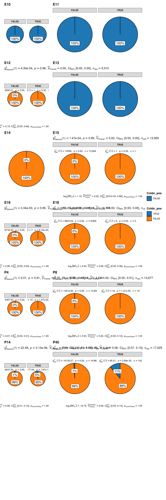

## Load data and setup parameters


::: {.cell layout-align="center"}

```{.r .cell-code}
# Load tidyverse infrastructure packages
suppressPackageStartupMessages({
  library(future)
  library(here)
  library(tidyverse)
  library(magrittr)
  library(stringr)
  library(skimr)
  library(RColorBrewer)
  library(viridis)
})


# Load packages for scRNA-seq analysis and visualisation
suppressPackageStartupMessages({
  library(ggplot2)
  library(cowplot)
  library(patchwork)
  library(ggstatsplot)
  library(anndata)
  library(sceasy)
  library(Seurat)
  library(SeuratDisk)
  library(SeuratWrappers)
  library(scCustomize)
})

sc <- import("scanpy", convert = FALSE)
```
:::


### Set paths


::: {.cell layout-align="center"}

```{.r .cell-code}
src_dir <- here("code")
data_dir <- here("data")
output_dir <- here("output")
plots_dir <- here(output_dir, "figures/")
tables_dir <- here(output_dir, "tables/")
```
:::


### Load helper functions and gene-sets


::: {.cell layout-align="center"}

```{.r .cell-code}
source(here(src_dir, "genes.R"))
source(here(src_dir, "functions.R"))
```
:::


### Set fixed variables


::: {.cell layout-align="center"}

```{.r .cell-code}
# set seed
reseed <- 42
set.seed(seed = reseed)

# Parameters for parallel execution
n_cores <- 32
plan("multisession", workers = n_cores)
options(
  future.globals.maxSize = 100000 * 1024^2,
  future.rng.onMisuse = "ignore"
)
plan()
```

::: {.cell-output .cell-output-stdout}
```
multisession:
- args: function (..., workers = 32, envir = parent.frame())
- tweaked: TRUE
- call: plan("multisession", workers = n_cores)
```
:::

```{.r .cell-code}
# ggplot2 theme
theme_set(ggmin::theme_powerpoint())
```
:::

::: {.cell layout-align="center"}

```{.r .cell-code}
bioproject <- "PRJNA547712"
project <- "kim2020_Hypoth-dev"
cb_fpr <- 0.001
low_cutoff_gene <- 500
high_cutoff_gene <- NULL
high_cutoff_gene <- 5000
low_cutoff_umis <- NULL
low_cutoff_umis <- -Inf
high_cutoff_umis <- 25000
high_cutoff_pc_mt <- 15
high_cutoff_pc_ribo <- 20
high_cutoff_pc_hb <- 0.1
high_cutoff_doublet_score <- 0.33
high_cutoff_complexity <- 0.85
connectivity_model <- "min_tree"
k <- 10
metric <- "euclidean"
signature <- 100
```
:::


## Load predicted astrocytes data and subset from Kim DW et al 2020


::: {.cell layout-align="center"}

```{.r .cell-code}
anndata <- sc$read(here(
  "kim2020_combined.h5ad"
  # "data", "class_cello",
  # sprintf("%s-whole_dataset-%s-cello_annotation.h5ad", bioproject, cb_fpr)
))
```
:::


### Convert adata object to R AnnDataR6 object.

::: {.cell layout-align="center"}

```{.r .cell-code}
adata <- py_to_r(anndata)
class(adata)
```

::: {.cell-output .cell-output-stdout}
```
[1] "AnnDataR6" "R6"       
```
:::

```{.r .cell-code}
class(adata$X)
```

::: {.cell-output .cell-output-stdout}
```
[1] "dgRMatrix"
attr(,"package")
[1] "Matrix"
```
:::

```{.r .cell-code}
adata
```

::: {.cell-output .cell-output-stdout}
```
AnnData object with n_obs × n_vars = 128006 × 27998
    obs: 'bc_name', 'orig.ident', 'nCount_RNA', 'nFeature_RNA', 'X1', 'X', 'Y', 'Z', 'Age', 'Cluster'
    var: '_index', 'features'
```
:::
:::

::: {.cell layout-align="center"}

```{.r .cell-code}
srt_path <- here(
  "data",
  sprintf("%s-whole_dataset-simple.h5Seurat", bioproject)
)

expr_mtx <- t(as.matrix(adata$X))
colnames(expr_mtx) <- rownames(adata$X)
rownames(expr_mtx) <- adata$var$features
srt <- CreateSeuratObject(
  expr_mtx,
  assay = "RNA",
  project = "kim2020_Hypoth_dev",
  meta.data = as.data.frame(adata$obs)
)

X_umap <- adata$obs |> select(X, Y) |> as.matrix()
colnames(X_umap) <- c("UMAP_1", "UMAP_2")
rownames(X_umap) <- colnames(expr_mtx)
srt[["umap"]] <- CreateDimReducObject(embeddings = X_umap, key = "umap_", assay = DefaultAssay(srt))

# X_pacmap <- adata$obsm$X_pacmap
# colnames(X_pacmap) <- c("PaCMAP_1", "PaCMAP_2")
# rownames(X_pacmap) <- colnames(expr_mtx)
# srt[["pacmap"]] <- CreateDimReducObject(embeddings = X_pacmap, key = "PaCMAP_", assay = DefaultAssay(srt))
# 
# ora_estimate <- adata$obsm$ora_estimate


Idents(srt) <- "Age"
srt <- Store_Palette_Seurat(seurat_object = srt, palette = rev(brewer.pal(n = 11, name = "Spectral")), palette_name = "expr_Colour_Pal")
```
:::

::: {.cell layout-align="center"}

```{.r .cell-code}
print(srt)
```

::: {.cell-output .cell-output-stdout}
```
An object of class Seurat 
27998 features across 128006 samples within 1 assay 
Active assay: RNA (27998 features, 0 variable features)
 1 layer present: counts
 1 dimensional reduction calculated: umap
```
:::

```{.r .cell-code}
nature2020 <- readRDS("/data/1_heteroAstrocytes/PRJNA548917/old/oldCCA_nae_srt.rds")
nature2020 <- UpdateSeuratObject(nature2020)
nature2020$Age <- 
  Cells(nature2020) |>
  str_split(pattern = ":", simplify = T) %>%
  .[,1] %>%
  str_split_fixed(pattern = "_", n = 3) %>%
  .[,3]
print(nature2020)
```

::: {.cell-output .cell-output-stdout}
```
An object of class Seurat 
24340 features across 51199 samples within 1 assay 
Active assay: RNA (24340 features, 3500 variable features)
 3 layers present: counts, data, scale.data
 3 dimensional reductions calculated: pca, tsne, umap
```
:::

```{.r .cell-code}
glimpse(nature2020@meta.data)
```

::: {.cell-output .cell-output-stdout}
```
Rows: 51,199
Columns: 20
$ nGene            <int> 1652, 782, 447, 1706, 1106, 894, 727, 734, 669, 617, …
$ nUMI             <dbl> 2787, 1090, 544, 2709, 1817, 1220, 995, 1036, 920, 86…
$ orig.ident       <fct> Hypothalamus, Hypothalamus, Hypothalamus, Hypothalamu…
$ res.0.2          <chr> "23", "23", "23", "23", "23", "23", "23", "23", "23",…
$ res.0.4          <chr> "34", "34", "34", "34", "34", "34", "34", "34", "34",…
$ res.0.8          <chr> "42", "42", "42", "42", "42", "42", "42", "42", "42",…
$ res.1.2          <chr> "47", "47", "47", "47", "47", "47", "47", "47", "47",…
$ res.2            <chr> "54", "54", "54", "54", "54", "54", "54", "54", "54",…
$ tree.ident       <int> 1, 1, 1, 1, 1, 1, 1, 1, 1, 1, 1, 1, 1, 1, 1, 1, 1, 1,…
$ pro_Inter        <chr> "41", "41", "41", "41", "41", "41", "41", "41", "41",…
$ pro_Enter        <chr> "41", "41", "41", "41", "41", "41", "41", "41", "41",…
$ tree_final       <fct> 19, 19, 19, 19, 19, 19, 19, 19, 19, 19, 19, 19, 19, 1…
$ subtree          <fct> 41, 41, 41, 41, 41, 41, 41, 41, 41, 41, 41, 41, 41, 4…
$ prim_walktrap    <fct> 38, 38, 38, 38, 38, 38, 38, 38, 38, 38, 38, 38, 38, 3…
$ umi_per_gene     <dbl> 1.687046, 1.393862, 1.217002, 1.587925, 1.642857, 1.3…
$ log_umi_per_gene <dbl> 0.22712693, 0.14421974, 0.08529138, 0.20082998, 0.215…
$ nCount_RNA       <dbl> 2787, 1090, 544, 2709, 1817, 1220, 995, 1036, 920, 86…
$ nFeature_RNA     <int> 1652, 782, 447, 1706, 1106, 894, 727, 734, 669, 617, …
$ wtree            <fct> 38, 38, 38, 38, 38, 38, 38, 38, 38, 38, 38, 38, 38, 3…
$ Age              <chr> "P23", "3P2", "3P2", "P2", "P2", "P2", "P2", "P2", "P…
```
:::

```{.r .cell-code}
table(Idents(nature2020))
```

::: {.cell-output .cell-output-stdout}
```

    1     2     3     4     5     6     7     8     9    10    11    12    13 
 2344  8146   395   402  3234   712   552   374   259   952 13727  1615   765 
   14    15    16    17    18    19    20    21    22    23    24    25    26 
  832  1244   792   590   808  2486  1683   628  1039  1750   292   394   547 
   27    28    29    30    31    32    33    34    35    36    37    38    39 
  391   407   507    93    81   402   143   701   222   353   324    73    78 
   40    41    42    43    44    45 
  328   190    73    37   179    55 
```
:::

```{.r .cell-code}
pt_subset_nature2020 <- subset(nature2020, idents = c("38", "42", "45"))
print(pt_subset_nature2020)
```

::: {.cell-output .cell-output-stdout}
```
An object of class Seurat 
24340 features across 201 samples within 1 assay 
Active assay: RNA (24340 features, 3500 variable features)
 3 layers present: counts, data, scale.data
 3 dimensional reductions calculated: pca, tsne, umap
```
:::
:::

::: {.cell layout-align="center"}

```{.r .cell-code}
FeaturePlot(
  nature2020,
  features = c("Tshb", "Cck", "Pitx1",
               "Eya1", "Eya2", "Eya3",
               "Sox2", "Hlf", "Tshr",
               "Cckar", "Cckbr", "Gpr173",
               "Foxl2", "Lhx3", "Lhx4", "Pit1", "Gata2"),
  label = F,
  blend = F,
  order = TRUE,
  pt.size = 1.2,
  raster.dpi = c(1024, 1024),
  alpha = 0.5,
  split.by = "Age"
  )
```

::: {.cell-output-display}
{fig-align='center' width=9600}
:::
:::

::: {.cell layout-align="center"}

```{.r .cell-code}
FeaturePlot(
  pt_subset_nature2020,
  features = c("Tshb", "Cck", "Pitx1",
               "Eya1", "Eya2", "Eya3",
               "Sox2", "Hlf", "Tshr",
               "Cckar", "Cckbr", "Gpr173",
               "Foxl2", "Lhx3", "Lhx4", "Pit1", "Gata2"),
  label = T,
  blend = F,
  order = TRUE,
  pt.size = 1.2,
  raster.dpi = c(1024, 1024),
  alpha = 0.5,
  split.by = "Age"
  )
```

::: {.cell-output-display}
{fig-align='center' width=9600}
:::
:::

::: {.cell layout-align="center"}

```{.r .cell-code}
srt <- NormalizeData(srt)
srt <- FindVariableFeatures(srt, selection.method = "vst", nfeatures = 3000)
# all.genes <- rownames(srt)
# srt <- ScaleData(srt, features = all.genes)
srt <- ScaleData(srt)
```
:::

::: {.cell layout-align="center"}

```{.r .cell-code}
hypoth.anchors <- FindTransferAnchors(reference = nature2020, query = srt, dims = 1:30,
    reference.reduction = "pca")
predictions <- TransferData(anchorset = hypoth.anchors, refdata = nature2020$wtree, dims = 1:30)
srt <- AddMetaData(srt, metadata = predictions)
table(srt$predicted.id)
```

::: {.cell-output .cell-output-stdout}
```

     1     10     11     12     13     15     16     17     19      2     20 
  3700      1   2198    225    545     58    218     19 100308   9886    924 
    22     23     26     27     28     29      3     38      4      5      6 
   163     11    115     24     76    481    951     49    156   2895   4756 
     7      8      9 
   199     47      1 
```
:::
:::

::: {.cell layout-align="center"}

```{.r .cell-code}
nature2020 <- RunUMAP(nature2020, dims = 1:30, reduction = "pca", return.model = TRUE)
srt <- IntegrateEmbeddings(anchorset = hypoth.anchors, reference = nature2020, query = srt,
    new.reduction.name = "ref.pca")
srt <- ProjectUMAP(query = srt, query.reduction = "ref.pca", reference = nature2020,
    reference.reduction = "pca", reduction.model = "umap")
```
:::

::: {.cell layout-align="center"}

```{.r .cell-code}
p1 <- DimPlot(nature2020, reduction = "umap", group.by = "wtree", label = TRUE, label.size = 3,
    repel = TRUE) + NoLegend() + ggtitle("Reference annotations")
p2 <- DimPlot(srt, reduction = "ref.umap", group.by = "predicted.id", label = TRUE,
    label.size = 3, repel = TRUE) + NoLegend() + ggtitle("Query transferred labels")
p1 + p2
```

::: {.cell-output-display}
{fig-align='center' width=4200}
:::
:::


# Calculate and plot chi2 test of independence between Sox2 and Tshr expression in hypothalamus across different developmental stages


::: {.cell layout-align="center"}

```{.r .cell-code}
sbs_mtx <- GetAssayData(object = srt, layer = "counts", assay = "RNA")[c("Sox2", "Tshr"), ] %>%
  as.data.frame() %>%
  t() %>%
  as.data.frame() %>%
  select(Sox2, Tshr) %>%
  dplyr::bind_cols(srt@meta.data) %>%
  select(Age, Sox2, Tshr) %>%
  mutate(Sox2_pos = Sox2 > 0,
         Tshr_pos  = Tshr  > 0)

sbs_mtx %>% skimr::skim()
```

::: {.cell-output-display}
Table: Data summary

|                         |           |
|:------------------------|:----------|
|Name                     |Piped data |
|Number of rows           |128006     |
|Number of columns        |5          |
|_______________________  |           |
|Column type frequency:   |           |
|character                |1          |
|logical                  |2          |
|numeric                  |2          |
|________________________ |           |
|Group variables          |None       |


**Variable type: character**

|skim_variable | n_missing| complete_rate| min| max| empty| n_unique| whitespace|
|:-------------|---------:|-------------:|---:|---:|-----:|--------:|----------:|
|Age           |         0|             1|   2|   3|     0|       12|          0|


**Variable type: logical**

|skim_variable | n_missing| complete_rate| mean|count                   |
|:-------------|---------:|-------------:|----:|:-----------------------|
|Sox2_pos      |         0|             1| 0.14|FAL: 110343, TRU: 17663 |
|Tshr_pos      |         0|             1| 0.00|FAL: 127714, TRU: 292   |


**Variable type: numeric**

|skim_variable | n_missing| complete_rate| mean|   sd| p0| p25| p50| p75| p100|hist  |
|:-------------|---------:|-------------:|----:|----:|--:|---:|---:|---:|----:|:-----|
|Sox2          |         0|             1| 0.27| 1.21|  0|   0|   0|   0|   82|▇▁▁▁▁ |
|Tshr          |         0|             1| 0.00| 0.06|  0|   0|   0|   0|    5|▇▁▁▁▁ |
:::
:::

::: {.cell layout-align="center"}

```{.r .cell-code}
write_csv(sbs_mtx, here(tables_dir, "Sox2-Tshr-association-astrocytes-between-Ages-on-evaluation-datasets.csv"))


# plot
grouped_ggpiestats(
  # arguments relevant for `ggpiestats()`
  data = sbs_mtx,
  x = Tshr_pos,
  y = Sox2_pos,
  grouping.var = Age,
  perc.k = 1,
  package = "ggsci",
  palette = "category10_d3",
  # arguments relevant for `combine_plots()`
  title.text = "Sox2 specification of Tshr-positive hypothalamic development",
  caption.text = "Asterisks denote results from proportion tests; \n***: p < 0.001, ns: non-significant",
  plotgrid.args = list(nrow = 8)
)
```

::: {.cell-output-display}
{fig-align='center' width=2400}
:::
:::


## Calculate and plot hexagonal cells representation in hypothalamus across different developmental stages with meta information

::: {.cell layout-align="center"}

```{.r .cell-code}
srt
```

::: {.cell-output .cell-output-stdout}
```
An object of class Seurat 
27998 features across 128006 samples within 1 assay 
Active assay: RNA (27998 features, 3000 variable features)
 3 layers present: counts, data, scale.data
 3 dimensional reductions calculated: umap, ref.pca, ref.umap
```
:::
:::

::: {.cell layout-align="center"}

```{.r .cell-code}
library(hexbin)
# Extract UMAP coordinates
umap_coords <- Embeddings(srt, reduction = "ref.umap")

# Create hexbin object
hb <- hexbin(umap_coords[,1], umap_coords[,2], xbins = 64)

# Create a data frame for plotting
hex_data <- data.frame(
  x = hcell2xy(hb)$x,
  y = hcell2xy(hb)$y,
  count = hb@count
)

# Create the plot
ggplot(hex_data, aes(x = x, y = y, fill = count)) +
  geom_hex(stat = "identity") +
  scale_fill_gradientn(colors = ggsci::pal_material("amber")(9)) +
  theme_minimal() +
  labs(x = "UMAP_1", y = "UMAP_2", fill = "Cell\nCount") +
  coord_fixed()
```

::: {.cell-output-display}
{fig-align='center' width=4200}
:::
:::

::: {.cell layout-align="center"}

```{.r .cell-code}
FeaturePlot(
  srt,
  features = c("Tshb", "Cck", "Pitx1",
               "Eya1", "Eya2", "Eya3",
               "Sox2", "Hlf", "Tshr",
               "Cckar", "Cckbr", "Gpr173",
               "Foxl2", "Lhx3", "Lhx4", "Pit1", "Gata2"),
  reduction = "ref.umap",
  label = F,
  blend = F,
  order = TRUE,
  pt.size = 1.2,
  raster.dpi = c(1024, 1024),
  alpha = 0.5,
  split.by = "Age"
  )
```

::: {.cell-output-display}
{fig-align='center' width=9600}
:::
:::

::: {.cell layout-align="center"}

```{.r .cell-code}
Idents(srt) <- "predicted.id"
FeaturePlot(
  srt,
  features = c("prediction.score.38",
               "prediction.score.42",
               "prediction.score.45"
               ),
  reduction = "ref.umap",
  label = T,
  repel = T,
  blend = F,
  order = TRUE,
  pt.size = 4,
  raster.dpi = c(1024, 1024),
  alpha = 0.8,
  max.cutoff = "q90",
  ncol = 3
  )
```

::: {.cell-output-display}
{fig-align='center' width=6300}
:::
:::

::: {.cell layout-align="center"}

```{.r .cell-code}
FeaturePlot(
  srt,
  features = c("prediction.score.38",
               "prediction.score.42",
               "prediction.score.45"
               ),
  reduction = "ref.umap",
  label = F,
  blend = F,
  order = TRUE,
  pt.size = 1.2,
  raster.dpi = c(1024, 1024),
  alpha = 0.8,
  max.cutoff = "q90",
  split.by = "Age"
  )
```

::: {.cell-output-display}
{fig-align='center' width=9600}
:::
:::

::: {.cell layout-align="center"}

```{.r .cell-code}
DimPlot(
  srt,
  group.by = c("predicted.id"),
  reduction = "ref.umap",
  label = T,
  repel = T,
  pt.size = 4,
  raster.dpi = c(1024, 1024),
  alpha = 0.5
  )
```

::: {.cell-output-display}
{fig-align='center' width=2100}
:::
:::

::: {.cell layout-align="center"}

```{.r .cell-code}
DimPlot(
  srt,
  group.by = c("predicted.id"),
  reduction = "ref.umap",
  label = T,
  repel = T,
  pt.size = 1.2,
  raster.dpi = c(1024, 1024),
  alpha = 0.5,
  split.by = "Age"
  ) + NoLegend()
```

::: {.cell-output-display}
{fig-align='center' width=9600}
:::
:::


## Quantify and plot hexagon representation of feature interactions with Spearman’s correlation

### Tshb and Eya3 correlation in hypothalamus across different developmental stages


::: {.cell layout-align="center"}

```{.r .cell-code}
FeaturePlot(srt |> subset(Age == "E10"), features = c("Tshb", "Eya3"),
  reduction = "ref.umap", blend = F, blend.threshold = 0.3, order = TRUE, pt.size = 2, raster.dpi = c(1024, 1024), alpha = 0.5)
```

::: {.cell-output-display}
{fig-align='center' width=3600}
:::
:::

::: {.cell layout-align="center"}

```{.r .cell-code}
FeaturePlot(srt |> subset(Age == "E11"), features = c("Tshb", "Eya3"),
  reduction = "ref.umap", blend = F, blend.threshold = 0.3, order = TRUE, pt.size = 2, raster.dpi = c(1024, 1024), alpha = 0.5)
```

::: {.cell-output-display}
{fig-align='center' width=3600}
:::
:::

::: {.cell layout-align="center"}

```{.r .cell-code}
FeaturePlot(srt |> subset(Age == "E12"), features = c("Tshb", "Eya3"),
  reduction = "ref.umap", 
  blend = TRUE,
  blend.threshold = 0.4,
  max.cutoff = "q95",
  pt.size = 1.5, 
  cols = c("grey98", "red", "blue"),
  order = T,
  alpha = 0.35,
  raster.dpi = c(1024, 1024)
)
```

::: {.cell-output-display}
{fig-align='center' width=7200}
:::
:::

::: {.cell layout-align="center"}

```{.r .cell-code}
FeaturePlot(srt |> subset(Age == "E13"), features = c("Tshb", "Eya3"),
  reduction = "ref.umap", 
  blend = TRUE,
  blend.threshold = 0.4,
  max.cutoff = "q95",
  pt.size = 1.5, 
  cols = c("grey98", "red", "blue"),
  order = T,
  alpha = 0.35,
  raster.dpi = c(1024, 1024)
)
```

::: {.cell-output-display}
{fig-align='center' width=7200}
:::
:::

::: {.cell layout-align="center"}

```{.r .cell-code}
FeaturePlot(
  srt |> subset(Age == "E14"),
  features = c("Tshb", "Eya3"),
  reduction = "ref.umap", 
  blend = TRUE,
  blend.threshold = 0.4,
  max.cutoff = "q95",
  pt.size = 1.5, 
  cols = c("grey98", "red", "blue"),
  order = T,
  alpha = 0.35,
  raster.dpi = c(1024, 1024)
)
```

::: {.cell-output-display}
{fig-align='center' width=7200}
:::
:::

::: {.cell layout-align="center"}

```{.r .cell-code}
FeaturePlot(srt |> subset(Age == "E15"), features = c("Tshb", "Eya3"),
  reduction = "ref.umap", blend = F, blend.threshold = 0.3, order = TRUE, pt.size = 2, raster.dpi = c(1024, 1024), alpha = 0.5)
```

::: {.cell-output-display}
{fig-align='center' width=3600}
:::
:::

::: {.cell layout-align="center"}

```{.r .cell-code}
FeaturePlot(srt |> subset(Age == "E16"), features = c("Tshb", "Eya3"),
  reduction = "ref.umap", 
  blend = TRUE,
  blend.threshold = 0.4,
  max.cutoff = "q95",
  pt.size = 1.5, 
  cols = c("grey98", "red", "blue"),
  order = T,
  alpha = 0.35,
  raster.dpi = c(1024, 1024)
)
```

::: {.cell-output-display}
{fig-align='center' width=7200}
:::
:::

::: {.cell layout-align="center"}

```{.r .cell-code}
FeaturePlot(srt |> subset(Age == "E18"), features = c("Tshb", "Eya3"),
  reduction = "ref.umap", 
  blend = TRUE,
  blend.threshold = 0.4,
  max.cutoff = "q95",
  pt.size = 1.5, 
  cols = c("grey98", "red", "blue"),
  order = T,
  alpha = 0.35,
  raster.dpi = c(1024, 1024)
)
```

::: {.cell-output-display}
{fig-align='center' width=7200}
:::
:::

::: {.cell layout-align="center"}

```{.r .cell-code}
FeaturePlot(srt |> subset(Age == "P8"), features = c("Tshb", "Eya3"),
  reduction = "ref.umap", 
  blend = TRUE,
  blend.threshold = 0.4,
  max.cutoff = "q95",
  pt.size = 1.5, 
  cols = c("grey98", "red", "blue"),
  order = T,
  alpha = 0.35,
  raster.dpi = c(1024, 1024)
)
```

::: {.cell-output-display}
{fig-align='center' width=7200}
:::
:::

::: {.cell layout-align="center"}

```{.r .cell-code}
FeaturePlot(srt |> subset(Age == "P45"), features = c("Tshb", "Eya3"),
  reduction = "ref.umap", 
  blend = TRUE,
  blend.threshold = 0.4,
  max.cutoff = "q95",
  pt.size = 1.5, 
  cols = c("grey98", "red", "blue"),
  order = T,
  alpha = 0.35,
  raster.dpi = c(1024, 1024)
)
```

::: {.cell-output-display}
{fig-align='center' width=7200}
:::
:::


### Tshb and Pitx1 correlation in hypothalamus across different developmental stages


::: {.cell layout-align="center"}

```{.r .cell-code}
FeaturePlot(srt |> subset(Age == "E10"), features = c("Tshb", "Pitx1"),
  reduction = "ref.umap", blend = F, blend.threshold = 0.3, order = TRUE, pt.size = 2, raster.dpi = c(1024, 1024), alpha = 0.5)
```

::: {.cell-output-display}
{fig-align='center' width=3600}
:::
:::

::: {.cell layout-align="center"}

```{.r .cell-code}
FeaturePlot(srt |> subset(Age == "E11"), features = c("Tshb", "Pitx1"),
  reduction = "ref.umap", blend = F, blend.threshold = 0.3, order = TRUE, pt.size = 2, raster.dpi = c(1024, 1024), alpha = 0.5)
```

::: {.cell-output-display}
{fig-align='center' width=3600}
:::
:::

::: {.cell layout-align="center"}

```{.r .cell-code}
FeaturePlot(srt |> subset(Age == "E12"), features = c("Tshb", "Pitx1"),
  reduction = "ref.umap", blend = F, blend.threshold = 0.3, order = TRUE, pt.size = 2, raster.dpi = c(1024, 1024), alpha = 0.5)
```

::: {.cell-output-display}
{fig-align='center' width=3600}
:::
:::

::: {.cell layout-align="center"}

```{.r .cell-code}
FeaturePlot(srt |> subset(Age == "E13"), features = c("Tshb", "Pitx1"),
  reduction = "ref.umap", 
  blend = TRUE,
  blend.threshold = 0.4,
  max.cutoff = "q95",
  pt.size = 1.5, 
  cols = c("grey98", "red", "blue"),
  order = T,
  alpha = 0.35,
  raster.dpi = c(1024, 1024)
)
```

::: {.cell-output-display}
{fig-align='center' width=7200}
:::
:::

::: {.cell layout-align="center"}

```{.r .cell-code}
FeaturePlot(srt |> subset(Age == "E14"), features = c("Tshb", "Pitx1"),
  reduction = "ref.umap", 
  blend = TRUE,
  blend.threshold = 0.4,
  max.cutoff = "q95",
  pt.size = 1.5, 
  cols = c("grey98", "red", "blue"),
  order = T,
  alpha = 0.35,
  raster.dpi = c(1024, 1024)
)
```

::: {.cell-output-display}
{fig-align='center' width=7200}
:::
:::

::: {.cell layout-align="center"}

```{.r .cell-code}
FeaturePlot(srt |> subset(Age == "E15"), features = c("Tshb", "Pitx1"),
  reduction = "ref.umap", blend = F, blend.threshold = 0.3, order = TRUE, pt.size = 2, raster.dpi = c(1024, 1024), alpha = 0.5)
```

::: {.cell-output-display}
{fig-align='center' width=3600}
:::
:::

::: {.cell layout-align="center"}

```{.r .cell-code}
FeaturePlot(srt |> subset(Age == "E16"), features = c("Tshb", "Pitx1"),
  reduction = "ref.umap", blend = F, blend.threshold = 0.3, order = TRUE, pt.size = 2, raster.dpi = c(1024, 1024), alpha = 0.5)
```

::: {.cell-output-display}
{fig-align='center' width=3600}
:::
:::

::: {.cell layout-align="center"}

```{.r .cell-code}
FeaturePlot(srt |> subset(Age == "E18"), features = c("Tshb", "Pitx1"),
  reduction = "ref.umap", blend = F, blend.threshold = 0.3, order = TRUE, pt.size = 2, raster.dpi = c(1024, 1024), alpha = 0.5)
```

::: {.cell-output-display}
{fig-align='center' width=3600}
:::
:::

::: {.cell layout-align="center"}

```{.r .cell-code}
FeaturePlot(srt |> subset(Age == "P8"), features = c("Tshb", "Pitx1"),
  reduction = "ref.umap", 
  blend = TRUE,
  blend.threshold = 0.4,
  max.cutoff = "q95",
  pt.size = 1.5, 
  cols = c("grey98", "red", "blue"),
  order = T,
  alpha = 0.35,
  raster.dpi = c(1024, 1024)
)
```

::: {.cell-output-display}
{fig-align='center' width=7200}
:::
:::

::: {.cell layout-align="center"}

```{.r .cell-code}
FeaturePlot(srt |> subset(Age == "P45"), features = c("Tshb", "Pitx1"),
  reduction = "ref.umap", 
  blend = TRUE,
  blend.threshold = 0.4,
  max.cutoff = "q95",
  pt.size = 1.5, 
  cols = c("grey98", "red", "blue"),
  order = T,
  alpha = 0.35,
  raster.dpi = c(1024, 1024)
)
```

::: {.cell-output-display}
{fig-align='center' width=7200}
:::
:::


### Cck and Eya3 correlation in hypothalamus across different developmental stages


::: {.cell layout-align="center"}

```{.r .cell-code}
# FeaturePlot(srt |> subset(Age == "E10"), features = c("Cck", "Eya3"),
#   reduction = "ref.umap", blend = TRUE, blend.threshold = 0.3, order = TRUE, pt.size = 2, raster.dpi = c(1024, 1024), alpha = 0.5)
# 
# Error in `FeaturePlot()`:
# ! The following features have no value: Cck
```
:::

::: {.cell layout-align="center"}

```{.r .cell-code}
FeaturePlot(srt |> subset(Age == "E11"), features = c("Cck", "Eya3"),
  reduction = "ref.umap", 
  blend = TRUE,
  blend.threshold = 0.4,
  max.cutoff = "q95",
  pt.size = 1.5, 
  cols = c("grey98", "red", "blue"),
  order = T,
  alpha = 0.35,
  raster.dpi = c(1024, 1024)
)
```

::: {.cell-output-display}
{fig-align='center' width=7200}
:::
:::

::: {.cell layout-align="center"}

```{.r .cell-code}
FeaturePlot(srt |> subset(Age == "E12"), features = c("Cck", "Eya3"),
  reduction = "ref.umap", 
  blend = TRUE,
  blend.threshold = 0.4,
  max.cutoff = "q95",
  pt.size = 1.5, 
  cols = c("grey98", "red", "blue"),
  order = T,
  alpha = 0.35,
  raster.dpi = c(1024, 1024)
)
```

::: {.cell-output-display}
{fig-align='center' width=7200}
:::
:::

::: {.cell layout-align="center"}

```{.r .cell-code}
FeaturePlot(srt |> subset(Age == "E13"), features = c("Cck", "Eya3"),
  reduction = "ref.umap", 
  blend = TRUE,
  blend.threshold = 0.4,
  max.cutoff = "q95",
  pt.size = 1.5, 
  cols = c("grey98", "red", "blue"),
  order = T,
  alpha = 0.35,
  raster.dpi = c(1024, 1024)
)
```

::: {.cell-output-display}
{fig-align='center' width=7200}
:::
:::

::: {.cell layout-align="center"}

```{.r .cell-code}
FeaturePlot(srt |> subset(Age == "E14"), features = c("Cck", "Eya3"),
  reduction = "ref.umap", 
  blend = TRUE,
  blend.threshold = 0.4,
  max.cutoff = "q95",
  pt.size = 1.5, 
  cols = c("grey98", "red", "blue"),
  order = T,
  alpha = 0.35,
  raster.dpi = c(1024, 1024)
)
```

::: {.cell-output-display}
{fig-align='center' width=7200}
:::
:::

::: {.cell layout-align="center"}

```{.r .cell-code}
FeaturePlot(srt |> subset(Age == "E15"), features = c("Cck", "Eya3"),
  reduction = "ref.umap", 
  blend = TRUE,
  blend.threshold = 0.4,
  max.cutoff = "q95",
  pt.size = 1.5, 
  cols = c("grey98", "red", "blue"),
  order = T,
  alpha = 0.35,
  raster.dpi = c(1024, 1024)
)
```

::: {.cell-output-display}
{fig-align='center' width=7200}
:::
:::

::: {.cell layout-align="center"}

```{.r .cell-code}
FeaturePlot(srt |> subset(Age == "E16"), features = c("Cck", "Eya3"),
  reduction = "ref.umap", 
  blend = TRUE,
  blend.threshold = 0.4,
  max.cutoff = "q95",
  pt.size = 1.5, 
  cols = c("grey98", "red", "blue"),
  order = T,
  alpha = 0.35,
  raster.dpi = c(1024, 1024)
)
```

::: {.cell-output-display}
{fig-align='center' width=7200}
:::
:::

::: {.cell layout-align="center"}

```{.r .cell-code}
FeaturePlot(srt |> subset(Age == "E18"), features = c("Cck", "Eya3"),
  reduction = "ref.umap", 
  blend = TRUE,
  blend.threshold = 0.4,
  max.cutoff = "q95",
  pt.size = 1.5, 
  cols = c("grey98", "red", "blue"),
  order = T,
  alpha = 0.35,
  raster.dpi = c(1024, 1024)
)
```

::: {.cell-output-display}
{fig-align='center' width=7200}
:::
:::

::: {.cell layout-align="center"}

```{.r .cell-code}
FeaturePlot(srt |> subset(Age == "P8"), features = c("Cck", "Eya3"),
  reduction = "ref.umap", 
  blend = TRUE,
  blend.threshold = 0.4,
  max.cutoff = "q95",
  pt.size = 1.5, 
  cols = c("grey98", "red", "blue"),
  order = T,
  alpha = 0.35,
  raster.dpi = c(1024, 1024)
)
```

::: {.cell-output-display}
{fig-align='center' width=7200}
:::
:::

::: {.cell layout-align="center"}

```{.r .cell-code}
FeaturePlot(srt |> subset(Age == "P45"), features = c("Cck", "Eya3"),
  reduction = "ref.umap", 
  blend = TRUE,
  blend.threshold = 0.4,
  max.cutoff = "q95",
  pt.size = 1.5, 
  cols = c("grey98", "red", "blue"),
  order = T,
  alpha = 0.35,
  raster.dpi = c(1024, 1024)
)
```

::: {.cell-output-display}
{fig-align='center' width=7200}
:::
:::


### Pitx1 and Cck


::: {.cell layout-align="center"}

```{.r .cell-code}
FeaturePlot(srt |> subset(Age == "E10"), features = c("Cck", "Pitx1"),
  reduction = "ref.umap", blend = F, blend.threshold = 0.3, order = TRUE, pt.size = 2, raster.dpi = c(1024, 1024), alpha = 0.5)
```

::: {.cell-output-display}
{fig-align='center' width=3600}
:::
:::

::: {.cell layout-align="center"}

```{.r .cell-code}
FeaturePlot(srt |> subset(Age == "E11"), features = c("Cck", "Pitx1"),
  reduction = "ref.umap", blend = F, blend.threshold = 0.3, order = TRUE, pt.size = 2, raster.dpi = c(1024, 1024), alpha = 0.5)
```

::: {.cell-output-display}
{fig-align='center' width=3600}
:::
:::

::: {.cell layout-align="center"}

```{.r .cell-code}
FeaturePlot(srt |> subset(Age == "E12"), features = c("Cck", "Pitx1"),
  reduction = "ref.umap", blend = F, blend.threshold = 0.3, order = TRUE, pt.size = 2, raster.dpi = c(1024, 1024), alpha = 0.5)
```

::: {.cell-output-display}
{fig-align='center' width=3600}
:::
:::

::: {.cell layout-align="center"}

```{.r .cell-code}
FeaturePlot(srt |> subset(Age == "E13"), features = c("Cck", "Pitx1"),
  reduction = "ref.umap", 
  blend = TRUE,
  blend.threshold = 0.4,
  max.cutoff = "q95",
  pt.size = 1.5, 
  cols = c("grey98", "red", "blue"),
  order = T,
  alpha = 0.35,
  raster.dpi = c(1024, 1024)
)
```

::: {.cell-output-display}
{fig-align='center' width=7200}
:::
:::

::: {.cell layout-align="center"}

```{.r .cell-code}
FeaturePlot(srt |> subset(Age == "E14"), features = c("Cck", "Pitx1"),
  reduction = "ref.umap", 
  blend = TRUE,
  blend.threshold = 0.4,
  max.cutoff = "q95",
  pt.size = 1.5, 
  cols = c("grey98", "red", "blue"),
  order = T,
  alpha = 0.35,
  raster.dpi = c(1024, 1024)
)
```

::: {.cell-output-display}
{fig-align='center' width=7200}
:::
:::

::: {.cell layout-align="center"}

```{.r .cell-code}
# FeaturePlot(srt |> subset(Age == "E15"), features = c("Cck", "Pitx1"),
#   reduction = "ref.umap", blend = TRUE, blend.threshold = 0.3, order = TRUE, pt.size = 2, raster.dpi = c(1024, 1024), alpha = 0.5)
# 
# Error in `FeaturePlot()`:
# ! The following features have no value: Pitx1
```
:::

::: {.cell layout-align="center"}

```{.r .cell-code}
# FeaturePlot(srt |> subset(Age == "E16"), features = c("Cck", "Pitx1"),
#   reduction = "ref.umap", blend = TRUE, blend.threshold = 0.3, order = TRUE, pt.size = 2, raster.dpi = c(1024, 1024), alpha = 0.5)
# 
# Error in `FeaturePlot()`:
# ! The following features have no value: Pitx1
```
:::

::: {.cell layout-align="center"}

```{.r .cell-code}
# FeaturePlot(srt |> subset(Age == "E18"), features = c("Cck", "Pitx1"),
#   reduction = "ref.umap", blend = TRUE, blend.threshold = 0.3, order = TRUE, pt.size = 2, raster.dpi = c(1024, 1024), alpha = 0.5)
# 
# Error in `FeaturePlot()`:
# ! The following features have no value: Pitx1
```
:::

::: {.cell layout-align="center"}

```{.r .cell-code}
FeaturePlot(srt |> subset(Age == "P8"), features = c("Cck", "Pitx1"),
  reduction = "ref.umap", 
  blend = TRUE,
  blend.threshold = 0.4,
  max.cutoff = "q95",
  pt.size = 1.5, 
  cols = c("grey98", "red", "blue"),
  order = T,
  alpha = 0.35,
  raster.dpi = c(1024, 1024)
)
```

::: {.cell-output-display}
{fig-align='center' width=7200}
:::
:::

::: {.cell layout-align="center"}

```{.r .cell-code}
FeaturePlot(srt |> subset(Age == "P45"), features = c("Cck", "Pitx1"),
  reduction = "ref.umap", 
  blend = TRUE,
  blend.threshold = 0.4,
  max.cutoff = "q95",
  pt.size = 1.5, 
  cols = c("grey98", "red", "blue"),
  order = T,
  alpha = 0.35,
  raster.dpi = c(1024, 1024)
)
```

::: {.cell-output-display}
{fig-align='center' width=7200}
:::
:::


### Tsh


::: {.cell layout-align="center"}

```{.r .cell-code}
# FeaturePlot(srt |> subset(Age == "E10"), features = c("Sox2", "Tshb"),
#   reduction = "ref.umap", blend = TRUE, blend.threshold = 0.3, order = TRUE, pt.size = 2, raster.dpi = c(1024, 1024), alpha = 0.5)
# 
# Error in `FeaturePlot()`:
# ! The following features have no value: Tshb
```
:::

::: {.cell layout-align="center"}

```{.r .cell-code}
# FeaturePlot(srt |> subset(Age == "E11"), features = c("Sox2", "Tshb"),
#   reduction = "ref.umap", blend = TRUE, blend.threshold = 0.3, order = TRUE, pt.size = 2, raster.dpi = c(1024, 1024), alpha = 0.5)
# 
# Error in `FeaturePlot()`:
# ! The following features have no value: Tshb
```
:::

::: {.cell layout-align="center"}

```{.r .cell-code}
FeaturePlot(srt |> subset(Age == "E12"), features = c("Sox2", "Tshb"),
  reduction = "ref.umap", 
  blend = TRUE,
  blend.threshold = 0.4,
  max.cutoff = "q95",
  pt.size = 1.5, 
  cols = c("grey98", "red", "blue"),
  order = T,
  alpha = 0.35,
  raster.dpi = c(1024, 1024)
)
```

::: {.cell-output-display}
{fig-align='center' width=7200}
:::
:::

::: {.cell layout-align="center"}

```{.r .cell-code}
FeaturePlot(srt |> subset(Age == "E13"), features = c("Sox2", "Tshb"),
  reduction = "ref.umap", 
  blend = TRUE,
  blend.threshold = 0.4,
  max.cutoff = "q95",
  pt.size = 1.5, 
  cols = c("grey98", "red", "blue"),
  order = T,
  alpha = 0.35,
  raster.dpi = c(1024, 1024)
)
```

::: {.cell-output-display}
{fig-align='center' width=7200}
:::
:::

::: {.cell layout-align="center"}

```{.r .cell-code}
FeaturePlot(srt |> subset(Age == "E14"), features = c("Sox2", "Tshb"),
  reduction = "ref.umap", blend = F, label = TRUE, order = TRUE, pt.size = 2, raster.dpi = c(1024, 1024), alpha = 0.5)
```

::: {.cell-output-display}
{fig-align='center' width=3600}
:::
:::

::: {.cell layout-align="center"}

```{.r .cell-code}
# FeaturePlot(srt |> subset(Age == "E15"), features = c("Sox2", "Tshb"),
#   reduction = "ref.umap", blend = TRUE, blend.threshold = 0.3, order = TRUE, pt.size = 2, raster.dpi = c(1024, 1024), alpha = 0.5)
# 
# Error in `FeaturePlot()`:
# ! The following features have no value: Tshb
```
:::

::: {.cell layout-align="center"}

```{.r .cell-code}
FeaturePlot(srt |> subset(Age == "E16"), features = c("Sox2", "Tshb"),
  reduction = "ref.umap", 
  blend = TRUE,
  blend.threshold = 0.4,
  max.cutoff = "q95",
  pt.size = 1.5, 
  cols = c("grey98", "red", "blue"),
  order = T,
  alpha = 0.35,
  raster.dpi = c(1024, 1024)
)
```

::: {.cell-output-display}
{fig-align='center' width=7200}
:::
:::

::: {.cell layout-align="center"}

```{.r .cell-code}
FeaturePlot(srt |> subset(Age == "E18"), features = c("Sox2", "Tshb"),
  reduction = "ref.umap", 
  blend = TRUE,
  blend.threshold = 0.4,
  max.cutoff = "q95",
  pt.size = 1.5, 
  cols = c("grey98", "red", "blue"),
  order = T,
  alpha = 0.35,
  raster.dpi = c(1024, 1024)
)
```

::: {.cell-output-display}
{fig-align='center' width=7200}
:::
:::

::: {.cell layout-align="center"}

```{.r .cell-code}
FeaturePlot(srt |> subset(Age == "P8"), features = c("Sox2", "Tshb"),
  reduction = "ref.umap", 
  blend = TRUE,
  blend.threshold = 0.4,
  max.cutoff = "q95",
  pt.size = 1.5, 
  cols = c("grey98", "red", "blue"),
  order = T,
  alpha = 0.35,
  raster.dpi = c(1024, 1024)
)
```

::: {.cell-output-display}
{fig-align='center' width=7200}
:::
:::

::: {.cell layout-align="center"}

```{.r .cell-code}
FeaturePlot(srt |> subset(Age == "P45"), features = c("Sox2", "Tshb"),
  reduction = "ref.umap", 
  blend = TRUE,
  blend.threshold = 0.4,
  max.cutoff = "q95",
  pt.size = 1.5, 
  cols = c("grey98", "red", "blue"),
  order = T,
  alpha = 0.35,
  raster.dpi = c(1024, 1024)
)
```

::: {.cell-output-display}
{fig-align='center' width=7200}
:::
:::


### Tsh


::: {.cell layout-align="center"}

```{.r .cell-code}
# FeaturePlot(srt |> subset(Age == "E10"), features = c("Sox2", "Cck"),
#   reduction = "ref.umap", blend = TRUE, blend.threshold = 0.3, order = TRUE, pt.size = 2, raster.dpi = c(1024, 1024), alpha = 0.5)
# 
# Error in `FeaturePlot()`:
# ! The following features have no value: Cck
```
:::

::: {.cell layout-align="center"}

```{.r .cell-code}
FeaturePlot(srt |> subset(Age == "E11"), features = c("Sox2", "Cck"),
  reduction = "ref.umap", 
  blend = TRUE,
  blend.threshold = 0.4,
  max.cutoff = "q95",
  pt.size = 1.5, 
  cols = c("grey98", "red", "blue"),
  order = T,
  alpha = 0.35,
  raster.dpi = c(1024, 1024)
)
```

::: {.cell-output-display}
{fig-align='center' width=7200}
:::
:::

::: {.cell layout-align="center"}

```{.r .cell-code}
FeaturePlot(srt |> subset(Age == "E12"), features = c("Sox2", "Cck"),
  reduction = "ref.umap", 
  blend = TRUE,
  blend.threshold = 0.4,
  max.cutoff = "q95",
  pt.size = 1.5, 
  cols = c("grey98", "red", "blue"),
  order = T,
  alpha = 0.35,
  raster.dpi = c(1024, 1024)
)
```

::: {.cell-output-display}
{fig-align='center' width=7200}
:::
:::

::: {.cell layout-align="center"}

```{.r .cell-code}
FeaturePlot(srt |> subset(Age == "E13"), features = c("Sox2", "Cck"),
  reduction = "ref.umap", 
  blend = TRUE,
  blend.threshold = 0.4,
  max.cutoff = "q95",
  pt.size = 1.5, 
  cols = c("grey98", "red", "blue"),
  order = T,
  alpha = 0.35,
  raster.dpi = c(1024, 1024)
)
```

::: {.cell-output-display}
{fig-align='center' width=7200}
:::
:::

::: {.cell layout-align="center"}

```{.r .cell-code}
FeaturePlot(srt |> subset(Age == "E14"), features = c("Sox2", "Cck"),
  reduction = "ref.umap", blend = F, label = TRUE, order = TRUE, pt.size = 2, raster.dpi = c(1024, 1024), alpha = 0.5)
```

::: {.cell-output-display}
{fig-align='center' width=3600}
:::
:::

::: {.cell layout-align="center"}

```{.r .cell-code}
FeaturePlot(srt |> subset(Age == "E15"), features = c("Sox2", "Cck"),
  reduction = "ref.umap", 
  blend = TRUE,
  blend.threshold = 0.4,
  max.cutoff = "q95",
  pt.size = 1.5, 
  cols = c("grey98", "red", "blue"),
  order = T,
  alpha = 0.35,
  raster.dpi = c(1024, 1024)
)
```

::: {.cell-output-display}
{fig-align='center' width=7200}
:::
:::

::: {.cell layout-align="center"}

```{.r .cell-code}
FeaturePlot(srt |> subset(Age == "E16"), features = c("Sox2", "Cck"),
  reduction = "ref.umap", 
  blend = TRUE,
  blend.threshold = 0.4,
  max.cutoff = "q95",
  pt.size = 1.5, 
  cols = c("grey98", "red", "blue"),
  order = T,
  alpha = 0.35,
  raster.dpi = c(1024, 1024)
)
```

::: {.cell-output-display}
{fig-align='center' width=7200}
:::
:::

::: {.cell layout-align="center"}

```{.r .cell-code}
FeaturePlot(srt |> subset(Age == "E18"), features = c("Sox2", "Cck"),
  reduction = "ref.umap", 
  blend = TRUE,
  blend.threshold = 0.4,
  max.cutoff = "q95",
  pt.size = 1.5, 
  cols = c("grey98", "red", "blue"),
  order = T,
  alpha = 0.35,
  raster.dpi = c(1024, 1024)
)
```

::: {.cell-output-display}
{fig-align='center' width=7200}
:::
:::

::: {.cell layout-align="center"}

```{.r .cell-code}
FeaturePlot(srt |> subset(Age == "P8"), features = c("Sox2", "Cck"),
  reduction = "ref.umap", 
  blend = TRUE,
  blend.threshold = 0.4,
  max.cutoff = "q95",
  pt.size = 1.5, 
  cols = c("grey98", "red", "blue"),
  order = T,
  alpha = 0.35,
  raster.dpi = c(1024, 1024)
)
```

::: {.cell-output-display}
{fig-align='center' width=7200}
:::
:::

::: {.cell layout-align="center"}

```{.r .cell-code}
FeaturePlot(srt |> subset(Age == "P45"), features = c("Sox2", "Cck"),
  reduction = "ref.umap", 
  blend = TRUE,
  blend.threshold = 0.4,
  max.cutoff = "q95",
  pt.size = 1.5, 
  cols = c("grey98", "red", "blue"),
  order = T,
  alpha = 0.35,
  raster.dpi = c(1024, 1024)
)
```

::: {.cell-output-display}
{fig-align='center' width=7200}
:::
:::


### Pitx1


::: {.cell layout-align="center"}

```{.r .cell-code}
FeaturePlot(srt |> subset(Age == "E10"), features = c("Sox2", "Pitx1"),
  reduction = "ref.umap", 
  blend = TRUE,
  blend.threshold = 0.4,
  max.cutoff = "q95",
  pt.size = 1.5, 
  cols = c("grey98", "red", "blue"),
  order = T,
  alpha = 0.35,
  raster.dpi = c(1024, 1024)
)
```

::: {.cell-output-display}
{fig-align='center' width=7200}
:::
:::

::: {.cell layout-align="center"}

```{.r .cell-code}
FeaturePlot(srt |> subset(Age == "E11"), features = c("Sox2", "Pitx1"),
  reduction = "ref.umap", 
  blend = TRUE,
  blend.threshold = 0.4,
  max.cutoff = "q95",
  pt.size = 1.5, 
  cols = c("grey98", "red", "blue"),
  order = T,
  alpha = 0.35,
  raster.dpi = c(1024, 1024)
)
```

::: {.cell-output-display}
{fig-align='center' width=7200}
:::
:::

::: {.cell layout-align="center"}

```{.r .cell-code}
# FeaturePlot(srt |> subset(Age == "E12"), features = c("Sox2", "Pitx1"),
#   reduction = "ref.umap", blend = TRUE, blend.threshold = 0.3, order = TRUE, pt.size = 2, raster.dpi = c(1024, 1024), alpha = 0.5)
# 
# Error in `FeaturePlot()`:
# ! The following features have no value: Pitx1
```
:::

::: {.cell layout-align="center"}

```{.r .cell-code}
FeaturePlot(srt |> subset(Age == "E13"), features = c("Sox2", "Pitx1"),
  reduction = "ref.umap", 
  blend = TRUE,
  blend.threshold = 0.4,
  max.cutoff = "q95",
  pt.size = 1.5, 
  cols = c("grey98", "red", "blue"),
  order = T,
  alpha = 0.35,
  raster.dpi = c(1024, 1024)
)
```

::: {.cell-output-display}
{fig-align='center' width=7200}
:::
:::

::: {.cell layout-align="center"}

```{.r .cell-code}
FeaturePlot(srt |> subset(Age == "E14"), features = c("Sox2", "Pitx1"),
  reduction = "ref.umap", blend = F, label = TRUE, order = TRUE, pt.size = 2, raster.dpi = c(1024, 1024), alpha = 0.5)
```

::: {.cell-output-display}
{fig-align='center' width=3600}
:::
:::

::: {.cell layout-align="center"}

```{.r .cell-code}
# FeaturePlot(srt |> subset(Age == "E15"), features = c("Sox2", "Pitx1"),
#   reduction = "ref.umap", blend = TRUE, blend.threshold = 0.3, order = TRUE, pt.size = 2, raster.dpi = c(1024, 1024), alpha = 0.5)
# 
# Error in `FeaturePlot()`:
# ! The following features have no value: Pitx1
```
:::

::: {.cell layout-align="center"}

```{.r .cell-code}
# FeaturePlot(srt |> subset(Age == "E16"), features = c("Sox2", "Pitx1"),
#   reduction = "ref.umap", blend = TRUE, blend.threshold = 0.3, order = TRUE, pt.size = 2, raster.dpi = c(1024, 1024), alpha = 0.5)
# 
# Error in `FeaturePlot()`:
# ! The following features have no value: Pitx1
```
:::

::: {.cell layout-align="center"}

```{.r .cell-code}
# FeaturePlot(srt |> subset(Age == "E18"), features = c("Sox2", "Pitx1"),
#   reduction = "ref.umap", blend = TRUE, blend.threshold = 0.3, order = TRUE, pt.size = 2, raster.dpi = c(1024, 1024), alpha = 0.5)
# 
# Error in `FeaturePlot()`:
# ! The following features have no value: Pitx1
```
:::

::: {.cell layout-align="center"}

```{.r .cell-code}
FeaturePlot(srt |> subset(Age == "P8"), features = c("Sox2", "Pitx1"),
  reduction = "ref.umap", 
  blend = TRUE,
  blend.threshold = 0.4,
  max.cutoff = "q95",
  pt.size = 1.5, 
  cols = c("grey98", "red", "blue"),
  order = T,
  alpha = 0.35,
  raster.dpi = c(1024, 1024)
)
```

::: {.cell-output-display}
{fig-align='center' width=7200}
:::
:::

::: {.cell layout-align="center"}

```{.r .cell-code}
FeaturePlot(srt |> subset(Age == "P45"), features = c("Sox2", "Pitx1"),
  reduction = "ref.umap", 
  blend = TRUE,
  blend.threshold = 0.4,
  max.cutoff = "q95",
  pt.size = 1.5, 
  cols = c("grey98", "red", "blue"),
  order = T,
  alpha = 0.35,
  raster.dpi = c(1024, 1024)
)
```

::: {.cell-output-display}
{fig-align='center' width=7200}
:::
:::


### Hlf


::: {.cell layout-align="center"}

```{.r .cell-code}
FeaturePlot(srt |> subset(Age == "E10"), features = c("Eya3", "Hlf"),
  reduction = "ref.umap", 
  blend = TRUE,
  blend.threshold = 0.4,
  max.cutoff = "q95",
  pt.size = 1.5, 
  cols = c("grey98", "red", "blue"),
  order = T,
  alpha = 0.35,
  raster.dpi = c(1024, 1024)
)
```

::: {.cell-output-display}
{fig-align='center' width=7200}
:::
:::

::: {.cell layout-align="center"}

```{.r .cell-code}
FeaturePlot(srt |> subset(Age == "E11"), features = c("Eya3", "Hlf"),
  reduction = "ref.umap", 
  blend = TRUE,
  blend.threshold = 0.4,
  max.cutoff = "q95",
  pt.size = 1.5, 
  cols = c("grey98", "red", "blue"),
  order = T,
  alpha = 0.35,
  raster.dpi = c(1024, 1024)
)
```

::: {.cell-output-display}
{fig-align='center' width=7200}
:::
:::

::: {.cell layout-align="center"}

```{.r .cell-code}
FeaturePlot(srt |> subset(Age == "E12"), features = c("Eya3", "Hlf"),
  reduction = "ref.umap", 
  blend = TRUE,
  blend.threshold = 0.4,
  max.cutoff = "q95",
  pt.size = 1.5, 
  cols = c("grey98", "red", "blue"),
  order = T,
  alpha = 0.35,
  raster.dpi = c(1024, 1024)
)
```

::: {.cell-output-display}
{fig-align='center' width=7200}
:::
:::

::: {.cell layout-align="center"}

```{.r .cell-code}
FeaturePlot(srt |> subset(Age == "E13"), features = c("Eya3", "Hlf"),
  reduction = "ref.umap", 
  blend = TRUE,
  blend.threshold = 0.4,
  max.cutoff = "q95",
  pt.size = 1.5, 
  cols = c("grey98", "red", "blue"),
  order = T,
  alpha = 0.35,
  raster.dpi = c(1024, 1024)
)
```

::: {.cell-output-display}
{fig-align='center' width=7200}
:::
:::

::: {.cell layout-align="center"}

```{.r .cell-code}
FeaturePlot(srt |> subset(Age == "E14"), features = c("Eya3", "Hlf"),
  reduction = "ref.umap", 
  blend = TRUE,
  blend.threshold = 0.4,
  max.cutoff = "q95",
  pt.size = 1.5, 
  cols = c("grey98", "red", "blue"),
  order = T,
  alpha = 0.35,
  raster.dpi = c(1024, 1024)
)
```

::: {.cell-output-display}
{fig-align='center' width=7200}
:::
:::

::: {.cell layout-align="center"}

```{.r .cell-code}
FeaturePlot(srt |> subset(Age == "E15"), features = c("Eya3", "Hlf"),
  reduction = "ref.umap", 
  blend = TRUE,
  blend.threshold = 0.4,
  max.cutoff = "q95",
  pt.size = 1.5, 
  cols = c("grey98", "red", "blue"),
  order = T,
  alpha = 0.35,
  raster.dpi = c(1024, 1024)
)
```

::: {.cell-output-display}
{fig-align='center' width=7200}
:::
:::

::: {.cell layout-align="center"}

```{.r .cell-code}
FeaturePlot(srt |> subset(Age == "E16"), features = c("Eya3", "Hlf"),
  reduction = "ref.umap", 
  blend = TRUE,
  blend.threshold = 0.4,
  max.cutoff = "q95",
  pt.size = 1.5, 
  cols = c("grey98", "red", "blue"),
  order = T,
  alpha = 0.35,
  raster.dpi = c(1024, 1024)
)
```

::: {.cell-output-display}
{fig-align='center' width=7200}
:::
:::

::: {.cell layout-align="center"}

```{.r .cell-code}
FeaturePlot(srt |> subset(Age == "E18"), features = c("Eya3", "Hlf"),
  reduction = "ref.umap", 
  blend = TRUE,
  blend.threshold = 0.4,
  max.cutoff = "q95",
  pt.size = 1.5, 
  cols = c("grey98", "red", "blue"),
  order = T,
  alpha = 0.35,
  raster.dpi = c(1024, 1024)
)
```

::: {.cell-output-display}
{fig-align='center' width=7200}
:::
:::

::: {.cell layout-align="center"}

```{.r .cell-code}
FeaturePlot(srt |> subset(Age == "P8"), features = c("Eya3", "Hlf"),
  reduction = "ref.umap", 
  blend = TRUE,
  blend.threshold = 0.4,
  max.cutoff = "q95",
  pt.size = 1.5, 
  cols = c("grey98", "red", "blue"),
  order = T,
  alpha = 0.35,
  raster.dpi = c(1024, 1024)
)
```

::: {.cell-output-display}
{fig-align='center' width=7200}
:::
:::

::: {.cell layout-align="center"}

```{.r .cell-code}
FeaturePlot(srt |> subset(Age == "P45"), features = c("Eya3", "Hlf"),
  reduction = "ref.umap", 
  blend = TRUE,
  blend.threshold = 0.4,
  max.cutoff = "q95",
  pt.size = 1.5, 
  cols = c("grey98", "red", "blue"),
  order = T,
  alpha = 0.35,
  raster.dpi = c(1024, 1024)
)
```

::: {.cell-output-display}
{fig-align='center' width=7200}
:::
:::


### Igfbp5


::: {.cell layout-align="center"}

```{.r .cell-code}
FeaturePlot(srt |> subset(Age == "E10"), features = c("Eya3", "Igfbp5"),
  reduction = "ref.umap", 
  blend = TRUE,
  blend.threshold = 0.4,
  max.cutoff = "q95",
  pt.size = 1.5, 
  cols = c("grey98", "red", "blue"),
  order = T,
  alpha = 0.35,
  raster.dpi = c(1024, 1024)
)
```

::: {.cell-output-display}
{fig-align='center' width=7200}
:::
:::

::: {.cell layout-align="center"}

```{.r .cell-code}
FeaturePlot(srt |> subset(Age == "E11"), features = c("Eya3", "Igfbp5"),
  reduction = "ref.umap", 
  blend = TRUE,
  blend.threshold = 0.4,
  max.cutoff = "q95",
  pt.size = 1.5, 
  cols = c("grey98", "red", "blue"),
  order = T,
  alpha = 0.35,
  raster.dpi = c(1024, 1024)
)
```

::: {.cell-output-display}
{fig-align='center' width=7200}
:::
:::

::: {.cell layout-align="center"}

```{.r .cell-code}
FeaturePlot(srt |> subset(Age == "E12"), features = c("Eya3", "Igfbp5"),
  reduction = "ref.umap", 
  blend = TRUE,
  blend.threshold = 0.4,
  max.cutoff = "q95",
  pt.size = 1.5, 
  cols = c("grey98", "red", "blue"),
  order = T,
  alpha = 0.35,
  raster.dpi = c(1024, 1024)
)
```

::: {.cell-output-display}
{fig-align='center' width=7200}
:::
:::

::: {.cell layout-align="center"}

```{.r .cell-code}
FeaturePlot(srt |> subset(Age == "E13"), features = c("Eya3", "Igfbp5"),
  reduction = "ref.umap", 
  blend = TRUE,
  blend.threshold = 0.4,
  max.cutoff = "q95",
  pt.size = 1.5, 
  cols = c("grey98", "red", "blue"),
  order = T,
  alpha = 0.35,
  raster.dpi = c(1024, 1024)
)
```

::: {.cell-output-display}
{fig-align='center' width=7200}
:::
:::

::: {.cell layout-align="center"}

```{.r .cell-code}
FeaturePlot(srt |> subset(Age == "E14"), features = c("Eya3", "Igfbp5"),
  reduction = "ref.umap", 
  blend = TRUE,
  blend.threshold = 0.4,
  max.cutoff = "q95",
  pt.size = 1.5, 
  cols = c("grey98", "red", "blue"),
  order = T,
  alpha = 0.35,
  raster.dpi = c(1024, 1024)
)
```

::: {.cell-output-display}
{fig-align='center' width=7200}
:::
:::

::: {.cell layout-align="center"}

```{.r .cell-code}
FeaturePlot(srt |> subset(Age == "E15"), features = c("Eya3", "Igfbp5"),
  reduction = "ref.umap", 
  blend = TRUE,
  blend.threshold = 0.4,
  max.cutoff = "q95",
  pt.size = 1.5, 
  cols = c("grey98", "red", "blue"),
  order = T,
  alpha = 0.35,
  raster.dpi = c(1024, 1024)
)
```

::: {.cell-output-display}
{fig-align='center' width=7200}
:::
:::

::: {.cell layout-align="center"}

```{.r .cell-code}
FeaturePlot(srt |> subset(Age == "E16"), features = c("Eya3", "Igfbp5"),
  reduction = "ref.umap", 
  blend = TRUE,
  blend.threshold = 0.4,
  max.cutoff = "q95",
  pt.size = 1.5, 
  cols = c("grey98", "red", "blue"),
  order = T,
  alpha = 0.35,
  raster.dpi = c(1024, 1024)
)
```

::: {.cell-output-display}
{fig-align='center' width=7200}
:::
:::

::: {.cell layout-align="center"}

```{.r .cell-code}
FeaturePlot(srt |> subset(Age == "E18"), features = c("Eya3", "Igfbp5"),
  reduction = "ref.umap", 
  blend = TRUE,
  blend.threshold = 0.4,
  max.cutoff = "q95",
  pt.size = 1.5, 
  cols = c("grey98", "red", "blue"),
  order = T,
  alpha = 0.35,
  raster.dpi = c(1024, 1024)
)
```

::: {.cell-output-display}
{fig-align='center' width=7200}
:::
:::

::: {.cell layout-align="center"}

```{.r .cell-code}
FeaturePlot(srt |> subset(Age == "P8"), features = c("Eya3", "Igfbp5"),
  reduction = "ref.umap", 
  blend = TRUE,
  blend.threshold = 0.4,
  max.cutoff = "q95",
  pt.size = 1.5, 
  cols = c("grey98", "red", "blue"),
  order = T,
  alpha = 0.35,
  raster.dpi = c(1024, 1024)
)
```

::: {.cell-output-display}
{fig-align='center' width=7200}
:::
:::

::: {.cell layout-align="center"}

```{.r .cell-code}
FeaturePlot(srt |> subset(Age == "P45"), features = c("Eya3", "Igfbp5"),
  reduction = "ref.umap", 
  blend = TRUE,
  blend.threshold = 0.4,
  max.cutoff = "q95",
  pt.size = 1.5, 
  cols = c("grey98", "red", "blue"),
  order = T,
  alpha = 0.35,
  raster.dpi = c(1024, 1024)
)
```

::: {.cell-output-display}
{fig-align='center' width=7200}
:::
:::


### Sox2 and Tshr correlation in hypothalamus across different developmental stages


::: {.cell layout-align="center"}

```{.r .cell-code}
FeaturePlot(srt |> subset(Age == "E10"), features = c("Sox2", "Tshr"),
  reduction = "ref.umap", 
  blend = TRUE,
  blend.threshold = 0.4,
  max.cutoff = "q95",
  pt.size = 1.5, 
  cols = c("grey98", "red", "blue"),
  order = T,
  alpha = 0.35,
  raster.dpi = c(1024, 1024)
)
```

::: {.cell-output-display}
{fig-align='center' width=7200}
:::
:::

::: {.cell layout-align="center"}

```{.r .cell-code}
FeaturePlot(srt |> subset(Age == "E11"), features = c("Sox2", "Tshr"),
  reduction = "ref.umap", 
  blend = TRUE,
  blend.threshold = 0.4,
  max.cutoff = "q95",
  pt.size = 1.5, 
  cols = c("grey98", "red", "blue"),
  order = T,
  alpha = 0.35,
  raster.dpi = c(1024, 1024)
)
```

::: {.cell-output-display}
{fig-align='center' width=7200}
:::
:::

::: {.cell layout-align="center"}

```{.r .cell-code}
FeaturePlot(srt |> subset(Age == "E12"), features = c("Sox2", "Tshr"),
  reduction = "ref.umap", 
  blend = TRUE,
  blend.threshold = 0.4,
  max.cutoff = "q95",
  pt.size = 1.5, 
  cols = c("grey98", "red", "blue"),
  order = T,
  alpha = 0.35,
  raster.dpi = c(1024, 1024)
)
```

::: {.cell-output-display}
{fig-align='center' width=7200}
:::
:::

::: {.cell layout-align="center"}

```{.r .cell-code}
FeaturePlot(srt |> subset(Age == "E13"), features = c("Sox2", "Tshr"),
  reduction = "ref.umap", 
  blend = TRUE,
  blend.threshold = 0.4,
  max.cutoff = "q95",
  pt.size = 1.5, 
  cols = c("grey98", "red", "blue"),
  order = T,
  alpha = 0.35,
  raster.dpi = c(1024, 1024)
)
```

::: {.cell-output-display}
{fig-align='center' width=7200}
:::
:::

::: {.cell layout-align="center"}

```{.r .cell-code}
FeaturePlot(srt |> subset(Age == "E14"), features = c("Sox2", "Tshr"),
  reduction = "ref.umap", blend = F, label = TRUE, order = TRUE, pt.size = 2, raster.dpi = c(1024, 1024), alpha = 0.5)
```

::: {.cell-output-display}
{fig-align='center' width=3600}
:::
:::

::: {.cell layout-align="center"}

```{.r .cell-code}
FeaturePlot(srt |> subset(Age == "E15"), features = c("Sox2", "Tshr"),
  reduction = "ref.umap", 
  blend = TRUE,
  blend.threshold = 0.4,
  max.cutoff = "q95",
  pt.size = 1.5, 
  cols = c("grey98", "red", "blue"),
  order = T,
  alpha = 0.35,
  raster.dpi = c(1024, 1024)
)
```

::: {.cell-output-display}
{fig-align='center' width=7200}
:::
:::

::: {.cell layout-align="center"}

```{.r .cell-code}
FeaturePlot(srt |> subset(Age == "E16"), features = c("Sox2", "Tshr"),
  reduction = "ref.umap", 
  blend = TRUE,
  blend.threshold = 0.4,
  max.cutoff = "q95",
  pt.size = 1.5, 
  cols = c("grey98", "red", "blue"),
  order = T,
  alpha = 0.35,
  raster.dpi = c(1024, 1024)
)
```

::: {.cell-output-display}
{fig-align='center' width=7200}
:::
:::

::: {.cell layout-align="center"}

```{.r .cell-code}
FeaturePlot(srt |> subset(Age == "E18"), features = c("Sox2", "Tshr"),
  reduction = "ref.umap", 
  blend = TRUE,
  blend.threshold = 0.4,
  max.cutoff = "q95",
  pt.size = 1.5, 
  cols = c("grey98", "red", "blue"),
  order = T,
  alpha = 0.35,
  raster.dpi = c(1024, 1024)
)
```

::: {.cell-output-display}
{fig-align='center' width=7200}
:::
:::

::: {.cell layout-align="center"}

```{.r .cell-code}
FeaturePlot(srt |> subset(Age == "P8"), features = c("Sox2", "Tshr"),
  reduction = "ref.umap", 
  blend = TRUE,
  blend.threshold = 0.4,
  max.cutoff = "q95",
  pt.size = 1.5, 
  cols = c("grey98", "red", "blue"),
  order = T,
  alpha = 0.35,
  raster.dpi = c(1024, 1024)
)
```

::: {.cell-output-display}
{fig-align='center' width=7200}
:::
:::

::: {.cell layout-align="center"}

```{.r .cell-code}
FeaturePlot(srt |> subset(Age == "P45"), features = c("Sox2", "Tshr"),
  reduction = "ref.umap", 
  blend = TRUE,
  blend.threshold = 0.4,
  max.cutoff = "q95",
  pt.size = 1.5, 
  cols = c("grey98", "red", "blue"),
  order = T,
  alpha = 0.35,
  raster.dpi = c(1024, 1024)
)
```

::: {.cell-output-display}
{fig-align='center' width=7200}
:::
:::


### Sox2 and Gpr173 correlation in hypothalamus across different developmental stages


::: {.cell layout-align="center"}

```{.r .cell-code}
FeaturePlot(srt |> subset(Age == "E10"), features = c("Sox2", "Gpr173"),
  reduction = "ref.umap", 
  blend = TRUE,
  blend.threshold = 0.4,
  max.cutoff = "q95",
  pt.size = 1.5, 
  cols = c("grey98", "red", "blue"),
  order = T,
  alpha = 0.35,
  raster.dpi = c(1024, 1024)
)
```

::: {.cell-output-display}
{fig-align='center' width=7200}
:::
:::

::: {.cell layout-align="center"}

```{.r .cell-code}
FeaturePlot(srt |> subset(Age == "E11"), features = c("Sox2", "Gpr173"),
  reduction = "ref.umap", 
  blend = TRUE,
  blend.threshold = 0.4,
  max.cutoff = "q95",
  pt.size = 1.5, 
  cols = c("grey98", "red", "blue"),
  order = T,
  alpha = 0.35,
  raster.dpi = c(1024, 1024)
)
```

::: {.cell-output-display}
{fig-align='center' width=7200}
:::
:::

::: {.cell layout-align="center"}

```{.r .cell-code}
FeaturePlot(srt |> subset(Age == "E12"), features = c("Sox2", "Gpr173"),
  reduction = "ref.umap", 
  blend = TRUE,
  blend.threshold = 0.4,
  max.cutoff = "q95",
  pt.size = 1.5, 
  cols = c("grey98", "red", "blue"),
  order = T,
  alpha = 0.35,
  raster.dpi = c(1024, 1024)
)
```

::: {.cell-output-display}
{fig-align='center' width=7200}
:::
:::

::: {.cell layout-align="center"}

```{.r .cell-code}
FeaturePlot(srt |> subset(Age == "E13"), features = c("Sox2", "Gpr173"),
  reduction = "ref.umap", 
  blend = TRUE,
  blend.threshold = 0.4,
  max.cutoff = "q95",
  pt.size = 1.5, 
  cols = c("grey98", "red", "blue"),
  order = T,
  alpha = 0.35,
  raster.dpi = c(1024, 1024)
)
```

::: {.cell-output-display}
{fig-align='center' width=7200}
:::
:::

::: {.cell layout-align="center"}

```{.r .cell-code}
FeaturePlot(srt |> subset(Age == "E14"), features = c("Sox2", "Gpr173"),
  reduction = "ref.umap", 
  blend = TRUE,
  blend.threshold = 0.4,
  max.cutoff = "q95",
  pt.size = 1.5, 
  cols = c("grey98", "red", "blue"),
  order = T,
  alpha = 0.35,
  raster.dpi = c(1024, 1024)
)
```

::: {.cell-output-display}
{fig-align='center' width=7200}
:::
:::

::: {.cell layout-align="center"}

```{.r .cell-code}
FeaturePlot(srt |> subset(Age == "E15"), features = c("Sox2", "Gpr173"),
  reduction = "ref.umap", 
  blend = TRUE,
  blend.threshold = 0.4,
  max.cutoff = "q95",
  pt.size = 1.5, 
  cols = c("grey98", "red", "blue"),
  order = T,
  alpha = 0.35,
  raster.dpi = c(1024, 1024)
)
```

::: {.cell-output-display}
{fig-align='center' width=7200}
:::
:::

::: {.cell layout-align="center"}

```{.r .cell-code}
FeaturePlot(srt |> subset(Age == "E16"), features = c("Sox2", "Gpr173"),
  reduction = "ref.umap", 
  blend = TRUE,
  blend.threshold = 0.4,
  max.cutoff = "q95",
  pt.size = 1.5, 
  cols = c("grey98", "red", "blue"),
  order = T,
  alpha = 0.35,
  raster.dpi = c(1024, 1024)
)
```

::: {.cell-output-display}
{fig-align='center' width=7200}
:::
:::

::: {.cell layout-align="center"}

```{.r .cell-code}
FeaturePlot(srt |> subset(Age == "E18"), features = c("Sox2", "Gpr173"),
  reduction = "ref.umap", 
  blend = TRUE,
  blend.threshold = 0.4,
  max.cutoff = "q95",
  pt.size = 1.5, 
  cols = c("grey98", "red", "blue"),
  order = T,
  alpha = 0.35,
  raster.dpi = c(1024, 1024)
)
```

::: {.cell-output-display}
{fig-align='center' width=7200}
:::
:::

::: {.cell layout-align="center"}

```{.r .cell-code}
FeaturePlot(srt |> subset(Age == "P8"), features = c("Sox2", "Gpr173"),
  reduction = "ref.umap", 
  blend = TRUE,
  blend.threshold = 0.4,
  max.cutoff = "q95",
  pt.size = 1.5, 
  cols = c("grey98", "red", "blue"),
  order = T,
  alpha = 0.35,
  raster.dpi = c(1024, 1024)
)
```

::: {.cell-output-display}
{fig-align='center' width=7200}
:::
:::

::: {.cell layout-align="center"}

```{.r .cell-code}
FeaturePlot(srt |> subset(Age == "P45"), features = c("Sox2", "Gpr173"),
  reduction = "ref.umap", 
  blend = TRUE,
  blend.threshold = 0.4,
  max.cutoff = "q95",
  pt.size = 1.5, 
  cols = c("grey98", "red", "blue"),
  order = T,
  alpha = 0.35,
  raster.dpi = c(1024, 1024)
)
```

::: {.cell-output-display}
{fig-align='center' width=7200}
:::
:::


### Sox2 and Cckbr correlation in hypothalamus across different developmental stages


::: {.cell layout-align="center"}

```{.r .cell-code}
FeaturePlot(srt |> subset(Age == "E10"), features = c("Sox2", "Cckbr"),
  reduction = "ref.umap", blend = F, label = TRUE, order = TRUE, pt.size = 2, raster.dpi = c(1024, 1024), alpha = 0.5)
```

::: {.cell-output-display}
{fig-align='center' width=3600}
:::
:::

::: {.cell layout-align="center"}

```{.r .cell-code}
FeaturePlot(srt |> subset(Age == "E11"), features = c("Sox2", "Cckbr"),
  reduction = "ref.umap", blend = F, label = TRUE, order = TRUE, pt.size = 2, raster.dpi = c(1024, 1024), alpha = 0.5)
```

::: {.cell-output-display}
{fig-align='center' width=3600}
:::
:::

::: {.cell layout-align="center"}

```{.r .cell-code}
FeaturePlot(srt |> subset(Age == "E12"), features = c("Sox2", "Cckbr"),
  reduction = "ref.umap", 
  blend = TRUE,
  blend.threshold = 0.4,
  max.cutoff = "q95",
  pt.size = 1.5, 
  cols = c("grey98", "red", "blue"),
  order = T,
  alpha = 0.35,
  raster.dpi = c(1024, 1024)
)
```

::: {.cell-output-display}
{fig-align='center' width=7200}
:::
:::

::: {.cell layout-align="center"}

```{.r .cell-code}
FeaturePlot(srt |> subset(Age == "E13"), features = c("Sox2", "Cckbr"),
  reduction = "ref.umap", blend = F, label = TRUE, order = TRUE, pt.size = 2, raster.dpi = c(1024, 1024), alpha = 0.5)
```

::: {.cell-output-display}
{fig-align='center' width=3600}
:::
:::

::: {.cell layout-align="center"}

```{.r .cell-code}
FeaturePlot(srt |> subset(Age == "E14"), features = c("Sox2", "Cckbr"),
  reduction = "ref.umap", 
  blend = TRUE,
  blend.threshold = 0.4,
  max.cutoff = "q95",
  pt.size = 1.5, 
  cols = c("grey98", "red", "blue"),
  order = T,
  alpha = 0.35,
  raster.dpi = c(1024, 1024)
)
```

::: {.cell-output-display}
{fig-align='center' width=7200}
:::
:::

::: {.cell layout-align="center"}

```{.r .cell-code}
FeaturePlot(srt |> subset(Age == "E15"), features = c("Sox2", "Cckbr"),
  reduction = "ref.umap", 
  blend = TRUE,
  blend.threshold = 0.4,
  max.cutoff = "q95",
  pt.size = 1.5, 
  cols = c("grey98", "red", "blue"),
  order = T,
  alpha = 0.35,
  raster.dpi = c(1024, 1024)
)
```

::: {.cell-output-display}
{fig-align='center' width=7200}
:::
:::

::: {.cell layout-align="center"}

```{.r .cell-code}
FeaturePlot(srt |> subset(Age == "E16"), features = c("Sox2", "Cckbr"),
  reduction = "ref.umap", 
  blend = TRUE,
  blend.threshold = 0.4,
  max.cutoff = "q95",
  pt.size = 1.5, 
  cols = c("grey98", "red", "blue"),
  order = T,
  alpha = 0.35,
  raster.dpi = c(1024, 1024)
)
```

::: {.cell-output-display}
{fig-align='center' width=7200}
:::
:::

::: {.cell layout-align="center"}

```{.r .cell-code}
FeaturePlot(srt |> subset(Age == "E18"), features = c("Sox2", "Cckbr"),
  reduction = "ref.umap", 
  blend = TRUE,
  blend.threshold = 0.4,
  max.cutoff = "q95",
  pt.size = 1.5, 
  cols = c("grey98", "red", "blue"),
  order = T,
  alpha = 0.35,
  raster.dpi = c(1024, 1024)
)
```

::: {.cell-output-display}
{fig-align='center' width=7200}
:::
:::

::: {.cell layout-align="center"}

```{.r .cell-code}
FeaturePlot(srt |> subset(Age == "P8"), features = c("Sox2", "Cckbr"),
  reduction = "ref.umap", 
  blend = TRUE,
  blend.threshold = 0.4,
  max.cutoff = "q95",
  pt.size = 1.5, 
  cols = c("grey98", "red", "blue"),
  order = T,
  alpha = 0.35,
  raster.dpi = c(1024, 1024)
)
```

::: {.cell-output-display}
{fig-align='center' width=7200}
:::
:::

::: {.cell layout-align="center"}

```{.r .cell-code}
FeaturePlot(srt |> subset(Age == "P45"), features = c("Sox2", "Cckbr"),
  reduction = "ref.umap", 
  blend = TRUE,
  blend.threshold = 0.4,
  max.cutoff = "q95",
  pt.size = 1.5, 
  cols = c("grey98", "red", "blue"),
  order = T,
  alpha = 0.35,
  raster.dpi = c(1024, 1024)
)
```

::: {.cell-output-display}
{fig-align='center' width=7200}
:::
:::


### Tshr and Gpr173 correlation in hypothalamus across different developmental stages


::: {.cell layout-align="center"}

```{.r .cell-code}
FeaturePlot(srt |> subset(Age == "E10"), features = c("Tshr", "Gpr173"),
  reduction = "ref.umap", 
  blend = TRUE,
  blend.threshold = 0.4,
  max.cutoff = "q95",
  pt.size = 1.5, 
  cols = c("grey98", "red", "blue"),
  order = T,
  alpha = 0.35,
  raster.dpi = c(1024, 1024)
)
```

::: {.cell-output-display}
{fig-align='center' width=7200}
:::
:::

::: {.cell layout-align="center"}

```{.r .cell-code}
FeaturePlot(srt |> subset(Age == "E11"), features = c("Tshr", "Gpr173"),
  reduction = "ref.umap", 
  blend = TRUE,
  blend.threshold = 0.4,
  max.cutoff = "q95",
  pt.size = 1.5, 
  cols = c("grey98", "red", "blue"),
  order = T,
  alpha = 0.35,
  raster.dpi = c(1024, 1024)
)
```

::: {.cell-output-display}
{fig-align='center' width=7200}
:::
:::

::: {.cell layout-align="center"}

```{.r .cell-code}
FeaturePlot(srt |> subset(Age == "E12"), features = c("Tshr", "Gpr173"),
  reduction = "ref.umap", 
  blend = TRUE,
  blend.threshold = 0.4,
  max.cutoff = "q95",
  pt.size = 1.5, 
  cols = c("grey98", "red", "blue"),
  order = T,
  alpha = 0.35,
  raster.dpi = c(1024, 1024)
)
```

::: {.cell-output-display}
{fig-align='center' width=7200}
:::
:::

::: {.cell layout-align="center"}

```{.r .cell-code}
FeaturePlot(srt |> subset(Age == "E13"), features = c("Tshr", "Gpr173"),
  reduction = "ref.umap", 
  blend = TRUE,
  blend.threshold = 0.4,
  max.cutoff = "q95",
  pt.size = 1.5, 
  cols = c("grey98", "red", "blue"),
  order = T,
  alpha = 0.35,
  raster.dpi = c(1024, 1024)
)
```

::: {.cell-output-display}
{fig-align='center' width=7200}
:::
:::

::: {.cell layout-align="center"}

```{.r .cell-code}
FeaturePlot(srt |> subset(Age == "E14"), features = c("Tshr", "Gpr173"),
  reduction = "ref.umap", blend = F, label = TRUE, order = TRUE, pt.size = 2, raster.dpi = c(1024, 1024), alpha = 0.5)
```

::: {.cell-output-display}
{fig-align='center' width=3600}
:::
:::

::: {.cell layout-align="center"}

```{.r .cell-code}
FeaturePlot(srt |> subset(Age == "E15"), features = c("Tshr", "Gpr173"),
  reduction = "ref.umap", 
  blend = TRUE,
  blend.threshold = 0.4,
  max.cutoff = "q95",
  pt.size = 1.5, 
  cols = c("grey98", "red", "blue"),
  order = T,
  alpha = 0.35,
  raster.dpi = c(1024, 1024)
)
```

::: {.cell-output-display}
{fig-align='center' width=7200}
:::
:::

::: {.cell layout-align="center"}

```{.r .cell-code}
FeaturePlot(srt |> subset(Age == "E16"), features = c("Tshr", "Gpr173"),
  reduction = "ref.umap", 
  blend = TRUE,
  blend.threshold = 0.4,
  max.cutoff = "q95",
  pt.size = 1.5, 
  cols = c("grey98", "red", "blue"),
  order = T,
  alpha = 0.35,
  raster.dpi = c(1024, 1024)
)
```

::: {.cell-output-display}
{fig-align='center' width=7200}
:::
:::

::: {.cell layout-align="center"}

```{.r .cell-code}
FeaturePlot(srt |> subset(Age == "E18"), features = c("Tshr", "Gpr173"),
  reduction = "ref.umap", 
  blend = TRUE,
  blend.threshold = 0.4,
  max.cutoff = "q95",
  pt.size = 1.5, 
  cols = c("grey98", "red", "blue"),
  order = T,
  alpha = 0.35,
  raster.dpi = c(1024, 1024)
)
```

::: {.cell-output-display}
{fig-align='center' width=7200}
:::
:::

::: {.cell layout-align="center"}

```{.r .cell-code}
FeaturePlot(srt |> subset(Age == "P8"), features = c("Tshr", "Gpr173"),
  reduction = "ref.umap", 
  blend = TRUE,
  blend.threshold = 0.4,
  max.cutoff = "q95",
  pt.size = 1.5, 
  cols = c("grey98", "red", "blue"),
  order = T,
  alpha = 0.35,
  raster.dpi = c(1024, 1024)
)
```

::: {.cell-output-display}
{fig-align='center' width=7200}
:::
:::

::: {.cell layout-align="center"}

```{.r .cell-code}
FeaturePlot(srt |> subset(Age == "P45"), features = c("Tshr", "Gpr173"),
  reduction = "ref.umap", 
  blend = TRUE,
  blend.threshold = 0.4,
  max.cutoff = "q95",
  pt.size = 1.5, 
  cols = c("grey98", "red", "blue"),
  order = T,
  alpha = 0.35,
  raster.dpi = c(1024, 1024)
)
```

::: {.cell-output-display}
{fig-align='center' width=7200}
:::
:::


### Tshr and Cckbr correlation in hypothalamus across different developmental stages


::: {.cell layout-align="center"}

```{.r .cell-code}
FeaturePlot(srt |> subset(Age == "E10"), features = c("Tshr", "Cckbr"),
  reduction = "ref.umap", blend = F, label = TRUE, order = TRUE, pt.size = 2, raster.dpi = c(1024, 1024), alpha = 0.5)
```

::: {.cell-output-display}
{fig-align='center' width=3600}
:::
:::

::: {.cell layout-align="center"}

```{.r .cell-code}
FeaturePlot(srt |> subset(Age == "E11"), features = c("Tshr", "Cckbr"),
  reduction = "ref.umap", blend = F, label = TRUE, order = TRUE, pt.size = 2, raster.dpi = c(1024, 1024), alpha = 0.5)
```

::: {.cell-output-display}
{fig-align='center' width=3600}
:::
:::

::: {.cell layout-align="center"}

```{.r .cell-code}
FeaturePlot(srt |> subset(Age == "E12"), features = c("Tshr", "Cckbr"),
  reduction = "ref.umap", 
  blend = TRUE,
  blend.threshold = 0.4,
  max.cutoff = "q95",
  pt.size = 1.5, 
  cols = c("grey98", "red", "blue"),
  order = T,
  alpha = 0.35,
  raster.dpi = c(1024, 1024)
)
```

::: {.cell-output-display}
{fig-align='center' width=7200}
:::
:::

::: {.cell layout-align="center"}

```{.r .cell-code}
FeaturePlot(srt |> subset(Age == "E13"), features = c("Tshr", "Cckbr"),
  reduction = "ref.umap", blend = F, label = TRUE, order = TRUE, pt.size = 2, raster.dpi = c(1024, 1024), alpha = 0.5)
```

::: {.cell-output-display}
{fig-align='center' width=3600}
:::
:::

::: {.cell layout-align="center"}

```{.r .cell-code}
FeaturePlot(srt |> subset(Age == "E14"), features = c("Tshr", "Cckbr"),
  reduction = "ref.umap", blend = F, label = TRUE, order = TRUE, pt.size = 2, raster.dpi = c(1024, 1024), alpha = 0.5)
```

::: {.cell-output-display}
{fig-align='center' width=3600}
:::
:::

::: {.cell layout-align="center"}

```{.r .cell-code}
FeaturePlot(srt |> subset(Age == "E15"), features = c("Tshr", "Cckbr"),
  reduction = "ref.umap", 
  blend = TRUE,
  blend.threshold = 0.4,
  max.cutoff = "q95",
  pt.size = 1.5, 
  cols = c("grey98", "red", "blue"),
  order = T,
  alpha = 0.35,
  raster.dpi = c(1024, 1024)
)
```

::: {.cell-output-display}
{fig-align='center' width=7200}
:::
:::

::: {.cell layout-align="center"}

```{.r .cell-code}
FeaturePlot(srt |> subset(Age == "E16"), features = c("Tshr", "Cckbr"),
  reduction = "ref.umap", 
  blend = TRUE,
  blend.threshold = 0.4,
  max.cutoff = "q95",
  pt.size = 1.5, 
  cols = c("grey98", "red", "blue"),
  order = T,
  alpha = 0.35,
  raster.dpi = c(1024, 1024)
)
```

::: {.cell-output-display}
{fig-align='center' width=7200}
:::
:::

::: {.cell layout-align="center"}

```{.r .cell-code}
FeaturePlot(srt |> subset(Age == "E18"), features = c("Tshr", "Cckbr"),
  reduction = "ref.umap", 
  blend = TRUE,
  blend.threshold = 0.4,
  max.cutoff = "q95",
  pt.size = 1.5, 
  cols = c("grey98", "red", "blue"),
  order = T,
  alpha = 0.35,
  raster.dpi = c(1024, 1024)
)
```

::: {.cell-output-display}
{fig-align='center' width=7200}
:::
:::

::: {.cell layout-align="center"}

```{.r .cell-code}
FeaturePlot(srt |> subset(Age == "P8"), features = c("Tshr", "Cckbr"),
  reduction = "ref.umap", 
  blend = TRUE,
  blend.threshold = 0.4,
  max.cutoff = "q95",
  pt.size = 1.5, 
  cols = c("grey98", "red", "blue"),
  order = T,
  alpha = 0.35,
  raster.dpi = c(1024, 1024)
)
```

::: {.cell-output-display}
{fig-align='center' width=7200}
:::
:::

::: {.cell layout-align="center"}

```{.r .cell-code}
FeaturePlot(srt |> subset(Age == "P45"), features = c("Tshr", "Cckbr"),
  reduction = "ref.umap", 
  blend = TRUE,
  blend.threshold = 0.4,
  max.cutoff = "q95",
  pt.size = 1.5, 
  cols = c("grey98", "red", "blue"),
  order = T,
  alpha = 0.35,
  raster.dpi = c(1024, 1024)
)
```

::: {.cell-output-display}
{fig-align='center' width=7200}
:::
:::


### Gpr173 and Cckbr correlation in hypothalamus across different developmental stages


::: {.cell layout-align="center"}

```{.r .cell-code}
FeaturePlot(srt |> subset(Age == "E10"), features = c("Cckbr", "Gpr173"),
  reduction = "ref.umap", blend = F, label = TRUE, order = TRUE, pt.size = 2, raster.dpi = c(1024, 1024), alpha = 0.5)
```

::: {.cell-output-display}
{fig-align='center' width=3600}
:::
:::

::: {.cell layout-align="center"}

```{.r .cell-code}
FeaturePlot(srt |> subset(Age == "E11"), features = c("Cckbr", "Gpr173"),
  reduction = "ref.umap", blend = F, label = TRUE, order = TRUE, pt.size = 2, raster.dpi = c(1024, 1024), alpha = 0.5)
```

::: {.cell-output-display}
{fig-align='center' width=3600}
:::
:::

::: {.cell layout-align="center"}

```{.r .cell-code}
FeaturePlot(srt |> subset(Age == "E12"), features = c("Cckbr", "Gpr173"),
  reduction = "ref.umap", 
  blend = TRUE,
  blend.threshold = 0.4,
  max.cutoff = "q95",
  pt.size = 1.5, 
  cols = c("grey98", "red", "blue"),
  order = T,
  alpha = 0.35,
  raster.dpi = c(1024, 1024)
)
```

::: {.cell-output-display}
{fig-align='center' width=7200}
:::
:::

::: {.cell layout-align="center"}

```{.r .cell-code}
FeaturePlot(srt |> subset(Age == "E13"), features = c("Cckbr", "Gpr173"),
  reduction = "ref.umap", blend = F, label = TRUE, order = TRUE, pt.size = 2, raster.dpi = c(1024, 1024), alpha = 0.5)
```

::: {.cell-output-display}
{fig-align='center' width=3600}
:::
:::

::: {.cell layout-align="center"}

```{.r .cell-code}
FeaturePlot(srt |> subset(Age == "E14"), features = c("Cckbr", "Gpr173"),
  reduction = "ref.umap", 
  blend = TRUE,
  blend.threshold = 0.4,
  max.cutoff = "q95",
  pt.size = 1.5, 
  cols = c("grey98", "red", "blue"),
  order = T,
  alpha = 0.35,
  raster.dpi = c(1024, 1024)
)
```

::: {.cell-output-display}
{fig-align='center' width=7200}
:::
:::

::: {.cell layout-align="center"}

```{.r .cell-code}
FeaturePlot(srt |> subset(Age == "E15"), features = c("Cckbr", "Gpr173"),
  reduction = "ref.umap", 
  blend = TRUE,
  blend.threshold = 0.4,
  max.cutoff = "q95",
  pt.size = 1.5, 
  cols = c("grey98", "red", "blue"),
  order = T,
  alpha = 0.35,
  raster.dpi = c(1024, 1024)
)
```

::: {.cell-output-display}
{fig-align='center' width=7200}
:::
:::

::: {.cell layout-align="center"}

```{.r .cell-code}
FeaturePlot(srt |> subset(Age == "E16"), features = c("Cckbr", "Gpr173"),
  reduction = "ref.umap", 
  blend = TRUE,
  blend.threshold = 0.4,
  max.cutoff = "q95",
  pt.size = 1.5, 
  cols = c("grey98", "red", "blue"),
  order = T,
  alpha = 0.35,
  raster.dpi = c(1024, 1024)
)
```

::: {.cell-output-display}
{fig-align='center' width=7200}
:::
:::

::: {.cell layout-align="center"}

```{.r .cell-code}
FeaturePlot(srt |> subset(Age == "E18"), features = c("Cckbr", "Gpr173"),
  reduction = "ref.umap", 
  blend = TRUE,
  blend.threshold = 0.4,
  max.cutoff = "q95",
  pt.size = 1.5, 
  cols = c("grey98", "red", "blue"),
  order = T,
  alpha = 0.35,
  raster.dpi = c(1024, 1024)
)
```

::: {.cell-output-display}
{fig-align='center' width=7200}
:::
:::

::: {.cell layout-align="center"}

```{.r .cell-code}
FeaturePlot(srt |> subset(Age == "P8"), features = c("Cckbr", "Gpr173"),
  reduction = "ref.umap", 
  blend = TRUE,
  blend.threshold = 0.4,
  max.cutoff = "q95",
  pt.size = 1.5, 
  cols = c("grey98", "red", "blue"),
  order = T,
  alpha = 0.35,
  raster.dpi = c(1024, 1024)
)
```

::: {.cell-output-display}
{fig-align='center' width=7200}
:::
:::

::: {.cell layout-align="center"}

```{.r .cell-code}
FeaturePlot(srt |> subset(Age == "P45"), features = c("Cckbr", "Gpr173"),
  reduction = "ref.umap", 
  blend = TRUE,
  blend.threshold = 0.4,
  max.cutoff = "q95",
  pt.size = 1.5, 
  cols = c("grey98", "red", "blue"),
  order = T,
  alpha = 0.35,
  raster.dpi = c(1024, 1024)
)
```

::: {.cell-output-display}
{fig-align='center' width=7200}
:::
:::


## Barplot of Sox2 and Tshr expression in hypothalamus across different developmental stages


::: {.cell layout-align="center"}

```{.r .cell-code}
# Create a new variable that combines Sox2_pos and Tshr_pos
df <- sbs_mtx %>%
  mutate(Age = factor(Age, levels = c("E10", "E11", "E12", "E13", "E14", "E15", "E16", "E18", "P4", "P8", "P14", "P45"), ordered = TRUE), VarComb = case_when(
    Sox2_pos & Tshr_pos ~ "Sox2+/Tshr+",
    Sox2_pos & !Tshr_pos ~ "Sox2+/Tshr-",
    !Sox2_pos & Tshr_pos ~ "Sox2-/Tshr+",
    !Sox2_pos & !Tshr_pos ~ "Sox2-/Tshr-"
  ))

# Calculate counts and proportions for each category
df_counts <- df %>%
  group_by(Age, VarComb) %>%
  summarise(n = n()) %>%
  mutate(prop = n / sum(n))

# Calculate the total counts for each category
df_total_counts <- df %>%
  group_by(Age) %>%
  summarise(total_n = n())

# Create a vector of Age names ordered by prop for Sox2+/Tshr+ cases for each Age
ordered_Ages <- df_counts %>%
  filter(VarComb == "Sox2+/Tshr-") %>%
  arrange(desc(prop)) %>%
  pull(Age)

# Reorder the factor levels of Age
df_counts$Age <- factor(df_counts$Age, levels = ordered_Ages)
df_total_counts$Age <- factor(df_total_counts$Age, levels = ordered_Ages)

# Reorder the factor levels of combinations
df_counts$VarComb <- factor(df_counts$VarComb, levels = rev(c("Sox2+/Tshr-", "Sox2+/Tshr+", "Sox2-/Tshr+", "Sox2-/Tshr-")))

# Create a stacked bar plot
ggplot(df_counts, aes(x = Age, y = n, fill = VarComb)) +
  geom_bar(stat = "identity", color = "black") +
  scale_fill_manual(values = c("Sox2+/Tshr+" = "purple", "Sox2+/Tshr-" = "red3", "Sox2-/Tshr+" = "royalblue", "Sox2-/Tshr-" = "grey50")) +
  labs(x = "Hypothalamic subAge", y = "Number of cells", fill = "Expression") +
  theme_minimal() +
  scale_x_discrete(labels = c("E10", "E11", "E12", "E13", "E14", "E15", "E16", "E18", "P4", "P8", "P14", "P45"))
```

::: {.cell-output-display}
{fig-align='center' width=2100}
:::

```{.r .cell-code}
ggplot(df_counts, aes(x = Age, y = prop, fill = VarComb)) +
  geom_bar(stat = "identity", color = "black", position = "fill") +
  scale_fill_manual(values = c("Sox2+/Tshr-" = "red3", "Sox2+/Tshr+" = "purple", "Sox2-/Tshr+" = "royalblue", "Sox2-/Tshr-" = "grey50")) +
  labs(x = "Hypothalamic subAge", y = "Proportion of cells", fill = "Expression") +
  theme_minimal() +
  scale_x_discrete(labels = c("E10", "E11", "E12", "E13", "E14", "E15", "E16", "E18", "P4", "P8", "P14", "P45"))
```

::: {.cell-output-display}
{fig-align='center' width=2100}
:::

```{.r .cell-code}
ggplot(df_counts |> filter(!VarComb %in% c("Sox2-/Tshr-", "Sox2+/Tshr-")), aes(x = Age, y = n, fill = VarComb)) +
  geom_bar(stat = "identity", color = "black") +
  scale_fill_manual(values = c("Sox2+/Tshr+" = "purple", "Sox2+/Tshr-" = "red3", "Sox2-/Tshr+" = "royalblue", "Sox2-/Tshr-" = "grey50")) +
  labs(x = "Hypothalamic subAge", y = "Number of cells", fill = "Expression") +
  theme_minimal() +
  scale_x_discrete(labels = c("E10", "E11", "E12", "E13", "E14", "E15", "E16", "E18", "P4", "P8", "P14", "P45"))
```

::: {.cell-output-display}
{fig-align='center' width=2100}
:::

```{.r .cell-code}
ggplot(df_counts |> filter(!VarComb %in% c("Sox2-/Tshr-", "Sox2+/Tshr-")), aes(x = Age, y = prop, fill = VarComb)) +
  geom_bar(stat = "identity", color = "black", position = "fill") +
  scale_fill_manual(values = c("Sox2+/Tshr-" = "red3", "Sox2+/Tshr+" = "purple", "Sox2-/Tshr+" = "royalblue", "Sox2-/Tshr-" = "grey50")) +
  labs(x = "Hypothalamic subAge", y = "Proportion of cells", fill = "Expression") +
  theme_minimal() +
  scale_x_discrete(labels = c("E10", "E11", "E12", "E13", "E14", "E15", "E16", "E18", "P4", "P8", "P14", "P45"))
```

::: {.cell-output-display}
{fig-align='center' width=2100}
:::
:::


# Calculate and plot chi2 test of independence between Sox2 and Cckbr expression in hypothalamus across different developmental stages


::: {.cell layout-align="center"}

```{.r .cell-code}
sbs_mtx <- GetAssayData(object = srt, layer = "counts", assay = "RNA")[c("Sox2", "Cckbr"), ] %>%
  as.data.frame() %>%
  t() %>%
  as.data.frame() %>%
  select(Sox2, Cckbr) %>%
  dplyr::bind_cols(srt@meta.data) %>%
  select(Age, Sox2, Cckbr) %>%
  mutate(Sox2_pos = Sox2 > 0,
         Cckbr_pos  = Cckbr  > 0)

sbs_mtx %>% skimr::skim()
```

::: {.cell-output-display}
Table: Data summary

|                         |           |
|:------------------------|:----------|
|Name                     |Piped data |
|Number of rows           |128006     |
|Number of columns        |5          |
|_______________________  |           |
|Column type frequency:   |           |
|character                |1          |
|logical                  |2          |
|numeric                  |2          |
|________________________ |           |
|Group variables          |None       |


**Variable type: character**

|skim_variable | n_missing| complete_rate| min| max| empty| n_unique| whitespace|
|:-------------|---------:|-------------:|---:|---:|-----:|--------:|----------:|
|Age           |         0|             1|   2|   3|     0|       12|          0|


**Variable type: logical**

|skim_variable | n_missing| complete_rate| mean|count                   |
|:-------------|---------:|-------------:|----:|:-----------------------|
|Sox2_pos      |         0|             1| 0.14|FAL: 110343, TRU: 17663 |
|Cckbr_pos     |         0|             1| 0.00|FAL: 127679, TRU: 327   |


**Variable type: numeric**

|skim_variable | n_missing| complete_rate| mean|   sd| p0| p25| p50| p75| p100|hist  |
|:-------------|---------:|-------------:|----:|----:|--:|---:|---:|---:|----:|:-----|
|Sox2          |         0|             1| 0.27| 1.21|  0|   0|   0|   0|   82|▇▁▁▁▁ |
|Cckbr         |         0|             1| 0.00| 0.06|  0|   0|   0|   0|    7|▇▁▁▁▁ |
:::
:::

::: {.cell layout-align="center"}

```{.r .cell-code}
write_csv(sbs_mtx, here(tables_dir, "Sox2-Cckbr-association-astrocytes-between-Ages-on-evaluation-datasets.csv"))


# plot
grouped_ggpiestats(
  # arguments relevant for `ggpiestats()`
  data = sbs_mtx,
  x = Cckbr_pos,
  y = Sox2_pos,
  grouping.var = Age,
  perc.k = 1,
  package = "ggsci",
  palette = "category10_d3",
  # arguments relevant for `combine_plots()`
  title.text = "Sox2 specification of Cckbr-positive hypothalamic development",
  caption.text = "Asterisks denote results from proportion tests; \n***: p < 0.001, ns: non-significant",
  plotgrid.args = list(nrow = 8)
)
```

::: {.cell-output-display}
{fig-align='center' width=2400}
:::
:::


## Barplot of Sox2 and Cckbr expression in hypothalamus across different developmental stages


::: {.cell layout-align="center"}

```{.r .cell-code}
# Create a new variable that combines Sox2_pos and Cckbr_pos
df <- sbs_mtx %>%
  mutate(Age = factor(Age, levels = c("E10", "E11", "E12", "E13", "E14", "E15", "E16", "E18", "P4", "P8", "P14", "P45"), ordered = TRUE), VarComb = case_when(
    Sox2_pos & Cckbr_pos ~ "Sox2+/Cckbr+",
    Sox2_pos & !Cckbr_pos ~ "Sox2+/Cckbr-",
    !Sox2_pos & Cckbr_pos ~ "Sox2-/Cckbr+",
    !Sox2_pos & !Cckbr_pos ~ "Sox2-/Cckbr-"
  ))

# Calculate counts and proportions for each category
df_counts <- df %>%
  group_by(Age, VarComb) %>%
  summarise(n = n()) %>%
  mutate(prop = n / sum(n))

# Calculate the total counts for each category
df_total_counts <- df %>%
  group_by(Age) %>%
  summarise(total_n = n())

# Create a vector of Age names ordered by prop for Sox2+/Cckbr+ cases for each Age
ordered_Ages <- df_counts %>%
  filter(VarComb == "Sox2+/Cckbr-") %>%
  arrange(desc(prop)) %>%
  pull(Age)

# Reorder the factor levels of Age
df_counts$Age <- factor(df_counts$Age, levels = ordered_Ages)
df_total_counts$Age <- factor(df_total_counts$Age, levels = ordered_Ages)

# Reorder the factor levels of combinations
df_counts$VarComb <- factor(df_counts$VarComb, levels = rev(c("Sox2+/Cckbr-", "Sox2+/Cckbr+", "Sox2-/Cckbr+", "Sox2-/Cckbr-")))

# Create a stacked bar plot
ggplot(df_counts, aes(x = Age, y = n, fill = VarComb)) +
  geom_bar(stat = "identity", color = "black") +
  scale_fill_manual(values = c("Sox2+/Cckbr+" = "yellow", "Sox2+/Cckbr-" = "red3", "Sox2-/Cckbr+" = "green", "Sox2-/Cckbr-" = "grey50")) +
  labs(x = "Hypothalamic subAge", y = "Number of cells", fill = "Expression") +
  theme_minimal() +
  scale_x_discrete(labels = c("E10", "E11", "E12", "E13", "E14", "E15", "E16", "E18", "P4", "P8", "P14", "P45"))
```

::: {.cell-output-display}
{fig-align='center' width=2100}
:::

```{.r .cell-code}
ggplot(df_counts, aes(x = Age, y = prop, fill = VarComb)) +
  geom_bar(stat = "identity", color = "black", position = "fill") +
  scale_fill_manual(values = c("Sox2+/Cckbr-" = "red3", "Sox2+/Cckbr+" = "yellow", "Sox2-/Cckbr+" = "green", "Sox2-/Cckbr-" = "grey50")) +
  labs(x = "Hypothalamic subAge", y = "Proportion of cells", fill = "Expression") +
  theme_minimal() +
  scale_x_discrete(labels = c("E10", "E11", "E12", "E13", "E14", "E15", "E16", "E18", "P4", "P8", "P14", "P45"))
```

::: {.cell-output-display}
{fig-align='center' width=2100}
:::

```{.r .cell-code}
ggplot(df_counts |> filter(!VarComb %in% c("Sox2-/Cckbr-", "Sox2+/Cckbr-")), aes(x = Age, y = n, fill = VarComb)) +
  geom_bar(stat = "identity", color = "black") +
  scale_fill_manual(values = c("Sox2+/Cckbr+" = "yellow", "Sox2+/Cckbr-" = "red3", "Sox2-/Cckbr+" = "green", "Sox2-/Cckbr-" = "grey50")) +
  labs(x = "Hypothalamic subAge", y = "Number of cells", fill = "Expression") +
  theme_minimal() +
  scale_x_discrete(labels = c("E10", "E11", "E12", "E13", "E14", "E15", "E16", "E18", "P4", "P8", "P14", "P45"))
```

::: {.cell-output-display}
{fig-align='center' width=2100}
:::

```{.r .cell-code}
ggplot(df_counts |> filter(!VarComb %in% c("Sox2-/Cckbr-", "Sox2+/Cckbr-")), aes(x = Age, y = prop, fill = VarComb)) +
  geom_bar(stat = "identity", color = "black", position = "fill") +
  scale_fill_manual(values = c("Sox2+/Cckbr-" = "red3", "Sox2+/Cckbr+" = "yellow", "Sox2-/Cckbr+" = "green", "Sox2-/Cckbr-" = "grey50")) +
  labs(x = "Hypothalamic subAge", y = "Proportion of cells", fill = "Expression") +
  theme_minimal() +
  scale_x_discrete(labels = c("E10", "E11", "E12", "E13", "E14", "E15", "E16", "E18", "P4", "P8", "P14", "P45"))
```

::: {.cell-output-display}
{fig-align='center' width=2100}
:::
:::


# Calculate and plot chi2 test of independence between Cckbr and Tshr expression in hypothalamus across different developmental stages


::: {.cell layout-align="center"}

```{.r .cell-code}
sbs_mtx <- GetAssayData(object = srt, layer = "counts", assay = "RNA")[c("Cckbr", "Tshr"), ] %>%
  as.data.frame() %>%
  t() %>%
  as.data.frame() %>%
  select(Cckbr, Tshr) %>%
  dplyr::bind_cols(srt@meta.data) %>%
  select(Age, Cckbr, Tshr) %>%
  mutate(Cckbr_pos = Cckbr > 0,
         Tshr_pos  = Tshr  > 0)

sbs_mtx %>% skimr::skim()
```

::: {.cell-output-display}
Table: Data summary

|                         |           |
|:------------------------|:----------|
|Name                     |Piped data |
|Number of rows           |128006     |
|Number of columns        |5          |
|_______________________  |           |
|Column type frequency:   |           |
|character                |1          |
|logical                  |2          |
|numeric                  |2          |
|________________________ |           |
|Group variables          |None       |


**Variable type: character**

|skim_variable | n_missing| complete_rate| min| max| empty| n_unique| whitespace|
|:-------------|---------:|-------------:|---:|---:|-----:|--------:|----------:|
|Age           |         0|             1|   2|   3|     0|       12|          0|


**Variable type: logical**

|skim_variable | n_missing| complete_rate| mean|count                 |
|:-------------|---------:|-------------:|----:|:---------------------|
|Cckbr_pos     |         0|             1|    0|FAL: 127679, TRU: 327 |
|Tshr_pos      |         0|             1|    0|FAL: 127714, TRU: 292 |


**Variable type: numeric**

|skim_variable | n_missing| complete_rate| mean|   sd| p0| p25| p50| p75| p100|hist  |
|:-------------|---------:|-------------:|----:|----:|--:|---:|---:|---:|----:|:-----|
|Cckbr         |         0|             1|    0| 0.06|  0|   0|   0|   0|    7|▇▁▁▁▁ |
|Tshr          |         0|             1|    0| 0.06|  0|   0|   0|   0|    5|▇▁▁▁▁ |
:::
:::

::: {.cell layout-align="center"}

```{.r .cell-code}
write_csv(sbs_mtx, here(tables_dir, "Cckbr-Tshr-association-astrocytes-between-Ages-on-evaluation-datasets.csv"))


# plot
grouped_ggpiestats(
  # arguments relevant for `ggpiestats()`
  data = sbs_mtx,
  x = Cckbr_pos,
  y = Tshr_pos,
  grouping.var = Age,
  perc.k = 1,
  package = "ggsci",
  palette = "category10_d3",
  # arguments relevant for `combine_plots()`
  title.text = "Cckbr specification of Tshr-positive hypothalamic development",
  caption.text = "Asterisks denote results from proportion tests; \n***: p < 0.001, ns: non-significant",
  plotgrid.args = list(nrow = 8)
)
```

::: {.cell-output-display}
{fig-align='center' width=2400}
:::
:::


## Barplot of Cckbr and Tshr expression in hypothalamus across different developmental stages


::: {.cell layout-align="center"}

```{.r .cell-code}
# Create a new variable that combines Cckbr_pos and Tshr_pos
df <- sbs_mtx %>%
  mutate(Age = factor(Age, levels = c("E10", "E11", "E12", "E13", "E14", "E15", "E16", "E18", "P4", "P8", "P14", "P45"), ordered = TRUE), VarComb = case_when(
    Cckbr_pos & Tshr_pos ~ "Cckbr+/Tshr+",
    Cckbr_pos & !Tshr_pos ~ "Cckbr+/Tshr-",
    !Cckbr_pos & Tshr_pos ~ "Cckbr-/Tshr+",
    !Cckbr_pos & !Tshr_pos ~ "Cckbr-/Tshr-"
  ))

# Calculate counts and proportions for each category
df_counts <- df %>%
  group_by(Age, VarComb) %>%
  summarise(n = n()) %>%
  mutate(prop = n / sum(n))

# Calculate the total counts for each category
df_total_counts <- df %>%
  group_by(Age) %>%
  summarise(total_n = n())

# Create a vector of Age names ordered by prop for Cckbr+/Tshr+ cases for each Age
ordered_Ages <- df_counts %>%
  filter(VarComb == "Cckbr+/Tshr-") %>%
  arrange(desc(prop)) %>%
  pull(Age)

# Reorder the factor levels of Age
df_counts$Age <- factor(df_counts$Age, levels = ordered_Ages)
df_total_counts$Age <- factor(df_total_counts$Age, levels = ordered_Ages)

# Reorder the factor levels of combinations
df_counts$VarComb <- factor(df_counts$VarComb, levels = rev(c("Cckbr+/Tshr-", "Cckbr+/Tshr+", "Cckbr-/Tshr+", "Cckbr-/Tshr-")))

# Create a stacked bar plot
ggplot(df_counts, aes(x = Age, y = n, fill = VarComb)) +
  geom_bar(stat = "identity", color = "black") +
  scale_fill_manual(values = c("Cckbr+/Tshr+" = "cyan", "Cckbr+/Tshr-" = "green", "Cckbr-/Tshr+" = "royalblue", "Cckbr-/Tshr-" = "grey50")) +
  labs(x = "Hypothalamic subAge", y = "Number of cells", fill = "Expression") +
  theme_minimal() +
  scale_x_discrete(labels = c("E10", "E11", "E12", "E13", "E14", "E15", "E16", "E18", "P4", "P8", "P14", "P45"))
```

::: {.cell-output-display}
{fig-align='center' width=2100}
:::

```{.r .cell-code}
ggplot(df_counts, aes(x = Age, y = prop, fill = VarComb)) +
  geom_bar(stat = "identity", color = "black", position = "fill") +
  scale_fill_manual(values = c("Cckbr+/Tshr-" = "green", "Cckbr+/Tshr+" = "cyan", "Cckbr-/Tshr+" = "royalblue", "Cckbr-/Tshr-" = "grey50")) +
  labs(x = "Hypothalamic subAge", y = "Proportion of cells", fill = "Expression") +
  theme_minimal() +
  scale_x_discrete(labels = c("E10", "E11", "E12", "E13", "E14", "E15", "E16", "E18", "P4", "P8", "P14", "P45"))
```

::: {.cell-output-display}
{fig-align='center' width=2100}
:::

```{.r .cell-code}
ggplot(df_counts |> filter(!VarComb %in% c("Cckbr-/Tshr-", "Cckbr+/Tshr-")), aes(x = Age, y = n, fill = VarComb)) +
  geom_bar(stat = "identity", color = "black") +
  scale_fill_manual(values = c("Cckbr+/Tshr+" = "cyan", "Cckbr+/Tshr-" = "green", "Cckbr-/Tshr+" = "royalblue", "Cckbr-/Tshr-" = "grey50")) +
  labs(x = "Hypothalamic subAge", y = "Number of cells", fill = "Expression") +
  theme_minimal() +
  scale_x_discrete(labels = c("E10", "E11", "E12", "E13", "E14", "E15", "E16", "E18", "P4", "P8", "P14", "P45"))
```

::: {.cell-output-display}
{fig-align='center' width=2100}
:::

```{.r .cell-code}
ggplot(df_counts |> filter(!VarComb %in% c("Cckbr-/Tshr-", "Cckbr+/Tshr-")), aes(x = Age, y = prop, fill = VarComb)) +
  geom_bar(stat = "identity", color = "black", position = "fill") +
  scale_fill_manual(values = c("Cckbr+/Tshr-" = "green", "Cckbr+/Tshr+" = "cyan", "Cckbr-/Tshr+" = "royalblue", "Cckbr-/Tshr-" = "grey50")) +
  labs(x = "Hypothalamic subAge", y = "Proportion of cells", fill = "Expression") +
  theme_minimal() +
  scale_x_discrete(labels = c("E10", "E11", "E12", "E13", "E14", "E15", "E16", "E18", "P4", "P8", "P14", "P45"))
```

::: {.cell-output-display}
{fig-align='center' width=2100}
:::
:::


# Calculate and plot chi2 test of independence between Sox2 and Gpr173 expression in hypothalamus across different developmental stages


::: {.cell layout-align="center"}

```{.r .cell-code}
sbs_mtx <- GetAssayData(object = srt, layer = "counts", assay = "RNA")[c("Sox2", "Gpr173"), ] %>%
  as.data.frame() %>%
  t() %>%
  as.data.frame() %>%
  select(Sox2, Gpr173) %>%
  dplyr::bind_cols(srt@meta.data) %>%
  select(Age, Sox2, Gpr173) %>%
  mutate(Sox2_pos = Sox2 > 0,
         Gpr173_pos  = Gpr173  > 0)

sbs_mtx %>% skimr::skim()
```

::: {.cell-output-display}
Table: Data summary

|                         |           |
|:------------------------|:----------|
|Name                     |Piped data |
|Number of rows           |128006     |
|Number of columns        |5          |
|_______________________  |           |
|Column type frequency:   |           |
|character                |1          |
|logical                  |2          |
|numeric                  |2          |
|________________________ |           |
|Group variables          |None       |


**Variable type: character**

|skim_variable | n_missing| complete_rate| min| max| empty| n_unique| whitespace|
|:-------------|---------:|-------------:|---:|---:|-----:|--------:|----------:|
|Age           |         0|             1|   2|   3|     0|       12|          0|


**Variable type: logical**

|skim_variable | n_missing| complete_rate| mean|count                   |
|:-------------|---------:|-------------:|----:|:-----------------------|
|Sox2_pos      |         0|             1| 0.14|FAL: 110343, TRU: 17663 |
|Gpr173_pos    |         0|             1| 0.02|FAL: 125963, TRU: 2043  |


**Variable type: numeric**

|skim_variable | n_missing| complete_rate| mean|   sd| p0| p25| p50| p75| p100|hist  |
|:-------------|---------:|-------------:|----:|----:|--:|---:|---:|---:|----:|:-----|
|Sox2          |         0|             1| 0.27| 1.21|  0|   0|   0|   0|   82|▇▁▁▁▁ |
|Gpr173        |         0|             1| 0.02| 0.13|  0|   0|   0|   0|    4|▇▁▁▁▁ |
:::
:::

::: {.cell layout-align="center"}

```{.r .cell-code}
write_csv(sbs_mtx, here(tables_dir, "Sox2-Gpr173-association-astrocytes-between-Ages-on-evaluation-datasets.csv"))


# plot
grouped_ggpiestats(
  # arguments relevant for `ggpiestats()`
  data = sbs_mtx,
  x = Gpr173_pos,
  y = Sox2_pos,
  grouping.var = Age,
  perc.k = 1,
  package = "ggsci",
  palette = "category10_d3",
  # arguments relevant for `combine_plots()`
  title.text = "Sox2 specification of Gpr173-positive hypothalamic development",
  caption.text = "Asterisks denote results from proportion tests; \n***: p < 0.001, ns: non-significant",
  plotgrid.args = list(nrow = 8)
)
```

::: {.cell-output-display}
{fig-align='center' width=2400}
:::
:::


## Barplot of Sox2 and Gpr173 expression in hypothalamus across different developmental stages


::: {.cell layout-align="center"}

```{.r .cell-code}
# Create a new variable that combines Sox2_pos and Gpr173_pos
df <- sbs_mtx %>%
  mutate(Age = factor(Age, levels = c("E10", "E11", "E12", "E13", "E14", "E15", "E16", "E18", "P4", "P8", "P14", "P45"), ordered = TRUE), VarComb = case_when(
    Sox2_pos & Gpr173_pos ~ "Sox2+/Gpr173+",
    Sox2_pos & !Gpr173_pos ~ "Sox2+/Gpr173-",
    !Sox2_pos & Gpr173_pos ~ "Sox2-/Gpr173+",
    !Sox2_pos & !Gpr173_pos ~ "Sox2-/Gpr173-"
  ))

# Calculate counts and proportions for each category
df_counts <- df %>%
  group_by(Age, VarComb) %>%
  summarise(n = n()) %>%
  mutate(prop = n / sum(n))

# Calculate the total counts for each category
df_total_counts <- df %>%
  group_by(Age) %>%
  summarise(total_n = n())

# Create a vector of Age names ordered by prop for Sox2+/Gpr173+ cases for each Age
ordered_Ages <- df_counts %>%
  filter(VarComb == "Sox2+/Gpr173-") %>%
  arrange(desc(prop)) %>%
  pull(Age)

# Reorder the factor levels of Age
df_counts$Age <- factor(df_counts$Age, levels = ordered_Ages)
df_total_counts$Age <- factor(df_total_counts$Age, levels = ordered_Ages)

# Reorder the factor levels of combinations
df_counts$VarComb <- factor(df_counts$VarComb, levels = rev(c("Sox2+/Gpr173-", "Sox2+/Gpr173+", "Sox2-/Gpr173+", "Sox2-/Gpr173-")))

# Create a stacked bar plot
ggplot(df_counts, aes(x = Age, y = n, fill = VarComb)) +
  geom_bar(stat = "identity", color = "black") +
  scale_fill_manual(values = c("Sox2+/Gpr173+" = "deeppink", "Sox2+/Gpr173-" = "red3", "Sox2-/Gpr173+" = "orchid", "Sox2-/Gpr173-" = "grey50")) +
  labs(x = "Hypothalamic subAge", y = "Number of cells", fill = "Expression") +
  theme_minimal() +
  scale_x_discrete(labels = c("E10", "E11", "E12", "E13", "E14", "E15", "E16", "E18", "P4", "P8", "P14", "P45"))
```

::: {.cell-output-display}
{fig-align='center' width=2100}
:::

```{.r .cell-code}
ggplot(df_counts, aes(x = Age, y = prop, fill = VarComb)) +
  geom_bar(stat = "identity", color = "black", position = "fill") +
  scale_fill_manual(values = c("Sox2+/Gpr173-" = "red3", "Sox2+/Gpr173+" = "deeppink", "Sox2-/Gpr173+" = "orchid", "Sox2-/Gpr173-" = "grey50")) +
  labs(x = "Hypothalamic subAge", y = "Proportion of cells", fill = "Expression") +
  theme_minimal() +
  scale_x_discrete(labels = c("E10", "E11", "E12", "E13", "E14", "E15", "E16", "E18", "P4", "P8", "P14", "P45"))
```

::: {.cell-output-display}
{fig-align='center' width=2100}
:::

```{.r .cell-code}
ggplot(df_counts |> filter(!VarComb %in% c("Sox2-/Gpr173-", "Sox2+/Gpr173-")), aes(x = Age, y = n, fill = VarComb)) +
  geom_bar(stat = "identity", color = "black") +
  scale_fill_manual(values = c("Sox2+/Gpr173+" = "deeppink", "Sox2+/Gpr173-" = "red3", "Sox2-/Gpr173+" = "orchid", "Sox2-/Gpr173-" = "grey50")) +
  labs(x = "Hypothalamic subAge", y = "Number of cells", fill = "Expression") +
  theme_minimal() +
  scale_x_discrete(labels = c("E10", "E11", "E12", "E13", "E14", "E15", "E16", "E18", "P4", "P8", "P14", "P45"))
```

::: {.cell-output-display}
{fig-align='center' width=2100}
:::

```{.r .cell-code}
ggplot(df_counts |> filter(!VarComb %in% c("Sox2-/Gpr173-", "Sox2+/Gpr173-")), aes(x = Age, y = prop, fill = VarComb)) +
  geom_bar(stat = "identity", color = "black", position = "fill") +
  scale_fill_manual(values = c("Sox2+/Gpr173-" = "red3", "Sox2+/Gpr173+" = "deeppink", "Sox2-/Gpr173+" = "orchid", "Sox2-/Gpr173-" = "grey50")) +
  labs(x = "Hypothalamic subAge", y = "Proportion of cells", fill = "Expression") +
  theme_minimal() +
  scale_x_discrete(labels = c("E10", "E11", "E12", "E13", "E14", "E15", "E16", "E18", "P4", "P8", "P14", "P45"))
```

::: {.cell-output-display}
{fig-align='center' width=2100}
:::
:::


# Calculate and plot chi2 test of independence between Gpr173 and Tshr expression in hypothalamus across different developmental stages


::: {.cell layout-align="center"}

```{.r .cell-code}
sbs_mtx <- GetAssayData(object = srt, layer = "counts", assay = "RNA")[c("Gpr173", "Tshr"), ] %>%
  as.data.frame() %>%
  t() %>%
  as.data.frame() %>%
  select(Gpr173, Tshr) %>%
  dplyr::bind_cols(srt@meta.data) %>%
  select(Age, Gpr173, Tshr) %>%
  mutate(Gpr173_pos = Gpr173 > 0,
         Tshr_pos  = Tshr  > 0)

sbs_mtx %>% skimr::skim()
```

::: {.cell-output-display}
Table: Data summary

|                         |           |
|:------------------------|:----------|
|Name                     |Piped data |
|Number of rows           |128006     |
|Number of columns        |5          |
|_______________________  |           |
|Column type frequency:   |           |
|character                |1          |
|logical                  |2          |
|numeric                  |2          |
|________________________ |           |
|Group variables          |None       |


**Variable type: character**

|skim_variable | n_missing| complete_rate| min| max| empty| n_unique| whitespace|
|:-------------|---------:|-------------:|---:|---:|-----:|--------:|----------:|
|Age           |         0|             1|   2|   3|     0|       12|          0|


**Variable type: logical**

|skim_variable | n_missing| complete_rate| mean|count                  |
|:-------------|---------:|-------------:|----:|:----------------------|
|Gpr173_pos    |         0|             1| 0.02|FAL: 125963, TRU: 2043 |
|Tshr_pos      |         0|             1| 0.00|FAL: 127714, TRU: 292  |


**Variable type: numeric**

|skim_variable | n_missing| complete_rate| mean|   sd| p0| p25| p50| p75| p100|hist  |
|:-------------|---------:|-------------:|----:|----:|--:|---:|---:|---:|----:|:-----|
|Gpr173        |         0|             1| 0.02| 0.13|  0|   0|   0|   0|    4|▇▁▁▁▁ |
|Tshr          |         0|             1| 0.00| 0.06|  0|   0|   0|   0|    5|▇▁▁▁▁ |
:::
:::

::: {.cell layout-align="center"}

```{.r .cell-code}
write_csv(sbs_mtx, here(tables_dir, "Gpr173-Tshr-association-astrocytes-between-Ages-on-evaluation-datasets.csv"))


# plot
grouped_ggpiestats(
  # arguments relevant for `ggpiestats()`
  data = sbs_mtx,
  x = Gpr173_pos,
  y = Tshr_pos,
  grouping.var = Age,
  perc.k = 1,
  package = "ggsci",
  palette = "category10_d3",
  # arguments relevant for `combine_plots()`
  title.text = "Gpr173 specification of Tshr-positive hypothalamic development",
  caption.text = "Asterisks denote results from proportion tests; \n***: p < 0.001, ns: non-significant",
  plotgrid.args = list(nrow = 8)
)
```

::: {.cell-output-display}
{fig-align='center' width=2400}
:::
:::


## Barplot of Gpr173 and Tshr expression in hypothalamus across different developmental stages


::: {.cell layout-align="center"}

```{.r .cell-code}
# Create a new variable that combines Gpr173_pos and Tshr_pos
df <- sbs_mtx %>%
  mutate(Age = factor(Age, levels = c("E10", "E11", "E12", "E13", "E14", "E15", "E16", "E18", "P4", "P8", "P14", "P45"), ordered = TRUE), VarComb = case_when(
    Gpr173_pos & Tshr_pos ~ "Gpr173+/Tshr+",
    Gpr173_pos & !Tshr_pos ~ "Gpr173+/Tshr-",
    !Gpr173_pos & Tshr_pos ~ "Gpr173-/Tshr+",
    !Gpr173_pos & !Tshr_pos ~ "Gpr173-/Tshr-"
  ))

# Calculate counts and proportions for each category
df_counts <- df %>%
  group_by(Age, VarComb) %>%
  summarise(n = n()) %>%
  mutate(prop = n / sum(n))

# Calculate the total counts for each category
df_total_counts <- df %>%
  group_by(Age) %>%
  summarise(total_n = n())

# Create a vector of Age names ordered by prop for Gpr173+/Tshr+ cases for each Age
ordered_Ages <- df_counts %>%
  filter(VarComb == "Gpr173+/Tshr-") %>%
  arrange(desc(prop)) %>%
  pull(Age)

# Reorder the factor levels of Age
df_counts$Age <- factor(df_counts$Age, levels = ordered_Ages)
df_total_counts$Age <- factor(df_total_counts$Age, levels = ordered_Ages)

# Reorder the factor levels of combinations
df_counts$VarComb <- factor(df_counts$VarComb, levels = rev(c("Gpr173+/Tshr-", "Gpr173+/Tshr+", "Gpr173-/Tshr+", "Gpr173-/Tshr-")))

# Create a stacked bar plot
ggplot(df_counts, aes(x = Age, y = n, fill = VarComb)) +
  geom_bar(stat = "identity", color = "black") +
  scale_fill_manual(values = c("Gpr173+/Tshr+" = "magenta4", "Gpr173+/Tshr-" = "orchid", "Gpr173-/Tshr+" = "royalblue", "Gpr173-/Tshr-" = "grey50")) +
  labs(x = "Hypothalamic subAge", y = "Number of cells", fill = "Expression") +
  theme_minimal() +
  scale_x_discrete(labels = c("E10", "E11", "E12", "E13", "E14", "E15", "E16", "E18", "P4", "P8", "P14", "P45"))
```

::: {.cell-output-display}
{fig-align='center' width=2100}
:::

```{.r .cell-code}
ggplot(df_counts, aes(x = Age, y = prop, fill = VarComb)) +
  geom_bar(stat = "identity", color = "black", position = "fill") +
  scale_fill_manual(values = c("Gpr173+/Tshr-" = "orchid", "Gpr173+/Tshr+" = "magenta4", "Gpr173-/Tshr+" = "royalblue", "Gpr173-/Tshr-" = "grey50")) +
  labs(x = "Hypothalamic subAge", y = "Proportion of cells", fill = "Expression") +
  theme_minimal() +
  scale_x_discrete(labels = c("E10", "E11", "E12", "E13", "E14", "E15", "E16", "E18", "P4", "P8", "P14", "P45"))
```

::: {.cell-output-display}
{fig-align='center' width=2100}
:::

```{.r .cell-code}
ggplot(df_counts |> filter(!VarComb %in% c("Gpr173-/Tshr-", "Gpr173+/Tshr-")), aes(x = Age, y = n, fill = VarComb)) +
  geom_bar(stat = "identity", color = "black") +
  scale_fill_manual(values = c("Gpr173+/Tshr+" = "magenta4", "Gpr173+/Tshr-" = "orchid", "Gpr173-/Tshr+" = "royalblue", "Gpr173-/Tshr-" = "grey50")) +
  labs(x = "Hypothalamic subAge", y = "Number of cells", fill = "Expression") +
  theme_minimal() +
  scale_x_discrete(labels = c("E10", "E11", "E12", "E13", "E14", "E15", "E16", "E18", "P4", "P8", "P14", "P45"))
```

::: {.cell-output-display}
{fig-align='center' width=2100}
:::

```{.r .cell-code}
ggplot(df_counts |> filter(!VarComb %in% c("Gpr173-/Tshr-", "Gpr173+/Tshr-")), aes(x = Age, y = prop, fill = VarComb)) +
  geom_bar(stat = "identity", color = "black", position = "fill") +
  scale_fill_manual(values = c("Gpr173+/Tshr-" = "orchid", "Gpr173+/Tshr+" = "magenta4", "Gpr173-/Tshr+" = "royalblue", "Gpr173-/Tshr-" = "grey50")) +
  labs(x = "Hypothalamic subAge", y = "Proportion of cells", fill = "Expression") +
  theme_minimal() +
  scale_x_discrete(labels = c("E10", "E11", "E12", "E13", "E14", "E15", "E16", "E18", "P4", "P8", "P14", "P45"))
```

::: {.cell-output-display}
{fig-align='center' width=2100}
:::
:::


# Dotplots


::: {.cell layout-align="center"}

```{.r .cell-code}
goi <- c("Tshb", "Cck", "Pitx1", "Eya3", "Sox2", "Hlf", "Igfbp5", "Tshr", "Cckar", "Cckbr", "Gpr173")
Idents(srt) <- "Age"

DotPlot_scCustom(seurat_object = srt, colors_use = viridis(n = 30, alpha = .75, direction = -1, option = "E"), features = goi[goi %in% rownames(srt)], flip_axes = T, x_lab_rotate = TRUE, dot.scale = 15)
```

::: {.cell-output-display}
{fig-align='center' width=1800}
:::

```{.r .cell-code}
DotPlot(srt, features = goi[goi %in% rownames(srt)], dot.scale = 15)
```

::: {.cell-output-display}
{fig-align='center' width=1800}
:::
:::
